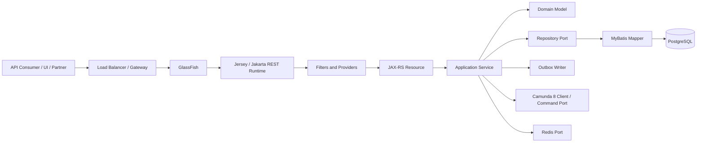
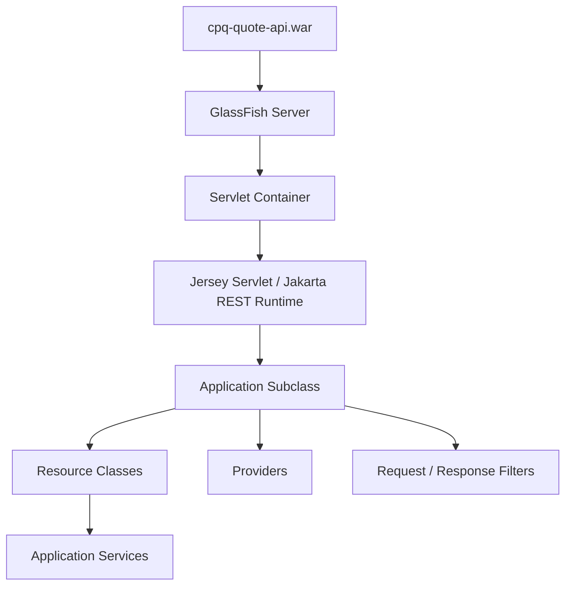
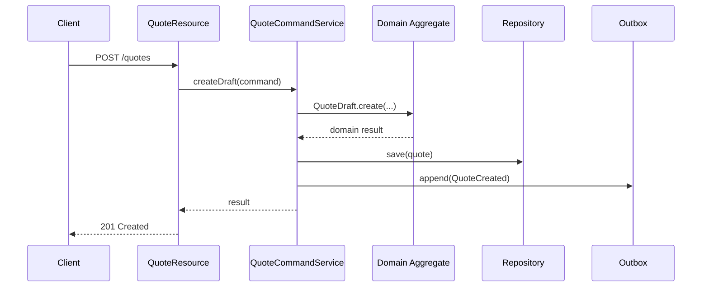
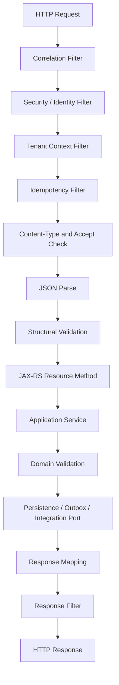
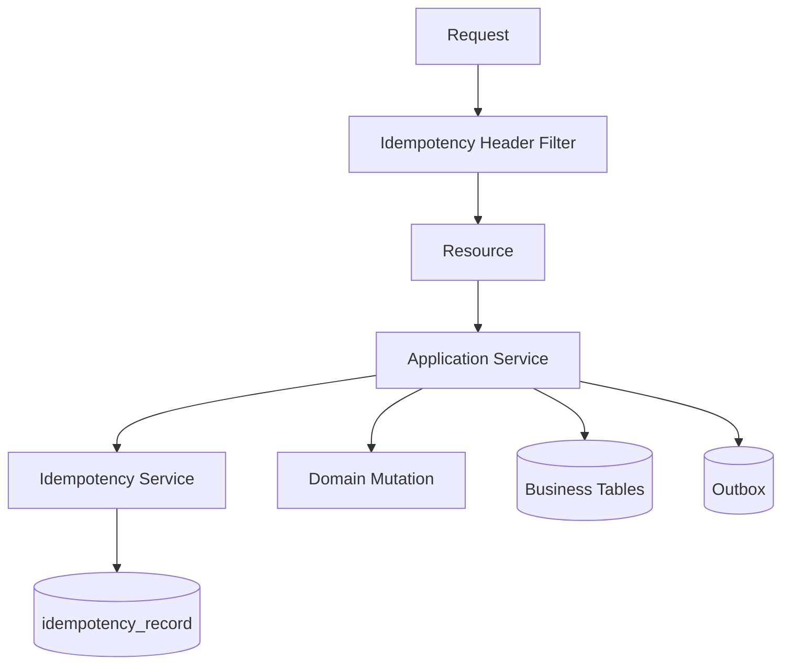
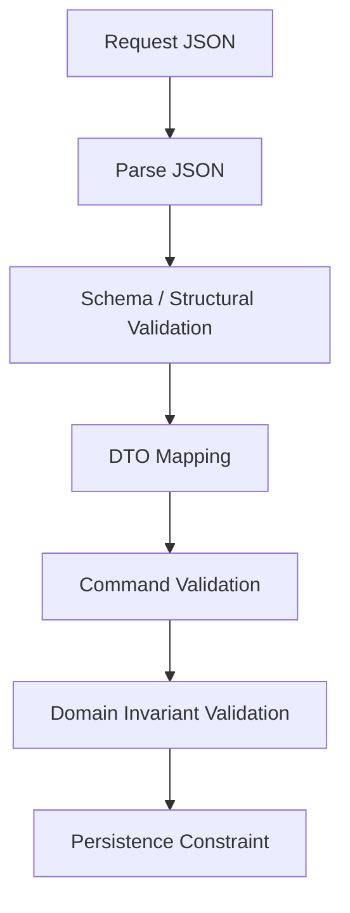
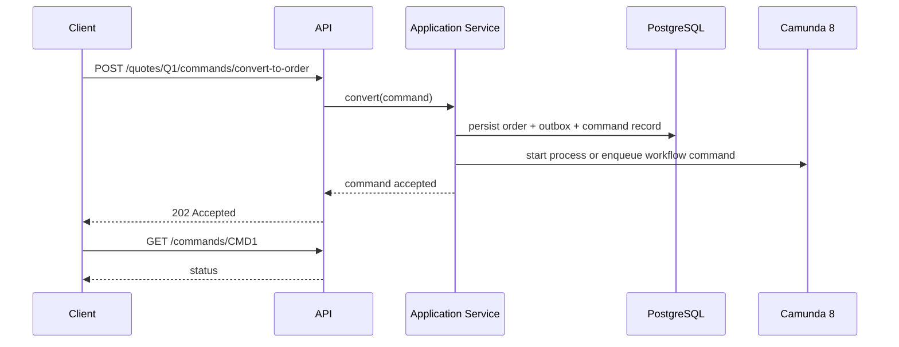
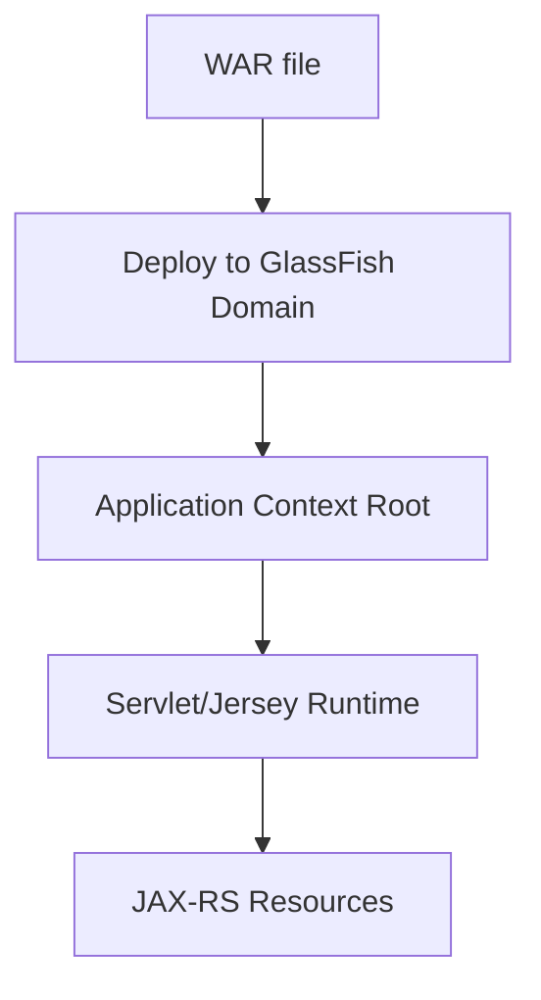

------
title: Build From Scratch: Enterprise Java Microservices CPQ & Order Management Platform - Part 019
description: Membangun baseline runtime Jakarta REST/JAX-RS, Jersey, dan GlassFish untuk service CPQ/OMS production-grade: request lifecycle, resource boundary, filters, providers, exception mapper, validation, correlation, security context, deployment, dan operational endpoint.
series: learn-enterprise-cpq-oms-glassfish-camunda8
seriesTitle: Build From Scratch: Enterprise Java Microservices CPQ & Order Management Platform
order: 19
partTitle: Jakarta REST, Jersey, and GlassFish Baseline
tags:
  - java
  - jakarta-rest
  - jax-rs
  - jersey
  - glassfish
  - microservices
  - cpq
  - oms
  - enterprise-architecture
date: 2026-07-02
------

# Part 019 — Jakarta REST, Jersey, and GlassFish Baseline

Kita sudah membangun domain backbone: catalog, configuration, pricing, quote, order, asset, invariant, API contract, JSON Schema, versioning, dan mapping eksternal. Sekarang kita turun ke runtime pertama: bagaimana service HTTP Java ini benar-benar hidup di atas **Jakarta REST/JAX-RS**, **Jersey**, dan **GlassFish**.

Bagian ini bukan tutorial membuat endpoint `HelloWorldResource`. Itu terlalu dangkal. Yang kita butuhkan adalah baseline service yang bisa bertahan ketika dipakai untuk CPQ/OMS enterprise:

- request masuk dengan correlation ID;
- tenant dan identity dibaca konsisten;
- idempotency disiapkan sebelum command dieksekusi;
- validation dilakukan berlapis;
- resource class tetap tipis;
- exception domain dipetakan ke error contract;
- response tidak bocor stack trace;
- deployment tidak bergantung pada kebetulan classpath;
- endpoint operasional dapat dipakai untuk support produksi;
- boundary antara HTTP, application service, persistence, Kafka, Redis, dan Camunda jelas.

Tujuan Part 019 adalah membuat **baseline mental model** dan **baseline code shape**. Implementasi detail database, Kafka, Camunda worker, Redis, dan CI/CD akan datang di part berikutnya.

---

## 1. Posisi Jakarta REST/Jersey/GlassFish Dalam Arsitektur

Di seri ini, HTTP service bukan pusat domain. HTTP service hanya pintu masuk.



Prinsip pentingnya:

> Jakarta REST/Jersey/GlassFish adalah runtime delivery mechanism, bukan tempat domain rule tinggal.

Resource class boleh tahu bahwa request datang lewat HTTP. Resource class tidak boleh menjadi tempat:

- pricing rule;
- quote lifecycle rule;
- order decomposition rule;
- approval routing rule;
- persistence mutation detail;
- Kafka serialization detail;
- Camunda BPMN coupling detail.

Resource class menerjemahkan HTTP menjadi command/query application layer.

---

## 2. Apa Itu Jakarta REST, Jersey, dan GlassFish Dalam Seri Ini?

Kita gunakan tiga layer runtime:

| Komponen | Peran Dalam Sistem |
|---|---|
| Jakarta REST / JAX-RS | API standar untuk menulis RESTful resource dengan annotation seperti `@Path`, `@GET`, `@POST`, `@Consumes`, `@Produces`. |
| Jersey | Implementasi Jakarta REST yang menjalankan resource, filter, provider, exception mapper, entity provider, dan request dispatching. |
| GlassFish | Jakarta EE application server yang menyediakan runtime untuk WAR, servlet container, CDI, transaction facility, datasource, deployment, dan operational administration. |

Secara mental model:



Kita tidak menaruh semua hal ke dalam satu framework magic. Kita ingin desain yang eksplisit.

---

## 3. Baseline Design Rule

Sebelum menulis kode, tetapkan aturan keras.

### Rule 1 — Resource class harus tipis

Resource class melakukan:

1. mapping path, method, media type;
2. membaca request DTO;
3. mengambil metadata request;
4. memanggil application service;
5. mengubah result menjadi response DTO.

Resource class tidak melakukan:

- query SQL langsung;
- rule pricing;
- perubahan state quote/order;
- publish Kafka langsung;
- start Camunda process langsung kecuali lewat application port;
- parsing JSON manual;
- catch semua exception tanpa taxonomy.

### Rule 2 — HTTP DTO bukan domain object

DTO request/response adalah kontrak API. Domain object adalah model bisnis internal.

Kesalahan umum:

```java
@Path("/quotes")
public class QuoteResource {
  @POST
  public Quote create(Quote quote) {
    quote.setStatus("DRAFT");
    quoteRepository.insert(quote);
    return quote;
  }
}
```

Masalahnya:

- `Quote` dipakai sebagai request DTO, entity database, dan domain aggregate sekaligus;
- status dimutasi di resource;
- repository dipanggil langsung;
- tidak ada idempotency;
- tidak ada audit context;
- tidak ada boundary error;
- tidak ada versioning contract.

Bentuk yang lebih benar:

```java
@Path("/quotes")
@Consumes(MediaType.APPLICATION_JSON)
@Produces(MediaType.APPLICATION_JSON)
public class QuoteResource {

  private final QuoteCommandService quoteCommandService;
  private final QuoteApiMapper mapper;

  @Inject
  public QuoteResource(
      QuoteCommandService quoteCommandService,
      QuoteApiMapper mapper
  ) {
    this.quoteCommandService = quoteCommandService;
    this.mapper = mapper;
  }

  @POST
  public Response createQuote(
      CreateQuoteRequest request,
      @Context HttpHeaders headers
  ) {
    RequestContext context = RequestContextExtractor.from(headers);
    CreateQuoteCommand command = mapper.toCommand(request, context);

    CreateQuoteResult result = quoteCommandService.createDraft(command);

    return Response
        .status(Response.Status.CREATED)
        .entity(mapper.toResponse(result))
        .header("Location", "/api/v1/quotes/" + result.quoteId().value())
        .build();
  }
}
```

Di sini resource hanya bridging.

### Rule 3 — Application service adalah transaction boundary

Untuk command seperti `create quote`, `submit quote`, `convert quote to order`, transaction boundary berada di application service, bukan resource.



HTTP boleh gagal setelah transaction commit. Karena itu event publication tidak boleh bergantung pada response HTTP sukses. Kita akan memakai outbox di part khusus.

### Rule 4 — Tidak semua request adalah REST resource mutation

Enterprise CPQ/OMS banyak memakai command operation:

- submit quote;
- approve quote;
- reject quote;
- convert quote to order;
- cancel order;
- retry fulfillment task;
- release hold;
- repair fallout.

Jangan memaksakan semua menjadi CRUD murni. Gunakan command sub-resource yang jelas.

Contoh:

```http
POST /api/v1/quotes/{quoteId}/commands/submit
POST /api/v1/quotes/{quoteId}/commands/convert-to-order
POST /api/v1/orders/{orderId}/commands/cancel
POST /api/v1/fulfillment-tasks/{taskId}/commands/retry
```

---

## 4. Request Lifecycle Yang Kita Mau

Baseline request lifecycle harus deterministik.



Tidak semua tahap harus diimplementasikan sebagai JAX-RS filter. Beberapa bisa berada di application service. Tapi urutan mentalnya penting.

### Kenapa correlation paling awal?

Karena semua error setelah itu harus punya `correlationId`.

Jika JSON invalid, auth gagal, tenant tidak valid, atau exception terjadi di provider, log tetap harus bisa dicari.

### Kenapa idempotency sebelum command?

Karena retry client, retry gateway, timeout, dan duplicate submit adalah normal di production.

Untuk command berbahaya seperti convert quote to order, kita tidak boleh berharap user tidak klik dua kali.

---

## 5. Baseline Package Structure Untuk Runtime HTTP

Untuk satu service quote API, package awal bisa seperti ini:

```text
com.acme.cpq.quote
├── api
│   ├── QuoteApplication.java
│   ├── resource
│   │   ├── QuoteResource.java
│   │   ├── QuoteCommandResource.java
│   │   └── QuoteSearchResource.java
│   ├── dto
│   │   ├── CreateQuoteRequest.java
│   │   ├── QuoteResponse.java
│   │   ├── SubmitQuoteRequest.java
│   │   └── ErrorResponse.java
│   ├── mapper
│   │   └── QuoteApiMapper.java
│   ├── filter
│   │   ├── CorrelationIdFilter.java
│   │   ├── TenantContextFilter.java
│   │   └── IdempotencyFilter.java
│   ├── provider
│   │   ├── DomainExceptionMapper.java
│   │   ├── ValidationExceptionMapper.java
│   │   ├── JsonParseExceptionMapper.java
│   │   └── GenericExceptionMapper.java
│   └── context
│       ├── RequestContext.java
│       └── RequestContextExtractor.java
├── application
│   ├── QuoteCommandService.java
│   ├── QuoteQueryService.java
│   └── command
├── domain
├── persistence
└── infrastructure
```

Part 020 akan membahas struktur module lebih lengkap. Di Part 019 kita fokus pada runtime API layer.

---

## 6. JAX-RS Application Class

Minimal baseline:

```java
package com.acme.cpq.quote.api;

import jakarta.ws.rs.ApplicationPath;
import jakarta.ws.rs.core.Application;

@ApplicationPath("/api/v1")
public class QuoteApplication extends Application {
}
```

Dengan `@ApplicationPath("/api/v1")`, semua resource di bawah application ini akan punya prefix `/api/v1`.

Contoh:

```java
@Path("/quotes")
public class QuoteResource {
  @GET
  public Response searchQuotes() { ... }
}
```

Maka endpoint menjadi:

```http
GET /<context-root>/api/v1/quotes
```

Dalam production, context root biasanya diatur saat deploy, misalnya:

```text
/cpq-quote-service
```

Maka URL penuh:

```http
GET /cpq-quote-service/api/v1/quotes
```

### Pilihan: package scanning vs explicit registration

`Application` kosong mengandalkan scanning. Untuk production, explicit registration sering lebih aman karena:

- resource yang aktif eksplisit;
- provider yang aktif eksplisit;
- test lebih mudah;
- mengurangi kejutan classpath.

Contoh:

```java
@ApplicationPath("/api/v1")
public class QuoteApplication extends ResourceConfig {

  public QuoteApplication() {
    register(QuoteResource.class);
    register(QuoteCommandResource.class);
    register(QuoteSearchResource.class);

    register(CorrelationIdFilter.class);
    register(TenantContextFilter.class);
    register(IdempotencyFilter.class);

    register(DomainExceptionMapper.class);
    register(ValidationExceptionMapper.class);
    register(JsonParseExceptionMapper.class);
    register(GenericExceptionMapper.class);
  }
}
```

Catatan desain:

- `ResourceConfig` adalah Jersey-specific.
- `Application` murni lebih portable.
- Untuk seri ini, kita boleh memakai Jersey-specific registration di boundary API module, bukan di domain/application layer.

Portability penting, tapi operational clarity juga penting.

---

## 7. Resource Class Shape

### 7.1 Query Resource

Query resource membaca data dan tidak membuat side effect.

```java
@Path("/quotes")
@Consumes(MediaType.APPLICATION_JSON)
@Produces(MediaType.APPLICATION_JSON)
public class QuoteSearchResource {

  private final QuoteQueryService quoteQueryService;
  private final QuoteApiMapper mapper;

  @Inject
  public QuoteSearchResource(
      QuoteQueryService quoteQueryService,
      QuoteApiMapper mapper
  ) {
    this.quoteQueryService = quoteQueryService;
    this.mapper = mapper;
  }

  @GET
  public QuoteSearchResponse search(
      @QueryParam("customerId") String customerId,
      @QueryParam("state") String state,
      @QueryParam("cursor") String cursor,
      @DefaultValue("50") @QueryParam("limit") int limit,
      @Context HttpHeaders headers
  ) {
    RequestContext context = RequestContextExtractor.from(headers);

    SearchQuotesQuery query = new SearchQuotesQuery(
        context,
        customerId,
        state,
        Cursor.fromNullable(cursor),
        PageLimit.of(limit)
    );

    QuoteSearchResult result = quoteQueryService.search(query);
    return mapper.toSearchResponse(result);
  }
}
```

Query resource boleh return DTO langsung bila status default `200 OK` cukup. Jika butuh headers, gunakan `Response`.

### 7.2 Command Resource

Command resource sebaiknya memakai `Response`, karena sering butuh:

- `201 Created`;
- `202 Accepted`;
- `Location`;
- `ETag`;
- `Idempotency-Key` echo;
- command tracking ID.

```java
@Path("/quotes/{quoteId}/commands")
@Consumes(MediaType.APPLICATION_JSON)
@Produces(MediaType.APPLICATION_JSON)
public class QuoteCommandResource {

  private final QuoteCommandService quoteCommandService;
  private final QuoteApiMapper mapper;

  @Inject
  public QuoteCommandResource(
      QuoteCommandService quoteCommandService,
      QuoteApiMapper mapper
  ) {
    this.quoteCommandService = quoteCommandService;
    this.mapper = mapper;
  }

  @POST
  @Path("/submit")
  public Response submit(
      @PathParam("quoteId") String quoteId,
      SubmitQuoteRequest request,
      @HeaderParam("If-Match") String ifMatch,
      @Context HttpHeaders headers
  ) {
    RequestContext context = RequestContextExtractor.from(headers);

    SubmitQuoteCommand command = mapper.toCommand(
        QuoteId.of(quoteId),
        request,
        VersionToken.fromIfMatch(ifMatch),
        context
    );

    SubmitQuoteResult result = quoteCommandService.submit(command);

    return Response.ok(mapper.toResponse(result))
        .tag(result.newVersion().asEtag())
        .build();
  }
}
```

### 7.3 Jangan Masukkan `HttpServletRequest` Ke Domain

Resource boleh memakai:

```java
@Context HttpHeaders headers
@Context UriInfo uriInfo
@Context SecurityContext securityContext
```

Tapi application service sebaiknya menerima `RequestContext`, bukan object HTTP.

Benar:

```java
public record RequestContext(
    CorrelationId correlationId,
    TenantId tenantId,
    Actor actor,
    IdempotencyKey idempotencyKey,
    Instant requestTime
) {}
```

Salah:

```java
public void submitQuote(HttpServletRequest request) { ... }
```

Kenapa salah?

Karena domain/application layer menjadi tidak bisa dipakai dari:

- Kafka consumer;
- Camunda worker;
- scheduled repair job;
- CLI backfill;
- integration test tanpa container web.

---

## 8. RequestContext: Metadata Yang Harus Hidup Dari Awal

Untuk CPQ/OMS, metadata request bukan dekorasi. Ia bagian dari audit dan safety.

```java
public record RequestContext(
    CorrelationId correlationId,
    TenantId tenantId,
    Actor actor,
    Channel channel,
    IdempotencyKey idempotencyKey,
    Instant receivedAt,
    String userAgent,
    String sourceIp
) {
  public boolean isSystemActor() {
    return actor.type() == ActorType.SYSTEM;
  }
}
```

Minimal header policy:

| Header | Required | Fungsi |
|---|---:|---|
| `X-Correlation-Id` | optional inbound, generated if missing | Trace request lintas service. |
| `X-Tenant-Id` | required untuk multi-tenant API | Tenant isolation. |
| `Authorization` | required untuk protected API | Identity/authentication. |
| `Idempotency-Key` | required untuk risky command | Retry safety. |
| `If-Match` | required untuk state-changing update tertentu | Optimistic concurrency. |

Contoh extractor:

```java
public final class RequestContextExtractor {

  private RequestContextExtractor() {}

  public static RequestContext from(HttpHeaders headers) {
    CorrelationId correlationId = CorrelationId.fromNullable(
        headers.getHeaderString("X-Correlation-Id")
    );

    TenantId tenantId = TenantId.required(
        headers.getHeaderString("X-Tenant-Id")
    );

    IdempotencyKey idempotencyKey = IdempotencyKey.fromNullable(
        headers.getHeaderString("Idempotency-Key")
    );

    return new RequestContext(
        correlationId,
        tenantId,
        Actor.anonymousUntilResolved(),
        Channel.API,
        idempotencyKey,
        Instant.now(),
        headers.getHeaderString("User-Agent"),
        null
    );
  }
}
```

Nanti identity sebaiknya diisi dari security filter, bukan dari resource manual.

---

## 9. Correlation Filter

Correlation ID harus masuk ke log context dan response header.

```java
@Provider
@Priority(Priorities.AUTHENTICATION - 100)
public class CorrelationIdFilter implements ContainerRequestFilter, ContainerResponseFilter {

  public static final String HEADER = "X-Correlation-Id";
  public static final String PROPERTY = "correlationId";

  @Override
  public void filter(ContainerRequestContext requestContext) {
    String incoming = requestContext.getHeaderString(HEADER);
    String correlationId = normalizeOrCreate(incoming);
    requestContext.setProperty(PROPERTY, correlationId);

    // In real implementation, also put this into MDC/log context.
  }

  @Override
  public void filter(
      ContainerRequestContext requestContext,
      ContainerResponseContext responseContext
  ) {
    Object correlationId = requestContext.getProperty(PROPERTY);
    if (correlationId != null) {
      responseContext.getHeaders().putSingle(HEADER, correlationId.toString());
    }
  }

  private String normalizeOrCreate(String incoming) {
    if (incoming == null || incoming.isBlank()) {
      return UUID.randomUUID().toString();
    }
    return incoming.trim();
  }
}
```

Production notes:

- validasi panjang header agar tidak jadi log injection;
- jangan percaya correlation ID sebagai security identity;
- propagate ke Kafka event metadata;
- propagate ke Camunda process variables;
- masukkan ke audit log;
- gunakan di error response.

---

## 10. Tenant Context Filter

Multi-tenancy harus jelas sejak request boundary.

```java
@Provider
@Priority(Priorities.AUTHENTICATION + 10)
public class TenantContextFilter implements ContainerRequestFilter {

  public static final String HEADER = "X-Tenant-Id";
  public static final String PROPERTY = "tenantId";

  @Override
  public void filter(ContainerRequestContext requestContext) {
    String tenantId = requestContext.getHeaderString(HEADER);

    if (tenantId == null || tenantId.isBlank()) {
      throw new ApiContractException(
          "TENANT_REQUIRED",
          "Tenant header is required",
          "Header X-Tenant-Id must be provided."
      );
    }

    requestContext.setProperty(PROPERTY, tenantId.trim());
  }
}
```

Tenant context harus mempengaruhi:

- authorization;
- query filter;
- persistence write;
- outbox event metadata;
- Redis key namespace;
- Camunda business key/process variable;
- audit log;
- idempotency record.

Tidak cukup hanya membaca tenant di API dan lupa di repository.

---

## 11. Security Context Baseline

Part ini tidak membangun full OAuth/OIDC. Tapi baseline desainnya harus benar.

API layer menghasilkan `Actor`:

```java
public record Actor(
    ActorId actorId,
    ActorType type,
    Set<String> roles,
    Set<String> permissions
) {}
```

Application service menerima actor lewat `RequestContext` dan melakukan authorization bisnis.

Contoh:

```java
public SubmitQuoteResult submit(SubmitQuoteCommand command) {
  authorizationPolicy.requirePermission(
      command.context().actor(),
      Permission.SUBMIT_QUOTE,
      command.quoteId(),
      command.context().tenantId()
  );

  Quote quote = quoteRepository.getForUpdate(command.quoteId(), command.context().tenantId());
  quote.submit(command.expectedVersion(), command.context().actor());

  quoteRepository.save(quote);
  outbox.append(QuoteSubmittedEvent.from(quote, command.context()));
  return SubmitQuoteResult.from(quote);
}
```

Kenapa authorization tidak cukup di filter?

Karena banyak policy membutuhkan data domain:

- quote owner;
- quote state;
- approval role;
- price override amount;
- tenant;
- sales channel;
- account segment;
- manual repair privilege.

Filter hanya cocok untuk authentication dan coarse access, bukan semua business authorization.

---

## 12. Idempotency Filter vs Idempotency Service

Jangan taruh seluruh idempotency logic di filter. Filter bisa mengecek header, tapi command idempotency perlu transaction dan DB.



Filter responsibility:

- memastikan command tertentu punya `Idempotency-Key`;
- reject format buruk;
- attach key ke context.

Application service responsibility:

- lock/insert idempotency record;
- detect duplicate in-progress request;
- return stored response for completed duplicate;
- ensure same idempotency key tidak dipakai untuk request payload berbeda;
- commit business mutation dan idempotency result atomically.

Contoh filter ringan:

```java
@Provider
@Priority(Priorities.HEADER_DECORATOR)
public class IdempotencyFilter implements ContainerRequestFilter {

  @Override
  public void filter(ContainerRequestContext requestContext) {
    String method = requestContext.getMethod();
    String path = requestContext.getUriInfo().getPath();

    if (requiresIdempotency(method, path)) {
      String key = requestContext.getHeaderString("Idempotency-Key");
      if (key == null || key.isBlank()) {
        throw new ApiContractException(
            "IDEMPOTENCY_KEY_REQUIRED",
            "Idempotency key is required",
            "Provide Idempotency-Key for this command."
        );
      }
    }
  }

  private boolean requiresIdempotency(String method, String path) {
    return "POST".equals(method)
        && (path.contains("/commands/") || path.equals("quotes"));
  }
}
```

Nanti Part 023 dan Part 046 akan membahas idempotency lebih dalam.

---

## 13. Content Negotiation dan Media Type Discipline

Semua JSON endpoint harus eksplisit:

```java
@Consumes(MediaType.APPLICATION_JSON)
@Produces(MediaType.APPLICATION_JSON)
```

Untuk API versioning yang lebih ketat, bisa memakai vendor media type:

```http
Accept: application/vnd.acme.cpq.quote.v1+json
Content-Type: application/vnd.acme.cpq.quote.v1+json
```

Namun untuk seri ini baseline utama tetap:

```http
/api/v1 + application/json
```

Alasannya:

- lebih sederhana untuk local dev;
- mudah dipakai contract test;
- kompatibel dengan tooling OpenAPI;
- versioning sudah dibahas di Part 017.

Jika memakai vendor media type, jangan lakukan setengah-setengah. Semua gateway, OpenAPI, tests, clients, logs, dan error response harus paham.

---

## 14. DTO Design Di API Layer

DTO harus plain, stabil, dan dekat dengan OpenAPI schema.

Contoh request:

```java
public record CreateQuoteRequest(
    String customerId,
    String salesChannel,
    List<CreateQuoteItemRequest> items,
    Map<String, Object> attributes
) {}

public record CreateQuoteItemRequest(
    String productOfferingId,
    String action,
    Integer quantity,
    Map<String, Object> configuration
) {}
```

Contoh response:

```java
public record QuoteResponse(
    String quoteId,
    String state,
    Integer version,
    String customerId,
    List<QuoteItemResponse> items,
    MoneyResponse totalOneTimeCharge,
    MoneyResponse totalRecurringCharge,
    OffsetDateTime validUntil,
    List<LinkResponse> links
) {}
```

### DTO rule

DTO boleh punya:

- string ID;
- enum/string state sesuai API contract;
- timestamp ISO-8601;
- nested response;
- link;
- error details;
- optional API extension field jika memang dirancang.

DTO tidak boleh punya:

- MyBatis annotation;
- SQL-related field;
- Camunda job key;
- Kafka topic;
- internal DB surrogate key;
- mutable domain logic;
- persistence lifecycle method.

---

## 15. Mapper API: Tempat Terjemahan Kontrak

Kita butuh mapper eksplisit.

```java
public class QuoteApiMapper {

  public CreateQuoteCommand toCommand(
      CreateQuoteRequest request,
      RequestContext context
  ) {
    return new CreateQuoteCommand(
        context,
        CustomerId.of(request.customerId()),
        SalesChannel.of(request.salesChannel()),
        request.items().stream().map(this::toCommandItem).toList(),
        AttributeBag.from(request.attributes())
    );
  }

  private CreateQuoteCommandItem toCommandItem(CreateQuoteItemRequest item) {
    return new CreateQuoteCommandItem(
        ProductOfferingId.of(item.productOfferingId()),
        OrderAction.fromApi(item.action()),
        Quantity.ofNullable(item.quantity()),
        ConfigurationInput.fromMap(item.configuration())
    );
  }

  public QuoteResponse toResponse(QuoteView view) {
    return new QuoteResponse(
        view.quoteId().value(),
        view.state().apiValue(),
        view.version().value(),
        view.customerId().value(),
        view.items().stream().map(this::toItemResponse).toList(),
        toMoney(view.totalOneTimeCharge()),
        toMoney(view.totalRecurringCharge()),
        view.validUntil(),
        LinkFactory.quoteLinks(view)
    );
  }
}
```

Mapper bukan tempat rule. Mapper tempat type conversion.

Jika mapper mulai punya `if state == APPROVED then calculate price`, itu smell.

---

## 16. Validation Layering

Validation di CPQ/OMS harus berlapis.



| Layer | Contoh Validasi | Error Type |
|---|---|---|
| JSON parse | malformed JSON | `INVALID_JSON` |
| Schema | missing `customerId`, invalid enum | `VALIDATION_FAILED` |
| DTO mapping | invalid ID format | `INVALID_FIELD` |
| Command validation | item list empty | `COMMAND_REJECTED` |
| Domain invariant | quote already submitted | `INVALID_STATE_TRANSITION` |
| DB constraint | duplicate external ref | `CONFLICT` |

Jangan berharap Bean Validation saja cukup.

Contoh DTO validation:

```java
public record SubmitQuoteRequest(
    @NotBlank String reason,
    @Size(max = 1000) String comment
) {}
```

Tapi rule seperti “quote cannot be submitted if price is stale” harus di domain/application layer.

```java
public void submit(VersionToken expectedVersion, Actor actor) {
  requireState(QuoteState.DRAFT, QuoteState.PRICED);
  requireNotExpired();
  requirePriceSnapshotCurrent();
  requireConfigurationValid();

  this.state = QuoteState.SUBMITTED;
  this.submittedBy = actor.actorId();
  this.submittedAt = Instant.now();
}
```

---

## 17. Exception Taxonomy

Exception production-grade tidak boleh random.

```text
ApiContractException
├── MissingHeaderException
├── InvalidJsonException
├── ValidationFailureException
DomainException
├── InvalidStateTransitionException
├── InvariantViolationException
├── PricingException
├── ConfigurationException
ApplicationException
├── IdempotencyConflictException
├── OptimisticLockConflictException
├── AuthorizationDeniedException
InfrastructureException
├── DatabaseUnavailableException
├── KafkaPublishException
├── RedisUnavailableException
├── WorkflowCommandException
```

Mapping umum:

| Exception | HTTP Status |
|---|---:|
| Invalid JSON | 400 |
| Schema/field validation failed | 400 |
| Authentication failed | 401 |
| Authorization denied | 403 |
| Resource not found | 404 |
| State conflict / optimistic lock | 409 |
| Stale version / `If-Match` mismatch | 412 |
| Unsupported media type | 415 |
| Semantic validation failed | 422 |
| Rate limited | 429 |
| Unexpected error | 500 |
| Dependency unavailable | 503 |

### Domain exception example

```java
public class InvalidStateTransitionException extends DomainException {

  private final String entityType;
  private final String entityId;
  private final String currentState;
  private final String attemptedTransition;

  public InvalidStateTransitionException(
      String entityType,
      String entityId,
      String currentState,
      String attemptedTransition
  ) {
    super("INVALID_STATE_TRANSITION", "Invalid state transition");
    this.entityType = entityType;
    this.entityId = entityId;
    this.currentState = currentState;
    this.attemptedTransition = attemptedTransition;
  }
}
```

---

## 18. ExceptionMapper Baseline

JAX-RS provider dapat memetakan exception menjadi response.

```java
@Provider
public class DomainExceptionMapper implements ExceptionMapper<DomainException> {

  @Context
  private HttpServletRequest servletRequest;

  @Override
  public Response toResponse(DomainException exception) {
    ErrorResponse error = ErrorResponse.from(
        exception.code(),
        exception.message(),
        correlationIdFrom(servletRequest),
        detailsFrom(exception)
    );

    return Response
        .status(statusFor(exception))
        .type(MediaType.APPLICATION_JSON_TYPE)
        .entity(error)
        .build();
  }

  private int statusFor(DomainException exception) {
    if (exception instanceof InvalidStateTransitionException) {
      return 409;
    }
    if (exception instanceof InvariantViolationException) {
      return 422;
    }
    return 400;
  }
}
```

Error response shape harus sama dengan Part 015.

```java
public record ErrorResponse(
    String type,
    String title,
    int status,
    String code,
    String detail,
    String correlationId,
    List<FieldViolationResponse> violations
) {}
```

Contoh response:

```json
{
  "type": "https://api.acme.example/problems/invalid-state-transition",
  "title": "Invalid state transition",
  "status": 409,
  "code": "INVALID_STATE_TRANSITION",
  "detail": "Quote Q-10001 cannot be submitted from EXPIRED state.",
  "correlationId": "4acb4a0e-7d26-4bbd-86b8-5c6f6c8c8c11",
  "violations": []
}
```

### Generic exception mapper

Generic mapper harus paling hati-hati.

```java
@Provider
public class GenericExceptionMapper implements ExceptionMapper<Throwable> {

  @Override
  public Response toResponse(Throwable exception) {
    // Log full exception internally with correlation ID.

    ErrorResponse error = new ErrorResponse(
        "https://api.acme.example/problems/internal-error",
        "Internal server error",
        500,
        "INTERNAL_ERROR",
        "An unexpected error occurred.",
        CurrentCorrelationId.getOrUnknown(),
        List.of()
    );

    return Response.status(500)
        .type(MediaType.APPLICATION_JSON_TYPE)
        .entity(error)
        .build();
  }
}
```

Jangan return:

- stack trace;
- SQL query;
- environment variable;
- Kafka broker address;
- internal host;
- Java class name detail;
- full Camunda error payload.

---

## 19. Response Builder Helpers

Agar resource class tidak kotor, buat helper.

```java
public final class ApiResponses {

  private ApiResponses() {}

  public static Response created(String location, Object body, VersionToken version) {
    return Response.created(URI.create(location))
        .entity(body)
        .tag(version.asEtag())
        .build();
  }

  public static Response accepted(CommandAcceptedResponse body) {
    return Response.accepted(body).build();
  }

  public static Response ok(Object body, VersionToken version) {
    return Response.ok(body)
        .tag(version.asEtag())
        .build();
  }
}
```

Command yang synchronous:

```java
return ApiResponses.ok(mapper.toResponse(result), result.version());
```

Command yang asynchronous:

```java
return ApiResponses.accepted(new CommandAcceptedResponse(
    result.commandId().value(),
    result.resourceId().value(),
    result.statusUrl()
));
```

---

## 20. Synchronous vs Asynchronous HTTP Boundary

CPQ/OMS punya operasi cepat dan lambat.

### Synchronous cocok untuk:

- create draft quote;
- get quote;
- search quote;
- validate configuration;
- simulate price jika latency terkendali;
- submit quote jika approval evaluation ringan;
- read order status.

### Asynchronous cocok untuk:

- convert quote to order jika memicu orchestration;
- order decomposition;
- provisioning;
- cancellation kompleks;
- manual repair/retry yang menjalankan workflow;
- bulk repricing;
- large catalog import.



Jangan tahan HTTP request selama workflow fulfillment berjalan.

---

## 21. Operational Endpoints

Sediakan endpoint operasional minimal. Jangan campur dengan business API publik.

Contoh path:

```http
GET /internal/health/live
GET /internal/health/ready
GET /internal/info
GET /internal/build
```

Jika memakai MicroProfile Health nanti, bisa distandarkan. Tetapi baseline konsepnya:

| Endpoint | Makna |
|---|---|
| live | Proses masih hidup. Tidak perlu cek database berat. |
| ready | Service siap menerima traffic. Cek dependency penting secara ringan. |
| info/build | Version, build hash, service name, profile. |

Contoh resource sederhana:

```java
@Path("/internal/health")
@Produces(MediaType.APPLICATION_JSON)
public class HealthResource {

  private final ReadinessProbe readinessProbe;

  @Inject
  public HealthResource(ReadinessProbe readinessProbe) {
    this.readinessProbe = readinessProbe;
  }

  @GET
  @Path("/live")
  public Map<String, String> live() {
    return Map.of("status", "UP");
  }

  @GET
  @Path("/ready")
  public Response ready() {
    ReadinessStatus status = readinessProbe.check();
    return Response.status(status.isReady() ? 200 : 503)
        .entity(status.toResponse())
        .build();
  }
}
```

Readiness check jangan melakukan full table scan atau call lambat.

---

## 22. GlassFish Deployment Mental Model

Untuk API service berbasis Jakarta EE, unit deploy umum adalah WAR.

```text
cpq-quote-api.war
├── WEB-INF
│   ├── classes
│   └── lib
├── META-INF
└── static resources jika ada
```

Di GlassFish:



Contoh deployment konseptual:

```bash
asadmin deploy --contextroot cpq-quote-service target/cpq-quote-api.war
```

Untuk local dev, bisa ada domain GlassFish lokal. Untuk production, deployment biasanya melalui CI/CD dan container image.

### Classloading caution

Application server sudah menyediakan banyak Jakarta EE API/runtime. Karena itu dependency scope harus diperhatikan.

Contoh Maven dependency API Jakarta EE biasanya `provided`:

```xml
<dependency>
  <groupId>jakarta.platform</groupId>
  <artifactId>jakarta.jakartaee-api</artifactId>
  <version>11.0.0</version>
  <scope>provided</scope>
</dependency>
```

Prinsip:

- API Jakarta EE disediakan server;
- library aplikasi sendiri masuk WAR;
- jangan bundling versi Jersey berbeda tanpa alasan jelas;
- hindari dependency hell antara `javax.*` dan `jakarta.*`;
- semua code baru gunakan namespace `jakarta.*`.

---

## 23. CDI Injection Boundary

Gunakan constructor injection bila runtime mendukung. Untuk sebagian Jakarta EE/Jersey setup, default constructor dan field injection sering lebih gampang, tapi constructor injection lebih testable.

Contoh:

```java
@RequestScoped
public class QuoteCommandService {

  private final QuoteRepository quoteRepository;
  private final OutboxPort outboxPort;
  private final TransactionRunner transactionRunner;

  @Inject
  public QuoteCommandService(
      QuoteRepository quoteRepository,
      OutboxPort outboxPort,
      TransactionRunner transactionRunner
  ) {
    this.quoteRepository = quoteRepository;
    this.outboxPort = outboxPort;
    this.transactionRunner = transactionRunner;
  }
}
```

Scope guideline:

| Component | Suggested Scope |
|---|---|
| Resource | request scoped or per-request default |
| Application service | request scoped/stateless |
| Mapper | application scoped/stateless |
| Repository | request scoped/stateless wrapper |
| MyBatis session | per transaction/request, not singleton mutable |
| Config provider | application scoped |
| HTTP clients | application scoped with safe pooling |

Jangan simpan request-specific mutable state di singleton.

---

## 24. Transaction Handling Baseline

Ada beberapa cara transaction di Jakarta EE:

- container-managed transaction;
- JTA;
- manual transaction runner;
- datasource-managed transaction;
- integration with MyBatis transaction manager.

Untuk seri ini, mental model utamanya:

```java
public CreateQuoteResult createDraft(CreateQuoteCommand command) {
  return transactionRunner.required(() -> {
    IdempotencyDecision decision = idempotencyService.begin(command);
    if (decision.isReplay()) {
      return decision.replayedResult(CreateQuoteResult.class);
    }

    Quote quote = Quote.createDraft(...);
    quoteRepository.insert(quote);
    outboxPort.append(QuoteCreatedEvent.from(quote, command.context()));

    CreateQuoteResult result = CreateQuoteResult.from(quote);
    idempotencyService.complete(command, result);
    return result;
  });
}
```

Resource tidak membuka transaction. Resource tidak commit. Resource tidak rollback manual.

Kenapa?

Karena transaction harus meliputi:

- idempotency record;
- business table mutation;
- audit row;
- outbox row;
- optimistic version update.

Jika resource mengatur transaction, application service sulit dipakai dari non-HTTP entry point.

---

## 25. JSON Provider Choice

Dalam Jakarta EE/Jersey environment, JSON dapat ditangani oleh provider seperti JSON-B atau Jackson tergantung konfigurasi. Pilih satu dan konsisten.

Yang penting bukan nama library-nya, tapi policy:

- unknown field policy jelas;
- null handling jelas;
- enum serialization jelas;
- timestamp format jelas;
- BigDecimal precision aman;
- Money tidak jadi floating point;
- error parse dipetakan konsisten;
- DTO record/class kompatibel dengan provider.

Untuk CPQ pricing, jangan pakai `double` untuk uang.

Benar:

```java
public record MoneyResponse(
    String currency,
    String amount
) {}
```

Atau internal:

```java
public record Money(
    CurrencyCode currency,
    BigDecimal amount
) {}
```

Response bisa string agar presisi tidak rusak di client tertentu.

---

## 26. Logging Policy Di API Layer

Log API harus cukup untuk debugging, tapi tidak membocorkan data sensitif.

Log minimal per request:

- timestamp;
- service name;
- environment;
- correlation ID;
- tenant ID;
- actor ID jika ada;
- method;
- path template, bukan full path raw bila mengandung data sensitif;
- status;
- latency;
- error code;
- command ID jika ada;
- quote/order ID jika relevan.

Jangan log:

- full Authorization header;
- password/token;
- raw payment data;
- full customer PII;
- full product configuration bila sensitif;
- entire request body untuk semua endpoint;
- stack trace ke response.

Contoh response filter bisa mencatat status dan latency.

```java
@Provider
public class RequestLoggingFilter implements ContainerRequestFilter, ContainerResponseFilter {

  private static final String START_TIME = "startTimeNanos";

  @Override
  public void filter(ContainerRequestContext requestContext) {
    requestContext.setProperty(START_TIME, System.nanoTime());
  }

  @Override
  public void filter(ContainerRequestContext requestContext, ContainerResponseContext responseContext) {
    Long start = (Long) requestContext.getProperty(START_TIME);
    long durationMs = start == null ? -1 : (System.nanoTime() - start) / 1_000_000;

    // Use structured logger in real implementation.
    System.out.printf(
        "method=%s path=%s status=%d durationMs=%d%n",
        requestContext.getMethod(),
        requestContext.getUriInfo().getPath(),
        responseContext.getStatus(),
        durationMs
    );
  }
}
```

Di production, ganti `System.out` dengan structured logging.

---

## 27. Resource Path Baseline Untuk Seri

Kita akan menggunakan baseline path berikut.

```text
/api/v1/catalogs
/api/v1/product-offerings
/api/v1/product-offerings/{id}/configuration-model
/api/v1/configurations/commands/validate
/api/v1/prices/commands/simulate
/api/v1/quotes
/api/v1/quotes/{quoteId}
/api/v1/quotes/{quoteId}/commands/submit
/api/v1/quotes/{quoteId}/commands/approve
/api/v1/quotes/{quoteId}/commands/reject
/api/v1/quotes/{quoteId}/commands/convert-to-order
/api/v1/orders
/api/v1/orders/{orderId}
/api/v1/orders/{orderId}/commands/cancel
/api/v1/orders/{orderId}/fulfillment-plan
/api/v1/fulfillment-tasks/{taskId}/commands/retry
/api/v1/assets
/api/v1/subscriptions
/internal/health/live
/internal/health/ready
```

Path tidak boleh membocorkan:

```text
/camunda/process-instance/{key}
/kafka/topics/order-created
/mybatis/mapper/selectQuote
/database/quote_table/{id}
```

Internal implementation bukan public resource.

---

## 28. ETag dan Optimistic Concurrency

Untuk mutation stateful, gunakan version token.

Response:

```http
ETag: "quote-version-7"
```

Request mutation:

```http
If-Match: "quote-version-7"
```

Resource mapping:

```java
@POST
@Path("/{quoteId}/commands/submit")
public Response submit(
    @PathParam("quoteId") String quoteId,
    @HeaderParam("If-Match") String ifMatch,
    SubmitQuoteRequest request,
    @Context HttpHeaders headers
) {
  SubmitQuoteCommand command = mapper.toSubmitCommand(
      quoteId,
      ifMatch,
      request,
      RequestContextExtractor.from(headers)
  );

  SubmitQuoteResult result = quoteCommandService.submit(command);

  return Response.ok(mapper.toResponse(result))
      .tag(result.version().asEtag())
      .build();
}
```

Domain/application layer tetap harus memverifikasi version terhadap database. Header hanya input.

---

## 29. Don’t Leak Runtime Details Into Contract

Jangan return response seperti ini:

```json
{
  "quoteId": "Q-10001",
  "camundaProcessInstanceKey": "2251799813685251",
  "kafkaPartition": 3,
  "mybatisStatement": "QuoteMapper.selectById"
}
```

Itu bocor.

Lebih baik:

```json
{
  "quoteId": "Q-10001",
  "state": "ORDER_CONVERSION_STARTED",
  "commandId": "CMD-90001",
  "links": [
    {
      "rel": "command-status",
      "href": "/api/v1/commands/CMD-90001"
    },
    {
      "rel": "order",
      "href": "/api/v1/orders/O-70001"
    }
  ]
}
```

Internal runtime identifier boleh disimpan di database untuk support, tapi tidak menjadi public contract.

---

## 30. Minimal WAR Configuration

Jika memakai Servlet 3+ style, banyak konfigurasi bisa annotation-based. Namun beberapa file tetap berguna.

Contoh struktur:

```text
src/main/webapp
└── WEB-INF
    ├── web.xml optional
    └── glassfish-web.xml optional
```

`glassfish-web.xml` bisa mengatur context root atau classloader behavior jika diperlukan.

Contoh konseptual:

```xml
<?xml version="1.0" encoding="UTF-8"?>
<!DOCTYPE glassfish-web-app PUBLIC
  "-//GlassFish.org//DTD GlassFish Application Server 3.1 Servlet 3.0//EN"
  "http://glassfish.org/dtds/glassfish-web-app_3_0-1.dtd">
<glassfish-web-app>
  <context-root>/cpq-quote-service</context-root>
</glassfish-web-app>
```

Dalam CI/CD modern, context root sering diatur saat deploy, bukan hardcoded di artifact. Pilih satu policy.

---

## 31. Local Development Baseline

Minimum local services untuk API runtime:

```text
GlassFish
PostgreSQL
Redis
Kafka
Camunda 8 / Zeebe
```

Tapi jangan semua wajib untuk menjalankan health endpoint atau unit test.

Layered local mode:

| Mode | Tujuan |
|---|---|
| unit | domain/application tanpa GlassFish |
| API slice | resource + mapper + exception mapper |
| integration | GlassFish + PostgreSQL |
| full stack | GlassFish + PostgreSQL + Kafka + Redis + Camunda 8 |

Part testing nanti akan memperdalam ini.

---

## 32. Baseline Smoke Test

Minimal endpoint:

```java
@Path("/internal/info")
@Produces(MediaType.APPLICATION_JSON)
public class InfoResource {

  @GET
  public Map<String, String> info() {
    return Map.of(
        "service", "cpq-quote-service",
        "version", BuildInfo.version(),
        "commit", BuildInfo.commit(),
        "runtime", "glassfish"
    );
  }
}
```

Smoke test:

```bash
curl -i http://localhost:8080/cpq-quote-service/internal/info
```

Expected:

```http
HTTP/1.1 200 OK
Content-Type: application/json
```

```json
{
  "service": "cpq-quote-service",
  "version": "0.1.0-SNAPSHOT",
  "commit": "local",
  "runtime": "glassfish"
}
```

---

## 33. First Production-Grade Resource: Create Quote Draft

Gabungkan baseline.

```java
@Path("/quotes")
@Consumes(MediaType.APPLICATION_JSON)
@Produces(MediaType.APPLICATION_JSON)
public class QuoteResource {

  private final QuoteCommandService commandService;
  private final QuoteQueryService queryService;
  private final QuoteApiMapper mapper;

  @Inject
  public QuoteResource(
      QuoteCommandService commandService,
      QuoteQueryService queryService,
      QuoteApiMapper mapper
  ) {
    this.commandService = commandService;
    this.queryService = queryService;
    this.mapper = mapper;
  }

  @POST
  public Response create(
      CreateQuoteRequest request,
      @Context HttpHeaders headers,
      @Context UriInfo uriInfo
  ) {
    RequestContext context = RequestContextExtractor.from(headers);
    CreateQuoteCommand command = mapper.toCreateCommand(request, context);

    CreateQuoteResult result = commandService.createDraft(command);
    QuoteResponse response = mapper.toResponse(result.quote());

    URI location = uriInfo.getAbsolutePathBuilder()
        .path(result.quote().quoteId().value())
        .build();

    return Response.created(location)
        .entity(response)
        .tag(result.quote().version().asEtag())
        .build();
  }

  @GET
  @Path("/{quoteId}")
  public Response get(
      @PathParam("quoteId") String quoteId,
      @Context HttpHeaders headers
  ) {
    RequestContext context = RequestContextExtractor.from(headers);
    QuoteView view = queryService.getQuote(QuoteId.of(quoteId), context);

    return Response.ok(mapper.toResponse(view))
        .tag(view.version().asEtag())
        .build();
  }
}
```

Masih banyak yang belum lengkap, tapi shape-nya benar:

- HTTP context dibaca di edge;
- command dibuat eksplisit;
- app service dipanggil;
- response contract dikembalikan;
- ETag disediakan;
- location disediakan;
- tidak ada SQL di resource;
- tidak ada Kafka di resource;
- tidak ada Camunda di resource.

---

## 34. Common Failure Modes Di API Runtime

### Failure 1 — Resource terlalu pintar

Gejala:

- resource punya 300 baris;
- resource membuka transaction;
- resource melakukan SQL;
- resource punya rule state;
- resource publish event.

Dampak:

- sulit test;
- sulit dipakai worker;
- duplicate logic;
- audit tidak konsisten.

Fix:

- pindahkan logic ke application/domain;
- resource hanya mapping.

### Failure 2 — DTO jadi entity database

Gejala:

- field API sama dengan kolom DB;
- response berisi internal ID;
- perubahan DB memecahkan API.

Fix:

- pisahkan API DTO, domain model, persistence record.

### Failure 3 — Exception mapper terlalu umum

Gejala:

- semua error 500;
- semua error 400;
- client tidak bisa membedakan invalid input vs conflict.

Fix:

- taxonomy exception;
- mapper per family;
- error code stabil.

### Failure 4 — Tidak ada request metadata

Gejala:

- log tidak bisa ditelusuri;
- support tidak tahu siapa submit quote;
- audit bolong;
- event tidak punya causation.

Fix:

- RequestContext sejak boundary;
- propagate ke domain event/outbox.

### Failure 5 — GlassFish classpath conflict

Gejala:

- runtime error `ClassNotFoundException`;
- `NoSuchMethodError`;
- Jakarta/Jersey version mismatch;
- deploy sukses tapi request gagal.

Fix:

- gunakan dependency `provided` untuk Jakarta EE API;
- jangan campur `javax.*` dan `jakarta.*`;
- audit dependency tree;
- pastikan target Jakarta EE version sesuai server.

---

## 35. Checklist Baseline Runtime

Sebelum lanjut ke service packaging, baseline API runtime harus memenuhi checklist ini.

### HTTP contract

- [ ] `@ApplicationPath` jelas.
- [ ] Semua resource punya `@Produces` dan `@Consumes` yang eksplisit.
- [ ] API prefix memakai `/api/v1`.
- [ ] Internal endpoint tidak bercampur dengan public endpoint.
- [ ] Command endpoint tidak dipaksa menjadi CRUD palsu.

### Request metadata

- [ ] Correlation ID tersedia di response dan log.
- [ ] Tenant ID dibaca dan dipropagate.
- [ ] Actor/identity masuk ke RequestContext.
- [ ] Idempotency key tersedia untuk risky command.
- [ ] `If-Match` dipakai untuk mutation yang membutuhkan version guard.

### Resource design

- [ ] Resource tidak membuka SQL.
- [ ] Resource tidak publish Kafka.
- [ ] Resource tidak start workflow langsung tanpa application port.
- [ ] Resource tidak berisi business rule.
- [ ] Resource memanggil application service.

### Error handling

- [ ] Domain exception dipetakan ke status tepat.
- [ ] Validation error punya field violations.
- [ ] Generic exception tidak membocorkan detail internal.
- [ ] Error response punya correlation ID.
- [ ] Error code stabil dan terdokumentasi.

### Deployment

- [ ] WAR packaging jelas.
- [ ] Jakarta EE API dependency `provided`.
- [ ] Tidak mencampur `javax.*` dan `jakarta.*`.
- [ ] Context root jelas.
- [ ] Health endpoint tersedia.

---

## 36. Mini Exercise

Bangun skeleton `cpq-quote-api` dengan endpoint berikut:

```http
GET /internal/info
GET /internal/health/live
POST /api/v1/quotes
GET /api/v1/quotes/{quoteId}
POST /api/v1/quotes/{quoteId}/commands/submit
```

Untuk exercise ini, application service boleh in-memory dulu, tapi tetap ikuti boundary:

- resource -> mapper -> command/query service;
- service -> fake repository;
- domain object terpisah dari DTO;
- exception mapper aktif;
- correlation filter aktif;
- tenant header wajib untuk `/api/v1/*`;
- internal endpoint tidak butuh tenant.

Acceptance criteria:

1. request tanpa `X-Tenant-Id` ke `/api/v1/quotes` menghasilkan 400/401/403 sesuai policy, bukan 500;
2. malformed JSON menghasilkan error contract stabil;
3. create quote menghasilkan `201 Created` dan `Location`;
4. submit quote tanpa `If-Match` menghasilkan error jelas;
5. submit quote dari state invalid menghasilkan `409 Conflict`;
6. semua response punya `X-Correlation-Id`.

---

## 37. Apa Yang Tidak Kita Bahas Di Part Ini

Kita belum membahas secara detail:

- full Maven multi-module structure;
- generated code dari OpenAPI;
- MyBatis session/transaction integration;
- PostgreSQL schema;
- Camunda worker runtime;
- Kafka producer/consumer;
- Redis cache integration;
- CI/CD;
- containerization;
- load testing.

Itu disengaja. Part ini hanya memasang **HTTP runtime foundation**.

---

## 38. Kesimpulan

Baseline Jakarta REST/Jersey/GlassFish yang production-grade bukan soal banyak annotation. Baseline yang benar adalah boundary yang stabil.

Model yang harus diingat:

```text
HTTP Request
  -> filter/provider boundary
  -> resource mapping
  -> application command/query
  -> domain invariant
  -> persistence/outbox/workflow/cache port
  -> response mapping
```

Jika resource class menjadi tempat semua logic, sistem akan cepat terlihat “jalan”, tapi lambat laun menjadi sulit diaudit, sulit dites, sulit dioperasikan, dan sulit dievolusi.

Untuk CPQ/OMS enterprise, runtime API harus membantu menjaga:

- traceability;
- tenant isolation;
- retry safety;
- error clarity;
- domain boundary;
- operational support.

Part berikutnya akan membahas struktur module dan packaging agar baseline ini bisa tumbuh menjadi beberapa service/deployable tanpa berubah menjadi monolith acak.

