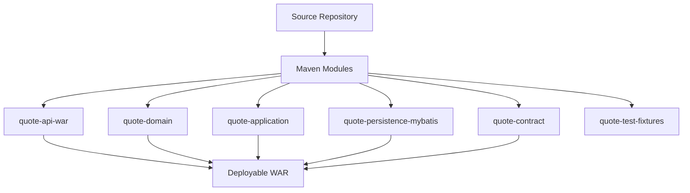
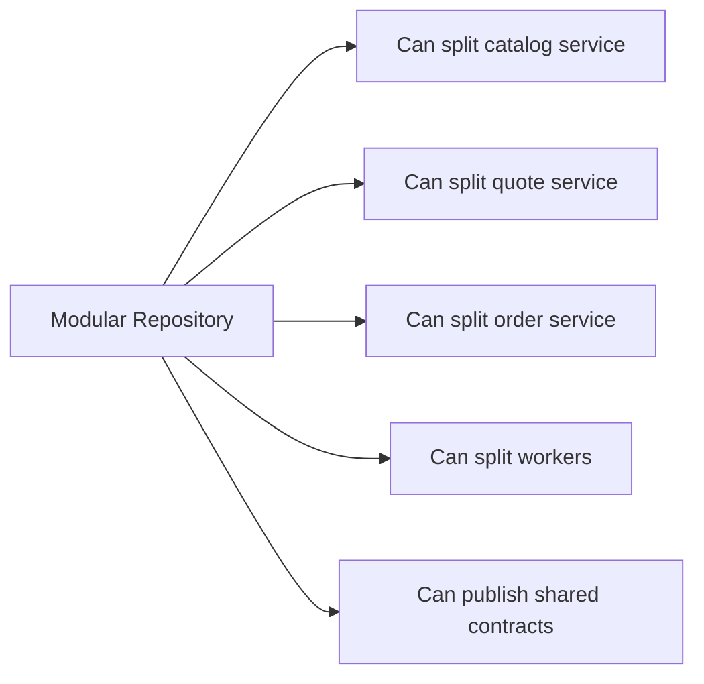
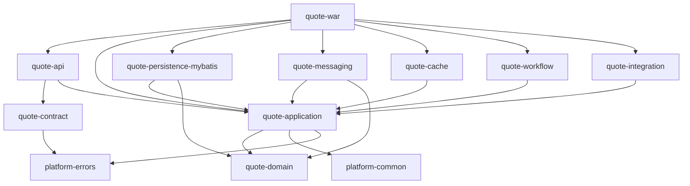
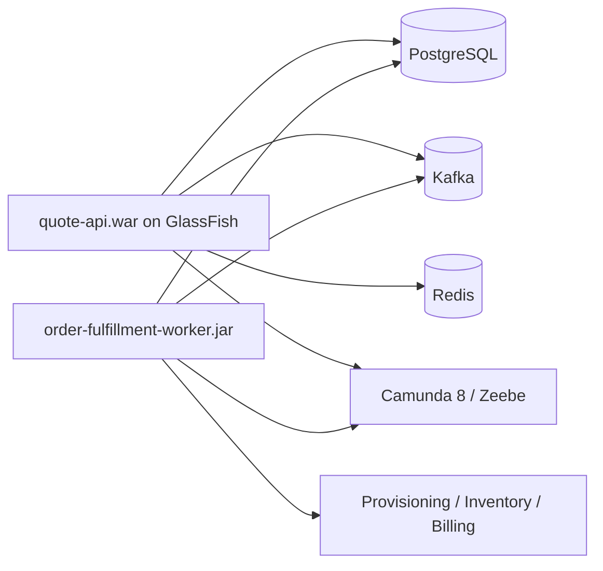
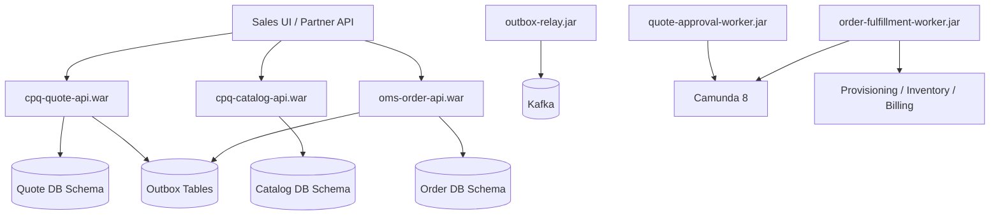
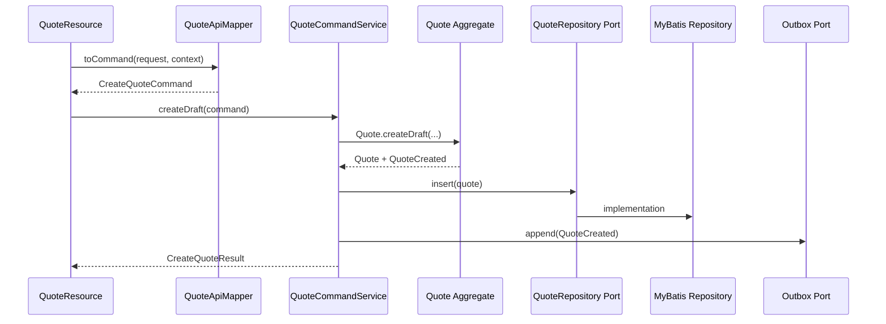

------
title: Build From Scratch: Enterprise Java Microservices CPQ & Order Management Platform - Part 020
description: Mendesain packaging dan module structure production-grade untuk service CPQ/OMS Java: Maven multi-module, WAR di GlassFish, worker/service deployable, domain/application/persistence separation, generated API contracts, dependency rules, configuration, migration, dan test fixtures.
series: learn-enterprise-cpq-oms-glassfish-camunda8
seriesTitle: Build From Scratch: Enterprise Java Microservices CPQ & Order Management Platform
order: 20
partTitle: Service Packaging and Module Structure
tags:
  - java
  - maven
  - jakarta-ee
  - glassfish
  - jax-rs
  - jersey
  - microservices
  - cpq
  - oms
  - module-structure
  - enterprise-architecture
date: 2026-07-02
------

# Part 020 — Service Packaging and Module Structure

Part 019 membangun baseline runtime HTTP: Jakarta REST/JAX-RS, Jersey, GlassFish, filter, resource, exception mapper, request context, dan operational endpoint. Sekarang kita harus menjawab pertanyaan yang lebih struktural:

> Bagaimana source code dan deployable disusun agar sistem CPQ/OMS enterprise bisa tumbuh tanpa berubah menjadi lumpur?

Ini bukan urusan estetika folder. Module structure menentukan:

- siapa boleh depend ke siapa;
- domain rule tinggal di mana;
- API contract tidak bocor ke persistence;
- MyBatis tidak mengotori domain;
- Camunda worker tidak bergantung ke resource HTTP;
- Kafka consumer bisa memakai application service yang sama;
- test bisa berjalan tanpa selalu boot GlassFish;
- service bisa dipecah tanpa rewrite total;
- tim bisa bekerja paralel tanpa saling injak.

Dalam sistem enterprise, struktur kode adalah **arsitektur yang bisa dikompilasi**.

---

## 1. Problem Yang Ingin Kita Hindari

Banyak project “microservices” secara fisik punya banyak repository, tetapi secara internal bentuknya begini:

```text
src/main/java/com/company
├── controller
├── service
├── repository
├── entity
├── dto
└── util
```

Awalnya terlihat sederhana. Setelah enam bulan:

- `service` memanggil mapper, Kafka producer, Camunda client, Redis, HTTP client, dan pricing rule sekaligus;
- `dto` dipakai sebagai request, response, entity, event payload;
- `entity` punya annotation persistence, JSON, validation, dan domain method campur;
- `util` menjadi tempat semua logic yang tidak tahu rumahnya;
- test hanya bisa integration test berat;
- satu perubahan API memecahkan worker;
- satu perubahan tabel memecahkan response;
- domain rule tidak bisa ditemukan.

Untuk CPQ/OMS, chaos seperti ini fatal karena sistem harus bisa menjawab:

- kenapa quote bisa approved?
- kenapa harga berubah?
- kenapa order didekomposisi menjadi task tertentu?
- kenapa fulfillment diretry?
- siapa mengubah state?
- apakah event duplicate diproses dua kali?
- apakah asset version yang dipakai benar?

Jika struktur kode tidak memaksa boundary, audit dan evolusi akan mahal.

---

## 2. Mental Model: Deployable vs Module vs Package

Tiga konsep ini sering dicampur.

| Konsep | Makna | Contoh |
|---|---|---|
| Deployable | Artifact yang dijalankan/deploy sendiri | `cpq-quote-api.war`, `oms-worker.jar` |
| Module | Unit build/kompilasi dalam Maven | `quote-domain`, `quote-application`, `quote-persistence` |
| Package | Namespace Java di dalam module | `com.acme.cpq.quote.domain` |

Satu deployable dapat terdiri dari banyak module.

Satu module dapat berisi banyak package.

Microservice boundary bukan berarti semua logic harus ada di satu module.



---

## 3. Recommended Repository Strategy Untuk Seri Ini

Untuk build-from-scratch learning series, kita mulai dengan **modular repository** untuk satu platform:

```text
enterprise-cpq-oms-platform/
├── pom.xml
├── docs/
├── contracts/
├── services/
├── libraries/
├── workers/
├── migrations/
├── local-dev/
└── testing/
```

Kenapa bukan langsung banyak repo?

Karena kita sedang belajar architecture end-to-end. Multi-repo terlalu cepat menambah beban:

- dependency version management;
- release coordination;
- local dev complexity;
- cross-service refactor overhead;
- CI/CD duplication;
- contract publication.

Modular repository memudahkan belajar boundary tanpa kehilangan kemampuan split nanti.

Target jangka panjang:



Rule-nya:

> Mulai modular. Jangan mulai tangled.

---

## 4. Top-Level Folder Structure

Baseline top-level:

```text
enterprise-cpq-oms-platform/
├── pom.xml
├── README.md
├── docs/
│   ├── architecture/
│   ├── runbooks/
│   └── decisions/
├── contracts/
│   ├── openapi/
│   ├── json-schema/
│   └── asyncapi/
├── libraries/
│   ├── platform-common/
│   ├── platform-observability/
│   ├── platform-errors/
│   ├── platform-security/
│   └── platform-testing/
├── services/
│   ├── catalog-service/
│   ├── quote-service/
│   ├── order-service/
│   └── asset-service/
├── workers/
│   ├── order-fulfillment-worker/
│   ├── approval-worker/
│   └── outbox-relay/
├── migrations/
│   ├── catalog-db/
│   ├── quote-db/
│   ├── order-db/
│   └── asset-db/
├── local-dev/
│   ├── docker-compose.yml
│   ├── glassfish/
│   ├── kafka/
│   ├── postgres/
│   ├── redis/
│   └── camunda8/
└── testing/
    ├── contract-tests/
    ├── integration-tests/
    └── load-scenarios/
```

Penjelasan:

| Folder | Fungsi |
|---|---|
| `contracts` | OpenAPI, JSON Schema, event schema, bukan Java code utama. |
| `libraries` | Shared code yang benar-benar generic dan platform-level. |
| `services` | HTTP/API deployable dan service-specific modules. |
| `workers` | Non-HTTP deployable: Camunda workers, outbox relay, consumers. |
| `migrations` | Database migration per bounded context. |
| `local-dev` | Local environment bootstrap. |
| `testing` | Cross-service tests, contract tests, load scenarios. |

---

## 5. Service-Level Module Structure

Ambil contoh `quote-service`.

```text
services/quote-service/
├── pom.xml
├── quote-contract/
├── quote-api/
├── quote-application/
├── quote-domain/
├── quote-persistence-mybatis/
├── quote-messaging/
├── quote-cache/
├── quote-workflow/
├── quote-integration/
├── quote-war/
└── quote-test-fixtures/
```

Fungsi masing-masing:

| Module | Fungsi |
|---|---|
| `quote-contract` | Generated/handwritten API DTO, schema references, contract constants. |
| `quote-api` | JAX-RS resources, filters, providers, API mapper. |
| `quote-application` | Command/query services, transaction boundary, orchestration ports. |
| `quote-domain` | Aggregate, value object, invariant, state machine, domain events. |
| `quote-persistence-mybatis` | MyBatis mapper, SQL XML/annotations, persistence records, repository implementation. |
| `quote-messaging` | Kafka event publisher/consumer adapter, event mapper. |
| `quote-cache` | Redis adapter, cache key policy, serialization boundary. |
| `quote-workflow` | Camunda 8 client adapter, process command port implementation. |
| `quote-integration` | External system clients/anti-corruption adapters. |
| `quote-war` | GlassFish deployable assembly. |
| `quote-test-fixtures` | Builders, fake repositories, test data fixtures. |

Tidak semua service selalu butuh semua module. Tapi untuk CPQ/OMS enterprise, struktur ini memberi ruang yang jelas.

---

## 6. Dependency Direction

Dependency direction harus satu arah.



Yang paling penting:

```text
quote-domain
  depends on almost nothing

quote-application
  depends on domain and ports

infrastructure modules
  depend on application/domain

api module
  depends on application and contract

war module
  assembles everything
```

Domain tidak depend ke:

- JAX-RS;
- Jersey;
- GlassFish;
- MyBatis;
- PostgreSQL driver;
- Kafka client;
- Redis client;
- Camunda client;
- JSON provider;
- generated OpenAPI DTO.

Jika domain depend ke infrastructure, arsitektur sudah terbalik.

---

## 7. Port and Adapter Boundary

Application module mendefinisikan port.

```java
public interface QuoteRepository {
  Optional<Quote> findById(TenantId tenantId, QuoteId quoteId);
  Quote getForUpdate(TenantId tenantId, QuoteId quoteId);
  void insert(Quote quote);
  void update(Quote quote);
}

public interface QuoteOutboxPort {
  void append(DomainEvent event, RequestContext context);
}

public interface ApprovalWorkflowPort {
  WorkflowStartResult startQuoteApproval(Quote quote, RequestContext context);
}

public interface PricingPort {
  PriceQuoteResult price(PriceQuoteCommand command);
}
```

Infrastructure module mengimplementasikan port.

```java
public class MyBatisQuoteRepository implements QuoteRepository {

  private final QuoteMapper mapper;
  private final QuotePersistenceMapper persistenceMapper;

  @Inject
  public MyBatisQuoteRepository(
      QuoteMapper mapper,
      QuotePersistenceMapper persistenceMapper
  ) {
    this.mapper = mapper;
    this.persistenceMapper = persistenceMapper;
  }

  @Override
  public Optional<Quote> findById(TenantId tenantId, QuoteId quoteId) {
    return mapper.selectById(tenantId.value(), quoteId.value())
        .map(persistenceMapper::toDomain);
  }
}
```

Application service tidak tahu MyBatis.

```java
public class QuoteCommandService {

  private final QuoteRepository quoteRepository;
  private final QuoteOutboxPort outboxPort;

  public SubmitQuoteResult submit(SubmitQuoteCommand command) {
    Quote quote = quoteRepository.getForUpdate(
        command.context().tenantId(),
        command.quoteId()
    );

    quote.submit(command.expectedVersion(), command.context().actor());
    quoteRepository.update(quote);
    outboxPort.append(QuoteSubmittedEvent.from(quote), command.context());

    return SubmitQuoteResult.from(quote);
  }
}
```

---

## 8. Why WAR Module Should Be Thin

`quote-war` adalah assembly module.

Ia tidak berisi business logic.

```text
quote-war/
├── pom.xml
└── src/main/webapp
    └── WEB-INF
        ├── web.xml optional
        └── glassfish-web.xml optional
```

`quote-war/pom.xml` mengambil dependency:

- `quote-api`;
- `quote-application`;
- `quote-persistence-mybatis`;
- `quote-messaging`;
- `quote-cache`;
- `quote-workflow`;
- `quote-integration`;
- platform libraries;
- runtime libraries yang perlu bundled.

`quote-war` tidak punya:

- `Quote` aggregate;
- SQL mapper;
- pricing rule;
- resource logic;
- workflow worker logic.

War module adalah packaging seam. Itu membuat kita bisa mengganti packaging nanti tanpa memindahkan domain.

---

## 9. Worker Deployable Tidak Harus WAR

Camunda 8/Zeebe workers biasanya long-running clients yang mengambil jobs dari broker. Mereka tidak harus berjalan di GlassFish.

Untuk seri ini, kita desain worker sebagai executable JAR/module terpisah:

```text
workers/order-fulfillment-worker/
├── pom.xml
├── fulfillment-worker-app/
├── fulfillment-worker-runtime/
└── fulfillment-worker-test-fixtures/
```

Kenapa worker dipisahkan dari WAR?

- HTTP API scaling berbeda dari worker scaling;
- worker butuh concurrency tuning berbeda;
- worker failure tidak harus menjatuhkan API;
- worker deployment bisa independen;
- job polling/backpressure berbeda dari request/response traffic;
- long-running worker di application server sering lebih sulit dioperasikan.

Deployment topology:



Rule:

> API service menerima command dan memulai/mencatat proses. Worker mengeksekusi job orchestration. Jangan campur lifecycle keduanya tanpa alasan kuat.

---

## 10. Outbox Relay Deployable

Outbox relay sebaiknya deployable sendiri.

```text
workers/outbox-relay/
├── pom.xml
├── outbox-relay-app/
├── outbox-relay-persistence/
├── outbox-relay-kafka/
└── outbox-relay-runtime/
```

Tugas outbox relay:

1. membaca outbox row dari PostgreSQL;
2. publish event ke Kafka;
3. mark published;
4. retry jika gagal;
5. handle poison record;
6. expose metrics lag.

Kenapa tidak publish Kafka langsung dari resource?

Karena transaction database dan Kafka publish tidak atomic secara default dalam baseline ini. Dengan outbox, business mutation dan event intent tersimpan di transaction yang sama.

---

## 11. Parent Maven POM

Top-level `pom.xml` sebagai aggregator dan version management.

```xml
<project xmlns="http://maven.apache.org/POM/4.0.0"
         xmlns:xsi="http://www.w3.org/2001/XMLSchema-instance"
         xsi:schemaLocation="http://maven.apache.org/POM/4.0.0 https://maven.apache.org/xsd/maven-4.0.0.xsd">
  <modelVersion>4.0.0</modelVersion>

  <groupId>com.acme.cpqoms</groupId>
  <artifactId>enterprise-cpq-oms-platform</artifactId>
  <version>0.1.0-SNAPSHOT</version>
  <packaging>pom</packaging>

  <modules>
    <module>libraries/platform-common</module>
    <module>libraries/platform-errors</module>
    <module>libraries/platform-observability</module>

    <module>services/quote-service</module>
    <module>services/order-service</module>

    <module>workers/outbox-relay</module>
    <module>workers/order-fulfillment-worker</module>
  </modules>

  <properties>
    <maven.compiler.release>21</maven.compiler.release>
    <project.build.sourceEncoding>UTF-8</project.build.sourceEncoding>
    <jakarta.ee.version>11.0.0</jakarta.ee.version>
  </properties>

  <dependencyManagement>
    <dependencies>
      <dependency>
        <groupId>jakarta.platform</groupId>
        <artifactId>jakarta.jakartaee-api</artifactId>
        <version>${jakarta.ee.version}</version>
        <scope>provided</scope>
      </dependency>
    </dependencies>
  </dependencyManagement>
</project>
```

Catatan:

- Java version bisa disesuaikan dengan runtime enterprise yang dipilih.
- Pastikan GlassFish/Jakarta EE target kompatibel dengan dependency API.
- Jangan mencampur `javax.*` era lama dengan `jakarta.*` dalam code baru.

---

## 12. Service Aggregator POM

`services/quote-service/pom.xml`:

```xml
<project xmlns="http://maven.apache.org/POM/4.0.0"
         xmlns:xsi="http://www.w3.org/2001/XMLSchema-instance"
         xsi:schemaLocation="http://maven.apache.org/POM/4.0.0 https://maven.apache.org/xsd/maven-4.0.0.xsd">
  <modelVersion>4.0.0</modelVersion>

  <parent>
    <groupId>com.acme.cpqoms</groupId>
    <artifactId>enterprise-cpq-oms-platform</artifactId>
    <version>0.1.0-SNAPSHOT</version>
    <relativePath>../../pom.xml</relativePath>
  </parent>

  <artifactId>quote-service</artifactId>
  <packaging>pom</packaging>

  <modules>
    <module>quote-contract</module>
    <module>quote-domain</module>
    <module>quote-application</module>
    <module>quote-api</module>
    <module>quote-persistence-mybatis</module>
    <module>quote-messaging</module>
    <module>quote-cache</module>
    <module>quote-workflow</module>
    <module>quote-integration</module>
    <module>quote-test-fixtures</module>
    <module>quote-war</module>
  </modules>
</project>
```

Aggregator POM tidak berisi code.

---

## 13. Domain Module

`quote-domain` harus paling bersih.

```text
quote-domain/
├── pom.xml
└── src/main/java/com/acme/cpqoms/quote/domain
    ├── Quote.java
    ├── QuoteItem.java
    ├── QuoteState.java
    ├── QuoteId.java
    ├── QuoteVersion.java
    ├── QuotePriceSnapshot.java
    ├── QuoteConfigurationSnapshot.java
    ├── event
    │   ├── QuoteCreated.java
    │   ├── QuoteSubmitted.java
    │   └── QuoteApproved.java
    ├── policy
    │   ├── QuoteSubmissionPolicy.java
    │   └── QuoteRevisionPolicy.java
    └── exception
        ├── QuoteExpiredException.java
        └── InvalidQuoteStateTransitionException.java
```

Domain POM:

```xml
<project>
  <modelVersion>4.0.0</modelVersion>
  <parent>...</parent>
  <artifactId>quote-domain</artifactId>

  <dependencies>
    <dependency>
      <groupId>com.acme.cpqoms</groupId>
      <artifactId>platform-common</artifactId>
    </dependency>
    <dependency>
      <groupId>com.acme.cpqoms</groupId>
      <artifactId>platform-errors</artifactId>
    </dependency>
  </dependencies>
</project>
```

Domain boleh depend ke small common primitives seperti:

- `Money`;
- `TenantId`;
- `ActorId`;
- `DomainException`;
- `VersionToken`.

Tapi hati-hati. Shared library bisa menjadi dumping ground. Jangan masukkan domain-specific CPQ/OMS ke `platform-common`.

---

## 14. Application Module

`quote-application` adalah use case layer.

```text
quote-application/
└── src/main/java/com/acme/cpqoms/quote/application
    ├── command
    │   ├── CreateQuoteCommand.java
    │   ├── SubmitQuoteCommand.java
    │   ├── ApproveQuoteCommand.java
    │   └── ConvertQuoteToOrderCommand.java
    ├── query
    │   ├── GetQuoteQuery.java
    │   └── SearchQuotesQuery.java
    ├── service
    │   ├── QuoteCommandService.java
    │   └── QuoteQueryService.java
    ├── port
    │   ├── QuoteRepository.java
    │   ├── QuoteReadModelRepository.java
    │   ├── QuoteOutboxPort.java
    │   ├── PricingPort.java
    │   ├── ApprovalWorkflowPort.java
    │   └── OrderConversionPort.java
    └── tx
        └── TransactionRunner.java
```

Application module depends on domain.

```xml
<dependency>
  <groupId>com.acme.cpqoms</groupId>
  <artifactId>quote-domain</artifactId>
</dependency>
```

Application module does not depend on:

- `quote-api`;
- `quote-war`;
- `quote-persistence-mybatis`;
- Kafka client;
- Redis client;
- Camunda client;
- Jersey.

Ports allow infrastructure to plug in later.

---

## 15. API Module

`quote-api` contains Jakarta REST/Jersey boundary.

```text
quote-api/
└── src/main/java/com/acme/cpqoms/quote/api
    ├── QuoteApplication.java
    ├── resource
    │   ├── QuoteResource.java
    │   ├── QuoteCommandResource.java
    │   └── QuoteSearchResource.java
    ├── dto
    │   ├── CreateQuoteRequest.java
    │   ├── QuoteResponse.java
    │   └── SubmitQuoteRequest.java
    ├── mapper
    │   └── QuoteApiMapper.java
    ├── filter
    ├── provider
    └── context
```

API dependencies:

```xml
<dependency>
  <groupId>jakarta.platform</groupId>
  <artifactId>jakarta.jakartaee-api</artifactId>
  <scope>provided</scope>
</dependency>

<dependency>
  <groupId>com.acme.cpqoms</groupId>
  <artifactId>quote-contract</artifactId>
</dependency>

<dependency>
  <groupId>com.acme.cpqoms</groupId>
  <artifactId>quote-application</artifactId>
</dependency>
```

API module may depend on application. Application must not depend on API.

---

## 16. Contract Module

`quote-contract` can contain:

- generated DTO from OpenAPI;
- hand-maintained DTO if generation is deferred;
- API constants;
- schema resource files;
- error code enums tied to public contract.

Option A: DTO in `quote-api`.

Option B: DTO in `quote-contract`.

For enterprise API-first, Option B is often better if clients and tests also use the DTO artifact. But there is a tradeoff: generated DTO can pollute server-side design if used too deep.

Rule:

> Generated contract types may cross API boundary, but must not become domain model.

Structure:

```text
quote-contract/
├── src/main/resources/openapi/quote-api.yaml
├── src/main/resources/schema/quote/
└── src/main/java/com/acme/cpqoms/quote/contract
    ├── dto
    └── error
```

If generated sources are used:

```text
target/generated-sources/openapi
```

Keep generated code isolated so it can be deleted/regenerated.

---

## 17. Persistence MyBatis Module

`quote-persistence-mybatis` implements repository ports.

```text
quote-persistence-mybatis/
└── src/main
    ├── java/com/acme/cpqoms/quote/persistence
    │   ├── repository
    │   │   ├── MyBatisQuoteRepository.java
    │   │   └── MyBatisQuoteReadModelRepository.java
    │   ├── mapper
    │   │   └── QuoteMapper.java
    │   ├── record
    │   │   ├── QuoteRecord.java
    │   │   └── QuoteItemRecord.java
    │   └── mapping
    │       └── QuotePersistenceMapper.java
    └── resources/com/acme/cpqoms/quote/persistence/mapper
        └── QuoteMapper.xml
```

Dependency:

```xml
<dependency>
  <groupId>com.acme.cpqoms</groupId>
  <artifactId>quote-application</artifactId>
</dependency>
<dependency>
  <groupId>com.acme.cpqoms</groupId>
  <artifactId>quote-domain</artifactId>
</dependency>
<dependency>
  <groupId>org.mybatis</groupId>
  <artifactId>mybatis</artifactId>
</dependency>
```

Persistence record is not domain object.

```java
public record QuoteRecord(
    String tenantId,
    String quoteId,
    String state,
    int version,
    String customerId,
    OffsetDateTime createdAt,
    OffsetDateTime updatedAt
) {}
```

Mapper converts:

```text
QuoteRecord + QuoteItemRecord -> Quote aggregate
Quote aggregate -> QuoteRecord + QuoteItemRecord
```

This prevents SQL schema changes from directly changing API/domain.

---

## 18. Messaging Module

`quote-messaging` implements event publishing/consuming adapters.

```text
quote-messaging/
└── src/main/java/com/acme/cpqoms/quote/messaging
    ├── kafka
    │   ├── KafkaQuoteEventPublisher.java
    │   ├── QuoteEventEnvelopeMapper.java
    │   └── QuoteTopicNames.java
    ├── consumer
    │   └── CustomerUpdatedConsumer.java
    └── schema
        └── EventSchemaRegistry.java
```

Application sees:

```java
public interface QuoteOutboxPort {
  void append(DomainEvent event, RequestContext context);
}
```

Messaging module may handle:

- Kafka serialization;
- topic names;
- partition key;
- headers;
- schema version;
- retry/dead-letter adapter.

But domain event remains domain-level.

```java
public record QuoteSubmitted(
    TenantId tenantId,
    QuoteId quoteId,
    QuoteVersion version,
    Instant submittedAt
) implements DomainEvent {}
```

Integration event envelope can be separate:

```java
public record IntegrationEventEnvelope<T>(
    String eventId,
    String eventType,
    String schemaVersion,
    String tenantId,
    String correlationId,
    String causationId,
    Instant occurredAt,
    T payload
) {}
```

---

## 19. Cache Module

`quote-cache` implements Redis adapters and cache key policy.

```text
quote-cache/
└── src/main/java/com/acme/cpqoms/quote/cache
    ├── RedisQuoteCache.java
    ├── QuoteCacheKey.java
    ├── QuoteCacheSerializer.java
    └── QuoteCacheInvalidationHandler.java
```

Application sees a port:

```java
public interface QuoteCachePort {
  Optional<QuoteView> getQuoteView(TenantId tenantId, QuoteId quoteId);
  void putQuoteView(QuoteView view);
  void evictQuote(TenantId tenantId, QuoteId quoteId);
}
```

Cache module depends on application read model, not vice versa.

Do not put Redis calls inside domain.

Redis key policy example:

```text
cpqoms:{tenantId}:quote:{quoteId}:v{version}:view
```

Versioned key helps reduce stale overwrite risk.

---

## 20. Workflow Module

`quote-workflow` implements Camunda 8 interaction.

```text
quote-workflow/
└── src/main/java/com/acme/cpqoms/quote/workflow
    ├── CamundaApprovalWorkflowAdapter.java
    ├── QuoteApprovalVariables.java
    ├── WorkflowBusinessKeyFactory.java
    └── WorkflowErrorMapper.java
```

Application port:

```java
public interface ApprovalWorkflowPort {
  ApprovalProcessHandle startApproval(Quote quote, RequestContext context);
}
```

Workflow adapter:

```java
public class CamundaApprovalWorkflowAdapter implements ApprovalWorkflowPort {

  private final ZeebeClient zeebeClient;
  private final QuoteApprovalVariableMapper variableMapper;

  @Override
  public ApprovalProcessHandle startApproval(Quote quote, RequestContext context) {
    Map<String, Object> variables = variableMapper.toVariables(quote, context);

    ProcessInstanceEvent event = zeebeClient
        .newCreateInstanceCommand()
        .bpmnProcessId("quote-approval")
        .latestVersion()
        .variables(variables)
        .send()
        .join();

    return new ApprovalProcessHandle(String.valueOf(event.getProcessInstanceKey()));
  }
}
```

Caution:

- Application service should not know Zeebe client API.
- Public API should not expose process instance key as main business identifier.
- Workflow variables are contract too; version them.

---

## 21. Integration Module

`quote-integration` contains anti-corruption adapters to external systems.

```text
quote-integration/
└── src/main/java/com/acme/cpqoms/quote/integration
    ├── customer
    │   ├── CustomerClient.java
    │   ├── CustomerAclAdapter.java
    │   └── ExternalCustomerMapper.java
    ├── billing
    ├── document
    └── crm
```

Application sees:

```java
public interface CustomerEligibilityPort {
  CustomerEligibilityResult check(CustomerEligibilityCommand command);
}
```

Integration adapter handles:

- HTTP client;
- timeout;
- retry policy;
- external DTO;
- external error mapping;
- auth to external service;
- anti-corruption mapping.

Never let external CRM DTO become internal customer context model.

---

## 22. Test Fixtures Module

`quote-test-fixtures` prevents test duplication.

```text
quote-test-fixtures/
└── src/main/java/com/acme/cpqoms/quote/fixture
    ├── QuoteBuilder.java
    ├── QuoteItemBuilder.java
    ├── QuoteCommandFixture.java
    ├── QuoteApiFixture.java
    ├── QuoteDatabaseFixture.java
    └── FakeQuoteRepository.java
```

Usage:

```java
Quote quote = QuoteBuilder.draft()
    .withCustomer("CUST-100")
    .withOneItem("PO-1")
    .priced()
    .build();
```

Fixture rules:

- fixtures are for tests only;
- do not depend on production infrastructure if avoidable;
- make valid objects easy;
- make invalid edge cases explicit;
- do not hide important invariants.

Good fixture:

```java
QuoteBuilder.draft().expired().build();
```

Bad fixture:

```java
new Quote(null, null, null, ... twenty arguments ...)
```

---

## 23. Libraries: Shared Code Without Creating A Dumping Ground

Recommended platform libraries:

```text
libraries/
├── platform-common
├── platform-errors
├── platform-observability
├── platform-security
├── platform-idempotency
├── platform-outbox
├── platform-mybatis
└── platform-testing
```

But be strict.

### Allowed in `platform-common`

- `TenantId`;
- `CorrelationId`;
- `Money` if truly shared;
- `CurrencyCode`;
- `PageLimit`;
- `Cursor`;
- `ClockProvider`;
- `StringSanitizer`.

### Not allowed in `platform-common`

- `QuoteId`;
- `OrderState`;
- `ProductOffering`;
- `ApprovalPolicy`;
- `FulfillmentTask`;
- random helper for one service;
- external CRM mapping;
- “temporary” business rule.

Shared code is dangerous because it becomes hard to change.

Rule:

> Share stable primitives and platform mechanisms, not volatile domain concepts.

---

## 24. Deployment Units In The First Production Slice

For the first production-grade vertical slice, create these deployables:

```text
cpq-catalog-api.war
cpq-quote-api.war
oms-order-api.war
asset-api.war
outbox-relay.jar
quote-approval-worker.jar
order-fulfillment-worker.jar
```

Not all need complete functionality at first. But their boundary should exist.



This topology allows independent scaling:

| Deployable | Scaling Driver |
|---|---|
| Catalog API | read traffic, cache hit ratio |
| Quote API | quote creation/pricing traffic |
| Order API | order status/order command traffic |
| Outbox relay | event backlog |
| Approval worker | approval workflow volume |
| Fulfillment worker | Zeebe job load, external system latency |

---

## 25. Database Migration Placement

Migration should not be hidden inside random service startup unless policy is explicit.

Recommended structure:

```text
migrations/quote-db
├── V001__create_quote_tables.sql
├── V002__create_quote_item_tables.sql
├── V003__create_idempotency_table.sql
├── V004__create_outbox_table.sql
└── R__quote_read_models.sql optional
```

Service code should not silently create production tables.

Local dev can run migration automatically. Production should run controlled migration pipeline.

Application module depends on repository port, not migration implementation.

---

## 26. Generated Code Placement

OpenAPI-generated server stubs can be useful, but dangerous if they dictate architecture.

Bad structure:

```text
quote-api
└── generated controller with business logic inserted manually
```

Problem:

- regeneration overwrites code;
- generated interface becomes domain boundary;
- hard to separate contract and implementation.

Better:

```text
quote-contract
└── generated DTO / API interfaces

quote-api
└── resource implements/adapts generated interface
```

Or:

```text
quote-api
├── generated
│   └── do not edit
└── resource
    └── hand-written adapter
```

Rule:

> Generated code is input, not architecture owner.

---

## 27. Configuration Structure

Configuration must be centralized but not magical.

```text
quote-war/src/main/resources
├── application-default.properties
├── application-local.properties
├── logging.properties
└── META-INF
```

Common config categories:

```properties
service.name=cpq-quote-service
service.environment=local

http.correlation.header=X-Correlation-Id
http.tenant.header=X-Tenant-Id

postgres.datasource.jndi=jdbc/QuoteDS

redis.enabled=true
redis.key.prefix=cpqoms

kafka.bootstrap.servers=localhost:9092
kafka.quote.events.topic=cpq.quote.events.v1

camunda.zeebe.gateway.address=localhost:26500
camunda.process.quoteApproval=quote-approval
```

Do not scatter config names across code.

Create typed config:

```java
public record QuoteServiceConfig(
    String serviceName,
    String environment,
    String quoteEventsTopic,
    Duration commandTimeout,
    boolean redisEnabled
) {}
```

Typed config gives validation and discoverability.

---

## 28. Resource Ownership Per Module

Avoid accidental ownership confusion.

| Resource | Owned By |
|---|---|
| `QuoteResource` | `quote-api` |
| `QuoteCommandService` | `quote-application` |
| `Quote` aggregate | `quote-domain` |
| `QuoteMapper.xml` | `quote-persistence-mybatis` |
| `QuoteSubmitted` domain event | `quote-domain` |
| Kafka envelope mapper | `quote-messaging` |
| Redis quote view cache | `quote-cache` |
| Zeebe approval adapter | `quote-workflow` |
| External CRM client | `quote-integration` |
| `cpq-quote-api.war` | `quote-war` |

If a file does not fit, that is a design signal. Do not immediately create `util`.

---

## 29. Anti-Pattern: `common-domain`

Temptation:

```text
common-domain
├── Quote.java
├── Order.java
├── Product.java
├── Customer.java
└── Subscription.java
```

This looks reusable. It is usually harmful.

Why?

- quote and order have different lifecycle;
- product catalog and product instance are not same model;
- customer reference in CPQ is not CRM master data;
- subscription in billing may differ from asset subscription model;
- shared domain jar forces coordinated release;
- every service gets more fields than it owns.

Better:

```text
quote-domain/Quote.java
order-domain/Order.java
catalog-domain/ProductOffering.java
asset-domain/ProductInstance.java
```

Share IDs and integration contracts, not aggregates.

---

## 30. Anti-Pattern: Infrastructure Calls From Domain

Bad:

```java
public class Quote {
  private RedisClient redis;
  private ZeebeClient zeebe;

  public void submit() {
    this.state = SUBMITTED;
    redis.del("quote:" + id);
    zeebe.newCreateInstanceCommand().bpmnProcessId("approval").send();
  }
}
```

This destroys testability and portability.

Good:

```java
public class Quote {
  public QuoteSubmitted submit(VersionToken expectedVersion, Actor actor) {
    requireCanSubmit(expectedVersion);
    this.state = QuoteState.SUBMITTED;
    this.version = this.version.next();
    return new QuoteSubmitted(this.tenantId, this.quoteId, this.version, Instant.now());
  }
}
```

Application service decides what to do with domain event.

---

## 31. Anti-Pattern: Worker Imports API DTO

Bad:

```java
import com.acme.cpqoms.quote.api.dto.SubmitQuoteRequest;

public class ApprovalWorker {
  public void handleJob(Job job) {
    SubmitQuoteRequest request = ...;
  }
}
```

Worker is not an HTTP client. It should use application command or workflow variable DTO.

Better:

```java
public record ApproveQuoteJobCommand(
    TenantId tenantId,
    QuoteId quoteId,
    Actor systemActor,
    WorkflowInstanceId workflowInstanceId
) {}
```

Reason:

- HTTP request shape can change;
- worker variable schema can differ;
- API validation and workflow validation are separate;
- audit causation differs.

---

## 32. Build Order

The dependency graph determines build order.

```text
platform-common
platform-errors
quote-domain
quote-application
quote-contract
quote-api
quote-persistence-mybatis
quote-messaging
quote-cache
quote-workflow
quote-war
```

Maven handles this if modules and dependencies are correct.

If build order needs hacks, dependency direction is probably wrong.

---

## 33. Compile-Time Architecture Tests

Use tests to enforce dependency rules.

Conceptual rules:

```text
domain must not depend on api
application must not depend on persistence
application must not depend on jersey
application must not depend on mybatis
api must not depend on persistence implementation directly
worker must not depend on api dto
```

Example pseudo-test:

```java
@Test
void domainMustNotDependOnInfrastructure() {
  assertNoClassesIn("..quote.domain..")
      .dependOnClassesIn("..quote.persistence..", "..quote.api..", "..quote.workflow..");
}
```

Architecture tests are not bureaucracy. They prevent entropy.

---

## 34. Naming Convention

Use names that express role.

| Role | Suffix Example |
|---|---|
| API request | `CreateQuoteRequest` |
| API response | `QuoteResponse` |
| Application command | `CreateQuoteCommand` |
| Application query | `SearchQuotesQuery` |
| Application result | `CreateQuoteResult` |
| Domain aggregate | `Quote` |
| Domain event | `QuoteSubmitted` |
| Persistence record | `QuoteRecord` |
| MyBatis mapper | `QuoteMapper` |
| API mapper | `QuoteApiMapper` |
| Persistence mapper | `QuotePersistenceMapper` |
| External DTO | `CrmCustomerResponse` |
| Adapter | `CrmCustomerAdapter` |
| Port | `CustomerEligibilityPort` |

Avoid vague names:

- `QuoteModel`;
- `QuoteData`;
- `QuoteInfo`;
- `QuoteVO`;
- `QuoteDTO` used everywhere;
- `QuoteUtil`.

Name is part of architecture.

---

## 35. Vertical Slice Layout Example: Create Quote

Files touched by `Create Quote`:

```text
contracts/openapi/quote-api.yaml
quote-contract/dto/CreateQuoteRequest.java
quote-api/resource/QuoteResource.java
quote-api/mapper/QuoteApiMapper.java
quote-application/command/CreateQuoteCommand.java
quote-application/service/QuoteCommandService.java
quote-application/port/QuoteRepository.java
quote-domain/Quote.java
quote-domain/event/QuoteCreated.java
quote-persistence-mybatis/repository/MyBatisQuoteRepository.java
quote-persistence-mybatis/mapper/QuoteMapper.java
quote-persistence-mybatis/resources/QuoteMapper.xml
quote-persistence-mybatis/mapping/QuotePersistenceMapper.java
quote-messaging/outbox/PostgresQuoteOutboxAdapter.java
migrations/quote-db/V001__create_quote_tables.sql
migrations/quote-db/V004__create_outbox_table.sql
```

Flow:



This is the shape we want for every vertical slice.

---

## 36. Vertical Slice Layout Example: Convert Quote To Order

This command crosses boundary from CPQ to OMS.

Files touched:

```text
quote-api/resource/QuoteCommandResource.java
quote-application/command/ConvertQuoteToOrderCommand.java
quote-application/service/QuoteConversionService.java
quote-application/port/OrderConversionPort.java
quote-domain/Quote.java
quote-domain/policy/QuoteConversionPolicy.java
quote-workflow/CamundaOrderConversionAdapter.java optional
order-application/command/CreateOrderFromQuoteCommand.java
order-application/service/OrderCommandService.java
order-domain/Order.java
order-persistence-mybatis/...
```

Important design decision:

- quote service should not directly insert arbitrary order tables unless same bounded deployment intentionally owns both;
- conversion can be local application call in modular monolith mode;
- conversion can be API/event/workflow call in distributed mode;
- command should be idempotent either way.

The module structure should allow both paths.

```java
public interface OrderConversionPort {
  OrderConversionResult convertAcceptedQuote(ConvertAcceptedQuoteInput input);
}
```

In modular mode:

```java
public class LocalOrderConversionAdapter implements OrderConversionPort {
  private final OrderCommandService orderCommandService;
}
```

In distributed mode:

```java
public class RemoteOrderConversionAdapter implements OrderConversionPort {
  private final OrderApiClient orderApiClient;
}
```

Application service does not care which implementation is active.

---

## 37. Module Structure For Catalog Service

Catalog has different characteristics from quote/order:

- read-heavy;
- versioned publishing;
- cache-heavy;
- admin lifecycle;
- validation against active catalog version;
- import/export support.

Suggested modules:

```text
services/catalog-service/
├── catalog-contract
├── catalog-domain
├── catalog-application
├── catalog-api
├── catalog-persistence-mybatis
├── catalog-cache
├── catalog-import
├── catalog-messaging
├── catalog-war
└── catalog-test-fixtures
```

Catalog import may be separate from API because large catalog loads should not be handled like normal REST request.

---

## 38. Module Structure For Order Service

OMS has workflow-heavy characteristics.

```text
services/order-service/
├── order-contract
├── order-domain
├── order-application
├── order-api
├── order-persistence-mybatis
├── order-workflow
├── order-messaging
├── order-integration
├── order-cache
├── order-war
└── order-test-fixtures
```

Workers:

```text
workers/order-fulfillment-worker
workers/order-reconciliation-worker
workers/order-fallout-worker
```

Do not put all worker logic inside `order-api`.

---

## 39. Module Structure For Asset Service

Asset service is lifecycle/audit-heavy.

```text
services/asset-service/
├── asset-contract
├── asset-domain
├── asset-application
├── asset-api
├── asset-persistence-mybatis
├── asset-messaging
├── asset-projection
├── asset-war
└── asset-test-fixtures
```

Asset projection may consume order completed events and update installed base.

But be careful: if asset update is part of strong order completion invariant, it may need orchestration/transaction strategy, not casual async consumer.

---

## 40. Runtime Configuration Per Deployable

Every deployable has independent config.

```text
cpq-quote-api.war
  service.name=cpq-quote-api
  http.port via GlassFish
  datasource=jdbc/QuoteDS
  kafka topics quote/order
  redis prefix quote

order-fulfillment-worker.jar
  service.name=order-fulfillment-worker
  zeebe gateway
  worker concurrency
  datasource=jdbc/OrderDS
  external provisioning timeout

outbox-relay.jar
  service.name=outbox-relay
  datasource per schema
  kafka bootstrap
  batch size
  polling interval
```

Do not let one giant config file configure everything without ownership.

---

## 41. Environment-Specific Assembly

Local, staging, and production differ in config, not code.

```text
application-default.properties
application-local.properties
application-test.properties
application-staging.properties
application-prod.properties
```

However, secrets should not be committed.

Recommended categories:

| Config Type | Storage |
|---|---|
| non-secret default | repository |
| local dev sample | repository |
| password/token | secret manager / environment |
| endpoint per env | deployment config |
| feature flag | config service or deployment variable |

Typed config validator should fail startup if required config missing.

---

## 42. Local Dev Packaging

Local dev should support incremental learning.

`local-dev/docker-compose.yml` may run:

- PostgreSQL;
- Kafka;
- Redis;
- Camunda 8;
- optional mock external systems.

GlassFish can run:

- directly installed locally;
- inside container;
- via IDE deployment.

Do not make full stack mandatory for every test.

```text
mvn test
  should not need Docker

mvn verify -Pintegration
  may need PostgreSQL/Testcontainers/local stack

manual full flow
  needs GlassFish + dependencies
```

---

## 43. Avoiding Cycles

Cycle example:

```text
quote-api -> quote-application -> quote-persistence -> quote-api
```

This often happens when persistence wants an API DTO or API wants a persistence record.

Fix:

- move shared port/result to application;
- create separate mapper;
- do not reuse DTO across layers;
- introduce a small contract module only if it truly represents contract.

Acyclic dependency graph is non-negotiable.

---

## 44. Build Profiles

Useful Maven profiles:

```text
local
unit
integration
contract
full-stack
release
```

Example:

```xml
<profiles>
  <profile>
    <id>integration</id>
    <properties>
      <skip.integration.tests>false</skip.integration.tests>
    </properties>
  </profile>

  <profile>
    <id>contract</id>
    <properties>
      <run.contract.diff>true</run.contract.diff>
    </properties>
  </profile>
</profiles>
```

Do not hide important checks behind profiles that CI never runs.

CI should run at minimum:

- compile all modules;
- unit tests;
- architecture dependency tests;
- API contract validation;
- JSON Schema validation;
- migration syntax/checksum validation;
- selected integration tests.

---

## 45. Packaging Policy For WAR

WAR packaging module:

```xml
<project>
  <modelVersion>4.0.0</modelVersion>
  <parent>...</parent>
  <artifactId>quote-war</artifactId>
  <packaging>war</packaging>

  <dependencies>
    <dependency>
      <groupId>com.acme.cpqoms</groupId>
      <artifactId>quote-api</artifactId>
      <version>${project.version}</version>
    </dependency>
    <dependency>
      <groupId>com.acme.cpqoms</groupId>
      <artifactId>quote-application</artifactId>
      <version>${project.version}</version>
    </dependency>
    <dependency>
      <groupId>com.acme.cpqoms</groupId>
      <artifactId>quote-persistence-mybatis</artifactId>
      <version>${project.version}</version>
    </dependency>
    <dependency>
      <groupId>jakarta.platform</groupId>
      <artifactId>jakarta.jakartaee-api</artifactId>
      <scope>provided</scope>
    </dependency>
  </dependencies>

  <build>
    <finalName>cpq-quote-api</finalName>
  </build>
</project>
```

Artifact result:

```text
target/cpq-quote-api.war
```

Do not put business code directly in `quote-war`.

---

## 46. Packaging Policy For Worker JAR

Worker JAR may use Maven Shade Plugin, AppAssembler, or container image build. The exact plugin is less important than boundary.

Worker module:

```text
workers/order-fulfillment-worker/order-fulfillment-worker-runtime
├── pom.xml
└── src/main/java/com/acme/cpqoms/order/worker/FulfillmentWorkerMain.java
```

Main class:

```java
public final class FulfillmentWorkerMain {

  public static void main(String[] args) {
    WorkerRuntime runtime = WorkerRuntime.bootstrap(args);
    runtime.start();
    Runtime.getRuntime().addShutdownHook(new Thread(runtime::stop));
  }
}
```

Worker should support graceful shutdown:

- stop accepting new jobs;
- complete in-flight jobs if possible;
- release resources;
- flush logs/metrics.

---

## 47. Source Code Ownership Per Team

In larger teams, modules map to ownership.

| Team | Owns |
|---|---|
| Catalog team | catalog domain, API, persistence, import |
| CPQ team | configuration, pricing, quote |
| OMS team | order, decomposition, fulfillment |
| Platform team | observability, outbox framework, security primitives |
| Integration team | external adapters with domain team approval |
| SRE/platform ops | deployment, runtime config, runbooks |

Ownership is not isolation. Domain boundaries still need contracts.

---

## 48. Documentation Placement

Architecture decision records:

```text
docs/decisions
├── ADR-001-use-modular-repository.md
├── ADR-002-use-openapi-first.md
├── ADR-003-use-glassfish-war-for-api.md
├── ADR-004-use-camunda8-for-order-orchestration.md
├── ADR-005-use-outbox-for-kafka-events.md
└── ADR-006-use-mybatis-for-explicit-sql.md
```

Runbooks:

```text
docs/runbooks
├── quote-submit-failure.md
├── quote-conversion-duplicate.md
├── order-stuck-in-fulfillment.md
├── outbox-relay-lag.md
├── camunda-incident.md
└── database-lock-contention.md
```

Docs must live near system, not only in slide decks.

---

## 49. Example Full Quote Service Tree

```text
services/quote-service
├── pom.xml
├── quote-contract
│   ├── pom.xml
│   └── src/main/resources/openapi/quote-api.yaml
├── quote-domain
│   ├── pom.xml
│   └── src/main/java/com/acme/cpqoms/quote/domain/...
├── quote-application
│   ├── pom.xml
│   └── src/main/java/com/acme/cpqoms/quote/application/...
├── quote-api
│   ├── pom.xml
│   └── src/main/java/com/acme/cpqoms/quote/api/...
├── quote-persistence-mybatis
│   ├── pom.xml
│   ├── src/main/java/com/acme/cpqoms/quote/persistence/...
│   └── src/main/resources/com/acme/cpqoms/quote/persistence/mapper/QuoteMapper.xml
├── quote-messaging
│   ├── pom.xml
│   └── src/main/java/com/acme/cpqoms/quote/messaging/...
├── quote-cache
│   ├── pom.xml
│   └── src/main/java/com/acme/cpqoms/quote/cache/...
├── quote-workflow
│   ├── pom.xml
│   └── src/main/java/com/acme/cpqoms/quote/workflow/...
├── quote-integration
│   ├── pom.xml
│   └── src/main/java/com/acme/cpqoms/quote/integration/...
├── quote-test-fixtures
│   ├── pom.xml
│   └── src/main/java/com/acme/cpqoms/quote/fixture/...
└── quote-war
    ├── pom.xml
    └── src/main/webapp/WEB-INF/...
```

This looks large. But it prevents hidden coupling.

Enterprise complexity does not disappear when folders are fewer. It only becomes implicit.

---

## 50. What Should Be Built First?

Do not build every module fully before the first use case. Build a thin vertical slice.

First vertical slice:

```text
Create Draft Quote
```

Needed modules:

- `platform-common`;
- `platform-errors`;
- `quote-domain`;
- `quote-application`;
- `quote-api`;
- `quote-persistence-mybatis` minimal;
- `quote-war`;
- `migrations/quote-db` minimal.

Defer:

- Redis cache;
- Kafka event relay;
- Camunda approval;
- integration adapters;
- advanced query projections.

But define ports early so later additions do not rewrite the use case.

---

## 51. Milestone Build Plan

### Milestone 1 — Compile-time skeleton

- Parent POM.
- Platform common/errors.
- Quote modules compile.
- Empty WAR deploys.
- `/internal/info` works.

### Milestone 2 — API slice

- `POST /quotes` resource.
- DTO mapper.
- fake application service.
- exception mapper.
- correlation filter.

### Milestone 3 — Domain slice

- Quote aggregate.
- Quote state.
- Create draft invariant.
- Submit invariant.
- unit tests.

### Milestone 4 — Persistence slice

- PostgreSQL migration.
- MyBatis mapper.
- repository implementation.
- integration test.

### Milestone 5 — Transaction + outbox preparation

- transaction runner.
- idempotency table.
- outbox table.
- command result persistence.

### Milestone 6 — Runtime assembly

- WAR deploys to GlassFish.
- datasource configured.
- smoke test.
- structured logs.

---

## 52. Checklist Module Structure

### Repository

- [ ] Top-level aggregator exists.
- [ ] Contracts separated from implementation.
- [ ] Services separated from workers.
- [ ] Migrations separated per bounded context.
- [ ] Local dev assets separated.

### Service modules

- [ ] Domain module has no infrastructure dependencies.
- [ ] Application module owns use cases and ports.
- [ ] API module owns JAX-RS resources and DTO mapping.
- [ ] Persistence module implements repository ports.
- [ ] Messaging module implements event adapters.
- [ ] Workflow module implements Camunda ports.
- [ ] Cache module implements Redis ports.
- [ ] WAR module only assembles.

### Dependency rules

- [ ] No cycle.
- [ ] Worker does not import API DTO.
- [ ] Domain does not import generated DTO.
- [ ] Application does not import MyBatis/Jersey/Kafka/Redis/Camunda clients.
- [ ] Infrastructure depends inward.

### Packaging

- [ ] API deployable is WAR for GlassFish.
- [ ] Worker deployable is separate JAR/container.
- [ ] Outbox relay deployable is separate.
- [ ] Jakarta EE API scope is `provided` for WAR.
- [ ] Runtime version compatibility is explicit.

---

## 53. Mini Exercise

Create the following skeleton without full implementation:

```text
enterprise-cpq-oms-platform
├── pom.xml
├── libraries/platform-common
├── libraries/platform-errors
└── services/quote-service
    ├── pom.xml
    ├── quote-domain
    ├── quote-application
    ├── quote-api
    ├── quote-persistence-mybatis
    ├── quote-war
    └── quote-test-fixtures
```

Acceptance criteria:

1. `mvn clean test` compiles all modules.
2. `quote-domain` has no dependency on Jakarta REST/Jersey/MyBatis.
3. `quote-application` defines `QuoteRepository` port.
4. `quote-persistence-mybatis` implements `QuoteRepository`.
5. `quote-api` has `QuoteResource` but no SQL.
6. `quote-war` produces `cpq-quote-api.war`.
7. `/internal/info` can be deployed later without changing domain/application.

---

## 54. Kesimpulan

Service packaging dan module structure bukan pekerjaan administratif. Ini adalah cara kita membuat architecture menjadi nyata.

Untuk enterprise CPQ/OMS, struktur yang benar harus menjaga lima hal:

1. **domain purity** — rule bisnis tidak tercampur runtime;
2. **application clarity** — use case dan transaction boundary jelas;
3. **infrastructure replaceability** — MyBatis, Kafka, Redis, Camunda, external clients berada di adapter;
4. **deployment independence** — WAR API, worker JAR, outbox relay bisa diskalakan berbeda;
5. **testability** — domain dan application bisa dites tanpa GlassFish/full stack.

Struktur final yang harus diingat:

```text
contract -> api -> application -> domain
                  ^
                  |
      persistence/messaging/cache/workflow/integration adapters

war assembles API deployable
worker jar assembles non-HTTP execution
```

Part berikutnya akan masuk ke request validation dan error handling secara lebih implementatif: bagaimana structural validation, semantic validation, domain invariant validation, dan exception mapping disusun agar API contract benar-benar konsisten.

