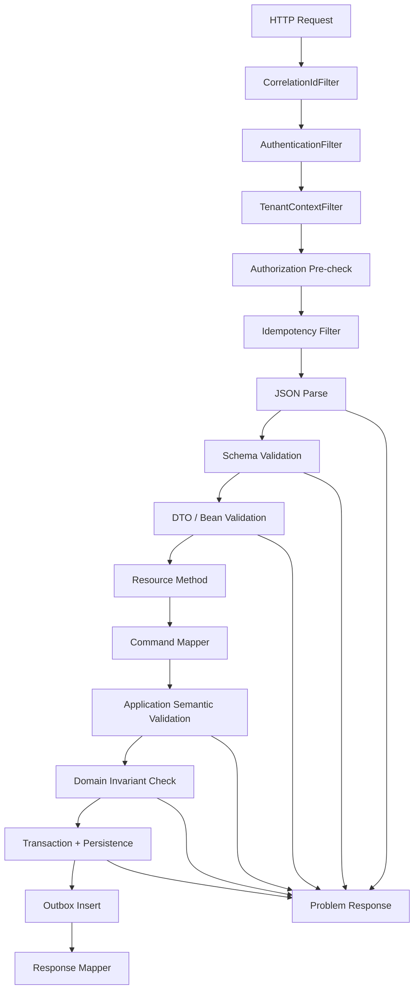
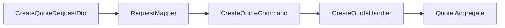
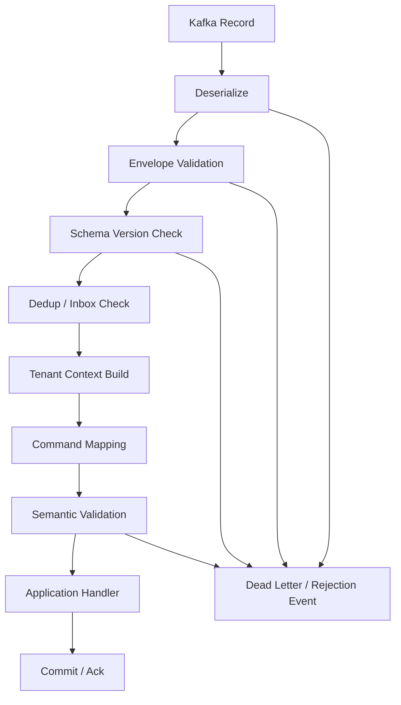

------
title: Build From Scratch: Enterprise Java Microservices CPQ & Order Management Platform - Part 021
description: Mendesain request validation dan error handling production-grade untuk CPQ/OMS Java: pipeline validasi, JSON Schema, Jakarta Validation, semantic validation, domain invariant, error taxonomy, problem detail, JAX-RS ExceptionMapper, deterministic response, dan test matrix.
series: learn-enterprise-cpq-oms-glassfish-camunda8
seriesTitle: Build From Scratch: Enterprise Java Microservices CPQ & Order Management Platform
order: 21
partTitle: Request Validation and Error Handling
tags:
  - java
  - jax-rs
  - jersey
  - glassfish
  - validation
  - json-schema
  - openapi
  - error-handling
  - cpq
  - oms
  - enterprise-architecture
date: 2026-07-02
------

# Part 021 — Request Validation and Error Handling

Part 019 membangun baseline Jakarta REST/Jersey/GlassFish. Part 020 menyusun module structure agar API, domain, persistence, workflow worker, dan messaging tidak saling bocor.

Sekarang kita masuk ke salah satu area yang terlihat kecil tetapi menentukan kualitas sistem enterprise:

> Bagaimana request yang masuk divalidasi, ditolak, diterima, atau diterjemahkan menjadi error yang stabil, bisa diaudit, dan bisa diperbaiki oleh consumer?

Dalam CPQ/OMS, request validation bukan sekadar `@NotNull`. Request validation adalah pagar pertama yang mencegah sistem membuat **janji komersial yang salah** atau **komitmen eksekusi yang tidak valid**.

Kalau validasi buruk, efeknya panjang:

- quote bisa dibuat dengan konfigurasi produk yang mustahil;
- harga bisa dihitung dari payload yang ambigu;
- order bisa dibuat dari quote yang sudah expired;
- state transition bisa lompat tanpa approval;
- fulfillment bisa berjalan untuk alamat, customer, atau asset yang salah;
- error response berubah-ubah sehingga consumer membuat retry logic yang salah;
- support team tidak bisa menjawab kenapa request ditolak;
- audit trail kehilangan alasan bisnis.

Kita akan membangun validation dan error model sebagai **execution gate**, bukan dekorasi controller.

---

## 1. Prinsip Utama

Ada empat prinsip yang akan dipakai sepanjang part ini.

### 1.1 Validate Sedekat Mungkin Dengan Boundary

Setiap boundary harus menjaga dirinya sendiri.

```text
External caller
  -> HTTP boundary validation
  -> application command validation
  -> domain invariant validation
  -> persistence constraint validation
  -> event consumer validation
  -> workflow worker validation
```

Jangan berasumsi bahwa karena API sudah memvalidasi request, maka Kafka consumer, Camunda worker, atau admin repair command aman. Setiap entry point harus tetap memvalidasi command yang masuk ke application service.

### 1.2 Jangan Campur Structural Validation Dengan Business Validation

Kesalahan umum:

```java
@NotNull
private String productOfferingId;

@AssertTrue
public boolean isProductAvailableForCustomer() {
    // call database or external service here
}
```

Ini buruk. Bean/DTO validation seharusnya hanya menangani bentuk data lokal yang murah dan deterministik. Eligibility produk, status quote, approval requirement, installed base compatibility, dan lifecycle rule harus ada di semantic/domain layer.

### 1.3 Error Harus Stabil, Bukan Sekadar Pesan Manusia

Consumer tidak boleh bergantung pada teks seperti:

```json
{"message": "Quote is invalid"}
```

Yang benar adalah error contract yang punya:

- stable error code;
- category;
- HTTP status;
- user-safe message;
- developer detail;
- field violations;
- correlation ID;
- business transaction ID;
- retryability signal;
- documentation link jika diperlukan;
- evidence untuk audit/support.

### 1.4 Domain Tidak Boleh Bergantung Pada HTTP

Domain tidak boleh tahu `400 Bad Request`, `409 Conflict`, atau `422 Unprocessable Content`. Domain hanya mengeluarkan domain violation.

HTTP layer yang memetakan domain violation ke HTTP response.

```text
DomainViolation(EXPIRED_QUOTE)
  -> API ExceptionMapper
  -> HTTP 409 / problem+json
```

Dengan cara ini, command yang sama bisa dipakai oleh:

- REST API;
- Kafka consumer;
- Camunda worker;
- admin repair tool;
- batch reconciliation job.

---

## 2. Validation Taxonomy

Untuk CPQ/OMS, kita pakai taxonomy berikut.

| Layer | Pertanyaan | Contoh Failure | Response Tipe |
|---|---|---|---|
| Transport | Apakah request bisa dibaca? | malformed JSON, unsupported media type | `400`, `415` |
| Contract | Apakah bentuk payload sesuai schema? | missing required field, wrong type | `400` |
| Bean/DTO | Apakah constraint sederhana terpenuhi? | blank customerId, invalid enum | `400` |
| Semantic | Apakah kombinasi field masuk akal? | quote validUntil < requestedDate | `422` atau `400` |
| Domain invariant | Apakah operasi legal terhadap aggregate? | submit quote yang sudah expired | `409`, `422` |
| Authorization | Apakah actor boleh melakukan operasi? | user tidak boleh override price | `403` |
| State transition | Apakah transisi state legal? | order `COMPLETED -> DRAFT` | `409` |
| Idempotency | Apakah request duplicate aman? | same key different payload | `409` |
| Persistence | Apakah constraint data source terpenuhi? | unique key conflict, FK missing | mapped to domain/API error |
| Integration | Apakah downstream menerima command? | provisioning rejects invalid address | workflow incident / integration error |

Taxonomy ini penting karena error dengan kategori berbeda harus ditangani berbeda oleh caller.

Contoh:

- malformed JSON tidak perlu retry;
- timeout downstream mungkin retryable;
- duplicate idempotency key dengan payload berbeda adalah bug caller;
- quote expired butuh user action;
- order fallout butuh operational repair;
- unauthorized override butuh approval atau role berbeda.

---

## 3. Request Pipeline

Untuk HTTP API, pipeline minimalnya seperti ini.



Pipeline ini bukan urutan absolut untuk semua endpoint, tetapi baseline untuk command API seperti:

- `POST /quotes`;
- `POST /quotes/{id}/items`;
- `POST /quotes/{id}/submit`;
- `POST /quotes/{id}/approve`;
- `POST /quotes/{id}/convert-to-order`;
- `POST /orders/{id}/cancel`;
- `POST /orders/{id}/fulfillment-tasks/{taskId}/retry`.

Untuk query API seperti `GET /quotes`, sebagian layer bisa lebih ringan. Tetapi correlation, authentication, tenant, authorization, parameter validation, dan error mapping tetap ada.

---

## 4. Error Contract Baseline

Kita akan menggunakan gaya `application/problem+json` yang compatible dengan problem detail pattern, tetapi diperluas untuk kebutuhan CPQ/OMS.

### 4.1 Shape Umum

```json
{
  "type": "https://api.example.com/problems/domain/quote-expired",
  "title": "Quote cannot be submitted",
  "status": 409,
  "detail": "The quote is expired and cannot be submitted.",
  "instance": "/quotes/q_100001/submit",
  "code": "QUOTE_EXPIRED",
  "category": "DOMAIN_CONFLICT",
  "retryable": false,
  "correlationId": "corr_01JZ8RPTZ8P8G3W6EEXAMPLE",
  "tenantId": "tenant_acme",
  "businessId": "q_100001",
  "violations": [],
  "metadata": {
    "quoteState": "DRAFT",
    "validUntil": "2026-07-01T00:00:00Z"
  }
}
```

### 4.2 Field Violation Shape

```json
{
  "code": "FIELD_REQUIRED",
  "field": "items[0].productOfferingId",
  "message": "productOfferingId is required.",
  "rejectedValue": null,
  "constraint": "required"
}
```

Field violation dipakai untuk error structural/DTO/semantic yang bisa langsung diperbaiki consumer.

Domain violation tidak selalu punya field. Misalnya:

- quote expired;
- order already completed;
- price override requires approval;
- asset version stale;
- fulfillment task is not retryable.

### 4.3 Error Category

Gunakan category yang stabil.

```text
REQUEST_MALFORMED
REQUEST_SCHEMA_INVALID
REQUEST_CONSTRAINT_INVALID
REQUEST_SEMANTIC_INVALID
AUTHENTICATION_FAILED
AUTHORIZATION_DENIED
TENANT_CONTEXT_INVALID
IDEMPOTENCY_CONFLICT
DOMAIN_CONFLICT
STATE_TRANSITION_INVALID
RESOURCE_NOT_FOUND
RESOURCE_ALREADY_EXISTS
OPTIMISTIC_LOCK_FAILED
DOWNSTREAM_UNAVAILABLE
INTEGRATION_REJECTED
RATE_LIMITED
INTERNAL_ERROR
```

### 4.4 Error Code Naming

Error code harus domain-aware.

Contoh buruk:

```text
INVALID_REQUEST
BUSINESS_ERROR
ERROR_001
```

Contoh baik:

```text
QUOTE_EXPIRED
QUOTE_ALREADY_SUBMITTED
QUOTE_REVISION_CONFLICT
QUOTE_ITEM_CONFIGURATION_INVALID
PRICE_OVERRIDE_REQUIRES_APPROVAL
ORDER_NOT_CANCELLABLE
ORDER_ITEM_DEPENDENCY_BLOCKED
FULFILLMENT_TASK_NOT_RETRYABLE
ASSET_VERSION_STALE
TENANT_HEADER_MISSING
IDEMPOTENCY_KEY_REUSED_WITH_DIFFERENT_PAYLOAD
```

Stable code adalah kontrak. Jangan ganti tanpa versioning.

---

## 5. HTTP Status Policy

HTTP status harus konsisten. Tidak semua business error adalah `400`.

| Situation | Status | Reason |
|---|---:|---|
| Malformed JSON | 400 | Payload tidak bisa dibaca |
| Schema/DTO invalid | 400 | Request shape invalid |
| Semantic request invalid | 422 | Bentuk valid, makna tidak bisa diproses |
| Missing auth | 401 | Caller belum authenticated |
| Authenticated but not allowed | 403 | Caller tidak punya permission |
| Resource tidak ada dalam tenant | 404 | Hindari leakage antar tenant |
| Duplicate create natural key | 409 | Conflict dengan state saat ini |
| Invalid lifecycle transition | 409 | Conflict dengan current state |
| Optimistic lock conflict | 409 | Expected version stale |
| Idempotency key conflict | 409 | Key sama, payload beda |
| Rate limit | 429 | Caller terlalu agresif |
| Downstream timeout | 503 atau 504 | Sistem tidak bisa menyelesaikan request |
| Unexpected bug | 500 | Internal failure |

Untuk CPQ/OMS, `409 Conflict` sangat penting karena banyak operasi adalah command terhadap stateful aggregate.

Contoh:

```text
POST /quotes/q1/submit
current state = EXPIRED
```

Ini bukan malformed request. Ini request yang bertabrakan dengan state domain. Maka `409` lebih jelas daripada `400`.

---

## 6. Layer 1 — Transport and JSON Parsing

Transport validation terjadi sebelum resource method.

Yang diperiksa:

- HTTP method;
- content type;
- accept header;
- body presence;
- body size;
- JSON syntax;
- charset;
- unsupported media type.

### 6.1 Content-Type Policy

Untuk command endpoint, tetapkan:

```http
Content-Type: application/json
Accept: application/json
```

Kalau memakai problem detail:

```http
Content-Type: application/problem+json
```

Jangan diam-diam menerima XML, form-data, atau text/plain untuk command CPQ/OMS kecuali memang ada endpoint khusus.

### 6.2 Unknown Field Policy

Untuk public command API, default yang aman:

```text
unknown field = rejected
```

Alasannya:

- mencegah caller mengira field sudah diproses padahal diabaikan;
- menghindari shadow field seperti `discountOverride` yang tidak pernah dipakai;
- memaksa compatibility eksplisit.

Untuk backward compatibility, additive field harus ditambahkan ke schema dan DTO secara sadar.

---

## 7. Layer 2 — JSON Schema Validation

JSON Schema dipakai untuk kontrak structural.

Yang cocok divalidasi dengan schema:

- required property;
- type;
- enum;
- string format;
- minimum/maximum;
- array cardinality;
- nested object shape;
- additional properties;
- oneOf/anyOf untuk command variant;
- common Money/Time/ID schema.

Yang tidak cocok divalidasi dengan schema:

- apakah product offering aktif pada market tertentu;
- apakah customer eligible;
- apakah quote expired;
- apakah price override butuh approval;
- apakah order item dependency valid terhadap installed base;
- apakah asset version stale;
- apakah role user boleh submit order.

### 7.1 Example Schema Fragment

```json
{
  "$id": "https://schemas.example.com/cpq/quote/create-quote-request.v1.schema.json",
  "type": "object",
  "additionalProperties": false,
  "required": ["customerId", "currency", "items"],
  "properties": {
    "customerId": {
      "type": "string",
      "minLength": 1
    },
    "currency": {
      "type": "string",
      "pattern": "^[A-Z]{3}$"
    },
    "items": {
      "type": "array",
      "minItems": 1,
      "items": {
        "$ref": "https://schemas.example.com/cpq/quote/quote-item-input.v1.schema.json"
      }
    }
  }
}
```

### 7.2 Schema Validation Output

Jangan expose raw validator error langsung. Normalize menjadi field violation.

Raw validator mungkin menghasilkan path seperti:

```text
$.items[0].configuration.characteristics[2].value
```

Response API harus stabil:

```json
{
  "code": "FIELD_TYPE_INVALID",
  "field": "items[0].configuration.characteristics[2].value",
  "message": "value must be a string.",
  "constraint": "type:string"
}
```

### 7.3 Schema Location

Di module structure Part 020, schema tinggal di contract module.

```text
cpq-oms-contracts/
└── schemas/
    ├── common/
    │   ├── money.v1.schema.json
    │   ├── identifier.v1.schema.json
    │   └── problem.v1.schema.json
    ├── quote/
    │   ├── create-quote-request.v1.schema.json
    │   ├── quote-response.v1.schema.json
    │   └── submit-quote-command.v1.schema.json
    └── order/
        ├── create-order-request.v1.schema.json
        └── cancel-order-command.v1.schema.json
```

Jangan simpan schema hanya di dokumentasi. Schema harus menjadi artifact yang dipakai test dan runtime validation.

---

## 8. Layer 3 — DTO / Jakarta Validation

DTO validation cocok untuk constraint lokal di Java object.

Contoh:

```java
public record CreateQuoteRequestDto(
    @NotBlank String customerId,
    @NotBlank String currency,
    @NotEmpty List<CreateQuoteItemDto> items,
    @Size(max = 1000) String note
) {}
```

Ini bagus untuk constraint murah.

Tetapi jangan masukkan rule seperti:

```java
@CustomerMustBeEligible
String customerId;
```

Jika validator itu perlu memanggil database, katalog, Redis, atau service lain, lebih baik pindahkan ke application semantic validator.

### 8.1 DTO Is Not Domain

DTO adalah bentuk kontrak API.

Domain command adalah bentuk niat bisnis.



DTO boleh punya annotation validation. Domain command boleh punya value object yang sudah lebih ketat. Aggregate tidak boleh bergantung pada DTO.

### 8.2 Fail Fast vs Collect All

Untuk structural/DTO validation, collect all violations lebih baik.

Caller akan menerima:

```json
{
  "code": "REQUEST_CONSTRAINT_INVALID",
  "violations": [
    {"field": "customerId", "code": "FIELD_REQUIRED"},
    {"field": "items", "code": "ARRAY_MIN_ITEMS"},
    {"field": "currency", "code": "FIELD_PATTERN_INVALID"}
  ]
}
```

Untuk domain invariant, fail fast sering lebih baik karena satu violation bisa membuat rule berikutnya tidak meaningful.

Contoh:

- jika quote tidak ditemukan, jangan cek price override;
- jika tenant mismatch, jangan cek state;
- jika order already completed, jangan cek cancellation reason.

---

## 9. Layer 4 — Semantic Validation

Semantic validation memeriksa apakah kombinasi input masuk akal sebelum menyentuh aggregate secara penuh.

Contoh rule:

- `requestedCompletionDate` tidak boleh sebelum hari ini;
- `contractTermMonths` harus sesuai allowed term dari product offering;
- `discountPercent` dan `discountAmount` tidak boleh dikirim bersamaan;
- `quoteItem.action = MODIFY` wajib punya `assetId`;
- `disconnectReason` wajib ada jika action `DISCONNECT`;
- order cancellation harus menyertakan reason code;
- quote submit tidak boleh memakai empty item list;
- `effectiveDate` harus berada dalam window yang diizinkan.

Semantic validation biasanya butuh:

- request DTO/command;
- tenant context;
- current time;
- catalog snapshot;
- pricing policy;
- installed base summary;
- feature flag;
- market/segment context.

### 9.1 Example Semantic Validator

```java
public final class CreateQuoteSemanticValidator {

    private final ProductOfferingLookup offeringLookup;
    private final Clock clock;

    public List<Violation> validate(CreateQuoteCommand command, RequestContext context) {
        List<Violation> violations = new ArrayList<>();

        if (command.items().isEmpty()) {
            violations.add(Violation.field(
                "items",
                "QUOTE_ITEMS_REQUIRED",
                "At least one quote item is required."
            ));
        }

        for (int i = 0; i < command.items().size(); i++) {
            QuoteItemCommand item = command.items().get(i);

            if (item.action() == QuoteItemAction.MODIFY && item.assetId().isEmpty()) {
                violations.add(Violation.field(
                    "items[" + i + "].assetId",
                    "ASSET_ID_REQUIRED_FOR_MODIFY",
                    "assetId is required when action is MODIFY."
                ));
            }

            if (!offeringLookup.exists(context.tenantId(), item.productOfferingId())) {
                violations.add(Violation.field(
                    "items[" + i + "].productOfferingId",
                    "PRODUCT_OFFERING_NOT_FOUND",
                    "Product offering does not exist in this tenant."
                ));
            }
        }

        return violations;
    }
}
```

Perhatikan: validator ini belum mengubah state. Ia hanya membaca data untuk menilai apakah command masuk akal.

---

## 10. Layer 5 — Domain Invariant Validation

Domain invariant adalah aturan yang melindungi aggregate.

Contoh pada Quote:

```java
public void submit(SubmitQuoteCommand command, Actor actor, Instant now) {
    if (state != QuoteState.DRAFT && state != QuoteState.REVISED) {
        throw DomainViolation.of(
            "QUOTE_NOT_SUBMITTABLE",
            "Only DRAFT or REVISED quote can be submitted."
        );
    }

    if (validUntil.isBefore(now)) {
        throw DomainViolation.of(
            "QUOTE_EXPIRED",
            "Expired quote cannot be submitted."
        );
    }

    if (items.isEmpty()) {
        throw DomainViolation.of(
            "QUOTE_ITEMS_REQUIRED",
            "Quote must have at least one item."
        );
    }

    this.state = QuoteState.SUBMITTED;
    this.submittedBy = actor.actorId();
    this.submittedAt = now;
}
```

Aggregate tidak mengembalikan `Response`. Aggregate hanya menjaga kebenaran domain.

### 10.1 Domain Violation Object

```java
public final class DomainViolation extends RuntimeException {
    private final String code;
    private final String category;
    private final boolean retryable;
    private final Map<String, Object> metadata;

    private DomainViolation(
        String code,
        String message,
        String category,
        boolean retryable,
        Map<String, Object> metadata
    ) {
        super(message);
        this.code = code;
        this.category = category;
        this.retryable = retryable;
        this.metadata = Map.copyOf(metadata);
    }

    public static DomainViolation conflict(
        String code,
        String message,
        Map<String, Object> metadata
    ) {
        return new DomainViolation(code, message, "DOMAIN_CONFLICT", false, metadata);
    }
}
```

Domain violation sebaiknya immutable dan serializable ke log/audit, tetapi tidak perlu langsung berbentuk API response.

---

## 11. Exception Mapping di JAX-RS/Jersey

Di Jakarta REST, exception mapper menjadi tempat natural untuk memetakan exception menjadi response.

```java
@Provider
public final class DomainViolationMapper implements ExceptionMapper<DomainViolation> {

    @Context
    private HttpServletRequest request;

    @Override
    public Response toResponse(DomainViolation exception) {
        ProblemResponse problem = ProblemResponse.builder()
            .type("https://api.example.com/problems/domain/" + toSlug(exception.code()))
            .title(titleFor(exception.code()))
            .status(409)
            .detail(exception.getMessage())
            .instance(request.getRequestURI())
            .code(exception.code())
            .category(exception.category())
            .retryable(exception.retryable())
            .correlationId(RequestContext.current().correlationId())
            .tenantId(RequestContext.current().tenantId().orElse(null))
            .metadata(exception.metadata())
            .build();

        return Response.status(Response.Status.CONFLICT)
            .type("application/problem+json")
            .entity(problem)
            .build();
    }
}
```

Kita akan punya beberapa mapper:

```text
JsonParseExceptionMapper
SchemaValidationExceptionMapper
ConstraintViolationExceptionMapper
SemanticValidationExceptionMapper
DomainViolationMapper
AuthorizationExceptionMapper
NotFoundExceptionMapper
OptimisticLockExceptionMapper
IdempotencyConflictExceptionMapper
DownstreamExceptionMapper
UnhandledExceptionMapper
```

### 11.1 Unhandled Exception Mapper

Unhandled exception jangan membocorkan stack trace.

```java
@Provider
public final class UnhandledExceptionMapper implements ExceptionMapper<Throwable> {

    @Override
    public Response toResponse(Throwable exception) {
        String correlationId = RequestContext.currentOrEmpty().correlationIdOrGenerated();

        log.error("Unhandled API error correlationId={}", correlationId, exception);

        ProblemResponse problem = ProblemResponse.builder()
            .type("https://api.example.com/problems/internal/unexpected-error")
            .title("Unexpected internal error")
            .status(500)
            .detail("The request could not be completed due to an internal error.")
            .code("INTERNAL_ERROR")
            .category("INTERNAL_ERROR")
            .retryable(false)
            .correlationId(correlationId)
            .build();

        return Response.status(500)
            .type("application/problem+json")
            .entity(problem)
            .build();
    }
}
```

Log boleh detail. Response tidak boleh detail.

---

## 12. ProblemResponse Model

Jangan gunakan `Map<String, Object>` sembarangan sebagai response. Buat model eksplisit.

```java
public record ProblemResponse(
    String type,
    String title,
    int status,
    String detail,
    String instance,
    String code,
    String category,
    boolean retryable,
    String correlationId,
    String tenantId,
    String businessId,
    List<FieldViolationResponse> violations,
    Map<String, Object> metadata
) {}
```

Field violation:

```java
public record FieldViolationResponse(
    String code,
    String field,
    String message,
    Object rejectedValue,
    String constraint
) {}
```

### 12.1 Redaction Policy

`rejectedValue` harus hati-hati.

Boleh expose:

- enum invalid;
- string pendek non-sensitive;
- number;
- boolean;
- field kosong/null.

Jangan expose:

- token;
- password;
- customer secret;
- personal identifier sensitif;
- full address jika policy melarang;
- payment data;
- internal SQL value;
- downstream error raw.

Buat utility:

```java
public final class RejectedValueRedactor {
    public Object redact(String fieldPath, Object value) {
        if (fieldPath.toLowerCase(Locale.ROOT).contains("token")) {
            return "<redacted>";
        }
        if (fieldPath.toLowerCase(Locale.ROOT).contains("password")) {
            return "<redacted>";
        }
        if (value instanceof String s && s.length() > 128) {
            return s.substring(0, 128) + "...";
        }
        return value;
    }
}
```

---

## 13. Validation Dalam Command Handler

Resource method harus tipis.

```java
@Path("/quotes")
@Consumes(MediaType.APPLICATION_JSON)
@Produces(MediaType.APPLICATION_JSON)
public final class QuoteResource {

    private final CreateQuoteHandler createQuoteHandler;
    private final CreateQuoteRequestMapper mapper;

    @POST
    public Response createQuote(@Valid CreateQuoteRequestDto request) {
        RequestContext context = RequestContext.current();
        CreateQuoteCommand command = mapper.toCommand(request, context);

        CreateQuoteResult result = createQuoteHandler.handle(command, context);

        URI location = URI.create("/quotes/" + result.quoteId().value());
        return Response.created(location)
            .entity(QuoteResponseMapper.toResponse(result.quote()))
            .build();
    }
}
```

Handler:

```java
public final class CreateQuoteHandler {

    private final CreateQuoteSemanticValidator validator;
    private final QuoteRepository quoteRepository;
    private final OutboxRepository outboxRepository;
    private final TransactionRunner transactionRunner;

    public CreateQuoteResult handle(CreateQuoteCommand command, RequestContext context) {
        List<Violation> violations = validator.validate(command, context);
        if (!violations.isEmpty()) {
            throw SemanticValidationException.of("CREATE_QUOTE_INVALID", violations);
        }

        return transactionRunner.required(() -> {
            Quote quote = Quote.create(command, context.actor(), context.now());
            quoteRepository.save(quote);
            outboxRepository.insert(QuoteCreatedEvent.from(quote, context));
            return new CreateQuoteResult(quote.id(), quote);
        });
    }
}
```

Pattern-nya:

```text
Resource -> DTO Validation -> Mapper -> Semantic Validator -> Aggregate -> Repository -> Outbox
```

---

## 14. Idempotency Validation

Command endpoint yang bisa menciptakan atau mengubah state harus mendukung idempotency.

Header:

```http
Idempotency-Key: idem_01JZ8S0J9Y0EXAMPLE
```

Idempotency check memvalidasi:

- key ada untuk endpoint yang wajib idempotent;
- key format valid;
- key belum expired;
- key belum dipakai oleh request berbeda;
- key boleh mengembalikan cached response jika payload hash sama;
- key tenant-scoped;
- key actor/client-scoped bila perlu.

### 14.1 Idempotency Conflict Response

```json
{
  "type": "https://api.example.com/problems/request/idempotency-conflict",
  "title": "Idempotency key conflict",
  "status": 409,
  "detail": "The idempotency key has already been used with a different request payload.",
  "code": "IDEMPOTENCY_KEY_REUSED_WITH_DIFFERENT_PAYLOAD",
  "category": "IDEMPOTENCY_CONFLICT",
  "retryable": false,
  "correlationId": "corr_01JZ8S..."
}
```

### 14.2 Payload Hash

Hash harus berasal dari canonical payload, bukan raw string kalau whitespace/order field bisa berubah.

```text
canonical_json_hash = sha256(canonicalize(request_body))
```

Tetapi jangan terlalu pintar sampai membuat payload berbeda terlihat sama jika secara bisnis berbeda.

---

## 15. Optimistic Lock Validation

Untuk update stateful resource, pakai expected version.

Header:

```http
If-Match: "quote-version-7"
```

Atau command field:

```json
{
  "expectedVersion": 7,
  "note": "Submit for approval"
}
```

Jika current version berbeda:

```json
{
  "code": "QUOTE_VERSION_CONFLICT",
  "category": "OPTIMISTIC_LOCK_FAILED",
  "status": 409,
  "detail": "Quote version is stale. Current version is 8."
}
```

Rule:

- jangan overwrite silent;
- jangan reload lalu retry otomatis untuk command bisnis tanpa persetujuan;
- expose cukup informasi agar caller bisa refresh;
- audit conflict jika command penting seperti approve/convert.

---

## 16. Persistence Error Mapping

Database constraint tetap diperlukan, tetapi jangan expose raw SQL error.

Contoh PostgreSQL unique violation:

```text
duplicate key value violates unique constraint uq_quote_external_ref
```

Response API:

```json
{
  "code": "QUOTE_EXTERNAL_REFERENCE_ALREADY_EXISTS",
  "category": "RESOURCE_ALREADY_EXISTS",
  "status": 409,
  "detail": "A quote with the same external reference already exists."
}
```

Mapping perlu dibuat explicit:

```java
public final class PersistenceExceptionTranslator {

    public RuntimeException translate(RuntimeException ex) {
        if (isUniqueViolation(ex, "uq_quote_external_ref")) {
            return DomainViolation.conflict(
                "QUOTE_EXTERNAL_REFERENCE_ALREADY_EXISTS",
                "A quote with the same external reference already exists.",
                Map.of()
            );
        }

        if (isOptimisticLock(ex)) {
            return DomainViolation.conflict(
                "OPTIMISTIC_LOCK_FAILED",
                "The resource was modified by another transaction.",
                Map.of()
            );
        }

        return ex;
    }
}
```

Persistence constraint adalah last line of defense, bukan primary user experience.

---

## 17. Kafka Consumer Validation

Event consumer tidak menerima HTTP request, tetapi tetap menerima input dari luar boundary service.

Consumer pipeline:



Consumer harus memvalidasi:

- topic expected;
- key format;
- event envelope;
- event type;
- schema version;
- tenant ID;
- event ID uniqueness;
- producer service;
- timestamp sanity;
- payload shape;
- idempotency/inbox record.

Jangan percaya event hanya karena datang dari Kafka internal.

---

## 18. Camunda Worker Validation

Camunda worker menerima job variables. Variables juga kontrak.

Worker pipeline:

```text
Zeebe Job
  -> variable schema validation
  -> tenant/process context validation
  -> business reference lookup
  -> idempotency/work item lock
  -> application handler
  -> complete/fail/throw BPMN error
```

Contoh variable validation:

```java
public final class ReserveResourceWorker {

    public void handle(JobClient client, ActivatedJob job) {
        ReserveResourceVariables variables = variableMapper.map(job.getVariables());

        List<Violation> violations = variableValidator.validate(variables);
        if (!violations.isEmpty()) {
            throw new WorkflowVariableInvalidException(job.getKey(), violations);
        }

        reserveResourceHandler.handle(toCommand(variables, job));
        client.newCompleteCommand(job.getKey()).send().join();
    }
}
```

Jika variable invalid karena bug BPMN/model mapping, itu biasanya bukan user error. Itu incident engineering/operation.

---

## 19. Error Handling Dalam Workflow

Tidak semua error workflow harus menjadi API response.

Ada tiga jenis error:

| Error Type | Contoh | Handling |
|---|---|---|
| Business BPMN error | credit check rejected | BPMN boundary event |
| Retryable technical error | provisioning timeout | job retry/backoff |
| Non-retryable technical/config error | invalid worker variable | incident/manual repair |

Jangan lempar semua exception sebagai retryable. Jika input invalid permanen, retry hanya membuat noise.

### 19.1 Worker Error Mapping

```text
DomainViolation(RESOURCE_NOT_AVAILABLE)
  -> BPMN business error RESOURCE_NOT_AVAILABLE

DownstreamTimeout
  -> fail job with retry

VariableSchemaInvalid
  -> fail job without retry / incident
```

---

## 20. Logging Policy

Error response untuk caller harus ringkas. Log internal harus cukup kaya untuk debugging.

Minimal log fields:

```text
correlationId
tenantId
actorId
clientId
httpMethod
path
status
errorCode
errorCategory
businessId
idempotencyKey
requestHash
elapsedMs
```

Untuk domain command:

```text
commandType
aggregateType
aggregateId
expectedVersion
actualVersion
stateBefore
attemptedTransition
```

Jangan log payload penuh secara default. Gunakan structured summary.

---

## 21. Audit Policy

Tidak semua validation error perlu audit event. Tetapi beberapa harus.

Audit-worthy rejection:

- price override denied;
- approval submit rejected;
- order cancellation rejected;
- cross-tenant access attempt;
- repeated idempotency conflict;
- unauthorized manual repair attempt;
- stale asset version causing failed modify/disconnect;
- admin operation rejected.

Contoh audit record:

```json
{
  "eventType": "COMMAND_REJECTED",
  "aggregateType": "QUOTE",
  "aggregateId": "q_100001",
  "commandType": "SUBMIT_QUOTE",
  "rejectionCode": "QUOTE_EXPIRED",
  "actorId": "user_123",
  "tenantId": "tenant_acme",
  "correlationId": "corr_01JZ...",
  "occurredAt": "2026-07-02T10:30:00Z"
}
```

Audit bukan log debug. Audit adalah evidence bisnis.

---

## 22. Error Documentation

Setiap stable error code penting harus terdokumentasi.

```mdx
# QUOTE_EXPIRED

## Meaning
The quote validity window has passed. The quote can no longer be submitted or converted to order.

## HTTP Status
409 Conflict

## Retryable
No.

## Caller Action
Refresh quote, create new revision, or request extension.

## Related State
DRAFT, REVISED, SUBMITTED depending on operation.
```

Dalam problem response, `type` bisa menunjuk ke dokumentasi ini.

---

## 23. Testing Strategy

Testing validation/error handling harus lebih dari happy path.

### 23.1 Contract-Level Tests

Test schema examples:

```text
valid create quote request passes schema
missing customerId fails with FIELD_REQUIRED
unknown field fails with FIELD_UNKNOWN
invalid currency fails with FIELD_PATTERN_INVALID
items empty fails with ARRAY_MIN_ITEMS
```

### 23.2 API-Level Tests

Test HTTP response:

```text
malformed JSON -> 400 REQUEST_MALFORMED
missing body -> 400 REQUEST_BODY_REQUIRED
unsupported content type -> 415 UNSUPPORTED_MEDIA_TYPE
invalid DTO -> 400 REQUEST_CONSTRAINT_INVALID
semantic invalid -> 422 REQUEST_SEMANTIC_INVALID
expired quote submit -> 409 QUOTE_EXPIRED
stale version -> 409 QUOTE_VERSION_CONFLICT
missing token -> 401 AUTHENTICATION_FAILED
insufficient permission -> 403 AUTHORIZATION_DENIED
```

### 23.3 Golden Error Payload Tests

Simpan expected error payload sebagai fixture.

```text
src/test/resources/golden-errors/
├── quote-expired.problem.json
├── quote-version-conflict.problem.json
├── malformed-json.problem.json
├── field-required.problem.json
└── idempotency-conflict.problem.json
```

Golden tests mencegah error contract berubah tanpa sadar.

### 23.4 Domain Invariant Tests

```java
@Test
void expiredQuoteCannotBeSubmitted() {
    Quote quote = QuoteFixture.expiredDraftQuote();

    DomainViolation violation = assertThrows(
        DomainViolation.class,
        () -> quote.submit(command, actor, now)
    );

    assertEquals("QUOTE_EXPIRED", violation.code());
}
```

### 23.5 Persistence Mapping Tests

Test bahwa SQL exception diterjemahkan dengan benar.

```text
unique constraint uq_quote_external_ref -> QUOTE_EXTERNAL_REFERENCE_ALREADY_EXISTS
version update count 0 -> QUOTE_VERSION_CONFLICT
foreign key product_offering_id -> PRODUCT_OFFERING_NOT_FOUND
```

---

## 24. Anti-Patterns

### 24.1 Semua Error Jadi 500

Ini membuat caller tidak bisa membedakan bug, invalid request, stale version, atau domain conflict.

### 24.2 Semua Business Error Jadi 400

Ini menghilangkan state semantics. `ORDER_NOT_CANCELLABLE` bukan sekadar bad request; itu conflict dengan current state.

### 24.3 Error Message Sebagai Contract

Consumer tidak boleh parse string manusia. Gunakan error code stabil.

### 24.4 Validation Hanya Di Controller

Kafka consumer, worker, batch job, dan repair tool akan menjadi bypass path.

### 24.5 Domain Melempar WebApplicationException

Domain menjadi tergantung HTTP dan sulit dipakai di entry point lain.

### 24.6 Expose Raw Downstream Error

Downstream mungkin mengandung detail internal, token, SQL, hostname, atau data sensitif.

### 24.7 Retry Semua Error

Invalid payload tidak akan sembuh dengan retry. Retry hanya untuk transient failure.

---

## 25. Build Milestone Untuk Part Ini

Setelah part ini, target implementasi minimal:

```text
[x] ProblemResponse model
[x] FieldViolationResponse model
[x] Error category enum
[x] DomainViolation base class
[x] SemanticValidationException
[x] ExceptionMapper for domain violation
[x] ExceptionMapper for constraint violation
[x] ExceptionMapper for malformed JSON
[x] ExceptionMapper for unhandled error
[x] DTO validation example for CreateQuoteRequest
[x] Semantic validator example for CreateQuoteCommand
[x] Golden error payload test structure
[x] Logging field convention
```

Part ini belum membangun full engine. Kita sedang membuat **safety layer** yang akan dipakai semua command berikutnya.

---

## 26. Mental Model Ringkas

Validation dalam CPQ/OMS bukan pertanyaan:

> “Apakah request punya field yang lengkap?”

Pertanyaan yang benar:

> “Apakah command ini aman, legal, meaningful, authorized, tenant-safe, idempotent, dan bisa dijelaskan jika ditolak?”

Jika error handling bagus, sistem menjadi:

- mudah dipakai consumer;
- mudah ditest;
- mudah diaudit;
- mudah direpair;
- tidak bocor detail internal;
- tahan retry;
- tahan concurrency;
- tahan perubahan schema.

Error yang bagus bukan hanya pesan gagal. Error yang bagus adalah bagian dari **operational contract**.

---

## 27. Referensi Resmi

- Jakarta Validation mendefinisikan metadata model dan API untuk JavaBean/method validation.
- Jakarta REST menyediakan extension point seperti provider, filter, dan exception mapper untuk request/response processing.
- RFC 9457 mendefinisikan Problem Details for HTTP APIs sebagai format machine-readable untuk error HTTP.
- OpenAPI 3.1 dan JSON Schema Draft 2020-12 relevan untuk contract dan schema validation.

Part berikutnya akan membangun layer yang selalu muncul sebelum validasi bisnis penuh: **authentication, authorization, dan tenant context**.
