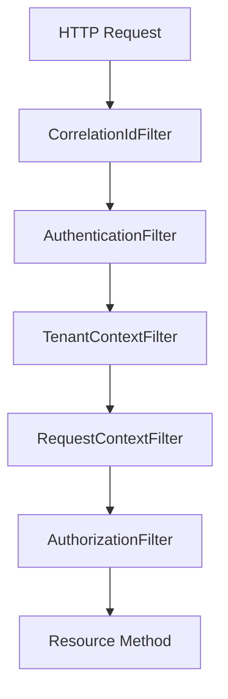

------
title: Build From Scratch: Enterprise Java Microservices CPQ & Order Management Platform - Part 022
description: Mendesain authentication, authorization, dan tenant context untuk CPQ/OMS enterprise: identity boundary, OAuth2/JWT, service-to-service trust, RBAC/ABAC, tenant isolation, permission evaluator, JAX-RS filters, MyBatis scoping, Kafka/Camunda propagation, audit, dan failure modelling.
series: learn-enterprise-cpq-oms-glassfish-camunda8
seriesTitle: Build From Scratch: Enterprise Java Microservices CPQ & Order Management Platform
order: 22
partTitle: Authentication Authorization and Tenant Context
tags:
  - java
  - security
  - authentication
  - authorization
  - tenant-context
  - jax-rs
  - jersey
  - glassfish
  - cpq
  - oms
  - enterprise-architecture
date: 2026-07-02
------

# Part 022 — Authentication, Authorization, and Tenant Context

Part 021 membangun validation dan error handling. Tetapi sebelum kita bisa berkata “request valid”, kita harus menjawab tiga pertanyaan yang lebih mendasar:

1. **Siapa caller-nya?**
2. **Caller ini sedang bertindak untuk tenant/customer/context mana?**
3. **Caller ini boleh melakukan aksi ini terhadap resource ini atau tidak?**

Dalam CPQ/OMS enterprise, security bukan lapisan yang ditempel di akhir. Security adalah bagian dari domain safety.

Quote, price override, approval, order cancellation, fulfillment retry, asset modification, dan manual repair adalah operasi yang punya konsekuensi bisnis. Salah authorize bisa berarti:

- sales rep melihat quote tenant lain;
- agent mengubah price override tanpa approval authority;
- integration client membuat order untuk customer yang salah;
- support user membatalkan order yang sudah melewati point of no return;
- worker memproses event tenant lain;
- audit tidak bisa menjelaskan siapa melakukan apa.

Kita akan mendesain security model yang cukup realistis untuk enterprise-grade CPQ/OMS.

---

## 1. Core Distinction

Jangan campur istilah berikut.

| Concept | Pertanyaan | Contoh |
|---|---|---|
| Authentication | Siapa caller? | user_123, service_order_api |
| Authorization | Boleh melakukan apa? | `quote.submit`, `price.override` |
| Tenant Context | Dalam boundary tenant mana? | tenant_acme |
| Actor Context | Bertindak sebagai siapa? | sales user, approver, system worker |
| Subject | Identitas yang diautentikasi | user atau service client |
| Principal | Representasi subject di aplikasi | SecurityPrincipal |
| Permission | Kapabilitas spesifik | `ORDER_CANCEL` |
| Policy | Rule yang memutuskan allow/deny | role + attribute + state |
| Data Scope | Resource mana yang boleh dilihat | own region, own account, tenant |

Kesalahan umum adalah menganggap role sudah cukup.

```text
role = SALES
```

Role ini belum menjawab:

- sales untuk tenant mana?
- sales untuk region mana?
- boleh melihat semua quote atau hanya quote sendiri?
- boleh memberi discount sampai berapa persen?
- boleh submit quote yang ada non-standard term?
- boleh convert quote ke order?
- boleh melakukan action ketika quote sudah approved?

Untuk CPQ/OMS, authorization harus mempertimbangkan **aksi + resource + actor + tenant + state + monetary/approval context**.

---

## 2. Threat Model Ringkas

Kita tidak sedang membangun security product, tetapi kita harus jelas terhadap ancaman utama.

### 2.1 Cross-Tenant Data Leak

Bug paling mahal di multi-tenant system.

Contoh:

```sql
SELECT * FROM quote WHERE quote_id = ?
```

Jika `quote_id` global dan query tidak memakai `tenant_id`, caller bisa membaca quote tenant lain ketika ID diketahui/tertebak.

Query harus tenant-scoped:

```sql
SELECT *
FROM quote
WHERE tenant_id = #{tenantId}
  AND quote_id = #{quoteId}
```

### 2.2 Privilege Escalation Melalui Command Field

Caller mengirim field yang seharusnya server-controlled:

```json
{
  "discountPercent": 80,
  "approvalStatus": "APPROVED",
  "approvedBy": "manager_1"
}
```

Schema harus reject server-controlled field dari public request.

### 2.3 Confused Deputy

Service internal punya permission besar, lalu dipakai untuk melakukan aksi atas nama user tanpa memeriksa user permission.

Contoh:

```text
UI -> API Gateway -> Quote Service -> Order Service
```

Order Service melihat caller adalah Quote Service, lalu percaya semua request. Padahal user asalnya mungkin tidak boleh convert quote.

Solusi: propagasi actor context dan authorization decision, atau lakukan authorization di service yang memiliki resource.

### 2.4 Broken Object Level Authorization

Endpoint memeriksa role, tapi tidak memeriksa ownership/resource relation.

```text
User punya role SALES
GET /quotes/q_other_sales
```

Harus cek apakah quote berada dalam accessible scope user.

### 2.5 Workflow/Worker Bypass

Camunda worker atau Kafka consumer menjalankan command tanpa authorization karena dianggap internal.

Internal bukan berarti bebas rule. Worker harus memiliki system actor dan policy yang jelas.

---

## 3. Identity Model

Kita bedakan dua jenis subject.

### 3.1 Human User

Contoh:

```json
{
  "subjectType": "USER",
  "subjectId": "user_123",
  "displayName": "Ayu Sales",
  "tenantIds": ["tenant_acme"],
  "roles": ["SALES_REP"],
  "permissions": ["QUOTE_CREATE", "QUOTE_SUBMIT"],
  "attributes": {
    "region": "ID-JKT",
    "salesChannel": "ENTERPRISE",
    "maxDiscountPercent": 15
  }
}
```

### 3.2 Service Client

Contoh:

```json
{
  "subjectType": "SERVICE",
  "subjectId": "svc_order_fulfillment_worker",
  "tenantIds": ["tenant_acme"],
  "roles": ["FULFILLMENT_WORKER"],
  "permissions": ["FULFILLMENT_TASK_COMPLETE", "ORDER_STATE_ADVANCE"],
  "attributes": {
    "serviceName": "fulfillment-worker"
  }
}
```

Service client tidak boleh otomatis punya semua permission.

---

## 4. Token and Trust Boundary

Dalam banyak enterprise stack, API menerima bearer token dari identity provider. Token bisa opaque atau JWT tergantung arsitektur.

Yang penting untuk service kita:

- token divalidasi di trust boundary;
- issuer dipercaya;
- audience cocok;
- signature valid jika JWT;
- token belum expired;
- tenant claim valid;
- subject/roles/permissions dipetakan ke model internal;
- token raw tidak disimpan di domain/audit;
- authorization tetap dilakukan di service.

### 4.1 Token Claim Minimal

Contoh claim yang berguna:

```json
{
  "iss": "https://identity.example.com",
  "sub": "user_123",
  "aud": "cpq-oms-api",
  "exp": 1782990000,
  "iat": 1782986400,
  "tenant_id": "tenant_acme",
  "roles": ["SALES_REP"],
  "permissions": ["QUOTE_CREATE", "QUOTE_SUBMIT"],
  "client_id": "web-sales-console"
}
```

Jangan percaya claim custom tanpa validasi issuer/audience/signature.

### 4.2 Token To Principal Mapping

Buat mapper eksplisit.

```java
public final class SecurityPrincipal {
    private final SubjectType subjectType;
    private final String subjectId;
    private final String clientId;
    private final Set<String> roles;
    private final Set<String> permissions;
    private final Set<String> tenantIds;
    private final Map<String, String> attributes;

    public boolean hasPermission(String permission) {
        return permissions.contains(permission);
    }
}
```

Resource dan domain tidak perlu tahu bentuk token asli.

---

## 5. Tenant Context

Tenant context adalah boundary data dan policy.

Sumber tenant bisa dari:

- token claim `tenant_id`;
- header `X-Tenant-Id`;
- path segment `/tenants/{tenantId}/...`;
- subdomain;
- service account binding;
- resolved from customer/account.

Untuk seri ini, kita pakai policy:

```text
Tenant must be explicit and must be allowed by authenticated principal.
```

Header:

```http
X-Tenant-Id: tenant_acme
```

Token juga punya allowed tenants.

Jika header tenant tidak ada:

```json
{
  "code": "TENANT_HEADER_MISSING",
  "category": "TENANT_CONTEXT_INVALID",
  "status": 400
}
```

Jika tenant tidak termasuk allowed tenants principal:

```json
{
  "code": "TENANT_ACCESS_DENIED",
  "category": "AUTHORIZATION_DENIED",
  "status": 403
}
```

### 5.1 Tenant Context Object

```java
public record TenantContext(
    String tenantId,
    String market,
    String region,
    String salesChannel
) {}
```

Jangan ambil tenant dari static global secara liar. Gunakan request-scoped context yang jelas.

---

## 6. RequestContext

Semua command butuh context.

```java
public record RequestContext(
    String correlationId,
    TenantContext tenant,
    SecurityPrincipal principal,
    Actor actor,
    Instant now,
    Optional<String> idempotencyKey,
    Optional<String> requestHash,
    String sourceSystem
) {}
```

Actor berbeda dari principal.

Contoh:

```text
principal = svc_quote_api
actor = user_123
```

Ini terjadi ketika service-to-service call membawa delegated user context.

Untuk system job:

```text
principal = svc_fulfillment_worker
actor = system:fulfillment-worker
```

### 6.1 Actor Untuk Audit

Audit selalu butuh actor.

```java
public record Actor(
    ActorType type,
    String actorId,
    String displayName
) {}
```

Actor type:

```text
USER
SERVICE
SYSTEM_JOB
REPAIR_OPERATOR
```

---

## 7. Filter Chain Di JAX-RS/Jersey

Security dan tenant filter berjalan sebelum resource method.



### 7.1 Authentication Filter

```java
@Provider
@Priority(Priorities.AUTHENTICATION)
public final class AuthenticationFilter implements ContainerRequestFilter {

    private final TokenVerifier tokenVerifier;
    private final PrincipalMapper principalMapper;

    @Override
    public void filter(ContainerRequestContext requestContext) {
        String authorization = requestContext.getHeaderString("Authorization");

        if (authorization == null || !authorization.startsWith("Bearer ")) {
            throw AuthenticationException.missingToken();
        }

        String token = authorization.substring("Bearer ".length());
        VerifiedToken verified = tokenVerifier.verify(token);
        SecurityPrincipal principal = principalMapper.map(verified);

        requestContext.setProperty("securityPrincipal", principal);
    }
}
```

### 7.2 Tenant Context Filter

```java
@Provider
@Priority(Priorities.AUTHORIZATION - 100)
public final class TenantContextFilter implements ContainerRequestFilter {

    @Override
    public void filter(ContainerRequestContext requestContext) {
        SecurityPrincipal principal = property(requestContext, "securityPrincipal");
        String tenantId = requestContext.getHeaderString("X-Tenant-Id");

        if (tenantId == null || tenantId.isBlank()) {
            throw TenantContextException.missingTenantHeader();
        }

        if (!principal.tenantIds().contains(tenantId)) {
            throw AuthorizationException.denied("TENANT_ACCESS_DENIED");
        }

        TenantContext tenantContext = new TenantContext(tenantId, null, null, null);
        requestContext.setProperty("tenantContext", tenantContext);
    }
}
```

### 7.3 Request Context Assembly

```java
@Provider
public final class RequestContextFilter implements ContainerRequestFilter {

    @Override
    public void filter(ContainerRequestContext request) {
        SecurityPrincipal principal = property(request, "securityPrincipal");
        TenantContext tenant = property(request, "tenantContext");
        String correlationId = (String) request.getProperty("correlationId");

        RequestContext current = new RequestContext(
            correlationId,
            tenant,
            principal,
            Actor.fromPrincipal(principal),
            Instant.now(),
            Optional.ofNullable(request.getHeaderString("Idempotency-Key")),
            Optional.empty(),
            "http-api"
        );

        RequestContextHolder.set(current);
    }
}
```

Pastikan context dibersihkan di response filter/finally untuk menghindari leak antar request thread.

---

## 8. Authorization Model

Kita pakai kombinasi:

- RBAC untuk coarse capability;
- ABAC untuk attribute/data condition;
- state-based policy untuk aggregate lifecycle;
- monetary threshold untuk approval/pricing;
- tenant/data scope untuk isolation.

### 8.1 Permission List Awal

```text
CATALOG_READ
CATALOG_ADMIN
QUOTE_CREATE
QUOTE_READ
QUOTE_UPDATE
QUOTE_SUBMIT
QUOTE_APPROVE
QUOTE_REJECT
QUOTE_REVISE
QUOTE_CANCEL
QUOTE_CONVERT_TO_ORDER
PRICE_VIEW
PRICE_OVERRIDE
PRICE_OVERRIDE_APPROVE
ORDER_CREATE
ORDER_READ
ORDER_CANCEL
ORDER_AMEND
ORDER_RETRY_FULFILLMENT
ORDER_MANUAL_REPAIR
ASSET_READ
ASSET_ADMIN_REPAIR
AUDIT_READ
OPERATION_DASHBOARD_READ
```

Jangan mulai dengan role saja. Mulai dengan permission atomik, lalu map role ke permission.

### 8.2 Role Example

```text
SALES_REP:
  - QUOTE_CREATE
  - QUOTE_READ
  - QUOTE_UPDATE
  - QUOTE_SUBMIT
  - PRICE_VIEW

SALES_MANAGER:
  - QUOTE_READ
  - QUOTE_APPROVE
  - PRICE_OVERRIDE_APPROVE

ORDER_MANAGER:
  - ORDER_READ
  - ORDER_CANCEL
  - ORDER_AMEND
  - ORDER_RETRY_FULFILLMENT

OPS_REPAIR:
  - OPERATION_DASHBOARD_READ
  - ORDER_MANUAL_REPAIR
  - ASSET_ADMIN_REPAIR
```

### 8.3 Policy Example

Quote submit policy:

```text
allow if:
  principal has QUOTE_SUBMIT
  tenant matches quote.tenantId
  quote state in DRAFT or REVISED
  quote owner == principal OR principal has team scope
  quote has no unresolved validation issue
  quote has priced snapshot
```

Price override policy:

```text
allow direct override if:
  principal has PRICE_OVERRIDE
  override <= principal.maxDiscountPercent
  productOffering allows manual override
  quote state is DRAFT or REVISED

else:
  mark quote approval required
```

Order cancel policy:

```text
allow if:
  principal has ORDER_CANCEL
  order tenant matches context tenant
  order state is cancellable
  cancellation point has not passed
  dependent fulfillment tasks can be cancelled or compensated
```

---

## 9. Permission Evaluator

Authorization jangan tersebar sebagai `if` random di resource.

Buat evaluator.

```java
public final class PermissionEvaluator {

    public AuthorizationDecision evaluate(
        RequestContext context,
        Permission permission,
        ResourceRef resource
    ) {
        if (!context.principal().hasPermission(permission.name())) {
            return AuthorizationDecision.deny("PERMISSION_MISSING");
        }

        if (!context.principal().tenantIds().contains(context.tenant().tenantId())) {
            return AuthorizationDecision.deny("TENANT_ACCESS_DENIED");
        }

        return AuthorizationDecision.allow();
    }
}
```

Untuk policy yang butuh resource state:

```java
public final class QuoteAuthorizationService {

    public void assertCanSubmit(RequestContext context, Quote quote) {
        if (!context.principal().hasPermission("QUOTE_SUBMIT")) {
            throw AuthorizationException.denied("QUOTE_SUBMIT_PERMISSION_REQUIRED");
        }

        if (!quote.tenantId().equals(context.tenant().tenantId())) {
            throw NotFoundException.resourceNotFound("QUOTE_NOT_FOUND");
        }

        if (!quote.ownerId().equals(context.actor().actorId())
            && !context.principal().hasPermission("QUOTE_SUBMIT_TEAM_SCOPE")) {
            throw AuthorizationException.denied("QUOTE_SCOPE_DENIED");
        }
    }
}
```

Notice tenant mismatch bisa dipetakan ke `404` untuk menghindari resource existence leak.

---

## 10. Annotation-Based Authorization

Untuk coarse check, annotation bisa membantu.

```java
@Retention(RetentionPolicy.RUNTIME)
@Target({ElementType.METHOD, ElementType.TYPE})
public @interface RequiresPermission {
    String value();
}
```

Usage:

```java
@POST
@Path("/{quoteId}/submit")
@RequiresPermission("QUOTE_SUBMIT")
public Response submitQuote(@PathParam("quoteId") String quoteId, SubmitQuoteRequestDto request) {
    SubmitQuoteCommand command = mapper.toCommand(quoteId, request, RequestContext.current());
    SubmitQuoteResult result = handler.handle(command, RequestContext.current());
    return Response.ok(mapper.toResponse(result)).build();
}
```

Tetapi annotation hanya coarse gate. Handler tetap harus melakukan resource-specific authorization.

```text
Annotation: caller has QUOTE_SUBMIT in general
Handler: caller may submit this quote in this state/scope
```

---

## 11. Authorization Dalam Application Handler

Jangan hanya authorize di resource, karena command bisa datang dari Kafka/worker/batch.

```java
public final class SubmitQuoteHandler {

    private final QuoteRepository quoteRepository;
    private final QuoteAuthorizationService authorizationService;
    private final TransactionRunner tx;

    public SubmitQuoteResult handle(SubmitQuoteCommand command, RequestContext context) {
        return tx.required(() -> {
            Quote quote = quoteRepository.findByIdForUpdate(
                context.tenant().tenantId(),
                command.quoteId()
            ).orElseThrow(() -> NotFoundException.resourceNotFound("QUOTE_NOT_FOUND"));

            authorizationService.assertCanSubmit(context, quote);

            quote.submit(command, context.actor(), context.now());
            quoteRepository.save(quote);

            return new SubmitQuoteResult(quote.id(), quote.state(), quote.version());
        });
    }
}
```

Application handler adalah tempat yang tepat untuk authorization yang butuh loaded aggregate.

---

## 12. Tenant Scoping Di Persistence/MyBatis

Semua query resource harus tenant-scoped.

### 12.1 Mapper Method Signature

```java
public interface QuoteMapper {
    QuoteRecord findByTenantAndId(
        @Param("tenantId") String tenantId,
        @Param("quoteId") String quoteId
    );
}
```

SQL:

```xml
<select id="findByTenantAndId" resultMap="QuoteRecordMap">
  SELECT *
  FROM quote
  WHERE tenant_id = #{tenantId}
    AND quote_id = #{quoteId}
</select>
```

Bad smell:

```java
findById(String quoteId)
```

Untuk multi-tenant service, method ini hampir selalu berbahaya.

### 12.2 Repository Boundary

Repository API juga tenant-aware.

```java
public interface QuoteRepository {
    Optional<Quote> findById(TenantId tenantId, QuoteId quoteId);
    Optional<Quote> findByIdForUpdate(TenantId tenantId, QuoteId quoteId);
    void save(TenantId tenantId, Quote quote);
}
```

Domain aggregate tetap punya `tenantId`, tetapi repository tidak boleh mengandalkan aggregate saja untuk read query.

---

## 13. Tenant Scoping Di Database

Minimal setiap core table punya `tenant_id`.

```sql
CREATE TABLE quote (
    tenant_id text NOT NULL,
    quote_id text NOT NULL,
    quote_number text NOT NULL,
    state text NOT NULL,
    owner_id text NOT NULL,
    version bigint NOT NULL,
    created_at timestamptz NOT NULL,
    updated_at timestamptz NOT NULL,
    PRIMARY KEY (tenant_id, quote_id),
    UNIQUE (tenant_id, quote_number)
);
```

`tenant_id` masuk composite primary key/unique key agar uniqueness tidak global jika tidak perlu.

Index:

```sql
CREATE INDEX idx_quote_tenant_owner_state
ON quote (tenant_id, owner_id, state);

CREATE INDEX idx_quote_tenant_state_updated
ON quote (tenant_id, state, updated_at DESC);
```

Row Level Security bisa dipakai sebagai tambahan, tetapi jangan jadikan satu-satunya guard jika application context dan mapper discipline buruk.

---

## 14. Data Scope Model

Tenant saja sering belum cukup.

Enterprise CPQ/OMS bisa punya scope:

- tenant;
- region;
- sales channel;
- dealer/partner;
- customer account;
- sales team;
- product line;
- market segment;
- operational queue.

Contoh scope object:

```java
public record DataScope(
    Set<String> tenantIds,
    Set<String> regions,
    Set<String> salesChannels,
    Set<String> accountIds,
    boolean globalWithinTenant
) {}
```

Query quote search harus memakai scope:

```sql
SELECT *
FROM quote
WHERE tenant_id = #{tenantId}
  AND state = #{state}
  AND (
        #{globalWithinTenant} = true
        OR owner_id = #{actorId}
        OR account_id IN
           <foreach collection="accountIds" item="accountId" open="(" close=")" separator=",">
             #{accountId}
           </foreach>
      )
ORDER BY updated_at DESC
LIMIT #{limit}
```

Hati-hati dengan dynamic SQL. Empty scope harus deny, bukan become all.

---

## 15. Authorization For Price and Approval

CPQ punya risiko khusus: harga dan approval.

### 15.1 Price Visibility

Tidak semua user boleh melihat semua komponen harga.

Contoh:

- sales melihat total price dan discount;
- finance melihat margin;
- customer portal melihat customer-facing amount;
- support melihat billed amount but not margin;
- partner melihat partner-specific price.

Response mapper harus security-aware.

```java
public QuotePriceResponse toResponse(PriceSnapshot price, RequestContext context) {
    if (context.principal().hasPermission("PRICE_MARGIN_VIEW")) {
        return fullPriceResponse(price);
    }
    return customerFacingPriceResponse(price);
}
```

Jangan hanya sembunyikan di frontend.

### 15.2 Approval Authority

Approval bukan hanya role `MANAGER`.

Approval policy bisa bergantung pada:

- discount percent;
- margin impact;
- total contract value;
- product family;
- customer segment;
- region;
- non-standard term;
- previous approver;
- segregation of duties.

Example:

```text
User cannot approve their own price override request.
```

Rule ini domain/security hybrid. Simpan sebagai policy service yang bisa diaudit.

---

## 16. Security Dalam Kafka Events

Event harus membawa context minimal.

```json
{
  "eventId": "evt_01JZ...",
  "eventType": "QUOTE_SUBMITTED",
  "tenantId": "tenant_acme",
  "occurredAt": "2026-07-02T10:30:00Z",
  "producer": "quote-service",
  "correlationId": "corr_01JZ...",
  "causationId": "cmd_01JZ...",
  "actor": {
    "type": "USER",
    "actorId": "user_123"
  },
  "payload": {
    "quoteId": "q_100001",
    "state": "SUBMITTED"
  }
}
```

Consumer harus:

- validate tenant ID;
- validate producer jika relevant;
- apply inbox dedup;
- avoid processing event without tenant;
- not trust actor permission from event blindly unless event is authoritative for that transition.

Event bukan access token. Event context dipakai untuk audit/causality, bukan menggantikan authorization decision.

---

## 17. Security Dalam Camunda Worker

Workflow worker biasanya berjalan sebagai service identity.

```text
principal = svc_order_worker
actor = system:order-workflow
tenant = from process variable/order record
```

Worker tidak boleh menerima tenant hanya dari variable tanpa lookup.

Pattern aman:

1. worker menerima `orderId` dan `tenantId` dari variables;
2. worker load order by `(tenantId, orderId)`;
3. worker memastikan processInstanceKey cocok dengan order workflow reference jika ada;
4. worker menjalankan application command dengan system actor;
5. handler tetap memeriksa state/domain invariant.

### 17.1 Worker Permission

Service worker punya permission spesifik.

```text
svc_order_worker:
  - FULFILLMENT_TASK_START
  - FULFILLMENT_TASK_COMPLETE
  - ORDER_STATE_ADVANCE_BY_WORKFLOW
```

Worker tidak otomatis boleh:

- approve quote;
- override price;
- manually repair asset;
- cancel order tanpa workflow step.

---

## 18. Service-to-Service Calls

Jika Quote Service memanggil Order Service untuk conversion:

```text
Quote Service -> Order Service
```

Order Service harus tahu:

- service caller identity;
- original actor;
- tenant;
- correlation ID;
- causation command;
- permission/delegation model.

Header internal example:

```http
Authorization: Bearer <service-token>
X-Tenant-Id: tenant_acme
X-Correlation-Id: corr_01JZ...
X-Actor-Type: USER
X-Actor-Id: user_123
X-Source-System: quote-service
```

Do not trust arbitrary `X-Actor-Id` from internet-facing clients. Actor delegation headers hanya boleh diterima dari trusted internal gateway/service, setelah service identity tervalidasi.

---

## 19. Error Mapping Security

Security error harus hati-hati.

### 19.1 Missing/Invalid Token

```json
{
  "code": "AUTHENTICATION_REQUIRED",
  "category": "AUTHENTICATION_FAILED",
  "status": 401,
  "detail": "Authentication is required."
}
```

### 19.2 Permission Denied

```json
{
  "code": "QUOTE_SUBMIT_PERMISSION_REQUIRED",
  "category": "AUTHORIZATION_DENIED",
  "status": 403,
  "detail": "You are not allowed to submit this quote."
}
```

### 19.3 Resource Outside Scope

Untuk mencegah enumeration, gunakan `404` jika resource ada tetapi tidak dalam scope.

```json
{
  "code": "QUOTE_NOT_FOUND",
  "category": "RESOURCE_NOT_FOUND",
  "status": 404,
  "detail": "Quote was not found."
}
```

Internal log boleh mencatat:

```text
actual reason = TENANT_MISMATCH
```

Response external tidak perlu expose.

---

## 20. Audit Untuk Security

Audit event wajib untuk beberapa operasi.

### 20.1 Security Audit Events

```text
AUTHENTICATION_FAILED
AUTHORIZATION_DENIED
TENANT_ACCESS_DENIED
PRICE_OVERRIDE_ATTEMPTED
PRICE_OVERRIDE_DENIED
APPROVAL_DECISION_RECORDED
MANUAL_REPAIR_ATTEMPTED
MANUAL_REPAIR_DENIED
CROSS_TENANT_ACCESS_ATTEMPTED
SERVICE_TOKEN_REJECTED
```

Audit record:

```json
{
  "eventType": "AUTHORIZATION_DENIED",
  "tenantId": "tenant_acme",
  "actorId": "user_123",
  "subjectId": "user_123",
  "permission": "ORDER_CANCEL",
  "resourceType": "ORDER",
  "resourceId": "o_100001",
  "reasonCode": "ORDER_CANCEL_PERMISSION_REQUIRED",
  "correlationId": "corr_01JZ...",
  "occurredAt": "2026-07-02T11:00:00Z"
}
```

Jangan audit token raw.

---

## 21. Admin and Repair Operations

Admin API paling berbahaya.

Contoh operation:

- force retry fulfillment task;
- mark task as manually completed;
- repair stuck order state;
- resync asset from inventory;
- replay outbox event;
- suppress duplicate event;
- extend quote validity;
- override approval route.

Policy untuk repair:

```text
allow if:
  principal has specific repair permission
  change reason is provided
  ticket/reference is provided
  operation is within tenant scope
  target state transition is repair-legal
  dual approval exists for high-risk operation if required
  audit record is written before/with mutation
```

Repair command request:

```json
{
  "reasonCode": "DOWNSTREAM_CONFIRMED_COMPLETE",
  "reasonText": "Provisioning team confirmed activation in ticket INC-10001.",
  "ticketRef": "INC-10001",
  "expectedVersion": 12
}
```

Admin operation tanpa reason adalah audit smell.

---

## 22. UI Is Not Security Boundary

Frontend boleh menyembunyikan button, tetapi backend tetap harus authorize.

Contoh:

```text
Button Approve hidden for SALES_REP
```

Tetap wajib backend check:

```text
POST /quotes/q1/approve -> 403 if no QUOTE_APPROVE
```

Security yang hanya di UI bukan security.

---

## 23. Testing Strategy

Security testing harus eksplisit.

### 23.1 Authentication Tests

```text
missing Authorization header -> 401
invalid token signature -> 401
token expired -> 401
wrong audience -> 401
unknown issuer -> 401
```

### 23.2 Tenant Tests

```text
missing X-Tenant-Id -> 400 TENANT_HEADER_MISSING
tenant not allowed by token -> 403 TENANT_ACCESS_DENIED
quote from another tenant -> 404 QUOTE_NOT_FOUND
search returns only tenant-scoped data
unique quote number is unique per tenant
```

### 23.3 Authorization Tests

```text
sales rep can create quote
sales rep cannot approve own quote
sales manager can approve quote within scope
sales manager cannot approve quote outside region
order manager can cancel cancellable order
order manager cannot cancel completed order
ops repair can retry task with reason
ops repair cannot override price
```

### 23.4 Persistence Scope Tests

Use fixture with two tenants.

```text
tenant_acme has quote q_1
tenant_beta has quote q_1
```

Test:

```text
findById(tenant_acme, q_1) returns acme quote
findById(tenant_beta, q_1) returns beta quote
search tenant_acme never returns tenant_beta row
```

### 23.5 Service-to-Service Tests

```text
trusted service token with actor context accepted
external user token with spoofed X-Actor-Id rejected
service token without required permission rejected
worker command uses system actor audit
```

---

## 24. Common Failure Modes

### 24.1 Tenant Context Stored In Static ThreadLocal Without Cleanup

In application server thread pool, thread is reused. Jika context tidak dibersihkan, request berikutnya bisa mewarisi tenant sebelumnya.

Gunakan try/finally atau response filter cleanup.

### 24.2 Mapper Has findById Without Tenant

Cepat atau lambat akan dipakai oleh endpoint. Larang dengan architecture test.

### 24.3 Role Explosion

Membuat role untuk setiap kombinasi policy:

```text
SALES_REP_ID_JKT_ENTERPRISE_DISCOUNT_15
```

Lebih baik role + attributes + policy.

### 24.4 Service Account Superuser

Semua worker memakai `svc_admin`. Ini membuat audit dan blast radius buruk.

Gunakan service identity per deployable.

### 24.5 Authorization Only At Gateway

Gateway tidak selalu tahu resource state. Service pemilik resource tetap harus authorize.

### 24.6 Trusting Tenant From Request Body

Tenant harus berasal dari trusted context/header/path/token, bukan dari arbitrary body field yang bisa diubah caller.

### 24.7 Returning 403 For Cross-Tenant Resource Lookup

403 bisa memberi sinyal bahwa resource ada. Untuk object lookup, 404 sering lebih aman.

---

## 25. Architecture Rules

Tambahkan rules yang bisa dites.

```text
[rule] Public API request DTO must not contain tenantId unless endpoint explicitly tenant-admin.
[rule] Repository find methods for tenant-owned aggregate must require TenantId.
[rule] MyBatis mapper select for tenant-owned table must filter tenant_id.
[rule] Application handler for command must receive RequestContext.
[rule] Domain aggregate must not depend on SecurityPrincipal.
[rule] Authorization service may depend on aggregate state and RequestContext.
[rule] Kafka event must include tenantId and correlationId.
[rule] Worker command must construct RequestContext with system actor.
[rule] Admin repair command must require reasonCode and ticketRef.
```

---

## 26. Build Milestone Untuk Part Ini

Target implementasi minimal:

```text
[x] SecurityPrincipal model
[x] TenantContext model
[x] Actor model
[x] RequestContext model
[x] AuthenticationFilter skeleton
[x] TenantContextFilter skeleton
[x] RequestContextFilter skeleton
[x] AuthorizationException model
[x] AuthenticationException model
[x] TenantContextException model
[x] Security ExceptionMapper
[x] Permission enum/list
[x] PermissionEvaluator
[x] QuoteAuthorizationService example
[x] Tenant-scoped repository signatures
[x] Tenant-scoped MyBatis SQL examples
[x] Security audit event shape
[x] Security test matrix
```

---

## 27. Mental Model Ringkas

Authentication menjawab:

> “Siapa yang bicara?”

Tenant context menjawab:

> “Dalam boundary data mana request ini berlaku?”

Authorization menjawab:

> “Apakah actor ini boleh melakukan aksi ini terhadap resource ini dalam state ini?”

Untuk CPQ/OMS enterprise, security tidak cukup dengan “role user adalah admin”. Kita butuh policy yang mengikat:

```text
action + tenant + resource + actor + state + data scope + monetary impact + audit reason
```

Itulah cara menjaga sistem tetap defensible.

---

## 28. Referensi Resmi

- OAuth 2.0 mendefinisikan authorization framework untuk limited access ke HTTP service.
- Bearer token usage distandarkan terpisah dari core OAuth framework.
- Jakarta Security mendefinisikan standar untuk secure Jakarta EE applications.
- Jakarta REST menyediakan filter dan provider extension point untuk request processing.

Part berikutnya akan masuk ke area yang langsung menyentuh reliability command: **idempotency, concurrency, and retry safety**.
