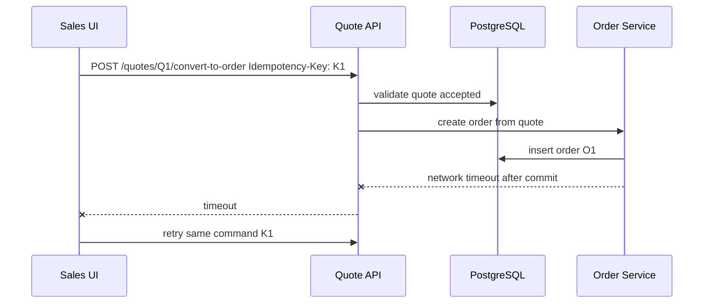
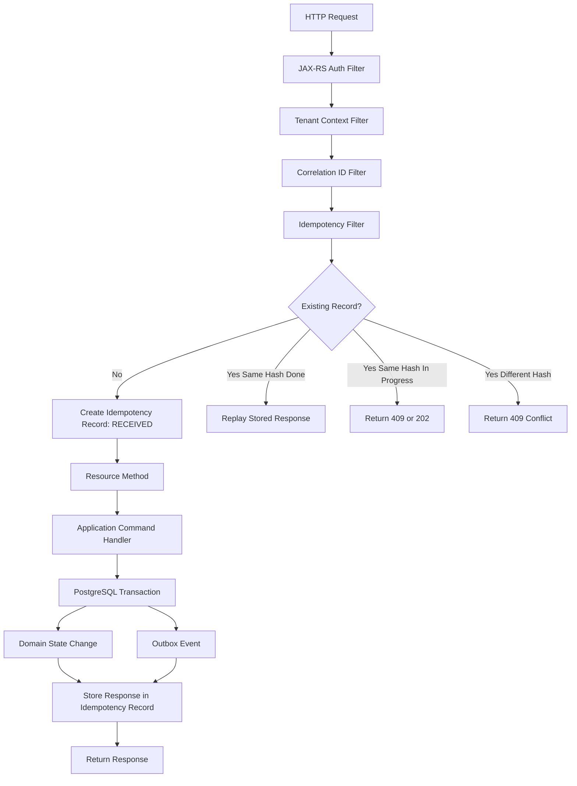
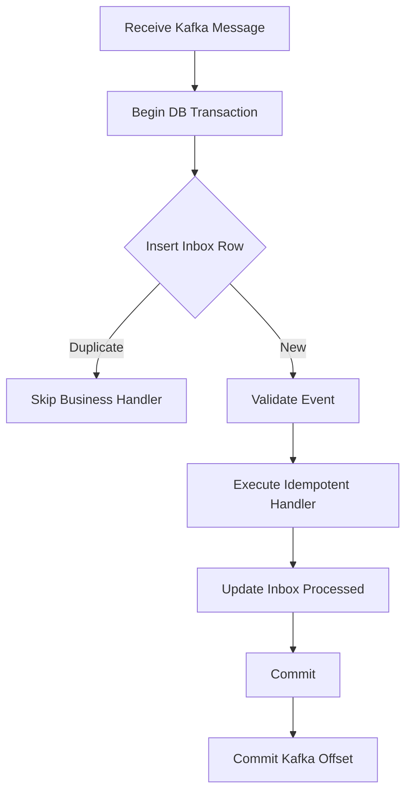

------
title: Build From Scratch: Enterprise Java Microservices CPQ & Order Management Platform - Part 023
description: Mendesain idempotency, concurrency control, dan retry safety untuk command bisnis CPQ/OMS enterprise: request idempotency, command identity, optimistic locking, unique constraint, PostgreSQL transaction, JAX-RS filter, MyBatis update guard, Kafka/Camunda retry, external integration idempotency, dan failure modelling.
series: learn-enterprise-cpq-oms-glassfish-camunda8
seriesTitle: Build From Scratch: Enterprise Java Microservices CPQ & Order Management Platform
order: 23
partTitle: Idempotency Concurrency and Retry Safety
tags:
  - java
  - cpq
  - oms
  - idempotency
  - concurrency
  - retry
  - postgresql
  - mybatis
  - jax-rs
  - jersey
  - kafka
  - camunda-8
  - enterprise-architecture
date: 2026-07-02
------

# Part 023 — Idempotency, Concurrency, and Retry Safety

Part 021 membangun validation dan error contract. Part 022 membangun identity, authorization, dan tenant context. Sekarang kita masuk ke masalah yang biasanya tidak terlihat saat demo, tetapi langsung merusak production system: **apa yang terjadi ketika request yang sama dikirim dua kali, dua user mengubah data yang sama, worker retry setelah timeout, atau external system memberi response terlambat?**

CPQ/OMS enterprise adalah sistem command-heavy. Banyak endpoint bukan sekadar membaca data, tetapi mengubah janji bisnis dan eksekusi order.

Contoh command:

- create quote;
- add quote item;
- reprice quote;
- submit quote for approval;
- approve quote;
- accept quote;
- convert quote to order;
- cancel order;
- retry fulfillment task;
- repair failed order;
- apply asset modification.

Command seperti ini tidak boleh “mungkin berhasil dua kali”. Kita butuh aturan yang sangat jelas:

```text
Satu intensi bisnis hanya boleh menghasilkan satu efek bisnis.
```

Jika user menekan tombol dua kali, browser retry, gateway retry, API timeout, worker crash, Kafka redeliver, atau Camunda job dieksekusi ulang, sistem harus tetap bisa menjawab:

1. Apakah command ini sudah pernah diterima?
2. Apakah payload-nya sama?
3. Apakah efek bisnisnya sudah terjadi?
4. Apakah response lama bisa di-replay?
5. Apakah command ini harus ditolak karena state sudah berubah?
6. Apakah retry aman dilakukan?

Bagian ini adalah salah satu fondasi production-grade. Tanpa ini, semua workflow, Kafka event, approval, dan fulfillment akan rapuh.

---

## 1. Masalah Yang Sering Disalahpahami

Banyak engineer menyamakan idempotency dengan “pakai PUT”. Itu terlalu dangkal.

HTTP memang punya konsep method idempotency. Tetapi CPQ/OMS punya command bisnis yang sering memakai `POST` karena membuat subordinate resource atau menjalankan action.

Contoh:

```http
POST /quotes/{quoteId}/submit
POST /quotes/{quoteId}/convert-to-order
POST /orders/{orderId}/cancel
POST /fulfillment-tasks/{taskId}/retry
```

Secara domain, command itu harus idempotent walaupun HTTP method-nya `POST`.

Idempotency di CPQ/OMS bukan properti method saja. Idempotency adalah properti dari **business intent**.

```text
Idempotent command = command yang jika diterima lebih dari sekali dengan identity yang sama,
tetap menghasilkan efek bisnis yang sama seperti diterima sekali.
```

---

## 2. Vocabulary Dasar

| Istilah | Makna Praktis |
|---|---|
| Idempotency Key | Identifier dari satu intensi command dari client/caller |
| Command ID | Identifier internal untuk command yang diproses application service |
| Request Hash | Hash dari payload penting untuk mendeteksi key reuse dengan payload berbeda |
| Resource Version | Angka/etag untuk optimistic concurrency |
| Duplicate Request | Request sama dikirim ulang dengan idempotency key sama |
| Conflicting Request | Idempotency key sama, payload berbeda |
| Concurrent Mutation | Dua command berbeda mengubah aggregate yang sama hampir bersamaan |
| Lost Update | Update pertama tertimpa update kedua tanpa deteksi |
| Safe Retry | Retry yang tidak membuat efek bisnis dobel |
| Replay Response | Mengembalikan response command lama untuk duplicate request |
| Compare-and-Set | Update hanya jika version/status masih sesuai ekspektasi |
| Unique Constraint | Guard database untuk mencegah duplikasi efek bisnis |

Perhatikan bahwa **idempotency** dan **concurrency** berbeda.

Idempotency menjawab:

```text
Apakah command yang sama dikirim ulang?
```

Concurrency menjawab:

```text
Apakah command berbeda saling berebut mengubah state yang sama?
```

Sistem production butuh keduanya.

---

## 3. Failure Scenario Nyata

Bayangkan user melakukan convert quote ke order.



Tanpa idempotency, retry bisa membuat order kedua.

```text
Q1 -> O1
Q1 -> O2   // bug
```

Bug ini buruk karena:

- customer mungkin menerima dua order;
- billing bisa trigger dua kali;
- provisioning bisa berjalan dua kali;
- cancellation jadi ambigu;
- audit sulit menjelaskan intensi asli;
- reconciliation mahal.

Solusi tidak cukup dengan “cek apakah quote sudah converted” karena race condition masih mungkin terjadi. Guard harus ada di beberapa layer:

1. idempotency record;
2. quote state/version;
3. unique constraint conversion;
4. transaction boundary;
5. outbox event deduplication;
6. worker retry idempotency;
7. external correlation ID.

---

## 4. Prinsip Desain

### 4.1 Command Harus Punya Identity

Setiap mutation command penting harus punya identity.

Untuk public API, identity bisa berasal dari header:

```http
Idempotency-Key: 6b8b5a9e-8460-46d9-b444-a6a05fe86e10
```

Untuk internal command, identity bisa berasal dari:

- API idempotency key;
- Kafka message ID;
- Camunda job key + business command key;
- external callback correlation ID;
- generated command ID dari application layer.

Rule:

```text
Command tanpa identity tidak boleh melakukan side effect irreversible.
```

### 4.2 Idempotency Scope Harus Jelas

Idempotency key tidak boleh global tanpa scope. Scope minimal:

```text
tenant_id + actor/client_id + endpoint/operation + idempotency_key
```

Kenapa?

Karena key yang sama mungkin dipakai oleh caller berbeda.

Salah:

```sql
UNIQUE (idempotency_key)
```

Lebih aman:

```sql
UNIQUE (tenant_id, caller_id, operation, idempotency_key)
```

Untuk service-to-service:

```text
tenant_id + producer_service + operation + idempotency_key
```

### 4.3 Payload Harus Di-hash

Jika client memakai key yang sama dengan payload berbeda, itu bukan retry. Itu conflict.

Contoh:

Request 1:

```json
{
  "quoteId": "Q1",
  "targetOrderDate": "2026-07-20"
}
```

Request 2 dengan key sama:

```json
{
  "quoteId": "Q1",
  "targetOrderDate": "2026-08-01"
}
```

Harus ditolak:

```http
409 Conflict
```

Problem detail:

```json
{
  "type": "https://api.example.com/problems/idempotency-key-conflict",
  "title": "Idempotency key conflict",
  "status": 409,
  "code": "IDEMPOTENCY_KEY_CONFLICT",
  "detail": "The same idempotency key was previously used with a different request payload.",
  "correlationId": "corr_123"
}
```

### 4.4 Response Replay Harus Durable

Jika command sudah sukses tetapi client timeout, retry harus mengembalikan response yang sama.

```text
First request: 201 Created { orderId: O1 }
Retry request: 201 Created { orderId: O1 }
```

Jangan membuat response baru yang ambigu.

### 4.5 Database Constraint Adalah Last Line of Defense

Application check bisa kalah oleh race condition.

```text
Thread A: check no order exists for quote Q1
Thread B: check no order exists for quote Q1
Thread A: insert O1
Thread B: insert O2
```

Database harus punya unique constraint:

```sql
CREATE UNIQUE INDEX ux_order_quote_conversion
ON product_order (tenant_id, source_quote_id, source_quote_revision)
WHERE source_quote_id IS NOT NULL;
```

Application check adalah ergonomics. Database constraint adalah safety.

### 4.6 Retry Tidak Boleh Mengulang Side Effect Tanpa Guard

Worker retry harus aman.

Salah:

```text
charge payment
send notification
create provisioning ticket
```

lalu crash sebelum update DB.

Retry akan mengulang semuanya.

Lebih aman:

1. simpan intent/attempt;
2. panggil external system dengan external idempotency key;
3. simpan result;
4. publish event via outbox.

---

## 5. Request Lifecycle Dengan Idempotency



Poin penting:

- filter hanya mengelola request-level idempotency;
- domain handler tetap harus punya concurrency guard;
- outbox insert harus satu transaction dengan state change;
- response replay harus memakai stored response, bukan re-execute command.

---

## 6. Idempotency Record Model

Table utama:

```sql
CREATE TABLE api_idempotency_record (
    tenant_id              VARCHAR(64)  NOT NULL,
    caller_id              VARCHAR(128) NOT NULL,
    operation              VARCHAR(128) NOT NULL,
    idempotency_key        VARCHAR(128) NOT NULL,
    request_hash           VARCHAR(128) NOT NULL,
    request_method         VARCHAR(16)  NOT NULL,
    request_path_template  VARCHAR(256) NOT NULL,
    status                 VARCHAR(32)  NOT NULL,
    http_status            INTEGER,
    response_body          JSONB,
    resource_type          VARCHAR(64),
    resource_id            VARCHAR(128),
    command_id             UUID,
    correlation_id         VARCHAR(128) NOT NULL,
    error_code             VARCHAR(128),
    locked_until           TIMESTAMPTZ,
    expires_at             TIMESTAMPTZ NOT NULL,
    created_at             TIMESTAMPTZ NOT NULL DEFAULT now(),
    updated_at             TIMESTAMPTZ NOT NULL DEFAULT now(),
    PRIMARY KEY (tenant_id, caller_id, operation, idempotency_key)
);
```

Status:

| Status | Makna |
|---|---|
| RECEIVED | Record dibuat, command belum selesai |
| PROCESSING | Command sedang dieksekusi |
| SUCCEEDED | Efek bisnis berhasil dan response tersimpan |
| FAILED_REPLAYABLE | Failure deterministik yang boleh di-replay |
| FAILED_TRANSIENT | Failure transient, retry bisa mencoba lagi |
| EXPIRED | Key sudah melewati retention |

Untuk CPQ/OMS, tidak semua failure perlu di-replay.

Contoh deterministic failure:

```text
quote is not ACCEPTED
```

Retry dengan payload sama akan tetap gagal sampai state berubah. Bisa disimpan sebagai failed replayable, tetapi hati-hati: jika state berubah kemudian, retry lama mungkin seharusnya diperlakukan sebagai command baru. Karena itu, untuk command stateful, lebih aman response failure replay hanya untuk window pendek atau error yang benar-benar immutable.

Praktik yang lebih defensible:

- replay success response;
- conflict untuk same key different payload;
- in-progress response untuk command sedang berjalan;
- transient failure boleh retry re-execute jika belum ada durable side effect;
- domain state conflict dievaluasi ulang jika command belum pernah sukses.

---

## 7. Request Hash

Request hash harus dihitung dari canonical payload.

Jangan hash raw body langsung jika format JSON bisa beda urutan field.

Contoh dua body semantik sama:

```json
{ "a": 1, "b": 2 }
```

```json
{ "b": 2, "a": 1 }
```

Canonicalization minimal:

- parse JSON;
- sort object keys;
- normalize number/string policy;
- exclude volatile headers;
- include operation name;
- include tenant/caller scope;
- include relevant path variables.

Pseudo:

```java
public final class RequestFingerprint {
    public String hash(
            String tenantId,
            String callerId,
            String operation,
            Map<String, String> pathVariables,
            JsonNode canonicalBody
    ) {
        String material = canonicalJson(Map.of(
                "tenantId", tenantId,
                "callerId", callerId,
                "operation", operation,
                "path", pathVariables,
                "body", canonicalBody
        ));
        return sha256(material);
    }
}
```

Jangan memasukkan `correlationId` ke hash karena correlation berbeda pada retry.

---

## 8. JAX-RS Idempotency Filter

Filter tidak boleh terlalu pintar. Ia harus melakukan orchestration teknis, bukan business decision.

```java
@Provider
@Priority(Priorities.USER + 100)
public final class IdempotencyFilter implements ContainerRequestFilter, ContainerResponseFilter {

    private final IdempotencyService idempotencyService;
    private final RequestContextAccessor requestContextAccessor;

    @Override
    public void filter(ContainerRequestContext request) {
        RequestContext ctx = requestContextAccessor.current();
        OperationDescriptor operation = OperationDescriptor.from(request);

        if (!operation.requiresIdempotency()) {
            return;
        }

        String key = request.getHeaderString("Idempotency-Key");
        if (key == null || key.isBlank()) {
            throw Problem.badRequest("MISSING_IDEMPOTENCY_KEY",
                    "This operation requires Idempotency-Key header.");
        }

        IdempotencyDecision decision = idempotencyService.registerOrReplay(
                ctx.tenantId(),
                ctx.callerId(),
                operation.name(),
                key,
                request
        );

        if (decision.replay()) {
            request.abortWith(Response
                    .status(decision.httpStatus())
                    .entity(decision.responseBody())
                    .header("Idempotency-Replayed", "true")
                    .build());
            return;
        }

        request.setProperty("commandId", decision.commandId());
        request.setProperty("idempotencyKey", key);
    }

    @Override
    public void filter(ContainerRequestContext request, ContainerResponseContext response) {
        // Store response only for operations that reached the application handler successfully.
        // Error mapper can also mark deterministic errors as replayable if desired.
    }
}
```

Namun response storing biasanya lebih aman dilakukan di application service setelah transaction commit, bukan di response filter murni. Response filter tidak selalu tahu apakah business side effect sudah durable.

---

## 9. Application Handler Pattern

Untuk command penting, handler harus eksplisit.

```java
public final class ConvertQuoteToOrderHandler {

    private final QuoteRepository quoteRepository;
    private final OrderRepository orderRepository;
    private final OutboxRepository outboxRepository;
    private final IdempotencyRepository idempotencyRepository;
    private final TransactionRunner tx;

    public ConvertQuoteToOrderResult handle(ConvertQuoteToOrderCommand command) {
        return tx.required(() -> {
            IdempotencyRecord idem = idempotencyRepository.claimProcessing(
                    command.idempotencyScope(),
                    command.commandId()
            );

            if (idem.isSucceeded()) {
                return idem.replayAs(ConvertQuoteToOrderResult.class);
            }

            Quote quote = quoteRepository.getForUpdateGuarded(
                    command.tenantId(),
                    command.quoteId(),
                    command.expectedQuoteVersion()
            );

            quote.assertConvertible();

            ProductOrder order = ProductOrder.fromAcceptedQuote(
                    quote,
                    command.commandId(),
                    command.requestedBy()
            );

            orderRepository.insert(order);
            quoteRepository.markConverted(
                    quote.tenantId(),
                    quote.quoteId(),
                    quote.version(),
                    order.orderId()
            );

            outboxRepository.append(OrderEvents.createdFromQuote(order));

            ConvertQuoteToOrderResult result = ConvertQuoteToOrderResult.created(order.orderId());
            idempotencyRepository.markSucceeded(idem.key(), 201, result.toJson());
            return result;
        });
    }
}
```

Perhatikan urutan:

1. claim idempotency record;
2. load aggregate with version guard;
3. enforce domain invariant;
4. insert order;
5. update quote;
6. insert outbox event;
7. mark idempotency succeeded;
8. commit.

Semuanya satu transaction.

---

## 10. Optimistic Locking

Optimistic locking cocok untuk quote/order karena mayoritas mutation tidak benar-benar bertabrakan, tetapi jika bertabrakan harus ditolak dengan jelas.

Table:

```sql
ALTER TABLE quote
ADD COLUMN version BIGINT NOT NULL DEFAULT 0;
```

Update:

```sql
UPDATE quote
SET status = #{newStatus},
    version = version + 1,
    updated_at = now()
WHERE tenant_id = #{tenantId}
  AND quote_id = #{quoteId}
  AND version = #{expectedVersion}
  AND status = #{expectedStatus};
```

Jika affected row = 0, ada beberapa kemungkinan:

- quote tidak ditemukan;
- tenant salah;
- version sudah berubah;
- status tidak sesuai;
- command sudah tidak valid.

Application harus membedakan seperlunya.

MyBatis mapper:

```xml
<update id="markQuoteSubmitted">
  UPDATE quote
  SET status = 'SUBMITTED',
      version = version + 1,
      submitted_at = now(),
      updated_at = now()
  WHERE tenant_id = #{tenantId}
    AND quote_id = #{quoteId}
    AND version = #{expectedVersion}
    AND status = 'DRAFT'
</update>
```

Java:

```java
int updated = quoteMapper.markQuoteSubmitted(command);
if (updated != 1) {
    throw new OptimisticConcurrencyException(
            "Quote was modified or is no longer in DRAFT state.");
}
```

Response:

```http
409 Conflict
```

Atau jika memakai `If-Match` header:

```http
412 Precondition Failed
```

Policy yang konsisten:

- `409 Conflict` untuk domain conflict;
- `412 Precondition Failed` untuk explicit precondition/ETag mismatch;
- jangan return `500` untuk concurrency conflict normal.

---

## 11. Pessimistic Locking: Kapan Dipakai?

Pessimistic lock seperti `SELECT ... FOR UPDATE` bisa dipakai, tetapi jangan dijadikan default.

Cocok untuk:

- sequence allocation yang tidak bisa duplicate;
- short critical section;
- stock/reservation style allocation;
- processing queue row claiming;
- command yang harus membaca lalu update banyak row dengan invariant ketat.

Tidak cocok untuk:

- long-running workflow;
- external API call;
- menunggu user approval;
- Camunda process duration;
- Kafka publish;
- operation yang bisa berlangsung detik/menit.

Salah besar:

```text
open transaction
SELECT order FOR UPDATE
call provisioning system
wait response
update order
commit
```

Ini bisa memegang lock terlalu lama dan merusak throughput.

Benar:

1. update state ke `PROVISIONING_REQUESTED` dalam short transaction;
2. insert outbox/integration command;
3. commit;
4. external call dilakukan worker;
5. callback/result update state dengan version guard.

---

## 12. Unique Constraint Sebagai Domain Guard

Beberapa invariant harus dijaga database.

### 12.1 One Order Per Quote Revision

```sql
CREATE UNIQUE INDEX ux_product_order_source_quote_revision
ON product_order (tenant_id, source_quote_id, source_quote_revision)
WHERE source_quote_id IS NOT NULL;
```

### 12.2 One Active Subscription Per Asset Group

```sql
CREATE UNIQUE INDEX ux_subscription_active_instance
ON subscription (tenant_id, customer_account_id, product_instance_key)
WHERE status IN ('ACTIVE', 'SUSPENDED');
```

### 12.3 One Pending Approval Per Quote Revision

```sql
CREATE UNIQUE INDEX ux_quote_approval_pending
ON quote_approval (tenant_id, quote_id, quote_revision)
WHERE status = 'PENDING';
```

### 12.4 Inbox Message Deduplication

```sql
CREATE UNIQUE INDEX ux_inbox_message
ON inbox_message (consumer_name, message_id);
```

### 12.5 Outbox Event Identity

```sql
CREATE UNIQUE INDEX ux_outbox_event_id
ON outbox_event (event_id);
```

Unique constraint bukan sekadar data modelling. Ia adalah concurrency primitive.

---

## 13. Retry Taxonomy

Retry tidak semuanya sama.

| Retry Source | Contoh | Guard Yang Dibutuhkan |
|---|---|---|
| Browser/UI | user klik submit dua kali | idempotency key + button state |
| API Client | HTTP timeout lalu retry | idempotency key + response replay |
| Gateway | automatic retry upstream | only for safe/idempotent operations |
| Application | DB serialization failure | transaction retry with pure function boundary |
| Kafka Consumer | message redelivery | inbox dedupe + idempotent handler |
| Camunda Worker | job retry | job business key + task state guard |
| Outbox Relay | publish retry | event status + producer idempotency if available |
| External Callback | provider sends duplicate callback | external correlation ID + inbox dedupe |
| Manual Ops | operator clicks retry | explicit repair command + audit + state guard |

Rule:

```text
Retry is safe only if the command has a stable identity and every side effect has a dedupe boundary.
```

---

## 14. Transaction Retry

PostgreSQL bisa menghasilkan serialization/deadlock/concurrency errors pada kondisi tertentu. Application boleh retry transaction, tetapi hanya jika handler aman.

Transaction retry aman jika:

- belum melakukan external call;
- belum mengirim email;
- belum publish event di luar transaction;
- semua side effect hanya DB mutation lokal;
- outbox event diinsert dalam transaction;
- command identity stabil.

Pseudo:

```java
public final class TransactionRunner {
    public <T> T retryable(Supplier<T> work) {
        int attempts = 0;
        while (true) {
            try {
                return transactionTemplate.execute(work);
            } catch (SerializationOrDeadlockException e) {
                attempts++;
                if (attempts >= 3) {
                    throw e;
                }
                sleepWithJitter(attempts);
            }
        }
    }
}
```

Jangan retry semua exception.

Tidak retry:

- validation error;
- authorization error;
- domain state conflict;
- idempotency key conflict;
- unique violation yang berarti domain duplicate;
- malformed request.

Boleh retry terbatas:

- deadlock detected;
- serialization failure;
- transient connection issue sebelum commit outcome diketahui.

Commit outcome unknown adalah kasus sulit. Jika connection putus saat commit, application tidak tahu commit sukses atau gagal. Karena itu command harus bisa dicek ulang dengan idempotency key dan unique constraint.

---

## 15. Kafka Consumer Idempotency

Kafka consumer harus menganggap message bisa diproses lebih dari sekali.

Inbox table:

```sql
CREATE TABLE inbox_message (
    consumer_name      VARCHAR(128) NOT NULL,
    message_id         UUID         NOT NULL,
    tenant_id          VARCHAR(64)  NOT NULL,
    topic_name         VARCHAR(256) NOT NULL,
    partition_no       INTEGER      NOT NULL,
    offset_no          BIGINT       NOT NULL,
    event_type         VARCHAR(128) NOT NULL,
    event_version      INTEGER      NOT NULL,
    payload_hash       VARCHAR(128) NOT NULL,
    status             VARCHAR(32)  NOT NULL,
    processed_at       TIMESTAMPTZ,
    error_code         VARCHAR(128),
    created_at         TIMESTAMPTZ NOT NULL DEFAULT now(),
    PRIMARY KEY (consumer_name, message_id)
);
```

Consumer flow:



Handler tetap harus idempotent karena duplicate bisa terjadi dengan message ID berbeda tetapi business key sama.

Contoh:

```text
PaymentConfirmed event duplicated by external provider with different message ids
```

Maka dedupe juga butuh external correlation/business key.

---

## 16. Camunda/Zeebe Worker Retry Safety

Camunda/Zeebe job worker bisa retry job saat worker gagal, timeout, atau throw error. Worker tidak boleh menganggap “sekali dipanggil berarti sekali efek”.

Job worker harus:

- membaca process variables sebagai input, bukan source of truth final;
- membuat command ID deterministik dari process instance + activity id + business key jika perlu;
- memeriksa fulfillment task state di database;
- memakai version/status guard;
- tidak melakukan external call sebelum durable attempt record;
- mengembalikan BPMN error untuk domain error;
- throw technical error untuk retryable failure.

Contoh worker guard:

```java
public void handleProvisioningJob(ActivatedJob job) {
    FulfillmentTaskId taskId = variable(job, "taskId");
    CommandId commandId = CommandId.from("provision", job.getProcessInstanceKey(), taskId.value());

    tx.required(() -> {
        FulfillmentTask task = taskRepository.get(taskId);

        if (task.isCompleted()) {
            return WorkerResult.alreadyDone();
        }

        task.assertCanStartProvisioning();
        taskRepository.markAttemptStarted(taskId, commandId, task.version());
        integrationOutbox.append(ProvisioningCommand.from(task, commandId));
        return WorkerResult.started();
    });
}
```

External provisioning call lebih baik dilakukan oleh integration worker dari outbox, bukan langsung dalam Camunda job transaction jika call tersebut tidak bisa dijamin aman.

---

## 17. External Integration Idempotency

External system harus diberi correlation/idempotency key jika mendukung.

Contoh provisioning request:

```json
{
  "externalRequestId": "tenantA-orderO1-taskT1-attempt1",
  "orderId": "O1",
  "taskId": "T1",
  "serviceSpecId": "fiber-access"
}
```

Simpan attempt:

```sql
CREATE TABLE external_call_attempt (
    tenant_id             VARCHAR(64)  NOT NULL,
    attempt_id            UUID         PRIMARY KEY,
    integration_name      VARCHAR(128) NOT NULL,
    operation             VARCHAR(128) NOT NULL,
    business_key          VARCHAR(256) NOT NULL,
    external_request_id   VARCHAR(256) NOT NULL,
    request_payload       JSONB        NOT NULL,
    response_payload      JSONB,
    status                VARCHAR(32)  NOT NULL,
    http_status           INTEGER,
    error_code            VARCHAR(128),
    attempt_no            INTEGER      NOT NULL,
    next_retry_at         TIMESTAMPTZ,
    created_at            TIMESTAMPTZ NOT NULL DEFAULT now(),
    updated_at            TIMESTAMPTZ NOT NULL DEFAULT now(),
    UNIQUE (integration_name, external_request_id)
);
```

Jika external system tidak mendukung idempotency, kita harus membuat reconciliation strategy:

- query external by business key sebelum retry create;
- detect duplicate response;
- mark ambiguous state;
- route to manual fallout jika outcome tidak bisa dipastikan.

Jangan pura-pura aman.

---

## 18. Redis Bukan Source of Truth Untuk Idempotency

Redis boleh dipakai untuk acceleration:

- short TTL duplicate suppression;
- rate limit;
- lock ringan;
- cache status idempotency;
- prevent button-mash traffic.

Tetapi PostgreSQL tetap source of truth untuk command penting.

Kenapa?

- Redis key bisa expired;
- eviction policy bisa menghapus data;
- failover bisa menyebabkan edge cases;
- audit membutuhkan durable record;
- idempotency result harus survive restart;
- unique constraint tetap dibutuhkan.

Pattern aman:

```text
Redis = fast pre-check
PostgreSQL = final authority
```

---

## 19. Command Design Matrix

| Command | Idempotency Required | Version Required | Unique Constraint | Async? |
|---|---:|---:|---:|---:|
| Create quote | Yes | No | client ref optional | Usually sync |
| Add quote item | Yes | Yes | quote item id maybe | Sync |
| Reprice quote | Yes | Yes | price run id | Sync/async |
| Submit quote | Yes | Yes | pending approval | Sync |
| Approve quote | Yes | Yes | approver decision | Sync |
| Accept quote | Yes | Yes | accepted revision | Sync |
| Convert quote to order | Yes | Yes | quote revision -> order | Async-safe |
| Cancel order | Yes | Yes | cancellation command | Async |
| Retry fulfillment task | Yes | Yes | task attempt id | Async |
| External callback | Yes | N/A | external event id | Async |
| Manual repair | Yes | Yes | repair command id | Sync/async |

Jika command mengubah state atau memicu side effect, default-nya idempotency required.

---

## 20. Example: Submit Quote

Endpoint:

```http
POST /api/v1/quotes/{quoteId}/submit
Idempotency-Key: 548f1d4c-5602-43fc-ac01-4488332d164a
If-Match: "quote-version-7"
```

Command:

```java
public record SubmitQuoteCommand(
        TenantId tenantId,
        QuoteId quoteId,
        long expectedVersion,
        IdempotencyKey idempotencyKey,
        CommandId commandId,
        Actor actor,
        Instant requestedAt
) {}
```

Handler:

```java
public SubmitQuoteResult submit(SubmitQuoteCommand command) {
    return tx.required(() -> {
        idempotency.claim(command.scope());

        Quote quote = quoteRepository.find(command.tenantId(), command.quoteId())
                .orElseThrow(QuoteNotFoundException::new);

        quote.assertVersion(command.expectedVersion());
        quote.submit(command.actor(), command.requestedAt());

        quoteRepository.updateStatusWithVersion(
                quote.id(),
                command.expectedVersion(),
                QuoteStatus.SUBMITTED
        );

        ApprovalRequest approval = approvalPolicy.evaluate(quote);
        approvalRepository.insert(approval);

        outbox.append(QuoteSubmittedEvent.from(quote, approval));

        SubmitQuoteResult result = SubmitQuoteResult.submitted(quote.id(), approval.id());
        idempotency.markSucceeded(command.scope(), 200, result);
        return result;
    });
}
```

Database guards:

```sql
CREATE UNIQUE INDEX ux_quote_approval_pending
ON quote_approval (tenant_id, quote_id, quote_revision)
WHERE status = 'PENDING';
```

Concurrency behavior:

- same request retry -> replay success;
- same key different payload -> 409;
- quote version changed -> 412/409;
- quote already submitted by another command -> 409 with current state;
- approval insert duplicate -> map unique violation to idempotent/domain conflict depending business key.

---

## 21. Example: Convert Quote To Order

This is the most dangerous CPQ/OMS command.

Endpoint:

```http
POST /api/v1/quotes/{quoteId}/convert-to-order
Idempotency-Key: 2ee82871-74fa-4f11-b2de-534baf4f5288
If-Match: "quote-version-12"
```

Data guard:

```sql
ALTER TABLE product_order
ADD COLUMN source_quote_id VARCHAR(64),
ADD COLUMN source_quote_revision INTEGER;

CREATE UNIQUE INDEX ux_order_source_quote_revision
ON product_order (tenant_id, source_quote_id, source_quote_revision)
WHERE source_quote_id IS NOT NULL;
```

Pseudo handler:

```java
public ConvertQuoteToOrderResult convert(ConvertQuoteToOrderCommand command) {
    return tx.required(() -> {
        idempotency.claim(command.scope());

        Quote quote = quoteRepository.loadSnapshot(
                command.tenantId(),
                command.quoteId(),
                command.expectedVersion()
        );

        quote.assertAccepted();
        quote.assertNotExpired(clock.now());
        quote.assertNotAlreadyConverted();

        ProductOrder order = orderFactory.createFromQuote(quote, command);
        orderRepository.insert(order); // unique constraint protects conversion

        quoteRepository.markConverted(
                quote.id(),
                quote.version(),
                order.id()
        );

        outbox.append(ProductOrderCreatedEvent.from(order));
        idempotency.markSucceeded(command.scope(), 201, Map.of("orderId", order.id().value()));
        return new ConvertQuoteToOrderResult(order.id());
    });
}
```

Jika insert order kena unique violation, handler harus cek apakah order existing berasal dari command sama atau command lain.

```text
same idempotency scope -> replay
same quote revision but different idempotency scope -> conflict or return existing order depending policy
```

Untuk defensibility, saya lebih suka return conflict jika command identity beda, kecuali product requirement menyatakan conversion quote memang naturally idempotent by quote revision untuk semua caller.

---

## 22. Status In Progress

Apa response ketika duplicate request datang saat request pertama masih berjalan?

Ada beberapa policy.

### Option A: 409 In Progress

```http
409 Conflict
```

```json
{
  "code": "REQUEST_ALREADY_IN_PROGRESS",
  "detail": "A request with the same idempotency key is already being processed. Retry later."
}
```

Cocok untuk synchronous command.

### Option B: 202 Accepted

```http
202 Accepted
```

```json
{
  "commandId": "cmd_123",
  "status": "PROCESSING",
  "statusUrl": "/api/v1/commands/cmd_123"
}
```

Cocok untuk async command.

### Option C: Wait Briefly

Server menunggu lock pendek, misalnya 100-500ms, lalu replay jika selesai.

Cocok untuk low latency command, tapi jangan tahan thread GlassFish terlalu lama.

Default aman:

- sync mutation: `409 REQUEST_ALREADY_IN_PROGRESS`;
- async command: `202 Accepted` dengan command status resource.

---

## 23. Error Mapping

| Case | HTTP | Code |
|---|---:|---|
| Missing idempotency key | 400 | MISSING_IDEMPOTENCY_KEY |
| Key reused with different payload | 409 | IDEMPOTENCY_KEY_CONFLICT |
| Same key still processing | 409/202 | REQUEST_ALREADY_IN_PROGRESS |
| Replay success | original status | same response |
| Resource version mismatch | 412/409 | PRECONDITION_FAILED / VERSION_CONFLICT |
| Domain state conflict | 409 | INVALID_STATE_TRANSITION |
| Duplicate unique business effect | 409 or replay | DUPLICATE_BUSINESS_COMMAND |
| Retryable DB transient | 503 after attempts | TRANSIENT_PERSISTENCE_FAILURE |
| External outcome unknown | 202/409 | EXTERNAL_OUTCOME_UNKNOWN |

Jangan sembunyikan conflict menjadi 500.

---

## 24. Testing Strategy

### 24.1 Duplicate Same Payload

```text
Given accepted quote Q1
When convert-to-order called twice with same idempotency key and same payload
Then only one order exists
And both responses contain same orderId
```

### 24.2 Same Key Different Payload

```text
Given idempotency key K1 used for target date D1
When same key K1 is used for target date D2
Then API returns 409 IDEMPOTENCY_KEY_CONFLICT
```

### 24.3 Concurrent Convert

```text
Given accepted quote Q1 revision 3
When two different idempotency keys convert Q1 concurrently
Then at most one order exists
And the loser receives conflict
```

### 24.4 Lost Update Prevention

```text
Given quote version 7
When user A updates with expected version 7
And user B updates with expected version 7
Then only one update succeeds
And other receives version conflict
```

### 24.5 Kafka Redelivery

```text
Given event E1 consumed successfully
When event E1 is delivered again
Then inbox dedupe skips business handler
```

### 24.6 Camunda Job Retry

```text
Given fulfillment task T1 marked attempt started
When worker crashes and job retries
Then worker observes existing attempt and does not create duplicate external request
```

### 24.7 Commit Outcome Unknown

Simulate connection drop after commit. Retry command with same idempotency key. Expected result:

```text
system detects committed outcome and replays stored response or resolves by unique business key
```

---

## 25. Observability

Log fields for command mutation:

```json
{
  "correlationId": "corr_123",
  "tenantId": "tenant_acme",
  "actorId": "user_42",
  "operation": "QUOTE_CONVERT_TO_ORDER",
  "idempotencyKey": "2ee82871-74fa-4f11-b2de-534baf4f5288",
  "commandId": "cmd_abc",
  "resourceType": "QUOTE",
  "resourceId": "Q1",
  "expectedVersion": 12,
  "result": "SUCCEEDED",
  "replayed": false
}
```

Metrics:

- idempotency replay count;
- idempotency conflict count;
- in-progress duplicate count;
- optimistic lock conflict count;
- unique violation mapped count;
- transaction retry count;
- Kafka duplicate message count;
- worker retry count;
- external ambiguous outcome count.

These metrics reveal whether clients are retrying badly or the system has high contention.

---

## 26. Anti-Patterns

### 26.1 Check-Then-Insert Without Constraint

```java
if (!orderRepository.existsByQuote(quoteId)) {
    orderRepository.insert(order);
}
```

Race condition.

### 26.2 Random Command ID On Retry

If retry creates new command ID, idempotency breaks.

### 26.3 External Call Inside DB Transaction

Holds lock and creates unknown side effects.

### 26.4 Kafka Offset Commit Before DB Commit

Message can be lost.

### 26.5 DB Commit Before Outbox Insert

State changes without event.

### 26.6 Redis-Only Idempotency

Not durable enough for order/quote commands.

### 26.7 Treating All Unique Violations As 500

Many unique violations are domain conflicts or duplicate commands.

### 26.8 Blind Retry On 409

409 usually means caller must reload state, not retry immediately.

---

## 27. Minimal Implementation Checklist

Before moving forward, our platform needs:

- `Idempotency-Key` requirement for important mutation endpoints;
- idempotency record table;
- request hash;
- response replay for success;
- optimistic locking with version columns;
- compare-and-set updates for state transition;
- unique constraints for irreversible business effects;
- transaction wrapper with limited retry;
- outbox table inserted in same transaction;
- inbox table for Kafka consumer dedupe;
- worker idempotency guard for Camunda jobs;
- external call attempt table;
- Redis only as acceleration, not authority;
- integration tests for duplicate, concurrent, retry, and unknown outcome cases.

---

## 28. Mental Model

Production CPQ/OMS should behave like a deterministic command processor.

```text
Input command + current aggregate version + durable command identity
= one valid state transition or one explainable rejection.
```

Every mutation must answer:

1. What is the command identity?
2. What aggregate/version does it target?
3. What state transition is allowed?
4. What unique business effect must not duplicate?
5. What side effects are emitted through outbox?
6. What response is stored for replay?
7. What happens if the caller retries?
8. What happens if another caller races?
9. What happens if the worker crashes after partial progress?
10. What does audit show six months later?

If you cannot answer these, the operation is not production-ready.

---

## 29. References

- RFC 9110 — HTTP Semantics: https://www.rfc-editor.org/rfc/rfc9110.html
- PostgreSQL Documentation — Concurrency Control: https://www.postgresql.org/docs/current/mvcc.html
- PostgreSQL Documentation — Transaction Isolation: https://www.postgresql.org/docs/current/transaction-iso.html
- PostgreSQL Documentation — INSERT and ON CONFLICT: https://www.postgresql.org/docs/current/sql-insert.html
- MyBatis Mapper XML Files: https://mybatis.org/mybatis-3/sqlmap-xml.html

---

## 30. What Comes Next

Part 024 akan membangun PostgreSQL data model untuk CPQ/OMS. Sekarang kita sudah tahu command harus aman terhadap duplicate, concurrency, retry, dan unknown outcome. Berikutnya kita akan menurunkan prinsip itu ke table design: catalog, quote, order, asset, fulfillment, workflow reference, outbox, inbox, idempotency, dan audit.
