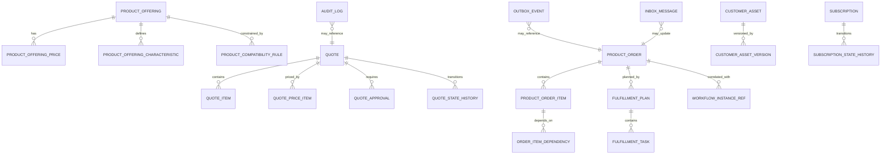

------
title: Build From Scratch: Enterprise Java Microservices CPQ & Order Management Platform - Part 024
description: Mendesain PostgreSQL data model production-grade untuk CPQ/OMS: tenant-scoped schema, catalog tables, quote/order aggregates, asset/subscription, fulfillment plan, workflow references, outbox/inbox, idempotency, audit, JSONB snapshot, indexes, constraints, migration boundary, dan MyBatis persistence direction.
series: learn-enterprise-cpq-oms-glassfish-camunda8
seriesTitle: Build From Scratch: Enterprise Java Microservices CPQ & Order Management Platform
order: 24
partTitle: PostgreSQL Data Modeling for CPQ OMS
tags:
  - java
  - postgresql
  - database-design
  - cpq
  - oms
  - mybatis
  - schema-design
  - outbox
  - audit
  - enterprise-architecture
date: 2026-07-02
------

# Part 024 — PostgreSQL Data Modeling for CPQ/OMS

Part 023 membahas idempotency, concurrency, dan retry safety. Sekarang kita turunkan prinsip itu ke data model PostgreSQL.

CPQ/OMS enterprise bukan aplikasi CRUD. Database-nya tidak boleh hanya menjadi tempat menyimpan DTO. Ia harus menjadi **source of truth** untuk:

- catalog version yang dipakai saat quote dibuat;
- product configuration snapshot;
- price snapshot;
- quote lifecycle;
- approval evidence;
- order lifecycle;
- fulfillment plan;
- installed base impact;
- workflow correlation;
- integration dedupe;
- outbox event;
- audit trail;
- operational repair.

Database design di sistem seperti ini harus bisa menjawab pertanyaan hukum, bisnis, dan operasi:

```text
Kenapa order ini dibuat?
Dari quote revision berapa?
Harga mana yang dijanjikan?
Siapa approve discount ini?
Produk apa yang sebenarnya harus diprovision?
Task mana yang gagal?
Event mana yang sudah dipublish?
Callback mana yang duplicate?
Apakah perubahan asset ini berasal dari order yang sah?
```

Jika schema tidak bisa menjawab, sistem tidak defensible.

---

## 1. Design Goals

Kita ingin PostgreSQL schema yang memenuhi beberapa tujuan:

1. **Tenant-safe**: semua business table tenant-scoped.
2. **Aggregate-friendly**: quote/order bisa diload sebagai aggregate tanpa query liar.
3. **Snapshot-aware**: quote/order tidak tergantung mutable catalog saat dibuat.
4. **Versioned**: update concurrent bisa dideteksi.
5. **Auditable**: perubahan penting bisa dijelaskan.
6. **Workflow-correlated**: Camunda process tidak menjadi source of truth bisnis.
7. **Event-safe**: state change dan outbox event atomic.
8. **Integration-safe**: inbound/outbound message bisa didedupe.
9. **Operationally queryable**: support dashboard, fallout, search, and repair.
10. **Migration-friendly**: schema bisa evolve tanpa big bang.

Non-goal:

```text
Membuat satu schema final yang sempurna untuk semua perusahaan.
```

Enterprise CPQ/OMS selalu punya variasi domain. Yang kita bangun adalah mental model dan baseline schema yang benar.

---

## 2. Table Taxonomy

Jangan desain semua table dengan gaya yang sama. Kita klasifikasikan.

| Category | Contoh | Karakteristik |
|---|---|---|
| Reference/Master | catalog, product offering, price list | versioned, published, mostly read-heavy |
| Transactional Aggregate | quote, quote item, order, order item | mutable state, versioned, command-owned |
| Snapshot | quote config snapshot, price snapshot | immutable evidence |
| Workflow Reference | process instance ref, task correlation | correlation, not business truth |
| Integration | outbox, inbox, external attempt | dedupe, retry, replay |
| Audit | audit log, state transition log | append-only |
| Operational Projection | search view, exception queue | query-optimized, rebuildable |
| Idempotency | api idempotency record | durable command replay |

Kesalahan umum adalah memasukkan semuanya ke aggregate table atau semuanya ke JSONB. Itu membuat query, constraint, dan audit menjadi buruk.

---

## 3. Naming and Column Conventions

### 3.1 ID Policy

Kita akan memakai business-readable IDs di contoh, tetapi implementasi bisa UUID/ULID.

Column convention:

```sql
tenant_id       VARCHAR(64) NOT NULL
quote_id        VARCHAR(64) NOT NULL
order_id        VARCHAR(64) NOT NULL
created_at      TIMESTAMPTZ NOT NULL DEFAULT now()
updated_at      TIMESTAMPTZ NOT NULL DEFAULT now()
created_by      VARCHAR(128)
updated_by      VARCHAR(128)
version         BIGINT NOT NULL DEFAULT 0
status          VARCHAR(32) NOT NULL
```

Untuk multi-tenant shared database, semua primary/unique key business table harus mempertimbangkan `tenant_id`.

Salah:

```sql
PRIMARY KEY (quote_id)
```

Lebih aman:

```sql
PRIMARY KEY (tenant_id, quote_id)
```

Jika memakai surrogate UUID global, tenant_id tetap wajib ada untuk query scoping dan authorization.

### 3.2 Timestamp Policy

Gunakan `TIMESTAMPTZ`, bukan timestamp tanpa zona.

Minimal:

```sql
created_at TIMESTAMPTZ NOT NULL DEFAULT now(),
updated_at TIMESTAMPTZ NOT NULL DEFAULT now()
```

Untuk business lifecycle:

```sql
submitted_at
approved_at
accepted_at
converted_at
completed_at
cancelled_at
```

Jangan memakai `updated_at` untuk menjawab lifecycle business event.

### 3.3 Version Policy

Semua aggregate root mutable harus punya `version`.

```sql
version BIGINT NOT NULL DEFAULT 0
```

Update state:

```sql
UPDATE quote
SET status = 'SUBMITTED',
    version = version + 1,
    updated_at = now()
WHERE tenant_id = #{tenantId}
  AND quote_id = #{quoteId}
  AND version = #{expectedVersion}
  AND status = 'DRAFT';
```

### 3.4 JSONB Policy

JSONB berguna untuk snapshot dan flexible evidence, tetapi jangan jadikan core relational model hilang.

Gunakan JSONB untuk:

- configuration snapshot;
- price explanation;
- external payload;
- audit before/after;
- workflow variable snapshot;
- schema-versioned event payload;
- optional extension attribute.

Jangan gunakan JSONB untuk:

- quote status;
- order status;
- tenant_id;
- customer_account_id;
- money total yang sering difilter/sort;
- relationship/dependency utama;
- uniqueness-critical data;
- lifecycle timestamp.

Rule:

```text
Jika field dipakai untuk join, filter, sort, constraint, authorization, atau state transition,
jadikan column biasa.
```

---

## 4. High-Level Schema Map



Mermaid diagram ini bukan physical full schema. Ini peta mental: catalog menghasilkan snapshot quote, quote menghasilkan order, order menghasilkan fulfillment plan, fulfillment menghasilkan asset/subscription impact, semua state change menghasilkan event/audit.

---

## 5. Schema Organization

Untuk seri ini, gunakan satu database dengan beberapa schema namespace:

```sql
CREATE SCHEMA cpq;
CREATE SCHEMA oms;
CREATE SCHEMA integration;
CREATE SCHEMA audit;
CREATE SCHEMA ops;
```

Pilihan lain adalah satu schema `public` dengan prefix table. Untuk pembelajaran production-grade, namespace membantu separation.

| PostgreSQL Schema | Isi |
|---|---|
| `cpq` | catalog, configuration, pricing, quote, approval |
| `oms` | order, fulfillment, asset, subscription |
| `integration` | outbox, inbox, external attempt, message contract |
| `audit` | audit log, state history |
| `ops` | operational projection, repair command, job status |

Catatan penting: schema namespace bukan bounded context boundary absolut. Boundary tetap di service/application layer. Database namespace hanya membantu organization.

---

## 6. Catalog Tables

Catalog harus versioned dan publish-aware. Quote tidak boleh bergantung pada mutable catalog draft.

### 6.1 Product Specification

```sql
CREATE TABLE cpq.product_specification (
    tenant_id              VARCHAR(64)  NOT NULL,
    product_spec_id        VARCHAR(64)  NOT NULL,
    version_no             INTEGER      NOT NULL,
    name                   VARCHAR(256) NOT NULL,
    description            TEXT,
    lifecycle_status       VARCHAR(32)  NOT NULL,
    valid_from             TIMESTAMPTZ,
    valid_to               TIMESTAMPTZ,
    spec_type              VARCHAR(64)  NOT NULL,
    schema_ref             VARCHAR(256),
    extension              JSONB        NOT NULL DEFAULT '{}'::jsonb,
    created_at             TIMESTAMPTZ  NOT NULL DEFAULT now(),
    updated_at             TIMESTAMPTZ  NOT NULL DEFAULT now(),
    PRIMARY KEY (tenant_id, product_spec_id, version_no)
);
```

### 6.2 Product Offering

```sql
CREATE TABLE cpq.product_offering (
    tenant_id              VARCHAR(64)  NOT NULL,
    offering_id            VARCHAR(64)  NOT NULL,
    version_no             INTEGER      NOT NULL,
    product_spec_id        VARCHAR(64)  NOT NULL,
    product_spec_version   INTEGER      NOT NULL,
    name                   VARCHAR(256) NOT NULL,
    lifecycle_status       VARCHAR(32)  NOT NULL,
    market_segment         VARCHAR(128),
    channel                VARCHAR(128),
    valid_from             TIMESTAMPTZ,
    valid_to               TIMESTAMPTZ,
    is_bundle              BOOLEAN      NOT NULL DEFAULT false,
    sellable               BOOLEAN      NOT NULL DEFAULT true,
    extension              JSONB        NOT NULL DEFAULT '{}'::jsonb,
    created_at             TIMESTAMPTZ  NOT NULL DEFAULT now(),
    updated_at             TIMESTAMPTZ  NOT NULL DEFAULT now(),
    PRIMARY KEY (tenant_id, offering_id, version_no),
    FOREIGN KEY (tenant_id, product_spec_id, product_spec_version)
        REFERENCES cpq.product_specification (tenant_id, product_spec_id, version_no)
);
```

### 6.3 Offering Characteristic

```sql
CREATE TABLE cpq.product_offering_characteristic (
    tenant_id              VARCHAR(64)  NOT NULL,
    offering_id            VARCHAR(64)  NOT NULL,
    offering_version       INTEGER      NOT NULL,
    characteristic_code    VARCHAR(128) NOT NULL,
    name                   VARCHAR(256) NOT NULL,
    value_type             VARCHAR(32)  NOT NULL,
    required               BOOLEAN      NOT NULL DEFAULT false,
    min_cardinality        INTEGER      NOT NULL DEFAULT 0,
    max_cardinality        INTEGER,
    allowed_values         JSONB,
    default_value          JSONB,
    validation_schema      JSONB,
    display_order          INTEGER      NOT NULL DEFAULT 0,
    created_at             TIMESTAMPTZ  NOT NULL DEFAULT now(),
    PRIMARY KEY (tenant_id, offering_id, offering_version, characteristic_code),
    FOREIGN KEY (tenant_id, offering_id, offering_version)
        REFERENCES cpq.product_offering (tenant_id, offering_id, version_no)
);
```

### 6.4 Product Offering Price

```sql
CREATE TABLE cpq.product_offering_price (
    tenant_id              VARCHAR(64)  NOT NULL,
    price_id               VARCHAR(64)  NOT NULL,
    offering_id            VARCHAR(64)  NOT NULL,
    offering_version       INTEGER      NOT NULL,
    charge_type            VARCHAR(32)  NOT NULL,
    price_type             VARCHAR(32)  NOT NULL,
    currency_code          CHAR(3)      NOT NULL,
    amount_minor           BIGINT       NOT NULL,
    billing_period         VARCHAR(32),
    valid_from             TIMESTAMPTZ,
    valid_to               TIMESTAMPTZ,
    lifecycle_status       VARCHAR(32)  NOT NULL,
    eligibility_rule_ref   VARCHAR(256),
    price_rule             JSONB        NOT NULL DEFAULT '{}'::jsonb,
    created_at             TIMESTAMPTZ  NOT NULL DEFAULT now(),
    updated_at             TIMESTAMPTZ  NOT NULL DEFAULT now(),
    PRIMARY KEY (tenant_id, price_id),
    FOREIGN KEY (tenant_id, offering_id, offering_version)
        REFERENCES cpq.product_offering (tenant_id, offering_id, version_no)
);
```

Money stored as minor units avoids decimal rounding surprises in storage. Domain layer still needs Money type.

### 6.5 Compatibility Rule

```sql
CREATE TABLE cpq.product_compatibility_rule (
    tenant_id              VARCHAR(64)  NOT NULL,
    rule_id                VARCHAR(64)  NOT NULL,
    rule_version           INTEGER      NOT NULL,
    offering_id            VARCHAR(64)  NOT NULL,
    offering_version       INTEGER      NOT NULL,
    rule_type              VARCHAR(64)  NOT NULL,
    severity               VARCHAR(32)  NOT NULL,
    expression             JSONB        NOT NULL,
    explanation_template   TEXT,
    lifecycle_status       VARCHAR(32)  NOT NULL,
    created_at             TIMESTAMPTZ  NOT NULL DEFAULT now(),
    updated_at             TIMESTAMPTZ  NOT NULL DEFAULT now(),
    PRIMARY KEY (tenant_id, rule_id, rule_version),
    FOREIGN KEY (tenant_id, offering_id, offering_version)
        REFERENCES cpq.product_offering (tenant_id, offering_id, version_no)
);
```

Rule expression disimpan JSONB karena rule engine akan menginterpretasikan struktur. Tetapi rule metadata tetap relational.

---

## 7. Quote Tables

Quote adalah commercial promise. Ia harus menyimpan snapshot catalog/configuration/price yang dipakai saat dibuat.

### 7.1 Quote Root

```sql
CREATE TABLE cpq.quote (
    tenant_id              VARCHAR(64)  NOT NULL,
    quote_id               VARCHAR(64)  NOT NULL,
    quote_number           VARCHAR(64)  NOT NULL,
    customer_account_id    VARCHAR(128) NOT NULL,
    opportunity_ref        VARCHAR(128),
    status                 VARCHAR(32)  NOT NULL,
    revision_no            INTEGER      NOT NULL DEFAULT 1,
    version                BIGINT       NOT NULL DEFAULT 0,
    currency_code          CHAR(3)      NOT NULL,
    total_otc_minor        BIGINT       NOT NULL DEFAULT 0,
    total_mrc_minor        BIGINT       NOT NULL DEFAULT 0,
    total_nrc_minor        BIGINT       NOT NULL DEFAULT 0,
    valid_until            TIMESTAMPTZ,
    submitted_at           TIMESTAMPTZ,
    approved_at            TIMESTAMPTZ,
    accepted_at            TIMESTAMPTZ,
    expired_at             TIMESTAMPTZ,
    cancelled_at           TIMESTAMPTZ,
    converted_order_id     VARCHAR(64),
    created_by             VARCHAR(128) NOT NULL,
    updated_by             VARCHAR(128),
    created_at             TIMESTAMPTZ  NOT NULL DEFAULT now(),
    updated_at             TIMESTAMPTZ  NOT NULL DEFAULT now(),
    PRIMARY KEY (tenant_id, quote_id),
    UNIQUE (tenant_id, quote_number)
);
```

Important:

- `revision_no` untuk business revision;
- `version` untuk optimistic locking;
- totals denormalized untuk query/search;
- detailed price tetap di price item/snapshot.

### 7.2 Quote Item

```sql
CREATE TABLE cpq.quote_item (
    tenant_id              VARCHAR(64)  NOT NULL,
    quote_id               VARCHAR(64)  NOT NULL,
    quote_item_id          VARCHAR(64)  NOT NULL,
    parent_quote_item_id   VARCHAR(64),
    action_type            VARCHAR(32)  NOT NULL,
    offering_id            VARCHAR(64)  NOT NULL,
    offering_version       INTEGER      NOT NULL,
    product_spec_id        VARCHAR(64)  NOT NULL,
    product_spec_version   INTEGER      NOT NULL,
    quantity               INTEGER      NOT NULL DEFAULT 1,
    status                 VARCHAR(32)  NOT NULL,
    configuration_hash     VARCHAR(128),
    price_hash             VARCHAR(128),
    asset_id               VARCHAR(64),
    display_order          INTEGER      NOT NULL DEFAULT 0,
    created_at             TIMESTAMPTZ  NOT NULL DEFAULT now(),
    updated_at             TIMESTAMPTZ  NOT NULL DEFAULT now(),
    PRIMARY KEY (tenant_id, quote_id, quote_item_id),
    FOREIGN KEY (tenant_id, quote_id)
        REFERENCES cpq.quote (tenant_id, quote_id)
);
```

### 7.3 Quote Configuration Snapshot

```sql
CREATE TABLE cpq.quote_item_configuration_snapshot (
    tenant_id              VARCHAR(64)  NOT NULL,
    quote_id               VARCHAR(64)  NOT NULL,
    quote_item_id          VARCHAR(64)  NOT NULL,
    schema_version         INTEGER      NOT NULL,
    configuration_hash     VARCHAR(128) NOT NULL,
    configuration          JSONB        NOT NULL,
    validation_result      JSONB        NOT NULL,
    created_at             TIMESTAMPTZ  NOT NULL DEFAULT now(),
    PRIMARY KEY (tenant_id, quote_id, quote_item_id, configuration_hash),
    FOREIGN KEY (tenant_id, quote_id, quote_item_id)
        REFERENCES cpq.quote_item (tenant_id, quote_id, quote_item_id)
);
```

Snapshot should be append-friendly. If configuration changes, create new hash/snapshot, then point quote item to current hash.

### 7.4 Quote Price Item

```sql
CREATE TABLE cpq.quote_price_item (
    tenant_id              VARCHAR(64)  NOT NULL,
    quote_id               VARCHAR(64)  NOT NULL,
    quote_item_id          VARCHAR(64),
    price_item_id          VARCHAR(64)  NOT NULL,
    charge_type            VARCHAR(32)  NOT NULL,
    price_source           VARCHAR(32)  NOT NULL,
    currency_code          CHAR(3)      NOT NULL,
    list_amount_minor      BIGINT       NOT NULL,
    discount_amount_minor  BIGINT       NOT NULL DEFAULT 0,
    override_amount_minor  BIGINT,
    final_amount_minor     BIGINT       NOT NULL,
    billing_period         VARCHAR(32),
    requires_approval      BOOLEAN      NOT NULL DEFAULT false,
    explanation            JSONB        NOT NULL DEFAULT '{}'::jsonb,
    created_at             TIMESTAMPTZ  NOT NULL DEFAULT now(),
    PRIMARY KEY (tenant_id, quote_id, price_item_id),
    FOREIGN KEY (tenant_id, quote_id)
        REFERENCES cpq.quote (tenant_id, quote_id)
);
```

### 7.5 Quote Approval

```sql
CREATE TABLE cpq.quote_approval (
    tenant_id              VARCHAR(64)  NOT NULL,
    approval_id            VARCHAR(64)  NOT NULL,
    quote_id               VARCHAR(64)  NOT NULL,
    quote_revision         INTEGER      NOT NULL,
    approval_type          VARCHAR(64)  NOT NULL,
    status                 VARCHAR(32)  NOT NULL,
    requested_by           VARCHAR(128) NOT NULL,
    assigned_to            VARCHAR(128),
    decided_by             VARCHAR(128),
    requested_at           TIMESTAMPTZ  NOT NULL DEFAULT now(),
    decided_at             TIMESTAMPTZ,
    decision_reason        TEXT,
    policy_snapshot        JSONB        NOT NULL,
    evidence_snapshot      JSONB        NOT NULL,
    PRIMARY KEY (tenant_id, approval_id),
    FOREIGN KEY (tenant_id, quote_id)
        REFERENCES cpq.quote (tenant_id, quote_id)
);

CREATE UNIQUE INDEX ux_quote_approval_pending
ON cpq.quote_approval (tenant_id, quote_id, quote_revision, approval_type)
WHERE status = 'PENDING';
```

Approval must store policy/evidence snapshot. If approval policy changes tomorrow, yesterday's approval must remain explainable.

---

## 8. Order Tables

Order is execution commitment. It is not just accepted quote.

### 8.1 Product Order Root

```sql
CREATE TABLE oms.product_order (
    tenant_id                VARCHAR(64)  NOT NULL,
    order_id                 VARCHAR(64)  NOT NULL,
    order_number             VARCHAR(64)  NOT NULL,
    customer_account_id      VARCHAR(128) NOT NULL,
    status                   VARCHAR(32)  NOT NULL,
    fulfillment_status       VARCHAR(32)  NOT NULL,
    version                  BIGINT       NOT NULL DEFAULT 0,
    source_quote_id          VARCHAR(64),
    source_quote_revision    INTEGER,
    requested_start_date     TIMESTAMPTZ,
    committed_completion_date TIMESTAMPTZ,
    submitted_at             TIMESTAMPTZ,
    completed_at             TIMESTAMPTZ,
    cancelled_at             TIMESTAMPTZ,
    cancellation_reason      TEXT,
    created_by               VARCHAR(128) NOT NULL,
    updated_by               VARCHAR(128),
    created_at               TIMESTAMPTZ  NOT NULL DEFAULT now(),
    updated_at               TIMESTAMPTZ  NOT NULL DEFAULT now(),
    PRIMARY KEY (tenant_id, order_id),
    UNIQUE (tenant_id, order_number)
);

CREATE UNIQUE INDEX ux_product_order_source_quote_revision
ON oms.product_order (tenant_id, source_quote_id, source_quote_revision)
WHERE source_quote_id IS NOT NULL;
```

### 8.2 Product Order Item

```sql
CREATE TABLE oms.product_order_item (
    tenant_id              VARCHAR(64)  NOT NULL,
    order_id               VARCHAR(64)  NOT NULL,
    order_item_id          VARCHAR(64)  NOT NULL,
    parent_order_item_id   VARCHAR(64),
    source_quote_item_id   VARCHAR(64),
    action_type            VARCHAR(32)  NOT NULL,
    offering_id            VARCHAR(64)  NOT NULL,
    offering_version       INTEGER      NOT NULL,
    product_spec_id        VARCHAR(64)  NOT NULL,
    product_spec_version   INTEGER      NOT NULL,
    quantity               INTEGER      NOT NULL DEFAULT 1,
    status                 VARCHAR(32)  NOT NULL,
    fulfillment_status     VARCHAR(32)  NOT NULL,
    asset_id               VARCHAR(64),
    configuration_snapshot JSONB        NOT NULL,
    price_snapshot         JSONB        NOT NULL,
    created_at             TIMESTAMPTZ  NOT NULL DEFAULT now(),
    updated_at             TIMESTAMPTZ  NOT NULL DEFAULT now(),
    PRIMARY KEY (tenant_id, order_id, order_item_id),
    FOREIGN KEY (tenant_id, order_id)
        REFERENCES oms.product_order (tenant_id, order_id)
);
```

Order item carries snapshots because catalog/quote may change later.

### 8.3 Order Item Dependency

```sql
CREATE TABLE oms.order_item_dependency (
    tenant_id                VARCHAR(64) NOT NULL,
    order_id                 VARCHAR(64) NOT NULL,
    dependency_id            VARCHAR(64) NOT NULL,
    predecessor_order_item_id VARCHAR(64) NOT NULL,
    successor_order_item_id   VARCHAR(64) NOT NULL,
    dependency_type          VARCHAR(32) NOT NULL,
    created_at               TIMESTAMPTZ NOT NULL DEFAULT now(),
    PRIMARY KEY (tenant_id, order_id, dependency_id),
    FOREIGN KEY (tenant_id, order_id)
        REFERENCES oms.product_order (tenant_id, order_id)
);
```

Dependency is relational because fulfillment sequencing needs query and constraints.

---

## 9. Fulfillment Tables

Fulfillment plan is derived from order, but once created it becomes operational truth for execution.

### 9.1 Fulfillment Plan

```sql
CREATE TABLE oms.fulfillment_plan (
    tenant_id              VARCHAR(64) NOT NULL,
    plan_id                VARCHAR(64) NOT NULL,
    order_id               VARCHAR(64) NOT NULL,
    plan_version           INTEGER     NOT NULL DEFAULT 1,
    status                 VARCHAR(32) NOT NULL,
    decomposition_strategy VARCHAR(128) NOT NULL,
    created_at             TIMESTAMPTZ NOT NULL DEFAULT now(),
    updated_at             TIMESTAMPTZ NOT NULL DEFAULT now(),
    PRIMARY KEY (tenant_id, plan_id),
    UNIQUE (tenant_id, order_id, plan_version),
    FOREIGN KEY (tenant_id, order_id)
        REFERENCES oms.product_order (tenant_id, order_id)
);
```

### 9.2 Fulfillment Task

```sql
CREATE TABLE oms.fulfillment_task (
    tenant_id              VARCHAR(64)  NOT NULL,
    task_id                VARCHAR(64)  NOT NULL,
    plan_id                VARCHAR(64)  NOT NULL,
    order_id               VARCHAR(64)  NOT NULL,
    order_item_id          VARCHAR(64),
    task_type              VARCHAR(64)  NOT NULL,
    task_name              VARCHAR(256) NOT NULL,
    status                 VARCHAR(32)  NOT NULL,
    owner_system           VARCHAR(128),
    adapter_name           VARCHAR(128),
    retry_count            INTEGER      NOT NULL DEFAULT 0,
    max_retries            INTEGER      NOT NULL DEFAULT 3,
    next_retry_at          TIMESTAMPTZ,
    timeout_at             TIMESTAMPTZ,
    compensation_task_id   VARCHAR(64),
    input_payload          JSONB        NOT NULL DEFAULT '{}'::jsonb,
    output_payload         JSONB,
    error_code             VARCHAR(128),
    error_detail           TEXT,
    version                BIGINT       NOT NULL DEFAULT 0,
    created_at             TIMESTAMPTZ  NOT NULL DEFAULT now(),
    updated_at             TIMESTAMPTZ  NOT NULL DEFAULT now(),
    PRIMARY KEY (tenant_id, task_id),
    FOREIGN KEY (tenant_id, plan_id)
        REFERENCES oms.fulfillment_plan (tenant_id, plan_id)
);
```

### 9.3 Fulfillment Task Dependency

```sql
CREATE TABLE oms.fulfillment_task_dependency (
    tenant_id              VARCHAR(64) NOT NULL,
    plan_id                VARCHAR(64) NOT NULL,
    dependency_id          VARCHAR(64) NOT NULL,
    predecessor_task_id    VARCHAR(64) NOT NULL,
    successor_task_id      VARCHAR(64) NOT NULL,
    dependency_type        VARCHAR(32) NOT NULL,
    created_at             TIMESTAMPTZ NOT NULL DEFAULT now(),
    PRIMARY KEY (tenant_id, plan_id, dependency_id)
);
```

This allows task scheduler/worker to find ready tasks.

Index:

```sql
CREATE INDEX ix_fulfillment_task_ready
ON oms.fulfillment_task (tenant_id, status, next_retry_at)
WHERE status IN ('READY', 'RETRY_WAITING');
```

---

## 10. Asset and Subscription Tables

Installed base is the result of fulfilled orders. Do not mutate asset without linking to order/task.

### 10.1 Customer Asset

```sql
CREATE TABLE oms.customer_asset (
    tenant_id              VARCHAR(64)  NOT NULL,
    asset_id               VARCHAR(64)  NOT NULL,
    customer_account_id    VARCHAR(128) NOT NULL,
    product_instance_key   VARCHAR(128) NOT NULL,
    offering_id            VARCHAR(64)  NOT NULL,
    product_spec_id        VARCHAR(64)  NOT NULL,
    status                 VARCHAR(32)  NOT NULL,
    effective_from         TIMESTAMPTZ  NOT NULL,
    effective_to           TIMESTAMPTZ,
    current_version_no     INTEGER      NOT NULL,
    created_from_order_id  VARCHAR(64)  NOT NULL,
    created_at             TIMESTAMPTZ  NOT NULL DEFAULT now(),
    updated_at             TIMESTAMPTZ  NOT NULL DEFAULT now(),
    PRIMARY KEY (tenant_id, asset_id),
    UNIQUE (tenant_id, product_instance_key)
);
```

### 10.2 Customer Asset Version

```sql
CREATE TABLE oms.customer_asset_version (
    tenant_id              VARCHAR(64)  NOT NULL,
    asset_id               VARCHAR(64)  NOT NULL,
    version_no             INTEGER      NOT NULL,
    order_id               VARCHAR(64)  NOT NULL,
    order_item_id          VARCHAR(64)  NOT NULL,
    action_type            VARCHAR(32)  NOT NULL,
    status                 VARCHAR(32)  NOT NULL,
    configuration_snapshot JSONB        NOT NULL,
    effective_from         TIMESTAMPTZ  NOT NULL,
    effective_to           TIMESTAMPTZ,
    created_at             TIMESTAMPTZ  NOT NULL DEFAULT now(),
    PRIMARY KEY (tenant_id, asset_id, version_no),
    FOREIGN KEY (tenant_id, asset_id)
        REFERENCES oms.customer_asset (tenant_id, asset_id)
);
```

### 10.3 Subscription

```sql
CREATE TABLE oms.subscription (
    tenant_id              VARCHAR(64)  NOT NULL,
    subscription_id        VARCHAR(64)  NOT NULL,
    customer_account_id    VARCHAR(128) NOT NULL,
    asset_id               VARCHAR(64)  NOT NULL,
    status                 VARCHAR(32)  NOT NULL,
    billing_account_ref    VARCHAR(128),
    billing_start_date     TIMESTAMPTZ,
    billing_end_date       TIMESTAMPTZ,
    version                BIGINT       NOT NULL DEFAULT 0,
    created_from_order_id  VARCHAR(64)  NOT NULL,
    created_at             TIMESTAMPTZ  NOT NULL DEFAULT now(),
    updated_at             TIMESTAMPTZ  NOT NULL DEFAULT now(),
    PRIMARY KEY (tenant_id, subscription_id),
    FOREIGN KEY (tenant_id, asset_id)
        REFERENCES oms.customer_asset (tenant_id, asset_id)
);

CREATE UNIQUE INDEX ux_active_subscription_asset
ON oms.subscription (tenant_id, asset_id)
WHERE status IN ('ACTIVE', 'SUSPENDED');
```

---

## 11. Workflow Reference Tables

Camunda/Zeebe process instance is not the business source of truth. Store correlation reference.

```sql
CREATE TABLE oms.workflow_instance_ref (
    tenant_id              VARCHAR(64)  NOT NULL,
    workflow_ref_id        VARCHAR(64)  NOT NULL,
    business_resource_type VARCHAR(64)  NOT NULL,
    business_resource_id   VARCHAR(64)  NOT NULL,
    process_id             VARCHAR(128) NOT NULL,
    process_version        INTEGER,
    process_instance_key   VARCHAR(128) NOT NULL,
    status                 VARCHAR(32)  NOT NULL,
    started_at             TIMESTAMPTZ  NOT NULL DEFAULT now(),
    completed_at           TIMESTAMPTZ,
    last_incident_at       TIMESTAMPTZ,
    variables_snapshot     JSONB        NOT NULL DEFAULT '{}'::jsonb,
    created_at             TIMESTAMPTZ  NOT NULL DEFAULT now(),
    updated_at             TIMESTAMPTZ  NOT NULL DEFAULT now(),
    PRIMARY KEY (tenant_id, workflow_ref_id),
    UNIQUE (tenant_id, process_instance_key)
);

CREATE INDEX ix_workflow_business_resource
ON oms.workflow_instance_ref (tenant_id, business_resource_type, business_resource_id);
```

This table lets operations answer:

```text
Which process instance is running for order O1?
Which order is affected by incident X?
What process version started this order?
```

---

## 12. Integration Tables

### 12.1 Outbox Event

```sql
CREATE TABLE integration.outbox_event (
    event_id               UUID         PRIMARY KEY,
    tenant_id              VARCHAR(64)  NOT NULL,
    aggregate_type         VARCHAR(64)  NOT NULL,
    aggregate_id           VARCHAR(128) NOT NULL,
    aggregate_version      BIGINT,
    event_type             VARCHAR(128) NOT NULL,
    event_version          INTEGER      NOT NULL,
    partition_key          VARCHAR(256) NOT NULL,
    payload                JSONB        NOT NULL,
    headers                JSONB        NOT NULL DEFAULT '{}'::jsonb,
    status                 VARCHAR(32)  NOT NULL DEFAULT 'PENDING',
    publish_attempts       INTEGER      NOT NULL DEFAULT 0,
    next_publish_at        TIMESTAMPTZ,
    published_at           TIMESTAMPTZ,
    error_code             VARCHAR(128),
    error_detail           TEXT,
    created_at             TIMESTAMPTZ  NOT NULL DEFAULT now()
);

CREATE INDEX ix_outbox_pending
ON integration.outbox_event (status, next_publish_at, created_at)
WHERE status IN ('PENDING', 'RETRY');

CREATE INDEX ix_outbox_aggregate
ON integration.outbox_event (tenant_id, aggregate_type, aggregate_id, created_at);
```

Outbox insert must happen in same transaction as aggregate state change.

### 12.2 Inbox Message

```sql
CREATE TABLE integration.inbox_message (
    consumer_name          VARCHAR(128) NOT NULL,
    message_id             UUID         NOT NULL,
    tenant_id              VARCHAR(64)  NOT NULL,
    topic_name             VARCHAR(256) NOT NULL,
    partition_no           INTEGER      NOT NULL,
    offset_no              BIGINT       NOT NULL,
    event_type             VARCHAR(128) NOT NULL,
    event_version          INTEGER      NOT NULL,
    payload_hash           VARCHAR(128) NOT NULL,
    status                 VARCHAR(32)  NOT NULL,
    processed_at           TIMESTAMPTZ,
    error_code             VARCHAR(128),
    error_detail           TEXT,
    created_at             TIMESTAMPTZ  NOT NULL DEFAULT now(),
    PRIMARY KEY (consumer_name, message_id)
);

CREATE INDEX ix_inbox_topic_offset
ON integration.inbox_message (topic_name, partition_no, offset_no);
```

### 12.3 External Call Attempt

```sql
CREATE TABLE integration.external_call_attempt (
    tenant_id              VARCHAR(64)  NOT NULL,
    attempt_id             UUID         PRIMARY KEY,
    integration_name       VARCHAR(128) NOT NULL,
    operation              VARCHAR(128) NOT NULL,
    business_key           VARCHAR(256) NOT NULL,
    external_request_id    VARCHAR(256) NOT NULL,
    request_payload        JSONB        NOT NULL,
    response_payload       JSONB,
    status                 VARCHAR(32)  NOT NULL,
    http_status            INTEGER,
    attempt_no             INTEGER      NOT NULL,
    next_retry_at          TIMESTAMPTZ,
    error_code             VARCHAR(128),
    error_detail           TEXT,
    created_at             TIMESTAMPTZ  NOT NULL DEFAULT now(),
    updated_at             TIMESTAMPTZ  NOT NULL DEFAULT now(),
    UNIQUE (integration_name, external_request_id)
);

CREATE INDEX ix_external_call_retry
ON integration.external_call_attempt (status, next_retry_at)
WHERE status IN ('RETRY_WAITING', 'UNKNOWN');
```

---

## 13. Idempotency Table

From Part 023:

```sql
CREATE TABLE integration.api_idempotency_record (
    tenant_id              VARCHAR(64)  NOT NULL,
    caller_id              VARCHAR(128) NOT NULL,
    operation              VARCHAR(128) NOT NULL,
    idempotency_key        VARCHAR(128) NOT NULL,
    request_hash           VARCHAR(128) NOT NULL,
    request_method         VARCHAR(16)  NOT NULL,
    request_path_template  VARCHAR(256) NOT NULL,
    status                 VARCHAR(32)  NOT NULL,
    http_status            INTEGER,
    response_body          JSONB,
    resource_type          VARCHAR(64),
    resource_id            VARCHAR(128),
    command_id             UUID,
    correlation_id         VARCHAR(128) NOT NULL,
    error_code             VARCHAR(128),
    expires_at             TIMESTAMPTZ NOT NULL,
    created_at             TIMESTAMPTZ NOT NULL DEFAULT now(),
    updated_at             TIMESTAMPTZ NOT NULL DEFAULT now(),
    PRIMARY KEY (tenant_id, caller_id, operation, idempotency_key)
);

CREATE INDEX ix_idempotency_expiry
ON integration.api_idempotency_record (expires_at);
```

Retention policy matters. You probably do not want infinite retention for all idempotency records, but important business command audit must remain elsewhere.

---

## 14. Audit Tables

Audit is not just logs. It is business evidence.

### 14.1 Audit Log

```sql
CREATE TABLE audit.audit_log (
    audit_id               UUID         PRIMARY KEY,
    tenant_id              VARCHAR(64)  NOT NULL,
    actor_id               VARCHAR(128) NOT NULL,
    actor_type             VARCHAR(32)  NOT NULL,
    action                 VARCHAR(128) NOT NULL,
    resource_type          VARCHAR(64)  NOT NULL,
    resource_id            VARCHAR(128) NOT NULL,
    resource_version       BIGINT,
    correlation_id         VARCHAR(128) NOT NULL,
    command_id             UUID,
    before_state           JSONB,
    after_state            JSONB,
    reason                 TEXT,
    metadata               JSONB        NOT NULL DEFAULT '{}'::jsonb,
    created_at             TIMESTAMPTZ  NOT NULL DEFAULT now()
);

CREATE INDEX ix_audit_resource
ON audit.audit_log (tenant_id, resource_type, resource_id, created_at DESC);

CREATE INDEX ix_audit_actor
ON audit.audit_log (tenant_id, actor_id, created_at DESC);
```

### 14.2 State History

For lifecycle-heavy aggregates, state history deserves explicit table.

```sql
CREATE TABLE audit.state_transition_log (
    transition_id          UUID         PRIMARY KEY,
    tenant_id              VARCHAR(64)  NOT NULL,
    resource_type          VARCHAR(64)  NOT NULL,
    resource_id            VARCHAR(128) NOT NULL,
    from_status            VARCHAR(32),
    to_status              VARCHAR(32)  NOT NULL,
    transition_reason      VARCHAR(256),
    actor_id               VARCHAR(128) NOT NULL,
    command_id             UUID,
    correlation_id         VARCHAR(128) NOT NULL,
    occurred_at            TIMESTAMPTZ  NOT NULL DEFAULT now(),
    metadata               JSONB        NOT NULL DEFAULT '{}'::jsonb
);

CREATE INDEX ix_state_transition_resource
ON audit.state_transition_log (tenant_id, resource_type, resource_id, occurred_at);
```

State history lets you answer operational questions faster than parsing audit JSON.

---

## 15. Operational Projection Tables

Do not overload aggregate tables for every UI screen.

Example order search projection:

```sql
CREATE TABLE ops.order_search_projection (
    tenant_id              VARCHAR(64)  NOT NULL,
    order_id               VARCHAR(64)  NOT NULL,
    order_number           VARCHAR(64)  NOT NULL,
    customer_account_id    VARCHAR(128) NOT NULL,
    customer_name          VARCHAR(256),
    status                 VARCHAR(32)  NOT NULL,
    fulfillment_status     VARCHAR(32)  NOT NULL,
    source_quote_id        VARCHAR(64),
    has_fallout            BOOLEAN      NOT NULL DEFAULT false,
    pending_task_count     INTEGER      NOT NULL DEFAULT 0,
    failed_task_count      INTEGER      NOT NULL DEFAULT 0,
    created_at             TIMESTAMPTZ  NOT NULL,
    updated_at             TIMESTAMPTZ  NOT NULL,
    PRIMARY KEY (tenant_id, order_id)
);

CREATE INDEX ix_order_search_customer
ON ops.order_search_projection (tenant_id, customer_account_id, created_at DESC);

CREATE INDEX ix_order_search_status
ON ops.order_search_projection (tenant_id, status, fulfillment_status, created_at DESC);
```

Projection can be updated synchronously or asynchronously from outbox events. It is rebuildable.

---

## 16. Index Strategy

Indexes must follow query and command patterns.

### 16.1 Tenant-Scoped Query

Most indexes begin with `tenant_id`.

```sql
CREATE INDEX ix_quote_customer_status
ON cpq.quote (tenant_id, customer_account_id, status, created_at DESC);
```

### 16.2 Lifecycle Queue

```sql
CREATE INDEX ix_task_retry_ready
ON oms.fulfillment_task (tenant_id, status, next_retry_at)
WHERE status IN ('READY', 'RETRY_WAITING');
```

### 16.3 Outbox Polling

```sql
CREATE INDEX ix_outbox_poll
ON integration.outbox_event (status, next_publish_at, created_at)
WHERE status IN ('PENDING', 'RETRY');
```

### 16.4 JSONB Search

If you need JSONB containment query, use GIN index selectively.

```sql
CREATE INDEX ix_quote_config_snapshot_gin
ON cpq.quote_item_configuration_snapshot
USING GIN (configuration);
```

Do not add GIN index blindly to every JSONB column. It can increase write cost and storage.

---

## 17. Constraint Strategy

Constraints encode invariants.

### 17.1 Status Check

You can use check constraints for simple enum-like values, but enterprise systems often evolve statuses. Two options:

```sql
status VARCHAR(32) NOT NULL
```

plus application enum and tests.

Or:

```sql
CHECK (status IN ('DRAFT', 'SUBMITTED', 'APPROVED', 'ACCEPTED', 'EXPIRED', 'CANCELLED'))
```

Trade-off:

- check constraint catches data corruption;
- adding new status requires migration.

For core lifecycle, check constraints are often worth it.

### 17.2 Money Constraint

```sql
CHECK (total_otc_minor >= 0)
```

But beware credits/refunds may be negative. Do not add simplistic constraints without domain clarity.

### 17.3 Date Constraint

```sql
CHECK (valid_to IS NULL OR valid_to > valid_from)
```

### 17.4 Unique Business Effect

Use partial unique indexes for active/pending states.

```sql
CREATE UNIQUE INDEX ux_pending_cancel_order
ON oms.product_order (tenant_id, order_id)
WHERE status = 'CANCELLATION_REQUESTED';
```

Partial unique indexes are powerful for workflow invariants.

---

## 18. Partitioning Considerations

Do not start with partitioning unless needed, but design with future partitioning in mind.

Candidates:

- audit log by month;
- outbox event by created_at;
- inbox message by created_at;
- external call attempt by created_at;
- state transition log by occurred_at;
- large order/quote history by tenant or time.

Avoid partitioning core active aggregate tables too early unless volume demands it.

Operational issue:

```text
partitioning changes index strategy, query planning, migration, and archival.
```

Start with clean indexes and retention. Partition after measurement.

---

## 19. Retention and Archival

Not every table has same retention.

| Table | Retention Direction |
|---|---|
| quote/order | long, business/legal |
| quote/order snapshot | long, evidence |
| audit log | legal/compliance policy |
| idempotency record | limited technical replay window |
| inbox/outbox | operational + replay window |
| external attempt | operational + dispute window |
| projection | rebuildable |
| workflow ref | order lifecycle + incident window |

Do not delete evidence needed for audit because technical table grows.

Separate:

```text
technical dedupe retention != business audit retention
```

---

## 20. MyBatis Persistence Direction

MyBatis should map explicit SQL. Avoid hiding aggregate behavior behind generic repository magic.

Mapper package example:

```text
persistence/
  quote/
    QuoteMapper.java
    QuoteMapper.xml
    QuoteRow.java
    QuoteItemRow.java
    QuotePriceItemRow.java
    QuoteConfigurationSnapshotRow.java
    QuoteAggregateAssembler.java
  order/
    OrderMapper.java
    OrderMapper.xml
    OrderRow.java
    OrderItemRow.java
    FulfillmentTaskRow.java
    OrderAggregateAssembler.java
```

### 20.1 Aggregate Load

```xml
<select id="selectQuoteHeader" resultMap="QuoteHeaderMap">
  SELECT *
  FROM cpq.quote
  WHERE tenant_id = #{tenantId}
    AND quote_id = #{quoteId}
</select>

<select id="selectQuoteItems" resultMap="QuoteItemMap">
  SELECT *
  FROM cpq.quote_item
  WHERE tenant_id = #{tenantId}
    AND quote_id = #{quoteId}
  ORDER BY display_order, quote_item_id
</select>

<select id="selectQuotePriceItems" resultMap="QuotePriceItemMap">
  SELECT *
  FROM cpq.quote_price_item
  WHERE tenant_id = #{tenantId}
    AND quote_id = #{quoteId}
</select>
```

Do not force one massive join if it causes duplicate row explosion. For aggregate load, several simple queries can be clearer and faster.

### 20.2 State Update

```xml
<update id="transitionQuoteStatus">
  UPDATE cpq.quote
  SET status = #{toStatus},
      version = version + 1,
      updated_at = now(),
      updated_by = #{actorId}
  WHERE tenant_id = #{tenantId}
    AND quote_id = #{quoteId}
    AND version = #{expectedVersion}
    AND status = #{fromStatus}
</update>
```

### 20.3 Insert Snapshot

```xml
<insert id="insertQuoteConfigurationSnapshot">
  INSERT INTO cpq.quote_item_configuration_snapshot (
      tenant_id,
      quote_id,
      quote_item_id,
      schema_version,
      configuration_hash,
      configuration,
      validation_result
  ) VALUES (
      #{tenantId},
      #{quoteId},
      #{quoteItemId},
      #{schemaVersion},
      #{configurationHash},
      CAST(#{configurationJson} AS jsonb),
      CAST(#{validationResultJson} AS jsonb)
  )
  ON CONFLICT (tenant_id, quote_id, quote_item_id, configuration_hash)
  DO NOTHING
</insert>
```

Snapshot insert can be idempotent if hash is stable.

---

## 21. Migration Strategy

Use expand-migrate-contract.

### 21.1 Expand

Add nullable column/table/index without breaking old code.

```sql
ALTER TABLE cpq.quote
ADD COLUMN pricing_schema_version INTEGER;
```

### 21.2 Migrate

Backfill data.

```sql
UPDATE cpq.quote
SET pricing_schema_version = 1
WHERE pricing_schema_version IS NULL;
```

For large tables, do it in batches.

### 21.3 Contract

Make column not null after all code supports it.

```sql
ALTER TABLE cpq.quote
ALTER COLUMN pricing_schema_version SET NOT NULL;
```

Never deploy code that requires a column before migration is safely applied.

---

## 22. Data Repair Model

Production systems need repair, but repair must be explicit.

Repair table:

```sql
CREATE TABLE ops.repair_command (
    tenant_id              VARCHAR(64)  NOT NULL,
    repair_id              UUID         PRIMARY KEY,
    resource_type          VARCHAR(64)  NOT NULL,
    resource_id            VARCHAR(128) NOT NULL,
    repair_type            VARCHAR(128) NOT NULL,
    requested_by           VARCHAR(128) NOT NULL,
    approved_by            VARCHAR(128),
    status                 VARCHAR(32)  NOT NULL,
    reason                 TEXT         NOT NULL,
    command_payload        JSONB        NOT NULL,
    before_snapshot        JSONB,
    after_snapshot         JSONB,
    created_at             TIMESTAMPTZ  NOT NULL DEFAULT now(),
    executed_at            TIMESTAMPTZ
);
```

Do not repair production data with anonymous SQL update without audit.

If emergency SQL is unavoidable, create an audit record and attach incident ticket.

---

## 23. Common Schema Smells

### 23.1 Quote Table Has 120 Columns

Means item/config/price/approval/snapshot are not separated.

### 23.2 Order Status Only, No Item Status

Real fulfillment is item/task-level. Header status alone loses detail.

### 23.3 No Quote Revision

Cannot explain which commercial promise became order.

### 23.4 No Price Snapshot

Repricing later changes historical interpretation.

### 23.5 Catalog Draft Used By Active Quote

Quote behavior changes when catalog draft changes.

### 23.6 No Outbox

State changes can happen without event publication.

### 23.7 No Inbox

Duplicate events mutate state twice.

### 23.8 No State History

Audit becomes guesswork.

### 23.9 Tenant ID Missing From Child Table

Joins become unsafe and authorization gets harder.

### 23.10 JSONB Everything

You lose constraints, indexes, joins, and clear ownership.

---

## 24. Minimal Build Order

Do not create all tables at once. Build in slices.

### Slice 1: Technical Foundation

- tenant-scoped ID convention;
- migration setup;
- idempotency table;
- outbox table;
- audit/state transition table.

### Slice 2: Catalog Read Model

- product specification;
- product offering;
- characteristic;
- offering price;
- compatibility rule.

### Slice 3: Quote Aggregate

- quote;
- quote item;
- configuration snapshot;
- price item;
- approval.

### Slice 4: Order Aggregate

- product order;
- product order item;
- order item dependency;
- quote-to-order unique guard.

### Slice 5: Fulfillment

- fulfillment plan;
- fulfillment task;
- task dependency;
- workflow ref.

### Slice 6: Installed Base

- customer asset;
- asset version;
- subscription.

### Slice 7: Integration and Ops

- inbox;
- external call attempt;
- order search projection;
- repair command.

This build order keeps each part testable.

---

## 25. Testing The Schema

Schema tests should verify:

- all tenant-scoped tables include `tenant_id`;
- primary keys include tenant where appropriate;
- quote conversion duplicate is blocked;
- pending approval duplicate is blocked;
- active subscription duplicate is blocked;
- optimistic update affects exactly one row;
- outbox insert happens in same transaction as aggregate update;
- JSONB snapshot can be inserted and read correctly;
- required indexes exist;
- migration can run from empty database;
- migration can run against previous version data.

Example concurrency test:

```text
Given quote Q1 accepted revision 2
When two transactions try to insert product_order from Q1 revision 2
Then only one transaction commits successfully
And the other receives unique violation mapped to domain conflict
```

---

## 26. Mental Model

A strong PostgreSQL model for CPQ/OMS is not just normalized data. It is a set of durable answers.

```text
Catalog says what can be sold.
Quote records what was promised.
Approval records why promise was allowed.
Order records what must be executed.
Fulfillment plan records how execution is decomposed.
Asset records what exists after execution.
Outbox records what must be told to others.
Inbox records what has already been heard.
Audit records why state changed.
Idempotency records which command intent already happened.
```

When schema is designed this way, application code becomes easier:

- command handlers are explicit;
- MyBatis SQL is understandable;
- audit is reliable;
- retry is safer;
- workflow can recover;
- integration can reconcile;
- operations can diagnose.

---

## 27. References

- PostgreSQL Documentation — Concurrency Control: https://www.postgresql.org/docs/current/mvcc.html
- PostgreSQL Documentation — Transaction Isolation: https://www.postgresql.org/docs/current/transaction-iso.html
- PostgreSQL Documentation — INSERT and ON CONFLICT: https://www.postgresql.org/docs/current/sql-insert.html
- PostgreSQL Documentation — JSON Types and JSONB Indexing: https://www.postgresql.org/docs/current/datatype-json.html
- MyBatis Mapper XML Files: https://mybatis.org/mybatis-3/sqlmap-xml.html

---

## 28. What Comes Next

Part 025 akan membahas MyBatis mapper design. Setelah schema baseline ada, kita akan mendesain mapper, row model, result map, transaction boundary, aggregate assembler, dynamic SQL, query object, mapper test, dan cara menjaga SQL tetap eksplisit tanpa membuat persistence layer berantakan.
