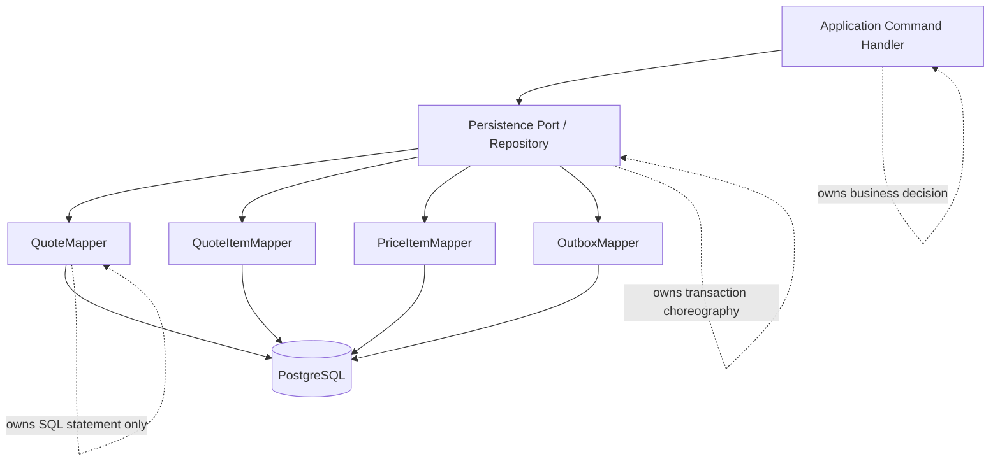
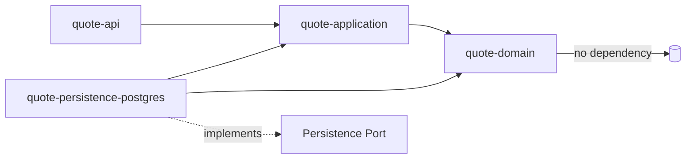
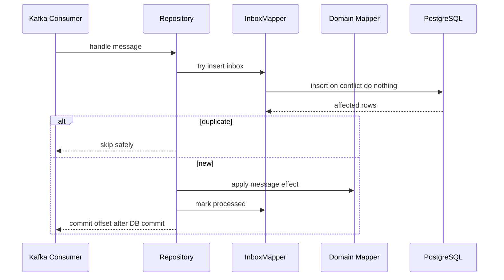

------
title: Build From Scratch: Enterprise Java Microservices CPQ & Order Management Platform - Part 025
description: Mendesain MyBatis mapper production-grade untuk CPQ/OMS: explicit SQL, mapper boundary, resultMap, dynamic SQL, query object, aggregate loading, optimistic update, JSONB type handler, pagination, transaction ownership, testing, dan failure mode.
series: learn-enterprise-cpq-oms-glassfish-camunda8
seriesTitle: Build From Scratch: Enterprise Java Microservices CPQ & Order Management Platform
order: 25
partTitle: MyBatis Mapper Design
tags:
  - java
  - mybatis
  - postgresql
  - persistence
  - sql
  - cpq
  - oms
  - mapper-design
  - enterprise-architecture
date: 2026-07-02
------

# Part 025 — MyBatis Mapper Design

Part 024 sudah membentuk PostgreSQL sebagai source of truth untuk CPQ/OMS. Sekarang kita masuk ke lapisan yang sering diremehkan: **mapper**.

Banyak engineer memperlakukan mapper sebagai detail kecil:

```text
Controller -> Service -> Mapper -> SQL
```

Itu terlalu dangkal.

Di enterprise CPQ/OMS, mapper adalah batas antara dua dunia:

```text
Domain world:
  Quote, Order, ProductConfiguration, PriceBreakdown, FulfillmentPlan

Relational world:
  table, row, column, join, index, constraint, transaction, lock
```

MyBatis dipilih bukan karena ia lebih “modern” dari ORM. MyBatis dipilih karena kita ingin **SQL tetap eksplisit**. Dalam sistem yang butuh auditability, performance predictability, query explainability, dan operational repair, SQL yang tersembunyi terlalu mahal.

Target part ini: setelah selesai, kamu bisa mendesain mapper yang tidak hanya “bisa jalan”, tetapi **stabil, testable, observable, dan aman terhadap evolusi schema**.

---

## 1. Mental Model: MyBatis Is Not a Repository

Kesalahan pertama: menganggap MyBatis mapper sama dengan repository domain.

Mapper bukan tempat business decision. Mapper bukan tempat state transition. Mapper bukan tempat approval rule. Mapper bukan tempat orchestration decision.

Mapper hanya punya satu tanggung jawab:

```text
Translate an intentional persistence operation into deterministic SQL,
and translate the SQL result into application-owned data structures.
```

Repository/application persistence port boleh berbicara dalam bahasa domain:

```java
QuoteAggregate loadQuoteForCommand(TenantId tenantId, QuoteId quoteId);
void saveQuoteAfterPricing(QuoteAggregate quote, OutboxBatch events);
```

Mapper berbicara dalam bahasa persistence:

```java
QuoteRow selectQuoteHeaderForUpdate(
    @Param("tenantId") UUID tenantId,
    @Param("quoteId") UUID quoteId
);

List<QuoteItemRow> selectQuoteItems(
    @Param("tenantId") UUID tenantId,
    @Param("quoteId") UUID quoteId
);

int updateQuoteVersioned(QuoteUpdateRow row);
```

Repository mengorkestrasi beberapa mapper dalam satu transaction. Mapper mengeksekusi statement.

Diagramnya:



Rule sederhana:

```text
If it decides what should happen, it is not mapper logic.
If it only expresses how to fetch/write rows, it can be mapper logic.
```

---

## 2. Mapper Design Goals

Untuk sistem CPQ/OMS ini, mapper harus memenuhi tujuan berikut.

### 2.1 Explicitness

Setiap query penting harus bisa dibaca manusia. Tidak boleh ada query production-critical yang muncul secara ajaib tanpa terlihat di code review.

Contoh yang baik:

```xml
<select id="selectQuoteForCommand" resultMap="QuoteHeaderResultMap">
  select
    q.quote_id,
    q.tenant_id,
    q.quote_number,
    q.customer_account_id,
    q.state,
    q.revision_number,
    q.version,
    q.valid_until,
    q.created_at,
    q.updated_at
  from quote q
  where q.tenant_id = #{tenantId}
    and q.quote_id = #{quoteId}
</select>
```

Contoh yang buruk:

```java
quoteRepository.findById(id);
```

Bukan karena method itu salah secara absolut. Masalahnya, dalam CPQ/OMS enterprise, kita perlu tahu:

- tenant filter ada atau tidak;
- deleted/archived quote ikut terbaca atau tidak;
- lock dipakai atau tidak;
- projection mana yang diload;
- join apa yang terjadi;
- index mana yang dipakai;
- query ini aman untuk command atau hanya untuk read model.

### 2.2 Deterministic Mapping

Mapping harus stabil. Jangan biarkan object graph domain dibentuk secara implisit dari join besar yang sulit diprediksi.

Untuk aggregate kompleks, sering lebih aman memakai beberapa query kecil yang jelas daripada satu join raksasa yang menghasilkan row explosion.

```text
Good for aggregate command load:
  1 query quote header
  1 query quote items
  1 query configuration snapshots
  1 query price items
  1 query approval summary

Risky:
  1 giant join quote + item + config + price + approval + customer + catalog
```

### 2.3 Transaction Awareness

Mapper tidak boleh membuka/commit transaction sendiri. Transaction dimiliki application service atau unit-of-work layer.

Mapper boleh menyediakan query variant:

```java
QuoteRow selectQuoteForRead(...);
QuoteRow selectQuoteForUpdate(...);
```

Tetapi mapper tidak memutuskan kapan harus mengunci. Keputusan lock adalah keputusan use case.

### 2.4 Schema Evolution Friendly

Mapper harus tahan perubahan schema:

- column baru tidak memecahkan mapper lama;
- field optional bisa dimodelkan eksplisit;
- query projection diberi nama jelas;
- resultMap tidak dipakai secara sembarangan untuk semua kebutuhan;
- `select *` dilarang.

### 2.5 Testable Without Full System

Mapper harus bisa dites dengan database nyata. Jangan mock SQL untuk mapper test. Mapper test harus menjalankan PostgreSQL, migration, seed data, lalu assert row-level result.

---

## 3. Module Placement

Di Part 020 kita sudah memecah module. Mapper berada di infrastructure persistence module.

```text
cpq-oms-platform/
  modules/
    quote-domain/
    quote-application/
    quote-api/
    quote-persistence-postgres/
      src/main/java/com/acme/cpqoms/quote/persistence/
        QuoteMapper.java
        QuoteItemMapper.java
        PriceItemMapper.java
        QuoteRow.java
        QuoteItemRow.java
        QuotePersistenceRepository.java
      src/main/resources/mappers/
        QuoteMapper.xml
        QuoteItemMapper.xml
        PriceItemMapper.xml
```

Dependency direction:



Application mendefinisikan port:

```java
public interface QuotePersistencePort {
    QuoteAggregate loadForCommand(TenantId tenantId, QuoteId quoteId);
    void saveAfterMutation(QuoteAggregate quote, List<PendingEvent> events);
}
```

Persistence module mengimplementasikan port dengan MyBatis mapper:

```java
public final class MyBatisQuotePersistenceRepository implements QuotePersistencePort {
    private final QuoteMapper quoteMapper;
    private final QuoteItemMapper quoteItemMapper;
    private final PriceItemMapper priceItemMapper;
    private final OutboxMapper outboxMapper;

    @Override
    public QuoteAggregate loadForCommand(TenantId tenantId, QuoteId quoteId) {
        QuoteRow header = quoteMapper.selectQuoteForCommand(tenantId.value(), quoteId.value());
        if (header == null) {
            throw new NotFoundException("quote", quoteId.value().toString());
        }

        List<QuoteItemRow> items = quoteItemMapper.selectItemsForQuote(tenantId.value(), quoteId.value());
        List<PriceItemRow> prices = priceItemMapper.selectPricesForQuote(tenantId.value(), quoteId.value());

        return QuoteAggregateMapper.toDomain(header, items, prices);
    }
}
```

Perhatikan pemisahan:

- MyBatis mapper memetakan SQL row.
- `QuoteAggregateMapper` memetakan row structure ke domain object.
- Repository mengatur urutan load/save.
- Application service memutuskan command.

---

## 4. Mapper Interface Shape

Mapper interface harus sengaja dibatasi.

Buruk:

```java
public interface QuoteMapper {
    QuoteRow find(Object criteria);
    List<QuoteRow> search(Map<String, Object> params);
    void save(QuoteRow row);
}
```

Masalah:

- criteria tidak jelas;
- SQL sulit dilint;
- parameter raw map rawan typo;
- method `save` tidak jelas insert/update/upsert;
- tidak ada distinction command read vs query read.

Lebih baik:

```java
@Mapper
public interface QuoteMapper {

    QuoteHeaderRow selectHeaderForCommand(
        @Param("tenantId") UUID tenantId,
        @Param("quoteId") UUID quoteId
    );

    QuoteHeaderRow selectHeaderForCommandForUpdate(
        @Param("tenantId") UUID tenantId,
        @Param("quoteId") UUID quoteId
    );

    int insertHeader(QuoteHeaderInsertRow row);

    int updateHeaderVersioned(QuoteHeaderUpdateRow row);

    QuoteSummaryRow selectSummaryByQuoteNumber(
        @Param("tenantId") UUID tenantId,
        @Param("quoteNumber") String quoteNumber
    );

    List<QuoteSearchRow> searchQuotes(QuoteSearchQuery query);
}
```

Naming policy:

| Method Prefix | Meaning |
|---|---|
| `select...` | membaca row/projection |
| `insert...` | insert baru, gagal kalau duplicate |
| `update...Versioned` | update dengan optimistic lock |
| `delete...` | hard delete, jarang dipakai untuk business data |
| `mark...` | update status teknis/operasional |
| `exists...` | boolean existence check |
| `count...` | count untuk pagination/operation |

Jangan pakai nama generik seperti `save`, `persist`, `sync`, `process`, atau `handle` di mapper.

Mapper method harus menyatakan niat SQL.

---

## 5. Row Object vs Domain Object

Jangan mapping langsung dari SQL ke domain aggregate kalau aggregate punya invariant kompleks.

Domain object biasanya punya constructor/factory yang menjaga invariant:

```java
public final class Quote {
    private final QuoteId id;
    private QuoteState state;
    private Money totalPrice;
    private int version;

    private Quote(...) { ... }

    public static Quote rehydrate(QuoteSnapshot snapshot) {
        // validate invariant required for loaded aggregate
        return new Quote(...);
    }
}
```

Row object adalah persistence DTO:

```java
public record QuoteHeaderRow(
    UUID quoteId,
    UUID tenantId,
    String quoteNumber,
    UUID customerAccountId,
    String state,
    Integer revisionNumber,
    BigDecimal totalAmount,
    String currency,
    Integer version,
    OffsetDateTime validUntil,
    OffsetDateTime createdAt,
    OffsetDateTime updatedAt
) {}
```

Keuntungan row object:

1. SQL projection bisa berbeda dari domain model.
2. Migration schema tidak langsung merusak domain.
3. Read model tidak memaksa aggregate shape.
4. MyBatis mapping lebih transparan.
5. Testing mapper lebih mudah.

Pattern:

```text
SQL row -> Row DTO -> Aggregate Snapshot -> Domain Aggregate
```

Contoh:

```java
public final class QuoteAggregateMapper {
    public static QuoteAggregate toDomain(
        QuoteHeaderRow header,
        List<QuoteItemRow> itemRows,
        List<PriceItemRow> priceRows
    ) {
        QuoteSnapshot snapshot = new QuoteSnapshot(
            new TenantId(header.tenantId()),
            new QuoteId(header.quoteId()),
            QuoteNumber.of(header.quoteNumber()),
            QuoteState.valueOf(header.state()),
            Money.of(header.totalAmount(), header.currency()),
            header.version(),
            mapItems(itemRows, priceRows)
        );

        return QuoteAggregate.rehydrate(snapshot);
    }
}
```

---

## 6. XML Mapper Structure

MyBatis bisa memakai annotation atau XML. Untuk query enterprise yang panjang, XML sering lebih readable dan lebih mudah direview.

Struktur XML:

```xml
<?xml version="1.0" encoding="UTF-8" ?>
<!DOCTYPE mapper
  PUBLIC "-//mybatis.org//DTD Mapper 3.0//EN"
  "https://mybatis.org/dtd/mybatis-3-mapper.dtd">

<mapper namespace="com.acme.cpqoms.quote.persistence.QuoteMapper">

  <resultMap id="QuoteHeaderResultMap" type="com.acme.cpqoms.quote.persistence.QuoteHeaderRow">
    <constructor>
      <arg column="quote_id" javaType="java.util.UUID" />
      <arg column="tenant_id" javaType="java.util.UUID" />
      <arg column="quote_number" javaType="java.lang.String" />
      <arg column="customer_account_id" javaType="java.util.UUID" />
      <arg column="state" javaType="java.lang.String" />
      <arg column="revision_number" javaType="java.lang.Integer" />
      <arg column="total_amount" javaType="java.math.BigDecimal" />
      <arg column="currency" javaType="java.lang.String" />
      <arg column="version" javaType="java.lang.Integer" />
      <arg column="valid_until" javaType="java.time.OffsetDateTime" />
      <arg column="created_at" javaType="java.time.OffsetDateTime" />
      <arg column="updated_at" javaType="java.time.OffsetDateTime" />
    </constructor>
  </resultMap>

  <sql id="QuoteHeaderColumns">
    q.quote_id,
    q.tenant_id,
    q.quote_number,
    q.customer_account_id,
    q.state,
    q.revision_number,
    q.total_amount,
    q.currency,
    q.version,
    q.valid_until,
    q.created_at,
    q.updated_at
  </sql>

  <select id="selectHeaderForCommand" resultMap="QuoteHeaderResultMap">
    select
      <include refid="QuoteHeaderColumns" />
    from quote q
    where q.tenant_id = #{tenantId}
      and q.quote_id = #{quoteId}
  </select>

</mapper>
```

Kenapa constructor mapping?

Karena row object immutable. Kalau row bisa berubah setelah mapping, test dan reasoning lebih sulit.

---

## 7. ResultMap Policy

`resultMap` adalah alat kuat. Tapi kalau dipakai sembarangan, ia menjadi black box.

Gunakan resultMap untuk:

- constructor mapping immutable row;
- column alias yang jelas;
- nested simple value object jika benar-benar stabil;
- custom type handler;
- projection yang reusable.

Hindari resultMap untuk:

- membangun aggregate domain penuh dengan nested collection kompleks;
- menyembunyikan join besar;
- auto-mapping tanpa column eksplisit;
- mapping field yang punya business semantic conversion.

Buruk:

```xml
<resultMap id="QuoteAggregateResultMap" type="QuoteAggregate">
  <collection property="items" ofType="QuoteItem">
    <collection property="prices" ofType="PriceItem" />
  </collection>
</resultMap>
```

Masalahnya bukan MyBatis tidak bisa. Masalahnya aggregate CPQ/OMS terlalu penting untuk dibiarkan muncul dari nested SQL mapping yang sulit dikontrol.

Lebih baik:

```text
Mapper returns rows.
Repository assembles rows.
Domain rehydrates through explicit factory.
```

---

## 8. Query Object Design

Untuk search, jangan pakai `Map<String, Object>`.

Buat query object:

```java
public record QuoteSearchQuery(
    UUID tenantId,
    String quoteNumber,
    UUID customerAccountId,
    List<String> states,
    OffsetDateTime createdFrom,
    OffsetDateTime createdTo,
    String cursorCreatedAt,
    UUID cursorQuoteId,
    int limit
) {
    public QuoteSearchQuery {
        if (tenantId == null) throw new IllegalArgumentException("tenantId is required");
        if (limit < 1 || limit > 200) throw new IllegalArgumentException("invalid limit");
    }
}
```

XML dynamic SQL:

```xml
<select id="searchQuotes" parameterType="com.acme.cpqoms.quote.persistence.QuoteSearchQuery" resultMap="QuoteSearchResultMap">
  select
    q.quote_id,
    q.quote_number,
    q.customer_account_id,
    q.state,
    q.revision_number,
    q.total_amount,
    q.currency,
    q.created_at,
    q.updated_at
  from quote q
  where q.tenant_id = #{tenantId}

  <if test="quoteNumber != null and quoteNumber != ''">
    and q.quote_number = #{quoteNumber}
  </if>

  <if test="customerAccountId != null">
    and q.customer_account_id = #{customerAccountId}
  </if>

  <if test="states != null and states.size() > 0">
    and q.state in
    <foreach collection="states" item="state" open="(" separator="," close=")">
      #{state}
    </foreach>
  </if>

  <if test="createdFrom != null">
    and q.created_at &gt;= #{createdFrom}
  </if>

  <if test="createdTo != null">
    and q.created_at &lt; #{createdTo}
  </if>

  <if test="cursorCreatedAt != null and cursorQuoteId != null">
    and (q.created_at, q.quote_id) &lt; (#{cursorCreatedAt}::timestamptz, #{cursorQuoteId}::uuid)
  </if>

  order by q.created_at desc, q.quote_id desc
  limit #{limit}
</select>
```

Rules:

1. Query object validates basic parameter sanity.
2. XML controls SQL shape.
3. API layer controls allowed filter semantics.
4. Database index must match dominant filter/order pattern.

Search query is not domain logic. But search query is still production logic.

---

## 9. Tenant Filter as Non-Negotiable Rule

Every business mapper query must include tenant boundary.

```sql
where tenant_id = #{tenantId}
```

For join:

```sql
from quote q
join quote_item qi
  on qi.tenant_id = q.tenant_id
 and qi.quote_id = q.quote_id
where q.tenant_id = #{tenantId}
  and q.quote_id = #{quoteId}
```

Do not join only by id if tenant-scoped ids are not globally unique.

Bad:

```sql
join quote_item qi on qi.quote_id = q.quote_id
```

Better:

```sql
join quote_item qi
  on qi.tenant_id = q.tenant_id
 and qi.quote_id = q.quote_id
```

Even if IDs are UUID and globally unique, preserving tenant join discipline makes the schema safer and easier to audit.

Mapper review checklist:

```text
[ ] Does this query include tenant_id?
[ ] Does every joined business table include tenant_id in join condition?
[ ] Is tenant_id supplied by trusted request context, not body payload?
[ ] Is tenant_id included in unique/index design?
[ ] Is tenant_id included in update/delete where clause?
```

---

## 10. Optimistic Update Pattern

For business aggregate mutation, use versioned update.

Mapper interface:

```java
int updateQuoteStateVersioned(QuoteStateUpdateRow row);
```

Row:

```java
public record QuoteStateUpdateRow(
    UUID tenantId,
    UUID quoteId,
    String nextState,
    int expectedVersion,
    int nextVersion,
    OffsetDateTime updatedAt,
    UUID updatedBy
) {}
```

SQL:

```xml
<update id="updateQuoteStateVersioned">
  update quote
  set
    state = #{nextState},
    version = #{nextVersion},
    updated_at = #{updatedAt},
    updated_by = #{updatedBy}
  where tenant_id = #{tenantId}
    and quote_id = #{quoteId}
    and version = #{expectedVersion}
</update>
```

Repository interprets affected row count:

```java
int updated = quoteMapper.updateQuoteStateVersioned(row);
if (updated != 1) {
    throw new OptimisticConcurrencyException("quote", row.quoteId());
}
```

Do not silently ignore `0 row updated`.

`0 row updated` means one of these:

- aggregate not found;
- tenant mismatch;
- stale version;
- already changed by another command;
- application bug.

For command mutation, treat it as concurrency conflict unless you already performed a not-found check.

---

## 11. Insert Pattern

Insert should be explicit.

```xml
<insert id="insertQuoteHeader">
  insert into quote (
    tenant_id,
    quote_id,
    quote_number,
    customer_account_id,
    state,
    revision_number,
    total_amount,
    currency,
    version,
    valid_until,
    created_at,
    created_by,
    updated_at,
    updated_by
  ) values (
    #{tenantId},
    #{quoteId},
    #{quoteNumber},
    #{customerAccountId},
    #{state},
    #{revisionNumber},
    #{totalAmount},
    #{currency},
    #{version},
    #{validUntil},
    #{createdAt},
    #{createdBy},
    #{updatedAt},
    #{updatedBy}
  )
</insert>
```

For UUID, prefer application-generated IDs for distributed service boundaries.

Benefits:

- ID can be used before insert for outbox correlation;
- client command can be traced;
- tests are deterministic;
- no dependency on DB-generated id retrieval.

For human-readable number like `quote_number`, use a dedicated numbering strategy. Do not use database row count.

```text
quote_id       = stable technical identifier
quote_number   = business reference
external_id    = partner/source-system reference
```

---

## 12. Upsert Policy

PostgreSQL supports `insert ... on conflict ...`. But upsert is dangerous for business aggregates.

Use upsert for:

- idempotency record insert;
- inbox dedupe;
- outbox relay lock claim;
- cache metadata;
- operational projection where latest value wins;
- reference data sync with clear source ownership.

Avoid upsert for:

- quote mutation;
- order state transition;
- approval decision;
- price override;
- fulfillment task result;
- asset lifecycle mutation.

Why?

Because business mutation must be explicit. If `insert or update` hides whether something already existed, you lose state reasoning.

Example good upsert for inbox:

```xml
<insert id="tryInsertInboxMessage">
  insert into inbox_message (
    tenant_id,
    consumer_name,
    message_id,
    topic,
    partition_no,
    offset_no,
    received_at,
    status
  ) values (
    #{tenantId},
    #{consumerName},
    #{messageId},
    #{topic},
    #{partitionNo},
    #{offsetNo},
    #{receivedAt},
    'RECEIVED'
  )
  on conflict (tenant_id, consumer_name, message_id)
  do nothing
</insert>
```

The affected row count tells us whether message is new.

```java
boolean isNew = inboxMapper.tryInsertInboxMessage(row) == 1;
if (!isNew) {
    return DuplicateMessageResult.alreadyProcessed();
}
```

---

## 13. JSONB Type Handler

We use JSONB for snapshots: configuration snapshot, price explanation, quote/order snapshot payload, event payload, audit before/after.

Do not pass raw string everywhere.

Create a small value object:

```java
public record JsonDocument(String value) {
    public JsonDocument {
        if (value == null || value.isBlank()) {
            throw new IllegalArgumentException("json document is required");
        }
    }
}
```

Type handler:

```java
@MappedTypes(JsonDocument.class)
@MappedJdbcTypes(JdbcType.OTHER)
public final class JsonDocumentTypeHandler extends BaseTypeHandler<JsonDocument> {
    @Override
    public void setNonNullParameter(
        PreparedStatement ps,
        int i,
        JsonDocument parameter,
        JdbcType jdbcType
    ) throws SQLException {
        PGobject object = new PGobject();
        object.setType("jsonb");
        object.setValue(parameter.value());
        ps.setObject(i, object);
    }

    @Override
    public JsonDocument getNullableResult(ResultSet rs, String columnName) throws SQLException {
        String value = rs.getString(columnName);
        return value == null ? null : new JsonDocument(value);
    }

    @Override
    public JsonDocument getNullableResult(ResultSet rs, int columnIndex) throws SQLException {
        String value = rs.getString(columnIndex);
        return value == null ? null : new JsonDocument(value);
    }

    @Override
    public JsonDocument getNullableResult(CallableStatement cs, int columnIndex) throws SQLException {
        String value = cs.getString(columnIndex);
        return value == null ? null : new JsonDocument(value);
    }
}
```

Mapper XML:

```xml
<insert id="insertConfigurationSnapshot">
  insert into quote_item_configuration_snapshot (
    tenant_id,
    quote_id,
    quote_item_id,
    schema_id,
    schema_version,
    configuration_hash,
    configuration_json,
    created_at
  ) values (
    #{tenantId},
    #{quoteId},
    #{quoteItemId},
    #{schemaId},
    #{schemaVersion},
    #{configurationHash},
    #{configurationJson, typeHandler=com.acme.platform.persistence.JsonDocumentTypeHandler},
    #{createdAt}
  )
</insert>
```

Rules for JSONB:

1. Validate JSON at API/application boundary before persistence.
2. Store schema ID/version with JSONB.
3. Store hash for immutability/equality checks.
4. Do not query deep JSON paths for core workflow unless indexed and justified.
5. Promote frequently queried fields to relational columns.

---

## 14. Money Mapping

Money is not a primitive.

Relational representation:

```sql
total_amount numeric(19, 4) not null,
currency char(3) not null
```

Row representation:

```java
public record MoneyColumns(BigDecimal amount, String currency) {}
```

Domain representation:

```java
public record Money(BigDecimal amount, CurrencyUnit currency) {
    public Money {
        if (amount == null) throw new IllegalArgumentException("amount required");
        if (currency == null) throw new IllegalArgumentException("currency required");
    }
}
```

Avoid mapping SQL directly to domain `Money` inside resultMap if rounding/currency invariant is not trivial.

Better:

```java
Money total = MoneyFactory.fromDatabase(row.totalAmount(), row.currency());
```

Why?

Because pricing has domain rules:

- scale;
- rounding mode;
- currency validity;
- zero/negative amount policy;
- tax inclusion policy;
- display precision vs storage precision.

Mapper should not decide those.

---

## 15. Batch Insert Pattern

For quote item price results, batch insert is common.

Mapper:

```java
int insertPriceItems(@Param("items") List<PriceItemInsertRow> items);
```

XML:

```xml
<insert id="insertPriceItems">
  insert into quote_item_price (
    tenant_id,
    quote_id,
    quote_item_id,
    price_item_id,
    price_type,
    charge_type,
    amount,
    currency,
    explanation_json,
    created_at
  ) values
  <foreach collection="items" item="item" separator=",">
    (
      #{item.tenantId},
      #{item.quoteId},
      #{item.quoteItemId},
      #{item.priceItemId},
      #{item.priceType},
      #{item.chargeType},
      #{item.amount},
      #{item.currency},
      #{item.explanationJson, typeHandler=com.acme.platform.persistence.JsonDocumentTypeHandler},
      #{item.createdAt}
    )
  </foreach>
</insert>
```

But batch insert has constraints:

- limit list size;
- avoid massive SQL text;
- use JDBC batch if needed;
- keep transaction timeout reasonable;
- test performance with realistic quote sizes.

Policy:

```text
Small child collections: foreach multi-value insert is acceptable.
Large operational backfill: use JDBC batch/chunked insert.
Event replay: chunk by fixed size and commit boundaries.
```

---

## 16. Delete-and-Reinsert Child Collection: Use Carefully

For recalculated price lines, we may delete old calculated price items and insert new ones in the same transaction.

```xml
<delete id="deleteCalculatedPriceItems">
  delete from quote_item_price
  where tenant_id = #{tenantId}
    and quote_id = #{quoteId}
    and source = 'CALCULATED'
</delete>
```

Then insert new price items.

This is acceptable only if:

- price recalculation is allowed in current quote state;
- old price explanation remains recoverable through audit/snapshot if needed;
- versioned quote header update happens in same transaction;
- outbox emits `QuoteRepriced`;
- approval-sensitive overridden price is not accidentally deleted.

For approved/signed quote snapshots, do not delete historical rows. Create new revision or snapshot.

Rule:

```text
Delete-and-reinsert is fine for mutable working set.
Never use it for evidence.
```

---

## 17. Locking Query Pattern

Sometimes optimistic lock is enough. Sometimes command needs to serialize access early.

Example: quote-to-order conversion.

```xml
<select id="selectQuoteForConversionForUpdate" resultMap="QuoteHeaderResultMap">
  select
    <include refid="QuoteHeaderColumns" />
  from quote q
  where q.tenant_id = #{tenantId}
    and q.quote_id = #{quoteId}
  for update
</select>
```

When to use `for update`:

- conversion command that must not run twice concurrently;
- cancellation while fulfillment state is being changed;
- asset modification planning;
- operational repair command;
- sequence-sensitive state transition.

When not to use:

- normal read endpoint;
- search page;
- dashboard query;
- public quote preview;
- long-running external call.

Never hold DB lock while calling external system or waiting for Camunda/Kafka.

Correct pattern:

```text
1. Open transaction.
2. Lock/load aggregate.
3. Validate transition.
4. Write local state + outbox.
5. Commit.
6. External work happens asynchronously via outbox/workflow.
```

---

## 18. Outbox Mapper

Outbox write must be simple and boring.

```java
int insertOutboxEvents(@Param("events") List<OutboxInsertRow> events);
```

```xml
<insert id="insertOutboxEvents">
  insert into outbox_event (
    event_id,
    tenant_id,
    aggregate_type,
    aggregate_id,
    event_type,
    event_version,
    idempotency_key,
    correlation_id,
    causation_id,
    payload_json,
    headers_json,
    status,
    created_at
  ) values
  <foreach collection="events" item="event" separator=",">
    (
      #{event.eventId},
      #{event.tenantId},
      #{event.aggregateType},
      #{event.aggregateId},
      #{event.eventType},
      #{event.eventVersion},
      #{event.idempotencyKey},
      #{event.correlationId},
      #{event.causationId},
      #{event.payloadJson, typeHandler=com.acme.platform.persistence.JsonDocumentTypeHandler},
      #{event.headersJson, typeHandler=com.acme.platform.persistence.JsonDocumentTypeHandler},
      'PENDING',
      #{event.createdAt}
    )
  </foreach>
</insert>
```

Outbox mapper should not publish Kafka. It only inserts rows.

Outbox relay has its own mapper:

```java
List<OutboxRelayRow> claimPendingEvents(OutboxClaimQuery query);
int markPublished(OutboxPublishedRow row);
int markFailed(OutboxFailedRow row);
```

Claim pattern:

```sql
select event_id
from outbox_event
where status = 'PENDING'
  and created_at <= now()
order by created_at asc
limit #{limit}
for update skip locked
```

This allows multiple relay workers to claim different rows without processing the same event concurrently.

---

## 19. Inbox Mapper

Inbox protects consumers from duplicate messages.

```java
int tryInsertReceivedMessage(InboxReceivedRow row);
int markMessageProcessed(InboxProcessedRow row);
int markMessageFailed(InboxFailedRow row);
```

SQL:

```xml
<insert id="tryInsertReceivedMessage">
  insert into inbox_message (
    tenant_id,
    consumer_name,
    message_id,
    topic,
    partition_no,
    offset_no,
    aggregate_type,
    aggregate_id,
    status,
    received_at
  ) values (
    #{tenantId},
    #{consumerName},
    #{messageId},
    #{topic},
    #{partitionNo},
    #{offsetNo},
    #{aggregateType},
    #{aggregateId},
    'RECEIVED',
    #{receivedAt}
  )
  on conflict (tenant_id, consumer_name, message_id)
  do nothing
</insert>
```

Consumer flow:



The inbox row is part of the same local transaction as the business effect.

---

## 20. Mapper for State Transition History

Do not only update current state. Store transition history.

Mapper:

```java
int insertQuoteStateTransition(QuoteStateTransitionInsertRow row);
```

SQL:

```xml
<insert id="insertQuoteStateTransition">
  insert into quote_state_transition (
    transition_id,
    tenant_id,
    quote_id,
    from_state,
    to_state,
    command_type,
    command_id,
    actor_type,
    actor_id,
    reason_code,
    reason_text,
    occurred_at
  ) values (
    #{transitionId},
    #{tenantId},
    #{quoteId},
    #{fromState},
    #{toState},
    #{commandType},
    #{commandId},
    #{actorType},
    #{actorId},
    #{reasonCode},
    #{reasonText},
    #{occurredAt}
  )
</insert>
```

State transition history is evidence. Treat it as append-only.

---

## 21. Mapper Error Translation

PostgreSQL constraint errors should be translated to application-level errors.

Example categories:

| Database Problem | Application Error |
|---|---|
| unique violation on idempotency key | duplicate command / replay existing response |
| unique violation on quote number | numbering collision, retryable internal error |
| foreign key violation quote item -> quote | application bug / invalid aggregate persistence |
| check constraint violation state | application bug / invariant broken |
| optimistic update affected 0 rows | concurrency conflict |
| serialization failure | retryable transaction failure |
| deadlock detected | retryable transaction failure with alert if frequent |

Do not leak raw SQL exception to API caller.

Repository/application layer should map persistence exception into stable problem code:

```text
CONCURRENCY_CONFLICT
DUPLICATE_COMMAND
INVALID_STATE_TRANSITION
RESOURCE_NOT_FOUND
PERSISTENCE_CONSTRAINT_VIOLATION
TRANSIENT_DATABASE_FAILURE
```

---

## 22. MyBatis Configuration Baseline

A practical MyBatis config for enterprise service should be strict.

```xml
<configuration>
  <settings>
    <setting name="mapUnderscoreToCamelCase" value="false" />
    <setting name="autoMappingBehavior" value="NONE" />
    <setting name="autoMappingUnknownColumnBehavior" value="FAILING" />
    <setting name="localCacheScope" value="STATEMENT" />
    <setting name="jdbcTypeForNull" value="NULL" />
  </settings>

  <typeHandlers>
    <typeHandler handler="com.acme.platform.persistence.JsonDocumentTypeHandler" />
  </typeHandlers>

  <mappers>
    <mapper resource="mappers/QuoteMapper.xml" />
    <mapper resource="mappers/QuoteItemMapper.xml" />
    <mapper resource="mappers/PriceItemMapper.xml" />
    <mapper resource="mappers/OutboxMapper.xml" />
    <mapper resource="mappers/InboxMapper.xml" />
  </mappers>
</configuration>
```

Why strict?

Because silent auto-mapping is convenient during demo, but dangerous during schema migration.

If a column name changes, we want tests to fail loudly.

---

## 23. Transaction Ownership

With GlassFish/Jakarta EE, transaction can be container-managed or application-managed depending on setup. The key principle is the same:

```text
The use case owns the transaction boundary.
Mapper participates in the current transaction.
```

Correct command flow:

```java
@Transactional
public SubmitQuoteResult submitQuote(SubmitQuoteCommand command) {
    IdempotencyRecord idem = idempotencyPort.begin(command.identity());

    QuoteAggregate quote = quoteRepository.loadForCommand(command.tenantId(), command.quoteId());
    quote.submit(command.actor(), command.reason());

    quoteRepository.saveAfterMutation(quote, quote.pullEvents());
    idempotencyPort.complete(command.identity(), responseSnapshot);

    return result;
}
```

What must be in same transaction:

- aggregate state update;
- state transition history insert;
- audit evidence insert;
- outbox event insert;
- idempotency record completion.

What must not be in same transaction:

- Kafka publish;
- external HTTP call;
- Camunda waiting;
- email sending;
- long-running calculation not needed for DB decision.

---

## 24. Read Model Mapper

Read model mapper is different from aggregate mapper.

Aggregate mapper optimizes correctness. Read model mapper optimizes query shape.

Example order operations dashboard:

```java
List<OrderOpsRow> searchOrderOps(OrderOpsSearchQuery query);
```

SQL can join projections:

```xml
<select id="searchOrderOps" resultMap="OrderOpsResultMap">
  select
    o.order_id,
    o.order_number,
    o.customer_account_id,
    o.state as order_state,
    o.created_at,
    fp.fulfillment_plan_id,
    fp.state as fulfillment_state,
    count(ft.fulfillment_task_id) filter (where ft.state = 'FAILED') as failed_task_count,
    count(ft.fulfillment_task_id) filter (where ft.state = 'WAITING_MANUAL') as manual_task_count
  from product_order o
  left join fulfillment_plan fp
    on fp.tenant_id = o.tenant_id
   and fp.order_id = o.order_id
  left join fulfillment_task ft
    on ft.tenant_id = fp.tenant_id
   and ft.fulfillment_plan_id = fp.fulfillment_plan_id
  where o.tenant_id = #{tenantId}
  group by
    o.order_id,
    o.order_number,
    o.customer_account_id,
    o.state,
    o.created_at,
    fp.fulfillment_plan_id,
    fp.state
  order by o.created_at desc, o.order_id desc
  limit #{limit}
</select>
```

This is okay because it returns dashboard row, not domain aggregate.

Do not reuse read model mapper for command mutation.

---

## 25. Pagination Mapper Pattern

For large tables, avoid offset pagination as default.

Use cursor/keyset pagination:

```sql
where (created_at, quote_id) < (#{cursorCreatedAt}, #{cursorQuoteId})
order by created_at desc, quote_id desc
limit #{limit}
```

Mapper returns one extra row to determine `hasNext`:

```java
int queryLimit = requestedLimit + 1;
List<QuoteSearchRow> rows = quoteMapper.searchQuotes(query.withLimit(queryLimit));
boolean hasNext = rows.size() > requestedLimit;
List<QuoteSearchRow> pageRows = hasNext ? rows.subList(0, requestedLimit) : rows;
```

Cursor contains last row sort keys.

```text
cursor = base64(json({ createdAt, quoteId }))
```

Cursor is API concern. Mapper receives decoded query object.

---

## 26. Mapper Observability

SQL performance problems should be visible before customers complain.

At minimum collect:

- mapper method name;
- SQL operation type;
- duration;
- affected row count;
- exception class/code;
- tenant ID hash, not raw if sensitive;
- correlation ID;
- database pool wait time if available.

Log slow mapper calls:

```text
level=warn
message="slow mybatis mapper call"
mapper=QuoteMapper.searchQuotes
duration_ms=842
threshold_ms=500
correlation_id=...
tenant_hash=...
```

Do not log full SQL with payload values in production unless redacted.

For tuning, use staging/prod-safe SQL fingerprint and PostgreSQL `EXPLAIN` outside request path.

---

## 27. Mapper Test Strategy

Mapper tests must hit real PostgreSQL.

Test categories:

### 27.1 Mapping Test

```text
Given inserted quote row
When selectHeaderForCommand
Then all fields are mapped correctly
```

### 27.2 Constraint Test

```text
Given duplicate quote_number in same tenant
When insert second quote
Then unique violation is translated correctly
```

### 27.3 Optimistic Update Test

```text
Given quote version 3
When update with expectedVersion 2
Then affected rows = 0
```

### 27.4 Tenant Isolation Test

```text
Given quote in tenant A
When selecting with tenant B
Then no row returned
```

### 27.5 Dynamic Search Test

```text
Given quotes with different states and dates
When searching by state + cursor
Then result ordering and next cursor are correct
```

### 27.6 JSONB Mapping Test

```text
Given configuration snapshot JSONB
When loaded through type handler
Then exact canonical JSON or semantic JSON equality is preserved
```

Mapper test setup:

```text
1. Start PostgreSQL test container or controlled local database.
2. Run migrations.
3. Insert minimal seed data.
4. Execute mapper.
5. Assert result and database state.
6. Rollback/cleanup.
```

Do not mock MyBatis mapper if the test is meant to validate SQL.

---

## 28. Common Mapper Anti-Patterns

### Anti-pattern 1: Generic Mapper

```java
<T> T selectById(UUID id);
```

Looks reusable. Destroys domain intent.

### Anti-pattern 2: `select *`

Schema evolution will surprise you.

### Anti-pattern 3: Business Logic in XML

```xml
<if test="state == 'DRAFT' or state == 'REJECTED'">
```

Filtering by state is fine. Deciding transition rule in SQL is not.

### Anti-pattern 4: Raw Map Parameters

```java
List<Row> search(Map<String, Object> params);
```

Typo becomes runtime bug.

### Anti-pattern 5: Hidden Cross-Tenant Query

A query without tenant filter is a security bug until proven otherwise.

### Anti-pattern 6: Reusing Command Mapper for Dashboard

Command load and dashboard read have different goals.

### Anti-pattern 7: Swallowing Affected Row Count

Every update/delete result matters.

### Anti-pattern 8: Letting MyBatis Build Domain Aggregate Directly

It is tempting. It is fragile for complex CPQ/OMS aggregates.

---

## 29. Practical Mapper Review Checklist

Use this checklist during code review.

```text
Mapper SQL
[ ] No select *.
[ ] All business queries include tenant_id.
[ ] Joined business tables include tenant_id in join condition.
[ ] Projection columns are explicit.
[ ] Query order matches expected index.
[ ] Pagination is keyset/cursor for large tables.
[ ] Dynamic SQL uses typed query object, not raw Map.
[ ] Updates include version where command mutation requires optimistic lock.
[ ] Affected row count is checked.
[ ] No external call or business decision inside mapper.

Mapping
[ ] ResultMap is explicit.
[ ] Auto-mapping is disabled or tightly controlled.
[ ] Row DTO is immutable.
[ ] Domain mapping happens outside XML for complex aggregate.
[ ] JSONB has schema_id/schema_version/hash when snapshot-like.
[ ] Money is not treated as unstructured decimal.

Operations
[ ] Slow query logging exists.
[ ] Mapper tests hit PostgreSQL.
[ ] Constraint errors are translated.
[ ] Query has realistic test data.
[ ] EXPLAIN plan checked for hot query.
```

---

## 30. What We Have Built

Kita sekarang punya persistence mapper strategy:

```text
Application command handler
  -> repository / persistence port
    -> MyBatis mapper interfaces
      -> explicit XML SQL
        -> PostgreSQL tables, constraints, indexes
```

Dengan aturan:

- mapper bukan repository domain;
- SQL harus eksplisit;
- row DTO berbeda dari domain object;
- aggregate assembly dilakukan sadar, bukan magic;
- tenant filter wajib;
- optimistic update wajib untuk mutation;
- JSONB snapshot memakai type handler dan metadata;
- outbox/inbox adalah mapper biasa, bukan messaging logic;
- mapper test harus memakai PostgreSQL nyata.

Part berikutnya akan membahas **Aggregate Persistence Patterns**: bagaimana quote/order aggregate diload, disimpan, direvisi, disnapshot, dan divalidasi secara konsisten tanpa membuat repository menjadi bola lumpur.

---

## Referensi

- MyBatis Mapper XML Files: https://mybatis.org/mybatis-3/sqlmap-xml.html
- MyBatis Dynamic SQL: https://mybatis.org/mybatis-3/dynamic-sql.html
- MyBatis SQL Mapper Framework: https://github.com/mybatis/mybatis-3
- PostgreSQL Concurrency Control: https://www.postgresql.org/docs/current/mvcc.html
- PostgreSQL Transaction Isolation: https://www.postgresql.org/docs/current/transaction-iso.html
- PostgreSQL GIN Indexes: https://www.postgresql.org/docs/current/gin.html
