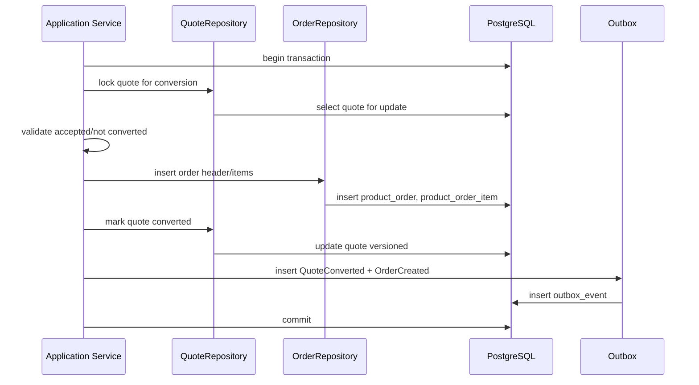
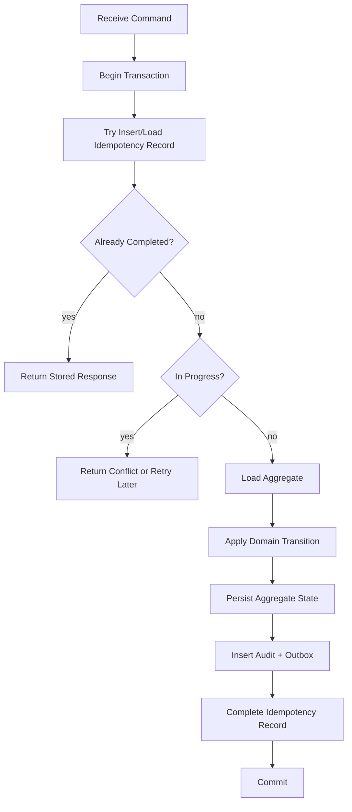

------
title: Build From Scratch: Enterprise Java Microservices CPQ & Order Management Platform - Part 026
description: Mendesain aggregate persistence patterns untuk quote dan order: load/save aggregate, snapshot, child collection mutation, versioning, audit, outbox, transaction script vs domain method, repository orchestration, consistency checking, dan repair-safe persistence.
series: learn-enterprise-cpq-oms-glassfish-camunda8
seriesTitle: Build From Scratch: Enterprise Java Microservices CPQ & Order Management Platform
order: 26
partTitle: Aggregate Persistence Patterns
tags:
  - java
  - persistence
  - aggregate
  - domain-driven-design
  - postgresql
  - mybatis
  - cpq
  - oms
  - outbox
  - enterprise-architecture
date: 2026-07-02
------

# Part 026 — Aggregate Persistence Patterns

Part 025 membahas MyBatis mapper design. Sekarang kita naik satu layer: **aggregate persistence**.

Mapper menjawab:

```text
Bagaimana row dibaca/ditulis?
```

Aggregate persistence menjawab:

```text
Bagaimana satu perubahan bisnis disimpan sebagai state yang konsisten,
auditable, idempotent, dan event-safe?
```

Di sistem CPQ/OMS, aggregate seperti quote dan order bukan record tunggal. Mereka adalah struktur hidup:

```text
Quote
  header
  items
  configuration snapshots
  price items
  approval state
  revision history
  state transition history
  audit records
  pending events

Order
  header
  items
  fulfillment plan
  fulfillment tasks
  workflow reference
  cancellation/amendment records
  asset impact records
  state transition history
  pending events
```

Kalau kita menyimpan aggregate secara sembarangan, bug yang muncul bukan cuma data salah. Bug-nya bisa menjadi:

- quote disetujui dengan price snapshot yang tidak sama;
- order dibuat dua kali dari quote yang sama;
- fulfillment task berjalan untuk order item yang sudah dibatalkan;
- asset berubah tanpa evidence order;
- Kafka event terkirim tapi database rollback;
- database commit tapi event tidak pernah terkirim;
- audit trail tidak bisa menjawab siapa melakukan apa.

Part ini membangun persistence pattern yang mencegah hal-hal itu.

---

## 1. Aggregate Persistence Is Not CRUD

CRUD berpikir seperti ini:

```text
create quote
update quote
delete quote
select quote
```

Aggregate persistence berpikir seperti ini:

```text
load quote for command
apply domain transition
persist state delta
append evidence
append outbox events
commit atomically
```

CRUD melihat tabel. Aggregate persistence melihat **unit of consistency**.

Untuk quote, unit of consistency bisa berupa:

```text
quote header + quote items + configuration snapshot + price snapshot + approval state
```

Untuk order, unit of consistency bisa berupa:

```text
order header + order items + fulfillment plan + task dependency + workflow reference
```

Rule:

```text
If a business invariant crosses multiple rows, those rows belong to one persistence transaction for that command.
```

Contoh invariant:

```text
A quote cannot enter SUBMITTED unless all active quote items are valid and priced.
```

Maka submit quote harus membaca/menulis header, item validation status, price status, state transition history, audit, and outbox dalam satu local transaction.

---

## 2. Aggregate Boundary vs Transaction Boundary

Aggregate boundary dan transaction boundary sering sama, tetapi tidak selalu.

```text
Aggregate boundary:
  which objects must be consistent together by domain rules.

Transaction boundary:
  which database changes commit/rollback together for one use case.
```

Untuk command sederhana:

```text
RepriceQuoteCommand
Transaction:
  quote header update
  delete/insert calculated price items
  quote version increment
  quote state maybe DRAFT -> PRICED
  audit
  outbox QuoteRepriced
```

Untuk command lintas aggregate:

```text
ConvertQuoteToOrderCommand
Transaction:
  quote state ACCEPTED -> CONVERTED
  order header insert
  order item insert
  order initial state transition
  quote conversion record
  idempotency completion
  outbox QuoteConverted, OrderCreated
```

Ini menyentuh dua aggregate: quote dan order. Apakah itu boleh?

Di distributed architecture, kita menghindari distributed transaction antar service. Tapi di dalam satu service/database bounded context yang sama, local transaction lintas beberapa table/aggregate bisa valid jika command-nya benar-benar membutuhkan atomicity.

Quote-to-order conversion adalah contoh kuat: kita tidak ingin quote terlihat converted tetapi order tidak pernah ada.

Namun batasnya jelas:

```text
Atomic inside local database.
Async outside local database.
```

Jangan memasukkan billing/provisioning external call ke transaction ini.

---

## 3. Load Pattern: Command Load vs Read Load

Aggregate command load harus membawa data yang cukup untuk menegakkan invariant.

```java
public QuoteAggregate loadForCommand(TenantId tenantId, QuoteId quoteId) {
    QuoteHeaderRow header = quoteMapper.selectHeaderForCommand(tenantId.value(), quoteId.value());
    if (header == null) throw notFound(quoteId);

    List<QuoteItemRow> items = quoteItemMapper.selectActiveItems(tenantId.value(), quoteId.value());
    List<ConfigurationSnapshotRow> configs = configMapper.selectLatestForQuote(tenantId.value(), quoteId.value());
    List<PriceItemRow> prices = priceMapper.selectCurrentPrices(tenantId.value(), quoteId.value());
    ApprovalSummaryRow approval = approvalMapper.selectSummary(tenantId.value(), quoteId.value());

    return QuoteAggregateRehydrator.rehydrate(header, items, configs, prices, approval);
}
```

Read load untuk UI boleh lebih ringan:

```java
public QuoteDetailView getQuoteDetail(TenantId tenantId, QuoteId quoteId) {
    QuoteDetailRow header = quoteQueryMapper.selectDetailHeader(tenantId.value(), quoteId.value());
    List<QuoteDetailItemRow> items = quoteQueryMapper.selectDetailItems(tenantId.value(), quoteId.value());
    return QuoteDetailAssembler.toView(header, items);
}
```

Jangan pakai read load untuk command. Command load butuh invariant. UI load butuh presentation.

---

## 4. Rehydration Pattern

Rehydration adalah proses membangun aggregate domain dari persisted state.

```text
Rows -> Snapshot -> Domain Aggregate
```

Contoh snapshot:

```java
public record QuoteAggregateSnapshot(
    TenantId tenantId,
    QuoteId quoteId,
    QuoteNumber quoteNumber,
    QuoteState state,
    int revisionNumber,
    int version,
    CustomerAccountRef customerAccount,
    List<QuoteItemSnapshot> items,
    ApprovalSnapshot approval,
    Money totalPrice,
    Instant validUntil
) {}
```

Rehydrator:

```java
public final class QuoteAggregateRehydrator {
    public static QuoteAggregate rehydrate(
        QuoteHeaderRow header,
        List<QuoteItemRow> items,
        List<ConfigurationSnapshotRow> configs,
        List<PriceItemRow> prices,
        ApprovalSummaryRow approval
    ) {
        QuoteAggregateSnapshot snapshot = new QuoteAggregateSnapshot(
            new TenantId(header.tenantId()),
            new QuoteId(header.quoteId()),
            QuoteNumber.of(header.quoteNumber()),
            QuoteState.parse(header.state()),
            header.revisionNumber(),
            header.version(),
            new CustomerAccountRef(header.customerAccountId()),
            mapItems(items, configs, prices),
            mapApproval(approval),
            MoneyFactory.fromDatabase(header.totalAmount(), header.currency()),
            header.validUntil().toInstant()
        );

        return QuoteAggregate.rehydrate(snapshot);
    }
}
```

Aggregate factory still validates minimal structural consistency:

```java
public static QuoteAggregate rehydrate(QuoteAggregateSnapshot snapshot) {
    requireNonNull(snapshot.tenantId());
    requireNonNull(snapshot.quoteId());
    requireNonNull(snapshot.state());

    if (snapshot.items().isEmpty() && snapshot.state().requiresItems()) {
        throw new CorruptAggregateException("submitted quote has no active items");
    }

    return new QuoteAggregate(snapshot);
}
```

Important distinction:

```text
Rehydration validates persisted consistency.
Command method validates requested transition.
```

---

## 5. Dirty Tracking vs Explicit Save Plan

There are two broad approaches to saving aggregate:

### Approach A: Dirty Tracking

Aggregate remembers what changed:

```java
quote.addItem(...);
quote.markDirty("items");
```

Repository inspects dirty flags.

### Approach B: Explicit Save Plan

Command handler/application service creates an explicit persistence plan from command result.

```java
QuoteMutationResult result = quote.submit(command);
quoteRepository.persist(result.toSavePlan());
```

For this series, use **explicit save plan**.

Why?

Enterprise CPQ/OMS mutations are not just object property changes. They are evidence-producing transitions.

A save plan can say:

```java
public record QuoteSavePlan(
    QuoteHeaderUpdateRow headerUpdate,
    List<QuoteItemUpdateRow> itemUpdates,
    List<QuoteStateTransitionInsertRow> transitions,
    List<AuditRecordInsertRow> audits,
    List<OutboxInsertRow> events,
    IdempotencyCompletionRow idempotencyCompletion
) {}
```

This is reviewable and testable.

Dirty tracking often hides too much.

---

## 6. Save Plan Pattern

Command method returns domain result:

```java
public QuoteSubmitResult submit(SubmitQuoteCommand command) {
    ensureStateAllowsSubmit();
    ensureAllItemsConfigured();
    ensureAllItemsPriced();
    ensureApprovalIfRequired();

    QuoteState from = this.state;
    this.state = QuoteState.SUBMITTED;
    this.version = this.version + 1;

    return new QuoteSubmitResult(
        this.snapshotForPersistence(),
        StateTransition.of(from, this.state, command.actor(), command.reason()),
        AuditEvidence.quoteSubmitted(...),
        DomainEvent.quoteSubmitted(...)
    );
}
```

Application maps result to save plan:

```java
QuoteSubmitResult result = quote.submit(command);
QuoteSavePlan savePlan = QuoteSavePlanFactory.forSubmit(command, result);
quoteRepository.persistSubmit(savePlan);
```

Repository persists in deterministic order:

```java
@Transactional
public void persistSubmit(QuoteSavePlan plan) {
    int updated = quoteMapper.updateHeaderVersioned(plan.headerUpdate());
    if (updated != 1) throw concurrencyConflict(plan.quoteId());

    transitionMapper.insertQuoteStateTransition(plan.transition());
    auditMapper.insertAuditRecords(plan.auditRecords());
    outboxMapper.insertOutboxEvents(plan.events());
    idempotencyMapper.complete(plan.idempotencyCompletion());
}
```

Persistence order matters.

Recommended order:

```text
1. Update/insert aggregate current state.
2. Insert child rows/snapshots needed by current state.
3. Insert state transition history.
4. Insert audit evidence.
5. Insert outbox events.
6. Complete idempotency record.
```

Why idempotency completion last?

Because replay should only return successful response after all state/evidence/event rows are durably written.

---

## 7. Quote Save Patterns

### 7.1 Draft Quote Creation

Creation transaction:

```text
insert quote header
insert initial quote state transition
insert audit record
insert outbox QuoteDraftCreated
complete idempotency
```

No quote item yet.

SQL operations:

```text
quoteMapper.insertHeader
quoteTransitionMapper.insert
quoteAuditMapper.insert
outboxMapper.insert
idempotencyMapper.complete
```

Invariant:

```text
DRAFT quote may have zero items.
```

### 7.2 Add Quote Item

Transaction:

```text
load quote header/version
validate quote mutable
insert quote item
insert empty/initial configuration snapshot or mark CONFIGURATION_REQUIRED
update quote header version/status
insert audit
insert outbox QuoteItemAdded
```

Policy:

```text
Adding an item must invalidate previous quote price total unless pricing is immediately recalculated.
```

Possible state change:

```text
DRAFT -> CONFIGURATION_REQUIRED
PRICED -> CONFIGURATION_REQUIRED
APPROVAL_REQUIRED -> CONFIGURATION_REQUIRED if mutation invalidates approval
```

### 7.3 Configure Quote Item

Transaction:

```text
load quote aggregate for command
validate item exists and quote mutable
run configuration engine outside DB transaction or before write transaction if deterministic and bounded
insert configuration snapshot
update quote item configuration status
update quote header version/state
insert audit
insert outbox QuoteItemConfigured
```

If configuration evaluation is CPU-heavy, avoid holding DB lock while computing. Use two-phase application flow:

```text
1. Read catalog/config data.
2. Compute proposed configuration result.
3. Open transaction.
4. Reload quote/version.
5. Verify command still valid.
6. Persist snapshot.
```

### 7.4 Reprice Quote

Transaction:

```text
load quote aggregate
validate all required configurations valid
compute price result before write transaction or bounded inside transaction
delete old calculated price rows for current mutable revision
insert new price rows
update quote totals/status/version
insert price snapshot hash
insert audit
insert outbox QuoteRepriced
```

If quote is already accepted/converted, repricing must create new revision, not overwrite evidence.

### 7.5 Submit Quote

Transaction:

```text
load quote aggregate for command
validate configured/priced/not expired
update quote state to SUBMITTED or APPROVAL_REQUIRED
insert state transition
insert approval request if needed
insert audit
insert outbox QuoteSubmitted / QuoteApprovalRequested
complete idempotency
```

### 7.6 Approve Quote

Transaction:

```text
load approval context
validate approver authorization at application layer
insert approval decision
update quote approval state
maybe update quote state APPROVAL_REQUIRED -> APPROVED
insert audit evidence
insert outbox QuoteApproved
```

Approval evidence must include:

- approver identity;
- approval policy version;
- reason/comment;
- price override/margin context if relevant;
- timestamp;
- previous and next state.

### 7.7 Accept Quote

Transaction:

```text
load quote aggregate
validate quote approved if required
validate quote not expired
update quote state ACCEPTED
freeze quote acceptance snapshot
insert audit
insert outbox QuoteAccepted
```

Acceptance snapshot is evidence. Do not overwrite.

---

## 8. Order Save Patterns

### 8.1 Create Order from Quote

Quote-to-order conversion is one of the most sensitive operations.

Transaction:

```text
begin idempotency command
lock quote for conversion
validate quote ACCEPTED and not converted
insert order header
insert order items from quote snapshot
insert order price/config snapshots
insert order state transition CREATED
update quote state CONVERTED
insert quote conversion record
insert audit records for quote and order
insert outbox QuoteConverted
insert outbox OrderCreated
complete idempotency
commit
```

Diagram:



No Kafka publish inside the transaction. Outbox relay publishes after commit.

### 8.2 Decompose Order

Order decomposition may be deterministic but can be complex.

Pattern:

```text
1. Load order aggregate and commercial item snapshots.
2. Load technical mapping version.
3. Build fulfillment plan in memory.
4. Open transaction.
5. Reload/lock order or check version.
6. Insert fulfillment plan.
7. Insert fulfillment tasks and dependencies.
8. Update order decomposition state.
9. Insert audit/outbox.
10. Commit.
```

If decomposition is triggered by Camunda worker, worker must be idempotent.

Unique constraints:

```text
unique(tenant_id, order_id, decomposition_version)
unique(tenant_id, order_id, fulfillment_plan_id)
```

or command idempotency:

```text
unique(tenant_id, command_id)
```

### 8.3 Update Fulfillment Task Result

Transaction:

```text
insert/verify inbox or worker command idempotency
load fulfillment task
validate task state allows result
update task state/version
maybe update dependent tasks to READY
maybe update order item fulfillment state
maybe update order aggregate state
insert task history
insert audit
insert outbox FulfillmentTaskCompleted / Failed
```

Do not let adapter callback directly mutate order header without task context.

### 8.4 Complete Order

Transaction:

```text
load order aggregate
verify all required fulfillment tasks completed or skipped by policy
update order items completed
update order state COMPLETED
write asset impact finalization marker
insert state transition
insert audit
insert outbox OrderCompleted
```

Completion is not “last task callback arrived”. Completion is a business decision based on fulfillment plan state.

---

## 9. Child Collection Persistence Patterns

Aggregate child collections can be persisted with different strategies.

### 9.1 Append-Only Child

Use for evidence/history:

- state transition;
- audit record;
- approval decision;
- event outbox;
- fulfillment task attempt;
- external call attempt.

Pattern:

```text
insert only
never update business meaning
```

### 9.2 Versioned Snapshot Child

Use for configuration/price snapshot:

```text
insert new snapshot with revision/version/hash
mark current pointer or derive latest by revision
```

Good for:

- quote configuration snapshots;
- quote price snapshots;
- order frozen snapshots;
- catalog snapshot reference.

### 9.3 Mutable Working Child

Use for draft quote item:

```text
insert/update/delete while quote remains draft-like
```

Once quote moves to accepted/converted, freeze or create revision.

### 9.4 Derived Projection Child

Use for search/dashboard:

```text
delete/rebuild or update projection from source of truth
```

Projection must be rebuildable.

Table:

| Child Type | Mutation Style | Example |
|---|---|---|
| Evidence | append-only | audit, state transition |
| Snapshot | insert new version | configuration snapshot |
| Working set | update/delete allowed in mutable state | draft quote item |
| Projection | rebuildable | order dashboard summary |

---

## 10. Snapshot Pattern

A snapshot is not just JSON dumped into a column. A production snapshot needs metadata.

```text
snapshot_id
aggregate_id
revision_number
schema_id
schema_version
payload_json
payload_hash
created_at
created_by
source_command_id
```

Why hash?

- detect accidental mutation;
- compare whether reprice changed actual result;
- support idempotent replay;
- support audit evidence.

Example:

```sql
create table quote_price_snapshot (
    tenant_id uuid not null,
    quote_id uuid not null,
    snapshot_id uuid not null,
    revision_number integer not null,
    schema_id text not null,
    schema_version text not null,
    price_hash text not null,
    price_json jsonb not null,
    created_at timestamptz not null,
    created_by uuid,
    primary key (tenant_id, snapshot_id),
    unique (tenant_id, quote_id, revision_number, price_hash)
);
```

Snapshot policy:

```text
Working data may be normalized.
Evidence snapshot should be immutable.
```

For quote acceptance, create an acceptance snapshot that contains all commercial promise material:

- customer reference;
- quote revision;
- product offerings;
- product configurations;
- prices;
- discounts;
- approval evidence references;
- terms/validity;
- schema versions;
- hashes.

---

## 11. State Transition Persistence

Every meaningful lifecycle transition should write transition history.

Current state table:

```text
quote.state = APPROVED
```

Transition table:

```text
DRAFT -> CONFIGURATION_REQUIRED
CONFIGURATION_REQUIRED -> PRICED
PRICED -> APPROVAL_REQUIRED
APPROVAL_REQUIRED -> APPROVED
APPROVED -> ACCEPTED
```

Current state answers:

```text
Where is it now?
```

Transition history answers:

```text
How did it get there?
Who/what caused it?
Was the path legal?
```

Persistence rule:

```text
State update and transition insert must be in the same transaction.
```

If state changes but transition is missing, the aggregate is operationally corrupt.

---

## 12. Audit Persistence

Audit is not logging.

Logging is operational signal. Audit is business/legal evidence.

Audit record should include:

```text
audit_id
tenant_id
aggregate_type
aggregate_id
entity_type
entity_id
action
actor_type
actor_id
source_system
correlation_id
causation_id
command_id
before_json
after_json
reason_code
reason_text
occurred_at
```

Persistence rule:

```text
If command changes business state, audit evidence is written in the same transaction.
```

Do not write audit asynchronously for critical state changes. Async audit can be used for derived technical telemetry, not primary evidence.

---

## 13. Outbox Coupling Pattern

Domain events should be persisted with the same local transaction as state mutation.

```text
state change + outbox event = one commit
```

Example submit quote:

```text
update quote state SUBMITTED
insert quote_state_transition
insert audit
insert outbox event QuoteSubmitted
commit
```

Outbox payload should describe committed fact, not requested command.

Bad event:

```json
{
  "eventType": "SubmitQuoteRequested",
  "quoteId": "..."
}
```

Good event:

```json
{
  "eventType": "QuoteSubmitted",
  "quoteId": "...",
  "fromState": "PRICED",
  "toState": "SUBMITTED",
  "revisionNumber": 3,
  "version": 12,
  "submittedAt": "2026-07-02T10:00:00Z"
}
```

The event says what is already true after commit.

---

## 14. Idempotency and Aggregate Persistence

Idempotency must wrap aggregate mutation.

Flow:



Idempotency record stores:

- idempotency key;
- command type;
- request hash;
- aggregate reference;
- status;
- response snapshot;
- created/updated timestamp;
- expiry policy.

If same key but different request hash arrives, reject.

```text
Same key + same hash + completed => replay response.
Same key + different hash => idempotency conflict.
Same key + in progress => command already processing.
```

---

## 15. Consistency Check Pattern

Aggregate persistence should include consistency checks after load and before save.

### Load Consistency Check

Detect corrupt persisted state:

```java
if (header.state().equals("APPROVED") && approval == null) {
    throw new CorruptAggregateException("approved quote has no approval summary");
}
```

### Save Consistency Check

Ensure save plan is coherent:

```java
if (plan.events().isEmpty()) {
    throw new IllegalStateException("state-changing command must emit at least one event");
}

if (plan.headerUpdate().nextVersion() != plan.headerUpdate().expectedVersion() + 1) {
    throw new IllegalStateException("invalid version increment");
}
```

### Database Constraint Check

Let PostgreSQL enforce facts that must always hold:

```sql
check (version >= 1)
check (state in ('DRAFT', 'PRICED', 'APPROVAL_REQUIRED', 'APPROVED', 'ACCEPTED', 'CONVERTED', 'CANCELLED'))
unique (tenant_id, quote_number)
```

Consistency is layered:

```text
API validation
  -> command validation
    -> domain invariant
      -> repository save plan check
        -> database constraint
          -> audit/reconciliation
```

No single layer is enough.

---

## 16. Persistence Pattern for Revisions

Quote revision is not the same as row version.

```text
row version:
  concurrency control

quote revision:
  business version of commercial promise
```

Example:

```text
Quote Q-100 revision 1: original proposal
Quote Q-100 revision 2: changed bandwidth option
Quote Q-100 revision 3: discounted price approved
```

Within revision 3, row version may move from 17 to 23 due to internal updates.

Persistence design:

```sql
quote:
  quote_id
  quote_number
  current_revision_number
  state
  version

quote_revision:
  quote_revision_id
  quote_id
  revision_number
  state
  created_from_revision_number
  reason_code
  created_at

quote_item:
  quote_id
  revision_number
  quote_item_id
  ...
```

Or use current working tables plus immutable snapshots. The exact schema can vary, but semantic distinction must not be lost.

Rules:

```text
Use row version for concurrency.
Use business revision for customer-visible change history.
Use snapshot hash for evidence equality.
```

---

## 17. Persistence Pattern for Order Amendment

Order amendment is not a simple update.

An amendment is a new business intent that references an existing order/asset.

Pattern:

```text
original order remains evidence
amendment order captures requested delta
fulfillment evaluates delta
asset impact applies after completion
```

Persistence objects:

```text
product_order
product_order_item
order_relationship
order_amendment
asset_impact_plan
```

Example:

```text
Order O-100: ADD Fiber 100 Mbps
Order O-151: MODIFY asset from Fiber 100 Mbps to Fiber 500 Mbps
```

Do not overwrite O-100 item to become 500 Mbps. That destroys history.

Order amendment save transaction:

```text
insert amendment order
insert order relationship AMENDS -> original order
insert order items with action MODIFY
insert intended asset impact plan
insert audit
insert outbox OrderAmendmentCreated
```

---

## 18. Persistence Pattern for Asset Impact

Asset update should be linked to completed fulfillment, not merely order submission.

Bad:

```text
When order created, update asset immediately.
```

Why bad?

Provisioning can fail. Customer should not have active asset for service that was never activated.

Better:

```text
Order created -> asset impact plan created
Fulfillment completed -> asset impact applied
Asset state changed -> asset event emitted
```

Tables:

```text
asset_impact_plan
asset_impact_item
asset_state_transition
customer_asset
```

Transaction when applying asset impact:

```text
load order completion context
load asset with version
validate impact not already applied
update/insert asset rows
insert asset transition history
mark impact applied
insert audit
insert outbox AssetActivated / AssetModified / AssetDisconnected
```

This creates traceability:

```text
asset change -> impact item -> fulfillment task -> order item -> order -> quote
```

---

## 19. Handling Partial Failure Inside Transaction

Inside local transaction, failure should rollback all changes.

Example:

```text
update quote state succeeds
insert outbox fails
```

Rollback. Quote state must not remain changed without outbox event.

Outside local transaction, failure should be handled by state machine/retry/compensation.

Example:

```text
order committed
outbox published OrderCreated
Camunda process starts
provisioning fails
```

Do not rollback order creation. Move order to fallout/failed/compensating state according to workflow.

Mental model:

```text
Before commit: rollback is cheap.
After commit and external visibility: use state transition, retry, compensation, repair.
```

---

## 20. Repository Implementation Shape

Repository should not become a god class.

Split by aggregate and operation group:

```text
QuotePersistenceRepository
  loadForCommand
  persistDraftCreation
  persistItemAdded
  persistConfigurationApplied
  persistRepriced
  persistSubmitted
  persistApproved
  persistAccepted

OrderPersistenceRepository
  loadForCommand
  persistCreatedFromQuote
  persistDecomposed
  persistTaskResult
  persistCompleted
  persistCancelled
```

If one repository exceeds readable size, split internal collaborators:

```text
QuoteAggregateLoader
QuoteSavePlanPersister
QuoteSnapshotWriter
QuoteAuditWriter
```

But avoid premature over-abstraction.

Good repository code reads like a transaction script, but the decisions have already been made by domain/application layer.

```java
public void persistRepriced(QuoteRepriceSavePlan plan) {
    requireCoherent(plan);

    int updated = quoteMapper.updatePricingStateVersioned(plan.headerUpdate());
    ensureUpdated(updated, plan.quoteId());

    priceMapper.deleteCalculatedPrices(plan.tenantId(), plan.quoteId(), plan.revisionNumber());
    priceMapper.insertPriceItems(plan.priceItems());
    snapshotMapper.insertPriceSnapshot(plan.priceSnapshot());
    auditMapper.insertAuditRecords(plan.auditRecords());
    outboxMapper.insertOutboxEvents(plan.events());
}
```

This is acceptable. It is explicit and boring.

---

## 21. Transaction Script vs Rich Domain Model

There is a false binary:

```text
Either all logic in service transaction scripts,
or all logic in rich domain objects.
```

For enterprise CPQ/OMS, use a layered split:

```text
Application service:
  command orchestration, authorization, transaction boundary, idempotency

Domain aggregate:
  invariant, state transition, calculation-independent business rules

Domain service:
  pricing/configuration/decomposition algorithms that need external domain data

Repository:
  persistence orchestration

Mapper:
  SQL execution
```

Example submit quote:

```java
public SubmitQuoteResult handle(SubmitQuoteCommand command) {
    authz.require(command.actor(), Permission.SUBMIT_QUOTE, command.quoteId());

    return transaction.execute(() -> {
        idempotency.begin(command.identity());

        QuoteAggregate quote = quoteRepository.loadForCommand(command.tenantId(), command.quoteId());
        QuoteSubmitDecision decision = quote.submit(command.actor(), command.reason(), clock.now());

        QuoteSubmitSavePlan plan = savePlanFactory.create(command, decision);
        quoteRepository.persistSubmit(plan);

        idempotency.complete(command.identity(), decision.responseSnapshot());
        return decision.toResult();
    });
}
```

No layer does everything.

---

## 22. Aggregate Events: Pull or Return?

Two patterns:

### Pull Events

Aggregate records events internally:

```java
quote.submit(...);
List<DomainEvent> events = quote.pullEvents();
```

### Return Events

Command method returns result with events:

```java
QuoteSubmitResult result = quote.submit(...);
result.events();
```

For this system, prefer **return events** for command methods.

Why?

- clearer test assertions;
- no hidden mutable event buffer;
- easier save plan construction;
- command-specific evidence is explicit.

Example:

```java
QuoteSubmitResult result = quote.submit(command);
assertThat(result.events()).containsExactly(QuoteSubmitted(...));
```

---

## 23. Persistence for Long-Running Workflow References

Camunda/Zeebe process instance is not source of truth for business state. But we need correlation.

Store workflow reference:

```text
workflow_reference_id
tenant_id
aggregate_type
aggregate_id
process_definition_key
process_instance_key
bpmn_process_id
version
state
started_at
ended_at
```

Persistence pattern:

```text
1. Business command commits state + outbox StartWorkflowRequested.
2. Workflow starter consumes outbox/event.
3. Starts Camunda process.
4. Stores workflow reference in local DB.
5. Emits WorkflowStarted if needed.
```

If process start fails, business state remains committed and workflow start can be retried.

Do not block quote/order transaction waiting for external workflow engine unless the process start is inside the same bounded runtime and has strict timeout. Even then, prefer outbox for resilience.

---

## 24. Persistence for Repair Commands

Production systems need repair commands. But repair must be safer than normal mutation, not more dangerous.

Repair command pattern:

```text
load aggregate with lock
validate repair permission
validate current corrupt/stuck state
record repair reason and ticket reference
apply constrained state transition
insert repair audit
insert outbox repair event if external systems must know
commit
```

Repair table:

```text
repair_action
  repair_action_id
  tenant_id
  aggregate_type
  aggregate_id
  action_type
  reason_code
  ticket_ref
  before_json
  after_json
  actor_id
  occurred_at
```

Repair must never silently update rows.

Bad:

```sql
update product_order set state = 'COMPLETED' where order_id = ?;
```

Good:

```text
Repair command: ForceCloseOrderAfterVerifiedFulfillment
Evidence: ticket INC-123, failed callback from provisioning already reconciled
State transition: FALLOUT -> COMPLETED_MANUALLY
Audit: before/after + actor + reason
Outbox: OrderManuallyClosed
```

---

## 25. Aggregate Corruption and Reconciliation

Even with good design, production data can drift due to bugs, failed migrations, manual patches, or integration incidents.

Build reconciliation queries:

```text
quotes in APPROVED state without approval decision
orders COMPLETED with incomplete required task
fulfillment task COMPLETED without external result reference
asset active without completed order impact
outbox PENDING older than threshold
inbox RECEIVED not processed older than threshold
quote CONVERTED without order relationship
```

These queries are operational assets.

Example:

```sql
select q.tenant_id, q.quote_id, q.quote_number
from quote q
left join quote_approval_decision ad
  on ad.tenant_id = q.tenant_id
 and ad.quote_id = q.quote_id
 and ad.decision = 'APPROVED'
where q.state = 'APPROVED'
  and ad.quote_id is null;
```

Aggregate persistence is incomplete without reconciliation.

---

## 26. Testing Aggregate Persistence

Test aggregate persistence at multiple levels.

### 26.1 Rehydration Test

```text
Given rows representing quote with items/prices/approval
When rehydrate
Then aggregate state and invariants are correct
```

### 26.2 Save Plan Test

```text
Given QuoteSubmitResult
When save plan is created
Then header update, transition, audit, and event rows are present
```

### 26.3 Repository Transaction Test

```text
Given quote in PRICED
When persist submit save plan
Then quote state changed, transition inserted, audit inserted, outbox inserted atomically
```

### 26.4 Rollback Test

```text
Given outbox insert fails due to constraint
When persist submit
Then quote state remains unchanged
```

### 26.5 Idempotency Replay Test

```text
Given command completed once
When same key/hash arrives
Then response is replayed and aggregate is not mutated twice
```

### 26.6 Concurrent Mutation Test

```text
Given quote version 5
When two commands update version 5 concurrently
Then exactly one succeeds
```

### 26.7 Corruption Detection Test

```text
Given quote APPROVED without approval row
When loadForCommand
Then CorruptAggregateException is raised
```

These tests are heavier than unit tests, but they protect the business core.

---

## 27. Performance Considerations

Aggregate persistence can become slow if naïve.

Common issues:

| Issue | Cause | Mitigation |
|---|---|---|
| Row explosion | giant join aggregate load | split queries by child table |
| Lock contention | long transaction with computation/external calls | compute before transaction, revalidate after reload |
| Slow child insert | large batch as one SQL | chunk/JDBC batch |
| Bloated snapshots | huge JSONB payload | store normalized core + compressed/archive snapshot if needed |
| Search hits aggregate tables | dashboard query joins source tables heavily | projection table/read model |
| Outbox pileup | relay too slow or poison messages | claim batching, retry policy, dead-letter status |

General rule:

```text
Command path optimizes correctness first, then latency.
Read path optimizes projection and index fit.
Workflow path optimizes retry safety and observability.
```

---

## 28. Failure Mode Catalogue

### Failure 1: State Updated Without Outbox

Cause:

```text
Kafka publish outside DB without outbox, or outbox insert not atomic.
```

Consequence:

```text
Other services never learn committed fact.
```

Prevention:

```text
State update + outbox insert in one transaction.
```

### Failure 2: Event Published Before Commit

Cause:

```text
Publish Kafka inside transaction before commit.
```

Consequence:

```text
Consumer sees event for state that later rolls back.
```

Prevention:

```text
Publish only from outbox after commit.
```

### Failure 3: Quote Converted Twice

Cause:

```text
No idempotency key, no quote lock/version check, no unique conversion constraint.
```

Prevention:

```text
conversion command idempotency + select for update + unique quote_conversion(tenant_id, quote_id).
```

### Failure 4: Approval Evidence Missing

Cause:

```text
Approval state update and approval decision insert not atomic.
```

Prevention:

```text
approval decision insert + quote state update + audit in one transaction.
```

### Failure 5: Asset Updated Too Early

Cause:

```text
Asset mutation at order submission, not fulfillment completion.
```

Prevention:

```text
asset impact plan first, asset apply only after verified fulfillment milestone.
```

### Failure 6: Repository God Class

Cause:

```text
Repository handles authorization, pricing, workflow, SQL, event mapping, and repair.
```

Prevention:

```text
keep repository persistence-focused; move business decisions to domain/application services.
```

---

## 29. Implementation Milestone

Build aggregate persistence in this order:

```text
Milestone 1:
  quote header + item load/save
  optimistic update
  state transition history

Milestone 2:
  configuration snapshot
  price item persistence
  price snapshot hash

Milestone 3:
  quote submit/approval/accept lifecycle
  audit evidence
  outbox events

Milestone 4:
  quote-to-order conversion
  order header/item insert
  conversion idempotency

Milestone 5:
  fulfillment plan/task persistence
  order decomposition save
  task result save

Milestone 6:
  asset impact plan/apply persistence
  reconciliation queries
  repair command persistence
```

Do not start with all tables and all workflows. Start with one aggregate path and make it production-grade end to end.

---

## 30. What We Have Built

Kita sekarang punya mental model dan pattern untuk persistence aggregate:

```text
Command
  -> idempotency begin
  -> aggregate load for command
  -> domain transition
  -> save plan
  -> versioned state update
  -> child rows/snapshots
  -> state transition history
  -> audit evidence
  -> outbox events
  -> idempotency complete
  -> commit
```

Kita juga memisahkan:

- command load vs read load;
- row version vs business revision;
- current state vs transition history;
- working data vs immutable evidence;
- aggregate mutation vs external effect;
- rollback before commit vs compensation after commit;
- normal command vs repair command.

Part berikutnya akan membahas **Transaction Boundaries and Unit of Work**. Di sana kita akan memperjelas kapan transaction dimulai/berakhir, bagaimana menghindari long transaction, bagaimana menggabungkan outbox/idempotency/audit, dan bagaimana memutus batas antara database, Kafka, Camunda, dan external systems.

---

## Referensi

- PostgreSQL Concurrency Control: https://www.postgresql.org/docs/current/mvcc.html
- PostgreSQL Transaction Isolation: https://www.postgresql.org/docs/current/transaction-iso.html
- PostgreSQL Explicit Locking: https://www.postgresql.org/docs/current/explicit-locking.html
- MyBatis Mapper XML Files: https://mybatis.org/mybatis-3/sqlmap-xml.html
- MyBatis Dynamic SQL: https://mybatis.org/mybatis-3/dynamic-sql.html
