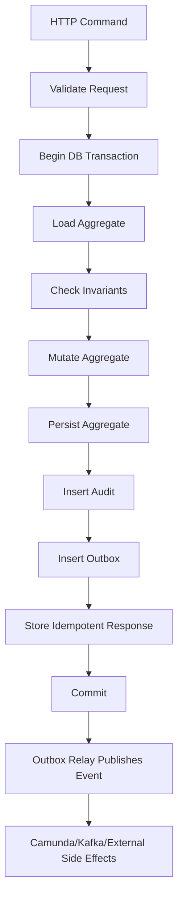
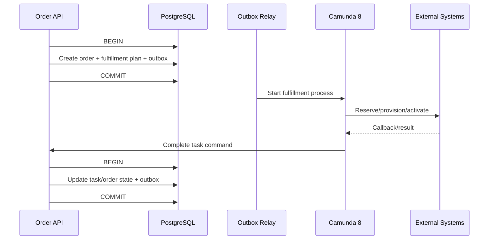
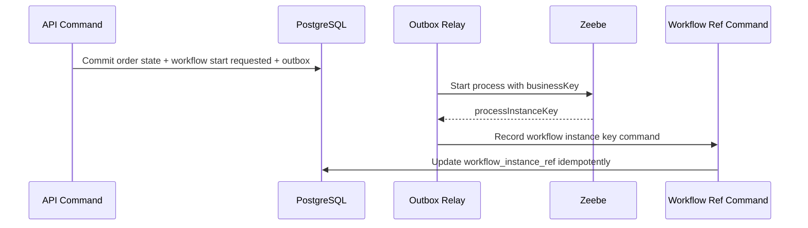

------
title: Build From Scratch: Enterprise Java Microservices CPQ & Order Management Platform - Part 027
description: Transaction boundary, unit of work, database consistency, outbox coupling, idempotency, and safe command execution model for an enterprise CPQ/OMS platform.
series: learn-enterprise-cpq-oms-glassfish-camunda8
seriesTitle: Build From Scratch: Enterprise Java Microservices CPQ & Order Management Platform
order: 27
partTitle: Transaction Boundaries and Unit of Work
tags:
  - java
  - microservices
  - cpq
  - oms
  - postgresql
  - mybatis
  - transaction
  - unit-of-work
  - outbox
  - consistency
  - enterprise-architecture
date: 2026-07-02
---

# Part 027 — Transaction Boundaries and Unit of Work

Pada part sebelumnya kita sudah punya tiga fondasi penting:

1. **PostgreSQL schema** sebagai source of truth.
2. **MyBatis mapper** sebagai boundary SQL eksplisit.
3. **Aggregate persistence pattern** untuk menyimpan `Quote`, `Order`, `Asset`, `Subscription`, dan child collection-nya tanpa berubah menjadi CRUD bebas.

Sekarang kita perlu menjawab pertanyaan yang lebih berbahaya:

> Dalam sistem CPQ/OMS enterprise, satu transaksi database harus dimulai di mana, berakhir di mana, dan apa saja yang **tidak boleh** terjadi di dalam transaksi itu?

Ini bukan detail teknis kecil. Ini adalah garis pemisah antara sistem yang bisa dioperasikan dan sistem yang sering menghasilkan order hantu, quote double-submit, event hilang, workflow nyangkut, approval tidak sinkron, dan data repair yang tidak bisa dipertanggungjawabkan.

Kita akan membangun mental model transaction boundary dengan gaya yang sederhana:

- **command masuk**;
- **state dibaca**;
- **invariant diperiksa**;
- **state diubah**;
- **audit dan outbox ikut ditulis**;
- **commit**;
- **side effect eksternal dilakukan setelah commit**.

Kalau hanya mengingat satu prinsip dari part ini, ingat ini:

> Transaksi lokal harus menjaga kebenaran state lokal. Jangan memaksa transaksi lokal menjadi ilusi distributed transaction lintas API, Kafka, Camunda, Redis, dan external system.

---

## 1. Problem yang Mau Diselesaikan

Dalam CPQ/OMS, command bisnis bukan operasi database sederhana.

Contoh command:

```text
SubmitQuote
ApproveQuote
RejectQuote
ReviseQuote
ConvertQuoteToOrder
ValidateOrder
StartFulfillment
CancelOrder
RetryFulfillmentTask
RepairStuckOrder
ApplyAssetChange
```

Masing-masing command punya sifat:

- mengubah banyak table;
- harus idempotent;
- harus memeriksa state sekarang;
- harus mencatat audit;
- biasanya harus memicu event;
- kadang harus memulai workflow;
- kadang harus memanggil sistem eksternal;
- harus aman terhadap retry;
- harus aman terhadap concurrency.

Kita tidak bisa menulis command seperti ini:

```java
quoteMapper.updateStatus(id, "SUBMITTED");
kafkaProducer.send("quote-submitted", event);
camundaClient.newCreateInstanceCommand().send();
emailClient.send(...);
```

Kode itu terlihat pendek, tetapi boundary-nya rusak.

Apa yang terjadi kalau:

- database update berhasil, Kafka gagal?
- Kafka berhasil, database rollback?
- Camunda process start berhasil, commit database gagal?
- client retry karena timeout, lalu command dieksekusi dua kali?
- approval submit dan quote revise datang bersamaan?
- email terkirim, tetapi quote gagal submit?

Production-grade design tidak menghindari failure. Production-grade design membuat failure **terbatas, terdeteksi, dan dapat dipulihkan**.

---

## 2. Mental Model: Transaction Is a Local Truth Boundary

Transaction boundary adalah batas di mana sistem berkata:

> Setelah commit, state lokal ini benar, lengkap, dan bisa dijadikan dasar untuk proses berikutnya.

Dalam PostgreSQL, transaction memberi atomicity dan isolation untuk operasi database. Namun atomicity itu hanya benar untuk resource yang ikut dalam transaksi database tersebut.

Artinya:

| Operasi | Aman dimasukkan dalam DB transaction? | Catatan |
|---|---:|---|
| Insert/update quote | Ya | State lokal |
| Insert/update order | Ya | State lokal |
| Insert audit row | Ya | Evidence lokal |
| Insert outbox event | Ya | Event intent lokal |
| Insert idempotency record | Ya | Retry safety lokal |
| Update workflow reference row | Ya | Local correlation |
| Publish Kafka langsung | Tidak | Side effect eksternal |
| Start Camunda process langsung | Tidak ideal | Side effect eksternal |
| Call billing/provisioning API | Tidak | External side effect |
| Send email/SMS | Tidak | External side effect |
| Mutate Redis sebagai source of truth | Tidak | Redis bukan truth boundary |

Rule-nya:

> Di dalam transaksi lokal, tulis semua state lokal yang membuat command benar. Di luar transaksi lokal, jalankan side effect eksternal berdasarkan outbox/worker yang idempotent.

Diagram sederhananya:



---

## 3. Unit of Work dalam Sistem Ini

Unit of Work adalah object/pattern yang mengumpulkan perubahan yang harus disimpan sebagai satu atomic write.

Dalam stack kita:

- runtime API: Jakarta REST/Jersey di GlassFish;
- persistence: PostgreSQL;
- mapper: MyBatis;
- workflow: Camunda 8/Zeebe;
- messaging: Kafka;
- acceleration: Redis.

Unit of Work bukan sekadar `connection.setAutoCommit(false)`. Unit of Work adalah **application boundary** yang menentukan:

- command apa yang sedang dijalankan;
- aggregate apa yang boleh dimutasi;
- mapper apa yang dipakai;
- audit apa yang harus ditulis;
- outbox event apa yang harus dibuat;
- idempotency record apa yang harus diselesaikan;
- error apa yang boleh menyebabkan rollback;
- error apa yang harus menjadi domain rejection;
- kapan transaction commit;
- kapan side effect eksternal boleh dimulai.

Struktur konseptual:

```java
public interface UnitOfWork {
    <T> T execute(CommandContext ctx, TransactionalWork<T> work);
}

@FunctionalInterface
public interface TransactionalWork<T> {
    T run(TransactionScope tx);
}

public interface TransactionScope {
    QuoteMapper quoteMapper();
    OrderMapper orderMapper();
    IdempotencyMapper idempotencyMapper();
    OutboxMapper outboxMapper();
    AuditMapper auditMapper();
    Clock clock();
}
```

Ini bukan API final yang harus disalin. Ini mental model.

Kuncinya:

- resource class JAX-RS tidak mengatur transaksi sendiri;
- mapper tidak membuka/commit transaksi sendiri;
- domain object tidak tahu database;
- application service mengatur workflow command;
- unit of work mengatur atomic persistence.

---

## 4. Command Handler sebagai Pemilik Transaction Boundary

Dalam sistem ini, transaction boundary idealnya dimiliki oleh **application command handler**, bukan resource class dan bukan mapper.

Contoh layering:

```text
QuoteResource
  -> SubmitQuoteCommandHandler
      -> UnitOfWork
          -> IdempotencyMapper
          -> QuoteRepository
          -> ApprovalPolicy
          -> AuditRecorder
          -> OutboxWriter
```

Kenapa bukan JAX-RS resource?

Karena JAX-RS resource adalah transport adapter. Ia tahu HTTP, header, path, status code, request DTO. Ia tidak boleh menjadi tempat business transaction disusun.

Kenapa bukan mapper?

Karena mapper tahu SQL, bukan command semantics. Mapper tidak tahu apakah `SUBMITTED` valid dari `DRAFT`, apakah approval dibutuhkan, atau apakah event harus `QuoteSubmitted` atau `QuoteApprovalRequested`.

Kenapa bukan domain object?

Karena domain object harus murni terhadap persistence. Domain object boleh tahu invariant dan transition, tetapi tidak boleh tahu transaction manager, SQL session, outbox table, atau HTTP response.

Command handler adalah tempat yang tepat karena ia tahu:

- command intent;
- actor;
- tenant;
- aggregate target;
- invariant yang perlu diperiksa;
- event yang dihasilkan;
- audit yang perlu dicatat;
- response yang harus dikembalikan.

---

## 5. Template Command Execution

Hampir semua write command di sistem CPQ/OMS mengikuti pola ini:

```text
1. Parse command context
2. Validate request shape
3. Build command object
4. Enter idempotency gate
5. Begin DB transaction
6. Load aggregate with lock/version expectation
7. Check authorization/data scope
8. Check domain invariant
9. Mutate aggregate
10. Persist aggregate mutation
11. Persist audit trail
12. Persist outbox event
13. Persist idempotent response
14. Commit
15. Return response
```

Dalam pseudo Java:

```java
public SubmitQuoteResponse handle(CommandContext ctx, SubmitQuoteCommand cmd) {
    return idempotency.execute(ctx, cmd.idempotencyKey(), cmd.requestHash(), () ->
        unitOfWork.execute(ctx, tx -> {
            Quote quote = quoteRepository.loadForUpdate(tx, cmd.quoteId(), ctx.tenantId());

            authorization.requireCanSubmitQuote(ctx.actor(), quote);
            quote.submit(ctx.actor(), tx.clock().instant());

            quoteRepository.save(tx, quote);

            auditRecorder.record(tx, AuditRecord.quoteSubmitted(ctx, quote));

            outboxWriter.append(tx, IntegrationEvent.quoteSubmitted(ctx, quote));

            return SubmitQuoteResponse.from(quote);
        })
    );
}
```

Yang penting bukan syntax-nya. Yang penting urutannya.

Domain transition dan outbox event harus berada dalam satu transaksi database.

Kalau quote submit commit, event intent juga commit.

Kalau quote submit rollback, event intent juga rollback.

---

## 6. Apa yang Boleh Ada di Dalam Transaction?

### Boleh

Di dalam transaction, kita boleh melakukan operasi lokal yang cepat, bounded, dan deterministic:

- load aggregate;
- validate state;
- validate version;
- execute pure domain logic;
- calculate local derived field;
- insert/update/delete rows milik aggregate;
- insert audit log;
- insert outbox message;
- insert idempotency result;
- update operational projection lokal yang memang satu database dan satu bounded context;
- reserve local sequence/key kalau perlu.

### Tidak Boleh

Jangan lakukan ini di dalam transaction:

- call REST API eksternal;
- publish Kafka langsung;
- wait response Kafka;
- start Camunda process lalu menunggu hasilnya;
- call payment/billing/provisioning/inventory eksternal;
- send email/SMS;
- run long computation pricing yang bisa ratusan ms/detik tanpa limit;
- call Redis sebagai lock utama yang menentukan kebenaran domain;
- sleep/retry loop;
- melakukan network call yang tidak bisa dikontrol latensinya.

Kenapa?

Karena transaction memegang resource: connection, locks, snapshot, row versions, dan kadang index contention. Semakin lama transaction hidup, semakin besar peluang blocking, deadlock, timeout, dan concurrency anomaly.

---

## 7. Transaction Boundary per Command Type

Tidak semua command sama.

### 7.1 Quote Draft Mutation

Contoh:

```text
AddQuoteItem
UpdateQuoteItemConfiguration
RemoveQuoteItem
SetCustomerContext
```

Boundary:

```text
BEGIN
  load quote
  ensure quote mutable
  apply mutation
  validate partial consistency
  save quote
  save audit
  save outbox QuoteDraftChanged optional
  save idempotency result
COMMIT
```

Catatan:

- tidak perlu memulai workflow;
- tidak perlu approval;
- event bisa internal/projection event;
- mutation harus rejected kalau quote sudah submitted/accepted/expired.

### 7.2 Quote Submit

Boundary:

```text
BEGIN
  load quote
  ensure DRAFT or REVISED
  validate complete configuration
  validate price snapshot fresh enough
  evaluate approval requirement
  transition to SUBMITTED or PENDING_APPROVAL
  save approval request if needed
  save audit
  save outbox QuoteSubmitted / QuoteApprovalRequested
  save idempotency result
COMMIT
```

Setelah commit:

- outbox relay publish event;
- workflow starter bisa memulai Camunda approval process dari event/outbox;
- notification worker bisa kirim email setelah event publish.

### 7.3 Quote Approval Decision

Boundary:

```text
BEGIN
  load approval request
  load quote
  ensure pending approval
  ensure actor allowed
  apply approval decision
  transition quote if final approval reached
  save approval trail
  save quote
  save audit
  save outbox QuoteApproved / QuoteRejected / QuoteApprovalStepCompleted
COMMIT
```

Catatan:

Approval decision adalah evidence-heavy command. Jangan hanya update status.

Harus ada:

- approver;
- decision;
- reason;
- timestamp;
- previous state;
- policy that required approval;
- price/config snapshot yang disetujui.

### 7.4 Quote to Order Conversion

Boundary:

```text
BEGIN
  load quote
  ensure ACCEPTED or APPROVED_ACCEPTED
  ensure not already converted
  create order aggregate from quote snapshot
  link quote to order
  save order
  save quote conversion marker
  save audit
  save outbox OrderCreatedFromQuote
  save idempotency result
COMMIT
```

Jangan start fulfillment langsung di dalam transaction.

Fulfillment dimulai dari event atau command lanjutan setelah order created committed.

### 7.5 Start Order Fulfillment

Boundary:

```text
BEGIN
  load order
  ensure VALIDATED / READY_FOR_FULFILLMENT
  create fulfillment plan snapshot
  transition order to IN_PROGRESS
  persist fulfillment tasks
  save workflow reference as REQUESTED optional
  save audit
  save outbox FulfillmentPlanCreated
COMMIT
```

Setelah commit:

- workflow starter memulai Camunda process;
- workflow instance key disimpan lewat command/worker lanjutan secara idempotent.

### 7.6 Fulfillment Task Completion

Boundary:

```text
BEGIN
  load task
  ensure task IN_PROGRESS or RETRYING
  apply completion payload
  transition task COMPLETED
  update dependent task readiness
  update order item fulfillment state
  maybe update order aggregate state
  save audit
  save outbox FulfillmentTaskCompleted / OrderCompleted
COMMIT
```

Catatan:

Callback dari external system harus diperlakukan sebagai command idempotent. Jangan percaya bahwa external system hanya akan mengirim sekali.

### 7.7 Cancel Order

Boundary:

```text
BEGIN
  load order
  ensure cancellable state
  compute cancellation impact
  mark cancellable tasks cancelled
  create compensation tasks if needed
  transition order to CANCELLING or CANCELLED
  save audit
  save outbox OrderCancellationRequested / OrderCancelled
COMMIT
```

Cancellation sering tidak atomic secara bisnis karena sebagian fulfillment mungkin sudah selesai. Transaction lokal hanya mencatat intention dan state lokal. Kompensasi berjalan terpisah.

---

## 8. Transaction Boundary vs Saga Boundary

Banyak engineer mencampuradukkan local transaction dan saga.

Local transaction:

```text
Quote state + audit + outbox committed atomically in PostgreSQL.
```

Saga:

```text
Order fulfillment progresses across inventory, provisioning, billing, shipping, notification, and manual task over time.
```

Local transaction menjaga kebenaran satu bounded context.

Saga mengatur koordinasi lintas bounded context.

Diagram:



Jangan coba membuat satu transaction besar dari `CreateOrder` sampai provisioning selesai.

Itu bukan transaction. Itu business process.

---

## 9. Outbox sebagai Bagian dari Unit of Work

Outbox adalah tabel lokal yang menyimpan event intent dalam transaksi yang sama dengan state change.

Contoh table:

```sql
create table outbox_message (
  outbox_id uuid primary key,
  tenant_id uuid not null,
  aggregate_type text not null,
  aggregate_id uuid not null,
  event_type text not null,
  event_version int not null,
  event_key text not null,
  payload jsonb not null,
  headers jsonb not null,
  status text not null,
  available_at timestamptz not null,
  created_at timestamptz not null,
  published_at timestamptz,
  attempt_count int not null default 0,
  last_error text
);

create index idx_outbox_pending
  on outbox_message (status, available_at, created_at);
```

Command handler tidak publish event langsung.

Ia melakukan:

```java
outboxMapper.insert(new OutboxMessage(
    UUID.randomUUID(),
    ctx.tenantId(),
    "QUOTE",
    quote.id(),
    "QuoteSubmitted",
    1,
    quote.id().toString(),
    payload,
    headers,
    "PENDING",
    now
));
```

Lalu outbox relay mengambil row `PENDING`, publish ke Kafka, dan menandai `PUBLISHED`.

Jika Kafka down:

- database command tetap berhasil;
- event intent tidak hilang;
- relay retry;
- operasi bisa dimonitor dari outbox lag.

Ini lebih baik daripada dua pilihan buruk:

1. update DB lalu publish Kafka langsung;
2. publish Kafka dulu lalu update DB.

Keduanya bisa menghasilkan inconsistency.

---

## 10. Idempotency sebagai Transaction Participant

Idempotency record harus ikut dalam transaction boundary.

Table minimal:

```sql
create table idempotency_record (
  tenant_id uuid not null,
  idempotency_key text not null,
  command_type text not null,
  request_hash text not null,
  status text not null,
  response_code int,
  response_body jsonb,
  locked_until timestamptz,
  created_at timestamptz not null,
  completed_at timestamptz,
  primary key (tenant_id, idempotency_key)
);
```

Flow:

```text
1. Client sends Idempotency-Key
2. System hashes canonical request body
3. Insert idempotency record IN_PROGRESS
4. If duplicate key exists:
   - same hash + completed -> replay response
   - same hash + in progress -> return conflict/retry-later
   - different hash -> reject idempotency key reuse
5. Execute command in transaction
6. Store response body/status in same transaction or same unit boundary
7. Commit
```

Untuk command besar seperti `ConvertQuoteToOrder`, idempotency response penting.

Kalau client timeout setelah commit, retry harus mengembalikan order yang sama, bukan membuat order kedua.

---

## 11. Optimistic Locking dan Version Check

Untuk aggregate seperti quote/order, gunakan version column:

```sql
alter table quote add column row_version bigint not null default 0;
```

Update pattern:

```sql
update quote
set status = #{status},
    row_version = row_version + 1,
    updated_at = #{updatedAt}
where tenant_id = #{tenantId}
  and quote_id = #{quoteId}
  and row_version = #{expectedVersion};
```

Jika affected rows = 0:

```text
Either aggregate not found, tenant mismatch, or version conflict.
```

Repository harus membedakan sebaik mungkin:

- not found -> 404;
- stale version -> 409 conflict;
- invalid state -> 409 atau 422 tergantung error model;
- duplicate idempotency -> replay atau conflict.

Optimistic locking cocok karena banyak command CPQ/OMS adalah command berbasis state expectation:

```text
Approve quote only if quote still PENDING_APPROVAL.
Cancel order only if order still cancellable.
Complete task only if task still IN_PROGRESS.
```

---

## 12. SELECT FOR UPDATE: Kapan Dipakai?

Optimistic locking cukup untuk banyak kasus. Tetapi beberapa command butuh row-level lock eksplisit.

Gunakan `select ... for update` ketika:

- perlu mengambil nomor sequence bisnis yang tenant-scoped;
- perlu memastikan hanya satu conversion berjalan;
- perlu memproses pending outbox/inbox batch;
- perlu mengambil queue row untuk worker;
- perlu melakukan state transition yang sangat sensitif terhadap double execution.

Contoh:

```sql
select quote_id, status, row_version
from quote
where tenant_id = #{tenantId}
  and quote_id = #{quoteId}
for update;
```

Untuk worker batch:

```sql
select outbox_id
from outbox_message
where status = 'PENDING'
  and available_at <= now()
order by created_at
limit 100
for update skip locked;
```

`skip locked` berguna untuk parallel worker agar tidak saling menunggu row yang sama.

Namun jangan pakai lock sebagai reflex. Lock yang terlalu luas membuat throughput turun dan debugging production lebih sulit.

---

## 13. Transaction Isolation Policy

PostgreSQL mendukung standard transaction isolation levels, tetapi secara internal hanya ada beberapa perilaku berbeda. Untuk sistem ini, default praktis biasanya:

```text
READ COMMITTED + explicit optimistic locking + unique constraints + state transition guards
```

Kenapa bukan semua `SERIALIZABLE`?

Karena `SERIALIZABLE` memberi safety lebih tinggi, tetapi aplikasi harus siap retry serialization failure. Untuk sistem enterprise dengan banyak command dan long-running business process, kita tetap perlu state-machine guards dan idempotency. Serializable bukan pengganti model domain.

Policy yang masuk akal:

| Use case | Isolation | Guard tambahan |
|---|---|---|
| Quote item update | READ COMMITTED | row_version |
| Submit quote | READ COMMITTED | status guard + row_version |
| Convert quote to order | READ COMMITTED | unique quote conversion + row lock optional |
| Outbox polling | READ COMMITTED | `FOR UPDATE SKIP LOCKED` |
| Financially sensitive recalculation | REPEATABLE READ optional | retry policy |
| Cross-row invariant sensitif | SERIALIZABLE optional | retry + unique/check constraints |

Jangan menjadikan isolation level sebagai satu-satunya mekanisme correctness.

Correctness harus berlapis:

```text
Domain invariant
+ optimistic lock
+ unique/check constraint
+ idempotency key
+ audit
+ reconciliation
```

---

## 14. Savepoint: Berguna, Tapi Jangan Disalahgunakan

Savepoint bisa dipakai untuk partial rollback dalam transaksi.

Contoh berguna:

- batch import catalog: satu item gagal, item lain tetap diproses dalam batch terkontrol;
- validation enrichment optional yang bisa rollback tanpa membatalkan main transaction;
- admin repair command yang mencoba beberapa correction step.

Namun untuk command utama CPQ/OMS, savepoint sering menjadi smell.

Kalau command `SubmitQuote` sebagian berhasil dan sebagian gagal, biasanya lebih baik rollback seluruh command.

Bad pattern:

```text
Submit quote succeeds, approval insert fails, but transaction continues.
```

Itu menghasilkan quote submitted tanpa approval evidence.

Gunakan savepoint untuk batch/maintenance, bukan untuk menyembunyikan invariant failure.

---

## 15. Transaction Boundary dan Camunda 8

Camunda 8/Zeebe bukan bagian dari PostgreSQL transaction lokal.

Jangan berpikir seperti ini:

```text
BEGIN DB
  update order status
  start Zeebe process
COMMIT DB
```

Kalau process start berhasil tapi DB commit gagal, sistem punya workflow tanpa order state yang sesuai.

Lebih aman:

```text
BEGIN DB
  update order status to FULFILLMENT_START_REQUESTED
  insert outbox FulfillmentStartRequested
COMMIT DB

Outbox relay / workflow starter:
  start Zeebe process idempotently
  call API command to record process instance key
```

Workflow reference table:

```sql
create table workflow_instance_ref (
  tenant_id uuid not null,
  business_key text not null,
  aggregate_type text not null,
  aggregate_id uuid not null,
  process_definition_key text not null,
  process_instance_key text,
  status text not null,
  created_at timestamptz not null,
  updated_at timestamptz not null,
  primary key (tenant_id, business_key)
);
```

Flow:



Kuncinya: process start juga harus idempotent secara business key.

Kalau starter retry, jangan mulai dua workflow untuk order yang sama.

---

## 16. Transaction Boundary dan Kafka

Kafka publish langsung dari command handler adalah sumber banyak inconsistency.

Gunakan outbox.

Namun outbox juga harus didesain dengan benar.

### 16.1 Event Key

Event key harus mendukung ordering yang dibutuhkan.

Untuk quote event:

```text
event_key = quote_id
```

Untuk order event:

```text
event_key = order_id
```

Untuk fulfillment task event:

```text
event_key = order_id
```

Kenapa task event memakai order_id?

Karena downstream sering butuh ordering per order, bukan per task. Jika event key task_id, task completion untuk order yang sama bisa masuk partition berbeda dan ordering global per order hilang.

### 16.2 Event Payload

Payload tidak boleh hanya berisi status baru.

Minimal:

```json
{
  "eventId": "...",
  "eventType": "OrderStateChanged",
  "eventVersion": 1,
  "occurredAt": "2026-07-02T10:00:00Z",
  "tenantId": "...",
  "aggregateType": "ORDER",
  "aggregateId": "...",
  "aggregateVersion": 12,
  "correlationId": "...",
  "causationId": "...",
  "payload": {
    "previousState": "VALIDATED",
    "newState": "IN_PROGRESS",
    "reason": "FULFILLMENT_STARTED"
  }
}
```

### 16.3 Consumer Transaction

Consumer juga punya unit of work:

```text
BEGIN
  insert inbox dedupe row
  if already processed -> commit no-op
  validate event
  apply local projection/state change
  insert audit/projection event optional
COMMIT
```

Jangan anggap Kafka exactly-once semantic menyelesaikan domain idempotency. Consumer tetap harus idempotent.

---

## 17. Transaction Boundary dan Redis

Redis cepat, tetapi jangan jadikan Redis source of truth untuk command correctness.

Redis boleh dipakai untuk:

- short-lived cache;
- rate limiting;
- distributed coordination yang non-critical;
- reducing repeated read;
- idempotency acceleration setelah durable idempotency record ada;
- cache of catalog version;
- lock hint untuk mengurangi contention.

Redis tidak boleh menjadi satu-satunya tempat untuk:

- quote status;
- order status;
- approval decision;
- fulfillment completion;
- asset ownership;
- payment/provisioning truth;
- idempotency record final.

Pattern aman:

```text
DB is truth.
Redis is acceleration.
Redis can be stale.
System remains correct if Redis is empty.
```

Kalau Redis down, command mungkin lebih lambat, tetapi tidak boleh menghasilkan state salah.

---

## 18. Read-Only Query Transaction

Read-only query tidak perlu mengikuti command unit-of-work penuh.

Namun query tetap butuh boundary:

- tenant context;
- authorization/data scope;
- timeout;
- read-only connection hint;
- pagination guard;
- projection freshness metadata;
- consistent response shape.

Contoh query flow:

```text
GET /orders?customerId=...&status=IN_PROGRESS
  -> validate filter
  -> authorize data scope
  -> execute read-only mapper
  -> return cursor page
```

Untuk query besar, jangan membuka transaction panjang tanpa perlu.

Untuk export/reporting, gunakan separate path:

- async export request;
- read replica/materialized projection;
- paging chunks;
- file generation worker;
- operational audit.

Jangan membuat endpoint synchronous yang scan jutaan order.

---

## 19. Unit of Work Implementation Sketch dengan MyBatis

Di GlassFish/Jakarta EE, transaksi bisa dikelola container atau manual tergantung konfigurasi. Karena seri ini berorientasi explicit architecture, kita definisikan boundary secara eksplisit di application service. Implementasi teknis bisa memakai Jakarta Transactions/container-managed transaction atau manual SqlSession/connection demarcation.

Pseudo implementasi manual:

```java
public final class MyBatisUnitOfWork implements UnitOfWork {
    private final SqlSessionFactory sqlSessionFactory;

    @Override
    public <T> T execute(CommandContext ctx, TransactionalWork<T> work) {
        try (SqlSession session = sqlSessionFactory.openSession(false)) {
            TransactionScope scope = new MyBatisTransactionScope(session, ctx);
            T result = work.run(scope);
            session.commit();
            return result;
        } catch (DomainException e) {
            throw e;
        } catch (PersistenceException e) {
            throw translate(e);
        }
    }
}
```

Namun hati-hati:

- domain exception biasanya rollback;
- validation exception sebelum transaction tidak perlu rollback;
- duplicate key perlu diterjemahkan menjadi conflict/idempotency response;
- serialization failure perlu retry jika policy mengizinkan;
- connection timeout perlu operational error;
- commit unknown outcome harus ditangani dengan idempotency lookup.

### 19.1 Commit Unknown Outcome

Kasus sulit:

```text
Application sends COMMIT.
Network/connection fails before app receives result.
```

Apakah commit berhasil?

Aplikasi tidak selalu tahu.

Karena itu idempotency penting. Jika client retry, sistem bisa mencari apakah command sudah committed berdasarkan idempotency key atau unique business constraint.

Untuk command tanpa idempotency, commit unknown outcome sering menjadi sumber duplicate dan repair manual.

---

## 20. Error Taxonomy dalam Transaction Boundary

Tidak semua error sama.

| Error | Rollback? | Response | Retry? |
|---|---:|---|---|
| Request schema invalid | Tidak masuk transaction | 400 | No |
| Authorization denied | Biasanya sebelum mutation | 403 | No |
| Domain invariant failed | Ya jika sudah mulai | 409/422 | No unless state changed |
| Optimistic lock conflict | Ya | 409 | Client may refresh |
| Duplicate idempotency same hash completed | No new transaction | Replay | Safe |
| Duplicate idempotency different hash | No mutation | 409 | No |
| Unique constraint duplicate conversion | Ya/handled | Replay/find existing | Safe |
| Serialization failure | Ya | 503/409 internal retry | Yes with limit |
| Deadlock detected | Ya | 503/internal retry | Yes with limit |
| External system down | Tidak di command tx | Outbox retry | Yes async |
| Kafka down | Tidak rollback command | Outbox pending | Yes async |

Error harus diterjemahkan di boundary, bukan bocor sebagai stack trace SQL ke client.

---

## 21. Retry Policy untuk Transaction

Retry transaction bisa membantu, tetapi berbahaya jika command tidak idempotent.

Aman retry jika:

- command punya idempotency key;
- domain mutation deterministic;
- no external side effect inside transaction;
- outbox event ID deterministic atau dedupe-able;
- unique constraints melindungi duplicate business result.

Jangan retry membabi buta:

```java
for (int i = 0; i < 10; i++) {
  try { return command.handle(); }
  catch (Exception e) { continue; }
}
```

Retry hanya untuk error transient yang jelas:

- serialization failure;
- deadlock;
- temporary connection exhaustion;
- lock timeout, jika safe.

Gunakan backoff kecil dan limit.

Untuk command HTTP synchronous, jangan tahan request terlalu lama. Lebih baik fail dengan retry-safe response daripada membuat thread GlassFish penuh karena retry internal panjang.

---

## 22. Command Boundary: Synchronous vs Asynchronous

Tidak semua command harus menyelesaikan pekerjaan bisnis penuh secara synchronous.

### Synchronous Cocok Untuk

- create quote draft;
- update quote item;
- price simulation ringan;
- submit quote jika approval evaluation lokal cepat;
- accept quote;
- create order shell;
- cancel request accepted.

### Asynchronous Cocok Untuk

- fulfillment start;
- large pricing recalculation;
- bulk catalog publish;
- decomposition besar;
- external validation;
- provisioning;
- document generation;
- long-running approval orchestration;
- data repair/reconciliation.

Response asynchronous command:

```json
{
  "commandId": "cmd_...",
  "status": "ACCEPTED",
  "resourceId": "ord_...",
  "statusUrl": "/api/v1/orders/ord_...",
  "submittedAt": "2026-07-02T10:00:00Z"
}
```

Async bukan excuse untuk eventual inconsistency liar. Async tetap harus punya durable command record, outbox, workflow reference, dan operational visibility.

---

## 23. Transaction Boundary dan Audit Defensibility

Audit harus ikut transaksi dengan state change.

Bad design:

```text
Update quote status commit.
Then write audit asynchronously.
```

Jika audit gagal, status berubah tanpa evidence.

Better:

```text
BEGIN
  update quote status
  insert quote_state_transition
  insert audit_record
  insert outbox
COMMIT
```

Audit record minimal:

```json
{
  "actorId": "user_123",
  "actorType": "HUMAN",
  "tenantId": "tenant_1",
  "action": "QUOTE_SUBMITTED",
  "aggregateType": "QUOTE",
  "aggregateId": "quote_1",
  "previousState": "DRAFT",
  "newState": "PENDING_APPROVAL",
  "reason": "Submit for customer acceptance",
  "correlationId": "corr_...",
  "requestId": "req_...",
  "occurredAt": "2026-07-02T10:00:00Z"
}
```

Untuk regulated/enterprise context, audit bukan logging. Audit adalah evidence.

---

## 24. Avoiding “Transaction Script Spaghetti”

Command handler boleh memegang transaction boundary, tetapi jangan menjadi script 500 baris.

Pisahkan:

- request validation;
- authorization;
- domain transition;
- persistence save;
- event building;
- audit building;
- response mapping.

Contoh struktur:

```java
public final class ConvertQuoteToOrderHandler {
    private final UnitOfWork uow;
    private final QuoteRepository quotes;
    private final OrderRepository orders;
    private final QuoteToOrderConverter converter;
    private final AuditRecorder audit;
    private final OutboxWriter outbox;

    public ConvertQuoteToOrderResponse handle(CommandContext ctx, ConvertQuoteToOrderCommand cmd) {
        return uow.execute(ctx, tx -> {
            Quote quote = quotes.loadForConversion(tx, ctx.tenantId(), cmd.quoteId());
            quote.ensureConvertible();

            Order order = converter.convert(ctx, quote, cmd);

            orders.insert(tx, order);
            quotes.markConverted(tx, quote.id(), order.id(), quote.version());

            audit.record(tx, AuditRecord.quoteConverted(ctx, quote, order));
            outbox.append(tx, OrderEvents.createdFromQuote(ctx, order, quote));

            return ConvertQuoteToOrderResponse.from(order);
        });
    }
}
```

Domain object tetap menyimpan invariant:

```java
public void ensureConvertible() {
    if (!status.isConvertible()) {
        throw new InvalidQuoteState("Quote cannot be converted from " + status);
    }
    if (convertedOrderId != null) {
        throw new QuoteAlreadyConverted(convertedOrderId);
    }
}
```

---

## 25. Testing Transaction Boundary

Test transaction boundary bukan hanya unit test domain.

Kita butuh beberapa kategori.

### 25.1 Commit Atomicity Test

Pastikan aggregate + audit + outbox commit bersama.

```text
Given quote DRAFT
When submit quote
Then quote status PENDING_APPROVAL
And approval request exists
And audit exists
And outbox event exists
```

### 25.2 Rollback Atomicity Test

Paksa error setelah update sebelum outbox.

```text
Given quote DRAFT
When submit quote fails during outbox insert
Then quote remains DRAFT
And no audit exists
And no partial approval request exists
```

### 25.3 Idempotency Replay Test

```text
Given ConvertQuoteToOrder command succeeds
When same idempotency key and same payload retried
Then same order id returned
And no second order created
```

### 25.4 Concurrent Command Test

```text
Given quote DRAFT version 3
When two users submit/update quote concurrently
Then one succeeds
And one gets conflict
And no impossible state exists
```

### 25.5 Outbox Relay Test

```text
Given outbox event pending
When relay publishes successfully
Then event status PUBLISHED
When publish fails
Then event remains retryable
```

### 25.6 Commit Unknown Simulation

Sulit tetapi penting.

Bisa diuji dengan:

- fault injection setelah commit;
- retry command;
- assert idempotency replay works.

---

## 26. Production Metrics untuk Transaction Boundary

Observability harus menjawab:

- command apa yang lambat?
- command apa yang sering conflict?
- transaction mana yang deadlock?
- outbox lag berapa?
- idempotency replay berapa banyak?
- serialization retry berapa banyak?
- optimistic lock conflict naik di quote/order mana?
- external side effect tertunda karena outbox?

Metric yang berguna:

```text
cpq_command_duration_ms{command_type}
cpq_command_success_total{command_type}
cpq_command_failure_total{command_type,error_code}
cpq_transaction_rollback_total{reason}
cpq_optimistic_lock_conflict_total{aggregate_type}
cpq_idempotency_replay_total{command_type}
cpq_outbox_pending_count{event_type}
cpq_outbox_oldest_pending_age_seconds{event_type}
cpq_db_deadlock_total
cpq_db_lock_timeout_total
```

Log command harus punya:

- `correlationId`;
- `requestId`;
- `tenantId`;
- `actorId`;
- `commandType`;
- `aggregateType`;
- `aggregateId`;
- `idempotencyKey` jika ada;
- `transactionOutcome`;
- `errorCode` jika gagal.

---

## 27. Anti-Patterns

### 27.1 “Just Add @Transactional Everywhere”

Annotation transaction yang tersebar tanpa ownership boundary menghasilkan transaksi tidak jelas.

Pertanyaannya bukan “method mana diberi transaction?”

Pertanyaannya:

> Command bisnis mana yang harus atomic, dan evidence apa yang harus ikut commit?

### 27.2 Mapper Commit Sendiri

Mapper tidak boleh commit.

Kalau mapper commit sendiri:

- aggregate save bisa partial;
- audit/outbox bisa tertinggal;
- command handler kehilangan control.

### 27.3 Event Publish di Tengah Transaction

Jika event keluar sebelum commit, consumer bisa melihat event untuk state yang belum committed atau akhirnya rollback.

### 27.4 External Call di Tengah Transaction

Jika external call lambat, transaction menahan connection/lock.

Jika external call sukses lalu transaction rollback, external system sudah berubah tanpa local truth.

### 27.5 Redis Lock sebagai Correctness Utama

Redis lock bisa hilang, expire, split-brain-ish secara operational, atau tidak selaras dengan database transaction.

Unique constraint dan version check di PostgreSQL tetap wajib.

### 27.6 One Giant Transaction

Jangan bungkus quote submit, approval, order creation, fulfillment, provisioning, billing, and notification dalam satu transaction.

Itu bukan atomicity. Itu denial-of-service terhadap database dan masa depan maintenance.

### 27.7 No Durable Idempotency for Business Commands

Tanpa idempotency durable, retry client bisa menghasilkan duplicate order, duplicate approval decision, atau duplicate cancellation.

---

## 28. Practical Build Milestone

Di tahap ini, build target kita:

```text
cpq-oms-platform/
  quote-api/
  quote-application/
  quote-domain/
  quote-persistence-mybatis/
  order-api/
  order-application/
  order-domain/
  order-persistence-mybatis/
  common-transaction/
  common-idempotency/
  common-outbox/
  common-audit/
```

Implementasikan minimal:

1. `UnitOfWork` interface.
2. `MyBatisUnitOfWork` implementation.
3. `CommandContext`.
4. `IdempotencyService`.
5. `OutboxWriter`.
6. `AuditRecorder`.
7. `SubmitQuoteCommandHandler`.
8. `ConvertQuoteToOrderCommandHandler`.
9. Integration test atomic commit/rollback.
10. Concurrent test optimistic locking.

Jangan lanjut ke Kafka/Camunda production integration sebelum command boundary ini benar.

Kalau transaction boundary salah, Kafka dan Camunda hanya mempercepat penyebaran kesalahan.

---

## 29. Checklist Desain

Gunakan checklist ini untuk setiap command write:

```text
[ ] Apa aggregate utama command ini?
[ ] Apa expected current state?
[ ] Apa state transition yang terjadi?
[ ] Apa invariant yang harus dicek sebelum mutation?
[ ] Apa authorization rule?
[ ] Apakah command wajib idempotency key?
[ ] Apa unique constraint yang mencegah duplicate business result?
[ ] Apa row_version yang dicek?
[ ] Apa audit record yang harus ditulis?
[ ] Apa outbox event yang harus ditulis?
[ ] Apa response yang harus disimpan untuk replay?
[ ] Apa yang terjadi jika commit outcome unknown?
[ ] Apa side effect eksternal setelah commit?
[ ] Apa retry policy?
[ ] Apa metric dan log yang harus keluar?
```

Jika satu command tidak bisa menjawab checklist ini, command itu belum siap production.

---

## 30. Ringkasan

Transaction boundary adalah desain domain, bukan hanya konfigurasi framework.

Untuk sistem CPQ/OMS enterprise:

- command handler adalah pemilik boundary;
- mapper tidak commit sendiri;
- domain object tidak tahu database;
- local transaction menjaga state lokal;
- outbox ikut commit dengan state change;
- idempotency ikut boundary command;
- audit ikut commit dengan state change;
- Kafka, Camunda, Redis, dan external API tidak boleh dianggap bagian dari DB transaction;
- saga adalah business process, bukan giant transaction;
- retry hanya aman jika idempotency dan constraint benar;
- production observability harus melihat transaction outcome, conflict, rollback, outbox lag, dan idempotency replay.

Di part berikutnya, kita akan membangun sisi baca:

> query model, search, dashboard operasional, customer timeline, audit explorer, reporting-safe projection, dan cara membuat read model tanpa merusak aggregate write model.

---

## References

- PostgreSQL Documentation — Transaction Isolation: https://www.postgresql.org/docs/current/transaction-iso.html
- PostgreSQL Documentation — Explicit Locking: https://www.postgresql.org/docs/current/explicit-locking.html
- PostgreSQL Documentation — MVCC: https://www.postgresql.org/docs/current/mvcc.html
- Jakarta Transactions 2.0 Specification: https://jakarta.ee/specifications/transactions/2.0/
- MyBatis Documentation — XML Mapper: https://mybatis.org/mybatis-3/sqlmap-xml.html
- MyBatis Documentation — Java API / SqlSession: https://mybatis.org/mybatis-3/java-api.html
