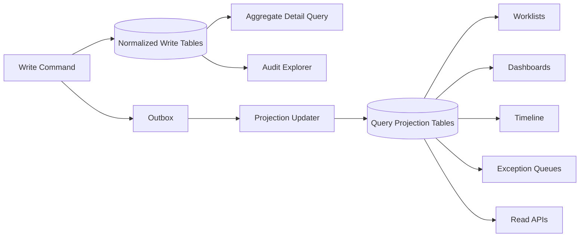

------
title: Build From Scratch: Enterprise Java Microservices CPQ & Order Management Platform - Part 028
description: Query models, search APIs, read projections, operational dashboards, customer timeline, audit explorer, and reporting-safe views for enterprise CPQ/OMS.
series: learn-enterprise-cpq-oms-glassfish-camunda8
seriesTitle: Build From Scratch: Enterprise Java Microservices CPQ & Order Management Platform
order: 28
partTitle: Query Models, Search, and Operational Views
tags:
  - java
  - microservices
  - cpq
  - oms
  - postgresql
  - mybatis
  - query-model
  - search
  - read-model
  - operations
  - projection
date: 2026-07-02
---

# Part 028 — Query Models, Search, and Operational Views

Di part sebelumnya kita memaku transaction boundary untuk command/write side. Sekarang kita masuk ke sisi yang sering diremehkan, tetapi justru paling sering dipakai user enterprise setiap hari:

> query, search, operational dashboard, timeline, exception queue, audit explorer, dan reporting-safe projection.

Sistem CPQ/OMS production tidak hanya harus bisa menjalankan command. Ia harus bisa menjawab pertanyaan operasional dengan cepat dan benar:

- Quote mana yang pending approval lebih dari 2 hari?
- Order mana yang stuck di provisioning?
- Customer ini punya asset aktif apa saja?
- Kenapa order ini belum complete?
- Siapa yang override price?
- Fulfillment task mana yang harus diretry?
- Berapa banyak order yang masuk hari ini per channel?
- Event mana yang belum published?
- Workflow instance mana yang incident?
- Apakah ada duplicate external callback?

Kalau write model hanya didesain untuk aggregate consistency, read model harus didesain untuk **operational comprehension**.

Ini bukan CQRS ceremonial. Ini kebutuhan nyata: model tulis yang benar sering tidak optimal untuk query manusia.

---

## 1. Write Model Bukan Read Model

Write model fokus pada invariant.

Contoh aggregate write model:

```text
quote
quote_item
quote_item_configuration_snapshot
quote_price_item
quote_state_transition
quote_approval_request
```

Bagus untuk command seperti:

```text
SubmitQuote
ApproveQuote
ConvertQuoteToOrder
```

Namun buruk untuk screen seperti:

```text
Quote Worklist:
- quote number
- customer name
- sales owner
- status
- total recurring charge
- total one-time charge
- pending approver
- valid until
- age
- risk flag
```

Kalau setiap row worklist harus join 8 table, parse JSONB, calculate totals, dan resolve approver, page pertama mungkin masih aman. Tetapi di production dengan jutaan quote, multi-tenant, dan filtering kompleks, query akan menjadi sumber bottleneck.

Maka kita butuh read model.

---

## 2. Mental Model: Query Model Is a Product Surface

Query model bukan “laporan tambahan”. Query model adalah bagian produk.

Dalam CPQ/OMS, user operasional membuat keputusan dari query model:

- sales manager memutuskan approval priority;
- order manager memutuskan fallout handling;
- support agent menjelaskan status ke customer;
- operations lead melihat backlog;
- compliance officer melihat audit;
- engineer on-call mencari outbox/inbox failure;
- finance/billing team mencari order completed but not billed.

Karena itu query model harus punya:

- contract yang jelas;
- authorization;
- pagination;
- sorting;
- filtering;
- freshness metadata;
- explanation field;
- stable semantics;
- performance budget;
- operational ownership.

Jangan membuat query model dari ad-hoc SQL yang tumbuh liar di controller.

---

## 3. Kategori Query di CPQ/OMS

Kita klasifikasikan query menjadi beberapa tipe.

| Query Type | Contoh | Karakteristik |
|---|---|---|
| Aggregate detail | Get quote detail | Butuh data lengkap satu aggregate |
| Worklist/search | Search pending quotes | Banyak row, filter/sort/paging |
| Operational dashboard | Order fallout dashboard | Aggregated, near-real-time |
| Timeline | Customer/order timeline | Ordered events/transitions |
| Exception queue | Failed fulfillment task | Actionable, retry/repair |
| Audit explorer | Price override audit | Evidence, immutable-ish |
| Reporting extract | Daily order volume | Batch/async, large volume |
| Technical health view | Outbox lag/inbox duplicate | Internal ops |

Setiap tipe punya query model yang berbeda.

Satu endpoint generic seperti `/search?entity=anything` biasanya menjadi monster.

---

## 4. Architecture Read Side

Read side bisa dimulai sederhana dengan PostgreSQL query langsung, lalu berevolusi ke projection table, materialized view, search index, atau warehouse.

Untuk seri ini, baseline production-grade yang rasional:

```text
1. Aggregate detail reads from normalized tables.
2. Worklist reads from dedicated projection tables.
3. Operational dashboard reads from summary/projection tables.
4. Timeline reads from state transition + audit + event projection.
5. Reporting/export reads from async snapshot/extract path.
```

Diagram:



Read model boleh eventually consistent, tetapi harus jujur.

Response bisa membawa:

```json
{
  "items": [],
  "page": { "nextCursor": "..." },
  "meta": {
    "projectionAsOf": "2026-07-02T10:00:00Z",
    "freshness": "NEAR_REAL_TIME"
  }
}
```

---

## 5. Aggregate Detail Query

Aggregate detail endpoint menjawab:

```http
GET /api/v1/quotes/{quoteId}
GET /api/v1/orders/{orderId}
GET /api/v1/assets/{assetId}
```

Untuk detail, kita boleh membaca normalized write tables karena:

- hanya satu aggregate;
- data harus konsisten;
- user butuh detail lengkap;
- jumlah row child bounded;
- authorization bisa diperiksa terhadap aggregate.

Namun detail response tidak harus sama dengan write model internal.

Quote detail API bisa berisi:

```json
{
  "quoteId": "...",
  "quoteNumber": "Q-2026-000001",
  "status": "PENDING_APPROVAL",
  "revision": 3,
  "customer": {
    "customerId": "...",
    "displayName": "Acme Corp"
  },
  "items": [
    {
      "quoteItemId": "...",
      "productOfferingId": "...",
      "productName": "Enterprise Fiber 1Gbps",
      "configuration": {},
      "prices": []
    }
  ],
  "approval": {
    "required": true,
    "currentStep": "SALES_MANAGER"
  }
}
```

Repository detail mapper boleh memakai multiple SQL query, bukan satu mega join.

Pattern:

```text
1. query quote header
2. query quote items
3. query configurations by item ids
4. query price items by item ids
5. assemble DTO
```

Mega join sering menghasilkan duplicate row explosion.

---

## 6. Worklist Query Model

Worklist adalah query utama manusia.

Contoh quote worklist:

```text
Pending Quote Approval Worklist
```

Filter:

- tenant;
- status;
- sales owner;
- customer;
- channel;
- quote total range;
- approval step;
- valid until;
- created date;
- product family;
- risk flag.

Sort:

- created_at desc;
- valid_until asc;
- total_amount desc;
- approval_age desc.

Projection table:

```sql
create table quote_worklist_projection (
  tenant_id uuid not null,
  quote_id uuid not null,
  quote_number text not null,
  customer_id uuid not null,
  customer_display_name text not null,
  sales_owner_id uuid,
  channel text,
  status text not null,
  revision int not null,
  total_onetime_amount numeric(19,4) not null,
  total_recurring_amount numeric(19,4) not null,
  currency text not null,
  approval_required boolean not null,
  current_approval_step text,
  valid_until timestamptz,
  created_at timestamptz not null,
  updated_at timestamptz not null,
  projection_version bigint not null,
  primary key (tenant_id, quote_id)
);

create index idx_quote_worklist_status_created
  on quote_worklist_projection (tenant_id, status, created_at desc, quote_id);

create index idx_quote_worklist_customer
  on quote_worklist_projection (tenant_id, customer_id, created_at desc, quote_id);
```

Kenapa projection?

Karena worklist adalah read-optimized surface. Query harus cepat dan predictable.

---

## 7. Order Search Projection

Order search lebih kompleks daripada quote karena order bergerak melalui fulfillment.

Projection table:

```sql
create table order_search_projection (
  tenant_id uuid not null,
  order_id uuid not null,
  order_number text not null,
  customer_id uuid not null,
  customer_display_name text not null,
  source_quote_id uuid,
  status text not null,
  fulfillment_status text not null,
  fallout_flag boolean not null,
  current_blocking_task_type text,
  current_blocking_task_id uuid,
  external_reference text,
  channel text,
  submitted_at timestamptz,
  completed_at timestamptz,
  updated_at timestamptz not null,
  projection_version bigint not null,
  primary key (tenant_id, order_id)
);

create index idx_order_search_status
  on order_search_projection (tenant_id, status, updated_at desc, order_id);

create index idx_order_search_fallout
  on order_search_projection (tenant_id, fallout_flag, updated_at desc, order_id)
  where fallout_flag = true;
```

Partial index untuk `fallout_flag = true` berguna karena exception queue biasanya kecil tapi sering dibuka.

---

## 8. Exception Queue

Exception queue adalah tempat user operasi bekerja.

Bukan sekadar dashboard merah.

Exception queue harus actionable.

Contoh fulfillment exception projection:

```sql
create table fulfillment_exception_projection (
  tenant_id uuid not null,
  exception_id uuid not null,
  order_id uuid not null,
  order_number text not null,
  order_item_id uuid,
  task_id uuid not null,
  task_type text not null,
  task_status text not null,
  severity text not null,
  error_code text not null,
  error_message text,
  external_system text,
  retryable boolean not null,
  retry_count int not null,
  next_retry_at timestamptz,
  assigned_to text,
  first_failed_at timestamptz not null,
  last_failed_at timestamptz not null,
  primary key (tenant_id, exception_id)
);

create index idx_fulfillment_exception_open
  on fulfillment_exception_projection (tenant_id, severity, first_failed_at, exception_id)
  where task_status in ('FAILED', 'BLOCKED', 'INCIDENT');
```

Exception queue response harus memberi action hints:

```json
{
  "exceptionId": "...",
  "orderNumber": "O-2026-000123",
  "taskType": "PROVISION_SERVICE",
  "severity": "HIGH",
  "errorCode": "PROVISIONING_TIMEOUT",
  "retryable": true,
  "allowedActions": ["RETRY", "ASSIGN", "MARK_MANUAL", "CANCEL_ORDER"]
}
```

Jangan membuat operator membaca raw log untuk tahu apa yang harus dilakukan.

---

## 9. Customer Timeline

Customer timeline menjawab:

> Apa yang terjadi pada customer ini secara kronologis?

Timeline bisa memuat:

- quote created;
- quote submitted;
- price overridden;
- approval requested;
- quote accepted;
- order created;
- order validation failed;
- order fulfillment started;
- service activated;
- asset created;
- subscription started;
- cancellation requested;
- billing trigger sent.

Projection table:

```sql
create table customer_timeline_event (
  tenant_id uuid not null,
  timeline_event_id uuid not null,
  customer_id uuid not null,
  occurred_at timestamptz not null,
  event_type text not null,
  entity_type text not null,
  entity_id uuid not null,
  entity_number text,
  title text not null,
  summary text,
  severity text,
  actor_id text,
  correlation_id text,
  payload jsonb not null,
  primary key (tenant_id, timeline_event_id)
);

create index idx_customer_timeline
  on customer_timeline_event (tenant_id, customer_id, occurred_at desc, timeline_event_id);
```

Timeline bukan source of truth. Timeline adalah narrative projection.

Karena itu payload boleh denormalized:

```json
{
  "title": "Quote Q-2026-000123 submitted for approval",
  "summary": "Total MRC USD 12,000.00 requires Sales Director approval",
  "entityType": "QUOTE",
  "entityId": "...",
  "occurredAt": "2026-07-02T10:00:00Z"
}
```

---

## 10. Audit Explorer

Audit explorer berbeda dari timeline.

Timeline membantu manusia memahami cerita.

Audit explorer membantu compliance membuktikan evidence.

Audit query harus mendukung:

- actor;
- action;
- entity;
- time range;
- previous/new state;
- price override;
- approval decision;
- customer/account;
- correlation ID;
- request ID;
- source IP/device optional;
- exported evidence.

Audit table dari write side:

```sql
create table audit_record (
  audit_id uuid primary key,
  tenant_id uuid not null,
  actor_id text,
  actor_type text not null,
  action text not null,
  aggregate_type text not null,
  aggregate_id uuid not null,
  previous_state text,
  new_state text,
  reason text,
  before_value jsonb,
  after_value jsonb,
  correlation_id text,
  request_id text,
  occurred_at timestamptz not null
);

create index idx_audit_entity_time
  on audit_record (tenant_id, aggregate_type, aggregate_id, occurred_at desc);

create index idx_audit_actor_time
  on audit_record (tenant_id, actor_id, occurred_at desc);

create index idx_audit_action_time
  on audit_record (tenant_id, action, occurred_at desc);
```

Audit explorer API:

```http
GET /api/v1/audit-records?aggregateType=QUOTE&aggregateId=...&cursor=...
GET /api/v1/audit-records?action=PRICE_OVERRIDE_APPROVED&from=...&to=...
```

Audit response harus stabil. Jangan mengembalikan internal column names yang nanti berubah.

---

## 11. Operational Dashboard

Operational dashboard biasanya aggregated.

Contoh cards:

```text
Quotes Pending Approval: 128
Orders In Progress: 2,341
Orders in Fallout: 47
Outbox Pending: 901
Oldest Outbox Pending: 18 minutes
Provisioning Failure Rate: 3.1%
Average Order Completion Time: 4h 12m
```

Jangan hitung semuanya dari raw tables per request.

Gunakan summary table:

```sql
create table operational_metric_snapshot (
  tenant_id uuid not null,
  metric_name text not null,
  metric_window text not null,
  dimension_key text not null,
  dimension_value text not null,
  metric_value numeric(19,4) not null,
  calculated_at timestamptz not null,
  primary key (tenant_id, metric_name, metric_window, dimension_key, dimension_value)
);
```

Atau dedicated table:

```sql
create table order_operations_summary (
  tenant_id uuid primary key,
  in_progress_count bigint not null,
  fallout_count bigint not null,
  blocked_count bigint not null,
  completed_today_count bigint not null,
  average_completion_seconds numeric(19,4),
  oldest_open_order_at timestamptz,
  calculated_at timestamptz not null
);
```

Dashboard harus menyebut `calculatedAt`.

Kalau data 5 menit stale, user harus tahu.

---

## 12. Reporting-Safe Projection

Reporting berbeda dari operational query.

Operational query:

- near-real-time;
- small/medium pages;
- action-oriented;
- used by application UI.

Reporting:

- large volume;
- aggregation heavy;
- historical;
- exportable;
- often consumed by finance/compliance/BI.

Jangan gunakan endpoint search UI untuk reporting besar.

Bad:

```http
GET /api/v1/orders?from=2024-01-01&to=2026-07-02&pageSize=1000000
```

Better:

```http
POST /api/v1/reports/order-fulfillment/export-requests
```

Response:

```json
{
  "exportRequestId": "...",
  "status": "ACCEPTED",
  "statusUrl": "/api/v1/reports/export-requests/..."
}
```

Worker menjalankan export async, memakai snapshot window, menyimpan file/result, dan membuat audit record.

---

## 13. Search API Contract

Search API harus explicit.

Contoh order search:

```http
GET /api/v1/orders?status=IN_PROGRESS&fallout=true&sort=updatedAt:desc&pageSize=50
```

Response:

```json
{
  "items": [
    {
      "orderId": "...",
      "orderNumber": "O-2026-000123",
      "customer": {
        "customerId": "...",
        "displayName": "Acme Corp"
      },
      "status": "IN_PROGRESS",
      "fulfillmentStatus": "BLOCKED",
      "fallout": true,
      "currentBlockingTask": {
        "taskId": "...",
        "taskType": "PROVISION_SERVICE"
      },
      "updatedAt": "2026-07-02T10:00:00Z"
    }
  ],
  "page": {
    "nextCursor": "eyJ1cGRhdGVkQXQiOiIuLi4ifQ==",
    "pageSize": 50
  },
  "meta": {
    "projectionAsOf": "2026-07-02T10:00:10Z"
  }
}
```

Jangan expose raw SQL-like filter bebas ke public API.

Allowed filters harus dikontrol:

```yaml
OrderSearchFilters:
  type: object
  properties:
    status:
      type: array
      items:
        type: string
    fulfillmentStatus:
      type: array
      items:
        type: string
    customerId:
      type: string
      format: uuid
    fallout:
      type: boolean
    updatedFrom:
      type: string
      format: date-time
    updatedTo:
      type: string
      format: date-time
```

---

## 14. Cursor Pagination

Offset pagination sederhana, tetapi bermasalah untuk data besar dan data yang berubah.

Bad for large operational tables:

```sql
limit 50 offset 100000;
```

Cursor pagination lebih stabil.

Contoh sort:

```text
updated_at desc, order_id desc
```

Query page pertama:

```sql
select *
from order_search_projection
where tenant_id = #{tenantId}
  and status = #{status}
order by updated_at desc, order_id desc
limit #{pageSizePlusOne};
```

Next page:

```sql
select *
from order_search_projection
where tenant_id = #{tenantId}
  and status = #{status}
  and (
    updated_at < #{cursorUpdatedAt}
    or (updated_at = #{cursorUpdatedAt} and order_id < #{cursorOrderId})
  )
order by updated_at desc, order_id desc
limit #{pageSizePlusOne};
```

Cursor berisi:

```json
{
  "sort": "updatedAt:desc,orderId:desc",
  "updatedAt": "2026-07-02T10:00:00Z",
  "orderId": "..."
}
```

Encode sebagai base64url dan sign jika perlu agar tidak bisa dimanipulasi.

---

## 15. Sorting Policy

Setiap sortable field harus punya index strategy.

Jangan mengizinkan sort arbitrary:

```http
sort=anyColumn:desc
```

Allowed sort:

| Endpoint | Allowed sort |
|---|---|
| Quote search | `createdAt`, `updatedAt`, `validUntil`, `totalRecurringAmount` |
| Order search | `submittedAt`, `updatedAt`, `completedAt` |
| Exception queue | `severity`, `firstFailedAt`, `lastFailedAt`, `nextRetryAt` |
| Audit explorer | `occurredAt` only |
| Timeline | `occurredAt` only |

Jika user minta sort yang tidak di-index, sistem harus reject atau route ke async export/reporting.

---

## 16. Filter Policy dan Index Design

Filter harus didesain bersama index.

Contoh quote worklist query:

```sql
select quote_id, quote_number, customer_display_name, status, total_recurring_amount, valid_until
from quote_worklist_projection
where tenant_id = #{tenantId}
  and status = any(#{statuses})
  and created_at >= #{createdFrom}
  and created_at < #{createdTo}
order by created_at desc, quote_id desc
limit #{limit};
```

Index:

```sql
create index idx_quote_worklist_status_created
  on quote_worklist_projection (tenant_id, status, created_at desc, quote_id desc);
```

Kalau filter utama adalah customer:

```sql
create index idx_quote_worklist_customer_created
  on quote_worklist_projection (tenant_id, customer_id, created_at desc, quote_id desc);
```

Jangan berharap satu index melayani semua kombinasi filter.

Desain API harus membatasi kombinasi filter yang masuk akal.

---

## 17. Full-Text Search

PostgreSQL punya full text search yang berguna untuk banyak kebutuhan awal.

Contoh search by quote/order/customer text:

```sql
alter table quote_worklist_projection
  add column search_document tsvector;

create index idx_quote_worklist_search
  on quote_worklist_projection
  using gin (search_document);
```

Populate:

```sql
update quote_worklist_projection
set search_document =
  to_tsvector('simple',
    coalesce(quote_number, '') || ' ' ||
    coalesce(customer_display_name, '') || ' ' ||
    coalesce(channel, '')
  );
```

Query:

```sql
select quote_id, quote_number, customer_display_name
from quote_worklist_projection
where tenant_id = #{tenantId}
  and search_document @@ plainto_tsquery('simple', #{query})
order by updated_at desc
limit #{limit};
```

Untuk fuzzy search, ranking kompleks, typo tolerance, dan cross-entity search besar, mungkin butuh dedicated search engine. Tetapi baseline PostgreSQL cukup untuk banyak enterprise internal use case jika boundary-nya jelas.

---

## 18. Projection Update Pattern

Projection bisa diupdate dengan beberapa cara.

### 18.1 Inline Projection Update

Command transaction langsung update write table dan projection table.

```text
BEGIN
  update quote
  insert audit
  insert outbox
  upsert quote_worklist_projection
COMMIT
```

Pros:

- read model immediate;
- simple untuk awal;
- no projection lag.

Cons:

- command transaction lebih berat;
- projection schema coupling ke command;
- banyak projection membuat write path gemuk.

Cocok untuk:

- projection kecil dan kritikal;
- quote/order worklist awal;
- operational query yang harus fresh.

### 18.2 Outbox/Event-Driven Projection

Command menulis outbox, projection updater consume event.

Pros:

- write path ringan;
- projection bisa banyak;
- scalable;
- replayable.

Cons:

- eventual consistency;
- butuh lag monitoring;
- butuh idempotent projection updater;
- debugging lebih kompleks.

Cocok untuk:

- timeline;
- dashboard summary;
- reporting projection;
- cross-domain projection.

### 18.3 Scheduled Rebuild

Projection dibangun ulang periodik.

Pros:

- sederhana untuk summary/report;
- bisa repair drift;
- bisa backfill.

Cons:

- stale;
- tidak cocok untuk worklist actionable real-time.

Cocok untuk:

- daily metrics;
- report snapshot;
- reconciliation.

---

## 19. Idempotent Projection Updater

Projection updater harus idempotent.

Gunakan processed event table:

```sql
create table projection_processed_event (
  projection_name text not null,
  event_id uuid not null,
  processed_at timestamptz not null,
  primary key (projection_name, event_id)
);
```

Flow:

```text
BEGIN
  insert processed_event
  if duplicate -> no-op
  apply projection upsert
COMMIT
```

Projection upsert:

```sql
insert into order_search_projection (
  tenant_id,
  order_id,
  order_number,
  customer_id,
  customer_display_name,
  status,
  fulfillment_status,
  fallout_flag,
  updated_at,
  projection_version
)
values (...)
on conflict (tenant_id, order_id)
do update set
  status = excluded.status,
  fulfillment_status = excluded.fulfillment_status,
  fallout_flag = excluded.fallout_flag,
  updated_at = excluded.updated_at,
  projection_version = order_search_projection.projection_version + 1;
```

Namun hati-hati dengan out-of-order event.

Projection harus membandingkan aggregate version:

```sql
where excluded.aggregate_version > order_search_projection.aggregate_version
```

Tambahkan column:

```sql
aggregate_version bigint not null
```

---

## 20. Handling Out-of-Order Events

Kafka menjaga ordering per partition key, bukan global. Jika key benar (`order_id`), event order untuk aggregate yang sama relatif ordered dalam topic yang sama.

Namun out-of-order masih bisa muncul dari:

- replay dari topic berbeda;
- manual backfill;
- projection rebuild;
- multi-event source;
- bug event key;
- duplicate old event.

Projection harus memiliki version guard.

Event payload:

```json
{
  "aggregateId": "...",
  "aggregateVersion": 12,
  "eventType": "OrderStateChanged"
}
```

Projection update:

```sql
update order_search_projection
set status = #{status},
    aggregate_version = #{aggregateVersion},
    updated_at = #{updatedAt}
where tenant_id = #{tenantId}
  and order_id = #{orderId}
  and aggregate_version < #{aggregateVersion};
```

Jika affected rows = 0, event lama diabaikan.

---

## 21. Data Freshness and Consistency Contract

Setiap read API harus punya consistency contract.

| Endpoint | Consistency |
|---|---|
| `GET /quotes/{id}` | Strong local read from write tables |
| `GET /quotes` | Projection, near-real-time |
| `GET /orders/{id}` | Strong local read from write tables |
| `GET /orders` | Projection, near-real-time |
| `GET /customers/{id}/timeline` | Projection, eventually consistent |
| `GET /audit-records` | Strong from audit table |
| `GET /dashboards/operations` | Snapshot, calculated periodically |
| `POST /reports/.../export-requests` | Async snapshot/export |

Response metadata contoh:

```json
{
  "meta": {
    "consistency": "PROJECTION",
    "projectionAsOf": "2026-07-02T10:00:00Z",
    "source": "order_search_projection"
  }
}
```

Ini mencegah debat production seperti:

> “Kenapa order detail sudah completed tapi dashboard masih in progress?”

Jawabannya harus terlihat dari contract: dashboard snapshot bisa stale beberapa menit.

---

## 22. Authorization di Read Model

Read model tetap harus tenant-aware dan access-controlled.

Jangan berpikir karena projection table hanya salinan, authorization bisa diabaikan.

Data leak paling sering terjadi di read side.

Minimal filter:

```sql
where tenant_id = #{tenantId}
```

Lalu data scope:

- sales owner hanya melihat quote miliknya;
- manager melihat team;
- operations melihat order berdasarkan region/product line;
- support melihat customer assigned;
- auditor melihat audit sesuai permission;
- admin melihat technical health.

Projection bisa menyimpan access dimension:

```sql
sales_owner_id text,
sales_team_id text,
region_id text,
channel text,
product_family text
```

Read authorization policy:

```java
public final class OrderSearchAccessPolicy {
    public OrderSearchCriteria applyScope(Actor actor, OrderSearchCriteria criteria) {
        if (actor.hasRole("ORDER_OPERATIONS_ADMIN")) return criteria;
        if (actor.hasRole("REGION_OPERATOR")) return criteria.withRegion(actor.regionId());
        throw new ForbiddenException("ORDER_SEARCH_FORBIDDEN");
    }
}
```

Jangan hanya authorize endpoint. Authorize rows.

---

## 23. MyBatis Query Mapper Design

Query mapper berbeda dari aggregate mapper.

Aggregate mapper:

- preserve domain consistency;
- save/load aggregate;
- version checks;
- child rows.

Query mapper:

- return DTO/read model;
- optimized SQL;
- cursor pagination;
- dynamic filters;
- index-aligned query;
- no domain mutation.

Example interface:

```java
public interface OrderSearchQueryMapper {
    List<OrderSearchRow> searchOrders(OrderSearchSqlCriteria criteria);
}
```

XML:

```xml
<select id="searchOrders" resultMap="OrderSearchRowMap">
  select
    order_id,
    order_number,
    customer_id,
    customer_display_name,
    status,
    fulfillment_status,
    fallout_flag,
    current_blocking_task_type,
    current_blocking_task_id,
    updated_at
  from order_search_projection
  where tenant_id = #{tenantId}
  <if test="statuses != null and statuses.size() > 0">
    and status in
    <foreach item="status" collection="statuses" open="(" separator="," close=")">
      #{status}
    </foreach>
  </if>
  <if test="fallout != null">
    and fallout_flag = #{fallout}
  </if>
  <if test="customerId != null">
    and customer_id = #{customerId}
  </if>
  <if test="cursorUpdatedAt != null">
    and (
      updated_at &lt; #{cursorUpdatedAt}
      or (updated_at = #{cursorUpdatedAt} and order_id &lt; #{cursorOrderId})
    )
  </if>
  order by updated_at desc, order_id desc
  limit #{limit}
</select>
```

Dynamic SQL harus tetap controlled. Jangan membangun SQL string raw dari input user.

---

## 24. N+1 Problem di Detail Views

Detail view sering terkena N+1:

```text
Load order
For each item: load task
For each task: load external attempt
For each item: load asset impact
```

Lebih baik:

```text
Load order header
Load all items by order_id
Load all tasks by order_id
Load all external attempts by task_ids
Load all asset impacts by order_id
Assemble in memory
```

Mapper:

```java
OrderHeaderRow selectOrderHeader(...);
List<OrderItemRow> selectOrderItems(...);
List<FulfillmentTaskRow> selectTasksByOrder(...);
List<ExternalAttemptRow> selectAttemptsByTaskIds(...);
```

Jangan takut multiple SQL query untuk satu detail response. Multiple targeted query sering lebih cepat dan lebih maintainable daripada satu join raksasa.

---

## 25. Operational View: Order Detail with Explanation

Order detail untuk operations bukan hanya data.

Ia harus menjawab:

> Kenapa order ini berada di status ini?

Response harus punya explanation:

```json
{
  "orderId": "...",
  "status": "IN_PROGRESS",
  "fulfillmentStatus": "BLOCKED",
  "blockingReason": {
    "code": "TASK_FAILED",
    "message": "Provisioning service task failed after 3 retries",
    "taskId": "...",
    "taskType": "PROVISION_SERVICE",
    "retryable": true,
    "nextActions": ["RETRY_TASK", "MARK_MANUAL", "CANCEL_ORDER"]
  },
  "items": [],
  "tasks": [],
  "timeline": []
}
```

Tanpa explanation, operator harus membuka banyak screen/log untuk memahami satu order.

Production-grade OMS harus mengurangi cognitive load operator.

---

## 26. Projection Drift and Reconciliation

Projection bisa drift.

Penyebab:

- bug projection updater;
- missed event;
- manual DB repair;
- replay partial;
- out-of-order event;
- schema migration bug;
- failed backfill.

Maka kita butuh reconciliation job.

Contoh:

```sql
select o.order_id
from orders o
left join order_search_projection p
  on p.tenant_id = o.tenant_id
 and p.order_id = o.order_id
where p.order_id is null
   or p.status <> o.status
   or p.updated_at < o.updated_at;
```

Reconciliation action:

```text
1. detect drift
2. log drift record
3. rebuild projection row from source tables
4. emit repair audit/event optional
5. update metric
```

Projection repair harus idempotent.

---

## 27. Materialized Views: Kapan Dipakai?

PostgreSQL materialized view bisa berguna untuk summary/reporting, tetapi tidak otomatis menjadi solusi worklist.

Cocok untuk:

- daily summary;
- historical aggregate;
- heavy join yang refresh periodik;
- dashboard non-real-time.

Kurang cocok untuk:

- exception queue real-time;
- quote approval worklist;
- order fallout action list;
- customer support screen yang butuh update cepat.

Materialized view perlu refresh strategy:

```sql
refresh materialized view concurrently order_daily_summary_mv;
```

Tetapi refresh concurrently punya requirement unique index dan tetap memakan resource. Jangan refresh berat di jam puncak tanpa capacity planning.

---

## 28. Read Replica Consideration

Read replica bisa membantu, tetapi ada replication lag.

Policy:

| Query | Primary/Replica |
|---|---|
| Detail after command immediate redirect | Primary |
| Worklist general browsing | Replica allowed if lag acceptable |
| Audit evidence immediately after action | Primary |
| Dashboard | Replica/projection allowed |
| Reporting export | Replica/warehouse preferred |

Jika memakai replica, response metadata bisa mencantumkan:

```json
{
  "meta": {
    "readSource": "REPLICA",
    "replicaLagMillis": 1200
  }
}
```

Jangan membuat user bingung ketika baru submit quote tetapi search belum menampilkan quote tersebut.

UI bisa menggunakan detail endpoint primary setelah command.

---

## 29. Query Performance Budget

Tetapkan budget.

Contoh:

| Endpoint | P95 target |
|---|---:|
| Get quote detail | < 200 ms |
| Quote worklist page | < 300 ms |
| Order search page | < 400 ms |
| Exception queue | < 300 ms |
| Customer timeline | < 400 ms |
| Audit page | < 500 ms |
| Dashboard summary | < 200 ms |
| Report export request | < 200 ms accepted, async completion |

Budget harus diuji dengan data realistis.

Data realistis misalnya:

```text
10 tenants
5 million quotes
2 million orders
40 million order items
100 million fulfillment tasks
200 million audit records
50 million timeline events
```

Jangan benchmark dengan 100 row lalu menyebut desain scalable.

---

## 30. API Endpoint Set Awal

Read API awal:

```text
GET /api/v1/quotes/{quoteId}
GET /api/v1/quotes
GET /api/v1/quotes/{quoteId}/timeline

GET /api/v1/orders/{orderId}
GET /api/v1/orders
GET /api/v1/orders/{orderId}/fulfillment-tasks
GET /api/v1/orders/{orderId}/timeline

GET /api/v1/customers/{customerId}/timeline
GET /api/v1/assets
GET /api/v1/subscriptions

GET /api/v1/fulfillment/exceptions
GET /api/v1/audit-records
GET /api/v1/operations/dashboard
GET /api/v1/operations/outbox
GET /api/v1/operations/inbox
```

Pisahkan public/business API dan internal operations API.

Operations API butuh permission khusus dan audit.

---

## 31. DTO Design untuk Search Result

Search result harus ringkas.

Jangan return full aggregate di search list.

Bad:

```json
{
  "items": [
    {
      "order": {
        "items": [...],
        "tasks": [...],
        "audit": [...],
        "configurationSnapshots": [...]
      }
    }
  ]
}
```

Good:

```json
{
  "items": [
    {
      "orderId": "...",
      "orderNumber": "O-2026-000123",
      "customerDisplayName": "Acme Corp",
      "status": "IN_PROGRESS",
      "fulfillmentStatus": "BLOCKED",
      "fallout": true,
      "updatedAt": "2026-07-02T10:00:00Z"
    }
  ]
}
```

Detail endpoint untuk detail.

Search endpoint untuk menemukan kandidat.

---

## 32. Handling Large IN Filters

User enterprise sering filter by many IDs:

```text
customerId in 5,000 accounts
```

Jangan langsung masukkan ribuan parameter ke `IN (...)` tanpa batas.

Policy:

- limit `IN` size untuk sync query;
- use temp table/session table untuk internal job;
- route large query ke async export;
- precompute access scope table;
- use team/region dimension instead of ID explosion.

Contoh access scope table:

```sql
create table actor_customer_scope (
  tenant_id uuid not null,
  actor_id text not null,
  customer_id uuid not null,
  primary key (tenant_id, actor_id, customer_id)
);
```

Query:

```sql
select p.*
from order_search_projection p
join actor_customer_scope s
  on s.tenant_id = p.tenant_id
 and s.customer_id = p.customer_id
where s.actor_id = #{actorId}
  and p.status = #{status}
order by p.updated_at desc
limit #{limit};
```

Namun scope table juga harus dikelola dan diindeks.

---

## 33. Query Timeout and Guardrails

Setiap query harus punya guardrail:

- max page size;
- max date range untuk sync query;
- allowed sort;
- allowed filter combination;
- query timeout;
- statement timeout at DB/session level;
- slow query logging;
- reject unbounded export through sync API.

Example policy:

```text
quote search:
  maxPageSize = 100
  defaultPageSize = 25
  maxDateRange = 180 days unless admin export
  allowedSort = createdAt, updatedAt, validUntil
```

Untuk PostgreSQL, `statement_timeout` bisa dipakai sebagai safety net di connection/session.

Jangan biarkan satu query buruk menghabiskan pool.

---

## 34. Testing Query Model

Testing query model harus mencakup:

### 34.1 Contract Test

Pastikan response shape stabil.

```text
Given order projection row
When GET /orders
Then response matches OpenAPI schema
```

### 34.2 Filter Test

```text
Given orders with statuses A/B/C
When filter status=B
Then only B returned
```

### 34.3 Cursor Test

```text
Given 101 orders sorted by updatedAt desc
When page size 50
Then no duplicate across pages
And no missing row
```

### 34.4 Authorization Test

```text
Given actor scoped to region A
When search orders
Then region B rows are not returned
```

### 34.5 Projection Idempotency Test

```text
Given event processed once
When same event processed again
Then projection unchanged
```

### 34.6 Out-of-Order Event Test

```text
Given projection aggregateVersion=10
When event version=9 arrives
Then projection not downgraded
```

### 34.7 Performance Test

Use realistic data volume and assert query plan.

Minimal:

```sql
explain analyze
select ...
```

Automated test bisa memeriksa query tidak seq scan untuk path kritikal, tetapi hati-hati karena planner tergantung statistics/data distribution.

---

## 35. Observability untuk Read Side

Metric:

```text
cpq_query_duration_ms{endpoint,query_type}
cpq_query_result_count{endpoint}
cpq_query_timeout_total{endpoint}
cpq_query_rejected_total{endpoint,reason}
cpq_projection_lag_seconds{projection_name}
cpq_projection_drift_count{projection_name}
cpq_projection_rebuild_total{projection_name}
cpq_dashboard_calculation_duration_ms{dashboard}
```

Log slow query:

```json
{
  "event": "SLOW_QUERY",
  "endpoint": "/api/v1/orders",
  "queryType": "ORDER_SEARCH",
  "tenantId": "...",
  "durationMs": 1280,
  "pageSize": 100,
  "filters": ["status", "fallout"],
  "sort": "updatedAt:desc",
  "correlationId": "..."
}
```

Projection updater log:

```json
{
  "event": "PROJECTION_UPDATED",
  "projectionName": "order_search_projection",
  "eventType": "OrderStateChanged",
  "aggregateId": "...",
  "aggregateVersion": 12,
  "durationMs": 8
}
```

---

## 36. Failure Modes

### 36.1 Projection Lag

Symptom:

```text
Detail shows order completed, search still shows in progress.
```

Handling:

- show projection metadata;
- monitor lag;
- allow manual projection rebuild;
- UI can refresh detail from primary.

### 36.2 Projection Drift

Symptom:

```text
Projection status differs from source table permanently.
```

Handling:

- reconciliation job;
- rebuild projection row;
- audit repair if user-visible;
- fix projection updater bug.

### 36.3 Slow Search

Symptom:

```text
Order search P95 grows from 300 ms to 4 s.
```

Possible causes:

- missing index;
- bad filter combination;
- data skew;
- table bloat;
- stale statistics;
- too broad date range;
- large tenant imbalance;
- query plan regression.

Handling:

- inspect `EXPLAIN ANALYZE`;
- add index or alter endpoint policy;
- partition if needed;
- update statistics;
- archive old data;
- route heavy query to export.

### 36.4 Authorization Leak

Symptom:

```text
User sees quote/order outside allowed scope.
```

Handling:

- treat as security incident;
- fix query scope policy;
- add automated row-scope tests;
- review projection access dimensions;
- audit exposure.

### 36.5 Cursor Instability

Symptom:

```text
Duplicate/missing rows across pages.
```

Handling:

- include stable tie-breaker ID in sort;
- ensure cursor includes all sort fields;
- do not sort by non-deterministic derived field without tie-breaker.

---

## 37. Anti-Patterns

### 37.1 One Query Endpoint for Everything

Generic search endpoint becomes impossible to optimize, secure, and document.

### 37.2 Returning Full Aggregate in Search

Search list becomes slow and unstable.

### 37.3 Offset Pagination for Massive Tables

Offset is simple but becomes expensive and unstable at high offsets.

### 37.4 Projection Without Freshness Metadata

User cannot tell whether data is stale or wrong.

### 37.5 Report Through Synchronous Search

Large reporting query kills interactive system.

### 37.6 No Row-Level Authorization in Query

Endpoint-level authorization is insufficient for multi-tenant/role-scoped enterprise data.

### 37.7 Dashboard from Raw Tables on Every Request

Works in demo. Fails in production.

### 37.8 No Reconciliation Path

Projection drift will happen. Without repair path, operations lose trust.

---

## 38. Practical Build Milestone

Implementasikan read side awal:

```text
query-model/
  quote-worklist/
  order-search/
  fulfillment-exception/
  customer-timeline/
  audit-explorer/
  operations-dashboard/
```

Database:

```text
quote_worklist_projection
order_search_projection
fulfillment_exception_projection
customer_timeline_event
projection_processed_event
operational_metric_snapshot
```

Java modules:

```text
quote-query-api
quote-query-application
quote-query-persistence-mybatis
order-query-api
order-query-application
order-query-persistence-mybatis
operations-query-api
projection-updater-worker
```

Build sequence:

1. Add quote worklist projection table.
2. Add order search projection table.
3. Update command handler to maintain minimal projection inline or through outbox.
4. Add MyBatis query mappers.
5. Add cursor pagination utility.
6. Add read authorization policy.
7. Add search endpoints.
8. Add projection lag metadata.
9. Add projection reconciliation job.
10. Add query performance tests.

---

## 39. Checklist Query Design

Untuk setiap query endpoint, jawab:

```text
[ ] Siapa user endpoint ini?
[ ] Keputusan apa yang akan dibuat dari data ini?
[ ] Apakah butuh strong consistency atau projection cukup?
[ ] Apakah response list atau detail?
[ ] Apa filter yang diizinkan?
[ ] Apa sort yang diizinkan?
[ ] Apa index yang mendukung filter/sort?
[ ] Apakah pagination cursor atau offset?
[ ] Apa max page size?
[ ] Apa authorization row-scope?
[ ] Apakah response perlu freshness metadata?
[ ] Apakah query bisa menjadi report besar?
[ ] Jika ya, apakah harus async export?
[ ] Apa metric latency dan timeout?
[ ] Apa reconciliation path kalau projection drift?
```

Jika endpoint query tidak bisa menjawab ini, ia belum siap production.

---

## 40. Ringkasan

Query model adalah bagian inti CPQ/OMS, bukan afterthought.

Yang kita bangun:

- detail read dari normalized write tables;
- worklist dari projection table;
- exception queue yang actionable;
- customer timeline sebagai narrative projection;
- audit explorer sebagai evidence surface;
- dashboard dari summary/snapshot;
- reporting melalui async export;
- cursor pagination untuk dataset besar;
- index-aligned filter/sort;
- read authorization dan row scope;
- projection freshness metadata;
- projection idempotency dan version guard;
- reconciliation untuk projection drift;
- observability untuk query latency dan projection lag.

Setelah ini, kita akan masuk ke database lifecycle:

> migration, seeding, reference data, catalog bootstrap, backward-compatible migration, rollback strategy, dan data repair scripts.

---

## References

- PostgreSQL Documentation — Indexes: https://www.postgresql.org/docs/current/indexes.html
- PostgreSQL Documentation — Full Text Search: https://www.postgresql.org/docs/current/textsearch.html
- PostgreSQL Documentation — Materialized Views: https://www.postgresql.org/docs/current/rules-materializedviews.html
- PostgreSQL Documentation — EXPLAIN: https://www.postgresql.org/docs/current/using-explain.html
- MyBatis Documentation — Dynamic SQL in XML Mapper: https://mybatis.org/mybatis-3/dynamic-sql.html
- MyBatis Documentation — XML Mapper: https://mybatis.org/mybatis-3/sqlmap-xml.html
