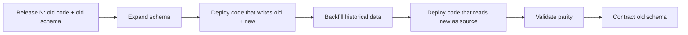
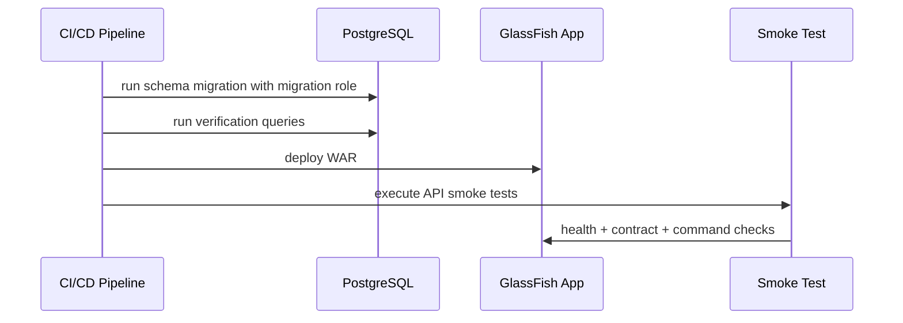
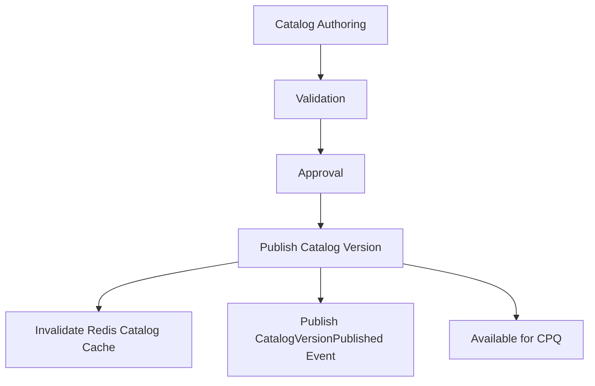
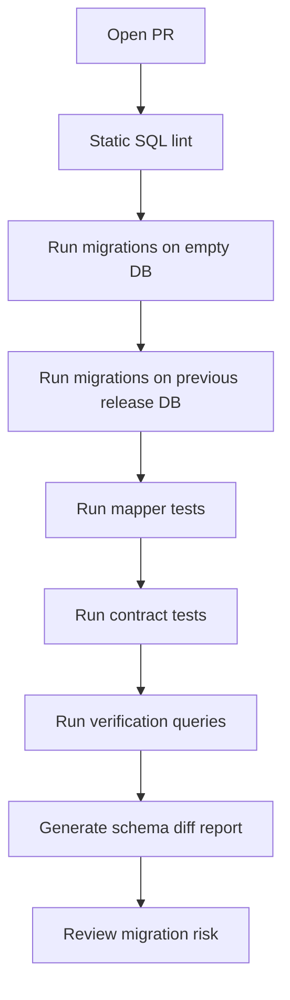

------
title: Build From Scratch: Enterprise Java Microservices CPQ & Order Management Platform - Part 029
description: Database migration strategy, reference data governance, seed data, tenant bootstrap, data repair, and release-safe PostgreSQL evolution for enterprise CPQ/OMS.
series: learn-enterprise-cpq-oms-glassfish-camunda8
seriesTitle: Build From Scratch: Enterprise Java Microservices CPQ & Order Management Platform
order: 29
partTitle: Database Migration, Seeding, and Reference Data
tags:
  - java
  - microservices
  - cpq
  - oms
  - postgresql
  - mybatis
  - migration
  - reference-data
  - seed-data
  - release-engineering
  - production
  - schema-evolution
date: 2026-07-02
---

# Part 029 — Database Migration, Seeding, and Reference Data

Di part sebelumnya kita membangun query model dan operational view. Sekarang kita menutup blok persistence dengan sesuatu yang sering dianggap pekerjaan kecil, padahal di enterprise system justru sangat menentukan apakah sistem bisa hidup lama:

> database migration, reference data, seed data, tenant bootstrap, data repair, dan release-safe schema evolution.

Dalam CPQ/OMS production, database bukan sekadar tempat tabel berada. Database adalah **rekaman legal, operasional, dan finansial** atas apa yang pernah dijual, dijanjikan, disetujui, dipenuhi, gagal, diperbaiki, dan ditagihkan.

Kalau migration salah, dampaknya tidak seperti bug tampilan. Migration yang salah bisa membuat quote lama tidak bisa dibuka, order lama tidak bisa direkonstruksi, approval evidence hilang, event replay berubah makna, atau catalog version yang pernah dipakai customer tidak lagi dapat dijelaskan.

Kita tidak akan membahas migration sebagai ritual `CREATE TABLE`. Kita akan membahasnya sebagai bagian dari **system evolution discipline**.

---

## 1. Mental Model: Migration Adalah Perubahan Kontrak Data

Setiap migration mengubah kontrak antara beberapa pihak:

```text
Java code
OpenAPI contract
JSON Schema
PostgreSQL schema
MyBatis mapper
Kafka event payload
Camunda workflow variable
Redis key structure
Operational query
Audit/reconciliation script
```

Karena itu, migration tidak boleh dilihat sebagai urusan DBA saja. Ia adalah perubahan pada **semantic backbone** sistem.

Contoh sederhana:

```sql
ALTER TABLE quote ADD COLUMN sales_channel text;
```

Kelihatannya kecil. Tapi pertanyaannya:

- Apakah `sales_channel` wajib untuk quote baru?
- Nilai default untuk quote lama apa?
- Apakah quote lama harus dianggap `UNKNOWN`, `LEGACY`, atau channel sebenarnya harus dihitung dari audit/event?
- Apakah API response akan langsung menampilkan field ini?
- Apakah JSON Schema harus menganggap field ini required?
- Apakah quote approval rule memakai channel?
- Apakah order hasil conversion harus mewarisi channel?
- Apakah Kafka event `QuoteAccepted` perlu field channel?
- Apakah dashboard filter butuh index?
- Apakah report lama berubah angka?

Top 1% engineer tidak hanya bertanya “migration SQL-nya apa?”. Ia bertanya:

> perubahan ini mengubah invariant apa, kontrak apa, data lama apa, dan failure mode apa?

---

## 2. Jenis Perubahan Data

Kita harus memisahkan beberapa jenis data yang sering dicampur.

| Jenis | Contoh | Siapa Owner | Apakah ikut migration? |
|---|---|---:|---:|
| Schema structure | table, column, index, constraint | engineering | ya |
| Technical reference data | status code, action type, reason code internal | engineering + operations | ya, dengan governance |
| Business reference data | sales channel, market segment, approval reason | business + operations | biasanya managed, bukan hardcoded |
| Catalog data | product offering, price, compatibility rule | product/catalog team | bukan schema migration biasa |
| Environment seed data | admin user dev, demo tenant, local test catalog | engineering | hanya non-prod atau fixture |
| Tenant bootstrap data | tenant config awal, numbering policy, default workflow binding | platform operations | controlled provisioning |
| Historical correction | memperbaiki data rusak order tertentu | operations + engineering approval | repair script/audited command |
| Projection rebuild | rebuild search table/dashboard | engineering/ops | job/reconciliation, bukan migration utama |

Kesalahan umum: memasukkan semua hal ke folder `db/migration` lalu merasa selesai.

Itu buruk karena migration harus reproducible, deterministic, dan aman untuk production. Sementara catalog/business data sering punya lifecycle, approval, effective date, dan ownership berbeda.

---

## 3. Prinsip Utama Migration Production-Grade

Untuk seri ini, kita pakai prinsip berikut.

### 3.1 Migration Harus Immutable

File migration yang sudah pernah masuk environment shared tidak boleh diedit.

Salah:

```text
V024__create_quote_tables.sql   # sudah jalan di staging
# lalu diedit lagi karena lupa column
```

Benar:

```text
V024__create_quote_tables.sql
V025__add_quote_sales_channel.sql
```

Alasannya sederhana: environment production, staging, QA, dan developer machine harus bisa membuktikan urutan perubahan yang sama.

Kalau file migration lama diedit, checksum berubah, audit trail rusak, dan environment bisa diverge.

### 3.2 Migration Harus Forward-Safe

Dalam sistem enterprise, rollback database sering tidak sesederhana rollback aplikasi. Data sudah masuk, event sudah keluar, workflow sudah bergerak.

Karena itu default strategi kita:

```text
expand -> migrate -> contract
```

Bukan:

```text
drop old column -> deploy code baru -> berharap semua aman
```

### 3.3 Aplikasi Harus Bisa Hidup Selama Masa Transisi

Untuk zero/low-downtime release, ada periode ketika:

- schema baru ada,
- code lama masih berjalan,
- code baru mulai berjalan,
- consumer event belum semuanya updated,
- projection belum rebuild,
- cache lama mungkin masih ada.

Maka migration harus compatible dengan minimal satu versi aplikasi sebelum dan sesudahnya.

### 3.4 Data Lama Harus Punya Makna

Jangan menambahkan field mandatory tanpa strategi data lama.

Salah:

```sql
ALTER TABLE quote ADD COLUMN quote_type text NOT NULL;
```

Jika tabel sudah berisi jutaan row, ini akan gagal atau memaksa default tanpa makna.

Lebih aman:

```sql
ALTER TABLE quote ADD COLUMN quote_type text;

UPDATE quote
SET quote_type = 'STANDARD'
WHERE quote_type IS NULL;

ALTER TABLE quote
ADD CONSTRAINT quote_type_not_null CHECK (quote_type IS NOT NULL) NOT VALID;

ALTER TABLE quote VALIDATE CONSTRAINT quote_type_not_null;
```

Lalu setelah aplikasi stabil, baru boleh diketatkan sesuai kebutuhan.

---

## 4. Expand-Migrate-Contract Pattern

Ini pola paling penting untuk evolusi database CPQ/OMS.



Contoh kasus: memisahkan `quote.total_amount` menjadi `quote.total_one_time_amount` dan `quote.total_recurring_amount`.

### Release 1 — Expand

```sql
ALTER TABLE quote
  ADD COLUMN total_one_time_amount numeric(19, 4),
  ADD COLUMN total_recurring_amount numeric(19, 4),
  ADD COLUMN total_currency_code char(3);
```

Aplikasi masih bisa membaca `total_amount` lama.

### Release 2 — Dual Write

Setiap pricing recalculation menulis:

```text
total_amount             # field lama
total_one_time_amount    # field baru
total_recurring_amount   # field baru
total_currency_code      # field baru
```

### Release 3 — Backfill

```sql
UPDATE quote q
SET
  total_one_time_amount = COALESCE((
    SELECT SUM(amount)
    FROM quote_price_item p
    WHERE p.quote_id = q.id
      AND p.charge_type = 'ONE_TIME'
  ), 0),
  total_recurring_amount = COALESCE((
    SELECT SUM(amount)
    FROM quote_price_item p
    WHERE p.quote_id = q.id
      AND p.charge_type = 'RECURRING'
  ), 0),
  total_currency_code = COALESCE(q.currency_code, 'USD')
WHERE total_one_time_amount IS NULL
   OR total_recurring_amount IS NULL;
```

### Release 4 — Read New Source

Read model memakai field baru.

### Release 5 — Contract

Setelah observability menunjukkan parity aman:

```sql
ALTER TABLE quote DROP COLUMN total_amount;
```

Di enterprise system, step 5 sering berjarak minggu atau bulan, bukan hari yang sama.

---

## 5. Struktur Folder Migration

Untuk project ini, kita pakai struktur eksplisit.

```text
cpq-oms-platform/
  database/
    postgresql/
      migration/
        V001__create_tenant_tables.sql
        V002__create_catalog_tables.sql
        V003__create_quote_tables.sql
        V004__create_order_tables.sql
        V005__create_asset_tables.sql
        V006__create_outbox_inbox.sql
        V007__create_audit_tables.sql
      repeatable/
        R__refresh_operational_views.sql
        R__create_read_model_functions.sql
      reference-data/
        technical/
          V001__insert_state_codes.sql
          V002__insert_action_type_codes.sql
        business/
          sales_channel.seed.sql
          approval_reason.seed.sql
      seed/
        local/
          local_tenant.sql
          sample_catalog.sql
        test/
          integration_test_catalog.sql
      repair/
        README.md
        2026-07-02-fix-quote-price-hash/
          script.sql
          verification.sql
          rollback_analysis.md
      verification/
        check_required_constraints.sql
        check_orphan_order_items.sql
        check_projection_drift.sql
```

Pemisahan ini penting.

- `migration/` adalah schema evolution wajib.
- `repeatable/` adalah object database yang bisa dibuat ulang seperti view/function.
- `reference-data/technical/` adalah data teknis yang berperilaku seperti kontrak aplikasi.
- `reference-data/business/` dikelola lebih hati-hati karena bisa berubah oleh business process.
- `seed/local/` tidak boleh masuk production.
- `repair/` bukan migration reguler; ia harus punya approval dan verification.
- `verification/` berisi query untuk membuktikan data masih sehat.

---

## 6. Tooling: Flyway, Liquibase, atau Custom Runner?

Di production, kita sebaiknya memakai migration tool yang punya fitur minimal:

- versioned migration,
- checksum,
- history table,
- repeatable migration,
- baseline,
- repair metadata,
- validation,
- ordering deterministic.

Dua pilihan populer di ekosistem Java adalah Flyway dan Liquibase.

Untuk seri ini, kita tidak akan mengikat seluruh arsitektur ke satu tool. Namun baseline praktis yang masuk akal:

```text
Flyway untuk schema migration SQL-first
custom controlled loader untuk business/reference/catalog data
```

Alasannya:

- PostgreSQL schema lebih transparan dengan SQL eksplisit.
- MyBatis juga SQL-centric, sehingga tim sudah membaca SQL secara natural.
- Business catalog tidak cocok diperlakukan seperti migration file teknis.
- Production support butuh query verification yang jelas.

Yang penting bukan nama tool-nya, tetapi prinsipnya:

> migration harus deterministic, audited, validated, dan tidak disembunyikan di balik magic startup code.

---

## 7. Jangan Jalankan Migration Otomatis dari Semua Instance Aplikasi

Kesalahan umum di microservices:

```text
setiap instance GlassFish startup -> run migration
```

Ini berbahaya.

Kenapa?

- Banyak instance bisa start bersamaan.
- Migration bisa butuh lock panjang.
- Startup aplikasi jadi tergantung DDL.
- Failure migration membuat deployment state ambigu.
- Privilege aplikasi jadi terlalu besar.
- Tidak ada gate eksplisit sebelum traffic masuk.

Lebih aman:



Aplikasi boleh punya startup check:

```text
expected_schema_version <= actual_schema_version
```

Tapi aplikasi tidak otomatis melakukan DDL di production.

---

## 8. Role dan Privilege Database

Pisahkan database role.

```text
migration_role:
  - CREATE TABLE
  - ALTER TABLE
  - CREATE INDEX
  - CREATE FUNCTION
  - INSERT technical reference data

application_role:
  - SELECT/INSERT/UPDATE on application tables
  - no DDL
  - no DROP

read_only_role:
  - SELECT on read projections/views

ops_repair_role:
  - limited update under audited session
```

Tujuannya bukan bureaucratic security. Tujuannya failure containment.

Jika aplikasi runtime di-compromise, ia tidak boleh bisa `DROP TABLE quote`.

Jika worker bug, ia tidak boleh mengubah schema.

Jika report query berjalan, ia tidak boleh memodifikasi order.

---

## 9. PostgreSQL DDL Lock Awareness

DDL bukan operasi netral. Banyak DDL mengambil lock yang bisa memblokir traffic.

Contoh berisiko:

```sql
ALTER TABLE order_item ADD COLUMN something text NOT NULL DEFAULT 'X';
CREATE INDEX idx_big_table_col ON huge_table(col);
ALTER TABLE quote ALTER COLUMN status TYPE varchar(50);
```

Strategi aman:

- tambah nullable column dulu,
- backfill batch kecil,
- tambah constraint `NOT VALID`,
- validate constraint terpisah,
- buat index besar dengan `CONCURRENTLY` bila cocok,
- hindari long transaction,
- ukur table size sebelum migration,
- uji migration di clone production-size.

Contoh index:

```sql
CREATE INDEX CONCURRENTLY IF NOT EXISTS idx_order_search_tenant_state_created
ON order_search_projection (tenant_id, order_state, created_at DESC);
```

Catatan penting: `CREATE INDEX CONCURRENTLY` tidak boleh dijalankan di dalam transaction block biasa. Migration tool harus dikonfigurasi per migration jika membutuhkan mode non-transactional.

---

## 10. Enum Database vs Lookup Table

CPQ/OMS penuh dengan status dan code:

```text
quote_state
order_state
order_item_state
approval_state
action_type
charge_type
fulfillment_task_type
fallout_reason
cancellation_reason
```

Pilihan buruk yang sering terjadi:

```sql
CREATE TYPE quote_state AS ENUM ('DRAFT', 'SUBMITTED', 'APPROVED');
```

PostgreSQL enum berguna untuk domain kecil yang sangat stabil. Tetapi banyak state enterprise berubah seiring proses bisnis. Kalau state butuh metadata, urutan, visibility, translation, ownership, active flag, atau audit, lookup table lebih fleksibel.

Contoh:

```sql
CREATE TABLE ref_quote_state (
  code text PRIMARY KEY,
  label text NOT NULL,
  terminal boolean NOT NULL,
  active boolean NOT NULL,
  sort_order integer NOT NULL,
  created_at timestamptz NOT NULL DEFAULT now()
);

INSERT INTO ref_quote_state(code, label, terminal, active, sort_order)
VALUES
  ('DRAFT', 'Draft', false, true, 10),
  ('CONFIGURED', 'Configured', false, true, 20),
  ('PRICED', 'Priced', false, true, 30),
  ('SUBMITTED', 'Submitted', false, true, 40),
  ('APPROVED', 'Approved', false, true, 50),
  ('ACCEPTED', 'Accepted', true, true, 60),
  ('EXPIRED', 'Expired', true, true, 70),
  ('CANCELLED', 'Cancelled', true, true, 80);
```

Application domain tetap punya enum Java untuk compile-time safety, tetapi database lookup memberi ruang governance.

---

## 11. Reference Data: Technical vs Business

### Technical Reference Data

Technical reference data berperilaku seperti kontrak sistem.

Contoh:

```text
ORDER_ACTION_TYPE: ADD, MODIFY, DISCONNECT, MOVE
CHARGE_TYPE: ONE_TIME, RECURRING, USAGE, PENALTY, CREDIT
IDEMPOTENCY_STATUS: PROCESSING, COMPLETED, FAILED
OUTBOX_STATUS: NEW, PUBLISHED, FAILED, DEAD
```

Perubahan technical reference data harus melalui release engineering.

### Business Reference Data

Business reference data bisa berubah karena keputusan bisnis.

Contoh:

```text
sales_channel
market_segment
approval_reason
cancellation_reason
partner_code
region
customer_segment
```

Ini tidak selalu cocok dimasukkan ke SQL migration hardcoded. Lebih tepat lewat:

- admin UI,
- controlled import,
- configuration management,
- tenant bootstrap process,
- effective-dated table.

Contoh table:

```sql
CREATE TABLE ref_sales_channel (
  tenant_id uuid NOT NULL,
  code text NOT NULL,
  label text NOT NULL,
  active boolean NOT NULL,
  effective_from timestamptz NOT NULL,
  effective_to timestamptz,
  version integer NOT NULL,
  created_at timestamptz NOT NULL DEFAULT now(),
  created_by text NOT NULL,
  PRIMARY KEY (tenant_id, code, version)
);
```

Kenapa pakai version/effective date?

Karena quote lama harus tetap dapat dijelaskan berdasarkan reference data saat quote dibuat, bukan berdasarkan label yang berubah bulan depan.

---

## 12. Catalog Data Bukan Seed Data Biasa

Product catalog adalah business data dengan lifecycle.

Jangan memperlakukan product offering seperti ini:

```sql
INSERT INTO product_offering VALUES (...);
```

lalu menyebutnya seed production.

Catalog production harus punya:

- lifecycle: draft, active, retired,
- effective date,
- version,
- approval,
- compatibility validation,
- price linkage,
- publication event,
- rollback strategy,
- audit trail,
- cache invalidation,
- quote snapshot impact.

Untuk local dev, boleh ada sample catalog:

```text
seed/local/sample_catalog.sql
```

Tetapi untuk production, catalog harus masuk melalui catalog management process atau controlled import pipeline.



---

## 13. Tenant Bootstrap

Multi-tenant CPQ/OMS membutuhkan tenant bootstrap yang reproducible.

Tenant baru biasanya butuh:

```text
tenant record
numbering policy
currency policy
default sales channels
approval policy binding
workflow process binding
catalog market binding
notification template binding
integration endpoint config
service credentials reference
feature flags
admin role assignment
```

Jangan mencampur tenant bootstrap dengan global schema migration.

Schema migration menjawab:

> struktur sistem berubah bagaimana?

Tenant bootstrap menjawab:

> tenant baru agar bisa beroperasi butuh data awal apa?

Contoh command bootstrap:

```json
{
  "tenantCode": "acme-id",
  "displayName": "ACME Indonesia",
  "defaultCurrency": "IDR",
  "numberingPolicy": {
    "quotePrefix": "Q-ACME-",
    "orderPrefix": "O-ACME-"
  },
  "workflowBindings": {
    "quoteApprovalProcessKey": "quote-approval-v1",
    "orderFulfillmentProcessKey": "order-fulfillment-v1"
  }
}
```

Bootstrap harus idempotent.

Jika command yang sama dikirim dua kali, hasilnya harus sama, bukan membuat tenant duplikat.

---

## 14. Numbering Policy

Enterprise CPQ/OMS hampir selalu butuh nomor bisnis:

```text
quote_number
order_number
asset_number
subscription_number
approval_number
```

Jangan gunakan UUID sebagai nomor user-facing.

UUID bagus untuk identity internal. Nomor bisnis punya kebutuhan lain:

- mudah dibaca manusia,
- bisa membawa prefix tenant/channel/year,
- bisa diaudit,
- bisa dicari customer support,
- bisa dicetak di dokumen,
- kadang harus mengikuti regulasi atau policy internal.

Contoh table:

```sql
CREATE TABLE numbering_sequence (
  tenant_id uuid NOT NULL,
  sequence_name text NOT NULL,
  prefix text NOT NULL,
  current_value bigint NOT NULL,
  padding integer NOT NULL,
  updated_at timestamptz NOT NULL DEFAULT now(),
  PRIMARY KEY (tenant_id, sequence_name)
);
```

Generator harus transactional.

```sql
UPDATE numbering_sequence
SET current_value = current_value + 1,
    updated_at = now()
WHERE tenant_id = #{tenantId}
  AND sequence_name = #{sequenceName}
RETURNING prefix, current_value, padding;
```

Jangan generate quote/order number di Redis kalau nomor bisnis tidak boleh hilang atau lompat tanpa jejak.

Lompatan nomor kadang masih dapat diterima. Tetapi kehilangan audit kenapa nomor lompat biasanya tidak dapat diterima.

---

## 15. Data Backfill

Backfill adalah migrasi data historis.

Backfill harus punya:

- scope jelas,
- batch size,
- resume capability,
- verification query,
- observability,
- dry-run jika memungkinkan,
- rollback analysis,
- impact terhadap locks,
- impact terhadap replication/lag,
- impact terhadap application read path.

Contoh backfill table:

```sql
CREATE TABLE data_backfill_job (
  job_name text PRIMARY KEY,
  status text NOT NULL,
  last_processed_id uuid,
  processed_count bigint NOT NULL DEFAULT 0,
  failed_count bigint NOT NULL DEFAULT 0,
  started_at timestamptz,
  completed_at timestamptz,
  updated_at timestamptz NOT NULL DEFAULT now()
);
```

Batch strategy:

```sql
WITH batch AS (
  SELECT id
  FROM quote
  WHERE price_hash IS NULL
  ORDER BY created_at, id
  LIMIT 1000
)
UPDATE quote q
SET price_hash = digest(q.price_snapshot::text, 'sha256')::text
FROM batch b
WHERE q.id = b.id;
```

Untuk data sangat besar, backfill sering lebih aman sebagai background job controlled, bukan satu migration transaction panjang.

---

## 16. Verification Query

Migration tanpa verification adalah asumsi.

Setiap migration penting harus punya query pembuktian.

Contoh: tidak boleh ada quote accepted tanpa price snapshot.

```sql
SELECT q.id, q.quote_number
FROM quote q
WHERE q.state = 'ACCEPTED'
  AND NOT EXISTS (
    SELECT 1
    FROM quote_price_item p
    WHERE p.quote_id = q.id
  );
```

Contoh: tidak boleh ada order item orphan.

```sql
SELECT oi.id
FROM order_item oi
LEFT JOIN customer_order o ON o.id = oi.order_id
WHERE o.id IS NULL;
```

Contoh: outbox event harus menunjuk aggregate yang ada.

```sql
SELECT o.id, o.aggregate_type, o.aggregate_id
FROM outbox_event o
WHERE o.aggregate_type = 'ORDER'
  AND NOT EXISTS (
    SELECT 1 FROM customer_order co WHERE co.id = o.aggregate_id
  );
```

Verification query harus disimpan, bukan hanya dijalankan ad hoc.

---

## 17. Data Repair Bukan Migration Biasa

Data repair harus diperlakukan sebagai controlled operational action.

Struktur minimal:

```text
repair/2026-07-02-fix-order-item-state/
  README.md
  root-cause.md
  impacted-records.sql
  precheck.sql
  repair.sql
  postcheck.sql
  rollback-analysis.md
  approval.md
```

Repair harus menjawab:

- data apa yang rusak,
- kenapa rusak,
- record mana yang terdampak,
- apa efek repair,
- apakah event perlu dipublish ulang,
- apakah audit harus ditambahkan,
- apakah workflow instance perlu dikoreksi,
- apakah projection harus rebuild,
- apakah customer-facing state berubah.

Jangan melakukan:

```sql
UPDATE customer_order SET state = 'COMPLETED' WHERE id = '...';
```

tanpa audit, event, dan workflow reconciliation.

Untuk sistem ini, preferensi kita:

```text
repair command > direct SQL update
```

Tetapi direct SQL tetap kadang diperlukan untuk incident berat. Ketika itu terjadi, ia harus sangat terkontrol.

---

## 18. Migration dan Kafka Event

Schema DB dan event contract sering berubah bersamaan.

Contoh: order event menambah field `salesChannel`.

Release aman:

1. Tambah column `sales_channel` nullable di DB.
2. Aplikasi mulai mengisi field untuk order baru.
3. Event schema menambah optional field `salesChannel`.
4. Consumer diupdate agar toleran terhadap missing field.
5. Backfill order lama jika perlu.
6. Setelah semua consumer compatible, field bisa menjadi required di versi event baru.

Jangan membuat event consumer gagal karena field baru dianggap wajib sementara historical replay masih membawa payload lama.

Event replay harus dipikirkan dari awal.

```text
Historical event lama + consumer baru = harus tetap bisa diproses atau ditolak secara eksplisit dengan migration path.
```

---

## 19. Migration dan Camunda Workflow Variable

Camunda/Zeebe process instance bisa berjalan lama. Order fulfillment bisa berlangsung jam, hari, bahkan minggu.

Jika workflow variable berubah, jangan assume semua instance langsung memakai format baru.

Contoh variable lama:

```json
{
  "orderId": "...",
  "customerId": "..."
}
```

Variable baru:

```json
{
  "orderRef": {
    "orderId": "...",
    "tenantId": "..."
  },
  "customerRef": {
    "customerId": "..."
  }
}
```

Worker baru harus bisa membaca dua bentuk selama masa transisi.

```java
OrderRef resolveOrderRef(Map<String, Object> variables) {
    Object orderRef = variables.get("orderRef");
    if (orderRef != null) {
        return parseNewOrderRef(orderRef);
    }

    Object legacyOrderId = variables.get("orderId");
    Object tenantId = variables.get("tenantId");
    return new OrderRef((String) tenantId, (String) legacyOrderId);
}
```

Jangan memaksa semua running process instance ikut schema terbaru tanpa migration plan.

---

## 20. Migration dan Redis Cache

Redis cache harus diperlakukan sebagai derived state.

Kalau schema/model berubah, cache key harus versioned.

Contoh:

```text
catalog:v1:{tenantId}:{catalogVersion}:offering:{offeringId}
catalog:v2:{tenantId}:{catalogVersion}:offering:{offeringId}
```

Jangan mengubah struktur value tanpa mengubah key version.

Jika tidak, aplikasi baru membaca JSON lama dan crash.

Strategi aman:

- key versioning,
- TTL,
- event-based invalidation,
- warmup optional,
- tolerate cache miss,
- never rely on Redis as migration source of truth.

---

## 21. JSONB Migration Policy

Kita memakai JSONB untuk snapshot dan payload tertentu:

```text
quote_item.configuration_snapshot
quote_price_item.explanation
outbox_event.payload
external_call_attempt.request_payload
workflow_variable_snapshot
```

JSONB fleksibel, tetapi fleksibilitas tanpa governance akan menjadi kuburan schema.

Policy:

1. Setiap JSONB payload penting harus punya `schemaVersion`.
2. Read path harus bisa handle versi yang masih didukung.
3. Migration JSONB besar harus batch.
4. Jangan update JSONB historical snapshot kalau snapshot itu bukti legal masa lalu, kecuali migration hanya menambahkan metadata non-semantic.
5. Untuk query sering, extract ke column/projection.

Contoh JSONB snapshot:

```json
{
  "schemaVersion": "configuration-snapshot.v1",
  "catalogVersion": "cat-2026-07-01",
  "offeringId": "internet-fiber-1gbps",
  "selections": [
    {
      "path": "router",
      "value": "wifi6-router"
    }
  ],
  "valid": true
}
```

Jika nanti format berubah, jangan overwrite seluruh snapshot lama kecuali benar-benar diperlukan dan audited.

---

## 22. MyBatis dan Migration Compatibility

MyBatis mapper harus mengikuti strategy expand-migrate-contract.

Contoh mapper saat field baru optional:

```xml
<resultMap id="QuoteRowMap" type="com.acme.cpq.persistence.quote.QuoteRow">
  <id property="id" column="id" />
  <result property="tenantId" column="tenant_id" />
  <result property="quoteNumber" column="quote_number" />
  <result property="state" column="state" />
  <result property="totalAmount" column="total_amount" />
  <result property="totalOneTimeAmount" column="total_one_time_amount" />
  <result property="totalRecurringAmount" column="total_recurring_amount" />
</resultMap>
```

Domain mapper bisa melakukan fallback sementara:

```java
MoneySummary toMoneySummary(QuoteRow row) {
    if (row.totalOneTimeAmount() != null || row.totalRecurringAmount() != null) {
        return MoneySummary.split(
            row.totalOneTimeAmount(),
            row.totalRecurringAmount(),
            row.currencyCode()
        );
    }

    return MoneySummary.legacyTotal(row.totalAmount(), row.currencyCode());
}
```

Setelah contract phase selesai, fallback dihapus.

Jangan menghapus fallback pada release yang sama dengan migration jika masih ada old data, old process instance, atau event replay lama.

---

## 23. CI/CD Quality Gates untuk Migration

Pipeline minimal:



Yang harus diuji:

- migrasi dari nol,
- migrasi dari versi production saat ini,
- rollback aplikasi tanpa rollback DB,
- mapper compatibility,
- API golden payload,
- event golden payload,
- workflow variable compatibility,
- query performance untuk index baru,
- repair/verification query.

---

## 24. Migration Risk Classification

Tidak semua migration punya risiko sama.

| Level | Contoh | Gate |
|---|---|---|
| Low | tambah nullable column kecil | automated test cukup |
| Medium | tambah index besar, backfill kecil | staging data-size test |
| High | ubah state model, backfill besar | rollout plan + verification + approval |
| Critical | split table utama, rewrite historical snapshot | migration rehearsal + rollback analysis + business signoff |

Untuk CPQ/OMS, migration critical biasanya menyentuh:

- quote lifecycle,
- order lifecycle,
- pricing snapshot,
- approval evidence,
- asset/subscription model,
- fulfillment task state,
- outbox/inbox,
- audit log.

---

## 25. Contoh Full Migration: Menambah Approval Reason

Requirement:

> Business ingin approval request menyimpan reason category agar dashboard bisa mengelompokkan approval berdasarkan price override, non-standard term, high discount, dan manual exception.

### Step 1 — Add Reference Table

```sql
CREATE TABLE ref_approval_reason (
  tenant_id uuid NOT NULL,
  code text NOT NULL,
  label text NOT NULL,
  active boolean NOT NULL,
  sort_order integer NOT NULL,
  created_at timestamptz NOT NULL DEFAULT now(),
  PRIMARY KEY (tenant_id, code)
);
```

### Step 2 — Seed Business Reference for Existing Tenant

Ini bukan global technical migration jika tiap tenant bisa berbeda. Gunakan controlled tenant reference loader.

```sql
INSERT INTO ref_approval_reason(tenant_id, code, label, active, sort_order)
VALUES
  (:tenant_id, 'PRICE_OVERRIDE', 'Price Override', true, 10),
  (:tenant_id, 'HIGH_DISCOUNT', 'High Discount', true, 20),
  (:tenant_id, 'NON_STANDARD_TERM', 'Non Standard Term', true, 30),
  (:tenant_id, 'MANUAL_EXCEPTION', 'Manual Exception', true, 40)
ON CONFLICT (tenant_id, code) DO NOTHING;
```

### Step 3 — Add Nullable Column

```sql
ALTER TABLE quote_approval_request
ADD COLUMN reason_code text;
```

### Step 4 — Start Writing New Data

Application sets `reason_code` for new approval request.

### Step 5 — Backfill Old Data

```sql
UPDATE quote_approval_request
SET reason_code = CASE
  WHEN approval_policy_code LIKE '%PRICE_OVERRIDE%' THEN 'PRICE_OVERRIDE'
  WHEN approval_policy_code LIKE '%DISCOUNT%' THEN 'HIGH_DISCOUNT'
  ELSE 'MANUAL_EXCEPTION'
END
WHERE reason_code IS NULL;
```

### Step 6 — Add Constraint

```sql
ALTER TABLE quote_approval_request
ADD CONSTRAINT quote_approval_request_reason_not_null
CHECK (reason_code IS NOT NULL) NOT VALID;

ALTER TABLE quote_approval_request
VALIDATE CONSTRAINT quote_approval_request_reason_not_null;
```

### Step 7 — Add Index for Dashboard

```sql
CREATE INDEX CONCURRENTLY idx_approval_tenant_reason_state
ON quote_approval_request (tenant_id, reason_code, state, created_at DESC);
```

### Step 8 — Verify

```sql
SELECT count(*)
FROM quote_approval_request
WHERE reason_code IS NULL;
```

Expected:

```text
0
```

---

## 26. Local Development Seed

Local seed harus mempercepat developer, bukan menjadi sumber kebenaran production.

Local seed boleh membuat:

- tenant demo,
- user dummy,
- catalog kecil,
- quote draft,
- order sample,
- fake external endpoint,
- workflow binding local.

Contoh local seed structure:

```text
seed/local/
  001_demo_tenant.sql
  002_demo_reference_data.sql
  003_demo_catalog.sql
  004_demo_quote.sql
```

Local seed harus jelas di README:

```text
Never run seed/local against production or shared staging.
```

Lebih baik lagi pipeline menolak file local seed jika target bukan local.

---

## 27. Test Fixture Data

Integration test tidak boleh bergantung pada production-like random seed yang berubah-ubah.

Test fixture harus:

- deterministic,
- minimal,
- named clearly,
- resettable,
- isolated per test suite,
- compatible dengan schema terbaru.

Contoh fixture naming:

```text
TENANT_TEST_STANDARD
CATALOG_SIMPLE_INTERNET_V1
QUOTE_DRAFT_ONE_ITEM
ORDER_IN_PROGRESS_WITH_TWO_TASKS
ASSET_ACTIVE_FIBER_SUBSCRIPTION
```

Fixture bukan demo data. Fixture adalah alat pembuktian behavior.

---

## 28. Production Checklist

Sebelum migration production:

- Apakah migration sudah diuji di database dengan ukuran realistis?
- Apakah ada DDL lock risk?
- Apakah migration transaction terlalu panjang?
- Apakah ada backfill batch/resume?
- Apakah code lama masih compatible?
- Apakah code baru compatible dengan old data?
- Apakah event schema compatible?
- Apakah workflow variable compatible?
- Apakah Redis cache key perlu versioning?
- Apakah MyBatis mapper sudah updated?
- Apakah API contract berubah?
- Apakah dashboard query butuh index?
- Apakah verification query tersedia?
- Apakah rollback aplikasi aman?
- Apakah data repair plan tersedia kalau migration parsial?
- Apakah monitoring migration tersedia?

---

## 29. Failure Modes

| Failure | Penyebab | Pencegahan |
|---|---|---|
| Deployment stuck karena DDL lock | migration mengunci tabel besar | rehearsal, lock timeout, concurrent index, batch backfill |
| App baru crash baca data lama | mapper tidak handle nullable/new schema | compatibility mapper, golden data lama |
| Consumer Kafka gagal replay | event field baru required | optional first, schema versioning |
| Workflow lama gagal | worker hanya support variable baru | dual variable reader |
| Quote lama tidak bisa dibuka | snapshot dimutasi tanpa backward reader | schemaVersion, compatibility parser |
| Report angka berubah | backfill mengubah semantic data lama | business signoff, audit, verification |
| Tenant bootstrap duplikat | command tidak idempotent | unique constraint, idempotency key |
| Local seed masuk prod | environment guard tidak ada | target validation, privilege separation |
| Repair menutup jejak | direct SQL tanpa audit | repair command, audit insert, approval |

---

## 30. Build Milestone

Setelah part ini, target implementasi persistence evolution:

1. Buat folder `database/postgresql/migration`.
2. Buat migration awal untuk tenant, catalog, quote, order, asset, outbox, inbox, audit.
3. Buat history table via migration tool.
4. Buat reference data technical.
5. Buat local seed terpisah.
6. Buat tenant bootstrap command idempotent.
7. Buat verification query untuk orphan/invariant penting.
8. Tambahkan CI step: migrate empty DB + migrate previous DB.
9. Tambahkan mapper integration test terhadap schema hasil migration.
10. Tambahkan policy: tidak ada migration production dari app startup.

---

## 31. Kesimpulan

Database migration production-grade bukan soal menulis SQL cepat. Ia adalah disiplin evolusi sistem.

Untuk CPQ/OMS, migration harus menjaga:

- historical quote explainability,
- order lifecycle integrity,
- pricing snapshot immutability,
- approval audit evidence,
- fulfillment traceability,
- asset/subscription continuity,
- event replay compatibility,
- workflow instance compatibility,
- operational query reliability.

Aturan praktisnya:

> Jangan pernah membuat perubahan database yang hanya benar untuk data baru, tetapi merusak makna data lama.

Di part berikutnya, kita keluar dari persistence foundation dan mulai membangun engine CPQ pertama: **Product Configuration Engine from Scratch**.
