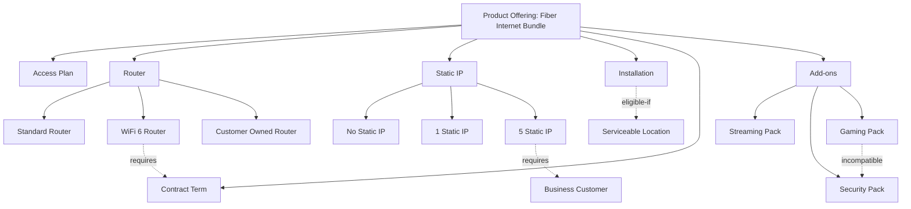
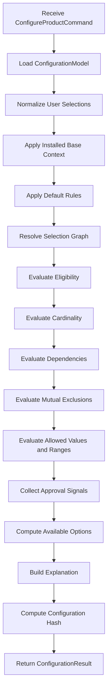
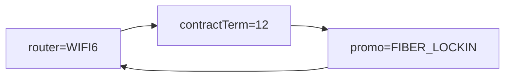
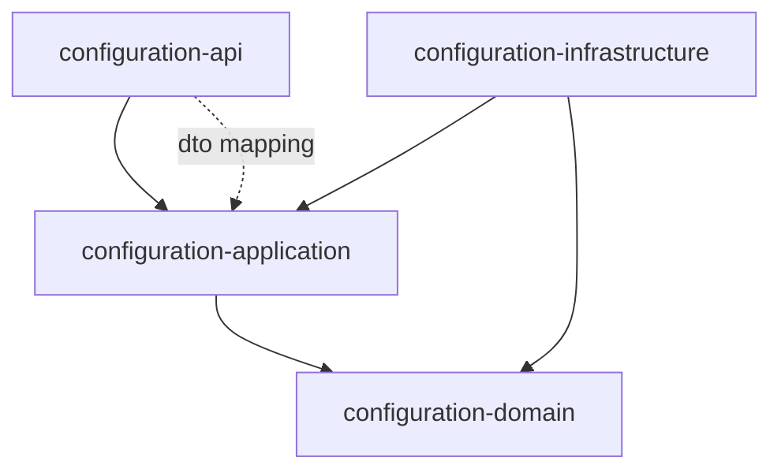
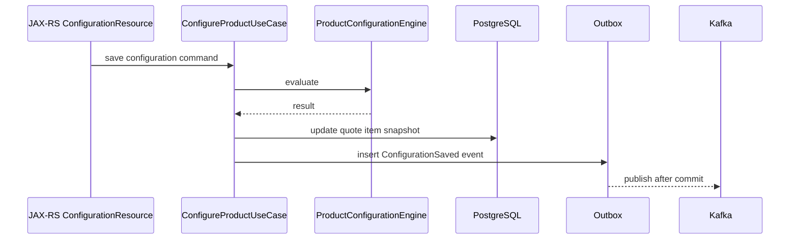
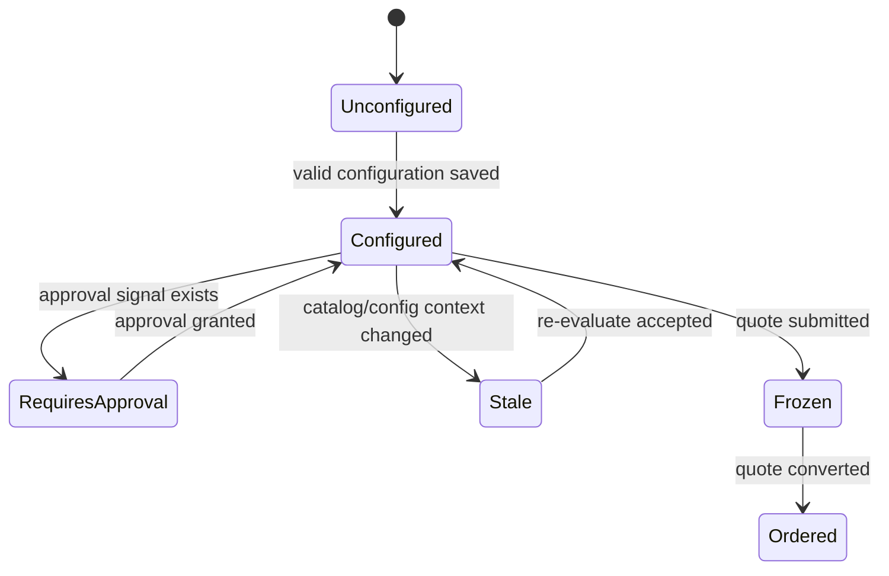

------
title: Build From Scratch: Enterprise Java Microservices CPQ & Order Management Platform - Part 030
description: Building a deterministic, explainable, production-oriented product configuration engine from scratch for enterprise CPQ using catalog graph, rules, validation, snapshots, and Java service boundaries.
series: learn-enterprise-cpq-oms-glassfish-camunda8
seriesTitle: Build From Scratch: Enterprise Java Microservices CPQ & Order Management Platform
order: 30
partTitle: Product Configuration Engine From Scratch
tags:
  - java
  - microservices
  - cpq
  - oms
  - product-configuration
  - configuration-engine
  - rules
  - catalog
  - postgresql
  - mybatis
  - redis
  - kafka
  - schema-first
date: 2026-07-02
---

# Part 030 — Product Configuration Engine From Scratch

Sekarang kita mulai masuk ke blok CPQ engine implementation.

Kita sudah punya fondasi:

- product catalog domain model,
- commercial vs technical catalog,
- quote model,
- pricing model,
- invariant dan state machine,
- API/schema-first strategy,
- Java/JAX-RS runtime,
- PostgreSQL/MyBatis persistence,
- migration discipline.

Sekarang kita membangun engine pertama yang membuat CPQ benar-benar menjadi CPQ:

> Product Configuration Engine.

Tujuannya bukan membuat rule engine generik yang terlalu abstrak. Tujuannya membangun engine konfigurasi produk yang deterministic, explainable, testable, versioned, dan cukup kuat untuk enterprise CPQ.

---

## 1. Apa Masalah yang Diselesaikan Configuration Engine?

Configuration engine menjawab pertanyaan:

> “Dengan product offering ini, customer context ini, installed base ini, dan pilihan user ini, konfigurasi produk apa yang valid, apa yang invalid, apa yang masih kurang, dan kenapa?”

Contoh produk:

```text
Fiber Internet 1Gbps Bundle
  - Access Plan: 1Gbps
  - Router: Standard WiFi Router / WiFi 6 Router / Customer Owned Router
  - Static IP: None / 1 IP / 5 IP
  - Installation: Standard / Express
  - Contract Term: 12 months / 24 months
  - Add-on: Streaming Pack / Security Pack / Gaming Pack
```

Rule:

```text
WiFi 6 Router requires Contract Term >= 12 months.
Express Installation not available in remote area.
5 Static IP requires business customer.
Gaming Pack incompatible with Security Pack in legacy region.
Customer Owned Router requires waiver approval.
```

Tanpa engine, logic akan bocor ke mana-mana:

```text
JAX-RS resource
QuoteService
PricingService
UI frontend
SQL query
Camunda worker
Integration adapter
```

Itu cepat di awal, tetapi menghancurkan sistem ketika rule bertambah.

Engine harus menjadi satu tempat yang menjawab:

```text
valid / invalid / incomplete / requires approval / not eligible
```

beserta alasan yang bisa dijelaskan.

---

## 2. Engine Ini Bukan Apa?

Kita perlu membatasi scope.

Engine ini bukan:

- full SAT solver,
- generic business rule management system,
- AI recommendation engine,
- pricing engine,
- order decomposition engine,
- approval engine,
- UI wizard engine,
- catalog authoring tool.

Ia adalah domain engine untuk:

```text
product option selection
characteristic value validation
compatibility check
dependency check
eligibility check
defaulting
cardinality enforcement
configuration explanation
configuration snapshot generation
```

Rule pricing tetap di pricing engine. Rule fulfillment tetap di decomposition/OMS. Rule approval tetap di approval engine.

Boundary ini penting agar configuration engine tidak menjadi “god engine”.

---

## 3. Input dan Output Engine

### Input

```java
public record ConfigureProductCommand(
    TenantId tenantId,
    ProductOfferingId offeringId,
    CatalogVersion catalogVersion,
    CustomerContext customerContext,
    InstalledBaseContext installedBaseContext,
    List<ConfigurationSelection> selections,
    ConfigurationMode mode,
    RequestContext requestContext
) {}
```

Input utama:

| Input | Fungsi |
|---|---|
| `tenantId` | isolasi catalog/reference data |
| `offeringId` | produk yang sedang dikonfigurasi |
| `catalogVersion` | versi catalog agar deterministic |
| `customerContext` | segment, location, account type, risk class |
| `installedBaseContext` | asset/subscription existing untuk modify/disconnect/add-on |
| `selections` | pilihan eksplisit user/system |
| `mode` | draft, validate, submit, reprice, conversion |
| `requestContext` | actor, channel, correlation, authorization evidence |

### Output

```java
public record ConfigurationResult(
    ConfigurationStatus status,
    ProductOfferingId offeringId,
    CatalogVersion catalogVersion,
    List<ResolvedSelection> selections,
    List<AvailableOption> availableOptions,
    List<ConfigurationIssue> issues,
    List<ConfigurationApprovalSignal> approvalSignals,
    ConfigurationExplanation explanation,
    ConfigurationHash configurationHash
) {}
```

Status minimal:

```text
VALID
INCOMPLETE
INVALID
REQUIRES_APPROVAL
NOT_ELIGIBLE
CATALOG_VERSION_NOT_FOUND
```

Output engine bukan hanya boolean.

Boolean `true/false` tidak cukup untuk CPQ enterprise. Sales, approval, support, audit, dan integration membutuhkan alasan.

---

## 4. Model Konseptual

Product configuration adalah graph problem.



Node adalah item/characteristic/option. Edge adalah relationship/rule.

Engine tugasnya membaca graph ini, lalu mengevaluasi selection terhadap constraint.

---

## 5. Data Structure Internal

Jangan langsung mengevaluasi dari row database mentah. Buat model internal yang jelas.

```java
public final class ConfigurationModel {
    private final ProductOfferingId offeringId;
    private final CatalogVersion catalogVersion;
    private final Map<NodeId, ConfigNode> nodes;
    private final List<ConfigConstraint> constraints;
    private final List<DefaultRule> defaultRules;
    private final List<EligibilityRule> eligibilityRules;
}
```

Node:

```java
public sealed interface ConfigNode permits ProductNode, OptionGroupNode, OptionNode, CharacteristicNode {
    NodeId id();
    String code();
    String label();
    NodeLifecycle lifecycle();
}
```

Option group:

```java
public record OptionGroupNode(
    NodeId id,
    String code,
    String label,
    Cardinality cardinality,
    List<NodeId> optionIds
) implements ConfigNode {}
```

Cardinality:

```java
public record Cardinality(int min, int max) {
    public boolean allows(int selectedCount) {
        return selectedCount >= min && selectedCount <= max;
    }
}
```

Selection:

```java
public record ConfigurationSelection(
    ConfigurationPath path,
    String value,
    SelectionSource source
) {}
```

Selection source:

```text
USER
DEFAULT_RULE
SYSTEM
INSTALLED_BASE
MIGRATION
```

Kenapa selection source penting?

Karena conflict dari pilihan user berbeda dengan conflict dari default rule. Pilihan user biasanya butuh error/explanation. Default rule bisa dicabut otomatis jika tidak compatible.

---

## 6. Constraint Taxonomy

Kita gunakan taxonomy yang cukup kaya tetapi masih manageable.

| Constraint | Makna | Contoh |
|---|---|---|
| Required | pilihan wajib ada | Router wajib dipilih |
| Cardinality | jumlah pilihan min/max | Add-on max 3 |
| Mutually Exclusive | dua pilihan tidak boleh bersamaan | Gaming Pack vs Security Pack |
| Dependency | pilihan A butuh B | WiFi 6 Router butuh 12 months term |
| Compatibility | pilihan cocok/tidak cocok dengan context/produk lain | Static IP 5 hanya business customer |
| Eligibility | product/option boleh dijual ke customer tertentu | Express install hanya serviceable area |
| Allowed Value | value characteristic harus valid | bandwidth in allowed set |
| Range | numeric value dalam range | quantity 1..10 |
| Lifecycle | option masih active/effective | retired router tidak boleh untuk quote baru |
| Action-Based | rule berbeda untuk ADD/MODIFY/DISCONNECT | disconnect tidak butuh installation |
| Approval Signal | valid tetapi butuh approval | Customer owned router butuh waiver approval |

Perhatikan: `Approval Signal` bukan invalid. Ia valid secara konfigurasi tetapi membutuhkan proses approval.

---

## 7. Evaluation Pipeline

Engine harus deterministic. Jangan evaluasi rule dalam urutan acak.

Pipeline:



Urutan ini bukan satu-satunya benar, tetapi harus eksplisit dan diuji.

---

## 8. Normalisasi Selection

User/API bisa mengirim selection yang tidak rapi.

Contoh:

```json
{
  "selections": [
    { "path": "Router", "value": "wifi6 router" },
    { "path": "contractTerm", "value": "12" }
  ]
}
```

Engine harus normalize menjadi canonical code:

```json
{
  "selections": [
    { "path": "router", "value": "WIFI6_ROUTER" },
    { "path": "contract_term", "value": "TERM_12_MONTHS" }
  ]
}
```

Tetapi hati-hati: normalisasi tidak boleh menebak terlalu agresif. Jika ambiguous, return issue.

```java
public final class SelectionNormalizer {
    public NormalizedSelectionSet normalize(
        ConfigurationModel model,
        List<ConfigurationSelection> rawSelections
    ) {
        // 1. canonicalize path
        // 2. canonicalize value
        // 3. detect duplicate path
        // 4. detect unknown path/value
        // 5. preserve source
        throw new UnsupportedOperationException("implementation later");
    }
}
```

Issue contoh:

```json
{
  "code": "UNKNOWN_CONFIGURATION_VALUE",
  "severity": "ERROR",
  "path": "router",
  "message": "Value 'wifi7-router' is not available for option group 'router'."
}
```

---

## 9. Defaulting Rule

Defaulting rule mengisi pilihan yang belum diisi.

Contoh:

```text
If customer segment = RESIDENTIAL and router not selected,
default router = STANDARD_ROUTER.
```

Model:

```java
public record DefaultRule(
    RuleId id,
    int priority,
    PredicateExpression condition,
    ConfigurationPath targetPath,
    String defaultValue,
    boolean overridable
) {}
```

Default rule harus:

- deterministic,
- priority-based,
- explainable,
- tidak override user selection kecuali eksplisit,
- diuji conflict-nya.

Jika dua default rule mengisi path sama:

```text
Rule A -> router = STANDARD_ROUTER
Rule B -> router = WIFI6_ROUTER
```

Engine tidak boleh diam-diam memilih random. Harus ada priority atau issue:

```text
DEFAULT_RULE_CONFLICT
```

---

## 10. Eligibility Rule

Eligibility rule menjawab:

> apakah product/option boleh ditawarkan untuk customer/context ini?

Contoh:

```text
Express Installation eligible only if location.serviceable = true and region != REMOTE.
5 Static IP eligible only for BUSINESS customer.
```

Context object:

```java
public record CustomerContext(
    CustomerId customerId,
    CustomerSegment segment,
    AccountType accountType,
    LocationContext location,
    RiskClass riskClass,
    Map<String, String> attributes
) {}
```

Rule model sederhana:

```java
public record EligibilityRule(
    RuleId id,
    NodeId targetNodeId,
    PredicateExpression condition,
    String failureCode,
    String failureMessage
) {}
```

Pada fase awal, predicate expression bisa kita buat terbatas:

```text
EQ(field, value)
NE(field, value)
IN(field, values)
NOT_IN(field, values)
GTE(field, number)
LTE(field, number)
AND(...)
OR(...)
NOT(...)
```

Jangan langsung membuat expression language terlalu bebas. Kebebasan berlebihan membuat rule sulit diaudit.

---

## 11. Dependency Constraint

Dependency constraint:

```text
Jika A dipilih, B harus ada.
```

Contoh:

```text
WIFI6_ROUTER requires CONTRACT_TERM in {TERM_12_MONTHS, TERM_24_MONTHS}
```

Model:

```java
public record DependencyConstraint(
    RuleId id,
    ConfigurationPath whenPath,
    String whenValue,
    ConfigurationPath requiredPath,
    Set<String> allowedRequiredValues,
    Severity severity
) implements ConfigConstraint {}
```

Evaluation:

```java
if (selectionSet.has(whenPath, whenValue)) {
    if (!selectionSet.hasAny(requiredPath, allowedRequiredValues)) {
        issues.add(ConfigurationIssue.error(
            "MISSING_REQUIRED_DEPENDENCY",
            requiredPath,
            "WIFI6_ROUTER requires contract term 12 or 24 months."
        ));
    }
}
```

Dependency bisa menghasilkan:

- error,
- warning,
- automatic suggestion,
- approval signal.

Untuk awal, buat error dulu. Suggestion bisa menyusul.

---

## 12. Mutually Exclusive Constraint

Constraint:

```text
A dan B tidak boleh dipilih bersamaan.
```

Model:

```java
public record MutuallyExclusiveConstraint(
    RuleId id,
    ConfigurationPath leftPath,
    String leftValue,
    ConfigurationPath rightPath,
    String rightValue,
    Severity severity
) implements ConfigConstraint {}
```

Evaluation:

```java
if (selectionSet.has(leftPath, leftValue) && selectionSet.has(rightPath, rightValue)) {
    issues.add(ConfigurationIssue.error(
        "MUTUALLY_EXCLUSIVE_SELECTION",
        leftPath,
        "Gaming Pack cannot be combined with Security Pack."
    ));
}
```

Kalau keduanya berasal dari default rule, engine bisa memilih rule priority. Kalau salah satu dari user, jangan hapus diam-diam. Laporkan.

---

## 13. Cardinality Constraint

Option group biasanya punya min/max.

Contoh:

```text
Router: min 1, max 1
Add-ons: min 0, max 3
Static IP: min 1, max 1
```

Evaluation:

```java
int selected = selectionSet.countSelected(group.path());
if (!group.cardinality().allows(selected)) {
    issues.add(ConfigurationIssue.error(
        "CARDINALITY_VIOLATION",
        group.path(),
        "Option group 'router' requires exactly 1 selection."
    ));
}
```

Cardinality issue penting untuk UI wizard karena bisa memberi tahu step mana yang incomplete.

---

## 14. Allowed Value dan Range

Characteristic bisa berupa enumerated value atau numeric range.

Contoh:

```text
contract_term_months in {12, 24, 36}
number_of_static_ip between 0 and 5
bandwidth_mbps in {100, 500, 1000}
```

Model:

```java
public sealed interface ValueDomain permits EnumValueDomain, NumericRangeDomain, TextPatternDomain {}

public record EnumValueDomain(Set<String> allowedValues) implements ValueDomain {}
public record NumericRangeDomain(BigDecimal min, BigDecimal max, BigDecimal step) implements ValueDomain {}
public record TextPatternDomain(String regex) implements ValueDomain {}
```

Jangan biarkan value menjadi free-form string tanpa domain kecuali benar-benar perlu.

---

## 15. Approval Signal

Beberapa konfigurasi valid tetapi butuh approval.

Contoh:

```text
Customer Owned Router requires technical waiver approval.
Contract term 36 months for residential customer requires sales manager approval.
```

Model:

```java
public record ConfigurationApprovalSignal(
    String code,
    ApprovalPolicyCode policyCode,
    ConfigurationPath path,
    String selectedValue,
    String reason
) {}
```

Evaluation:

```java
if (selectionSet.has("router", "CUSTOMER_OWNED_ROUTER")) {
    approvalSignals.add(new ConfigurationApprovalSignal(
        "CUSTOMER_OWNED_ROUTER_WAIVER",
        new ApprovalPolicyCode("TECHNICAL_WAIVER"),
        ConfigurationPath.of("router"),
        "CUSTOMER_OWNED_ROUTER",
        "Customer owned router requires technical waiver approval."
    ));
}
```

Status result:

```text
VALID + approvalSignals not empty => REQUIRES_APPROVAL
```

Jangan mencampur approval signal dengan invalid configuration.

---

## 16. Fixpoint Evaluation

Beberapa rule saling mempengaruhi.

Contoh:

```text
Default router depends on customer segment.
Default contract term depends on router.
Eligibility of installation depends on location.
Available add-on depends on access plan and region.
```

Kita bisa memakai iterative pass sampai stabil.

```java
public ConfigurationResult configure(ConfigureProductCommand command) {
    ConfigurationModel model = modelLoader.load(
        command.tenantId(),
        command.offeringId(),
        command.catalogVersion()
    );

    EvaluationState state = EvaluationState.from(command);

    for (int i = 0; i < MAX_PASSES; i++) {
        EvaluationState before = state.snapshot();

        state = normalizer.apply(model, state);
        state = installedBaseResolver.apply(model, state);
        state = defaultRuleEvaluator.apply(model, state);
        state = eligibilityEvaluator.apply(model, state);
        state = constraintEvaluator.apply(model, state);
        state = approvalSignalEvaluator.apply(model, state);

        if (state.semanticallyEquals(before)) {
            break;
        }

        if (i == MAX_PASSES - 1) {
            state.addIssue(ConfigurationIssue.error(
                "CONFIGURATION_EVALUATION_DID_NOT_CONVERGE",
                null,
                "Configuration evaluation did not converge. Check cyclic rules."
            ));
        }
    }

    return resultAssembler.assemble(model, state);
}
```

`MAX_PASSES` harus kecil dan diamati. Jika butuh banyak pass, rule model kemungkinan buruk.

---

## 17. Cycle Detection

Rule cycle berbahaya.

Contoh:

```text
A requires B
B excludes A
```

atau:

```text
Default A if B
Default B if A not selected
```

Catalog publish process harus mendeteksi cycle sebelum catalog aktif.

Graph dependency:



Cycle tidak selalu salah, tetapi harus diketahui. Untuk engine awal, lebih aman menolak cycle pada dependency/default graph kecuali rule type memang dirancang untuk itu.

Pseudo detection:

```java
public final class RuleGraphValidator {
    public List<CatalogIssue> validate(ConfigurationModel model) {
        DirectedGraph<RuleNode> graph = buildRuleGraph(model);
        return graph.findCycles().stream()
            .map(cycle -> CatalogIssue.error(
                "CONFIGURATION_RULE_CYCLE",
                cycle.describe()
            ))
            .toList();
    }
}
```

---

## 18. Available Options

UI butuh tahu option mana yang tersedia, tidak tersedia, dan alasannya.

Output:

```json
{
  "path": "static_ip",
  "options": [
    {
      "value": "NO_STATIC_IP",
      "available": true
    },
    {
      "value": "ONE_STATIC_IP",
      "available": true
    },
    {
      "value": "FIVE_STATIC_IP",
      "available": false,
      "reasonCode": "BUSINESS_CUSTOMER_REQUIRED",
      "reason": "5 Static IP is only available for business customers."
    }
  ]
}
```

Ini lebih baik daripada hanya menyembunyikan option.

Kenapa?

- Sales bisa menjelaskan ke customer.
- Support bisa debug kenapa option tidak muncul.
- Audit bisa membuktikan product tidak eligible.
- UI bisa memberi suggestion.

---

## 19. Explanation Model

Configuration engine production harus explainable.

Minimal explanation:

```java
public record ConfigurationExplanation(
    List<ExplanationEntry> entries
) {}

public record ExplanationEntry(
    String ruleId,
    String ruleType,
    ConfigurationPath path,
    String selectedValue,
    ExplanationOutcome outcome,
    String message
) {}
```

Contoh:

```json
{
  "ruleId": "RULE_STATIC_IP_BUSINESS_ONLY",
  "ruleType": "ELIGIBILITY",
  "path": "static_ip",
  "selectedValue": "FIVE_STATIC_IP",
  "outcome": "FAILED",
  "message": "5 Static IP requires customer segment BUSINESS. Current segment is RESIDENTIAL."
}
```

Explanation tidak harus selalu dikirim penuh ke UI. Bisa disimpan di snapshot atau audit trail, lalu exposure-nya diatur.

---

## 20. Configuration Hash

Kita butuh hash untuk mendeteksi perubahan konfigurasi.

Hash harus dihitung dari canonical representation:

```json
{
  "catalogVersion": "cat-2026-07-01",
  "offeringId": "fiber-1gbps-bundle",
  "selections": [
    { "path": "access_plan", "value": "FIBER_1GBPS" },
    { "path": "router", "value": "WIFI6_ROUTER" },
    { "path": "contract_term", "value": "TERM_12_MONTHS" }
  ]
}
```

Canonical rules:

- sort by path,
- normalize values,
- exclude volatile fields,
- include catalog version,
- include relevant installed base version for modify orders,
- include rule set version if separated from catalog version.

Hash berguna untuk:

- stale quote detection,
- reprice trigger,
- duplicate configuration detection,
- quote snapshot integrity,
- audit comparison,
- cache key.

---

## 21. Configuration Snapshot

Saat quote item dikonfigurasi, simpan snapshot.

```json
{
  "schemaVersion": "configuration-snapshot.v1",
  "catalogVersion": "cat-2026-07-01",
  "offeringId": "fiber-1gbps-bundle",
  "status": "REQUIRES_APPROVAL",
  "configurationHash": "sha256:...",
  "selections": [
    {
      "path": "router",
      "value": "CUSTOMER_OWNED_ROUTER",
      "source": "USER"
    }
  ],
  "issues": [],
  "approvalSignals": [
    {
      "code": "CUSTOMER_OWNED_ROUTER_WAIVER",
      "policyCode": "TECHNICAL_WAIVER"
    }
  ]
}
```

Snapshot bukan hanya cache. Ia adalah bukti konfigurasi saat quote dibuat.

Jangan merekonstruksi quote lama dari catalog terbaru.

---

## 22. PostgreSQL Tables

Model persistence minimal:

```sql
CREATE TABLE product_configuration_session (
  id uuid PRIMARY KEY,
  tenant_id uuid NOT NULL,
  customer_id uuid,
  offering_id uuid NOT NULL,
  catalog_version text NOT NULL,
  status text NOT NULL,
  configuration_hash text,
  selections jsonb NOT NULL,
  issues jsonb NOT NULL,
  approval_signals jsonb NOT NULL,
  explanation jsonb,
  created_at timestamptz NOT NULL DEFAULT now(),
  updated_at timestamptz NOT NULL DEFAULT now(),
  created_by text NOT NULL,
  row_version bigint NOT NULL DEFAULT 0
);

CREATE INDEX idx_configuration_session_tenant_customer
ON product_configuration_session (tenant_id, customer_id, updated_at DESC);
```

Untuk quote item snapshot:

```sql
CREATE TABLE quote_item_configuration_snapshot (
  quote_item_id uuid PRIMARY KEY,
  tenant_id uuid NOT NULL,
  catalog_version text NOT NULL,
  offering_id uuid NOT NULL,
  configuration_hash text NOT NULL,
  snapshot jsonb NOT NULL,
  created_at timestamptz NOT NULL DEFAULT now()
);
```

Session bisa berubah. Snapshot quote harus immutable setelah quote submit/approval boundary.

---

## 23. MyBatis Mapper Direction

Mapper untuk session:

```java
public interface ProductConfigurationSessionMapper {
    ProductConfigurationSessionRow findById(
        @Param("tenantId") UUID tenantId,
        @Param("id") UUID id
    );

    int insert(ProductConfigurationSessionRow row);

    int updateResult(
        @Param("tenantId") UUID tenantId,
        @Param("id") UUID id,
        @Param("status") String status,
        @Param("configurationHash") String configurationHash,
        @Param("selections") String selectionsJson,
        @Param("issues") String issuesJson,
        @Param("approvalSignals") String approvalSignalsJson,
        @Param("explanation") String explanationJson,
        @Param("expectedRowVersion") long expectedRowVersion
    );
}
```

XML update dengan optimistic lock:

```xml
<update id="updateResult">
  UPDATE product_configuration_session
  SET status = #{status},
      configuration_hash = #{configurationHash},
      selections = #{selections}::jsonb,
      issues = #{issues}::jsonb,
      approval_signals = #{approvalSignals}::jsonb,
      explanation = #{explanation}::jsonb,
      updated_at = now(),
      row_version = row_version + 1
  WHERE tenant_id = #{tenantId}
    AND id = #{id}
    AND row_version = #{expectedRowVersion}
</update>
```

Jika update count `0`, return optimistic lock conflict.

---

## 24. API Shape

Endpoint utama:

```http
POST /api/v1/configurations/evaluate
```

Request:

```json
{
  "offeringId": "fiber-1gbps-bundle",
  "catalogVersion": "cat-2026-07-01",
  "customerContext": {
    "customerId": "cust-123",
    "segment": "RESIDENTIAL",
    "location": {
      "region": "JAKARTA",
      "serviceable": true
    }
  },
  "selections": [
    { "path": "router", "value": "WIFI6_ROUTER" },
    { "path": "contract_term", "value": "TERM_12_MONTHS" }
  ]
}
```

Response:

```json
{
  "status": "VALID",
  "catalogVersion": "cat-2026-07-01",
  "offeringId": "fiber-1gbps-bundle",
  "configurationHash": "sha256:abc123",
  "selections": [
    { "path": "router", "value": "WIFI6_ROUTER", "source": "USER" },
    { "path": "contract_term", "value": "TERM_12_MONTHS", "source": "USER" }
  ],
  "issues": [],
  "approvalSignals": [],
  "links": {
    "price": "/api/v1/prices/evaluate"
  }
}
```

Jangan expose internal rule engine classes sebagai API contract.

---

## 25. Service Boundary

Structure:

```text
configuration-domain/
  ConfigurationModel
  ConfigNode
  ConfigConstraint
  EvaluationState
  ConfigurationResult

configuration-application/
  ConfigureProductUseCase
  ConfigurationModelLoader
  ConfigurationResultAssembler

configuration-infrastructure/
  PostgreSqlConfigurationSessionRepository
  CatalogConfigurationModelRepository
  RedisConfigurationModelCache

configuration-api/
  ConfigurationResource
  ConfigurationRequestDto
  ConfigurationResponseDto
```

Dependency direction:



Domain tidak bergantung pada JAX-RS, MyBatis, Redis, Kafka, atau PostgreSQL.

---

## 26. Engine Class Skeleton

```java
public final class ProductConfigurationEngine {
    private final SelectionNormalizer normalizer;
    private final InstalledBaseSelectionResolver installedBaseResolver;
    private final DefaultRuleEvaluator defaultRuleEvaluator;
    private final EligibilityEvaluator eligibilityEvaluator;
    private final ConstraintEvaluator constraintEvaluator;
    private final ApprovalSignalEvaluator approvalSignalEvaluator;
    private final AvailableOptionCalculator availableOptionCalculator;
    private final ConfigurationExplanationBuilder explanationBuilder;
    private final ConfigurationHashCalculator hashCalculator;

    public ConfigurationResult evaluate(
        ConfigurationModel model,
        ConfigureProductCommand command
    ) {
        EvaluationState state = EvaluationState.initial(command);

        state = normalizer.evaluate(model, state);
        state = installedBaseResolver.evaluate(model, state);
        state = defaultRuleEvaluator.evaluate(model, state);
        state = eligibilityEvaluator.evaluate(model, state);
        state = constraintEvaluator.evaluate(model, state);
        state = approvalSignalEvaluator.evaluate(model, state);

        List<AvailableOption> availableOptions =
            availableOptionCalculator.calculate(model, state);

        ConfigurationExplanation explanation =
            explanationBuilder.build(model, state);

        ConfigurationHash hash =
            hashCalculator.calculate(model, state.resolvedSelections());

        return ConfigurationResultAssembler.assemble(
            model,
            state,
            availableOptions,
            explanation,
            hash
        );
    }
}
```

Kita sengaja membuat evaluator kecil. Ini lebih mudah diuji daripada satu method besar `validateConfiguration`.

---

## 27. Catalog Model Loader

Engine butuh model catalog yang sudah siap dievaluasi.

```java
public interface ConfigurationModelRepository {
    ConfigurationModel load(
        TenantId tenantId,
        ProductOfferingId offeringId,
        CatalogVersion catalogVersion
    );
}
```

Implementation bisa:

1. cek Redis cache,
2. jika miss, load dari PostgreSQL via MyBatis,
3. assemble model,
4. validate model,
5. cache dengan key versioned.

```text
config-model:v1:{tenantId}:{catalogVersion}:{offeringId}
```

Cache value harus immutable. Jika catalog publish baru, key baru. Jangan overwrite model lama.

---

## 28. Redis Cache Boundary

Redis digunakan untuk mempercepat read catalog model, bukan sebagai source of truth.

Allowed:

```text
cache compiled configuration model
cache allowed option result for anonymous context if safe
cache reference data by version
```

Not allowed:

```text
store final quote configuration only in Redis
store approval decision only in Redis
store installed base truth in Redis
mutate catalog model in Redis
```

TTL policy:

```text
catalog config model: long TTL + versioned key
session result: short TTL optional
customer-context-sensitive result: careful; often not cacheable globally
```

---

## 29. Kafka Events

Configuration engine may publish events when configuration session changes or quote item snapshot is created.

Possible events:

```text
ConfigurationEvaluated
ConfigurationBecameInvalid
ConfigurationRequiresApproval
QuoteItemConfigurationSnapshotCreated
```

But do not publish event for every UI keystroke.

Rule:

```text
Publish durable event only when state matters to the business or another service.
```

For quick interactive evaluation, synchronous response is enough.

When quote item configuration is saved:



---

## 30. Interaction dengan Pricing Engine

Pricing engine tidak boleh mengevaluasi compatibility rule ulang secara liar.

Flow:

```text
configuration result VALID/REQUIRES_APPROVAL
  -> pricing engine resolves charges for resolved selections
  -> pricing result references configurationHash
```

Pricing input:

```java
public record PriceEvaluationCommand(
    TenantId tenantId,
    ProductOfferingId offeringId,
    CatalogVersion catalogVersion,
    ConfigurationHash configurationHash,
    List<ResolvedSelection> selections,
    CustomerContext customerContext
) {}
```

Jika configuration invalid, pricing harus ditolak atau diberi mode simulation khusus.

Jangan membuat pricing memberi harga untuk kombinasi produk yang invalid seolah-olah bisa dijual.

---

## 31. Interaction dengan Quote Lifecycle

Quote item menyimpan configuration snapshot.

Lifecycle:



Setelah quote submitted, configuration tidak boleh berubah tanpa quote revision.

Jika user mengubah configuration setelah submit:

```text
create quote revision
copy previous quote item
apply new configuration
reprice
rerun approval if needed
```

---

## 32. Interaction dengan Order Decomposition

Order decomposition memakai resolved configuration snapshot.

Contoh:

```text
router = WIFI6_ROUTER
installation = EXPRESS
static_ip = ONE_STATIC_IP
```

Decomposition menghasilkan fulfillment task:

```text
Reserve Fiber Access
Ship WiFi 6 Router
Schedule Express Installation
Allocate Static IP
Activate Service
```

Jika configuration snapshot tidak lengkap, OMS tidak boleh decompose.

Order creation guard:

```text
Quote item configuration status must be VALID or APPROVED_REQUIRES_APPROVAL_RESOLVED.
```

---

## 33. Installed Base Context

Untuk modify/disconnect/add-on, konfigurasi tidak dimulai dari kosong.

Contoh customer sudah punya:

```text
Fiber Internet 500Mbps
Standard Router
No Static IP
12 months contract
```

User ingin upgrade ke 1Gbps dan add static IP.

Engine harus menggabungkan:

```text
existing asset selections
requested modifications
catalog rules for target offering/action
```

Selection source:

```text
INSTALLED_BASE
USER
SYSTEM
```

Rule bisa action-based:

```text
For MODIFY bandwidth upgrade, router can remain unchanged if compatible.
For DISCONNECT, installation option is not required.
For ADD static IP, business customer rule applies.
```

---

## 34. Failure Modes

| Failure | Penyebab | Pencegahan |
|---|---|---|
| Validity berbeda antar request | rule order tidak deterministic | fixed evaluation pipeline, sorted rules |
| Quote lama berubah hasil config | membaca catalog latest | snapshot + catalog version |
| UI tidak tahu kenapa option hilang | engine hanya return boolean | available option reason + explanation |
| Pricing untuk config invalid | boundary lemah | pricing requires valid configuration result |
| Rule conflict tidak ketahuan | catalog publish tanpa validation | rule graph validation |
| Engine lambat | load catalog graph terus dari DB | compiled model cache by version |
| Approval tercampur invalid | approval signal dianggap error | separate approval signal model |
| Modify order salah | installed base context tidak dimodelkan | selection source + action-based rules |
| Race update session | no optimistic lock | row_version guard |
| Cache membaca model lama | unversioned key | versioned Redis key |

---

## 35. Testing Strategy

Testing harus berbasis behavior, bukan sekadar method coverage.

### Unit Test Evaluator

```text
RequiredRuleEvaluatorTest
CardinalityEvaluatorTest
MutuallyExclusiveEvaluatorTest
DependencyEvaluatorTest
EligibilityEvaluatorTest
DefaultRuleEvaluatorTest
ApprovalSignalEvaluatorTest
```

### Golden Scenario Test

```text
residential_customer_selects_wifi6_router_with_12_month_term_is_valid
residential_customer_selects_5_static_ip_is_not_eligible
business_customer_selects_5_static_ip_is_valid
customer_owned_router_requires_approval
security_pack_and_gaming_pack_is_invalid
missing_router_is_incomplete
```

### Snapshot Test

Pastikan canonical output stabil:

```text
same input -> same configurationHash
selection order changed -> same configurationHash
catalog version changed -> different configurationHash
```

### Catalog Validation Test

```text
cycle detection
unknown target path
rule references retired option
default conflict
cardinality impossible
eligibility expression invalid
```

### Integration Test

```text
load catalog from PostgreSQL via MyBatis
cache model in Redis
save configuration session
save quote item snapshot
publish outbox event
```

---

## 36. Performance Model

Configuration engine harus cepat untuk interactive CPQ.

Hot path:

```text
load compiled model
normalize selections
evaluate rules
compute available options
return result
```

Optimisasi awal:

- compile catalog model once per catalog version,
- index constraints by path/value,
- avoid scanning all rules if target path irrelevant,
- use immutable model,
- precompute option group mapping,
- cache reference data,
- keep explanation configurable by detail level,
- avoid DB calls during evaluation.

Rule:

> evaluation should be CPU/local memory after model and context are loaded.

Jangan memanggil database untuk setiap constraint.

---

## 37. Minimal Implementation Plan

Implementasi bertahap:

### Milestone 1 — Pure Domain Engine

- build `ConfigurationModel`,
- build `SelectionSet`,
- build cardinality evaluator,
- build dependency evaluator,
- build mutually exclusive evaluator,
- build result assembler,
- run unit tests.

### Milestone 2 — Catalog Loader

- map catalog tables to internal model,
- validate catalog graph,
- add Redis cache,
- add model hash.

### Milestone 3 — API

- implement `POST /api/v1/configurations/evaluate`,
- validate request schema,
- map domain result to response,
- add problem detail errors.

### Milestone 4 — Quote Integration

- save configuration snapshot to quote item,
- compute configuration hash,
- mark quote item configured/incomplete/invalid,
- trigger repricing.

### Milestone 5 — Approval and Installed Base

- add approval signals,
- add installed base context,
- add action-based rules.

---

## 38. Example End-to-End Scenario

Input:

```json
{
  "offeringId": "fiber-1gbps-bundle",
  "catalogVersion": "cat-2026-07-01",
  "customerContext": {
    "segment": "RESIDENTIAL",
    "location": {
      "region": "JAKARTA",
      "serviceable": true
    }
  },
  "selections": [
    { "path": "router", "value": "WIFI6_ROUTER" },
    { "path": "static_ip", "value": "FIVE_STATIC_IP" },
    { "path": "contract_term", "value": "TERM_12_MONTHS" }
  ]
}
```

Rules:

```text
WIFI6_ROUTER requires TERM_12_MONTHS or TERM_24_MONTHS.
FIVE_STATIC_IP requires segment BUSINESS.
Router exactly one required.
```

Output:

```json
{
  "status": "INVALID",
  "issues": [
    {
      "code": "NOT_ELIGIBLE",
      "path": "static_ip",
      "selectedValue": "FIVE_STATIC_IP",
      "message": "5 Static IP is only available for business customers."
    }
  ],
  "approvalSignals": [],
  "configurationHash": "sha256:..."
}
```

Jika customer segment berubah menjadi `BUSINESS`, result menjadi `VALID`.

---

## 39. Anti-Patterns

### Anti-Pattern 1 — Rule di UI

UI boleh membantu, tetapi source of truth tetap backend engine.

### Anti-Pattern 2 — Rule di Pricing Engine

Pricing boleh memakai selection, tetapi tidak boleh menjadi validator compatibility utama.

### Anti-Pattern 3 — Latest Catalog untuk Quote Lama

Quote lama harus membuka snapshot lama, bukan catalog terbaru.

### Anti-Pattern 4 — Boolean Validation

`valid: false` tanpa reason tidak cukup untuk enterprise CPQ.

### Anti-Pattern 5 — Free-Form Rule Language Terlalu Dini

Expression language yang terlalu bebas membuat rule sulit diuji, sulit dijelaskan, dan sulit dioptimalkan.

### Anti-Pattern 6 — Tidak Ada Configuration Hash

Tanpa hash, sulit mendeteksi stale config, repricing need, atau duplicate state.

---

## 40. Kesimpulan

Product Configuration Engine adalah pusat correctness CPQ.

Engine yang baik harus:

- deterministic,
- explainable,
- versioned,
- snapshot-friendly,
- testable,
- independent dari UI,
- independent dari pricing,
- aware terhadap installed base,
- able to produce approval signals,
- safe untuk quote/order lifecycle.

Mental model utamanya:

> configuration adalah graph + constraint + context + snapshot, bukan sekadar form field.

Di part berikutnya kita akan membangun engine kedua: **Pricing Engine From Scratch**. Pricing engine akan memakai resolved configuration dari part ini, lalu menghasilkan price breakdown, discount stacking, override signal, approval signal, dan price snapshot yang defensible.
