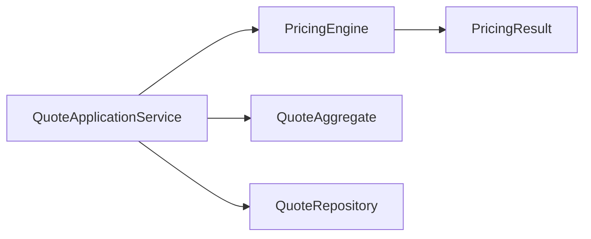
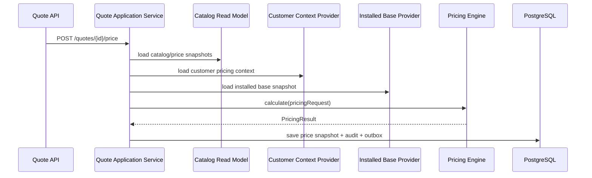
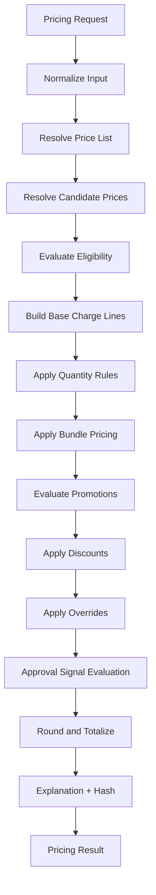
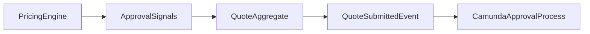
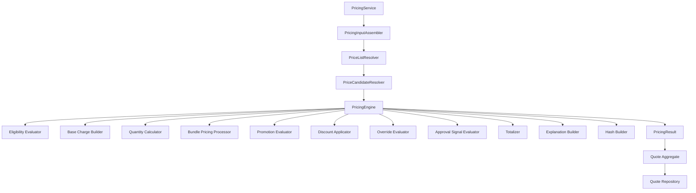

------
title: Build From Scratch: Enterprise Java Microservices CPQ & Order Management Platform - Part 031
description: Building an explainable, deterministic, production-grade pricing engine from scratch for enterprise CPQ with charge resolution, discounts, promotions, overrides, approval signals, snapshots, PostgreSQL persistence, MyBatis mappers, Redis cache, Kafka events, and Java service boundaries.
series: learn-enterprise-cpq-oms-glassfish-camunda8
seriesTitle: Build From Scratch: Enterprise Java Microservices CPQ & Order Management Platform
order: 31
partTitle: Pricing Engine From Scratch
tags:
  - java
  - microservices
  - cpq
  - pricing-engine
  - pricing
  - quote
  - postgresql
  - mybatis
  - redis
  - kafka
  - schema-first
  - openapi
  - enterprise-architecture
date: 2026-07-02
---

# Part 031 — Pricing Engine From Scratch

Sekarang kita membangun engine kedua dari CPQ: **pricing engine**.

Di part sebelumnya kita membangun configuration engine. Configuration engine menjawab:

> “Konfigurasi produk ini valid atau tidak, apa yang kurang, apa yang konflik, dan kenapa?”

Pricing engine menjawab:

> “Dengan konfigurasi yang valid, customer context, channel, price list, contract term, effective date, promotion, discount, override, dan installed base tertentu, harga yang harus ditawarkan berapa, terdiri dari charge apa saja, approval apa yang diperlukan, dan kenapa hasilnya begitu?”

Perhatikan kata **kenapa**.

Pricing engine enterprise tidak boleh hanya mengembalikan angka. Kalau engine hanya mengembalikan total, sistem akan gagal ketika:

- sales bertanya mengapa harga berubah,
- approver bertanya discount mana yang menyebabkan margin turun,
- billing bertanya charge mana yang recurring,
- auditor bertanya siapa yang override harga,
- customer service bertanya kenapa quote A berbeda dari quote B,
- finance bertanya mengapa rounding menghasilkan angka berbeda,
- partner channel bertanya kenapa promotion tidak berlaku,
- order management butuh membawa snapshot harga ke fulfillment/billing boundary.

Jadi target kita bukan:

```text
calculatePrice() -> 1230000
```

Target kita:

```text
calculatePrice(inputSnapshot) -> PricingResult
  - price lines
  - charge breakdown
  - recurring totals
  - one-time totals
  - discount breakdown
  - promotion evaluation
  - override evidence
  - approval signals
  - rounding evidence
  - deterministic hash
  - explanation trace
```

---

## 1. Pricing Engine Bukan Sekadar Formula

Banyak engineer mendesain pricing seperti ini:

```java
total = basePrice - discount + tax;
```

Ini terlalu kecil untuk CPQ enterprise.

Dalam CPQ/OMS besar, pricing adalah kombinasi dari beberapa konsep:

| Konsep | Pertanyaan yang dijawab |
|---|---|
| Price list | Daftar harga mana yang berlaku? |
| Product offering price | Harga dasar produk atau add-on apa? |
| Charge type | Harga ini one-time, recurring, usage, penalty, atau credit? |
| Effective date | Harga ini berlaku pada tanggal transaksi atau tanggal aktivasi? |
| Customer segment | Customer ini eligible untuk harga tertentu atau tidak? |
| Channel | Harga web, partner, enterprise sales, dan call center bisa berbeda. |
| Region | Harga bisa berbeda berdasarkan market, country, area, atau tax zone. |
| Contract term | 12 bulan dan 24 bulan bisa punya harga berbeda. |
| Quantity | Beberapa harga berubah berdasarkan jumlah. |
| Bundle rule | Harga bundle bisa bukan penjumlahan item mentah. |
| Promotion | Promotion punya eligibility, periode, kuota, channel, dan stacking rule. |
| Discount | Discount bisa manual, contract-based, campaign-based, approval-based. |
| Override | Sales bisa mengubah harga dengan limit dan approval policy. |
| Rounding | Rounding harus konsisten dan dapat dijelaskan. |
| Approval signal | Harga tertentu sah dihitung, tapi belum sah dikirim tanpa approval. |
| Snapshot | Quote harus menyimpan hasil pricing pada saat itu, bukan menghitung ulang diam-diam. |

Kalau semua ini dicampur ke satu method, kita tidak punya pricing engine. Kita punya spaghetti calculator.

---

## 2. Invariant Pricing Engine

Sebelum menulis code, kita tetapkan invariant.

### 2.1 Deterministic

Input snapshot yang sama harus menghasilkan output yang sama.

```text
same catalog version
same price list version
same product configuration
same customer context
same channel
same effective date
same promotion set
same override request
same rounding policy
=> same pricing result
```

Kalau tidak deterministic, quote tidak bisa diaudit.

### 2.2 Explainable

Setiap angka harus punya alasan.

```text
Recurring total = 1,200,000 IDR
because:
  base internet plan = 1,000,000
  WiFi 6 router add-on = 150,000
  static IP add-on = 100,000
  bundle discount = -50,000
```

Kalau ada discount yang ditolak:

```text
Promotion GAMING-2026 rejected
reason: incompatible_with_existing_discount
conflictsWith: CONTRACT-LOYALTY-15
```

### 2.3 Snapshot-stable

Quote tidak boleh berubah hanya karena catalog atau price list berubah setelah quote dibuat.

Quote harus menyimpan:

- catalog version,
- price list version,
- product configuration snapshot,
- price lines,
- total,
- approval signal,
- pricing hash,
- pricing explanation.

### 2.4 No hidden mutation

Pricing engine tidak boleh diam-diam mengubah quote, order, catalog, atau customer.

Engine menerima input, menghasilkan output.

Mutation dilakukan oleh application service.



### 2.5 Monetary exactness

Money bukan `double`.

Gunakan:

- `BigDecimal` di Java,
- `numeric` di PostgreSQL,
- explicit currency,
- explicit scale policy,
- explicit rounding mode.

Floating point cocok untuk scientific approximation, bukan monetary commitment.

---

## 3. Core Pricing Concepts

### 3.1 Price

Price adalah definisi komersial.

Contoh:

```text
Fiber Internet 1Gbps monthly price = 1,000,000 IDR / month
WiFi 6 Router monthly rental = 150,000 IDR / month
Express Installation fee = 300,000 IDR one-time
```

Price belum tentu menjadi charge final. Price masih bisa terkena:

- eligibility,
- quantity,
- discount,
- promotion,
- override,
- rounding,
- approval.

### 3.2 Charge

Charge adalah sesuatu yang akan ditagihkan, dikreditkan, atau dikomunikasikan ke downstream billing.

Charge punya tipe:

| Charge type | Contoh |
|---|---|
| `ONE_TIME` | installation fee, activation fee, device purchase |
| `RECURRING` | monthly subscription, router rental |
| `USAGE` | per GB, per API call, per SMS |
| `PENALTY` | early termination fee |
| `CREDIT` | goodwill credit, migration credit |

### 3.3 Adjustment

Adjustment adalah perubahan terhadap charge.

Contoh:

```text
base recurring charge: 1,000,000
contract discount 10%: -100,000
manual override: -50,000
final recurring charge: 850,000
```

Adjustment bukan sekadar angka negatif. Adjustment harus menyimpan:

- reason,
- source,
- rule ID,
- approval requirement,
- calculation basis,
- applied order,
- replaced/stacked/exclusive behavior.

### 3.4 Promotion

Promotion adalah commercial campaign yang punya constraint.

Contoh:

```text
Promo: FIRST_3_MONTHS_50_PERCENT
Eligible if:
  - new customer
  - contract term >= 12 months
  - channel = ONLINE
  - product offering = FIBER_1G
Not stackable with:
  - loyalty discount
  - enterprise negotiated price
```

Promotion harus dievaluasi, bukan langsung diterapkan.

### 3.5 Override

Override adalah perubahan harga manual.

Override adalah area audit-sensitive.

Override harus menyimpan:

- requested value,
- requested by,
- allowed limit,
- approval status,
- reason code,
- before/after value,
- policy evaluation.

---

## 4. Input Contract Pricing Engine

Pricing engine harus menerima input yang cukup lengkap, tapi tidak boleh bergantung ke resource database secara acak dari dalam engine.

Gunakan input snapshot.

```java
public record PricingRequest(
    String tenantId,
    String quoteId,
    String quoteRevision,
    String customerId,
    CustomerPricingContext customerContext,
    String channel,
    String market,
    LocalDate pricingDate,
    LocalDate requestedStartDate,
    List<PricingItemRequest> items,
    List<ManualPriceOverrideRequest> overrides,
    PricingPolicy policy
) {}
```

Item request:

```java
public record PricingItemRequest(
    String quoteItemId,
    String productOfferingId,
    String productOfferingVersion,
    String action,
    int quantity,
    ProductConfigurationSnapshot configuration,
    InstalledBaseSnapshot installedBaseSnapshot
) {}
```

Customer context:

```java
public record CustomerPricingContext(
    String customerType,
    String segment,
    String riskClass,
    String contractAccountId,
    List<String> activeAgreementIds,
    List<String> eligibilityFlags
) {}
```

Policy:

```java
public record PricingPolicy(
    String currency,
    int moneyScale,
    RoundingMode roundingMode,
    DiscountStackingMode discountStackingMode,
    boolean requireExplanation,
    boolean allowManualOverride,
    boolean dryRun
) {}
```

### Kenapa input harus kaya?

Karena pricing harus repeatable.

Kalau pricing engine diam-diam melakukan query ke customer service, catalog service, promotion service, atau installed-base service setiap kali calculate, maka hasil pricing bisa berubah walaupun quote tidak berubah.

Untuk production CPQ, query eksternal dilakukan sebelum engine dipanggil. Engine menerima snapshot.



---

## 5. Output Contract Pricing Engine

Pricing result tidak boleh hanya total.

```java
public record PricingResult(
    String pricingRunId,
    String pricingHash,
    String currency,
    List<PriceLine> priceLines,
    List<QuoteTotal> totals,
    List<PromotionEvaluation> promotionEvaluations,
    List<ApprovalSignal> approvalSignals,
    List<PricingWarning> warnings,
    PricingExplanation explanation
) {}
```

Price line:

```java
public record PriceLine(
    String priceLineId,
    String quoteItemId,
    String productOfferingId,
    String chargeType,
    String chargeCode,
    String chargeName,
    Money baseAmount,
    int quantity,
    Money grossAmount,
    List<PriceAdjustment> adjustments,
    Money netAmount,
    String billingFrequency,
    LocalDate effectiveFrom,
    LocalDate effectiveTo,
    String sourcePriceId,
    String sourcePriceVersion
) {}
```

Adjustment:

```java
public record PriceAdjustment(
    String adjustmentType,
    String adjustmentCode,
    String sourceRuleId,
    String calculationMethod,
    Money amount,
    BigDecimal percent,
    String reason,
    boolean requiresApproval,
    int applicationOrder
) {}
```

Total:

```java
public record QuoteTotal(
    String totalType,
    String billingFrequency,
    Money amount
) {}
```

Examples:

```text
ONE_TIME_TOTAL = 300,000 IDR
MONTHLY_RECURRING_TOTAL = 1,200,000 IDR
FIRST_MONTH_TOTAL = 1,500,000 IDR
```

---

## 6. Money Model

Jangan pakai:

```java
double price = 1000000.00;
```

Gunakan:

```java
public record Money(String currency, BigDecimal amount) {

    public Money {
        if (currency == null || currency.isBlank()) {
            throw new IllegalArgumentException("currency is required");
        }
        if (amount == null) {
            throw new IllegalArgumentException("amount is required");
        }
    }

    public Money plus(Money other) {
        assertSameCurrency(other);
        return new Money(currency, amount.add(other.amount));
    }

    public Money minus(Money other) {
        assertSameCurrency(other);
        return new Money(currency, amount.subtract(other.amount));
    }

    public Money multiply(BigDecimal multiplier, int scale, RoundingMode roundingMode) {
        return new Money(currency, amount.multiply(multiplier).setScale(scale, roundingMode));
    }

    private void assertSameCurrency(Money other) {
        if (!currency.equals(other.currency)) {
            throw new IllegalArgumentException("currency mismatch: " + currency + " vs " + other.currency);
        }
    }
}
```

PostgreSQL:

```sql
amount numeric(19, 4) not null,
currency char(3) not null
```

Kenapa tidak `money` type PostgreSQL?

Untuk enterprise pricing, lebih aman menggunakan `numeric` + explicit currency + explicit scale policy. Tipe `money` bisa membawa formatting/locale behavior yang tidak selalu cocok untuk service contract dan cross-system integration.

---

## 7. Price Resolution Pipeline

Pipeline utama pricing engine:

```text
1. Normalize input
2. Resolve applicable price list
3. Resolve candidate prices
4. Evaluate price eligibility
5. Calculate base charge lines
6. Apply quantity rules
7. Apply bundle pricing
8. Evaluate promotions
9. Apply discounts and adjustments
10. Apply manual overrides
11. Evaluate approval signals
12. Round and totalize
13. Build explanation
14. Build deterministic hash
```

Dalam diagram:



---

## 8. Step 1 — Normalize Input

Normalization membuat input konsisten sebelum rule dievaluasi.

Contoh:

- currency default diisi dari price list,
- quantity minimum 1,
- channel normalized ke enum internal,
- action normalized ke `ADD`, `MODIFY`, `DISCONNECT`, `MOVE`,
- effective date ditentukan,
- missing customer segment diubah ke `UNKNOWN`, bukan `null`,
- product item diurutkan stabil,
- override request diurutkan stabil,
- duplicate item ID ditolak.

```java
public final class PricingInputNormalizer {

    public NormalizedPricingRequest normalize(PricingRequest request) {
        requireNonBlank(request.tenantId(), "tenantId");
        requireNonBlank(request.customerId(), "customerId");
        requireNonBlank(request.channel(), "channel");
        requireNonNull(request.pricingDate(), "pricingDate");

        List<PricingItemRequest> items = request.items().stream()
            .sorted(Comparator.comparing(PricingItemRequest::quoteItemId))
            .toList();

        assertNoDuplicateItemId(items);

        return new NormalizedPricingRequest(
            request.tenantId(),
            request.quoteId(),
            request.quoteRevision(),
            request.customerId(),
            normalizeCustomerContext(request.customerContext()),
            normalizeChannel(request.channel()),
            normalizeMarket(request.market()),
            request.pricingDate(),
            request.requestedStartDate(),
            items,
            normalizeOverrides(request.overrides()),
            normalizePolicy(request.policy())
        );
    }
}
```

Normalization bukan business pricing rule. Normalization adalah hygiene.

---

## 9. Step 2 — Resolve Applicable Price List

Price list adalah sumber harga yang berlaku.

Contoh:

```text
PRICE_LIST_ID: PL-ID-ENTERPRISE-2026
tenant: telco-id
market: ID
channel: DIRECT_SALES
customerSegment: ENTERPRISE
currency: IDR
validFrom: 2026-01-01
validTo: 2026-12-31
```

Resolution rule:

```text
price list matches tenant
AND market matches
AND channel matches
AND customer segment matches or generic segment applies
AND pricing date within validity window
AND lifecycle state = ACTIVE
```

Kalau ada lebih dari satu candidate, harus ada deterministic priority.

```sql
select price_list_id,
       version,
       currency,
       priority
from price_list
where tenant_id = #{tenantId}
  and market = #{market}
  and channel = #{channel}
  and valid_from <= #{pricingDate}
  and (valid_to is null or valid_to >= #{pricingDate})
  and lifecycle_state = 'ACTIVE'
order by priority desc, version desc
limit 1;
```

Kalau tidak ada price list, jangan fallback diam-diam ke harga random.

Return deterministic business error:

```json
{
  "type": "https://api.example.com/problems/pricing/price-list-not-found",
  "title": "Applicable price list was not found",
  "status": 422,
  "code": "PRICE_LIST_NOT_FOUND",
  "detail": "No active price list found for market ID, channel DIRECT_SALES, segment ENTERPRISE, pricing date 2026-07-02."
}
```

---

## 10. Step 3 — Resolve Candidate Prices

Candidate price berasal dari product offering price.

Satu offering bisa punya banyak price:

```text
FIBER_1G
  - monthly subscription: 1,000,000 IDR
  - installation fee: 300,000 IDR
  - activation fee: 100,000 IDR
  - early termination fee: formula-based
```

Add-on juga punya price:

```text
WiFi 6 Router
  - monthly rental: 150,000 IDR
Static IP Pack 5
  - monthly recurring: 100,000 IDR
```

Mapper query:

```sql
select pop.product_offering_price_id,
       pop.product_offering_id,
       pop.version,
       pop.charge_code,
       pop.charge_type,
       pop.billing_frequency,
       pop.amount,
       pop.currency,
       pop.effective_from,
       pop.effective_to,
       pop.priority,
       pop.eligibility_rule_id
from product_offering_price pop
where pop.tenant_id = #{tenantId}
  and pop.price_list_id = #{priceListId}
  and pop.product_offering_id in
  <foreach item="id" collection="productOfferingIds" open="(" separator="," close=")">
    #{id}
  </foreach>
  and pop.effective_from <= #{pricingDate}
  and (pop.effective_to is null or pop.effective_to >= #{pricingDate})
  and pop.lifecycle_state = 'ACTIVE'
order by pop.product_offering_id,
         pop.charge_type,
         pop.priority desc,
         pop.version desc;
```

Candidate price belum tentu applied. Candidate price masih harus melewati eligibility evaluation.

---

## 11. Step 4 — Evaluate Price Eligibility

Eligibility menjawab:

> “Harga ini boleh dipakai untuk customer/context/configuration ini atau tidak?”

Contoh rule:

```text
PRICE: ENTERPRISE_STATIC_IP_DISCOUNTED
Eligible if:
  customerSegment = ENTERPRISE
  selectedOption.staticIpCount >= 5
  contractTerm >= 12
```

Kita tidak membuat rule engine generik dulu. Kita mulai dengan typed predicate.

```java
public interface PriceEligibilityRule {
    EligibilityResult evaluate(PriceCandidate candidate, PricingEvaluationContext context);
}
```

Result:

```java
public record EligibilityResult(
    boolean eligible,
    String reasonCode,
    String explanation
) {}
```

Registry:

```java
public final class PriceEligibilityRegistry {
    private final Map<String, PriceEligibilityRule> rules;

    public EligibilityResult evaluate(String ruleId, PriceCandidate candidate, PricingEvaluationContext context) {
        if (ruleId == null || ruleId.isBlank()) {
            return EligibilityResult.eligible("NO_RULE", "No eligibility rule configured.");
        }
        PriceEligibilityRule rule = rules.get(ruleId);
        if (rule == null) {
            return EligibilityResult.rejected("UNKNOWN_RULE", "Unknown eligibility rule: " + ruleId);
        }
        return rule.evaluate(candidate, context);
    }
}
```

Jangan ignore unknown rule. Unknown pricing rule harus fail closed.

---

## 12. Step 5 — Build Base Charge Lines

Setelah candidate price eligible, kita buat base charge line.

```java
public final class BaseChargeLineBuilder {

    public PriceLine build(PricingItemRequest item, PriceCandidate price, PricingPolicy policy) {
        Money base = new Money(price.currency(), price.amount());
        Money gross = base.multiply(BigDecimal.valueOf(item.quantity()), policy.moneyScale(), policy.roundingMode());

        return new PriceLine(
            ULID.next(),
            item.quoteItemId(),
            item.productOfferingId(),
            price.chargeType(),
            price.chargeCode(),
            price.chargeName(),
            base,
            item.quantity(),
            gross,
            List.of(),
            gross,
            price.billingFrequency(),
            price.effectiveFrom(),
            price.effectiveTo(),
            price.productOfferingPriceId(),
            price.version()
        );
    }
}
```

Base line harus immutable. Adjustment menghasilkan line baru atau line copy.

Ini membuat debugging lebih mudah.

---

## 13. Step 6 — Quantity Rules

Quantity terlihat sederhana, tapi sering punya edge case.

Contoh:

```text
1 router included.
Additional router monthly rental = 100,000 each.
Minimum 5 static IP.
First 10 users included.
User 11+ = 50,000 per user per month.
```

Model quantity rule:

```java
public record QuantityPricingRule(
    String ruleId,
    String method,
    Integer includedQuantity,
    Integer minimumQuantity,
    Integer maximumQuantity,
    BigDecimal unitAmount
) {}
```

Tipe method:

| Method | Meaning |
|---|---|
| `PER_UNIT` | amount × quantity |
| `INCLUDED_THEN_PER_UNIT` | included quantity free, sisanya charged |
| `TIERED` | harga berubah per tier |
| `VOLUME` | seluruh quantity pakai tier price tertentu |

Tier example:

```text
1-10 users: 50,000 each
11-50 users: 40,000 each
51+ users: 30,000 each
```

Jangan implement tier langsung sebagai if-else tersebar. Buat strategy.

```java
public interface QuantityCalculator {
    QuantityCalculationResult calculate(QuantityPricingRule rule, int quantity, Money unitPrice, PricingPolicy policy);
}
```

---

## 14. Step 7 — Bundle Pricing

Bundle pricing adalah sumber bug besar.

Ada beberapa model:

| Model | Contoh |
|---|---|
| Sum of parts | Bundle total = semua component price |
| Bundle-level price | Bundle punya harga sendiri, component price informational |
| Component discount | Component tetap priced, lalu discount diterapkan |
| Included component | Component tertentu included tanpa charge |
| Conditional bundle price | Harga bundle hanya berlaku jika semua required component dipilih |

Kita harus menyimpan model yang dipakai.

```java
public enum BundlePricingMode {
    SUM_OF_COMPONENTS,
    BUNDLE_LEVEL_PRICE,
    COMPONENT_DISCOUNT,
    INCLUDED_COMPONENT,
    CONDITIONAL_BUNDLE_PRICE
}
```

Engine harus menjelaskan:

```text
Router monthly charge = 0
reason: included in bundle FIBER_1G_HOME_BUNDLE
sourceRule: BUNDLE_INCLUDED_ROUTER
```

Tanpa explanation, customer care akan melihat charge 0 dan tidak tahu apakah itu bug, waiver, atau bundle inclusion.

---

## 15. Step 8 — Promotion Evaluation

Promotion bukan discount biasa.

Promotion punya lifecycle:

```text
DRAFT -> ACTIVE -> SUSPENDED -> EXPIRED -> RETIRED
```

Promotion punya validity:

```text
validFrom <= pricingDate <= validTo
```

Promotion punya eligibility:

```text
customerSegment = RESIDENTIAL
channel = ONLINE
productOffering = FIBER_1G
newCustomer = true
contractTerm >= 12
```

Promotion punya stacking rule:

```text
not stackable with LOYALTY_DISCOUNT
exclusive within promotion group INTERNET_ACQUISITION
max one promotion of type ACQUISITION
```

Promotion evaluation result:

```java
public record PromotionEvaluation(
    String promotionId,
    String promotionCode,
    boolean eligible,
    boolean applied,
    String rejectionReason,
    List<String> conflictPromotionIds,
    List<PriceAdjustment> generatedAdjustments
) {}
```

Jangan hanya menyimpan applied promotion. Simpan rejected-but-relevant evaluation juga bila `requireExplanation=true`.

Ini sangat membantu untuk debugging sales complaint:

> “Kenapa promo 50% tidak muncul?”

Jawaban engine:

```text
Promotion FIRST_3_MONTHS_50 rejected because channel DIRECT_SALES is not eligible; allowed channel ONLINE.
```

---

## 16. Step 9 — Discount and Adjustment Stacking

Discount stacking harus explicit.

Model umum:

| Stacking mode | Meaning |
|---|---|
| `STACKABLE` | semua discount boleh diterapkan |
| `EXCLUSIVE_BEST_PRICE` | pilih discount terbaik |
| `EXCLUSIVE_HIGHEST_PRIORITY` | pilih berdasarkan priority |
| `GROUP_EXCLUSIVE` | satu discount per group |
| `SEQUENTIAL` | urutan diskon memengaruhi basis berikutnya |
| `PARALLEL_ON_BASE` | semua discount dihitung terhadap base amount |

Contoh perbedaan:

```text
Base = 1,000,000
Discount A = 10%
Discount B = 10%

Parallel on base:
  final = 1,000,000 - 100,000 - 100,000 = 800,000

Sequential:
  after A = 900,000
  B = 10% of 900,000 = 90,000
  final = 810,000
```

Engine harus menyimpan calculation method.

```java
public record DiscountApplicationContext(
    Money baseAmount,
    Money currentAmount,
    List<PriceAdjustment> existingAdjustments,
    DiscountStackingMode stackingMode
) {}
```

Adjustment application:

```java
public final class DiscountApplicator {

    public PriceLine apply(PriceLine line, List<DiscountCandidate> discounts, PricingPolicy policy) {
        List<DiscountCandidate> selected = selectDiscounts(discounts, policy.discountStackingMode());
        Money current = line.netAmount();
        List<PriceAdjustment> adjustments = new ArrayList<>(line.adjustments());

        int order = adjustments.size() + 1;
        for (DiscountCandidate discount : selected) {
            Money amount = calculateDiscountAmount(line, current, discount, policy);
            adjustments.add(toAdjustment(discount, amount, order++));
            current = current.minus(amount);
        }

        return line.withAdjustmentsAndNetAmount(adjustments, current);
    }
}
```

Guardrail:

```text
net amount may be negative only if charge type = CREDIT or policy allows credit line
```

---

## 17. Step 10 — Manual Override

Manual override sering terlihat sederhana:

```text
Sales sets price to 850,000.
```

Tapi sistem harus menjawab:

- harga sebelum override berapa,
- harga sesudah override berapa,
- user boleh override sampai batas apa,
- override reason valid atau tidak,
- approval dibutuhkan atau tidak,
- siapa yang approve,
- apakah override berlaku untuk one-time atau recurring,
- apakah override berlaku hanya first month atau seluruh contract term,
- apakah override mengubah quote total atau hanya display price.

Override request:

```java
public record ManualPriceOverrideRequest(
    String quoteItemId,
    String chargeCode,
    String overrideType,
    BigDecimal overrideAmount,
    BigDecimal overridePercent,
    String reasonCode,
    String requestedBy,
    String note
) {}
```

Override result:

```java
public record OverrideEvaluation(
    boolean accepted,
    boolean requiresApproval,
    String policyId,
    String reasonCode,
    Money beforeAmount,
    Money afterAmount,
    Money delta
) {}
```

Policy example:

```text
Sales Rep may discount recurring charges up to 5% without approval.
Sales Manager may discount up to 15%.
Discount > 15% requires Finance Approval.
Discount > 25% rejected unless Deal Desk exception flag exists.
```

Override tidak boleh dilakukan setelah quote accepted tanpa revision.

---

## 18. Step 11 — Approval Signal Evaluation

Approval signal bukan workflow task.

Pricing engine hanya menghasilkan signal:

```text
APPROVAL_REQUIRED: PRICE_OVERRIDE_ABOVE_LIMIT
APPROVAL_REQUIRED: MARGIN_BELOW_THRESHOLD
APPROVAL_REQUIRED: NON_STANDARD_PROMOTION_COMBINATION
```

Camunda approval flow akan dibahas terpisah.

Model:

```java
public record ApprovalSignal(
    String signalType,
    String severity,
    String policyId,
    String quoteItemId,
    String priceLineId,
    String reason,
    Map<String, Object> evidence
) {}
```

Kenapa signal dipisah dari workflow?

Karena pricing engine harus tetap pure-ish dan deterministic. Workflow engine mengatur manusia, timer, escalation, dan decision routing. Pricing engine mengatur calculation dan policy evidence.



---

## 19. Step 12 — Rounding and Totalization

Rounding harus dilakukan dengan policy yang jelas.

Jangan rounding di setiap tempat secara acak.

Policy:

```java
public record RoundingPolicy(
    int calculationScale,
    int displayScale,
    RoundingMode calculationRoundingMode,
    RoundingMode displayRoundingMode
) {}
```

Biasanya:

- intermediate calculation menggunakan scale lebih tinggi,
- final display menggunakan currency scale,
- tax calculation bisa punya scale khusus,
- downstream billing harus menerima amount final dan precision policy.

Totalization:

```java
public final class QuoteTotalizer {

    public List<QuoteTotal> totalize(List<PriceLine> lines) {
        Map<TotalKey, Money> totals = new LinkedHashMap<>();

        for (PriceLine line : lines) {
            TotalKey key = new TotalKey(line.chargeType(), line.billingFrequency());
            totals.merge(key, line.netAmount(), Money::plus);
        }

        return totals.entrySet().stream()
            .map(e -> new QuoteTotal(e.getKey().totalType(), e.getKey().billingFrequency(), e.getValue()))
            .toList();
    }
}
```

Jangan gabungkan one-time dan recurring menjadi satu angka tanpa label.

```text
Bad:
  total = 1,500,000

Good:
  oneTimeTotal = 300,000
  monthlyRecurringTotal = 1,200,000
  firstMonthDue = 1,500,000
```

---

## 20. Step 13 — Explanation Model

Explanation adalah first-class output.

```java
public record PricingExplanation(
    List<PricingExplanationStep> steps
) {}

public record PricingExplanationStep(
    String stepCode,
    String targetType,
    String targetId,
    String message,
    Map<String, Object> evidence
) {}
```

Contoh:

```json
{
  "stepCode": "PROMOTION_REJECTED",
  "targetType": "PROMOTION",
  "targetId": "PROMO_FIRST_3_MONTHS_50",
  "message": "Promotion rejected because channel DIRECT_SALES is not eligible.",
  "evidence": {
    "actualChannel": "DIRECT_SALES",
    "allowedChannels": ["ONLINE"]
  }
}
```

Simpan explanation di quote snapshot?

Untuk production, simpan minimal explanation penting:

- applied price source,
- applied discounts,
- applied promotions,
- rejected manual override,
- approval signals,
- rounding policy,
- pricing hash input summary.

Full debug trace bisa disimpan terbatas atau hanya di audit/debug table tergantung data size.

---

## 21. Step 14 — Pricing Hash

Pricing hash digunakan untuk mendeteksi apakah input pricing berubah.

```text
pricingHash = SHA-256(canonicalPricingInput + canonicalPricingPolicy + priceListVersion + catalogVersion)
```

Hash membantu:

- menghindari reprice tidak perlu,
- mendeteksi stale pricing,
- membuktikan quote priced terhadap input tertentu,
- membandingkan revision.

Canonical JSON harus stable:

- field order stabil,
- list order stabil,
- monetary representation stabil,
- timestamp format stabil,
- null handling stabil.

```java
public final class PricingHashBuilder {

    private final ObjectMapper canonicalMapper;

    public String hash(PricingHashInput input) {
        byte[] canonicalBytes = canonicalMapper.writeValueAsBytes(input);
        byte[] digest = MessageDigest.getInstance("SHA-256").digest(canonicalBytes);
        return HexFormat.of().formatHex(digest);
    }
}
```

---

## 22. Pricing Engine Internal Architecture



Pemisahan penting:

| Component | Responsibility |
|---|---|
| `PricingInputAssembler` | Mengambil snapshot dari quote/catalog/customer/installed base. |
| `PriceListResolver` | Memilih price list applicable. |
| `PriceCandidateResolver` | Mengambil candidate price dari repository/cache. |
| `PricingEngine` | Menghitung harga dari input snapshot. |
| `PromotionEvaluator` | Menentukan promotion eligible/applied/rejected. |
| `OverrideEvaluator` | Menilai manual override dan approval requirement. |
| `ApprovalSignalEvaluator` | Menghasilkan approval signal. |
| `QuoteApplicationService` | Menyimpan result ke quote aggregate dan outbox. |

---

## 23. Java Package Layout

```text
pricing-domain/
  src/main/java/com/example/cpq/pricing/domain/
    Money.java
    PricingRequest.java
    PricingResult.java
    PriceLine.java
    PriceAdjustment.java
    QuoteTotal.java
    PromotionEvaluation.java
    ApprovalSignal.java
    PricingExplanation.java
    PricingEngine.java
    PricingPolicy.java
    DiscountStackingMode.java

pricing-application/
  src/main/java/com/example/cpq/pricing/application/
    PricingApplicationService.java
    PricingInputAssembler.java
    PriceListResolver.java
    PriceCandidateResolver.java
    PricingResultPersister.java

pricing-persistence-mybatis/
  src/main/java/com/example/cpq/pricing/persistence/
    PriceListMapper.java
    ProductOfferingPriceMapper.java
    PromotionMapper.java
    PricingSnapshotMapper.java
  src/main/resources/mybatis/pricing/
    PriceListMapper.xml
    ProductOfferingPriceMapper.xml
    PromotionMapper.xml
    PricingSnapshotMapper.xml

quote-application/
  src/main/java/com/example/cpq/quote/application/
    PriceQuoteCommandHandler.java
```

Pricing domain tidak boleh bergantung ke MyBatis, Kafka, Redis, JAX-RS, atau Camunda.

---

## 24. Database Schema

Kita sudah membahas schema besar di Part 024. Sekarang kita fokus pada pricing tables.

### 24.1 Price list

```sql
create table price_list (
    tenant_id varchar(64) not null,
    price_list_id varchar(64) not null,
    version varchar(32) not null,
    name varchar(255) not null,
    market varchar(64) not null,
    channel varchar(64) not null,
    customer_segment varchar(64),
    currency char(3) not null,
    priority integer not null default 0,
    lifecycle_state varchar(32) not null,
    valid_from date not null,
    valid_to date,
    created_at timestamptz not null,
    updated_at timestamptz not null,
    primary key (tenant_id, price_list_id, version)
);

create index idx_price_list_lookup
on price_list (tenant_id, market, channel, customer_segment, lifecycle_state, valid_from, valid_to, priority desc);
```

### 24.2 Product offering price

```sql
create table product_offering_price (
    tenant_id varchar(64) not null,
    product_offering_price_id varchar(64) not null,
    version varchar(32) not null,
    price_list_id varchar(64) not null,
    price_list_version varchar(32) not null,
    product_offering_id varchar(64) not null,
    product_offering_version varchar(32) not null,
    charge_code varchar(64) not null,
    charge_name varchar(255) not null,
    charge_type varchar(32) not null,
    billing_frequency varchar(32),
    amount numeric(19,4) not null,
    currency char(3) not null,
    priority integer not null default 0,
    eligibility_rule_id varchar(128),
    pricing_rule_config jsonb not null default '{}'::jsonb,
    lifecycle_state varchar(32) not null,
    effective_from date not null,
    effective_to date,
    created_at timestamptz not null,
    updated_at timestamptz not null,
    primary key (tenant_id, product_offering_price_id, version)
);

create index idx_pop_lookup
on product_offering_price (
    tenant_id,
    price_list_id,
    price_list_version,
    product_offering_id,
    lifecycle_state,
    effective_from,
    effective_to,
    priority desc
);
```

### 24.3 Promotion

```sql
create table promotion (
    tenant_id varchar(64) not null,
    promotion_id varchar(64) not null,
    version varchar(32) not null,
    promotion_code varchar(128) not null,
    name varchar(255) not null,
    lifecycle_state varchar(32) not null,
    eligibility_rule_id varchar(128),
    adjustment_rule_config jsonb not null,
    stacking_group varchar(128),
    stackable boolean not null default false,
    priority integer not null default 0,
    valid_from date not null,
    valid_to date,
    created_at timestamptz not null,
    updated_at timestamptz not null,
    primary key (tenant_id, promotion_id, version)
);
```

### 24.4 Quote price snapshot

```sql
create table quote_price_snapshot (
    tenant_id varchar(64) not null,
    quote_id varchar(64) not null,
    quote_revision integer not null,
    pricing_run_id varchar(64) not null,
    pricing_hash varchar(128) not null,
    price_list_id varchar(64) not null,
    price_list_version varchar(32) not null,
    currency char(3) not null,
    one_time_total numeric(19,4) not null default 0,
    monthly_recurring_total numeric(19,4) not null default 0,
    raw_result jsonb not null,
    created_at timestamptz not null,
    primary key (tenant_id, quote_id, quote_revision, pricing_run_id)
);

create index idx_quote_price_snapshot_latest
on quote_price_snapshot (tenant_id, quote_id, quote_revision, created_at desc);
```

### 24.5 Quote price line

```sql
create table quote_price_line (
    tenant_id varchar(64) not null,
    quote_id varchar(64) not null,
    quote_revision integer not null,
    pricing_run_id varchar(64) not null,
    price_line_id varchar(64) not null,
    quote_item_id varchar(64) not null,
    product_offering_id varchar(64) not null,
    charge_code varchar(64) not null,
    charge_type varchar(32) not null,
    billing_frequency varchar(32),
    base_amount numeric(19,4) not null,
    quantity integer not null,
    gross_amount numeric(19,4) not null,
    net_amount numeric(19,4) not null,
    currency char(3) not null,
    source_price_id varchar(64) not null,
    source_price_version varchar(32) not null,
    adjustments jsonb not null default '[]'::jsonb,
    explanation jsonb not null default '{}'::jsonb,
    created_at timestamptz not null,
    primary key (tenant_id, quote_id, quote_revision, pricing_run_id, price_line_id)
);
```

---

## 25. MyBatis Mapper Direction

### 25.1 PriceListMapper

```java
public interface PriceListMapper {
    PriceListRow findApplicablePriceList(FindApplicablePriceListQuery query);
}
```

```xml
<select id="findApplicablePriceList" resultMap="PriceListRowMap">
  select tenant_id,
         price_list_id,
         version,
         market,
         channel,
         customer_segment,
         currency,
         priority,
         lifecycle_state,
         valid_from,
         valid_to
  from price_list
  where tenant_id = #{tenantId}
    and market = #{market}
    and channel = #{channel}
    and lifecycle_state = 'ACTIVE'
    and valid_from &lt;= #{pricingDate}
    and (valid_to is null or valid_to &gt;= #{pricingDate})
    and (
      customer_segment = #{customerSegment}
      or customer_segment is null
    )
  order by
    case when customer_segment = #{customerSegment} then 1 else 0 end desc,
    priority desc,
    version desc
  limit 1
</select>
```

### 25.2 ProductOfferingPriceMapper

```java
public interface ProductOfferingPriceMapper {
    List<ProductOfferingPriceRow> findCandidatePrices(FindCandidatePricesQuery query);
}
```

Use `foreach` for offering IDs, but keep list bounded. For huge catalog pricing, do not pass thousands of IDs; use temp table or staged query.

### 25.3 PricingSnapshotMapper

```java
public interface PricingSnapshotMapper {
    void insertSnapshot(QuotePriceSnapshotRow row);
    void batchInsertPriceLines(@Param("rows") List<QuotePriceLineRow> rows);
}
```

Do not update old pricing snapshot. Insert new snapshot per pricing run.

---

## 26. Application Service: Price Quote

Command:

```java
public record PriceQuoteCommand(
    String tenantId,
    String quoteId,
    int expectedVersion,
    String idempotencyKey,
    String requestedBy
) {}
```

Handler:

```java
public final class PriceQuoteCommandHandler {

    private final UnitOfWork unitOfWork;
    private final QuoteRepository quoteRepository;
    private final PricingInputAssembler pricingInputAssembler;
    private final PricingEngine pricingEngine;
    private final PricingSnapshotRepository pricingSnapshotRepository;
    private final OutboxRepository outboxRepository;
    private final IdempotencyService idempotencyService;

    public PriceQuoteResult handle(PriceQuoteCommand command) {
        return idempotencyService.execute(command.idempotencyKey(), command, () ->
            unitOfWork.required(() -> {
                Quote quote = quoteRepository.loadForUpdate(command.tenantId(), command.quoteId());
                quote.assertVersion(command.expectedVersion());
                quote.assertCanBePriced();

                PricingRequest request = pricingInputAssembler.assemble(quote);
                PricingResult result = pricingEngine.calculate(request);

                quote.applyPricing(result, command.requestedBy());
                quoteRepository.save(quote);
                pricingSnapshotRepository.insert(quote, result);

                outboxRepository.insert(OutboxEvent.quotePriced(quote, result));

                return PriceQuoteResult.from(quote, result);
            })
        );
    }
}
```

Critical rule:

```text
quote update + price snapshot + outbox event must commit atomically.
```

Kafka publish happens after commit via outbox relay, not inside the transaction.

---

## 27. JAX-RS API Shape

```http
POST /api/v1/quotes/{quoteId}/commands/price
Idempotency-Key: 01J...
If-Match: "quote-version-7"
Content-Type: application/json
```

Request:

```json
{
  "requestedBy": "user-123",
  "dryRun": false
}
```

Response:

```json
{
  "quoteId": "Q-10001",
  "quoteVersion": 8,
  "pricingRunId": "PR-90001",
  "pricingHash": "sha256:...",
  "status": "PRICED",
  "totals": [
    {
      "totalType": "ONE_TIME_TOTAL",
      "amount": "300000.0000",
      "currency": "IDR"
    },
    {
      "totalType": "MONTHLY_RECURRING_TOTAL",
      "amount": "1200000.0000",
      "currency": "IDR"
    }
  ],
  "approvalSignals": []
}
```

Dry-run endpoint bisa memakai command yang sama dengan `dryRun=true`, tapi jangan menyimpan snapshot sebagai committed quote price.

---

## 28. Redis Cache Boundary

Cache candidate price dan promotion metadata boleh, tetapi jangan cache committed quote price sebagai source of truth.

Cache candidates:

```text
price-list:{tenant}:{market}:{channel}:{segment}:{date} -> priceListId/version
prices:{tenant}:{priceListId}:{version}:{offeringIdsHash}:{date} -> candidate price list
promotions:{tenant}:{market}:{channel}:{date} -> active promotion metadata
```

Invalidation:

```text
PriceListPublished -> invalidate price-list and prices keys
PromotionPublished -> invalidate promotion keys
CatalogPublished -> invalidate price dependencies
```

Rule:

```text
If cache is unavailable, pricing must still work from PostgreSQL, possibly slower.
```

---

## 29. Kafka Events

Pricing engine itself does not publish events. Application service records outbox event.

Event examples:

```text
QuotePriced
QuotePricingFailed
QuoteApprovalRequired
PriceOverrideRequested
```

`QuotePriced` payload:

```json
{
  "eventType": "QuotePriced",
  "eventVersion": "1.0",
  "tenantId": "telco-id",
  "quoteId": "Q-10001",
  "quoteRevision": 3,
  "pricingRunId": "PR-90001",
  "pricingHash": "sha256:...",
  "totals": [
    {
      "totalType": "MONTHLY_RECURRING_TOTAL",
      "amount": "1200000.0000",
      "currency": "IDR"
    }
  ],
  "approvalRequired": false,
  "occurredAt": "2026-07-02T10:00:00Z"
}
```

Do not put all price lines into every Kafka event unless consumers truly need them. Large events hurt throughput and retention cost.

---

## 30. Failure Modes

| Failure | Correct behavior |
|---|---|
| No price list found | Reject with business error; do not use fallback random price. |
| Multiple price lists same priority | Reject or deterministic tie-breaker with governance alert. |
| Currency mismatch | Reject. |
| Unknown pricing rule | Fail closed. |
| Promotion service unavailable | If promotion metadata is required, reject; if optional, return warning depending policy. |
| Redis unavailable | Read from PostgreSQL. |
| Price override above hard limit | Reject. |
| Price override above soft limit | Accept with approval signal. |
| Quote changed during pricing | Optimistic lock failure; retry from caller or command handler policy. |
| Commit succeeds but response lost | Idempotency record replays durable response. |
| Outbox relay fails | Quote remains priced; event is retried from outbox. |
| Rounding mismatch downstream | Treat as contract bug; align rounding policy. |

---

## 31. Testing Strategy

### 31.1 Golden pricing scenarios

Create fixed fixtures:

```text
scenario-001-base-fiber-1g-no-discount
scenario-002-fiber-1g-with-router-and-static-ip
scenario-003-promotion-rejected-by-channel
scenario-004-manual-override-soft-limit-approval-required
scenario-005-manual-override-hard-limit-rejected
scenario-006-bundle-included-router
scenario-007-tiered-user-pricing
scenario-008-currency-mismatch-rejected
scenario-009-reprice-same-input-same-hash
scenario-010-reprice-different-price-list-different-hash
```

Each scenario asserts:

- price lines,
- totals,
- adjustments,
- approval signals,
- explanation steps,
- pricing hash.

### 31.2 Property-like tests

Useful properties:

```text
No duplicate price line ID.
Net amount = gross amount - sum(adjustments) for standard charge.
Totals equal sum of price lines grouped by type/frequency.
Same canonical input produces same hash.
Unknown rule never applies silently.
Currency mismatch never produces total.
```

### 31.3 Mapper tests

Use PostgreSQL container/test database for:

- price list lookup,
- effective date filtering,
- priority ordering,
- candidate price query,
- snapshot insert,
- JSONB adjustment persistence,
- index usage for hot query.

### 31.4 API contract tests

Assert:

- response shape,
- money string precision,
- problem detail on failure,
- idempotency replay,
- `If-Match` optimistic lock behavior.

---

## 32. Performance Model

Pricing performance bottlenecks usually come from:

- too many catalog/price queries,
- promotion evaluation explosion,
- bundle graph traversal,
- large quote with many items,
- repeated repricing during UI interaction,
- inefficient JSONB filtering,
- too much explanation trace stored in hot path.

Baseline target example:

```text
Small quote: 1-5 items, < 200 ms server-side pricing
Medium quote: 10-50 items, < 1 s server-side pricing
Large enterprise quote: 100+ items, async pricing accepted
```

Do not force all quotes into synchronous pricing.

Pattern:

```text
Small quote -> sync pricing response
Large quote -> command accepted, PricingRequested event, async job, polling/read projection
```

---

## 33. What Not To Build Yet

Jangan langsung membangun:

- visual rule builder,
- generic expression language,
- AI-based price optimization,
- real-time margin engine,
- tax engine,
- billing-grade invoice simulation,
- arbitrary spreadsheet-imported formulas,
- global promotion optimization.

Bangun core deterministic engine dulu.

Sistem pricing enterprise gagal bukan karena kurang fitur. Seringnya gagal karena terlalu cepat menjadi rule soup.

---

## 34. Implementation Milestone

Urutan implementasi yang masuk akal:

```text
Milestone 1:
  Money model
  Price list lookup
  Product offering price candidate lookup
  Base price lines
  Totals

Milestone 2:
  Quantity rules
  Bundle inclusion
  Simple discounts
  Price snapshot persistence

Milestone 3:
  Promotion evaluation
  Discount stacking
  Rejected promotion explanation

Milestone 4:
  Manual override
  Approval signal
  Audit evidence

Milestone 5:
  Pricing hash
  Idempotent price quote command
  Outbox event

Milestone 6:
  Redis candidate cache
  Performance tests
  Large quote async path
```

---

## 35. Mental Model Akhir

Pricing engine adalah mesin untuk membuat **commercial numbers** menjadi **commercial evidence**.

Angka tanpa evidence tidak cukup.

Di sistem CPQ/OMS enterprise, harga harus:

- deterministic,
- explainable,
- versioned,
- auditable,
- snapshot-stable,
- policy-aware,
- approval-aware,
- retry-safe,
- integration-safe.

Kalau configuration engine menjaga agar produk yang dipilih valid, pricing engine menjaga agar commercial promise yang diberikan masuk akal, dapat dipertanggungjawabkan, dan bisa dibawa ke quote/order lifecycle tanpa berubah diam-diam.

Pada part berikutnya, kita akan mengikat configuration engine dan pricing engine ke lifecycle quote.

Kita akan membangun:

```text
create quote
add item
configure item
price quote
submit quote
approval pending
approve/reject
accept quote
expire quote
revise quote
cancel quote
```

Dengan kata lain, kita akan mengubah engine menjadi business flow.
