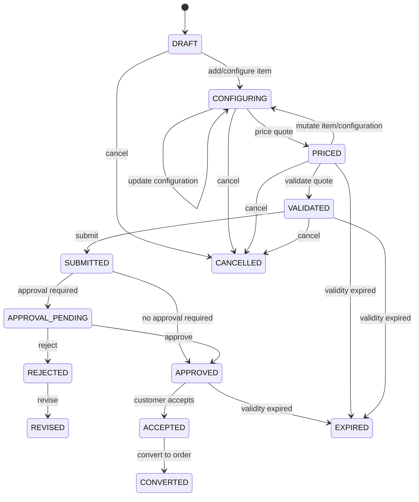
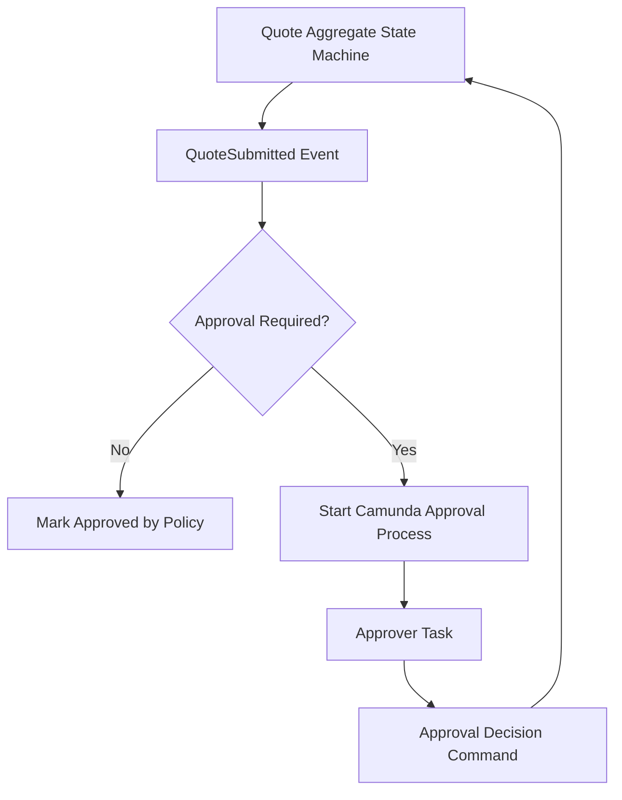
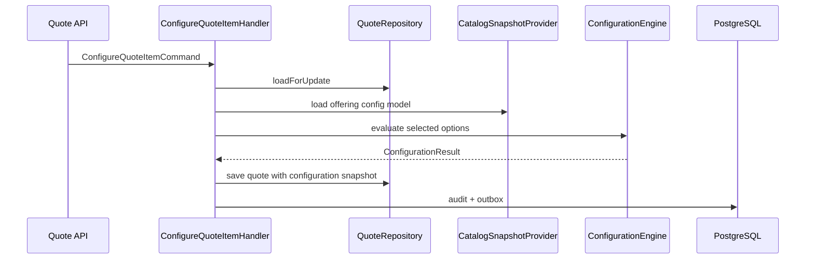

------
title: Build From Scratch: Enterprise Java Microservices CPQ & Order Management Platform - Part 032
description: Implementing the enterprise quote lifecycle from scratch with aggregate commands, state transitions, configuration snapshots, price snapshots, approval readiness, idempotent command handling, PostgreSQL persistence, MyBatis mappers, JAX-RS APIs, outbox events, and audit evidence.
series: learn-enterprise-cpq-oms-glassfish-camunda8
seriesTitle: Build From Scratch: Enterprise Java Microservices CPQ & Order Management Platform
order: 32
partTitle: Quote Lifecycle Implementation
tags:
  - java
  - microservices
  - cpq
  - quote
  - quote-lifecycle
  - state-machine
  - postgresql
  - mybatis
  - jax-rs
  - jersey
  - glassfish
  - kafka
  - camunda-8
  - enterprise-architecture
date: 2026-07-02
---

# Part 032 — Quote Lifecycle Implementation

Kita sudah punya:

- product catalog model,
- configuration engine,
- pricing engine,
- quote domain model,
- API/schema strategy,
- persistence strategy,
- transaction boundary,
- idempotency model.

Sekarang kita implementasikan **quote lifecycle**.

Quote adalah object paling penting di CPQ karena quote adalah tempat bertemunya:

- customer intent,
- product configuration,
- price calculation,
- discount/override,
- approval,
- commercial promise,
- order conversion readiness.

Dalam sistem kecil, quote sering dianggap seperti cart.

Dalam sistem enterprise, quote bukan sekadar cart.

Quote adalah **controlled commercial commitment draft**.

Itu berarti quote boleh berubah selama masih draft/revision, tetapi harus menjadi semakin immutable ketika mendekati acceptance dan order conversion.

---

## 1. Quote Lifecycle yang Akan Kita Implementasikan

State utama:

```text
DRAFT
CONFIGURING
PRICED
VALIDATED
SUBMITTED
APPROVAL_PENDING
APPROVED
REJECTED
ACCEPTED
EXPIRED
CANCELLED
REVISED
CONVERTED
```

Diagram:



Catatan penting:

- `REVISED` bukan akhir permanen; biasanya revised quote membuat revision baru yang kembali ke `DRAFT` atau `CONFIGURING`.
- `CONVERTED` berarti quote sudah dipakai untuk membuat order.
- Setelah `ACCEPTED`, mutation harus sangat dibatasi.
- Setelah `CONVERTED`, quote tidak boleh diedit.

---

## 2. Quote Lifecycle Bukan Workflow Engine Dulu

Kita belum langsung memasukkan semua state ke Camunda.

Kenapa?

Karena tidak semua lifecycle membutuhkan workflow engine.

Contoh:

```text
add item
configure item
price quote
validate quote
cancel draft quote
expire quote
```

Ini domain/application state transition biasa.

Camunda diperlukan ketika ada:

- human approval,
- timer escalation,
- asynchronous orchestration,
- incident handling,
- long-running process,
- manual task,
- cross-service orchestration.

Jadi quote lifecycle dibagi dua:

```text
Domain state machine:
  DRAFT / CONFIGURING / PRICED / VALIDATED / ACCEPTED / EXPIRED / CANCELLED / CONVERTED

Workflow state/process:
  approval routing / escalation / approve / reject / delegation
```

Diagram boundary:



Jangan jadikan Camunda sebagai database state utama quote. Quote state tetap di PostgreSQL/domain aggregate. Camunda mengatur process, bukan menggantikan aggregate invariants.

---

## 3. Quote Aggregate Structure

Quote aggregate minimal:

```java
public final class Quote {
    private QuoteId id;
    private String tenantId;
    private int revision;
    private int version;
    private QuoteState state;
    private CustomerRef customer;
    private ChannelRef channel;
    private MarketRef market;
    private LocalDate validFrom;
    private LocalDate validUntil;
    private List<QuoteItem> items;
    private PricingSnapshot pricingSnapshot;
    private ApprovalSummary approvalSummary;
    private List<DomainEvent> pendingEvents;

    // command methods only
}
```

Quote item:

```java
public final class QuoteItem {
    private QuoteItemId id;
    private String productOfferingId;
    private String productOfferingVersion;
    private QuoteItemAction action;
    private int quantity;
    private QuoteItemState state;
    private ProductConfigurationSnapshot configurationSnapshot;
    private PriceItemSnapshot priceSnapshot;
    private List<String> validationErrors;
}
```

Quote harus punya method command, bukan setter bebas.

Bad:

```java
quote.setState("APPROVED");
quote.setTotal(total);
quote.getItems().add(item);
```

Good:

```java
quote.addItem(command, catalogSnapshot);
quote.applyConfiguration(itemId, configurationResult);
quote.applyPricing(pricingResult, userId);
quote.submit(submitContext);
quote.markApproved(decision);
quote.accept(acceptance);
```

---

## 4. Command Taxonomy

Quote lifecycle diubah melalui command.

| Command | Purpose |
|---|---|
| `CreateQuoteCommand` | Membuat quote baru. |
| `AddQuoteItemCommand` | Menambah item berdasarkan product offering. |
| `ConfigureQuoteItemCommand` | Mengubah konfigurasi item. |
| `RemoveQuoteItemCommand` | Menghapus item draft/configuring. |
| `PriceQuoteCommand` | Menghitung dan menyimpan price snapshot. |
| `ValidateQuoteCommand` | Memastikan quote siap submit. |
| `SubmitQuoteCommand` | Mengunci quote untuk approval/acceptance path. |
| `ApproveQuoteCommand` | Menerima approval decision. |
| `RejectQuoteCommand` | Menolak quote dari approval flow. |
| `AcceptQuoteCommand` | Customer menerima quote. |
| `ExpireQuoteCommand` | Mengubah quote menjadi expired. |
| `ReviseQuoteCommand` | Membuat revision baru. |
| `CancelQuoteCommand` | Membatalkan quote sebelum converted. |
| `ConvertQuoteToOrderCommand` | Membuat order dari quote accepted. |

Semua command harus membawa:

```text
tenantId
quoteId
expectedVersion
idempotencyKey
actor
reason/context where needed
```

Contoh:

```java
public record SubmitQuoteCommand(
    String tenantId,
    String quoteId,
    int expectedVersion,
    String idempotencyKey,
    String submittedBy,
    String note
) {}
```

---

## 5. State Transition Guard

State transition harus centralized.

```java
public final class QuoteStateMachine {

    private static final Map<QuoteState, Set<QuoteState>> ALLOWED = Map.of(
        QuoteState.DRAFT, Set.of(QuoteState.CONFIGURING, QuoteState.CANCELLED),
        QuoteState.CONFIGURING, Set.of(QuoteState.CONFIGURING, QuoteState.PRICED, QuoteState.CANCELLED),
        QuoteState.PRICED, Set.of(QuoteState.CONFIGURING, QuoteState.VALIDATED, QuoteState.EXPIRED, QuoteState.CANCELLED),
        QuoteState.VALIDATED, Set.of(QuoteState.SUBMITTED, QuoteState.EXPIRED, QuoteState.CANCELLED),
        QuoteState.SUBMITTED, Set.of(QuoteState.APPROVAL_PENDING, QuoteState.APPROVED),
        QuoteState.APPROVAL_PENDING, Set.of(QuoteState.APPROVED, QuoteState.REJECTED),
        QuoteState.REJECTED, Set.of(QuoteState.REVISED, QuoteState.CANCELLED),
        QuoteState.APPROVED, Set.of(QuoteState.ACCEPTED, QuoteState.EXPIRED),
        QuoteState.ACCEPTED, Set.of(QuoteState.CONVERTED),
        QuoteState.EXPIRED, Set.of(QuoteState.REVISED),
        QuoteState.CANCELLED, Set.of(),
        QuoteState.CONVERTED, Set.of()
    );

    public void assertCanTransition(QuoteState from, QuoteState to) {
        if (!ALLOWED.getOrDefault(from, Set.of()).contains(to)) {
            throw new DomainConflictException("QUOTE_STATE_TRANSITION_NOT_ALLOWED", from + " -> " + to);
        }
    }
}
```

Jangan encode transition hanya di controller. Controller bukan owner invariant.

---

## 6. Create Quote

### 6.1 API

```http
POST /api/v1/quotes
Idempotency-Key: 01J...
Content-Type: application/json
```

Request:

```json
{
  "customerId": "CUST-10001",
  "channel": "DIRECT_SALES",
  "market": "ID",
  "validityDays": 30
}
```

Response:

```json
{
  "quoteId": "Q-10001",
  "revision": 1,
  "version": 1,
  "state": "DRAFT"
}
```

### 6.2 Aggregate method

```java
public static Quote create(CreateQuoteCommand command, QuoteCreationPolicy policy, Clock clock) {
    LocalDate today = LocalDate.now(clock);

    Quote quote = new Quote();
    quote.id = QuoteId.newId();
    quote.tenantId = command.tenantId();
    quote.revision = 1;
    quote.version = 1;
    quote.state = QuoteState.DRAFT;
    quote.customer = CustomerRef.of(command.customerId());
    quote.channel = ChannelRef.of(command.channel());
    quote.market = MarketRef.of(command.market());
    quote.validFrom = today;
    quote.validUntil = today.plusDays(policy.defaultValidityDays());
    quote.items = new ArrayList<>();
    quote.pendingEvents.add(QuoteCreatedEvent.from(quote));
    return quote;
}
```

### 6.3 Transaction

```text
insert quote header
insert audit log
insert idempotency record
insert outbox QuoteCreated
commit
```

---

## 7. Add Quote Item

Adding item requires catalog snapshot.

```java
public void addItem(AddQuoteItemCommand command, ProductOfferingSnapshot offering) {
    assertMutableForConfiguration();
    assertOfferingCanBeSold(offering);

    QuoteItem item = QuoteItem.from(command, offering);
    this.items.add(item);
    this.state = QuoteState.CONFIGURING;
    this.pricingSnapshot = null;
    this.approvalSummary = ApprovalSummary.empty();
    this.version++;

    pendingEvents.add(QuoteItemAddedEvent.from(this, item));
}
```

Kenapa pricing snapshot dihapus?

Karena harga lama sudah stale ketika item berubah.

Rule:

```text
Any commercial mutation invalidates pricing snapshot.
```

Commercial mutation:

- add item,
- remove item,
- change quantity,
- change configuration,
- change contract term,
- change manual override,
- change customer account/segment context.

---

## 8. Configure Quote Item

Configure item memanggil configuration engine.

Flow:



Aggregate:

```java
public void applyConfiguration(String quoteItemId, ConfigurationResult result, String actor) {
    assertMutableForConfiguration();

    QuoteItem item = findItem(quoteItemId);
    item.applyConfiguration(result);

    if (result.status() == ConfigurationStatus.VALID) {
        item.markConfigured();
    } else {
        item.markConfigurationIncomplete(result.errors());
    }

    this.state = QuoteState.CONFIGURING;
    this.pricingSnapshot = null;
    this.approvalSummary = ApprovalSummary.empty();
    this.version++;

    pendingEvents.add(QuoteItemConfiguredEvent.from(this, item, result));
}
```

Konfigurasi invalid boleh disimpan?

Dalam banyak CPQ, iya, selama quote belum submit. Ini memungkinkan UI menyimpan draft incomplete configuration.

Tapi quote tidak boleh diprice/submit bila configuration invalid.

---

## 9. Price Quote

Price quote memakai pricing engine dari Part 031.

Guard:

```text
quote must not be terminal
quote must have at least one item
all required item configuration must be valid
quote customer/channel/market must be complete
```

Aggregate:

```java
public void applyPricing(PricingResult result, String pricedBy) {
    assertCanBePriced();
    assertPricingResultMatchesQuote(result);

    this.pricingSnapshot = PricingSnapshot.from(result, pricedBy);
    applyItemPriceSnapshots(result.priceLines());
    this.approvalSummary = ApprovalSummary.from(result.approvalSignals());
    this.state = QuoteState.PRICED;
    this.version++;

    pendingEvents.add(QuotePricedEvent.from(this, result));

    if (approvalSummary.requiresApproval()) {
        pendingEvents.add(QuoteApprovalRequiredEvent.from(this, approvalSummary));
    }
}
```

`QuoteApprovalRequiredEvent` belum berarti Camunda langsung start di dalam transaction. Event masuk outbox dulu.

---

## 10. Validate Quote

Validate quote berbeda dari price quote.

Pricing menjawab harga. Validation menjawab kesiapan commercial commitment.

Validation checks:

```text
Quote has items.
All items have valid configuration.
Quote has current pricing snapshot.
Pricing hash matches current quote input hash.
No blocking pricing warning.
No expired catalog/price snapshot unless policy allows.
Required approval signal has path.
Customer is eligible.
Validity window still open.
Required documents/attachments exist if applicable.
```

Validator:

```java
public final class QuoteReadinessValidator {

    public QuoteReadinessResult validate(Quote quote, QuoteReadinessContext context) {
        List<QuoteValidationIssue> issues = new ArrayList<>();

        if (quote.items().isEmpty()) {
            issues.add(blocking("QUOTE_EMPTY", "Quote must contain at least one item."));
        }
        if (!quote.allItemsConfigured()) {
            issues.add(blocking("ITEM_CONFIGURATION_INVALID", "All quote items must have valid configuration."));
        }
        if (!quote.hasPricingSnapshot()) {
            issues.add(blocking("QUOTE_NOT_PRICED", "Quote must be priced before validation."));
        }
        if (quote.isPricingStale(context.currentPricingHash())) {
            issues.add(blocking("PRICING_STALE", "Quote must be repriced."));
        }
        if (quote.isExpired(context.today())) {
            issues.add(blocking("QUOTE_EXPIRED", "Quote validity period has expired."));
        }

        return QuoteReadinessResult.of(issues);
    }
}
```

Aggregate:

```java
public void markValidated(QuoteReadinessResult result, String actor) {
    assertState(QuoteState.PRICED);
    if (result.hasBlockingIssues()) {
        throw new DomainValidationException("QUOTE_NOT_READY", result.issues());
    }
    this.state = QuoteState.VALIDATED;
    this.version++;
    pendingEvents.add(QuoteValidatedEvent.from(this, actor));
}
```

---

## 11. Submit Quote

Submit adalah boundary penting.

Sebelum submit, quote adalah working draft. Setelah submit, quote masuk commercial governance.

Submit guard:

```text
state must be VALIDATED
quote not expired
pricing snapshot exists
all items valid
no blocking validation issue
```

Aggregate:

```java
public void submit(String submittedBy, Clock clock) {
    assertState(QuoteState.VALIDATED);
    assertNotExpired(clock);

    this.state = QuoteState.SUBMITTED;
    this.version++;
    pendingEvents.add(QuoteSubmittedEvent.from(this, submittedBy));

    if (approvalSummary.requiresApproval()) {
        transitionToApprovalPending();
    } else {
        markApprovedByPolicy(submittedBy);
    }
}

private void transitionToApprovalPending() {
    this.state = QuoteState.APPROVAL_PENDING;
    pendingEvents.add(QuoteApprovalPendingEvent.from(this));
}

private void markApprovedByPolicy(String actor) {
    this.state = QuoteState.APPROVED;
    this.approvalSummary = approvalSummary.markAutoApproved(actor);
    pendingEvents.add(QuoteApprovedEvent.autoApproved(this, actor));
}
```

Submit handler:

```java
public SubmitQuoteResult handle(SubmitQuoteCommand command) {
    return idempotencyService.execute(command.idempotencyKey(), command, () ->
        unitOfWork.required(() -> {
            Quote quote = quoteRepository.loadForUpdate(command.tenantId(), command.quoteId());
            quote.assertVersion(command.expectedVersion());

            QuoteReadinessResult readiness = readinessValidator.validate(quote, readinessContextProvider.forQuote(quote));
            quote.markValidated(readiness, command.submittedBy());
            quote.submit(command.submittedBy(), clock);

            quoteRepository.save(quote);
            auditRepository.insert(AuditRecord.quoteSubmitted(quote, command));
            outboxRepository.insertAll(quote.pullPendingEvents());

            return SubmitQuoteResult.from(quote);
        })
    );
}
```

---

## 12. Approval Pending

When approval required, quote enters `APPROVAL_PENDING`.

The approval process is not implemented fully here; we only prepare integration point.

Outbox event:

```json
{
  "eventType": "QuoteApprovalPending",
  "eventVersion": "1.0",
  "tenantId": "telco-id",
  "quoteId": "Q-10001",
  "quoteRevision": 2,
  "approvalSignals": [
    {
      "signalType": "PRICE_OVERRIDE_ABOVE_LIMIT",
      "severity": "APPROVAL_REQUIRED",
      "policyId": "POLICY-SALES-DISCOUNT-2026"
    }
  ],
  "occurredAt": "2026-07-02T10:10:00Z"
}
```

Approval process listener/worker can start Camunda process:

```text
QuoteApprovalPending event
-> approval orchestrator
-> start BPMN process quote-approval
-> human tasks
-> approve/reject command back to Quote API
```

Important:

```text
Camunda process never updates quote table directly.
It calls quote command API/application service.
```

---

## 13. Approve Quote

Approval decision command:

```java
public record ApproveQuoteCommand(
    String tenantId,
    String quoteId,
    int expectedVersion,
    String idempotencyKey,
    String approvalProcessInstanceId,
    String approvedBy,
    String decisionId,
    String note
) {}
```

Aggregate:

```java
public void approve(ApprovalDecision decision) {
    assertState(QuoteState.APPROVAL_PENDING);
    approvalSummary.applyDecision(decision);

    if (approvalSummary.allRequiredApprovalsSatisfied()) {
        this.state = QuoteState.APPROVED;
        pendingEvents.add(QuoteApprovedEvent.from(this, decision));
    } else {
        pendingEvents.add(QuoteApprovalPartiallyApprovedEvent.from(this, decision));
    }

    this.version++;
}
```

Approval decision must be idempotent by `decisionId`.

```text
Same decisionId replay -> same result
Different decisionId same approver same level -> conflict or supersede based on policy
```

---

## 14. Reject Quote

Reject does not necessarily kill the quote permanently.

It may allow revision.

Aggregate:

```java
public void reject(ApprovalDecision decision) {
    assertState(QuoteState.APPROVAL_PENDING);
    approvalSummary.applyDecision(decision);
    this.state = QuoteState.REJECTED;
    this.version++;
    pendingEvents.add(QuoteRejectedEvent.from(this, decision));
}
```

After rejection:

```text
REJECTED -> REVISED -> new revision DRAFT/CONFIGURING
```

Do not allow direct mutation on rejected revision. Create new revision.

---

## 15. Accept Quote

Accept means customer accepted the commercial promise.

Guard:

```text
state must be APPROVED
quote not expired
pricing snapshot exists
approval summary satisfied
customer acceptance evidence provided
```

Acceptance evidence:

- accepted by,
- accepted at,
- channel,
- IP/device if digital,
- signature reference if contract signed,
- terms version,
- quote PDF/document version if generated,
- external acceptance reference if partner channel.

Command:

```java
public record AcceptQuoteCommand(
    String tenantId,
    String quoteId,
    int expectedVersion,
    String idempotencyKey,
    String acceptedBy,
    String acceptanceChannel,
    String acceptanceReference,
    String acceptedTermsVersion
) {}
```

Aggregate:

```java
public void accept(QuoteAcceptance acceptance, Clock clock) {
    assertState(QuoteState.APPROVED);
    assertNotExpired(clock);
    assertApprovalSatisfied();

    this.state = QuoteState.ACCEPTED;
    this.acceptance = acceptance;
    this.version++;
    pendingEvents.add(QuoteAcceptedEvent.from(this, acceptance));
}
```

After accepted:

```text
Allowed:
  convert to order
  read
  generate final documents

Not allowed:
  add item
  change configuration
  change price
  change override
  change approval evidence
```

---

## 16. Expire Quote

Quote expiry can be triggered by:

- scheduled job,
- command,
- read-time derived status,
- batch process.

For audit and operational consistency, terminal expiry should be persisted.

Guard:

```text
quote validUntil < today
state in PRICED, VALIDATED, APPROVED
not accepted
not converted
```

Aggregate:

```java
public void expire(Clock clock) {
    if (!canExpire()) {
        return;
    }
    if (!LocalDate.now(clock).isAfter(validUntil)) {
        throw new DomainConflictException("QUOTE_NOT_EXPIRED_YET", "Quote validity is still active.");
    }
    this.state = QuoteState.EXPIRED;
    this.version++;
    pendingEvents.add(QuoteExpiredEvent.from(this));
}
```

Batch expiry must be idempotent.

```sql
update quote
set state = 'EXPIRED',
    version = version + 1,
    updated_at = now()
where tenant_id = #{tenantId}
  and state in ('PRICED', 'VALIDATED', 'APPROVED')
  and valid_until < #{today}
returning quote_id, revision, version;
```

But be careful: if you update many quotes in batch, you still need audit/outbox. Use chunked job with per-quote command or a batch-safe outbox strategy.

---

## 17. Revise Quote

Revision means create a new version of commercial proposal.

Do not mutate old accepted/submitted/rejected revision in place.

Revision rule:

```text
old quote revision remains immutable/auditable
new revision starts from copied snapshot
pricing snapshot is stale or removed
approval summary reset
state becomes DRAFT or CONFIGURING
```

Command:

```java
public record ReviseQuoteCommand(
    String tenantId,
    String quoteId,
    int sourceRevision,
    int expectedVersion,
    String idempotencyKey,
    String revisedBy,
    String reasonCode,
    String note
) {}
```

Implementation option:

```text
Same quote_id, revision incremented
Primary key: tenant_id + quote_id + revision
```

Aggregate factory:

```java
public Quote createRevision(String revisedBy, String reasonCode) {
    assertCanBeRevised();

    Quote revision = deepCopyForRevision();
    revision.revision = this.revision + 1;
    revision.version = 1;
    revision.state = QuoteState.CONFIGURING;
    revision.pricingSnapshot = null;
    revision.approvalSummary = ApprovalSummary.empty();
    revision.acceptance = null;
    revision.pendingEvents.add(QuoteRevisedEvent.from(this, revision, revisedBy, reasonCode));
    return revision;
}
```

Why `CONFIGURING`, not `PRICED`?

Because old price may no longer be valid. Even if copied items are still valid, repricing should be explicit.

---

## 18. Cancel Quote

Cancel is allowed before accepted/converted depending business policy.

Guard:

```text
state in DRAFT, CONFIGURING, PRICED, VALIDATED, SUBMITTED, APPROVAL_PENDING, REJECTED, APPROVED
not ACCEPTED
not CONVERTED
```

If quote is in approval pending, cancellation should also cancel approval process eventually.

Aggregate:

```java
public void cancel(CancelQuoteCommand command) {
    assertCanBeCancelled();
    this.state = QuoteState.CANCELLED;
    this.cancellation = QuoteCancellation.of(command.cancelledBy(), command.reasonCode(), command.note());
    this.version++;
    pendingEvents.add(QuoteCancelledEvent.from(this, command));
}
```

Outbox event triggers:

```text
QuoteCancelled -> approval process cancel worker -> terminate Camunda process if active
```

Again, quote state changes first in aggregate transaction. Workflow follows.

---

## 19. Convert Quote To Order Boundary

Full conversion is Part 034, but quote lifecycle must define the boundary.

Guard:

```text
quote state must be ACCEPTED
quote not expired at acceptance/conversion policy point
quote pricing snapshot exists
quote has not already been converted
idempotency key present
```

Conversion should create order in order bounded context.

Two possible implementation styles:

### Option A — Synchronous same database transaction

Only if quote and order live in same service/database.

```text
load quote for update
assert accepted
create order aggregate
mark quote converted
save order
save quote
insert audit
insert outbox
commit
```

### Option B — Asynchronous command/event

If quote and order are separate services.

```text
QuoteAccepted/ConvertQuoteRequested
-> Order service creates order idempotently
-> Quote service marks converted after OrderCreated acknowledgement
```

For this build-from-scratch series, we will initially implement same platform modular services with clear boundary, then discuss event-driven split later.

Quote should store conversion reference:

```text
convertedOrderId
convertedAt
convertedBy
conversionCommandId
```

---

## 20. Persistence Model

### 20.1 Quote table

```sql
create table quote (
    tenant_id varchar(64) not null,
    quote_id varchar(64) not null,
    revision integer not null,
    version integer not null,
    state varchar(32) not null,
    customer_id varchar(64) not null,
    channel varchar(64) not null,
    market varchar(64) not null,
    valid_from date not null,
    valid_until date not null,
    pricing_run_id varchar(64),
    pricing_hash varchar(128),
    approval_required boolean not null default false,
    accepted_at timestamptz,
    accepted_by varchar(128),
    converted_order_id varchar(64),
    converted_at timestamptz,
    cancellation_reason_code varchar(64),
    created_at timestamptz not null,
    updated_at timestamptz not null,
    primary key (tenant_id, quote_id, revision)
);

create index idx_quote_worklist
on quote (tenant_id, state, updated_at desc);

create unique index uq_quote_converted_order
on quote (tenant_id, converted_order_id)
where converted_order_id is not null;
```

### 20.2 Quote item table

```sql
create table quote_item (
    tenant_id varchar(64) not null,
    quote_id varchar(64) not null,
    quote_revision integer not null,
    quote_item_id varchar(64) not null,
    product_offering_id varchar(64) not null,
    product_offering_version varchar(32) not null,
    action varchar(32) not null,
    quantity integer not null,
    state varchar(32) not null,
    configuration_status varchar(32),
    configuration_snapshot jsonb,
    price_snapshot jsonb,
    validation_errors jsonb not null default '[]'::jsonb,
    created_at timestamptz not null,
    updated_at timestamptz not null,
    primary key (tenant_id, quote_id, quote_revision, quote_item_id),
    foreign key (tenant_id, quote_id, quote_revision)
      references quote (tenant_id, quote_id, revision)
);
```

### 20.3 Quote transition history

```sql
create table quote_state_transition (
    tenant_id varchar(64) not null,
    quote_id varchar(64) not null,
    quote_revision integer not null,
    transition_id varchar(64) not null,
    from_state varchar(32),
    to_state varchar(32) not null,
    command_type varchar(128) not null,
    command_id varchar(128),
    actor varchar(128) not null,
    reason_code varchar(64),
    note text,
    occurred_at timestamptz not null,
    primary key (tenant_id, quote_id, quote_revision, transition_id)
);
```

Do not rely only on current `quote.state`. State transition history is audit evidence.

---

## 21. MyBatis Repository Pattern

Mapper is row-level. Repository reconstructs aggregate.

```java
public interface QuoteMapper {
    QuoteHeaderRow findHeaderForUpdate(FindQuoteQuery query);
    List<QuoteItemRow> findItems(FindQuoteQuery query);
    int updateHeader(UpdateQuoteHeaderCommand command);
    void insertHeader(QuoteHeaderRow row);
    void insertItem(QuoteItemRow row);
    void deleteItems(DeleteQuoteItemsCommand command);
    void batchInsertItems(@Param("rows") List<QuoteItemRow> rows);
}
```

Repository:

```java
public final class MyBatisQuoteRepository implements QuoteRepository {

    private final QuoteMapper quoteMapper;
    private final QuoteRowMapper rowMapper;

    @Override
    public Quote loadForUpdate(String tenantId, String quoteId, int revision) {
        FindQuoteQuery query = new FindQuoteQuery(tenantId, quoteId, revision);
        QuoteHeaderRow header = quoteMapper.findHeaderForUpdate(query);
        if (header == null) {
            throw new NotFoundException("QUOTE_NOT_FOUND", quoteId);
        }
        List<QuoteItemRow> items = quoteMapper.findItems(query);
        return rowMapper.toAggregate(header, items);
    }

    @Override
    public void save(Quote quote) {
        int updated = quoteMapper.updateHeader(rowMapper.toUpdateCommand(quote));
        if (updated != 1) {
            throw new OptimisticLockException("QUOTE_CONCURRENT_MODIFICATION");
        }

        quoteMapper.deleteItems(DeleteQuoteItemsCommand.of(quote));
        quoteMapper.batchInsertItems(rowMapper.toItemRows(quote));
    }
}
```

Deleting and reinserting items is acceptable for small/medium quote aggregates. For huge enterprise quote, use diff-based save plan.

---

## 22. API Resource Design

JAX-RS resource should be thin.

```java
@Path("/api/v1/quotes")
@Consumes(MediaType.APPLICATION_JSON)
@Produces(MediaType.APPLICATION_JSON)
public class QuoteResource {

    private final CreateQuoteCommandHandler createHandler;
    private final AddQuoteItemCommandHandler addItemHandler;
    private final ConfigureQuoteItemCommandHandler configureHandler;
    private final PriceQuoteCommandHandler priceHandler;
    private final SubmitQuoteCommandHandler submitHandler;
    private final AcceptQuoteCommandHandler acceptHandler;

    @POST
    public Response createQuote(
        @HeaderParam("Idempotency-Key") String idempotencyKey,
        CreateQuoteRequest request
    ) {
        CreateQuoteResult result = createHandler.handle(request.toCommand(idempotencyKey));
        return Response.status(Response.Status.CREATED).entity(QuoteResponse.from(result)).build();
    }

    @POST
    @Path("/{quoteId}/items")
    public Response addItem(
        @PathParam("quoteId") String quoteId,
        @HeaderParam("Idempotency-Key") String idempotencyKey,
        @HeaderParam("If-Match") String ifMatch,
        AddQuoteItemRequest request
    ) {
        AddQuoteItemResult result = addItemHandler.handle(request.toCommand(quoteId, idempotencyKey, ifMatch));
        return Response.ok(QuoteResponse.from(result)).build();
    }

    @POST
    @Path("/{quoteId}/commands/price")
    public Response priceQuote(...) {
        // delegate only
    }
}
```

Resource must not:

- load MyBatis mapper directly,
- call pricing engine directly,
- start Camunda process directly,
- publish Kafka event directly,
- mutate aggregate fields directly.

---

## 23. Endpoint Shape

```text
POST /api/v1/quotes
POST /api/v1/quotes/{quoteId}/items
PUT  /api/v1/quotes/{quoteId}/items/{quoteItemId}/configuration
DELETE /api/v1/quotes/{quoteId}/items/{quoteItemId}
POST /api/v1/quotes/{quoteId}/commands/price
POST /api/v1/quotes/{quoteId}/commands/validate
POST /api/v1/quotes/{quoteId}/commands/submit
POST /api/v1/quotes/{quoteId}/commands/approve
POST /api/v1/quotes/{quoteId}/commands/reject
POST /api/v1/quotes/{quoteId}/commands/accept
POST /api/v1/quotes/{quoteId}/commands/revise
POST /api/v1/quotes/{quoteId}/commands/cancel
POST /api/v1/quotes/{quoteId}/commands/convert-to-order
GET  /api/v1/quotes/{quoteId}
GET  /api/v1/quotes?state=&customerId=&cursor=
```

Use command endpoints for lifecycle transitions. Avoid pretending that submit/approve/accept are simple field PATCH operations.

---

## 24. Idempotency and Optimistic Locking

Every command endpoint uses:

```text
Idempotency-Key
If-Match / expectedVersion
```

Idempotency handles retry.

Optimistic lock handles concurrent mutation.

Example conflict:

```text
User A prices quote version 7.
User B changes item on version 7 and commits version 8.
User A submits with expected version 7.
System rejects with 409 QUOTE_CONCURRENT_MODIFICATION.
```

This is correct. Do not silently submit stale quote.

---

## 25. Outbox Events

Important events:

```text
QuoteCreated
QuoteItemAdded
QuoteItemConfigured
QuotePriced
QuoteValidated
QuoteSubmitted
QuoteApprovalPending
QuoteApproved
QuoteRejected
QuoteAccepted
QuoteExpired
QuoteRevised
QuoteCancelled
QuoteConverted
```

Event envelope:

```json
{
  "eventId": "EVT-001",
  "eventType": "QuotePriced",
  "eventVersion": "1.0",
  "tenantId": "telco-id",
  "aggregateType": "QUOTE",
  "aggregateId": "Q-10001",
  "aggregateRevision": 2,
  "aggregateVersion": 8,
  "occurredAt": "2026-07-02T10:00:00Z",
  "correlationId": "CORR-123",
  "causationId": "CMD-456",
  "payload": {}
}
```

Outbox insert happens in same DB transaction as quote mutation.

---

## 26. Audit Model

Audit should answer:

```text
Who did what?
When?
From which state to which state?
What data changed?
Why?
Through which channel/API/client?
What approval/price/configuration evidence existed at that time?
```

Audit record:

```sql
create table quote_audit_log (
    tenant_id varchar(64) not null,
    audit_id varchar(64) not null,
    quote_id varchar(64) not null,
    quote_revision integer not null,
    command_type varchar(128) not null,
    actor varchar(128) not null,
    reason_code varchar(64),
    before_state varchar(32),
    after_state varchar(32),
    before_snapshot jsonb,
    after_snapshot jsonb,
    evidence jsonb not null default '{}'::jsonb,
    occurred_at timestamptz not null,
    primary key (tenant_id, audit_id)
);
```

Do not store only free-text audit. Use structured evidence.

---

## 27. Quote Read Model

Write aggregate is not enough for UI/search.

Read model examples:

```text
quote_summary_view
quote_worklist_projection
quote_customer_timeline_projection
quote_approval_queue_projection
```

Quote summary fields:

```text
quoteId
revision
state
customerId
customerNameSnapshot
channel
market
validUntil
oneTimeTotal
monthlyRecurringTotal
approvalRequired
createdAt
updatedAt
```

Projection can be updated:

- synchronously in same transaction for critical read-after-write,
- asynchronously from outbox events for dashboards/search.

For command response, return from aggregate transaction, not eventually consistent projection.

---

## 28. Quote Lifecycle Failure Modes

| Failure | Correct behavior |
|---|---|
| Add item to accepted quote | Reject with state conflict. |
| Price quote with invalid configuration | Reject with validation problem. |
| Submit quote without pricing | Reject. |
| Submit stale version | Reject with optimistic lock conflict. |
| Approval callback duplicated | Idempotent replay by decision ID. |
| Approval callback after cancellation | Reject or record ignored decision based on policy. |
| Accept expired quote | Reject unless explicit renewal/revision policy. |
| Convert quote twice | Return existing order reference for same idempotency key; conflict for different command. |
| Outbox relay down | Quote transaction still committed; event retries. |
| Camunda process not started | Quote remains approval pending; operational repair/retry starts process. |
| Pricing snapshot missing lines | Reject submit; repair or reprice required. |

---

## 29. Test Strategy

### 29.1 State transition tests

```text
DRAFT -> CONFIGURING allowed
CONFIGURING -> PRICED allowed
DRAFT -> APPROVED rejected
APPROVED -> ACCEPTED allowed
ACCEPTED -> CONFIGURING rejected
CONVERTED -> CANCELLED rejected
```

### 29.2 Command handler tests

For each command:

```text
loads aggregate for update
checks expected version
executes domain method
persists aggregate
writes audit
writes outbox
stores idempotency result
commits atomically
```

### 29.3 Pricing stale tests

```text
Given quote priced with hash H1
When item configuration changes
Then pricing snapshot removed
And submit rejected until repriced
```

### 29.4 Approval tests

```text
Given pricing result has approval signal
When submit
Then state becomes APPROVAL_PENDING
And QuoteApprovalPending event is emitted

Given approval pending
When approve decision received
Then state becomes APPROVED
And decision evidence is stored
```

### 29.5 Concurrency tests

```text
Two users update same quote version.
Only one succeeds.
Loser receives 409 conflict.
No duplicated item.
No duplicated outbox event.
```

### 29.6 Idempotency tests

```text
Same command + same idempotency key -> same response.
Same idempotency key + different request hash -> conflict.
Lost response after commit -> durable response replay.
```

---

## 30. Implementation Milestone

Build order:

```text
Milestone 1:
  Quote aggregate
  Quote item
  State machine
  Create quote
  Add item

Milestone 2:
  Configure item command
  Configuration snapshot persistence
  Invalidate pricing on mutation

Milestone 3:
  Price quote command
  Pricing snapshot persistence
  Totals in quote summary

Milestone 4:
  Validate quote
  Submit quote
  Auto-approve when no approval signal

Milestone 5:
  Approval pending
  Approve/reject commands
  Approval evidence

Milestone 6:
  Accept quote
  Expire quote
  Revise quote
  Cancel quote

Milestone 7:
  Convert-to-order boundary
  Outbox events
  Audit explorer
  Worklist projection
```

---

## 31. Common Design Mistakes

### Mistake 1 — Quote as mutable JSON blob

It feels fast early, but later you cannot enforce lifecycle invariants.

### Mistake 2 — Repricing silently on read

Read endpoint should not silently change commercial numbers.

### Mistake 3 — Approval state only in workflow engine

Workflow incident or migration can break commercial state visibility. Quote aggregate must know approval summary.

### Mistake 4 — No revision model

Without revision, rejected/expired/changed quote history becomes messy.

### Mistake 5 — Accepting quote without evidence

Acceptance is legal/commercial evidence. Store structured acceptance record.

### Mistake 6 — No stale pricing detection

A quote can look priced while item configuration already changed. Always invalidate or hash-check.

### Mistake 7 — Direct DB update for repair

Repair must go through controlled repair command, audit, and invariant checks.

---

## 32. Mental Model Akhir

Quote lifecycle implementation adalah tempat kita memaksa CPQ menjadi sistem yang bisa dipercaya.

Quote harus bisa berubah, tetapi tidak sembarang berubah.

Quote harus bisa diprice, tetapi harga tidak boleh berubah diam-diam.

Quote harus bisa diapprove, tetapi workflow tidak boleh menjadi satu-satunya sumber kebenaran.

Quote harus bisa diterima customer, tetapi acceptance harus punya evidence.

Quote harus bisa dikonversi ke order, tetapi conversion harus idempotent dan traceable.

Dengan model ini, quote bukan lagi object CRUD.

Quote menjadi **commercial state machine** dengan:

- explicit commands,
- explicit transition guard,
- explicit snapshots,
- explicit approval evidence,
- explicit audit,
- explicit outbox events,
- explicit conversion boundary.

Pada part berikutnya, kita akan memperdalam approval engine dan policy model.

Kita akan membangun cara menentukan:

```text
approval apa yang dibutuhkan,
siapa approver-nya,
berapa limit-nya,
bagaimana escalation-nya,
bagaimana delegation-nya,
dan bagaimana semua decision itu menjadi audit evidence.
```
