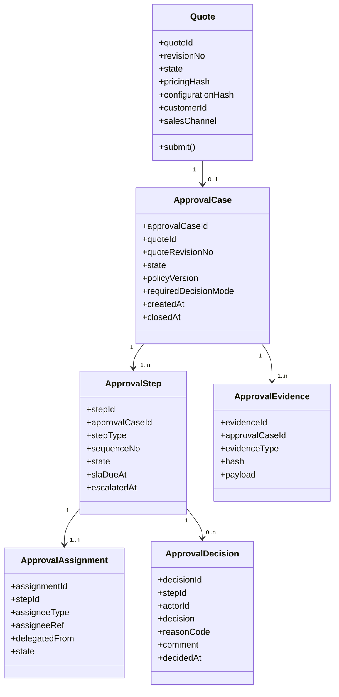
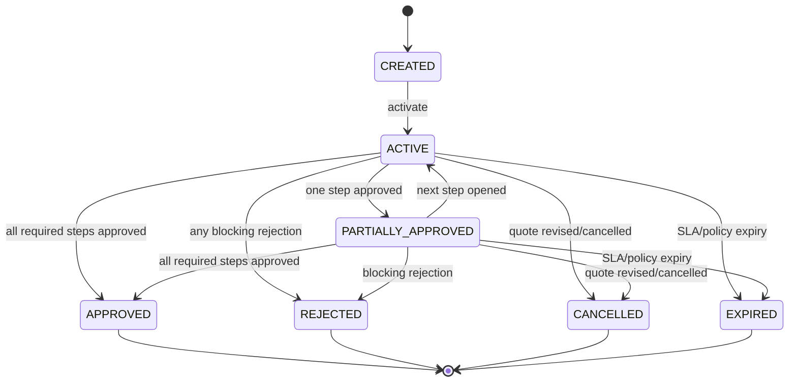
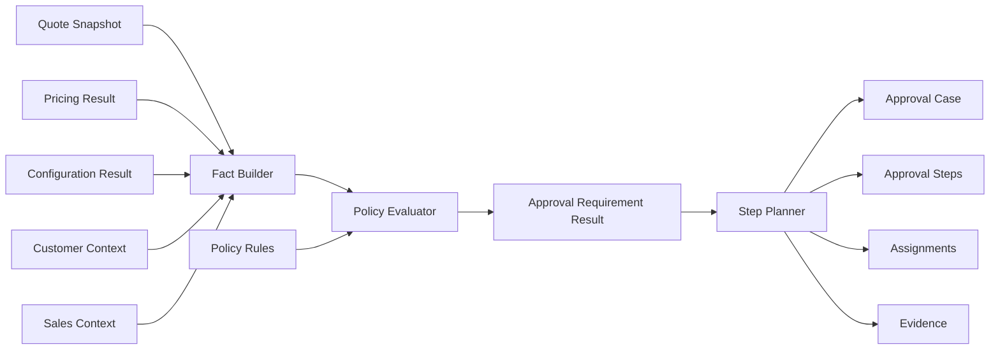
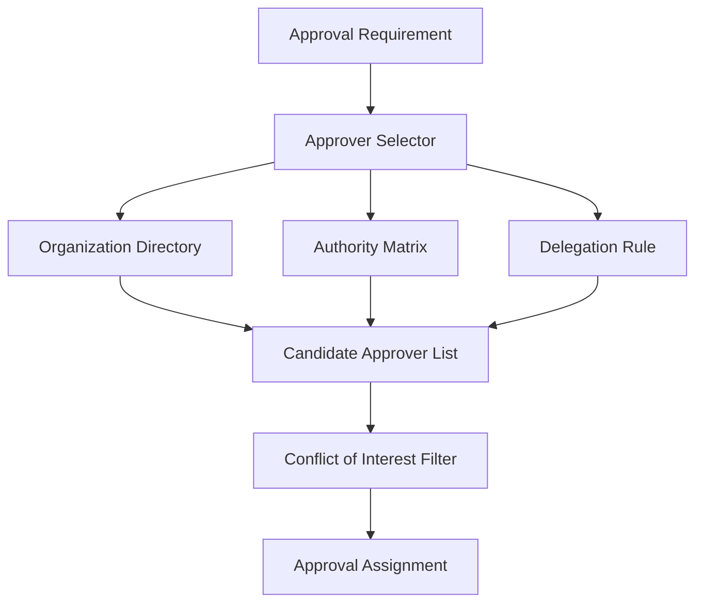
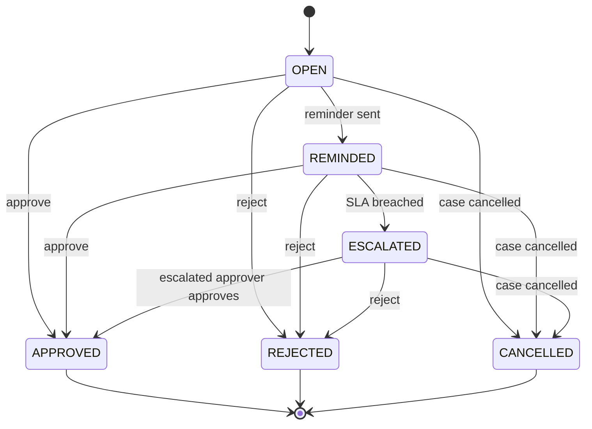
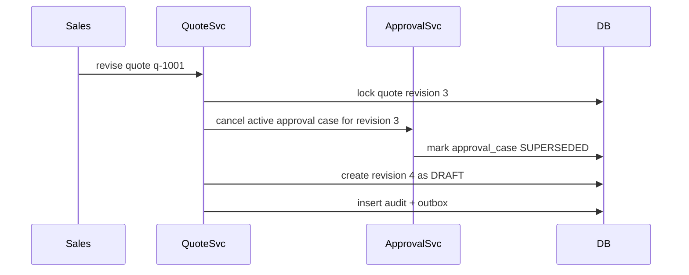
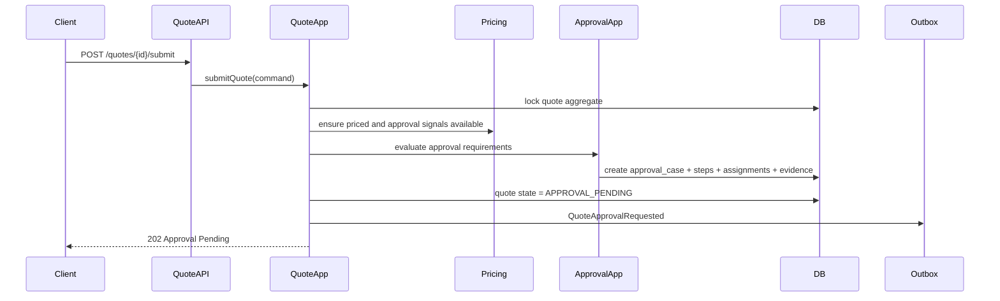
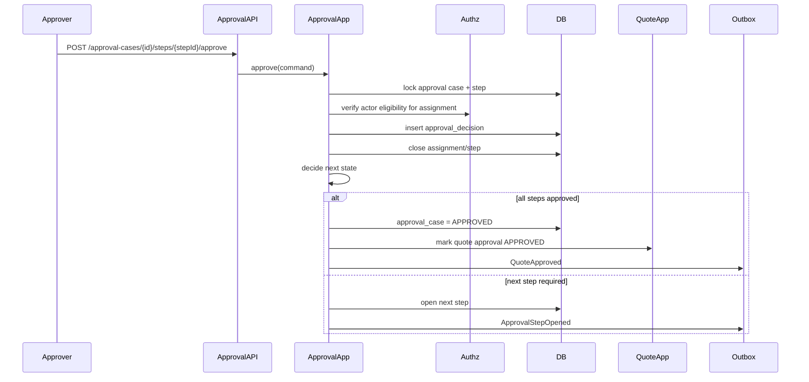
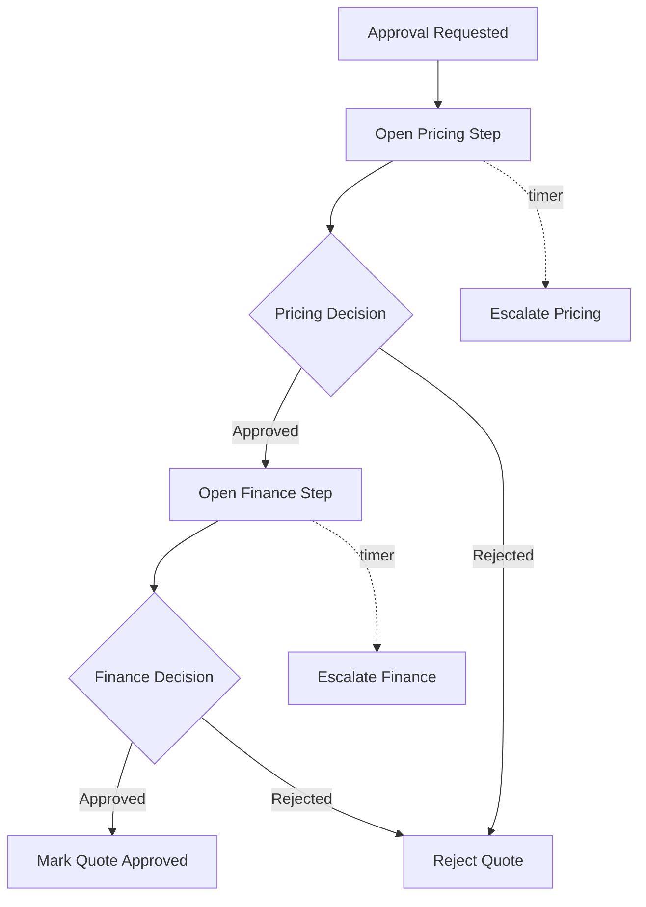

------
title: Build From Scratch: Enterprise Java Microservices CPQ & Order Management Platform - Part 033
description: Mendesain approval engine dan policy model untuk CPQ enterprise: price override approval, margin approval, non-standard term approval, escalation, delegation, SLA, audit evidence, Camunda boundary, PostgreSQL persistence, MyBatis mapper, Kafka event, dan failure model.
series: learn-enterprise-cpq-oms-glassfish-camunda8
seriesTitle: Build From Scratch: Enterprise Java Microservices CPQ & Order Management Platform
order: 33
partTitle: Approval Engine and Policy Model
tags:
  - java
  - microservices
  - cpq
  - oms
  - approval-engine
  - policy-engine
  - camunda-8
  - postgresql
  - mybatis
  - kafka
  - audit
  - enterprise-architecture
date: 2026-07-02
---

# Part 033 — Approval Engine and Policy Model

Di part sebelumnya kita sudah membangun lifecycle quote: `DRAFT`, `CONFIGURED`, `PRICED`, `VALIDATED`, `SUBMITTED`, `APPROVAL_PENDING`, `ACCEPTED`, `EXPIRED`, `CANCELLED`, dan seterusnya.

Sekarang kita masuk ke area yang sering terlihat sederhana di demo, tetapi sangat rumit di enterprise system: **approval**.

Approval bukan sekadar tombol `Approve` dan `Reject`.

Approval adalah mekanisme untuk menjawab pertanyaan ini:

> Ketika sebuah quote menyimpang dari kebijakan komersial normal, siapa yang berwenang mengambil risiko, berdasarkan bukti apa, dalam batas waktu berapa lama, dan bagaimana keputusan itu bisa dibuktikan di masa depan?

Kalau sistem hanya menyimpan `approved_by` dan `approved_at`, sistem itu belum punya approval engine. Ia hanya punya catatan tombol.

Approval engine production-grade harus bisa menjelaskan:

1. kenapa approval dibutuhkan,
2. policy mana yang memicunya,
3. siapa kandidat approver yang sah,
4. siapa yang akhirnya mengambil keputusan,
5. apakah approver punya authority pada saat keputusan dibuat,
6. bukti quote/pricing/term apa yang dilihat approver,
7. apakah keputusan masih valid setelah quote direvisi,
8. bagaimana escalation terjadi,
9. bagaimana delegation terjadi,
10. bagaimana audit membuktikan keputusan tersebut.

Bagian ini akan membangun mental model dan desain teknis approval engine untuk CPQ enterprise.

---

## 1. Approval Is Not Authorization

Approval sering disalahpahami sebagai authorization.

Keduanya berbeda.

**Authorization** menjawab:

> Apakah user ini boleh melakukan action ini?

Contoh:

- sales rep boleh membuat quote,
- pricing manager boleh approve discount override,
- finance director boleh approve margin exception,
- admin boleh melakukan repair command.

**Approval** menjawab:

> Apakah perubahan bisnis ini boleh dilanjutkan setelah seseorang yang berwenang menerima risikonya?

Contoh:

- quote dengan discount 35% butuh approval pricing manager,
- quote dengan negative margin butuh approval finance director,
- contract term 48 bulan butuh approval legal,
- product exception butuh approval product owner,
- credit-risk customer butuh approval finance/credit team.

Authorization bekerja pada **actor action**.

Approval bekerja pada **business exception**.

Satu user bisa authorized untuk menekan tombol `Approve`, tetapi belum tentu eligible sebagai approver untuk kasus tertentu. Karena itu approval engine tidak boleh hanya bertanya:

```text
Does user have APPROVE_QUOTE permission?
```

Ia harus bertanya:

```text
Is this user an eligible decision maker for this approval case, given:
- tenant,
- business unit,
- region,
- quote amount,
- margin exposure,
- product family,
- customer segment,
- policy version,
- delegation rule,
- current approval step,
- conflict-of-interest rule?
```

---

## 2. Approval Is Also Not Validation

Validation menjawab:

> Apakah payload atau state ini valid?

Approval menjawab:

> Apakah exception yang valid secara teknis boleh diterima secara bisnis?

Contoh:

Discount 35% mungkin valid secara schema dan pricing engine bisa menghitungnya. Tetapi policy komersial dapat berkata: discount di atas 20% harus diapprove.

Jadi pricing engine tidak harus menolak discount tersebut. Ia harus menghasilkan **approval signal**.

```text
Pricing result:
- totalRecurring: 100_000_000 IDR
- discountPercent: 35%
- marginPercent: 8%
- approvalSignals:
  - DISCOUNT_THRESHOLD_EXCEEDED
  - LOW_MARGIN
```

Approval engine kemudian mengubah signal itu menjadi approval case.

---

## 3. Core Model

Kita mulai dari objek domain utama.



Desain ini sengaja tidak menyimpan approval langsung di quote row.

Quote hanya perlu tahu status ringkas:

```text
quote.approval_status = NOT_REQUIRED | REQUIRED | PENDING | APPROVED | REJECTED | EXPIRED | CANCELLED
```

Detailnya hidup di approval aggregate.

Kenapa?

Karena approval punya lifecycle sendiri: assignment, escalation, delegation, reminder, reject, revise, re-open, cancel, audit, dan replay.

---

## 4. Approval Case

`ApprovalCase` adalah aggregate root untuk proses approval satu quote revision.

Invariant penting:

1. Satu approval case mengacu ke **satu quote revision**.
2. Approval case tidak boleh dipakai ulang setelah quote direvisi.
3. Evidence snapshot harus dibuat sebelum case aktif.
4. Case yang sudah `APPROVED` tidak boleh berubah menjadi `PENDING`.
5. Case yang `REJECTED` tidak boleh langsung menjadi `APPROVED`; quote harus direvisi atau case baru dibuat.
6. Case yang `CANCELLED` tidak boleh menerima decision baru.
7. Approval decision harus mengacu ke assignment yang sah.

State minimal:



`CREATED` adalah internal state saat evidence dan steps sedang dibuat dalam satu transaction.

`ACTIVE` berarti approval sudah bisa dilihat dan dikerjakan.

`PARTIALLY_APPROVED` berguna kalau approval multi-step.

---

## 5. Approval Trigger

Approval trigger adalah alasan bisnis kenapa approval dibutuhkan.

Jangan hardcode trigger sebagai boolean seperti:

```text
quote.needsApproval = true
```

Itu terlalu miskin informasi.

Gunakan model seperti ini:

```text
ApprovalSignal
- code: DISCOUNT_THRESHOLD_EXCEEDED
- severity: BLOCKING
- source: PRICING_ENGINE
- subjectType: QUOTE_ITEM
- subjectId: quoteItemId
- actualValue: 35
- thresholdValue: 20
- unit: PERCENT
- explanation: Discount 35% exceeds maximum self-approved discount 20% for sales channel DIRECT.
```

Jenis signal umum:

| Signal | Source | Meaning |
|---|---|---|
| `DISCOUNT_THRESHOLD_EXCEEDED` | Pricing | Discount melewati threshold |
| `LOW_MARGIN` | Pricing | Margin di bawah batas |
| `NEGATIVE_MARGIN` | Pricing | Margin negatif |
| `PRICE_OVERRIDE_USED` | Pricing | Harga manual diubah |
| `PROMOTION_EXCEPTION` | Pricing | Promo dipaksa walau eligibility tidak normal |
| `NON_STANDARD_TERM` | Contract | Term kontrak tidak standar |
| `LONG_COMMITMENT_TERM` | Contract | Durasi kontrak melewati policy |
| `PRODUCT_EXCEPTION` | Configuration | Product configuration butuh exception |
| `ELIGIBILITY_OVERRIDE` | Configuration | Customer tidak eligible normal |
| `CREDIT_RISK` | Customer/Finance | Customer berisiko |
| `REGULATED_PRODUCT` | Product | Product perlu approval khusus |

Signal ini bukan decision.

Signal hanya bahan baku untuk policy evaluation.

---

## 6. Policy Engine Mental Model

Approval policy engine menerima facts dan menghasilkan approval plan.



Policy engine tidak boleh mengambil data langsung dari banyak service secara liar. Ia harus menerima snapshot/facts yang sudah dikurasi oleh application service.

Kenapa?

Karena approval harus explainable dan repeatable.

Jika policy engine membaca data live yang berubah-ubah, hasil approval bisa berubah tanpa quote berubah.

### Input Facts

Contoh facts:

```json
{
  "tenantId": "telco-id",
  "quoteId": "q-1001",
  "quoteRevisionNo": 3,
  "salesChannel": "DIRECT",
  "region": "JAKARTA",
  "customerSegment": "ENTERPRISE",
  "customerRiskClass": "MEDIUM",
  "totalRecurringAmount": { "currency": "IDR", "amount": "100000000" },
  "totalOneTimeAmount": { "currency": "IDR", "amount": "25000000" },
  "maxDiscountPercent": "35.00",
  "minMarginPercent": "8.00",
  "hasManualPriceOverride": true,
  "productFamilies": ["CONNECTIVITY", "SECURITY"],
  "approvalSignals": [
    { "code": "DISCOUNT_THRESHOLD_EXCEEDED", "actual": "35.00", "threshold": "20.00" },
    { "code": "LOW_MARGIN", "actual": "8.00", "threshold": "12.00" }
  ]
}
```

### Output Requirement

```json
{
  "policyVersion": "2026.07.01",
  "required": true,
  "decisionMode": "ALL_REQUIRED",
  "requirements": [
    {
      "requirementCode": "PRICING_MANAGER_APPROVAL",
      "reason": "Discount exceeds 20%",
      "stepType": "PRICING",
      "sequenceNo": 10,
      "approverSelector": {
        "role": "PRICING_MANAGER",
        "region": "JAKARTA",
        "minAuthorityLevel": 2
      }
    },
    {
      "requirementCode": "FINANCE_APPROVAL",
      "reason": "Margin below 12%",
      "stepType": "FINANCE",
      "sequenceNo": 20,
      "approverSelector": {
        "role": "FINANCE_CONTROLLER",
        "businessUnit": "ENTERPRISE"
      }
    }
  ],
  "explanations": [
    "Discount 35% exceeded threshold 20% for DIRECT channel.",
    "Margin 8% is below enterprise minimum margin 12%."
  ]
}
```

Policy evaluation harus deterministic.

Input facts + policy version yang sama harus menghasilkan output yang sama.

---

## 7. Policy Rule Shape

Ada banyak cara membangun rule engine. Untuk seri ini, kita mulai dengan explicit Java policy evaluator, bukan memasukkan rule engine eksternal terlalu awal.

Alasannya sederhana: kita sedang membangun sistem, bukan menambah dependency demi terlihat enterprise.

Awalnya cukup dengan model rule yang explicit:

```java
public interface ApprovalPolicyRule {
    boolean matches(ApprovalFacts facts);
    ApprovalRequirement evaluate(ApprovalFacts facts);
    String ruleCode();
    String policyVersion();
}
```

Contoh rule:

```java
public final class DiscountThresholdPolicy implements ApprovalPolicyRule {
    @Override
    public boolean matches(ApprovalFacts facts) {
        return facts.maxDiscountPercent().compareTo(new BigDecimal("20.00")) > 0;
    }

    @Override
    public ApprovalRequirement evaluate(ApprovalFacts facts) {
        return ApprovalRequirement.builder()
            .requirementCode("PRICING_MANAGER_APPROVAL")
            .stepType(ApprovalStepType.PRICING)
            .sequenceNo(10)
            .reason("Discount exceeds self-approved threshold")
            .selector(ApproverSelector.role("PRICING_MANAGER")
                .region(facts.region())
                .minAuthorityLevel(2))
            .build();
    }

    @Override
    public String ruleCode() {
        return "DISCOUNT_THRESHOLD_V1";
    }

    @Override
    public String policyVersion() {
        return "2026.07.01";
    }
}
```

Pada skala enterprise, rule bisa dipindah ke database, decision table, atau rule service. Namun sebelum itu, domain contract-nya harus matang:

- facts,
- requirement,
- selector,
- explanation,
- policy version,
- trace.

Tanpa itu, rule engine hanya menjadi tempat memindahkan kekacauan dari Java ke tempat lain.

---

## 8. Decision Mode

Tidak semua approval punya bentuk yang sama.

Beberapa mode umum:

| Mode | Meaning |
|---|---|
| `ANY_ONE` | Satu dari beberapa approver cukup |
| `ALL_ASSIGNED` | Semua assignee pada step harus approve |
| `ALL_STEPS_IN_SEQUENCE` | Step harus approve berurutan |
| `PARALLEL_ALL_STEPS` | Beberapa step bisa parallel, semua harus approve |
| `QUORUM` | Minimal N dari M approver |
| `HIGHEST_AUTHORITY_ONLY` | Cukup approver dengan authority tertinggi |
| `AUTO_APPROVE` | Policy mencatat tidak perlu approval manual |

Untuk CPQ awal, gunakan dua mode dulu:

1. `ANY_ONE_PER_STEP`
2. `ALL_STEPS_IN_SEQUENCE`

Itu sudah cukup untuk mayoritas approval pricing + finance + legal.

Jangan mulai dengan workflow yang terlalu kompleks. Complexity approval biasanya datang dari exception policy, bukan dari BPMN diagram.

---

## 9. Approver Resolution

Approver selector bukan user ID langsung.

Policy sebaiknya menghasilkan selector:

```text
role=PRICING_MANAGER
region=JAKARTA
businessUnit=ENTERPRISE
authorityLevel>=2
```

Assignment service kemudian mengubah selector menjadi assignee kandidat.



Conflict-of-interest rule penting:

- creator quote tidak boleh approve quote sendiri,
- sales owner tidak boleh approve discount exception sendiri,
- delegated approver tidak boleh lebih rendah authority-nya dari required authority,
- approver harus aktif pada waktu assignment/decision,
- approver harus berada di tenant/business unit yang benar.

---

## 10. Escalation and SLA

Approval tanpa SLA akan menjadi kuburan quote.

Setiap approval step harus punya due time.

```text
ApprovalStep
- openedAt
- slaDueAt
- reminderAt
- escalatedAt
- escalationLevel
- escalationPolicyCode
```

Escalation policy contoh:

```text
If PRICING step is not decided within 8 business hours:
  escalate to REGIONAL_PRICING_HEAD
If FINANCE step is not decided within 16 business hours:
  escalate to FINANCE_DIRECTOR
```

Jangan simpan escalation hanya sebagai email reminder. Escalation harus mengubah assignment/evidence/audit.

State step:



Camunda 8 cocok untuk timer dan routing escalation, tetapi domain rule escalation tetap harus berada di approval service.

---

## 11. Delegation

Delegation terjadi saat approver memberi wewenang sementara kepada orang lain.

Jangan samakan delegation dengan reassignment manual.

Delegation harus punya:

- delegator,
- delegatee,
- validity period,
- scope,
- reason,
- authority limit,
- audit.

Contoh:

```text
DelegationRule
- delegatorUserId: u-pricing-head-1
- delegateeUserId: u-pricing-manager-7
- validFrom: 2026-07-01T00:00:00Z
- validTo: 2026-07-10T23:59:59Z
- scope: PRICING_APPROVAL
- maxAuthorityLevel: 2
- reason: Annual leave
```

Decision evidence harus mencatat:

```text
Approved by u-pricing-manager-7
Acting as delegate for u-pricing-head-1
Delegation rule: del-2026-0001
```

Tanpa ini, audit akan lemah.

---

## 12. Evidence Snapshot

Approver harus mengambil keputusan terhadap sesuatu yang stabil.

Kalau quote berubah setelah approval case dibuat, approval lama tidak boleh tetap dianggap valid kecuali policy eksplisit mengizinkan.

Evidence minimal:

| Evidence | Content |
|---|---|
| `QUOTE_SNAPSHOT` | header, customer, sales channel, validity, revision |
| `QUOTE_ITEM_SNAPSHOT` | items, product offering, action, quantity |
| `CONFIGURATION_SNAPSHOT` | selected options, validation status, config hash |
| `PRICE_SNAPSHOT` | charge lines, discount, totals, margin, pricing hash |
| `POLICY_EVALUATION` | facts, rules matched, requirements |
| `APPROVER_ASSIGNMENT` | selected approvers and authority basis |

Evidence row harus punya hash.

```text
approval_evidence.hash = sha256(canonical_json(payload))
```

Hash bukan pengganti database security, tetapi membantu membuktikan evidence tidak berubah diam-diam.

---

## 13. Quote Revision and Approval Invalidation

Rule sederhana:

> Approval berlaku untuk quote revision tertentu, bukan untuk quote selamanya.

Jika quote direvisi, approval case lama harus `CANCELLED` atau `SUPERSEDED`.



Jangan biarkan approval case lama tetap aktif saat quote revision baru berjalan. Itu akan membuat approver approve angka yang bukan lagi angka terbaru.

---

## 14. PostgreSQL Schema

Skema minimal:

```sql
CREATE TABLE approval_case (
    approval_case_id      UUID PRIMARY KEY,
    tenant_id             TEXT NOT NULL,
    quote_id              UUID NOT NULL,
    quote_revision_no     INTEGER NOT NULL,
    state                 TEXT NOT NULL,
    policy_version        TEXT NOT NULL,
    decision_mode         TEXT NOT NULL,
    created_by            TEXT NOT NULL,
    created_at            TIMESTAMPTZ NOT NULL,
    activated_at          TIMESTAMPTZ,
    closed_at             TIMESTAMPTZ,
    row_version           BIGINT NOT NULL DEFAULT 0,
    UNIQUE (tenant_id, quote_id, quote_revision_no)
);

CREATE TABLE approval_step (
    approval_step_id      UUID PRIMARY KEY,
    approval_case_id      UUID NOT NULL REFERENCES approval_case(approval_case_id),
    tenant_id             TEXT NOT NULL,
    step_type             TEXT NOT NULL,
    sequence_no           INTEGER NOT NULL,
    state                 TEXT NOT NULL,
    requirement_code      TEXT NOT NULL,
    reason                TEXT NOT NULL,
    opened_at             TIMESTAMPTZ,
    sla_due_at            TIMESTAMPTZ,
    escalated_at          TIMESTAMPTZ,
    row_version           BIGINT NOT NULL DEFAULT 0,
    UNIQUE (approval_case_id, sequence_no, step_type)
);

CREATE TABLE approval_assignment (
    approval_assignment_id UUID PRIMARY KEY,
    approval_step_id       UUID NOT NULL REFERENCES approval_step(approval_step_id),
    tenant_id              TEXT NOT NULL,
    assignee_type          TEXT NOT NULL, -- USER, ROLE, GROUP
    assignee_ref           TEXT NOT NULL,
    delegated_from_user_id TEXT,
    delegation_rule_id     UUID,
    state                  TEXT NOT NULL,
    assigned_at            TIMESTAMPTZ NOT NULL,
    closed_at              TIMESTAMPTZ
);

CREATE TABLE approval_decision (
    approval_decision_id   UUID PRIMARY KEY,
    approval_step_id       UUID NOT NULL REFERENCES approval_step(approval_step_id),
    approval_assignment_id UUID NOT NULL REFERENCES approval_assignment(approval_assignment_id),
    tenant_id              TEXT NOT NULL,
    actor_user_id          TEXT NOT NULL,
    decision               TEXT NOT NULL, -- APPROVE, REJECT
    reason_code            TEXT,
    comment_text           TEXT,
    decided_at             TIMESTAMPTZ NOT NULL,
    actor_authority_json   JSONB NOT NULL
);

CREATE TABLE approval_evidence (
    approval_evidence_id   UUID PRIMARY KEY,
    approval_case_id       UUID NOT NULL REFERENCES approval_case(approval_case_id),
    tenant_id              TEXT NOT NULL,
    evidence_type          TEXT NOT NULL,
    payload_hash           TEXT NOT NULL,
    payload_json           JSONB NOT NULL,
    created_at             TIMESTAMPTZ NOT NULL
);

CREATE INDEX idx_approval_case_quote
    ON approval_case (tenant_id, quote_id, quote_revision_no);

CREATE INDEX idx_approval_step_worklist
    ON approval_step (tenant_id, state, sla_due_at);

CREATE INDEX idx_approval_assignment_assignee
    ON approval_assignment (tenant_id, assignee_type, assignee_ref, state);
```

Catatan:

- `tenant_id` tetap disimpan di child table untuk query isolation dan index locality.
- `actor_authority_json` menyimpan evidence authority saat keputusan dibuat.
- `payload_json` boleh JSONB karena evidence adalah snapshot semi-structured.
- Jangan gunakan JSONB untuk state utama approval yang perlu constraint dan index kuat.

---

## 15. MyBatis Mapper Direction

Mapper harus eksplisit.

```java
public interface ApprovalCaseMapper {
    int insertCase(ApprovalCaseRow row);
    int insertStep(ApprovalStepRow row);
    int insertAssignment(ApprovalAssignmentRow row);
    int insertEvidence(ApprovalEvidenceRow row);

    ApprovalCaseAggregateRow selectCaseForUpdate(
        @Param("tenantId") String tenantId,
        @Param("approvalCaseId") UUID approvalCaseId
    );

    int updateCaseState(
        @Param("tenantId") String tenantId,
        @Param("approvalCaseId") UUID approvalCaseId,
        @Param("expectedVersion") long expectedVersion,
        @Param("newState") String newState
    );

    int insertDecision(ApprovalDecisionRow row);
}
```

XML fragment contoh optimistic update:

```xml
<update id="updateCaseState">
  UPDATE approval_case
  SET state = #{newState},
      row_version = row_version + 1,
      closed_at = CASE
          WHEN #{newState} IN ('APPROVED', 'REJECTED', 'CANCELLED', 'EXPIRED')
          THEN now()
          ELSE closed_at
      END
  WHERE tenant_id = #{tenantId}
    AND approval_case_id = #{approvalCaseId}
    AND row_version = #{expectedVersion}
</update>
```

Jika update count `0`, berarti ada concurrent modification atau state sudah berubah.

Jangan diam-diam retry decision tanpa membaca state terbaru. Decision adalah audit-sensitive command.

---

## 16. Application Service Flow

### Submit Quote Requiring Approval



Perhatikan: approval case dibuat di transaction yang sama dengan perubahan quote ke `APPROVAL_PENDING` jika approval service berada dalam same database/service boundary.

Jika approval service benar-benar microservice terpisah, gunakan saga/outbox. Tapi untuk seri ini, approval masih berada dalam CPQ domain service boundary agar consistency awal kuat.

### Approve Step



---

## 17. API Shape

Approval API sebaiknya command-oriented.

```http
GET /api/v1/approval-cases/{approvalCaseId}
GET /api/v1/approval-cases?state=ACTIVE&assigneeRef=me
POST /api/v1/approval-cases/{approvalCaseId}/steps/{stepId}/approve
POST /api/v1/approval-cases/{approvalCaseId}/steps/{stepId}/reject
POST /api/v1/approval-cases/{approvalCaseId}/steps/{stepId}/delegate
POST /api/v1/approval-cases/{approvalCaseId}/cancel
```

Approve request:

```json
{
  "decisionIdempotencyKey": "approve-q-1001-r3-pricing-u77",
  "expectedCaseVersion": 4,
  "expectedStepVersion": 2,
  "reasonCode": "BUSINESS_ACCEPTED",
  "comment": "Approved due to strategic enterprise renewal. Discount accepted within regional exception budget."
}
```

Reject request:

```json
{
  "decisionIdempotencyKey": "reject-q-1001-r3-pricing-u77",
  "expectedCaseVersion": 4,
  "expectedStepVersion": 2,
  "reasonCode": "DISCOUNT_TOO_HIGH",
  "comment": "Discount exceeds budget and margin recovery plan is not provided."
}
```

Reject comment policy sebaiknya configurable. Beberapa organization mewajibkan comment untuk reject, tetapi tidak untuk approve.

---

## 18. Camunda 8 Boundary

Camunda 8 cocok untuk orchestration approval, terutama:

- timer escalation,
- multi-step routing,
- human task visibility,
- incident handling,
- process instance tracking,
- retry behavior,
- external worker orchestration.

Namun Camunda tidak boleh menjadi source of truth untuk quote approval policy.

Boundary yang sehat:

| Responsibility | Owner |
|---|---|
| Quote state | Quote service database |
| Approval policy evaluation | Approval application/domain service |
| Approval evidence | Approval database tables |
| Approval decision validity | Approval domain service |
| Human task orchestration | Camunda process |
| Timer escalation | Camunda process + approval service command |
| Incident visibility | Camunda Operate + domain ops view |

BPMN approval process sederhana:



Di Camunda 8, job workers menyelesaikan task dengan complete command dan mengirim variables balik ke process instance. Jika worker gagal, fail job command dapat membawa remaining retries; ketika retries habis, incident dapat membuat process stuck dan perlu intervensi. Ini penting untuk desain retry dan incident approval workflow.

---

## 19. Kafka Events

Approval event bukan hanya notification.

Event adalah kontrak state change.

Event minimal:

| Event | Meaning |
|---|---|
| `ApprovalCaseCreated` | Approval case dibuat |
| `ApprovalStepOpened` | Step siap dikerjakan |
| `ApprovalStepApproved` | Step disetujui |
| `ApprovalStepRejected` | Step ditolak |
| `ApprovalCaseApproved` | Semua requirement approval selesai |
| `ApprovalCaseRejected` | Approval case ditolak |
| `ApprovalCaseCancelled` | Case dibatalkan karena quote revised/cancelled |
| `ApprovalStepEscalated` | Step di-escalate |
| `ApprovalDelegated` | Assignment delegated |

Event envelope:

```json
{
  "eventId": "evt-approval-001",
  "eventType": "ApprovalCaseApproved",
  "eventVersion": 1,
  "tenantId": "telco-id",
  "aggregateType": "ApprovalCase",
  "aggregateId": "apc-1001",
  "occurredAt": "2026-07-02T10:15:00Z",
  "correlationId": "corr-789",
  "payload": {
    "quoteId": "q-1001",
    "quoteRevisionNo": 3,
    "approvalCaseId": "apc-1001",
    "policyVersion": "2026.07.01"
  }
}
```

Jangan publish event sebelum transaction commit. Gunakan transactional outbox.

---

## 20. Redis Boundary

Redis boleh membantu approval worklist, tetapi tidak boleh menjadi source of truth.

Use case aman:

- cache approver worklist count,
- cache authority matrix version,
- short TTL lock untuk UX duplicate click prevention,
- rate limit approve/reject endpoint,
- temporary task notification status.

Use case berbahaya:

- menyimpan approval decision hanya di Redis,
- menggunakan Redis lock sebagai satu-satunya concurrency guard,
- menyimpan active approval state tanpa DB source of truth,
- menganggap cache worklist selalu akurat.

Approval is audit-sensitive. PostgreSQL tetap source of truth.

---

## 21. Failure Modes

| Failure | Correct Response |
|---|---|
| Approver double-click approve | Idempotency returns same decision result |
| Two approvers approve same `ANY_ONE` step | First wins, second gets conflict/already decided |
| Quote revised while approval pending | Approval case becomes `SUPERSEDED`/`CANCELLED` |
| Camunda process stuck | Domain approval state remains inspectable |
| Kafka event publish fails | Outbox retry, no state rollback after commit |
| Delegation expired before decision | Decision rejected |
| Approver removed from role | Eligibility rechecked at decision time |
| Evidence payload accidentally mutated | Hash mismatch detected in audit verification |
| Escalation timer fires after step already approved | Escalation command becomes no-op with audit note |
| Approval policy changed mid-case | Existing case keeps original policy version |

---

## 22. Testing Strategy

Approval testing harus lebih dekat ke legal/audit scenario daripada happy-path UI.

Minimal tests:

1. discount threshold produces pricing manager approval,
2. low margin produces finance approval,
3. two rules produce sequential steps,
4. quote revision cancels pending approval,
5. approver cannot approve own quote,
6. delegated approver can approve within delegation validity,
7. expired delegation is rejected,
8. double approval is idempotent,
9. concurrent approve/reject has deterministic winner,
10. evidence hash remains stable,
11. policy version is frozen,
12. escalation opens new assignment,
13. Camunda worker retry does not duplicate decision,
14. outbox emits exactly one case-approved event,
15. worklist query respects tenant and assignee scope.

---

## 23. Build Milestone

At this point, implement in this order:

1. `ApprovalSignal` from pricing/configuration.
2. `ApprovalFacts` builder.
3. Java policy rules.
4. `ApprovalRequirement` result.
5. Approval case aggregate.
6. PostgreSQL tables.
7. MyBatis mapper.
8. Submit quote integration.
9. Approve/reject API.
10. Evidence snapshot hashing.
11. Outbox event.
12. Worklist query.
13. Escalation command.
14. Camunda process integration.

Do not start with BPMN diagram first.

Start with domain invariants.

---

## 24. What You Should Internalize

Approval engine is not a workflow diagram.

It is a system of record for business exception decisions.

The workflow engine can move tasks around. The policy engine can decide what approval is required. The authorization layer can decide whether an actor can press a button. But the approval aggregate must preserve the truth:

```text
This quote revision required these approvals,
because these policies matched these facts,
these people were assigned under these authority rules,
these decisions were made at these times,
against this immutable evidence.
```

That is the difference between a demo approval screen and an enterprise approval engine.

---

## References

- Camunda 8 Docs — Job workers: https://docs.camunda.io/docs/components/concepts/job-workers/
- Camunda 8 Docs — Incidents: https://docs.camunda.io/docs/components/concepts/incidents/
- Camunda 8 Docs — User tasks: https://docs.camunda.io/docs/components/modeler/bpmn/user-tasks/
- OMG BPMN 2.0.2: https://www.omg.org/spec/BPMN/2.0.2/About-BPMN
- TM Forum TMF648 Quote Management API: https://www.tmforum.org/open-digital-architecture/open-apis/quote-management-api-TMF648/v4.0
