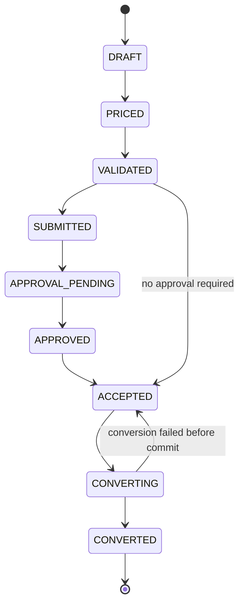
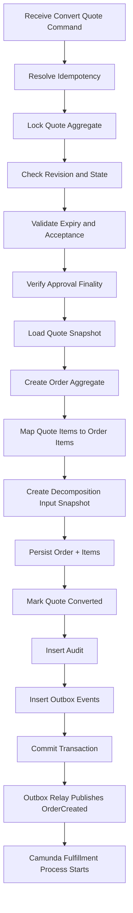
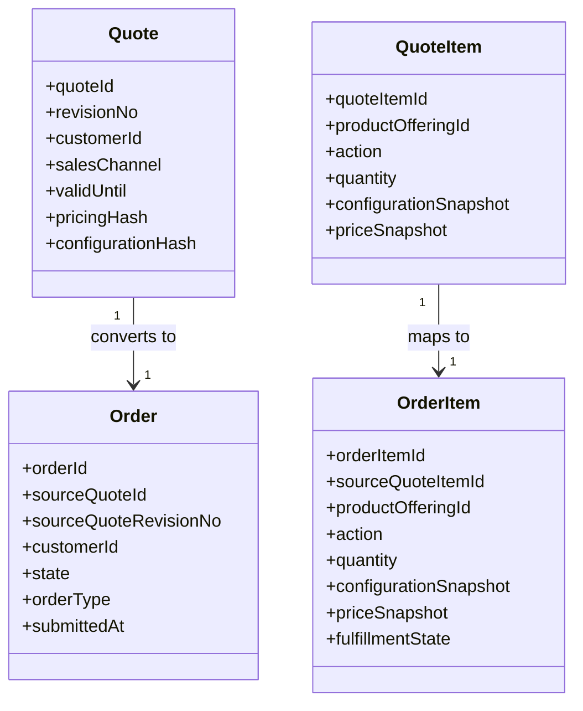
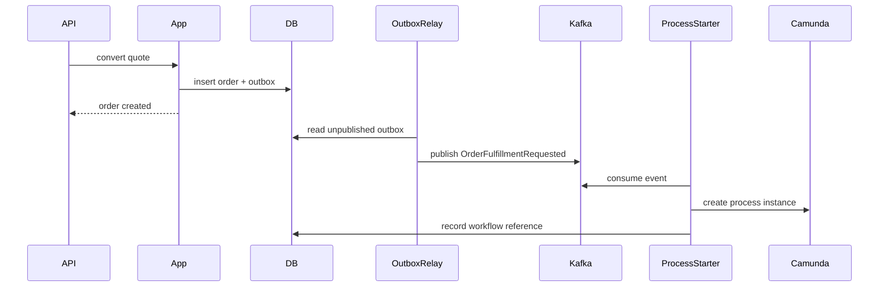

------
title: Build From Scratch: Enterprise Java Microservices CPQ & Order Management Platform - Part 034
description: Mendesain dan mengimplementasikan quote-to-order conversion pipeline production-grade: immutable quote snapshot, approval freeze, idempotent conversion, order aggregate creation, item mapping, decomposition input, outbox event, transaction boundary, audit, and failure recovery.
series: learn-enterprise-cpq-oms-glassfish-camunda8
seriesTitle: Build From Scratch: Enterprise Java Microservices CPQ & Order Management Platform
order: 34
partTitle: Quote to Order Conversion
tags:
  - java
  - microservices
  - cpq
  - oms
  - quote-to-order
  - order-management
  - postgresql
  - mybatis
  - camunda-8
  - kafka
  - transactional-outbox
  - enterprise-architecture
date: 2026-07-02
---

# Part 034 — Quote to Order Conversion

Quote-to-order conversion adalah titik di mana CPQ berhenti menjadi proposal komersial dan OMS mulai menjadi mesin eksekusi.

Banyak sistem gagal di sini karena memperlakukan conversion sebagai copy data:

```text
INSERT INTO orders SELECT * FROM quotes
```

Itu salah.

Quote dan order punya makna berbeda.

Quote adalah **commercial promise**.

Order adalah **execution commitment**.

Quote menjawab:

> Apa yang kita tawarkan kepada customer, dengan konfigurasi, harga, terms, dan approval tertentu?

Order menjawab:

> Apa yang sekarang wajib dieksekusi, dipenuhi, dipantau, dan dipertanggungjawabkan sampai selesai?

Conversion bukan copy. Conversion adalah **boundary crossing**.

Di boundary ini, sistem harus:

1. memastikan quote masih valid,
2. memastikan quote revision tepat,
3. memastikan pricing/configuration snapshot final,
4. memastikan approval sudah selesai jika diperlukan,
5. membuat order aggregate baru,
6. menjaga traceability dari order item ke quote item,
7. membuat decomposition input,
8. menulis audit,
9. menulis outbox event,
10. menjamin idempotency,
11. tidak mengeksekusi side effect eksternal sebelum commit.

---

## 1. Mental Model

Quote-to-order conversion adalah command:

```text
ConvertAcceptedQuoteToOrder
```

Input-nya bukan seluruh quote payload dari client. Client tidak boleh mengirim ulang quote content saat conversion.

Client cukup mengirim:

```json
{
  "idempotencyKey": "convert-q-1001-r3",
  "expectedQuoteRevisionNo": 3,
  "expectedQuoteState": "ACCEPTED",
  "requestedOrderExternalRef": "crm-opportunity-987",
  "customerAcceptanceRef": "signed-doc-555"
}
```

Server harus membaca quote final dari source of truth.

Kenapa?

Karena quote yang dikirim ulang oleh client bisa stale, incomplete, atau dimanipulasi.

---

## 2. Conversion Is a One-Way Gate

Setelah quote dikonversi, quote tidak boleh diam-diam diedit.

State transition:



`CONVERTING` bisa menjadi transient application state atau durable state.

Untuk sistem sederhana, conversion dilakukan dalam satu transaction:

- lock quote,
- validate,
- insert order,
- insert order items,
- update quote to `CONVERTED`,
- insert audit/outbox,
- commit.

Dalam pola ini, `CONVERTING` tidak perlu terlihat lama.

Untuk sistem dengan conversion besar/async, `CONVERTING` bisa durable. Namun itu menambah recovery logic.

Untuk seri ini, kita mulai dengan synchronous local transaction dan outbox after commit untuk memulai orchestration.

---

## 3. Conversion Preconditions

Conversion hanya boleh terjadi jika semua precondition terpenuhi.

| Precondition | Reason |
|---|---|
| Quote exists | Command target valid |
| Tenant matches | Data isolation |
| Quote revision matches expected revision | Prevent stale conversion |
| Quote state is `ACCEPTED` | Customer has accepted commercial promise |
| Quote not expired | Promise still valid |
| Quote not already converted | Prevent duplicate order |
| Configuration snapshot valid | Avoid executing invalid product |
| Pricing snapshot valid | Avoid executing unpriced quote |
| Approval complete if required | Avoid bypassing governance |
| Customer/account valid enough | Avoid orphan order |
| Required acceptance evidence exists | Audit/legal requirement |
| No blocking hold | Fraud/credit/compliance hold |

Precondition failure harus menghasilkan error yang spesifik.

Jangan hanya return:

```text
400 Bad Request
```

Return problem detail seperti:

```json
{
  "type": "https://errors.example.com/quote/not-convertible",
  "title": "Quote cannot be converted",
  "status": 409,
  "code": "QUOTE_NOT_CONVERTIBLE",
  "detail": "Quote q-1001 revision 3 is APPROVAL_PENDING, expected ACCEPTED.",
  "correlationId": "corr-123"
}
```

---

## 4. Conversion Pipeline



Important boundary:

> Camunda process start should happen after commit, usually through outbox relay or reliable process starter.

Jangan start Camunda process di tengah database transaction lalu transaction gagal. Nanti process berjalan untuk order yang tidak ada.

---

## 5. Order Creation Is Not Fulfillment

Conversion menghasilkan order. Conversion tidak langsung provisioning.

Benar:

```text
Quote accepted -> Order created -> Order fulfillment process requested
```

Salah:

```text
Quote accepted -> Order created -> Provision external service inside same transaction
```

Kenapa?

External provisioning tidak bisa rollback bersama PostgreSQL transaction. Jika provisioning sukses tapi database rollback, sistem kehilangan truth. Jika database commit tapi provisioning gagal, sistem butuh retry/fallout. Keduanya harus dimodelkan eksplisit.

Karena itu conversion hanya membuat:

- order header,
- order items,
- fulfillment intent/decomposition input,
- audit,
- outbox event.

Fulfillment dimulai setelah commit.

---

## 6. Mapping Quote to Order

Mapping harus explicit.

Jangan gunakan generic object copier.



Header mapping:

| Quote Field | Order Field | Note |
|---|---|---|
| `quote_id` | `source_quote_id` | Traceability |
| `revision_no` | `source_quote_revision_no` | Approval/evidence link |
| `customer_id` | `customer_id` | Same customer, unless policy supports reseller/agent split |
| `sales_channel` | `sales_channel` | For reporting and routing |
| `currency` | `currency` | Order financial context |
| `accepted_at` | `order_submitted_at` or `customer_accepted_at` | Do not lose acceptance timestamp |
| `pricing_hash` | `source_pricing_hash` | Integrity check |
| `configuration_hash` | `source_configuration_hash` | Integrity check |

Item mapping:

| Quote Item Field | Order Item Field | Note |
|---|---|---|
| `quote_item_id` | `source_quote_item_id` | Traceability |
| `product_offering_id` | `product_offering_id` | Commercial item |
| `product_specification_id` | `product_specification_id` | Product structure |
| `action` | `action` | ADD/MODIFY/DISCONNECT/MOVE |
| `quantity` | `quantity` | Fulfillment-relevant |
| `configuration_snapshot_json` | `configuration_snapshot_json` | Frozen |
| `price_snapshot_json` | `price_snapshot_json` | Frozen |
| `target_asset_id` | `target_asset_id` | Required for modify/disconnect |
| `parent_quote_item_id` | `parent_order_item_id` | Preserve hierarchy |

---

## 7. Action Semantics

Order item action determines downstream fulfillment.

| Action | Meaning | Required Context |
|---|---|---|
| `ADD` | New product/service | Product configuration |
| `MODIFY` | Change existing asset/subscription | Target asset ID + delta |
| `DISCONNECT` | Terminate existing asset/subscription | Target asset ID + effective date |
| `MOVE` | Move service/location | Existing asset + old/new location |
| `SUSPEND` | Temporarily suspend service | Asset/subscription ID + reason |
| `RESUME` | Resume suspended service | Asset/subscription ID |

Do not treat all order items as `ADD`.

Enterprise OMS becomes fragile when modify/disconnect flows are bolted on later.

---

## 8. Immutable Snapshots

Order must not depend on mutable quote rows for execution.

Store snapshots in order:

- product offering snapshot,
- configuration snapshot,
- price snapshot,
- customer acceptance snapshot,
- approval reference snapshot,
- quote revision reference.

Why duplicate data?

Because order must execute what was accepted, not whatever the current catalog/quote says later.

This is controlled duplication.

Bad duplication is uncontrolled redundant state.

Good duplication is immutable evidence at a lifecycle boundary.

---

## 9. PostgreSQL Schema

Minimal tables:

```sql
CREATE TABLE customer_order (
    order_id                     UUID PRIMARY KEY,
    tenant_id                    TEXT NOT NULL,
    order_number                 TEXT NOT NULL,
    customer_id                  UUID NOT NULL,
    source_quote_id              UUID NOT NULL,
    source_quote_revision_no     INTEGER NOT NULL,
    source_approval_case_id      UUID,
    state                        TEXT NOT NULL,
    order_type                   TEXT NOT NULL,
    sales_channel                TEXT NOT NULL,
    currency                     TEXT NOT NULL,
    customer_accepted_at         TIMESTAMPTZ NOT NULL,
    submitted_at                 TIMESTAMPTZ NOT NULL,
    source_pricing_hash          TEXT NOT NULL,
    source_configuration_hash    TEXT NOT NULL,
    acceptance_evidence_json     JSONB NOT NULL,
    row_version                  BIGINT NOT NULL DEFAULT 0,
    created_at                   TIMESTAMPTZ NOT NULL,
    UNIQUE (tenant_id, order_number),
    UNIQUE (tenant_id, source_quote_id, source_quote_revision_no)
);

CREATE TABLE customer_order_item (
    order_item_id                UUID PRIMARY KEY,
    tenant_id                    TEXT NOT NULL,
    order_id                     UUID NOT NULL REFERENCES customer_order(order_id),
    source_quote_item_id         UUID NOT NULL,
    parent_order_item_id         UUID,
    product_offering_id          UUID NOT NULL,
    product_specification_id     UUID NOT NULL,
    action_type                  TEXT NOT NULL,
    quantity                     NUMERIC(18, 6) NOT NULL,
    target_asset_id              UUID,
    state                        TEXT NOT NULL,
    fulfillment_state            TEXT NOT NULL,
    configuration_snapshot_json  JSONB NOT NULL,
    price_snapshot_json          JSONB NOT NULL,
    decomposition_input_json     JSONB,
    row_version                  BIGINT NOT NULL DEFAULT 0,
    created_at                   TIMESTAMPTZ NOT NULL,
    UNIQUE (tenant_id, order_id, source_quote_item_id)
);

CREATE TABLE quote_conversion_record (
    conversion_id                UUID PRIMARY KEY,
    tenant_id                    TEXT NOT NULL,
    quote_id                     UUID NOT NULL,
    quote_revision_no            INTEGER NOT NULL,
    order_id                     UUID NOT NULL,
    idempotency_key              TEXT NOT NULL,
    request_hash                 TEXT NOT NULL,
    state                        TEXT NOT NULL,
    created_by                   TEXT NOT NULL,
    created_at                   TIMESTAMPTZ NOT NULL,
    UNIQUE (tenant_id, quote_id, quote_revision_no),
    UNIQUE (tenant_id, idempotency_key)
);
```

Key constraints:

```text
UNIQUE (tenant_id, source_quote_id, source_quote_revision_no)
```

This prevents duplicate order creation for the same quote revision.

Idempotency table can also be used globally, but conversion record gives domain-specific trace.

---

## 10. MyBatis Mapper Direction

```java
public interface QuoteConversionMapper {
    QuoteAggregateRow selectQuoteForConversionUpdate(
        @Param("tenantId") String tenantId,
        @Param("quoteId") UUID quoteId
    );

    int insertOrder(CustomerOrderRow row);

    int insertOrderItem(CustomerOrderItemRow row);

    int markQuoteConverted(
        @Param("tenantId") String tenantId,
        @Param("quoteId") UUID quoteId,
        @Param("expectedRevisionNo") int expectedRevisionNo,
        @Param("expectedRowVersion") long expectedRowVersion,
        @Param("orderId") UUID orderId
    );

    int insertConversionRecord(QuoteConversionRecordRow row);

    QuoteConversionRecordRow selectConversionByIdempotencyKey(
        @Param("tenantId") String tenantId,
        @Param("idempotencyKey") String idempotencyKey
    );
}
```

`selectQuoteForConversionUpdate` should lock quote header and load items/snapshots needed for conversion.

Example:

```sql
SELECT *
FROM quote
WHERE tenant_id = #{tenantId}
  AND quote_id = #{quoteId}
FOR UPDATE
```

Child quote items may not need `FOR UPDATE` if quote header lock is the aggregate lock and child mutation always requires header lock. Be consistent.

---

## 11. Application Service Pseudocode

```java
public ConvertQuoteResult convertQuote(ConvertQuoteCommand command) {
    return unitOfWork.required(() -> {
        IdempotencyRecord existing = idempotency.find(command.tenantId(), command.idempotencyKey());
        if (existing != null) {
            return replayOrRejectIfRequestHashMismatch(existing, command);
        }

        Quote quote = quoteRepository.loadForConversion(command.tenantId(), command.quoteId());

        quote.assertRevision(command.expectedQuoteRevisionNo());
        quote.assertState(QuoteState.ACCEPTED);
        quote.assertNotExpired(clock.now());
        quote.assertApprovalFinalIfRequired();
        quote.assertHasValidSnapshots();
        quote.assertNotConverted();

        Order order = orderFactory.fromAcceptedQuote(
            quote,
            command.customerAcceptanceRef(),
            command.requestedOrderExternalRef(),
            clock.now()
        );

        order.assertValidForInitialPersistence();

        orderRepository.insert(order);
        quote.markConverted(order.orderId(), clock.now());
        quoteRepository.updateConversionState(quote);

        conversionRepository.insertRecord(
            QuoteConversionRecord.completed(
                command,
                quote.quoteId(),
                quote.revisionNo(),
                order.orderId()
            )
        );

        auditRepository.insert(AuditRecord.quoteConverted(quote, order, command.actor()));
        outboxRepository.insert(OrderEvents.orderCreated(order));
        outboxRepository.insert(QuoteEvents.quoteConverted(quote, order));

        idempotency.storeSuccess(command, ConvertQuoteResult.from(order));

        return ConvertQuoteResult.from(order);
    });
}
```

Notice the absence of:

- Camunda API call,
- Kafka direct publish,
- external provisioning call,
- billing call,
- notification call.

All of those happen after commit through event/outbox-driven flow.

---

## 12. Idempotency Strategy

Conversion must be idempotent.

Possible duplicate sources:

- user double-click,
- browser retry,
- API gateway retry,
- CRM retry,
- timeout after commit,
- outbox relay replay,
- service crash after DB commit before response.

Use two guards:

1. `idempotency_key` + request hash,
2. unique constraint on `(tenant_id, quote_id, quote_revision_no)`.

If same key and same hash:

```text
return original order result
```

If same key but different hash:

```text
409 IDEMPOTENCY_KEY_REUSED_WITH_DIFFERENT_REQUEST
```

If different key but same quote revision already converted:

```text
409 QUOTE_ALREADY_CONVERTED
include existing order reference if caller is authorized
```

This distinction matters operationally.

---

## 13. Decomposition Input

Conversion should produce enough data for order decomposition, but not necessarily perform decomposition immediately.

For each order item:

```json
{
  "orderItemId": "oi-1001-1",
  "actionType": "ADD",
  "productOfferingId": "po-internet-enterprise-1g",
  "productSpecificationId": "ps-connectivity-internet",
  "configuration": {
    "bandwidth": "1Gbps",
    "accessType": "FIBER",
    "sla": "PREMIUM"
  },
  "customerContext": {
    "customerId": "cust-77",
    "siteId": "site-99"
  },
  "commercialContext": {
    "sourceQuoteId": "q-1001",
    "sourceQuoteItemId": "qi-1"
  }
}
```

Order decomposition engine will later map this into fulfillment tasks.

Do not put decomposition logic inside quote conversion unless the decomposition is purely deterministic, local, and cheap. Even then, store it as planned output, not as external execution.

---

## 14. API Shape

There are two common API styles.

### Style A — Command Under Quote

```http
POST /api/v1/quotes/{quoteId}/convert-to-order
```

Pros:

- explicit business action,
- easy for CPQ UI,
- natural for quote lifecycle.

Cons:

- order creation appears under quote resource.

### Style B — Create Order From Quote

```http
POST /api/v1/orders
```

Request:

```json
{
  "sourceType": "QUOTE",
  "sourceQuoteId": "q-1001",
  "sourceQuoteRevisionNo": 3,
  "customerAcceptanceRef": "signed-doc-555"
}
```

Pros:

- order API owns order creation,
- natural for OMS boundary.

Cons:

- CPQ lifecycle transition less obvious.

For this series, choose Style A internally while still returning an order resource link:

```json
{
  "orderId": "ord-9001",
  "orderNumber": "ORD-2026-000001",
  "sourceQuoteId": "q-1001",
  "sourceQuoteRevisionNo": 3,
  "state": "ACKNOWLEDGED",
  "links": {
    "order": "/api/v1/orders/ord-9001",
    "quote": "/api/v1/quotes/q-1001"
  }
}
```

If exposing TM Forum-style APIs externally, map this through an anti-corruption facade.

---

## 15. Outbox Events

Conversion emits at least:

```text
QuoteConvertedToOrder
OrderCreated
OrderFulfillmentRequested
```

Some teams only emit `OrderCreated`. That can be enough if consumers understand it.

But separating events can improve semantic clarity:

- `QuoteConvertedToOrder`: CPQ lifecycle event,
- `OrderCreated`: OMS aggregate event,
- `OrderFulfillmentRequested`: orchestration trigger.

Example:

```json
{
  "eventId": "evt-ord-001",
  "eventType": "OrderCreated",
  "eventVersion": 1,
  "tenantId": "telco-id",
  "aggregateType": "Order",
  "aggregateId": "ord-9001",
  "occurredAt": "2026-07-02T11:00:00Z",
  "correlationId": "corr-123",
  "causationId": "cmd-convert-q-1001-r3",
  "payload": {
    "orderId": "ord-9001",
    "orderNumber": "ORD-2026-000001",
    "sourceQuoteId": "q-1001",
    "sourceQuoteRevisionNo": 3,
    "customerId": "cust-77",
    "state": "ACKNOWLEDGED"
  }
}
```

Outbox row must be inserted in the same transaction as order creation.

---

## 16. Camunda 8 Start Boundary

Order fulfillment process should start after order commit.

Pattern:



The process starter must be idempotent. If it receives the same `OrderFulfillmentRequested` twice, it should not start two fulfillment processes for the same order.

Store workflow reference:

```sql
CREATE TABLE order_workflow_reference (
    order_id              UUID PRIMARY KEY,
    tenant_id             TEXT NOT NULL,
    process_definition_id TEXT NOT NULL,
    process_instance_key  TEXT NOT NULL,
    started_at            TIMESTAMPTZ NOT NULL,
    UNIQUE (tenant_id, process_instance_key)
);
```

---

## 17. Audit Model

Conversion audit must capture:

- actor,
- command id,
- idempotency key,
- quote id,
- quote revision,
- order id,
- order number,
- quote state before/after,
- acceptance evidence reference,
- approval case reference,
- pricing hash,
- configuration hash,
- timestamp,
- correlation id.

Audit text example:

```text
Quote q-1001 revision 3 was converted to order ORD-2026-000001 by user u-sales-77 using acceptance evidence signed-doc-555. Source pricing hash ph-abc and configuration hash ch-def were frozen into the order.
```

Audit should not depend on joining mutable quote/order state later. Store enough context in audit payload.

---

## 18. Failure Modes

| Failure | Correct Handling |
|---|---|
| Quote already converted | Return existing order if same idempotent command, else conflict |
| Quote expired | Reject conversion with `QUOTE_EXPIRED` |
| Quote revision mismatch | Reject with stale command error |
| Approval pending | Reject with `APPROVAL_NOT_FINAL` |
| Missing acceptance evidence | Reject with `ACCEPTANCE_EVIDENCE_REQUIRED` |
| DB commit succeeds but HTTP response times out | Retry returns same order via idempotency |
| Outbox publish fails | Outbox relay retries |
| Kafka event duplicated | Process starter dedupes by order ID |
| Camunda process start fails | Process starter retries or creates incident/fallout record |
| Product catalog changed after quote accepted | Order uses frozen quote snapshot |
| Price list changed after quote accepted | Order uses frozen price snapshot |
| Customer data changed after quote accepted | Order keeps acceptance-time customer context and may later sync separate updates |

---

## 19. Testing Strategy

Minimum tests:

1. accepted quote converts to order,
2. unaccepted quote cannot convert,
3. expired quote cannot convert,
4. stale revision cannot convert,
5. approval pending quote cannot convert,
6. approved and accepted quote can convert,
7. no-approval quote can convert after accepted,
8. duplicate idempotency key returns same order,
9. reused idempotency key with different body fails,
10. different idempotency key for already converted quote conflicts,
11. order item preserves quote item traceability,
12. price snapshot is copied exactly,
13. configuration snapshot is copied exactly,
14. quote becomes `CONVERTED`,
15. outbox contains `OrderCreated`,
16. outbox contains `QuoteConvertedToOrder`,
17. database rollback prevents partial order,
18. Camunda process is not started before DB commit,
19. process starter dedupes duplicate event,
20. audit payload contains quote revision and order id.

---

## 20. Production Readiness Checklist

Before calling conversion production-ready, answer these questions:

- Can the same accepted quote create two orders?
- Can a stale browser tab convert an old quote revision?
- Can a quote be revised after approval but before conversion?
- Can price/catalog changes alter the order after conversion?
- Can provisioning start for an order that failed to commit?
- Can a timeout create user-visible uncertainty?
- Can support see whether conversion succeeded after client timeout?
- Can audit prove exactly what was accepted?
- Can reconciliation detect order without workflow process?
- Can process starter recover from Camunda outage?

If any answer is unclear, conversion is not ready.

---

## 21. Build Milestone

Implement in this order:

1. `ConvertQuoteCommand`.
2. Conversion precondition checks.
3. Quote aggregate conversion method.
4. Order factory from accepted quote.
5. Order/order item PostgreSQL tables.
6. Conversion record table.
7. MyBatis insert mappers.
8. Quote update mapper.
9. Idempotency integration.
10. Audit insert.
11. Outbox insert.
12. API endpoint.
13. Contract tests.
14. Integration test with rollback.
15. Outbox relay test.
16. Process starter idempotency.

Do not implement provisioning until conversion is stable.

---

## 22. What You Should Internalize

Quote-to-order conversion is not a mapper problem.

It is a lifecycle boundary.

The system is moving from:

```text
commercial negotiation
```

to:

```text
operational obligation
```

At this point, ambiguity becomes expensive. Every weak detail becomes a future incident:

- unclear revision,
- mutable price,
- missing approval evidence,
- duplicate order,
- premature provisioning,
- untraceable order item,
- unrecoverable timeout.

A production-grade conversion pipeline freezes the accepted promise, creates a new execution aggregate, preserves traceability, emits reliable events, and leaves fulfillment to a recoverable orchestration path.

That is the line between CPQ and OMS.

---

## References

- TM Forum TMF648 Quote Management API: https://www.tmforum.org/open-digital-architecture/open-apis/quote-management-api-TMF648/v4.0
- TM Forum TMF622 Product Ordering API: https://www.tmforum.org/resources/specifications/tmf622-product-ordering-management-api-user-guide-v5-0-0/
- Camunda 8 Docs — Job workers: https://docs.camunda.io/docs/components/concepts/job-workers/
- Camunda 8 Docs — Incidents: https://docs.camunda.io/docs/components/concepts/incidents/
- PostgreSQL Documentation — Transaction Isolation: https://www.postgresql.org/docs/current/transaction-iso.html
