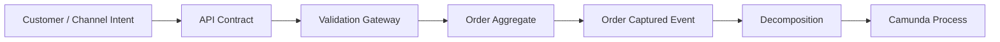
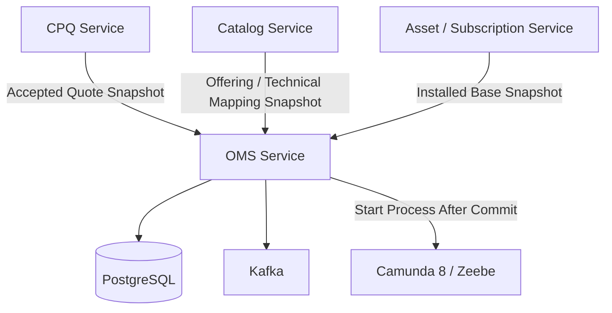
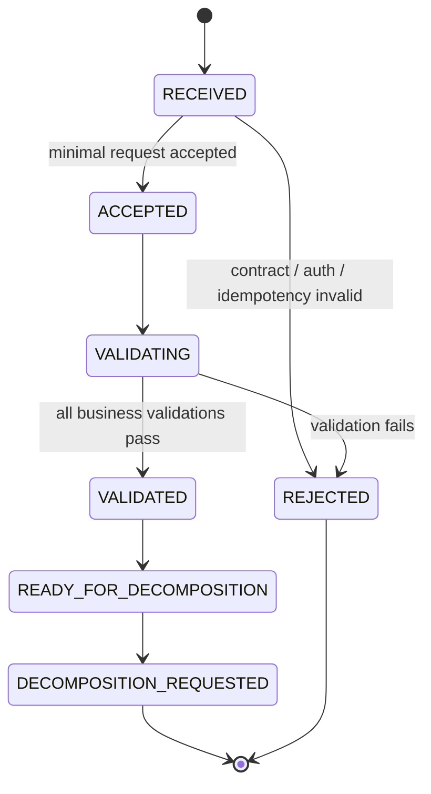
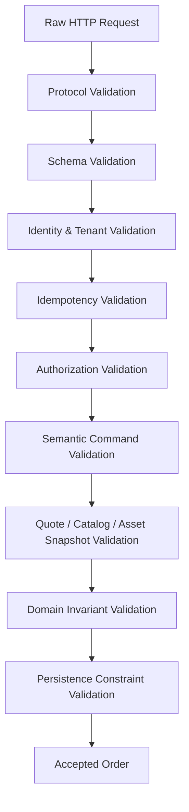
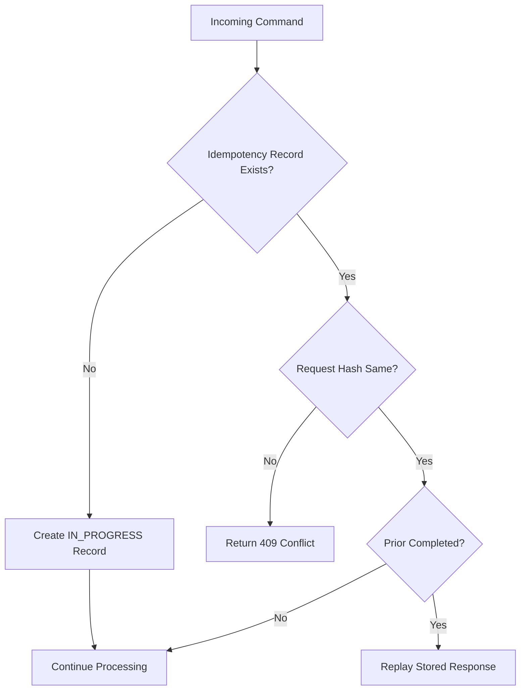
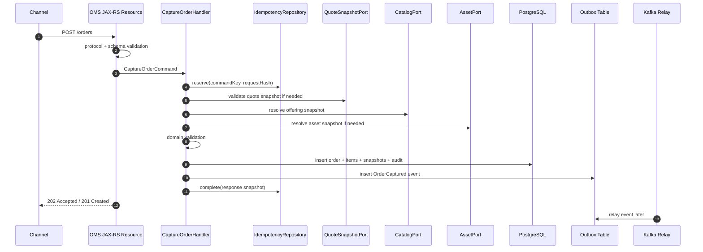
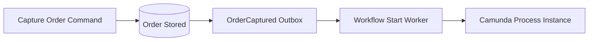

------
title: Build From Scratch: Enterprise Java Microservices CPQ & Order Management Platform - Part 035
description: Mendesain dan mengimplementasikan order capture serta validation gateway untuk enterprise OMS: direct order, quote-derived order, amendment, cancellation, idempotency, validation pipeline, source-of-truth persistence, outbox event, dan Camunda boundary.
series: learn-enterprise-cpq-oms-glassfish-camunda8
seriesTitle: Build From Scratch: Enterprise Java Microservices CPQ & Order Management Platform
order: 35
partTitle: Order Capture and Validation
tags:
  - java
  - microservices
  - cpq
  - oms
  - order-capture
  - validation
  - jax-rs
  - jersey
  - glassfish
  - postgresql
  - mybatis
  - camunda-8
  - kafka
  - redis
  - enterprise-architecture
date: 2026-07-02
---

# Part 035 — Order Capture and Validation

Di part sebelumnya kita sudah membangun jalan dari **quote** menuju **order**. Sekarang kita masuk ke gerbang OMS yang lebih luas: **order capture**.

Order capture bukan sekadar endpoint `POST /orders`.

Order capture adalah momen ketika sistem menerima niat bisnis dari channel, memverifikasi apakah niat itu boleh dieksekusi, membuat **execution commitment**, lalu menyiapkan order agar bisa masuk ke orchestration/decomposition/fulfillment.

Di enterprise OMS, kesalahan desain order capture biasanya mahal karena efeknya menyebar ke:

- fulfillment task yang salah,
- provisioning yang salah,
- billing trigger yang salah,
- asset/subscription yang salah,
- dispute customer,
- manual fallout,
- audit yang tidak defensible.

Jadi kita akan membangun order capture sebagai **validation gateway + state transition boundary + durable command processor**.

Referensi domain eksternal yang relevan adalah TM Forum TMF622 Product Ordering Management API. TMF622 menjelaskan product ordering sebagai mekanisme standar untuk menempatkan product order dengan parameter yang diperlukan, dan product order dibuat berdasarkan product offering yang didefinisikan di catalog. Kita memakai vocabulary ini sebagai inspirasi, bukan sebagai model internal yang disalin mentah-mentah.

---

## 1. Mental Model

Order capture adalah proses mengubah **customer/commercial intent** menjadi **controlled executable order**.



Perhatikan urutannya.

Kita tidak langsung memulai workflow begitu request datang.

Request harus melewati validation dan durable persistence dulu. Workflow boleh dimulai hanya setelah order valid, tersimpan, dan punya identitas yang stabil.

> Rule: **Never orchestrate a promise that has not been durably accepted.**

---

## 2. Order Capture Bukan Quote Conversion Saja

Quote-to-order hanya salah satu sumber order.

Dalam enterprise system, order bisa berasal dari beberapa path:

| Capture Path | Contoh | Risiko Utama |
|---|---|---|
| Quote-derived order | Customer accept quote lalu convert ke order | Quote revision stale, price snapshot tidak valid, approval expired |
| Direct order | Channel membuat order tanpa quote formal | Validation harus lebih berat karena tidak ada quote evidence |
| Amendment order | Customer modify existing asset/subscription | Asset snapshot stale, dependency impact tidak terlihat |
| Cancellation order | Cancel order yang belum selesai atau terminate subscription | Partial fulfillment, compensation, refund, legal constraint |
| Supplemental order | Tambahan terhadap order berjalan | Dependency ke order parent, sequencing rumit |
| Migration/back-office order | Manual/admin import dari legacy | Data quality rendah, audit harus eksplisit |

Kita akan mendesain capture gateway yang bisa menerima semua path ini tanpa mencampur semantics.

---

## 3. Boundary Decision

Order capture berada di **OMS service**, bukan CPQ service.

CPQ bertanggung jawab atas:

- configuration,
- pricing,
- quote,
- approval signal,
- commercial snapshot.

OMS bertanggung jawab atas:

- order acceptance,
- order validation,
- order lifecycle,
- decomposition,
- fulfillment orchestration,
- cancellation/amendment,
- fallout,
- installed base impact.



OMS boleh membaca snapshot dari CPQ/catalog/asset, tetapi setelah order accepted, OMS harus punya snapshot sendiri untuk execution traceability.

---

## 4. What Must Be True Before an Order Is Accepted

Order boleh diterima jika seluruh kondisi minimal ini terpenuhi:

1. Request contract valid.
2. Caller authenticated.
3. Caller authorized untuk customer/account/tenant tersebut.
4. Idempotency key valid.
5. Customer/account context valid.
6. Product offering snapshot tersedia dan masih acceptable untuk order context.
7. Configuration snapshot valid untuk product offering.
8. Price snapshot valid atau price revalidation berhasil.
9. Quote approval evidence valid jika order berasal dari quote.
10. Action type valid: `ADD`, `MODIFY`, `DISCONNECT`, `MOVE`, `CANCEL`, atau `SUSPEND/RESUME` jika didukung.
11. Installed base snapshot valid untuk action yang menyentuh existing asset.
12. Order dependencies dapat dibentuk.
13. Required fulfillment metadata tersedia.
14. Tidak ada duplicate order untuk business command yang sama.
15. Order dapat disimpan secara atomik bersama audit/outbox.

Jika salah satu tidak terpenuhi, order tidak boleh masuk ke state `ACKNOWLEDGED` atau `VALIDATED`.

---

## 5. Order Capture State Machine

Kita pisahkan **capture state** dari **fulfillment state**.

Capture state menjawab: order ini sudah diterima dan valid belum?

Fulfillment state menjawab: order ini sudah dieksekusi sampai mana?



Dalam implementasi sederhana, `RECEIVED` bisa tidak disimpan jika request gagal di filter/API boundary. Namun untuk enterprise audit tertentu, kita bisa menyimpan rejected command log secara terpisah.

---

## 6. Order Capture Input Model

Jangan menerima payload order bebas yang terlalu dekat dengan database.

Gunakan command model.

```json
{
  "externalOrderRef": "WEB-2026-00001822",
  "captureMode": "QUOTE_DERIVED",
  "quoteRef": {
    "quoteId": "q-01JZ...",
    "quoteRevision": 4,
    "acceptedAt": "2026-07-02T03:40:00Z"
  },
  "customerRef": {
    "customerId": "cust-1001",
    "accountId": "acct-2001"
  },
  "requestedCompletionDate": "2026-07-20",
  "items": [
    {
      "clientItemRef": "line-1",
      "action": "ADD",
      "productOfferingId": "po-fiber-1gbps",
      "configuration": {
        "selectedOptions": [
          { "optionId": "router-premium", "quantity": 1 }
        ]
      },
      "targetAssetId": null
    }
  ]
}
```

Key points:

- `externalOrderRef` adalah referensi channel, bukan primary key internal.
- `captureMode` menentukan validation path.
- `quoteRef` wajib untuk quote-derived order.
- `items[].action` menentukan semantics order item.
- `targetAssetId` wajib untuk action yang mengubah installed base.
- `clientItemRef` membantu idempotency dan error reporting.

---

## 7. Capture Mode

```java
public enum CaptureMode {
    QUOTE_DERIVED,
    DIRECT_ORDER,
    AMENDMENT,
    CANCELLATION,
    SUPPLEMENTAL,
    ADMIN_MIGRATION
}
```

Setiap mode punya validation profile berbeda.

| Capture Mode | Quote Required | Installed Base Required | Price Required | Approval Required |
|---|---:|---:|---:|---:|
| `QUOTE_DERIVED` | Yes | Maybe | Snapshot from quote | If approval signal exists |
| `DIRECT_ORDER` | No | Maybe | Reprice or provided snapshot | Based on policy |
| `AMENDMENT` | Maybe | Yes | Delta price | Based on policy |
| `CANCELLATION` | No | Usually yes | Penalty/credit maybe | Based on policy/legal |
| `SUPPLEMENTAL` | Maybe | Maybe | Delta price | Based on parent order |
| `ADMIN_MIGRATION` | No | Maybe | Maybe | Manual evidence required |

Rule penting:

> Do not use `captureMode` as a UI label. Use it as validation behavior selector.

---

## 8. Validation Pipeline

Validation harus layered.

Jangan menaruh semua logic di satu `validateOrder()` method.



### 8.1 Protocol validation

Validasi di level HTTP:

- method benar,
- content type benar,
- required headers ada,
- request size masuk batas,
- correlation ID tersedia atau dibuat,
- idempotency key wajib untuk mutation command.

### 8.2 Schema validation

Validasi bentuk payload:

- required fields,
- enum values,
- string length,
- timestamp format,
- array cardinality,
- nested object shape.

Ini bisa memakai JSON Schema/OpenAPI-generated validation.

Schema validation belum menjawab apakah product offering benar-benar bisa dibeli customer tersebut.

### 8.3 Identity and tenant validation

Pastikan:

- token valid,
- tenant resolved,
- tenant cocok dengan customer/account,
- service client punya scope yang benar,
- request tidak bisa memaksa `tenantId` berbeda dari token.

### 8.4 Idempotency validation

Untuk command capture order, idempotency wajib.

Combination yang umum:

```text
tenant_id + command_type + idempotency_key
```

Request hash harus disimpan.

Jika idempotency key sama tetapi payload berbeda, return conflict.



### 8.5 Authorization validation

Authorization bukan hanya role.

Contoh rule:

- Sales agent boleh create order untuk account yang berada di assigned sales region.
- Partner channel hanya boleh order product tertentu.
- Back-office user boleh migration order hanya dengan reason code.
- Service client `cpq-service` boleh convert quote, tetapi tidak boleh cancel subscription langsung.

### 8.6 Semantic validation

Contoh:

- `QUOTE_DERIVED` wajib punya `quoteRef`.
- `DIRECT_ORDER` wajib punya full item detail.
- `MODIFY` wajib punya `targetAssetId`.
- `DISCONNECT` tidak boleh punya add-on baru kecuali explicit bundle transition.
- requested completion date tidak boleh sebelum hari ini, kecuali admin override.
- duplicate `clientItemRef` dalam order tidak boleh.

### 8.7 Snapshot validation

Snapshot validation memastikan order tidak dibangun dari fakta yang stale.

Untuk quote-derived order:

- quote exists,
- quote state accepted,
- quote revision cocok,
- quote belum expired,
- quote belum dikonversi,
- quote customer/account cocok,
- approval evidence masih valid,
- price hash cocok,
- configuration hash cocok.

Untuk direct order:

- offering masih orderable,
- channel eligible,
- configuration valid,
- price dapat dihitung,
- policy approval signal dihitung.

Untuk amendment:

- target asset exists,
- target asset milik customer/account,
- asset state memungkinkan action,
- subscription state memungkinkan action,
- dependency asset tidak dilanggar.

### 8.8 Domain invariant validation

Invariant yang harus ditegakkan di domain layer:

- Order minimal punya satu item.
- Semua item punya action yang valid.
- Semua item punya product offering snapshot atau target asset snapshot sesuai action.
- Parent/child item dependency tidak cycle.
- Price total tidak negatif kecuali order type memang credit/refund.
- Cancellation terhadap completed order tidak boleh langsung; harus membuat compensation/amendment order.
- Quote-derived order tidak boleh mengubah commercial snapshot diam-diam.

### 8.9 Persistence constraint validation

Database adalah guard terakhir.

Contoh constraint:

- unique idempotency key,
- unique quote conversion,
- foreign key ke tenant/customer/account reference jika managed locally,
- check constraint untuk enum state,
- not null untuk state penting,
- unique `tenant_id + external_order_ref` jika external ref dijamin unik per tenant/channel.

PostgreSQL constraints penting sebagai safety net karena application code bisa berubah, worker bisa retry, dan duplicate request bisa muncul dalam race condition.

---

## 9. Order Capture Sequence



Catatan penting:

- Kafka publish tidak dilakukan langsung di transaction handler.
- Camunda process tidak dimulai sebelum durable commit.
- Jika process start dipanggil synchronously setelah commit, kegagalan start process harus bisa diretry dari outbox/workflow-start table.

---

## 10. API Shape

### 10.1 Create order

```http
POST /api/v1/orders
Idempotency-Key: 4f946403-92a2-493a-b533-c3840a2f9d32
X-Correlation-Id: corr-20260702-001
Content-Type: application/json
```

Response untuk order capture yang memulai proses asynchronous:

```json
{
  "orderId": "ord-01JZ9YQ0A7C5FJ6RC1G4G0V2BQ",
  "state": "VALIDATED",
  "fulfillmentState": "NOT_STARTED",
  "captureMode": "QUOTE_DERIVED",
  "links": {
    "self": "/api/v1/orders/ord-01JZ9YQ0A7C5FJ6RC1G4G0V2BQ",
    "items": "/api/v1/orders/ord-01JZ9YQ0A7C5FJ6RC1G4G0V2BQ/items"
  }
}
```

### 10.2 Validate order only

Untuk UI/channel yang butuh precheck:

```http
POST /api/v1/order-validations
```

Response:

```json
{
  "valid": false,
  "violations": [
    {
      "code": "TARGET_ASSET_REQUIRED",
      "path": "items[0].targetAssetId",
      "message": "targetAssetId is required for MODIFY action",
      "severity": "ERROR"
    }
  ]
}
```

Precheck tidak menggantikan validation di actual capture.

> Rule: **Validation endpoint is advisory. Capture endpoint remains authoritative.**

---

## 11. Java Model

### 11.1 Command

```java
public record CaptureOrderCommand(
    String tenantId,
    String idempotencyKey,
    String externalOrderRef,
    CaptureMode captureMode,
    QuoteRef quoteRef,
    CustomerRef customerRef,
    LocalDate requestedCompletionDate,
    List<CaptureOrderItemCommand> items,
    String submittedBy,
    Instant submittedAt
) {}
```

### 11.2 Item command

```java
public record CaptureOrderItemCommand(
    String clientItemRef,
    OrderItemAction action,
    String productOfferingId,
    String targetAssetId,
    ProductConfigurationInput configuration,
    Integer quantity,
    Map<String, Object> characteristics
) {}
```

### 11.3 Validation result

```java
public final class ValidationResult {
    private final List<ValidationViolation> violations;

    public boolean isValid() {
        return violations.stream().noneMatch(v -> v.severity() == Severity.ERROR);
    }

    public void throwIfInvalid() {
        if (!isValid()) {
            throw new DomainValidationException(violations);
        }
    }
}
```

### 11.4 Order aggregate creation

```java
public final class Order {
    public static Order capture(CaptureOrderContext ctx) {
        var result = OrderCaptureValidator.validate(ctx);
        result.throwIfInvalid();

        return new Order(
            OrderId.newId(),
            ctx.tenantId(),
            ctx.customerRef(),
            OrderState.VALIDATED,
            FulfillmentState.NOT_STARTED,
            ctx.captureMode(),
            ctx.toOrderItems(),
            ctx.snapshots(),
            ctx.submittedBy(),
            ctx.submittedAt()
        );
    }
}
```

---

## 12. Validation Rule Design

Gunakan rule kecil yang composable.

```java
public interface OrderCaptureRule {
    void validate(CaptureOrderContext ctx, ViolationCollector collector);
}
```

Contoh rule:

```java
public final class ModifyRequiresTargetAssetRule implements OrderCaptureRule {
    @Override
    public void validate(CaptureOrderContext ctx, ViolationCollector collector) {
        for (var item : ctx.command().items()) {
            if (item.action() == OrderItemAction.MODIFY && isBlank(item.targetAssetId())) {
                collector.error(
                    "TARGET_ASSET_REQUIRED",
                    "items[%s].targetAssetId".formatted(item.clientItemRef()),
                    "targetAssetId is required for MODIFY action"
                );
            }
        }
    }
}
```

Rule registry:

```java
public final class OrderCaptureValidator {
    private final List<OrderCaptureRule> commonRules;
    private final Map<CaptureMode, List<OrderCaptureRule>> modeRules;

    public ValidationResult validate(CaptureOrderContext ctx) {
        var collector = new ViolationCollector();
        commonRules.forEach(rule -> rule.validate(ctx, collector));
        modeRules.getOrDefault(ctx.captureMode(), List.of())
            .forEach(rule -> rule.validate(ctx, collector));
        return collector.toResult();
    }
}
```

Design ini membuat validation bisa berkembang tanpa membuat satu god method.

---

## 13. PostgreSQL Schema

### 13.1 Order table

```sql
CREATE TABLE oms_order (
    order_id              text PRIMARY KEY,
    tenant_id             text NOT NULL,
    external_order_ref    text,
    capture_mode          text NOT NULL,
    order_state           text NOT NULL,
    fulfillment_state     text NOT NULL,
    customer_id           text NOT NULL,
    account_id            text NOT NULL,
    source_quote_id       text,
    source_quote_revision integer,
    requested_completion_date date,
    submitted_by          text NOT NULL,
    submitted_at          timestamptz NOT NULL,
    created_at            timestamptz NOT NULL,
    updated_at            timestamptz NOT NULL,
    row_version           bigint NOT NULL DEFAULT 0,

    CONSTRAINT chk_oms_order_capture_mode
      CHECK (capture_mode IN ('QUOTE_DERIVED','DIRECT_ORDER','AMENDMENT','CANCELLATION','SUPPLEMENTAL','ADMIN_MIGRATION')),

    CONSTRAINT chk_oms_order_state
      CHECK (order_state IN ('RECEIVED','ACCEPTED','VALIDATING','VALIDATED','REJECTED','READY_FOR_DECOMPOSITION','DECOMPOSITION_REQUESTED')),

    CONSTRAINT chk_oms_order_fulfillment_state
      CHECK (fulfillment_state IN ('NOT_STARTED','IN_PROGRESS','PARTIAL','COMPLETED','FAILED','CANCELLED'))
);

CREATE UNIQUE INDEX uq_oms_order_external_ref
ON oms_order (tenant_id, external_order_ref)
WHERE external_order_ref IS NOT NULL;

CREATE UNIQUE INDEX uq_oms_order_quote_conversion
ON oms_order (tenant_id, source_quote_id, source_quote_revision)
WHERE source_quote_id IS NOT NULL;
```

### 13.2 Order item table

```sql
CREATE TABLE oms_order_item (
    order_item_id          text PRIMARY KEY,
    order_id               text NOT NULL REFERENCES oms_order(order_id),
    tenant_id              text NOT NULL,
    client_item_ref        text NOT NULL,
    parent_order_item_id   text,
    action                 text NOT NULL,
    product_offering_id    text,
    target_asset_id        text,
    quantity               integer NOT NULL DEFAULT 1,
    item_state             text NOT NULL,
    fulfillment_state      text NOT NULL,
    config_snapshot_json   jsonb,
    price_snapshot_json    jsonb,
    offering_snapshot_json jsonb,
    asset_snapshot_json    jsonb,
    created_at             timestamptz NOT NULL,
    updated_at             timestamptz NOT NULL,
    row_version            bigint NOT NULL DEFAULT 0,

    CONSTRAINT uq_oms_order_item_client_ref UNIQUE(order_id, client_item_ref),
    CONSTRAINT chk_oms_order_item_action CHECK (action IN ('ADD','MODIFY','DISCONNECT','MOVE','CANCEL','SUSPEND','RESUME')),
    CONSTRAINT chk_oms_order_item_quantity CHECK (quantity > 0)
);

CREATE INDEX idx_oms_order_item_order ON oms_order_item(order_id);
CREATE INDEX idx_oms_order_item_target_asset ON oms_order_item(tenant_id, target_asset_id)
WHERE target_asset_id IS NOT NULL;
```

### 13.3 Capture validation audit

```sql
CREATE TABLE oms_order_capture_validation_log (
    validation_log_id text PRIMARY KEY,
    tenant_id         text NOT NULL,
    order_id          text,
    idempotency_key   text,
    result            text NOT NULL,
    violation_json    jsonb NOT NULL,
    created_at        timestamptz NOT NULL,
    created_by        text NOT NULL
);
```

Jangan simpan semua rejected payload mentah tanpa policy. Payload bisa mengandung PII, commercial data, atau credential leakage dari channel yang buruk.

---

## 14. MyBatis Mapper Direction

### 14.1 Insert order

```xml
<insert id="insertOrder" parameterType="OrderRow">
  INSERT INTO oms_order (
    order_id,
    tenant_id,
    external_order_ref,
    capture_mode,
    order_state,
    fulfillment_state,
    customer_id,
    account_id,
    source_quote_id,
    source_quote_revision,
    requested_completion_date,
    submitted_by,
    submitted_at,
    created_at,
    updated_at,
    row_version
  ) VALUES (
    #{orderId},
    #{tenantId},
    #{externalOrderRef},
    #{captureMode},
    #{orderState},
    #{fulfillmentState},
    #{customerId},
    #{accountId},
    #{sourceQuoteId},
    #{sourceQuoteRevision},
    #{requestedCompletionDate},
    #{submittedBy},
    #{submittedAt},
    #{createdAt},
    #{updatedAt},
    0
  )
</insert>
```

### 14.2 Insert item

```xml
<insert id="insertOrderItem" parameterType="OrderItemRow">
  INSERT INTO oms_order_item (
    order_item_id,
    order_id,
    tenant_id,
    client_item_ref,
    parent_order_item_id,
    action,
    product_offering_id,
    target_asset_id,
    quantity,
    item_state,
    fulfillment_state,
    config_snapshot_json,
    price_snapshot_json,
    offering_snapshot_json,
    asset_snapshot_json,
    created_at,
    updated_at,
    row_version
  ) VALUES (
    #{orderItemId},
    #{orderId},
    #{tenantId},
    #{clientItemRef},
    #{parentOrderItemId},
    #{action},
    #{productOfferingId},
    #{targetAssetId},
    #{quantity},
    #{itemState},
    #{fulfillmentState},
    #{configSnapshotJson, typeHandler=JsonbTypeHandler},
    #{priceSnapshotJson, typeHandler=JsonbTypeHandler},
    #{offeringSnapshotJson, typeHandler=JsonbTypeHandler},
    #{assetSnapshotJson, typeHandler=JsonbTypeHandler},
    #{createdAt},
    #{updatedAt},
    0
  )
</insert>
```

MyBatis tetap kita pakai secara eksplisit. Tidak ada hidden cascade.

---

## 15. Capture Handler Implementation

```java
public final class CaptureOrderHandler {
    private final IdempotencyService idempotencyService;
    private final QuoteSnapshotPort quoteSnapshotPort;
    private final CatalogSnapshotPort catalogSnapshotPort;
    private final AssetSnapshotPort assetSnapshotPort;
    private final OrderCaptureValidator validator;
    private final OrderRepository orderRepository;
    private final OutboxRepository outboxRepository;
    private final AuditRepository auditRepository;
    private final TransactionRunner tx;

    public CaptureOrderResponse handle(CaptureOrderCommand command) {
        return tx.required(() -> {
            var reservation = idempotencyService.reserveOrReplay(
                command.tenantId(),
                "CAPTURE_ORDER",
                command.idempotencyKey(),
                RequestHasher.hash(command)
            );

            if (reservation.hasReplayResponse()) {
                return reservation.replayAs(CaptureOrderResponse.class);
            }

            var context = buildContext(command);
            var validation = validator.validate(context);
            auditRepository.insertValidationLog(command, validation);
            validation.throwIfInvalid();

            var order = Order.capture(context);

            orderRepository.insert(order);
            auditRepository.insertOrderCaptured(order);
            outboxRepository.insert(OrderCapturedEvent.from(order));

            var response = CaptureOrderResponse.from(order);
            idempotencyService.complete(reservation, response);

            return response;
        });
    }

    private CaptureOrderContext buildContext(CaptureOrderCommand command) {
        var quoteSnapshot = resolveQuoteSnapshot(command);
        var offeringSnapshots = catalogSnapshotPort.resolveFor(command);
        var assetSnapshots = assetSnapshotPort.resolveFor(command);

        return new CaptureOrderContext(
            command,
            quoteSnapshot,
            offeringSnapshots,
            assetSnapshots
        );
    }
}
```

Jangan melakukan external write di dalam transaction ini.

Boleh membaca snapshot dari service lain sebelum transaction jika consistency model mengizinkan, tetapi final write order harus dilindungi oleh idempotency dan database constraints.

---

## 16. Error Model

Gunakan error deterministic.

### 16.1 Validation error

```json
{
  "type": "https://example.com/problems/order-validation-failed",
  "title": "Order validation failed",
  "status": 422,
  "code": "ORDER_VALIDATION_FAILED",
  "correlationId": "corr-20260702-001",
  "violations": [
    {
      "code": "QUOTE_REVISION_MISMATCH",
      "path": "quoteRef.quoteRevision",
      "message": "The accepted quote revision does not match the latest accepted revision",
      "severity": "ERROR"
    }
  ]
}
```

### 16.2 Idempotency conflict

```json
{
  "type": "https://example.com/problems/idempotency-conflict",
  "title": "Idempotency key conflict",
  "status": 409,
  "code": "IDEMPOTENCY_KEY_REUSED_WITH_DIFFERENT_PAYLOAD",
  "correlationId": "corr-20260702-001"
}
```

### 16.3 Duplicate quote conversion

```json
{
  "type": "https://example.com/problems/quote-already-converted",
  "title": "Quote already converted",
  "status": 409,
  "code": "QUOTE_ALREADY_CONVERTED",
  "existingOrderId": "ord-01JZ..."
}
```

---

## 17. Outbox Events

Minimal event setelah capture:

```json
{
  "eventId": "evt-01JZ...",
  "eventType": "OrderCaptured",
  "eventVersion": 1,
  "tenantId": "tenant-a",
  "aggregateType": "Order",
  "aggregateId": "ord-01JZ...",
  "occurredAt": "2026-07-02T04:00:00Z",
  "payload": {
    "orderId": "ord-01JZ...",
    "captureMode": "QUOTE_DERIVED",
    "customerId": "cust-1001",
    "accountId": "acct-2001",
    "sourceQuoteId": "q-01JZ...",
    "orderState": "VALIDATED",
    "itemCount": 2
  }
}
```

Event ini bukan tempat untuk seluruh payload order jika payload besar.

Gunakan event sebagai notification + key. Consumer yang butuh detail dapat membaca API/projection sesuai authorization.

---

## 18. Camunda Boundary

Jangan taruh capture validation di BPMN.

BPMN boleh mengorkestrasi setelah order valid.



Camunda 8 service task membuat job saat task dimasuki, lalu job worker memproses job tersebut. Karena job worker bisa retry dan job yang belum selesai menahan process advancement, worker harus idempotent dan tidak boleh menjadi satu-satunya tempat order acceptance.

---

## 19. Redis Boundary

Redis bisa membantu, tetapi bukan source of truth.

Redis usage yang aman:

- short-lived idempotency acceleration,
- quote/order validation cache,
- catalog snapshot cache,
- duplicate request throttle,
- rate limiting per tenant/channel,
- short-lived lock untuk UX-level prevention.

Redis usage yang berbahaya:

- satu-satunya idempotency store,
- satu-satunya order state,
- source of truth validation result,
- distributed lock yang menentukan business correctness tanpa DB constraint.

> Rule: **Redis may reduce load. PostgreSQL must preserve truth.**

---

## 20. Failure Modes

| Failure | Symptom | Correct Response |
|---|---|---|
| Duplicate request | Same idempotency key arrives twice | Replay completed response or return in-progress status |
| Same key, different payload | Client bug/reuse | 409 conflict |
| Quote already converted | User double-click / channel retry without key | Return existing order or 409 with existing reference |
| Quote revision stale | Quote changed after channel cache | 409 or 422 depending policy |
| Catalog no longer orderable | Offering withdrawn | Reject capture unless accepted quote snapshot policy allows grandfathering |
| Asset stale | Customer changed installed base | Reject amendment; require refresh |
| DB commit succeeds but HTTP times out | Client retries | Idempotency replay |
| DB commit succeeds but workflow start fails | Order valid but not orchestrated | Outbox/workflow-start retry |
| Kafka relay down | Event delayed | Order remains valid; relay catches up |
| Validation service dependency down | Cannot verify customer/asset/catalog | Fail closed for high-risk command |

---

## 21. Testing Strategy

### 21.1 Contract tests

- Missing idempotency key returns deterministic error.
- Invalid enum returns schema error.
- Invalid item shape returns field violation.
- Response shape stable.

### 21.2 Domain validation tests

- `MODIFY` without `targetAssetId` fails.
- Quote-derived order without quote fails.
- Duplicate client item ref fails.
- Cancel completed order requires compensation path.
- Price hash mismatch fails.

### 21.3 Persistence tests

- Duplicate quote conversion blocked by unique index.
- Duplicate external ref blocked.
- Invalid enum state blocked by check constraint.
- Item insert without order blocked by foreign key.

### 21.4 Idempotency tests

- Same command + same key returns same response.
- Same key + different payload returns conflict.
- Retry after timeout returns stored response.
- Race condition creates only one order.

### 21.5 Integration tests

- Capture order writes order, items, audit, outbox in one transaction.
- Outbox event is relayed once logically.
- Workflow start retry does not duplicate process if protected by business key.

---

## 22. Implementation Milestone

Bangun order capture dengan urutan ini:

1. Define OpenAPI command and response.
2. Create order/order item tables.
3. Create idempotency table if not already complete.
4. Implement JAX-RS resource.
5. Implement command DTO to domain command mapper.
6. Implement validation rule interface.
7. Implement common validation rules.
8. Implement mode-specific validation rules.
9. Implement snapshot ports with fake adapters.
10. Implement repository insert.
11. Implement outbox event insert.
12. Implement audit insert.
13. Implement idempotency replay.
14. Add integration tests with PostgreSQL.
15. Add failure-mode tests.
16. Add outbox relay/workflow start integration later.

---

## 23. Production Checklist

Order capture belum production-grade kalau belum punya:

- mandatory idempotency for mutation command,
- durable request hash,
- quote conversion uniqueness,
- optimistic locking for later transitions,
- snapshot evidence,
- validation violation model,
- audit trail,
- outbox event,
- correlation ID propagation,
- tenant-scoped persistence,
- authorization checks,
- deterministic error response,
- retry-safe handler,
- operational dashboard for rejected/stuck capture,
- reconciliation query for captured order without decomposition.

---

## 24. Key Takeaways

Order capture adalah boundary paling penting antara commercial intent dan execution commitment.

Desain yang benar tidak langsung bertanya: “endpoint-nya apa?”

Desain yang benar bertanya:

- Apa arti bisnis command ini?
- Fakta apa yang harus benar sebelum kita menerima order?
- Snapshot apa yang harus dibekukan?
- Race condition apa yang mungkin terjadi?
- Bukti apa yang akan kita tunjukkan saat order diperdebatkan?
- Bagaimana retry tidak membuat duplicate fulfillment?

Jika order capture benar, decomposition dan Camunda orchestration punya fondasi yang stabil.

Jika order capture longgar, seluruh OMS menjadi mesin otomatis untuk memperbesar kesalahan.

---

## 25. Sumber Faktual

- TM Forum TMF622 Product Ordering Management API: https://www.tmforum.org/resources/specifications/tmf622-product-ordering-management-api-user-guide-v5-0-0/
- Camunda 8 Service Tasks: https://docs.camunda.io/docs/components/modeler/bpmn/service-tasks/
- Camunda 8 Job Workers: https://docs.camunda.io/docs/components/concepts/job-workers/
- PostgreSQL Constraints: https://www.postgresql.org/docs/current/ddl-constraints.html
- MyBatis Mapper XML Files: https://mybatis.org/mybatis-3/sqlmap-xml.html
