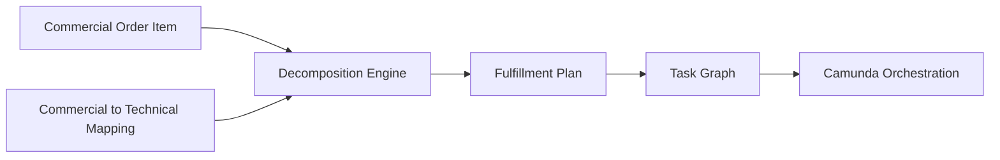
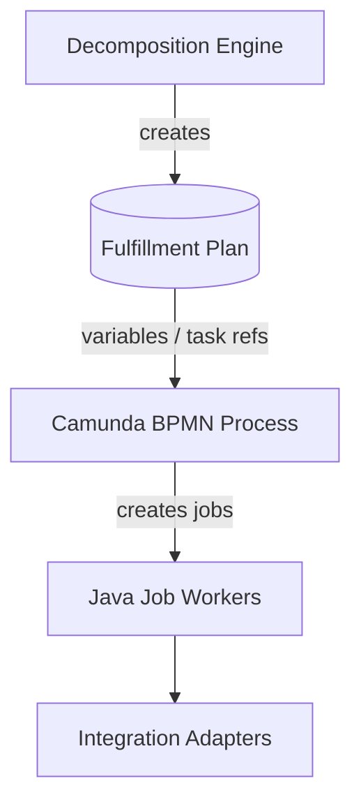
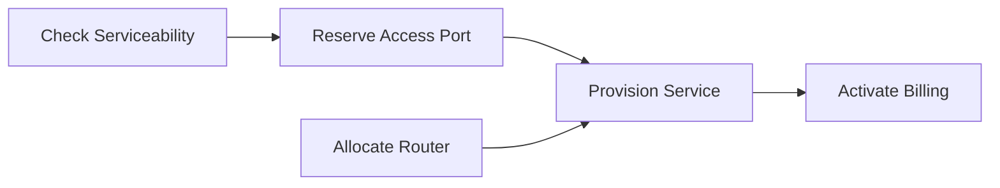
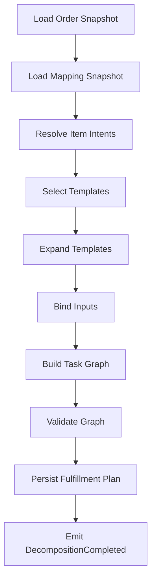
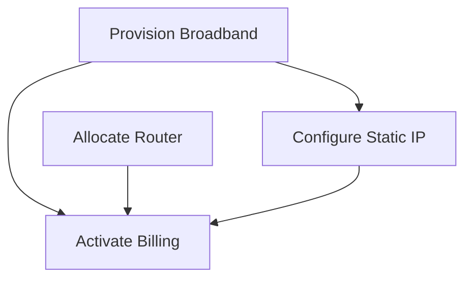

------
title: Build From Scratch: Enterprise Java Microservices CPQ & Order Management Platform - Part 036
description: Mendesain order decomposition engine dari nol: mengubah commercial order item menjadi technical fulfillment plan, task graph, dependency, action mapping, decomposition snapshot, PostgreSQL persistence, MyBatis mapper, Kafka event, dan Camunda boundary.
series: learn-enterprise-cpq-oms-glassfish-camunda8
seriesTitle: Build From Scratch: Enterprise Java Microservices CPQ & Order Management Platform
order: 36
partTitle: Order Decomposition Engine
tags:
  - java
  - microservices
  - cpq
  - oms
  - order-decomposition
  - fulfillment
  - workflow
  - postgresql
  - mybatis
  - camunda-8
  - kafka
  - redis
  - enterprise-architecture
date: 2026-07-02
---

# Part 036 — Order Decomposition Engine

Order sudah berhasil di-capture dan divalidasi.

Masalah berikutnya: fulfillment system tidak bisa langsung mengeksekusi “jual Fiber 1Gbps dengan router premium”.

Fulfillment butuh instruksi teknis:

- reserve resource,
- check address serviceability,
- create service order,
- allocate device,
- schedule appointment,
- ship router,
- provision service,
- activate billing,
- update installed base,
- notify customer.

Itulah peran **order decomposition engine**.

Decomposition engine mengubah **commercial order item** menjadi **technical fulfillment plan**.



Rule utama:

> CPQ decides what is sold. OMS decomposition decides how it will be fulfilled.

---

## 1. Mental Model

Order decomposition adalah compiler.

Input-nya adalah commercial intent.

Output-nya adalah executable plan.

```text
commercial order + catalog mapping + asset context + tenant policy
    -> decomposition engine
    -> fulfillment plan + task graph + orchestration variables
```

Seperti compiler, decomposition punya tahap:

1. Parse input.
2. Resolve symbols.
3. Expand templates.
4. Build dependency graph.
5. Validate graph.
6. Emit executable representation.

Kalau kita memakai analogi ini, banyak desain menjadi lebih jelas.

- Product offering = high-level instruction.
- Technical catalog = target instruction set.
- Fulfillment task template = code generation template.
- Dependency graph = execution plan.
- Camunda process = runtime scheduler/orchestrator.

---

## 2. Why Decomposition Is Hard

Decomposition sulit karena satu commercial item bisa menghasilkan banyak technical actions.

Contoh commercial order:

```text
ADD Fiber Internet 1Gbps + Premium Router + Static IP
```

Bisa terdekomposisi menjadi:

```text
1. Validate address serviceability
2. Reserve access port
3. Allocate ONT device
4. Allocate premium router
5. Schedule technician appointment
6. Create network service instance
7. Configure static IP
8. Ship router if self-install
9. Activate service
10. Start billing
11. Update customer asset
12. Send notification
```

Masalah makin kompleks ketika action-nya bukan `ADD`, melainkan:

- `MODIFY` bandwidth,
- `DISCONNECT` add-on,
- `MOVE` address,
- `CANCEL` in-flight order,
- supplemental order terhadap order yang belum selesai.

---

## 3. Boundary: Decomposition vs Workflow

Decomposition engine bukan Camunda BPMN.

Decomposition engine menjawab:

> Task apa yang harus ada dan dependency-nya bagaimana?

Camunda menjawab:

> Bagaimana task tersebut diorkestrasi, diretry, dieskalasi, dan diobservasi?



Jangan menaruh rule mapping commercial-to-technical di BPMN diagram.

BPMN akan menjadi terlalu besar, sulit dites, dan sulit versioning.

---

## 4. Input to Decomposition

Decomposition harus memakai snapshot, bukan live mutable data tanpa kontrol.

Minimal input:

```java
public record DecompositionInput(
    String tenantId,
    String orderId,
    OrderSnapshot orderSnapshot,
    List<OrderItemSnapshot> orderItems,
    CatalogMappingSnapshot catalogMapping,
    InstalledBaseSnapshot installedBaseSnapshot,
    TenantFulfillmentPolicy tenantPolicy,
    Instant decompositionRequestedAt
) {}
```

Kenapa snapshot?

Karena order fulfillment bisa berjalan lama. Catalog bisa berubah saat order masih berjalan. Jika task graph berubah di tengah jalan karena live catalog berubah, audit dan recovery menjadi kacau.

> Rule: **Decompose from a frozen view, not from a moving catalog.**

---

## 5. Output from Decomposition

Output utama adalah fulfillment plan.

```java
public record FulfillmentPlan(
    String fulfillmentPlanId,
    String tenantId,
    String orderId,
    int planVersion,
    List<FulfillmentTask> tasks,
    List<FulfillmentDependency> dependencies,
    DecompositionExplanation explanation,
    String decompositionHash,
    Instant createdAt
) {}
```

Task:

```java
public record FulfillmentTask(
    String taskId,
    String orderItemId,
    String taskType,
    String taskOwner,
    FulfillmentTaskAction action,
    Map<String, Object> input,
    RetryPolicy retryPolicy,
    CompensationPolicy compensationPolicy,
    boolean manual,
    String adapterKey
) {}
```

Dependency:

```java
public record FulfillmentDependency(
    String fromTaskId,
    String toTaskId,
    DependencyType type
) {}
```

Graph harus acyclic kecuali kita secara eksplisit mendukung loop orchestration, dan itu lebih tepat berada di BPMN, bukan dependency task statis.

---

## 6. Decomposition Plan Example

Commercial item:

```json
{
  "orderItemId": "oi-1",
  "action": "ADD",
  "productOfferingId": "po-fiber-1gbps",
  "configuration": {
    "router": "premium",
    "staticIp": true
  }
}
```

Fulfillment plan:

```json
{
  "fulfillmentPlanId": "fp-01JZ...",
  "orderId": "ord-01JZ...",
  "tasks": [
    {
      "taskId": "task-serviceability",
      "taskType": "CHECK_SERVICEABILITY",
      "orderItemId": "oi-1",
      "adapterKey": "serviceability-adapter"
    },
    {
      "taskId": "task-reserve-port",
      "taskType": "RESERVE_ACCESS_PORT",
      "orderItemId": "oi-1",
      "adapterKey": "inventory-adapter"
    },
    {
      "taskId": "task-allocate-router",
      "taskType": "ALLOCATE_CPE_DEVICE",
      "orderItemId": "oi-1",
      "adapterKey": "warehouse-adapter"
    },
    {
      "taskId": "task-provision-service",
      "taskType": "PROVISION_NETWORK_SERVICE",
      "orderItemId": "oi-1",
      "adapterKey": "provisioning-adapter"
    },
    {
      "taskId": "task-activate-billing",
      "taskType": "ACTIVATE_BILLING",
      "orderItemId": "oi-1",
      "adapterKey": "billing-adapter"
    }
  ],
  "dependencies": [
    { "fromTaskId": "task-serviceability", "toTaskId": "task-reserve-port" },
    { "fromTaskId": "task-reserve-port", "toTaskId": "task-provision-service" },
    { "fromTaskId": "task-allocate-router", "toTaskId": "task-provision-service" },
    { "fromTaskId": "task-provision-service", "toTaskId": "task-activate-billing" }
  ]
}
```

Graph:



---

## 7. Commercial to Technical Mapping

Kita butuh mapping table/model antara commercial catalog dan technical fulfillment templates.

```text
Product Offering + Action + Configuration Condition
    -> Technical Fulfillment Template(s)
```

Contoh mapping:

| Offering | Action | Condition | Template |
|---|---|---|---|
| `po-fiber-1gbps` | `ADD` | always | `tpl-fiber-install-base` |
| `po-fiber-1gbps` | `ADD` | `router=premium` | `tpl-premium-router-allocation` |
| `po-fiber-1gbps` | `ADD` | `staticIp=true` | `tpl-static-ip-provisioning` |
| `po-fiber-1gbps` | `MODIFY` | `bandwidth changed` | `tpl-bandwidth-change` |
| `po-fiber-1gbps` | `DISCONNECT` | always | `tpl-fiber-disconnect` |

Jangan hardcode mapping di Java `if/else` besar.

Java engine mengevaluasi mapping; data mapping berada di technical catalog.

---

## 8. Fulfillment Task Template

Template adalah resep task.

```json
{
  "templateId": "tpl-fiber-install-base",
  "version": 7,
  "tasks": [
    {
      "taskKey": "check-serviceability",
      "taskType": "CHECK_SERVICEABILITY",
      "owner": "INVENTORY",
      "adapterKey": "serviceability-adapter",
      "inputMapping": {
        "addressId": "$.order.installationAddressId",
        "offeringId": "$.item.productOfferingId"
      },
      "retryPolicy": {
        "maxAttempts": 3,
        "backoff": "PT5M"
      }
    },
    {
      "taskKey": "reserve-port",
      "taskType": "RESERVE_ACCESS_PORT",
      "owner": "INVENTORY",
      "dependsOn": ["check-serviceability"]
    },
    {
      "taskKey": "provision-service",
      "taskType": "PROVISION_NETWORK_SERVICE",
      "owner": "PROVISIONING",
      "dependsOn": ["reserve-port"]
    }
  ]
}
```

Template harus versioned.

Order yang sudah didekomposisi tidak boleh berubah hanya karena template baru dipublish.

---

## 9. Decomposition Pipeline



### 9.1 Load order snapshot

Ambil order dan item yang sudah `VALIDATED` atau `READY_FOR_DECOMPOSITION`.

Gunakan row version untuk mencegah double decomposition.

### 9.2 Load mapping snapshot

Ambil technical mapping berdasarkan:

- tenant,
- product offering,
- action,
- market,
- channel,
- effective date,
- configuration condition,
- target asset state.

### 9.3 Resolve item intents

Action `MODIFY` harus diubah menjadi delta intent.

Contoh:

```text
current asset: bandwidth=500Mbps
requested config: bandwidth=1Gbps
intent: CHANGE_BANDWIDTH 500Mbps -> 1Gbps
```

Action `DISCONNECT` menjadi:

```text
intent: TERMINATE_SERVICE + RETURN_DEVICE + STOP_BILLING
```

### 9.4 Select templates

Pilih template yang condition-nya match.

Jika tidak ada template untuk mandatory fulfillment intent, decomposition harus gagal secara controlled.

### 9.5 Expand templates

Template task key harus menjadi unique task ID per order/item.

```text
tpl-fiber-install-base:reserve-port
    -> task-ord123-oi1-reserve-port
```

### 9.6 Bind inputs

Input mapping harus menghasilkan payload task.

Jika input mandatory tidak bisa di-bind, graph invalid.

### 9.7 Build task graph

Gabungkan dependency dari semua template.

Tambahkan dependency cross-item jika ada relationship.

Contoh:

- broadband service harus provision sebelum static IP.
- parent bundle harus created sebelum add-on.
- disconnect add-on sebelum disconnect parent.

### 9.8 Validate graph

Validasi:

- no cycles,
- no missing dependencies,
- no orphan mandatory task,
- all adapter keys known,
- all manual task roles known,
- compensation policy exists for risky task,
- retry policy within tenant limit,
- cross-item dependency valid.

### 9.9 Persist plan

Plan harus disimpan atomik.

Setelah plan tersimpan, state order berubah menjadi `DECOMPOSED` atau `READY_FOR_ORCHESTRATION`.

### 9.10 Emit event

Insert outbox event `OrderDecomposed` atau `FulfillmentPlanCreated`.

---

## 10. Action Mapping

### 10.1 ADD

ADD membuat service/resource baru.

Common tasks:

- eligibility/serviceability check,
- resource reservation,
- appointment,
- shipment,
- provisioning,
- activation,
- billing start,
- asset creation.

### 10.2 MODIFY

MODIFY mengubah asset/subscription existing.

Common tasks:

- compare current vs requested,
- validate allowed transition,
- reserve new resource if needed,
- update provisioning,
- adjust billing,
- update asset version.

### 10.3 DISCONNECT

DISCONNECT menghentikan service/add-on.

Common tasks:

- validate minimum contract term,
- stop billing future charges,
- deprovision service,
- release resource,
- recover equipment,
- close asset/subscription.

### 10.4 MOVE

MOVE memindahkan service ke address/resource lain.

Common tasks:

- validate new address,
- reserve new access,
- schedule install,
- migrate service,
- disconnect old access,
- update asset location,
- adjust billing if needed.

### 10.5 CANCEL

CANCEL terhadap order in-flight lebih rumit daripada disconnect subscription.

Common tasks:

- inspect completed tasks,
- cancel pending tasks,
- compensate completed reversible tasks,
- preserve non-reversible task evidence,
- update order state.

---

## 11. Dependency Graph Rules

Dependency graph harus formal.

Jangan memakai urutan array sebagai dependency.

```java
public enum DependencyType {
    FINISH_TO_START,
    START_TO_START,
    COMPENSATION_AFTER,
    MANUAL_APPROVAL_BEFORE
}
```

Untuk versi awal, cukup dukung `FINISH_TO_START`.

Cycle detection:

```java
public final class TaskGraphValidator {
    public void assertAcyclic(List<FulfillmentTask> tasks, List<FulfillmentDependency> dependencies) {
        var graph = TaskGraph.from(tasks, dependencies);
        var cycle = graph.findCycle();
        if (cycle.isPresent()) {
            throw new DecompositionException(
                "DECOMPOSITION_GRAPH_HAS_CYCLE",
                "Fulfillment task graph contains cycle: " + cycle.get()
            );
        }
    }
}
```

Missing dependency detection:

```java
for (var dep : dependencies) {
    if (!taskIds.contains(dep.fromTaskId()) || !taskIds.contains(dep.toTaskId())) {
        throw new DecompositionException("UNKNOWN_TASK_DEPENDENCY", dep.toString());
    }
}
```

---

## 12. Decomposition Explanation

Enterprise decomposition harus explainable.

Saat order stuck atau customer dispute, operator harus bisa melihat kenapa task dibuat.

```json
{
  "selectedTemplates": [
    {
      "templateId": "tpl-fiber-install-base",
      "version": 7,
      "reason": "Matched offering po-fiber-1gbps with action ADD"
    },
    {
      "templateId": "tpl-static-ip-provisioning",
      "version": 3,
      "reason": "Matched configuration condition staticIp=true"
    }
  ],
  "skippedTemplates": [
    {
      "templateId": "tpl-premium-router-allocation",
      "reason": "Condition router=premium not satisfied"
    }
  ],
  "derivedIntents": [
    "CREATE_ACCESS_SERVICE",
    "CONFIGURE_STATIC_IP",
    "START_RECURRING_BILLING"
  ]
}
```

Explanation bukan nice-to-have.

Ini adalah alat debugging, audit, dan training operator.

---

## 13. PostgreSQL Schema

### 13.1 Fulfillment plan

```sql
CREATE TABLE oms_fulfillment_plan (
    fulfillment_plan_id    text PRIMARY KEY,
    tenant_id              text NOT NULL,
    order_id               text NOT NULL REFERENCES oms_order(order_id),
    plan_version           integer NOT NULL,
    plan_state             text NOT NULL,
    decomposition_hash     text NOT NULL,
    explanation_json       jsonb NOT NULL,
    created_at             timestamptz NOT NULL,
    created_by             text NOT NULL,
    row_version            bigint NOT NULL DEFAULT 0,

    CONSTRAINT uq_fulfillment_plan_order_version UNIQUE(order_id, plan_version),
    CONSTRAINT chk_fulfillment_plan_state CHECK (plan_state IN ('CREATED','READY_FOR_ORCHESTRATION','ORCHESTRATING','COMPLETED','FAILED','CANCELLED'))
);

CREATE UNIQUE INDEX uq_active_fulfillment_plan_order
ON oms_fulfillment_plan(order_id)
WHERE plan_state IN ('CREATED','READY_FOR_ORCHESTRATION','ORCHESTRATING');
```

### 13.2 Fulfillment task

```sql
CREATE TABLE oms_fulfillment_task (
    fulfillment_task_id    text PRIMARY KEY,
    fulfillment_plan_id    text NOT NULL REFERENCES oms_fulfillment_plan(fulfillment_plan_id),
    tenant_id              text NOT NULL,
    order_id               text NOT NULL,
    order_item_id          text NOT NULL REFERENCES oms_order_item(order_item_id),
    task_key               text NOT NULL,
    task_type              text NOT NULL,
    task_owner             text NOT NULL,
    task_action            text NOT NULL,
    adapter_key            text,
    task_state             text NOT NULL,
    manual                 boolean NOT NULL DEFAULT false,
    input_json             jsonb NOT NULL,
    retry_policy_json      jsonb NOT NULL,
    compensation_policy_json jsonb,
    created_at             timestamptz NOT NULL,
    updated_at             timestamptz NOT NULL,
    row_version            bigint NOT NULL DEFAULT 0,

    CONSTRAINT uq_fulfillment_task_key UNIQUE(fulfillment_plan_id, task_key),
    CONSTRAINT chk_fulfillment_task_state CHECK (task_state IN ('PENDING','READY','IN_PROGRESS','COMPLETED','FAILED','SKIPPED','CANCELLED','COMPENSATING','COMPENSATED'))
);

CREATE INDEX idx_fulfillment_task_plan ON oms_fulfillment_task(fulfillment_plan_id);
CREATE INDEX idx_fulfillment_task_order ON oms_fulfillment_task(order_id);
CREATE INDEX idx_fulfillment_task_owner_state ON oms_fulfillment_task(tenant_id, task_owner, task_state);
```

### 13.3 Task dependency

```sql
CREATE TABLE oms_fulfillment_task_dependency (
    dependency_id          text PRIMARY KEY,
    fulfillment_plan_id    text NOT NULL REFERENCES oms_fulfillment_plan(fulfillment_plan_id),
    tenant_id              text NOT NULL,
    from_task_id           text NOT NULL REFERENCES oms_fulfillment_task(fulfillment_task_id),
    to_task_id             text NOT NULL REFERENCES oms_fulfillment_task(fulfillment_task_id),
    dependency_type        text NOT NULL,
    created_at             timestamptz NOT NULL,

    CONSTRAINT uq_fulfillment_task_dependency UNIQUE(fulfillment_plan_id, from_task_id, to_task_id),
    CONSTRAINT chk_dependency_type CHECK (dependency_type IN ('FINISH_TO_START','START_TO_START','COMPENSATION_AFTER','MANUAL_APPROVAL_BEFORE'))
);
```

### 13.4 Decomposition attempt

```sql
CREATE TABLE oms_decomposition_attempt (
    decomposition_attempt_id text PRIMARY KEY,
    tenant_id                text NOT NULL,
    order_id                 text NOT NULL,
    attempt_no               integer NOT NULL,
    status                   text NOT NULL,
    error_code               text,
    error_message            text,
    started_at               timestamptz NOT NULL,
    finished_at              timestamptz,
    request_hash             text NOT NULL,

    CONSTRAINT uq_decomposition_attempt UNIQUE(order_id, attempt_no),
    CONSTRAINT chk_decomposition_attempt_status CHECK (status IN ('STARTED','SUCCEEDED','FAILED'))
);
```

---

## 14. MyBatis Mapper Direction

### 14.1 Insert plan

```xml
<insert id="insertFulfillmentPlan" parameterType="FulfillmentPlanRow">
  INSERT INTO oms_fulfillment_plan (
    fulfillment_plan_id,
    tenant_id,
    order_id,
    plan_version,
    plan_state,
    decomposition_hash,
    explanation_json,
    created_at,
    created_by,
    row_version
  ) VALUES (
    #{fulfillmentPlanId},
    #{tenantId},
    #{orderId},
    #{planVersion},
    #{planState},
    #{decompositionHash},
    #{explanationJson, typeHandler=JsonbTypeHandler},
    #{createdAt},
    #{createdBy},
    0
  )
</insert>
```

### 14.2 Insert task batch

```xml
<insert id="insertFulfillmentTasks">
  INSERT INTO oms_fulfillment_task (
    fulfillment_task_id,
    fulfillment_plan_id,
    tenant_id,
    order_id,
    order_item_id,
    task_key,
    task_type,
    task_owner,
    task_action,
    adapter_key,
    task_state,
    manual,
    input_json,
    retry_policy_json,
    compensation_policy_json,
    created_at,
    updated_at,
    row_version
  ) VALUES
  <foreach collection="tasks" item="task" separator=",">
    (
      #{task.fulfillmentTaskId},
      #{task.fulfillmentPlanId},
      #{task.tenantId},
      #{task.orderId},
      #{task.orderItemId},
      #{task.taskKey},
      #{task.taskType},
      #{task.taskOwner},
      #{task.taskAction},
      #{task.adapterKey},
      #{task.taskState},
      #{task.manual},
      #{task.inputJson, typeHandler=JsonbTypeHandler},
      #{task.retryPolicyJson, typeHandler=JsonbTypeHandler},
      #{task.compensationPolicyJson, typeHandler=JsonbTypeHandler},
      #{task.createdAt},
      #{task.updatedAt},
      0
    )
  </foreach>
</insert>
```

### 14.3 Update order state after decomposition

```xml
<update id="markOrderDecomposed">
  UPDATE oms_order
  SET order_state = 'DECOMPOSITION_REQUESTED',
      fulfillment_state = 'NOT_STARTED',
      row_version = row_version + 1,
      updated_at = #{updatedAt}
  WHERE order_id = #{orderId}
    AND tenant_id = #{tenantId}
    AND order_state = 'READY_FOR_DECOMPOSITION'
    AND row_version = #{expectedRowVersion}
</update>
```

If affected rows = 0, another process already changed the order.

---

## 15. Decomposition Handler

```java
public final class DecomposeOrderHandler {
    private final OrderRepository orderRepository;
    private final TechnicalCatalogPort technicalCatalogPort;
    private final InstalledBasePort installedBasePort;
    private final DecompositionEngine decompositionEngine;
    private final FulfillmentPlanRepository planRepository;
    private final OutboxRepository outboxRepository;
    private final AuditRepository auditRepository;
    private final TransactionRunner tx;

    public DecomposeOrderResponse handle(DecomposeOrderCommand command) {
        return tx.required(() -> {
            var order = orderRepository.loadForDecomposition(
                command.tenantId(),
                command.orderId()
            );

            order.assertReadyForDecomposition();

            var mapping = technicalCatalogPort.loadMappingSnapshot(order);
            var installedBase = installedBasePort.loadSnapshotFor(order);

            var input = new DecompositionInput(
                command.tenantId(),
                command.orderId(),
                order.toSnapshot(),
                order.itemSnapshots(),
                mapping,
                installedBase,
                command.tenantPolicy(),
                command.requestedAt()
            );

            var plan = decompositionEngine.decompose(input);

            planRepository.insert(plan);
            orderRepository.markDecompositionRequested(order.id(), order.rowVersion());
            auditRepository.insertFulfillmentPlanCreated(plan);
            outboxRepository.insert(FulfillmentPlanCreatedEvent.from(plan));

            return DecomposeOrderResponse.from(plan);
        });
    }
}
```

Catatan:

- `loadForDecomposition` bisa memakai lock atau optimistic state transition.
- Jika decomposition memerlukan external read, jaga timeout dan fallback policy.
- Jangan memulai Camunda process di tengah transaction.

---

## 16. Decomposition Engine Core

```java
public final class DecompositionEngine {
    private final IntentResolver intentResolver;
    private final TemplateSelector templateSelector;
    private final TemplateExpander templateExpander;
    private final InputBinder inputBinder;
    private final TaskGraphBuilder graphBuilder;
    private final TaskGraphValidator graphValidator;
    private final DecompositionExplainer explainer;

    public FulfillmentPlan decompose(DecompositionInput input) {
        var intents = intentResolver.resolve(input);
        var selectedTemplates = templateSelector.select(input, intents);
        var expandedTasks = templateExpander.expand(input, selectedTemplates);
        var boundTasks = inputBinder.bind(input, expandedTasks);
        var graph = graphBuilder.build(boundTasks);

        graphValidator.validate(graph);

        var explanation = explainer.explain(input, intents, selectedTemplates, graph);

        return FulfillmentPlanFactory.create(input, graph, explanation);
    }
}
```

Pipeline ini intentionally boring.

Production systems lebih aman jika core algorithm terlihat jelas daripada tersembunyi di framework magic.

---

## 17. Intent Resolver

Intent resolver menerjemahkan order item menjadi fulfillment intent.

```java
public final class IntentResolver {
    public List<FulfillmentIntent> resolve(DecompositionInput input) {
        var intents = new ArrayList<FulfillmentIntent>();

        for (var item : input.orderItems()) {
            switch (item.action()) {
                case ADD -> intents.addAll(resolveAdd(item));
                case MODIFY -> intents.addAll(resolveModify(item, input.installedBaseSnapshot()));
                case DISCONNECT -> intents.addAll(resolveDisconnect(item, input.installedBaseSnapshot()));
                case MOVE -> intents.addAll(resolveMove(item, input.installedBaseSnapshot()));
                case CANCEL -> intents.addAll(resolveCancel(item));
                default -> throw new DecompositionException("UNSUPPORTED_ACTION", item.action().name());
            }
        }

        return intents;
    }
}
```

Untuk `MODIFY`, jangan hanya melihat requested config. Bandingkan dengan current asset.

```java
private List<FulfillmentIntent> resolveModify(
    OrderItemSnapshot item,
    InstalledBaseSnapshot installedBase
) {
    var current = installedBase.assetById(item.targetAssetId());
    var requested = item.configurationSnapshot();

    var delta = ConfigurationDelta.compare(current.configuration(), requested);

    return delta.toFulfillmentIntents();
}
```

---

## 18. Template Selector

Template selector harus deterministic.

Input sama harus memilih template yang sama.

```java
public final class TemplateSelector {
    public List<SelectedTemplate> select(
        DecompositionInput input,
        List<FulfillmentIntent> intents
    ) {
        var selected = new ArrayList<SelectedTemplate>();

        for (var intent : intents) {
            var candidates = input.catalogMapping().templatesFor(intent);
            var matches = candidates.stream()
                .filter(template -> template.condition().matches(input, intent))
                .sorted(TemplateOrdering.byPriorityThenId())
                .toList();

            if (matches.isEmpty() && intent.mandatory()) {
                throw new DecompositionException(
                    "NO_TECHNICAL_TEMPLATE_FOR_INTENT",
                    intent.code()
                );
            }

            selected.addAll(matches.stream()
                .map(template -> new SelectedTemplate(intent, template))
                .toList());
        }

        return selected;
    }
}
```

Jika ada dua template priority sama dan sama-sama match, jangan pilih random. Itu harus dianggap ambiguous mapping.

---

## 19. Input Binding

Task input harus explicit.

Contoh mapping:

```json
{
  "addressId": "$.order.installationAddressId",
  "customerId": "$.order.customerId",
  "bandwidth": "$.item.configuration.bandwidth",
  "serviceId": "$.asset.serviceInstanceId"
}
```

Jika field wajib tidak ada:

```json
{
  "code": "TASK_INPUT_BINDING_FAILED",
  "taskKey": "provision-service",
  "path": "$.order.installationAddressId",
  "message": "Cannot bind required task input addressId"
}
```

Binding error harus terjadi sebelum plan dipersist sebagai ready.

---

## 20. Cross-Item Dependency

Order item sering saling bergantung.

Contoh bundle:

```text
Parent: Broadband Service
Child: Static IP Add-on
Child: Premium Router
```

Static IP tidak bisa provision sebelum broadband service ada.



Cross-item dependency bisa berasal dari:

- product relationship,
- configuration relationship,
- technical catalog mapping,
- installed base relationship,
- tenant policy,
- action type.

Jangan mengasumsikan semua order item bisa diproses paralel.

---

## 21. Plan Versioning

Fulfillment plan harus versioned.

Kenapa?

- Decomposition bisa gagal lalu diperbaiki mapping-nya.
- Operator bisa meminta re-decomposition sebelum orchestration mulai.
- Supplemental order bisa menambah plan baru.
- Cancellation bisa membuat compensation plan.

Namun jangan sembarang re-decompose order yang sudah partially fulfilled.

Policy:

| Current State | Re-decompose Allowed? | Notes |
|---|---:|---|
| `READY_FOR_DECOMPOSITION` | Yes | Normal |
| `DECOMPOSITION_FAILED` | Yes | After mapping/data fix |
| `READY_FOR_ORCHESTRATION` | Maybe | If process not started |
| `ORCHESTRATING` | Dangerous | Requires migration/compensation policy |
| `PARTIAL` | Usually no | Use supplemental/correction order |
| `COMPLETED` | No | Use amendment order |

---

## 22. Interaction with Camunda 8

Setelah plan dibuat, Camunda bisa menjalankan orchestration.

Ada dua pendekatan:

### 22.1 Static BPMN with dynamic task execution

BPMN punya generic loop/task executor yang membaca task graph dari database.

Pros:

- BPMN sederhana,
- task graph dinamis,
- perubahan technical catalog tidak selalu butuh BPMN baru.

Cons:

- lebih banyak logic di worker,
- diagram BPMN kurang detail.

### 22.2 BPMN per fulfillment pattern

Decomposition memilih process definition tertentu.

Pros:

- diagram lebih eksplisit,
- cocok untuk flow besar dan stabil.

Cons:

- banyak versi BPMN,
- mapping lebih kompleks,
- deployment workflow menjadi bagian dari catalog release.

Untuk seri ini, baseline yang aman:

```text
Decomposition creates plan
    -> Workflow starter starts generic order fulfillment process
    -> Workers execute tasks by reading fulfillment_task records
```

Camunda service task merepresentasikan work item; saat service task dimasuki, job dibuat dan job worker menyelesaikannya. Karena itu worker akan kita desain idempotent di part berikutnya.

---

## 23. Kafka Event Model

Event setelah plan dibuat:

```json
{
  "eventId": "evt-01JZ...",
  "eventType": "FulfillmentPlanCreated",
  "eventVersion": 1,
  "tenantId": "tenant-a",
  "aggregateType": "FulfillmentPlan",
  "aggregateId": "fp-01JZ...",
  "occurredAt": "2026-07-02T04:20:00Z",
  "payload": {
    "orderId": "ord-01JZ...",
    "fulfillmentPlanId": "fp-01JZ...",
    "planVersion": 1,
    "taskCount": 12,
    "manualTaskCount": 1,
    "decompositionHash": "sha256:..."
  }
}
```

Consumer event:

- workflow starter,
- operations dashboard projection,
- notification system,
- audit/event archive,
- reconciliation job.

Event tidak menggantikan table plan.

---

## 24. Redis Boundary

Redis bisa dipakai untuk:

- cache technical mapping snapshot,
- cache template by version,
- cache decomposition result for validation/precheck,
- short-lived lock to avoid duplicate decomposition attempts.

Redis tidak boleh menjadi:

- source of truth plan,
- only duplicate decomposition guard,
- only template version storage.

Duplicate decomposition harus tetap dicegah oleh PostgreSQL constraints/state transition.

---

## 25. Failure Modes

| Failure | Cause | Correct Handling |
|---|---|---|
| No template found | Technical catalog incomplete | Mark decomposition failed with actionable error |
| Ambiguous template | Multiple same-priority matches | Fail deterministic; require catalog fix |
| Input binding failed | Required field missing | Fail before plan persistence |
| Dependency cycle | Bad template relationship | Fail decomposition; expose cycle explanation |
| Adapter key unknown | Template references missing adapter | Fail validation |
| Duplicate decomposition | Retry/race | Unique active plan + state transition guard |
| Catalog changed after order capture | Live catalog lookup unstable | Use mapping snapshot/version |
| Plan persisted but event relay down | Outbox backlog | Relay retry; plan remains durable |
| Workflow start fails | Camunda unavailable | Retry from workflow-start/outbox worker |
| Partial fulfillment then mapping found wrong | Late discovery | Do not re-decompose blindly; use compensation/supplemental order |

---

## 26. Testing Strategy

### 26.1 Unit tests

- ADD offering selects base templates.
- Configuration condition selects optional template.
- MODIFY computes delta from installed base.
- DISCONNECT creates deprovision/release/stop-billing intents.
- Missing mandatory template fails.
- Ambiguous template fails.
- Input binding missing field fails.
- Dependency cycle fails.

### 26.2 Golden plan tests

For each order fixture, assert exact generated plan.

```text
fixtures/decomposition/fiber-add-basic/input.json
fixtures/decomposition/fiber-add-basic/expected-plan.json
```

Golden tests are useful because decomposition output is a contract for orchestration and operations.

### 26.3 Persistence tests

- Insert plan with tasks and dependencies.
- Unique active plan prevents duplicate.
- Unknown order item dependency rejected.
- JSONB task input stored and read accurately.
- State transition affected row count handles race.

### 26.4 Integration tests

- Validated order becomes decomposed.
- Outbox event created.
- Workflow starter can read plan.
- Re-decomposition after failure creates new plan version.
- Decomposition failure produces operational error record.

### 26.5 Property-like tests

Useful invariant tests:

- generated task IDs unique,
- every dependency refers to existing task,
- graph is acyclic,
- every mandatory intent has at least one task,
- decomposition hash stable for same input,
- selected template ordering stable.

---

## 27. Observability

Log decomposition at decision level, not huge payload level.

Important fields:

- `tenantId`,
- `orderId`,
- `fulfillmentPlanId`,
- `planVersion`,
- `decompositionHash`,
- `selectedTemplateIds`,
- `taskCount`,
- `manualTaskCount`,
- `failedRuleCode`,
- `durationMs`,
- `correlationId`.

Metrics:

- decomposition success count,
- decomposition failure count by reason,
- average task count,
- average decomposition latency,
- template miss rate,
- ambiguous mapping rate,
- plan creation retry count.

Operational dashboard:

- orders ready for decomposition,
- decomposition failed,
- plan created but workflow not started,
- top failed templates,
- top missing adapter keys.

---

## 28. Implementation Milestone

Build order decomposition in this order:

1. Define fulfillment plan tables.
2. Define task/dependency tables.
3. Define decomposition attempt table.
4. Implement order load-for-decomposition query.
5. Implement technical mapping snapshot model.
6. Implement intent resolver for `ADD` first.
7. Implement template selector.
8. Implement template expander.
9. Implement input binder.
10. Implement graph builder.
11. Implement graph validator.
12. Implement plan factory and hash.
13. Implement persistence insert for plan/tasks/dependencies.
14. Implement outbox event.
15. Add golden plan tests.
16. Add failure-mode tests.
17. Add `MODIFY` and `DISCONNECT`.
18. Add cross-item dependency.
19. Add Camunda workflow starter later.

---

## 29. Production Checklist

Decomposition belum production-grade jika belum punya:

- versioned technical mapping,
- deterministic template selection,
- decomposition explanation,
- task graph validation,
- cycle detection,
- unique active fulfillment plan guard,
- idempotent decomposition command,
- persisted decomposition attempt,
- outbox event,
- stable decomposition hash,
- re-decomposition policy,
- partial fulfillment safety policy,
- integration with operations dashboard,
- golden plan regression tests.

---

## 30. Key Takeaways

Order decomposition adalah jembatan antara dunia commercial dan technical.

CPQ menghasilkan commercial order yang benar secara penjualan.

Decomposition menghasilkan fulfillment plan yang benar secara eksekusi.

Keduanya tidak boleh dicampur.

Desain decomposition yang kuat harus:

- snapshot-based,
- deterministic,
- versioned,
- explainable,
- graph-based,
- testable,
- idempotent,
- safe terhadap retry,
- tidak menyembunyikan mapping di BPMN,
- tidak menyembunyikan dependency di urutan array.

Setelah fulfillment plan ada, barulah Camunda 8 punya sesuatu yang layak diorkestrasi.

---

## 31. Sumber Faktual

- TM Forum TMF622 Product Ordering Management API: https://www.tmforum.org/resources/specifications/tmf622-product-ordering-management-api-user-guide-v5-0-0/
- Camunda 8 Service Tasks: https://docs.camunda.io/docs/components/modeler/bpmn/service-tasks/
- Camunda 8 Job Workers: https://docs.camunda.io/docs/components/concepts/job-workers/
- PostgreSQL Constraints: https://www.postgresql.org/docs/current/ddl-constraints.html
- MyBatis Mapper XML Files: https://mybatis.org/mybatis-3/sqlmap-xml.html
