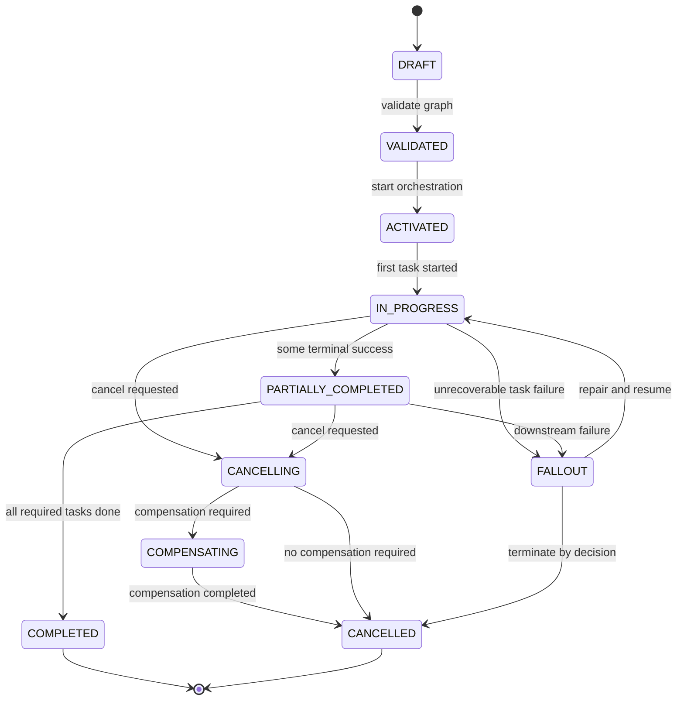
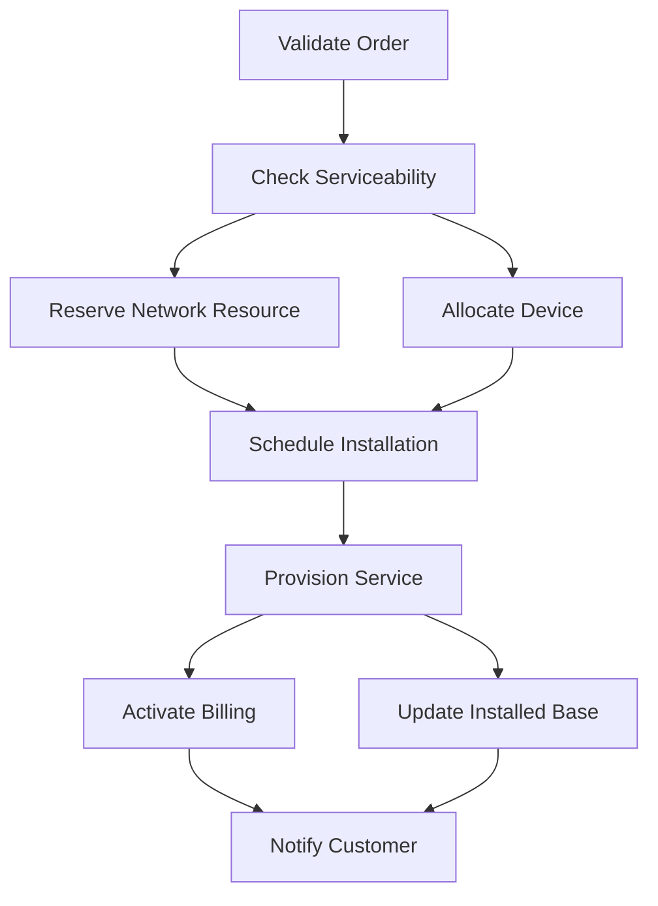
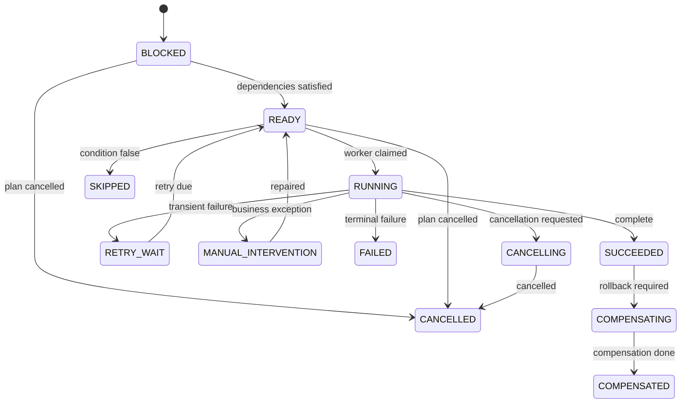
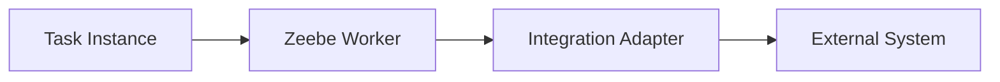
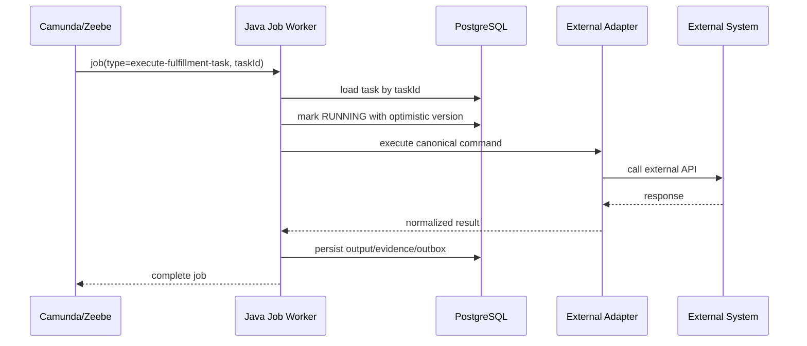

------
title: Build From Scratch: Enterprise Java Microservices CPQ & Order Management Platform - Part 037
description: Mendesain fulfillment plan dan fulfillment task model yang executable, traceable, retry-safe, compensation-aware, dan siap dijalankan oleh Camunda 8 job worker tanpa membuat workflow engine menjadi source of truth domain.
series: learn-enterprise-cpq-oms-glassfish-camunda8
seriesTitle: Build From Scratch: Enterprise Java Microservices CPQ & Order Management Platform
order: 37
partTitle: Fulfillment Plan and Task Model
tags:
  - java
  - microservices
  - cpq
  - oms
  - fulfillment
  - task-model
  - camunda-8
  - zeebe
  - postgresql
  - mybatis
  - kafka
  - redis
  - enterprise-architecture
date: 2026-07-02
---

# Part 037 — Fulfillment Plan and Task Model

Di Part 036 kita membangun decomposition engine.

Input-nya adalah order komersial.

Output-nya adalah **fulfillment plan**.

Sekarang kita perlu menjawab pertanyaan yang lebih tajam:

> Plan seperti apa yang cukup konkret untuk dieksekusi, cukup stabil untuk diaudit, cukup fleksibel untuk retry, dan cukup eksplisit untuk diperbaiki saat produksi bermasalah?

Di enterprise OMS, kegagalan besar sering muncul karena fulfillment diperlakukan sebagai “workflow diagram”. Itu keliru.

Workflow diagram hanya satu representasi eksekusi.

Model domain yang harus kita miliki adalah:

- fulfillment plan,
- fulfillment task,
- task dependency,
- task attempt,
- task result,
- task failure,
- task compensation,
- task ownership,
- task evidence,
- task timeline.

Camunda 8/Zeebe boleh menjalankan proses. Kafka boleh menyebarkan event. Redis boleh mempercepat lookup. PostgreSQL tetap menyimpan fakta bisnis.

```mermaid
flowchart LR
  Order[Order]
  Decompose[Decomposition Engine]
  Plan[Fulfillment Plan]
  Task[Task Graph]
  Camunda[Camunda Process]
  Worker[Java Job Workers]
  Adapter[External System Adapter]
  Evidence[Task Evidence]
  Audit[Audit Timeline]

  Order --> Decompose
  Decompose --> Plan
  Plan --> Task
  Task --> Camunda
  Camunda --> Worker
  Worker --> Adapter
  Adapter --> Evidence
  Evidence --> Audit
```



Rule utama:

> Workflow executes the plan. The plan explains the workflow.

---

## 1. Mental Model

Fulfillment plan adalah **execution contract** antara OMS dan dunia fulfillment.

Ia menjawab:

- apa yang harus dilakukan,
- dalam urutan apa,
- oleh siapa,
- dengan input apa,
- output apa yang diharapkan,
- kapan boleh retry,
- kapan harus compensate,
- kapan harus masuk fallout,
- bukti apa yang harus disimpan.

Jangan memulai dari BPMN.

Mulai dari model task.

```text
order
  -> decomposition
  -> fulfillment plan
  -> task graph
  -> orchestration
  -> worker execution
  -> evidence
  -> state update
```

Jika task model benar, BPMN menjadi implementasi orchestration.

Jika task model salah, BPMN akan berubah menjadi tempat menyimpan business rule yang sulit dites, sulit direplay, dan sulit diaudit.

---

## 2. Apa Itu Fulfillment Plan?

Fulfillment plan adalah snapshot dari rencana eksekusi order.

Ia bukan sekadar daftar task.

Ia punya metadata:

- plan ID,
- tenant ID,
- order ID,
- order version,
- decomposition version,
- source quote ID,
- fulfillment strategy,
- graph hash,
- status,
- created timestamp,
- activated timestamp,
- completed timestamp,
- cancellation marker,
- compensation marker.

Contoh model konseptual:

```text
FulfillmentPlan
  id
  tenantId
  orderId
  orderVersion
  decompositionVersion
  status
  strategy
  graphHash
  createdAt
  activatedAt
  completedAt
  failedAt
  tasks[]
  dependencies[]
```

Plan harus immutable dalam hal struktur setelah activation.

Yang boleh berubah adalah state task, attempt, evidence, dan operational annotation.

---

## 3. Kenapa Plan Tidak Boleh Disamakan dengan Process Instance?

Camunda process instance adalah runtime state.

Fulfillment plan adalah business execution model.

Keduanya berelasi, tapi tidak sama.

| Concern | Fulfillment Plan | Camunda Process Instance |
|---|---|---|
| Source of truth bisnis | Ya | Tidak |
| Runtime orchestration | Tidak langsung | Ya |
| Audit business intent | Ya | Sebagian |
| Retry technical task | Direpresentasikan | Dieksekusi |
| Manual repair domain | Ya | Bisa dipicu |
| Versioned decomposition | Ya | BPMN version terpisah |
| Long-running visibility | Ya | Ya, runtime-specific |

Rule:

> Jika stakeholder bisnis bertanya “apa yang harus dilakukan untuk fulfill order ini?”, jawabannya harus bisa ditemukan dari fulfillment plan, bukan dari parsing BPMN runtime state.

---

## 4. Fulfillment Plan Lifecycle

Plan punya lifecycle sendiri.



Status minimal:

- `DRAFT`,
- `VALIDATED`,
- `ACTIVATED`,
- `IN_PROGRESS`,
- `PARTIALLY_COMPLETED`,
- `COMPLETED`,
- `FALLOUT`,
- `CANCELLING`,
- `COMPENSATING`,
- `CANCELLED`.

Invariants:

- plan `DRAFT` belum boleh punya process instance,
- plan `VALIDATED` harus punya task graph valid,
- plan `ACTIVATED` harus punya workflow reference,
- plan `COMPLETED` hanya boleh jika semua required terminal task sukses,
- plan `CANCELLED` harus punya cancellation evidence,
- plan `FALLOUT` harus punya unresolved blocking failure.

---

## 5. Fulfillment Task

Task adalah unit kerja yang bisa dieksekusi, dilacak, di-retry, dan diaudit.

Task harus cukup kecil untuk punya owner jelas, tapi tidak terlalu kecil sampai workflow menjadi ribuan langkah tanpa nilai bisnis.

Contoh task:

- `CHECK_SERVICEABILITY`,
- `RESERVE_NUMBER`,
- `RESERVE_PORT`,
- `ALLOCATE_DEVICE`,
- `SCHEDULE_INSTALLATION`,
- `SHIP_DEVICE`,
- `PROVISION_SERVICE`,
- `ACTIVATE_SERVICE`,
- `ACTIVATE_BILLING`,
- `UPDATE_INSTALLED_BASE`,
- `SEND_COMPLETION_NOTIFICATION`.

Model konseptual:

```text
FulfillmentTask
  id
  tenantId
  planId
  orderId
  orderItemId
  taskKey
  taskType
  actionType
  ownerType
  adapterKey
  status
  priority
  retryPolicy
  timeoutPolicy
  compensationPolicy
  inputSnapshot
  outputSnapshot
  failureSnapshot
  sequenceGroup
  createdAt
  startedAt
  completedAt
```

Task harus punya `taskKey` yang stabil.

Contoh:

```text
order:{orderId}:item:{orderItemId}:task:provision-service
```

Task key dipakai untuk:

- deduplication,
- idempotency,
- external correlation,
- audit,
- worker retry,
- reconciliation.

---

## 6. Task Type vs Task Instance

Jangan campur definisi task dan instance task.

**Task type** adalah template.

**Task instance** adalah task konkret dalam plan.

```text
TaskType
  key = PROVISION_SERVICE
  defaultOwner = PROVISIONING
  defaultRetryPolicy = external-transient-5x
  defaultTimeout = PT10M
  expectedOutputSchema = ProvisionServiceResult

TaskInstance
  id = task-123
  planId = plan-456
  orderItemId = item-789
  taskType = PROVISION_SERVICE
  inputSnapshot = {...}
  status = READY
```

Kenapa pemisahan ini penting?

Karena task type bisa berubah untuk order masa depan, tapi task instance pada order berjalan harus tetap menjelaskan rencana yang sudah dibuat.

Rule:

> Fulfillment task instance is a snapshot of task type plus order-specific context.

---

## 7. Task Dependency Model

Task graph lebih akurat daripada sequence list.

Karena fulfillment sering punya parallelism.

Contoh:



Dependency row:

```text
TaskDependency
  id
  planId
  predecessorTaskId
  successorTaskId
  dependencyType
  conditionExpression
```

Dependency type:

- `SUCCESS_REQUIRED`,
- `SUCCESS_OR_SKIPPED`,
- `FAILURE_TRIGGERS`,
- `COMPENSATION_AFTER`,
- `MANUAL_RELEASE_REQUIRED`.

Invariants:

- graph tidak boleh cyclic,
- successor tidak boleh `READY` sebelum predecessor terminal,
- dependency condition harus dievaluasi dari stable task output,
- graph hash harus berubah jika dependency berubah,
- active plan tidak boleh mengubah graph tanpa repair record.

---

## 8. Task Status Model

Task status harus membedakan “belum bisa jalan”, “siap jalan”, “sedang jalan”, “gagal sementara”, “butuh manusia”, dan “gagal final”.



Status minimal:

- `BLOCKED`,
- `READY`,
- `RUNNING`,
- `RETRY_WAIT`,
- `SUCCEEDED`,
- `SKIPPED`,
- `MANUAL_INTERVENTION`,
- `FAILED`,
- `CANCELLING`,
- `CANCELLED`,
- `COMPENSATING`,
- `COMPENSATED`.

Jangan hanya pakai `PENDING`, `DONE`, `FAILED`.

Itu terlalu miskin untuk enterprise OMS.

---

## 9. Owner Type

Task harus punya owner.

Owner bukan selalu orang.

Owner type:

- `SYSTEM_ADAPTER`,
- `WORKFLOW_WORKER`,
- `HUMAN_OPERATOR`,
- `PARTNER_SYSTEM`,
- `BATCH_RECONCILIATION`,
- `CUSTOMER_ACTION`,
- `FIELD_TECHNICIAN`.

Contoh:

| Task | Owner Type | Owner Key |
|---|---|---|
| Check Serviceability | `SYSTEM_ADAPTER` | `network-inventory-adapter` |
| Schedule Installation | `PARTNER_SYSTEM` | `field-service-platform` |
| Approve Fallout Repair | `HUMAN_OPERATOR` | `ops-l2` |
| Update Installed Base | `WORKFLOW_WORKER` | `asset-worker` |

Owner menentukan:

- routing,
- authorization,
- SLA,
- queue,
- escalation,
- observability,
- repair workflow.

---

## 10. Adapter Binding

Fulfillment task tidak boleh langsung tahu detail HTTP endpoint eksternal.

Ia cukup tahu `adapterKey` dan command payload canonical.

```text
TaskInstance
  taskType = PROVISION_SERVICE
  adapterKey = service-provisioning-adapter
  commandName = ProvisionService
  inputSnapshot = canonical payload
```

Adapter yang menerjemahkan canonical payload ke external API.



Anti-pattern:

```text
FulfillmentTask.externalUrl = https://vendor-a/api/v7/provision
```

Kenapa buruk?

Karena task domain menjadi tergantung vendor integration.

Yang benar:

```text
adapterKey = PROVISIONING_CORE
commandName = CREATE_SERVICE_ORDER
```

---

## 11. Retry Policy

Retry policy harus eksplisit per task.

Jangan mengandalkan default worker retry tanpa domain classification.

Model:

```text
RetryPolicy
  maxAttempts
  retryableFailureCodes[]
  nonRetryableFailureCodes[]
  backoffStrategy
  initialDelay
  maxDelay
  jitter
  timeoutPerAttempt
```

Kategori failure:

| Failure | Retry? | Reason |
|---|---:|---|
| External timeout | Ya | transient |
| HTTP 503 | Ya | transient capacity |
| HTTP 409 duplicate request but same correlation | Ya / treat success | idempotent replay |
| Invalid address | Tidak | business data issue |
| Product not supported | Tidak | decomposition/config issue |
| Auth failure to partner | Tidak otomatis | configuration/secrets issue |
| Rate limit | Ya, delayed | capacity/backoff |

Rule:

> Retry is not a loop. Retry is a controlled business-safe re-execution policy.

---

## 12. Timeout Policy

Timeout tidak hanya technical HTTP timeout.

Ada beberapa timeout:

- worker job timeout,
- external call timeout,
- SLA timeout,
- business wait timeout,
- human task timeout,
- compensation timeout.

Contoh:

```text
TaskTimeoutPolicy
  workerTimeout = PT2M
  externalCallTimeout = PT20S
  businessSla = PT4H
  escalationAfter = PT1H
```

Untuk task `SCHEDULE_INSTALLATION`, business SLA bisa 2 hari.

Untuk task `PROVISION_SERVICE`, external call timeout bisa 30 detik.

Jangan campur keduanya.

---

## 13. Compensation Policy

Tidak semua task bisa di-rollback.

Compensation policy harus eksplisit.

| Task | Compensation Type | Example |
|---|---|---|
| Reserve Number | `RELEASE_RESOURCE` | release reserved number |
| Allocate Device | `RETURN_ALLOCATION` | unassign stock |
| Provision Service | `DEPROVISION_SERVICE` | deactivate service |
| Activate Billing | `CREDIT_OR_ADJUST` | billing adjustment |
| Notify Customer | `NO_COMPENSATION` | maybe send correction notice |
| Update Installed Base | `REVERSAL_ENTRY` | asset correction event |

Model:

```text
CompensationPolicy
  mode
  compensationTaskType
  triggerCondition
  allowedUntilState
  requiresManualApproval
```

Mode:

- `NONE`,
- `AUTOMATIC`,
- `MANUAL_REQUIRED`,
- `REVERSAL_ONLY`,
- `EXTERNAL_POLICY`.

Rule:

> Compensation is not undo. Compensation is a new controlled business action that repairs consequence.

---

## 14. Task Input Snapshot

Task input harus snapshot.

Worker tidak boleh mengambil data order terbaru secara bebas dan mengubah makna task lama.

Contoh input:

```json
{
  "taskKey": "order:O-100:item:I-1:provision-service",
  "orderId": "O-100",
  "orderItemId": "I-1",
  "tenantId": "telco-a",
  "customerId": "C-900",
  "serviceSpecCode": "FIBER_INTERNET",
  "speed": "1G",
  "addressRef": "ADDR-10",
  "resourceReservationId": "RR-77",
  "correlationId": "corr-abc"
}
```

Input snapshot memberi:

- repeatability,
- auditability,
- idempotency,
- debug capability,
- replay safety.

Kalau task butuh data terbaru, lakukan dengan explicit refresh task atau validation task, bukan hidden read.

---

## 15. Task Output Snapshot

Output task harus cukup kaya untuk downstream.

Contoh:

```json
{
  "status": "PROVISIONED",
  "serviceInstanceId": "SVC-123",
  "externalOrderId": "EXT-456",
  "activationDate": "2026-07-02T09:00:00Z",
  "vendorResultCode": "OK",
  "rawReference": "vendor-log-789"
}
```

Output tidak harus menyimpan raw response penuh.

Tapi harus menyimpan:

- business result,
- external reference,
- downstream facts,
- evidence reference,
- normalized result code.

Rule:

> Store enough output to continue, audit, reconcile, and repair.

---

## 16. Evidence Model

Evidence adalah bukti bahwa task benar-benar dilakukan.

Evidence bisa berupa:

- external request ID,
- external response ID,
- document ID,
- appointment ID,
- shipment tracking number,
- service activation ID,
- billing account reference,
- operator decision,
- timestamp,
- before/after state,
- normalized result code.

Model:

```text
TaskEvidence
  id
  tenantId
  taskId
  evidenceType
  externalSystem
  externalReference
  normalizedCode
  capturedAt
  payloadSummary
  payloadHash
  storageReference
```

Jangan menyimpan credential, token, atau sensitive raw payload sembarangan.

Evidence harus cukup untuk audit, tidak harus menjadi data lake.

---

## 17. PostgreSQL Schema

Baseline schema:

```sql
create table fulfillment_plan (
  id uuid primary key,
  tenant_id text not null,
  order_id uuid not null,
  order_version bigint not null,
  decomposition_version text not null,
  status text not null,
  strategy text not null,
  graph_hash text not null,
  process_instance_key text,
  created_at timestamptz not null,
  activated_at timestamptz,
  completed_at timestamptz,
  failed_at timestamptz,
  unique (tenant_id, order_id)
);

create table fulfillment_task (
  id uuid primary key,
  tenant_id text not null,
  plan_id uuid not null references fulfillment_plan(id),
  order_id uuid not null,
  order_item_id uuid,
  task_key text not null,
  task_type text not null,
  action_type text not null,
  owner_type text not null,
  owner_key text,
  adapter_key text,
  command_name text,
  status text not null,
  priority int not null default 0,
  input_snapshot jsonb not null,
  output_snapshot jsonb,
  failure_snapshot jsonb,
  retry_policy jsonb not null,
  timeout_policy jsonb not null,
  compensation_policy jsonb not null,
  created_at timestamptz not null,
  started_at timestamptz,
  completed_at timestamptz,
  version bigint not null default 0,
  unique (tenant_id, task_key)
);

create table fulfillment_task_dependency (
  id uuid primary key,
  tenant_id text not null,
  plan_id uuid not null references fulfillment_plan(id),
  predecessor_task_id uuid not null references fulfillment_task(id),
  successor_task_id uuid not null references fulfillment_task(id),
  dependency_type text not null,
  condition_expression text,
  unique (tenant_id, predecessor_task_id, successor_task_id)
);

create table fulfillment_task_attempt (
  id uuid primary key,
  tenant_id text not null,
  task_id uuid not null references fulfillment_task(id),
  attempt_no int not null,
  worker_id text,
  started_at timestamptz not null,
  finished_at timestamptz,
  result_status text,
  failure_code text,
  failure_message text,
  external_reference text,
  request_hash text,
  response_hash text,
  unique (tenant_id, task_id, attempt_no)
);

create table fulfillment_task_evidence (
  id uuid primary key,
  tenant_id text not null,
  task_id uuid not null references fulfillment_task(id),
  attempt_id uuid references fulfillment_task_attempt(id),
  evidence_type text not null,
  external_system text,
  external_reference text,
  normalized_code text,
  payload_summary jsonb,
  payload_hash text,
  storage_reference text,
  captured_at timestamptz not null
);
```

Indexes:

```sql
create index idx_fulfillment_task_plan_status
  on fulfillment_task (tenant_id, plan_id, status);

create index idx_fulfillment_task_ready
  on fulfillment_task (tenant_id, status, priority, created_at)
  where status in ('READY', 'RETRY_WAIT', 'MANUAL_INTERVENTION');

create index idx_task_attempt_task
  on fulfillment_task_attempt (tenant_id, task_id, attempt_no desc);

create index idx_task_evidence_task
  on fulfillment_task_evidence (tenant_id, task_id, captured_at desc);
```

Catatan:

- `jsonb` dipakai untuk snapshot dan policy yang bisa berubah bentuk.
- status penting tetap kolom biasa agar mudah difilter.
- `unique (tenant_id, task_key)` adalah dedup guard.
- task attempt dipisah agar retry history tidak menimpa fakta lama.

---

## 18. Why Not Put Everything in JSONB?

Karena operational query butuh kolom eksplisit.

Kolom yang hampir selalu difilter:

- `tenant_id`,
- `plan_id`,
- `order_id`,
- `order_item_id`,
- `task_type`,
- `status`,
- `owner_type`,
- `owner_key`,
- `adapter_key`,
- `created_at`,
- `completed_at`.

JSONB cocok untuk:

- input snapshot,
- output snapshot,
- failure detail,
- policy snapshot,
- payload summary.

Rule:

> If operations will filter, join, sort, or count by it, make it a column.

---

## 19. MyBatis Mapper Direction

Mapper tidak boleh menyembunyikan state transition.

Contoh interface:

```java
public interface FulfillmentTaskMapper {
    FulfillmentTaskRow findById(
        @Param("tenantId") String tenantId,
        @Param("taskId") UUID taskId
    );

    List<FulfillmentTaskRow> findReadyTasks(
        @Param("tenantId") String tenantId,
        @Param("limit") int limit
    );

    int markRunning(
        @Param("tenantId") String tenantId,
        @Param("taskId") UUID taskId,
        @Param("expectedVersion") long expectedVersion,
        @Param("workerId") String workerId,
        @Param("startedAt") OffsetDateTime startedAt
    );

    int markSucceeded(
        @Param("tenantId") String tenantId,
        @Param("taskId") UUID taskId,
        @Param("expectedVersion") long expectedVersion,
        @Param("output") JsonNode output,
        @Param("completedAt") OffsetDateTime completedAt
    );

    int markRetryWait(
        @Param("tenantId") String tenantId,
        @Param("taskId") UUID taskId,
        @Param("expectedVersion") long expectedVersion,
        @Param("failure") JsonNode failure,
        @Param("retryAfter") OffsetDateTime retryAfter
    );
}
```

XML update contoh:

```xml
<update id="markSucceeded">
  update fulfillment_task
     set status = 'SUCCEEDED',
         output_snapshot = #{output, typeHandler=com.acme.JsonNodeTypeHandler},
         completed_at = #{completedAt},
         version = version + 1
   where tenant_id = #{tenantId}
     and id = #{taskId}
     and version = #{expectedVersion}
     and status = 'RUNNING'
</update>
```

Affected row `0` berarti:

- task sudah diubah worker lain,
- task bukan `RUNNING`,
- version stale,
- tenant salah.

Jangan abaikan affected row.

---

## 20. Task Readiness Calculation

Task menjadi `READY` jika semua dependency-nya terpenuhi.

Ada dua pendekatan:

1. calculate on write,
2. calculate on read.

Untuk OMS production, biasanya lebih baik calculate on write agar dashboard dan worker queue cepat.

Saat task sukses:

```text
complete task
  -> persist output
  -> find successors
  -> evaluate dependency condition
  -> mark successor READY if all required predecessors terminal
  -> emit task completed event
```

Pseudo-code:

```java
public void completeTask(CompleteTaskCommand command) {
    transaction.execute(() -> {
        FulfillmentTask task = repository.loadForUpdate(command.taskId());
        task.complete(command.output(), clock.now());

        repository.save(task);
        repository.insertAttemptResult(command.attemptResult());
        repository.insertEvidence(command.evidence());

        List<FulfillmentTask> successors = repository.findSuccessors(task.id());
        for (FulfillmentTask successor : successors) {
            if (dependencyService.isReady(successor.id())) {
                successor.markReady(clock.now());
                repository.save(successor);
            }
        }

        outbox.add(TaskCompletedEvent.from(task));
    });
}
```

State update dan successor readiness harus satu transaction.

---

## 21. Camunda 8 Boundary

Camunda service task merepresentasikan job.

Job worker mengambil job, mengeksekusi, lalu complete/fail job.

Dalam desain kita:

- Camunda tidak menyimpan detail fulfillment task penuh,
- Camunda variable hanya membawa reference minimal,
- worker membaca task dari OMS database,
- worker mengeksekusi adapter,
- worker menyimpan result ke OMS,
- worker complete job setelah commit berhasil.



Important rule:

> Complete Zeebe job only after domain transaction commits.

Jika job completed sebelum DB commit, workflow lanjut tapi domain state hilang.

Jika DB commit sukses tapi complete job gagal, retry worker harus idempotent dan melihat task sudah `SUCCEEDED`.

---

## 22. Worker Idempotency

Worker bisa menerima job lagi.

Penyebab:

- timeout,
- network issue,
- worker crash,
- broker redelivery,
- complete response lost.

Worker harus aman:

```java
public void handle(JobClient client, ActivatedJob job) {
    UUID taskId = UUID.fromString((String) job.getVariablesAsMap().get("taskId"));

    FulfillmentTask task = taskRepository.find(taskId);

    if (task.isTerminalSuccess()) {
        client.newCompleteCommand(job.getKey()).send().join();
        return;
    }

    if (!task.canRun()) {
        client.newFailCommand(job.getKey())
            .retries(job.getRetries() - 1)
            .errorMessage("Task is not runnable: " + task.status())
            .send()
            .join();
        return;
    }

    ExecutionResult result = taskExecutionService.execute(task);
    taskCompletionService.recordResult(taskId, result);

    client.newCompleteCommand(job.getKey()).send().join();
}
```

Idempotency di domain lebih penting daripada asumsi workflow exactly-once.

---

## 23. Kafka Event Model

Task event bukan untuk mengontrol setiap micro-step workflow.

Event dipakai untuk observability, projection, integration, dan reconciliation.

Event contoh:

- `FulfillmentPlanCreated`,
- `FulfillmentPlanActivated`,
- `FulfillmentTaskReady`,
- `FulfillmentTaskStarted`,
- `FulfillmentTaskSucceeded`,
- `FulfillmentTaskFailed`,
- `FulfillmentTaskManualInterventionRequired`,
- `FulfillmentPlanCompleted`,
- `FulfillmentPlanEnteredFallout`,
- `FulfillmentCompensationStarted`,
- `FulfillmentCompensationCompleted`.

Event envelope:

```json
{
  "eventId": "evt-123",
  "eventType": "FulfillmentTaskSucceeded",
  "tenantId": "telco-a",
  "occurredAt": "2026-07-02T10:00:00Z",
  "correlationId": "corr-123",
  "aggregateType": "FulfillmentTask",
  "aggregateId": "task-123",
  "aggregateVersion": 7,
  "payload": {
    "planId": "plan-1",
    "orderId": "order-1",
    "orderItemId": "item-1",
    "taskType": "PROVISION_SERVICE",
    "status": "SUCCEEDED"
  }
}
```

Topic candidate:

```text
oms.fulfillment-plan.events.v1
oms.fulfillment-task.events.v1
oms.fulfillment-fallout.events.v1
```

Partition key:

```text
tenantId + ':' + orderId
```

Ini menjaga ordering per order.

---

## 24. Redis Boundary

Redis boleh dipakai untuk acceleration, bukan truth.

Use case aman:

- short-lived task readiness cache,
- adapter rate-limit token bucket,
- lock untuk preventing noisy duplicate worker claim,
- dashboard count cache,
- task type template cache.

Jangan simpan:

- final task status hanya di Redis,
- evidence hanya di Redis,
- retry counter hanya di Redis,
- compensation decision hanya di Redis.

Rule:

> If losing Redis changes business truth, the design is wrong.

---

## 25. Human Task vs System Task

Tidak semua task dijalankan mesin.

Manual task harus tetap task domain.

Contoh manual task:

- verify address mismatch,
- approve fallout repair,
- contact customer for appointment,
- resolve provisioning conflict,
- confirm physical installation.

Manual task punya:

- assignee group,
- SLA,
- required evidence,
- allowed actions,
- completion schema,
- escalation policy.

```text
ManualTaskCompletion
  taskId
  decision
  reasonCode
  comment
  evidenceRefs[]
  operatorId
```

Manual task tidak boleh diselesaikan hanya dengan “set status done”.

Harus ada decision dan evidence.

---

## 26. Failure Snapshot

Saat task gagal, simpan failure snapshot normalized.

```json
{
  "failureCode": "ADDRESS_NOT_SERVICEABLE",
  "failureCategory": "BUSINESS_REJECTED",
  "retryable": false,
  "externalSystem": "network-inventory",
  "externalCode": "NI-4042",
  "message": "Address is outside serviceable area",
  "occurredAt": "2026-07-02T10:15:00Z",
  "nextAction": "MANUAL_INTERVENTION"
}
```

Failure category:

- `TRANSIENT_TECHNICAL`,
- `PERMANENT_TECHNICAL`,
- `BUSINESS_REJECTED`,
- `DATA_QUALITY`,
- `CONFIGURATION_ERROR`,
- `SECURITY_ERROR`,
- `UNKNOWN`.

Failure category menentukan:

- retry,
- incident,
- fallout,
- escalation,
- compensation,
- customer communication.

---

## 27. Fallout Trigger

Plan masuk fallout jika ada blocking failure yang tidak bisa otomatis diselesaikan.

Trigger:

- task terminal failed,
- dependency impossible,
- compensation failed,
- external adapter unavailable beyond SLA,
- invalid decomposition discovered after activation,
- asset conflict,
- manual task expired,
- duplicate fulfillment detected.

Fallout record harus menyimpan:

- blocking task,
- failure category,
- failure code,
- customer impact,
- order impact,
- suggested action,
- repair eligibility,
- compensation eligibility.

Part 038 akan membahas fallout lebih dalam.

---

## 28. Operational Views

Fulfillment plan harus mendukung dashboard.

View minimal:

- order fulfillment timeline,
- task graph view,
- task queue by owner,
- fallout queue,
- SLA breach queue,
- retry queue,
- external adapter health,
- stuck process detector,
- reconciliation mismatch list.

Projection table contoh:

```sql
create table fulfillment_task_worklist (
  tenant_id text not null,
  task_id uuid primary key,
  plan_id uuid not null,
  order_id uuid not null,
  order_item_id uuid,
  task_type text not null,
  status text not null,
  owner_type text not null,
  owner_key text,
  priority int not null,
  sla_due_at timestamptz,
  failure_code text,
  updated_at timestamptz not null
);
```

Worklist boleh projection.

Truth tetap `fulfillment_task` dan attempt/evidence tables.

---

## 29. Observability

Log line worker harus punya:

- `correlationId`,
- `tenantId`,
- `orderId`,
- `planId`,
- `taskId`,
- `taskType`,
- `attemptNo`,
- `workerId`,
- `externalSystem`,
- `externalReference`,
- `failureCode`.

Metrics:

- `fulfillment_task_started_total`,
- `fulfillment_task_succeeded_total`,
- `fulfillment_task_failed_total`,
- `fulfillment_task_retry_total`,
- `fulfillment_task_duration_seconds`,
- `fulfillment_plan_duration_seconds`,
- `fulfillment_fallout_total`,
- `fulfillment_sla_breach_total`,
- `adapter_call_duration_seconds`,
- `adapter_call_failed_total`.

Business metrics:

- order completion time by product,
- fallout rate by task type,
- average repair time,
- compensation rate,
- manual intervention rate,
- external partner failure rate.

---

## 30. Testing Strategy

Test categories:

### 30.1 Graph Tests

- valid graph,
- cycle detection,
- missing predecessor,
- unreachable task,
- parallel branch,
- conditional branch,
- compensation branch.

### 30.2 State Transition Tests

- `BLOCKED -> READY`,
- `READY -> RUNNING`,
- `RUNNING -> SUCCEEDED`,
- `RUNNING -> RETRY_WAIT`,
- `RUNNING -> FAILED`,
- `SUCCEEDED -> COMPENSATING`,
- invalid transition rejected.

### 30.3 Persistence Tests

- unique task key,
- optimistic update affected row,
- attempt insert,
- evidence insert,
- output snapshot persistence,
- failure snapshot persistence,
- worklist projection update.

### 30.4 Worker Tests

- successful execution,
- external timeout retry,
- duplicate job after domain success,
- DB commit success but Zeebe complete failure,
- Zeebe retry after worker crash,
- adapter duplicate response.

### 30.5 Fallout Tests

- terminal task failure creates fallout,
- manual repair resumes plan,
- compensation failure creates fallout,
- stuck task detected.

---

## 31. Common Failure Modes

### 31.1 Workflow Is the Only Source of Truth

Symptom:

- support team must inspect Camunda state to know what happened,
- database has only order status,
- task evidence missing.

Fix:

- persist fulfillment plan/task/evidence in PostgreSQL.

### 31.2 Task Too Coarse

Example:

```text
FULFILL_ORDER
```

Bad because it hides:

- reservation,
- provisioning,
- billing,
- installed base update,
- notification.

Fix:

- split by owner, evidence, retry policy, and compensation boundary.

### 31.3 Task Too Fine

Example:

```text
SET_FIELD_A
SET_FIELD_B
SET_FIELD_C
```

Bad because task graph becomes technical noise.

Fix:

- task should represent meaningful business/operational unit.

### 31.4 Retry Without Idempotency

Symptom:

- duplicate provisioning,
- duplicate shipment,
- duplicate billing activation.

Fix:

- stable task key,
- external correlation ID,
- attempt table,
- idempotent adapter.

### 31.5 No Evidence

Symptom:

- task says success but no external reference,
- support cannot prove completion,
- reconciliation impossible.

Fix:

- mandatory evidence schema per task type.

---

## 32. Implementation Milestone

Bangun bertahap:

1. define task status enum,
2. define plan/task/dependency tables,
3. implement graph validator,
4. implement task repository,
5. implement readiness calculator,
6. implement task state transition service,
7. implement attempt/evidence persistence,
8. implement worker shell,
9. implement one adapter mock,
10. implement task event outbox,
11. implement worklist projection,
12. implement fallout trigger stub,
13. implement test matrix.

Jangan mulai dari Camunda diagram.

Mulai dari executable task model.

---

## 33. Part Summary

Fulfillment plan adalah execution contract.

Fulfillment task adalah unit kerja yang bisa dieksekusi, dilacak, di-retry, dan diaudit.

Camunda menjalankan orchestration, tetapi tidak boleh menjadi satu-satunya tempat menyimpan business execution truth.

PostgreSQL menyimpan plan, task, dependency, attempt, evidence, dan state transition.

MyBatis memberi explicit SQL boundary.

Kafka menyebarkan event.

Redis mempercepat, bukan menyimpan truth.

Jika model ini benar, Part 038 bisa membangun state machine dan fallout management di atas fondasi yang stabil.

---

## 34. References

- Camunda 8 Docs — Job Workers: https://docs.camunda.io/docs/components/concepts/job-workers/
- Camunda 8 Docs — Service Tasks: https://docs.camunda.io/docs/components/modeler/bpmn/service-tasks/
- PostgreSQL Documentation — Constraints: https://www.postgresql.org/docs/current/ddl-constraints.html
- PostgreSQL Documentation — JSON Types: https://www.postgresql.org/docs/current/datatype-json.html
- MyBatis 3 Documentation — XML Mapper: https://mybatis.org/mybatis-3/sqlmap-xml.html
- Apache Kafka Documentation: https://kafka.apache.org/documentation/
