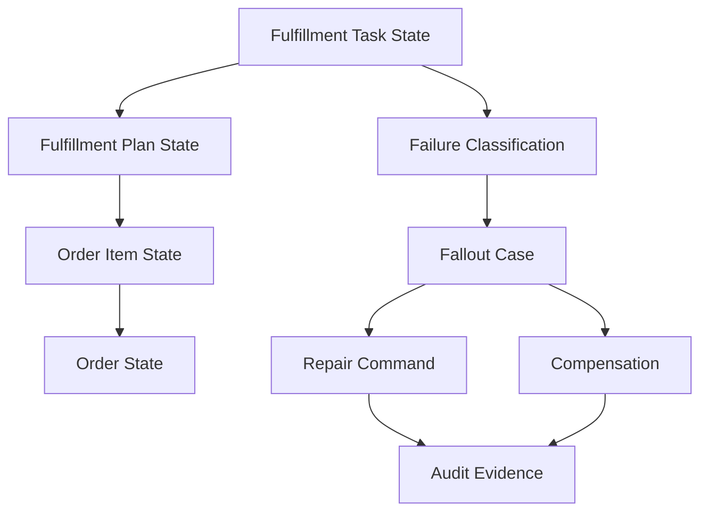
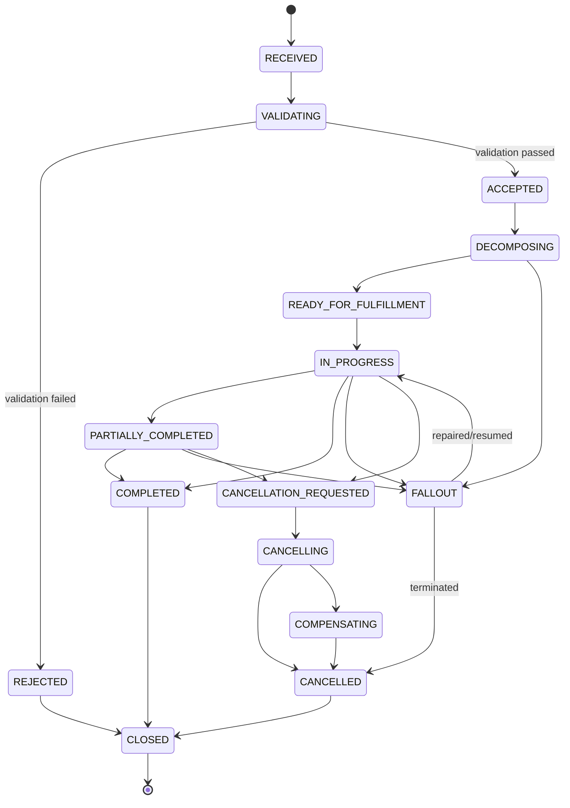
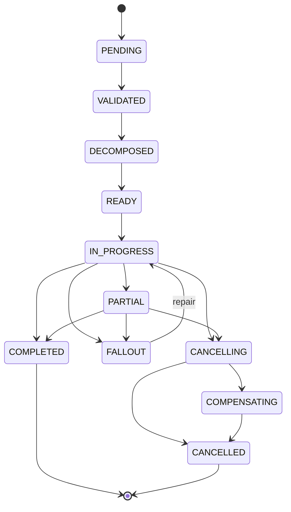
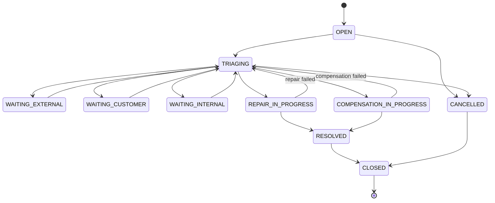
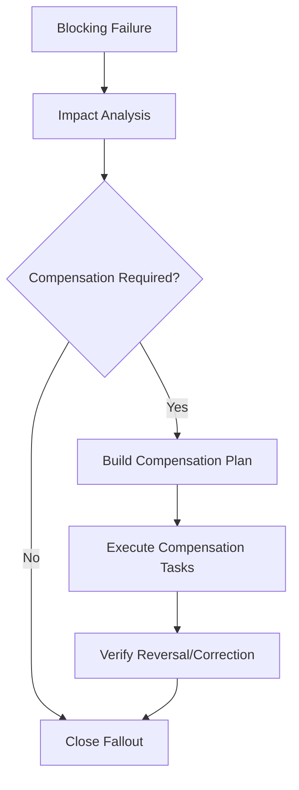
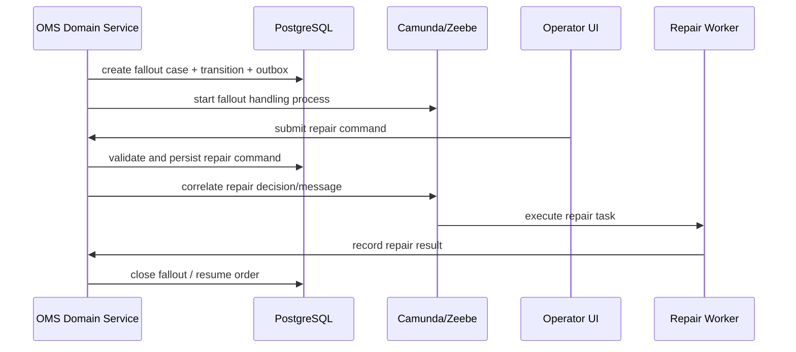
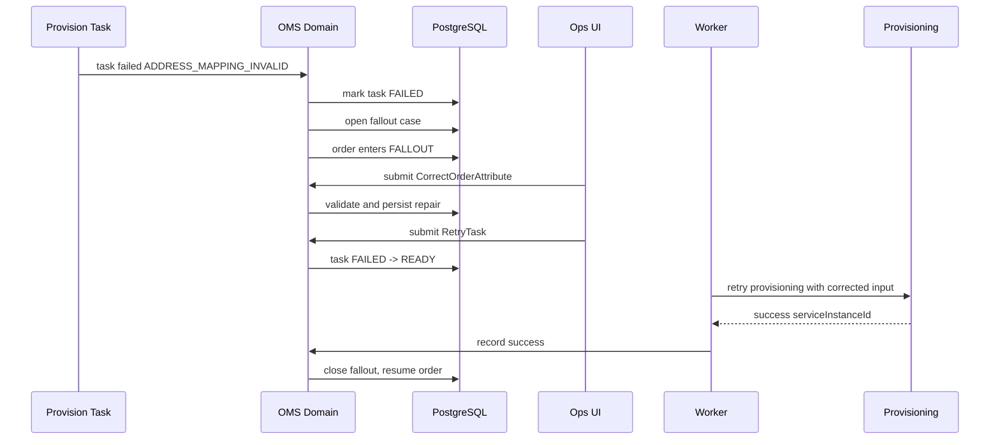

------
title: Build From Scratch: Enterprise Java Microservices CPQ & Order Management Platform - Part 038
description: Mendesain order state machine dan fallout management production-grade: order status, item status, fulfillment status, failure taxonomy, manual repair, compensation, reconciliation, audit, operational queue, dan safe recovery.
series: learn-enterprise-cpq-oms-glassfish-camunda8
seriesTitle: Build From Scratch: Enterprise Java Microservices CPQ & Order Management Platform
order: 38
partTitle: Order State Machine and Fallout Management
tags:
  - java
  - microservices
  - cpq
  - oms
  - order-state-machine
  - fallout-management
  - fulfillment
  - camunda-8
  - postgresql
  - mybatis
  - kafka
  - redis
  - enterprise-architecture
date: 2026-07-02
---

# Part 038 — Order State Machine and Fallout Management

Part 037 membuat fulfillment plan dan task model.

Sekarang kita bahas hal yang membedakan demo OMS dan enterprise OMS:

> Apa yang terjadi ketika order tidak berjalan mulus?

Di sistem produksi, order bisa macet karena:

- external provisioning timeout,
- resource sudah tidak tersedia,
- address tidak serviceable,
- partner system down,
- duplicate request,
- billing activation gagal,
- technician no-show,
- customer membatalkan di tengah jalan,
- workflow worker crash,
- Kafka event terlambat,
- data catalog berubah setelah order dibuat,
- installed base conflict,
- partial completion.

Kalau model state dan fallout salah, tim support akan melakukan update manual langsung ke database.

Itu awal dari kerusakan audit.

Target kita:

- order punya state machine yang eksplisit,
- order item punya state machine sendiri,
- fulfillment task punya state machine sendiri,
- failure punya taxonomy,
- fallout punya lifecycle,
- repair punya command,
- compensation punya evidence,
- reconciliation punya aturan,
- support operation punya safe tools.



Rule utama:

> Fallout is not just failure. Fallout is a managed exception state with ownership, evidence, repair path, and business impact.

---

## 1. Mental Model

Order management bukan “happy path workflow”.

Order management adalah sistem untuk menjaga execution commitment tetap terkendali meskipun dunia luar tidak deterministic.

Ada empat lapisan state:

```text
Order State
  high-level customer/business commitment

Order Item State
  per commercial item execution status

Fulfillment Plan State
  decomposition execution status

Fulfillment Task State
  executable unit status
```

Jangan pakai satu status untuk semua.

Satu `order.status = FAILED` tidak cukup menjelaskan:

- item mana yang gagal,
- task mana yang gagal,
- apakah sebagian sudah aktif,
- apakah billing sudah jalan,
- apakah asset sudah dibuat,
- apakah compensation perlu,
- apakah customer harus diberitahu,
- siapa owner berikutnya.

---

## 2. State Is a Contract

Status bukan label UI.

Status adalah kontrak sistem.

Status menentukan:

- command apa yang boleh,
- event apa yang boleh diterbitkan,
- workflow step apa yang boleh lanjut,
- operator action apa yang boleh,
- compensation apa yang wajib,
- customer communication apa yang benar,
- SLA mana yang dihitung,
- audit evidence apa yang diperlukan.

Jika status tidak punya konsekuensi, status itu noise.

---

## 3. Order State Machine

Order state adalah ringkasan business commitment.



Recommended states:

- `RECEIVED`,
- `VALIDATING`,
- `REJECTED`,
- `ACCEPTED`,
- `DECOMPOSING`,
- `READY_FOR_FULFILLMENT`,
- `IN_PROGRESS`,
- `PARTIALLY_COMPLETED`,
- `COMPLETED`,
- `FALLOUT`,
- `CANCELLATION_REQUESTED`,
- `CANCELLING`,
- `COMPENSATING`,
- `CANCELLED`,
- `CLOSED`.

Invariants:

- `REJECTED` order must not have active fulfillment plan.
- `READY_FOR_FULFILLMENT` order must have validated fulfillment plan.
- `IN_PROGRESS` order must have active plan or active tasks.
- `COMPLETED` order must have all required order items completed.
- `PARTIALLY_COMPLETED` order must have at least one completed item and at least one non-completed item.
- `FALLOUT` order must have unresolved fallout case.
- `CANCELLED` order must have cancellation decision and compensation result if needed.
- `CLOSED` order must be immutable except audit annotation.

---

## 4. Order Item State Machine

Order item state lebih detail karena partial fulfillment terjadi per item.



State item harus mempertimbangkan `actionType`:

- `ADD`,
- `MODIFY`,
- `DISCONNECT`,
- `MOVE`,
- `CANCEL`.

Contoh:

| Action | Completed Meaning |
|---|---|
| `ADD` | new asset/service active |
| `MODIFY` | existing asset changed to target configuration |
| `DISCONNECT` | service terminated/deactivated |
| `MOVE` | service moved to target location/resource |
| `CANCEL` | target order/item cancelled safely |

Jangan pakai arti `COMPLETED` yang sama tanpa melihat action type.

---

## 5. Fulfillment Plan and Task State Recap

Plan state dari Part 037:

- `DRAFT`,
- `VALIDATED`,
- `ACTIVATED`,
- `IN_PROGRESS`,
- `PARTIALLY_COMPLETED`,
- `COMPLETED`,
- `FALLOUT`,
- `CANCELLING`,
- `COMPENSATING`,
- `CANCELLED`.

Task state:

- `BLOCKED`,
- `READY`,
- `RUNNING`,
- `RETRY_WAIT`,
- `SUCCEEDED`,
- `SKIPPED`,
- `MANUAL_INTERVENTION`,
- `FAILED`,
- `CANCELLING`,
- `CANCELLED`,
- `COMPENSATING`,
- `COMPENSATED`.

Aggregation rule:

```text
Task states -> Plan state -> Order Item state -> Order state
```

But aggregation is not simple count.

It must understand:

- required vs optional task,
- blocking vs non-blocking task,
- item dependency,
- compensation requirement,
- failure severity,
- customer impact.

---

## 6. State Aggregation Algorithm

Simplified algorithm:

```java
OrderStatus deriveOrderStatus(Order order, List<OrderItem> items, List<FulfillmentPlan> plans) {
    if (order.isClosed()) return CLOSED;
    if (hasUnresolvedCancellation(order)) return CANCELLING;
    if (hasUnresolvedFallout(order)) return FALLOUT;
    if (allItemsRejected(items)) return REJECTED;
    if (allRequiredItemsCompleted(items)) return COMPLETED;
    if (anyRequiredItemCompleted(items) && anyRequiredItemInProgressOrFailed(items)) {
        return PARTIALLY_COMPLETED;
    }
    if (anyPlanActive(plans)) return IN_PROGRESS;
    if (allItemsReadyForFulfillment(items)) return READY_FOR_FULFILLMENT;
    if (order.isDecomposing()) return DECOMPOSING;
    if (order.isAccepted()) return ACCEPTED;
    return order.status();
}
```

Namun production implementation harus lebih explicit.

Buat `OrderStateDerivationService` dengan decision trace.

```text
DecisionTrace
  inputSummary
  matchedRule
  previousState
  proposedState
  reasonCode
```

Kenapa?

Karena ketika order tiba-tiba `FALLOUT`, operator butuh tahu rule mana yang menempatkannya di sana.

---

## 7. Transition Command, Not Direct Set

Jangan punya service seperti ini:

```java
order.setStatus("COMPLETED");
```

Gunakan command:

```java
completeOrder(command)
enterFallout(command)
resumeFromFallout(command)
requestCancellation(command)
startCompensation(command)
closeOrder(command)
```

Setiap command harus:

- load aggregate,
- validate current state,
- validate actor/permission,
- validate preconditions,
- apply transition,
- persist transition history,
- insert audit,
- insert outbox event.

---

## 8. State Transition Table

Simpan transition history.

```sql
create table order_state_transition (
  id uuid primary key,
  tenant_id text not null,
  order_id uuid not null,
  from_status text,
  to_status text not null,
  reason_code text not null,
  command_id text not null,
  actor_type text not null,
  actor_id text,
  correlation_id text not null,
  evidence_ref text,
  transition_data jsonb,
  occurred_at timestamptz not null,
  unique (tenant_id, command_id)
);

create index idx_order_state_transition_order
  on order_state_transition (tenant_id, order_id, occurred_at);
```

Do the same for:

- order item,
- fulfillment plan,
- fulfillment task,
- fallout case,
- compensation case.

Transition history adalah debugging superpower.

---

## 9. Fallout Definition

Fallout adalah kondisi managed exception ketika order tidak bisa otomatis lanjut.

Fallout bukan semua failure.

Transient failure yang masih dalam retry window bukan fallout.

Manual task yang memang normal bukan fallout.

Fallout terjadi ketika:

- automatic path tidak aman dilanjutkan,
- business decision dibutuhkan,
- data conflict perlu repair,
- compensation decision dibutuhkan,
- external state tidak match internal state,
- SLA breach signifikan,
- system cannot determine next safe action.

Rule:

> Fallout begins when automatic execution loses enough certainty that human-governed recovery is required.

---

## 10. Fallout Case Aggregate

Model:

```text
FalloutCase
  id
  tenantId
  orderId
  orderItemId?
  planId?
  taskId?
  status
  severity
  category
  reasonCode
  customerImpact
  financialImpact
  ownerGroup
  assignedTo
  detectedAt
  dueAt
  resolvedAt
  resolutionType
  resolutionCommandId
  evidence[]
  timeline[]
```

Fallout case bukan hanya row error.

Ia adalah unit kerja support/operation.

Status:

- `OPEN`,
- `TRIAGING`,
- `WAITING_EXTERNAL`,
- `WAITING_CUSTOMER`,
- `WAITING_INTERNAL`,
- `REPAIR_IN_PROGRESS`,
- `COMPENSATION_IN_PROGRESS`,
- `RESOLVED`,
- `CANCELLED`,
- `CLOSED`.

---

## 11. Fallout Lifecycle



Invariants:

- `OPEN` fallout must have reason code and source entity.
- `TRIAGING` fallout must have owner group.
- `REPAIR_IN_PROGRESS` fallout must reference repair command.
- `COMPENSATION_IN_PROGRESS` fallout must reference compensation command.
- `RESOLVED` fallout must have resolution type and evidence.
- `CLOSED` fallout must not have pending repair action.

---

## 12. Fallout Category

Category drives routing.

Recommended categories:

| Category | Meaning | Likely Owner |
|---|---|---|
| `DATA_QUALITY` | bad/missing order data | sales ops / order ops |
| `CONFIGURATION_CONFLICT` | product config incompatible | catalog/product ops |
| `RESOURCE_UNAVAILABLE` | resource reservation issue | network/inventory ops |
| `EXTERNAL_SYSTEM_FAILURE` | partner/core system failed | integration ops |
| `PROVISIONING_REJECTED` | provisioning rejected request | provisioning ops |
| `BILLING_FAILURE` | billing activation failed | billing ops |
| `ASSET_CONFLICT` | installed base conflict | asset ops |
| `DUPLICATE_EXECUTION_RISK` | possible duplicate fulfillment | order control |
| `COMPENSATION_REQUIRED` | rollback/repair needed | order recovery team |
| `UNKNOWN` | not classified | L2 support |

Never route everything to generic support.

Routing is part of the domain model.

---

## 13. Severity and Customer Impact

Severity is not the same as category.

Severity example:

- `LOW`,
- `MEDIUM`,
- `HIGH`,
- `CRITICAL`.

Customer impact:

- `NONE`,
- `DELAY_ONLY`,
- `SERVICE_NOT_ACTIVATED`,
- `SERVICE_DEGRADED`,
- `WRONG_BILLING_RISK`,
- `DUPLICATE_CHARGE_RISK`,
- `SERVICE_DISCONNECTED`,
- `LEGAL_OR_COMPLIANCE_RISK`.

Example:

```text
Category = BILLING_FAILURE
Severity = HIGH
CustomerImpact = WRONG_BILLING_RISK
```

This is different from:

```text
Category = EXTERNAL_SYSTEM_FAILURE
Severity = LOW
CustomerImpact = DELAY_ONLY
```

Operational priority must consider both.

---

## 14. PostgreSQL Schema for Fallout

```sql
create table fallout_case (
  id uuid primary key,
  tenant_id text not null,
  order_id uuid not null,
  order_item_id uuid,
  plan_id uuid,
  task_id uuid,
  status text not null,
  severity text not null,
  category text not null,
  reason_code text not null,
  customer_impact text not null,
  financial_impact text,
  owner_group text not null,
  assigned_to text,
  detected_at timestamptz not null,
  due_at timestamptz,
  resolved_at timestamptz,
  closed_at timestamptz,
  resolution_type text,
  resolution_command_id text,
  failure_snapshot jsonb not null,
  version bigint not null default 0
);

create table fallout_case_transition (
  id uuid primary key,
  tenant_id text not null,
  fallout_case_id uuid not null references fallout_case(id),
  from_status text,
  to_status text not null,
  reason_code text not null,
  actor_type text not null,
  actor_id text,
  command_id text not null,
  transition_data jsonb,
  occurred_at timestamptz not null,
  unique (tenant_id, command_id)
);

create table fallout_evidence (
  id uuid primary key,
  tenant_id text not null,
  fallout_case_id uuid not null references fallout_case(id),
  evidence_type text not null,
  evidence_ref text,
  payload_summary jsonb,
  payload_hash text,
  created_by text,
  created_at timestamptz not null
);
```

Indexes:

```sql
create index idx_fallout_case_worklist
  on fallout_case (tenant_id, status, severity, due_at, detected_at);

create index idx_fallout_case_order
  on fallout_case (tenant_id, order_id, detected_at desc);

create index idx_fallout_case_task
  on fallout_case (tenant_id, task_id)
  where task_id is not null;
```

---

## 15. Fallout Creation Rules

Fallout should be created by domain service, not by random catch block.

```java
public FalloutCase createFromTaskFailure(TaskFailure failure) {
    FalloutClassification classification = classifier.classify(failure);

    return FalloutCase.open(
        failure.tenantId(),
        failure.orderId(),
        failure.orderItemId(),
        failure.planId(),
        failure.taskId(),
        classification.category(),
        classification.severity(),
        classification.customerImpact(),
        classification.ownerGroup(),
        failure.reasonCode(),
        failure.snapshot(),
        clock.now()
    );
}
```

Classifier inputs:

- task type,
- failure code,
- failure category,
- retry exhausted flag,
- order action type,
- item criticality,
- customer segment,
- SLA breach,
- compensation requirement.

---

## 16. Failure Taxonomy

A useful taxonomy:

```text
Failure
  TechnicalTransient
  TechnicalPermanent
  BusinessRejected
  DataQuality
  StateConflict
  DuplicateRisk
  SecurityOrAuthorization
  ExternalInconsistency
  Unknown
```

### 16.1 Technical Transient

Examples:

- timeout,
- connection reset,
- HTTP 503,
- partner rate limit,
- temporary Kafka processing failure.

Treatment:

- retry with backoff,
- no fallout until retry exhausted or SLA breached.

### 16.2 Technical Permanent

Examples:

- wrong endpoint config,
- authentication failure,
- unsupported API version,
- schema mismatch.

Treatment:

- stop automatic retry,
- open fallout to integration/platform ops.

### 16.3 Business Rejected

Examples:

- address not serviceable,
- resource unavailable,
- customer not eligible,
- provisioning system rejects product combination.

Treatment:

- open fallout,
- business decision required.

### 16.4 Data Quality

Examples:

- missing address unit number,
- invalid customer identifier,
- inconsistent product characteristic,
- null required external mapping.

Treatment:

- repair data,
- revalidate,
- resume if safe.

### 16.5 State Conflict

Examples:

- asset already disconnected,
- subscription already modified by another order,
- order item stale version,
- task already completed externally but internal state pending.

Treatment:

- reconcile before deciding.

---

## 17. Repair Command Model

Repair must not mean direct data patch.

Repair is command-driven.

Examples:

- `CorrectOrderAttribute`,
- `ReplaceFulfillmentTaskInput`,
- `RetryTask`,
- `SkipNonCriticalTask`,
- `MarkExternalTaskSucceededWithEvidence`,
- `RebuildFulfillmentPlan`,
- `CancelOrderWithCompensation`,
- `ResumeOrderFromFallout`,
- `AttachEvidence`,
- `ChangeFalloutOwner`,
- `RequestCustomerAction`.

Each repair command must define:

- allowed fallout status,
- required permission,
- required evidence,
- validation logic,
- affected state,
- audit entry,
- outbox event,
- reversibility.

Example command:

```json
{
  "commandId": "cmd-7788",
  "falloutCaseId": "fc-123",
  "action": "RETRY_TASK",
  "reasonCode": "EXTERNAL_SYSTEM_RECOVERED",
  "comment": "Provisioning API is back online. Retry approved.",
  "expectedTaskVersion": 5
}
```

---

## 18. Safe Repair Principles

Repair must preserve causality.

Rules:

1. Never modify terminal business state without transition record.
2. Never mark external work complete without evidence.
3. Never retry non-idempotent external call without correlation strategy.
4. Never skip required task without business approval.
5. Never rebuild active plan without versioned replacement record.
6. Never close fallout if order is still blocked.
7. Never update asset state directly as a fallout repair unless repair command emits asset correction event.
8. Never delete failed attempts.

Support tools should guide operators into safe commands.

They should not expose raw database editing.

---

## 19. Compensation

Compensation happens when some effects already occurred but target outcome cannot or should not continue.

Examples:

- release reserved resource,
- cancel shipment,
- deactivate provisioned service,
- reverse installed base update,
- stop billing,
- create billing adjustment,
- notify customer.

Compensation is its own workflow.



Compensation is not necessarily full rollback.

Sometimes the correct action is forward correction.

Example:

- billing already activated incorrectly,
- invoice generated,
- cannot delete invoice,
- must create adjustment/credit.

---

## 20. Compensation Case Schema

```sql
create table compensation_case (
  id uuid primary key,
  tenant_id text not null,
  order_id uuid not null,
  order_item_id uuid,
  fallout_case_id uuid references fallout_case(id),
  status text not null,
  reason_code text not null,
  compensation_plan jsonb not null,
  started_at timestamptz,
  completed_at timestamptz,
  failed_at timestamptz,
  version bigint not null default 0
);

create table compensation_task (
  id uuid primary key,
  tenant_id text not null,
  compensation_case_id uuid not null references compensation_case(id),
  task_type text not null,
  status text not null,
  input_snapshot jsonb not null,
  output_snapshot jsonb,
  failure_snapshot jsonb,
  created_at timestamptz not null,
  completed_at timestamptz,
  version bigint not null default 0
);
```

Compensation can reuse fulfillment task concepts, but separate table may be clearer for audit.

Choose one model and be consistent.

---

## 21. Reconciliation

Reconciliation compares internal state and external reality.

Why needed?

Because distributed systems can experience:

- event loss from consumer perspective,
- duplicated delivery,
- external success but internal timeout,
- internal success but external rollback,
- delayed partner callbacks,
- operator action outside OMS.

Reconciliation questions:

- Does external provisioning order exist?
- Does service instance exist?
- Is billing active?
- Is asset state aligned?
- Is shipment delivered?
- Is appointment completed?
- Does Camunda process state match OMS plan state?

Reconciliation output:

- no mismatch,
- update evidence,
- open fallout,
- auto-repair,
- require manual decision.

---

## 22. Reconciliation Job Model

```sql
create table reconciliation_job (
  id uuid primary key,
  tenant_id text not null,
  job_type text not null,
  scope_type text not null,
  scope_id text not null,
  status text not null,
  started_at timestamptz,
  completed_at timestamptz,
  mismatch_count int not null default 0,
  created_at timestamptz not null
);

create table reconciliation_mismatch (
  id uuid primary key,
  tenant_id text not null,
  reconciliation_job_id uuid not null references reconciliation_job(id),
  order_id uuid,
  task_id uuid,
  mismatch_type text not null,
  internal_snapshot jsonb not null,
  external_snapshot jsonb not null,
  suggested_action text not null,
  fallout_case_id uuid,
  created_at timestamptz not null
);
```

Example mismatch:

```json
{
  "mismatchType": "EXTERNAL_SERVICE_ACTIVE_INTERNAL_TASK_FAILED",
  "suggestedAction": "MARK_TASK_SUCCEEDED_WITH_EVIDENCE",
  "internalSnapshot": {
    "taskStatus": "FAILED",
    "failureCode": "TIMEOUT"
  },
  "externalSnapshot": {
    "serviceStatus": "ACTIVE",
    "serviceInstanceId": "SVC-900"
  }
}
```

---

## 23. Kafka and Fallout Events

Events:

- `OrderEnteredFallout`,
- `OrderResumedFromFallout`,
- `FalloutCaseOpened`,
- `FalloutCaseAssigned`,
- `FalloutRepairStarted`,
- `FalloutRepairCompleted`,
- `CompensationStarted`,
- `CompensationCompleted`,
- `ReconciliationMismatchDetected`.

Topic candidate:

```text
oms.order-state.events.v1
oms.fallout.events.v1
oms.compensation.events.v1
oms.reconciliation.events.v1
```

Partition key:

```text
tenantId + ':' + orderId
```

Consumer must be idempotent.

Kafka decouples event producers and consumers, but it does not remove the need for consumer-side dedupe and state guards.

---

## 24. Camunda 8 Boundary for Fallout

Camunda can orchestrate repair and compensation flows.

But fallout case is domain state.

Pattern:



Do not store repair approval only as process variable.

Persist it in fallout case history.

---

## 25. Manual Intervention UI Contract

Operator UI should show:

- order summary,
- customer impact,
- failed task,
- failure reason,
- external references,
- retry history,
- related events,
- possible repair actions,
- required evidence,
- risk warning,
- audit timeline.

It should not show:

- arbitrary SQL edit box,
- raw internal state without explanation,
- unrestricted status dropdown,
- direct complete/cancel buttons without reason/evidence.

Good UI is a safety layer.

---

## 26. API Shape

### Open Fallout Case

Usually internal command.

```http
POST /internal/v1/fallout-cases
Idempotency-Key: cmd-open-fallout-123
```

```json
{
  "orderId": "order-123",
  "orderItemId": "item-1",
  "taskId": "task-9",
  "category": "PROVISIONING_REJECTED",
  "reasonCode": "ADDRESS_NOT_SERVICEABLE",
  "failureSnapshot": {}
}
```

### List Fallout Worklist

```http
GET /api/v1/fallout-cases?status=OPEN&ownerGroup=provisioning-ops&severity=HIGH
```

### Submit Repair Command

```http
POST /api/v1/fallout-cases/{falloutCaseId}/commands/retry-task
Idempotency-Key: cmd-retry-task-991
If-Match: "fallout-version-4"
```

```json
{
  "reasonCode": "EXTERNAL_SYSTEM_RECOVERED",
  "comment": "Provisioning partner confirmed recovery.",
  "expectedTaskVersion": 8
}
```

### Close Fallout

```http
POST /api/v1/fallout-cases/{falloutCaseId}/commands/close
Idempotency-Key: cmd-close-fallout-778
If-Match: "fallout-version-9"
```

```json
{
  "resolutionType": "REPAIRED_AND_RESUMED",
  "reasonCode": "TASK_RETRY_SUCCEEDED",
  "evidenceRefs": ["ev-123"]
}
```

---

## 27. MyBatis Mapper Direction

Fallout mapper should expose commands, not generic update.

```java
public interface FalloutCaseMapper {
    FalloutCaseRow findByIdForUpdate(
        @Param("tenantId") String tenantId,
        @Param("id") UUID id
    );

    int insert(FalloutCaseRow row);

    int transition(
        @Param("tenantId") String tenantId,
        @Param("id") UUID id,
        @Param("fromStatus") String fromStatus,
        @Param("toStatus") String toStatus,
        @Param("expectedVersion") long expectedVersion,
        @Param("resolvedAt") OffsetDateTime resolvedAt
    );

    int assign(
        @Param("tenantId") String tenantId,
        @Param("id") UUID id,
        @Param("ownerGroup") String ownerGroup,
        @Param("assignedTo") String assignedTo,
        @Param("expectedVersion") long expectedVersion
    );

    void insertTransition(FalloutTransitionRow row);

    void insertEvidence(FalloutEvidenceRow row);
}
```

Update with guard:

```xml
<update id="transition">
  update fallout_case
     set status = #{toStatus},
         resolved_at = #{resolvedAt},
         version = version + 1
   where tenant_id = #{tenantId}
     and id = #{id}
     and status = #{fromStatus}
     and version = #{expectedVersion}
</update>
```

Again: affected row matters.

---

## 28. State Machine Implementation Pattern

Avoid giant if-else scattered everywhere.

Use explicit transition registry.

```java
public final class StateMachine<S, C> {
    private final Map<TransitionKey<S, C>, TransitionRule<S, C>> rules;

    public TransitionDecision<S> decide(S current, C command, TransitionContext ctx) {
        TransitionRule<S, C> rule = rules.get(new TransitionKey<>(current, command));
        if (rule == null) {
            return TransitionDecision.rejected("TRANSITION_NOT_ALLOWED");
        }
        return rule.evaluate(ctx);
    }
}
```

Example transition:

```java
registry.allow(
    OrderStatus.FALLOUT,
    OrderCommand.RESUME_FROM_FALLOUT,
    ctx -> ctx.noOpenBlockingFallout()
        ? approve(OrderStatus.IN_PROGRESS, "FALLOUT_REPAIRED")
        : reject("BLOCKING_FALLOUT_STILL_OPEN")
);
```

State machine must return reason.

Not just boolean.

---

## 29. Audit Requirements

Every fallout/repair action must capture:

- actor,
- command ID,
- correlation ID,
- before state,
- after state,
- reason code,
- comment,
- evidence reference,
- impacted order/item/task,
- timestamp,
- source channel.

Audit event example:

```json
{
  "auditType": "FALLOUT_REPAIR_COMMAND_ACCEPTED",
  "tenantId": "telco-a",
  "orderId": "order-123",
  "falloutCaseId": "fc-123",
  "actorType": "HUMAN_OPERATOR",
  "actorId": "ops.user.44",
  "commandId": "cmd-99",
  "reasonCode": "EXTERNAL_SYSTEM_RECOVERED",
  "before": { "falloutStatus": "TRIAGING" },
  "after": { "falloutStatus": "REPAIR_IN_PROGRESS" },
  "occurredAt": "2026-07-02T10:00:00Z"
}
```

---

## 30. SLA and Escalation

Fallout must have SLA.

SLA can depend on:

- customer segment,
- product type,
- severity,
- customer impact,
- order age,
- regulatory obligation,
- partner SLA.

Escalation examples:

- owner group not assigned within 15 minutes,
- high severity not touched within 30 minutes,
- external wait exceeded 4 hours,
- customer impact unresolved after 1 day,
- compensation pending after billing cycle cutoff.

SLA event:

```json
{
  "eventType": "FalloutSlaBreached",
  "falloutCaseId": "fc-123",
  "severity": "HIGH",
  "breachType": "TRIAGE_DUE_EXCEEDED",
  "dueAt": "2026-07-02T12:00:00Z",
  "breachedAt": "2026-07-02T12:05:00Z"
}
```

---

## 31. Operational Anti-Patterns

### 31.1 Status Dropdown Admin

Bad UI:

```text
Order Status: [COMPLETED v]
Save
```

This bypasses invariants.

Use commands.

### 31.2 Close Fallout Without Repair

If fallout closes but task still failed, dashboard lies.

Close command must validate unblock condition.

### 31.3 Retry Everything

Blind retry creates duplicates.

Retry must inspect idempotency and external correlation.

### 31.4 Delete Failed Events

Never delete failure facts.

Add correction events.

### 31.5 Hidden Manual DB Update

Manual DB update is sometimes unavoidable in extreme incident response, but it must be followed by formal correction record, audit note, and reconciliation.

For normal operation, it should not be a supported workflow.

---

## 32. Example End-to-End Fallout Flow

Scenario:

- customer orders Fiber 1Gbps,
- serviceability check passed,
- resource reserved,
- provisioning rejects activation because address mapping changed,
- retry is not safe,
- fallout opened,
- operator corrects address reference,
- task retried,
- order resumes.



Important:

- address correction is recorded,
- retry command is recorded,
- task attempt history remains,
- failure remains visible,
- order state transition is auditable.

---

## 33. Testing Strategy

### 33.1 State Machine Tests

Test every valid transition.

Test invalid transitions:

- `COMPLETED -> IN_PROGRESS`,
- `CLOSED -> FALLOUT`,
- `REJECTED -> READY_FOR_FULFILLMENT`,
- `FALLOUT -> COMPLETED` with open fallout,
- `CANCELLED -> COMPENSATING` without cancellation context.

### 33.2 Fallout Classification Tests

Input failure -> expected category/severity/owner.

Examples:

- HTTP 503 before retry exhausted -> no fallout,
- HTTP 503 after retry exhausted -> `EXTERNAL_SYSTEM_FAILURE`,
- address not serviceable -> `PROVISIONING_REJECTED`,
- duplicate external activation -> `DUPLICATE_EXECUTION_RISK`,
- asset already modified -> `ASSET_CONFLICT`.

### 33.3 Repair Command Tests

- retry task allowed only if failure retryable or operator override allowed,
- skip task requires non-critical task,
- mark succeeded requires evidence,
- close fallout requires unblock condition,
- resume order requires no blocking fallout.

### 33.4 Persistence Tests

- optimistic lock,
- command dedupe,
- transition history insert,
- evidence insert,
- worklist query,
- SLA due index,
- tenant isolation.

### 33.5 Integration Tests

- Camunda job failure opens fallout,
- repair command correlates workflow message,
- Kafka fallout event emitted through outbox,
- duplicate repair command replay returns same result,
- reconciliation mismatch opens fallout.

---

## 34. Production Readiness Checklist

Before shipping fallout management:

- every state transition has command,
- every command has permission check,
- every repair command has reason code,
- every manual success override requires evidence,
- every fallout has owner group,
- every unresolved fallout blocks order completion,
- every compensation has evidence,
- every task retry is idempotent,
- every worklist query is tenant-scoped,
- every event is emitted through outbox,
- every support action is audited,
- every state derivation has explainable reason,
- every dashboard count reconciles with source tables.

---

## 35. Part Summary

Order state machine is not UI decoration.

It is a control system for business commitment.

Enterprise OMS needs separate but connected state machines for order, order item, fulfillment plan, fulfillment task, fallout case, and compensation.

Fallout is not merely error handling. Fallout is a managed operational exception with ownership, severity, customer impact, evidence, repair command, SLA, and audit.

Repair must be command-driven, not direct database mutation.

Compensation is not undo. It is controlled correction of already-created effects.

Reconciliation is mandatory because distributed systems can disagree.

With this foundation, Part 039 can safely discuss cancellation, amendment, and supplemental orders—because now we have a model for partial completion, fallout, compensation, and recovery.

---

## 36. References

- Camunda 8 Docs — Job Workers: https://docs.camunda.io/docs/components/concepts/job-workers/
- Camunda 8 Docs — Service Tasks: https://docs.camunda.io/docs/components/modeler/bpmn/service-tasks/
- PostgreSQL Documentation — Constraints: https://www.postgresql.org/docs/current/ddl-constraints.html
- PostgreSQL Documentation — Transaction Isolation: https://www.postgresql.org/docs/current/transaction-iso.html
- Apache Kafka Documentation: https://kafka.apache.org/documentation/
- MyBatis 3 Documentation — XML Mapper: https://mybatis.org/mybatis-3/sqlmap-xml.html
