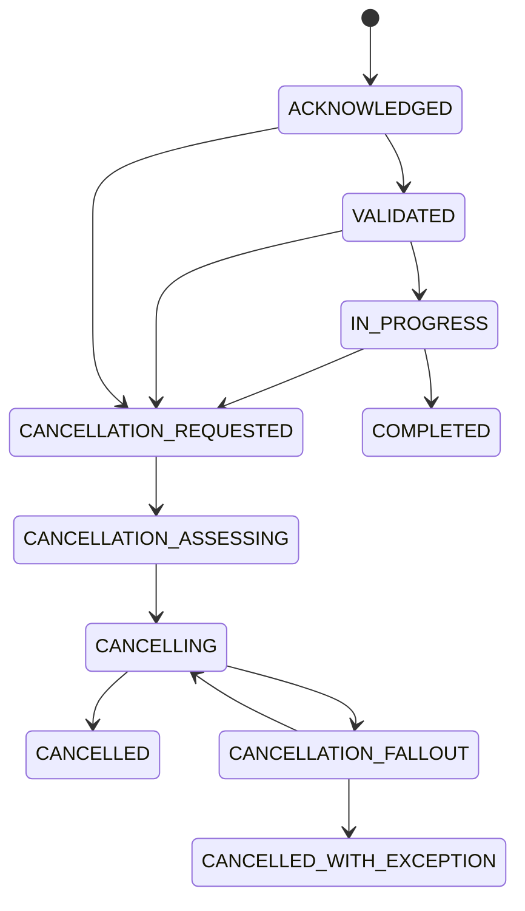
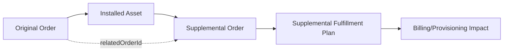
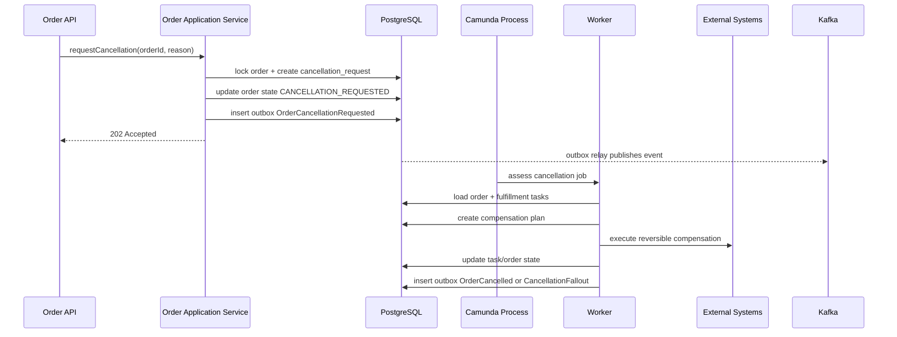
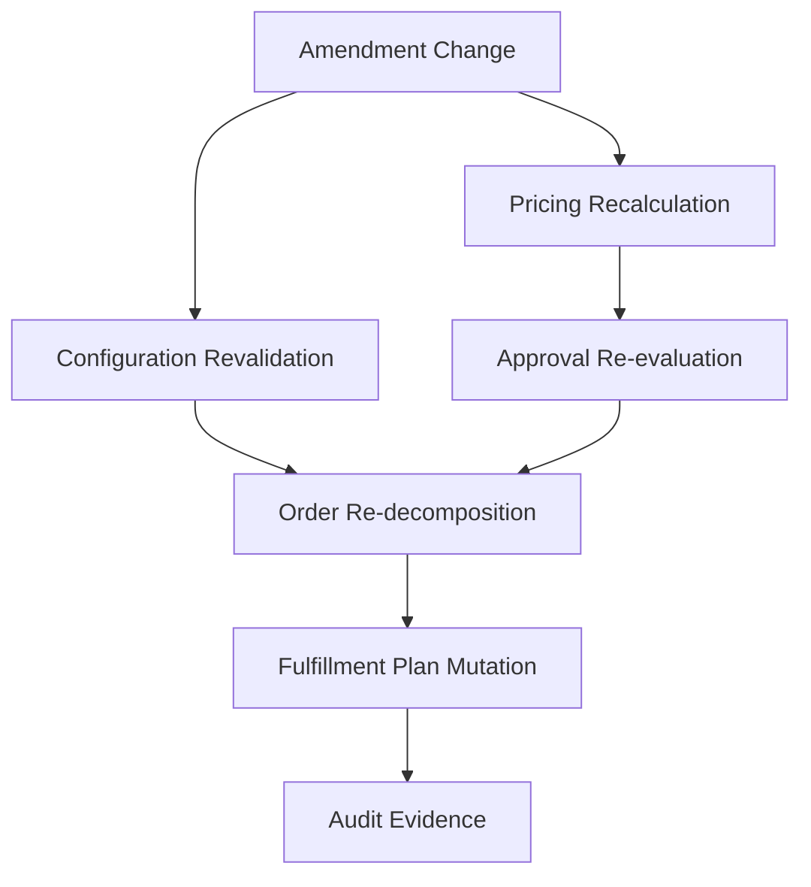

------
title: Build From Scratch: Enterprise Java Microservices CPQ & Order Management Platform - Part 039
description: Cancellation, amendment, and supplemental order design for a production-grade enterprise OMS, including commercial intent, fulfillment impact, state safety, compensation, audit, and implementation boundaries.
series: learn-enterprise-cpq-oms-glassfish-camunda8
seriesTitle: Build From Scratch: Enterprise Java Microservices CPQ & Order Management Platform
order: 39
partTitle: Cancellation, Amendment, and Supplemental Orders
tags:
  - java
  - microservices
  - cpq
  - oms
  - cancellation
  - amendment
  - supplemental-order
  - state-machine
  - fulfillment
  - postgresql
  - mybatis
  - camunda-8
  - kafka
  - enterprise-architecture
date: 2026-07-02
---

# Part 039 — Cancellation, Amendment, and Supplemental Orders

Pada sistem OMS kecil, order biasanya hanya punya dua pertanyaan:

1. apakah order berhasil?
2. apakah order gagal?

Pada sistem OMS enterprise, pertanyaannya lebih sulit:

1. bagaimana kalau customer membatalkan order ketika sebagian task sudah selesai?
2. bagaimana kalau order perlu diubah setelah submit?
3. bagaimana kalau order awal sudah completed, lalu ada perubahan tambahan yang harus dieksekusi tanpa menghapus jejak order lama?
4. bagaimana kalau provisioning berhasil tetapi billing activation gagal?
5. bagaimana kalau order sudah membentuk asset, lalu customer ingin downgrade, disconnect, relocate, atau add-on?

Itulah alasan kita butuh desain **cancellation**, **amendment**, dan **supplemental order**.

Bagian ini bukan tentang tombol `Cancel`. Bagian ini tentang bagaimana sebuah OMS menjaga **execution commitment** tetap benar ketika realita bisnis berubah setelah order berjalan.

---

## 1. Mental Model

Satu kalimat penting:

> Setelah order submitted, perubahan bukan lagi sekadar update row. Perubahan adalah business event baru yang harus divalidasi, dijelaskan, dieksekusi, dan diaudit.

Sebelum submit, quote/order draft masih relatif bebas dimutasi.

Setelah submit, order sudah menjadi komitmen eksekusi. Ia mungkin sudah:

- mengunci inventory,
- membuat appointment,
- membuat work order,
- mengirim event ke billing,
- membuat service instance,
- memulai proses provisioning,
- membuka task manual,
- atau mengirim dokumen kontrak.

Maka operasi seperti cancellation dan amendment tidak boleh dianggap sebagai `UPDATE order_item SET ...`.

Mereka adalah **new commands over existing commitment**.

---

## 2. Istilah Yang Harus Dipisahkan

Kita pakai empat istilah dengan makna berbeda.

| Istilah | Makna | Contoh |
|---|---|---|
| Cancellation | Menghentikan order yang sedang berjalan atau belum selesai | Customer batal sebelum provisioning final |
| Amendment | Mengubah order yang masih in-flight dengan kontrol ketat | Ganti alamat instalasi sebelum field visit |
| Supplemental Order | Order baru yang melengkapi order/asset yang sudah ada | Tambah add-on setelah layanan aktif |
| Compensation | Tindakan teknis/bisnis untuk membalik efek task yang sudah terjadi | Release inventory reservation, cancel shipment |

Kesalahan umum adalah mencampur semuanya ke satu endpoint:

```http
PATCH /orders/{id}
```

Itu buruk untuk enterprise OMS, karena tidak menjawab:

- siapa yang meminta perubahan,
- apa alasan perubahan,
- state apa yang sedang terjadi,
- task mana yang sudah irreversible,
- apakah customer impact berubah,
- apakah billing impact berubah,
- apakah approval dibutuhkan,
- apakah fulfillment harus dihentikan,
- apakah order lama tetap valid secara audit.

---

## 3. Cancellation Is Not Deletion

Cancellation tidak berarti order dihapus.

Order enterprise harus tetap ada karena order adalah evidence:

- commercial intent,
- customer request,
- timestamp,
- approval,
- configuration snapshot,
- price snapshot,
- fulfillment attempt,
- fallout,
- compensation,
- dan final disposition.

Jadi operasi cancel menghasilkan state baru, bukan menghilangkan fakta lama.



Perhatikan state `CANCELLATION_REQUESTED` dan `CANCELLATION_ASSESSING`.

Ini penting karena cancellation punya dua fase:

1. **request phase** — seseorang meminta cancel.
2. **impact phase** — sistem menilai apakah cancel bisa dilakukan, sebagian, atau tidak bisa.

---

## 4. Cancellation Taxonomy

Tidak semua cancellation sama.

### 4.1 Pre-Execution Cancellation

Order sudah submitted tetapi fulfillment belum melakukan efek eksternal.

Contoh:

- order baru masuk,
- belum reserve inventory,
- belum kirim provisioning command,
- belum schedule technician,
- belum create billing account.

Ini cancellation paling mudah.

Biasanya cukup:

- mark order as cancelled,
- publish `OrderCancelled`,
- close process instance,
- audit reason.

### 4.2 In-Flight Reversible Cancellation

Sebagian task sudah berjalan tetapi masih reversible.

Contoh:

- inventory sudah reserved tetapi bisa direlease,
- appointment sudah dibuat tetapi bisa dibatalkan,
- shipment belum dikirim,
- provisioning belum commit final.

Cancellation butuh compensation plan.

### 4.3 In-Flight Partially Irreversible Cancellation

Sebagian task sudah irreversible.

Contoh:

- SIM sudah dikirim,
- perangkat sudah dipasang,
- service sudah aktif,
- nomor sudah dipindah,
- resource sudah assigned ke network.

Dalam kasus ini, cancellation bisa berubah menjadi:

- partial cancel,
- disconnect order,
- return order,
- service rollback order,
- billing adjustment,
- manual fallout.

### 4.4 Post-Completion Cancellation

Jika order sudah completed, cancellation biasanya bukan cancel order lama.

Ia menjadi order baru, misalnya:

- disconnect order,
- return order,
- termination order,
- reversal order,
- credit adjustment order.

Order completed tidak boleh “dibatalkan” secara historis.

Yang benar:

> buat transaksi baru yang merepresentasikan permintaan pembatalan atas asset/effect yang sudah terbentuk.

---

## 5. Amendment Is Controlled Mutation

Amendment adalah perubahan terhadap order yang masih in-flight.

Namun amendment tidak boleh mengabaikan fakta bahwa sebagian order mungkin sudah dieksekusi.

Contoh amendment:

- mengganti installation address,
- mengganti appointment slot,
- mengubah contact person,
- menambah add-on sebelum provisioning,
- mengganti device model sebelum shipment,
- mengoreksi customer data,
- mengubah quantity,
- mengubah start date.

Tidak semua field amendable.

Rule dasar:

> Sebuah field boleh diamend hanya jika perubahan itu tidak melanggar snapshot komersial, tidak merusak fulfillment yang sudah terjadi, dan punya audit trail yang jelas.

---

## 6. Amendment Classification

| Jenis Amendment | Contoh | Risiko |
|---|---|---|
| Administrative | contact phone, delivery note | rendah |
| Scheduling | appointment slot | sedang |
| Fulfillment Routing | installation address | tinggi |
| Commercial | product, price, quantity | sangat tinggi |
| Contractual | term, commitment period | sangat tinggi |
| Technical | resource option, device | tinggi |

Administrative amendment sering bisa dilakukan langsung.

Commercial amendment biasanya harus kembali ke CPQ/quote validation.

Fulfillment amendment harus dicek terhadap task graph.

Technical amendment harus dicek terhadap decomposition mapping.

---

## 7. Supplemental Order

Supplemental order adalah order baru yang berkaitan dengan order atau asset sebelumnya.

Contoh:

- customer sudah punya broadband, lalu tambah static IP,
- customer sudah punya subscription, lalu upgrade bandwidth,
- order awal completed, lalu customer minta additional device,
- order utama berhasil, lalu ada order adjustment untuk billing correction,
- ada fallout repair yang membutuhkan order tambahan.

Supplemental order bukan patch terhadap order lama.

Ia memiliki:

- `order_id` sendiri,
- lifecycle sendiri,
- state machine sendiri,
- fulfillment plan sendiri,
- audit trail sendiri,
- relation ke order/asset sebelumnya.



---

## 8. Relationship Model

Kita butuh relationship eksplisit antar order.

```sql
create table order_relation (
    order_relation_id uuid primary key,
    tenant_id uuid not null,
    source_order_id uuid not null,
    target_order_id uuid not null,
    relation_type varchar(40) not null,
    reason_code varchar(80),
    created_at timestamptz not null,
    created_by varchar(120) not null,
    unique (tenant_id, source_order_id, target_order_id, relation_type)
);
```

Contoh `relation_type`:

- `AMENDS`
- `CANCELS`
- `SUPPLEMENTS`
- `REPLACES`
- `COMPENSATES`
- `REPAIRS`
- `ROLLS_BACK`
- `SPLITS_FROM`

Dengan model ini, kita tidak perlu memalsukan sejarah order.

Kita bisa menjawab:

- order ini berasal dari order apa?
- order ini membatalkan apa?
- order ini memperbaiki fallout apa?
- order ini menambah asset mana?
- perubahan customer terjadi melalui order apa?

---

## 9. Cancellation Command Model

Endpoint cancellation sebaiknya command-oriented.

```http
POST /api/v1/orders/{orderId}/cancellation-requests
Idempotency-Key: 9d2a...
If-Match: "order-version-17"
```

Payload:

```json
{
  "reasonCode": "CUSTOMER_CHANGED_MIND",
  "reasonText": "Customer requested cancellation before installation",
  "requestedBy": {
    "actorType": "USER",
    "actorId": "u-123"
  },
  "requestedAt": "2026-07-02T10:15:00Z",
  "scope": {
    "type": "ORDER",
    "orderItemIds": []
  },
  "forceManualReview": false
}
```

Output tidak boleh langsung menjanjikan order cancelled jika impact belum dievaluasi.

```json
{
  "cancellationRequestId": "cr-001",
  "orderId": "ord-001",
  "status": "ACCEPTED_FOR_ASSESSMENT",
  "currentOrderState": "CANCELLATION_REQUESTED",
  "links": {
    "self": "/api/v1/orders/ord-001/cancellation-requests/cr-001"
  }
}
```

---

## 10. Cancellation Assessment

Cancellation assessment menjawab pertanyaan:

1. task mana belum dimulai?
2. task mana sedang berjalan?
3. task mana sudah selesai?
4. task mana reversible?
5. task mana irreversible?
6. compensation apa yang diperlukan?
7. apakah cancellation bisa otomatis?
8. apakah butuh approval/manual review?
9. apakah cancellation menjadi supplemental order?

Model sederhana:

```java
public record CancellationAssessment(
    UUID orderId,
    CancellationFeasibility feasibility,
    List<TaskImpact> taskImpacts,
    List<CompensationAction> compensations,
    List<String> blockers,
    boolean manualReviewRequired
) {}

public enum CancellationFeasibility {
    FULLY_CANCELLABLE,
    PARTIALLY_CANCELLABLE,
    NOT_CANCELLABLE,
    REQUIRES_MANUAL_REVIEW
}
```

---

## 11. Task Reversibility Model

Fulfillment task harus punya reversibility metadata.

```sql
alter table fulfillment_task add column reversibility varchar(40) not null default 'UNKNOWN';
alter table fulfillment_task add column compensation_task_type varchar(80);
alter table fulfillment_task add column irreversible_after_state varchar(40);
alter table fulfillment_task add column external_effect_level varchar(40) not null default 'UNKNOWN';
```

Contoh `reversibility`:

- `NONE`
- `AUTOMATIC`
- `MANUAL`
- `PARTIAL`
- `UNKNOWN`

Contoh `external_effect_level`:

- `NO_EXTERNAL_EFFECT`
- `RESERVATION_ONLY`
- `CUSTOMER_VISIBLE`
- `BILLING_VISIBLE`
- `NETWORK_VISIBLE`
- `LEGAL_VISIBLE`

Rule:

> Cancellation engine tidak boleh mengambil keputusan hanya dari status task. Ia harus mempertimbangkan external effect.

Task `COMPLETED` belum tentu irreversible.

Task `IN_PROGRESS` belum tentu safe untuk diinterupsi.

---

## 12. Compensation Plan

Jika task sudah memberi efek eksternal, cancellation butuh compensation.

Contoh:

| Original Task | Compensation |
|---|---|
| Reserve inventory | Release inventory reservation |
| Create appointment | Cancel appointment |
| Ship device | Stop shipment / return device |
| Activate service | Deactivate service |
| Notify billing activation | Send billing reversal/credit |
| Assign resource | Release resource |

Compensation plan harus disimpan, bukan hanya dihitung di memori.

```sql
create table compensation_plan (
    compensation_plan_id uuid primary key,
    tenant_id uuid not null,
    order_id uuid not null,
    cancellation_request_id uuid,
    status varchar(40) not null,
    created_at timestamptz not null,
    completed_at timestamptz,
    version bigint not null default 0
);

create table compensation_task (
    compensation_task_id uuid primary key,
    tenant_id uuid not null,
    compensation_plan_id uuid not null,
    original_fulfillment_task_id uuid,
    task_type varchar(80) not null,
    status varchar(40) not null,
    dependency_group varchar(80),
    input_snapshot jsonb not null,
    output_snapshot jsonb,
    failure_reason text,
    created_at timestamptz not null,
    completed_at timestamptz,
    version bigint not null default 0
);
```

---

## 13. Cancellation Execution Flow



Hal penting:

- API tidak melakukan external compensation secara langsung.
- Cancellation request disimpan durable.
- Order state berubah secara eksplisit.
- Compensation punya state sendiri.
- Kafka event diterbitkan via outbox.
- Camunda orchestration menjalankan flow panjang.

---

## 14. Amendment Command Model

Endpoint amendment juga command-oriented.

```http
POST /api/v1/orders/{orderId}/amendment-requests
Idempotency-Key: 3c77...
If-Match: "order-version-21"
```

Payload:

```json
{
  "reasonCode": "CUSTOMER_ADDRESS_CORRECTION",
  "changes": [
    {
      "path": "/deliveryAddress/postalCode",
      "operation": "REPLACE",
      "oldValue": "12930",
      "newValue": "12940"
    }
  ],
  "requestedBy": {
    "actorType": "USER",
    "actorId": "agent-44"
  }
}
```

Namun internal system tidak boleh blindly apply JSON Patch ke aggregate.

Setiap change harus diterjemahkan ke domain command:

- `ChangeInstallationAddress`
- `ChangeAppointmentWindow`
- `ChangeContactPerson`
- `ChangeDeviceModel`
- `ChangeRequestedStartDate`
- `ChangeOrderItemQuantity`

---

## 15. Amendment Safety Matrix

Kita butuh matrix per field/per phase.

| Field | Before Decomposition | After Decomposition | After Task Started | After Task Completed |
|---|---:|---:|---:|---:|
| Contact phone | allowed | allowed | allowed | allowed |
| Delivery note | allowed | allowed | allowed if shipment not dispatched | blocked/manual |
| Installation address | allowed | re-decompose | blocked/manual | blocked |
| Product offering | allowed via revalidation | blocked/manual | blocked | blocked |
| Device model | allowed | re-decompose | blocked if picked | blocked |
| Price | allowed if not accepted | blocked | blocked | blocked |
| Appointment slot | allowed | allowed | allowed if not started | blocked |

Matrix ini tidak boleh hanya ada di dokumen.

Ia harus menjadi policy data atau code rule yang dites.

---

## 16. Amendment Aggregate

```sql
create table order_amendment_request (
    amendment_request_id uuid primary key,
    tenant_id uuid not null,
    order_id uuid not null,
    requested_by varchar(120) not null,
    reason_code varchar(80) not null,
    status varchar(40) not null,
    requested_at timestamptz not null,
    assessed_at timestamptz,
    applied_at timestamptz,
    rejected_at timestamptz,
    rejection_reason text,
    request_hash varchar(128) not null,
    version bigint not null default 0,
    unique (tenant_id, order_id, request_hash)
);

create table order_amendment_change (
    amendment_change_id uuid primary key,
    tenant_id uuid not null,
    amendment_request_id uuid not null,
    target_type varchar(40) not null,
    target_id uuid,
    change_type varchar(80) not null,
    before_value jsonb,
    after_value jsonb,
    safety_result varchar(40) not null,
    blocker_reason text
);
```

Status amendment:

- `REQUESTED`
- `ASSESSING`
- `REQUIRES_APPROVAL`
- `APPROVED`
- `APPLYING`
- `APPLIED`
- `REJECTED`
- `FAILED`
- `CANCELLED`

---

## 17. Amendment Impact Assessment

Sebelum apply, sistem harus membuat impact assessment.

```java
public record AmendmentImpactAssessment(
    UUID orderId,
    UUID amendmentRequestId,
    AmendmentFeasibility feasibility,
    List<ChangeImpact> changeImpacts,
    boolean requiresRepricing,
    boolean requiresReconfiguration,
    boolean requiresRedecomposition,
    boolean requiresApproval,
    boolean requiresManualReview,
    List<String> blockers
) {}
```

Jika amendment mengubah product, quantity, address, atau date, maka effect-nya bisa merambat:



Rule:

> Jangan apply amendment parsial tanpa menyimpan impact assessment.

---

## 18. Re-Decomposition

Jika amendment mengubah input fulfillment, order mungkin perlu re-decomposition.

Contoh:

- address berubah dari area A ke area B,
- product add-on berubah,
- installation type berubah,
- device model berubah,
- delivery method berubah.

Ada tiga strategi:

### 18.1 Replace Pending Tasks

Task yang belum dimulai dibatalkan dan diganti.

Cocok jika perubahan tidak menyentuh task yang sudah berjalan.

### 18.2 Create Delta Tasks

Tambahkan task baru untuk menyesuaikan state.

Cocok untuk supplemental effect.

### 18.3 Manual Fallout

Jika perubahan menyentuh task irreversible, masukkan ke fallout/manual review.

Cocok untuk high-risk changes.

---

## 19. Supplemental Order Design

Supplemental order sebaiknya memakai order aggregate yang sama, tetapi dengan `order_type` berbeda.

```sql
alter table customer_order add column order_type varchar(40) not null default 'STANDARD';
alter table customer_order add column parent_order_id uuid;
alter table customer_order add column related_asset_id uuid;
alter table customer_order add column supplemental_reason_code varchar(80);
```

Contoh `order_type`:

- `STANDARD`
- `AMENDMENT`
- `CANCELLATION`
- `SUPPLEMENTAL`
- `DISCONNECT`
- `RETURN`
- `REPAIR`
- `BILLING_ADJUSTMENT`

Namun hati-hati:

> Jangan membuat terlalu banyak subclass order sebelum domain jelas.

Di awal, cukup gunakan `order_type` + relation + action type.

---

## 20. Asset Impact

Supplemental order sering bekerja atas installed base.

Contoh order item:

```json
{
  "action": "MODIFY",
  "targetAssetId": "asset-123",
  "productOfferingId": "fiber-speed-500mbps",
  "configuration": {
    "bandwidth": "500M"
  }
}
```

Sebelum order diterima, sistem harus mengambil installed base snapshot.

Snapshot ini menjawab:

- asset masih aktif?
- customer masih owner?
- subscription masih valid?
- product offering baru kompatibel?
- service/resource instance bisa dimodifikasi?
- ada order lain yang sedang memodifikasi asset yang sama?

Concurrency guard untuk asset penting.

```sql
create unique index uq_active_asset_modification_order
on customer_order (tenant_id, related_asset_id)
where order_state in ('ACKNOWLEDGED','VALIDATED','IN_PROGRESS','FALLOUT');
```

Index seperti ini mencegah dua order in-flight memodifikasi asset yang sama tanpa coordination.

---

## 21. PostgreSQL Transaction Boundary

Cancellation request transaction:

1. validate user access,
2. lock order row,
3. verify state,
4. verify version,
5. create cancellation request,
6. update order state,
7. insert audit,
8. insert outbox,
9. commit.

Tidak termasuk:

- call billing,
- call provisioning,
- call shipment,
- complete Camunda task,
- publish Kafka directly.

Amendment request transaction:

1. lock order,
2. create amendment request,
3. store requested changes,
4. update order state if needed,
5. insert audit,
6. insert outbox,
7. commit.

Impact assessment dan apply bisa transaction terpisah karena mungkin panjang.

---

## 22. MyBatis Mapper Direction

Mapper harus eksplisit.

```java
public interface OrderMutationMapper {
    OrderRow selectOrderForUpdate(@Param("tenantId") UUID tenantId,
                                  @Param("orderId") UUID orderId);

    int updateOrderState(@Param("tenantId") UUID tenantId,
                         @Param("orderId") UUID orderId,
                         @Param("expectedVersion") long expectedVersion,
                         @Param("newState") String newState);

    void insertCancellationRequest(CancellationRequestRow row);

    void insertAmendmentRequest(AmendmentRequestRow row);

    void insertAmendmentChange(AmendmentChangeRow row);

    void insertOrderRelation(OrderRelationRow row);
}
```

XML fragment:

```xml
<select id="selectOrderForUpdate" resultMap="OrderRowMap">
  select *
  from customer_order
  where tenant_id = #{tenantId}
    and order_id = #{orderId}
  for update
</select>
```

---

## 23. Kafka Events

Cancellation events:

- `OrderCancellationRequested`
- `OrderCancellationAssessed`
- `OrderCancellationRejected`
- `OrderCompensationStarted`
- `OrderCompensationCompleted`
- `OrderCancelled`
- `OrderCancellationFalloutCreated`

Amendment events:

- `OrderAmendmentRequested`
- `OrderAmendmentAssessed`
- `OrderAmendmentRejected`
- `OrderAmendmentApproved`
- `OrderAmendmentApplied`
- `OrderReDecompositionRequired`
- `OrderAmendmentFalloutCreated`

Supplemental events:

- `SupplementalOrderCreated`
- `SupplementalOrderLinked`
- `AssetModificationOrderStarted`
- `AssetModificationOrderCompleted`

Events harus menjelaskan state change, bukan membawa seluruh internal aggregate.

---

## 24. Camunda Boundary

Camunda cocok untuk orchestration cancellation/amendment karena prosesnya long-running.

Namun business decision tetap di domain service.

Camunda process boleh mengatur:

- assess cancellation,
- create compensation plan,
- execute compensation tasks,
- wait for external callback,
- create manual task,
- escalate timeout,
- continue after repair.

Camunda process tidak boleh menjadi tempat tersembunyi untuk:

- menentukan apakah price boleh berubah,
- menentukan apakah order item valid,
- menyimpan canonical order state,
- menghitung decomposition rule utama,
- menjadi satu-satunya audit trail.

---

## 25. API Shape

Cancellation:

```http
POST /api/v1/orders/{orderId}/cancellation-requests
GET  /api/v1/orders/{orderId}/cancellation-requests/{requestId}
POST /api/v1/orders/{orderId}/cancellation-requests/{requestId}/approve
POST /api/v1/orders/{orderId}/cancellation-requests/{requestId}/reject
```

Amendment:

```http
POST /api/v1/orders/{orderId}/amendment-requests
GET  /api/v1/orders/{orderId}/amendment-requests/{requestId}
POST /api/v1/orders/{orderId}/amendment-requests/{requestId}/approve
POST /api/v1/orders/{orderId}/amendment-requests/{requestId}/apply
POST /api/v1/orders/{orderId}/amendment-requests/{requestId}/reject
```

Supplemental:

```http
POST /api/v1/orders/{orderId}/supplemental-orders
GET  /api/v1/orders/{orderId}/related-orders
```

---

## 26. Failure Modes

| Failure | Dampak | Guardrail |
|---|---|---|
| Cancel order completed dengan update langsung | history rusak | completed order immutable |
| Amendment applied setelah task irreversible | fulfillment corrupt | task reversibility matrix |
| Duplicate cancellation request | double compensation | idempotency + request hash |
| Compensation gagal | order stuck | compensation fallout |
| Two supplemental orders modify same asset | race condition | asset-level concurrency guard |
| Camunda incident tidak sync ke order | operational blind spot | domain state + workflow reference reconciliation |
| External cancel succeeds but DB update fails | split-brain | external call attempt log + reconciliation |
| Manual repair tanpa audit | defensibility hilang | repair command + audit evidence |

---

## 27. Testing Strategy

Minimal test suite:

1. cancellation before fulfillment starts,
2. cancellation after reservation,
3. cancellation after irreversible activation,
4. duplicate cancellation with same idempotency key,
5. duplicate cancellation with different payload,
6. amendment contact info after task started,
7. amendment address after decomposition,
8. amendment product after approval,
9. supplemental add-on against active asset,
10. two supplemental orders competing on same asset,
11. compensation failure creates fallout,
12. manual repair resumes cancellation,
13. event replay does not duplicate compensation,
14. Camunda incident reconciliation updates operational view.

Golden scenario:

```text
Given order is IN_PROGRESS
And inventory reservation is completed
And provisioning has not started
When cancellation is requested
Then compensation plan contains ReleaseInventoryReservation
And order becomes CANCELLING
And after compensation succeeds order becomes CANCELLED
And audit contains request, assessment, compensation, and final state
```

---

## 28. Implementation Milestone

Urutan build yang masuk akal:

1. Add order relationship table.
2. Add cancellation request table.
3. Add amendment request/change table.
4. Add task reversibility metadata.
5. Implement cancellation request API.
6. Implement cancellation assessment service.
7. Implement compensation plan persistence.
8. Implement amendment request API.
9. Implement amendment safety matrix.
10. Implement supplemental order relation.
11. Add asset-level concurrency guard.
12. Add Kafka outbox events.
13. Add Camunda cancellation process.
14. Add reconciliation job.
15. Add operational dashboard query.

---

## 29. Production Checklist

Sebelum fitur cancellation/amendment/supplemental dianggap production-ready:

- completed order immutable,
- all mutation commands idempotent,
- cancellation request durable,
- amendment request durable,
- reason code mandatory,
- before/after value audited,
- task reversibility model tersedia,
- compensation plan durable,
- external effect tracked,
- related order graph queryable,
- asset concurrency guard aktif,
- Kafka event via outbox,
- Camunda process reference stored,
- fallout case created for failed compensation,
- manual repair has authorization and audit,
- reconciliation job exists,
- support team punya runbook.

---

## 30. Key Takeaways

Cancellation, amendment, dan supplemental order adalah bukti bahwa OMS enterprise tidak hidup di happy path.

Design principle-nya:

1. jangan hapus sejarah,
2. jangan patch order submitted secara sembarangan,
3. representasikan perubahan sebagai command baru,
4. simpan impact assessment,
5. simpan compensation plan,
6. lindungi asset dari concurrent mutation,
7. pisahkan orchestration dari source of truth,
8. pastikan semua perubahan punya audit evidence.

Pada bagian berikutnya, kita mulai masuk ke **Camunda 8 Architecture for OMS**. Di sana kita akan memutuskan apa yang layak diorkestrasi oleh BPMN/Zeebe, apa yang tetap harus berada di domain service, dan bagaimana membuat process orchestration yang aman untuk long-running order fulfillment.
