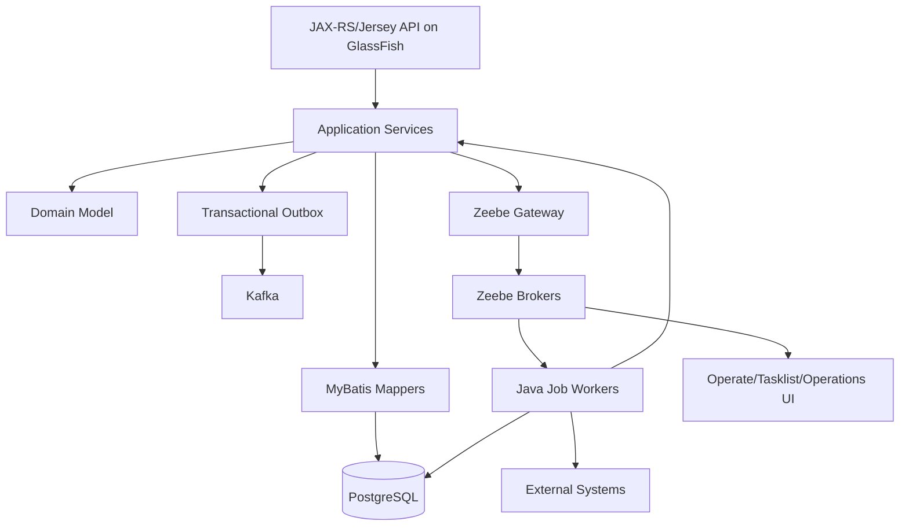
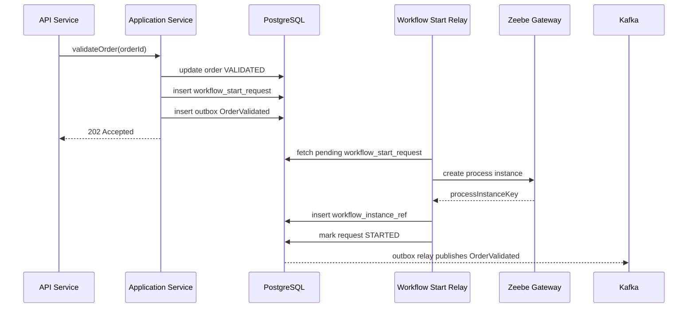
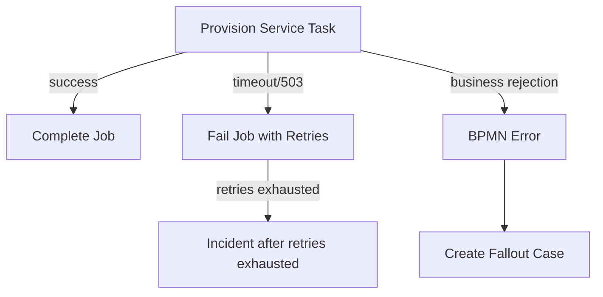
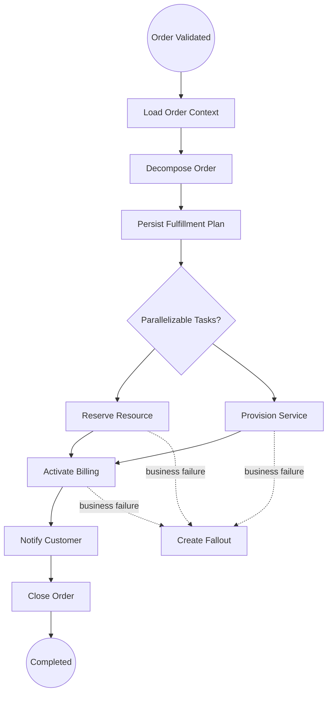
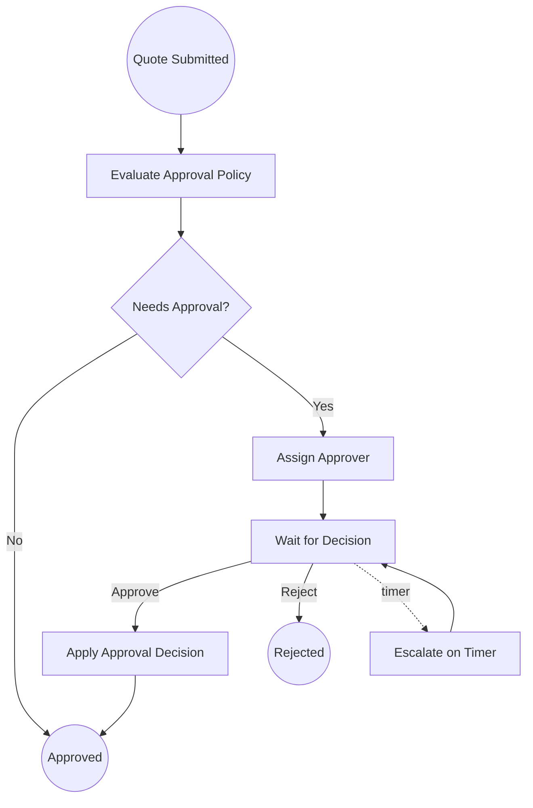
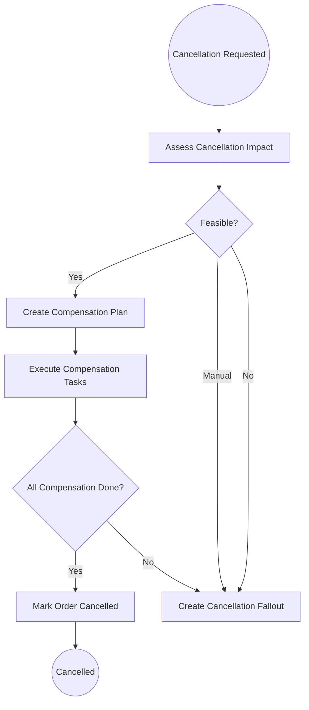

------
title: Build From Scratch: Enterprise Java Microservices CPQ & Order Management Platform - Part 040
description: Camunda 8 and Zeebe architecture for OMS orchestration, including process ownership, job workers, variables, incidents, retries, BPMN boundaries, PostgreSQL source of truth, Kafka integration, and production safety.
series: learn-enterprise-cpq-oms-glassfish-camunda8
seriesTitle: Build From Scratch: Enterprise Java Microservices CPQ & Order Management Platform
order: 40
partTitle: Camunda 8 Architecture for OMS
tags:
  - java
  - microservices
  - cpq
  - oms
  - camunda-8
  - zeebe
  - bpmn
  - orchestration
  - workflow
  - kafka
  - postgresql
  - mybatis
  - glassfish
  - enterprise-architecture
date: 2026-07-02
---

# Part 040 — Camunda 8 Architecture for OMS

Kita sudah membangun domain CPQ/OMS sampai titik penting:

- catalog,
- configuration,
- pricing,
- quote,
- approval,
- order,
- fulfillment plan,
- fallout,
- cancellation,
- amendment,
- supplemental order.

Sekarang pertanyaannya:

> bagian mana yang harus diorkestrasi oleh Camunda 8, dan bagian mana yang tetap harus tinggal di domain service?

Ini pertanyaan yang menentukan apakah Camunda menjadi alat orchestration yang kuat atau justru berubah menjadi “database bisnis tersembunyi dalam BPMN”.

Bagian ini membangun architecture baseline Camunda 8/Zeebe untuk OMS.

---

## 1. Mental Model

Camunda 8 cocok untuk **long-running process orchestration**.

OMS enterprise penuh dengan proses yang:

- berjalan lama,
- menunggu external system,
- butuh retry,
- butuh timeout,
- butuh manual intervention,
- punya parallel task,
- punya compensation,
- punya escalation,
- harus terlihat secara operasional.

Contoh:

- quote approval,
- order fulfillment,
- cancellation compensation,
- fallout repair,
- manual activation,
- service provisioning,
- resource reservation,
- billing activation.

Namun Camunda tidak boleh menggantikan domain model.

Satu aturan utama:

> Camunda owns process progress. Domain service owns business truth.

---

## 2. What Camunda Should Own

Camunda boleh memiliki:

- process instance,
- BPMN flow,
- wait state,
- job scheduling,
- retry progression,
- incident visibility,
- timer boundary,
- message correlation,
- user/manual task routing,
- orchestration ordering,
- process-level operational status.

Camunda sangat cocok menjawab:

- task berikutnya apa?
- tunggu sampai kapan?
- worker mana yang harus dipanggil?
- jika gagal, retry berapa kali?
- jika timeout, escalate ke mana?
- jika approval reject, flow ke mana?
- jika compensation gagal, buat incident/fallout?

---

## 3. What Camunda Must Not Own

Camunda tidak boleh menjadi pemilik utama:

- quote state canonical,
- order state canonical,
- price calculation,
- configuration validation,
- product compatibility,
- order decomposition rule,
- customer asset truth,
- financial truth,
- audit evidence final,
- idempotency record,
- external call attempt ledger.

Ini bukan karena Camunda lemah.

Ini karena source of truth bisnis harus berada di domain service + database yang bisa dites, dimigrasi, direkonsiliasi, dan dikontrol dengan schema/invariant yang jelas.

BPMN adalah excellent process model, bukan relational domain database.

---

## 4. Architecture Overview



Ada dua deployable penting:

1. **API service** — JAX-RS/Jersey/GlassFish untuk HTTP commands/queries.
2. **Worker service** — Java process workers untuk Camunda jobs.

Keduanya boleh berbagi domain/application modules, tetapi deployable-nya sebaiknya terpisah.

Alasannya:

- API traffic dan worker traffic punya scaling pattern berbeda.
- Worker retry/timeout tidak boleh mengganggu request latency API.
- Worker bisa long-running dan integration-heavy.
- API harus cepat, bounded, dan predictable.

---

## 5. Zeebe Component View

Camunda 8 memakai Zeebe sebagai workflow engine untuk process execution.

Dalam deployment self-managed/private cloud, konsep pentingnya:

- **client** — aplikasi yang start process, publish message, activate/complete/fail job.
- **gateway** — entry point ke cluster; stateless/sessionless forwarding layer.
- **broker** — node yang menyimpan dan mengeksekusi workflow partitions.
- **partition** — unit distribution process data.
- **exporter** — stream data keluar untuk visibility/operate/analytics/integration.

Dalam desain OMS, kita tidak perlu memulai dari tuning cluster.

Kita mulai dari boundary:

> application berinteraksi dengan Camunda melalui client/gateway; application tidak mengakses broker state sebagai domain database.

---

## 6. Process Types in OMS

Kita akan punya beberapa process family.

| Process | Trigger | Main Purpose |
|---|---|---|
| Quote Approval Process | quote submitted and approval required | route approval, escalation, approve/reject |
| Order Fulfillment Process | order validated/decomposed | execute fulfillment tasks |
| Cancellation Process | cancellation requested | assess, compensate, close/fallout |
| Amendment Process | amendment requested | assess, approve, apply, re-decompose |
| Fallout Repair Process | fallout created | manual repair, retry, resume |
| Reconciliation Process | scheduled/operational trigger | detect drift and repair projection/process state |

Setiap process harus punya jelas:

- start event,
- business key,
- process variables,
- external references,
- worker job types,
- completion contract,
- incident policy,
- retry policy,
- state synchronization policy.

---

## 7. Business Key Strategy

Business key harus stabil dan meaningful.

Contoh:

```text
quote:{tenantId}:{quoteId}:approval:{approvalCaseId}
order:{tenantId}:{orderId}:fulfillment
order:{tenantId}:{orderId}:cancellation:{cancellationRequestId}
order:{tenantId}:{orderId}:amendment:{amendmentRequestId}
fallout:{tenantId}:{falloutCaseId}:repair
```

Namun jangan menyimpan semua domain data sebagai business key.

Business key bukan payload.

Ia adalah correlation handle.

---

## 8. Workflow Reference Table

Domain DB harus menyimpan reference ke process instance.

```sql
create table workflow_instance_ref (
    workflow_ref_id uuid primary key,
    tenant_id uuid not null,
    aggregate_type varchar(60) not null,
    aggregate_id uuid not null,
    workflow_type varchar(80) not null,
    process_definition_id varchar(255),
    process_instance_key varchar(80) not null,
    business_key varchar(255) not null,
    status varchar(40) not null,
    started_at timestamptz not null,
    completed_at timestamptz,
    last_synced_at timestamptz,
    version bigint not null default 0,
    unique (tenant_id, aggregate_type, aggregate_id, workflow_type, business_key)
);
```

Mengapa perlu?

Karena support team harus bisa menjawab:

- order ini process instance-nya mana?
- process ini terkait order mana?
- process sudah selesai tapi order belum update?
- order sudah cancel tapi process masih jalan?
- process incident terjadi pada aggregate apa?

---

## 9. Process Variables Policy

Process variables sering menjadi sumber technical debt.

Aturan:

> Process variables harus cukup untuk routing/orchestration, bukan menjadi copy penuh aggregate.

Boleh disimpan sebagai variable:

- `tenantId`,
- `orderId`,
- `quoteId`,
- `approvalCaseId`,
- `fulfillmentPlanId`,
- `cancellationRequestId`,
- `correlationId`,
- `requestId`,
- `workflowContextVersion`,
- lightweight flags seperti `manualReviewRequired`.

Tidak boleh disimpan sebagai variable utama:

- full quote aggregate,
- full order aggregate,
- full price breakdown besar,
- full catalog snapshot,
- sensitive customer data,
- large fulfillment task list jika sudah ada di DB,
- state yang harus authoritative di PostgreSQL.

Worker harus load detail dari DB menggunakan ID variable.

---

## 10. Starting a Process

Jangan start process sebelum domain transaction commit.

Masalah klasik:

1. API menyimpan order.
2. API langsung start Camunda process.
3. DB commit gagal.
4. Process berjalan untuk order yang tidak ada.

Atau:

1. DB commit berhasil.
2. Start Camunda gagal.
3. Order valid tapi tidak punya process.

Solusi production-grade:

- persist domain state + outbox/workflow_start_request dalam satu transaction,
- relay/worker start process setelah commit,
- simpan workflow reference,
- retry start process idempotently.

```sql
create table workflow_start_request (
    workflow_start_request_id uuid primary key,
    tenant_id uuid not null,
    aggregate_type varchar(60) not null,
    aggregate_id uuid not null,
    workflow_type varchar(80) not null,
    business_key varchar(255) not null,
    variables jsonb not null,
    status varchar(40) not null,
    attempt_count int not null default 0,
    last_error text,
    created_at timestamptz not null,
    started_at timestamptz,
    unique (tenant_id, workflow_type, business_key)
);
```

---

## 11. Process Start Flow



Workflow start relay bisa menjadi bagian worker service atau deployable terpisah.

Yang penting, start process bukan bagian dari transaksi HTTP command.

---

## 12. Job Worker Boundary

Job worker adalah adapter antara process orchestration dan application/domain service.

Worker menerima job, lalu:

1. baca variable minimal,
2. bangun request context,
3. panggil application service,
4. application service melakukan transaction,
5. worker complete/fail job sesuai hasil,
6. audit dan metric dicatat.

Worker tidak boleh berisi business logic besar.

Contoh buruk:

```java
// bad: worker contains decomposition logic directly
public void handle(JobClient client, ActivatedJob job) {
    var plan = new ArrayList<Task>();
    if (job.getVariablesAsMap().get("product").equals("fiber")) {
        plan.add(...);
    }
    // dozens of business rules here
}
```

Contoh lebih baik:

```java
public final class DecomposeOrderWorker {
    private final OrderApplicationService orderService;

    public void handle(JobClient client, ActivatedJob job) {
        WorkflowContext ctx = WorkflowContext.from(job);
        DecomposeOrderResult result = orderService.decomposeOrder(
            new DecomposeOrderCommand(
                ctx.tenantId(),
                ctx.orderId(),
                ctx.correlationId(),
                ctx.processInstanceKey()
            )
        );

        client.newCompleteCommand(job.getKey())
            .variables(Map.of(
                "fulfillmentPlanId", result.fulfillmentPlanId().toString(),
                "manualReviewRequired", result.manualReviewRequired()
            ))
            .send()
            .join();
    }
}
```

---

## 13. Job Type Naming

Use stable, domain-oriented job types.

```text
quote.approval.evaluate
quote.approval.assign
quote.approval.apply-decision
order.fulfillment.decompose
order.fulfillment.reserve-resource
order.fulfillment.provision-service
order.fulfillment.activate-billing
order.fulfillment.close-order
order.cancellation.assess
order.cancellation.compensate
order.amendment.assess
order.amendment.apply
fallout.repair.evaluate
```

Jangan gunakan class name sebagai job type.

Job type adalah contract antara BPMN dan worker deployable.

---

## 14. Retry Semantics

Camunda job retries bagus, tapi retry harus aman.

Worker retry aman jika command di domain service idempotent.

Contoh:

- `reserveResource(orderId, taskId)` harus safe jika dipanggil dua kali.
- `activateBilling(orderId, taskId)` harus punya external idempotency key.
- `closeOrder(orderId)` harus menolak jika order belum semua task completed.

Worker failure taxonomy:

| Failure | Worker Action |
|---|---|
| transient network timeout | fail job with retries remaining |
| external 503 | fail job with retries/backoff |
| domain validation violation | throw BPMN error or create fallout |
| irrecoverable data corruption | fail to incident/fallout |
| duplicate command | complete if previous result exists |
| optimistic lock conflict | retry short |
| authorization/context missing | incident/manual investigation |

Rule:

> Jangan biarkan retry engine mengulang external side effect tanpa idempotency key.

---

## 15. Incident vs Fallout

Camunda incident dan OMS fallout tidak sama.

| Concept | Meaning |
|---|---|
| Camunda incident | process execution stuck due to technical/process problem |
| OMS fallout | business/operational exception requiring repair or decision |

Contoh Camunda incident:

- worker unavailable,
- retries exhausted,
- missing variable,
- BPMN expression error.

Contoh OMS fallout:

- resource unavailable,
- customer address invalid after manual check,
- provisioning rejected,
- billing account conflict,
- compensation failed.

Mapping policy:

- technical failure may create incident,
- business failure should create fallout case,
- severe fallout may intentionally block process at manual task,
- resolving incident must not bypass domain repair command.

---

## 16. BPMN Error vs Job Failure

Use job failure for technical retryable failures.

Use BPMN error for modeled business alternatives.

Example:

- provisioning timeout: job failure with retry.
- provisioning says “address not serviceable”: BPMN error / fallout path.
- billing 503: job failure.
- billing rejects due to duplicate account: business error path.



---

## 17. OMS State Synchronization

The source of truth for order state remains PostgreSQL.

Camunda process state is operational orchestration state.

Synchronization pattern:

1. worker updates domain state in DB,
2. worker completes job,
3. outbox publishes event,
4. projection updates operational view,
5. reconciliation checks drift.

Potential drift:

- process completed but order still in progress,
- order cancelled but process still active,
- task completed in DB but job retried,
- incident exists but fallout not created,
- process variable says plan A while DB says plan B.

Mitigation:

- workflow reference table,
- process sync job,
- idempotent workers,
- domain state guard,
- repair commands.

---

## 18. Order Fulfillment Process Skeleton



BPMN sebenarnya akan lebih kaya dengan gateways, boundary events, timers, and message events.

Namun skeleton ini cukup untuk architecture thinking.

---

## 19. Quote Approval Process Skeleton



Approval policy evaluation tetap domain service.

Camunda mengelola routing, wait state, timer, dan escalation.

---

## 20. Cancellation Process Skeleton



---

## 21. Worker Transaction Pattern

Worker transaction harus jelas.

Pattern:

```text
activate job
  -> call application service
      -> begin DB transaction
      -> load aggregate
      -> enforce invariant
      -> mutate state
      -> insert audit
      -> insert outbox
      -> commit
  -> complete job with minimal variables
```

Jika DB commit berhasil tapi `complete job` gagal, job bisa diambil ulang.

Maka application service harus idempotent.

Contoh guard:

```java
public ProvisionTaskResult provisionService(ProvisionTaskCommand command) {
    FulfillmentTask task = repository.loadTaskForUpdate(command.taskId());

    if (task.isCompleted()) {
        return ProvisionTaskResult.alreadyCompleted(task.outputSnapshot());
    }

    task.markInProgress(command.workerId());
    ExternalCallAttempt attempt = externalCallLedger.prepareAttempt(
        command.taskId(),
        "PROVISION_SERVICE",
        command.idempotencyKey()
    );

    ProvisionResponse response = provisioningAdapter.provision(attempt);
    task.complete(response.toSnapshot());
    repository.save(task);
    outbox.add(TaskCompleted.from(task));

    return ProvisionTaskResult.completed(task.outputSnapshot());
}
```

---

## 22. External Call Attempt Ledger

Every side-effecting external call needs a ledger.

```sql
create table external_call_attempt (
    external_call_attempt_id uuid primary key,
    tenant_id uuid not null,
    aggregate_type varchar(60) not null,
    aggregate_id uuid not null,
    task_id uuid,
    target_system varchar(80) not null,
    operation varchar(80) not null,
    idempotency_key varchar(160) not null,
    request_payload jsonb not null,
    response_payload jsonb,
    status varchar(40) not null,
    attempt_count int not null default 0,
    last_error text,
    created_at timestamptz not null,
    updated_at timestamptz not null,
    unique (tenant_id, target_system, operation, idempotency_key)
);
```

This table protects the system from retry storms and duplicate side effects.

---

## 23. Message Correlation

OMS often waits for external callbacks.

Examples:

- provisioning accepted now, result later,
- shipment dispatched later,
- technician completes visit later,
- payment authorized later,
- billing account created later.

Pattern:

1. worker sends command to external system,
2. system stores external correlation ID,
3. process waits at message catch event,
4. callback API receives external event,
5. callback validates and persists event,
6. application correlates message to Camunda process,
7. process continues.

Do not rely only on Camunda correlation.

Store callback/correlation in domain DB too.

```sql
create table workflow_message_correlation (
    correlation_id uuid primary key,
    tenant_id uuid not null,
    aggregate_type varchar(60) not null,
    aggregate_id uuid not null,
    workflow_type varchar(80) not null,
    process_instance_key varchar(80) not null,
    message_name varchar(120) not null,
    business_correlation_key varchar(255) not null,
    status varchar(40) not null,
    created_at timestamptz not null,
    correlated_at timestamptz,
    unique (tenant_id, message_name, business_correlation_key)
);
```

---

## 24. Timer Strategy

Timers should represent business timeouts, not arbitrary sleeps.

Good timers:

- approval SLA exceeded,
- provisioning callback not received in 2 hours,
- payment authorization expired,
- technician appointment window missed,
- cancellation compensation not completed in 1 day.

Bad timers:

- sleep 5 seconds before trying DB again,
- wait 1 minute because external system is slow,
- delay to hide race condition.

Technical retries belong in worker retry/backoff.

Business waiting belongs in BPMN timer/message events.

---

## 25. Multi-Tenant Context

Every worker command must carry tenant context.

Variables:

```json
{
  "tenantId": "t-001",
  "orderId": "ord-001",
  "fulfillmentPlanId": "fp-001",
  "correlationId": "corr-001"
}
```

Worker must reconstruct request context:

```java
WorkflowRequestContext context = new WorkflowRequestContext(
    tenantId,
    "camunda-worker",
    correlationId,
    processInstanceKey,
    jobKey
);
```

Every MyBatis query must include tenant filter.

Never trust process variable alone for authorization.

---

## 26. Observability

Metrics:

- process instances started/completed/failed,
- job activation latency,
- job completion latency,
- job failure count by job type,
- incident count by process/job type,
- fulfillment task duration,
- order time-in-state,
- cancellation compensation duration,
- amendment assessment duration,
- external call latency,
- process/domain drift count.

Logs must include:

- `tenantId`,
- `correlationId`,
- `orderId` or `quoteId`,
- `processInstanceKey`,
- `jobKey`,
- `jobType`,
- `workerId`,
- `idempotencyKey`,
- `externalCorrelationId`.

---

## 27. Deployment Topology

Recommended early topology:

```text
cpq-api.war            -> GlassFish/Jersey API
oms-api.war            -> GlassFish/Jersey API
workflow-worker.jar    -> Zeebe job workers
outbox-relay.jar       -> Kafka publisher
workflow-relay.jar     -> process start/message correlation relay
scheduler.jar          -> reconciliation and time-based maintenance
```

Later, split workers by domain/load:

```text
approval-worker.jar
order-fulfillment-worker.jar
integration-worker.jar
fallout-worker.jar
compensation-worker.jar
```

Scaling rule:

- scale API by request load,
- scale worker by job backlog and external system capacity,
- scale outbox relay by event lag,
- scale scheduler carefully to avoid duplicate scans.

---

## 28. BPMN Versioning Policy

Order processes can run for days, weeks, or months.

You cannot assume all instances finish before a new deployment.

Policy:

- process definition version is immutable after deployment,
- new orders use latest compatible version,
- active orders remain on old version unless migration is explicitly planned,
- variables must remain backward compatible,
- workers must support at least active process versions,
- removing job type requires migration/retirement plan.

This will be expanded in Part 044.

For now, remember:

> BPMN deployment is not just code deployment. It is live process model deployment.

---

## 29. Security Boundary

Camunda workers operate as service actors.

They still need authorization semantics.

Examples:

- `camunda-worker` can transition fulfillment task,
- `camunda-worker` cannot override quote price,
- `approval-worker` can apply approval decision only if decision exists,
- `repair-worker` can resume task only through repair command,
- operator manual action must store human actor identity.

Service identity does not mean unlimited domain power.

---

## 30. Anti-Patterns

| Anti-Pattern | Consequence |
|---|---|
| Store full order in Camunda variables | stale/corrupt process data |
| Put pricing/decomposition logic inside BPMN expressions | untestable hidden business logic |
| Directly publish Kafka from worker after DB update | split-brain on failure |
| Start process inside API transaction | commit/start inconsistency |
| Treat incident as business fallout | support confusion |
| Let worker retry non-idempotent external calls | duplicate activation/billing/shipment |
| Use Camunda as canonical order state | reconciliation nightmare |
| Delete process reference after completion | audit/support loss |
| Change BPMN job type without migration | running instances break |

---

## 31. Testing Strategy

Test layers:

1. domain service tests without Camunda,
2. worker handler tests with fake job payload,
3. BPMN model path tests,
4. process start relay tests,
5. message correlation tests,
6. retry/idempotency tests,
7. incident/fallout mapping tests,
8. reconciliation tests,
9. version compatibility tests,
10. operational dashboard tests.

Critical scenarios:

- order validated but process start fails; relay retries.
- worker completes DB transaction but complete-job fails; retry is idempotent.
- provisioning timeout triggers job retry.
- provisioning business reject creates fallout.
- cancellation compensation fails and opens fallout.
- old process version continues after worker deployment.
- duplicate external callback is ignored.
- process completed but domain state drift is detected.

---

## 32. Implementation Milestone

Build order:

1. Add `workflow_instance_ref` table.
2. Add `workflow_start_request` table.
3. Create workflow start relay.
4. Create worker service skeleton.
5. Implement request context extraction from job variables.
6. Implement job type registry.
7. Implement domain service call pattern.
8. Implement idempotent complete behavior.
9. Add external call ledger.
10. Add message correlation table.
11. Add basic order fulfillment BPMN.
12. Add quote approval BPMN.
13. Add cancellation BPMN.
14. Add incident-to-fallout policy.
15. Add process/domain reconciliation job.

---

## 33. Production Checklist

Before using Camunda 8 for OMS production flow:

- business truth remains in PostgreSQL,
- process variables are minimal,
- workflow reference table exists,
- workflow start is after commit via durable request,
- every worker command is idempotent,
- external calls have idempotency keys,
- Kafka events use outbox,
- incident and fallout are separated,
- BPMN errors model business alternatives,
- job failures model technical retries,
- message correlation stored in DB,
- active process version policy exists,
- worker deployment supports active job types,
- reconciliation job exists,
- operator runbook exists,
- metrics and structured logs include process and domain identifiers.

---

## 34. Key Takeaways

Camunda 8 gives us process visibility and orchestration power, but only if we keep the architecture disciplined.

The core rules:

1. Camunda owns process progress.
2. Domain service owns business truth.
3. PostgreSQL owns durable state.
4. Kafka owns event distribution, not transaction truth.
5. Workers are adapters, not hidden domain services.
6. Variables are routing/context, not aggregate storage.
7. Incidents are not the same as business fallout.
8. Process start/message correlation must be durable and retry-safe.
9. BPMN versioning is part of production compatibility.

Pada bagian berikutnya, kita akan membangun **BPMN Model for Quote Approval**. Di sana kita akan membuat approval process yang punya policy evaluation, approver routing, wait state, timer escalation, decision application, rejection path, audit synchronization, dan domain-safe worker boundary.
