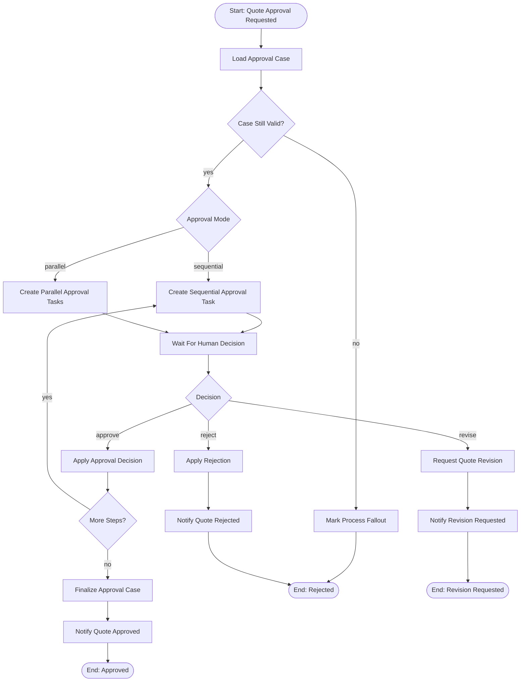
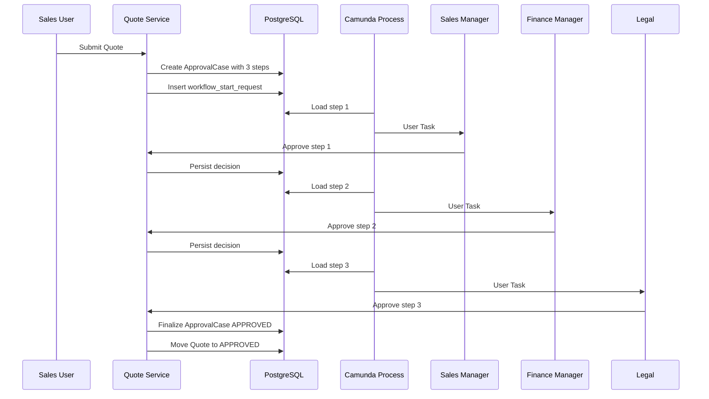
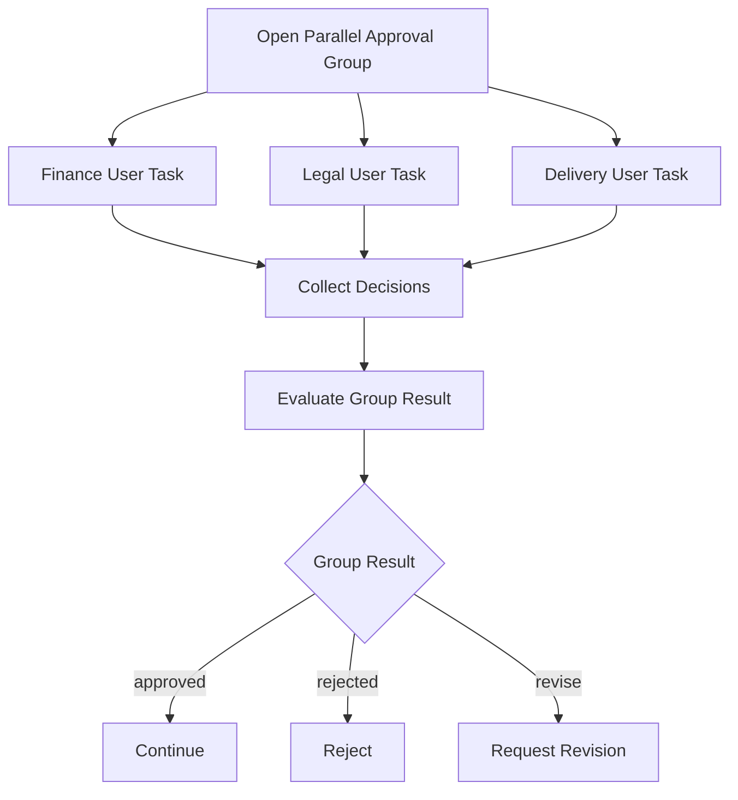
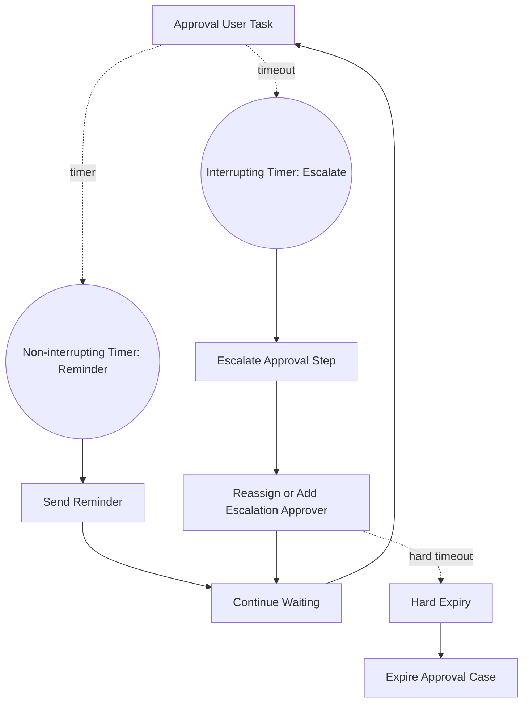
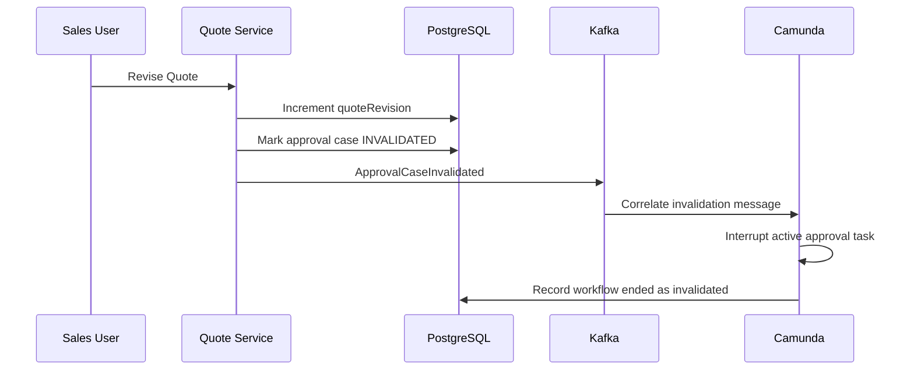

------
title: Build From Scratch: Enterprise Java Microservices CPQ & Order Management Platform - Part 041
description: Designing a production-grade Camunda 8 BPMN model for quote approval, including approval case boundaries, user tasks, timers, escalation, policy evidence, rejection/revision flow, idempotent workers, PostgreSQL synchronization, Kafka events, and operational recovery.
series: learn-enterprise-cpq-oms-glassfish-camunda8
seriesTitle: Build From Scratch: Enterprise Java Microservices CPQ & Order Management Platform
order: 41
partTitle: BPMN Model for Quote Approval
tags:
  - java
  - microservices
  - cpq
  - quote
  - approval
  - camunda-8
  - zeebe
  - bpmn
  - workflow
  - postgresql
  - mybatis
  - kafka
  - enterprise-architecture
date: 2026-07-02
---

# Part 041 — BPMN Model for Quote Approval

Di part sebelumnya kita memosisikan Camunda 8 sebagai **process orchestration engine**, bukan database bisnis.

Sekarang kita mulai memakai BPMN secara konkret untuk salah satu proses paling sensitif di CPQ:

> quote approval.

Quote approval terlihat sederhana:

1. sales submit quote,
2. manager approve,
3. quote boleh diterima customer.

Namun di enterprise system, approval bukan sekadar tombol `Approve`.

Approval bisa dipicu oleh:

- discount terlalu besar,
- manual price override,
- margin rendah,
- non-standard contract term,
- special product combination,
- customer risk,
- strategic account exception,
- expired price list,
- unsupported fulfillment dependency,
- regulatory/compliance constraint,
- sales hierarchy,
- delegated approver,
- SLA escalation,
- multi-level approval,
- parallel approval,
- approval invalidated by quote revision.

Jika model approval dibuat asal-asalan, sistem akan punya gejala klasik:

- quote bisa approved padahal item sudah berubah,
- approver menyetujui price yang bukan lagi price current,
- audit tidak bisa menjawab “siapa menyetujui apa, kapan, dan berdasarkan evidence apa”,
- process Camunda terlihat selesai tetapi quote state di database belum berubah,
- retry worker membuat double approval event,
- escalation membuat approval task ganda,
- user task stuck tanpa pemilik bisnis yang jelas.

Bagian ini membangun BPMN quote approval yang production-grade.

---

## 1. Mental Model

Quote approval adalah proses manusia + policy + evidence.

Camunda cocok untuk mengatur:

- urutan approval,
- user task,
- timer,
- escalation,
- reject/revise path,
- timeout,
- reminder,
- process visibility,
- operational incident.

Namun Camunda tidak boleh menjadi pemilik utama approval truth.

Aturan utama:

> Approval truth lives in PostgreSQL. BPMN coordinates approval work.

Artinya:

- approval case disimpan di database CPQ,
- approval step disimpan di database CPQ,
- evidence snapshot disimpan di database CPQ,
- quote state disimpan di database CPQ,
- Camunda process instance menyimpan pointer dan process variables minimal,
- user task completion harus memanggil domain command yang idempotent,
- perubahan final quote harus dilakukan oleh domain service, bukan langsung dari BPMN variable.

---

## 2. Why Quote Approval Needs BPMN

Quote approval bisa saja dibuat tanpa Camunda:

```text
quote_submitted -> approval_required -> manager_clicks_approve -> quote_approved
```

Ini cukup untuk aplikasi kecil.

Namun enterprise CPQ membutuhkan orchestration karena approval sering:

- long-running,
- melibatkan banyak role,
- punya SLA,
- butuh reminder,
- butuh escalation,
- bisa parallel,
- bisa delegated,
- bisa invalidated,
- harus visible bagi operations,
- harus bisa dipulihkan jika integration/task gagal.

BPMN memberi bahasa eksplisit untuk proses semacam ini.

Tetapi BPMN juga membawa risiko:

> Semakin banyak business decision dipindahkan ke diagram, semakin sulit domain model dikontrol, diuji, dan diaudit.

Jadi desain kita harus memisahkan:

| Concern | Owner |
|---|---|
| Policy evaluation | CPQ domain/application service |
| Approval evidence | PostgreSQL |
| Human task routing | Camunda BPMN + Tasklist/task app |
| Timer/escalation | Camunda BPMN |
| Quote canonical state | Quote domain service |
| Approval case canonical state | Approval domain service |
| Process progress | Camunda process instance |
| Audit trail | CPQ audit tables + outbox events |
| Operational incident | Camunda + CPQ fallout/ops view |

---

## 3. Approval Domain Objects Recap

Sebelum BPMN dibuat, kita sudah harus punya domain objects berikut.

```text
Quote
ApprovalCase
ApprovalStep
ApprovalDecision
ApprovalPolicyEvaluation
ApprovalEvidenceSnapshot
ApprovalAssignment
ApprovalEscalation
```

Minimal aggregate-nya:

```java
public final class ApprovalCase {
    private ApprovalCaseId id;
    private TenantId tenantId;
    private QuoteId quoteId;
    private int quoteRevision;
    private ApprovalCaseStatus status;
    private ApprovalPolicySnapshot policySnapshot;
    private List<ApprovalStep> steps;
    private Instant createdAt;
    private Instant completedAt;
    private long version;
}
```

Status approval case:

```text
DRAFT
OPEN
WAITING_FOR_APPROVER
APPROVED
REJECTED
REVISION_REQUESTED
INVALIDATED
CANCELLED
EXPIRED
FALLOUT
```

Status approval step:

```text
PENDING
ASSIGNED
IN_PROGRESS
APPROVED
REJECTED
REVISION_REQUESTED
ESCALATED
SKIPPED
EXPIRED
CANCELLED
```

Approval decision harus membawa evidence:

```java
public record ApprovalDecisionCommand(
    TenantId tenantId,
    ApprovalCaseId approvalCaseId,
    ApprovalStepId approvalStepId,
    QuoteId quoteId,
    int quoteRevision,
    UserId approverId,
    ApprovalDecisionType decision,
    String reason,
    String idempotencyKey,
    Instant decidedAt
) {}
```

Kenapa `quoteRevision` ikut command?

Karena approval terhadap quote revision lama tidak boleh mempengaruhi quote revision baru.

---

## 4. BPMN Process Scope

Process name:

```text
quote-approval-v1
```

Process start condition:

```text
Quote submitted and policy evaluation says approval is required.
```

Process end conditions:

```text
APPROVED
REJECTED
REVISION_REQUESTED
CANCELLED
INVALIDATED
EXPIRED
FALLOUT
```

Process tidak boleh dipakai untuk:

- menghitung price,
- menghitung discount,
- menentukan margin,
- menyimpan quote item,
- mengubah quote line secara langsung,
- menulis approval evidence tanpa domain command,
- menentukan policy detail melalui gateway yang terlalu banyak.

BPMN harus bertanya ke domain service:

```text
What is the approval plan?
Who should approve?
What is the current step?
Is the approval case still valid?
What should happen after this decision?
```

---

## 5. Main BPMN Flow

BPMN utama dapat dimodelkan seperti ini.



BPMN diagram di atas bukan berarti semua logic ada dalam gateway.

Gateway hanya membaca result dari worker/domain command.

Contoh variable minimal:

```json
{
  "tenantId": "tenant-a",
  "quoteId": "q-10001",
  "quoteRevision": 4,
  "approvalCaseId": "ac-90001",
  "approvalMode": "SEQUENTIAL",
  "currentStepId": "acs-1",
  "caseValid": true,
  "lastDecision": "APPROVED",
  "moreSteps": false
}
```

Variable tidak boleh berisi seluruh quote payload, seluruh price breakdown, atau seluruh product configuration.

---

## 6. Process Variables Policy

Process variables harus kecil, stabil, dan aman untuk migration.

Gunakan variables berikut:

| Variable | Meaning |
|---|---|
| `tenantId` | tenant boundary |
| `quoteId` | quote pointer |
| `quoteRevision` | revision approved by process |
| `approvalCaseId` | approval case pointer |
| `approvalMode` | sequential/parallel/quorum |
| `currentStepId` | active step pointer |
| `candidateGroups` | group hint for user task |
| `candidateUsers` | explicit user hint if any |
| `dueAt` | due date hint |
| `lastDecision` | latest normalized decision |
| `moreSteps` | route to next approval step |
| `caseValid` | guard result from domain service |
| `falloutReason` | operational reason if process cannot continue |

Jangan simpan:

- quote item list,
- configuration tree,
- pricing breakdown lengkap,
- approver hierarchy snapshot lengkap,
- discount calculation detail,
- customer private data yang tidak perlu,
- payload external system besar,
- database row version yang tidak dipakai routing.

Kenapa?

Karena variable Camunda adalah process state, bukan data warehouse.

Jika variable terlalu besar:

- process migration lebih sulit,
- debugging lebih bising,
- PII exposure lebih besar,
- process replay lebih berat,
- schema evolution lebih menyakitkan.

---

## 7. Starting the Approval Process Safely

Jangan start Camunda process sebelum transaction quote submission commit.

Anti-pattern:

```text
BEGIN
  update quote status = SUBMITTED
  create approval case
  start Camunda process
COMMIT
```

Jika `start Camunda process` sukses tetapi database commit gagal, Camunda punya process instance untuk approval case yang tidak ada.

Jika database commit sukses tetapi network timeout saat start process, caller tidak tahu apakah process sudah dibuat.

Pattern yang lebih aman:

```text
BEGIN
  validate quote
  create approval case
  update quote status = APPROVAL_PENDING
  insert workflow_start_request
  insert outbox event QuoteApprovalRequested
COMMIT

WorkflowStartRelay:
  load pending workflow_start_request
  start Camunda process idempotently
  store processInstanceKey
  mark request STARTED
```

Tabel:

```sql
create table workflow_start_request (
  id uuid primary key,
  tenant_id varchar(64) not null,
  process_id varchar(128) not null,
  business_key varchar(256) not null,
  aggregate_type varchar(64) not null,
  aggregate_id uuid not null,
  payload jsonb not null,
  status varchar(32) not null,
  process_instance_key varchar(128),
  failure_reason text,
  created_at timestamptz not null,
  started_at timestamptz,
  unique (tenant_id, process_id, business_key)
);
```

Business key:

```text
tenantId:quoteId:quoteRevision:approvalCaseId
```

Tujuannya:

- start request durable,
- retry aman,
- duplicate start dicegah,
- process instance bisa dikaitkan kembali ke aggregate.

---

## 8. Approval Case Loading Worker

Service task pertama:

```text
load-approval-case
```

Tugas worker:

1. baca `tenantId`, `quoteId`, `quoteRevision`, `approvalCaseId`,
2. load approval case dari PostgreSQL,
3. cek case masih valid,
4. cek quote revision cocok,
5. tentukan current step,
6. return routing variables minimal.

Pseudo Java:

```java
public final class LoadApprovalCaseWorker {

    private final ApprovalApplicationService approvalService;

    public Map<String, Object> handle(JobContext job) {
        var tenantId = TenantId.of(job.stringVar("tenantId"));
        var caseId = ApprovalCaseId.of(job.stringVar("approvalCaseId"));
        var quoteId = QuoteId.of(job.stringVar("quoteId"));
        var quoteRevision = job.intVar("quoteRevision");

        var result = approvalService.loadForWorkflow(
            new LoadApprovalCaseForWorkflowCommand(
                tenantId,
                caseId,
                quoteId,
                quoteRevision,
                job.idempotencyKey()
            )
        );

        return Map.of(
            "caseValid", result.caseValid(),
            "approvalMode", result.mode().name(),
            "currentStepId", result.currentStepId().value(),
            "candidateGroups", result.candidateGroups(),
            "candidateUsers", result.candidateUsers(),
            "dueAt", result.dueAt().toString(),
            "moreSteps", result.moreSteps()
        );
    }
}
```

Worker ini tidak approve quote.

Worker hanya menyiapkan process untuk user task berikutnya.

---

## 9. Human Approval User Task

Camunda user task cocok untuk pekerjaan manusia yang dibantu workflow engine.

Dalam quote approval, user task merepresentasikan:

```text
A human approver must review evidence and submit a decision.
```

User task metadata:

```text
name: Review Quote Approval
action: approve / reject / request revision
candidateGroups: from approval step assignment
candidateUsers: from explicit delegation if any
dueDate: step due date
form: approval decision form
```

Data yang harus ditampilkan ke approver sebaiknya berasal dari CPQ API, bukan dari Camunda variable besar.

Task form/app membaca:

```http
GET /api/v1/approval-cases/{approvalCaseId}
GET /api/v1/quotes/{quoteId}?revision=4
GET /api/v1/approval-cases/{approvalCaseId}/evidence
```

Lalu saat approver submit:

```http
POST /api/v1/approval-cases/{approvalCaseId}/steps/{stepId}/decisions
Idempotency-Key: approve-ac-90001-step-1-user-123-001
If-Match: "case-version-12"
```

Body:

```json
{
  "decision": "APPROVE",
  "reason": "Discount exception is acceptable for strategic renewal.",
  "quoteId": "q-10001",
  "quoteRevision": 4
}
```

Ada dua pilihan integration dengan Camunda:

### Option A — Tasklist/Form completes user task directly

Tasklist completion membawa variable:

```json
{
  "lastDecision": "APPROVED",
  "approvalComment": "..."
}
```

Lalu service task setelah user task memanggil domain service untuk apply decision.

Kelebihan:

- simple,
- natural untuk Camunda Tasklist.

Kelemahan:

- harus hati-hati agar decision tidak dianggap final sebelum domain command sukses.

### Option B — Business API applies decision, then completes Camunda task

Approval UI memanggil CPQ API. CPQ API:

1. validate approval case,
2. persist decision,
3. audit,
4. outbox,
5. complete Camunda task atau publish message.

Kelebihan:

- domain truth update terjadi lebih dulu,
- API bisa enforce authorization lebih kuat,
- audit lebih natural.

Kelemahan:

- integration dengan Tasklist lebih kompleks,
- harus mengelola task completion idempotency.

Untuk enterprise CPQ, saya lebih memilih Option B untuk custom approval UI, dan Option A hanya jika memakai Tasklist secara disiplin.

---

## 10. Decision Application Worker

Setelah user task selesai, process harus menjalankan worker:

```text
apply-approval-decision
```

Worker ini tidak percaya begitu saja pada process variable.

Ia harus:

1. load approval case,
2. load current step,
3. validate quote revision,
4. validate approver identity,
5. validate decision belum diterapkan,
6. apply domain transition,
7. write audit,
8. write outbox event,
9. return normalized routing result.

Pseudo Java:

```java
public Map<String, Object> applyDecision(JobContext job) {
    var command = new ApplyApprovalDecisionFromWorkflowCommand(
        TenantId.of(job.stringVar("tenantId")),
        ApprovalCaseId.of(job.stringVar("approvalCaseId")),
        ApprovalStepId.of(job.stringVar("currentStepId")),
        QuoteId.of(job.stringVar("quoteId")),
        job.intVar("quoteRevision"),
        ApprovalDecisionType.of(job.stringVar("lastDecision")),
        job.optionalStringVar("approvalReason"),
        job.idempotencyKey()
    );

    var result = approvalService.applyDecision(command);

    return Map.of(
        "lastDecision", result.normalizedDecision().name(),
        "moreSteps", result.moreSteps(),
        "nextStepId", result.nextStepId().map(ApprovalStepId::value).orElse(null),
        "caseStatus", result.caseStatus().name()
    );
}
```

Domain service harus idempotent.

Jika worker retry karena network failure setelah database commit, command kedua harus mengembalikan result yang sama, bukan membuat decision kedua.

---

## 11. Sequential Approval

Sequential approval digunakan ketika approval level harus berurutan.

Contoh:

```text
Level 1: Sales Manager
Level 2: Finance Manager
Level 3: Legal
```

Flow:



Sequential approval invariant:

> Step N+1 cannot be opened until Step N reaches APPROVED or SKIPPED by policy.

Database guard:

```sql
create unique index uq_open_approval_step_per_case
on approval_step (tenant_id, approval_case_id)
where status in ('PENDING', 'ASSIGNED', 'IN_PROGRESS');
```

Atau enforce di application service dengan explicit state transition lock:

```sql
select * from approval_case
where tenant_id = #{tenantId}
  and id = #{approvalCaseId}
for update;
```

---

## 12. Parallel Approval

Parallel approval digunakan ketika beberapa pihak dapat review bersamaan.

Contoh:

- Finance approve discount,
- Legal approve non-standard term,
- Product approve unsupported bundle,
- Delivery approve fulfillment exception.

Mode parallel bisa punya semantics:

| Mode | Meaning |
|---|---|
| `ALL_OF` | semua approval wajib approve |
| `ANY_OF` | satu approval cukup |
| `QUORUM` | minimal N dari M approve |
| `VETO` | satu reject langsung reject |
| `ADVISORY` | decision dicatat tapi tidak block |

Jangan encode semantics ini sepenuhnya di gateway BPMN.

BPMN cukup menjalankan parallel user tasks, lalu worker/domain service mengevaluasi aggregate decision.



Dalam Camunda, parallel multi-instance user task dapat dipakai jika jumlah task berasal dari collection approver steps.

Namun domain tetap harus menjadi pemilik semantics `ALL_OF`, `ANY_OF`, `QUORUM`, dan `VETO`.

---

## 13. Timer, Reminder, and Escalation

Approval tanpa SLA akan menjadi limbo.

Model minimal:

- due date per approval step,
- reminder before due,
- escalation after due,
- expiry after hard deadline.

BPMN pattern:



Prinsip:

- reminder tidak mengubah business decision,
- escalation mengubah assignment/evidence,
- expiry mengubah approval case status,
- semua perubahan harus masuk audit,
- due date harus berasal dari approval policy snapshot, bukan hardcoded BPMN.

Escalation command:

```java
public record EscalateApprovalStepCommand(
    TenantId tenantId,
    ApprovalCaseId approvalCaseId,
    ApprovalStepId stepId,
    EscalationReason reason,
    Instant escalatedAt,
    String idempotencyKey
) {}
```

Escalation worker:

```text
apply-approval-escalation
```

Worker ini:

1. lock approval case,
2. cek step masih open,
3. record escalation,
4. update candidate group/user,
5. publish `ApprovalStepEscalated`,
6. return updated assignment variables.

---

## 14. Revision Invalidation

Quote approval harus invalid jika quote berubah materially.

Contoh perubahan material:

- item ditambah,
- product config berubah,
- price berubah,
- discount berubah,
- customer/account berubah,
- contract term berubah,
- validity date berubah,
- fulfillment feasibility berubah.

Jika quote revision berubah saat approval masih berjalan, approval process harus berhenti atau diarahkan ke invalidated path.

Pattern:

1. Quote service menerima command revise quote.
2. Quote service menandai existing approval case `INVALIDATED`.
3. Quote service publish event `ApprovalCaseInvalidated`.
4. Workflow correlation message dikirim ke Camunda process.
5. BPMN menangkap message dan end dengan status invalidated.



BPMN message name:

```text
approval-case-invalidated
```

Correlation key:

```text
tenantId:approvalCaseId
```

---

## 15. Rejection and Revision Request

Rejection means:

```text
This quote must not proceed as submitted.
```

Revision request means:

```text
This quote may proceed if changed and resubmitted.
```

Jangan samakan keduanya.

Domain effects:

| Decision | Approval Case | Quote |
|---|---|---|
| Approve final step | `APPROVED` | `APPROVED` or `READY_FOR_ACCEPTANCE` |
| Reject | `REJECTED` | `REJECTED` |
| Request revision | `REVISION_REQUESTED` | `REVISION_REQUIRED` |
| Expire | `EXPIRED` | `APPROVAL_EXPIRED` |
| Invalidate | `INVALIDATED` | remains revised/new draft |

Quote state transition harus dilakukan domain service.

BPMN hanya mengarahkan worker:

```text
finalize-quote-approval
```

Worker finalization:

1. load approval case,
2. compute final result,
3. transition approval case,
4. transition quote,
5. insert audit,
6. insert outbox events,
7. update workflow reference.

---

## 16. BPMN Error vs Technical Failure

Jangan semua kegagalan dilempar sebagai incident.

Bedakan:

| Condition | Handling |
|---|---|
| database temporarily unavailable | fail job, retry |
| downstream notification timeout | retry or async outbox |
| approval case not found | BPMN error/fallout depending cause |
| quote revision mismatch | business invalidation path |
| unauthorized user decision | reject API command before Camunda completion |
| duplicate decision | idempotent success or conflict |
| policy configuration broken | fallout/manual repair |
| serialization bug | technical incident |

Camunda incident cocok untuk technical stuck condition.

Business fallout harus punya case di CPQ operational model.

Jangan membuat approver menunggu karena worker incident yang sebenarnya data policy broken tanpa operational queue.

---

## 17. PostgreSQL Tables for Workflow Synchronization

Minimal tambahan tabel:

```sql
create table approval_workflow_ref (
  tenant_id varchar(64) not null,
  approval_case_id uuid not null,
  quote_id uuid not null,
  quote_revision int not null,
  process_id varchar(128) not null,
  process_instance_key varchar(128) not null,
  status varchar(32) not null,
  started_at timestamptz not null,
  ended_at timestamptz,
  last_seen_element_id varchar(128),
  last_error text,
  version bigint not null default 0,
  primary key (tenant_id, approval_case_id)
);
```

Decision table:

```sql
create table approval_decision (
  id uuid primary key,
  tenant_id varchar(64) not null,
  approval_case_id uuid not null,
  approval_step_id uuid not null,
  quote_id uuid not null,
  quote_revision int not null,
  approver_id varchar(128) not null,
  decision varchar(32) not null,
  reason text,
  evidence_hash varchar(128) not null,
  idempotency_key varchar(160) not null,
  decided_at timestamptz not null,
  unique (tenant_id, approval_step_id, approver_id, idempotency_key)
);
```

Escalation table:

```sql
create table approval_escalation (
  id uuid primary key,
  tenant_id varchar(64) not null,
  approval_case_id uuid not null,
  approval_step_id uuid not null,
  from_assignee varchar(128),
  to_assignee varchar(128),
  to_group varchar(128),
  reason varchar(64) not null,
  escalated_at timestamptz not null,
  idempotency_key varchar(160) not null,
  unique (tenant_id, approval_step_id, idempotency_key)
);
```

---

## 18. Kafka Events

Events yang relevan:

```text
QuoteApprovalRequested
ApprovalCaseOpened
ApprovalStepAssigned
ApprovalStepDecisionRecorded
ApprovalStepEscalated
ApprovalCaseApproved
ApprovalCaseRejected
ApprovalCaseRevisionRequested
ApprovalCaseInvalidated
QuoteApproved
QuoteRejected
QuoteRevisionRequired
```

Event bukan command UI.

Event tidak boleh menjadi satu-satunya sumber truth approval.

Event payload minimal:

```json
{
  "eventId": "evt-001",
  "eventType": "ApprovalCaseApproved",
  "eventVersion": 1,
  "occurredAt": "2026-07-02T05:00:00Z",
  "tenantId": "tenant-a",
  "correlationId": "corr-123",
  "causationId": "cmd-456",
  "aggregateType": "ApprovalCase",
  "aggregateId": "ac-90001",
  "payload": {
    "quoteId": "q-10001",
    "quoteRevision": 4,
    "approvalCaseId": "ac-90001",
    "result": "APPROVED"
  }
}
```

Outbox publish harus satu transaction dengan approval state change.

---

## 19. API Shape

Business API:

```http
POST /api/v1/quotes/{quoteId}/submit
POST /api/v1/approval-cases/{approvalCaseId}/steps/{stepId}/decisions
POST /api/v1/approval-cases/{approvalCaseId}/steps/{stepId}/escalations
POST /api/v1/approval-cases/{approvalCaseId}/cancel
GET  /api/v1/approval-cases/{approvalCaseId}
GET  /api/v1/approval-cases?status=OPEN&assignee=me
GET  /api/v1/approval-cases/{approvalCaseId}/evidence
GET  /api/v1/approval-cases/{approvalCaseId}/timeline
```

Internal workflow API:

```http
POST /internal/workflows/approval-cases/{approvalCaseId}/load
POST /internal/workflows/approval-cases/{approvalCaseId}/apply-decision
POST /internal/workflows/approval-cases/{approvalCaseId}/finalize
POST /internal/workflows/approval-cases/{approvalCaseId}/escalate
POST /internal/workflows/approval-cases/{approvalCaseId}/mark-fallout
```

Jangan expose Camunda process instance key ke public API sebagai primary business identifier.

Public user berpikir dalam `quoteId` dan `approvalCaseId`, bukan `processInstanceKey`.

---

## 20. Approval Evidence Model

Approval evidence harus menjawab:

> Apa yang dilihat approver saat mengambil keputusan?

Minimal evidence:

- quote header snapshot,
- quote revision,
- customer/account summary,
- item summary,
- price breakdown summary,
- discount/margin signal,
- policy triggers,
- prior approval decisions,
- exception reason,
- validity period,
- requester identity,
- generated-at timestamp,
- hash.

Evidence snapshot tidak harus menyimpan seluruh quote detail dua kali.

Namun harus cukup untuk audit.

Pattern:

```text
approval_evidence_snapshot
  - canonical JSON evidence payload
  - evidence_hash
  - quote_snapshot_hash
  - price_snapshot_hash
  - configuration_snapshot_hash
```

Saat decision dibuat:

```text
decision.evidence_hash = currently_visible_evidence_hash
```

Jika evidence berubah sebelum approval, approver harus melihat versi terbaru atau decision ditolak karena stale.

---

## 21. Authorization Rules

Approval authorization bukan hanya “punya role APPROVER”.

Harus mempertimbangkan:

- tenant,
- assignment,
- delegation,
- candidate group,
- approval level,
- requester cannot approve own exception if policy forbids,
- approver limit,
- quote amount,
- discount threshold,
- region/business unit,
- conflict of interest,
- emergency override.

Authorization check ada di approval domain/application service.

Camunda candidate group hanya membantu routing task.

Jangan menganggap candidate group di BPMN sebagai authorization final.

---

## 22. Observability

Log fields minimal:

```text
tenantId
correlationId
quoteId
quoteRevision
approvalCaseId
approvalStepId
processInstanceKey
jobType
decision
approverId
idempotencyKey
stateBefore
stateAfter
durationMs
```

Metrics:

```text
approval_case_opened_total
approval_case_approved_total
approval_case_rejected_total
approval_case_revision_requested_total
approval_step_decision_duration_seconds
approval_step_escalated_total
approval_case_invalidated_total
approval_worker_retry_total
approval_worker_incident_total
approval_case_sla_breached_total
```

Operational views:

- open approvals by age,
- approvals near SLA breach,
- approvals by approver group,
- stuck workflow refs,
- cases invalidated by revision,
- rejected quote reasons,
- approval fallout queue.

---

## 23. Testing Strategy

### Unit Tests

Test approval domain transitions:

- pending to approved,
- pending to rejected,
- pending to revision requested,
- sequential next step,
- parallel all-of,
- veto reject,
- stale quote revision,
- duplicate decision,
- unauthorized approver,
- escalation after due.

### Worker Tests

Test each worker with fake job variables:

- load approval case,
- apply decision,
- finalize approval,
- escalate,
- mark fallout.

### BPMN Tests

Test process path:

- simple approval approved,
- rejected path,
- revision requested path,
- sequential multi-level approval,
- parallel approval,
- timer reminder,
- escalation,
- invalidation message,
- worker failure retry,
- incident creation.

### Integration Tests

Test full flow:

```text
create quote
configure item
price quote
submit quote
approval case created
workflow started
approver sees task
approver approves
quote moves to APPROVED
outbox events emitted
```

### Golden Evidence Tests

Approval evidence JSON must be stable.

Store golden payloads for:

- discount approval,
- manual override approval,
- legal term approval,
- multi-level approval,
- revision invalidation.

---

## 24. Anti-Patterns

### Anti-Pattern 1: Whole Quote in Process Variables

This makes process state huge and stale.

Use IDs and hashes.

### Anti-Pattern 2: Approval Policy in BPMN Gateways

Do not model every discount threshold as BPMN gateway.

Policy belongs to domain/rule evaluator.

### Anti-Pattern 3: User Task Completion Equals Business Approval

Completing a task is not enough.

Business approval must be persisted through domain command.

### Anti-Pattern 4: Approval Without Evidence Hash

If you cannot prove what was approved, you do not have defensible approval.

### Anti-Pattern 5: Camunda Incident as Business Queue

Incident is technical/process stuck signal.

Business fallout needs CPQ operational case.

### Anti-Pattern 6: Approver Authorization Only in UI

UI checks are convenience.

Domain service must enforce.

### Anti-Pattern 7: Non-Idempotent Decision Worker

Worker retry must never create duplicate approval decision.

---

## 25. Implementation Milestone

Build in this order:

1. approval case schema,
2. approval step schema,
3. approval evidence snapshot,
4. approval domain transition unit tests,
5. quote submit command creates approval case,
6. workflow start request table,
7. approval process BPMN skeleton,
8. load approval case worker,
9. simple user task approval,
10. apply decision worker,
11. finalize approval worker,
12. rejection path,
13. revision requested path,
14. timer reminder,
15. escalation,
16. invalidation message,
17. parallel approval,
18. operational views,
19. audit explorer,
20. incident/fallout recovery path.

Do not start from BPMN diagram alone.

Start from domain invariants, then let BPMN orchestrate them.

---

## 26. Final Mental Model

Quote approval is not a workflow checkbox.

It is a controlled transition from:

```text
commercial proposal with exception
```

to:

```text
commercial proposal approved with evidence
```

Camunda helps coordinate people, time, escalation, and long-running progress.

PostgreSQL/domain service preserves truth.

Kafka communicates outcome.

Audit proves what happened.

Redis may accelerate lookup but must not own approval state.

The key invariant:

> A quote is not approved because a BPMN task completed. A quote is approved because the approval domain accepted a valid decision against a valid quote revision and persisted the transition atomically with audit and events.

---

## References

- Camunda 8 service tasks create jobs and wait for workers to complete them: https://docs.camunda.io/docs/components/modeler/bpmn/service-tasks/
- Camunda 8 user tasks model human work assisted by workflow tooling: https://docs.camunda.io/docs/components/modeler/bpmn/user-tasks/
- Camunda 8 Tasklist helps orchestrate human workflows and assigned work: https://docs.camunda.io/docs/components/tasklist/introduction-to-tasklist/
- Camunda 8 message events wait for a referenced message from an external system or process: https://docs.camunda.io/docs/components/modeler/bpmn/message-events/
- Camunda 8 timer events support timer start, intermediate catch, and boundary timer behavior: https://docs.camunda.io/docs/components/modeler/bpmn/timer-events/
