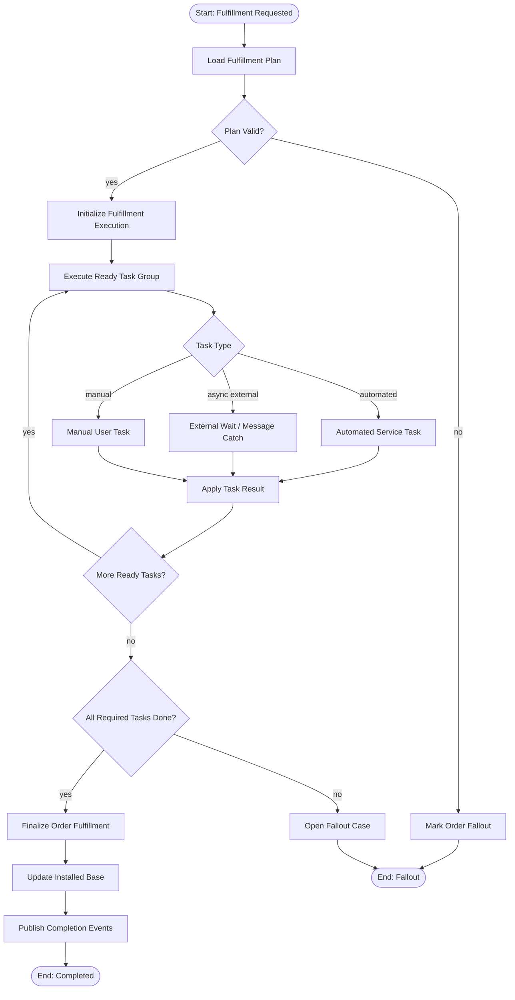
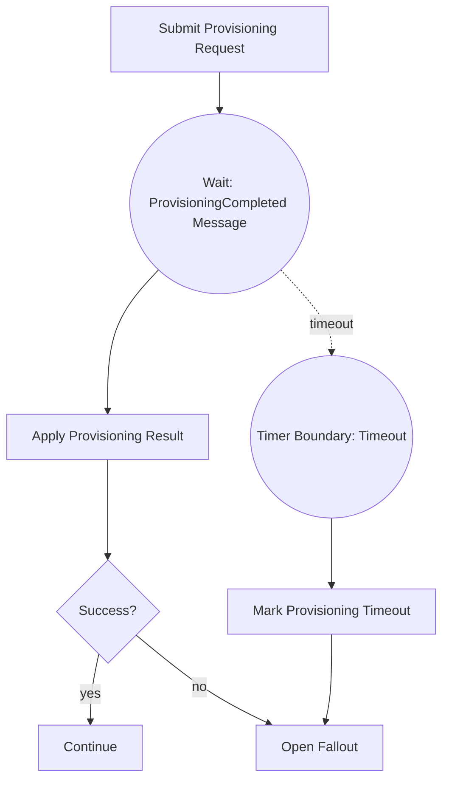
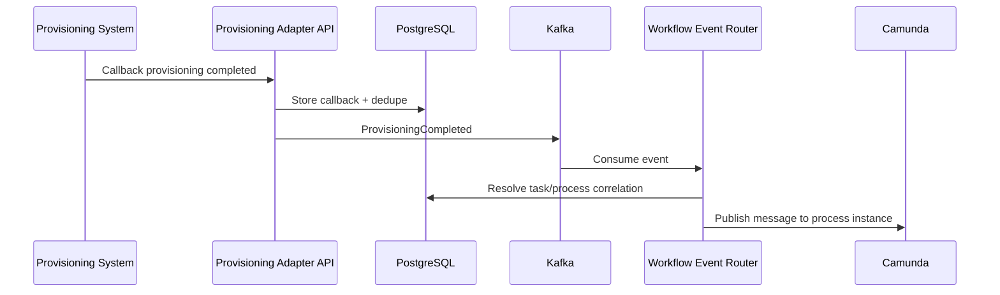
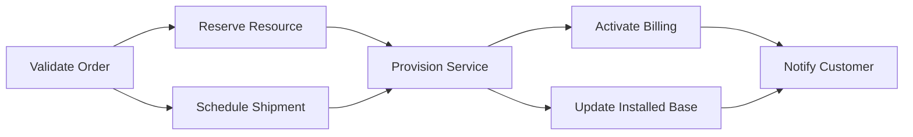
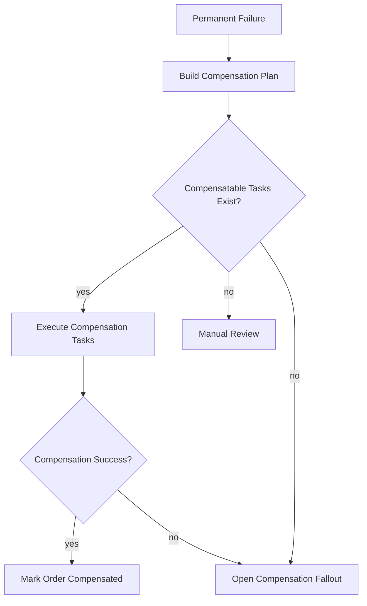
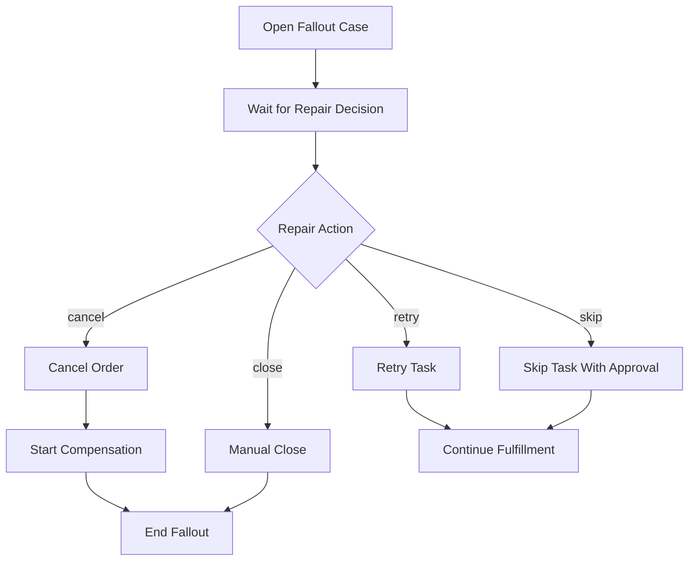
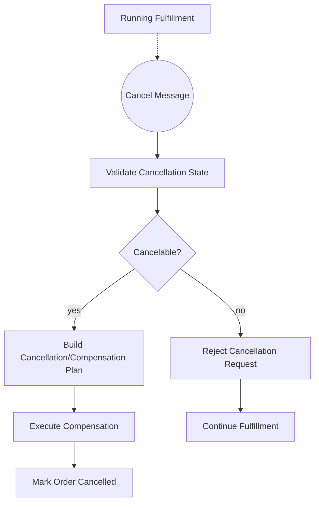

------
title: Build From Scratch: Enterprise Java Microservices CPQ & Order Management Platform - Part 042
description: Designing a production-grade Camunda 8 BPMN model for order fulfillment, including fulfillment plan orchestration, task execution, service workers, message correlation, timers, compensation, fallout, manual intervention, PostgreSQL synchronization, Kafka events, and operational recovery.
series: learn-enterprise-cpq-oms-glassfish-camunda8
seriesTitle: Build From Scratch: Enterprise Java Microservices CPQ & Order Management Platform
order: 42
partTitle: BPMN Model for Order Fulfillment
tags:
  - java
  - microservices
  - cpq
  - oms
  - fulfillment
  - camunda-8
  - zeebe
  - bpmn
  - workflow
  - kafka
  - postgresql
  - mybatis
  - redis
  - enterprise-architecture
date: 2026-07-02
---

# Part 042 — BPMN Model for Order Fulfillment

Part sebelumnya membangun BPMN untuk quote approval.

Sekarang kita masuk ke proses yang lebih berat:

> order fulfillment.

Quote approval adalah proses manusia + policy.

Order fulfillment adalah proses eksekusi lintas sistem.

Di enterprise OMS, fulfillment bisa menyentuh:

- inventory,
- resource reservation,
- service qualification,
- provisioning,
- shipping,
- appointment,
- billing activation,
- contract activation,
- notification,
- partner API,
- manual technician task,
- compensation,
- fallout repair,
- installed base update.

Jika salah desain, order system akan menjadi kumpulan status ambigu:

```text
PROCESSING
IN_PROGRESS
PENDING
FAILED
```

Status seperti itu tidak cukup.

Order fulfillment harus punya:

- executable fulfillment plan,
- task graph,
- task owner,
- retry policy,
- timeout policy,
- compensation policy,
- event trail,
- technical incident handling,
- business fallout handling,
- manual repair path,
- asset impact control,
- final consistency check.

Camunda 8 cocok untuk mengorkestrasi flow ini.

Namun prinsipnya sama:

> Camunda owns process progress. OMS owns order truth.

---

## 1. Mental Model

Order fulfillment bukan “BPMN diagram yang memanggil API provisioning”.

Order fulfillment adalah eksekusi dari **fulfillment plan** yang sudah didekomposisi dan disimpan.

Pipeline sebelumnya:

```text
Quote Accepted
  -> Order Created
  -> Order Validated
  -> Order Decomposed
  -> Fulfillment Plan Persisted
  -> Fulfillment Process Started
```

BPMN tidak membuat decomposition rule.

BPMN tidak memutuskan task apa yang diperlukan berdasarkan product catalog.

BPMN membaca fulfillment plan yang sudah dibuat domain service.

Satu aturan:

> BPMN executes the plan; domain service creates and owns the plan.

---

## 2. Fulfillment Plan Recap

Fulfillment plan minimal:

```text
FulfillmentPlan
FulfillmentTask
TaskDependency
TaskInputSnapshot
TaskOutputSnapshot
TaskRetryPolicy
TaskTimeoutPolicy
TaskCompensationPolicy
TaskEvidence
```

Task example:

```json
{
  "taskId": "ft-1001",
  "orderId": "ord-9001",
  "orderItemId": "oi-1",
  "taskType": "RESERVE_RESOURCE",
  "ownerSystem": "inventory-adapter",
  "status": "READY",
  "dependsOn": [],
  "inputSnapshotHash": "sha256:...",
  "retryPolicy": {
    "maxAttempts": 3,
    "backoff": "PT30S"
  },
  "timeoutPolicy": {
    "timeout": "PT10M",
    "onTimeout": "FALLOUT"
  },
  "compensationPolicy": {
    "compensatable": true,
    "compensationTaskType": "RELEASE_RESOURCE"
  }
}
```

Canonical status tetap di PostgreSQL.

Camunda task state hanya progress orchestration.

---

## 3. Process Scope

Process id:

```text
order-fulfillment-v1
```

Start condition:

```text
Order is validated, decomposition is complete, fulfillment plan is persisted.
```

End conditions:

```text
COMPLETED
PARTIALLY_COMPLETED
CANCELLED
FAILED_WITH_FALLOUT
COMPENSATED
MANUAL_CLOSED
```

Process must not own:

- order canonical state,
- fulfillment task canonical state,
- asset update truth,
- billing activation truth,
- provisioning result truth,
- external adapter idempotency state,
- repair decision truth.

Process may own:

- orchestration sequence,
- wait state,
- parallel branch,
- service task execution trigger,
- timer boundary,
- message catch,
- escalation route,
- compensation route,
- manual task route,
- incident visibility.

---

## 4. High-Level BPMN Flow



Diagram ini sengaja abstrak.

Di real implementation, task group dapat menggunakan:

- parallel gateway,
- multi-instance activity,
- subprocess per phase,
- message catch event,
- timer boundary,
- compensation event,
- user task.

Namun orchestration tetap berdasarkan fulfillment plan.

---

## 5. Process Variables Policy

Variables minimal:

```json
{
  "tenantId": "tenant-a",
  "orderId": "ord-9001",
  "orderVersion": 7,
  "fulfillmentPlanId": "fp-9001",
  "executionId": "fe-9001",
  "currentTaskId": "ft-1001",
  "currentTaskType": "RESERVE_RESOURCE",
  "taskExecutionMode": "AUTOMATED",
  "planValid": true,
  "moreReadyTasks": true,
  "allRequiredTasksDone": false,
  "falloutReason": null
}
```

Jangan simpan di process variable:

- seluruh order item payload,
- seluruh fulfillment plan graph,
- adapter response besar,
- provisioning request/response lengkap,
- customer PII yang tidak perlu,
- billing invoice payload,
- asset snapshot lengkap.

Process variable adalah control state.

Business payload ada di PostgreSQL dan adapter evidence table.

---

## 6. Starting Fulfillment Process Safely

Anti-pattern:

```text
validate order
create fulfillment plan
start Camunda process
commit database transaction
```

Aman hanya di demo.

Production pattern:

```text
BEGIN
  validate order
  decompose order
  persist fulfillment plan
  update order status = FULFILLMENT_READY
  insert workflow_start_request(order-fulfillment-v1)
  insert outbox OrderFulfillmentRequested
COMMIT

WorkflowStartRelay:
  read pending workflow_start_request
  start process idempotently
  store processInstanceKey
  update order_workflow_ref
```

Business key:

```text
tenantId:orderId:fulfillmentPlanId
```

Table:

```sql
create table order_workflow_ref (
  tenant_id varchar(64) not null,
  order_id uuid not null,
  fulfillment_plan_id uuid not null,
  process_id varchar(128) not null,
  process_instance_key varchar(128) not null,
  status varchar(32) not null,
  started_at timestamptz not null,
  ended_at timestamptz,
  last_seen_task_id uuid,
  last_seen_element_id varchar(128),
  last_error text,
  version bigint not null default 0,
  primary key (tenant_id, order_id, fulfillment_plan_id)
);
```

---

## 7. Load Fulfillment Plan Worker

First worker:

```text
load-fulfillment-plan
```

Responsibilities:

1. load order,
2. load fulfillment plan,
3. verify plan belongs to order,
4. verify order is in executable state,
5. initialize execution if needed,
6. compute first ready task group,
7. return variables for routing.

Pseudo Java:

```java
public Map<String, Object> loadPlan(JobContext job) {
    var command = new LoadFulfillmentPlanForWorkflowCommand(
        TenantId.of(job.stringVar("tenantId")),
        OrderId.of(job.stringVar("orderId")),
        FulfillmentPlanId.of(job.stringVar("fulfillmentPlanId")),
        job.idempotencyKey()
    );

    var result = fulfillmentService.loadForWorkflow(command);

    return Map.of(
        "planValid", result.planValid(),
        "executionId", result.executionId().value(),
        "readyTaskIds", result.readyTaskIds().stream().map(TaskId::value).toList(),
        "moreReadyTasks", result.moreReadyTasks(),
        "allRequiredTasksDone", result.allRequiredTasksDone(),
        "falloutReason", result.falloutReason().orElse(null)
    );
}
```

Worker harus idempotent.

Jika execution sudah dibuat oleh retry sebelumnya, command mengembalikan execution yang sama.

---

## 8. Task Execution Modes

Fulfillment task tidak semuanya sama.

Kita butuh task execution mode.

| Mode | Example | BPMN Element |
|---|---|---|
| `AUTOMATED_SYNC` | validate address, reserve resource if fast | service task |
| `AUTOMATED_ASYNC` | submit provisioning request, wait callback | service task + message catch |
| `MANUAL` | technician confirms site visit | user task |
| `WAIT_ONLY` | wait billing activation event | message catch event |
| `COMPENSATION` | release reserved resource | service task/compensation handler |
| `REPAIR` | operations manually retry/skip | user task + repair command |

Task type examples:

```text
RESERVE_RESOURCE
RELEASE_RESOURCE
CHECK_SERVICEABILITY
CREATE_PROVISIONING_REQUEST
WAIT_PROVISIONING_COMPLETED
SCHEDULE_APPOINTMENT
CONFIRM_SHIPMENT
ACTIVATE_BILLING
UPDATE_INSTALLED_BASE
SEND_CUSTOMER_NOTIFICATION
MANUAL_ACTIVATION_REVIEW
```

BPMN should route based on task metadata, not hardcoded every product type.

---

## 9. Automated Synchronous Task Pattern

Example:

```text
RESERVE_RESOURCE
```

BPMN service task job type:

```text
execute-fulfillment-task
```

Worker:

1. claim task execution,
2. mark task `IN_PROGRESS`,
3. call adapter/domain operation,
4. persist task result,
5. mark task `COMPLETED`,
6. publish task completed event,
7. compute next ready tasks.

Pseudo Java:

```java
public Map<String, Object> executeTask(JobContext job) {
    var command = new ExecuteFulfillmentTaskCommand(
        TenantId.of(job.stringVar("tenantId")),
        OrderId.of(job.stringVar("orderId")),
        FulfillmentPlanId.of(job.stringVar("fulfillmentPlanId")),
        FulfillmentTaskId.of(job.stringVar("currentTaskId")),
        job.idempotencyKey()
    );

    var result = fulfillmentService.executeTask(command);

    return Map.of(
        "currentTaskResult", result.status().name(),
        "moreReadyTasks", result.moreReadyTasks(),
        "allRequiredTasksDone", result.allRequiredTasksDone(),
        "falloutReason", result.falloutReason().orElse(null)
    );
}
```

Important invariant:

> Worker completion does not mean external side effect is safe unless task result has been persisted.

If external adapter call succeeds but DB write fails, retry may call adapter again.

Therefore adapter calls must have idempotency keys.

External idempotency key:

```text
tenantId:orderId:taskId:attemptPurpose
```

---

## 10. Automated Asynchronous Task Pattern

Some tasks cannot finish in one API call.

Example provisioning:

1. send provisioning request,
2. external system accepts request,
3. wait for callback/event,
4. correlate result,
5. continue process.

BPMN:



Submit worker:

```text
submit-external-task-request
```

It persists:

```text
external_call_attempt
  - taskId
  - externalSystem
  - externalCorrelationId
  - requestHash
  - status SUBMITTED
```

External callback handler:

```http
POST /api/v1/integrations/provisioning/callbacks
```

Callback handler:

1. validates signature,
2. deduplicates callback,
3. stores callback payload/evidence,
4. updates external call attempt,
5. emits Kafka event,
6. correlates Camunda message or lets event-router correlate.

Message name:

```text
provisioning-completed
```

Correlation key:

```text
tenantId:orderId:taskId
```

---

## 11. Message Correlation Boundary

Message events are appropriate when a running process waits for a specific external signal.

But never let external systems call Camunda directly.

Use adapter/event router:



Why not direct external-to-Camunda?

Because we need:

- authentication,
- validation,
- dedupe,
- audit,
- payload normalization,
- tenant resolution,
- correlation control,
- replay capability.

---

## 12. Parallel Task Groups

Fulfillment often has independent tasks.

Example:

```text
- Reserve resource
- Schedule shipment
- Generate contract document
```

These can run in parallel if dependencies allow.

Task graph:



BPMN design options:

### Option A — Static BPMN with known phases

Good if order families are stable.

```text
Phase 1: validation
Phase 2: reservation/shipment
Phase 3: provisioning
Phase 4: activation
Phase 5: closure
```

### Option B — Dynamic task execution loop

Good if fulfillment plan varies by product.

```text
load ready tasks -> execute ready task collection -> apply results -> compute next ready tasks -> repeat
```

For CPQ/OMS platform with many product types, Option B is more flexible.

But be careful:

- BPMN becomes less visually specific,
- operational UI must show fulfillment plan graph,
- task-level observability must come from OMS tables,
- BPMN shows execution loop, not every business task as explicit element.

Enterprise compromise:

- BPMN models major phases explicitly,
- fulfillment plan models detailed tasks dynamically.

---

## 13. Manual Fulfillment Task

Manual task example:

```text
Manual Activation Review
On-site Installation Confirmation
Address Exception Resolution
Customer Appointment Confirmation
```

Use user task when human action is assisted by workflow/task tooling.

But business completion still goes through OMS API.

Manual task UI should show:

- order summary,
- fulfillment task details,
- dependency context,
- customer impact,
- external system evidence,
- allowed actions,
- repair risk,
- audit warning.

Allowed actions:

```text
COMPLETE
FAIL
RETRY
SKIP_WITH_APPROVAL
REQUEST_CUSTOMER_ACTION
ESCALATE
```

Manual completion API:

```http
POST /api/v1/orders/{orderId}/fulfillment-tasks/{taskId}/manual-decisions
Idempotency-Key: manual-ft-1001-user-789-001
```

Body:

```json
{
  "decision": "COMPLETE",
  "reason": "Technician confirmed installation on site.",
  "evidenceReference": "doc-123"
}
```

Do not let user task completion bypass OMS task state transition.

---

## 14. Timer and Timeout Strategy

Every external wait must have a timeout policy.

Timeout types:

| Timeout | Meaning |
|---|---|
| soft timeout | send reminder/escalation but keep waiting |
| hard timeout | move to fallout or compensation |
| customer timeout | wait for customer action expired |
| partner timeout | partner SLA breached |
| technical timeout | adapter/integration not responding |

BPMN timer boundary is useful for:

- provisioning callback timeout,
- shipping confirmation timeout,
- manual task SLA,
- customer appointment response timeout,
- billing activation timeout.

But timeout decision belongs to fulfillment policy.

Example task timeout policy:

```json
{
  "taskId": "ft-2001",
  "timeout": "PT2H",
  "softReminderBefore": "PT30M",
  "onTimeout": "OPEN_FALLOUT",
  "falloutCategory": "EXTERNAL_SYSTEM_TIMEOUT"
}
```

Timeout worker:

```text
apply-fulfillment-timeout
```

Responsibilities:

1. lock task,
2. verify task still waiting,
3. mark timeout evidence,
4. update task status,
5. open fallout if policy requires,
6. publish event,
7. return route.

---

## 15. Retry Strategy

Camunda job retry handles technical execution failure.

OMS task retry handles business/adapter execution attempts.

Do not confuse them.

| Retry Type | Owner | Example |
|---|---|---|
| Job retry | Camunda worker | DB temporarily unavailable |
| Adapter retry | OMS adapter policy | HTTP 503 from inventory |
| Business retry | OMS repair/ops | provisioning rejected due invalid data after fix |
| Process retry | Camunda/ops | repeat failed element after incident resolution |

Worker pattern:

```java
try {
    var result = fulfillmentService.executeTask(command);
    zeebe.complete(job, result.variables());
} catch (TransientInfrastructureException ex) {
    zeebe.fail(job, retries - 1, backoff, ex.getMessage());
} catch (BusinessFalloutException ex) {
    zeebe.complete(job, Map.of(
        "currentTaskResult", "FALLOUT",
        "falloutReason", ex.reason()
    ));
} catch (ProgrammingBugException ex) {
    zeebe.fail(job, 0, ex.getMessage());
}
```

Technical exception may create Camunda incident.

Business fallout should create OMS fallout case.

---

## 16. Compensation Strategy

Fulfillment can partially succeed.

Example:

1. resource reserved,
2. shipping scheduled,
3. provisioning failed permanently.

System may need compensation:

- release resource,
- cancel shipment,
- reverse billing activation,
- deactivate service,
- notify customer,
- mark asset not active.

BPMN compensation events can model undo behavior.

However compensation business truth still belongs to OMS.

Compensation command:

```java
public record StartCompensationCommand(
    TenantId tenantId,
    OrderId orderId,
    FulfillmentPlanId planId,
    CompensationReason reason,
    String idempotencyKey
) {}
```

Compensation plan should be generated from completed compensatable tasks:

```text
Completed Tasks:
  RESERVE_RESOURCE -> compensation RELEASE_RESOURCE
  SCHEDULE_SHIPMENT -> compensation CANCEL_SHIPMENT
  ACTIVATE_BILLING -> compensation REVERSE_BILLING_ACTIVATION
```

Do not compensate tasks that did not complete.

Do not compensate tasks marked non-reversible without manual review.



---

## 17. Fallout Handling

Fallout is a business-operational state.

Examples:

- invalid decomposition data,
- external system rejected request,
- provisioning failed due resource conflict,
- customer appointment unavailable,
- billing activation rejected,
- manual task expired,
- compensation failed,
- installed base update conflict.

BPMN should route to:

```text
open-fulfillment-fallout
```

Worker creates fallout case in OMS.

Fallout case fields:

```text
tenantId
orderId
orderItemId
fulfillmentPlanId
taskId
category
severity
customerImpact
retryable
requiresManualRepair
suggestedRepairActions
sourceSystem
externalCorrelationId
evidenceHash
createdAt
```

BPMN may then wait for repair message:

```text
fulfillment-fallout-repaired
```

Repair flow:



Repair action must be a domain command.

Never edit Camunda variables manually as the primary repair mechanism.

---

## 18. Installed Base Update

Installed base update should happen near the end, after fulfillment success is sufficiently proven.

But exact timing depends on business domain.

Examples:

| Product Type | Asset Update Timing |
|---|---|
| digital subscription | after activation success |
| physical device | after shipment delivered or activated |
| network service | after provisioning complete |
| add-on feature | after parent service active |
| disconnect | after deactivation complete |

Installed base command:

```java
public record ApplyAssetImpactCommand(
    TenantId tenantId,
    OrderId orderId,
    FulfillmentPlanId fulfillmentPlanId,
    String idempotencyKey
) {}
```

Invariants:

- asset impact must match order item action,
- ADD creates product instance/subscription,
- MODIFY creates new asset version,
- DISCONNECT closes active asset/subscription,
- MOVE updates location/resource relationship,
- duplicate apply must be idempotent,
- asset version conflict must stop finalization.

BPMN service task:

```text
apply-installed-base-impact
```

If this fails due conflict, do not mark order completed.

Open fallout.

---

## 19. Billing Activation Boundary

Billing activation is often downstream but business-critical.

Do not mark order completed if billing activation is mandatory and failed.

But some domains allow:

```text
service completed, billing activation pending
```

This must be explicit.

Order completion policy:

```text
COMPLETION_REQUIRES_BILLING_ACTIVE
COMPLETION_ALLOWS_BILLING_PENDING
COMPLETION_REQUIRES_BILLING_REQUEST_ACCEPTED
```

BPMN should not decide this from gateway hardcoding.

It should ask domain service:

```text
isOrderCompletionAllowed(orderId, fulfillmentPlanId)
```

---

## 20. Kafka Events

Important events:

```text
OrderFulfillmentRequested
FulfillmentPlanExecutionStarted
FulfillmentTaskStarted
FulfillmentTaskCompleted
FulfillmentTaskFailed
FulfillmentTaskTimedOut
FulfillmentTaskSkipped
FulfillmentFalloutOpened
FulfillmentFalloutRepaired
CompensationStarted
CompensationTaskCompleted
CompensationFailed
InstalledBaseUpdated
BillingActivationRequested
BillingActivationCompleted
OrderFulfillmentCompleted
OrderFulfillmentFailed
```

Event payload example:

```json
{
  "eventId": "evt-90001",
  "eventType": "FulfillmentTaskCompleted",
  "eventVersion": 1,
  "occurredAt": "2026-07-02T05:00:00Z",
  "tenantId": "tenant-a",
  "correlationId": "corr-001",
  "aggregateType": "FulfillmentTask",
  "aggregateId": "ft-1001",
  "payload": {
    "orderId": "ord-9001",
    "fulfillmentPlanId": "fp-9001",
    "taskType": "RESERVE_RESOURCE",
    "status": "COMPLETED",
    "externalCorrelationId": "inv-res-123"
  }
}
```

All task events must be emitted from outbox after task state persistence.

---

## 21. PostgreSQL Tables

Fulfillment execution table:

```sql
create table fulfillment_execution (
  id uuid primary key,
  tenant_id varchar(64) not null,
  order_id uuid not null,
  fulfillment_plan_id uuid not null,
  status varchar(32) not null,
  started_at timestamptz not null,
  completed_at timestamptz,
  version bigint not null default 0,
  unique (tenant_id, order_id, fulfillment_plan_id)
);
```

Task execution attempt:

```sql
create table fulfillment_task_attempt (
  id uuid primary key,
  tenant_id varchar(64) not null,
  order_id uuid not null,
  fulfillment_task_id uuid not null,
  attempt_no int not null,
  status varchar(32) not null,
  idempotency_key varchar(160) not null,
  external_system varchar(128),
  external_correlation_id varchar(256),
  request_hash varchar(128),
  response_hash varchar(128),
  failure_code varchar(128),
  failure_message text,
  started_at timestamptz not null,
  completed_at timestamptz,
  unique (tenant_id, fulfillment_task_id, attempt_no),
  unique (tenant_id, fulfillment_task_id, idempotency_key)
);
```

Message correlation table:

```sql
create table workflow_message_correlation (
  id uuid primary key,
  tenant_id varchar(64) not null,
  process_instance_key varchar(128) not null,
  message_name varchar(128) not null,
  correlation_key varchar(256) not null,
  aggregate_type varchar(64) not null,
  aggregate_id uuid not null,
  status varchar(32) not null,
  created_at timestamptz not null,
  correlated_at timestamptz,
  unique (tenant_id, message_name, correlation_key)
);
```

---

## 22. JAX-RS API Shape

Order fulfillment APIs:

```http
POST /api/v1/orders/{orderId}/fulfillment/start
GET  /api/v1/orders/{orderId}/fulfillment-plan
GET  /api/v1/orders/{orderId}/fulfillment-tasks
GET  /api/v1/orders/{orderId}/timeline
POST /api/v1/orders/{orderId}/fulfillment-tasks/{taskId}/retry
POST /api/v1/orders/{orderId}/fulfillment-tasks/{taskId}/skip
POST /api/v1/orders/{orderId}/fulfillment-tasks/{taskId}/manual-decisions
POST /api/v1/orders/{orderId}/fallout-cases/{falloutCaseId}/repair
POST /api/v1/orders/{orderId}/cancel
```

Internal worker APIs:

```http
POST /internal/workflows/orders/{orderId}/load-fulfillment-plan
POST /internal/workflows/orders/{orderId}/execute-task
POST /internal/workflows/orders/{orderId}/apply-task-result
POST /internal/workflows/orders/{orderId}/apply-timeout
POST /internal/workflows/orders/{orderId}/open-fallout
POST /internal/workflows/orders/{orderId}/apply-asset-impact
POST /internal/workflows/orders/{orderId}/finalize-fulfillment
```

External callback APIs:

```http
POST /api/v1/integrations/provisioning/callbacks
POST /api/v1/integrations/shipping/callbacks
POST /api/v1/integrations/billing/callbacks
POST /api/v1/integrations/appointment/callbacks
```

External callback APIs must validate signatures, tenant routing, payload schema, and idempotency.

---

## 23. Worker Design

Worker types:

```text
load-fulfillment-plan
execute-fulfillment-task
submit-external-task-request
apply-external-task-result
apply-fulfillment-timeout
open-fulfillment-fallout
start-compensation
execute-compensation-task
apply-installed-base-impact
finalize-order-fulfillment
```

Worker rules:

- never trust variables blindly,
- always load domain state,
- always use idempotency key,
- map technical error to job retry,
- map business failure to task/fallout state,
- persist before completing job if side effect has business meaning,
- never call multiple unrelated external systems in one worker,
- never hold database transaction while waiting for external callback,
- keep variables small,
- include trace/correlation IDs.

---

## 24. BPMN Layout Strategy

A readable BPMN model should show major business phases, not every Java method.

Recommended layout:

```text
Start
  -> Load Plan
  -> Validation Subprocess
  -> Reservation Subprocess
  -> Provisioning Subprocess
  -> Activation Subprocess
  -> Installed Base Subprocess
  -> Completion Subprocess
  -> End

Boundary:
  -> Timeout
  -> Cancel
  -> Fallout
  -> Compensation
```

Detailed task graph remains in OMS fulfillment plan table.

This gives both:

- business-readable process view,
- dynamic product-specific fulfillment capability.

---

## 25. Cancellation During Fulfillment

Cancellation can arrive while fulfillment is running.

Pattern:

1. OMS receives cancel order command.
2. OMS validates cancellation eligibility.
3. OMS records cancellation request.
4. OMS publishes cancellation event.
5. Workflow event router correlates cancellation message.
6. BPMN interrupts or routes to cancellation subprocess.
7. OMS builds compensation/cancellation plan.
8. BPMN executes compensation/cancellation tasks.



Cancellation is not just “stop process”.

It may require undoing completed effects.

---

## 26. Observability

Log fields:

```text
tenantId
correlationId
orderId
orderItemId
fulfillmentPlanId
fulfillmentTaskId
executionId
processInstanceKey
jobType
taskType
ownerSystem
externalCorrelationId
attemptNo
stateBefore
stateAfter
durationMs
falloutCaseId
```

Metrics:

```text
fulfillment_process_started_total
fulfillment_process_completed_total
fulfillment_process_fallout_total
fulfillment_task_started_total
fulfillment_task_completed_total
fulfillment_task_failed_total
fulfillment_task_timeout_total
fulfillment_task_retry_total
fulfillment_external_callback_received_total
fulfillment_external_callback_duplicate_total
fulfillment_compensation_started_total
fulfillment_compensation_failed_total
order_completion_duration_seconds
worker_incident_total
```

Dashboards:

- orders by fulfillment state,
- task backlog by owner system,
- task duration percentiles,
- external callback latency,
- fallout by category,
- compensation failure list,
- stuck process instances,
- Kafka lag for workflow event router,
- DB lock wait on fulfillment tables.

---

## 27. Testing Strategy

### Domain Tests

Test:

- ready task computation,
- dependency resolution,
- task completion updates next ready tasks,
- failure opens fallout,
- timeout opens fallout,
- compensation plan generation,
- installed base update idempotency,
- cancellation eligibility.

### Worker Tests

Test each worker:

- idempotent retry,
- transient infrastructure failure,
- business fallout,
- duplicate external callback,
- stale order version,
- invalid task state,
- missing external correlation.

### BPMN Tests

Test process paths:

- simple happy path,
- parallel reservation + shipment,
- async provisioning callback,
- provisioning timeout,
- manual task completion,
- task failure to fallout,
- repair and retry,
- cancellation during wait,
- compensation success,
- compensation failure,
- installed base conflict.

### End-to-End Tests

```text
create quote
convert to order
validate order
decompose order
start fulfillment
execute reservation
receive provisioning callback
activate billing
update installed base
complete order
verify timeline/events/audit
```

### Golden Flow Tests

Store golden expected timeline for:

- ADD product,
- MODIFY product,
- DISCONNECT product,
- bundle fulfillment,
- async provisioning,
- manual review,
- cancellation after partial completion.

---

## 28. Anti-Patterns

### Anti-Pattern 1: BPMN Generates Fulfillment Plan

Decomposition belongs to OMS domain service.

BPMN executes.

### Anti-Pattern 2: One Giant Service Task

A task called `fulfillOrder` hides all operational detail.

Break by meaningful external/business step.

### Anti-Pattern 3: External Callback Directly Completes Camunda

Always go through adapter, validation, dedupe, audit, and correlation router.

### Anti-Pattern 4: Camunda Variable as Order State

Order state belongs in PostgreSQL.

### Anti-Pattern 5: Retry Without External Idempotency

Worker retry can duplicate external side effects.

### Anti-Pattern 6: Timeout Means Cancel

Timeout may mean reminder, escalation, fallout, retry, compensation, or cancel depending policy.

### Anti-Pattern 7: Compensation as Blind Reverse

Only compensate completed compensatable tasks.

### Anti-Pattern 8: Manual Repair by Editing Database Rows

Use repair commands with audit and state transition checks.

---

## 29. Implementation Milestone

Build in this order:

1. fulfillment execution table,
2. task attempt table,
3. workflow ref table,
4. load fulfillment plan worker,
5. simple sequential task execution,
6. automated sync task worker,
7. task result persistence,
8. task completed events,
9. next-ready task computation,
10. process finalization,
11. async external request pattern,
12. callback API + dedupe,
13. message correlation router,
14. timer timeout path,
15. fallout case creation,
16. manual repair path,
17. compensation plan generation,
18. cancellation message path,
19. installed base update,
20. operational dashboard.

Do not implement compensation before task evidence and idempotency are reliable.

Do not implement parallel execution before dependency resolution is well-tested.

---

## 30. Final Mental Model

Order fulfillment is a controlled execution graph.

Camunda gives the graph a runtime:

- wait states,
- service task jobs,
- user tasks,
- message correlation,
- timer boundaries,
- compensation route,
- incident visibility.

OMS gives the graph business truth:

- order state,
- fulfillment plan,
- task state,
- task evidence,
- external attempts,
- fallout cases,
- asset impact,
- audit trail.

Kafka distributes facts.

Redis accelerates safe reads or locks when appropriate, but does not own fulfillment state.

The core invariant:

> An order is not fulfilled because the BPMN process ended. An order is fulfilled because every required fulfillment task reached a valid terminal state, required external effects were evidenced, asset impact was applied consistently, and the order domain service atomically persisted the final transition with audit and events.

---

## References

- Camunda 8 service tasks create jobs and wait for job workers to complete them: https://docs.camunda.io/docs/components/modeler/bpmn/service-tasks/
- Camunda 8 job workers activate, execute, complete, or fail jobs: https://docs.camunda.io/docs/components/concepts/job-workers/
- Camunda 8 message events wait for a referenced message and support external asynchronous signals: https://docs.camunda.io/docs/components/modeler/bpmn/message-events/
- Camunda 8 timer events support timer start, intermediate catch, and boundary timer behavior: https://docs.camunda.io/docs/components/modeler/bpmn/timer-events/
- Camunda 8 compensation events support undoing successfully completed steps whose results need reversal: https://docs.camunda.io/docs/components/modeler/bpmn/compensation-events/
- Camunda guidance on handling problems and exceptions separates technical retry/incident handling from business-level process handling: https://docs.camunda.io/docs/components/best-practices/development/dealing-with-problems-and-exceptions/
