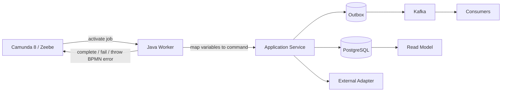
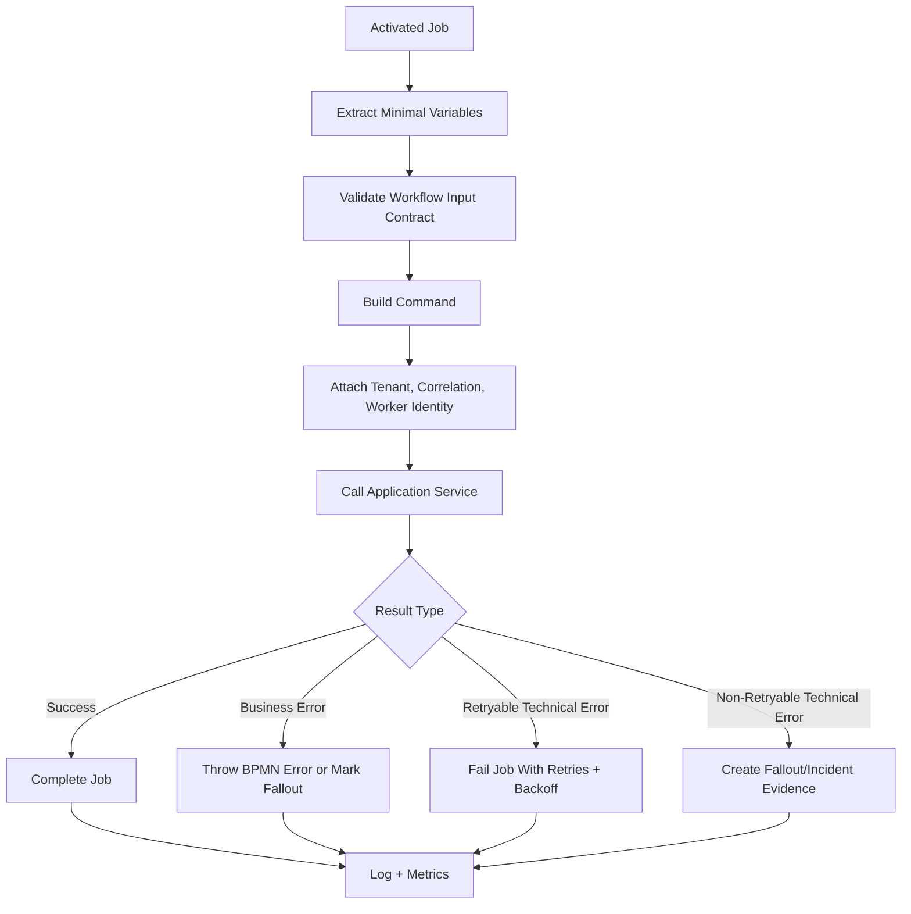
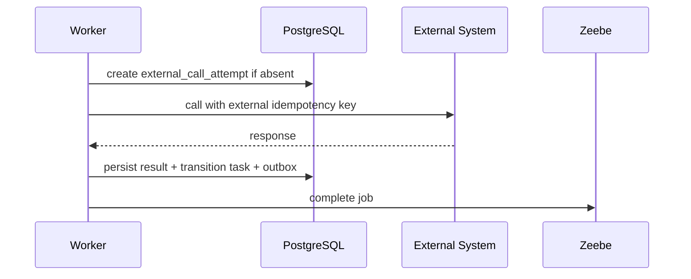
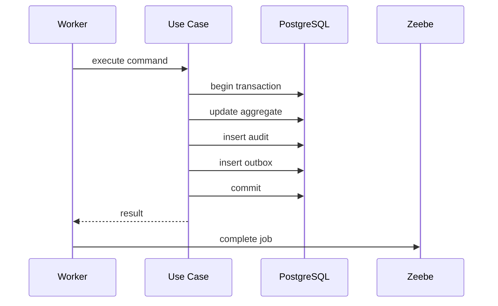
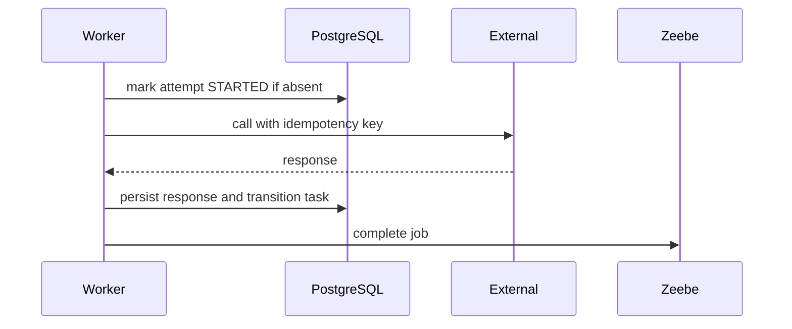

------
title: Build From Scratch: Enterprise Java Microservices CPQ & Order Management Platform - Part 043
description: Mendesain Zeebe worker Java untuk Camunda 8 yang idempotent, observable, retry-safe, dan terhubung benar dengan domain service CPQ/OMS.
series: learn-enterprise-cpq-oms-glassfish-camunda8
seriesTitle: Build From Scratch: Enterprise Java Microservices CPQ & Order Management Platform
order: 43
partTitle: Zeebe Worker Design in Java
tags:
  - java
  - microservices
  - cpq
  - oms
  - camunda-8
  - zeebe
  - workflow
  - worker
  - idempotency
  - resilience
  - observability
  - enterprise-architecture
date: 2026-07-02
---

# Part 043 — Zeebe Worker Design in Java

Pada part sebelumnya kita sudah membuat BPMN untuk quote approval dan order fulfillment. Sekarang kita turun satu lapis: **bagaimana Java worker menjalankan service task Camunda 8 tanpa membuat sistem menjadi rapuh**.

Worker sering terlihat sederhana:

> Ambil job, panggil service, complete job.

Di production OMS, kalimat itu terlalu berbahaya.

Worker bisa timeout. Job bisa diambil ulang. External API bisa lambat. Database commit bisa berhasil tetapi complete job gagal. Process instance bisa dibatalkan ketika worker sedang bekerja. Deployment baru bisa berjalan bersamaan dengan process instance lama. Kafka event bisa sudah terkirim lewat outbox tetapi workflow belum bergerak. Jika worker ditulis seperti script, semua edge case ini menjadi data corruption.

Mental model yang benar:

> Zeebe worker adalah **adapter eksekusi workflow**. Ia bukan pemilik domain state. Ia bukan transaction coordinator global. Ia bukan tempat business rule utama. Ia hanya menerjemahkan job workflow menjadi command domain yang idempotent, observable, dan retry-safe.

---

## 1. Posisi Worker Dalam Arsitektur

Dalam sistem kita, worker berdiri di antara Camunda 8 dan application service.



Worker tidak boleh langsung mengubah banyak tabel secara liar. Ia memanggil application service yang sudah punya:

- transaction boundary,
- idempotency boundary,
- authorization/service identity boundary,
- domain invariant,
- audit,
- outbox,
- error taxonomy.

Dengan begitu, command yang dipanggil dari API dan command yang dipanggil dari workflow tetap melewati model yang sama.

---

## 2. Worker Bukan Domain Service

Kesalahan paling umum adalah menulis worker seperti ini:

```java
client.newWorker()
    .jobType("reserve-resource")
    .handler((jobClient, job) -> {
        // parse variables
        // query DB
        // update order
        // call inventory
        // write audit
        // complete job
    })
    .open();
```

Kode seperti ini terlihat cepat, tetapi menciptakan masalah:

1. business logic tersebar di worker,
2. sulit dites tanpa Zeebe,
3. retry behavior bercampur dengan domain behavior,
4. error mapping tidak konsisten,
5. audit dan outbox mudah terlupakan,
6. ketika workflow berubah, logic domain ikut terseret,
7. worker menjadi service tersembunyi yang tidak punya API contract.

Desain yang lebih sehat:

```java
public final class ReserveResourceWorker implements JobHandler {

    private final ReserveResourceUseCase useCase;
    private final WorkflowJobMapper mapper;
    private final WorkerFailureMapper failureMapper;

    @Override
    public void handle(JobClient client, ActivatedJob job) {
        try {
            ReserveResourceCommand command = mapper.toReserveResourceCommand(job);
            ReserveResourceResult result = useCase.reserve(command);

            client.newCompleteCommand(job.getKey())
                .variables(mapper.toWorkflowVariables(result))
                .send()
                .join();
        } catch (Throwable error) {
            failureMapper.handle(client, job, error);
        }
    }
}
```

Worker tetap punya logic, tetapi logic-nya adalah **workflow adapter logic**, bukan domain logic.

---

## 3. Worker Design Goals

Worker production-grade untuk CPQ/OMS harus memenuhi target berikut.

| Goal | Makna |
|---|---|
| Idempotent | Job yang diproses ulang tidak menggandakan order task, external call, event, audit, atau asset mutation. |
| Retry-safe | Technical failure bisa dicoba ulang tanpa merusak state. |
| Observable | Setiap job bisa ditelusuri dari process instance, order, task, command, log, trace, audit, dan outbox event. |
| Bounded | Worker punya timeout, concurrency limit, fetch variable limit, dan retry budget. |
| Thin | Worker tidak menyimpan business rule besar. |
| Version-aware | Worker bisa hidup berdampingan dengan process definition lama dan baru. |
| Deterministic | Mapping variable → command stabil dan tervalidasi. |
| Secure | Worker memakai service identity dan tenant context eksplisit. |
| Repairable | Jika gagal, sistem punya incident/fallout record yang manusia bisa pahami. |

---

## 4. Worker Taxonomy Untuk CPQ/OMS

Tidak semua worker sama. Kita perlu taxonomy agar job type, retry, observability, dan failure handling tidak campur aduk.

### 4.1 Domain Transition Worker

Mengubah state domain internal.

Contoh:

- `quote.mark-approval-started.v1`
- `order.mark-fulfillment-started.v1`
- `fulfillment.mark-task-started.v1`
- `asset.apply-activation.v1`

Karakteristik:

- dominan DB transaction,
- harus optimistic-lock aware,
- retry relatif aman jika command idempotent,
- tidak boleh melakukan external IO besar.

### 4.2 External Integration Worker

Memanggil sistem luar.

Contoh:

- `inventory.reserve-resource.v1`
- `provisioning.create-service.v1`
- `billing.activate-subscription.v1`
- `notification.send-order-confirmation.v1`

Karakteristik:

- rawan timeout,
- wajib punya external idempotency key,
- perlu attempt table,
- butuh retry/backoff,
- perlu distinguish antara temporary dan permanent failure.

### 4.3 Human Task Synchronization Worker

Menyinkronkan state user task / approval task dengan domain table.

Contoh:

- `approval.create-human-task.v1`
- `approval.record-decision.v1`
- `fallout.create-manual-task.v1`

Karakteristik:

- workflow user task bukan source of truth penuh,
- keputusan approval harus disimpan di domain table,
- authorization tetap dicek di API/approval service.

### 4.4 Projection Worker

Membangun read model atau operational view.

Contoh:

- `order.refresh-dashboard-view.v1`
- `customer.append-timeline-entry.v1`

Karakteristik:

- idempotent by natural key,
- boleh eventually consistent,
- tidak boleh mengubah command-side aggregate.

### 4.5 Compensation Worker

Melakukan reversal atas step yang sudah berhasil.

Contoh:

- `inventory.release-reservation.v1`
- `provisioning.rollback-service.v1`
- `billing.reverse-activation.v1`

Karakteristik:

- tidak selalu bisa mengembalikan dunia ke kondisi awal,
- harus mencatat evidence,
- harus menerima partial success,
- sering berakhir ke fallout jika reversal tidak aman.

### 4.6 Correlation Worker

Mengirim atau menunggu message correlation.

Contoh:

- `workflow.correlate-provisioning-callback.v1`
- `workflow.correlate-payment-result.v1`

Karakteristik:

- perlu correlation key stabil,
- harus punya duplicate callback handling,
- tidak boleh bergantung hanya pada process variable.

---

## 5. Job Type Naming

Job type adalah contract antara BPMN dan worker. Jangan beri nama terlalu generik.

Buruk:

```text
process
call-service
reserve
update-status
```

Lebih baik:

```text
oms.fulfillment.reserve-resource.v1
oms.fulfillment.provision-service.v1
oms.fulfillment.activate-billing.v1
cpq.approval.evaluate-policy.v1
cpq.approval.create-approval-case.v1
oms.asset.apply-order-impact.v1
```

Struktur yang direkomendasikan:

```text
<bounded-context>.<capability>.<action>.v<major>
```

Contoh:

```text
oms.fulfillment.reserve-resource.v1
```

Artinya:

- `oms` = bounded context,
- `fulfillment` = capability,
- `reserve-resource` = action,
- `v1` = major job contract version.

Version di job type bukan hiasan. Ia memungkinkan worker lama dan baru berjalan bersamaan ketika process instance lama belum selesai.

---

## 6. Variable Policy

Process variable sering disalahgunakan sebagai database kecil. Untuk OMS, itu berbahaya.

Variable sebaiknya berisi **workflow routing data**, bukan seluruh domain state.

### 6.1 Variable Yang Boleh Ada

```json
{
  "schemaVersion": "1.0",
  "tenantId": "tenant-001",
  "orderId": "ord_20260702_00001",
  "orderVersion": 7,
  "fulfillmentPlanId": "fp_001",
  "fulfillmentTaskId": "ft_009",
  "workflowRefId": "wfr_001",
  "commandId": "cmd_001",
  "correlationId": "corr_001"
}
```

Ini cukup untuk worker mengambil state dari PostgreSQL dan menjalankan command yang tepat.

### 6.2 Variable Yang Tidak Boleh Ada

```json
{
  "entireOrder": { "...": "..." },
  "entireCatalogSnapshot": { "...": "..." },
  "priceBreakdownWithHundredsOfLines": ["..."],
  "approvalMatrix": { "...": "..." }
}
```

Alasan:

1. sulit versioning,
2. payload workflow membesar,
3. data bisa stale,
4. audit tersebar,
5. migration instance lebih rumit,
6. worker tergoda mengambil keputusan dari variable lama.

### 6.3 Rule

> Worker membaca ID dan routing data dari variable, lalu membaca state authoritative dari PostgreSQL.

---

## 7. Worker Input Contract

Setiap job type perlu input contract.

Contoh untuk `oms.fulfillment.reserve-resource.v1`:

```json
{
  "$id": "https://schemas.example.com/workflow/oms/fulfillment/reserve-resource-job.v1.schema.json",
  "type": "object",
  "required": [
    "schemaVersion",
    "tenantId",
    "orderId",
    "fulfillmentPlanId",
    "fulfillmentTaskId",
    "commandId",
    "correlationId"
  ],
  "properties": {
    "schemaVersion": { "const": "1.0" },
    "tenantId": { "type": "string", "minLength": 1 },
    "orderId": { "type": "string", "minLength": 1 },
    "fulfillmentPlanId": { "type": "string", "minLength": 1 },
    "fulfillmentTaskId": { "type": "string", "minLength": 1 },
    "commandId": { "type": "string", "minLength": 1 },
    "correlationId": { "type": "string", "minLength": 1 }
  },
  "additionalProperties": false
}
```

Tujuannya bukan membuat worker lambat karena validasi. Tujuannya membuat workflow contract eksplisit.

Jika variable tidak valid, itu bukan retryable technical failure. Itu deployment/modeling/configuration error.

---

## 8. Worker Execution Pipeline

Pipeline worker yang sehat:



Pipeline ini memisahkan:

- parse error,
- validation error,
- domain rejection,
- technical failure,
- workflow completion failure.

---

## 9. Idempotency Untuk Worker

Worker idempotency lebih sulit dari HTTP idempotency karena job bisa diaktifkan ulang setelah timeout.

Kita perlu beberapa lapis guard.

### 9.1 Workflow Command ID

Setiap job harus membawa `commandId`.

```text
commandId = deterministic hash(processInstanceKey, elementInstanceKey, jobType, businessTargetId)
```

Atau lebih sederhana:

```text
commandId = generated when fulfillment task is created and persisted
```

Untuk OMS, lebih baik command ID berasal dari domain table, bukan dibuat random di worker.

### 9.2 Durable Execution Table

Tambahkan tabel:

```sql
CREATE TABLE workflow_job_execution (
    id                  text PRIMARY KEY,
    tenant_id           text NOT NULL,
    command_id          text NOT NULL,
    job_type            text NOT NULL,
    process_instance_key text NOT NULL,
    element_instance_key text,
    business_ref_type   text NOT NULL,
    business_ref_id     text NOT NULL,
    status              text NOT NULL,
    input_hash          text NOT NULL,
    result_json         jsonb,
    error_code          text,
    error_message       text,
    attempt_count       integer NOT NULL DEFAULT 0,
    first_seen_at       timestamptz NOT NULL,
    last_attempt_at     timestamptz NOT NULL,
    completed_at        timestamptz,
    UNIQUE (tenant_id, command_id),
    UNIQUE (tenant_id, job_type, business_ref_type, business_ref_id)
);
```

`command_id` mencegah duplicate logical command.

`job_type + business_ref` mencegah dua workflow path menjalankan action yang sama terhadap target yang sama.

### 9.3 Idempotent Completion

Jika worker menerima job yang command-nya sudah sukses:

1. baca `result_json`,
2. complete job dengan output yang sama,
3. jangan panggil external system lagi.

Jika command sedang berjalan di worker lain:

1. jangan dobel proses,
2. fail job dengan retry/backoff pendek,
3. atau complete jika state domain sudah membuktikan hasilnya sukses.

---

## 10. Job Timeout dan Duplicate Execution

Timeout worker bukan sekadar angka teknis. Jika job tidak diselesaikan dalam activation timeout, Zeebe dapat membuat job tersedia lagi untuk worker lain. Akibatnya dua worker bisa mengerjakan logical job yang sama secara overlap.

Karena itu:

- jangan set timeout terlalu pendek,
- jangan ambil terlalu banyak job melebihi thread pool,
- jangan menaruh external call panjang tanpa durable attempt record,
- jangan mengandalkan “hanya satu worker yang akan menjalankan job”.

Worker harus didesain dengan asumsi:

> Aktivasi job bersifat lease, bukan lock bisnis permanen.

Lock bisnis tetap berada di PostgreSQL melalui idempotency record, unique constraint, optimistic lock, atau task state transition.

---

## 11. Worker Concurrency Model

Kita perlu membedakan beberapa angka:

| Parameter | Fungsi |
|---|---|
| Worker threads | Berapa job dieksekusi paralel di JVM. |
| Max jobs active | Berapa job boleh diaktifkan sekaligus dari broker. |
| Job timeout | Durasi lease job sebelum bisa diaktifkan ulang. |
| External timeout | Timeout call ke sistem luar. |
| DB transaction timeout | Batas command transaction. |
| Retry backoff | Jeda sebelum retry berikutnya. |

Rule dasar:

```text
maxJobsActive <= workerThreads + smallBuffer
jobTimeout > worstCaseQueueWaitInsideWorker + worstCaseExecutionTime
externalTimeout < jobTimeout
transactionTimeout < externalTimeout or isolated from external call
```

Untuk external integration worker, jangan tahan DB transaction saat memanggil external API.

Pola yang lebih aman:



Jika complete job gagal setelah DB commit, retry worker akan membaca bahwa task sudah sukses lalu complete ulang.

---

## 12. Error Taxonomy

Worker tidak boleh menangkap semua exception dan `fail job` begitu saja. Kita perlu klasifikasi.

| Error Type | Contoh | Worker Action |
|---|---|---|
| Invalid workflow input | Missing `orderId`, bad schemaVersion | Non-retryable failure, create technical fallout/incident evidence. |
| Domain rejection | Order already cancelled, task not executable | BPMN error atau domain fallout, tergantung proses. |
| Retryable technical error | HTTP 503, network timeout, DB transient error | Fail job with remaining retries and backoff. |
| Non-retryable technical error | Invalid adapter config, unknown mapping | Fail to incident/fallout with evidence. |
| Duplicate command | Same command already succeeded | Complete job with stored result. |
| Stale command | Expected order version mismatch | Re-read domain state; if resolved complete, else controlled failure. |
| External business failure | Inventory says resource unavailable | BPMN modeled path or fallout, not blind retry. |

### 12.1 Business Error vs Technical Failure

Business error adalah outcome yang diprediksi domain.

Contoh:

- resource unavailable,
- approval rejected,
- customer not eligible,
- order cancelled before task execution.

Technical failure adalah sistem tidak bisa menyelesaikan pekerjaan karena gangguan teknis.

Contoh:

- timeout,
- broker unavailable,
- database deadlock,
- external API 503,
- JSON parsing failure dari sistem partner.

Jangan ubah business error menjadi technical retry. Itu hanya membuat workflow mengulang sesuatu yang memang harus mengambil path berbeda.

---

## 13. BPMN Error, Failed Job, Incident, dan Fallout

Kita perlu vocabulary yang jelas.

| Mechanism | Dipakai Untuk |
|---|---|
| Complete job | Worker berhasil menjalankan action. |
| Throw BPMN error | Business alternative path yang memang dimodelkan di BPMN. |
| Fail job with retries | Technical failure yang layak retry. |
| Incident | Job exhausted atau process stuck dan butuh intervensi operational. |
| Fallout | Domain-level exception case yang perlu pemulihan bisnis/operasional. |

Incident Camunda tidak otomatis sama dengan fallout OMS.

Incident adalah fakta workflow engine.

Fallout adalah fakta domain/operation OMS.

Kadang satu incident menghasilkan fallout. Kadang fallout dibuat tanpa incident, misalnya external system mengembalikan business rejection yang harus diperbaiki manual.

---

## 14. Worker Failure Mapper

Buat satu komponen konsisten:

```java
public final class WorkerFailureMapper {

    private final FalloutService falloutService;
    private final WorkerErrorClassifier classifier;

    public void handle(JobClient client, ActivatedJob job, Throwable error) {
        WorkerFailure failure = classifier.classify(job, error);

        switch (failure.kind()) {
            case BPMN_ERROR -> throwBpmnError(client, job, failure);
            case RETRYABLE_TECHNICAL -> failWithRetry(client, job, failure);
            case NON_RETRYABLE_TECHNICAL -> failWithoutRetry(client, job, failure);
            case DOMAIN_FALLOUT -> createFalloutAndComplete(client, job, failure);
            case ALREADY_COMPLETED -> completeFromStoredResult(client, job, failure);
        }
    }
}
```

Ini mencegah setiap worker membuat kebijakan sendiri.

---

## 15. Complete Job Output

Complete job tidak perlu mengirim seluruh hasil domain.

Cukup kirim routing variables:

```json
{
  "reserveResourceResult": "RESERVED",
  "reservationId": "res_001",
  "fulfillmentTaskStatus": "COMPLETED"
}
```

Jangan kirim:

```json
{
  "entireInventoryResponse": { "...": "..." },
  "fullOrder": { "...": "..." }
}
```

Evidence lengkap disimpan di PostgreSQL.

---

## 16. Worker Registry

Daripada worker tersebar di `main`, gunakan registry.

```java
public final class WorkerRegistry {

    private final CamundaClient client;
    private final List<WorkerDefinition> definitions;

    public List<JobWorker> startAll() {
        return definitions.stream()
            .map(this::start)
            .toList();
    }

    private JobWorker start(WorkerDefinition definition) {
        return client.newWorker()
            .jobType(definition.jobType())
            .handler(definition.handler())
            .name(definition.workerName())
            .timeout(definition.timeout())
            .maxJobsActive(definition.maxJobsActive())
            .fetchVariables(definition.fetchVariables())
            .open();
    }
}
```

`WorkerDefinition` membuat konfigurasi eksplisit:

```java
public record WorkerDefinition(
    String jobType,
    String workerName,
    Duration timeout,
    int maxJobsActive,
    List<String> fetchVariables,
    JobHandler handler
) {}
```

Keuntungan:

- konfigurasi bisa direview,
- test bisa memvalidasi semua job type punya handler,
- observability label konsisten,
- deployment bisa mengaktifkan subset worker.

---

## 17. Worker Configuration Example

```java
public final class FulfillmentWorkerDefinitions {

    public List<WorkerDefinition> definitions(FulfillmentHandlers handlers) {
        return List.of(
            new WorkerDefinition(
                "oms.fulfillment.reserve-resource.v1",
                "oms-fulfillment-reserve-resource-worker",
                Duration.ofSeconds(60),
                16,
                List.of(
                    "schemaVersion",
                    "tenantId",
                    "orderId",
                    "fulfillmentPlanId",
                    "fulfillmentTaskId",
                    "commandId",
                    "correlationId"
                ),
                handlers.reserveResource()
            ),
            new WorkerDefinition(
                "oms.fulfillment.provision-service.v1",
                "oms-fulfillment-provision-service-worker",
                Duration.ofMinutes(5),
                8,
                List.of(
                    "schemaVersion",
                    "tenantId",
                    "orderId",
                    "fulfillmentTaskId",
                    "commandId",
                    "correlationId"
                ),
                handlers.provisionService()
            )
        );
    }
}
```

Perhatikan `fetchVariables`. Jangan ambil semua variable jika hanya butuh beberapa ID.

---

## 18. Application Service Boundary

Worker memanggil use case:

```java
public interface ReserveResourceUseCase {
    ReserveResourceResult reserve(ReserveResourceCommand command);
}
```

Command:

```java
public record ReserveResourceCommand(
    String tenantId,
    String orderId,
    String fulfillmentPlanId,
    String fulfillmentTaskId,
    String commandId,
    String correlationId,
    String workerName,
    Instant requestedAt
) {}
```

Use case menjalankan:

1. validate tenant,
2. load fulfillment task,
3. check task executable,
4. create/read idempotency record,
5. create/read external call attempt,
6. call inventory adapter,
7. persist result,
8. transition task,
9. append audit,
10. insert outbox event,
11. return minimal result.

Worker tidak tahu detail ini.

---

## 19. External Adapter Idempotency

External call harus punya idempotency key sendiri.

```text
externalIdempotencyKey = tenantId + ":" + fulfillmentTaskId + ":reserve-resource"
```

Jika partner mendukung idempotency key, kirim di header atau request field.

Jika partner tidak mendukung, kita tetap simpan attempt table dan response fingerprint.

```sql
CREATE TABLE external_call_attempt (
    id                  text PRIMARY KEY,
    tenant_id           text NOT NULL,
    adapter_name        text NOT NULL,
    operation_name      text NOT NULL,
    business_ref_type   text NOT NULL,
    business_ref_id     text NOT NULL,
    idempotency_key     text NOT NULL,
    request_hash        text NOT NULL,
    status              text NOT NULL,
    response_hash       text,
    response_json       jsonb,
    error_code          text,
    attempt_count       integer NOT NULL DEFAULT 0,
    created_at          timestamptz NOT NULL,
    updated_at          timestamptz NOT NULL,
    UNIQUE (tenant_id, adapter_name, operation_name, idempotency_key)
);
```

Dengan ini, worker retry tidak otomatis memanggil external system berkali-kali tanpa kontrol.

---

## 20. Transaction Boundary Dalam Worker

Ada dua pola.

### 20.1 Pure Internal Command

Untuk command internal, satu DB transaction cukup.



Jika complete job gagal, retry worker akan melihat command sudah sukses dan complete lagi.

### 20.2 External IO Command

Untuk external IO, jangan buka transaction panjang melewati network call.



Jika external call timeout tetapi partner sebenarnya sukses, reconciliation harus bisa menemukan status final.

---

## 21. Observability Contract

Setiap log worker harus membawa minimal:

- `tenantId`,
- `correlationId`,
- `orderId` atau `quoteId`,
- `fulfillmentTaskId`,
- `jobType`,
- `jobKey`,
- `processInstanceKey`,
- `elementInstanceKey`,
- `commandId`,
- `workerName`,
- `attempt`,
- `result`.

Contoh structured log:

```json
{
  "event": "workflow.job.completed",
  "tenantId": "tenant-001",
  "correlationId": "corr-001",
  "orderId": "ord-001",
  "fulfillmentTaskId": "ft-009",
  "jobType": "oms.fulfillment.reserve-resource.v1",
  "jobKey": "2251799813685251",
  "processInstanceKey": "2251799813685249",
  "commandId": "cmd-001",
  "durationMs": 842,
  "result": "RESERVED"
}
```

Metrics:

| Metric | Dimensi |
|---|---|
| `worker_job_activated_total` | jobType, workerName |
| `worker_job_completed_total` | jobType, result |
| `worker_job_failed_total` | jobType, errorKind |
| `worker_job_duration_ms` | jobType |
| `worker_external_call_duration_ms` | adapter, operation |
| `worker_retry_total` | jobType, errorCode |
| `worker_fallout_created_total` | falloutCategory |
| `worker_duplicate_command_total` | jobType |

---

## 22. Worker Health Check

Worker deployable perlu health endpoint atau operational status.

Health bukan hanya “JVM hidup”.

Cek:

- Camunda client connectivity,
- DB connectivity,
- Kafka/outbox dependency jika worker butuh,
- Redis jika dipakai,
- external adapter readiness jika critical,
- worker registry loaded,
- active worker count,
- last successful job time.

Namun hati-hati: jika satu external adapter down, apakah seluruh worker service harus dianggap down? Belum tentu. Kadang lebih baik worker tetap hidup, job fail dengan retry/backoff, dan alert spesifik muncul.

---

## 23. Deployment Topology Worker

Jangan paksa semua worker satu JVM.

Kemungkinan deployable:

```text
cpq-approval-worker.jar
oms-fulfillment-worker.jar
oms-callback-worker.jar
oms-compensation-worker.jar
oms-projection-worker.jar
```

Keuntungan:

- scaling per capability,
- failure isolation,
- deployment lebih aman,
- resource tuning berbeda,
- secret/external credential lebih terbatas.

Contoh:

- provisioning worker butuh credential provisioning system,
- billing worker butuh credential billing,
- approval worker tidak butuh credential provisioning.

Jangan bocorkan semua secret ke semua worker.

---

## 24. Graceful Shutdown

Worker harus shutdown dengan benar.

Target:

1. stop activating new jobs,
2. finish in-flight jobs jika masih dalam grace period,
3. avoid killing external call mid-flight,
4. let timed-out job be retried safely if killed,
5. flush logs/metrics.

Karena idempotency sudah durable, forced shutdown tidak boleh menyebabkan duplicate side effect.

---

## 25. Worker Security Context

Worker memakai service identity.

Contoh context:

```java
public record ServiceExecutionContext(
    String serviceName,
    String tenantId,
    String correlationId,
    String workflowProcessInstanceKey,
    String workerName,
    Set<String> permissions
) {}
```

Use case tetap melakukan authorization, tetapi authorization-nya berbasis service permission.

Contoh:

```text
permission: oms.fulfillment.task.execute
permission: oms.asset.apply-impact
permission: cpq.approval.case.create
```

Jangan memberi worker permission global seperti `admin:*`.

---

## 26. Testing Strategy

### 26.1 Mapper Test

Pastikan variable job berubah menjadi command dengan benar.

```text
Given activated job variables
When mapper builds command
Then tenantId/orderId/taskId/commandId/correlationId are present
And unknown schemaVersion is rejected
```

### 26.2 Handler Unit Test

Mock use case dan job client.

```text
Given use case succeeds
When worker handles job
Then complete command is sent with expected variables
```

### 26.3 Failure Mapper Test

```text
Given retryable timeout
When worker handles error
Then fail job with retries-1 and retry backoff
```

### 26.4 Idempotency Integration Test

```text
Given same commandId processed twice
When worker retries after simulated complete-job failure
Then external adapter is called once
And second attempt completes job from stored result
```

### 26.5 Timeout Race Test

Simulasikan dua worker memproses logical job yang sama.

Expected:

- hanya satu external side effect,
- hanya satu domain transition,
- duplicate worker melakukan no-op/complete-from-state/fail-backoff sesuai policy.

### 26.6 Process Test

Deploy BPMN test, jalankan process instance, verify:

- variables minimal,
- job type benar,
- worker complete,
- domain state berubah,
- outbox event dibuat,
- audit record ada.

---

## 27. Anti-Patterns

### 27.1 Worker Menjadi Fat Service

Jika worker punya ratusan baris business logic, boundary rusak.

### 27.2 Mengandalkan Process Variable Sebagai Source of Truth

Ini membuat workflow migration dan data correction sulit.

### 27.3 Complete Job Sebelum DB Commit

Jika complete sukses tetapi DB commit gagal, workflow maju tanpa state domain.

### 27.4 DB Commit Sebelum External Call Tanpa Attempt Model

Jika external call sukses tetapi persist gagal, hasil partner hilang.

### 27.5 Blind Retry Semua Error

Business rejection bukan technical failure.

### 27.6 Job Type Tanpa Version

Process lama dan baru akan berebut handler yang sama dengan contract berbeda.

### 27.7 Mengambil Semua Variables

Payload membesar, coupling meningkat, worker menjadi sensitive terhadap unrelated change.

### 27.8 Tidak Ada Correlation ID

Operasi fulfillment yang gagal tidak bisa ditelusuri lintas Camunda, DB, Kafka, dan external system.

---

## 28. Production Checklist

Sebelum worker masuk production, cek:

- [ ] Semua job type punya owner dan version.
- [ ] Semua worker fetch variable minimal.
- [ ] Semua input variable divalidasi.
- [ ] Semua worker memanggil application service, bukan update DB liar.
- [ ] Semua command punya durable idempotency key.
- [ ] External worker punya attempt table.
- [ ] Worker membedakan BPMN error, retryable failure, non-retryable failure, incident, dan fallout.
- [ ] Job timeout disesuaikan dengan execution time.
- [ ] Max jobs active tidak melebihi kapasitas worker.
- [ ] Logs punya orderId/quoteId/correlationId/jobKey/processInstanceKey.
- [ ] Metrics tersedia per job type.
- [ ] Worker support graceful shutdown.
- [ ] Worker lama bisa hidup berdampingan dengan worker baru jika process lama masih aktif.
- [ ] Test mencakup duplicate activation dan complete-job failure setelah DB commit.

---

## 29. Inti Part Ini

Zeebe worker yang benar bukan sekadar callback.

Ia adalah adapter yang harus menjaga jarak antara workflow engine dan domain engine.

Prinsip utamanya:

1. BPMN mengatur urutan proses.
2. PostgreSQL/domain service menyimpan fakta bisnis.
3. Worker menerjemahkan job menjadi command.
4. Idempotency harus durable.
5. External side effect harus punya attempt model.
6. Failure harus diklasifikasikan, bukan ditangkap generik.
7. Observability harus dibangun sejak awal.
8. Versioning job type harus disiapkan sebelum workflow berubah.

Setelah worker design ini, kita siap membahas masalah berikutnya: **workflow versioning and migration**.

Di enterprise OMS, order bisa berjalan berhari-hari atau berminggu-minggu. Sementara itu BPMN, worker code, schema variable, dan business policy bisa berubah. Jika versioning tidak dirancang, perubahan kecil di model bisa menghancurkan instance yang masih aktif.
