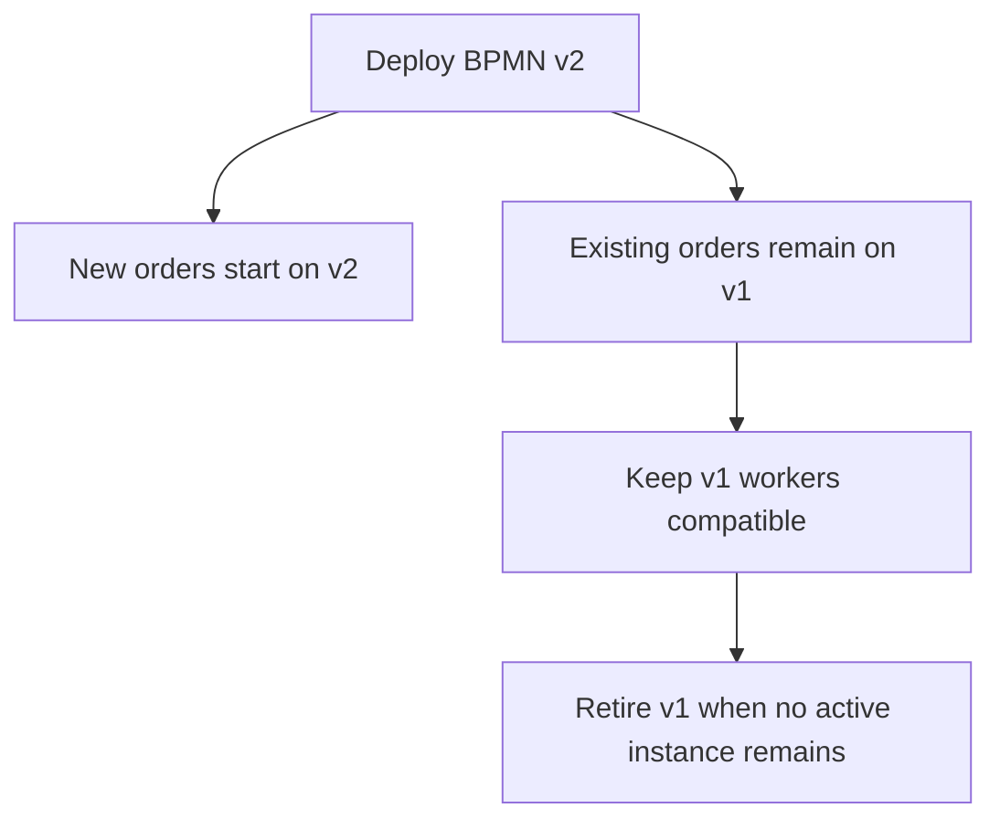
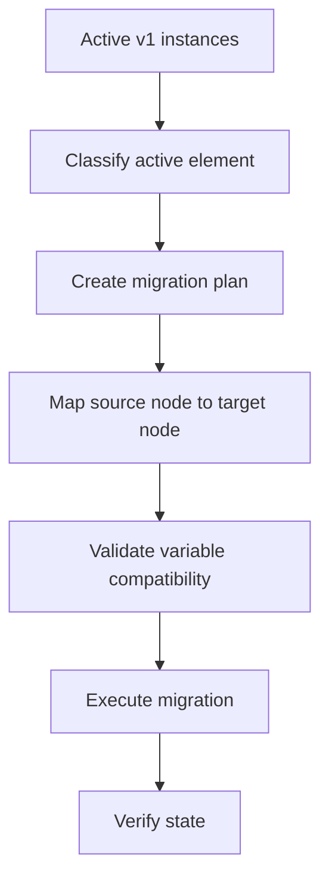
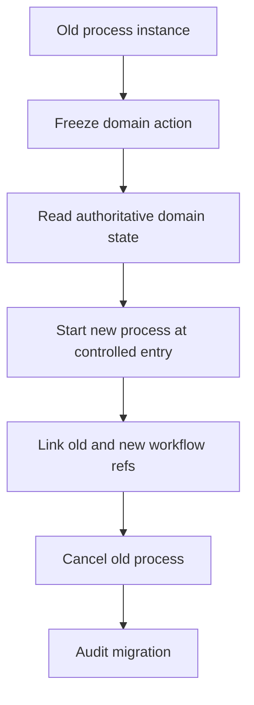
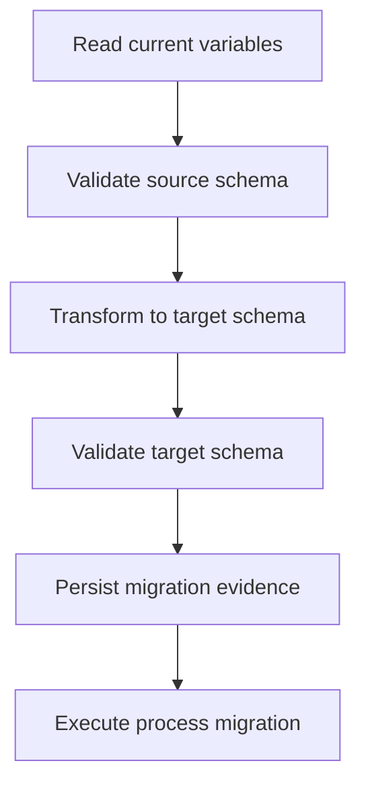
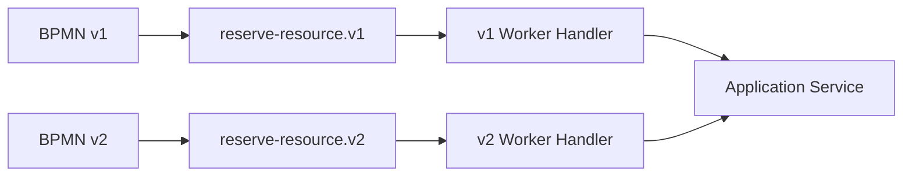
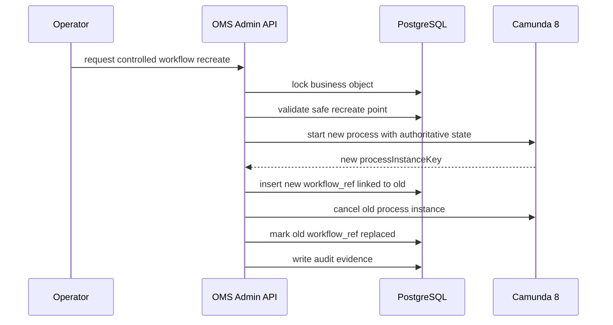
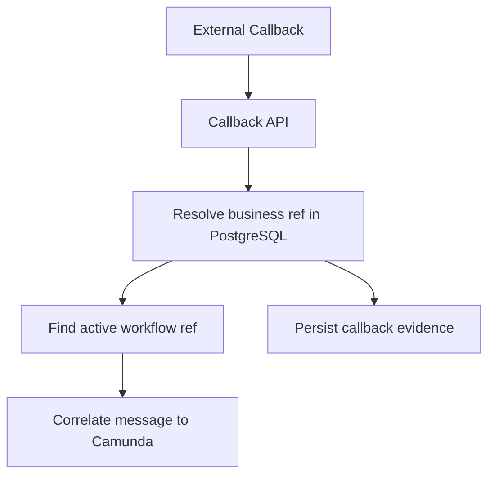

------
title: Build From Scratch: Enterprise Java Microservices CPQ & Order Management Platform - Part 044
description: Mendesain strategi workflow versioning dan process instance migration untuk Camunda 8 pada long-running CPQ/OMS process.
series: learn-enterprise-cpq-oms-glassfish-camunda8
seriesTitle: Build From Scratch: Enterprise Java Microservices CPQ & Order Management Platform
order: 44
partTitle: Workflow Versioning and Migration
tags:
  - java
  - microservices
  - cpq
  - oms
  - camunda-8
  - zeebe
  - workflow-versioning
  - process-migration
  - bpmn
  - long-running-process
  - enterprise-architecture
date: 2026-07-02
---

# Part 044 — Workflow Versioning and Migration

Kita sudah punya BPMN approval, BPMN fulfillment, dan Java worker design. Sekarang muncul masalah yang biasanya baru terasa ketika sistem sudah berjalan di production:

> Apa yang terjadi ketika workflow berubah, tetapi masih ada ribuan quote approval dan order fulfillment yang sedang aktif di versi lama?

Di CPQ/OMS, process instance bisa hidup lama:

- quote approval bisa menunggu approver beberapa hari,
- fulfillment order bisa menunggu provisioning partner,
- cancellation bisa menunggu compensation,
- fallout bisa menunggu manual repair,
- supplemental order bisa bergantung pada order sebelumnya.

Sementara itu tim engineering tetap merilis perubahan:

- BPMN diperbaiki,
- job type baru ditambahkan,
- variable schema berubah,
- worker code berubah,
- fulfillment task baru muncul,
- approval policy berubah,
- adapter integration berubah,
- domain state machine diperketat.

Tanpa strategi versioning, deployment workflow akan menjadi perjudian.

---

## 1. Masalah Inti

Workflow versioning bukan hanya “Camunda punya process definition version”. Itu hanya satu lapis.

Dalam sistem CPQ/OMS, versioning mencakup:

| Layer | Contoh Version |
|---|---|
| BPMN model | `order-fulfillment` version 12 |
| Job type contract | `oms.fulfillment.reserve-resource.v1` |
| Worker code | `oms-fulfillment-worker` release `2026.07.02` |
| Process variable schema | `order-fulfillment-vars.v1` |
| Domain command schema | `ReserveResourceCommand v1` |
| Database schema | migration `V20260702_01` |
| Event schema | `OrderFulfillmentTaskCompleted.v2` |
| Adapter contract | `InventoryReserveRequest v3` |
| Business policy | fulfillment policy `2026-Q3` |

Jika satu layer berubah tanpa kompatibilitas dengan layer lain, workflow bisa stuck.

---

## 2. Mental Model: Workflow as Process Contract

Anggap BPMN seperti API contract.

Ia punya consumer dan provider.

Consumer:

- process instance lama,
- business operation team,
- Operate/admin tooling,
- monitoring dashboard,
- reporting/reconciliation process.

Provider:

- worker,
- application service,
- external adapter,
- database schema,
- message correlation endpoint.

BPMN bukan gambar. BPMN adalah contract eksekusi jangka panjang.

---

## 3. Tiga Strategi Utama

Ada tiga strategi saat workflow berubah.

### 3.1 Let Old Instances Finish

Process definition lama tetap berjalan sampai selesai. Instance baru memakai versi baru.



Ini strategi paling aman jika:

- proses lama tidak terlalu panjang,
- bug di v1 tidak fatal,
- worker lama masih bisa dijalankan,
- operational complexity masih diterima.

### 3.2 Migrate Running Instances

Instance lama dipindahkan ke process definition baru.



Ini cocok jika:

- v1 punya defect penting,
- proses sangat panjang,
- old model tidak boleh dipertahankan,
- target model kompatibel dengan active states.

### 3.3 Terminate and Recreate Controlled Instance

Instance lama dihentikan, lalu instance baru dibuat berdasarkan state domain yang authoritative.



Ini bukan pilihan pertama, tetapi berguna ketika migration langsung tidak aman.

Syaratnya: domain state ada di PostgreSQL, bukan hanya di process variable. Karena itu sejak awal kita tidak menyimpan full order state di workflow variable.

---

## 4. Apa Yang Harus Diberi Version

### 4.1 BPMN Process ID

Gunakan process ID stabil untuk capability besar:

```text
cpq-quote-approval
oms-order-fulfillment
oms-cancellation-fulfillment
oms-fallout-repair
```

Jangan buat process ID berisi tanggal rilis:

```text
oms-order-fulfillment-20260702
```

Tanggal rilis adalah metadata deployment, bukan identity bisnis process.

### 4.2 Job Type

Job type perlu major version.

```text
oms.fulfillment.reserve-resource.v1
oms.fulfillment.reserve-resource.v2
```

Gunakan versi baru jika input/output job contract berubah breaking.

Tidak perlu versi baru jika perubahan hanya internal implementation dan masih menerima variable yang sama.

### 4.3 Variable Schema

Gunakan envelope:

```json
{
  "schemaVersion": "1.0",
  "tenantId": "tenant-001",
  "orderId": "ord-001",
  "workflowRefId": "wfr-001",
  "correlationId": "corr-001"
}
```

Jika menambah field optional, schema tetap compatible.

Jika menghapus/rename required field, itu breaking.

### 4.4 Domain Transition Version

State transition domain juga bisa berubah.

Contoh:

```text
FULFILLMENT_TASK_STARTED v1
FULFILLMENT_TASK_STARTED v2
```

Namun jangan buru-buru version setiap method. Version domain transition hanya jika semantic-nya berubah.

### 4.5 Event Schema Version

Workflow worker sering menghasilkan event.

Contoh:

```text
OrderFulfillmentTaskCompleted.v1
OrderFulfillmentTaskCompleted.v2
```

Event schema versioning mengikuti aturan Kafka/event compatibility, bukan BPMN compatibility saja.

---

## 5. Workflow Reference Table

Domain perlu tahu workflow apa yang sedang menjalankan entity tertentu.

```sql
CREATE TABLE workflow_instance_ref (
    id                      text PRIMARY KEY,
    tenant_id               text NOT NULL,
    business_ref_type       text NOT NULL,
    business_ref_id         text NOT NULL,
    process_id              text NOT NULL,
    process_definition_key   text NOT NULL,
    process_definition_version integer,
    process_instance_key     text NOT NULL,
    workflow_status         text NOT NULL,
    variable_schema_version text NOT NULL,
    started_by_command_id   text NOT NULL,
    started_at              timestamptz NOT NULL,
    ended_at                timestamptz,
    migrated_from_ref_id    text,
    migration_status        text,
    UNIQUE (tenant_id, process_instance_key),
    UNIQUE (tenant_id, business_ref_type, business_ref_id, process_id, workflow_status)
);
```

Fungsi tabel ini:

- trace process instance dari order/quote,
- tahu process version yang menjalankan order,
- mendukung migration audit,
- mencegah dua active workflow untuk business object yang sama,
- menjadi jembatan antara domain state dan Camunda state.

---

## 6. Process Definition Deployment Policy

Jangan deploy BPMN seperti deploy file statis tanpa policy.

Policy minimal:

1. BPMN harus punya semantic version metadata.
2. Job type harus terdaftar di worker registry.
3. Variable schema harus tervalidasi.
4. Migration compatibility harus dianalisis.
5. Active instance impact harus dihitung.
6. Rollback policy harus jelas.
7. Dashboard harus bisa membedakan process version.

Metadata yang berguna di BPMN/documentation:

```yaml
processId: oms-order-fulfillment
semanticVersion: 2.3.0
compatibleVariableSchemas:
  - order-fulfillment-vars.v1
  - order-fulfillment-vars.v1.1
introducedJobTypes:
  - oms.fulfillment.reserve-resource.v1
  - oms.fulfillment.provision-service.v2
removedJobTypes:
  - oms.fulfillment.provision-service.v1
migrationRequiredFrom:
  - 1.x
```

---

## 7. Compatibility Matrix

Sebelum deploy, klasifikasikan perubahan.

| Change | Risiko | Biasanya Aman? |
|---|---:|---|
| Menambah service task setelah path yang belum aktif | Medium | Bisa aman jika variables/worker siap. |
| Mengubah job type task aktif | High | Tidak aman untuk instance lama kecuali worker lama tetap ada atau migration dilakukan. |
| Rename process variable required | High | Breaking. |
| Menambah optional process variable | Low | Biasanya aman. |
| Menghapus gateway path | High | Risky untuk token yang akan menuju path itu. |
| Mengubah correlation key | High | Breaking untuk callback aktif. |
| Mengubah timer duration | Medium | Bisa berdampak SLA. |
| Menambah boundary error event | Medium | Aman jika worker bisa throw error baru. |
| Menghapus compensation path | High | Berbahaya untuk completed tasks yang perlu reversal. |
| Mengubah task order | Medium/High | Perlu domain dependency analysis. |
| Mengubah worker code tanpa job contract change | Low/Medium | Aman jika backward compatible. |

Rule:

> Jika instance lama masih bisa mencapai element lama, worker untuk element lama harus tetap tersedia.

---

## 8. Versioning Worker Code

Ada dua pendekatan.

### 8.1 Stable Job Type, Backward Compatible Handler

Job type tetap:

```text
oms.fulfillment.reserve-resource.v1
```

Handler menerima schema lama dan schema baru.

Cocok jika perubahan kecil:

- field optional baru,
- internal adapter improvement,
- observability improvement,
- bug fix yang tidak mengubah variable contract.

### 8.2 New Job Type for Breaking Contract

Job type baru:

```text
oms.fulfillment.reserve-resource.v2
```

v1 worker tetap berjalan sampai semua v1 instance selesai/migrated.

Cocok jika:

- required variable berubah,
- output variable berubah,
- domain command semantic berubah,
- external idempotency key berubah,
- failure path berubah.

---

## 9. Variable Migration

Process instance migration bukan hanya memindahkan token dari node A ke node B. Variable juga harus compatible.

Variable migration strategy:



Namun dalam desain kita, variable kecil. Jadi migration lebih mudah.

Contoh source:

```json
{
  "schemaVersion": "1.0",
  "tenantId": "tenant-001",
  "orderId": "ord-001",
  "fulfillmentTaskId": "ft-001"
}
```

Target:

```json
{
  "schemaVersion": "1.1",
  "tenantId": "tenant-001",
  "orderId": "ord-001",
  "fulfillmentTaskId": "ft-001",
  "workflowRefId": "wfr-001"
}
```

Jika target membutuhkan data yang tidak ada di variable, ambil dari PostgreSQL domain table.

---

## 10. Migration Plan Model

Buat migration sebagai artifact formal.

```sql
CREATE TABLE workflow_migration_plan (
    id                    text PRIMARY KEY,
    tenant_id             text,
    process_id            text NOT NULL,
    source_version         integer NOT NULL,
    target_version         integer NOT NULL,
    reason                text NOT NULL,
    risk_level             text NOT NULL,
    status                text NOT NULL,
    created_by            text NOT NULL,
    created_at            timestamptz NOT NULL,
    approved_by           text,
    approved_at           timestamptz
);

CREATE TABLE workflow_migration_node_mapping (
    id                    text PRIMARY KEY,
    migration_plan_id     text NOT NULL REFERENCES workflow_migration_plan(id),
    source_element_id     text NOT NULL,
    target_element_id     text NOT NULL,
    mapping_type          text NOT NULL,
    notes                 text
);

CREATE TABLE workflow_migration_case (
    id                    text PRIMARY KEY,
    migration_plan_id     text NOT NULL REFERENCES workflow_migration_plan(id),
    tenant_id             text NOT NULL,
    business_ref_type     text NOT NULL,
    business_ref_id       text NOT NULL,
    source_process_instance_key text NOT NULL,
    status                text NOT NULL,
    precheck_result_json  jsonb,
    execution_result_json jsonb,
    error_code            text,
    error_message         text,
    started_at            timestamptz,
    completed_at          timestamptz
);
```

Kenapa formal?

Karena migration adalah production operation dengan risiko bisnis.

Ia perlu:

- approval,
- audit,
- dry run,
- rollback/fallback,
- result verification,
- incident linkage.

---

## 11. Migration Readiness Classification

Sebelum migrasi, setiap instance diklasifikasikan.

| Class | Makna | Action |
|---|---|---|
| `SAFE_TO_MIGRATE` | Active element punya mapping jelas dan variable compatible. | Bisa masuk migration batch. |
| `WAIT_UNTIL_SAFE_POINT` | Saat ini aktif di element riskan, tetapi akan mencapai wait state aman. | Jangan migrasi sekarang. |
| `KEEP_ON_OLD_VERSION` | Model lama masih acceptable, risiko migrasi lebih besar. | Biarkan selesai. |
| `RECREATE_INSTANCE` | Direct migration tidak aman. | Controlled terminate/recreate. |
| `MANUAL_REVIEW` | State tidak sesuai pattern normal. | Review operasi. |

Precheck query perlu melihat:

- process version,
- active element,
- business state,
- fulfillment task status,
- active external call,
- open incident,
- open fallout,
- variable schema version,
- compensation state.

---

## 12. Safe Migration Points

Tidak semua titik dalam process aman untuk migrasi.

Relatif aman:

- waiting user task,
- waiting message event,
- before starting external call,
- after task completed and before next independent branch,
- manual fallout wait state.

Berisiko:

- during external side effect,
- inside compensation path,
- after partial parallel branch completion,
- after timer created with changed SLA semantic,
- while incident unresolved,
- while domain transaction is mid-transition.

Karena worker execution tidak benar-benar bisa dipotong di tengah Java method, safety point harus dilihat dari kombinasi Camunda state dan domain state.

---

## 13. Long-Running Order Strategy

Untuk OMS, default policy yang aman:

1. New orders start on latest stable process.
2. Existing orders remain on their original process unless there is strong reason to migrate.
3. Worker must support at least N previous active process versions.
4. Migration is explicit, approved, rehearsed, and audited.
5. Domain state is source of truth for recreate strategy.

N tergantung SLA dan proses terpanjang.

Jika order fulfillment bisa hidup 30 hari, worker lama mungkin harus dipertahankan lebih dari 30 hari.

---

## 14. Backward Compatible Worker Pattern

Worker bisa membaca beberapa schema version.

```java
public final class ReserveResourceJobMapper {

    public ReserveResourceCommand map(ActivatedJob job) {
        Map<String, Object> vars = job.getVariablesAsMap();
        String schemaVersion = (String) vars.get("schemaVersion");

        return switch (schemaVersion) {
            case "1.0" -> mapV1(vars, job);
            case "1.1" -> mapV11(vars, job);
            default -> throw new InvalidWorkflowVariableException(
                "Unsupported reserve resource variable schema: " + schemaVersion
            );
        };
    }
}
```

Jangan menaruh logic schema migration tersebar di semua worker. Buat mapper khusus.

---

## 15. Dual Worker Deployment

Untuk breaking job type:



Worker v1 dan v2 boleh memanggil application service yang sama, tetapi mapper dan compatibility logic berbeda.

Retirement rule:

```text
retire v1 worker only when active job count for v1 == 0
and active process instances that can reach v1 job == 0
and replay/retry window has passed
```

---

## 16. Process Start Version Policy

Saat starting workflow, application service harus eksplisit mencatat process definition yang dipakai.

```java
public record StartWorkflowResult(
    String workflowRefId,
    String processId,
    long processDefinitionKey,
    Integer processDefinitionVersion,
    long processInstanceKey
) {}
```

Jangan hanya menyimpan `processInstanceKey`.

Kita perlu tahu:

- process id,
- definition key,
- version,
- started command,
- variable schema.

Ini berguna untuk audit, debugging, migration, dan retirement.

---

## 17. Process Version Selection

Default:

```text
new instance -> latest approved process version
```

Namun enterprise system kadang butuh pinning:

- tenant tertentu belum siap v2,
- product family tertentu masih memakai flow lama,
- order type tertentu butuh experimental flow,
- rollout bertahap 10% traffic.

Buat resolver:

```java
public interface ProcessVersionResolver {
    ProcessDefinitionRef resolve(StartWorkflowRequest request);
}
```

Input:

- tenant,
- order type,
- product family,
- market,
- feature flag,
- rollout policy,
- requested process version.

Resolver harus audit keputusan.

---

## 18. Feature Flag Untuk Workflow

Feature flag boleh dipakai untuk memilih process version, tetapi jangan membuat BPMN menjadi tidak deterministik.

Lebih baik:

```text
feature flag determines which process version starts
```

Daripada:

```text
worker checks feature flag mid-process and changes behavior silently
```

Jika flag berubah ketika order sedang berjalan, hasilnya bisa tidak konsisten.

Rule:

> Ambil keputusan versi di awal, simpan di workflow_ref, lalu jalankan konsisten.

---

## 19. Migration Playbook

### Step 1 — Inventory

Ambil semua active instance:

- process id,
- version,
- active element,
- business object,
- domain state,
- incident/fallout status,
- variable schema,
- age,
- SLA risk.

### Step 2 — Classify

Masukkan ke class:

- safe to migrate,
- wait,
- keep old,
- recreate,
- manual review.

### Step 3 — Define Mapping

Mapping node lama ke node baru.

Contoh:

```text
v1: Task_ReserveResource -> v2: Task_ReserveResource
v1: Task_ProvisionService -> v2: Task_ProvisionServiceV2
v1: Gateway_CheckInventory -> v2: Gateway_CheckResourceAvailability
```

### Step 4 — Validate Variables

Pastikan target process punya variable yang dibutuhkan.

### Step 5 — Dry Run

Jalankan di environment staging dengan snapshot data representatif.

### Step 6 — Approve

Migration production butuh approval eksplisit.

### Step 7 — Execute Batch

Jangan migrasi semua sekaligus jika volumenya besar.

Gunakan batch:

```text
batch size: 100-500 instances
pause between batches
observe incident rate
```

### Step 8 — Verify

Cek:

- Camunda instance moved,
- workflow_ref updated,
- domain state unchanged kecuali expected,
- no duplicate task,
- no missing external callback,
- no event duplication,
- dashboard counts match.

### Step 9 — Retire Old Version

Setelah active old instance = 0 dan retry window selesai.

---

## 20. Controlled Recreate Pattern

Jika direct migration tidak aman, gunakan recreate.



Kunci utamanya:

- authoritative state dari PostgreSQL,
- old and new workflow refs linked,
- no duplicate active fulfillment task,
- audit menjelaskan alasan recreate,
- external callbacks diarahkan ke workflow baru atau domain callback resolver.

---

## 21. Message Correlation Compatibility

Order fulfillment sering menunggu callback external.

Jika correlation key berubah, migration sangat riskan.

Contoh v1:

```text
correlationKey = orderId
```

v2:

```text
correlationKey = fulfillmentTaskId
```

Jika external partner masih mengirim callback berdasarkan `orderId`, instance v2 tidak akan menerima message.

Solusi:

1. jangan ubah correlation key untuk active flow,
2. atau buat callback resolver yang membaca domain table,
3. atau simpan alias correlation key,
4. atau jangan migrasi instance yang sedang menunggu callback v1.

Callback resolver lebih aman:



Jangan biarkan partner langsung tahu detail process instance.

---

## 22. Timer Compatibility

Timer bukan hal kecil.

Mengubah timer berarti mengubah SLA behavior.

Contoh:

- approval escalation dari 48 jam ke 24 jam,
- provisioning timeout dari 2 jam ke 30 menit,
- cancellation grace period dari 1 hari ke 1 jam.

Pertanyaan sebelum migrate:

1. Apakah timer lama tetap berlaku untuk instance lama?
2. Apakah timer baru dihitung dari process start atau migration time?
3. Apakah escalation yang sudah terjadwal harus dibatalkan?
4. Apakah audit bisa menjelaskan perubahan SLA?

Default aman:

> Instance lama mempertahankan timer semantic lama kecuali ada approved migration rule.

---

## 23. Compensation Compatibility

Compensation path sangat sensitif.

Jika v1 sudah berhasil melakukan:

- reserve resource,
- create service,
- activate billing,

lalu v2 mengubah compensation order, kita harus tahu reversal mana yang masih valid.

Migration tidak boleh menghapus pengetahuan tentang task yang sudah completed.

Karena itu fulfillment task evidence harus ada di PostgreSQL:

```text
task completed -> evidence stored -> compensation planner can reason
```

Bukan hanya token BPMN.

---

## 24. Version-Aware Operational Dashboard

Dashboard harus bisa memfilter:

- process id,
- process version,
- workflow status,
- active element,
- incident count,
- fallout count,
- average duration per version,
- migration status,
- old worker dependency.

Jika dashboard hanya menampilkan “orders in progress”, tim operasi tidak tahu apakah masalah muncul karena domain issue atau process version issue.

---

## 25. Release Checklist Untuk Workflow Change

Sebelum release BPMN baru:

- [ ] Process semantic change ditulis.
- [ ] Job type baru/lama jelas.
- [ ] Worker registry mendukung semua job type yang reachable.
- [ ] Variable schema compatibility dicek.
- [ ] Message correlation compatibility dicek.
- [ ] Timer behavior dicek.
- [ ] Compensation behavior dicek.
- [ ] Active instance impact report dibuat.
- [ ] Migration strategy dipilih: finish old, migrate, atau recreate.
- [ ] Read model/dashboard bisa membedakan version.
- [ ] Rollback/fallback jelas.
- [ ] Test process lama dan baru berjalan bersamaan.
- [ ] Retirement rule worker lama ditentukan.

---

## 26. Testing Workflow Versioning

### 26.1 Old Instance Still Runs

```text
Given BPMN v1 instance waiting at reserve-resource.v1
When BPMN v2 is deployed
Then v1 instance can still complete with v1 worker
And new instance starts on v2
```

### 26.2 Dual Worker Contract

```text
Given v1 and v2 job types
When both jobs are activated
Then each maps variables using its own schema
And both call compatible application service
```

### 26.3 Variable Compatibility Test

```text
Given source variable schema v1
When migration transformer runs
Then target variable schema v1.1 validates
```

### 26.4 Migration Precheck Test

```text
Given instance active in external callback wait state
When correlation key changed in target process
Then classification is WAIT_UNTIL_SAFE_POINT or KEEP_ON_OLD_VERSION
```

### 26.5 Recreate Test

```text
Given direct migration is unsafe
When controlled recreate runs
Then new workflow starts from domain state
And old workflow is linked and cancelled
And no duplicate fulfillment task is created
```

### 26.6 Retirement Test

```text
Given no active v1 process remains
And retry window has passed
When v1 worker is disabled
Then no job type v1 activation occurs
```

---

## 27. Anti-Patterns

### 27.1 Deploy BPMN Baru dan Matikan Worker Lama

Ini cara tercepat membuat active instance stuck.

### 27.2 Mengubah Job Type Tanpa Version

Handler baru menerima variable lama dan gagal parsing.

### 27.3 Menyimpan Full Order di Process Variable

Migration menjadi transformasi payload raksasa.

### 27.4 Mengandalkan Latest Process Definition Untuk Semua Instance

Instance lama tidak otomatis pindah hanya karena model baru dideploy.

### 27.5 Migration Tanpa Domain Precheck

Camunda token bisa terlihat aman, tetapi domain task sedang punya external attempt aktif.

### 27.6 Mengubah Correlation Key Tanpa Alias

Callback partner akan hilang.

### 27.7 Tidak Ada Audit Migration

Ketika customer bertanya kenapa order-nya melewati flow berbeda, tidak ada bukti defensible.

### 27.8 Menganggap Incident Sama Dengan Migration Failure

Incident adalah engine state. Migration failure harus dicatat sebagai operational/domain evidence juga.

---

## 28. Recommended Default Policy

Untuk enterprise CPQ/OMS kita, policy default:

```text
1. Version BPMN process and job type deliberately.
2. Keep process variables minimal and schema-versioned.
3. Start new orders on latest approved process version.
4. Let old instances finish unless defect/risk demands migration.
5. Keep old workers alive while old instances are reachable.
6. Migrate only with approved migration plan, node mapping, variable validation, and domain precheck.
7. Use controlled recreate when direct migration is unsafe.
8. Store workflow refs and migration evidence in PostgreSQL.
9. Treat migration as production operation, not casual deployment side effect.
```

---

## 29. Inti Part Ini

Workflow versioning adalah governance problem sekaligus technical problem.

Camunda menyediakan process definition version dan kemampuan migration, tetapi sistem enterprise tetap harus mendesain:

- job type version,
- worker backward compatibility,
- variable schema version,
- process start version selection,
- active instance inventory,
- migration plan,
- domain precheck,
- migration audit,
- old worker retirement,
- message/timer/compensation compatibility.

Karena order fulfillment adalah long-running process, kita tidak boleh mendesain workflow seolah semua instance selesai sebelum deployment berikutnya.

Setelah bagian ini, blok Camunda 8 selesai secara arsitektural. Berikutnya kita masuk ke event-driven architecture untuk CPQ/OMS: bagaimana Kafka, event model, outbox, inbox, integration event, command event, audit event, dan replay strategy dirancang tanpa membuat distributed system menjadi tidak terkendali.
