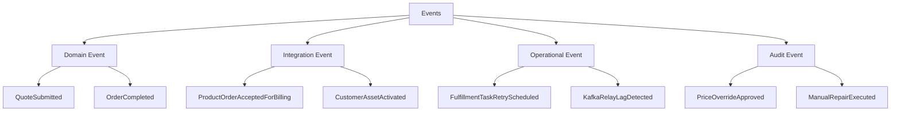
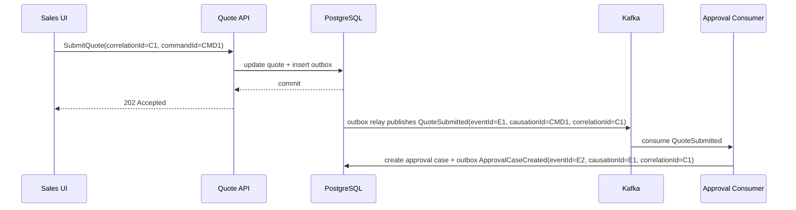
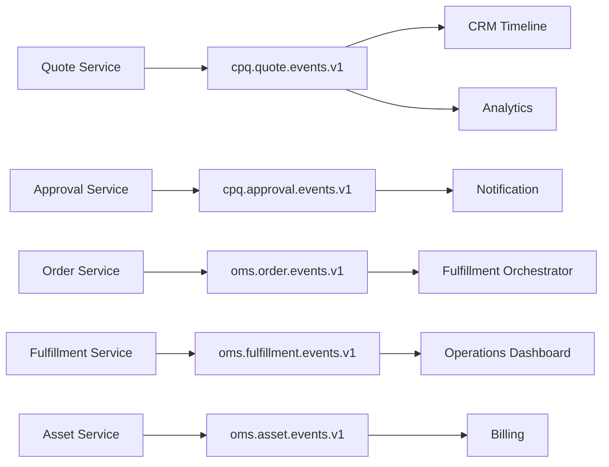
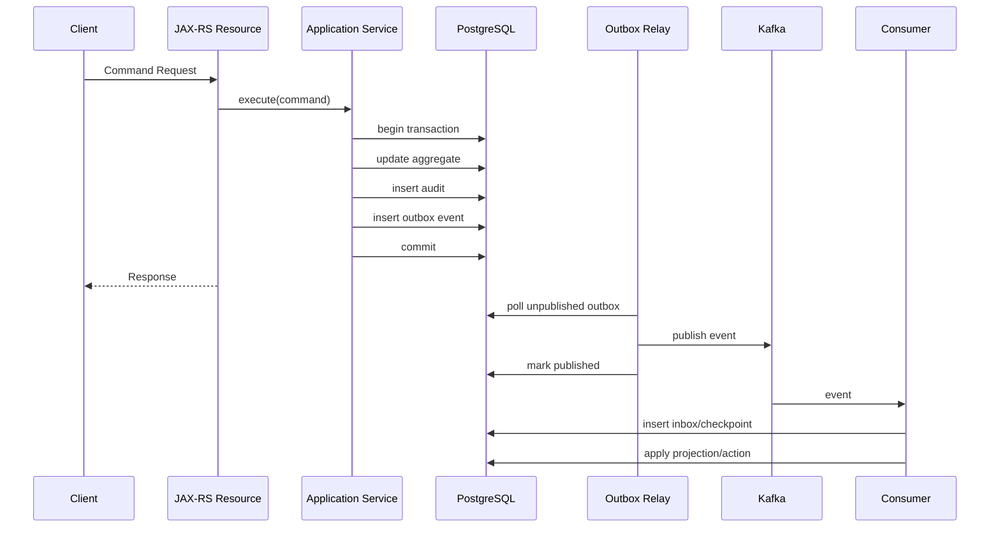
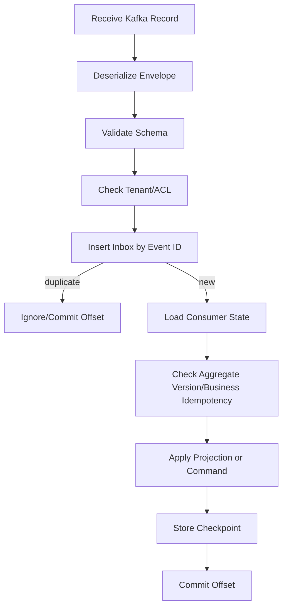
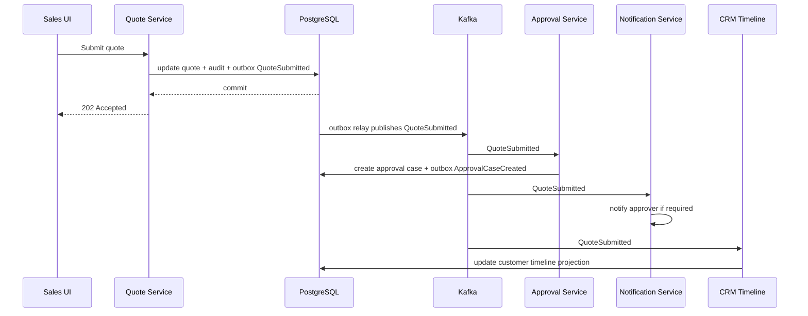
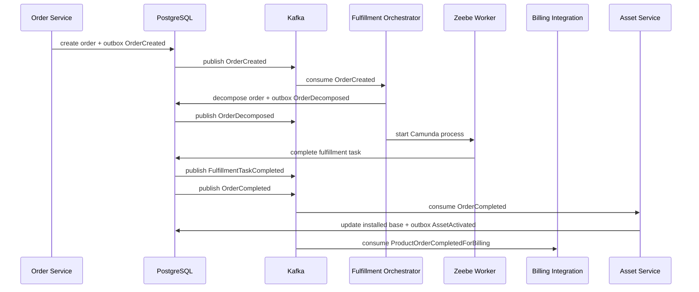

------
title: Build From Scratch: Enterprise Java Microservices CPQ & Order Management Platform - Part 045
description: Mendesain event-driven architecture untuk CPQ dan OMS: event taxonomy, topic boundary, ownership, ordering, idempotency, event lifecycle, Kafka integration, audit, observability, dan failure model.
series: learn-enterprise-cpq-oms-glassfish-camunda8
seriesTitle: Build From Scratch: Enterprise Java Microservices CPQ & Order Management Platform
order: 45
partTitle: Event Driven Architecture for CPQ OMS
tags:
  - java
  - microservices
  - cpq
  - oms
  - kafka
  - event-driven-architecture
  - domain-events
  - integration-events
  - outbox
  - architecture
  - enterprise-architecture
date: 2026-07-02
---

# Part 045 — Event Driven Architecture for CPQ/OMS

Pada part sebelumnya kita sudah membangun fondasi domain, API, persistence, CPQ engine, OMS engine, dan orchestration dengan Camunda 8. Sekarang kita masuk ke lapisan yang sering membuat enterprise microservices terlihat modern tapi rapuh: **event-driven architecture**.

Event-driven architecture bukan berarti semua service berkomunikasi lewat event. Itu miskonsepsi.

Di CPQ/OMS production-grade, event punya tujuan yang lebih presisi:

1. menyebarkan perubahan fakta bisnis yang sudah commit,
2. memicu downstream reaction tanpa coupling langsung,
3. membangun projection dan operational view,
4. menyediakan audit/event timeline,
5. mendukung integration dengan CRM, billing, provisioning, inventory, notification, dan analytics,
6. membantu recovery, replay, dan reconciliation.

Kafka cocok untuk ini karena Kafka adalah distributed event streaming platform dengan konsep topic, partition, producer, consumer, consumer group, durable log, dan replayable records. Tapi Kafka bukan pengganti database, bukan pengganti state machine, bukan pengganti Camunda, dan bukan pengganti domain model.

Mental model kita:

> PostgreSQL menyimpan **truth**.  
> Domain service menentukan **meaning**.  
> Camunda mengoordinasikan **long-running process**.  
> Kafka menyebarkan **committed facts**.  
> Redis mempercepat **ephemeral access**.  
> Audit log membuktikan **why and who**.

Jika event mulai menjadi tempat business rule utama, architecture akan berubah menjadi distributed spaghetti.

---

## 1. Core Problem: Why Events Exist in CPQ/OMS

Mari lihat contoh sederhana.

Quote dibuat, dikonfigurasi, dihitung harga, diajukan approval, disetujui, diterima customer, lalu dikonversi menjadi order.

Setiap tahap punya pihak yang peduli:

| Business fact | Interested consumers |
|---|---|
| Quote created | CRM timeline, sales dashboard, analytics |
| Quote priced | approval evaluator, margin dashboard |
| Quote submitted | approval workflow, notification service |
| Quote approved | sales app, customer portal, audit |
| Quote accepted | order conversion, contract prep |
| Order created | OMS dashboard, fulfillment process, billing pre-check |
| Fulfillment task failed | fallout queue, alerting, customer care |
| Order completed | billing activation, asset inventory, notification |

Tanpa event, setiap service akan memanggil service lain secara langsung.

Akibatnya:

- CPQ harus tahu CRM, billing, notification, analytics, contract, dan OMS.
- OMS harus tahu provisioning, billing, asset, notification, dan audit.
- Setiap perubahan downstream memaksa upstream berubah.
- Latency command ikut membengkak karena terlalu banyak synchronous call.
- Kegagalan sistem eksternal bisa menggagalkan transaksi inti.

Event memecah coupling itu.

Tetapi event juga membawa risiko:

- event duplicate,
- event out-of-order,
- event schema breaking,
- consumer lambat,
- replay merusak state,
- event terlalu besar,
- event terlalu kecil,
- event dipakai sebagai command terselubung,
- producer publish event tapi DB rollback,
- DB commit tapi event gagal publish.

Karena itu event architecture harus dirancang, bukan sekadar ditambahkan.

---

## 2. Event Is Not Message Is Not Command

Kita butuh vocabulary tajam.

### 2.1 Command

Command adalah permintaan untuk mengubah state.

Contoh:

- `SubmitQuote`
- `ApproveQuote`
- `ConvertQuoteToOrder`
- `CancelOrder`
- `RetryFulfillmentTask`

Command bisa ditolak.

Command punya intent.

Command biasanya diproses oleh satu owner.

```text
SubmitQuote means:
"Please move quote Q-123 from PRICED to SUBMITTED if all invariants hold."
```

### 2.2 Event

Event adalah fakta yang sudah terjadi.

Contoh:

- `QuoteSubmitted`
- `QuoteApproved`
- `OrderCreated`
- `FulfillmentTaskFailed`
- `OrderCompleted`

Event tidak boleh ditolak oleh publisher setelah dipublish, karena event merepresentasikan fakta yang sudah commit.

```text
QuoteSubmitted means:
"Quote Q-123 was submitted at 2026-07-02T10:15:00+07:00 by user U-17."
```

### 2.3 Message

Message adalah envelope transport.

Event dan command sama-sama bisa dikirim sebagai message. Tapi di architecture kita, Kafka diprioritaskan untuk **event**, bukan command synchronous mutation.

Command utama tetap masuk melalui API/application service, lalu menghasilkan event setelah commit.

### 2.4 Notification

Notification adalah sinyal untuk manusia atau external system.

Contoh:

- send email to approver,
- send webhook to partner,
- send customer update.

Notification bisa berasal dari event, tapi notification bukan event domain.

### 2.5 Audit Record

Audit record adalah bukti perubahan.

Audit record tidak sama dengan Kafka event.

Audit harus:

- durable,
- queryable,
- tamper-resistant sejauh desain aplikasi mampu,
- punya actor,
- punya before/after atau evidence,
- punya reason/correlation.

Kafka event bisa membantu timeline, tapi audit source of truth tetap table audit di database.

---

## 3. Event Taxonomy for CPQ/OMS

Kita akan memakai empat jenis event utama.



### 3.1 Domain Event

Domain event adalah fakta bisnis internal bounded context.

Contoh:

- `CatalogOfferingPublished`
- `QuoteCreated`
- `QuoteItemConfigured`
- `QuotePriced`
- `QuoteSubmitted`
- `QuoteApprovalRequired`
- `QuoteApproved`
- `QuoteRejected`
- `QuoteAccepted`
- `OrderCreated`
- `OrderValidated`
- `OrderDecomposed`
- `FulfillmentTaskStarted`
- `FulfillmentTaskCompleted`
- `FulfillmentTaskFailed`
- `OrderCompleted`
- `AssetActivated`
- `SubscriptionStarted`

Domain event dipakai oleh internal services dan projections.

### 3.2 Integration Event

Integration event adalah event yang sengaja distabilkan untuk downstream external/internal integration.

Contoh:

- `ProductOrderReadyForFulfillment`
- `ProductOrderCompletedForBilling`
- `CustomerAssetChanged`
- `QuoteLifecycleChanged`

Integration event biasanya lebih stabil daripada domain event internal.

Kenapa?

Karena consumer eksternal tidak harus ikut setiap detail domain refactoring.

### 3.3 Operational Event

Operational event adalah event untuk operasi sistem.

Contoh:

- `OutboxRelayFailed`
- `FulfillmentTaskRetryScheduled`
- `ExternalAdapterTimeoutObserved`
- `ProjectionLagExceeded`

Operational event bukan fakta bisnis utama, tapi penting untuk observability dan support.

### 3.4 Audit Event

Audit event adalah event/bukti yang mengarah pada audit trail.

Contoh:

- `PriceOverrideRequested`
- `PriceOverrideApproved`
- `ApprovalDelegated`
- `ManualRepairExecuted`
- `OrderCancellationForced`

Di sistem kita, audit event boleh dipublish untuk consumer, tetapi audit truth tetap ada di `audit_log` table.

---

## 4. Event Ownership Rule

Rule paling penting:

> Hanya bounded context yang memiliki state boleh mempublish event tentang state itu.

Contoh:

| Event | Owner |
|---|---|
| `QuoteSubmitted` | CPQ/Quote service |
| `QuoteApproved` | Approval service/Quote approval context |
| `OrderCreated` | OMS Order service |
| `OrderDecomposed` | OMS Decomposition service |
| `FulfillmentTaskCompleted` | Fulfillment context |
| `AssetActivated` | Asset/Inventory context |
| `InvoiceGenerated` | Billing context, bukan OMS |

OMS tidak boleh mempublish `InvoiceGenerated` karena OMS bukan billing source of truth.

CPQ tidak boleh mempublish `OrderCompleted` karena CPQ tidak punya fulfillment state.

Kalau boundary ini dilanggar, consumer tidak tahu mana fakta resmi dan mana asumsi.

---

## 5. Event Naming Policy

Event name harus berbentuk past tense.

Baik:

```text
QuoteSubmitted
OrderCreated
FulfillmentTaskFailed
AssetActivated
```

Buruk:

```text
SubmitQuote
CreateOrder
DoProvisioning
NotifyBilling
```

Nama buruk di atas terdengar seperti command, bukan event.

### 5.1 Naming Formula

```text
<BusinessObject><PastTenseVerb>
```

Contoh:

```text
QuoteCreated
QuotePriced
QuoteSubmitted
QuoteApproved
QuoteAccepted
OrderCreated
OrderValidated
OrderDecomposed
OrderCompleted
FulfillmentTaskFailed
SubscriptionStarted
```

Untuk event integration yang sengaja dibuat sebagai stable contract:

```text
<DomainObject><State/Fact><ForConsumerIntent>
```

Contoh:

```text
ProductOrderCompletedForBilling
CustomerAssetChangedForCRM
QuoteLifecycleChangedForSalesTimeline
```

Gunakan dengan hati-hati. Jangan membuat nama event terlalu consumer-specific kecuali kontrak itu memang integration facade.

---

## 6. Event Granularity

Event terlalu besar membuat consumer sulit evolve. Event terlalu kecil membuat consumer harus merangkai banyak event untuk memahami satu perubahan.

### 6.1 Too Small

```text
QuoteStatusChanged
QuoteTotalChanged
QuoteSubmittedAtChanged
QuoteSubmittedByChanged
```

Consumer harus menebak bahwa semua ini bagian dari submit quote.

### 6.2 Too Generic

```text
EntityUpdated
StateChanged
DataChanged
```

Consumer tidak bisa memahami meaning tanpa membaca database publisher.

### 6.3 Better

```text
QuoteSubmitted
```

Payload membawa status baru, submittedAt, submittedBy, revision, total, dan reason/evidence yang diperlukan.

### 6.4 Decision Rule

Satu event harus merepresentasikan satu business fact yang:

- jelas terjadi,
- punya owner,
- punya timestamp,
- bisa dipakai consumer tanpa query private table publisher,
- cukup lengkap untuk idempotent handling,
- tidak membocorkan internal implementation berlebihan.

---

## 7. Event Envelope

Jangan publish raw domain object langsung ke Kafka.

Gunakan envelope.

```json
{
  "eventId": "evt_01JABC...",
  "eventType": "QuoteSubmitted",
  "eventVersion": 1,
  "occurredAt": "2026-07-02T10:15:00+07:00",
  "publishedAt": "2026-07-02T10:15:01+07:00",
  "producer": "quote-service",
  "tenantId": "tenant_acme",
  "aggregateType": "Quote",
  "aggregateId": "quote_123",
  "aggregateVersion": 7,
  "correlationId": "corr_abc",
  "causationId": "cmd_submit_quote_456",
  "traceId": "trace_xyz",
  "schemaId": "https://schemas.example.com/events/quote-submitted/1.0.0/schema.json",
  "payload": {
    "quoteId": "quote_123",
    "quoteNumber": "Q-2026-000123",
    "status": "SUBMITTED",
    "customerId": "cust_456",
    "totalRecurring": {
      "currency": "IDR",
      "amount": "1250000.00"
    },
    "totalOneTime": {
      "currency": "IDR",
      "amount": "500000.00"
    },
    "submittedBy": "user_789"
  }
}
```

### 7.1 Mandatory Envelope Fields

| Field | Purpose |
|---|---|
| `eventId` | global dedupe key |
| `eventType` | routing/handler selection |
| `eventVersion` | compatibility handling |
| `occurredAt` | when business fact happened |
| `publishedAt` | when event left outbox/producer |
| `producer` | owning service |
| `tenantId` | tenant isolation |
| `aggregateType` | business object type |
| `aggregateId` | object identity |
| `aggregateVersion` | ordering/staleness guard |
| `correlationId` | request/business transaction trace |
| `causationId` | command/event that caused this event |
| `traceId` | distributed trace integration |
| `schemaId` | schema registry/reference |
| `payload` | event-specific data |

### 7.2 `occurredAt` vs `publishedAt`

`occurredAt` adalah waktu fakta bisnis commit.

`publishedAt` adalah waktu relay berhasil publish ke Kafka.

Keduanya bisa berbeda.

Jika outbox relay tertunda selama 5 menit, `occurredAt` tetap waktu quote submitted, bukan waktu Kafka publish.

---

## 8. Correlation and Causation

Event-driven system tanpa correlation adalah production nightmare.

Kita butuh tiga ID berbeda.

| ID | Meaning |
|---|---|
| `correlationId` | mengikat satu business transaction end-to-end |
| `causationId` | menunjuk command/event penyebab langsung |
| `traceId` | distributed tracing teknis |

Contoh flow:



Dari support perspective, kita bisa menjawab:

- request mana yang memulai flow,
- command mana yang mengubah state,
- event mana yang dipublish,
- consumer mana yang bereaksi,
- process instance mana yang berjalan,
- task mana yang gagal.

---

## 9. Kafka Topic Boundary

Topic bukan sekadar folder.

Topic adalah kontrak operasional:

- retention,
- partition count,
- ordering boundary,
- ACL,
- consumer ownership,
- schema compatibility,
- replay policy,
- throughput expectation.

### 9.1 Topic by Domain Event Stream

Untuk seri ini, baseline topic:

```text
cpq.catalog.events.v1
cpq.quote.events.v1
cpq.approval.events.v1
oms.order.events.v1
oms.fulfillment.events.v1
oms.asset.events.v1
ops.system-events.v1
```

Ini lebih baik daripada satu topic global:

```text
events
```

Dan lebih baik daripada terlalu banyak topic per event type:

```text
quote-created
quote-submitted
quote-approved
quote-rejected
quote-accepted
```

### 9.2 Why Not One Topic Per Event Type?

Satu topic per event type membuat:

- operational overhead tinggi,
- ACL rumit,
- schema governance menyebar,
- consumer subscription melebar,
- ordering antar event satu aggregate sulit dipahami.

### 9.3 Why Not One Global Topic?

Satu topic global membuat:

- retention tidak fleksibel,
- schema terlalu heterogen,
- consumer membaca terlalu banyak noise,
- blast radius besar,
- partition key jadi kompromi buruk.

### 9.4 Recommended Topic Boundary

Gunakan topic per bounded context event stream.



---

## 10. Partition Key Design

Kafka ordering is per partition, not globally across topic.

Untuk event yang merepresentasikan satu aggregate, partition key harus menjaga event aggregate yang sama masuk ke partition yang sama.

### 10.1 Quote Events

```text
key = tenantId + ":quote:" + quoteId
```

### 10.2 Order Events

```text
key = tenantId + ":order:" + orderId
```

### 10.3 Fulfillment Task Events

Untuk task event, pilih boundary berdasarkan kebutuhan ordering.

Jika consumer butuh urutan per order:

```text
key = tenantId + ":order:" + orderId
```

Jika throughput task jauh lebih besar dan consumer tidak perlu urutan task antar task dalam satu order:

```text
key = tenantId + ":task:" + taskId
```

Untuk OMS, baseline yang aman:

```text
key = tenantId + ":order:" + orderId
```

Kenapa?

Karena fulfillment task state sering mempengaruhi order item/order aggregate state.

### 10.4 Bad Partition Key

Buruk:

```text
key = tenantId
```

Semua event tenant besar masuk satu partition.

Buruk:

```text
key = randomUUID
```

Ordering aggregate hilang.

Buruk:

```text
key = eventType
```

Event satu order tersebar berdasarkan tipe event, bukan aggregate.

---

## 11. Event Ordering Model

Jangan menjanjikan global ordering.

Yang bisa dijanjikan:

1. ordering per aggregate jika partition key benar,
2. ordering per partition,
3. consumer idempotency,
4. stale event rejection berdasarkan aggregate version,
5. reconciliation untuk gap/drift.

### 11.1 Aggregate Version Guard

Setiap event membawa `aggregateVersion`.

Consumer projection menyimpan versi terakhir.

```sql
CREATE TABLE quote_projection_checkpoint (
  tenant_id          text NOT NULL,
  quote_id           uuid NOT NULL,
  last_version       bigint NOT NULL,
  last_event_id      uuid NOT NULL,
  updated_at         timestamptz NOT NULL,
  PRIMARY KEY (tenant_id, quote_id)
);
```

Consumer rule:

```text
if event.aggregateVersion <= lastVersion:
    ignore as duplicate/stale
else if event.aggregateVersion == lastVersion + 1:
    apply
else:
    mark gap and reconcile
```

### 11.2 Not All Consumers Need Strict Version

Analytics consumer mungkin cukup append-only.

Projection consumer butuh version guard.

Integration consumer butuh dedupe dan business idempotency.

---

## 12. Event Payload Design

Ada dua ekstrem.

### 12.1 Thin Event

```json
{
  "quoteId": "quote_123"
}
```

Consumer harus call back ke producer.

Masalah:

- coupling tinggi,
- producer overload,
- state yang dibaca mungkin sudah berubah,
- replay lama menghasilkan state baru, bukan state saat event terjadi.

### 12.2 Fat Event

```json
{
  "fullQuote": { "...": "all fields, all items, all price lines, all internal flags" }
}
```

Masalah:

- schema berat,
- PII leakage,
- internal model bocor,
- compatibility sulit,
- event size besar.

### 12.3 Snapshot-Oriented Event

Untuk CPQ/OMS, gunakan payload cukup lengkap untuk consumer menjalankan reaksinya tanpa query private table.

Contoh `QuoteSubmitted`:

```json
{
  "quoteId": "quote_123",
  "quoteNumber": "Q-2026-000123",
  "revision": 3,
  "status": "SUBMITTED",
  "customerRef": {
    "customerId": "cust_456",
    "customerType": "BUSINESS"
  },
  "commercialSummary": {
    "itemCount": 4,
    "hasManualOverride": true,
    "requiresApproval": true,
    "totalOneTime": { "currency": "IDR", "amount": "500000.00" },
    "totalRecurring": { "currency": "IDR", "amount": "1250000.00" }
  },
  "submittedBy": "user_789",
  "submittedAt": "2026-07-02T10:15:00+07:00"
}
```

Bukan semua detail item. Tapi cukup untuk approval trigger, timeline, notification, dan dashboard.

Detail lengkap tetap tersedia lewat query API bila consumer authorized dan memang perlu.

---

## 13. Event Schema Governance

Event contract harus diperlakukan seperti API contract.

Folder baseline:

```text
contracts/
  events/
    cpq.quote/
      QuoteCreated.v1.schema.json
      QuotePriced.v1.schema.json
      QuoteSubmitted.v1.schema.json
      QuoteApproved.v1.schema.json
    oms.order/
      OrderCreated.v1.schema.json
      OrderValidated.v1.schema.json
      OrderDecomposed.v1.schema.json
      OrderCompleted.v1.schema.json
    oms.fulfillment/
      FulfillmentTaskStarted.v1.schema.json
      FulfillmentTaskCompleted.v1.schema.json
      FulfillmentTaskFailed.v1.schema.json
```

### 13.1 Compatibility Rules

Additive change usually safe:

```json
{
  "newOptionalField": "value"
}
```

Breaking change:

- rename field,
- remove field,
- change type,
- change enum meaning,
- make optional field required,
- change semantic meaning without schema change.

### 13.2 Event Versioning

Event version is not application version.

`QuoteSubmitted` v1 can still be produced by quote-service 2.7.4.

Gunakan:

```json
{
  "eventType": "QuoteSubmitted",
  "eventVersion": 1,
  "schemaId": "https://schemas.example.com/events/cpq.quote/QuoteSubmitted/1.0.0/schema.json"
}
```

### 13.3 Enum Governance

Enum adalah silent breaking-change hotspot.

Contoh:

```json
"status": "APPROVAL_PENDING"
```

Jika consumer lama tidak mengenal status baru, apa yang terjadi?

Policy:

- consumer harus tolerate unknown enum jika domain mengizinkan,
- schema diff gate harus mendeteksi enum addition,
- release note wajib menjelaskan semantic,
- projection harus punya fallback state `UNKNOWN` atau reject terkontrol.

---

## 14. Event Lifecycle

Event tidak lahir langsung di Kafka.

Dalam sistem kita:

1. command diterima API/application service,
2. domain invariant dicek,
3. aggregate berubah,
4. state disimpan di PostgreSQL,
5. audit record disimpan,
6. outbox row disimpan dalam transaction yang sama,
7. transaction commit,
8. relay membaca outbox,
9. relay publish ke Kafka,
10. consumer consume event,
11. consumer simpan inbox/checkpoint,
12. consumer update projection/trigger action.



Ini menyelesaikan dual-write problem antara database dan Kafka. Detailnya akan dibahas di Part 046.

---

## 15. Producer Architecture

Producer bukan dipanggil langsung oleh command handler.

Buruk:

```java
quoteRepository.save(quote);
kafkaProducer.send(new QuoteSubmittedEvent(...));
```

Jika DB commit sukses tapi Kafka gagal, event hilang.

Jika Kafka sukses tapi DB rollback, event palsu tersebar.

Baik:

```java
unitOfWork.transaction(() -> {
    quoteRepository.save(quote);
    auditRepository.append(auditRecord);
    outboxRepository.append(quoteSubmittedEvent);
});
```

Relay terpisah publish event setelah commit.

### 15.1 Domain Event Collector

Application service bisa mengumpulkan domain event dari aggregate.

```java
public final class Quote {
    private final List<DomainEvent> pendingEvents = new ArrayList<>();

    public void submit(UserId submittedBy, Clock clock) {
        requireState(QuoteStatus.PRICED);
        requireNoBlockingValidationErrors();

        this.status = QuoteStatus.SUBMITTED;
        this.submittedAt = OffsetDateTime.now(clock);
        this.version = this.version + 1;

        pendingEvents.add(new QuoteSubmitted(
            this.id,
            this.quoteNumber,
            this.revision,
            this.version,
            submittedBy,
            this.submittedAt,
            this.totalSummary()
        ));
    }

    public List<DomainEvent> releaseEvents() {
        List<DomainEvent> copy = List.copyOf(pendingEvents);
        pendingEvents.clear();
        return copy;
    }
}
```

Application service memutuskan event mana masuk outbox.

```java
public SubmitQuoteResult submit(SubmitQuoteCommand command) {
    return unitOfWork.required(() -> {
        IdempotencyDecision decision = idempotency.begin(command.idempotencyKey(), command.requestHash());
        if (decision.isReplay()) return decision.replay();

        Quote quote = quoteRepository.getForUpdate(command.tenantId(), command.quoteId());
        quote.submit(command.actor(), clock);

        quoteRepository.save(quote);
        auditRepository.append(AuditRecord.quoteSubmitted(command, quote));

        for (DomainEvent event : quote.releaseEvents()) {
            outboxRepository.append(EventEnvelope.from(event, command.context()));
        }

        SubmitQuoteResult result = SubmitQuoteResult.accepted(quote.id(), quote.version());
        idempotency.complete(command.idempotencyKey(), result);
        return result;
    });
}
```

---

## 16. Consumer Architecture

Consumer harus diasumsikan menerima:

- duplicate event,
- stale event,
- out-of-order event,
- event yang pernah berhasil diproses tapi offset belum commit,
- event valid secara schema tapi invalid secara business untuk consumer state saat ini.

### 16.1 Consumer Pipeline



### 16.2 Inbox First

Consumer harus menyimpan `eventId` sebelum melakukan side effect.

```sql
CREATE TABLE kafka_inbox (
  consumer_name       text NOT NULL,
  event_id            uuid NOT NULL,
  topic               text NOT NULL,
  partition_no        int NOT NULL,
  offset_no           bigint NOT NULL,
  event_type          text NOT NULL,
  aggregate_type      text NOT NULL,
  aggregate_id        uuid NOT NULL,
  tenant_id           text NOT NULL,
  received_at         timestamptz NOT NULL DEFAULT now(),
  processed_at        timestamptz,
  status              text NOT NULL,
  error_code          text,
  error_message       text,
  PRIMARY KEY (consumer_name, event_id)
);
```

### 16.3 Consumer Side Effects

Consumer type menentukan side effect.

| Consumer | Side effect |
|---|---|
| Quote projection consumer | update read model |
| Approval trigger consumer | create approval case |
| Notification consumer | send email/push |
| Billing integration consumer | call billing API |
| Analytics consumer | append analytics event |
| Cache invalidation consumer | delete Redis key |

Setiap side effect butuh idempotency strategy sendiri.

---

## 17. Event-Driven CPQ Flow



Quote service tidak tahu notification service. Quote service hanya publish fact.

Approval service boleh bereaksi karena approval case adalah domain lain.

---

## 18. Event-Driven OMS Flow



Perhatikan boundary:

- Camunda mengoordinasikan process.
- Task completion tetap disimpan di PostgreSQL.
- Kafka menyebarkan fakta completion.
- Billing dipicu oleh integration event yang stabil.

---

## 19. Commands Over Kafka: When Allowed?

Default seri ini: business commands utama masuk via HTTP API atau internal application service, bukan Kafka.

Tetapi ada kasus command-like message lewat Kafka yang bisa diterima:

1. external system hanya mampu publish async request,
2. batch ingestion,
3. back-office mass operation,
4. integration gateway menerima event eksternal dan menerjemahkannya menjadi internal command,
5. CDC/import pipeline.

Jika dilakukan, jangan sebut command itu domain event.

Gunakan topic terpisah:

```text
integration.inbound.commands.v1
```

Dan tetap proses seperti command:

- validate,
- authorize/system trust,
- idempotency,
- load aggregate,
- enforce invariant,
- persist state,
- publish outbox event.

---

## 20. Kafka Does Not Give Business Exactly-Once

Kafka punya fitur idempotent producer dan transaction untuk skenario tertentu. Namun di CPQ/OMS, business exactly-once tetap harus dibangun di layer aplikasi.

Kenapa?

Karena efek bisnis tidak hanya `consume record -> produce record`.

Kita punya:

- update PostgreSQL,
- call external provisioning API,
- create Camunda process instance,
- send notification,
- update Redis,
- write audit.

Kafka transaction tidak otomatis membuat semua side effect itu exactly-once.

Jadi prinsip kita:

> Delivery may be at-least-once.  
> Business effect must be idempotent.  
> State transition must be guarded by version and constraints.  
> Drift must be detectable and repairable.

---

## 21. Event Replay Strategy

Replay adalah kekuatan Kafka, tapi replay bisa berbahaya.

Consumer harus diklasifikasikan.

### 21.1 Replay-Safe Consumer

Contoh:

- analytics append with dedupe,
- projection rebuild,
- cache warmer,
- timeline rebuild.

Replay boleh dilakukan dengan checkpoint reset jika consumer idempotent.

### 21.2 Replay-Restricted Consumer

Contoh:

- send email,
- call billing API,
- call provisioning API,
- start Camunda process.

Replay bisa menyebabkan duplicate side effect.

Harus ada:

- inbox dedupe,
- business idempotency key,
- dry-run/reconciliation mode,
- manual approval untuk replay besar.

### 21.3 Replay-Forbidden Without Special Mode

Contoh:

- payment capture,
- legal contract activation,
- irreversible external activation.

Consumer harus punya mode khusus:

```text
NORMAL_PROCESSING
REPLAY_SKIP_EXTERNAL_SIDE_EFFECT
REPLAY_RECONCILE_ONLY
```

---

## 22. Event Retention and Compaction

Tidak semua topic punya retention yang sama.

| Topic | Suggested retention | Reason |
|---|---:|---|
| `cpq.quote.events.v1` | 30–180 days | quote lifecycle replay/projection |
| `oms.order.events.v1` | 180–365 days | order support and reconciliation |
| `oms.fulfillment.events.v1` | 30–180 days | operational incident analysis |
| `oms.asset.events.v1` | long retention or compacted projection stream | installed base change history |
| `ops.system-events.v1` | 7–30 days | operational diagnostics |

Long-term audit tetap di database/audit storage, bukan Kafka retention saja.

### 22.1 Compacted Topic?

Log compaction cocok untuk latest state stream seperti:

```text
oms.asset.snapshot.v1
catalog.offering.snapshot.v1
```

Tapi event lifecycle seperti `QuoteSubmitted`, `QuoteApproved`, `OrderCompleted` sebaiknya append-only stream, bukan compacted, karena history matters.

---

## 23. Event Security and Data Minimization

Event payload sering bocor lintas boundary.

Jangan masukkan data ini tanpa alasan kuat:

- raw identity document,
- payment instrument,
- password/token,
- full address jika tidak perlu,
- confidential discount formula,
- internal margin jika consumer tidak authorized,
- customer PII detail berlebihan.

Event harus memakai reference dan summary.

Contoh:

```json
"customerRef": {
  "customerId": "cust_456",
  "segment": "ENTERPRISE"
}
```

Bukan:

```json
"customer": {
  "name": "...",
  "fullAddress": "...",
  "taxId": "...",
  "allContacts": [...]
}
```

Security policy:

- topic ACL per consumer group,
- payload minimization,
- encryption at rest/in transit sesuai platform,
- tenant ID mandatory,
- no secrets in events,
- schema review untuk sensitive fields,
- audit access to event topics.

---

## 24. Event Observability

Event architecture harus observable dari hari pertama.

### 24.1 Producer Metrics

- outbox pending count,
- outbox oldest pending age,
- publish success rate,
- publish failure count,
- publish latency,
- event size distribution,
- events per type,
- outbox retry count.

### 24.2 Consumer Metrics

- consumer lag,
- processing latency,
- event handler duration,
- duplicate event count,
- stale event count,
- schema validation failure count,
- poison event count,
- DLQ count,
- projection drift count.

### 24.3 Business Metrics

- quote submitted to approval created latency,
- quote accepted to order created latency,
- order created to process started latency,
- task failed to fallout opened latency,
- order completed to billing triggered latency.

Business metrics lebih penting daripada sekadar Kafka lag.

Kafka lag rendah tapi approval case tidak terbentuk tetap production incident.

---

## 25. Dead Letter Queue Policy

DLQ bukan tempat sampah permanen.

DLQ harus punya ownership dan repair playbook.

### 25.1 DLQ Topic Naming

```text
cpq.quote.events.dlq.v1
oms.order.events.dlq.v1
oms.fulfillment.events.dlq.v1
```

### 25.2 DLQ Record

DLQ record harus membawa:

- original topic,
- partition,
- offset,
- event envelope,
- consumer name,
- failure reason,
- stack trace summary,
- failed at,
- retry count,
- classification.

### 25.3 DLQ Classification

| Type | Meaning | Action |
|---|---|---|
| Schema invalid | producer bug or incompatible schema | stop/reject producer, fix contract |
| Unknown event version | consumer outdated | deploy compatible consumer |
| Business stale | event old/duplicate | ignore or reconcile |
| Missing reference | consumer state gap | retry/reconcile |
| External failure | downstream unavailable | retry with backoff |
| Poison event | permanent unprocessable | manual review |

---

## 26. Event Anti-Patterns

### 26.1 Event as Database Dump

```json
{
  "table": "quote",
  "operation": "UPDATE",
  "row": { "...": "..." }
}
```

Ini CDC-level fact, bukan domain event. Boleh untuk data pipeline tertentu, tapi bukan business event contract.

### 26.2 Event as RPC

```text
DoBillingNow
ProvisionThisOrder
```

Itu command. Jika memakai Kafka command, desain sebagai command dengan reply/timeout/idempotency, jangan berpura-pura event.

### 26.3 Consumer Reads Producer Private DB

Consumer Kafka lalu query table service producer secara langsung.

Ini menghancurkan service boundary.

### 26.4 Publish Before Commit

Event dipublish sebelum DB commit.

Consumer melihat fakta yang belum tentu benar.

### 26.5 Missing Event Version

Tanpa version, consumer tidak punya strategi evolusi.

### 26.6 Missing Correlation ID

Tanpa correlation, support tidak bisa reconstruct flow.

### 26.7 Event Too Generic

`StatusChanged` tanpa meaning bisnis membuat consumer menebak.

### 26.8 Blind Replay

Replay consumer yang memanggil external API bisa menggandakan billing/provisioning.

---

## 27. Concrete Event Catalog for Our Platform

### 27.1 Catalog Events

| Event | Meaning |
|---|---|
| `ProductOfferingDrafted` | offering dibuat tapi belum published |
| `ProductOfferingPublished` | offering tersedia untuk CPQ |
| `ProductOfferingRetired` | offering tidak lagi bisa dijual baru |
| `ProductCompatibilityRuleChanged` | rule konfigurasi berubah |
| `PriceListPublished` | price list baru berlaku |

### 27.2 Quote Events

| Event | Meaning |
|---|---|
| `QuoteCreated` | quote draft dibuat |
| `QuoteItemAdded` | item komersial ditambahkan |
| `QuoteItemConfigured` | configuration valid/partial tersimpan |
| `QuotePriced` | price snapshot dihitung |
| `QuoteSubmitted` | quote diajukan untuk acceptance/approval |
| `QuoteApprovalRequired` | quote membutuhkan approval |
| `QuoteApproved` | approval final selesai |
| `QuoteRejected` | approval ditolak |
| `QuoteAccepted` | customer/sales menerima quote |
| `QuoteExpired` | quote melewati validity |
| `QuoteConvertedToOrder` | order berhasil dibuat dari quote |

### 27.3 Order Events

| Event | Meaning |
|---|---|
| `OrderCreated` | order dibuat |
| `OrderValidated` | order lolos validation |
| `OrderRejected` | order gagal validation final |
| `OrderDecomposed` | fulfillment plan terbentuk |
| `OrderFulfillmentStarted` | process fulfillment dimulai |
| `OrderPartiallyCompleted` | sebagian item selesai |
| `OrderCompleted` | semua item selesai atau terminal success |
| `OrderFailed` | order terminal failure |
| `OrderCancellationRequested` | cancellation diminta |
| `OrderCancelled` | cancellation selesai |
| `OrderAmended` | amendment order diproses |

### 27.4 Fulfillment Events

| Event | Meaning |
|---|---|
| `FulfillmentPlanCreated` | task graph tersimpan |
| `FulfillmentTaskReady` | task siap dieksekusi |
| `FulfillmentTaskStarted` | task mulai |
| `FulfillmentTaskCompleted` | task selesai sukses |
| `FulfillmentTaskFailed` | task gagal |
| `FulfillmentTaskRetryScheduled` | retry dijadwalkan |
| `FulfillmentTaskTimedOut` | timeout terjadi |
| `FulfillmentFalloutOpened` | fallout case dibuat |
| `FulfillmentFalloutResolved` | fallout selesai |

### 27.5 Asset and Subscription Events

| Event | Meaning |
|---|---|
| `AssetCreated` | customer asset dibuat |
| `AssetActivated` | asset aktif |
| `AssetModified` | asset berubah karena modify order |
| `AssetDisconnected` | asset dihentikan |
| `SubscriptionStarted` | subscription mulai |
| `SubscriptionChanged` | subscription berubah |
| `SubscriptionEnded` | subscription selesai |

---

## 28. Example: `OrderCompleted` Event Schema

```json
{
  "$id": "https://schemas.example.com/events/oms.order/OrderCompleted/1.0.0/schema.json",
  "$schema": "https://json-schema.org/draft/2020-12/schema",
  "type": "object",
  "required": [
    "eventId",
    "eventType",
    "eventVersion",
    "occurredAt",
    "producer",
    "tenantId",
    "aggregateType",
    "aggregateId",
    "aggregateVersion",
    "correlationId",
    "payload"
  ],
  "properties": {
    "eventId": { "type": "string", "format": "uuid" },
    "eventType": { "const": "OrderCompleted" },
    "eventVersion": { "const": 1 },
    "occurredAt": { "type": "string", "format": "date-time" },
    "publishedAt": { "type": "string", "format": "date-time" },
    "producer": { "const": "order-service" },
    "tenantId": { "type": "string", "minLength": 1 },
    "aggregateType": { "const": "Order" },
    "aggregateId": { "type": "string", "format": "uuid" },
    "aggregateVersion": { "type": "integer", "minimum": 1 },
    "correlationId": { "type": "string", "minLength": 1 },
    "causationId": { "type": "string" },
    "traceId": { "type": "string" },
    "payload": {
      "type": "object",
      "required": [
        "orderId",
        "orderNumber",
        "status",
        "customerId",
        "completedAt",
        "itemSummary"
      ],
      "properties": {
        "orderId": { "type": "string", "format": "uuid" },
        "orderNumber": { "type": "string" },
        "status": { "const": "COMPLETED" },
        "customerId": { "type": "string" },
        "completedAt": { "type": "string", "format": "date-time" },
        "itemSummary": {
          "type": "object",
          "required": ["total", "completed", "failed"],
          "properties": {
            "total": { "type": "integer", "minimum": 0 },
            "completed": { "type": "integer", "minimum": 0 },
            "failed": { "type": "integer", "minimum": 0 }
          },
          "additionalProperties": false
        }
      },
      "additionalProperties": false
    }
  },
  "additionalProperties": false
}
```

---

## 29. Event Handler Example in Java

```java
public final class QuoteSubmittedHandler implements EventHandler<QuoteSubmittedPayload> {

    private final InboxRepository inboxRepository;
    private final ApprovalApplicationService approvalService;
    private final UnitOfWork unitOfWork;

    @Override
    public void handle(EventEnvelope<QuoteSubmittedPayload> envelope, KafkaRecordMetadata metadata) {
        unitOfWork.required(() -> {
            InboxInsertResult inbox = inboxRepository.tryInsert(
                ConsumerName.of("approval-trigger-consumer"),
                envelope,
                metadata
            );

            if (inbox.isDuplicate()) {
                return;
            }

            approvalService.createApprovalCaseFromQuoteSubmitted(envelope);

            inboxRepository.markProcessed(
                ConsumerName.of("approval-trigger-consumer"),
                envelope.eventId()
            );
        });
    }
}
```

Important detail:

- inbox insert dan side effect local DB harus dalam transaction yang sama,
- external call jangan dilakukan tanpa idempotency key,
- offset commit dilakukan setelah transaction sukses,
- failure menyebabkan Kafka retry atau consumer retry policy.

---

## 30. How Events Interact with Camunda

Event tidak otomatis berarti process orchestration.

Pattern yang kita pakai:

### 30.1 Event Starts Process

`OrderCreated` bisa dipakai fulfillment orchestrator untuk start process.

Tetapi start process harus durable.

```text
consume OrderCreated
insert inbox
insert workflow_start_request
commit
workflow starter starts Camunda process
mark started
```

Jangan langsung consume Kafka lalu call Camunda tanpa local durability.

### 30.2 Event Correlates Process Message

External provisioning callback bisa menjadi event:

```text
ProvisioningCompleted
```

Consumer menyimpan event lalu correlate message ke Camunda process.

Tetapi domain state tetap di PostgreSQL.

### 30.3 Process Publishes Event

Worker menyelesaikan fulfillment task melalui domain service. Domain service update DB dan outbox menghasilkan event.

Worker sendiri tidak publish Kafka langsung.

---

## 31. Event Architecture Decision Records

Minimal ADR untuk event architecture:

```mdx
# ADR-045-001: Kafka Event Topic Boundary

## Decision
Use bounded-context event topics instead of one global topic or one topic per event type.

## Context
CPQ/OMS requires replayable business events with manageable ACL, retention, partitioning, and schema governance.

## Consequences
- Easier retention and ACL management.
- Consumers subscribe to relevant context stream.
- Event type filtering still required inside consumer.
- Topic count remains manageable.
```

```mdx
# ADR-045-002: Outbox as Mandatory Publishing Mechanism

## Decision
No application command handler publishes directly to Kafka. All domain/integration events are written to PostgreSQL outbox within the same transaction as aggregate mutation.

## Consequences
- Avoids DB/Kafka dual-write inconsistency.
- Adds relay component.
- Requires outbox monitoring.
```

```mdx
# ADR-045-003: Event Payload Uses Snapshot Summary, Not Private Aggregate Dump

## Decision
Events carry stable business summary and identifiers, not full private aggregate structure.

## Consequences
- Better compatibility.
- Less PII leakage.
- Some consumers may need authorized query API for details.
```

---

## 32. Production Readiness Checklist

Sebelum event architecture dianggap production-ready:

- [ ] setiap event punya owner,
- [ ] event name past tense,
- [ ] event envelope standar,
- [ ] `eventId` global unique,
- [ ] `correlationId` mandatory,
- [ ] `tenantId` mandatory,
- [ ] aggregate version tersedia untuk stateful consumer,
- [ ] schema tersimpan di contract repository,
- [ ] schema compatibility dicek di CI,
- [ ] topic naming policy disepakati,
- [ ] partition key policy disepakati,
- [ ] outbox mandatory untuk producer,
- [ ] inbox mandatory untuk stateful/side-effect consumer,
- [ ] DLQ punya owner dan runbook,
- [ ] replay policy per consumer jelas,
- [ ] PII/security review dilakukan,
- [ ] metrics dan alert tersedia,
- [ ] reconciliation job tersedia untuk critical projection,
- [ ] event catalog terdokumentasi,
- [ ] consumer contract terdokumentasi,
- [ ] support dashboard bisa trace correlation end-to-end.

---

## 33. What We Have Built in This Part

Di part ini kita belum menulis relay code. Itu sengaja.

Kita membangun **mental model dan event architecture**:

- event vs command vs notification vs audit,
- event taxonomy,
- ownership rule,
- naming policy,
- topic boundary,
- partition key,
- event ordering,
- payload strategy,
- schema governance,
- producer lifecycle,
- consumer lifecycle,
- replay strategy,
- DLQ policy,
- interaction dengan Camunda,
- production checklist.

Jika part ini dilewati, Part 046 akan terlihat seperti sekadar table `outbox` dan polling loop. Padahal outbox/inbox hanya mekanisme teknis untuk menjaga architecture decision yang sudah kita tetapkan di sini.

---

## 34. References

- Apache Kafka Documentation — https://kafka.apache.org/documentation/
- Apache Kafka Introduction — https://kafka.apache.org/intro
- Confluent: Transactional Outbox Pattern — https://developer.confluent.io/courses/microservices/the-transactional-outbox-pattern/
- Microservices.io: Transactional Outbox — https://microservices.io/patterns/data/transactional-outbox.html
- JSON Schema Specification — https://json-schema.org/specification
- OpenAPI Specification — https://spec.openapis.org/oas/latest.html
- Camunda 8 Documentation — https://docs.camunda.io/

