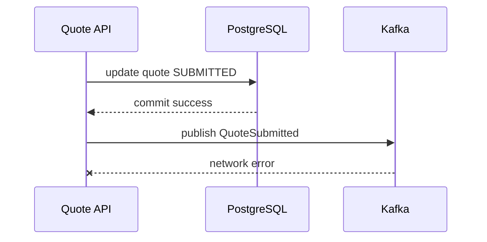
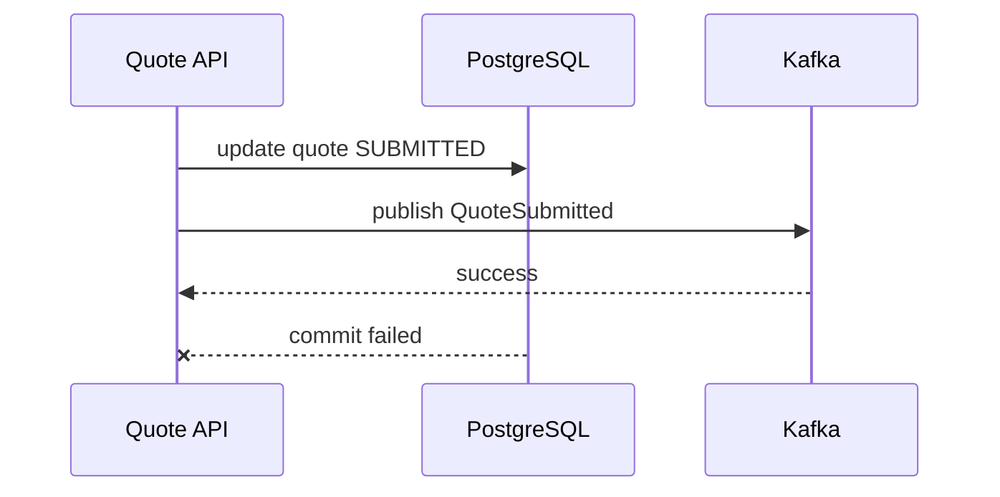
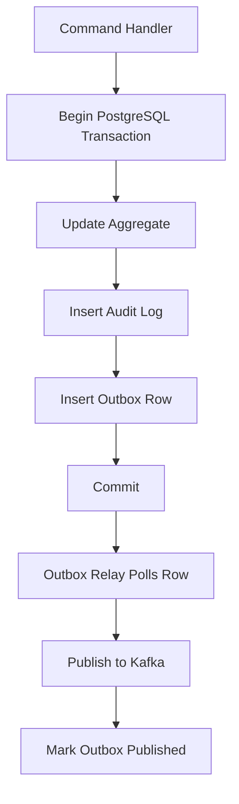
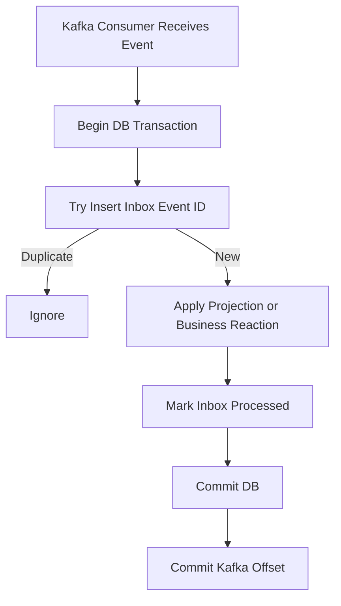
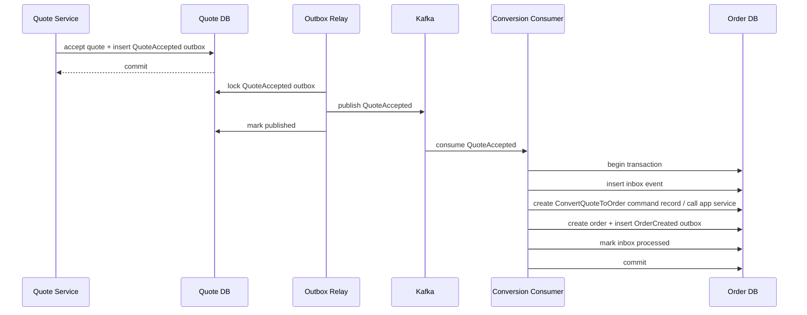
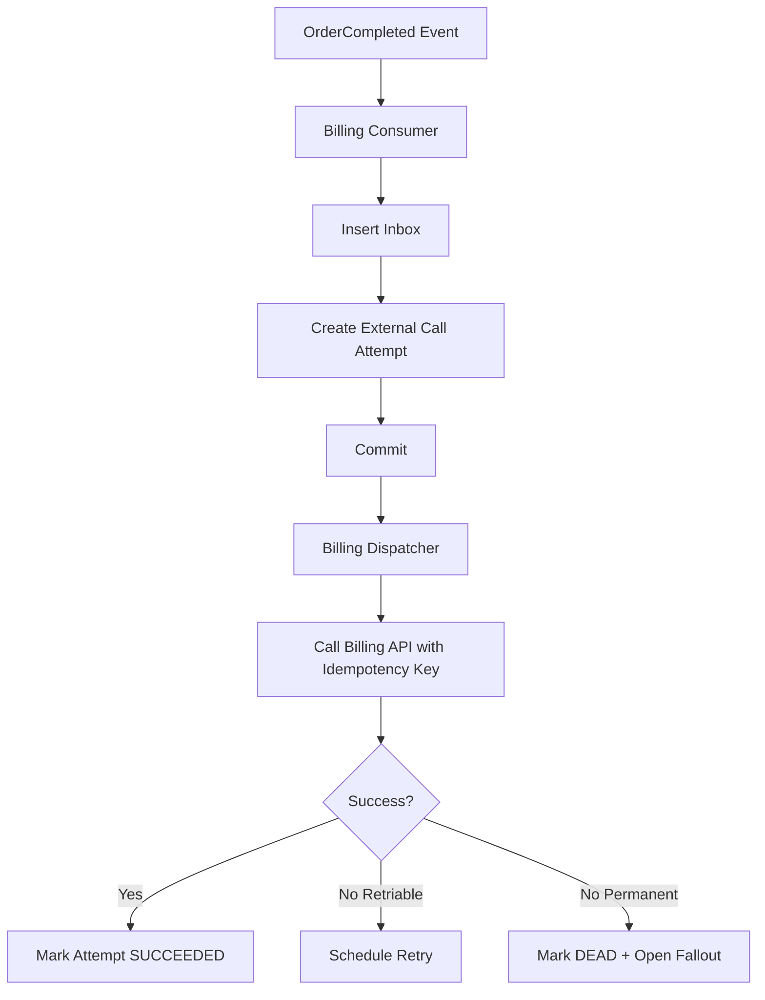

------
title: Build From Scratch: Enterprise Java Microservices CPQ & Order Management Platform - Part 046
description: Mengimplementasikan transactional outbox dan inbox pattern untuk CPQ/OMS: schema PostgreSQL, relay design, Kafka publishing, consumer deduplication, retry, DLQ, reconciliation, observability, dan Java/MyBatis implementation.
series: learn-enterprise-cpq-oms-glassfish-camunda8
seriesTitle: Build From Scratch: Enterprise Java Microservices CPQ & Order Management Platform
order: 46
partTitle: Transactional Outbox and Inbox Pattern
tags:
  - java
  - microservices
  - cpq
  - oms
  - kafka
  - postgresql
  - mybatis
  - outbox
  - inbox
  - reliability
  - event-driven-architecture
date: 2026-07-02
---

# Part 046 — Transactional Outbox and Inbox Pattern

Part 045 menetapkan event architecture. Sekarang kita masuk ke mekanisme paling penting untuk membuat event architecture itu aman: **transactional outbox** dan **inbox**.

Masalah utama yang ingin kita selesaikan:

> Bagaimana cara mengubah database dan mempublish event ke Kafka tanpa menghasilkan fakta palsu, event hilang, atau side effect ganda?

Dalam sistem CPQ/OMS, ini bukan masalah teoretis.

Contoh:

- Quote sudah berubah menjadi `SUBMITTED`, tapi `QuoteSubmitted` tidak pernah sampai ke Kafka. Approval tidak pernah dibuat.
- `OrderCompleted` sudah terkirim ke billing, tapi transaksi order rollback. Billing menerima order yang secara resmi tidak pernah selesai.
- Consumer menerima `QuoteAccepted` dua kali dan membuat dua order.
- Consumer replay event lama dan memanggil provisioning ulang.
- Kafka publish sukses, tapi response API timeout sehingga client retry dan command dijalankan dua kali.

Transactional outbox dan inbox adalah guardrail terhadap semua itu.

Mental model:

> Outbox membuat publish event menjadi bagian dari transaction database lokal.  
> Inbox membuat consume event menjadi idempotent di sisi consumer.  
> Keduanya tidak menjanjikan magic exactly-once.  
> Keduanya membuat duplicate/retry/replay menjadi aman dan terdeteksi.

---

## 1. The Dual-Write Problem

Command handler biasanya ingin melakukan dua hal:

1. update PostgreSQL,
2. publish event ke Kafka.

Naifnya:

```java
quoteRepository.save(quote);
kafkaProducer.send(new QuoteSubmitted(...));
```

Ada dua resource berbeda: database dan Kafka.

Mereka tidak berada dalam satu local database transaction.

### 1.1 Failure Scenario A — DB Commit Succeeds, Kafka Publish Fails



State database:

```text
quote.status = SUBMITTED
```

State event stream:

```text
QuoteSubmitted missing
```

Approval consumer tidak pernah tahu.

### 1.2 Failure Scenario B — Kafka Publish Succeeds, DB Rollback



State database:

```text
quote.status = PRICED
```

State event stream:

```text
QuoteSubmitted exists
```

Consumer melihat fakta palsu.

### 1.3 Failure Scenario C — Unknown Outcome

DB commit mungkin sukses, tetapi client timeout.

Kafka publish mungkin sukses, tetapi producer tidak menerima ack.

Unknown outcome adalah kondisi normal di distributed system. Design harus tahan terhadapnya.

---

## 2. Transactional Outbox: Core Idea

Transactional outbox mengubah dua write ke dua system menjadi satu write lokal ke database.

Dalam satu transaction:

1. update aggregate,
2. insert audit,
3. insert event ke table outbox,
4. commit.

Setelah commit, relay publish outbox row ke Kafka.



Jika transaction rollback, outbox row juga rollback.

Jika transaction commit, event tersimpan durable walaupun Kafka sedang down.

---

## 3. Transactional Inbox: Core Idea

Transactional inbox membuat consumer aman terhadap duplicate delivery.

Dalam satu transaction consumer:

1. insert `eventId` ke inbox,
2. jika duplicate, stop,
3. apply side effect/projection,
4. mark inbox processed,
5. commit,
6. commit Kafka offset.



Jika consumer crash setelah DB commit tapi sebelum Kafka offset commit, Kafka akan mengirim event lagi. Inbox mendeteksi duplicate dan consumer aman.

---

## 4. Outbox and Inbox Scope in Our Platform

### 4.1 Services That Publish Outbox

| Service/context | Example outbox event |
|---|---|
| Catalog | `ProductOfferingPublished` |
| Quote | `QuoteCreated`, `QuotePriced`, `QuoteSubmitted`, `QuoteAccepted` |
| Approval | `ApprovalCaseCreated`, `QuoteApproved`, `QuoteRejected` |
| Order | `OrderCreated`, `OrderValidated`, `OrderCompleted` |
| Fulfillment | `FulfillmentTaskCompleted`, `FulfillmentFalloutOpened` |
| Asset | `AssetActivated`, `SubscriptionStarted` |

### 4.2 Consumers That Need Inbox

Inbox mandatory untuk consumer yang:

- update database,
- call external system,
- create Camunda process,
- send notification,
- update projection yang tidak boleh double count,
- trigger command baru.

Inbox optional untuk pure debug logger. Tapi dalam enterprise system, hampir semua production consumer sebaiknya punya inbox.

---

## 5. PostgreSQL Outbox Schema

Kita desain outbox table sebagai bagian dari database service owner.

```sql
CREATE TABLE outbox_event (
  outbox_id           uuid PRIMARY KEY,
  tenant_id           text NOT NULL,
  aggregate_type      text NOT NULL,
  aggregate_id        uuid NOT NULL,
  aggregate_version   bigint NOT NULL,
  event_type          text NOT NULL,
  event_version       int NOT NULL,
  topic_name          text NOT NULL,
  partition_key       text NOT NULL,
  event_key           text NOT NULL,
  payload_json        jsonb NOT NULL,
  headers_json        jsonb NOT NULL DEFAULT '{}'::jsonb,
  correlation_id      text NOT NULL,
  causation_id        text,
  trace_id            text,
  occurred_at         timestamptz NOT NULL,
  available_at        timestamptz NOT NULL DEFAULT now(),
  status              text NOT NULL,
  attempt_count       int NOT NULL DEFAULT 0,
  last_attempt_at     timestamptz,
  published_at        timestamptz,
  locked_by           text,
  locked_at           timestamptz,
  last_error_code     text,
  last_error_message  text,
  created_at          timestamptz NOT NULL DEFAULT now(),
  updated_at          timestamptz NOT NULL DEFAULT now(),
  CONSTRAINT outbox_status_ck CHECK (
    status IN ('PENDING', 'PUBLISHING', 'PUBLISHED', 'FAILED', 'DEAD')
  )
);
```

### 5.1 Important Indexes

```sql
CREATE INDEX outbox_pending_idx
  ON outbox_event (status, available_at, created_at)
  WHERE status IN ('PENDING', 'FAILED');

CREATE INDEX outbox_aggregate_idx
  ON outbox_event (tenant_id, aggregate_type, aggregate_id, aggregate_version);

CREATE INDEX outbox_correlation_idx
  ON outbox_event (correlation_id);

CREATE UNIQUE INDEX outbox_event_uniqueness_idx
  ON outbox_event (tenant_id, aggregate_type, aggregate_id, aggregate_version, event_type);
```

Unique index terakhir adalah pilihan desain.

Ia mencegah event yang sama untuk aggregate version yang sama terinsert dua kali.

Jika ada kasus legit satu aggregate version menghasilkan dua event type sama, ubah uniqueness menjadi memakai `event_key` atau business dedupe key.

### 5.2 `outbox_id` vs `eventId`

Boleh menyamakan `outbox_id` dengan `eventId`.

Dalam seri ini:

```text
outbox_id == eventId
```

Ini menyederhanakan dedupe.

### 5.3 Status Meaning

| Status | Meaning |
|---|---|
| `PENDING` | siap dipublish |
| `PUBLISHING` | sedang di-lock relay |
| `PUBLISHED` | Kafka publish acknowledged |
| `FAILED` | publish gagal sementara, retry nanti |
| `DEAD` | gagal permanen atau melebihi retry policy |

---

## 6. Outbox Insert in Command Transaction

Contoh `SubmitQuote`.

```java
public SubmitQuoteResult submit(SubmitQuoteCommand command) {
    return unitOfWork.required(() -> {
        IdempotencyDecision idem = idempotency.begin(
            command.tenantId(),
            command.idempotencyKey(),
            command.requestHash()
        );

        if (idem.isReplay()) {
            return idem.replayAs(SubmitQuoteResult.class);
        }

        Quote quote = quoteRepository.getForUpdate(command.tenantId(), command.quoteId());
        quote.submit(command.actor(), clock);

        quoteRepository.save(quote);
        auditRepository.append(AuditRecord.quoteSubmitted(command, quote));

        List<OutboxEvent> events = quote.releaseEvents().stream()
            .map(event -> OutboxEventFactory.fromDomainEvent(event, command.context()))
            .toList();

        outboxRepository.insertAll(events);

        SubmitQuoteResult result = SubmitQuoteResult.accepted(
            quote.id(),
            quote.version(),
            quote.status()
        );

        idempotency.complete(command.tenantId(), command.idempotencyKey(), result);
        return result;
    });
}
```

Critical invariant:

```text
aggregate mutation, audit insert, idempotency completion, and outbox insert commit together.
```

Jika salah satu gagal, semua rollback.

---

## 7. MyBatis Mapper for Outbox

### 7.1 Java Record

```java
public record OutboxEventRow(
    UUID outboxId,
    String tenantId,
    String aggregateType,
    UUID aggregateId,
    long aggregateVersion,
    String eventType,
    int eventVersion,
    String topicName,
    String partitionKey,
    String eventKey,
    String payloadJson,
    String headersJson,
    String correlationId,
    String causationId,
    String traceId,
    OffsetDateTime occurredAt,
    OffsetDateTime availableAt,
    String status,
    int attemptCount
) {}
```

### 7.2 Mapper Interface

```java
public interface OutboxMapper {
    void insert(OutboxEventRow row);

    List<OutboxEventRow> lockBatch(@Param("relayId") String relayId,
                                   @Param("limit") int limit,
                                   @Param("lockTimeoutSeconds") int lockTimeoutSeconds);

    int markPublished(@Param("outboxId") UUID outboxId,
                      @Param("publishedAt") OffsetDateTime publishedAt);

    int markFailed(@Param("outboxId") UUID outboxId,
                   @Param("nextAvailableAt") OffsetDateTime nextAvailableAt,
                   @Param("errorCode") String errorCode,
                   @Param("errorMessage") String errorMessage);

    int markDead(@Param("outboxId") UUID outboxId,
                 @Param("errorCode") String errorCode,
                 @Param("errorMessage") String errorMessage);
}
```

### 7.3 Insert XML

```xml
<insert id="insert" parameterType="com.example.outbox.OutboxEventRow">
  INSERT INTO outbox_event (
    outbox_id,
    tenant_id,
    aggregate_type,
    aggregate_id,
    aggregate_version,
    event_type,
    event_version,
    topic_name,
    partition_key,
    event_key,
    payload_json,
    headers_json,
    correlation_id,
    causation_id,
    trace_id,
    occurred_at,
    available_at,
    status
  ) VALUES (
    #{outboxId},
    #{tenantId},
    #{aggregateType},
    #{aggregateId},
    #{aggregateVersion},
    #{eventType},
    #{eventVersion},
    #{topicName},
    #{partitionKey},
    #{eventKey},
    CAST(#{payloadJson} AS jsonb),
    CAST(#{headersJson} AS jsonb),
    #{correlationId},
    #{causationId},
    #{traceId},
    #{occurredAt},
    #{availableAt},
    'PENDING'
  )
</insert>
```

---

## 8. Locking Outbox Batch

Relay bisa berjalan multiple instances. Mereka tidak boleh publish row yang sama secara bersamaan.

Gunakan PostgreSQL row-level locking.

```sql
WITH candidate AS (
  SELECT outbox_id
  FROM outbox_event
  WHERE status IN ('PENDING', 'FAILED')
    AND available_at <= now()
  ORDER BY created_at
  FOR UPDATE SKIP LOCKED
  LIMIT #{limit}
)
UPDATE outbox_event o
SET status = 'PUBLISHING',
    locked_by = #{relayId},
    locked_at = now(),
    attempt_count = attempt_count + 1,
    last_attempt_at = now(),
    updated_at = now()
FROM candidate c
WHERE o.outbox_id = c.outbox_id
RETURNING
  o.outbox_id,
  o.tenant_id,
  o.aggregate_type,
  o.aggregate_id,
  o.aggregate_version,
  o.event_type,
  o.event_version,
  o.topic_name,
  o.partition_key,
  o.event_key,
  o.payload_json::text AS payload_json,
  o.headers_json::text AS headers_json,
  o.correlation_id,
  o.causation_id,
  o.trace_id,
  o.occurred_at,
  o.available_at,
  o.status,
  o.attempt_count;
```

`FOR UPDATE SKIP LOCKED` memungkinkan beberapa relay mengambil batch berbeda tanpa saling menunggu row yang sudah dikunci.

### 8.1 Stale Publishing Lock

Relay bisa crash setelah set `PUBLISHING`.

Tambahkan sweeper:

```sql
UPDATE outbox_event
SET status = 'FAILED',
    available_at = now(),
    locked_by = NULL,
    locked_at = NULL,
    updated_at = now(),
    last_error_code = 'STALE_LOCK',
    last_error_message = 'Publishing lock expired'
WHERE status = 'PUBLISHING'
  AND locked_at < now() - interval '5 minutes';
```

---

## 9. Outbox Relay Design

Relay adalah deployable terpisah atau background component.

Untuk seri ini, lebih bersih sebagai deployable terpisah:

```text
cpq-oms-outbox-relay.jar
```

Ia membaca outbox dari satu atau beberapa database service tergantung topology.

### 9.1 Relay Loop

```java
public final class OutboxRelayLoop implements Runnable {

    private final OutboxRepository outboxRepository;
    private final KafkaEventPublisher publisher;
    private final RelayConfig config;
    private final Backoff backoff;

    @Override
    public void run() {
        while (!Thread.currentThread().isInterrupted()) {
            List<OutboxEvent> batch = outboxRepository.lockBatch(
                config.relayId(),
                config.batchSize(),
                config.lockTimeoutSeconds()
            );

            if (batch.isEmpty()) {
                sleep(config.idleSleep());
                continue;
            }

            for (OutboxEvent event : batch) {
                publishOne(event);
            }
        }
    }

    private void publishOne(OutboxEvent event) {
        try {
            publisher.publish(event);
            outboxRepository.markPublished(event.outboxId(), clock.now());
        } catch (RetriablePublishException ex) {
            OffsetDateTime nextAttempt = clock.now().plus(backoff.next(event.attemptCount()));
            outboxRepository.markFailed(event.outboxId(), nextAttempt, ex.code(), ex.safeMessage());
        } catch (NonRetriablePublishException ex) {
            outboxRepository.markDead(event.outboxId(), ex.code(), ex.safeMessage());
        }
    }
}
```

### 9.2 Transaction Boundary in Relay

Ada dua options:

1. lock batch in DB transaction, commit, publish each, mark result,
2. lock one row, publish, mark result in small transactions.

Untuk simplicity dan reduced lock duration:

- lock batch and set status `PUBLISHING`, commit,
- publish outside DB transaction,
- mark each event result in separate DB transaction.

Ini berarti event bisa dipublish ke Kafka lalu relay crash sebelum `markPublished`.

Akibatnya event akan dipublish ulang setelah stale lock reset.

Itu acceptable karena:

- event has unique `eventId`,
- consumer inbox dedupes,
- event publishing is at-least-once.

---

## 10. Kafka Producer Settings: Practical Baseline

Producer reliability setting baseline:

```properties
acks=all
enable.idempotence=true
retries=2147483647
max.in.flight.requests.per.connection=5
delivery.timeout.ms=120000
request.timeout.ms=30000
linger.ms=5
batch.size=32768
compression.type=zstd
```

Notes:

- `acks=all` meminta acknowledgement dari in-sync replicas sesuai Kafka topic config.
- `enable.idempotence=true` membantu producer retry tanpa duplicate di partition untuk producer session.
- Tetap tidak menggantikan consumer inbox.
- Compression membantu throughput, tetapi ukur CPU cost.

### 10.1 Event Header Mapping

Kafka headers:

```text
event-id: <uuid>
event-type: QuoteSubmitted
event-version: 1
tenant-id: tenant_acme
correlation-id: corr_123
causation-id: cmd_456
trace-id: trace_789
schema-id: https://schemas.example.com/events/...
producer: quote-service
```

Payload tetap envelope JSON atau payload plus envelope fields. Dalam seri ini gunakan full envelope as message value, headers sebagai duplicate metadata untuk routing/observability.

---

## 11. Mark Published Is Not Exactly-Once

Relay flow:

1. publish to Kafka succeeds,
2. relay crashes before `markPublished`.

Outbox row remains `PUBLISHING`.

Sweeper returns it to `FAILED/PENDING`.

Relay publishes again.

Consumer sees duplicate event.

Inbox ignores duplicate.

Ini adalah expected design.

Jangan berusaha menutupi semua duplicate di producer side. Lebih murah dan lebih benar untuk membuat consumer idempotent.

---

## 12. PostgreSQL Inbox Schema

```sql
CREATE TABLE inbox_event (
  consumer_name       text NOT NULL,
  event_id            uuid NOT NULL,
  tenant_id           text NOT NULL,
  event_type          text NOT NULL,
  event_version       int NOT NULL,
  aggregate_type      text NOT NULL,
  aggregate_id        uuid NOT NULL,
  aggregate_version   bigint NOT NULL,
  topic_name          text NOT NULL,
  partition_no        int NOT NULL,
  offset_no           bigint NOT NULL,
  correlation_id      text NOT NULL,
  causation_id        text,
  trace_id            text,
  payload_json        jsonb NOT NULL,
  status              text NOT NULL,
  received_at         timestamptz NOT NULL DEFAULT now(),
  processed_at        timestamptz,
  failed_at           timestamptz,
  failure_code        text,
  failure_message     text,
  created_at          timestamptz NOT NULL DEFAULT now(),
  updated_at          timestamptz NOT NULL DEFAULT now(),
  PRIMARY KEY (consumer_name, event_id),
  CONSTRAINT inbox_status_ck CHECK (
    status IN ('RECEIVED', 'PROCESSED', 'FAILED', 'IGNORED', 'DEAD')
  )
);
```

### 12.1 Indexes

```sql
CREATE INDEX inbox_aggregate_idx
  ON inbox_event (consumer_name, tenant_id, aggregate_type, aggregate_id, aggregate_version);

CREATE INDEX inbox_offset_idx
  ON inbox_event (consumer_name, topic_name, partition_no, offset_no);

CREATE INDEX inbox_failed_idx
  ON inbox_event (consumer_name, status, failed_at)
  WHERE status IN ('FAILED', 'DEAD');
```

---

## 13. Inbox Insert Pattern

Use insert-on-conflict.

```sql
INSERT INTO inbox_event (
  consumer_name,
  event_id,
  tenant_id,
  event_type,
  event_version,
  aggregate_type,
  aggregate_id,
  aggregate_version,
  topic_name,
  partition_no,
  offset_no,
  correlation_id,
  causation_id,
  trace_id,
  payload_json,
  status
) VALUES (
  #{consumerName},
  #{eventId},
  #{tenantId},
  #{eventType},
  #{eventVersion},
  #{aggregateType},
  #{aggregateId},
  #{aggregateVersion},
  #{topicName},
  #{partitionNo},
  #{offsetNo},
  #{correlationId},
  #{causationId},
  #{traceId},
  CAST(#{payloadJson} AS jsonb),
  'RECEIVED'
)
ON CONFLICT (consumer_name, event_id) DO NOTHING;
```

Mapper returns affected row count.

```java
public enum InboxDecision {
    NEW_EVENT,
    DUPLICATE_EVENT
}
```

If affected rows = 0, duplicate.

---

## 14. Consumer Transaction Pattern

```java
public final class OrderCreatedConsumer {

    private final UnitOfWork unitOfWork;
    private final InboxRepository inbox;
    private final FulfillmentApplicationService fulfillmentService;

    public void onMessage(EventEnvelope<OrderCreatedPayload> event, KafkaMetadata metadata) {
        unitOfWork.required(() -> {
            InboxDecision decision = inbox.tryReceive(
                "fulfillment-orchestrator",
                event,
                metadata
            );

            if (decision == InboxDecision.DUPLICATE_EVENT) {
                return;
            }

            fulfillmentService.createFulfillmentPlanFromOrderCreated(event);

            inbox.markProcessed("fulfillment-orchestrator", event.eventId());
        });
    }
}
```

`createFulfillmentPlanFromOrderCreated` harus idempotent juga di business level.

Contoh constraint:

```sql
CREATE UNIQUE INDEX fulfillment_plan_order_once_idx
  ON fulfillment_plan (tenant_id, order_id);
```

Inbox protects event duplicate. Unique constraint protects business duplicate.

Keduanya diperlukan.

---

## 15. Offset Commit Strategy

Consumer should commit Kafka offset after DB transaction succeeds.

Pseudo-flow:

```text
poll records
for each record:
    process inside DB transaction
if all processed:
    commit offsets
```

If crash after DB commit before offset commit:

- event redelivered,
- inbox duplicate,
- no side effect repeated,
- offset eventually committed.

If crash before DB commit:

- transaction rollback,
- offset not committed,
- event redelivered,
- processing retried.

---

## 16. Batch vs Single Record Processing

### 16.1 Single Record Transaction

Pros:

- easier error isolation,
- simpler retry,
- smaller transaction,
- easier DLQ classification.

Cons:

- lower throughput.

### 16.2 Batch Transaction

Pros:

- higher throughput,
- fewer commits.

Cons:

- one bad event can poison batch,
- bigger lock time,
- harder offset handling,
- more complex partial success.

Untuk CPQ/OMS critical event consumer, baseline:

```text
single record transaction for side-effect consumers
batch processing for projection rebuild/analytics where safe
```

---

## 17. Side Effect Consumer Patterns

### 17.1 Projection Consumer

```text
event -> inbox -> update projection -> mark processed
```

Projection harus punya aggregate version guard.

### 17.2 Command Trigger Consumer

Contoh `QuoteAccepted` menghasilkan `ConvertQuoteToOrder`.

Jangan langsung insert order tanpa command semantics.

```text
event -> inbox -> build command -> application service -> persist -> outbox -> mark processed
```

### 17.3 External API Consumer

Contoh billing integration.

```text
event -> inbox -> create external_call_attempt -> commit
external dispatcher -> call billing with idempotency key -> save response -> outbox integration result
```

Jangan call external API di dalam transaction panjang kecuali benar-benar terkendali.

### 17.4 Camunda Starter Consumer

```text
event -> inbox -> insert workflow_start_request -> commit
starter -> start process with businessKey/idempotency -> mark started
```

Jangan consume Kafka lalu langsung start Camunda tanpa durable local record.

---

## 18. Workflow Start Request Table

Untuk consumer yang memulai Camunda process:

```sql
CREATE TABLE workflow_start_request (
  request_id          uuid PRIMARY KEY,
  tenant_id           text NOT NULL,
  source_event_id     uuid NOT NULL,
  process_id          text NOT NULL,
  business_key        text NOT NULL,
  variables_json      jsonb NOT NULL,
  status              text NOT NULL,
  attempt_count       int NOT NULL DEFAULT 0,
  next_attempt_at     timestamptz NOT NULL DEFAULT now(),
  process_instance_key text,
  last_error_code     text,
  last_error_message  text,
  created_at          timestamptz NOT NULL DEFAULT now(),
  updated_at          timestamptz NOT NULL DEFAULT now(),
  CONSTRAINT workflow_start_status_ck CHECK (
    status IN ('PENDING', 'STARTING', 'STARTED', 'FAILED', 'DEAD')
  )
);

CREATE UNIQUE INDEX workflow_start_source_event_idx
  ON workflow_start_request (tenant_id, source_event_id, process_id);

CREATE UNIQUE INDEX workflow_start_business_key_idx
  ON workflow_start_request (tenant_id, process_id, business_key);
```

Ini membuat process start retry-safe.

---

## 19. Retry Policy

Retry harus diklasifikasikan.

### 19.1 Retriable

- Kafka broker temporarily unavailable,
- network timeout,
- database deadlock,
- external API 503,
- Camunda gateway unavailable,
- transient serialization infrastructure issue.

### 19.2 Non-Retriable

- schema invalid,
- unknown required enum with no fallback,
- unauthorized tenant,
- missing mandatory payload field,
- business invariant permanently violated,
- event version unsupported by deployed consumer.

### 19.3 Backoff

```java
public Duration nextBackoff(int attempt) {
    long seconds = Math.min(300, (long) Math.pow(2, Math.min(attempt, 8)));
    long jitter = ThreadLocalRandom.current().nextLong(0, 1000);
    return Duration.ofSeconds(seconds).plusMillis(jitter);
}
```

Never hot-loop poison events.

---

## 20. DLQ Integration

Outbox `DEAD` means producer relay could not publish after policy.

Consumer DLQ means consumer could not process event.

They are different.

### 20.1 Producer Dead Outbox

Outbox row remains in DB with status `DEAD`.

Optional producer DLQ topic can be written by relay, but DB remains operational truth.

### 20.2 Consumer DLQ

Consumer can publish failed event plus failure metadata to DLQ topic.

```json
{
  "dlqId": "dlq_123",
  "consumerName": "billing-integration-consumer",
  "failedAt": "2026-07-02T11:00:00+07:00",
  "failureCode": "UNSUPPORTED_EVENT_VERSION",
  "failureMessage": "OrderCompleted eventVersion=3 not supported",
  "originalTopic": "oms.order.events.v1",
  "originalPartition": 4,
  "originalOffset": 993921,
  "originalEvent": { }
}
```

DLQ must have runbook.

No DLQ without owner.

---

## 21. Outbox Relay Ordering

If multiple events for same aggregate are pending, relay should preserve order as much as possible.

But Kafka partition key and aggregate version are the actual guards.

### 21.1 Order by Created Time

```sql
ORDER BY created_at, aggregate_type, aggregate_id, aggregate_version
```

### 21.2 Per-Aggregate Publish Guard

If strict aggregate order is required, only publish next version when previous version is already published.

Example query addition:

```sql
AND NOT EXISTS (
  SELECT 1
  FROM outbox_event prev
  WHERE prev.tenant_id = outbox_event.tenant_id
    AND prev.aggregate_type = outbox_event.aggregate_type
    AND prev.aggregate_id = outbox_event.aggregate_id
    AND prev.aggregate_version < outbox_event.aggregate_version
    AND prev.status <> 'PUBLISHED'
)
```

Trade-off:

- better ordering,
- lower throughput,
- stuck earlier event blocks later events.

For quote/order critical stream, this is often worth it.

For operational event stream, maybe not.

---

## 22. Inbox Aggregate Version Guard

Projection consumer example:

```sql
CREATE TABLE order_search_projection_checkpoint (
  tenant_id          text NOT NULL,
  order_id           uuid NOT NULL,
  last_version       bigint NOT NULL,
  last_event_id      uuid NOT NULL,
  updated_at         timestamptz NOT NULL,
  PRIMARY KEY (tenant_id, order_id)
);
```

Handler logic:

```java
ProjectionCheckpoint checkpoint = checkpointRepository.find(event.tenantId(), event.aggregateId());

if (checkpoint == null && event.aggregateVersion() != 1) {
    throw new ProjectionGapException(event.aggregateId(), event.aggregateVersion());
}

if (checkpoint != null) {
    if (event.aggregateVersion() <= checkpoint.lastVersion()) {
        inbox.markIgnored(consumerName, event.eventId(), "STALE_VERSION");
        return;
    }

    if (event.aggregateVersion() != checkpoint.lastVersion() + 1) {
        throw new ProjectionGapException(event.aggregateId(), event.aggregateVersion());
    }
}

projection.apply(event);
checkpointRepository.save(event.aggregateId(), event.aggregateVersion(), event.eventId());
inbox.markProcessed(consumerName, event.eventId());
```

---

## 23. Reconciliation

Outbox/inbox reduces errors. It does not remove need for reconciliation.

### 23.1 Producer Reconciliation

Find committed aggregate changes without published outbox.

Example:

```sql
SELECT q.tenant_id, q.quote_id, q.status, q.version
FROM quote q
WHERE q.status = 'SUBMITTED'
  AND NOT EXISTS (
    SELECT 1
    FROM outbox_event o
    WHERE o.tenant_id = q.tenant_id
      AND o.aggregate_type = 'Quote'
      AND o.aggregate_id = q.quote_id
      AND o.aggregate_version = q.version
      AND o.event_type = 'QuoteSubmitted'
  );
```

Ideally returns zero.

If not zero, repair command must create missing outbox event with audit.

### 23.2 Consumer Reconciliation

Find orders completed but billing not triggered.

```sql
SELECT o.tenant_id, o.order_id, o.order_number
FROM customer_order o
WHERE o.status = 'COMPLETED'
  AND NOT EXISTS (
    SELECT 1
    FROM billing_trigger bt
    WHERE bt.tenant_id = o.tenant_id
      AND bt.order_id = o.order_id
  );
```

Then compare with consumed inbox records for `OrderCompleted`.

---

## 24. Operational Dashboard

Outbox dashboard must show:

- pending count by service/topic,
- oldest pending age,
- failed count by error code,
- dead count,
- publish latency percentile,
- relay instance heartbeat,
- event throughput,
- event size percentile.

Inbox dashboard must show:

- consumer lag,
- failed inbox count,
- dead inbox count,
- duplicate count,
- stale ignored count,
- processing latency,
- projection gap count,
- external side effect retry count.

Business dashboard must show:

- quote submitted but approval not created,
- quote accepted but order not created,
- order created but process not started,
- order completed but asset not activated,
- order completed but billing not triggered.

---

## 25. Outbox Table Growth

Outbox table will grow quickly.

Options:

1. keep all outbox rows forever,
2. archive published rows,
3. partition by month/day,
4. delete published rows after retention,
5. move to audit/event archive.

Baseline:

- retain `PUBLISHED` rows for 7–30 days in hot outbox,
- retain `FAILED/DEAD` until resolved,
- archive event metadata to cheaper storage if needed,
- business audit remains in audit tables.

PostgreSQL partitioning can help when volume is large.

### 25.1 Cleanup Query

```sql
DELETE FROM outbox_event
WHERE status = 'PUBLISHED'
  AND published_at < now() - interval '30 days';
```

In real production, prefer batch delete:

```sql
DELETE FROM outbox_event
WHERE outbox_id IN (
  SELECT outbox_id
  FROM outbox_event
  WHERE status = 'PUBLISHED'
    AND published_at < now() - interval '30 days'
  ORDER BY published_at
  LIMIT 1000
);
```

---

## 26. Inbox Table Growth

Inbox is dedupe memory.

If consumer can receive replay from long-retention topics, deleting inbox too early can re-enable side effects.

Retention depends on replay policy.

| Consumer type | Inbox retention |
|---|---:|
| projection rebuild consumer | can reset/rebuild intentionally |
| notification consumer | long enough to avoid duplicate notifications |
| billing integration consumer | long or permanent dedupe by business key |
| Camunda starter consumer | long/permanent by source event/process business key |

For irreversible side effects, use business dedupe table in addition to inbox.

---

## 27. External Call Attempt Pattern

For external integration, don't perform irreversible call directly in Kafka consumer transaction.

Use an external call attempt table.

```sql
CREATE TABLE external_call_attempt (
  attempt_id          uuid PRIMARY KEY,
  tenant_id           text NOT NULL,
  source_event_id     uuid NOT NULL,
  target_system       text NOT NULL,
  operation_name      text NOT NULL,
  idempotency_key     text NOT NULL,
  request_json        jsonb NOT NULL,
  response_json       jsonb,
  status              text NOT NULL,
  attempt_count       int NOT NULL DEFAULT 0,
  next_attempt_at     timestamptz NOT NULL DEFAULT now(),
  last_error_code     text,
  last_error_message  text,
  created_at          timestamptz NOT NULL DEFAULT now(),
  updated_at          timestamptz NOT NULL DEFAULT now(),
  CONSTRAINT external_call_status_ck CHECK (
    status IN ('PENDING', 'SENDING', 'SUCCEEDED', 'FAILED', 'DEAD')
  )
);

CREATE UNIQUE INDEX external_call_idem_idx
  ON external_call_attempt (tenant_id, target_system, operation_name, idempotency_key);
```

Consumer creates attempt. Dispatcher sends.

This separates Kafka offset safety from external API reliability.

---

## 28. Outbox + Inbox + Idempotency Together

They solve different problems.

| Mechanism | Protects against |
|---|---|
| API idempotency table | client retry duplicate command |
| optimistic lock/version | concurrent mutation conflict |
| unique business constraint | duplicate aggregate/action creation |
| outbox | DB commit without event publish |
| inbox | duplicate event delivery/processing |
| external idempotency key | duplicate external call effect |
| reconciliation | undetected drift |

Do not replace one with another.

---

## 29. End-to-End Example: Quote Accepted to Order Created



If conversion consumer receives `QuoteAccepted` twice:

- inbox dedupes by `eventId`,
- order table unique constraint dedupes by quote id,
- conversion command idempotency returns existing order.

```sql
CREATE UNIQUE INDEX order_from_quote_once_idx
  ON customer_order (tenant_id, source_quote_id, source_quote_revision)
  WHERE source_quote_id IS NOT NULL;
```

---

## 30. End-to-End Example: Order Completed to Billing Trigger



Billing integration is not just event handling. It is a reliable side-effect pipeline.

---

## 31. Testing Strategy

### 31.1 Outbox Tests

- command inserts outbox in same transaction,
- rollback removes outbox,
- duplicate command replays response and does not insert duplicate outbox,
- relay locks unique batch under parallel relay instances,
- stale lock sweeper returns stuck rows,
- mark published works idempotently,
- failed publish schedules retry,
- max retry marks dead.

### 31.2 Inbox Tests

- first event inserts inbox and processes,
- duplicate event ignored,
- crash after DB commit before offset commit is safe,
- stale aggregate version ignored,
- version gap triggers reconciliation/failure,
- schema invalid event goes DLQ,
- external consumer creates idempotent external attempt.

### 31.3 Integration Tests

Use Testcontainers-style environment:

- PostgreSQL,
- Kafka,
- service under test,
- relay,
- consumer.

Scenario:

```text
submit quote -> outbox row -> relay publishes -> consumer creates approval case -> inbox processed
```

Assertions:

- quote status submitted,
- outbox published,
- Kafka event exists,
- inbox processed,
- approval case created exactly once,
- duplicate event does not create second approval case.

---

## 32. Failure Mode Catalogue

| Failure | Expected behavior |
|---|---|
| DB rollback after command failure | no outbox row |
| DB commit then Kafka down | outbox remains pending/failed and retries |
| Relay crash after publish before mark | duplicate publish possible, consumer inbox dedupes |
| Consumer crash before DB commit | event redelivered, no side effect committed |
| Consumer crash after DB commit before offset commit | event redelivered, inbox dedupes |
| Schema breaking event | consumer fails to DLQ/dead, alert fires |
| Projection gap | consumer pauses/reconciles aggregate |
| External API timeout | external attempt retries with idempotency key |
| Poison event | classified, DLQ, manual repair |
| Inbox deleted too early | replay may duplicate side effect; avoid for irreversible consumers |

---

## 33. Performance Considerations

### 33.1 Outbox Relay Throughput

Tune:

- batch size,
- relay instances,
- query index,
- Kafka producer batching,
- compression,
- payload size,
- DB connection pool,
- partition count.

But don't optimize before measuring.

### 33.2 Avoid Giant Events

Large event payload hurts:

- DB JSONB write,
- relay memory,
- Kafka broker throughput,
- consumer deserialization,
- network bandwidth.

Use snapshot summary, not private aggregate dump.

### 33.3 Avoid Long DB Transactions

Command transaction should not wait for Kafka or external API.

That is exactly why outbox exists.

### 33.4 Consumer Parallelism

Consumer group parallelism limited by partitions.

Partition key by aggregate keeps ordering but can create hotspot for huge aggregate.

In CPQ/OMS, quote/order aggregate events are usually suitable for aggregate key partitioning.

---

## 34. Operational Runbook

### 34.1 Outbox Pending Age High

Check:

1. relay process alive,
2. DB connectivity,
3. Kafka broker availability,
4. authentication/ACL,
5. schema serialization error,
6. stuck `PUBLISHING` locks,
7. oldest pending event type.

Actions:

- restart relay,
- run stale lock sweeper,
- fix Kafka ACL/config,
- mark poison as dead with audit,
- replay after fix.

### 34.2 Consumer Lag High

Check:

1. consumer group status,
2. failed event count,
3. DLQ count,
4. downstream DB latency,
5. external API latency,
6. partition skew,
7. event size.

Actions:

- scale consumer if partition count allows,
- isolate poison event,
- pause side-effect consumer if downstream unstable,
- increase backoff for external failure,
- rebuild projection if safe.

### 34.3 Duplicate Business Effect Detected

Check:

1. inbox existence for event IDs,
2. business unique constraints,
3. external idempotency key,
4. consumer transaction boundary,
5. replay mode,
6. manual repair logs.

Actions:

- stop consumer,
- identify duplicate source,
- apply domain-specific compensation,
- add missing constraint/idempotency,
- write post-incident test.

---

## 35. Production Checklist

- [ ] command handlers never publish Kafka directly,
- [ ] outbox insert happens in same DB transaction as aggregate mutation,
- [ ] outbox table has indexes for pending scan,
- [ ] relay supports multiple instances safely,
- [ ] relay handles stale `PUBLISHING` locks,
- [ ] producer uses reliable Kafka settings,
- [ ] event has stable `eventId`, `correlationId`, `tenantId`, `aggregateVersion`,
- [ ] consumer inserts inbox before side effect,
- [ ] consumer commits Kafka offset after DB commit,
- [ ] side-effect consumers have business idempotency key,
- [ ] external API calls use external attempt table,
- [ ] Camunda process start uses durable workflow start request,
- [ ] DLQ has owner and runbook,
- [ ] reconciliation queries exist,
- [ ] outbox/inbox retention policy exists,
- [ ] metrics/alerts exist for pending age, lag, dead rows, duplicates, gaps,
- [ ] integration tests cover relay crash and consumer crash scenarios.

---

## 36. What We Have Built in This Part

Kita membangun implementation model untuk event reliability:

- dual-write problem,
- transactional outbox,
- transactional inbox,
- PostgreSQL schema,
- MyBatis mapper,
- relay locking,
- relay publish lifecycle,
- Kafka producer baseline,
- consumer dedupe,
- offset commit strategy,
- retry/DLQ,
- external call attempt,
- Camunda start request,
- reconciliation,
- observability,
- failure mode catalogue.

Setelah Part 046, event architecture kita tidak lagi sekadar “publish Kafka event”.

Ia menjadi reliable event pipeline yang sadar terhadap transaction boundary, duplicate delivery, replay, external side effect, dan production support.

Part berikutnya akan memperdalam desain Kafka topic dan message contracts agar event stream ini punya struktur operasional yang kuat.

---

## 37. References

- Apache Kafka Documentation — https://kafka.apache.org/documentation/
- Apache Kafka Producer Configs — https://kafka.apache.org/documentation/#producerconfigs
- Confluent: Transactional Outbox Pattern — https://developer.confluent.io/courses/microservices/the-transactional-outbox-pattern/
- Confluent: Understanding the Dual-Write Problem — https://www.confluent.io/blog/dual-write-problem/
- Microservices.io: Transactional Outbox — https://microservices.io/patterns/data/transactional-outbox.html
- PostgreSQL Explicit Locking — https://www.postgresql.org/docs/current/explicit-locking.html
- PostgreSQL `SELECT ... FOR UPDATE SKIP LOCKED` — https://www.postgresql.org/docs/current/sql-select.html
- MyBatis Mapper XML Files — https://mybatis.org/mybatis-3/sqlmap-xml.html
- Camunda 8 Documentation — https://docs.camunda.io/

