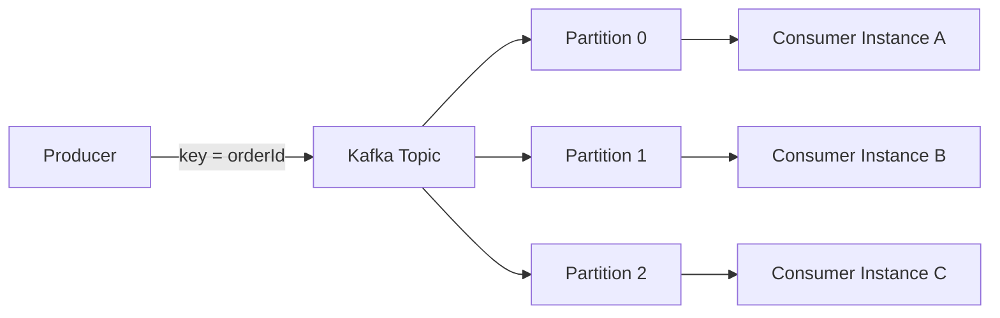
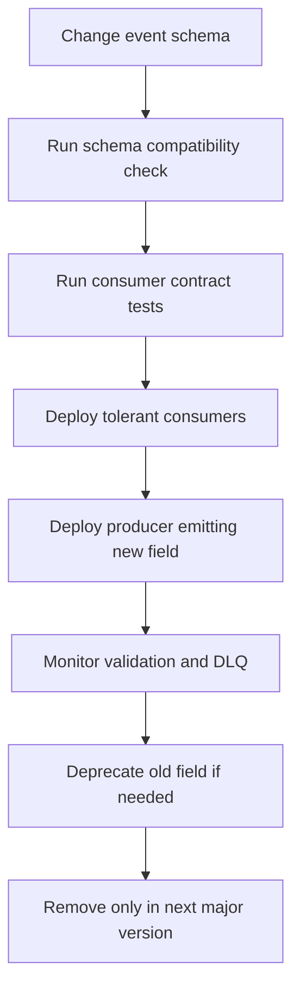

------
title: Build From Scratch: Enterprise Java Microservices CPQ & Order Management Platform - Part 047
description: Mendesain Kafka topic dan message contracts untuk CPQ/OMS production-grade: topic taxonomy, partition key, ordering guarantee, schema evolution, envelope, headers, payload design, DLQ, replay, retention, security, dan governance.
series: learn-enterprise-cpq-oms-glassfish-camunda8
seriesTitle: Build From Scratch: Enterprise Java Microservices CPQ & Order Management Platform
order: 47
partTitle: Kafka Topic Design and Message Contracts
tags:
  - java
  - microservices
  - cpq
  - oms
  - kafka
  - event-driven-architecture
  - message-contract
  - schema-evolution
  - outbox
  - architecture
  - production
  - enterprise
  - openapi
  - json-schema
date: 2026-07-02
---

# Part 047 — Kafka Topic Design and Message Contracts

Part 045 menetapkan event-driven architecture. Part 046 membangun transactional outbox dan inbox agar publish/consume event aman. Sekarang kita fokus ke pertanyaan yang sering dianggap konfigurasi, padahal sebenarnya **desain kontrak sistem**:

> Topic apa yang harus ada, event apa yang boleh dipublish, partition key apa yang menjaga ordering yang benar, dan schema seperti apa yang bisa berevolusi tanpa menghancurkan consumer?

Kafka bukan sekadar message broker. Untuk CPQ/OMS, Kafka menjadi **distributed business timeline**. Ia membawa fakta lintas bounded context: quote submitted, approval completed, order captured, fulfillment task failed, asset activated, invoice trigger requested, dan seterusnya.

Kalau topic dan message contract didesain asal-asalan, efeknya tidak langsung terlihat di hari pertama. Masalahnya muncul saat:

- order volume naik,
- consumer bertambah,
- schema berubah,
- event harus di-replay,
- incident perlu diinvestigasi,
- partner integration butuh audit evidence,
- deployment versi lama dan baru berjalan bersamaan,
- billing/provisioning menerima event duplikat atau out-of-order.

Mental model utama:

> Kafka topic adalah interface publik antar-service.  
> Event schema adalah kontrak jangka panjang.  
> Partition key adalah deklarasi ordering guarantee.  
> Retention adalah kebijakan replay dan investigasi.  
> DLQ adalah evidence stream, bukan tempat sampah diam-diam.

Apache Kafka mendefinisikan topic sebagai log event yang dipartisi; event ditulis ke partition, dan partition memungkinkan parallel read/write serta skalabilitas. Implikasi praktisnya: **ordering Kafka hanya kuat dalam satu partition, bukan global lintas semua partition**.

---

## 1. Problem Statement

Kita ingin event backbone yang bisa mendukung:

1. CPQ lifecycle event,
2. order lifecycle event,
3. fulfillment task event,
4. installed base / asset event,
5. integration event,
6. projection update,
7. audit correlation,
8. replay untuk recovery,
9. compatibility lint di CI/CD,
10. multi-service consumer dengan idempotency.

Yang tidak kita inginkan:

- topic per developer,
- event payload berisi dump table,
- event name ambigu seperti `UpdatedEvent`,
- partition key random sehingga event satu order out-of-order,
- schema tanpa versioning,
- consumer bergantung pada field internal yang tidak dijamin,
- event membawa PII berlebihan,
- DLQ yang tidak pernah dibaca,
- event stream dipakai sebagai pengganti database source of truth.

Kafka harus menjadi **event transport dan replayable timeline**, bukan tempat menyembunyikan domain model yang tidak jelas.

---

## 2. Topic Is a Boundary, Not a Folder

Topic bukan folder tempat melempar pesan yang mirip. Topic adalah boundary untuk beberapa keputusan:

| Keputusan | Dampak |
|---|---|
| Topic name | Menentukan ownership, discovery, dan operational routing |
| Partition count | Menentukan parallelism dan constraint scaling |
| Partition key | Menentukan ordering guarantee |
| Retention | Menentukan replay/debugging window |
| Compaction | Menentukan apakah topic diperlakukan sebagai latest-state log |
| ACL | Menentukan producer/consumer access |
| Schema subject | Menentukan compatibility unit |
| Consumer groups | Menentukan siapa memproses event secara independen |
| Monitoring | Menentukan lag, error, DLQ, dan SLO |

Kalau topic dibuat terlalu granular, governance sulit. Kalau terlalu besar, consumer sulit filter, retention tidak cocok, dan event ownership kabur.

### 2.1 Bad Topic Design

```text
cpq-events
order-topic
integration
misc-events
quote-update
oms
```

Masalah:

- nama tidak menyatakan domain dan event family,
- tidak jelas producer owner,
- tidak jelas key strategy,
- tidak jelas compatibility policy,
- consumer harus parsing terlalu banyak event yang tidak relevan,
- replay menjadi mahal.

### 2.2 Better Topic Design

```text
commerce.catalog.events.v1
commerce.quote.events.v1
commerce.approval.events.v1
commerce.order.events.v1
commerce.fulfillment.events.v1
commerce.asset.events.v1
commerce.subscription.events.v1
commerce.integration.events.v1
commerce.projection-rebuild.commands.v1
commerce.dead-letter.events.v1
```

Ini belum final untuk semua organisasi, tetapi lebih baik karena topic menunjukkan:

- domain namespace: `commerce`,
- bounded context: `quote`, `order`, `fulfillment`,
- stream role: `events`, `commands`,
- compatibility generation: `v1`.

---

## 3. Naming Convention

Gunakan naming convention yang boring dan konsisten.

```text
<platform>.<bounded-context>.<stream-kind>.v<major>
```

Contoh:

```text
commerce.quote.events.v1
commerce.order.events.v1
commerce.fulfillment.events.v1
commerce.asset.events.v1
commerce.billing-integration.commands.v1
commerce.billing-integration.results.v1
```

### 3.1 Platform Prefix

`commerce` menunjukkan stream milik commerce platform, bukan topic ad hoc satu service.

Alternatif:

```text
cpq.quote.events.v1
oms.order.events.v1
enterprise-commerce.quote.events.v1
```

Pilih satu, lalu konsisten.

### 3.2 Bounded Context

Bounded context harus domain-level, bukan implementation-level.

Bagus:

```text
quote
order
fulfillment
asset
catalog
approval
```

Buruk:

```text
quote-service
java-api
postgres-relay
mybatis-worker
```

Topic tidak boleh mengikat consumer ke nama service atau teknologi internal.

### 3.3 Stream Kind

Gunakan stream kind yang jelas:

| Kind | Arti |
|---|---|
| `events` | fakta yang sudah terjadi |
| `commands` | permintaan action yang boleh ditolak |
| `results` | hasil dari async command/integration |
| `snapshots` | state snapshot periodik atau compacted state |
| `dead-letter` | pesan gagal yang butuh investigasi |
| `audit` | audit event, bila memang diputuskan masuk Kafka |

Untuk seri ini, domain event utama menggunakan `events`.

### 3.4 Major Version in Topic Name

Gunakan `v1` di topic name untuk major compatibility boundary.

Kenapa?

- minor/additive schema evolution tetap di schema version,
- breaking change besar bisa dipublish paralel ke `v2`,
- consumer bisa migrasi bertahap,
- rollback lebih jelas.

Jangan membuat topic baru untuk setiap minor field.

---

## 4. Topic Taxonomy for CPQ/OMS

Rancangan awal topic:

| Topic | Producer | Consumer utama | Key |
|---|---|---|---|
| `commerce.catalog.events.v1` | Catalog service | CPQ, pricing, decomposition, cache invalidator | `catalogId` atau `offeringId` |
| `commerce.quote.events.v1` | Quote service | approval, order, notification, projection | `quoteId` |
| `commerce.approval.events.v1` | Approval service | quote, notification, audit projection | `approvalCaseId` atau `quoteId` |
| `commerce.order.events.v1` | Order service | fulfillment, billing, notification, customer timeline | `orderId` |
| `commerce.fulfillment.events.v1` | Fulfillment service | order, operations dashboard, notification | `orderId` |
| `commerce.asset.events.v1` | Asset service | CPQ installed-base context, billing, customer timeline | `assetId` atau `customerId` |
| `commerce.subscription.events.v1` | Subscription service | billing, entitlement, notification | `subscriptionId` |
| `commerce.integration.events.v1` | Integration layer | operations, reconciliation, audit projection | `externalCallId` atau business id |
| `commerce.dead-letter.events.v1` | consumer/relay | operations tooling | original business key |

Ini adalah starting point. Dalam organisasi nyata, topic dapat lebih granular bila volume dan ownership menuntutnya.

### 4.1 Quote Events

Topic:

```text
commerce.quote.events.v1
```

Event candidates:

```text
QuoteCreated
QuoteItemAdded
QuoteConfigured
QuotePriced
QuoteValidationFailed
QuoteSubmitted
QuoteApprovalRequested
QuoteApproved
QuoteRejected
QuoteAccepted
QuoteExpired
QuoteRevised
QuoteCancelled
QuoteConvertedToOrder
```

Key:

```text
quoteId
```

Kenapa `quoteId`?

Quote lifecycle harus ordered per quote. Jika `QuoteSubmitted` dan `QuoteRevised` masuk partition berbeda, consumer approval bisa membaca state salah.

### 4.2 Order Events

Topic:

```text
commerce.order.events.v1
```

Event candidates:

```text
OrderCaptured
OrderValidated
OrderValidationFailed
OrderDecompositionRequested
OrderDecomposed
OrderFulfillmentStarted
OrderPartiallyCompleted
OrderCompleted
OrderFailed
OrderHeld
OrderCancelled
OrderCancellationRequested
OrderAmendmentRequested
OrderFalloutRaised
OrderFalloutResolved
```

Key:

```text
orderId
```

OMS membutuhkan ordering per order. Global ordering antar-order tidak realistis dan biasanya tidak dibutuhkan.

### 4.3 Fulfillment Events

Topic:

```text
commerce.fulfillment.events.v1
```

Event candidates:

```text
FulfillmentPlanCreated
FulfillmentTaskReady
FulfillmentTaskStarted
FulfillmentTaskSucceeded
FulfillmentTaskFailed
FulfillmentTaskTimedOut
FulfillmentTaskCompensationStarted
FulfillmentTaskCompensated
FulfillmentPlanCompleted
FulfillmentPlanFailed
```

Key default:

```text
orderId
```

Kenapa bukan `taskId`?

Jika event task dari satu order harus diproses secara ordered oleh order projection, key `orderId` lebih aman. Kalau volume task sangat tinggi dan consumer tertentu butuh parallelism per task, bisa dibuat topic/projection khusus dengan key `taskId`, tetapi jangan mengorbankan order timeline utama.

### 4.4 Asset Events

Topic:

```text
commerce.asset.events.v1
```

Event candidates:

```text
AssetCreated
AssetActivated
AssetModified
AssetSuspended
AssetDisconnected
AssetRelationshipChanged
AssetVersionCreated
```

Key option:

- `assetId` untuk ordering per asset,
- `customerId` untuk customer timeline ordering,
- `subscriptionId` untuk subscription-driven lifecycle.

Pilih berdasarkan consumer paling kritis.

Untuk installed base mutation, ordering per `assetId` biasanya lebih penting. Untuk customer timeline, projection dapat mengurutkan ulang berdasarkan event timestamp dan sequence.

---

## 5. Partition Key Strategy

Partition key bukan sekadar distribusi load. Partition key adalah **business ordering contract**.



Kafka menjamin order dalam satu partition. Jika semua event `orderId = ORD-123` memakai key yang sama, event tersebut masuk partition yang sama.

### 5.1 Key Decision Table

| Stream | Key | Alasan |
|---|---|---|
| Quote lifecycle | `quoteId` | ordering per quote |
| Approval event | `quoteId` atau `approvalCaseId` | pilih berdasarkan consumer utama |
| Order lifecycle | `orderId` | ordering per order |
| Fulfillment task event | `orderId` | menjaga order timeline |
| Asset lifecycle | `assetId` | ordering per asset instance |
| Subscription lifecycle | `subscriptionId` | ordering per subscription |
| Catalog publication | `catalogVersionId` atau `offeringId` | cache invalidation / catalog sync |
| Integration result | `businessObjectId` | hasil external call kembali ke object yang sama |
| DLQ | original key | preserve debugging semantics |

### 5.2 Key Smells

Buruk:

```text
key = random UUID
key = timestamp
key = tenantId
key = eventId
key = null
```

Kenapa buruk?

- `random UUID`: menghancurkan ordering per aggregate,
- `timestamp`: tidak merepresentasikan domain grouping,
- `tenantId`: semua event tenant besar masuk partition sama, hotspot,
- `eventId`: setiap event bisa masuk partition berbeda,
- `null`: producer default partitioning bisa tidak sesuai ordering contract.

### 5.3 Hot Partition Risk

Key yang benar secara domain bisa tetap menimbulkan hotspot.

Contoh:

- satu enterprise customer memiliki ratusan ribu asset,
- satu batch migration memproses satu catalog besar,
- satu order mega-project memiliki ribuan fulfillment tasks.

Mitigasi:

1. ukur distribution key,
2. pisahkan stream volume tinggi,
3. gunakan task-level topic tambahan bila consumer tidak butuh ordering per order,
4. gunakan batch processing terkontrol,
5. jangan mengubah key diam-diam pada topic yang sama.

---

## 6. Do Not Chase Global Ordering

Dalam CPQ/OMS, global order semua event hampir tidak pernah diperlukan.

Yang diperlukan:

- ordered per quote,
- ordered per order,
- ordered per asset,
- ordered per subscription,
- causality traceable lintas command/event.

Global ordering akan memaksa satu partition atau coordination mahal, mengorbankan throughput, dan tetap tidak menyelesaikan latency antar-sistem.

Model yang benar:

```text
Quote Q-1 timeline ordered by quoteId
Order O-1 timeline ordered by orderId
Asset A-1 timeline ordered by assetId
Cross-entity causality linked by correlationId/causationId
```

Gunakan correlation metadata untuk trace lintas entity, bukan global Kafka ordering.

---

## 7. Message Envelope

Payload event jangan langsung berupa domain object. Gunakan envelope.

Envelope menyediakan metadata lintas semua event:

```json
{
  "eventId": "evt_01JZ...",
  "eventType": "OrderCaptured",
  "eventVersion": 1,
  "occurredAt": "2026-07-02T10:15:30.123Z",
  "publishedAt": "2026-07-02T10:15:31.003Z",
  "tenantId": "tenant_enterprise_a",
  "source": "order-service",
  "subject": "order/ord_123",
  "correlationId": "corr_abc",
  "causationId": "cmd_xyz",
  "aggregateType": "ORDER",
  "aggregateId": "ord_123",
  "aggregateVersion": 7,
  "schemaId": "https://schemas.example.com/commerce/order/events/order-captured.v1.schema.json",
  "data": {}
}
```

CloudEvents bisa dijadikan inspirasi karena menyediakan cara umum mendeskripsikan event metadata lintas service/platform. Kita tidak wajib memakai CloudEvents mentah, tetapi atribut seperti `id`, `source`, `type`, `subject`, dan `time` adalah vocabulary yang bagus.

### 7.1 Required Envelope Fields

| Field | Wajib | Arti |
|---|---:|---|
| `eventId` | yes | unique event identity |
| `eventType` | yes | domain event type |
| `eventVersion` | yes | major/minor payload contract version |
| `occurredAt` | yes | waktu fakta terjadi dalam domain transaction |
| `publishedAt` | yes | waktu relay publish ke Kafka |
| `tenantId` | yes | tenant scope |
| `source` | yes | producer service/context |
| `subject` | yes | URI-like subject |
| `correlationId` | yes | trace business transaction |
| `causationId` | yes | command/event penyebab |
| `aggregateType` | yes | QUOTE/ORDER/etc |
| `aggregateId` | yes | aggregate owner |
| `aggregateVersion` | yes | optimistic version after event |
| `schemaId` | yes | schema identity |
| `data` | yes | event-specific payload |

### 7.2 Why `occurredAt` and `publishedAt` Are Different

`occurredAt` berasal dari domain transaction.

`publishedAt` berasal dari outbox relay.

Perbedaan ini penting untuk debugging:

```text
occurredAt  = quote submitted at 10:15:30
publishedAt = event published at 10:21:10
```

Artinya event tertunda 5 menit 40 detik di outbox. Ini bukan event time problem, ini relay lag problem.

### 7.3 `aggregateVersion`

`aggregateVersion` membantu consumer mendeteksi stale/out-of-order event.

Contoh:

```text
OrderCaptured aggregateVersion=1
OrderValidated aggregateVersion=2
OrderDecomposed aggregateVersion=3
OrderCancelled aggregateVersion=4
```

Consumer projection dapat menyimpan last version:

```sql
create table projection_watermark (
    tenant_id text not null,
    aggregate_type text not null,
    aggregate_id text not null,
    last_aggregate_version bigint not null,
    last_event_id text not null,
    updated_at timestamptz not null,
    primary key (tenant_id, aggregate_type, aggregate_id)
);
```

Jika event version lebih kecil dari watermark, event adalah duplicate/stale untuk projection tersebut.

---

## 8. Kafka Headers

Sebagian metadata bisa ada di payload envelope dan/atau Kafka headers.

Headers berguna untuk routing/filtering/tracing tanpa parsing payload penuh.

Recommended headers:

```text
x-event-id
x-event-type
x-event-version
x-tenant-id
x-correlation-id
x-causation-id
x-aggregate-type
x-aggregate-id
x-schema-id
x-producer-service
x-produced-at
```

Prinsip:

- payload tetap self-contained,
- headers membantu infrastructure,
- jangan hanya menyimpan field penting di headers,
- jangan taruh secret/PII sensitif di headers.

---

## 9. Event Payload Design

Payload harus menjawab tiga pertanyaan:

1. fakta apa yang terjadi,
2. entity mana yang terpengaruh,
3. consumer bisa bertindak tanpa membaca database producer secara langsung.

### 9.1 Thin Event

```json
{
  "orderId": "ord_123",
  "status": "CAPTURED"
}
```

Kelebihan:

- kecil,
- mudah evolve,
- minim data exposure.

Kekurangan:

- consumer perlu call API producer,
- replay lambat,
- consumer rentan ke state terbaru, bukan state saat event terjadi.

### 9.2 Fat Event

```json
{
  "orderId": "ord_123",
  "status": "CAPTURED",
  "customer": {...},
  "items": [...],
  "prices": [...],
  "configuration": {...},
  "fulfillmentPlan": {...}
}
```

Kelebihan:

- consumer mandiri,
- replay lebih kaya,
- snapshot evidence kuat.

Kekurangan:

- payload besar,
- schema coupling tinggi,
- PII exposure,
- compatibility lebih sulit.

### 9.3 Recommended: Purposeful Event

Untuk CPQ/OMS, gunakan **purposeful event**:

- tidak terlalu tipis,
- tidak dump aggregate penuh,
- menyertakan snapshot yang relevan untuk consumer utama,
- menyertakan reference ID untuk detail yang bisa diambil via API.

Contoh `OrderCaptured`:

```json
{
  "orderId": "ord_123",
  "orderNumber": "SO-2026-000001",
  "orderType": "QUOTE_DERIVED",
  "quoteId": "quo_999",
  "customerAccountId": "acct_456",
  "marketSegment": "ENTERPRISE",
  "currency": "IDR",
  "totalAmount": "1500000.00",
  "itemCount": 3,
  "requiresDecomposition": true,
  "capturedBy": "user_789",
  "capturedAt": "2026-07-02T10:15:30Z"
}
```

Consumer fulfillment tahu order mana yang perlu diproses. Consumer notification tahu customer/account dan order number. Consumer billing tidak langsung menganggap order billable karena event ini belum `OrderCompleted` atau `BillingActivationRequested`.

---

## 10. Event Type Semantics

Event name harus domain-specific dan past tense.

Bagus:

```text
QuoteSubmitted
OrderCaptured
OrderDecomposed
FulfillmentTaskFailed
AssetActivated
BillingActivationRequested
```

Buruk:

```text
QuoteUpdated
OrderChanged
ProcessEvent
SyncMessage
SendToBilling
```

### 10.1 Past Fact vs Imperative Command

Event:

```text
OrderCaptured
```

Artinya fakta sudah terjadi.

Command:

```text
StartOrderFulfillment
```

Artinya minta sesuatu dilakukan.

Jangan campur:

```text
OrderCapturedAndPleaseStartFulfillment
```

Consumer boleh bereaksi terhadap event, tetapi event itu sendiri tetap fakta.

### 10.2 State Changed Event

Hati-hati dengan event generik:

```text
OrderStateChanged
```

Bisa dipakai untuk projection umum, tetapi untuk domain penting sering lebih baik event spesifik:

```text
OrderValidated
OrderFulfillmentStarted
OrderCompleted
OrderCancelled
```

Rekomendasi:

- gunakan event spesifik untuk domain actions,
- gunakan `StateChanged` hanya sebagai supplemental event bila benar-benar dibutuhkan untuk generic timeline.

---

## 11. Example Event Contracts

### 11.1 QuoteSubmitted

```json
{
  "eventId": "evt_quote_submitted_001",
  "eventType": "QuoteSubmitted",
  "eventVersion": 1,
  "occurredAt": "2026-07-02T10:00:00Z",
  "publishedAt": "2026-07-02T10:00:01Z",
  "tenantId": "tenant_a",
  "source": "quote-service",
  "subject": "quote/quo_123",
  "correlationId": "corr_001",
  "causationId": "cmd_submit_quote_001",
  "aggregateType": "QUOTE",
  "aggregateId": "quo_123",
  "aggregateVersion": 5,
  "schemaId": "https://schemas.example.com/commerce/quote/events/quote-submitted.v1.schema.json",
  "data": {
    "quoteId": "quo_123",
    "quoteNumber": "Q-2026-000001",
    "revision": 1,
    "customerAccountId": "acct_001",
    "submittedBy": "user_001",
    "submittedAt": "2026-07-02T10:00:00Z",
    "totalOneTimeAmount": "250000.00",
    "totalRecurringAmount": "750000.00",
    "currency": "IDR",
    "approvalRequired": true,
    "approvalReasons": ["PRICE_OVERRIDE", "NON_STANDARD_DISCOUNT"]
  }
}
```

Important semantics:

- `approvalRequired` adalah signal dari quote/pricing policy,
- approval service tetap membuat approval case sendiri,
- quote service tetap source of truth untuk quote state,
- approval case tidak boleh mengubah quote DB secara langsung.

### 11.2 OrderDecomposed

```json
{
  "eventId": "evt_order_decomposed_001",
  "eventType": "OrderDecomposed",
  "eventVersion": 1,
  "occurredAt": "2026-07-02T10:10:00Z",
  "publishedAt": "2026-07-02T10:10:01Z",
  "tenantId": "tenant_a",
  "source": "order-service",
  "subject": "order/ord_123",
  "correlationId": "corr_001",
  "causationId": "cmd_decompose_order_001",
  "aggregateType": "ORDER",
  "aggregateId": "ord_123",
  "aggregateVersion": 4,
  "schemaId": "https://schemas.example.com/commerce/order/events/order-decomposed.v1.schema.json",
  "data": {
    "orderId": "ord_123",
    "fulfillmentPlanId": "fp_456",
    "taskCount": 6,
    "parallelGroupCount": 2,
    "manualTaskCount": 1,
    "requiresExternalProvisioning": true,
    "requiresBillingActivation": true
  }
}
```

This event does not dump every task detail. Fulfillment service can load plan by API or from its own persisted plan if the same service owns decomposition and fulfillment.

### 11.3 FulfillmentTaskFailed

```json
{
  "eventId": "evt_task_failed_001",
  "eventType": "FulfillmentTaskFailed",
  "eventVersion": 1,
  "occurredAt": "2026-07-02T10:20:00Z",
  "publishedAt": "2026-07-02T10:20:01Z",
  "tenantId": "tenant_a",
  "source": "fulfillment-service",
  "subject": "fulfillment-task/ft_789",
  "correlationId": "corr_001",
  "causationId": "job_zeebe_001",
  "aggregateType": "ORDER",
  "aggregateId": "ord_123",
  "aggregateVersion": 9,
  "schemaId": "https://schemas.example.com/commerce/fulfillment/events/fulfillment-task-failed.v1.schema.json",
  "data": {
    "orderId": "ord_123",
    "fulfillmentPlanId": "fp_456",
    "taskId": "ft_789",
    "taskType": "PROVISION_SERVICE",
    "failureCategory": "EXTERNAL_SYSTEM_TIMEOUT",
    "retryable": true,
    "attempt": 3,
    "maxAttempts": 5,
    "falloutCaseId": null,
    "externalSystem": "PROVISIONING"
  }
}
```

Payload tidak menyertakan raw external error full kalau mengandung secret/PII. Simpan raw evidence yang disanitasi di `external_call_attempt` atau evidence store dengan access control.

---

## 12. JSON Schema for Event Envelope

Contoh schema ringkas:

```json
{
  "$id": "https://schemas.example.com/commerce/common/event-envelope.v1.schema.json",
  "$schema": "https://json-schema.org/draft/2020-12/schema",
  "type": "object",
  "required": [
    "eventId",
    "eventType",
    "eventVersion",
    "occurredAt",
    "publishedAt",
    "tenantId",
    "source",
    "subject",
    "correlationId",
    "causationId",
    "aggregateType",
    "aggregateId",
    "aggregateVersion",
    "schemaId",
    "data"
  ],
  "properties": {
    "eventId": { "type": "string", "minLength": 1 },
    "eventType": { "type": "string", "minLength": 1 },
    "eventVersion": { "type": "integer", "minimum": 1 },
    "occurredAt": { "type": "string", "format": "date-time" },
    "publishedAt": { "type": "string", "format": "date-time" },
    "tenantId": { "type": "string", "minLength": 1 },
    "source": { "type": "string", "minLength": 1 },
    "subject": { "type": "string", "minLength": 1 },
    "correlationId": { "type": "string", "minLength": 1 },
    "causationId": { "type": "string", "minLength": 1 },
    "aggregateType": { "type": "string", "minLength": 1 },
    "aggregateId": { "type": "string", "minLength": 1 },
    "aggregateVersion": { "type": "integer", "minimum": 1 },
    "schemaId": { "type": "string", "format": "uri" },
    "data": { "type": "object" }
  },
  "additionalProperties": false
}
```

Untuk event-specific schema, gunakan composition atau schema per event type.

---

## 13. Schema Compatibility Policy

Schema evolution adalah practice mengubah schema secara aman seiring waktu sambil menjaga producer/consumer tetap kompatibel. Dalam ekosistem Kafka, schema registry biasa dipakai untuk mengecek schema baru terhadap versi sebelumnya dengan compatibility mode.

Untuk seri ini, kebijakan default:

```text
Event schema harus backward compatible untuk minor evolution.
Breaking change butuh topic v2 atau event type v2.
```

### 13.1 Safe Changes

Biasanya aman:

- tambah optional field,
- tambah field dengan default yang jelas,
- tambah enum value hanya jika consumer tahan unknown value,
- tambah nested object optional,
- memperluas deskripsi tanpa mengubah semantics.

### 13.2 Dangerous Changes

Berbahaya:

- rename field,
- remove required field,
- ubah type field,
- ubah semantics field tanpa ubah nama/version,
- ubah meaning enum,
- ubah partition key,
- pindah event ke topic lain tanpa dual publish,
- mengubah timestamp semantics.

### 13.3 Enum Evolution

Enum adalah jebakan.

Consumer lama sering melakukan:

```java
switch (status) {
    case "COMPLETED" -> ...;
    case "FAILED" -> ...;
    default -> throw new IllegalArgumentException(status);
}
```

Kalau producer menambah `PARTIALLY_COMPLETED`, consumer lama crash.

Policy:

- consumer harus handle unknown enum,
- schema doc harus menyatakan enum extensibility,
- event dengan enum kritis bisa memakai `statusCategory` yang lebih stabil.

Contoh:

```json
{
  "status": "PARTIALLY_COMPLETED",
  "statusCategory": "IN_PROGRESS"
}
```

---

## 14. Subject Naming for Schema Registry

Jika memakai schema registry, hindari subject naming yang membuat compatibility terlalu luas atau terlalu sempit.

Options:

| Strategy | Example | Trade-off |
|---|---|---|
| Topic-value | `commerce.order.events.v1-value` | satu compatibility stream per topic, event heterogen sulit |
| Event type | `OrderCaptured-value` | lebih granular, governance perlu registry event catalog |
| Topic + event | `commerce.order.events.v1.OrderCaptured-value` | eksplisit, cocok untuk multi-event topic |

Rekomendasi:

```text
<topic>.<eventType>-value
```

Contoh:

```text
commerce.order.events.v1.OrderCaptured-value
commerce.order.events.v1.OrderCompleted-value
commerce.fulfillment.events.v1.FulfillmentTaskFailed-value
```

---

## 15. Event Catalog

Jangan hanya punya topic di Kafka. Punya **event catalog** di repository.

```text
contracts/
  events/
    commerce.order.events.v1/
      OrderCaptured.schema.json
      OrderValidated.schema.json
      OrderDecomposed.schema.json
      OrderCompleted.schema.json
      README.md
    commerce.quote.events.v1/
      QuoteSubmitted.schema.json
      QuoteApproved.schema.json
      QuoteAccepted.schema.json
```

`README.md` per topic harus menjelaskan:

- owner,
- producer,
- allowed consumers,
- event types,
- partition key,
- retention,
- PII classification,
- replay policy,
- DLQ policy,
- compatibility policy,
- example payloads.

Contoh event catalog entry:

```md
# commerce.order.events.v1

Owner: Order Management Team  
Producer: order-service outbox-relay  
Partition key: orderId  
Retention: 30 days operational, archived to object storage for long-term audit if required  
Compatibility: backward compatible minor changes only  
PII: no direct personal data; customer/account IDs only  
Replay: allowed for projection rebuild; consumers must be idempotent  
DLQ: commerce.dead-letter.events.v1
```

---

## 16. Retention Policy

Retention harus didesain per topic.

| Topic | Suggested retention logic |
|---|---|
| Quote events | cukup untuk replay projection dan investigate quote lifecycle |
| Order events | lebih panjang karena order dispute/support lebih lama |
| Fulfillment events | cukup untuk operational incident window |
| Asset events | panjang karena installed base lifecycle penting |
| Integration events | sesuai audit/reconciliation policy |
| DLQ | panjang sampai investigated/resolved |
| Projection rebuild commands | pendek |

Jangan samakan semua topic karena mudah secara ops. Domain impact berbeda.

### 16.1 Retention Is Not Audit Retention

Kafka retention bukan pengganti audit database.

Untuk compliance/evidence:

- audit log tetap di PostgreSQL atau audit store,
- Kafka event dapat menjadi propagation evidence,
- event archive bisa dibuat ke object storage jika diperlukan,
- retention policy harus sesuai legal/regulatory requirement organisasi.

---

## 17. Compacted Topics

Log compaction cocok untuk stream latest-state, bukan semua event.

Candidate:

```text
commerce.catalog.offering-snapshots.v1
commerce.asset.current-state.v1
commerce.customer-entitlement-cache.v1
```

Bukan candidate:

```text
commerce.order.events.v1
commerce.quote.events.v1
commerce.fulfillment.events.v1
```

Kenapa?

Lifecycle event kehilangan histori jika dicompact sembarangan. Untuk order timeline, kita perlu event sequence, bukan hanya state terakhir.

---

## 18. Dead Letter Topic Design

DLQ bukan `error-topic` generic tanpa konteks.

Rancangan minimal:

```text
commerce.dead-letter.events.v1
```

Payload DLQ:

```json
{
  "deadLetterId": "dlq_001",
  "originalTopic": "commerce.order.events.v1",
  "originalPartition": 3,
  "originalOffset": 99120,
  "originalKey": "ord_123",
  "originalEventId": "evt_abc",
  "originalEventType": "OrderCompleted",
  "consumerGroup": "billing-activation-consumer",
  "failureCategory": "SCHEMA_VALIDATION_FAILED",
  "failureReason": "required field billingAccountId missing",
  "failedAt": "2026-07-02T11:00:00Z",
  "retryable": false,
  "correlationId": "corr_001",
  "tenantId": "tenant_a",
  "payloadRef": "evidence://dlq/dlq_001/payload.json"
}
```

Prinsip:

- DLQ harus observable,
- DLQ harus punya owner,
- DLQ harus punya replay/repair workflow,
- jangan menyimpan raw sensitive payload tanpa redaction/access control,
- jangan auto-replay infinite loop.

### 18.1 DLQ Categories

| Category | Meaning | Typical action |
|---|---|---|
| `SCHEMA_VALIDATION_FAILED` | payload tidak valid | producer fix / data repair |
| `UNKNOWN_EVENT_TYPE` | consumer belum support event | deploy consumer update / ignore policy |
| `AUTHORIZATION_CONTEXT_INVALID` | tenant/security context invalid | investigate |
| `BUSINESS_INVARIANT_FAILED` | event valid tapi state consumer menolak | reconcile |
| `EXTERNAL_SYSTEM_FAILED` | downstream integration gagal | retry/manual |
| `POISON_MESSAGE` | selalu gagal | quarantine |

---

## 19. Replay Strategy

Replay harus dirancang dari awal.

Event replay dipakai untuk:

- rebuild projection,
- memperbaiki consumer setelah bug,
- backfill integration,
- audit investigation,
- verify data drift.

### 19.1 Replay Rule

Consumer replay-safe jika:

1. memiliki inbox/dedup,
2. side effect external dilindungi idempotency,
3. bisa membedakan projection rebuild vs live side effect,
4. schema lama masih bisa dibaca,
5. ordering per key masih dijaga,
6. tidak mengirim notifikasi customer berulang tanpa guard.

### 19.2 Projection Replay vs Side Effect Replay

Projection replay:

```text
OrderCompleted -> update reporting table
```

Bisa diulang.

Side effect replay:

```text
OrderCompleted -> charge billing
```

Tidak boleh diulang tanpa external idempotency key dan command ledger.

Untuk side effect, lebih baik event memicu command record:

```text
OrderCompleted event -> create BillingActivationCommand if not exists
Billing worker -> call billing once with idempotency key
```

---

## 20. Producer Contract

Producer wajib:

- publish hanya dari outbox relay,
- menggunakan stable key,
- mengisi envelope lengkap,
- memvalidasi schema sebelum insert outbox atau sebelum publish,
- menggunakan event ID unique,
- mencatat published status,
- menyediakan event catalog,
- menjaga backward compatibility,
- tidak mengubah semantics event diam-diam.

### 20.1 Outbox Row Example

```sql
create table outbox_event (
    outbox_id uuid primary key,
    tenant_id text not null,
    topic_name text not null,
    partition_key text not null,
    event_type text not null,
    event_version int not null,
    aggregate_type text not null,
    aggregate_id text not null,
    aggregate_version bigint not null,
    correlation_id text not null,
    causation_id text not null,
    payload jsonb not null,
    headers jsonb not null,
    status text not null,
    retry_count int not null default 0,
    next_retry_at timestamptz,
    created_at timestamptz not null,
    published_at timestamptz
);

create index idx_outbox_ready
    on outbox_event (status, next_retry_at, created_at);

create index idx_outbox_aggregate
    on outbox_event (tenant_id, aggregate_type, aggregate_id, aggregate_version);
```

`partition_key` disimpan di outbox agar publish repeat menggunakan key yang sama.

---

## 21. Consumer Contract

Consumer wajib:

- validate envelope,
- validate event-specific payload,
- enforce tenant context,
- dedupe by event ID,
- handle unknown optional fields,
- handle unknown enum values sesuai policy,
- maintain watermark jika projection membutuhkan ordering,
- tidak mengandalkan Kafka offset sebagai business identity,
- commit offset setelah local transaction selesai,
- route failure ke retry/DLQ dengan evidence.

### 21.1 Consumer Pseudocode

```java
public void handle(ConsumerRecord<String, String> record) {
    EventEnvelope envelope = eventParser.parse(record.value());
    schemaValidator.validate(envelope);

    try (Transaction tx = txManager.begin()) {
        if (inboxRepository.alreadyProcessed(envelope.eventId())) {
            tx.commit();
            return;
        }

        tenantContext.set(envelope.tenantId());
        eventDispatcher.dispatch(envelope);

        inboxRepository.markProcessed(
            envelope.eventId(),
            record.topic(),
            record.partition(),
            record.offset(),
            envelope.aggregateId(),
            envelope.aggregateVersion()
        );

        tx.commit();
    }
}
```

### 21.2 Watermark Guard

```java
if (event.aggregateVersion() <= projection.lastAggregateVersion()) {
    return; // duplicate or stale for this projection
}

if (event.aggregateVersion() != projection.lastAggregateVersion() + 1) {
    throw new ProjectionGapDetectedException(...);
}
```

Tidak semua consumer perlu strict gap detection. Projection lifecycle detail sering perlu. Notification consumer mungkin cukup dedupe.

---

## 22. Consumer Group Design

Consumer group menentukan parallel processing ownership.

Contoh:

```text
approval-case-builder
order-projection-updater
customer-timeline-projector
billing-activation-command-builder
notification-dispatcher
```

Jangan gunakan nama generic:

```text
consumer1
java-consumer
test-group
```

Consumer group adalah operational identity. Lag, DLQ, retry, dan ownership akan dilihat berdasarkan consumer group.

---

## 23. Security and PII Policy

Event stream mudah menyebarkan data ke banyak consumer. Maka payload harus minim dan disengaja.

Policy:

- jangan publish password/token/secret,
- jangan publish raw payment instrument,
- hindari nama customer/email/phone kecuali wajib,
- gunakan customer/account ID sebagai reference,
- payload external error harus disanitasi,
- headers tidak boleh mengandung data sensitif,
- topic ACL harus membatasi producer/consumer,
- DLQ payload harus dilindungi.

Untuk CPQ/OMS enterprise, data komersial seperti discount, margin, dan price override juga sensitif. Tidak semua consumer boleh membaca detail price breakdown.

### 23.1 Sensitive Event Split

Jika sebagian consumer butuh signal, bukan detail:

```text
commerce.quote.events.v1: QuoteSubmitted, QuoteAccepted
commerce.quote-sensitive.events.v1: QuoteMarginApprovalRequired
```

Atau gunakan field minim:

```json
{
  "approvalRequired": true,
  "approvalReasonCodes": ["PRICE_OVERRIDE"]
}
```

Detail margin tetap di approval service dengan authorization.

---

## 24. Operational Metrics

Topic/contract design harus bisa dioperasikan.

Metrics:

| Metric | Why it matters |
|---|---|
| producer publish latency | relay health |
| outbox backlog | publish delay |
| consumer lag by group | processing delay |
| DLQ rate | contract or business failure |
| schema validation failure | producer/consumer mismatch |
| replay throughput | recovery capacity |
| partition skew | bad key distribution |
| event size | payload bloat |
| duplicate event rate | retry/idempotency behavior |
| projection gap count | ordering/key bug |

### 24.1 Business Metrics

Kafka metrics saja tidak cukup.

Tambahkan business metrics:

```text
quote_submitted_events_total
order_captured_events_total
order_completed_events_total
fulfillment_task_failed_events_total
billing_activation_requested_events_total
asset_activated_events_total
```

Event stream adalah business process telemetry.

---

## 25. Topic Creation as Code

Topic tidak boleh dibuat manual di console production tanpa review.

Simpan topic definition:

```yaml
name: commerce.order.events.v1
owner: order-management
partitions: 12
replicationFactor: 3
cleanupPolicy: delete
retention: P30D
key: orderId
compatibility: backward
piiClassification: internal-business
producers:
  - order-service-outbox-relay
consumers:
  - fulfillment-orchestrator
  - billing-command-builder
  - order-projection-updater
  - notification-dispatcher
```

Nilai `partitions`, `replicationFactor`, dan retention harus mengikuti kapasitas dan policy platform masing-masing. Jangan copy angka tanpa capacity planning.

---

## 26. Deployment and Compatibility Flow



Rule:

- consumer harus lebih toleran dulu,
- producer boleh menambah field setelah consumer siap,
- field lama tidak dihapus di minor version,
- breaking change gunakan `v2`.

---

## 27. CPQ/OMS Event Contract Examples by Domain

### 27.1 CatalogPublished

Topic:

```text
commerce.catalog.events.v1
```

Key:

```text
catalogVersionId
```

Payload:

```json
{
  "catalogId": "cat_enterprise",
  "catalogVersionId": "catv_2026_07",
  "publishedAt": "2026-07-02T09:00:00Z",
  "effectiveFrom": "2026-08-01T00:00:00Z",
  "offeringCount": 1200,
  "priceListCount": 40,
  "breakingForDraftQuotes": false
}
```

Consumer:

- CPQ cache invalidator,
- pricing cache builder,
- decomposition rule cache,
- search projection.

### 27.2 BillingActivationRequested

Topic:

```text
commerce.billing-integration.commands.v1
```

Key:

```text
orderId
```

Payload:

```json
{
  "billingActivationRequestId": "bar_001",
  "orderId": "ord_123",
  "subscriptionId": "sub_456",
  "billingAccountId": "ba_789",
  "activationDate": "2026-07-02",
  "chargeLinesRef": "billing-charge-snapshot/bcs_001",
  "idempotencyKey": "billing-activate-ord_123-sub_456-v1"
}
```

Ini command stream, bukan event stream. Billing adapter boleh menolak atau gagal.

### 27.3 BillingActivationCompleted

Topic:

```text
commerce.billing-integration.results.v1
```

Key:

```text
orderId
```

Payload:

```json
{
  "billingActivationRequestId": "bar_001",
  "orderId": "ord_123",
  "subscriptionId": "sub_456",
  "externalBillingId": "bill_ext_999",
  "completedAt": "2026-07-02T12:00:00Z"
}
```

---

## 28. Anti-Patterns

### 28.1 Event Payload as Database Row Dump

```json
{
  "quote_table_row": {...},
  "quote_item_rows": [...],
  "internal_flags": {...}
}
```

Ini membocorkan schema database dan membuat migration sulit.

### 28.2 Event as Remote Procedure Call

```json
{
  "action": "callBillingNow",
  "url": "https://billing/internal/activate",
  "method": "POST"
}
```

Ini bukan domain event. Ini infrastructure command yang coupling tinggi.

### 28.3 One Giant Topic

```text
commerce.events.v1
```

Semua event masuk satu topic. Awalnya mudah, lalu menjadi buruk saat retention, ACL, partition key, compatibility, dan consumer filtering berbeda.

### 28.4 Topic per Event Type Too Early

```text
quote-submitted
quote-priced
quote-accepted
order-captured
order-validated
```

Terlalu granular untuk awal. Operational overhead tinggi. Gunakan ketika volume/ACL/retention/ownership memang menuntut.

### 28.5 No Event Owner

Jika event tidak punya owner, tidak ada yang menjaga compatibility.

---

## 29. Implementation Checklist

Sebelum topic production dipakai, pastikan:

- [ ] topic punya owner,
- [ ] producer jelas,
- [ ] consumer awal jelas,
- [ ] partition key tertulis,
- [ ] event types terdaftar,
- [ ] JSON Schema tersedia,
- [ ] sample payload tersedia,
- [ ] compatibility policy jelas,
- [ ] retention policy jelas,
- [ ] PII classification jelas,
- [ ] ACL jelas,
- [ ] DLQ policy jelas,
- [ ] replay policy jelas,
- [ ] outbox relay configured,
- [ ] inbox/dedup di consumer,
- [ ] monitoring/dashboard tersedia,
- [ ] runbook tersedia.

---

## 30. Build Milestone

Setelah part ini, target build konkret:

1. Buat folder `contracts/events`.
2. Tambahkan schema envelope v1.
3. Tambahkan schema `QuoteSubmitted`, `OrderCaptured`, `OrderDecomposed`, `FulfillmentTaskFailed`.
4. Tambahkan topic catalog YAML.
5. Tambahkan schema validation test.
6. Tambahkan event factory Java.
7. Tambahkan outbox row builder yang menerima topic/key/envelope.
8. Tambahkan consumer parser + validation pipeline.
9. Tambahkan DLQ event schema.
10. Tambahkan dashboard metric naming.

---

## 31. References

- Apache Kafka Documentation: `https://kafka.apache.org/documentation/`
- Confluent Schema Evolution and Compatibility: `https://docs.confluent.io/platform/current/schema-registry/fundamentals/schema-evolution.html`
- CloudEvents Specification: `https://cloudevents.io/`
- JSON Schema Specification: `https://json-schema.org/specification`

---

## 32. Closing Mental Model

Kafka topic design is not infrastructure decoration.

It is a set of promises:

```text
I promise this event means this fact.
I promise this key preserves this ordering boundary.
I promise this schema evolves under these rules.
I promise this retention supports this recovery window.
I promise consumers can replay safely.
I promise failures are visible and repairable.
```

For CPQ/OMS, this matters because quote/order/asset lifecycle is long-running, cross-system, financially meaningful, and operationally sensitive.

A weak Kafka contract turns every consumer into a detective.

A strong Kafka contract lets every consumer become boring, deterministic, and safe.
