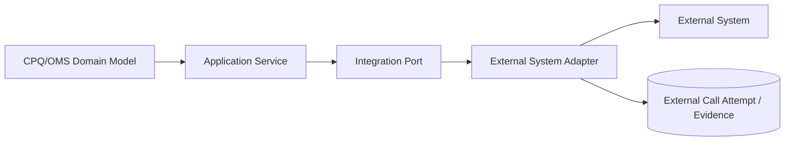
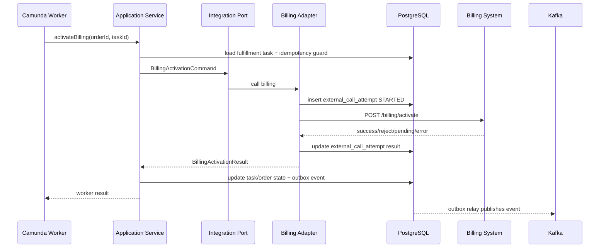
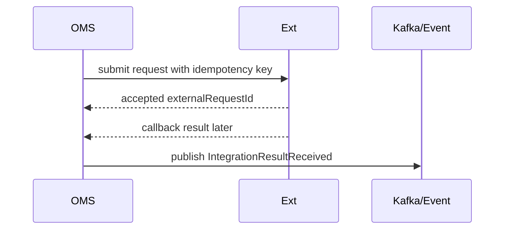
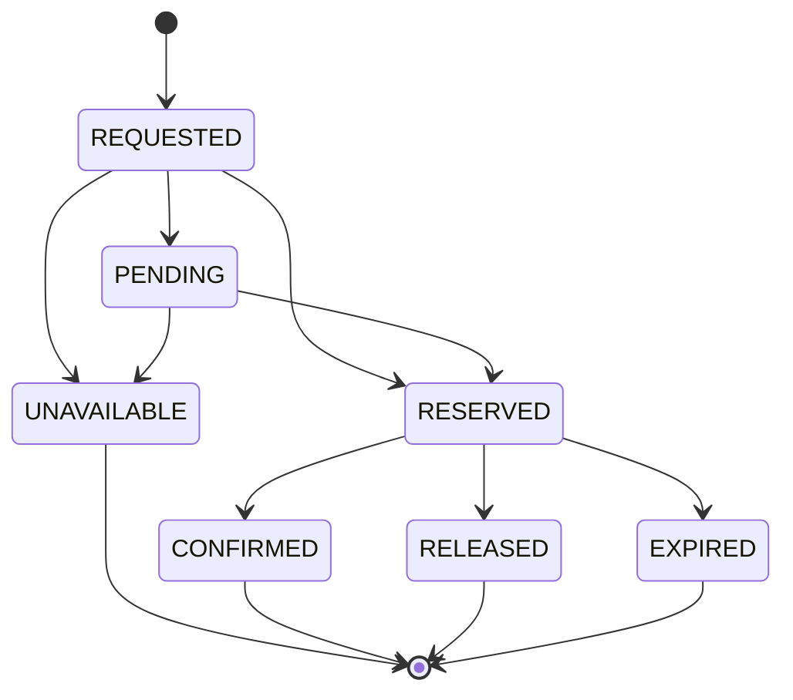
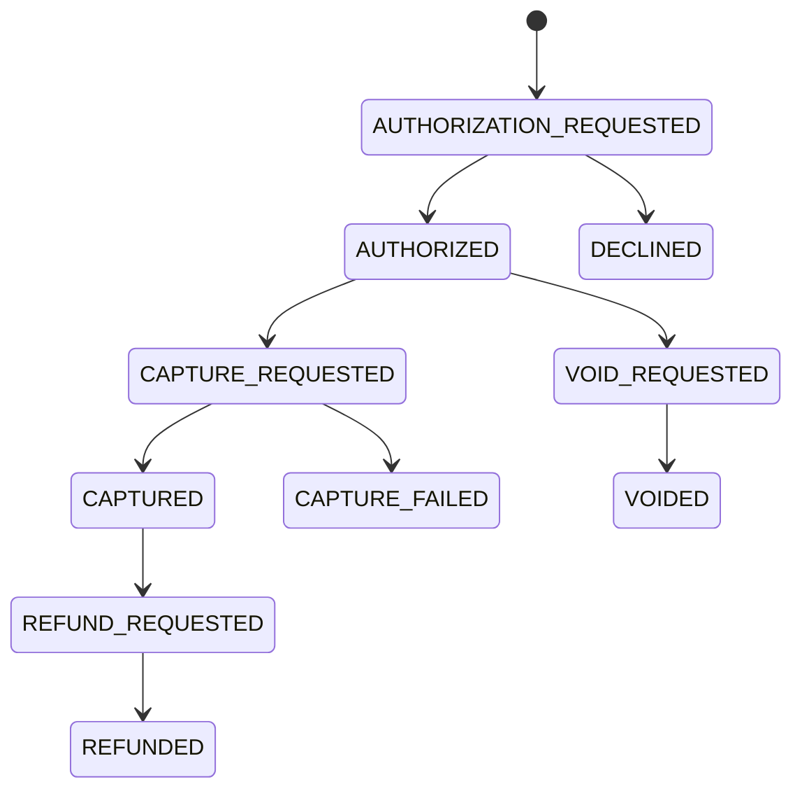
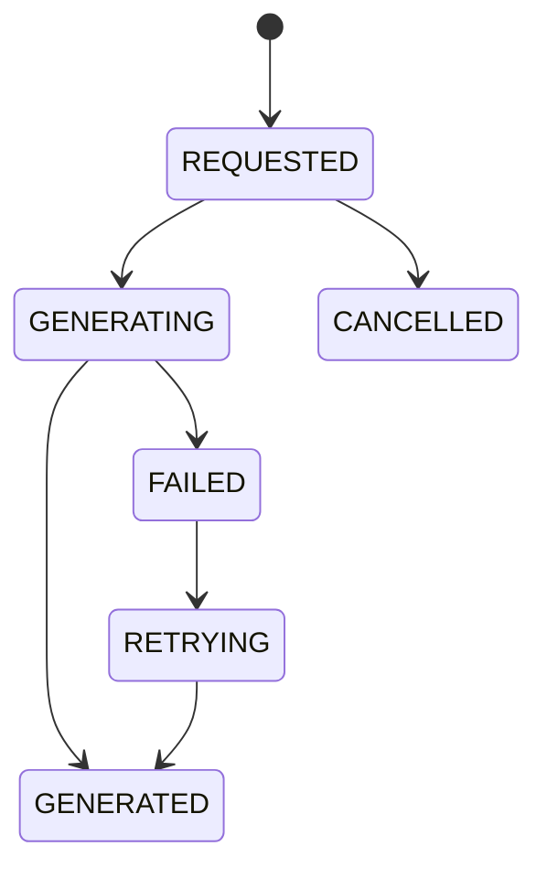
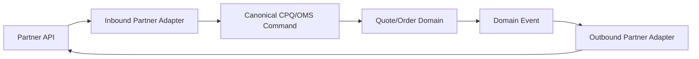
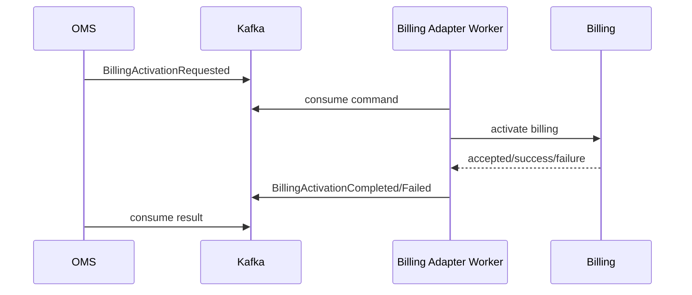
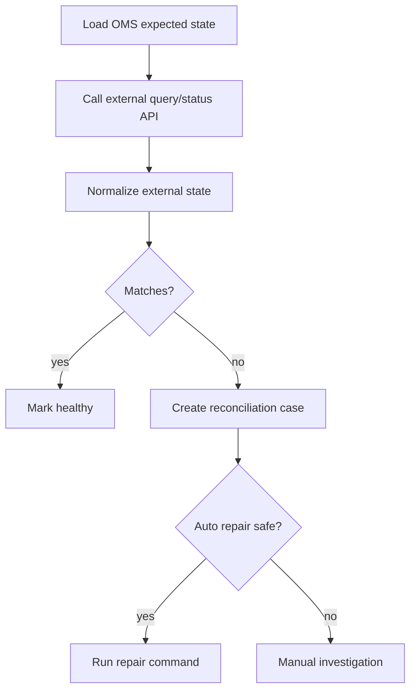

------
title: Build From Scratch: Enterprise Java Microservices CPQ & Order Management Platform - Part 048
description: Membangun integration adapters untuk external systems dalam CPQ/OMS: anti-corruption layer, CRM, billing, provisioning, inventory, payment, notification, document generation, partner API, idempotency, retry, reconciliation, evidence, dan operational recovery.
series: learn-enterprise-cpq-oms-glassfish-camunda8
seriesTitle: Build From Scratch: Enterprise Java Microservices CPQ & Order Management Platform
order: 48
partTitle: Integration Adapters for External Systems
tags:
  - java
  - microservices
  - cpq
  - oms
  - integration
  - adapter
  - anti-corruption-layer
  - kafka
  - camunda-8
  - postgresql
  - mybatis
  - resilience
  - enterprise-architecture
  - production
  - openapi
date: 2026-07-02
---

# Part 048 — Integration Adapters for External Systems

CPQ/OMS jarang hidup sendiri. Ia harus bicara dengan CRM, billing, provisioning, inventory, payment, notification, document generation, tax, contract, partner API, service inventory, workforce management, dan sistem legacy lain.

Kesalahan umum:

> Menganggap integration hanyalah HTTP client.

Dalam sistem enterprise, integration adapter adalah **anti-corruption layer**. Tugasnya bukan hanya memanggil endpoint, tetapi melindungi core domain dari model eksternal yang tidak stabil, tidak konsisten, lambat, partial, dan kadang salah.

Mental model:

> Core domain berbicara dalam bahasa CPQ/OMS.  
> External system berbicara dalam bahasanya sendiri.  
> Adapter menerjemahkan, menahan error, mencatat evidence, menjaga idempotency, dan menyediakan recovery path.

Tanpa adapter boundary yang kuat, domain CPQ/OMS akan terkontaminasi oleh field seperti:

```text
custNo
billCycleCd
svcActFlag
legacyStatus2
provTxnRef
errCd
```

Sekali istilah seperti ini bocor ke aggregate, API, Kafka event, dan BPMN variable, sistem menjadi sulit dirawat.

---

## 1. What Counts as an External System?

Dalam seri ini, external system berarti sistem di luar bounded context utama CPQ/OMS yang:

- punya data ownership sendiri,
- punya lifecycle sendiri,
- punya error semantics sendiri,
- bisa unavailable,
- bisa lambat,
- bisa mengubah contract,
- bisa menerima duplicate request,
- bisa mengembalikan response ambiguous.

Contoh:

| External system | Typical role |
|---|---|
| CRM | customer/account validation, contact, sales hierarchy |
| Billing | billing account, charge activation, invoice trigger |
| Provisioning | activate service/resource |
| Inventory | reserve resource, allocate number/device/port |
| Payment | authorize/capture/refund payment |
| Notification | email/SMS/WhatsApp/push |
| Document generation | quote PDF, contract PDF, order confirmation |
| Tax | tax estimation/finalization |
| Contract/CLM | agreement, signature, legal terms |
| Partner gateway | external marketplace/channel order |
| Workforce | appointment, field technician scheduling |
| Service inventory | service instance/source of operational service truth |

Setiap external system harus lewat adapter, bukan langsung dipanggil dari aggregate/domain object.

---

## 2. Adapter Is a Boundary

Adapter bukan helper class.

Adapter memiliki boundary jelas:



Core domain hanya tahu port interface:

```java
public interface ProvisioningPort {
    ProvisioningResult provisionService(ProvisioningCommand command);
}
```

Domain tidak tahu:

- endpoint URL,
- authentication mechanism,
- legacy status code,
- vendor DTO,
- retry transport detail,
- raw response shape.

### 2.1 Adapter Responsibilities

Adapter bertanggung jawab untuk:

1. translate internal command ke external request,
2. attach authentication/headers,
3. apply timeout,
4. apply retry policy jika aman,
5. enforce idempotency key,
6. parse response,
7. map external status/error ke internal result,
8. persist external call attempt/evidence,
9. redact sensitive data,
10. emit integration event,
11. support reconciliation.

### 2.2 Adapter Non-Responsibilities

Adapter tidak boleh:

- memutuskan quote/order state final,
- melakukan aggregate mutation langsung tanpa application service,
- menyimpan business rules CPQ,
- memanggil database core secara sembarangan,
- membuat Kafka event domain tanpa command handler,
- menyimpan raw secret dalam log,
- menyembunyikan failure dengan return sukses palsu.

---

## 3. Port and Adapter Pattern

Port mendefinisikan bahasa internal.

Adapter mengimplementasikan port untuk external system tertentu.

```java
public record BillingActivationCommand(
    String tenantId,
    String orderId,
    String subscriptionId,
    String billingAccountId,
    String chargeSnapshotId,
    LocalDate activationDate,
    String idempotencyKey,
    String correlationId
) {}

public sealed interface BillingActivationResult
    permits BillingActivationSucceeded,
            BillingActivationRejected,
            BillingActivationPending,
            BillingActivationFailed {}

public record BillingActivationSucceeded(
    String externalBillingId,
    Instant completedAt,
    String evidenceId
) implements BillingActivationResult {}

public record BillingActivationRejected(
    String reasonCode,
    String reasonMessage,
    String evidenceId
) implements BillingActivationResult {}

public record BillingActivationPending(
    String externalRequestId,
    String evidenceId
) implements BillingActivationResult {}

public record BillingActivationFailed(
    String failureCategory,
    boolean retryable,
    String evidenceId
) implements BillingActivationResult {}
```

Perhatikan: result menggunakan vocabulary internal. External code seperti `BIL-ERR-7781` tidak langsung bocor ke caller, tetapi tetap disimpan sebagai evidence.

---

## 4. Adapter Call Lifecycle



Worker tidak memanggil external system langsung tanpa application service. Worker hanya entry point orchestration. Application service tetap mengontrol state, idempotency, audit, dan event.

---

## 5. External Call Attempt Table

Setiap call penting harus durable.

```sql
create table external_call_attempt (
    external_call_id uuid primary key,
    tenant_id text not null,
    system_code text not null,
    operation_code text not null,
    business_object_type text not null,
    business_object_id text not null,
    idempotency_key text not null,
    correlation_id text not null,
    causation_id text not null,
    request_hash text not null,
    request_snapshot jsonb not null,
    response_snapshot jsonb,
    status text not null,
    external_request_id text,
    external_reference_id text,
    failure_category text,
    failure_reason text,
    retryable boolean,
    attempt_no int not null,
    started_at timestamptz not null,
    completed_at timestamptz,
    created_at timestamptz not null,
    updated_at timestamptz not null,
    unique (tenant_id, system_code, operation_code, idempotency_key)
);

create index idx_external_call_business_object
    on external_call_attempt (tenant_id, business_object_type, business_object_id);

create index idx_external_call_status
    on external_call_attempt (tenant_id, system_code, status, updated_at);
```

### 5.1 Why Store Request Hash?

Idempotency key reuse harus aman.

Jika request sama:

```text
same idempotencyKey + same requestHash = replay existing result
```

Jika request berbeda:

```text
same idempotencyKey + different requestHash = conflict
```

Ini sama seperti Part 023 untuk business command idempotency, tetapi diterapkan pada external side effect.

### 5.2 Snapshot Redaction

`request_snapshot` dan `response_snapshot` harus disanitasi.

Jangan simpan:

- access token,
- password,
- card number,
- full personally identifiable data jika tidak perlu,
- raw header authorization,
- secrets,
- private key.

Gunakan redaction:

```json
{
  "billingAccountId": "ba_123",
  "amount": "100000.00",
  "currency": "IDR",
  "authorization": "<redacted>"
}
```

---

## 6. Error Taxonomy

External error harus dipetakan ke internal taxonomy.

| Internal category | Meaning | Retry? | Example |
|---|---|---:|---|
| `TIMEOUT` | no response before timeout | maybe | billing slow |
| `CONNECTION_FAILED` | network/connectivity failure | yes | connection refused |
| `AUTH_FAILED` | credential/permission problem | no until config fixed | 401/403 |
| `VALIDATION_REJECTED` | external rejects request content | no | invalid billing account |
| `BUSINESS_REJECTED` | external business rule rejects | no/manual | customer not eligible |
| `CONFLICT` | duplicate/conflicting state | maybe | already activated |
| `RATE_LIMITED` | external throttling | yes with backoff | 429 |
| `SERVER_ERROR` | 5xx/external fault | yes | 500 |
| `AMBIGUOUS_OUTCOME` | request may or may not have succeeded | reconcile first | timeout after submit |
| `SCHEMA_MISMATCH` | unexpected response shape | no/manual | missing required field |

Most important category: `AMBIGUOUS_OUTCOME`.

If we sent activation request and timed out, we do not know if external system executed it. Retrying blindly can duplicate activation. Correct flow:

1. mark attempt as ambiguous,
2. call external status endpoint if available,
3. reconcile by external request ID/idempotency key,
4. only retry if safe.

---

## 7. Timeout and Retry Policy

Retry is not a virtue. Safe retry requires idempotency.

### 7.1 Timeout Budget

Example:

```text
Camunda job timeout: 5 minutes
Application service budget: 30 seconds
External HTTP connect timeout: 2 seconds
External HTTP read timeout: 10 seconds
Retry count inside adapter: 0-1 for connection failure only
Long retry: managed by workflow/task retry, not tight loop
```

Do not keep a GlassFish/JAX-RS request thread waiting for a 5-minute external operation. For long operations, use async command + Kafka/Camunda flow.

### 7.2 Retry Decision Matrix

| Failure | Immediate retry | Workflow retry | Manual/reconcile |
|---|---:|---:|---:|
| connection refused | maybe | yes | if persistent |
| timeout before request sent | maybe | yes | if persistent |
| timeout after request sent | no | after reconcile | yes |
| 400 validation | no | no | fix data |
| 401/403 | no | no | fix credential/permission |
| 409 duplicate | no | maybe map to success | investigate |
| 429 rate limit | no tight loop | yes with backoff | if persistent |
| 500 | maybe | yes | if persistent |
| unexpected schema | no | no | fix contract/adapter |

### 7.3 Circuit Breaker Boundary

Circuit breaker protects the platform from repeatedly hammering a broken dependency.

But be careful:

- open circuit should fail fast with retryable technical failure,
- it should not mark business task as permanently failed,
- it should create visible operational signal,
- it should not hide downtime.

---

## 8. Sync, Async, Callback, and Polling

External systems behave differently.

| Mode | Description | Example |
|---|---|---|
| synchronous | response final in same call | customer validation |
| async request/result | submit request, receive callback/event later | provisioning |
| polling | submit request, poll status endpoint | document generation |
| file/batch | send file/batch, later settlement report | billing migration |
| human-assisted | external team/manual process | complex enterprise provisioning |

### 8.1 Synchronous Integration

Good for:

- fast validation,
- deterministic lookup,
- low-latency small request,
- no long side effect.

Example:

```text
Validate customer account in CRM before quote submit.
```

### 8.2 Async Integration

Good for:

- provisioning,
- billing activation,
- document generation,
- payment capture,
- partner order submission.

Pattern:



### 8.3 Polling

Polling is acceptable if external system has no callback.

Rules:

- persist poll state,
- use backoff,
- cap total duration,
- detect terminal status,
- create fallout after timeout,
- do not poll from API request thread.

---

## 9. Adapter Module Structure

```text
commerce-integration/
  integration-api/
    src/main/java/.../port/
      BillingPort.java
      ProvisioningPort.java
      InventoryPort.java
      NotificationPort.java
  integration-core/
    src/main/java/.../model/
      ExternalCallAttempt.java
      ExternalFailureCategory.java
      IntegrationResult.java
  integration-postgres/
    src/main/java/.../mapper/
      ExternalCallAttemptMapper.java
    src/main/resources/mybatis/
      ExternalCallAttemptMapper.xml
  integration-http/
    src/main/java/.../http/
      HttpClientFactory.java
      RedactingLogger.java
      RetryPolicy.java
  integration-billing-adapter/
    src/main/java/.../billing/
      BillingAdapter.java
      BillingRequestMapper.java
      BillingResponseMapper.java
  integration-provisioning-adapter/
  integration-inventory-adapter/
  integration-notification-adapter/
```

This separation prevents every adapter from reinventing idempotency, logging, redaction, retry, and evidence.

---

## 10. Adapter Registry and Capability Matrix

Enterprise systems often vary by tenant, market, product line, or region.

Create adapter registry:

```sql
create table integration_system_config (
    tenant_id text not null,
    system_code text not null,
    enabled boolean not null,
    base_url text not null,
    auth_profile text not null,
    timeout_profile text not null,
    retry_profile text not null,
    capability_profile text not null,
    created_at timestamptz not null,
    updated_at timestamptz not null,
    primary key (tenant_id, system_code)
);

create table integration_capability (
    tenant_id text not null,
    system_code text not null,
    capability_code text not null,
    enabled boolean not null,
    config jsonb not null,
    primary key (tenant_id, system_code, capability_code)
);
```

Example capabilities:

```text
CRM_VALIDATE_ACCOUNT
BILLING_ACTIVATE_SUBSCRIPTION
BILLING_CANCEL_SUBSCRIPTION
INVENTORY_RESERVE_NUMBER
PROVISIONING_ACTIVATE_SERVICE
NOTIFICATION_SEND_EMAIL
DOCUMENT_GENERATE_QUOTE_PDF
```

Domain service should not guess whether an integration is supported. It asks capability registry.

---

## 11. CRM Adapter

CRM integration usually provides:

- customer account lookup,
- contact lookup,
- account status validation,
- sales hierarchy,
- billing account reference,
- eligibility hints,
- address validation.

### 11.1 CRM Boundary

CRM owns customer profile. CPQ/OMS owns quote/order lifecycle.

Do not copy CRM as master data unless necessary. Use snapshots for quote/order evidence.

Example internal command:

```java
public record CustomerAccountValidationCommand(
    String tenantId,
    String customerAccountId,
    String marketSegment,
    String correlationId
) {}
```

Internal result:

```java
public record CustomerAccountValidationResult(
    boolean valid,
    String accountStatus,
    String billingAccountId,
    List<String> eligibilityFlags,
    String evidenceId
) {}
```

### 11.2 CRM Failure Policy

| Scenario | Handling |
|---|---|
| account not found | business rejection |
| account suspended | business rejection or approval required |
| CRM timeout | retry/hold quote/order |
| CRM schema mismatch | integration fallout |
| CRM returns stale data | snapshot and reconciliation policy |

---

## 12. Inventory Adapter

Inventory integration provides:

- resource availability check,
- number/device/port reservation,
- reservation confirmation,
- reservation release,
- allocation status.

Inventory operations are often stateful and must be idempotent.

### 12.1 Reservation Model

```java
public record InventoryReservationCommand(
    String tenantId,
    String orderId,
    String orderItemId,
    String resourceType,
    Map<String, String> constraints,
    String idempotencyKey,
    String correlationId
) {}
```

Result:

```java
public sealed interface InventoryReservationResult
    permits InventoryReserved,
            InventoryUnavailable,
            InventoryReservationPending,
            InventoryReservationFailed {}
```

### 12.2 Reservation Lifecycle



OMS should persist reservation reference in fulfillment task output/evidence.

---

## 13. Provisioning Adapter

Provisioning activates technical service/resource.

Typical operations:

- create service,
- modify service,
- disconnect service,
- suspend/resume,
- allocate technical resource,
- activate network/service platform.

### 13.1 Provisioning Command

```java
public record ProvisioningCommand(
    String tenantId,
    String orderId,
    String orderItemId,
    String fulfillmentTaskId,
    String action,
    String serviceSpecificationCode,
    Map<String, Object> technicalParameters,
    String idempotencyKey,
    String correlationId
) {}
```

### 13.2 External Status Mapping

External statuses:

```text
NEW, SENT, ACK, INPROG, DONE, ERR, ERR2, CANCEL_PENDING
```

Internal mapping:

| External | Internal |
|---|---|
| `NEW`, `SENT`, `ACK`, `INPROG` | `PENDING` |
| `DONE` | `SUCCEEDED` |
| `ERR`, `ERR2` | `FAILED` |
| `CANCEL_PENDING` | `CANCELLATION_PENDING` |
| unknown | `UNKNOWN_REQUIRES_INVESTIGATION` |

Never expose `ERR2` directly to order aggregate.

### 13.3 Provisioning Fallout

Provisioning failures often need human repair:

- invalid technical parameter,
- resource conflict,
- downstream platform unavailable,
- manual activation required,
- service already exists,
- partial activation.

Adapter result should classify failure so fulfillment state machine can decide retry/fallout/compensation.

---

## 14. Billing Adapter

Billing integration is financially sensitive.

Operations:

- create/update billing account reference,
- activate recurring charge,
- apply one-time charge,
- start subscription billing,
- stop subscription billing,
- apply credit/adjustment,
- send invoice trigger.

### 14.1 Billing Activation Guard

Billing should usually happen after fulfillment reaches a safe billing point:

```text
OrderCompleted
AssetActivated
ServiceActivated
Commercial acceptance achieved
```

Do not trigger billing on `OrderCaptured` unless business explicitly defines prepayment/deposit.

### 14.2 Charge Snapshot

Billing adapter should not recalculate price from catalog.

It receives billing-ready charge snapshot derived from accepted quote/order:

```json
{
  "subscriptionId": "sub_123",
  "billingAccountId": "ba_456",
  "activationDate": "2026-07-02",
  "charges": [
    {
      "chargeId": "chg_001",
      "chargeType": "RECURRING",
      "amount": "750000.00",
      "currency": "IDR",
      "billingFrequency": "MONTHLY",
      "startDate": "2026-07-02"
    }
  ]
}
```

### 14.3 Billing Idempotency

Use deterministic key:

```text
billing-activation:<tenantId>:<orderId>:<subscriptionId>:<chargeSnapshotVersion>
```

If billing returns duplicate/already exists, adapter must reconcile:

- same idempotency key + same charge snapshot = treat as success/pending,
- same subscription but different charge snapshot = conflict/fallout.

---

## 15. Payment Adapter

Payment is not always part of B2B CPQ, but if present, treat it carefully.

Operations:

- authorize,
- capture,
- void,
- refund,
- settlement status.

Payment adapter must never log raw payment instrument. Use tokenized reference only.

### 15.1 Payment State



Payment side effects require strong idempotency and reconciliation. Ambiguous outcome is common and must not be retried blindly.

---

## 16. Notification Adapter

Notification seems harmless. It is not.

Problems:

- duplicate emails/SMS,
- wrong recipient,
- PII leak,
- notification sent before transaction commits,
- notification sent for rolled-back order,
- customer receives internal failure detail.

Pattern:

```text
Domain event -> NotificationCommand record -> Notification adapter -> NotificationSent/Failed
```

Do not send notification directly inside quote/order transaction.

### 16.1 Notification Idempotency

Key:

```text
notification:<templateCode>:<businessObjectId>:<recipient>:<businessMilestone>
```

Example:

```text
notification:ORDER_CONFIRMATION:ord_123:customer_primary:captured_v1
```

### 16.2 Template Data

Template data must be curated:

```json
{
  "orderNumber": "SO-2026-000001",
  "customerDisplayName": "PT Example",
  "expectedCompletionDate": "2026-07-05"
}
```

Do not pass entire order aggregate to template engine.

---

## 17. Document Generation Adapter

Document generation creates:

- quote PDF,
- order confirmation,
- contract attachment,
- approval packet,
- invoice supplement.

### 17.1 Document Snapshot

Generated document must be reproducible by snapshot, not latest mutable data.

Input:

```json
{
  "documentType": "QUOTE_PDF",
  "quoteId": "quo_123",
  "quoteRevision": 2,
  "snapshotId": "quote_snapshot_abc",
  "templateVersion": "quote-template-v5",
  "locale": "id-ID"
}
```

Store:

- document request,
- template version,
- data snapshot hash,
- generated file reference,
- generation status,
- evidence.

### 17.2 Document State



---

## 18. Partner API Adapter

Partner integration is high-risk because partner semantics often differ from internal semantics.

Examples:

- partner sends cart/order with different product code,
- partner price is pre-negotiated,
- partner order may be partial,
- partner expects callback status,
- partner cancellation window differs,
- partner identity/tenant mapping needed.

Use inbound adapter and outbound adapter.



Inbound adapter maps partner request into internal command. It must not bypass validation/configuration/pricing/order capture.

---

## 19. OpenAPI Client Boundary

For HTTP integrations, use generated clients carefully.

OpenAPI helps describe external API contract. But generated DTOs should stay inside adapter module.

Bad:

```java
public class OrderService {
    public void activate(BillingApiGeneratedRequest request) { ... }
}
```

Good:

```java
public class BillingAdapter implements BillingPort {
    public BillingActivationResult activate(BillingActivationCommand command) {
        BillingApiRequest request = billingMapper.toExternal(command);
        BillingApiResponse response = billingClient.activate(request);
        return billingMapper.toInternal(response);
    }
}
```

Generated external classes do not cross adapter boundary.

---

## 20. Adapter Mapping Layer

```java
final class BillingRequestMapper {
    BillingActivateRequest toExternal(BillingActivationCommand command, ChargeSnapshot snapshot) {
        return new BillingActivateRequest(
            command.billingAccountId(),
            command.subscriptionId(),
            snapshot.charges().stream()
                .map(this::toExternalCharge)
                .toList(),
            command.activationDate().toString(),
            command.idempotencyKey()
        );
    }

    private BillingCharge toExternalCharge(ChargeLine charge) {
        return new BillingCharge(
            charge.chargeCode(),
            charge.amount().toPlainString(),
            charge.currency(),
            charge.frequency().name()
        );
    }
}
```

Mapping is explicit. No reflection magic. No automatic field-copy across bounded contexts.

---

## 21. Kafka-Based Integration Commands

Some integrations should not be called directly. Use command topic.

Example:

```text
commerce.billing-integration.commands.v1
commerce.billing-integration.results.v1
```

Flow:



Use this when:

- integration is slow,
- side effect must be decoupled,
- adapter is owned by integration team,
- result is asynchronous,
- downstream rate limit must be isolated.

But do not use Kafka command topic to avoid modelling the domain command lifecycle. Command record still needs durable tracking.

---

## 22. Camunda Boundary

Camunda orchestrates integration steps, but should not contain low-level adapter detail.

BPMN task:

```text
Activate Billing
```

Worker:

```java
@JobWorker(type = "billing.activate-subscription.v1")
public void activateBilling(JobClient client, ActivatedJob job) {
    ActivateBillingVariables vars = variableMapper.map(job);
    billingApplicationService.activateBilling(vars.orderId(), vars.taskId());
    client.newCompleteCommand(job.getKey()).send().join();
}
```

Application service:

- loads task,
- checks idempotency,
- creates adapter command,
- calls adapter/produces integration command,
- persists result,
- updates task/order state,
- writes outbox event.

BPMN variables should contain IDs and lightweight routing data, not full external request/response.

---

## 23. Reconciliation

Reconciliation is not optional.

External systems can diverge from OMS due to:

- timeout after side effect,
- callback lost,
- manual change in external system,
- duplicate external request,
- batch settlement correction,
- data migration,
- external rollback,
- adapter bug.

### 23.1 Reconciliation Table

```sql
create table reconciliation_case (
    reconciliation_case_id uuid primary key,
    tenant_id text not null,
    system_code text not null,
    business_object_type text not null,
    business_object_id text not null,
    mismatch_type text not null,
    expected_state jsonb not null,
    observed_state jsonb not null,
    severity text not null,
    status text not null,
    detected_at timestamptz not null,
    resolved_at timestamptz,
    created_at timestamptz not null,
    updated_at timestamptz not null
);
```

### 23.2 Reconciliation Flow



### 23.3 Auto Repair Rules

Auto repair only when:

- mismatch is deterministic,
- repair command is idempotent,
- customer/financial impact is low or approved,
- evidence is complete,
- policy allows automated correction.

Otherwise create manual case.

---

## 24. Adapter Observability

Adapter logs must answer:

- which business object,
- which external system,
- which operation,
- which idempotency key,
- which external request ID,
- latency,
- result category,
- retry count,
- correlation ID,
- evidence ID.

Structured log example:

```json
{
  "message": "external_call_completed",
  "tenantId": "tenant_a",
  "systemCode": "BILLING",
  "operationCode": "ACTIVATE_SUBSCRIPTION",
  "businessObjectType": "ORDER",
  "businessObjectId": "ord_123",
  "idempotencyKey": "billing-activation:tenant_a:ord_123:sub_456:v1",
  "externalRequestId": "bill_req_999",
  "status": "SUCCEEDED",
  "latencyMs": 842,
  "correlationId": "corr_001",
  "evidenceId": "evd_123"
}
```

Metrics:

```text
external_call_total{system,operation,status}
external_call_latency_ms{system,operation}
external_call_retry_total{system,operation,failure_category}
external_call_ambiguous_total{system,operation}
external_call_circuit_open{system,operation}
reconciliation_case_total{system,mismatch_type,severity}
```

---

## 25. Security and Secrets

Adapter owns external credential usage.

Rules:

- credentials loaded from secret manager/config provider,
- no credentials in DB snapshots,
- no credentials in logs,
- no credentials in Kafka events,
- rotate credentials without redeploy if platform supports,
- separate credential per environment,
- separate credential per tenant/partner if required,
- enforce outbound TLS,
- validate certificate policy as required,
- apply least privilege.

Service-to-service auth should be explicit. Do not rely on network location only.

---

## 26. Test Strategy

Adapter testing has several layers.

### 26.1 Mapper Unit Tests

Input internal command -> expected external request.

External response -> expected internal result.

Test weird external statuses.

### 26.2 Contract Tests

Against external OpenAPI/mock server.

Validate:

- request shape,
- response parsing,
- error mapping,
- optional field behavior,
- unknown field behavior.

### 26.3 Fake Server Integration Tests

Use fake external server to test:

- timeout,
- 500,
- 429,
- malformed response,
- delayed callback,
- duplicate response,
- ambiguous outcome.

### 26.4 Database Tests

Test `external_call_attempt` uniqueness and idempotency replay.

### 26.5 Workflow Tests

Test Camunda worker path:

- task success,
- retryable failure,
- non-retryable failure,
- ambiguous outcome,
- fallout creation,
- compensation.

---

## 27. Example: Provisioning Adapter Implementation Skeleton

```java
public final class ProvisioningAdapter implements ProvisioningPort {
    private final ProvisioningHttpClient client;
    private final ProvisioningMapper mapper;
    private final ExternalCallAttemptRepository attempts;
    private final Clock clock;

    @Override
    public ProvisioningResult provisionService(ProvisioningCommand command) {
        String requestHash = mapper.hash(command);

        ExternalCallAttempt existing = attempts.findByIdempotencyKey(
            command.tenantId(),
            "PROVISIONING",
            "PROVISION_SERVICE",
            command.idempotencyKey()
        );

        if (existing != null) {
            if (!existing.requestHash().equals(requestHash)) {
                return ProvisioningResult.failed(
                    "IDEMPOTENCY_CONFLICT",
                    false,
                    existing.externalCallId().toString()
                );
            }
            if (existing.isTerminal()) {
                return mapper.toResult(existing);
            }
        }

        ExternalCallAttempt attempt = attempts.start(
            ExternalCallAttemptStart.builder()
                .tenantId(command.tenantId())
                .systemCode("PROVISIONING")
                .operationCode("PROVISION_SERVICE")
                .businessObjectType("FULFILLMENT_TASK")
                .businessObjectId(command.fulfillmentTaskId())
                .idempotencyKey(command.idempotencyKey())
                .correlationId(command.correlationId())
                .requestHash(requestHash)
                .requestSnapshot(mapper.toRedactedSnapshot(command))
                .startedAt(clock.instant())
                .build()
        );

        try {
            ProvisioningRequest request = mapper.toExternal(command);
            ProvisioningResponse response = client.provision(request, command.idempotencyKey());
            ProvisioningResult result = mapper.toInternal(response, attempt.externalCallId());
            attempts.complete(attempt.externalCallId(), mapper.toSnapshot(response), result);
            return result;
        } catch (HttpTimeoutException e) {
            attempts.markAmbiguous(attempt.externalCallId(), "TIMEOUT_AFTER_SUBMIT", e.getMessage());
            return ProvisioningResult.ambiguous(attempt.externalCallId().toString());
        } catch (ExternalValidationException e) {
            attempts.markRejected(attempt.externalCallId(), e.code(), e.getMessage());
            return ProvisioningResult.rejected(e.code(), attempt.externalCallId().toString());
        } catch (Exception e) {
            attempts.markFailed(attempt.externalCallId(), "TECHNICAL_FAILURE", true, e.getMessage());
            return ProvisioningResult.failed("TECHNICAL_FAILURE", true, attempt.externalCallId().toString());
        }
    }
}
```

This is not final production code, but it shows the important shape:

- idempotency before side effect,
- durable attempt,
- explicit mapping,
- error classification,
- evidence ID returned.

---

## 28. MyBatis Mapper Example

```xml
<mapper namespace="com.example.integration.ExternalCallAttemptMapper">

  <insert id="insertAttempt">
    insert into external_call_attempt (
      external_call_id,
      tenant_id,
      system_code,
      operation_code,
      business_object_type,
      business_object_id,
      idempotency_key,
      correlation_id,
      causation_id,
      request_hash,
      request_snapshot,
      status,
      retryable,
      attempt_no,
      started_at,
      created_at,
      updated_at
    ) values (
      #{externalCallId},
      #{tenantId},
      #{systemCode},
      #{operationCode},
      #{businessObjectType},
      #{businessObjectId},
      #{idempotencyKey},
      #{correlationId},
      #{causationId},
      #{requestHash},
      #{requestSnapshot,typeHandler=com.example.JsonbTypeHandler},
      #{status},
      #{retryable},
      #{attemptNo},
      #{startedAt},
      #{createdAt},
      #{updatedAt}
    )
  </insert>

  <select id="findByIdempotencyKey" resultMap="ExternalCallAttemptResultMap">
    select *
    from external_call_attempt
    where tenant_id = #{tenantId}
      and system_code = #{systemCode}
      and operation_code = #{operationCode}
      and idempotency_key = #{idempotencyKey}
  </select>

  <update id="markCompleted">
    update external_call_attempt
    set status = #{status},
        response_snapshot = #{responseSnapshot,typeHandler=com.example.JsonbTypeHandler},
        external_request_id = #{externalRequestId},
        external_reference_id = #{externalReferenceId},
        failure_category = null,
        failure_reason = null,
        retryable = false,
        completed_at = #{completedAt},
        updated_at = #{updatedAt}
    where external_call_id = #{externalCallId}
      and status in ('STARTED', 'PENDING', 'AMBIGUOUS')
  </update>

</mapper>
```

The unique constraint is the real guard. Mapper logic is not enough.

---

## 29. Operational Runbook Scenarios

### 29.1 Billing Activation Timeout

Symptoms:

- fulfillment task stuck,
- external call attempt `AMBIGUOUS_OUTCOME`,
- no billing result event.

Action:

1. query external billing by idempotency key/external request ID,
2. if succeeded, mark attempt completed via repair command,
3. resume fulfillment task,
4. publish integration result event,
5. attach evidence.

### 29.2 Provisioning Duplicate Conflict

Symptoms:

- provisioning returns duplicate service,
- OMS task failed,
- asset not activated.

Action:

1. verify duplicate points to same order/service,
2. if same, map to success and link external service ID,
3. if different, create fallout,
4. do not auto-disconnect without approval.

### 29.3 Notification Sent Twice

Symptoms:

- customer receives duplicate confirmation.

Action:

1. inspect notification idempotency key,
2. check duplicate command creation,
3. check retry after ambiguous provider response,
4. patch notification dedupe rule,
5. mark duplicate as incident evidence.

---

## 30. Anti-Patterns

### 30.1 Domain Model Contains External DTO

```java
class Order {
    BillingActivateRequest billingRequest;
}
```

This corrupts domain boundary.

### 30.2 Adapter Decides Order State Alone

```java
if (billingSuccess) {
    order.status = COMPLETED;
}
```

Adapter should return result. Application/domain service decides transition.

### 30.3 No Durable External Call Record

If external call is only in log, recovery is weak. Logs are not command ledger.

### 30.4 Blind Retry

Retrying payment/provisioning/billing without idempotency can create duplicate real-world side effects.

### 30.5 Raw External Error Leaks to Customer

External error:

```text
ERR_PV_991: Downstream node missing vlan slot
```

Customer message should be curated:

```text
Your order requires additional technical processing. Our operations team is reviewing it.
```

---

## 31. Production Checklist

Before adding an integration adapter, confirm:

- [ ] internal port exists,
- [ ] external DTO does not leak outside adapter,
- [ ] idempotency key policy defined,
- [ ] external call attempt stored,
- [ ] request/response redaction implemented,
- [ ] timeout budget defined,
- [ ] retry matrix defined,
- [ ] ambiguous outcome policy defined,
- [ ] reconciliation path defined,
- [ ] failure categories mapped,
- [ ] metrics/logs/traces available,
- [ ] contract tests exist,
- [ ] fake server tests exist,
- [ ] tenant/system config exists,
- [ ] credential handling defined,
- [ ] runbook exists,
- [ ] manual repair path exists.

---

## 32. Build Milestone

After this part, implement:

1. `integration-api` module with ports.
2. `integration-core` module with result/error/evidence model.
3. `external_call_attempt` migration.
4. MyBatis mapper for attempts.
5. HTTP client wrapper with timeout/redaction.
6. Billing adapter skeleton.
7. Provisioning adapter skeleton.
8. Fake external server test.
9. Adapter contract test fixtures.
10. Reconciliation case table and basic query.

---

## 33. References

- OpenAPI Specification: `https://spec.openapis.org/`
- Apache Kafka Documentation: `https://kafka.apache.org/documentation/`
- Camunda 8 Job Workers: `https://docs.camunda.io/docs/components/concepts/job-workers/`
- PostgreSQL Documentation: `https://www.postgresql.org/docs/current/`
- MyBatis Documentation: `https://mybatis.org/mybatis-3/`

---

## 34. Closing Mental Model

Integration adapter is where enterprise architecture becomes honest.

A clean domain model is easy when every dependency is fast, correct, stable, and controlled. Real external systems are not like that.

A production-grade adapter says:

```text
I know the external system is unreliable.
I will not let its vocabulary pollute the core domain.
I will not duplicate real-world side effects.
I will not hide ambiguous outcomes.
I will preserve evidence.
I will support reconciliation and repair.
```

That is the difference between a demo OMS and an enterprise OMS.
