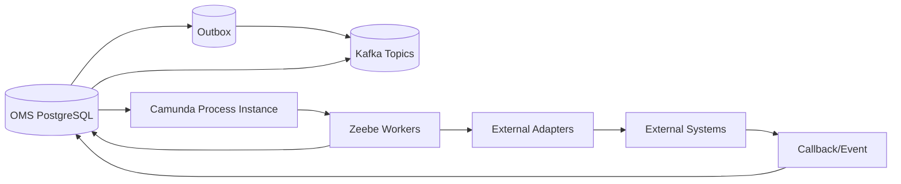
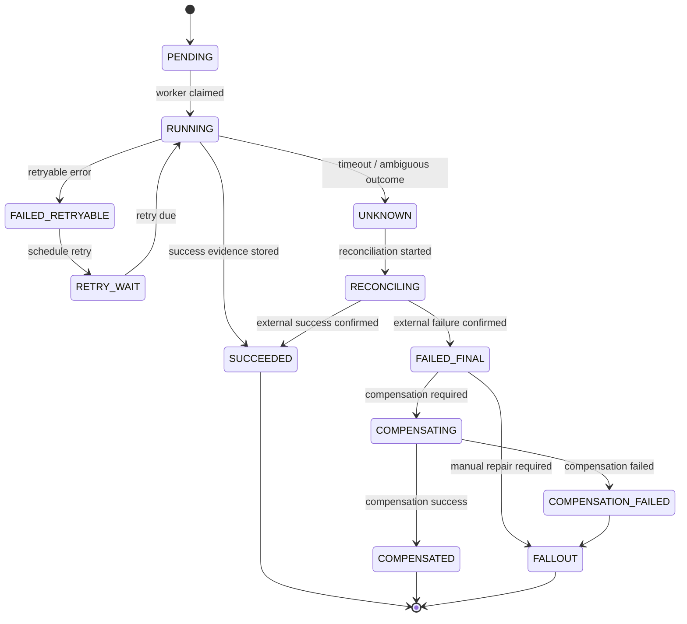
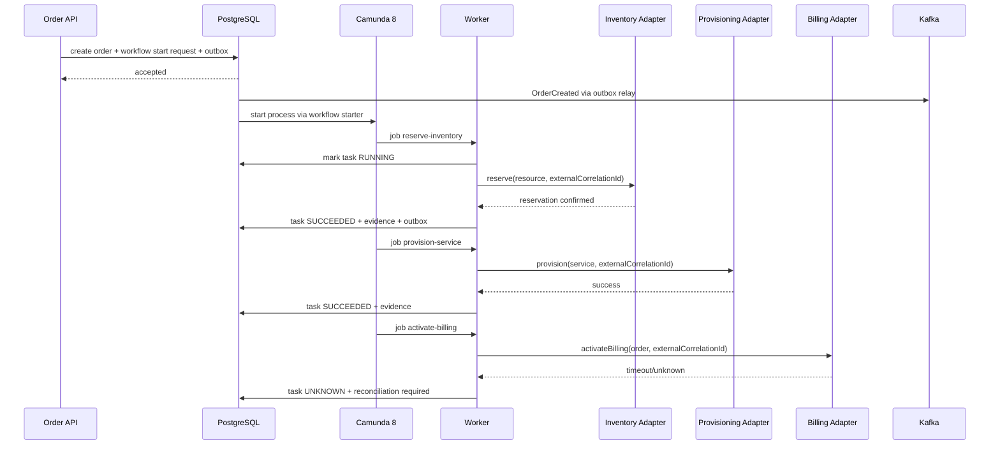
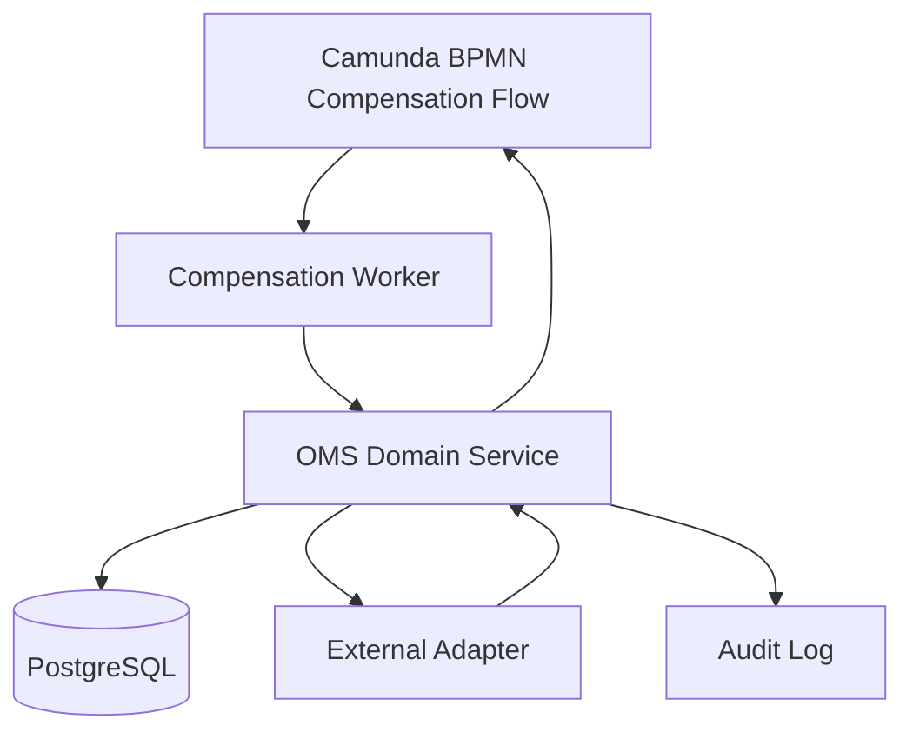

------
title: Build From Scratch: Enterprise Java Microservices CPQ & Order Management Platform - Part 049
description: Mendesain saga, compensation, dan distributed consistency untuk CPQ/OMS production-grade: local transaction, orchestration, choreography boundary, compensation, timeout, reconciliation, repair, audit, idempotency, dan failure modelling.
series: learn-enterprise-cpq-oms-glassfish-camunda8
seriesTitle: Build From Scratch: Enterprise Java Microservices CPQ & Order Management Platform
order: 49
partTitle: Saga, Compensation, and Distributed Consistency
tags:
  - java
  - microservices
  - cpq
  - oms
  - saga
  - compensation
  - distributed-consistency
  - camunda-8
  - kafka
  - postgresql
  - mybatis
  - enterprise-architecture
  - production
  - resilience
date: 2026-07-02
---

# Part 049 — Saga, Compensation, and Distributed Consistency

Kita sudah membangun domain model, API contract, persistence boundary, Camunda orchestration, Kafka event backbone, outbox/inbox, dan integration adapter. Sekarang kita harus menjawab pertanyaan yang paling menentukan di enterprise CPQ/OMS:

> Bagaimana sistem tetap benar ketika satu proses bisnis menyentuh banyak service, banyak database, banyak adapter, banyak external system, dan sebagian berhasil sementara sebagian lain gagal?

Jawaban pendeknya: **jangan mencoba membuat semua hal menjadi satu distributed transaction**.

Jawaban production-grade-nya:

> Gunakan local transaction untuk consistency lokal, saga untuk business transaction lintas boundary, compensation untuk reversal yang masuk akal, reconciliation untuk repair fakta eksternal, dan audit untuk membuktikan keputusan sistem.

Saga bukan slogan. Saga adalah model eksplisit untuk mengelola proses bisnis panjang yang terdiri dari beberapa local transaction. Kalau satu langkah gagal, sistem menjalankan compensating transaction untuk membalik efek langkah sebelumnya sejauh domain memungkinkan.

Dalam CPQ/OMS, ini muncul di hampir semua flow serius:

- quote accepted lalu converted to order,
- inventory reserved,
- appointment booked,
- service provisioned,
- billing activated,
- notification sent,
- asset updated,
- order completed,
- lalu salah satu external system gagal, timeout, duplicate, atau mengembalikan status ambiguous.

Tanpa model distributed consistency yang eksplisit, sistem akan menjadi kumpulan patch:

- retry manual,
- update status langsung di database,
- replay Kafka sembarangan,
- restart workflow tanpa tahu langkah mana yang sudah berhasil,
- order terlihat failed padahal service sudah aktif,
- billing aktif tapi asset belum tercatat,
- customer menerima notifikasi completion padahal provisioning belum selesai.

Itu bukan resilience. Itu operational gambling.

---

## 1. Core Mental Model

Dalam sistem ini, distributed consistency dibagi menjadi beberapa lapisan:

```text
Local consistency
  Dijaga oleh PostgreSQL transaction, constraints, optimistic locking, dan domain invariants.

Message consistency
  Dijaga oleh outbox/inbox, partition key, idempotent consumer, replay-safe handler.

Process consistency
  Dijaga oleh Camunda process instance, durable workflow reference, worker idempotency, dan timeout policy.

External consistency
  Dijaga oleh adapter idempotency, external correlation ID, reconciliation, dan evidence table.

Business consistency
  Dijaga oleh state machine, compensation policy, fallout management, audit, dan repair command.
```

Satu kesalahan desain yang sering muncul:

> Menganggap eventual consistency berarti sistem boleh sementara salah tanpa batas dan tanpa recovery model.

Tidak. Eventual consistency hanya aman jika ada:

- expected convergence condition,
- timeout boundary,
- reconciliation process,
- repair path,
- evidence,
- observability,
- ownership yang jelas.

Kalau tidak ada semua itu, namanya bukan eventual consistency. Namanya data drift.

---

## 2. Local Transaction Remains the Foundation

Saga tidak menggantikan local transaction.

Local transaction tetap dipakai untuk memastikan satu aggregate update valid dan atomic.

Contoh command lokal:

```text
SubmitQuote
  - validate quote state
  - set quote state = SUBMITTED
  - create approval case if needed
  - append audit record
  - insert outbox event QuoteSubmitted
  - commit
```

Semua ini harus terjadi dalam satu PostgreSQL transaction.

Saga baru dimulai ketika business transaction melewati boundary:

```text
ConvertQuoteToOrder
  local transaction:
    - lock quote
    - validate accepted quote revision
    - create order
    - create order items
    - create workflow start request
    - append audit
    - insert outbox OrderCreated
    - commit

  later:
    - start Camunda process
    - execute fulfillment tasks
    - call inventory/provisioning/billing systems
    - process events/callbacks
    - compensate/reconcile if needed
```

Prinsipnya:

> Satu local transaction harus menyelesaikan satu keputusan lokal. Saga mengatur urutan keputusan lokal lintas boundary.

---

## 3. Why Two-Phase Commit Is Usually the Wrong Tool Here

Secara teori, distributed transaction bisa mencoba atomic commit lintas beberapa resource manager. Dalam CPQ/OMS modern, ini jarang cocok karena:

- external system sering tidak ikut transaction manager,
- Kafka event emission bukan sekadar DB row update biasa,
- Camunda process instance punya lifecycle sendiri,
- provisioning/billing/inventory sering asynchronous,
- business flow berjalan lama,
- user/manual approval bisa berlangsung jam/hari,
- compensation kadang bukan rollback teknis, tapi business reversal,
- partial completion sering sah secara bisnis.

Contoh:

```text
Reserve inventory -> success
Provision service -> success
Activate billing -> timeout
```

Kita tidak bisa sekadar rollback transaction seperti database.

Provisioning mungkin sudah mengaktifkan service di network. Billing timeout mungkin sebenarnya sudah berhasil, tetapi response hilang. Inventory reservation mungkin punya expiry. Customer mungkin sudah mendapat appointment.

Jadi masalahnya bukan hanya atomicity teknis. Masalahnya adalah **business recovery**.

---

## 4. Saga Definition for This System

Dalam seri ini, saga didefinisikan sebagai:

> A long-running business transaction composed of ordered local steps, where each completed step has an explicit success evidence, retry policy, timeout policy, compensation policy, and reconciliation policy.

Setiap saga step minimal punya:

| Field | Meaning |
|---|---|
| `step_key` | logical step identity |
| `step_type` | reserve inventory, provision service, activate billing, etc |
| `input_snapshot` | immutable input used by the step |
| `status` | pending, running, succeeded, failed, compensating, compensated, repair_required |
| `attempt_count` | number of execution attempts |
| `external_correlation_id` | idempotency/correlation with external system |
| `success_evidence` | proof that the step succeeded |
| `failure_evidence` | proof that the step failed |
| `compensation_policy` | none, automatic, manual, reconciliation-first |
| `timeout_policy` | when execution becomes suspicious |
| `last_error` | normalized error |
| `version` | optimistic concurrency guard |

Saga bukan hanya BPMN diagram. Saga adalah **durable execution model**.

Camunda dapat mengorkestrasi, tetapi PostgreSQL/domain model tetap mencatat fakta bisnis yang harus dipertahankan.

---

## 5. Orchestration vs Choreography

Ada dua gaya umum saga:

```text
Orchestration
  A central process tells each participant what to do.

Choreography
  Participants react to events and trigger next steps without central coordinator.
```

Dalam CPQ/OMS production-grade, kita cenderung memakai **orchestration-first** untuk order fulfillment karena:

- order flow punya dependency graph,
- step sequencing penting,
- manual intervention diperlukan,
- timeout dan escalation perlu terlihat,
- business users perlu melihat progress,
- fallout handling perlu central view,
- compensation order perlu dipahami secara eksplisit.

Kafka tetap dipakai, tetapi bukan sebagai satu-satunya process brain.



Interpretasi:

- PostgreSQL menyimpan business state.
- Camunda mengatur process execution.
- Kafka menyebarkan business events.
- Adapter menjaga boundary ke sistem eksternal.
- Reconciliation memperbaiki gap antara internal dan eksternal.

---

## 6. Business Transaction Types in CPQ/OMS

Tidak semua flow butuh saga dengan tingkat kompleksitas sama.

| Business transaction | Saga need | Reason |
|---|---:|---|
| Create quote draft | low | local aggregate command |
| Price quote | medium | may call pricing/tax/promotion; mostly local if snapshot-based |
| Submit quote for approval | medium | user task, SLA, escalation |
| Convert quote to order | high | creates order and starts fulfillment |
| Reserve resource | high | external inventory consistency |
| Provision service | high | irreversible or semi-reversible operation |
| Activate billing | high | customer financial impact |
| Cancel in-flight order | very high | partial completion and compensation |
| Amend active subscription | very high | installed base impact |
| Disconnect service | high | service termination and billing stop |
| Notify customer | low/medium | side effect; usually not blocker unless legally required |

Rule of thumb:

> Semakin besar external side effect dan semakin sulit rollback, semakin eksplisit saga model yang dibutuhkan.

---

## 7. Consistency Taxonomy

Sebelum mendesain compensation, kita harus tahu jenis consistency yang dibutuhkan.

### 7.1 Strong Local Consistency

Dijaga dalam satu database transaction.

Contoh:

- quote item tidak boleh punya price snapshot dari configuration hash berbeda,
- order item tidak boleh completed jika parent order cancelled,
- idempotency key tidak boleh menghasilkan dua order berbeda,
- outbox event harus commit bersama aggregate mutation.

### 7.2 Monotonic Business Progress

State harus bergerak dengan aturan jelas.

Contoh:

```text
PENDING -> RUNNING -> SUCCEEDED
PENDING -> RUNNING -> FAILED -> RETRYING -> RUNNING
PENDING -> RUNNING -> FAILED -> FALLOUT
SUCCEEDED -> COMPENSATING -> COMPENSATED
```

State tidak boleh lompat sembarangan.

### 7.3 Eventual External Consistency

Internal state dan external state bisa berbeda sementara, tetapi harus punya convergence path.

Contoh:

```text
Billing activation request timed out.
Internal: BILLING_ACTIVATION_UNKNOWN
External: maybe active, maybe not active
Recovery: query billing by external correlation ID
```

### 7.4 Process Consistency

Camunda process instance, order state, fulfillment task state, dan workflow reference harus saling masuk akal.

Contoh:

- order `IN_PROGRESS` harus punya active process instance atau explicit manual control mode,
- process incident harus memiliki mapping ke fallout/ops queue,
- completed process harus punya completed/failed/cancelled order final state.

### 7.5 Observational Consistency

Query/read model/search dashboard boleh eventually consistent, tetapi harus jelas lag dan source-nya.

Contoh:

- order detail source of truth dari aggregate tables,
- order search projection bisa terlambat,
- dashboard harus menunjukkan projection lag,
- audit explorer tidak boleh mengandalkan projection yang lossy.

---

## 8. Operation Reversibility Matrix

Compensation bergantung pada jenis side effect.

| Operation | Reversibility | Compensation style |
|---|---|---|
| Reserve inventory | usually reversible | release reservation |
| Book appointment | reversible with policy | cancel/reschedule appointment |
| Provision service | sometimes reversible | deprovision or manual fallout |
| Activate billing | reversible but sensitive | deactivate/credit/reversal transaction |
| Send notification | irreversible | send correction notification if needed |
| Generate document | semi-reversible | void document / issue new version |
| Charge payment | regulated reversal | refund/void/capture reversal |
| Update asset inventory | reversible if internal | compensating asset version/event |

Important:

> Compensation is not undoing history. Compensation creates new history that semantically reverses or neutralizes previous effects.

Audit tetap menyimpan:

- original step,
- success evidence,
- compensation command,
- compensation result,
- operator/system actor,
- reason code,
- timestamp,
- correlation ID.

---

## 9. Compensation Is Domain Logic, Not Exception Handling

Kesalahan umum:

```java
try {
  reserveInventory();
  provisionService();
  activateBilling();
} catch (Exception e) {
  rollbackEverything();
}
```

Ini tidak cukup karena:

- exception belum tentu berarti external operation gagal,
- timeout bisa berarti success response hilang,
- rollback order harus mengikuti urutan domain,
- beberapa step tidak reversible,
- compensation bisa butuh approval/manual action,
- compensation bisa gagal,
- compensation punya audit dan SLA sendiri.

Lebih benar:

```text
Step execution result:
  SUCCEEDED
  FAILED_RETRYABLE
  FAILED_NON_RETRYABLE
  TIMED_OUT_UNKNOWN
  REJECTED_BY_BUSINESS_RULE
  DUPLICATE_ALREADY_SUCCEEDED
  EXTERNAL_STATE_CONFLICT

Recovery decision:
  retry
  reconcile
  compensate previous steps
  create fallout
  wait for callback
  escalate manual task
```

---

## 10. Saga Step State Machine



Key point:

> `UNKNOWN` is a first-class state.

Jika kita hanya punya `SUCCESS` dan `FAILED`, kita akan salah menangani timeout dan ambiguous external result.

---

## 11. Order Fulfillment Saga Example

Contoh flow:

```text
Order accepted
  -> decompose order
  -> reserve inventory
  -> provision service
  -> activate billing
  -> update asset
  -> notify customer
  -> complete order
```

Diagram:



The saga must now decide:

- query billing by correlation ID,
- wait for callback,
- retry activation if billing confirms no record,
- compensate provisioning/inventory if billing cannot be activated,
- create fallout if state cannot be determined safely.

---

## 12. Saga Data Model

Saga can be represented through fulfillment plan/task tables, but for clarity we can introduce a saga execution view.

```sql
CREATE TABLE saga_instance (
  saga_id UUID PRIMARY KEY,
  tenant_id TEXT NOT NULL,
  saga_type TEXT NOT NULL,
  business_entity_type TEXT NOT NULL,
  business_entity_id UUID NOT NULL,
  business_key TEXT NOT NULL,
  status TEXT NOT NULL,
  current_step_key TEXT,
  process_instance_key TEXT,
  started_at TIMESTAMPTZ NOT NULL,
  completed_at TIMESTAMPTZ,
  last_error_code TEXT,
  last_error_message TEXT,
  version BIGINT NOT NULL DEFAULT 0,
  UNIQUE (tenant_id, business_key)
);

CREATE TABLE saga_step (
  saga_step_id UUID PRIMARY KEY,
  tenant_id TEXT NOT NULL,
  saga_id UUID NOT NULL REFERENCES saga_instance(saga_id),
  step_key TEXT NOT NULL,
  step_type TEXT NOT NULL,
  status TEXT NOT NULL,
  execution_order INT NOT NULL,
  input_snapshot JSONB NOT NULL,
  output_snapshot JSONB,
  compensation_input JSONB,
  success_evidence JSONB,
  failure_evidence JSONB,
  external_system TEXT,
  external_correlation_id TEXT,
  retry_count INT NOT NULL DEFAULT 0,
  max_retry_count INT NOT NULL DEFAULT 0,
  timeout_at TIMESTAMPTZ,
  started_at TIMESTAMPTZ,
  completed_at TIMESTAMPTZ,
  version BIGINT NOT NULL DEFAULT 0,
  UNIQUE (tenant_id, saga_id, step_key)
);

CREATE INDEX idx_saga_step_pending
  ON saga_step (tenant_id, status, timeout_at);

CREATE INDEX idx_saga_step_external_corr
  ON saga_step (tenant_id, external_system, external_correlation_id);
```

For our OMS, `fulfillment_task` can act as specialized saga step. The point is not table name; the point is that every external side effect has durable state and evidence.

---

## 13. Saga Command Model

Commands must be explicit:

```java
public sealed interface SagaCommand
    permits StartOrderFulfillment,
            MarkStepRunning,
            CompleteStep,
            FailStep,
            MarkStepUnknown,
            StartCompensation,
            CompleteCompensation,
            CreateFalloutFromSaga {
}

public record CompleteStep(
    UUID sagaId,
    String stepKey,
    String externalCorrelationId,
    JsonNode successEvidence,
    long expectedVersion
) implements SagaCommand {}

public record MarkStepUnknown(
    UUID sagaId,
    String stepKey,
    String externalCorrelationId,
    String reasonCode,
    String diagnosticMessage,
    Instant observedAt,
    long expectedVersion
) implements SagaCommand {}
```

Why explicit commands?

- transitions become testable,
- audit becomes structured,
- repair uses same transition guard,
- worker cannot silently mutate state,
- concurrency can be enforced.

---

## 14. Compensation Policy Model

Not every step has the same compensation.

```java
public enum CompensationMode {
    NONE,
    AUTOMATIC,
    MANUAL_REQUIRED,
    RECONCILIATION_FIRST,
    NOT_REVERSIBLE_CORRECTION_ONLY
}

public record CompensationPolicy(
    CompensationMode mode,
    String compensationStepType,
    boolean requiresApproval,
    Duration maxDelay,
    Set<String> allowedReasonCodes
) {}
```

Example policies:

| Step | Policy |
|---|---|
| `RESERVE_INVENTORY` | automatic release reservation |
| `BOOK_APPOINTMENT` | automatic cancel if appointment not started; manual if within cutoff |
| `PROVISION_SERVICE` | reconciliation-first; deprovision if safe |
| `ACTIVATE_BILLING` | manual/approval for financial reversal |
| `SEND_NOTIFICATION` | correction-only |
| `UPDATE_ASSET` | internal compensating asset version |

---

## 15. Compensation Ordering

If steps succeed in this order:

```text
A -> B -> C
```

Compensation normally runs reverse order:

```text
compensate C -> compensate B -> compensate A
```

But domain can override this.

Example:

```text
ReserveInventory -> ProvisionService -> ActivateBilling
```

If billing activation fails permanently after service provisioning succeeded, we may need:

```text
1. check provisioning actual state
2. deprovision service if active
3. release inventory
4. mark billing not activated
5. create customer notification/case
```

If provisioning is irreversible without manual network approval, compensation becomes fallout, not automatic rollback.

---

## 16. Camunda BPMN Compensation Boundary

BPMN compensation events are useful to model reversal of already completed activities. But do not put all business recovery rules inside BPMN alone.

Better boundary:

```text
BPMN:
  - sequence
  - timer
  - compensation trigger
  - manual task
  - incident visibility

Domain service:
  - is this step compensatable?
  - what compensation command is allowed?
  - what evidence is required?
  - what state transition is legal?

PostgreSQL:
  - durable saga/fulfillment task status
  - evidence
  - idempotency
  - audit
```

Diagram:



---

## 17. Retry Is Not Compensation

Retry means:

> Try the same operation again because it may not have completed.

Compensation means:

> Execute a different operation that semantically reverses or neutralizes a completed operation.

Examples:

| Situation | Correct action |
|---|---|
| HTTP 503 before request accepted | retry may be safe |
| timeout after external correlation ID sent | reconcile first |
| external says duplicate already succeeded | treat as success with evidence |
| inventory reservation succeeded but later provisioning impossible | release reservation |
| billing activated but order cancelled | billing reversal/credit/stop billing |
| notification sent with wrong date | correction notification |

Never compensate a step unless you know the step succeeded or domain policy allows compensation under uncertainty.

---

## 18. The Unknown Outcome Problem

Ambiguous outcome is one of the hardest production problems.

Example:

```text
Worker sends ActivateBilling(orderId=O-123, correlationId=C-999)
Billing times out after 30 seconds.
```

Possible realities:

```text
A. Billing did not receive request.
B. Billing received request but rejected it.
C. Billing activated billing, but response was lost.
D. Billing is still processing asynchronously.
E. Billing created duplicate partial state.
```

Handling:

```text
1. Mark step UNKNOWN.
2. Store externalCorrelationId.
3. Do not blindly retry if external operation is not naturally idempotent.
4. Query external system by correlation ID.
5. Wait for callback if contract supports it.
6. If external confirms success, mark SUCCEEDED.
7. If external confirms no record, retry with same idempotency key.
8. If external state conflicts, create fallout.
```

This is why adapter must own external correlation and evidence.

---

## 19. Idempotency in Saga Steps

A saga step can be executed more than once because:

- worker crashed after external call but before DB update,
- Camunda retried job,
- outbox relay republished event,
- user clicked retry,
- adapter timed out,
- service restarted,
- network partition occurred.

Therefore each step needs deterministic idempotency.

```text
internalStepExecutionKey = tenantId + sagaId + stepKey
externalCorrelationId   = tenantId + orderId + stepKey + stepAttemptGroup
```

For external system calls:

- use the same external correlation ID across retries for same logical step,
- store request payload hash,
- store response/evidence,
- reject same correlation ID with different payload hash,
- map duplicate-success response to success.

---

## 20. MyBatis Mapper for Saga Step Transition

Example optimistic transition:

```xml
<update id="markStepSucceeded">
  UPDATE saga_step
  SET status = 'SUCCEEDED',
      success_evidence = CAST(#{successEvidenceJson} AS jsonb),
      output_snapshot = CAST(#{outputSnapshotJson} AS jsonb),
      completed_at = #{completedAt},
      version = version + 1
  WHERE tenant_id = #{tenantId}
    AND saga_step_id = #{sagaStepId}
    AND status IN ('RUNNING', 'UNKNOWN', 'RECONCILING')
    AND version = #{expectedVersion}
</update>
```

Then repository enforces row count:

```java
int updated = sagaStepMapper.markStepSucceeded(command);
if (updated != 1) {
    throw new ConcurrentStateTransitionException(
        "Saga step transition rejected: stale version or illegal state"
    );
}
```

Important:

> Illegal transition should fail loudly. Do not silently ignore it.

---

## 21. Saga + Outbox Transaction Boundary

When a step succeeds, update step state and emit event in the same local transaction.

```java
transactionTemplate.execute(() -> {
    SagaStep step = sagaRepository.loadStepForUpdate(command.stepId());

    step.complete(command.successEvidence());

    sagaRepository.save(step);

    outboxRepository.append(
        IntegrationEvent.of(
            "FulfillmentTaskSucceeded",
            step.businessKey(),
            step.toEventPayload()
        )
    );

    auditRepository.append(step.toAuditRecord());
});
```

Do not:

```text
1. call external system
2. publish Kafka event
3. update database later
```

The durable state transition must be committed before the event relay publishes it.

---

## 22. Compensation as a New Command

Compensation should not mutate previous success record into nothing.

Bad:

```text
task RESERVE_INVENTORY: SUCCEEDED -> CANCELLED
```

Better:

```text
task RESERVE_INVENTORY: SUCCEEDED
compensation task RELEASE_INVENTORY: SUCCEEDED
business effect: reservation neutralized
```

Why?

- audit is preserved,
- evidence is preserved,
- external calls are traceable,
- compensation can fail independently,
- operations team can see what happened.

---

## 23. Reconciliation Before Compensation

For external system steps, reconciliation often comes before compensation.

```text
UNKNOWN -> RECONCILING -> SUCCEEDED
UNKNOWN -> RECONCILING -> FAILED_FINAL
UNKNOWN -> RECONCILING -> FALLOUT
```

Example reconciliation query:

```java
public interface BillingReconciliationPort {
    BillingActivationStatus findActivationByCorrelationId(
        String tenantId,
        String externalCorrelationId
    );
}
```

Result model:

```java
public sealed interface ExternalReconciliationResult {
    record ConfirmedSuccess(JsonNode evidence) implements ExternalReconciliationResult {}
    record ConfirmedFailure(String code, String message) implements ExternalReconciliationResult {}
    record NotFound() implements ExternalReconciliationResult {}
    record Conflict(JsonNode actualState, String reason) implements ExternalReconciliationResult {}
    record StillPending(JsonNode externalStatus) implements ExternalReconciliationResult {}
}
```

---

## 24. Fallout vs Incident vs Compensation

Do not confuse these concepts.

| Concept | Meaning | Owner |
|---|---|---|
| Camunda incident | workflow execution cannot continue technically | workflow/ops |
| Fallout case | business process cannot safely continue automatically | domain/ops/business |
| Compensation | domain reversal/neutralization of completed side effect | domain/process |
| Retry | repeat same operation safely | worker/adapter |
| Reconciliation | compare internal and external facts | integration/ops |
| Repair | explicit authorized correction command | ops/business |

A Camunda incident may lead to fallout, but they are not the same.

A failed compensation may create fallout.

A fallout may be resolved by repair without changing BPMN model.

---

## 25. Distributed Consistency Design for Common OMS Flows

### 25.1 Inventory Reservation

Desired semantics:

```text
Reserve only once per order item.
Release if order cancelled before activation.
Expire if order stalls too long.
```

State:

```text
NOT_RESERVED -> RESERVING -> RESERVED -> RELEASED
RESERVING -> UNKNOWN -> RECONCILING
RESERVED -> EXPIRED
RESERVED -> CONSUMED
```

Rules:

- reservation ID must be stored,
- external correlation ID must be stable,
- release command must be idempotent,
- expiration must not surprise active fulfillment.

### 25.2 Provisioning

Desired semantics:

```text
Activate technical service/resource.
Do not duplicate activation.
Support deprovision only if domain allows.
```

Rules:

- provisioning request must be idempotent,
- external service instance ID must be stored,
- callback must be correlated,
- active service without internal asset record must trigger reconciliation.

### 25.3 Billing Activation

Desired semantics:

```text
Billing starts after service is ready or at agreed activation point.
Wrong activation has financial impact.
```

Rules:

- billing activation cannot be treated as casual notification,
- reversal may need credit memo or adjustment,
- success evidence must include billing account/charge reference,
- unknown outcome requires reconciliation.

### 25.4 Asset Update

Desired semantics:

```text
Installed base reflects completed commercial/technical effect.
```

Rules:

- asset update is internal and should be transactional if possible,
- asset version must be append-only or audit-preserving,
- correction should create new asset version, not erase old evidence.

---

## 26. Saga Orchestrator Application Service

Do not let worker own all business rules.

```java
public final class OrderFulfillmentSagaService {
    private final SagaRepository sagaRepository;
    private final FulfillmentTaskRepository taskRepository;
    private final OutboxRepository outboxRepository;
    private final AuditRepository auditRepository;
    private final TransactionRunner tx;

    public StepExecutionDecision prepareStepExecution(PrepareStepCommand command) {
        return tx.readOnly(() -> {
            SagaStep step = sagaRepository.loadStep(command.stepId());
            step.assertExecutable(command.workerType());
            return StepExecutionDecision.from(step);
        });
    }

    public void markSucceeded(CompleteStep command) {
        tx.required(() -> {
            SagaStep step = sagaRepository.loadStepForUpdate(command.stepId());
            step.markSucceeded(command.successEvidence());
            sagaRepository.save(step);
            outboxRepository.append(step.toSucceededEvent());
            auditRepository.append(step.toAuditRecord("STEP_SUCCEEDED"));
        });
    }

    public void markUnknown(MarkStepUnknown command) {
        tx.required(() -> {
            SagaStep step = sagaRepository.loadStepForUpdate(command.stepId());
            step.markUnknown(command.reasonCode(), command.diagnosticMessage());
            sagaRepository.save(step);
            outboxRepository.append(step.toUnknownOutcomeEvent());
            auditRepository.append(step.toAuditRecord("STEP_UNKNOWN"));
        });
    }
}
```

The worker calls this service. The API repair command can also call this service. This keeps transition rules centralized.

---

## 27. External Adapter Call Attempt Table

Adapter calls should have durable attempt records.

```sql
CREATE TABLE external_call_attempt (
  attempt_id UUID PRIMARY KEY,
  tenant_id TEXT NOT NULL,
  external_system TEXT NOT NULL,
  operation_name TEXT NOT NULL,
  business_key TEXT NOT NULL,
  external_correlation_id TEXT NOT NULL,
  request_hash TEXT NOT NULL,
  request_payload JSONB NOT NULL,
  response_payload JSONB,
  status TEXT NOT NULL,
  http_status INT,
  external_status_code TEXT,
  error_code TEXT,
  error_message TEXT,
  started_at TIMESTAMPTZ NOT NULL,
  completed_at TIMESTAMPTZ,
  UNIQUE (tenant_id, external_system, operation_name, external_correlation_id)
);
```

Use this table to answer:

- Did we call billing?
- With what payload?
- Did billing respond?
- Was the outcome success/failure/unknown?
- Can we retry safely?
- Which external correlation ID should ops use?

---

## 28. Saga Event Design

Events should describe facts, not internal retries only.

Examples:

```text
OrderFulfillmentStarted
FulfillmentTaskStarted
FulfillmentTaskSucceeded
FulfillmentTaskFailed
FulfillmentTaskOutcomeUnknown
FulfillmentTaskReconciliationRequested
FulfillmentTaskCompensationStarted
FulfillmentTaskCompensated
OrderFalloutCreated
OrderCompensationCompleted
```

Payload example:

```json
{
  "eventId": "01J...",
  "eventType": "FulfillmentTaskOutcomeUnknown",
  "eventVersion": 1,
  "occurredAt": "2026-07-02T09:30:00Z",
  "tenantId": "tenant-a",
  "businessKey": "ORD-2026-000123",
  "correlationId": "corr-789",
  "causationId": "cmd-456",
  "payload": {
    "orderId": "5ed3...",
    "fulfillmentTaskId": "2aa1...",
    "taskType": "ACTIVATE_BILLING",
    "externalSystem": "billing-core",
    "externalCorrelationId": "tenant-a:ORD-2026-000123:ACTIVATE_BILLING",
    "reasonCode": "TIMEOUT_AFTER_REQUEST_SENT"
  }
}
```

---

## 29. Timeout Policy

Timeouts must be domain-specific.

| Step | Timeout meaning | Recovery |
|---|---|---|
| inventory reserve | likely slow/unavailable | retry/reconcile |
| provisioning | may be long-running | wait/callback/reconcile |
| billing activation | ambiguous financial outcome | reconcile first |
| notification | may be non-blocking | retry then mark notification failed |
| document generation | retryable | retry or manual |

Do not use one global timeout for all integration calls.

```java
public record TimeoutPolicy(
    Duration requestTimeout,
    Duration unknownOutcomeAfter,
    Duration maxBusinessWait,
    TimeoutRecoveryAction recoveryAction
) {}

public enum TimeoutRecoveryAction {
    RETRY,
    RECONCILE,
    WAIT_FOR_CALLBACK,
    CREATE_FALLOUT,
    COMPENSATE_PREVIOUS_STEPS
}
```

---

## 30. Failure Classification

Normalize external errors.

```java
public enum ExternalFailureClass {
    VALIDATION_REJECTED,
    BUSINESS_RULE_REJECTED,
    AUTHORIZATION_FAILED,
    TEMPORARY_UNAVAILABLE,
    RATE_LIMITED,
    TIMEOUT_BEFORE_SEND_CONFIRMED,
    TIMEOUT_AFTER_SEND_CONFIRMED,
    DUPLICATE_ALREADY_SUCCEEDED,
    DUPLICATE_CONFLICT,
    EXTERNAL_STATE_CONFLICT,
    CONTRACT_INCOMPATIBLE,
    UNKNOWN
}
```

Mapping example:

| External symptom | Internal class | Action |
|---|---|---|
| HTTP 400 invalid product code | `VALIDATION_REJECTED` | fallout/repair mapping |
| HTTP 409 duplicate same request | `DUPLICATE_ALREADY_SUCCEEDED` | mark success if evidence valid |
| HTTP 409 duplicate different payload | `DUPLICATE_CONFLICT` | fallout |
| HTTP 503 | `TEMPORARY_UNAVAILABLE` | retry with backoff |
| socket timeout after send | `TIMEOUT_AFTER_SEND_CONFIRMED` | mark unknown, reconcile |
| response schema changed | `CONTRACT_INCOMPATIBLE` | stop/release/fallout |

---

## 31. Repair Commands

Repair must be explicit and authorized.

Examples:

```text
ConfirmExternalStepSucceeded
ConfirmExternalStepFailed
RetryFulfillmentTask
StartCompensation
MarkCompensationCompletedExternally
AttachExternalEvidence
ResumeOrderFulfillment
CancelOrderAfterPartialFulfillment
CreateSupplementalOrderForCorrection
```

Repair command input should include:

- reason code,
- operator identity,
- evidence attachment/reference,
- expected current state,
- expected version,
- customer impact classification,
- whether event should be emitted.

Never allow arbitrary SQL update as normal repair process.

---

## 32. Reconciliation Jobs

Reconciliation is not an afterthought. It is part of the design.

Types:

| Reconciliation | Purpose |
|---|---|
| external call reconciliation | resolve unknown outcome |
| order state reconciliation | compare order vs workflow vs task state |
| asset reconciliation | compare installed base vs provisioning/billing |
| event reconciliation | compare outbox/inbox offsets and projection drift |
| financial reconciliation | compare billing activation/charge state |

Example scheduled query:

```sql
SELECT saga_step_id, tenant_id, external_system, external_correlation_id
FROM saga_step
WHERE status = 'UNKNOWN'
  AND timeout_at <= now()
ORDER BY timeout_at ASC
LIMIT 100;
```

The reconciliation worker should:

1. load step,
2. call external query API by correlation ID,
3. normalize result,
4. execute domain command,
5. append event/audit.

---

## 33. Preventing Split-Brain Business State

Split-brain business state happens when two process controllers believe they own the same order.

Causes:

- duplicate workflow start,
- manual retry starts new process instead of resuming existing one,
- Kafka event triggers an independent flow,
- external callback creates state transition outside aggregate guard,
- repair script bypasses state machine.

Prevention:

- one active workflow reference per order/process type,
- unique business key,
- idempotency table for command request,
- optimistic locking on order and saga step,
- repair commands use same application service,
- callbacks go through inbox and state transition guard.

SQL guard:

```sql
CREATE UNIQUE INDEX uq_active_order_fulfillment_workflow
ON workflow_reference (tenant_id, business_entity_id, workflow_type)
WHERE status IN ('START_REQUESTED', 'STARTED', 'RUNNING');
```

---

## 34. Read Model for Saga Progress

Operations team needs a clear view.

A useful order progress view:

```text
Order: ORD-2026-000123
State: IN_PROGRESS
Fulfillment state: FALLOUT
Current blocking task: ACTIVATE_BILLING
External system: billing-core
External correlation ID: tenant-a:ORD-2026-000123:ACTIVATE_BILLING
Last safe completed step: PROVISION_SERVICE
Potential customer impact: service active, billing unknown
Recommended action: reconcile billing by correlation ID
```

Query model fields:

```sql
CREATE TABLE order_progress_projection (
  tenant_id TEXT NOT NULL,
  order_id UUID NOT NULL,
  order_number TEXT NOT NULL,
  order_state TEXT NOT NULL,
  fulfillment_state TEXT NOT NULL,
  current_blocking_task_type TEXT,
  current_blocking_task_id UUID,
  external_system TEXT,
  external_correlation_id TEXT,
  customer_impact TEXT,
  recommended_action TEXT,
  last_event_at TIMESTAMPTZ NOT NULL,
  projection_version BIGINT NOT NULL,
  PRIMARY KEY (tenant_id, order_id)
);
```

---

## 35. Testing Distributed Consistency

Unit tests are not enough. You need scenario tests.

### 35.1 Happy Path

```text
reserve inventory succeeds
provision service succeeds
activate billing succeeds
asset update succeeds
order completed
```

Assert:

- correct states,
- correct events,
- correct audit,
- no fallout,
- workflow completed.

### 35.2 Timeout After External Call

```text
activate billing request sent
network timeout before response
```

Assert:

- task state UNKNOWN,
- no blind retry if unsafe,
- reconciliation requested,
- order not completed,
- operator view has external correlation ID.

### 35.3 Duplicate Worker Execution

```text
worker executes reserve inventory
crashes after external success before DB update
Camunda retries job
```

Assert:

- same external correlation ID,
- duplicate external success handled,
- one success evidence stored,
- no duplicate reservation.

### 35.4 Compensation Failure

```text
inventory reserved
provisioning failed permanently
release inventory call fails
```

Assert:

- compensation task failed,
- fallout created,
- original reservation evidence preserved,
- customer/order state not falsely completed.

### 35.5 Outbox Relay Crash

```text
step succeeded and outbox inserted
relay publishes event
relay crashes before marking sent
relay republishes
```

Assert:

- consumer inbox deduplicates,
- projection remains correct,
- duplicate event does not create duplicate workflow.

---

## 36. Production Metrics

Metrics to expose:

```text
saga_started_total{saga_type}
saga_completed_total{saga_type}
saga_failed_total{saga_type}
saga_step_unknown_total{step_type, external_system}
saga_step_retry_total{step_type, external_system}
saga_compensation_started_total{step_type}
saga_compensation_failed_total{step_type}
fallout_created_total{category,severity}
reconciliation_success_total{external_system}
reconciliation_conflict_total{external_system}
external_ambiguous_outcome_total{operation,external_system}
```

Business metrics:

- average order fulfillment duration,
- p95 fulfillment duration,
- fallout rate per product/offering/channel,
- compensation rate per external system,
- billing unknown outcome count,
- orders stuck after successful provisioning,
- orders with service active but billing inactive,
- orders with billing active but asset missing.

---

## 37. Anti-Patterns

### 37.1 Event Soup

Everything publishes events and everyone reacts.

Symptoms:

- nobody owns order progress,
- compensation scattered across consumers,
- debugging requires reading multiple topic histories,
- replay triggers unintended side effects.

### 37.2 Workflow as Database

Camunda variables store business truth.

Symptoms:

- order table says one thing, process variable says another,
- repair requires editing workflow state,
- reporting reads process variables,
- migration becomes dangerous.

### 37.3 Blind Retry

Every failure is retried.

Symptoms:

- duplicate provisioning,
- duplicate billing activation,
- duplicate notification,
- external systems rate-limit the OMS.

### 37.4 Fake Compensation

System marks previous step cancelled without calling external reversal.

Symptoms:

- internal state looks clean,
- external system still has reservation/service/billing active,
- customer sees inconsistent result.

### 37.5 Manual SQL Repair as Standard Operation

Ops updates rows directly.

Symptoms:

- no audit,
- no event,
- projections drift,
- workflow remains stuck,
- future transitions fail unexpectedly.

---

## 38. Practical Build Milestone

For our build-from-scratch system, implement distributed consistency in stages:

### Milestone 1 — Durable Step State

- fulfillment task table,
- status transition guard,
- success/failure evidence,
- optimistic locking.

### Milestone 2 — Idempotent Worker

- stable external correlation ID,
- duplicate execution detection,
- external call attempt table.

### Milestone 3 — Outbox Events

- task succeeded/failed/unknown events,
- relay,
- inbox in projection consumer.

### Milestone 4 — Unknown Outcome Handling

- mark unknown,
- reconciliation worker,
- external status query port.

### Milestone 5 — Compensation

- compensation task model,
- reverse-order compensation,
- compensation failure fallout.

### Milestone 6 — Operational Repair

- explicit repair API,
- repair authorization,
- audit/evidence,
- dashboard.

---

## 39. Summary

Distributed consistency in CPQ/OMS is not solved by one technology.

Not by Kafka alone.

Not by Camunda alone.

Not by PostgreSQL alone.

Not by retry alone.

The production-grade model is layered:

```text
PostgreSQL transaction -> local truth
Outbox/inbox          -> message reliability
Camunda               -> process orchestration
Adapter               -> external boundary
Saga step state       -> durable progress
Compensation          -> domain reversal
Reconciliation        -> resolve unknown external facts
Fallout/repair        -> safe human recovery
Audit                 -> defensibility
```

The senior-level skill is knowing which layer owns which kind of truth.

Once this boundary is clear, complex order flows stop being mystical. They become a sequence of explicit state transitions with evidence, timeout, compensation, and recovery semantics.

---

## 40. References

- Camunda 8 Docs — Compensation events: `https://docs.camunda.io/docs/components/modeler/bpmn/compensation-events/`
- Camunda 8 Docs — Service tasks and job workers: `https://docs.camunda.io/docs/components/modeler/bpmn/service-tasks/`
- Microservices.io — Saga pattern: `https://microservices.io/patterns/data/saga.html`
- PostgreSQL Docs — Transactions and isolation: `https://www.postgresql.org/docs/current/transaction-iso.html`
- Kafka Documentation — Core concepts: `https://kafka.apache.org/documentation/`

---

## 41. What Comes Next

Part berikutnya membahas Redis.

Bukan sebagai database utama.

Bukan sebagai tempat menyimpan business truth.

Tetapi sebagai runtime acceleration layer untuk:

- catalog cache,
- pricing cache,
- session support jika diperlukan,
- idempotency acceleration,
- rate limiting,
- short-lived coordination,
- cache invalidation,
- and operational performance control.
