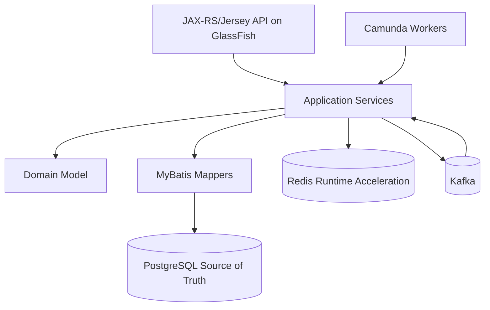
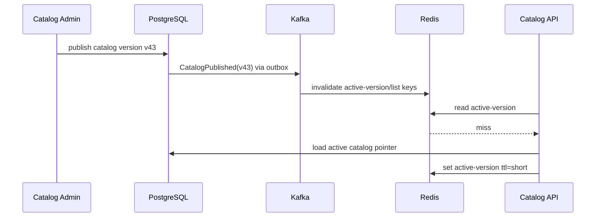
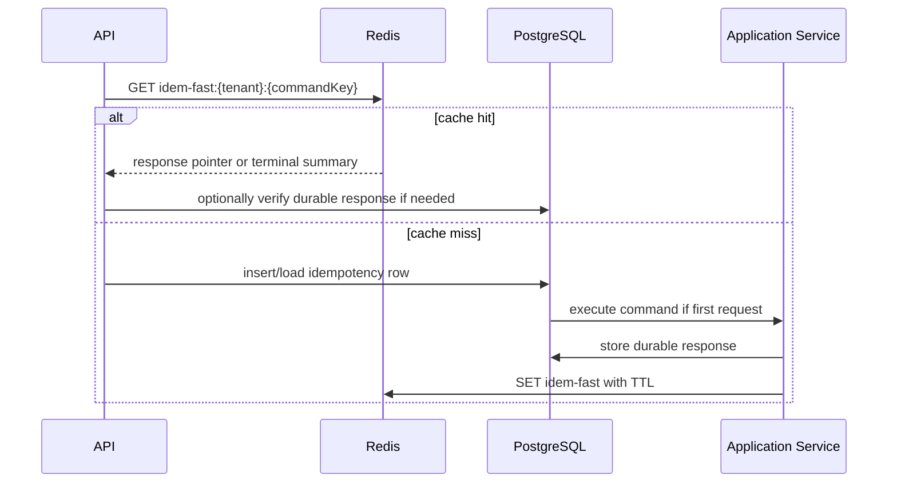

------
title: Build From Scratch: Enterprise Java Microservices CPQ & Order Management Platform - Part 050
description: Mendesain penggunaan Redis untuk CPQ/OMS production-grade: catalog cache, pricing cache, session support, idempotency acceleration, rate limiting, short-lived locks, runtime state, key design, TTL, invalidation, safety boundary, dan failure modes.
series: learn-enterprise-cpq-oms-glassfish-camunda8
seriesTitle: Build From Scratch: Enterprise Java Microservices CPQ & Order Management Platform
order: 50
partTitle: Redis for Cache, Session, and Runtime State
tags:
  - java
  - microservices
  - cpq
  - oms
  - redis
  - cache
  - session
  - rate-limiting
  - idempotency
  - runtime-state
  - postgresql
  - kafka
  - glassfish
  - enterprise-architecture
  - production
date: 2026-07-02
---

# Part 050 — Redis for Cache, Session, and Runtime State

Redis sering dimasukkan ke architecture diagram sebagai kotak kecil bertuliskan **cache**. Di production CPQ/OMS, pemakaian Redis harus jauh lebih disiplin dari itu.

Redis bisa mempercepat sistem. Redis juga bisa membuat sistem salah dengan sangat cepat.

Mental model utama:

> Redis is an acceleration and coordination layer, not the source of business truth.

Dalam sistem kita:

- PostgreSQL menyimpan source of truth transactional.
- Camunda menyimpan workflow execution state.
- Kafka menyebarkan event dan perubahan state.
- Redis mempercepat lookup, mengurangi load, membantu rate limit, menyimpan ephemeral runtime state, dan kadang membantu short-lived coordination.

Redis tidak boleh menjadi tempat utama untuk:

- quote state,
- order state,
- fulfillment state,
- approval decision,
- billing activation evidence,
- asset/subscription source of truth,
- audit trail,
- compensation record.

Kalau data hilang dari Redis dan sistem tidak bisa melanjutkan dengan benar, berarti kita salah menaruh data.

---

## 1. Why Redis Matters in CPQ/OMS

CPQ/OMS memiliki banyak read-heavy path:

- catalog browse,
- product offering lookup,
- configuration rule evaluation,
- pricing lookup,
- promotion eligibility,
- quote search support,
- tenant configuration,
- authorization policy metadata,
- idempotency duplicate checks,
- rate limiting,
- UI wizard state,
- workflow dashboard acceleration.

Tanpa cache, PostgreSQL bisa menjadi bottleneck untuk read path yang sering, terutama catalog/pricing/configuration.

Tetapi dengan cache yang buruk, sistem bisa menjual produk yang sudah expired, memakai price lama, menerima duplicate command, atau menampilkan order state yang salah.

Jadi tujuan kita bukan “pakai Redis”. Tujuannya:

> Pakai Redis hanya untuk data yang bisa direkonstruksi, divalidasi, dibatasi masa hidupnya, dan tidak menjadi satu-satunya bukti bisnis.

---

## 2. Redis Usage Classification

Dalam sistem ini Redis dipakai untuk beberapa kategori.

| Category | Example | Source of truth | TTL | Risk |
|---|---|---|---|---|
| Read cache | product offering, price list | PostgreSQL | medium/long | stale data |
| Computation cache | priced configuration result | PostgreSQL/catalog snapshot | short/medium | wrong price if key bad |
| Idempotency accelerator | recent idempotency key lookup | PostgreSQL idempotency table | short | duplicate if Redis-only |
| Rate limiter | per tenant/API limit | Redis | short | abuse if unavailable |
| Runtime session | admin UI/wizard state | Redis or container session | short | user inconvenience |
| Short-lived lock | cache rebuild lock | Redis | very short | deadlock/false lock |
| Feature/config cache | tenant config, flags | config DB | short | wrong behavior |
| Projection cache | dashboard summary | PostgreSQL/read model | short | stale ops view |

Key principle:

> The more business-critical the data, the more Redis must be backed by durable truth and version checks.

---

## 3. Data Ownership Boundary

Redis should never own business lifecycle.

Bad:

```text
quote:{quoteId}:state = ACCEPTED
order:{orderId}:state = IN_PROGRESS
approval:{approvalCaseId}:decision = APPROVED
```

Better:

```text
catalog-offering:{tenant}:{catalogVersion}:{offeringId} -> cached offering projection
price-list:{tenant}:{priceListVersion}:{priceListId} -> cached price entries
idempotency-fast:{tenant}:{commandKey} -> pointer to durable idempotency row
rate-limit:{tenant}:{api}:{window} -> counter
cache-lock:{tenant}:catalog-rebuild:{catalogVersion} -> short-lived lock
```

Redis can hold **copies**, **pointers**, **counters**, **tokens**, and **short-lived coordination flags**.

It should not hold final truth.

---

## 4. Architecture Position



Important interpretation:

- API can query Redis for read acceleration.
- Application service must still enforce invariants from durable state.
- Worker may use Redis to avoid expensive repeated reads, but must commit results to PostgreSQL.
- Kafka events can trigger cache invalidation.
- Redis unavailable must degrade gracefully where possible.

---

## 5. Redis Is Not a Shortcut Around Domain Rules

Wrong design:

```java
if (redis.get("quote:" + quoteId + ":state").equals("ACCEPTED")) {
    convertQuoteToOrder();
}
```

Correct design:

```java
Quote quote = quoteRepository.loadForUpdate(tenantId, quoteId);
quote.assertConvertible(command.expectedRevision());
```

Redis can help before the command:

```java
CachedQuoteSummary summary = quoteCache.getSummary(tenantId, quoteId);
// useful for UI display, not for final state transition
```

Domain transitions must load durable state.

---

## 6. Key Design Principles

Redis key design is architecture.

A key must encode:

- namespace,
- environment if shared,
- service/bounded context,
- tenant,
- entity type,
- version/snapshot hash,
- identifier,
- purpose.

Pattern:

```text
{system}:{service}:{tenant}:{purpose}:{version}:{id}
```

Example:

```text
cpq:catalog:tenant-a:offering:v42:offer-1001
cpq:pricing:tenant-a:price-list:v19:pl-enterprise-2026
cpq:config:tenant-a:rule-set:v7:bundle-fiber-premium
oms:idempotency:tenant-a:convert-quote:cmd-abc123
oms:rate-limit:tenant-a:POST:/api/v1/orders:202607020930
oms:lock:tenant-a:catalog-warmup:v42
```

Use stable names. Avoid implicit magic.

---

## 7. Versioned Keys

For catalog/pricing/configuration, versioned keys are safer than mutable keys.

Bad:

```text
catalog:tenant-a:offering:offer-1001
```

Problem:

- offering can change,
- price can change,
- rules can change,
- old quote snapshot must still be explainable,
- cache invalidation can miss.

Better:

```text
catalog:tenant-a:offering:v42:offer-1001
pricing:tenant-a:price-list:v19:pl-enterprise
config:tenant-a:rule-set:v7:bundle-fiber-premium
```

Then quote snapshot stores:

```json
{
  "catalogVersion": 42,
  "priceListVersion": 19,
  "configurationRuleSetVersion": 7,
  "configurationHash": "sha256:...",
  "priceHash": "sha256:..."
}
```

This makes cache lookup deterministic.

---

## 8. TTL Policy

Every Redis key category needs a TTL policy.

| Key type | TTL example | Notes |
|---|---:|---|
| catalog offering cache | 1h-24h | versioned keys can live longer |
| active catalog pointer | 1m-5m | must refresh quickly |
| price list cache | 5m-1h | depends on pricing change frequency |
| computed price result | 5m-30m | depends on quote flow |
| idempotency accelerator | 5m-24h | durable table still authoritative |
| rate limit counter | seconds/minutes | window-based |
| lock key | seconds | never long |
| UI wizard/session | minutes-hours | business dependent |
| tenant config | 1m-15m | invalidate on config change |
| dashboard cache | 10s-1m | operational freshness matters |

Avoid keys without TTL unless they are managed by explicit lifecycle and memory planning.

---

## 9. Catalog Cache

Catalog is read-heavy and relatively stable. Redis is useful here.

Cache candidates:

- product offering by ID,
- product offering list by market segment/channel,
- product specification projection,
- characteristic definition,
- relationship graph,
- compatibility rule set,
- active catalog version pointer.

Key examples:

```text
cpq:catalog:{tenant}:active-version
cpq:catalog:{tenant}:offering:{catalogVersion}:{offeringId}
cpq:catalog:{tenant}:offering-list:{catalogVersion}:{market}:{channel}:{customerType}
cpq:catalog:{tenant}:spec:{catalogVersion}:{specId}
cpq:catalog:{tenant}:relationship-graph:{catalogVersion}:{offeringId}
```

Source of truth:

```text
PostgreSQL catalog tables
```

Invalidation sources:

```text
CatalogPublished
CatalogRetired
ProductOfferingChanged
CompatibilityRuleChanged
```

Pattern:



---

## 10. Active Version Pointer vs Versioned Payload

Use different TTLs.

```text
Active pointer:
  cpq:catalog:tenant-a:active-version -> v43
  TTL: short

Versioned payload:
  cpq:catalog:tenant-a:offering:v43:offer-1001 -> payload
  TTL: long
```

Why?

- active pointer changes when publish happens,
- old payload remains useful for old quote/order snapshots,
- cache invalidation does not need to delete every old key immediately,
- memory cleanup can be background/TTL-based.

---

## 11. Configuration Rule Cache

Configuration engine needs fast access to rule graph.

Cache candidates:

```text
rule set by catalog version
allowed options by offering
dependency graph
exclusion graph
defaulting rules
eligibility rules
```

Key example:

```text
cpq:config:{tenant}:rule-graph:{catalogVersion}:{offeringId}:{ruleSetVersion}
```

Cached value should include:

```json
{
  "tenantId": "tenant-a",
  "catalogVersion": 43,
  "offeringId": "offer-fiber-premium",
  "ruleSetVersion": 7,
  "nodes": [],
  "edges": [],
  "constraints": [],
  "hash": "sha256:...",
  "generatedAt": "2026-07-02T09:30:00Z"
}
```

Important:

> Cache the compiled rule graph, not only raw rows.

The compiled graph is expensive to build and safe to cache if versioned.

---

## 12. Pricing Cache

Pricing has higher risk than catalog because stale price has commercial impact.

Cache candidates:

- price list entries by version,
- product offering price by version,
- promotion rules,
- discount policy,
- computed price for exact input hash.

Do not cache a price result under a weak key.

Bad:

```text
price:{offeringId}
```

Better:

```text
cpq:pricing:{tenant}:price-result:{catalogVersion}:{priceListVersion}:{customerSegment}:{currency}:{configurationHash}:{quantity}:{effectiveDate}
```

Input hash should include:

- tenant,
- customer segment,
- account type,
- channel,
- market,
- product offering,
- configuration snapshot,
- quantity,
- term,
- currency,
- effective date,
- price list version,
- promotion context,
- manual override excluded or included explicitly.

Computed price cache is only safe if input identity is exact.

---

## 13. Price Explanation Cache

In CPQ, price explanation matters.

Do not cache only totals.

Cache:

```json
{
  "priceHash": "sha256:...",
  "inputHash": "sha256:...",
  "currency": "IDR",
  "oneTimeTotal": "150000.00",
  "recurringTotal": "299000.00",
  "lines": [],
  "explanation": [],
  "approvalSignals": []
}
```

If cache result is used in quote, persist the price snapshot to PostgreSQL before quote moves forward.

Redis cache result can accelerate price simulation, but quote truth is durable snapshot.

---

## 14. Idempotency Accelerator

Part 023 already established durable idempotency table in PostgreSQL.

Redis can accelerate duplicate checks.

Flow:



Important:

> Redis can be used as a fast path, but PostgreSQL idempotency table remains authoritative.

Never rely on Redis-only idempotency for commands that create orders, submit approvals, activate billing, or start fulfillment.

---

## 15. Idempotency Cache Value

Example:

```json
{
  "tenantId": "tenant-a",
  "commandKey": "convert-quote:cmd-123",
  "requestHash": "sha256:...",
  "durableRecordId": "7ad1...",
  "status": "COMPLETED",
  "responseType": "ORDER_CREATED",
  "responseRef": {
    "orderId": "5ed3...",
    "orderNumber": "ORD-2026-000123"
  },
  "createdAt": "2026-07-02T09:30:00Z"
}
```

If request hash differs for same key:

```text
return 409 IDEMPOTENCY_KEY_REUSED_WITH_DIFFERENT_PAYLOAD
```

Do not allow Redis cache to hide hash conflict.

---

## 16. Rate Limiting

Redis is a good fit for distributed rate limiting because all API nodes can share counters.

Use cases:

- per tenant API quota,
- per user quote simulation quota,
- per API client order creation quota,
- external partner integration quota,
- expensive pricing/configuration endpoint protection,
- admin repair command protection.

Key examples:

```text
oms:rate:{tenant}:{clientId}:POST:/api/v1/orders:202607020930
cpq:rate:{tenant}:{userId}:POST:/api/v1/quotes/price:202607020930
```

Simple fixed window:

```text
INCR key
EXPIRE key 60
reject if value > limit
```

Better production options:

- sliding window,
- token bucket,
- leaky bucket,
- Lua script for atomic multi-step logic,
- separate limit by endpoint cost.

Rate limit response should include:

```text
429 Too Many Requests
Retry-After: <seconds>
X-RateLimit-Limit
X-RateLimit-Remaining
X-RateLimit-Reset
```

---

## 17. Rate Limit Safety

What if Redis is down?

Choose policy per endpoint.

| Endpoint type | Redis down policy |
|---|---|
| quote simulation | fail-open or degraded depending risk |
| create order | usually fail-open if DB guard exists, but monitor |
| admin repair | fail-closed or stricter |
| public partner API | fail-closed or fallback local limiter |
| internal worker | usually bypass rate limiter, use worker concurrency |

Never make one global decision for every endpoint.

---

## 18. Session Support

In stateless API design, server-side session should be minimized.

Preferred:

```text
Bearer token / JWT / opaque token validation
request context derived per request
no business state in HTTP session
```

Where Redis session/runtime state may still help:

- admin console wizard state,
- large UI draft filters,
- temporary import wizard state,
- CSRF/session coordination for web UI,
- short-lived human workflow view preference,
- one-time tokens.

Do not store:

- quote aggregate only in session,
- approval decision only in session,
- order draft only in session without persistence,
- price snapshot only in session.

If user abandons browser, business state must still be recoverable from PostgreSQL.

---

## 19. GlassFish/JAX-RS Boundary

JAX-RS resource should not talk directly to Redis for business decisions.

Better layering:

```text
Resource -> ApplicationService -> CachePort -> RedisAdapter
```

Example port:

```java
public interface CatalogCache {
    Optional<CachedProductOffering> getOffering(
        TenantId tenantId,
        CatalogVersion version,
        ProductOfferingId offeringId
    );

    void putOffering(
        TenantId tenantId,
        CatalogVersion version,
        CachedProductOffering offering,
        Duration ttl
    );

    void evictOffering(
        TenantId tenantId,
        CatalogVersion version,
        ProductOfferingId offeringId
    );
}
```

Resource remains clean:

```java
@Path("/api/v1/product-offerings")
public final class ProductOfferingResource {
    private final CatalogQueryService catalogQueryService;

    @GET
    @Path("/{id}")
    public Response getOffering(@PathParam("id") String id) {
        ProductOfferingResponse response = catalogQueryService.getOffering(id);
        return Response.ok(response).build();
    }
}
```

---

## 20. Cache-Aside Pattern

Basic cache-aside:

```java
public ProductOfferingView getOffering(TenantId tenantId, CatalogVersion version, ProductOfferingId id) {
    return catalogCache.getOffering(tenantId, version, id)
        .orElseGet(() -> {
            ProductOfferingView view = catalogRepository.loadOfferingView(tenantId, version, id);
            catalogCache.putOffering(tenantId, version, view, Duration.ofHours(6));
            return view;
        });
}
```

Risks:

- cache stampede on miss,
- stale data if key not versioned,
- serialization drift,
- large payload memory pressure,
- tenant leakage if key missing tenant.

Mitigations:

- versioned keys,
- short active pointer TTL,
- lock for rebuild,
- background warmup,
- compression for large payload if justified,
- schema version in cached payload.

---

## 21. Cache Stampede Protection

When many requests miss same key, all hit PostgreSQL.

Use short-lived rebuild lock:

```text
SET cpq:lock:tenant-a:offering:v43:offer-1001 <token> NX EX 5
```

If lock acquired:

- load from DB,
- populate cache,
- release lock safely with token check.

If lock not acquired:

- wait small jitter,
- retry cache read,
- fallback to DB with limit,
- return stale value if stale-while-revalidate policy is allowed.

Important:

> Redis lock is not a substitute for database concurrency control.

Use it to reduce duplicate work, not to protect irreversible business state.

---

## 22. Redis Lock Safety

A safe-ish short-lived lock uses:

```text
SET key random-token NX EX seconds
```

Release only if token matches.

Pseudo Lua:

```lua
if redis.call("GET", KEYS[1]) == ARGV[1] then
  return redis.call("DEL", KEYS[1])
else
  return 0
end
```

Use Redis locks only for:

- cache rebuild,
- single-flight expensive computation,
- non-critical scheduled worker coordination,
- avoiding duplicate warmup.

Do not use Redis lock as the only guard for:

- quote-to-order conversion,
- billing activation,
- order cancellation,
- approval decision,
- asset mutation.

Those need PostgreSQL locks/constraints/idempotency.

---

## 23. Redis for Pricing Single-Flight

Pricing simulation can be expensive.

Pattern:

```text
1. Build pricing input hash.
2. Try price-result cache.
3. If miss, acquire pricing-compute lock for that input hash.
4. If acquired, compute price, cache result.
5. If not acquired, wait briefly and retry cache.
6. If still missing, compute with protective limit or return 202 depending endpoint.
```

Key:

```text
cpq:pricing:{tenant}:result:{pricingInputHash}
cpq:lock:{tenant}:pricing:{pricingInputHash}
```

Caution:

> Computed price cache can accelerate simulation, but quote acceptance must persist final price snapshot.

---

## 24. Cache Serialization

Cached value should include schema version.

```json
{
  "cacheSchemaVersion": 3,
  "payloadType": "ProductOfferingView",
  "tenantId": "tenant-a",
  "catalogVersion": 43,
  "payloadHash": "sha256:...",
  "generatedAt": "2026-07-02T09:30:00Z",
  "payload": {
    "id": "offer-1001",
    "name": "Enterprise Fiber Premium"
  }
}
```

Why?

- Java DTO changes over time,
- rolling deployments can read old cache,
- old cache can break deserialization,
- schema version allows safe ignore/refresh.

If cache schema incompatible:

```text
ignore cache -> reload from source -> write new cache
```

---

## 25. Cache Invalidation

There are three primary invalidation models.

### 25.1 TTL-Only

Simple but can serve stale data until TTL expires.

Good for:

- dashboard summary,
- non-critical metadata,
- low-risk UI conveniences.

Bad for:

- active price pointer,
- eligibility rules,
- authorization policy.

### 25.2 Event-Based Invalidation

Kafka event triggers eviction/update.

```text
CatalogPublished -> evict active catalog pointer
PriceListPublished -> evict active price list pointer
TenantConfigChanged -> evict tenant config
```

### 25.3 Versioned Key Strategy

Instead of deleting old keys, publish new version pointer.

```text
active-version -> v44
old payload keys v43 remain until TTL/memory cleanup
```

This is often safest for catalog/pricing.

---

## 26. Cache Invalidation Consumer

Kafka consumer for invalidation should be idempotent.

```java
public final class CacheInvalidationConsumer {
    private final InboxRepository inbox;
    private final CacheInvalidationService invalidation;

    public void onEvent(EventEnvelope envelope) {
        if (!inbox.tryStart(envelope.eventId())) {
            return;
        }

        try {
            invalidation.apply(envelope);
            inbox.markProcessed(envelope.eventId());
        } catch (Exception e) {
            inbox.markFailed(envelope.eventId(), e);
            throw e;
        }
    }
}
```

Even cache invalidation should use inbox if duplicate handling matters.

---

## 27. Tenant Isolation

Every Redis key must include tenant unless data is truly global.

Bad:

```text
price-list:v19:enterprise
```

Better:

```text
cpq:pricing:tenant-a:price-list:v19:enterprise
```

Common tenant leakage risks:

- shared active catalog pointer,
- shared authorization cache,
- shared customer eligibility cache,
- shared pricing result cache missing tenant in input hash,
- shared rate limit key missing client/tenant.

Testing must verify key construction.

---

## 28. Security and PII

Do not casually cache sensitive data.

Avoid caching:

- full customer profile,
- payment details,
- identity documents,
- private contract terms,
- raw approval comments with sensitive content,
- credentials/tokens unless designed as secure token store.

If caching customer/account summary:

- minimize fields,
- set short TTL,
- encrypt if required by platform policy,
- avoid cross-tenant keys,
- ensure deletion/invalidation policy.

Cache is often easier to dump than database in poorly secured environments. Treat it seriously.

---

## 29. Redis for Authorization Metadata

Authorization decisions can be expensive if they combine role, tenant, channel, account ownership, quote owner, approval role, and sales hierarchy.

Cache candidates:

- role permission map,
- tenant policy version,
- sales hierarchy projection,
- permission matrix.

Do not cache final authorization decision for long if entity state can change.

Example key:

```text
authz:{tenant}:policy:{policyVersion}:role:{roleId}
```

For entity decision:

```text
authz-decision:{tenant}:{userId}:{entityType}:{entityId}:{entityVersion}:{action}
TTL: very short
```

Better yet, cache metadata and evaluate decision in application service.

---

## 30. Redis for Workflow Dashboard

Dashboard queries can be expensive:

- stuck orders count,
- fallout by severity,
- worker backlog summary,
- SLA breach risk,
- approval queue counts.

Redis can cache dashboard aggregates with short TTL.

Key examples:

```text
ops:dashboard:{tenant}:fallout-summary:30s
ops:dashboard:{tenant}:approval-queue:{userId}:30s
ops:dashboard:{tenant}:order-sla-risk:30s
```

Rules:

- dashboard cache can be stale but must indicate freshness,
- operator action must reload durable state,
- repair command must not rely on dashboard cache.

---

## 31. Redis and Kafka Lag

Kafka consumers can update Redis projections, but be careful.

Bad:

```text
Kafka event -> Redis only -> UI source of truth
```

Better:

```text
Kafka event -> PostgreSQL projection -> Redis short TTL cache of projection query
```

Why?

- Redis can evict,
- consumer can miss due to bug,
- replay needs durable projection,
- operations need audit/reconciliation.

Use Redis as final hop for acceleration, not sole projection store for critical ops.

---

## 32. Redis Memory Management

Production Redis design needs memory planning.

Things to estimate:

```text
number of tenants
catalog versions retained
offerings per tenant
average offering payload size
price list entries
configuration graph size
computed price result cardinality
idempotency key volume
rate limit key volume
session volume
TTL distribution
maxmemory policy
```

Dangerous patterns:

- caching every search result with unique filter combination,
- caching computed prices without TTL,
- using unbounded tenant/user key cardinality,
- storing large JSON blobs without measuring,
- no max payload size.

Every cache category should have:

- expected cardinality,
- average size,
- max size,
- TTL,
- invalidation method,
- owner,
- fallback behavior.

---

## 33. Cache Payload Size Policy

Set payload limits.

Example policy:

```text
single offering cache <= 128 KB
configuration graph <= 1 MB
price result <= 64 KB
dashboard summary <= 32 KB
session value <= 64 KB
```

If bigger:

- split payload,
- compress carefully,
- cache only IDs/summary,
- store durable projection in PostgreSQL,
- rethink query model.

Redis is fast partly because it is memory-based. Do not treat it like object storage.

---

## 34. Redis Client Boundary in Java

Define adapter, not direct Redis calls scattered everywhere.

```java
public interface RuntimeCache {
    <T> Optional<T> get(CacheKey key, Class<T> type);
    void set(CacheKey key, Object value, Duration ttl);
    void delete(CacheKey key);
    boolean setIfAbsent(CacheKey key, String token, Duration ttl);
    boolean deleteIfTokenMatches(CacheKey key, String token);
}
```

Application-level cache port should be more specific:

```java
public interface PricingResultCache {
    Optional<PricingResult> get(PricingInputHash hash);
    void put(PricingInputHash hash, PricingResult result, Duration ttl);
}
```

Do not expose raw Redis commands to domain service.

---

## 35. Cache Key as Value Object

Avoid manual string concatenation everywhere.

```java
public record CacheKey(String value) {
    public static CacheKey productOffering(
        TenantId tenantId,
        CatalogVersion catalogVersion,
        ProductOfferingId offeringId
    ) {
        return new CacheKey(
            "cpq:catalog:%s:offering:%s:%s".formatted(
                tenantId.value(),
                catalogVersion.value(),
                offeringId.value()
            )
        );
    }
}
```

Tests:

```java
@Test
void productOfferingKeyMustIncludeTenantAndVersion() {
    CacheKey key = CacheKey.productOffering(
        TenantId.of("tenant-a"),
        CatalogVersion.of(43),
        ProductOfferingId.of("offer-1001")
    );

    assertThat(key.value())
        .isEqualTo("cpq:catalog:tenant-a:offering:43:offer-1001");
}
```

This prevents cross-tenant and stale-version bugs.

---

## 36. Failure Mode: Redis Down

Every Redis usage must declare behavior when Redis is unavailable.

| Use case | Fallback |
|---|---|
| catalog cache | load from PostgreSQL |
| pricing cache | compute from PostgreSQL/catalog data |
| configuration graph cache | rebuild from PostgreSQL |
| idempotency accelerator | use PostgreSQL idempotency table |
| rate limiter | endpoint-specific fail-open/fail-closed |
| dashboard cache | query PostgreSQL projection |
| session | user may need re-login/retry |
| cache rebuild lock | proceed with DB guard or skip warmup |

If Redis down can cause wrong order state, wrong billing, or lost audit, design is wrong.

---

## 37. Failure Mode: Stale Cache

Stale cache can happen because:

- invalidation event lost or delayed,
- consumer lag,
- TTL too long,
- version pointer stale,
- deployment reads old cache schema,
- manual DB repair bypassed event.

Mitigation:

- versioned keys for catalog/pricing,
- short TTL for active pointers,
- cache schema version,
- Kafka invalidation with inbox,
- rebuild command,
- admin cache purge endpoint,
- metrics for cache age.

For quote/order command, always validate durable snapshot before final transition.

---

## 38. Failure Mode: Cache Stampede

Symptoms:

- Redis restart causes DB spike,
- catalog API latency jumps,
- pricing simulation overwhelms DB,
- repeated cache misses for same key.

Mitigation:

- single-flight lock,
- jittered TTL,
- cache warmup,
- stale-while-revalidate where safe,
- negative caching for not found with short TTL,
- bulk preload for active catalog.

Jittered TTL example:

```java
Duration base = Duration.ofMinutes(30);
Duration jitter = Duration.ofSeconds(ThreadLocalRandom.current().nextInt(0, 300));
Duration ttl = base.plus(jitter);
```

---

## 39. Negative Caching

For repeated missing lookups:

```text
product offering not found
invalid promotion code
missing tenant config
```

Cache negative result briefly.

Key:

```text
cpq:catalog:{tenant}:offering-not-found:{catalogVersion}:{offeringId}
TTL: 30s-2m
```

Caution:

- keep TTL short,
- do not negative-cache authorization denial too broadly,
- invalidate on catalog publish/config change.

---

## 40. Redis for Import/Wizard Runtime State

Catalog import, quote wizard, or admin repair wizard may need temporary state.

Example key:

```text
admin:wizard:{tenant}:{userId}:{wizardId}
```

Value:

```json
{
  "wizardType": "CATALOG_IMPORT",
  "currentStep": "VALIDATE_FILE",
  "uploadedFileRef": "object-store-ref",
  "validationSummary": {},
  "createdAt": "2026-07-02T09:30:00Z",
  "expiresAt": "2026-07-02T11:30:00Z"
}
```

Rules:

- file contents should be in object storage/durable storage, not Redis if large,
- final import result must be durable,
- Redis wizard state can expire without corrupting business state,
- user can restart wizard if needed.

---

## 41. Redis for Short-Lived OTP/Token

Possible use:

- one-time approval confirmation token,
- email verification token,
- admin action confirmation token.

Key:

```text
token:{tenant}:{purpose}:{tokenHash}
```

Rules:

- store token hash, not raw token,
- short TTL,
- single use via atomic delete/check,
- durable audit after token consumed,
- do not use for high-risk financial approval without stronger control.

---

## 42. Redis for External System Throttling

Adapters may need rate limits per external system.

Example:

```text
adapter-rate:{tenant}:billing-core:activate-billing:202607020930
adapter-rate:{tenant}:inventory:reserve-resource:202607020930
```

Why:

- protect external systems,
- avoid getting blocked,
- smooth worker bursts,
- preserve SLA for high-priority orders.

Worker should combine:

- Camunda worker concurrency,
- adapter rate limiter,
- retry/backoff,
- circuit breaker.

---

## 43. Redis and Circuit Breaker State

Circuit breaker state can be in-memory per instance or shared. Redis can support shared state, but be careful.

Shared circuit breaker can prevent all nodes from hammering a failed dependency.

Key:

```text
circuit:{externalSystem}:{operation}
```

Value:

```json
{
  "state": "OPEN",
  "openedAt": "2026-07-02T09:30:00Z",
  "reopenAfter": "2026-07-02T09:35:00Z",
  "failureRate": 0.87
}
```

Caution:

- stale open circuit can block recovery,
- Redis outage should not permanently block all calls,
- operational override may be needed.

---

## 44. Observability for Redis Usage

Expose metrics:

```text
redis_cache_hit_total{cache_name}
redis_cache_miss_total{cache_name}
redis_cache_error_total{operation}
redis_cache_load_duration_ms{cache_name}
redis_lock_acquired_total{lock_name}
redis_lock_contention_total{lock_name}
redis_rate_limited_total{tenant,endpoint}
redis_key_evicted_total
redis_command_latency_ms{command}
redis_pool_wait_ms
```

Business-facing metrics:

- catalog cache hit ratio,
- pricing cache hit ratio,
- configuration graph rebuild count,
- idempotency fast-path hit count,
- rate limit rejection by tenant/client,
- stale cache detection count,
- cache invalidation lag.

---

## 45. Cache Freshness in API Response

For operational/admin endpoints, expose freshness metadata when helpful.

Example:

```json
{
  "data": [],
  "meta": {
    "source": "CACHE",
    "generatedAt": "2026-07-02T09:30:00Z",
    "maxAgeSeconds": 30,
    "projectionLagSeconds": 12
  }
}
```

Do not expose this for every public API if it creates noise, but operational dashboards benefit from it.

---

## 46. Testing Redis Integration

### 46.1 Key Construction Tests

Verify:

- tenant included,
- version included,
- environment namespace if applicable,
- no PII in key,
- stable formatting.

### 46.2 Cache Hit/Miss Tests

Verify:

- hit returns cached object,
- miss loads from repository,
- loaded value is cached,
- incompatible schema is ignored,
- null/negative cache behavior.

### 46.3 Redis Down Tests

Simulate Redis unavailable.

Assert:

- catalog loads from DB,
- pricing computes from DB,
- idempotency falls back to PostgreSQL,
- rate limiter follows endpoint policy,
- no business transition trusts missing cache.

### 46.4 Stale Cache Tests

Simulate active catalog version change.

Assert:

- new quote uses new active version,
- old quote snapshot remains explainable,
- cached old version does not corrupt new price.

### 46.5 Lock Tests

Assert:

- only one node rebuilds expensive key,
- lock expires,
- lock release checks token,
- business state does not depend on lock.

---

## 47. Redis Operational Runbook

Common incidents:

### 47.1 Redis Unavailable

Actions:

1. Check if API is degrading or failing.
2. Confirm DB fallback works.
3. Monitor PostgreSQL load spike.
4. Reduce expensive endpoints if needed.
5. Disable non-critical cache warmup.
6. Restore Redis.
7. Warm critical catalog/price keys gradually.

### 47.2 Cache Stampede

Actions:

1. Identify hot missing keys.
2. Enable/verify single-flight lock.
3. Warm active catalog/pricing keys.
4. Increase jitter.
5. Check invalidation storm.

### 47.3 Wrong Cached Price Suspected

Actions:

1. Compare quote persisted price snapshot vs pricing recomputation.
2. Check pricing input hash.
3. Check price list version.
4. Purge affected computed price keys.
5. Do not mutate accepted quotes without revision/repair policy.

### 47.4 Cross-Tenant Data Suspected

Actions:

1. Disable affected cache category.
2. Purge keys.
3. inspect key construction code.
4. Run tenant-isolation tests.
5. Audit exposed responses.

---

## 48. Anti-Patterns

### 48.1 Redis as Database

If deleting Redis deletes business truth, the design is wrong.

### 48.2 Unversioned Catalog Cache

Serving old product rules after publish causes invalid quotes.

### 48.3 Weak Pricing Cache Key

If price key ignores customer segment, channel, term, currency, or config hash, it will eventually return wrong price.

### 48.4 Redis-Only Idempotency

Redis eviction can allow duplicate order creation.

### 48.5 Lock for Business Correctness

Redis lock alone cannot protect quote-to-order conversion. Use PostgreSQL constraints/idempotency.

### 48.6 No TTL

Unbounded keys become memory leaks.

### 48.7 Cache Without Ownership

Every cache needs an owner who knows invalidation, TTL, fallback, and repair.

---

## 49. Production Checklist

Before accepting Redis usage, answer:

```text
What is the source of truth?
Can the value be rebuilt?
What is the TTL?
What is the key shape?
Does key include tenant?
Does key include version/snapshot hash?
What happens if Redis is down?
What happens if value is stale?
How is it invalidated?
How is payload schema versioned?
What is the maximum payload size?
What is expected cardinality?
Is PII stored?
Can this cache create wrong business state?
What metrics exist?
What runbook exists?
```

If these are not answered, Redis integration is not production-grade.

---

## 50. Implementation Milestone

For the build-from-scratch platform:

### Milestone 1 — Redis Abstraction

- Redis adapter module,
- typed cache ports,
- key value objects,
- JSON serialization with schema version.

### Milestone 2 — Catalog Cache

- active catalog pointer,
- offering cache,
- relationship graph cache,
- invalidation on catalog publish.

### Milestone 3 — Pricing Cache

- price list cache,
- computed price result cache,
- input hash,
- single-flight compute lock.

### Milestone 4 — Idempotency Accelerator

- Redis fast path,
- PostgreSQL authoritative fallback,
- request hash conflict handling.

### Milestone 5 — Rate Limiter

- tenant/client endpoint limit,
- 429 response,
- fail-open/fail-closed policy.

### Milestone 6 — Ops Dashboard Cache

- short TTL summaries,
- freshness metadata,
- safe fallback to PostgreSQL projection.

---

## 51. Summary

Redis is valuable in CPQ/OMS because catalog, pricing, configuration, and operational views are read-heavy and sometimes expensive.

But Redis must stay within its safety boundary:

```text
Good Redis usage:
  copies
  pointers
  counters
  short-lived tokens
  short-lived locks
  computed results with exact input hash
  dashboard acceleration

Bad Redis usage:
  source of quote truth
  source of order truth
  approval evidence
  billing evidence
  asset lifecycle
  audit trail
  compensation state
```

The production-grade rule:

> Redis may make correct behavior faster. Redis must not be required for correctness.

If Redis disappears, the system can be slower, stricter, or degraded. It must not become wrong.

---

## 52. References

- Redis Docs — SET command and `NX`/`EX` options: `https://redis.io/docs/latest/commands/set/`
- Redis Docs — Distributed locks with Redis: `https://redis.io/docs/latest/develop/clients/patterns/distributed-locks/`
- Redis Docs — Rate limiter use case: `https://redis.io/docs/latest/develop/use-cases/rate-limiter/`
- PostgreSQL Docs — Transactions and isolation: `https://www.postgresql.org/docs/current/transaction-iso.html`
- Kafka Documentation — Events and topics: `https://kafka.apache.org/documentation/`

---

## 53. What Comes Next

Part berikutnya masuk ke cache coherency dan staleness control.

Di Part 050 kita menentukan Redis boleh dipakai untuk apa.

Di Part 051 kita akan membahas:

- TTL strategy,
- versioned key strategy,
- event-based invalidation,
- stale-while-revalidate,
- cache stampede,
- distributed invalidation,
- consistency between PostgreSQL, Kafka, and Redis,
- and how to prevent cache from becoming a silent correctness bug.
