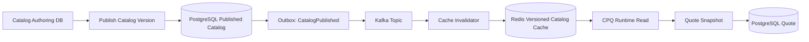
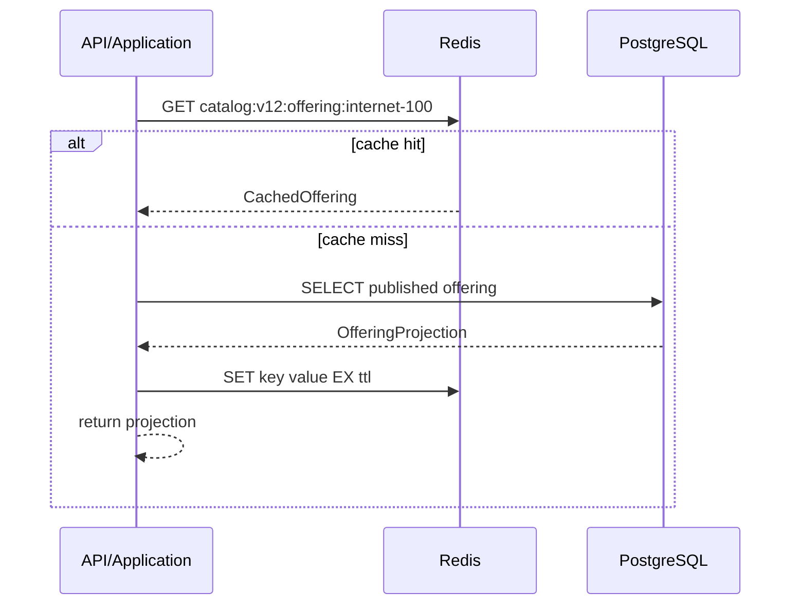
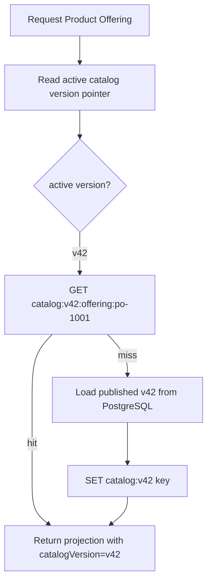
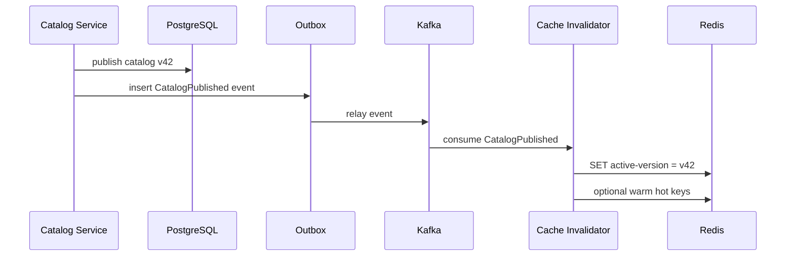
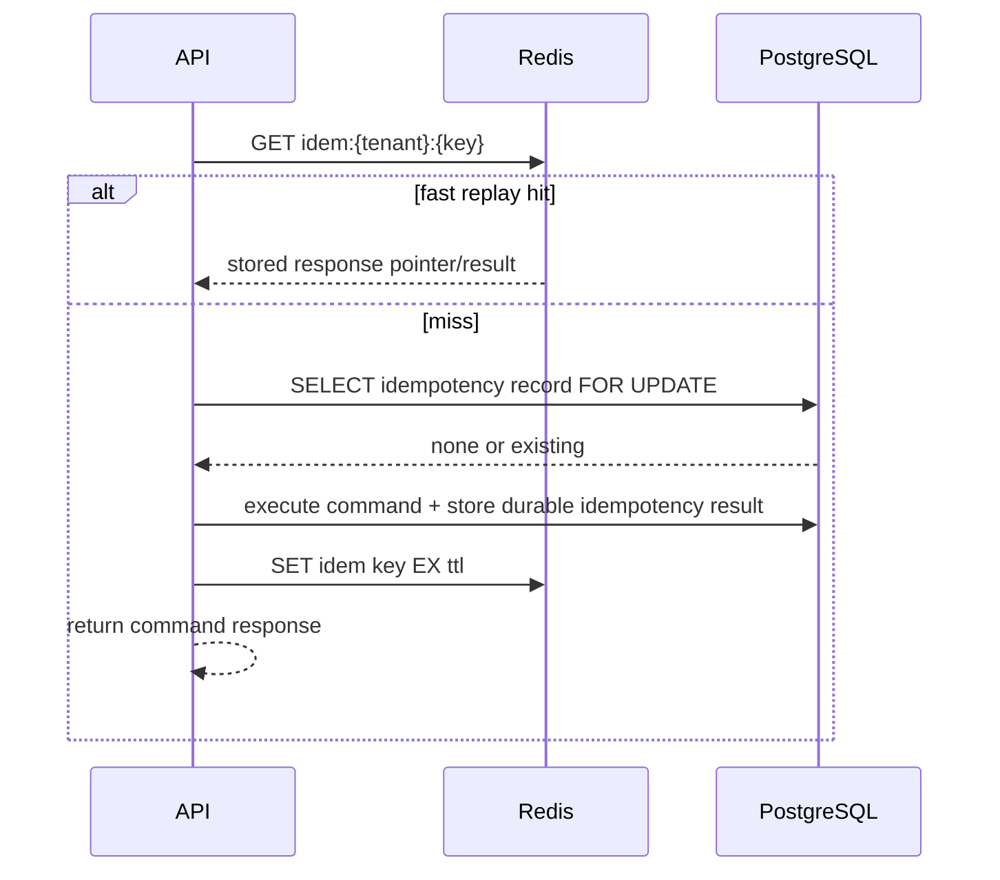

------
title: Build From Scratch: Enterprise Java Microservices CPQ & Order Management Platform - Part 051
description: Cache coherency, staleness control, invalidation strategy, TTL policy, versioned Redis keys, and production-safe caching for enterprise CPQ/OMS.
series: learn-enterprise-cpq-oms-glassfish-camunda8
seriesTitle: Build From Scratch: Enterprise Java Microservices CPQ & Order Management Platform
order: 51
partTitle: Cache Coherency and Staleness Control
tags:
  - java
  - microservices
  - cpq
  - oms
  - redis
  - caching
  - consistency
  - kafka
  - postgresql
  - architecture
date: 2026-07-02
---

# Part 051 — Cache Coherency and Staleness Control

Pada part sebelumnya Redis diposisikan sebagai **acceleration layer**: cepat, dekat dengan runtime, dan cocok untuk data yang boleh hilang atau dihitung ulang. Di part ini kita membahas masalah yang lebih berbahaya: **bagaimana memastikan cache tidak membuat sistem CPQ/OMS mengambil keputusan bisnis yang salah**.

Di sistem enterprise, cache bug jarang terlihat sebagai exception. Ia lebih sering muncul sebagai:

- quote memakai harga lama;
- konfigurasi produk terlihat valid padahal rule sudah berubah;
- eligibility customer memakai status segment lama;
- order decomposition memakai mapping catalog yang tidak lagi aktif;
- approval dilewati karena price override signal berasal dari cache stale;
- dashboard operational terlihat normal padahal order sudah masuk fallout;
- tenant A membaca key tenant B karena key design buruk.

Cache yang salah bukan sekadar performance issue. Dalam CPQ/OMS, cache yang salah bisa menjadi **commercial, legal, operational, dan audit issue**.

Prinsip utama part ini:

> Cache boleh mempercepat pembacaan. Cache tidak boleh menjadi satu-satunya alasan sistem menerima keputusan bisnis yang tidak bisa dipertahankan.

---

## 1. Mental Model: Cache Is a Promise With Expiry

Cache sering dipikirkan sebagai “copy data yang lebih cepat”. Itu terlalu dangkal.

Model yang lebih tepat:

> Cache adalah janji sementara bahwa sebuah representasi data masih cukup benar untuk dipakai dalam konteks tertentu.

Kata pentingnya adalah **cukup benar**.

Tidak semua staleness sama. Data catalog yang terlambat 30 detik mungkin aman untuk browsing product list. Tetapi harga yang dipakai untuk final quote submission mungkin harus diverifikasi ulang terhadap source of truth. Order state yang dipakai untuk manual repair tidak boleh stale sama sekali.

Maka desain cache harus menjawab empat pertanyaan:

1. **Apa data yang disimpan?**
2. **Untuk keputusan apa data itu dipakai?**
3. **Berapa lama data boleh stale?**
4. **Apa guardrail saat data stale tetap terbaca?**

Kalau pertanyaan nomor 2 tidak jelas, jangan cache dulu.

---

## 2. Source of Truth vs Acceleration Copy

Untuk seri ini, source of truth tetap:

- PostgreSQL untuk aggregate, reference state, outbox/inbox, idempotency durable, audit, dan operational repair;
- Camunda/Zeebe untuk execution position process instance, job, timer, dan incident runtime;
- Kafka untuk distributed event log dan integration event propagation;
- external system untuk state yang memang dimiliki oleh external system, misalnya payment gateway atau provisioning platform.

Redis bukan source of truth untuk:

- quote state;
- order state;
- approval decision;
- fulfillment task final status;
- billing activation final status;
- payment final status;
- audit evidence;
- catalog publication authority;
- customer asset state.

Redis boleh menjadi acceleration copy untuk:

- published catalog projection;
- active price list projection;
- configuration rule graph;
- eligibility lookup result dengan TTL pendek;
- idempotency fast-path yang juga punya durable PostgreSQL record;
- rate limit counter;
- short-lived wizard/session state;
- expensive read projection yang bisa dibangun ulang;
- feature flag snapshot dengan version guard.

Boundary-nya sederhana:

> Jika kehilangan Redis membuat data bisnis hilang permanen, desainnya salah.

---

## 3. Cache Coherency Problem in CPQ/OMS

Cache coherency adalah kondisi ketika beberapa copy dari data yang sama tetap konsisten secara memadai untuk keputusan yang sedang dilakukan.

Dalam CPQ/OMS, copy data bisa tersebar di:

- PostgreSQL table;
- Redis key;
- in-memory Java object;
- browser state;
- Kafka event payload;
- Camunda process variable;
- external integration cache;
- reporting projection;
- document snapshot.

Tidak realistis membuat semua copy selalu strongly consistent. Tetapi kita bisa membuat desain yang jelas tentang **kapan strong validation dibutuhkan dan kapan eventual consistency cukup**.

Contoh:

- Product catalog browsing boleh eventually consistent.
- Quote draft editing boleh memakai cached rule graph, selama submit melakukan revalidation.
- Quote acceptance harus memakai immutable quote snapshot yang sudah approved/valid.
- Order fulfillment harus memakai fulfillment plan snapshot yang tersimpan durable.
- Manual repair harus membaca state terbaru dari PostgreSQL, bukan Redis.



Cache boleh mempercepat runtime read. Tetapi quote snapshot yang akhirnya dipakai untuk submit/approval/order conversion harus disimpan durable di PostgreSQL.

---

## 4. Staleness Taxonomy

Kita perlu bahasa yang tegas untuk membahas stale data.

### 4.1 Harmless Staleness

Staleness yang tidak mempengaruhi keputusan bisnis final.

Contoh:

- product list page menampilkan product offering yang baru dinonaktifkan beberapa detik lalu;
- dashboard count terlambat 15 detik;
- non-critical recommendation masih memakai cache lama.

Mitigasi:

- TTL;
- refresh interval;
- UI hint;
- eventual update.

### 4.2 Recoverable Staleness

Staleness bisa menyebabkan command ditolak saat final validation.

Contoh:

- sales user mengkonfigurasi product memakai rule lama;
- saat submit quote, backend menemukan configuration hash tidak lagi cocok dengan active catalog version;
- sistem menolak submit dengan error `CATALOG_VERSION_STALE` dan meminta reprice/revalidate.

Mitigasi:

- version hash;
- final validation;
- deterministic rejection;
- user-visible remediation.

### 4.3 Dangerous Staleness

Staleness bisa membuat sistem menerima keputusan yang salah jika tidak dicegah.

Contoh:

- discount approval threshold berubah, tapi pricing engine memakai cached threshold lama dan approval dilewati;
- customer eligibility berubah menjadi suspended, tapi quote tetap accepted;
- fulfillment mapping berubah, tapi order decomposition memakai template lama tanpa snapshot.

Mitigasi:

- cache version guard;
- revalidation before state transition;
- no-cache for final authority;
- immutable snapshot after approval;
- audit evidence.

### 4.4 Illegal Staleness

Staleness tidak boleh terjadi untuk operasi tersebut.

Contoh:

- manual repair membaca order state dari cache;
- payment callback dedupe hanya disimpan di Redis;
- approval decision evidence hanya berada di cache;
- order completion update memakai stale version tanpa optimistic lock.

Mitigasi:

- bypass cache;
- read from PostgreSQL with transaction;
- optimistic lock;
- durable idempotency;
- audit trail.

---

## 5. Cache Domain Matrix

Tidak semua data punya policy yang sama.

| Cache Domain | Example | Staleness Budget | Final Guard | Recommended Strategy |
|---|---:|---:|---|---|
| Published catalog browsing | product offering list | seconds-minutes | selected offering validated on quote item add | cache-aside + versioned key |
| Configuration rule graph | allowed options, dependencies | seconds-minutes | configuration hash checked on submit | versioned key + catalog version |
| Price list projection | active price entries | seconds | reprice before submit/accept | versioned key + price version |
| Price calculation result | simulation output | very short | price hash and quote snapshot | short TTL, input hash key |
| Eligibility result | customer segment, product eligibility | short | recheck on submit/accept | short TTL + source timestamp |
| Quote read summary | worklist card | seconds | detail loads from DB | projection cache optional |
| Order operational dashboard | status counts | seconds | repair reads DB | projection cache optional |
| Idempotency fast path | request hash to result pointer | minutes-hours | PostgreSQL idempotency table | Redis accelerator only |
| Rate limiting | request counter | window duration | not business authority | Redis counter |
| Workflow variable snapshot | process display helper | avoid if possible | workflow_ref + DB state | prefer PostgreSQL projection |
| Audit | approval evidence | none | audit log only | never cache as authority |

The important observation: **final guards live outside Redis**.

Redis can make the common path fast. PostgreSQL and domain invariants make the path defensible.

---

## 6. Cache Pattern Selection

### 6.1 Cache-Aside

Application checks cache. On miss, application loads from source of truth, then writes cache.

Good for:

- catalog projection;
- price list projection;
- configuration graph;
- read-only reference data.

Risk:

- cache stampede;
- stale value after write;
- inconsistent TTL choices.

Baseline flow:



### 6.2 Write-Through

Application writes DB and cache in the same logical operation.

For this system, avoid using write-through for business state unless the cache update is best-effort and recoverable. PostgreSQL transaction and Redis write are not one atomic transaction in the architecture we are building. Treat write-through as an optimization, not correctness.

### 6.3 Write-Behind

Application writes cache first, then DB later.

Avoid for CPQ/OMS command state. This is usually wrong for quote/order/approval/fulfillment because crash after cache write but before DB write causes state loss or false state.

### 6.4 Refresh-Ahead

System refreshes hot cache keys before expiry.

Good for:

- large catalog projections;
- price lists used heavily by sales traffic;
- rule graph for popular product families.

Risk:

- wasted refresh;
- stampede moved from request path to scheduler;
- refresh based on stale version.

### 6.5 Versioned Key Cache

Instead of mutating the same key, include data version in the key.

Example:

```text
cpq:{tenant}:catalog:v2026-07-02-17:offering:{offeringId}
cpq:{tenant}:price-list:v84:offering:{offeringId}:currency:{currency}
cpq:{tenant}:config-rules:v391:family:{familyCode}
```

Benefit:

- old data becomes unreachable after version pointer changes;
- invalidation does not need to delete every old key immediately;
- quote can record the exact version used;
- stale cache becomes detectable.

Cost:

- more keys;
- need cleanup policy;
- version pointer must be authoritative.

For enterprise CPQ/OMS, versioned keys are often safer than delete-based invalidation.

---

## 7. Key Design

A Redis key should encode the safety boundary.

Recommended shape:

```text
{system}:{tenant}:{domain}:{version}:{entityType}:{entityId}:{projection}:{formatVersion}
```

Example:

```text
cpq:tnt-001:catalog:v42:offering:po-1001:detail:f1
cpq:tnt-001:pricing:plv-87:offering:po-1001:USD:f2
cpq:tnt-001:config:rules-v391:family:FIBER-BROADBAND:graph:f3
oms:tnt-001:dashboard:v15:order-status-counts:f1
```

Mandatory dimensions:

- tenant;
- domain;
- version or source timestamp;
- entity identity;
- projection type;
- format version.

Do not use keys like:

```text
offering:po-1001
price:po-1001
order:123
user-session
```

Those keys hide tenant, source version, projection shape, and format version. Hidden boundary becomes future incident.

---

## 8. TTL Policy

TTL is not a magic consistency tool. TTL is only a maximum lifetime.

Redis supports key expiration through commands like `EXPIRE`, and keys with associated timeouts are automatically deleted after the timeout elapses. Redis `TTL` can reveal whether a key does not exist, has no expiry, or has remaining lifetime.

Design TTL based on **decision risk**, not on arbitrary round numbers.

### 8.1 TTL Classes

| TTL Class | Example | Suggested Range | Notes |
|---|---:|---:|---|
| Ultra-short | pricing simulation result | 10s-2m | input hash based |
| Short | eligibility result | 1m-10m | revalidate on final command |
| Medium | catalog detail projection | 5m-60m | versioned key preferred |
| Long | static reference label | hours-days | still include format version |
| Windowed | rate limit counter | exact window | expiry is part of logic |
| No TTL, versioned cleanup | published catalog version pointer | managed carefully | monitor orphaned keys |

A key without TTL is acceptable only when:

- it is versioned;
- it is not source of truth;
- cleanup exists;
- memory growth is monitored.

### 8.2 TTL Jitter

If many keys expire at the same time, traffic can stampede the database.

Add jitter:

```java
public final class TtlPolicy {
    private final Duration base;
    private final Duration jitter;

    public Duration nextTtl() {
        long maxJitterMillis = jitter.toMillis();
        long randomJitter = ThreadLocalRandom.current().nextLong(0, maxJitterMillis + 1);
        return base.plusMillis(randomJitter);
    }
}
```

Example:

```text
base TTL = 10 minutes
jitter = 2 minutes
actual TTL = 10-12 minutes
```

This reduces synchronized expiry.

---

## 9. Version Pointer Pattern

For high-value reference data, use a small key that points to active version.

```text
cpq:tnt-001:catalog:active-version -> v42
cpq:tnt-001:pricing:active-version -> plv-87
cpq:tnt-001:config-rules:active-version -> rules-v391
```

Then actual payload keys include the version:

```text
cpq:tnt-001:catalog:v42:offering:po-1001:detail:f1
cpq:tnt-001:catalog:v41:offering:po-1001:detail:f1
```

Switching from v41 to v42 can be atomic at pointer level. Old keys become unreachable by normal reads but remain available briefly for:

- in-flight quote draft display;
- diagnostics;
- comparison;
- rollback window.



Critical rule:

> The response must carry the version used.

Without version in the response, downstream validation cannot detect stale decisions.

---

## 10. Cache Invalidation Strategies

### 10.1 TTL-Only Invalidation

Simplest strategy: cache expires naturally.

Good for:

- low-risk reference display;
- dashboard summaries;
- rarely changing non-critical data.

Bad for:

- price list updates;
- product activation/deactivation;
- approval thresholds;
- eligibility rules.

TTL-only means the system knowingly accepts stale data until expiry.

### 10.2 Explicit Delete

When source changes, delete known keys.

Problem: in enterprise domain, a single catalog publish can affect thousands of keys. Delete storms are operationally risky.

Use explicit delete for small, well-known key sets:

- active version pointer;
- one customer eligibility key;
- one quote read summary;
- one dashboard projection.

Avoid bulk delete by pattern in request path.

### 10.3 Event-Based Invalidation

Source service emits event, cache invalidator consumes event and updates/deletes keys.



This is good, but remember: event delivery is not instantaneous. Consumers can lag. Therefore final command validation must still check version.

### 10.4 Versioned Invalidation

Preferred for catalog/pricing/config rules:

- publish new version in PostgreSQL;
- emit event;
- update active version pointer;
- stop reading old version for new operations;
- let old keys expire/cleanup later.

This avoids massive delete operations and gives better auditability.

---

## 11. Cache-Aware Domain Validation

Cache safety must appear in command validation.

Example: submit quote.

The quote draft contains:

```json
{
  "quoteId": "q-1001",
  "catalogVersion": "v42",
  "priceListVersion": "plv-87",
  "configurationHash": "cfgsha256:abc",
  "priceHash": "pricesha256:def"
}
```

At `submitQuote`, application checks:

1. Quote is in `DRAFT` or `CONFIGURED` state.
2. Quote version matches optimistic lock.
3. Catalog version is still acceptable.
4. Price list version is still acceptable or requires reprice.
5. Configuration hash matches current evaluation result.
6. Price hash matches current pricing result.
7. Approval signals are recalculated if policy version changed.

If stale:

```json
{
  "type": "https://example.com/problems/stale-quote-pricing",
  "title": "Quote pricing is stale",
  "status": 409,
  "code": "QUOTE_PRICING_STALE",
  "detail": "The quote was priced with priceListVersion plv-87, but plv-88 is now active.",
  "remediation": "Reprice the quote before submission."
}
```

The important part is not the exact JSON. The important part is deterministic rejection.

---

## 12. Java Cache Key and Policy Model

Do not scatter string concatenation across services.

Create a small cache model.

```java
public record CacheKey(
        String system,
        String tenantId,
        String domain,
        String version,
        String entityType,
        String entityId,
        String projection,
        String formatVersion
) {
    public String value() {
        return String.join(":",
                system,
                tenantId,
                domain,
                version,
                entityType,
                entityId,
                projection,
                formatVersion
        );
    }
}
```

Example factory:

```java
public final class CatalogCacheKeys {
    private CatalogCacheKeys() {}

    public static CacheKey offeringDetail(
            String tenantId,
            String catalogVersion,
            String offeringId
    ) {
        return new CacheKey(
                "cpq",
                tenantId,
                "catalog",
                catalogVersion,
                "offering",
                offeringId,
                "detail",
                "f1"
        );
    }
}
```

Policy object:

```java
public record CachePolicy(
        Duration ttl,
        Duration jitter,
        boolean allowStaleRead,
        boolean versionGuardRequired
) {
    public Duration effectiveTtl() {
        long jitterMillis = jitter.toMillis();
        if (jitterMillis <= 0) return ttl;
        long extra = ThreadLocalRandom.current().nextLong(jitterMillis + 1);
        return ttl.plusMillis(extra);
    }
}
```

This makes cache behavior visible and testable.

---

## 13. Cache-Aside Implementation Sketch

```java
public final class CatalogProjectionCache {
    private final RedisClient redis;
    private final CatalogProjectionRepository repository;
    private final JsonCodec json;
    private final CachePolicy policy;

    public OfferingProjection getOfferingDetail(
            RequestContext ctx,
            String catalogVersion,
            String offeringId
    ) {
        CacheKey key = CatalogCacheKeys.offeringDetail(
                ctx.tenantId(),
                catalogVersion,
                offeringId
        );

        String cached = redis.get(key.value());
        if (cached != null) {
            OfferingProjection projection = json.decode(cached, OfferingProjection.class);
            ensureVersion(projection, catalogVersion);
            return projection;
        }

        OfferingProjection projection = repository.loadPublishedOffering(
                ctx.tenantId(),
                catalogVersion,
                offeringId
        );

        redis.set(
                key.value(),
                json.encode(projection),
                policy.effectiveTtl()
        );

        return projection;
    }

    private void ensureVersion(OfferingProjection projection, String expectedVersion) {
        if (!expectedVersion.equals(projection.catalogVersion())) {
            throw new CacheCorruptionException("Catalog cache returned wrong version");
        }
    }
}
```

Notice the defensive check. It should be impossible for a versioned key to return the wrong version, but if it happens, treat it as cache corruption.

---

## 14. Cache Stampede Control

Cache stampede happens when many requests miss at once and all hit PostgreSQL or an external system.

Typical causes:

- synchronized TTL;
- deployment clears local/in-memory cache;
- Redis restart;
- catalog publish invalidates hot keys;
- popular product family starts receiving sales traffic.

Mitigation options:

### 14.1 TTL Jitter

Already covered. Cheap and useful.

### 14.2 Single-Flight Per Key

Only one request recomputes the missing value, others wait briefly or receive stale safe value.

Pseudo-design:

```java
public final class SingleFlightCacheLoader<K, V> {
    private final ConcurrentHashMap<K, CompletableFuture<V>> inFlight = new ConcurrentHashMap<>();

    public V load(K key, Supplier<V> loader) {
        CompletableFuture<V> future = inFlight.computeIfAbsent(key, ignored ->
                CompletableFuture.supplyAsync(loader)
                        .whenComplete((v, t) -> inFlight.remove(key))
        );
        return future.join();
    }
}
```

This protects one JVM. For cluster-wide protection, use short Redis locks carefully, but do not make distributed lock correctness mandatory for business correctness.

### 14.3 Refresh-Ahead for Hot Keys

Track hot keys and refresh them before expiry.

Do this for:

- top product offering detail;
- top price list slices;
- popular configuration graphs.

### 14.4 Stale-While-Revalidate

Serve stale cached data while asynchronously refreshing.

Use only for harmless or recoverable staleness. Never use this for final validation.

---

## 15. Multi-Tenancy and Authorization

Cache keys must include tenant. But that is not enough.

A cached value must not contain data from another tenant or authorization scope.

Examples:

- price list may be tenant-specific;
- product availability may differ by market/channel;
- customer segment eligibility may be confidential;
- sales role may see discounts that other roles cannot see.

Include scope dimensions when needed:

```text
cpq:{tenant}:pricing:{priceVersion}:market:{market}:channel:{channel}:offering:{id}:currency:{currency}:f2
cpq:{tenant}:eligibility:{sourceVersion}:customer:{customerId}:offering:{offeringId}:actorScope:{scopeHash}:f1
```

Do not cache role-filtered data under a role-neutral key.

Better yet: cache canonical data, then apply authorization filter after retrieval if feasible.

---

## 16. Redis and Idempotency

Redis can accelerate idempotency lookups, but durable idempotency belongs in PostgreSQL.

Pattern:

1. API receives idempotent command.
2. Check Redis fast-path by idempotency key.
3. If hit, return pointer/result if request hash matches.
4. If miss, check PostgreSQL idempotency table inside transaction.
5. Execute command.
6. Store durable result in PostgreSQL.
7. Store fast-path copy in Redis with TTL.



If Redis is down, idempotency must still work through PostgreSQL.

---

## 17. Redis and Distributed Locks

Redis supports useful primitives such as `SET` with options like `NX` and expiry. This can be useful for short-lived coordination, such as preventing duplicate cache rebuild.

But do not use Redis lock as the only correctness mechanism for:

- quote state transition;
- order state transition;
- payment callback processing;
- fulfillment task completion;
- asset modification.

For those, use PostgreSQL unique constraints, row locks, optimistic lock version, inbox dedupe, and durable state transition tables.

Redis lock is an optimization. PostgreSQL is the guardrail.

---

## 18. Cache and Camunda Variables

Avoid storing large business snapshots in Camunda variables and caching those snapshots in Redis.

Better:

- Camunda process variables store IDs, version numbers, and minimal routing information;
- PostgreSQL stores business state and snapshots;
- Redis caches projections derived from PostgreSQL where safe;
- workers load authoritative state before executing business transition.

Bad variable:

```json
{
  "order": { "entireOrderAggregate": "...huge object..." }
}
```

Good variables:

```json
{
  "tenantId": "tnt-001",
  "orderId": "ord-1001",
  "fulfillmentPlanId": "fp-9001",
  "planVersion": 3
}
```

Worker then loads from PostgreSQL using `orderId` and `planVersion`.

---

## 19. Cache Observability

A cache without observability is a hidden source of business drift.

Track at least:

- cache hit ratio by domain;
- cache miss ratio by domain;
- load latency from source;
- Redis latency;
- stale rejection count;
- version mismatch count;
- invalidation event lag;
- active version pointer update count;
- cache rebuild failure count;
- memory usage by key namespace;
- keys without TTL where TTL is required;
- lock acquisition failure rate;
- stampede protection wait time.

Domain-specific metrics:

```text
cpq_cache_hit_total{domain="pricing",tenant="tnt-001"}
cpq_cache_miss_total{domain="pricing",tenant="tnt-001"}
cpq_cache_stale_rejection_total{domain="quote-pricing"}
cpq_cache_version_mismatch_total{domain="catalog"}
cpq_cache_invalidation_lag_seconds{domain="catalog"}
```

Do not optimize hit rate blindly. A high hit rate with stale business decisions is worse than a lower hit rate with correct final validation.

---

## 20. Cache Testing Strategy

Test cache behavior as business behavior, not just infrastructure behavior.

### 20.1 Unit Tests

- key generation includes tenant;
- key generation includes version;
- TTL jitter stays in allowed range;
- serializer/deserializer preserves version;
- stale version throws deterministic error.

### 20.2 Integration Tests

- cache miss loads from PostgreSQL;
- cache hit avoids DB call;
- active version pointer changes read path;
- old version key does not affect new operation;
- Redis unavailable falls back where allowed;
- Redis unavailable fails fast where fallback would be dangerous.

### 20.3 Business Scenario Tests

- quote priced with old price list cannot be submitted after price list version invalidation;
- configuration created with old rule graph requires revalidation after catalog publish;
- approval threshold change triggers recalculated approval signal;
- order decomposition uses snapshot and is not changed by later catalog publish;
- manual repair bypasses cache.

### 20.4 Chaos-Like Tests

- Redis restart during quote edit;
- cache invalidation consumer lag;
- old cache key survives after publish;
- stampede after hot key expiry;
- Redis timeout during submit;
- partial cache warm failure.

---

## 21. Failure Mode Catalogue

### Failure 1: Price Cache Stale at Submit

Symptom:

- quote submit accepted with old price.

Root cause:

- submit trusted cached price result;
- no price version guard;
- no reprice before state transition.

Fix:

- store price list version and price hash;
- revalidate on submit/accept;
- reject with `QUOTE_PRICING_STALE`.

### Failure 2: Tenant Leakage Through Cache Key

Symptom:

- tenant B sees offering/price from tenant A.

Root cause:

- key omitted tenant dimension;
- shared product offering ID across tenants.

Fix:

- tenant mandatory in all keys;
- cache key factory tests;
- namespace metrics;
- emergency flush by tenant namespace.

### Failure 3: Cache Stampede After Catalog Publish

Symptom:

- PostgreSQL CPU spike;
- API latency spike;
- Redis hit rate drops.

Root cause:

- bulk invalidation deletes hot keys;
- no refresh-ahead;
- no single-flight.

Fix:

- versioned keys;
- active version pointer;
- warm hot keys;
- jitter;
- single-flight.

### Failure 4: Manual Repair Uses Stale Projection

Symptom:

- operator retries wrong task;
- order transitions from wrong state.

Root cause:

- repair UI/API relied on dashboard projection.

Fix:

- repair command loads authoritative aggregate;
- projection used only for navigation;
- optimistic lock required.

### Failure 5: Redis Lock Expired During Long Operation

Symptom:

- two workers execute same expensive rebuild or external call.

Root cause:

- Redis lock used as correctness boundary;
- operation exceeded lock TTL.

Fix:

- make operation idempotent;
- use durable task attempt record;
- keep Redis lock only as load reducer.

---

## 22. Production Runbook

When cache-related incident happens, avoid random flushing first.

Use this sequence:

1. Identify domain: catalog, pricing, configuration, idempotency, dashboard, rate limit.
2. Check active version pointer.
3. Compare PostgreSQL authoritative version vs Redis pointer.
4. Check Kafka invalidation event lag.
5. Check cache invalidator consumer health.
6. Check key namespace and TTL.
7. Inspect stale rejection metrics.
8. If tenant-specific, flush only tenant/domain namespace if possible.
9. If global publish issue, switch active version pointer back only if rollback is valid.
10. Run reconciliation query.
11. Record incident timeline and affected business objects.

Emergency actions by risk:

| Scenario | Recommended Action |
|---|---|
| stale dashboard only | clear projection cache or wait TTL |
| stale catalog browse | update version pointer / flush catalog projection |
| stale pricing final decision | freeze quote submission, force reprice, investigate affected quotes |
| tenant leakage | disable affected cache domain, flush tenant namespaces, audit access |
| idempotency Redis issue | disable Redis fast-path, use PostgreSQL idempotency |
| Redis outage | degrade cache domains, keep core commands using DB |

---

## 23. Build Milestone for This Part

At this point in the series, implementation should add:

```text
cpq-cache/
  src/main/java/com/acme/cpq/cache/
    CacheKey.java
    CachePolicy.java
    CacheNamespace.java
    VersionPointerCache.java
    CatalogProjectionCache.java
    PricingProjectionCache.java
    ConfigurationRuleCache.java
    CacheSerializationException.java
    CacheCorruptionException.java

cpq-application/
  QuoteSubmitValidator.java
  QuotePricingFreshnessChecker.java
  ConfigurationFreshnessChecker.java

cpq-messaging/
  CatalogPublishedCacheInvalidator.java
  PriceListPublishedCacheInvalidator.java

cpq-tests/
  CacheKeyContractTest.java
  CatalogCacheIntegrationTest.java
  PricingStalenessScenarioTest.java
```

The milestone is not “Redis is connected”.

The milestone is:

> The system can safely use Redis for speed while proving that stale cache cannot silently approve, submit, convert, or fulfill incorrect business decisions.

---

## 24. Checklist

Before moving on, verify:

- [ ] Every cache key includes tenant.
- [ ] Every version-sensitive cache key includes source version.
- [ ] Final quote submit revalidates catalog/config/pricing freshness.
- [ ] Final order transition does not depend on Redis state.
- [ ] Manual repair bypasses cache for authoritative state.
- [ ] Redis idempotency is only a fast-path; PostgreSQL is durable authority.
- [ ] Cache invalidation lag is measured.
- [ ] Cache hit rate is measured per domain.
- [ ] Stale rejection is measured as a business metric.
- [ ] Cache serialization format has version.
- [ ] TTL has jitter for hot keys.
- [ ] Versioned key cleanup exists.
- [ ] Redis outage behavior is tested.

---

## 25. Key Takeaways

Cache coherency in CPQ/OMS is not about making Redis perfectly consistent with PostgreSQL. That is the wrong goal.

The right goal is:

1. classify which decisions tolerate staleness;
2. cache only projections that can be rebuilt;
3. include tenant, source version, projection, and format version in keys;
4. use versioned keys for catalog/pricing/configuration;
5. revalidate before irreversible business transitions;
6. make stale cache visible through deterministic errors and metrics;
7. never let Redis become hidden authority for quote, order, approval, fulfillment, payment, or audit.

A production-grade CPQ/OMS can use Redis heavily. But it must be able to answer this question:

> If Redis lies, what prevents the business from making a wrong commitment?

If the answer is unclear, the cache design is not production-grade yet.

---

## References

- Redis documentation: `EXPIRE`, `TTL`, key expiration, and `SET` options.
- Kafka documentation: topics, partitions, producers, consumers, and event streaming architecture.
- PostgreSQL documentation: transaction isolation, constraints, and concurrency control.
- Prior parts in this series: Part 023, Part 024, Part 027, Part 045, Part 046, and Part 050.
