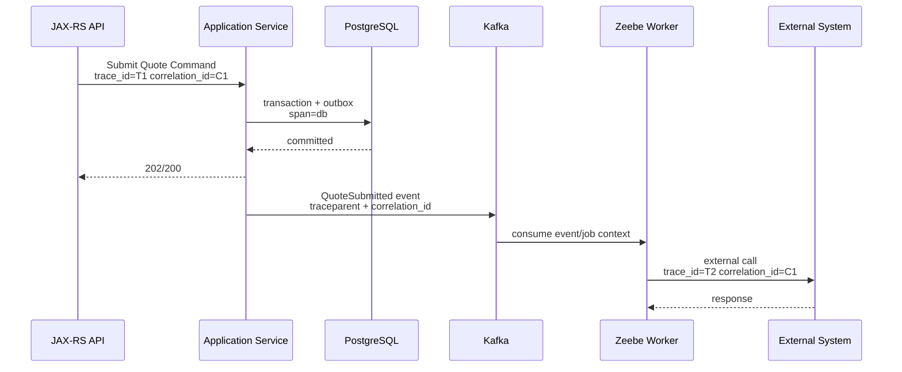
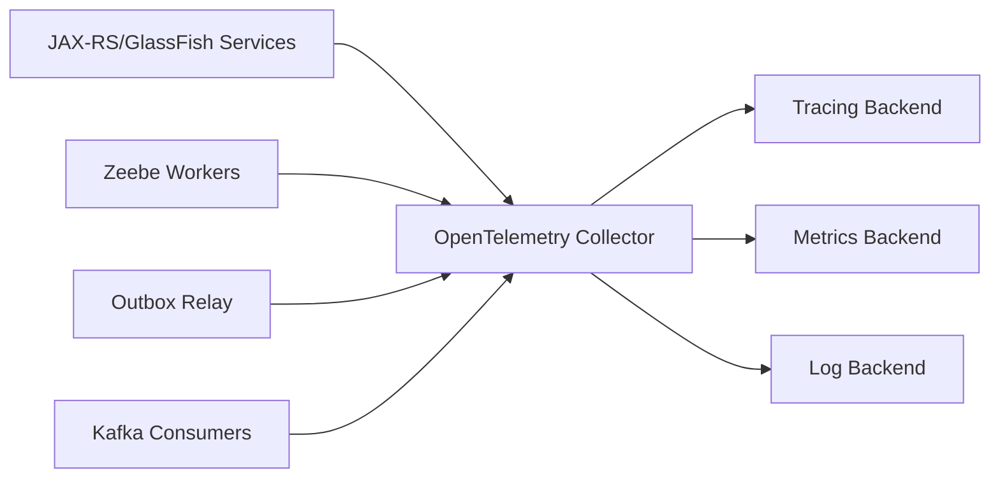
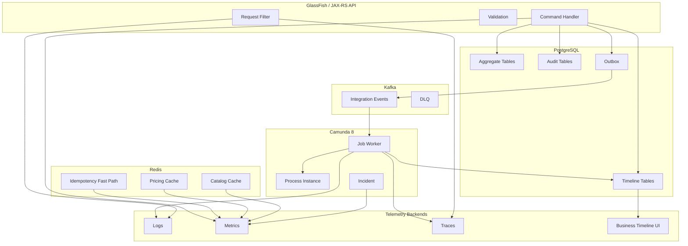

------
title: Build From Scratch: Enterprise Java Microservices CPQ & Order Management Platform - Part 052
description: Production-grade observability for CPQ/OMS using structured logs, metrics, traces, correlation IDs, business timelines, OpenTelemetry, and operational dashboards.
series: learn-enterprise-cpq-oms-glassfish-camunda8
seriesTitle: Build From Scratch: Enterprise Java Microservices CPQ & Order Management Platform
order: 52
partTitle: Observability, Logging, Metrics, and Tracing
tags:
  - java
  - microservices
  - cpq
  - oms
  - observability
  - logging
  - metrics
  - tracing
  - opentelemetry
  - production
date: 2026-07-02
---

# Part 052 — Observability, Logging, Metrics, and Tracing

A large CPQ/OMS is not production-grade because it has many services. It is production-grade when operators, engineers, and business owners can answer:

- Why did this quote require approval?
- Why was this order delayed?
- Which fulfillment task failed?
- Was the failure caused by us, Kafka lag, Camunda incident, Redis outage, PostgreSQL lock, or external provisioning?
- Did customer impact happen?
- Which release introduced the regression?
- Can we prove what happened later during audit?

Observability is the system's ability to expose enough signals that we can infer internal state from external outputs. For our CPQ/OMS, that means **technical observability** and **business observability** must be designed together.

A trace without order ID is hard to use. A business timeline without trace ID is hard to debug. A log without correlation ID is noise. A metric without business dimension is a graph nobody trusts.

This part builds an observability model for the system we have been constructing across the previous parts.

---

## 1. Observability Is Not Logging More

Logging more is often the first mistake.

Bad observability looks like:

```text
INFO Start process
INFO Calling service
INFO Done
ERROR Failed
```

It creates volume but not understanding.

Good observability answers structured questions:

- Which tenant?
- Which actor?
- Which quote/order/fulfillment task?
- Which command?
- Which state transition?
- Which dependency?
- Which version of catalog/pricing/workflow?
- Which trace?
- Which retry attempt?
- Which failure category?
- Which business impact?

Observability for CPQ/OMS must integrate four signal families:

1. **Logs** — discrete records of what happened.
2. **Metrics** — numeric measurements over time.
3. **Traces** — distributed execution path across services and dependencies.
4. **Business timeline** — durable domain history for quote/order/approval/fulfillment.

Do not confuse them.

---

## 2. Audit, Event, Log, Metric, Trace, Timeline

These are different artifacts.

| Artifact | Main Question | Retention | Audience | Source of Truth? |
|---|---|---:|---|---|
| Audit record | Who changed what, when, why? | long | compliance/business | yes for audit |
| Domain event | What domain fact happened? | medium/long | services/integration | yes as published fact, not aggregate state |
| Integration event | What should other systems know? | medium | consumers/platform | yes for event contract |
| Log | What did code do? | short/medium | engineers/operators | no |
| Metric | How is system behaving over time? | medium | operators/SRE | no |
| Trace | What path did one request/job take? | short/medium | engineers/SRE | no |
| Business timeline | What happened to this quote/order? | long | support/business/engineering | yes for operational explanation |

A common enterprise mistake is using logs as audit. Do not do that.

Audit is durable, queryable, domain-oriented, access-controlled, and retention-managed. Logs are operational telemetry.

---

## 3. Observability Identity Model

Every meaningful operation needs identifiers.

### 3.1 Technical IDs

- `trace_id`: distributed trace identity.
- `span_id`: current operation span.
- `parent_span_id`: parent operation.
- `correlation_id`: request/business correlation across sync and async boundaries.
- `causation_id`: event or command that caused this operation.
- `request_id`: one inbound HTTP request.
- `message_id`: one Kafka message envelope ID.
- `job_key`: Camunda/Zeebe job identity.
- `process_instance_key`: Camunda/Zeebe process instance identity.

### 3.2 Business IDs

- `tenant_id`;
- `actor_id`;
- `customer_id`;
- `quote_id`;
- `quote_revision`;
- `order_id`;
- `order_item_id`;
- `fulfillment_plan_id`;
- `fulfillment_task_id`;
- `approval_case_id`;
- `asset_id`;
- `subscription_id`;
- `external_system`;
- `external_reference_id`.

### 3.3 Version IDs

- `catalog_version`;
- `price_list_version`;
- `rule_set_version`;
- `workflow_definition_version`;
- `api_version`;
- `schema_version`;
- `service_version`;
- `deployment_id`.

The version IDs are critical. Without them, you cannot explain why behavior changed after a release or catalog publish.

---

## 4. Correlation ID vs Trace ID

A trace ID typically represents one distributed trace. But business processes can outlive a single trace.

Quote-to-order-to-fulfillment may span:

- multiple HTTP requests;
- multiple Kafka messages;
- multiple Camunda jobs;
- multiple human tasks;
- multiple external callbacks;
- multiple days.

Therefore we need both:

- **trace ID** for technical execution path;
- **business correlation ID** for long-running business journey.

Example:

```text
correlation_id = quote:q-1001/revision:3
trace_id = generated by tracing framework for one request/job chain
```

When quote converts to order:

```text
correlation_id = commercial-transaction:ct-9001
quote_id = q-1001
order_id = ord-7001
```

This allows linking all telemetry and timeline records across the journey.

---

## 5. Trace Context Propagation

For HTTP, use standard trace context propagation. W3C Trace Context defines headers such as `traceparent` and `tracestate` to propagate trace identity across services.

For Kafka, propagate trace/correlation context in message headers:

```text
traceparent: 00-...
tracestate: ...
correlation-id: commercial-transaction:ct-9001
causation-id: event:QuoteAccepted:q-1001:rev3
tenant-id: tnt-001
schema-id: cpq.quote-accepted.v1
```

For Camunda workers:

- process variables should include business IDs;
- job headers or variables can carry correlation ID;
- worker starts a span when activating/executing a job;
- worker logs include `process_instance_key`, `job_key`, and `job_type`.



Notice trace may change across async boundary, but correlation ID remains stable.

---

## 6. Structured Logging

Logs must be structured JSON or equivalent key-value format.

A log line should not be only a sentence. It should be queryable.

Example:

```json
{
  "timestamp": "2026-07-02T10:15:30.123Z",
  "level": "INFO",
  "service": "quote-service",
  "service_version": "1.12.0",
  "environment": "prod",
  "tenant_id": "tnt-001",
  "trace_id": "4bf92f3577b34da6a3ce929d0e0e4736",
  "span_id": "00f067aa0ba902b7",
  "correlation_id": "commercial-transaction:ct-9001",
  "actor_id": "user-123",
  "quote_id": "q-1001",
  "quote_revision": 3,
  "command": "SubmitQuote",
  "state_from": "PRICED",
  "state_to": "PENDING_APPROVAL",
  "catalog_version": "v42",
  "price_list_version": "plv-87",
  "duration_ms": 184,
  "event": "quote.submitted"
}
```

This can answer useful questions:

- show all logs for quote `q-1001`;
- show all failures for tenant `tnt-001`;
- show all commands that used price list `plv-87`;
- show latency distribution for `SubmitQuote`;
- show release version involved in fallout spike.

---

## 7. Logging Levels

Use log levels consistently.

### TRACE

Usually disabled in production. Use for local debugging only.

### DEBUG

Diagnostic detail safe to enable temporarily.

Examples:

- rule evaluation branch details;
- SQL parameter diagnostics without PII;
- cache decision detail.

### INFO

Important successful business/technical milestones.

Examples:

- quote submitted;
- order accepted;
- fulfillment task completed;
- workflow started;
- outbox relay published batch.

### WARN

Unexpected but recoverable conditions.

Examples:

- external timeout retrying;
- stale quote rejected;
- cache version mismatch repaired;
- Kafka consumer lag above threshold;
- Camunda job retry scheduled.

### ERROR

Operation failed and needs investigation or resulted in business impact.

Examples:

- command failed after retries;
- outbox relay cannot publish;
- order entered fallout;
- approval workflow incident;
- data invariant violation.

Do not log every normal retry as `ERROR`. That trains operators to ignore errors.

---

## 8. What Not to Log

Do not log:

- full customer personal data;
- payment card data;
- access tokens;
- raw authorization header;
- passwords/secrets;
- full contract document;
- large request bodies by default;
- unrestricted product configuration with sensitive commercial terms;
- entire quote/order aggregate repeatedly.

For money fields, decide based on policy. In many enterprise contexts, price lines and discounts are commercially sensitive. Logs should prefer identifiers and summary values unless there is an approved secure logging sink.

Use redaction:

```json
{
  "customer_id": "cust-1001",
  "customer_name": "<redacted>",
  "email": "<redacted>",
  "price_total_present": true,
  "price_total_redacted": true
}
```

The rule:

> Logs are for operation. Audit stores evidence. Domain tables store business data. Do not make logs a shadow database of sensitive payloads.

---

## 9. Business Timeline

A business timeline is a durable, domain-specific history.

For quote:

```text
QuoteCreated
QuoteItemAdded
QuoteConfigured
QuotePriced
QuoteSubmitted
ApprovalRequired
ApprovalAssigned
QuoteApproved
QuoteAccepted
QuoteConvertedToOrder
```

For order:

```text
OrderCaptured
OrderValidated
OrderDecomposed
FulfillmentStarted
TaskStarted
TaskCompleted
TaskFailed
OrderEnteredFallout
RepairCommandExecuted
OrderCompleted
```

Business timeline table:

```sql
CREATE TABLE business_timeline_entry (
    id UUID PRIMARY KEY,
    tenant_id TEXT NOT NULL,
    business_object_type TEXT NOT NULL,
    business_object_id TEXT NOT NULL,
    event_type TEXT NOT NULL,
    event_time TIMESTAMPTZ NOT NULL,
    actor_id TEXT,
    correlation_id TEXT NOT NULL,
    trace_id TEXT,
    causation_id TEXT,
    summary TEXT NOT NULL,
    details_json JSONB NOT NULL DEFAULT '{}'::jsonb,
    created_at TIMESTAMPTZ NOT NULL DEFAULT now()
);

CREATE INDEX idx_timeline_object
ON business_timeline_entry (tenant_id, business_object_type, business_object_id, event_time);
```

Why not just use Kafka events?

Because support users need a queryable operational timeline. Kafka is an event backbone, not a support UI database.

Why not just use logs?

Because logs may expire, be sampled, or lack domain retention guarantees.

---

## 10. Metrics Model

Metrics tell us what is happening at scale.

OpenTelemetry defines telemetry signals such as traces, metrics, and logs. Micrometer provides a JVM metrics facade that can send dimensional metrics to many monitoring systems.

For CPQ/OMS, define metrics at multiple layers.

### 10.1 API Metrics

```text
http_server_requests_total{service,method,path_template,status}
http_server_request_duration_seconds{service,method,path_template,status}
api_problem_total{service,problem_code,status}
api_idempotency_replay_total{service,command}
api_optimistic_lock_conflict_total{service,aggregate}
```

Use route templates, not raw paths. Do not create metrics with `quote_id` label. That explodes cardinality.

Bad:

```text
http_request_duration{path="/quotes/q-1001"}
```

Good:

```text
http_request_duration{path_template="/quotes/{quoteId}"}
```

### 10.2 CPQ Domain Metrics

```text
cpq_quote_created_total{tenant,channel}
cpq_quote_submitted_total{tenant,channel}
cpq_quote_approval_required_total{tenant,reason}
cpq_quote_repriced_total{tenant,reason}
cpq_quote_stale_rejection_total{tenant,reason}
cpq_pricing_duration_seconds{tenant,product_family}
cpq_configuration_validation_duration_seconds{tenant,product_family}
cpq_discount_override_total{tenant,approval_required}
```

Be careful with `tenant` cardinality. If the platform has thousands of tenants, tenant as metric label may be too expensive. Use tenant tier/segment for high-cardinality environments and keep tenant-level detail in logs/timeline.

### 10.3 OMS Domain Metrics

```text
oms_order_captured_total{channel,order_type}
oms_order_completed_total{order_type}
oms_order_fallout_total{category,severity}
oms_order_completion_duration_seconds{order_type,product_family}
oms_fulfillment_task_duration_seconds{task_type,external_system}
oms_fulfillment_task_retry_total{task_type,external_system,error_category}
oms_compensation_started_total{reason}
oms_repair_command_total{command_type,operator_role}
```

### 10.4 Workflow Metrics

```text
camunda_job_activated_total{job_type}
camunda_job_completed_total{job_type}
camunda_job_failed_total{job_type,error_category}
camunda_job_duration_seconds{job_type}
camunda_incident_open_total{process_id,error_type}
workflow_start_request_pending_total{process_id}
workflow_message_correlation_failed_total{message_name}
```

### 10.5 Kafka/Outbox Metrics

```text
outbox_pending_total{event_type}
outbox_publish_duration_seconds{topic}
outbox_publish_failed_total{topic,error_category}
inbox_duplicate_total{consumer,event_type}
kafka_consumer_lag{consumer_group,topic,partition}
kafka_consumer_processing_duration_seconds{consumer,event_type}
dead_letter_event_total{topic,error_category}
```

### 10.6 PostgreSQL/MyBatis Metrics

```text
db_query_duration_seconds{mapper,operation}
db_transaction_duration_seconds{command}
db_lock_wait_duration_seconds{table}
db_pool_active_connections{datasource}
db_pool_pending_threads{datasource}
db_optimistic_update_miss_total{aggregate}
```

### 10.7 Redis Metrics

```text
redis_command_duration_seconds{command,cache_domain}
cache_hit_total{cache_domain}
cache_miss_total{cache_domain}
cache_stale_rejection_total{cache_domain}
cache_version_mismatch_total{cache_domain}
cache_invalidation_lag_seconds{cache_domain}
```

---

## 11. Metric Cardinality Rules

High cardinality can make metrics systems expensive or unusable.

Avoid labels such as:

- `quote_id`;
- `order_id`;
- `customer_id`;
- `actor_id`;
- `idempotency_key`;
- raw error message;
- full URL;
- SQL text;
- external reference ID.

Use labels such as:

- service;
- command;
- aggregate type;
- state;
- error category;
- product family;
- external system;
- route template;
- job type;
- process ID;
- tenant tier if tenant count is high.

Detailed object-level debugging belongs in logs, traces, and business timeline, not metrics labels.

---

## 12. Tracing Model

Traces show the execution path of one operation.

For this architecture, trace spans should cover:

- JAX-RS request;
- authentication/authorization filter;
- request validation;
- command handler;
- PostgreSQL transaction;
- MyBatis mapper calls;
- outbox insert;
- Kafka publish;
- Kafka consume;
- Camunda workflow start;
- Zeebe job worker execution;
- external adapter call;
- Redis access;
- business state transition.

Example span tree for quote submission:

```text
HTTP POST /quotes/{quoteId}/submit
  validate.request
  authz.check
  command.SubmitQuote
    db.transaction
      mybatis.quote.loadForUpdate
      domain.quote.submit
      mybatis.quote.updateState
      mybatis.audit.insert
      mybatis.outbox.insert
  response.write
```

Example span tree for fulfillment task:

```text
zeebe.job ExecuteProvisioningTask
  worker.loadTask
    mybatis.fulfillmentTask.loadForUpdate
  adapter.provisioning.activateService
    http.client POST /services/activate
  worker.completeTask
    db.transaction
      mybatis.fulfillmentTask.markCompleted
      mybatis.outbox.insert
  zeebe.completeJob
```

Traces should contain enough attributes to connect to logs and timeline.

Recommended span attributes:

```text
app.tenant_id
app.correlation_id
app.command
app.aggregate_type
app.quote_id
app.order_id
app.fulfillment_task_id
app.catalog_version
app.price_list_version
app.workflow_process_id
app.workflow_process_instance_key
app.zeebe_job_type
app.external_system
app.error_category
```

Again: be careful with high-cardinality attributes depending on backend policy. Traces can usually tolerate object IDs better than metrics, but access control and cost still matter.

---

## 13. OpenTelemetry Collector Model

A typical production topology:



Benefits:

- applications export telemetry to collector;
- collector handles batching, filtering, enrichment, and routing;
- backend can change without rewriting application code;
- sensitive attributes can be dropped centrally.

Instrumentation can be:

- automatic where supported;
- manual for business spans;
- library-based for HTTP, JDBC, Kafka, Redis;
- custom for domain transitions and workflow jobs.

Do not rely only on auto-instrumentation. It will not know what `QuoteSubmitted`, `OrderFallout`, or `ApprovalRequired` means.

---

## 14. JAX-RS Correlation Filter

At HTTP boundary, create or propagate correlation context.

```java
@Provider
@Priority(Priorities.AUTHENTICATION)
public final class CorrelationFilter implements ContainerRequestFilter, ContainerResponseFilter {
    public static final String CORRELATION_ID = "X-Correlation-Id";

    @Override
    public void filter(ContainerRequestContext request) {
        String correlationId = request.getHeaderString(CORRELATION_ID);
        if (correlationId == null || correlationId.isBlank()) {
            correlationId = CorrelationIds.newId();
        }

        RequestContextHolder.setCorrelationId(correlationId);
        request.setProperty(CORRELATION_ID, correlationId);
        Mdc.put("correlation_id", correlationId);
    }

    @Override
    public void filter(ContainerRequestContext request, ContainerResponseContext response) {
        Object correlationId = request.getProperty(CORRELATION_ID);
        if (correlationId != null) {
            response.getHeaders().putSingle(CORRELATION_ID, correlationId.toString());
        }
        Mdc.clear();
        RequestContextHolder.clear();
    }
}
```

In real implementation, integrate this with OpenTelemetry context and your logging framework's MDC/thread context.

---

## 15. Command Observability Wrapper

Every command handler should emit consistent logs, metrics, trace attributes, and timeline entry.

```java
public final class ObservedCommandBus {
    private final CommandBus delegate;
    private final MeterRegistry metrics;
    private final TimelineWriter timeline;

    public <R> R execute(Command<R> command, RequestContext ctx) {
        long start = System.nanoTime();
        String commandName = command.name();

        try (var span = Spans.start("command." + commandName)) {
            span.setAttribute("app.command", commandName);
            span.setAttribute("app.tenant_id", ctx.tenantId());
            span.setAttribute("app.correlation_id", ctx.correlationId());

            Logs.info("command.started", fields(ctx, commandName));

            R result = delegate.execute(command, ctx);

            metrics.counter("app_command_completed_total", "command", commandName).increment();
            metrics.timer("app_command_duration", "command", commandName)
                    .record(System.nanoTime() - start, TimeUnit.NANOSECONDS);

            Logs.info("command.completed", fields(ctx, commandName));
            return result;
        } catch (DomainException ex) {
            metrics.counter(
                    "app_command_failed_total",
                    "command", commandName,
                    "error_code", ex.code()
            ).increment();

            Logs.warn("command.rejected", fields(ctx, commandName)
                    .with("error_code", ex.code())
                    .with("error_category", ex.category()));

            throw ex;
        } catch (Exception ex) {
            metrics.counter(
                    "app_command_failed_total",
                    "command", commandName,
                    "error_code", "UNEXPECTED"
            ).increment();

            Logs.error("command.failed", fields(ctx, commandName), ex);
            throw ex;
        }
    }
}
```

This wrapper prevents every handler from inventing its own telemetry shape.

---

## 16. Error Taxonomy for Observability

Raw exception classes are not enough.

Use error categories:

```text
VALIDATION_ERROR
AUTHORIZATION_DENIED
IDEMPOTENCY_CONFLICT
OPTIMISTIC_LOCK_CONFLICT
STALE_VERSION
DOMAIN_INVARIANT_VIOLATION
EXTERNAL_TIMEOUT
EXTERNAL_REJECTED
EXTERNAL_AMBIGUOUS_OUTCOME
KAFKA_PUBLISH_FAILED
KAFKA_CONSUME_FAILED
WORKFLOW_START_FAILED
WORKFLOW_INCIDENT
DATABASE_TIMEOUT
DATABASE_LOCK_TIMEOUT
CACHE_UNAVAILABLE
CACHE_CORRUPTION
UNEXPECTED
```

Every category should map to:

- API problem code;
- log field;
- metric label;
- trace status;
- runbook page;
- alert policy where relevant.

This is how observability becomes operationally useful.

---

## 17. SLI and SLO Design

A metric becomes powerful when attached to service-level indicators and objectives.

### 17.1 API SLIs

- availability of quote command API;
- p95/p99 latency of configuration/pricing/submit commands;
- error rate by problem category;
- idempotency replay success rate.

### 17.2 CPQ Business SLIs

- quote pricing success ratio;
- quote submission success ratio;
- stale rejection ratio after catalog publish;
- approval routing time;
- quote-to-order conversion success ratio.

### 17.3 OMS Business SLIs

- order capture success ratio;
- order decomposition success ratio;
- order completion duration;
- order fallout ratio;
- fulfillment task retry ratio;
- compensation success ratio.

### 17.4 Platform SLIs

- outbox publish delay;
- Kafka consumer lag;
- workflow incident count;
- database lock wait;
- Redis latency;
- external system timeout ratio.

An SLO example:

```text
99% of quote pricing requests for standard products complete under 500ms over 30 days.
```

Another:

```text
95% of standard add orders complete fulfillment within 15 minutes, excluding external provisioning maintenance windows.
```

Be precise about exclusions. Otherwise the SLO becomes a political argument.

---

## 18. Alerting Principles

Alert on user/business impact or strong leading indicators.

Good alerts:

- order fallout ratio above threshold;
- outbox oldest pending event age above threshold;
- workflow incidents increasing;
- quote submit error rate spike;
- external provisioning timeout spike;
- database lock waits affecting command latency;
- Kafka lag causing SLA breach risk;
- Redis unavailable causing degraded pricing latency.

Bad alerts:

- every single exception;
- CPU briefly above 80%;
- one retry happened;
- one cache miss happened;
- one expected validation rejection happened.

Validation rejections are often normal. Alert only if the rate indicates a defect or business issue.

---

## 19. Dashboard Design

Dashboards should be role-specific.

### 19.1 Engineering Dashboard

- API latency/error by route;
- command latency/error by command;
- DB query duration by mapper;
- Kafka lag;
- outbox pending;
- Redis latency/hit ratio;
- workflow job failures;
- external adapter latency/error;
- JVM heap/thread/GC.

### 19.2 Operations Dashboard

- orders captured/completed;
- fallout cases by category/severity;
- stuck fulfillment tasks;
- SLA breach risk;
- manual repair queue;
- external system health;
- compensation in progress.

### 19.3 CPQ Business Dashboard

- quote volume;
- quote conversion rate;
- approval rate;
- discount override rate;
- pricing stale rejection;
- expired quote count;
- top products by quote volume.

### 19.4 Executive Dashboard

- order throughput;
- SLA compliance;
- revenue-impacting fallout;
- quote-to-order conversion;
- platform availability;
- major incident summary.

One dashboard cannot serve all roles.

---

## 20. Observability Across Architecture



Telemetry is not one library. It is a cross-cutting architecture.

---

## 21. MyBatis Observability

MyBatis gives explicit SQL control, but you still need visibility.

Track:

- mapper ID;
- operation type;
- duration;
- row count;
- optimistic update miss;
- lock wait where detectable;
- timeout;
- connection pool wait;
- transaction duration.

Avoid logging raw SQL with sensitive parameters in production.

A useful mapper metric shape:

```text
db_mybatis_operation_duration_seconds{
  mapper="QuoteMapper",
  operation="loadForUpdate",
  result="success"
}
```

A useful log on slow query:

```json
{
  "event": "db.slow_query",
  "mapper": "OrderSearchMapper",
  "operation": "searchOrders",
  "duration_ms": 1842,
  "threshold_ms": 500,
  "tenant_id": "tnt-001",
  "correlation_id": "commercial-transaction:ct-9001",
  "trace_id": "...",
  "result_count": 100,
  "filter_shape": "status+createdAtRange+productFamily"
}
```

Filter shape is safer than full query parameters.

---

## 22. Kafka Observability

For each producer:

- publish attempt count;
- publish success count;
- publish failure count;
- serialization failure;
- topic/partition metadata;
- outbox relay lag;
- oldest unpublished event age.

For each consumer:

- consumed messages;
- processing duration;
- duplicate inbox hits;
- retry count;
- DLQ count;
- consumer lag;
- event schema version distribution;
- poison message details.

Consumer logs must include:

```text
topic
partition
offset
event_id
event_type
schema_version
correlation_id
causation_id
consumer_group
inbox_status
```

This makes replay and dedupe issues diagnosable.

---

## 23. Camunda/Zeebe Observability

For each process:

- process started;
- process completed;
- process failed/cancelled;
- active process instance count;
- incident count;
- message correlation failures;
- timer trigger count.

For each job type:

- activated;
- completed;
- failed;
- retries exhausted;
- worker duration;
- business transition duration;
- external call duration;
- incident created.

Worker logs must include:

```text
process_id
process_instance_key
job_key
job_type
worker_name
retry_count
correlation_id
order_id
fulfillment_task_id
error_category
```

A Camunda incident should be linked to OMS fallout when it has business impact. But do not treat every incident as domain fallout automatically. Some incidents are technical and recoverable without changing business state.

---

## 24. External Adapter Observability

Every external call should have:

- external system name;
- operation;
- request id/reference id;
- idempotency key;
- timeout budget;
- attempt number;
- response category;
- ambiguous outcome flag;
- retry decision;
- fallback/compensation decision.

Response categories:

```text
SUCCESS
BUSINESS_REJECTED
VALIDATION_REJECTED
AUTH_FAILED
TIMEOUT
RATE_LIMITED
UNAVAILABLE
AMBIGUOUS_OUTCOME
UNEXPECTED_RESPONSE
```

Do not let adapter errors become random `RuntimeException`. Categorize them.

---

## 25. Business Impact Annotation

Technical errors are not equal.

Add business impact fields where possible:

```json
{
  "event": "fulfillment.task.failed",
  "error_category": "EXTERNAL_TIMEOUT",
  "business_impact": "ORDER_DELAYED",
  "customer_visible": true,
  "sla_risk": true,
  "fallout_created": true,
  "order_id": "ord-7001",
  "fulfillment_task_id": "task-3001"
}
```

Business impact categories:

```text
NO_CUSTOMER_IMPACT
QUOTE_DELAYED
QUOTE_BLOCKED
APPROVAL_DELAYED
ORDER_DELAYED
ORDER_BLOCKED
ORDER_PARTIALLY_COMPLETED
SERVICE_ACTIVATION_DELAYED
BILLING_ACTIVATION_DELAYED
CUSTOMER_VISIBLE_FAILURE
REVENUE_AT_RISK
COMPLIANCE_RISK
```

This helps alert routing and incident prioritization.

---

## 26. Observability Testing

Observability should be tested.

### 26.1 Log Contract Tests

For critical commands, assert logs contain required fields:

- `correlation_id`;
- `tenant_id`;
- command;
- aggregate ID;
- state transition;
- error category where applicable.

### 26.2 Metric Tests

Assert that command execution increments expected counters and records duration.

### 26.3 Trace Tests

In integration tests, use in-memory exporter or test collector to verify:

- span names;
- parent-child relationship;
- required attributes;
- error status on failure.

### 26.4 Timeline Tests

Assert business timeline entries are written atomically with state transition.

Example:

```text
Given quote q-1001 is PRICED
When SubmitQuote succeeds
Then quote state is PENDING_APPROVAL
And business_timeline_entry contains QuoteSubmitted
And audit_log contains before/after state
And outbox contains QuoteSubmitted event
```

---

## 27. Common Observability Failure Modes

### Failure 1: No Correlation Across Async Boundary

Symptom:

- API log has request ID;
- Kafka consumer log has no relationship;
- worker log cannot be linked.

Fix:

- propagate correlation ID and trace context in Kafka headers;
- include business IDs in event envelope;
- worker copies context into logs/spans.

### Failure 2: Metrics Cardinality Explosion

Symptom:

- metrics backend cost spikes;
- queries become slow;
- dashboards fail.

Root cause:

- `order_id`, `quote_id`, or raw path used as metric labels.

Fix:

- use route templates;
- move object IDs to logs/traces/timeline;
- cap label values.

### Failure 3: Logs Contain Sensitive Payloads

Symptom:

- confidential price/customer data stored in log platform.

Fix:

- redaction library;
- safe logging schema;
- payload logging disabled by default;
- audit stored in controlled DB tables.

### Failure 4: Business Timeline Missing Technical Trace

Symptom:

- support sees order failed but engineering cannot find trace.

Fix:

- store trace ID/correlation ID in timeline entries;
- include order ID in trace attributes;
- link timeline UI to trace search.

### Failure 5: Too Many Alerts

Symptom:

- operators ignore alerts.

Root cause:

- alerting on every exception/retry.

Fix:

- alert on symptoms and business impact;
- use severity;
- group alerts by correlation/business object where possible.

---

## 28. Production Readiness Checklist

Before calling the system production-ready, verify:

- [ ] Every inbound HTTP request has correlation ID.
- [ ] Trace context is propagated over HTTP.
- [ ] Kafka event headers include correlation/causation context.
- [ ] Camunda worker logs include job/process/business IDs.
- [ ] Structured logs are used consistently.
- [ ] Sensitive data is redacted.
- [ ] Metrics avoid high-cardinality object IDs.
- [ ] Command handlers emit common metrics.
- [ ] Outbox relay exposes pending count and oldest event age.
- [ ] Inbox exposes duplicate count and failure count.
- [ ] Kafka lag is monitored.
- [ ] Redis cache hit/miss/stale rejection is monitored.
- [ ] PostgreSQL transaction/query duration is monitored.
- [ ] Business timeline is written with state transition.
- [ ] Audit is separate from logs.
- [ ] Dashboards exist for engineering, operations, and business.
- [ ] Alerts map to runbooks.
- [ ] Observability behavior is covered by tests.

---

## 29. Build Milestone for This Part

Add modules/classes like:

```text
platform-observability/
  CorrelationFilter.java
  TraceContextPropagator.java
  StructuredLogger.java
  ObservabilityFields.java
  CommandObservation.java
  MetricNames.java
  ErrorCategory.java
  BusinessImpact.java

cpq-application/
  ObservedCommandBus.java
  QuoteTimelineWriter.java
  ApprovalTimelineWriter.java

oms-application/
  OrderTimelineWriter.java
  FulfillmentTimelineWriter.java

platform-messaging/
  KafkaTelemetryHeaders.java
  EventContextExtractor.java
  EventContextInjector.java

workflow-worker/
  ZeebeWorkerObservation.java
  WorkerLogContext.java

database/
  business_timeline_entry.sql
  audit_log.sql
```

The milestone is:

> For any quote, order, approval, or fulfillment task, we can reconstruct the business timeline and jump into the relevant logs, traces, metrics, workflow instance, Kafka event, and audit record.

---

## 30. Key Takeaways

A CPQ/OMS without observability becomes unmanageable long before it runs out of CPU.

The production-grade model is:

1. use structured logs for operational facts;
2. use metrics for system and business behavior over time;
3. use traces for distributed execution path;
4. use business timeline for durable object-level explanation;
5. use audit for defensible evidence;
6. propagate correlation across HTTP, Kafka, Camunda, Redis, PostgreSQL, and external systems;
7. attach business impact to failures;
8. test observability like any other contract.

The best debugging experience is not “search everything and hope”. It is:

> Start from order ID, see the business timeline, open the trace, inspect relevant logs, check metrics around the incident window, identify the failing dependency, and know which runbook applies.

That is the observability bar for an enterprise-grade CPQ/OMS.

---

## References

- OpenTelemetry documentation: traces, metrics, logs, SDKs, collectors, and vendor-neutral telemetry.
- W3C Trace Context specification: `traceparent` and `tracestate` propagation model.
- Micrometer documentation: JVM/application metrics facade and dimensional metrics.
- Kafka documentation: consumer groups, topics, partitions, and event metadata.
- Camunda 8 documentation: job workers, process instances, and incidents.
- Prior parts in this series: Part 021, Part 023, Part 040, Part 043, Part 045, Part 046, Part 050, and Part 051.
