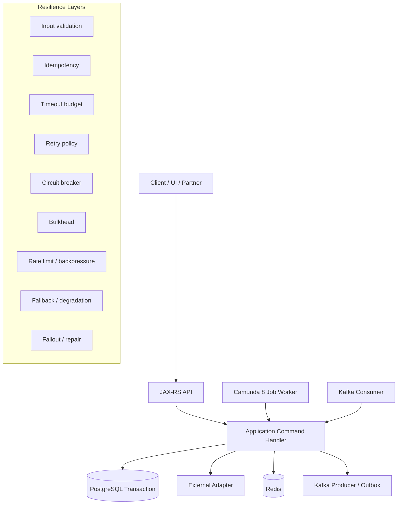
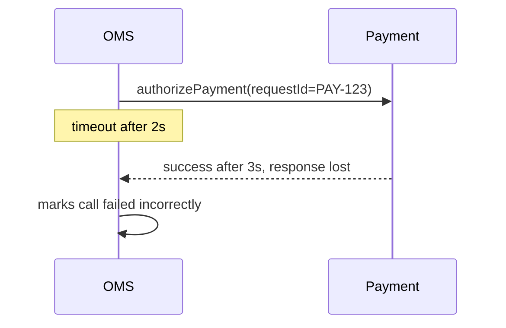
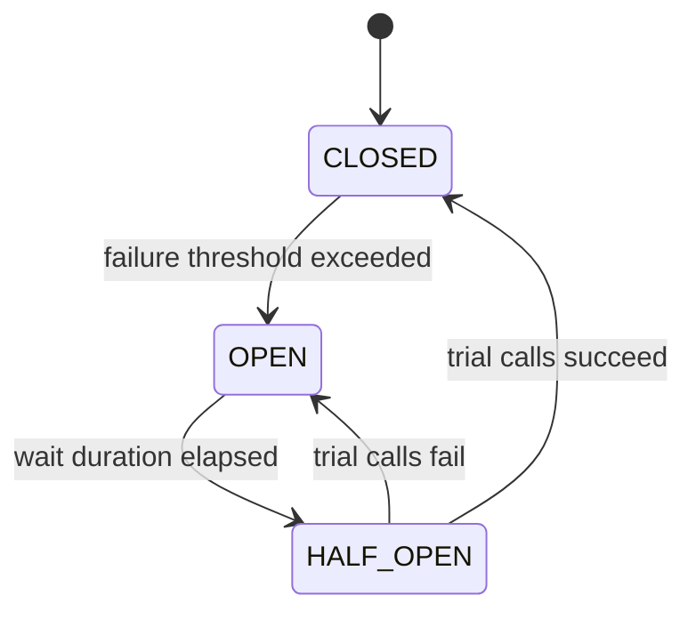

------
title: Build From Scratch: Enterprise Java Microservices CPQ & Order Management Platform - Part 053
description: Production-grade resilience design for CPQ/OMS: timeout budgets, retries, circuit breakers, bulkheads, fallbacks, rate limits, degradation, and failure containment across JAX-RS, PostgreSQL, Kafka, Redis, Camunda 8, and external integrations.
series: learn-enterprise-cpq-oms-glassfish-camunda8
seriesTitle: Build From Scratch: Enterprise Java Microservices CPQ & Order Management Platform
order: 53
partTitle: Resilience, Timeout, Retry, and Circuit Breaker
tags:
  - java
  - microservices
  - cpq
  - oms
  - resilience
  - timeout
  - retry
  - circuit-breaker
  - bulkhead
  - production
  - reliability
  - glassfish
  - kafka
  - camunda-8
  - redis
  - postgresql
date: 2026-07-02
---

# Part 053 — Resilience, Timeout, Retry, and Circuit Breaker

A CPQ/OMS platform is not resilient because it catches exceptions.

It is resilient when a failure in one dependency does **not** silently corrupt quote price, does **not** duplicate an order, does **not** overload all worker threads, does **not** hide customer impact, and does **not** leave operators guessing what to repair.

This part builds the resilience layer for the platform we have been constructing:

- JAX-RS/Jersey API on GlassFish
- PostgreSQL + MyBatis as transactional source of truth
- Camunda 8 / Zeebe for orchestration
- Kafka for event streaming
- Redis for acceleration
- external adapters for CRM, inventory, provisioning, billing, payment, notification, and document generation

The mental model is simple:

> Resilience is not “try again”. Resilience is controlled failure, bounded waiting, safe repetition, isolation, and repairability.

---

## 1. The Failure Model First

Before choosing timeout, retry, circuit breaker, or fallback, classify the failure.

In CPQ/OMS, a failure can be:

| Failure | Example | Main Risk | Correct Response |
|---|---|---:|---|
| Validation failure | invalid product option | bad user input | reject deterministically |
| Domain invariant failure | quote already accepted | state corruption | reject command |
| Authorization failure | actor cannot override price | policy breach | reject and audit |
| Transient dependency failure | inventory API timeout | temporary unavailability | retry if safe |
| Slow dependency | pricing dependency hangs | thread exhaustion | timeout and isolate |
| Duplicate command | same order submit repeated | duplicate order | idempotent replay |
| Ambiguous external outcome | payment request timed out | unknown side effect | reconcile before retry |
| Message duplicate | Kafka consumer receives event twice | repeated state mutation | inbox dedupe |
| Workflow retry | Zeebe job is executed again | repeated external call | worker idempotency |
| Resource exhaustion | DB pool saturated | cascading failure | bulkhead + backpressure |
| Partial fulfillment failure | provisioning succeeds, billing fails | inconsistent business state | saga/fallout/compensation |

A retry is valid only for a subset of failures.

A timeout is valid everywhere, but the consequence differs.

A circuit breaker helps with failing dependencies, but it cannot fix an invalid business command.

A fallback can be useful for read-only experience degradation, but dangerous for price, approval, and order commitment.

---

## 2. Resilience Is Layered

Do not put all resilience logic inside one library annotation.

Production CPQ/OMS needs layered resilience:



Each layer answers a different question:

| Layer | Question |
|---|---|
| Validation | should this request execute at all? |
| Idempotency | have we already executed this command? |
| Timeout | how long are we allowed to wait? |
| Retry | is repeating this safe and useful? |
| Circuit breaker | should we stop calling a failing dependency? |
| Bulkhead | how do we prevent one dependency from consuming all capacity? |
| Rate limit/backpressure | how do we slow incoming work before collapse? |
| Fallback | can we return a safe alternative result? |
| Fallout/repair | how do humans or automated reconciliation recover? |

---

## 3. Timeout Is the First Resilience Primitive

A system without timeouts is not resilient.

Every network call, DB query, cache call, workflow command, Kafka send, and external adapter call must have an explicit timeout.

Bad design:

```java
InventoryResult result = inventoryClient.reserve(request);
```

Better design:

```java
InventoryResult result = inventoryClient.reserve(request, TimeoutBudget.remaining());
```

The important design is not the method signature. The important design is that timeout is treated as a **budget**, not a random number.

---

## 4. Timeout Budget

A timeout budget starts at the edge and is consumed by downstream operations.

Example API SLA:

```text
POST /api/v1/quotes/{quoteId}/price
Maximum response target: 2 seconds
```

Budget allocation:

| Operation | Budget |
|---|---:|
| Authentication + authorization | 50 ms |
| Load quote/configuration | 150 ms |
| Load catalog/pricing reference | 250 ms |
| Pricing computation | 500 ms |
| Persist price snapshot | 200 ms |
| Outbox insert | 50 ms |
| Response mapping | 50 ms |
| Safety margin | 750 ms |

The system should not allow one call to consume the whole budget and leave no time for cleanup, logging, audit, or response generation.

### Timeout budget object

```java
public final class TimeoutBudget {
    private final Instant deadline;

    private TimeoutBudget(Instant deadline) {
        this.deadline = deadline;
    }

    public static TimeoutBudget fromNow(Duration duration) {
        return new TimeoutBudget(Instant.now().plus(duration));
    }

    public Duration remaining() {
        Duration remaining = Duration.between(Instant.now(), deadline);
        return remaining.isNegative() ? Duration.ZERO : remaining;
    }

    public boolean expired() {
        return !remaining().isPositive();
    }

    public void throwIfExpired(String operation) {
        if (expired()) {
            throw new TimeoutBudgetExceededException(operation);
        }
    }
}
```

### Propagate budget through context

```java
public record RequestContext(
    String correlationId,
    String tenantId,
    String actorId,
    TimeoutBudget timeoutBudget
) {}
```

Every application command should accept context:

```java
public QuotePriceResult priceQuote(RequestContext ctx, PriceQuoteCommand command) {
    ctx.timeoutBudget().throwIfExpired("priceQuote.start");
    return unitOfWork.execute(ctx, () -> pricingApplicationService.price(ctx, command));
}
```

---

## 5. Timeout Is Not Cancellation Unless You Make It Cancellation

A timeout on the caller does not guarantee the callee stopped executing.

This matters for:

- payment authorization
- inventory reservation
- provisioning
- document generation
- order submission
- Camunda workflow start
- Kafka publish acknowledgement

A caller timeout can produce an **ambiguous outcome**.



Correct design:

1. persist external call attempt before the call
2. use external idempotency key
3. mark result as `UNKNOWN` on timeout if side effect may have happened
4. reconcile before retrying irreversible operation

```text
external_call_attempt
- attempt_id
- tenant_id
- external_system
- operation
- idempotency_key
- business_entity_type
- business_entity_id
- status: PENDING | SUCCEEDED | FAILED | UNKNOWN | RECONCILED
- request_hash
- response_snapshot
- timeout_at
- created_at
- updated_at
```

Timeout is a technical signal. Business state transition needs stronger evidence.

---

## 6. Retry Safety Matrix

Do not retry because something failed. Retry because the operation is safe to repeat and the failure class is likely transient.

| Operation | Safe to Retry? | Condition |
|---|---:|---|
| GET catalog item | yes | read-only, bounded timeout |
| price simulation | yes | deterministic input, no side effect |
| submit quote | yes | only with idempotency key |
| convert quote to order | yes | only with unique conversion guard |
| reserve inventory | maybe | external idempotency key required |
| authorize payment | maybe | external idempotency key + reconciliation required |
| send email notification | maybe | duplicate tolerance or message id required |
| create provisioning order | maybe | external idempotency key required |
| insert audit log | no blind retry | must be in local transaction or queued |
| update order state | yes | optimistic locking + transition guard |
| publish Kafka event | yes | from outbox relay, not direct from command handler |
| complete Zeebe job | yes-ish | worker must tolerate duplicate completion outcome |

### Retry should have bounded attempts

Bad:

```java
while (true) {
    callExternalSystem();
}
```

Better:

```java
RetryPolicy policy = RetryPolicy.builder()
    .maxAttempts(3)
    .initialDelay(Duration.ofMillis(100))
    .maxDelay(Duration.ofSeconds(2))
    .jitter(true)
    .retryOn(TransientDependencyException.class)
    .doNotRetryOn(BusinessValidationException.class)
    .build();
```

---

## 7. Retry Backoff and Jitter

If many workers retry at the same fixed interval, they can create a retry storm.

Bad:

```text
1000 workers fail at 10:00:00
1000 workers retry at 10:00:05
1000 workers retry at 10:00:10
```

Better:

```text
retry delay = exponential_backoff(base, attempt) + random_jitter
```

Example:

```java
public Duration nextDelay(int attempt) {
    long baseMs = 100;
    long maxMs = 5_000;
    long exponential = Math.min(maxMs, baseMs * (1L << Math.min(attempt, 6)));
    long jitter = ThreadLocalRandom.current().nextLong(0, Math.max(1, exponential / 2));
    return Duration.ofMillis(exponential + jitter);
}
```

### Retry policy by dependency

| Dependency | Retry Pattern |
|---|---|
| PostgreSQL transient serialization/deadlock | short retry, small attempts |
| Redis timeout | usually no retry or one fast retry |
| Kafka producer from outbox | retry in relay loop |
| external CRM read | short retry + circuit breaker |
| external provisioning command | retry only with idempotency key |
| Camunda job failure | use Zeebe retry count + worker idempotency |
| email notification | retry via notification queue |

---

## 8. Circuit Breaker Mental Model

A circuit breaker prevents repeated calls to a dependency that is already failing.

It protects:

- caller threads
- connection pools
- dependency recovery time
- user latency
- upstream stability

It does not fix:

- invalid payloads
- broken domain rules
- missing idempotency
- wrong state transitions
- incorrect compensation logic

Circuit states:



### Where to put circuit breakers

Put circuit breakers around **remote dependencies**, not around local domain methods.

Good candidates:

- CRM adapter
- inventory adapter
- provisioning adapter
- billing adapter
- payment adapter
- document generation service
- notification provider
- external eligibility service

Usually not good candidates:

- pure Java pricing calculation
- domain invariant validation
- local DTO mapping
- local state transition logic

### Circuit breaker outcome

When circuit is open:

- read APIs may return degraded result if safe
- command APIs should usually reject with retryable dependency error
- workflow workers should fail job with retry or create fallout depending on business operation
- dashboards should show dependency unavailable

---

## 9. Bulkhead: Stop One Dependency From Drowning the Platform

A bulkhead limits concurrency for a dependency or operation class.

Without bulkhead:

```text
Provisioning is slow
all HTTP worker threads wait on provisioning
quote pricing cannot run
approval cannot load
health checks timeout
system appears dead
```

With bulkhead:

```text
Provisioning gets max 30 concurrent calls
quote pricing has separate capacity
order capture has separate capacity
admin repair still works
```

### Bulkhead categories

| Bulkhead | Protects |
|---|---|
| API endpoint concurrency | GlassFish/JAX-RS worker capacity |
| DB connection pool | PostgreSQL availability |
| external adapter pool | external dependency pressure |
| Camunda worker max jobs active | worker process capacity |
| Kafka consumer concurrency | partition processing stability |
| Redis pool | cache layer stability |

### Example policy

```text
pricing-api-bulkhead:
  maxConcurrent: 100
  queueSize: 50

order-submit-bulkhead:
  maxConcurrent: 30
  queueSize: 10

provisioning-adapter-bulkhead:
  maxConcurrent: 20
  queueSize: 0
```

For irreversible operations, a queue inside the API process can be dangerous. Prefer durable command acceptance, outbox/workflow, and async processing.

---

## 10. Rate Limiting and Backpressure

Rate limiting protects the platform from excessive callers.

Backpressure tells upstream systems that we cannot accept more work safely.

They are related but not identical.

| Mechanism | Main Use |
|---|---|
| Rate limit | cap caller request rate |
| Bulkhead | cap concurrent work |
| Queue limit | cap waiting work |
| Kafka lag alert | detect consumer falling behind |
| Zeebe max active jobs | cap workflow worker load |
| DB pool saturation alert | detect local bottleneck |
| 429 response | tell clients to slow down |
| 503 response | dependency/system unavailable |

### Rate limit dimensions

For CPQ/OMS, rate limit by:

- tenant
- client application
- actor role
- endpoint/command type
- business entity
- external partner

Example Redis-based key:

```text
rate:{tenantId}:{clientId}:{commandType}:{yyyyMMddHHmm}
```

But rate limit counters are not domain correctness controls. They are traffic controls.

---

## 11. Fallback and Degradation

Fallback is the most dangerous resilience tool because it can hide failure.

A fallback is safe when it does not create false business commitment.

| Scenario | Fallback Safe? | Notes |
|---|---:|---|
| catalog browse uses stale cache | yes, with version disclosure | read-only |
| quote price calculation uses stale price silently | no | commercial risk |
| approval dashboard shows cached count | yes, if marked stale | operational view |
| order submit ignores inventory failure | no | execution corruption |
| notification failure records pending notification | yes | durable retry later |
| provisioning failure marks task complete | never | false fulfillment |
| recommendation service unavailable | yes | non-critical |
| tax calculation unavailable | usually no | regulatory/commercial risk |

### Degraded response example

```json
{
  "data": [
    { "orderId": "ord_123", "state": "IN_PROGRESS" }
  ],
  "meta": {
    "degraded": true,
    "degradationReason": "FULFILLMENT_DASHBOARD_PROJECTION_STALE",
    "projectionVersion": "2026-07-02T09:10:00Z"
  }
}
```

Never silently degrade price, approval, order commitment, payment, asset mutation, or audit evidence.

---

## 12. Resilience Per Platform Component

### JAX-RS / Jersey API

API resilience responsibilities:

- request timeout budget
- authentication/authorization fail-fast
- idempotency filter for commands
- input validation before expensive work
- bulkhead for high-cost endpoints
- rate limit by tenant/client
- consistent error response
- correlation ID propagation

Example response mapping:

| Failure | HTTP |
|---|---:|
| validation error | 400 |
| authorization error | 403 |
| stale version | 409 |
| idempotency conflict | 409 |
| rate limit exceeded | 429 |
| dependency unavailable | 503 |
| timeout | 504 or 503 depending boundary |
| accepted async command | 202 |

### PostgreSQL / MyBatis

Database resilience responsibilities:

- short transactions
- statement timeout
- connection pool limit
- lock timeout
- optimistic locking
- unique constraints
- deadlock/serialization retry if safe
- query plan monitoring
- slow query threshold

Example PostgreSQL session policy:

```sql
SET statement_timeout = '2s';
SET lock_timeout = '500ms';
```

For a command handler, prefer explicit timeout via connection/pool configuration and transaction wrapper, not ad-hoc unlimited queries.

### Kafka

Kafka resilience responsibilities:

- outbox producer retry
- idempotent producer where appropriate
- consumer idempotency via inbox
- bounded poll processing
- DLQ for poison messages
- lag alerting
- replay strategy
- schema compatibility

Do not perform state mutation in Kafka consumer without inbox or equivalent dedupe.

### Camunda 8 / Zeebe

Workflow resilience responsibilities:

- job retry count
- worker idempotency
- explicit BPMN error for modeled business alternatives
- failed job for transient technical failure
- incident for exhausted retries/manual intervention
- fallout case for business repair
- message correlation with durable key
- no large process variables

A Zeebe retry is not enough if the worker calls an external system without idempotency.

### Redis

Redis resilience responsibilities:

- short timeouts
- cache miss fallback to source of truth
- no business correctness dependence
- stale cache detection
- TTL policy
- cache stampede control
- rate limit counters
- best-effort acceleration

Redis failure should degrade performance, not corrupt orders.

### External adapters

External adapter resilience responsibilities:

- operation-specific timeout
- idempotency key
- external call attempt record
- retry policy
- circuit breaker
- bulkhead
- unknown outcome handling
- reconciliation endpoint
- evidence snapshot

---

## 13. Error Taxonomy for Resilience

A useful exception hierarchy makes retry decisions explicit.

```java
public sealed interface PlatformFailure permits
    ValidationFailure,
    AuthorizationFailure,
    ConcurrencyFailure,
    TransientDependencyFailure,
    PermanentDependencyFailure,
    UnknownExternalOutcomeFailure,
    TimeoutFailure,
    RateLimitFailure,
    InfrastructureFailure {

    String code();
    boolean retryable();
    boolean customerVisible();
}
```

Example:

```java
public final class UnknownExternalOutcomeFailure extends RuntimeException implements PlatformFailure {
    private final String externalSystem;
    private final String operation;
    private final String idempotencyKey;

    @Override
    public String code() {
        return "UNKNOWN_EXTERNAL_OUTCOME";
    }

    @Override
    public boolean retryable() {
        return false; // not until reconciliation decides
    }

    @Override
    public boolean customerVisible() {
        return false;
    }
}
```

Why `retryable=false`? Because the platform should not blindly repeat an operation that may already have succeeded externally.

---

## 14. Resilience Policy Registry

Hardcoding resilience behavior throughout the codebase creates inconsistency.

Create a central policy registry.

```java
public enum DependencyId {
    CRM,
    INVENTORY,
    PROVISIONING,
    BILLING,
    PAYMENT,
    DOCUMENT,
    NOTIFICATION,
    REDIS,
    POSTGRES,
    KAFKA,
    CAMUNDA
}
```

```java
public record ResiliencePolicy(
    Duration timeout,
    RetryPolicy retry,
    CircuitBreakerPolicy circuitBreaker,
    BulkheadPolicy bulkhead,
    boolean allowFallback,
    boolean requiresExternalIdempotency,
    boolean requiresReconciliationOnTimeout
) {}
```

Example policy table:

| Dependency | Timeout | Retry | Circuit | Fallback | Reconcile Timeout |
|---|---:|---:|---:|---:|---:|
| CRM customer read | 1s | 2 | yes | maybe stale profile | no |
| Inventory reservation | 2s | 1 | yes | no | yes |
| Payment authorization | 3s | 0/1 | yes | no | yes |
| Document generation | 5s async | many via queue | yes | pending doc | no |
| Notification | async | many via queue | yes | pending notification | no |
| Redis cache read | 50ms | 0/1 | no/optional | source-of-truth | no |
| PostgreSQL command | 2s | specific tx retry | no | no | no |

---

## 15. Java Adapter Skeleton

A production adapter should not be a thin HTTP client call scattered everywhere.

```java
public final class InventoryReservationAdapter implements InventoryPort {
    private final HttpClient client;
    private final ExternalCallAttemptRepository attempts;
    private final ResilienceExecutor resilience;

    @Override
    public ReservationResult reserve(RequestContext ctx, ReserveInventoryCommand command) {
        ExternalCallAttempt attempt = attempts.createPending(
            ctx,
            "INVENTORY",
            "RESERVE",
            command.orderId(),
            command.idempotencyKey(),
            Hashes.sha256(command)
        );

        try {
            ReservationResult result = resilience.execute(
                DependencyId.INVENTORY,
                ctx,
                () -> client.postReserve(command, ctx.timeoutBudget().remaining())
            );

            attempts.markSucceeded(attempt.id(), result.snapshot());
            return result;
        } catch (TimeoutException e) {
            attempts.markUnknown(attempt.id(), "CALLER_TIMEOUT");
            throw new UnknownExternalOutcomeFailure("INVENTORY", "RESERVE", command.idempotencyKey());
        } catch (PermanentDependencyException e) {
            attempts.markFailed(attempt.id(), e.errorSnapshot());
            throw e;
        }
    }
}
```

The adapter owns technical resilience. The application service owns business consequence.

---

## 16. Application Command Handler Pattern

Example: submit order.

```java
public SubmitOrderResult submitOrder(RequestContext ctx, SubmitOrderCommand command) {
    return unitOfWork.execute(ctx, tx -> {
        IdempotencyRecord idem = idempotency.beginOrReplay(ctx, command.idempotencyKey(), command.hash());
        if (idem.hasCompletedResponse()) {
            return idem.replayAs(SubmitOrderResult.class);
        }

        Order order = orderRepository.loadForUpdate(ctx.tenantId(), command.orderId());
        order.submit(command.expectedVersion(), ctx.actorId());

        orderRepository.save(order);
        auditRepository.append(order.auditEvents());
        outboxRepository.append(order.integrationEvents());

        SubmitOrderResult response = SubmitOrderResult.accepted(order.id(), order.state());
        idempotency.complete(idem.id(), response);
        return response;
    });
}
```

Notice what is not inside the transaction:

- direct Kafka publish
- external provisioning call
- waiting for Camunda process completion
- Redis cache invalidation as correctness requirement
- email sending

The transaction commits durable truth. Asynchronous mechanisms follow from outbox/workflow.

---

## 17. Worker Resilience Pattern

Example: fulfillment worker.

```java
public final class ProvisionServiceWorker implements JobHandler {
    private final FulfillmentApplicationService app;

    @Override
    public void handle(JobClient client, ActivatedJob job) {
        RequestContext ctx = RequestContextFactory.fromJob(job);
        ProvisionServiceCommand command = ProvisionServiceCommand.fromVariables(job.getVariables());

        try {
            ProvisionServiceResult result = app.provisionService(ctx, command.withWorkerAttempt(job.getKey()));
            client.newCompleteCommand(job.getKey())
                .variables(result.toWorkflowVariables())
                .send()
                .join();
        } catch (ModeledBusinessException e) {
            client.newThrowErrorCommand(job.getKey())
                .errorCode(e.bpmnErrorCode())
                .errorMessage(e.getMessage())
                .send()
                .join();
        } catch (TransientDependencyException e) {
            client.newFailCommand(job.getKey())
                .retries(Math.max(0, job.getRetries() - 1))
                .retryBackoff(Duration.ofSeconds(30))
                .errorMessage(e.getMessage())
                .send()
                .join();
        } catch (UnknownExternalOutcomeFailure e) {
            app.createFalloutForUnknownOutcome(ctx, command, e);
            client.newThrowErrorCommand(job.getKey())
                .errorCode("UNKNOWN_EXTERNAL_OUTCOME")
                .errorMessage("Manual reconciliation required")
                .send()
                .join();
        }
    }
}
```

The worker is thin. The application service enforces idempotency, persistence, and domain state.

---

## 18. Circuit Breaker With Command Semantics

When a dependency is unavailable, command behavior must be explicit.

| Command | Dependency Down | Response |
|---|---|---|
| price quote | pricing reference cache available | compute if fresh enough |
| price quote | pricing source unavailable and cache stale | reject pricing attempt |
| submit quote | approval engine unavailable | reject or accept pending only if durable workflow start possible |
| submit order | inventory unavailable | order enters fallout/held only if business policy allows |
| fulfill task | provisioning unavailable | fail job retry; then incident/fallout |
| generate document | document service unavailable | create pending doc task |
| send notification | provider unavailable | queue notification retry |

Do not invent successful business states from technical fallback.

---

## 19. Timeout and Retry Configuration Example

Example YAML-style policy file:

```yaml
resilience:
  dependencies:
    inventory:
      timeout: PT2S
      retry:
        maxAttempts: 2
        initialDelay: PT0.2S
        maxDelay: PT2S
        jitter: true
      circuitBreaker:
        failureRateThreshold: 50
        slowCallRateThreshold: 50
        slowCallDurationThreshold: PT1.5S
        openStateDuration: PT30S
        permittedHalfOpenCalls: 5
      bulkhead:
        maxConcurrentCalls: 25
        maxWaitDuration: PT0S
      requiresExternalIdempotency: true
      requiresReconciliationOnTimeout: true

    redis:
      timeout: PT0.05S
      retry:
        maxAttempts: 1
      bulkhead:
        maxConcurrentCalls: 100
      fallback: source-of-truth

    payment:
      timeout: PT3S
      retry:
        maxAttempts: 1
      circuitBreaker:
        failureRateThreshold: 30
        openStateDuration: PT60S
      requiresExternalIdempotency: true
      requiresReconciliationOnTimeout: true
```

This config must be tied to metrics. A policy no one observes is not a policy.

---

## 20. Observability for Resilience

Every resilience decision should be visible.

Metrics:

```text
external_call_total{dependency,operation,outcome}
external_call_duration_seconds{dependency,operation}
external_call_timeout_total{dependency,operation}
retry_attempt_total{dependency,operation,attempt}
circuit_breaker_state{dependency}
bulkhead_rejected_total{dependency}
rate_limit_rejected_total{tenant,client,command}
unknown_external_outcome_total{dependency,operation}
fallout_created_total{category,severity}
```

Logs should include:

- correlation ID
- tenant ID
- command ID
- business entity ID
- dependency ID
- idempotency key
- timeout budget remaining
- retry attempt
- circuit state
- failure category

Business timeline entry example:

```json
{
  "entityType": "ORDER",
  "entityId": "ord_123",
  "eventType": "FULFILLMENT_TASK_UNKNOWN_OUTCOME",
  "taskId": "task_456",
  "externalSystem": "PROVISIONING",
  "externalIdempotencyKey": "prov_ord_123_task_456",
  "correlationId": "corr_789",
  "requiresManualReconciliation": true
}
```

---

## 21. Test Strategy

Resilience behavior must be tested under failure.

### Unit tests

- retry only on transient failures
- no retry on validation failure
- timeout maps to correct error category
- unknown external outcome created for side-effectful timeout
- circuit breaker opens after configured threshold
- fallback disabled for price/order commitment

### Integration tests

- PostgreSQL deadlock/serialization retry
- MyBatis mapper respects statement timeout
- Redis unavailable falls back to DB for catalog load
- Kafka consumer duplicate event does not mutate twice
- outbox relay retries publish after broker outage
- Zeebe worker duplicate execution is idempotent
- external adapter timeout records `UNKNOWN`

### Load/failure tests

- provisioning slow does not block quote pricing
- one tenant burst does not starve another tenant
- Kafka lag alert fires before SLA breach
- DB pool saturation causes controlled rejection
- circuit open lowers latency and protects threads

### Chaos-like scenario list

| Scenario | Expected Behavior |
|---|---|
| Redis down | slower reads, no state corruption |
| Kafka down | outbox backlog grows, command still commits if DB OK |
| Camunda unavailable | workflow start request remains pending |
| provisioning timeout | task retry/fallout depending policy |
| payment timeout | unknown outcome, reconciliation required |
| DB lock contention | bounded retry or 409/503 |
| external CRM slow | circuit breaker opens, API remains responsive |

---

## 22. Common Anti-Patterns

### Anti-pattern: retry everything

This creates duplicate side effects and amplifies incidents.

### Anti-pattern: fallback price silently

A wrong price can become a legal/commercial problem.

### Anti-pattern: circuit breaker around domain logic

Domain validation should fail deterministically, not trip circuit breakers.

### Anti-pattern: unlimited worker concurrency

Workers can overload external systems faster than API traffic.

### Anti-pattern: timeout without unknown outcome handling

Timeout is not proof of failure.

### Anti-pattern: Redis lock as business correctness

Redis lock can reduce contention. PostgreSQL constraint must still enforce correctness.

### Anti-pattern: treating Camunda retries as idempotency

Zeebe retry repeats worker execution. Your worker must still be idempotent.

---

## 23. Production Checklist

Before calling resilience “done”, verify:

- every external call has timeout
- every command has idempotency policy
- every irreversible external operation has idempotency key
- timeout of side-effectful operation creates unknown outcome or reconciliation requirement
- retry policies are bounded and failure-specific
- retries use backoff and jitter
- circuit breakers exist for remote dependencies
- bulkheads isolate expensive/slow dependencies
- Redis failure does not break correctness
- Kafka duplicate does not duplicate mutation
- Camunda worker duplicate does not duplicate external side effect
- database queries have statement/lock timeout policy
- fallback is prohibited for price/order/audit correctness
- resilience metrics and alerts exist
- runbooks define operator action for unknown outcome, open circuit, DLQ, backlog, and incident

---

## 24. Final Mental Model

A top-tier engineer does not ask, “Which library should I use for retry?”

They ask:

- What failure happened?
- Did the operation have side effects?
- Is retry safe?
- Is the outcome known?
- What state must be durable before the call?
- What capacity must be isolated?
- What business promise is at risk?
- What evidence will operators need later?

For this CPQ/OMS platform:

- PostgreSQL protects source-of-truth state.
- Idempotency protects repeated commands.
- Outbox/inbox protects event delivery semantics.
- Camunda orchestrates long-running process execution.
- Kafka distributes integration facts.
- Redis accelerates but does not decide truth.
- Circuit breakers protect callers from failing dependencies.
- Bulkheads prevent cascading failure.
- Timeout budgets prevent unbounded waiting.
- Fallout and reconciliation make unresolved business outcomes repairable.

That is resilience.

---

## References

- MicroProfile Fault Tolerance defines timeout, retry, bulkhead, circuit breaker, fallback, and related strategies for resilient Java microservices.
- Resilience4j provides Java fault-tolerance primitives such as circuit breaker, retry, rate limiter, bulkhead, and time limiter.
- PostgreSQL documentation describes transaction isolation and concurrency behavior relevant to retry and lock strategy.
- Kafka documentation describes producer/consumer/topic behavior that shapes duplicate handling, ordering, lag, and replay.
- Camunda 8 documentation describes job workers, retries, BPMN error handling, and incident handling.
