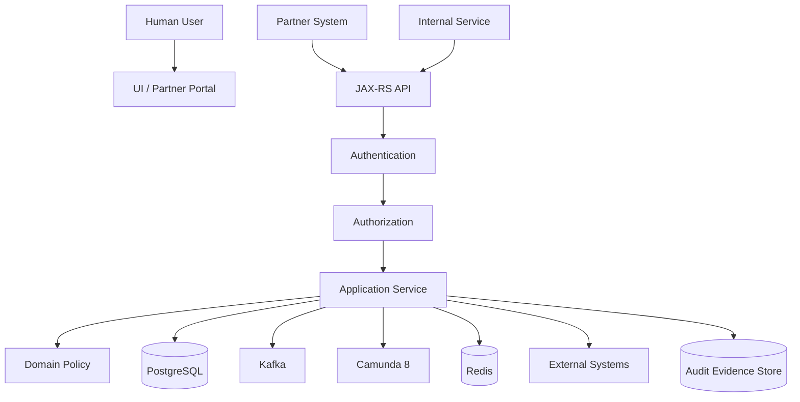
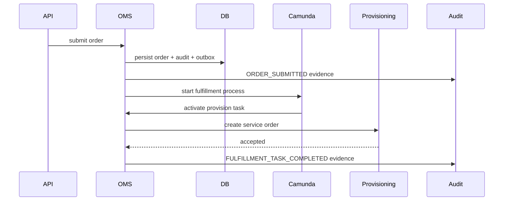

------
title: Build From Scratch: Enterprise Java Microservices CPQ & Order Management Platform - Part 054
description: Security, audit, and compliance defensibility for enterprise CPQ/OMS: access control, data protection, audit evidence, tamper resistance, approval proof, price override evidence, order lifecycle traceability, and regulatory-grade operational control.
series: learn-enterprise-cpq-oms-glassfish-camunda8
seriesTitle: Build From Scratch: Enterprise Java Microservices CPQ & Order Management Platform
order: 54
partTitle: Security, Audit, and Compliance Defensibility
tags:
  - java
  - microservices
  - cpq
  - oms
  - security
  - audit
  - compliance
  - access-control
  - authorization
  - data-protection
  - defensibility
  - production
date: 2026-07-02
---

# Part 054 — Security, Audit, and Compliance Defensibility

A CPQ/OMS platform handles commercially sensitive decisions:

- who can see customer data
- who can configure which product
- who can offer which price
- who can override discount rules
- who approved non-standard terms
- who converted quote to order
- who changed fulfillment state
- who repaired failed order data
- what exactly was promised to the customer
- what exactly was executed operationally

Security is not only login.

Audit is not only logs.

Compliance is not only a PDF policy.

For this platform, defensibility means:

> Given a quote, order, approval, price override, cancellation, or repair, the organization can prove who did what, when, from where, under which authority, using which input, producing which state change, with which evidence, and whether the change was allowed by policy at that time.

This part builds a defensible security and audit model for the CPQ/OMS system.

---

## 1. Security Scope for CPQ/OMS

Security must cover every layer:



Security concerns include:

- authentication
- authorization
- tenant isolation
- data scoping
- business policy enforcement
- data classification
- encryption
- secret management
- audit evidence
- tamper resistance
- secure integration
- repair governance
- operational access
- retention and deletion policy
- incident investigation support

A system can pass authentication and still fail security if authorization, data scoping, or audit evidence is weak.

---

## 2. Authentication Is Not Authorization

Authentication answers:

> Who is the caller?

Authorization answers:

> Is this caller allowed to perform this action on this resource under this context?

Example:

```text
Alice is authenticated.
Alice is a sales manager.
Alice belongs to tenant A.
Alice can approve discounts up to 15% for region Jakarta.
Alice cannot approve her own quote.
Alice cannot approve quote after it has expired.
Alice cannot view tenant B orders.
```

A token proving Alice is Alice does not prove all those permissions.

---

## 3. Principal, Actor, Subject, and Client

Use precise identity language.

| Term | Meaning |
|---|---|
| Principal | authenticated identity from token/session |
| Actor | business user or service performing action |
| Subject | resource being acted upon |
| Client application | application invoking API |
| Tenant | isolation boundary |
| Delegator | user who granted authority to another user |
| Effective actor | actor whose authority is used after delegation |
| Original actor | actor who actually performed the action |

Example request context:

```java
public record SecurityContext(
    String tenantId,
    String principalId,
    String actorId,
    String clientId,
    Set<String> roles,
    Set<String> scopes,
    Map<String, String> attributes,
    String authenticationMethod,
    Instant authenticatedAt
) {}
```

Example with delegation:

```java
public record EffectiveActor(
    String originalActorId,
    String effectiveActorId,
    String delegationId,
    String reason
) {}
```

Audit must store both original and effective actor.

---

## 4. RBAC Is Not Enough

Role-based access control is useful, but enterprise CPQ/OMS needs attribute- and policy-aware authorization.

### RBAC example

```text
ROLE_SALES_REP can create quote
ROLE_SALES_MANAGER can approve discount
ROLE_ORDER_MANAGER can repair order
```

### ABAC/policy examples

```text
Sales rep can update quote only if quote.ownerId == actor.id
Manager can approve quote only if quote.region in actor.allowedRegions
Manager cannot approve own submitted quote
Discount approval limit depends on margin band
Partner can view only orders submitted by its partner account
Repair requires active incident/fallout case
Cancellation after provisioning requires fulfillment supervisor permission
```

Authorization inputs:

- actor roles
- actor attributes
- tenant
- customer segment
- product family
- quote owner
- quote state
- order state
- price override amount
- margin impact
- approval policy
- delegation
- channel
- time window
- risk score
- repair reason

---

## 5. Authorization Enforcement Points

Authorization should be enforced at multiple layers.

| Layer | Enforcement |
|---|---|
| API gateway / edge | token validity, coarse route access, rate limit |
| JAX-RS filter | authentication, tenant extraction, scope check |
| Resource method | endpoint command authorization hook |
| Application service | business authorization |
| Domain policy | invariant and rule-based authorization |
| Repository/MyBatis | tenant/data scope guard |
| Kafka consumer | event tenant and producer trust validation |
| Camunda worker | service identity and action authority |
| Admin tool | elevated repair authorization |

Do not rely on UI hiding buttons.

Do not rely only on route-level role checks.

### Authorization service shape

```java
public interface AuthorizationService {
    void requireAllowed(RequestContext ctx, Permission permission, ResourceRef resource, AuthorizationFacts facts);
}
```

```java
public enum Permission {
    QUOTE_CREATE,
    QUOTE_UPDATE,
    QUOTE_PRICE,
    QUOTE_SUBMIT,
    QUOTE_APPROVE,
    QUOTE_REJECT,
    QUOTE_ACCEPT,
    QUOTE_CONVERT_TO_ORDER,
    ORDER_CREATE,
    ORDER_CANCEL,
    ORDER_AMEND,
    ORDER_REPAIR,
    PRICE_OVERRIDE,
    FULFILLMENT_TASK_RETRY,
    FULFILLMENT_TASK_FORCE_COMPLETE,
    AUDIT_VIEW
}
```

---

## 6. Tenant Isolation

Tenant isolation is a security invariant, not a query convention.

Bad:

```sql
SELECT * FROM quote WHERE quote_id = #{quoteId};
```

Better:

```sql
SELECT *
FROM quote
WHERE tenant_id = #{tenantId}
  AND quote_id = #{quoteId};
```

But even that is not enough if developers can forget `tenant_id`.

Use defense in depth:

- tenant ID in every business table
- composite unique constraints with tenant ID
- repository method requires tenant ID
- MyBatis mapper parameter object includes tenant ID
- integration event envelope includes tenant ID
- Redis key includes tenant ID
- audit record includes tenant ID
- workflow reference includes tenant ID
- test fixtures include cross-tenant negative tests

Example unique constraint:

```sql
CREATE UNIQUE INDEX uq_quote_tenant_quote_number
ON quote (tenant_id, quote_number);
```

Example mapper parameter:

```java
public record QuoteQuery(
    String tenantId,
    String quoteId
) {}
```

---

## 7. Data Classification

Not all data has the same sensitivity.

Classify data before designing storage, logs, events, cache, and access.

| Data | Classification | Handling |
|---|---|---|
| product offering name | public/internal | cacheable |
| price list | commercial sensitive | tenant/role-scoped |
| customer identity | sensitive | access controlled |
| contact email/phone | PII | masked in logs |
| quote total | commercial sensitive | audit access |
| discount override | sensitive decision | approval evidence |
| margin | highly sensitive | restricted |
| payment reference | regulated/sensitive | tokenize, never log raw |
| provisioning credentials | secret | secret manager only |
| audit trail | high integrity | append-only, protected |
| repair reason | sensitive operational | audited |

Security policy must answer:

- who can read it?
- who can modify it?
- can it be cached?
- can it be logged?
- can it be sent to Kafka?
- can it be exported?
- how long is it retained?
- how is it masked?

---

## 8. Logging Without Leaking Data

Logs are often the largest accidental data leak.

Never log:

- raw access tokens
- passwords
- API keys
- full payment data
- secrets
- private keys
- full personal identity documents
- raw customer notes if sensitive
- full request body for sensitive endpoints

Prefer structured, masked logs:

```json
{
  "event": "QUOTE_PRICE_OVERRIDDEN",
  "tenantId": "tenant_123",
  "quoteId": "quote_456",
  "actorId": "user_789",
  "correlationId": "corr_abc",
  "discountPercent": 18.5,
  "requiresApproval": true,
  "customerRef": "cust_***123"
}
```

### Log classification policy

| Log Field | Allowed? |
|---|---:|
| correlation ID | yes |
| tenant ID | yes |
| internal quote/order ID | yes |
| actor ID | yes |
| customer name | usually no or masked |
| email/phone | masked only |
| token | never |
| raw request body | no for sensitive commands |
| price total | depends on access/log sink |
| margin | highly restricted |

---

## 9. Audit Is Not Logging

Logs help engineers debug.

Audit records prove business action.

A log may be sampled, rotated, or unavailable to business auditors.

An audit record must be durable, queryable, protected, and semantically meaningful.

### Audit record fields

```text
audit_record
- audit_id
- tenant_id
- entity_type
- entity_id
- entity_version
- action_type
- actor_id
- original_actor_id
- effective_actor_id
- client_id
- source_ip_hash
- user_agent_hash
- command_id
- idempotency_key
- correlation_id
- causation_id
- before_state_hash
- after_state_hash
- before_summary_json
- after_summary_json
- policy_decision_json
- reason_code
- human_reason
- evidence_json
- created_at
- hash_previous
- hash_current
```

### Business audit examples

| Action | Required Evidence |
|---|---|
| quote created | actor, customer, channel, initial payload hash |
| product configured | selected offering, config snapshot hash |
| price calculated | price list version, pricing input hash, price result hash |
| discount overridden | old/new discount, reason, approval requirement |
| quote submitted | quote revision, validation result, approval policy version |
| quote approved | approver, authority, policy facts, timestamp |
| quote accepted | customer acceptance evidence |
| quote converted | quote revision, order ID, conversion hash |
| order cancelled | reason, state at cancellation, affected tasks |
| fulfillment forced complete | fallout case, approver, evidence |
| repair executed | repair script/command, before/after hash |

---

## 10. Audit Event vs Domain Event vs Integration Event

Do not overload one event type for everything.

| Type | Purpose | Audience | Mutability |
|---|---|---|---|
| Domain event | internal domain fact | same bounded context | derived from state change |
| Integration event | cross-service notification | other services | schema governed |
| Audit record | evidence of action | auditors/operators | append-only |
| Log event | debugging/operations | engineering | retention varies |
| Business timeline entry | operational history | support/business | durable projection |

Example:

```text
Command: ApproveQuote
Domain event: QuoteApproved
Integration event: quote.approved.v1
Audit record: actor X approved quote Y using policy Z
Business timeline: approval completed at time T
Log: approval command completed in 120ms
```

They may be created in one transaction, but they are not the same object.

---

## 11. Tamper Resistance

Audit records should be hard to alter silently.

Options:

1. append-only table
2. restricted database permissions
3. hash chaining
4. immutable storage export
5. periodic digest signing
6. separation of duties
7. audit query access logging

### Hash chain pattern

```text
hash_current = SHA256(
  tenant_id + audit_id + entity_id + action_type + actor_id + created_at + evidence_json + hash_previous
)
```

```sql
CREATE TABLE audit_record (
  audit_id TEXT PRIMARY KEY,
  tenant_id TEXT NOT NULL,
  entity_type TEXT NOT NULL,
  entity_id TEXT NOT NULL,
  action_type TEXT NOT NULL,
  evidence_json JSONB NOT NULL,
  hash_previous TEXT,
  hash_current TEXT NOT NULL,
  created_at TIMESTAMPTZ NOT NULL DEFAULT now()
);
```

Hash chaining does not make tampering impossible, but it makes unnoticed modification harder when combined with export/signing/monitoring.

---

## 12. Approval Defensibility

Approval is one of the most audit-sensitive parts of CPQ.

A defensible approval record must prove:

- what was requested
- why approval was required
- which policy version applied
- which facts were evaluated
- who was eligible to approve
- who actually approved
- whether approver had authority at approval time
- whether approver was allowed to approve this quote
- whether quote changed after approval
- what happened after approval

### Approval evidence snapshot

```json
{
  "approvalCaseId": "appr_123",
  "quoteId": "quote_456",
  "quoteRevision": 7,
  "policyVersion": "approval-policy-2026-07",
  "signals": [
    {
      "type": "DISCOUNT_EXCEEDS_LIMIT",
      "discountPercent": 18.5,
      "actorLimitPercent": 10.0,
      "requiredApproverLevel": "SALES_MANAGER_L2"
    }
  ],
  "eligibleApproverRule": {
    "region": "ID-JK",
    "productFamily": "ENTERPRISE_CONNECTIVITY",
    "minimumLevel": "L2",
    "excludeSubmitter": true
  },
  "decision": {
    "actorId": "user_789",
    "decision": "APPROVED",
    "reason": "Strategic enterprise renewal",
    "decidedAt": "2026-07-02T10:15:00Z"
  },
  "quoteHashAtDecision": "sha256:..."
}
```

If quote revision changes after approval, approval should become invalid unless policy explicitly allows minor non-commercial edits.

---

## 13. Price Override Defensibility

Manual price override is high risk.

Track:

- original calculated price
- override price
- difference amount
- difference percent
- margin impact if available
- reason code
- free-text reason
- actor authority
- approval signal
- policy version
- final approver
- customer-facing document version

Example audit summary:

```json
{
  "actionType": "PRICE_OVERRIDDEN",
  "quoteId": "quote_456",
  "quoteItemId": "item_1",
  "priceComponent": "MRC",
  "originalAmount": { "currency": "IDR", "amount": "1000000.00" },
  "overrideAmount": { "currency": "IDR", "amount": "850000.00" },
  "differencePercent": "15.00",
  "reasonCode": "COMPETITIVE_MATCH",
  "requiresApproval": true,
  "policyVersion": "pricing-approval-2026-07"
}
```

Do not store only the final price.

A final price without the path to reach it is not defensible.

---

## 14. Order Lifecycle Defensibility

OMS audit must prove execution lifecycle.

For each order:

- order creation source
- quote/order mapping
- validation result
- decomposition result
- fulfillment plan hash
- task state changes
- external request/response evidence
- retries
- compensation
- cancellation/amendment
- fallout and repair actions
- installed base mutation
- billing trigger
- customer notification

### Order timeline



A timeline must show both business state and technical evidence.

---

## 15. Repair and Admin Action Governance

Repair commands are dangerous because they bypass normal user journey.

A repair action should require:

- active incident/fallout case
- explicit permission
- reason code
- before/after snapshot
- peer approval for high-risk repair
- dry-run when possible
- execution ID
- rollback/compensation strategy if possible
- audit evidence

Example repair command:

```json
{
  "falloutCaseId": "fallout_123",
  "entityType": "FULFILLMENT_TASK",
  "entityId": "task_456",
  "repairType": "MARK_EXTERNAL_CALLBACK_RECEIVED",
  "expectedVersion": 4,
  "reasonCode": "EXTERNAL_CALLBACK_LOST",
  "evidenceReference": "ticket-INC-2026-0001"
}
```

Never allow generic SQL-like admin update from application UI.

Build specific repair commands with domain guardrails.

---

## 16. API Security Contract

Security expectations must be part of OpenAPI contract where useful.

Example OpenAPI direction:

```yaml
security:
  - bearerAuth: []

components:
  securitySchemes:
    bearerAuth:
      type: http
      scheme: bearer
      bearerFormat: JWT

paths:
  /api/v1/quotes/{quoteId}/submit:
    post:
      security:
        - bearerAuth: [quote:submit]
      parameters:
        - $ref: '#/components/parameters/TenantIdHeader'
        - $ref: '#/components/parameters/IdempotencyKeyHeader'
        - $ref: '#/components/parameters/CorrelationIdHeader'
```

But do not assume OpenAPI scope declaration enforces business authorization. The server must enforce it.

---

## 17. JAX-RS Security Filter Pipeline

Example pipeline:

```text
Request received
  -> correlation filter
  -> authentication filter
  -> tenant context filter
  -> rate limit filter
  -> authorization pre-check filter
  -> schema validation
  -> resource method
  -> application authorization
  -> domain invariant
  -> persistence tenant guard
  -> audit append
  -> response mapper
```

Example filter skeleton:

```java
@Provider
@Priority(Priorities.AUTHENTICATION)
public final class AuthenticationFilter implements ContainerRequestFilter {
    @Override
    public void filter(ContainerRequestContext request) {
        String authorization = request.getHeaderString("Authorization");
        Principal principal = tokenVerifier.verifyBearerToken(authorization);
        request.setProperty("principal", principal);
    }
}
```

Example authorization in application service:

```java
public SubmitQuoteResult submitQuote(RequestContext ctx, SubmitQuoteCommand command) {
    Quote quote = quoteRepository.load(ctx.tenantId(), command.quoteId());

    authorization.requireAllowed(
        ctx,
        Permission.QUOTE_SUBMIT,
        ResourceRef.quote(quote.id()),
        AuthorizationFacts.fromQuote(quote)
    );

    return unitOfWork.execute(ctx, () -> submitQuoteTx(ctx, command, quote));
}
```

Do not load cross-tenant resources before tenant is validated.

---

## 18. Kafka Security and Event Defensibility

Kafka events can leak data or trigger unauthorized downstream effects.

Controls:

- authenticate producers/consumers
- authorize topic access
- include tenant ID and producer service ID
- avoid unnecessary sensitive payload
- use references instead of raw PII when possible
- schema review for sensitive fields
- encrypt transport
- dedupe consumer events
- audit high-risk event production
- restrict replay tooling

Event envelope security fields:

```json
{
  "eventId": "evt_123",
  "eventType": "order.submitted.v1",
  "tenantId": "tenant_1",
  "producer": "oms-service",
  "producerInstance": "oms-service-7d9",
  "actorId": "user_123",
  "correlationId": "corr_123",
  "classification": "COMMERCIAL_SENSITIVE",
  "payloadSchema": "https://schemas.example.com/order-submitted.v1.json"
}
```

Downstream consumers must not trust events blindly if they cause sensitive action.

---

## 19. Camunda Security and Audit Boundary

Workflow state is useful operationally, but the domain database remains the source of truth.

Security rules:

- do not place sensitive full payloads in process variables
- store references and hashes instead
- restrict Operate/Tasklist access
- map human task authorization to business authorization
- audit user task assignment and completion
- record worker service identity
- do not let BPMN bypass application service authorization for business mutations

Example variable policy:

| Variable | Allowed? | Reason |
|---|---:|---|
| tenantId | yes | routing/authorization |
| quoteId | yes | reference |
| orderId | yes | reference |
| approvalCaseId | yes | reference |
| customer full profile | no | sensitive |
| full price breakdown | no | commercial sensitive; store in DB |
| price hash | yes | evidence correlation |
| task ID | yes | routing |

---

## 20. Redis Security Boundary

Redis is often treated casually because it is “just cache”. That is dangerous.

Controls:

- no secrets in cache
- no raw token storage unless designed as secure session store
- TTL for sensitive cached data
- tenant prefix in all keys
- encryption in transit if supported/deployed
- access limited to application network
- key naming avoids PII
- cache invalidation for permission changes
- no cache-based authorization without source-of-truth validation for high-risk commands

Bad key:

```text
customer:john.smith@example.com:quotes
```

Better key:

```text
tenant:t_123:customer:c_456:quote-summary:v3
```

---

## 21. Data Protection

Data protection concerns:

- encryption in transit
- encryption at rest
- tokenization/masking
- least privilege database accounts
- secret rotation
- retention policy
- backup access
- data export control
- right-to-delete/retention conflict handling where applicable

### Database account separation

Use separate accounts or privilege profiles:

| Account | Capability |
|---|---|
| migration user | DDL during deployment only |
| app write user | application DML only |
| read model user | read-only projection access |
| reporting user | restricted reporting views |
| audit reader | audit query only |
| break-glass admin | controlled emergency access |

The application account should not be a superuser.

---

## 22. Secrets Management

Never store secrets in:

- Git repository
- application config committed to source
- logs
- audit evidence
- Kafka payload
- Camunda variables
- Redis keys/values
- database tables unless explicitly encrypted/tokenized

Secrets include:

- DB passwords
- Kafka credentials
- OAuth client secrets
- payment provider keys
- provisioning credentials
- signing keys
- encryption keys
- API tokens

Design requirements:

- external secret provider or protected deployment secret mechanism
- rotation process
- least privilege
- separate secrets by environment
- no production secrets in dev/test
- audit secret access if platform supports it

---

## 23. Compliance Defensibility Matrix

A useful design maps compliance concerns to system controls.

| Concern | System Control |
|---|---|
| unauthorized quote access | tenant guard + authorization + audit |
| unauthorized discount | policy evaluator + approval case + audit evidence |
| price manipulation | immutable price snapshot + override audit + approval |
| order mutation after submit | state machine + expected version + repair governance |
| missing approval evidence | approval evidence snapshot + hash |
| invisible admin repair | repair command + before/after audit |
| data leak in logs | masking + log classification |
| replay duplicate event | inbox dedupe |
| lost integration command | outbox + relay monitoring |
| tampered audit | append-only + hash chain + restricted access |
| stale permission cache | permission version/invalidation |
| cross-tenant read | tenant-scoped repository and tests |

---

## 24. Security Test Strategy

Security must be tested as part of the normal delivery pipeline.

### Unit tests

- permission evaluator denies own quote approval
- discount approval limit enforced
- expired quote cannot be accepted
- repair command requires active fallout
- tenant mismatch rejected
- sensitive fields masked in log event builder

### API tests

- missing token returns 401
- invalid token returns 401
- valid token insufficient scope returns 403
- tenant header mismatch rejected
- actor cannot access another tenant resource
- idempotency replay does not bypass authorization
- admin endpoint inaccessible to normal user

### Persistence tests

- mapper includes tenant filter
- cross-tenant ID collision does not leak data
- audit record inserted in same transaction as state change
- append-only audit table cannot be updated by app role

### Kafka tests

- consumer rejects event with wrong tenant/producer context
- duplicate event is ignored through inbox
- sensitive payload fields are absent/masked

### Camunda tests

- user task completion validates business authorization
- worker cannot mutate domain state without service identity
- process variable payload does not contain sensitive fields

### Negative tests

Negative tests are more important than happy path security tests.

```text
Given quote belongs to tenant A
When actor from tenant B requests quote detail
Then API returns 404 or 403 according to policy
And no sensitive quote data appears in response/log
And audit/security event is recorded if configured
```

---

## 25. Audit Query and Investigation UX

Defensibility also depends on whether humans can retrieve evidence.

Support investigation queries:

- show all actions for quote
- show approval path for quote revision
- show price override evidence
- show quote-to-order conversion evidence
- show order state transition timeline
- show all repair actions by entity
- show actor activity over time
- show access to sensitive audit records
- show external call evidence for fulfillment task

Example audit search API:

```http
GET /api/v1/audit-records?entityType=QUOTE&entityId=quote_456
GET /api/v1/orders/{orderId}/timeline
GET /api/v1/quotes/{quoteId}/approval-evidence
```

Return evidence without leaking unnecessary sensitive data.

---

## 26. Break-Glass Access

Break-glass access is emergency access that bypasses normal constraints under strict control.

Design it explicitly:

- disabled by default
- requires strong authentication
- requires reason and ticket
- time-limited
- dual approval if possible
- all actions audited
- notification to security/operations
- post-incident review

Break-glass should not be a shared admin password.

---

## 27. Threat Model Cheat Sheet

| Threat | Example | Control |
|---|---|---|
| horizontal privilege escalation | user reads another tenant quote | tenant isolation |
| vertical privilege escalation | sales rep approves large discount | ABAC/policy |
| confused deputy | worker performs unauthorized mutation | service identity + app auth |
| replay | repeated submit order | idempotency |
| tampering | audit row modified | append-only/hash chain |
| information disclosure | PII in logs/Kafka | masking/classification |
| repudiation | actor denies approval | audit evidence |
| denial of service | tenant floods pricing API | rate limit/bulkhead |
| stale authorization | revoked role still cached | permission version/invalidation |
| unsafe repair | admin forces completion incorrectly | repair governance |

---

## 28. Common Anti-Patterns

### Anti-pattern: authorization only in UI

APIs and workers remain vulnerable.

### Anti-pattern: tenant ID optional in mapper

One missed filter becomes cross-tenant leakage.

### Anti-pattern: audit trail built from logs

Logs are not durable business evidence.

### Anti-pattern: generic admin update endpoint

This destroys domain invariants and audit clarity.

### Anti-pattern: storing full sensitive payload in Camunda variables

Workflow tooling becomes a data leak surface.

### Anti-pattern: events contain everything “just in case”

Kafka becomes uncontrolled data distribution.

### Anti-pattern: approval record stores only approver ID

It does not prove why approval was required or whether the approver had authority.

### Anti-pattern: final price without calculation/override evidence

You cannot defend the commercial decision later.

---

## 29. Production Checklist

Before calling security/audit complete, verify:

- authentication validates token/session correctly
- authorization is enforced in application service, not only UI/API gateway
- tenant ID exists in every business table and query
- cross-tenant tests exist
- sensitive fields are classified
- log masking is tested
- Kafka payloads avoid unnecessary sensitive data
- Redis keys/values do not contain raw PII/secrets
- Camunda variables store references/hashes, not full sensitive payloads
- audit record is inserted atomically with state change
- approval evidence includes policy version and facts
- price override evidence includes before/after and reason
- repair actions require fallout/incident context
- break-glass access is controlled and audited
- audit records are protected from update/delete by application role
- retention policy is defined
- investigation queries are available
- security events have alerting path

---

## 30. Final Mental Model

Security for CPQ/OMS is not a layer you add after business logic.

It is part of the domain model.

A quote is not just editable or not editable. It is editable by a specific actor, under a tenant, in a state, before expiry, with permission, with policy constraints, producing audit evidence.

A price is not just a number. It is a calculated commercial decision with source price list, discount, override, reason, approval, and customer-facing consequence.

An order is not just a workflow instance. It is a legally and operationally significant execution commitment with lifecycle evidence.

A repair is not just an update. It is an exceptional controlled intervention that must be explainable later.

Top-tier engineers design systems that can answer:

- was this allowed?
- who allowed it?
- what evidence did they use?
- what changed?
- who was impacted?
- can we prove it?
- can we detect abuse?
- can we repair safely?

That is security and compliance defensibility.

---

## References

- OWASP Application Security Verification Standard provides a basis for testing web application technical security controls and secure development requirements.
- NIST SP 800-53 Rev. 5 provides a catalog of security and privacy controls, including access control and audit/accountability control families.
- OAuth 2.0 and bearer token standards define common authorization/token usage patterns for API access.
- PostgreSQL privileges, constraints, and transaction behavior support tenant isolation, append-only audit, and source-of-truth enforcement.
- Kafka, Redis, and Camunda 8 must be treated as additional security boundaries because they can carry sensitive business context.
