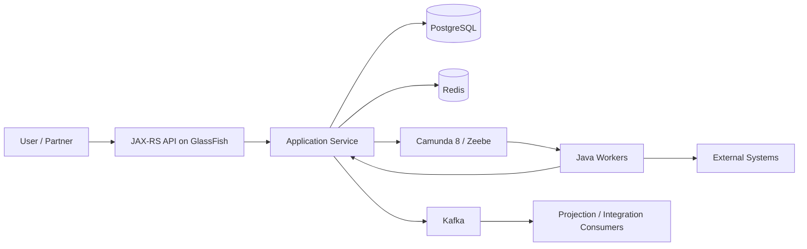
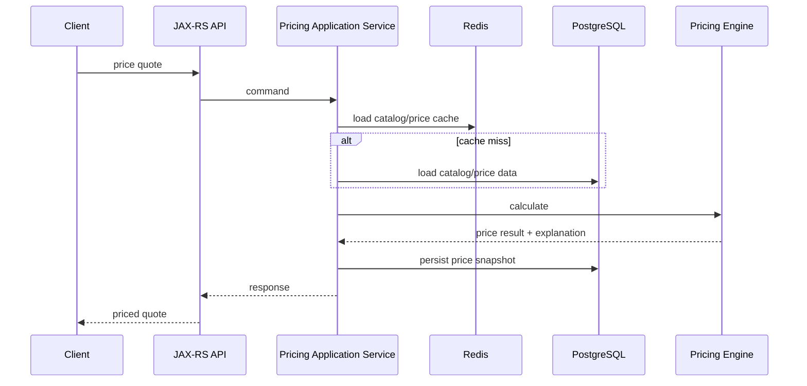
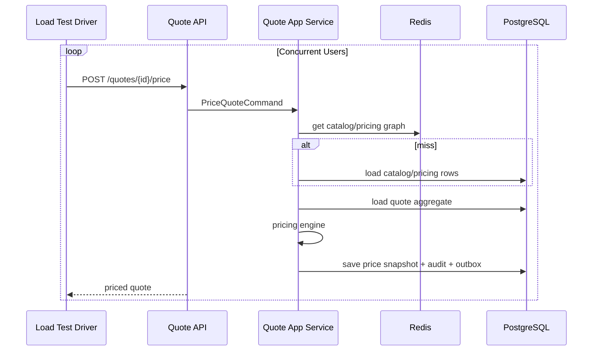

------
title: Build From Scratch: Enterprise Java Microservices CPQ & Order Management Platform - Part 055
description: Performance, capacity, and load testing strategy for enterprise CPQ/OMS: latency budget, throughput model, workload profiles, PostgreSQL query tuning, Kafka lag, Camunda worker throughput, Redis cache efficiency, GlassFish/JAX-RS runtime behavior, and production-grade test execution.
series: learn-enterprise-cpq-oms-glassfish-camunda8
seriesTitle: Build From Scratch: Enterprise Java Microservices CPQ & Order Management Platform
order: 55
partTitle: Performance, Capacity, and Load Testing
tags:
  - java
  - microservices
  - cpq
  - oms
  - performance
  - capacity-planning
  - load-testing
  - postgresql
  - kafka
  - redis
  - camunda-8
  - glassfish
  - production
  - observability
date: 2026-07-02
---

# Part 055 — Performance, Capacity, and Load Testing

A CPQ/OMS system is not performance-critical in the same way as a gaming backend or market data platform.

The dangerous failure is different.

The dangerous failure is when the system appears fine under average traffic, but collapses during business-critical bursts:

- end-of-quarter quote submissions
- campaign launch
- partner bulk order capture
- catalog publish
- approval backlog after pricing policy change
- fulfillment spike after sales acceptance
- delayed Kafka consumers replaying old events
- Camunda workers retrying failed integrations
- Redis cache miss storm after invalidation
- PostgreSQL query plan regression after data growth

Performance engineering for CPQ/OMS is not about chasing the lowest possible latency.

It is about proving that the platform can keep its promises under realistic load while preserving correctness, audit, idempotency, and operational recoverability.

In this part, we build the performance model and load testing strategy for the platform.

---

## 1. The Core Question

The question is not:

> How fast is the API?

The better question is:

> Under a defined workload, data size, failure rate, and concurrency level, can the system maintain acceptable latency, throughput, correctness, recovery behavior, and operational visibility?

For CPQ/OMS, the performance target has multiple dimensions:

| Dimension | Example Question |
|---|---|
| API latency | Can quote pricing return within target latency? |
| Command throughput | Can the system accept N order submissions per minute? |
| Workflow throughput | Can Camunda workers complete fulfillment tasks fast enough? |
| Event throughput | Can Kafka consumers keep lag bounded? |
| DB scalability | Can PostgreSQL queries remain stable as quote/order history grows? |
| Cache efficiency | Does Redis reduce expensive catalog/pricing reads without stale correctness? |
| Recovery time | How quickly does the system recover after dependency outage? |
| Backlog handling | Can the system drain queue/workflow/event backlog predictably? |
| Human operations | Can operators see what is slow, stuck, or unsafe? |

Performance is not an afterthought.

Performance is a property of architecture.

---

## 2. Performance Mental Model

A production CPQ/OMS platform has several execution paths.



Each path has a different bottleneck pattern.

| Path | Typical Bottleneck |
|---|---|
| Catalog lookup | cache miss, DB index, JSONB filtering |
| Configuration validation | rule graph complexity, cache invalidation, large bundle |
| Pricing | promotion explosion, discount stacking, rounding/tax integration |
| Quote submit | validation pipeline, approval policy lookup, optimistic lock conflicts |
| Quote conversion | transaction size, snapshot copy, order creation, outbox insert |
| Order decomposition | graph expansion, technical catalog mapping, task persistence |
| Fulfillment execution | external dependency latency, worker concurrency, retry storm |
| Event projection | Kafka consumer lag, DB write throughput, poison events |
| Operational search | query plan regression, missing composite indexes, unbounded filters |

The key is to measure every path separately, then measure combined business flows.

---

## 3. Performance Invariants

Before load testing, define performance invariants.

These are not targets yet. They are rules the system must never violate under load.

### 3.1 Correctness Beats Latency

Never trade correctness for speed in core business commands.

A faster quote conversion that can duplicate orders is worse than a slower conversion.

A faster fulfillment worker that can execute a provisioning task twice is worse than a slower worker.

### 3.2 PostgreSQL Is the Source of Truth

Redis can accelerate reads.
Kafka can distribute events.
Camunda can orchestrate processes.

But business truth for quote, order, asset, fulfillment task, idempotency, outbox, inbox, and audit must remain durable.

### 3.3 Load Tests Must Include State Growth

Testing with 1,000 rows is not performance testing.

A CPQ/OMS platform must be tested with realistic data volume:

- thousands of product offerings
- tens of thousands of price rows
- large characteristic sets
- millions of quote/order records
- deep order item histories
- long audit timelines
- historical workflow references
- outbox/inbox retention data

### 3.4 Load Tests Must Include Failure

Happy-path load testing is incomplete.

Real tests include:

- dependency timeout
- retry with backoff
- Kafka consumer restart
- Camunda worker restart
- Redis cache flush
- PostgreSQL failover simulation if available
- duplicate requests
- stale `If-Match` version
- idempotency replay
- external callback delay

### 3.5 Average Latency Is Almost Useless Alone

Use percentiles.

| Metric | Meaning |
|---|---|
| p50 | typical user experience |
| p90 | normal high-load experience |
| p95 | performance guardrail |
| p99 | tail risk |
| max | anomaly clue, not primary target |

CPQ/OMS is often harmed by p95/p99 spikes, because a few slow commands can hold locks, trigger retries, create worker backlog, and produce cascading delay.

---

## 4. Define Business Workload Profiles

Do not start with tool scripts.

Start with workload profiles.

### 4.1 Interactive Sales Workload

Typical sales rep or partner user flow:

1. Search catalog.
2. Select product offering.
3. Configure product.
4. Price quote.
5. Modify configuration.
6. Re-price.
7. Submit quote.
8. Wait for approval or accept.

Performance target is user-facing latency.

Important metrics:

- catalog search latency
- configuration validation latency
- pricing latency
- quote save latency
- quote submit latency
- error rate
- Redis hit ratio
- PostgreSQL query time

### 4.2 Partner Bulk Quote Workload

A partner system may submit many quote requests via API.

Important metrics:

- requests per second
- idempotency conflict behavior
- duplicate suppression
- rate limiting
- API p95/p99
- DB connection pool saturation
- Kafka outbox backlog

### 4.3 End-of-Quarter Approval Workload

Sales teams submit many quotes near deadline.

Important metrics:

- approval policy evaluation latency
- approval case creation throughput
- Camunda process start throughput
- user task creation rate
- reminder/escalation timer volume
- approval dashboard query latency

### 4.4 Order Conversion Workload

Accepted quotes convert to orders.

Important metrics:

- conversion transaction time
- order row creation rate
- outbox event creation rate
- optimistic lock conflicts
- duplicate conversion prevention
- Camunda workflow start request backlog

### 4.5 Fulfillment Workload

Order fulfillment is usually asynchronous.

Important metrics:

- fulfillment plan generation latency
- task execution throughput
- Camunda job activation rate
- worker complete/fail rate
- external dependency latency
- incident creation rate
- fallout case creation rate
- backlog drain time

### 4.6 Event Replay Workload

Consumers may need to replay projections.

Important metrics:

- Kafka consumer lag
- projection write throughput
- inbox deduplication latency
- DB deadlock count
- projection drift rate
- catch-up time

---

## 5. Latency Budget

A latency budget assigns time to each layer.

Example for interactive `POST /quotes/{id}/price`:



Example target budget:

| Segment | Budget |
|---|---:|
| HTTP/JAX-RS overhead | 20 ms |
| auth/tenant/idempotency filter | 20 ms |
| quote load | 50 ms |
| catalog/price data access | 100 ms |
| pricing calculation | 150 ms |
| persist snapshot + audit + outbox | 120 ms |
| response serialization | 40 ms |
| total p95 target | 500 ms |

The exact numbers are business-specific.

The principle is universal:

> Without a budget, every layer assumes another layer can absorb the cost.

---

## 6. Throughput Model

Throughput is constrained by the slowest saturated resource.

Simplified:

```text
max_throughput = min(
  api_thread_capacity,
  db_transaction_capacity,
  kafka_publish_capacity,
  redis_capacity,
  camunda_worker_capacity,
  external_dependency_capacity
)
```

For synchronous commands, database transaction capacity is usually the main constraint.

For fulfillment, external system latency and worker concurrency usually dominate.

For projections, Kafka consumer throughput and database write throughput dominate.

### 6.1 Little's Law

A simple operational mental model:

```text
concurrency = throughput × latency
```

If quote pricing takes 500 ms and you need 100 requests/second:

```text
concurrency = 100 × 0.5 = 50 concurrent requests
```

If an external provisioning call takes 10 seconds and you need 20 tasks/second:

```text
concurrency = 20 × 10 = 200 concurrent tasks
```

That number must be supported by:

- worker threads
- DB connection pool
- HTTP client pool
- external system rate limit
- Camunda job activation
- memory footprint
- timeout budget

High throughput with slow dependencies requires high concurrency.

High concurrency without isolation causes collapse.

---

## 7. CPQ-Specific Performance Risks

### 7.1 Configuration Rule Explosion

Configuration can become expensive when rules are evaluated naively.

Bad design:

```text
for every selected option:
  scan every rule:
    scan every other option:
      evaluate condition
```

Better design:

- pre-index rules by product offering
- pre-index rules by trigger characteristic
- cache compiled rule graph by catalog version
- evaluate only affected nodes on incremental changes when possible
- detect cycles at publish time
- keep explanation path

### 7.2 Pricing Promotion Explosion

Promotions can explode combinatorially.

Danger signs:

- discount stacking without deterministic order
- promotion eligibility scanning every active campaign
- bundle discount matching by brute force
- recursive discount dependencies
- manual override recalculating entire quote unnecessarily

Guardrails:

- pre-filter promotion candidates by market, customer segment, channel, product, effective date
- deterministic promotion priority
- explicit stacking group
- bounded combination search
- price explanation tree
- pricing snapshot hash

### 7.3 Quote Revision Growth

Quotes may have many revisions.

Avoid loading full history for command execution.

Command load should load:

- current quote header
- current quote items
- active configuration snapshot
- active price snapshot
- row version
- approval status

History load should be separate.

### 7.4 Operational Search Without Boundaries

Bad search API:

```http
GET /orders?customerName=...&status=...&createdFrom=...&anyText=...&sort=randomField
```

without index strategy.

Better:

- explicit supported filters
- cursor pagination
- stable sort keys
- mandatory tenant filter
- maximum page size
- query timeout
- explain plan baseline
- separate export/reporting path

---

## 8. PostgreSQL Performance Model

PostgreSQL performance must be treated as part of application design.

### 8.1 Query Plan Literacy

Every critical query should have an expected plan.

Use `EXPLAIN` to inspect the query plan.
Use `EXPLAIN ANALYZE` carefully to execute the query and collect actual runtime statistics.

Example:

```sql
EXPLAIN (ANALYZE, BUFFERS)
SELECT q.quote_id, q.quote_number, q.status, q.updated_at
FROM quote q
WHERE q.tenant_id = :tenant_id
  AND q.status = :status
  AND q.updated_at < :cursor_updated_at
ORDER BY q.updated_at DESC, q.quote_id DESC
LIMIT 50;
```

Look for:

- sequential scan on large table
- wrong row estimate
- sort spilling to disk
- nested loop over large result
- missing composite index
- unused index
- excessive heap fetches
- high buffer reads

### 8.2 Index Strategy

Indexes improve lookup speed but add write overhead.

For CPQ/OMS, design indexes based on access paths.

Example quote worklist index:

```sql
CREATE INDEX idx_quote_worklist
ON quote (tenant_id, status, updated_at DESC, quote_id DESC);
```

Example order search index:

```sql
CREATE INDEX idx_order_customer_status_created
ON customer_order (tenant_id, customer_account_id, status, created_at DESC, order_id DESC);
```

Example outbox relay index:

```sql
CREATE INDEX idx_outbox_pending
ON outbox_event (status, available_at, outbox_id)
WHERE status = 'PENDING';
```

Example inbox dedupe constraint:

```sql
CREATE UNIQUE INDEX uq_inbox_consumer_event
ON inbox_event (consumer_name, event_id);
```

### 8.3 Avoid Unbounded JSONB Queries

JSONB is useful for snapshots and flexible evidence payloads.

But JSONB should not become a hidden relational model.

Use JSONB for:

- immutable configuration snapshot
- price explanation snapshot
- audit evidence
- external payload record
- workflow variable snapshot

Avoid using JSONB as the primary filtering mechanism for high-volume operational queries unless indexed and proven.

### 8.4 Connection Pool Budget

More DB connections are not always better.

Too many connections can increase contention and memory pressure.

Define pool size per deployable:

| Deployable | DB Pool Need |
|---|---:|
| API WAR | interactive command/query traffic |
| Worker JAR | task execution and state update |
| Outbox relay | polling + marking events |
| Projection consumer | event handling writes |
| Admin/repair tool | limited, protected |

Do not let every component open a large pool independently.

### 8.5 Transaction Duration

Long transaction = lock risk + vacuum pressure + contention.

Keep transactions short:

```text
load aggregate
validate command
compute deterministic result
persist changes
insert audit/outbox
commit
```

Do not perform inside DB transaction:

- external HTTP call
- Kafka publish wait
- Camunda process start wait
- Redis cache invalidation wait
- large report generation
- user think time

---

## 9. MyBatis Performance Model

MyBatis gives explicit SQL control.

That is powerful.

It also means performance mistakes are explicit too.

### 9.1 Avoid N+1 Query Patterns

Bad pattern:

```java
List<OrderRow> orders = mapper.findOrders(...);
for (OrderRow order : orders) {
    List<OrderItemRow> items = mapper.findItems(order.id());
}
```

Better:

```java
List<OrderRow> orders = mapper.findOrders(...);
List<OrderItemRow> items = mapper.findItemsByOrderIds(orderIds);
```

Then assemble in memory.

### 9.2 Use Separate Command and Query Mappers

Command mapper:

- loads aggregate by ID
- uses precise lock/version guard
- writes state transition
- inserts audit/outbox

Query mapper:

- returns projections
- uses pagination
- avoids aggregate reconstruction
- optimized for worklist/search/dashboard

### 9.3 Measure Mapper Time

Wrap mapper calls with metrics:

```text
mybatis.query.duration{mapper="QuoteMapper.findForCommand"}
mybatis.query.duration{mapper="OrderSearchMapper.search"}
mybatis.rows.returned{mapper="OrderSearchMapper.search"}
```

Do not log raw SQL with sensitive values in production logs.

---

## 10. Kafka Performance Model

Kafka throughput depends on:

- producer batching
- compression
- partition count
- key distribution
- consumer parallelism
- consumer processing time
- broker capacity
- retention/compaction policy
- downstream database writes

For CPQ/OMS, the important metric is rarely raw Kafka throughput.

The important question is:

> Can consumers process business events fast enough to keep lag bounded while preserving idempotency and ordering expectations?

### 10.1 Topic Partitioning

Partition key examples:

| Topic | Partition Key | Why |
|---|---|---|
| `cpq.quote.events.v1` | `quoteId` | preserve quote event order |
| `oms.order.events.v1` | `orderId` | preserve order event order |
| `oms.fulfillment-task.events.v1` | `orderId` or `taskId` | depends on ordering need |
| `audit.business-events.v1` | `tenantId` or aggregate ID | balance vs trace locality |

Poor partition key causes:

- hot partition
- broken ordering expectation
- limited consumer scale
- difficult replay

### 10.2 Consumer Lag

Consumer lag is a symptom, not the disease.

Potential causes:

- slow handler
- downstream PostgreSQL bottleneck
- poison message retries
- consumer rebalance
- insufficient partitions
- external dependency calls inside consumer
- inbox contention
- large messages

Operational response:

1. Identify topic/partition/consumer group.
2. Check handler latency.
3. Check error/retry rate.
4. Check DB write latency.
5. Check rebalance frequency.
6. Check poison message/DLQ count.
7. Scale consumers only if partitioning and downstream systems can handle it.

### 10.3 Replay Performance

Replay should be planned.

Projection replay can damage production if it competes with live traffic.

Control replay with:

- isolated consumer group
- rate limit
- batch size
- checkpoint
- read-only dry run
- projection rebuild table
- cutover validation

---

## 11. Camunda 8 / Zeebe Performance Model

Camunda 8 performance in OMS is about workflow throughput, worker throughput, job latency, incident rate, and backlog drain time.

### 11.1 Workflow Metrics

Track:

- process instance start rate
- active process instances
- job activation rate
- job completion rate
- job failure rate
- incident count
- task duration by job type
- worker timeout count
- retry exhaustion
- message correlation latency
- timer volume

### 11.2 Worker Capacity

Worker throughput depends on:

```text
worker_throughput = worker_concurrency / average_task_duration
```

If a provisioning task takes 5 seconds and worker concurrency is 50:

```text
throughput = 50 / 5 = 10 tasks/sec
```

But that assumes:

- DB pool supports it
- external system supports it
- network supports it
- retry rate is low
- no global lock bottleneck
- task payload size is controlled

### 11.3 Job Type Isolation

Do not put all job types in one worker pool.

Separate by behavior:

| Job Type | Pool Strategy |
|---|---|
| CPU-light DB update | moderate concurrency |
| external provisioning call | controlled concurrency, timeout-heavy |
| inventory reservation | external rate-limit aware |
| notification | high concurrency, low criticality |
| billing activation | low concurrency, strong idempotency |
| manual repair | low concurrency, operator-controlled |

### 11.4 Incident Storm

If an external dependency is down, workers can create incident/retry storms.

Guardrails:

- circuit breaker at adapter layer
- retry budget
- backoff
- fallout threshold
- job type pause switch
- operational kill switch
- dashboard per dependency

---

## 12. Redis Performance Model

Redis should reduce repeated expensive reads.

Measure:

- cache hit ratio
- cache miss latency
- key count
- memory usage
- eviction count
- command latency
- hot keys
- stale rejection count
- stampede prevention count

### 12.1 Cache Hit Ratio Is Not Enough

A 99% hit ratio can still be bad if the 1% misses are all high-cost operations during peak traffic.

Measure miss impact:

```text
cache.miss.cost_ms{domain="pricing"}
cache.miss.cost_ms{domain="catalog"}
cache.rebuild.concurrent{cache="catalog-version"}
```

### 12.2 Cache Stampede Test

Test scenario:

1. Warm catalog cache.
2. Invalidate active catalog version.
3. Start 500 concurrent pricing requests.
4. Ensure only one/few cache rebuilds happen.
5. Ensure DB does not spike uncontrollably.
6. Ensure stale catalog version is rejected for write commands.

---

## 13. GlassFish/JAX-RS Runtime Performance

For the API WAR, watch:

- request thread pool utilization
- HTTP connection queue
- JSON serialization time
- request body size
- response size
- exception mapper rate
- auth filter latency
- validation latency
- DB pool wait time
- GC pause
- memory usage

### 13.1 Thread Pool and Blocking Calls

JAX-RS endpoints are usually blocking request handlers.

If handlers wait on slow downstream calls, request threads are consumed.

For core command endpoints:

- keep transaction short
- do not call external systems synchronously unless required
- use outbox/workflow for async continuation
- enforce timeout on all client calls
- limit request size

### 13.2 Serialization Cost

Large quote/order responses can become expensive.

Use:

- projection-specific DTOs
- pagination
- optional expansion
- compressed response when appropriate
- avoid returning full audit timeline by default
- avoid returning full workflow variable payload by default

---

## 14. Load Test Taxonomy

### 14.1 Smoke Performance Test

Small test after deployment.

Goal:

- verify service responds
- verify DB connection
- verify Redis/Kafka/Camunda connectivity
- verify baseline latency

### 14.2 Load Test

Expected normal traffic.

Goal:

- validate target SLO
- confirm resource usage
- detect obvious bottlenecks

### 14.3 Stress Test

Beyond expected traffic.

Goal:

- find saturation point
- observe graceful degradation
- confirm rate limiting
- confirm no data corruption

### 14.4 Spike Test

Sudden burst.

Goal:

- validate queue behavior
- validate worker scaling
- validate DB pool behavior
- validate cache stampede control

### 14.5 Soak Test

Long-duration test.

Goal:

- detect memory leak
- detect connection leak
- detect growing latency
- detect audit/outbox/inbox table growth issue
- detect GC behavior

### 14.6 Failure Load Test

Load while dependencies fail.

Goal:

- validate timeout/retry/circuit breaker
- validate fallout creation
- validate backlog drain
- validate manual repair path

---

## 15. Test Data Design

Performance tests are only useful if data shape is realistic.

### 15.1 Catalog Dataset

Include:

- simple product
- configurable product
- large bundle
- incompatible options
- dependency rules
- market-specific offering
- channel-specific pricing
- expired offerings
- future offerings
- active and inactive price lists

### 15.2 Quote Dataset

Include:

- draft quote
- priced quote
- approval-pending quote
- approved quote
- expired quote
- revised quote
- quote with many items
- quote with heavy discounting
- quote with manual override

### 15.3 Order Dataset

Include:

- order with simple fulfillment
- order with parallel tasks
- order with external callback
- order with manual task
- order in fallout
- cancellation order
- amendment order
- order with partial completion

### 15.4 Historical Volume

Generate enough history:

- millions of audit rows
- millions of order events
- old outbox/inbox records
- historical workflow references
- old quote revisions

Index behavior changes with volume.

---

## 16. Capacity Planning Worksheet

Use a worksheet like this.

| Input | Example |
|---|---:|
| peak quote pricing requests/sec | 80 |
| p95 pricing target | 500 ms |
| peak order submissions/sec | 20 |
| average order items | 5 |
| average fulfillment tasks/order | 8 |
| external provisioning p95 | 4 seconds |
| event fanout per order | 12 events |
| projection consumers | 4 |
| acceptable Kafka lag | < 5 minutes |
| backlog drain target | < 30 minutes |

Derived:

```text
pricing_concurrency = 80 * 0.5 = 40 active pricing requests
fulfillment_tasks_per_sec = 20 * 8 = 160 task creations/sec
worker_concurrency_needed = target_task_throughput * avg_task_duration
```

Then validate:

- API thread pool
- DB pool
- DB CPU/IO
- Redis memory/network
- Kafka partitions
- Camunda workers
- external rate limits
- observability volume

---

## 17. Example Performance Acceptance Criteria

These numbers are illustrative, not universal.

```text
Catalog search:
  p95 <= 300 ms
  p99 <= 800 ms

Configuration validate:
  p95 <= 500 ms for normal product
  p95 <= 1500 ms for large bundle

Quote pricing:
  p95 <= 700 ms normal quote
  p95 <= 2000 ms large bundle quote

Quote submit:
  p95 <= 500 ms excluding human approval wait

Quote to order conversion:
  p95 <= 1500 ms for normal quote
  duplicate conversion rate = 0

Order decomposition:
  p95 <= 2000 ms for normal order

Fulfillment worker:
  retry exhaustion <= agreed threshold
  duplicate external execution = 0

Kafka consumers:
  lag bounded under normal traffic
  backlog drain under target after outage

PostgreSQL:
  no critical query sequential scan on large operational tables unless intentionally accepted

Redis:
  no correctness dependency on cache presence
```

---

## 18. Load Test Scenario: Quote Pricing



Validate:

- p95/p99 latency
- cache hit ratio
- DB query latency
- row lock wait
- error rate
- response size
- pricing deterministic hash
- audit inserted
- outbox inserted

---

## 19. Load Test Scenario: Order Fulfillment Backlog

Setup:

1. Create 10,000 orders.
2. Each order has 8 fulfillment tasks.
3. External provisioning adapter returns in 2 seconds p95.
4. 5% of calls fail transiently.
5. 1% fail permanently.

Measure:

- task activation rate
- task completion rate
- task failure rate
- incident count
- fallout count
- worker CPU/memory
- DB connection wait
- external call latency
- backlog drain time
- Kafka emitted events

Expected behavior:

- retry stays bounded
- permanent failure creates fallout
- no duplicate external execution
- operator dashboard shows stuck tasks
- backlog drains after dependency recovers

---

## 20. Load Test Scenario: Kafka Projection Replay

Setup:

1. Use separate consumer group.
2. Replay `oms.order.events.v1` from beginning.
3. Rebuild projection table.
4. Compare old and new projection counts/hash.

Measure:

- consumer lag drain rate
- projection write throughput
- DB lock contention
- inbox dedupe behavior
- poison event handling
- CPU/IO usage

Guardrail:

Replay must not starve live command traffic.

---

## 21. Performance Regression Pipeline

Add performance checks to CI/CD in layers.

### 21.1 Fast Checks

- schema diff
- query existence
- mapper unit tests
- golden payload tests
- micro-benchmark for pricing/configuration core

### 21.2 Medium Checks

- Testcontainers PostgreSQL mapper tests
- API contract performance smoke
- outbox relay test
- Kafka consumer test
- worker idempotency test

### 21.3 Heavy Checks

Run before release or nightly:

- full load test
- soak test
- replay test
- failure load test
- migration performance test

Do not run all heavy tests on every commit.

But do run them before production-impacting releases.

---

## 22. Observability During Load Test

A load test without observability is just traffic generation.

Required dashboards:

### API Dashboard

- request rate
- p50/p95/p99 latency by endpoint
- error rate by error code
- request body size
- response size
- thread pool utilization

### DB Dashboard

- active connections
- connection pool wait
- query duration by mapper
- lock wait
- deadlock count
- index hit ratio
- table/index size
- vacuum/analyze activity

### Kafka Dashboard

- producer send latency
- topic throughput
- consumer lag
- rebalance count
- DLQ count
- handler latency

### Camunda Dashboard

- process starts
- active instances
- job activation rate
- completion/failure rate
- incidents
- worker timeout

### Redis Dashboard

- hit ratio
- command latency
- memory usage
- eviction
- hot keys
- cache rebuild count

### Business Dashboard

- quotes created
- quotes priced
- quote submit failures
- approval cases created
- orders converted
- orders decomposed
- fulfillment tasks completed
- fallout cases created

---

## 23. Performance Failure Modes

| Failure | Symptom | Likely Cause | Response |
|---|---|---|---|
| p99 pricing spike | user complaints | cache miss storm | stampede control, warm cache, profile engine |
| quote submit timeout | duplicate retries | transaction too long | shorten transaction, idempotency replay |
| order search slow | DB CPU high | missing index/unbounded filter | index/query redesign |
| Kafka lag grows | stale projections | slow consumer/DB writes | optimize handler, scale cautiously |
| Camunda incidents spike | stuck orders | external dependency outage | circuit breaker, fallout, pause worker |
| DB pool exhausted | API queue grows | too much concurrency | pool tuning, bulkhead, reduce slow calls |
| Redis memory high | eviction | key leak/TTL missing | key audit, TTL policy |
| worker duplicate execution | external side effect repeated | missing idempotency | external call attempt key |
| replay breaks live traffic | command latency worsens | replay DB contention | throttle replay, isolate projection rebuild |

---

## 24. Production Readiness Checklist

Before calling performance ready:

- [ ] Critical APIs have latency SLOs.
- [ ] Critical async flows have throughput and backlog SLOs.
- [ ] Critical PostgreSQL queries have plan baselines.
- [ ] Mapper-level timing metrics exist.
- [ ] Kafka consumer lag is monitored per topic/group.
- [ ] Camunda worker throughput and incidents are monitored.
- [ ] Redis hit/miss/eviction/stampede metrics exist.
- [ ] Load tests include realistic data volume.
- [ ] Load tests include duplicate requests.
- [ ] Load tests include dependency failure.
- [ ] Outbox/inbox backlog behavior is tested.
- [ ] Quote conversion duplicate rate is proven zero.
- [ ] External task duplicate execution is proven zero.
- [ ] Operational dashboard can explain bottleneck.
- [ ] Runbook maps symptoms to response.

---

## 25. Mental Model Summary

Performance engineering for enterprise CPQ/OMS is about controlled throughput under correctness constraints.

The platform must answer:

- How fast can we price a quote?
- How many quotes can we submit?
- How many orders can we decompose?
- How fast can workflow drain fulfillment backlog?
- How much Kafka lag can we tolerate?
- How much stale cache can we tolerate?
- Which query plans are safe at production data volume?
- What happens when dependencies fail under load?
- Can we prove no duplicate conversion or fulfillment execution happened?

The best engineers do not ask only, “Is it fast?”

They ask:

> Under which workload, data volume, dependency behavior, and failure mode does this design remain correct, observable, recoverable, and commercially acceptable?

That is the performance standard for this system.

---

## References

- PostgreSQL Documentation — Using EXPLAIN: https://www.postgresql.org/docs/current/using-explain.html
- PostgreSQL Documentation — EXPLAIN: https://www.postgresql.org/docs/current/sql-explain.html
- PostgreSQL Documentation — Indexes: https://www.postgresql.org/docs/current/indexes.html
- PostgreSQL Documentation — Monitoring Statistics: https://www.postgresql.org/docs/current/monitoring-stats.html
- Apache Kafka Documentation — Monitoring: https://kafka.apache.org/41/operations/monitoring/
- Apache Kafka Documentation: https://kafka.apache.org/documentation/
- Camunda 8 Documentation — Service Tasks and Job Workers: https://docs.camunda.io/docs/components/modeler/bpmn/service-tasks/
- Redis Documentation — EXPIRE: https://redis.io/docs/latest/commands/expire/
