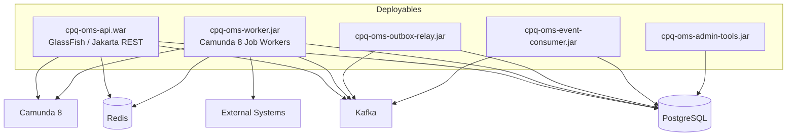
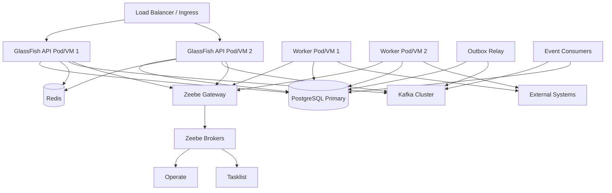
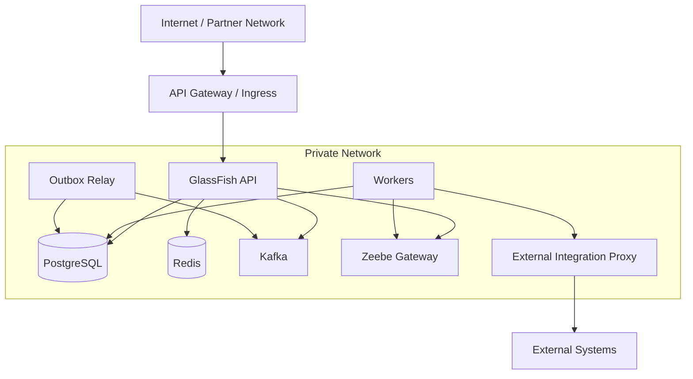

------
title: Build From Scratch: Enterprise Java Microservices CPQ & Order Management Platform - Part 056
description: Deployment topology and environment strategy for enterprise CPQ/OMS: local development, integration, staging, production, GlassFish WAR deployment, worker JAR deployment, PostgreSQL, Kafka, Redis, Camunda 8, configuration, secrets, migrations, release promotion, rollback, and disaster recovery.
series: learn-enterprise-cpq-oms-glassfish-camunda8
seriesTitle: Build From Scratch: Enterprise Java Microservices CPQ & Order Management Platform
order: 56
partTitle: Deployment Topology and Environment Strategy
tags:
  - java
  - microservices
  - cpq
  - oms
  - deployment
  - glassfish
  - jakarta-ee
  - postgresql
  - kafka
  - redis
  - camunda-8
  - devops
  - release-management
  - production
  - environment-strategy
date: 2026-07-02
---

# Part 056 — Deployment Topology and Environment Strategy

A CPQ/OMS platform can be well-designed in code and still fail in production because deployment strategy is weak.

The common failure is not that the WAR cannot start.

The common failure is that environments are inconsistent, configuration is unclear, migrations are unsafe, workers run against the wrong process version, Kafka topics are missing, Redis keys leak across tenants, or rollback is impossible because state has already moved forward.

Deployment is part of system design.

For this platform, deployment strategy must answer:

- where each deployable runs
- which component owns which state
- how configuration is injected
- how secrets are protected
- how migrations are executed
- how Camunda BPMN versions are deployed
- how Kafka topics and schemas are promoted
- how Redis keys are versioned
- how releases are rolled forward or back
- how production incidents are isolated
- how environments remain comparable without being identical

This part builds a production-grade deployment and environment model.

---

## 1. Deployment Units

From earlier parts, the platform is not one monolithic executable.

It has several deployable units.



### 1.1 API WAR

Responsibilities:

- JAX-RS/Jersey HTTP API
- authentication/authorization boundary
- request validation
- command dispatch
- read/query endpoints
- idempotency handling
- audit/outbox write through application service

Should not:

- perform long-running fulfillment
- poll outbox
- run Kafka consumer loops
- own Camunda job execution
- run heavy reports inline

### 1.2 Worker JAR

Responsibilities:

- Zeebe job workers
- invoke application services for workflow steps
- execute integration adapters safely
- complete/fail jobs
- update fulfillment task state

Should not:

- contain separate business logic from API
- bypass domain invariants
- use different persistence rules
- make non-idempotent external calls without durable attempt records

### 1.3 Outbox Relay JAR

Responsibilities:

- poll `outbox_event`
- publish to Kafka
- mark published/failed
- retry with backoff
- expose relay metrics

Should not:

- generate events from business logic
- mutate quote/order state
- decide domain semantics

### 1.4 Event Consumer JAR

Responsibilities:

- consume Kafka topics
- apply inbox dedupe
- update projections
- trigger integration reactions
- write processing result

Should not:

- assume exactly-once delivery from Kafka alone
- skip inbox idempotency
- perform unbounded external calls inside event handler

### 1.5 Admin Tools

Responsibilities:

- controlled repair commands
- reconciliation checks
- migration verification
- operational diagnostics

Should not:

- be casually exposed
- bypass audit
- mutate data without explicit repair reason

---

## 2. Environment Strategy

We need multiple environments, but each must have a clear purpose.

| Environment | Purpose | Must Be Production-Like? |
|---|---|---|
| local | developer feedback | no, but behavior-compatible |
| dev/shared | service integration | partially |
| contract | API/schema compatibility | focused |
| integration | cross-component test | yes for topology shape |
| performance | load/capacity test | yes for data shape and resource ratios |
| staging | release candidate validation | yes |
| production | real business | yes |
| disaster recovery | recovery capability | yes for critical state |

### 2.1 Local Environment

Local is optimized for developer speed.

Suggested local components:

- GlassFish or embedded test runtime for API smoke
- PostgreSQL container
- Kafka container or Redpanda-compatible local substitute if allowed by team policy
- Redis container
- Camunda 8 local/self-managed distribution or remote shared dev endpoint
- mock external systems

Local must support:

- running migrations
- seeding minimal catalog
- creating quote
- pricing quote
- converting quote
- starting workflow
- executing one worker
- publishing and consuming one event

Local does not need production scale.

But local must preserve architecture boundaries.

### 2.2 Integration Environment

Integration validates component cooperation:

- API WAR deployed to GlassFish
- worker JAR running separately
- outbox relay running separately
- Kafka topics provisioned
- PostgreSQL migrations applied
- Redis available
- Camunda BPMN deployed
- mock or sandbox external systems connected

Integration should catch:

- wrong environment variable
- missing Kafka topic
- incompatible BPMN variable
- missing DB migration
- Redis namespace mistake
- OpenAPI contract mismatch
- worker job type mismatch

### 2.3 Performance Environment

Performance environment must preserve production-like ratios.

If production has 3 Kafka brokers and performance has 1 tiny broker, results are limited.

If production has millions of orders and performance has 500 rows, query results are misleading.

Performance environment should have:

- realistic data volume
- realistic catalog complexity
- realistic worker count
- realistic DB indexes/statistics
- realistic Kafka partitions
- realistic Redis memory policy
- dependency simulators with configurable latency/failure

### 2.4 Staging Environment

Staging is the release gate.

It should verify:

- build artifact versions
- migration compatibility
- BPMN deployment
- worker compatibility
- Kafka topic/schema readiness
- Redis key versioning
- smoke tests
- rollback/forward plan
- observability dashboard
- runbook updates

Staging is not a playground.

### 2.5 Production Environment

Production prioritizes:

- correctness
- availability
- security
- auditability
- observability
- safe change
- incident response
- data recovery

Production must not be used for experimentation.

---

## 3. Logical Production Topology



This topology separates:

- synchronous API traffic
- workflow job execution
- event publication
- event consumption
- operational tools

That separation matters because each unit has different scaling and failure characteristics.

---

## 4. GlassFish Deployment Strategy

GlassFish hosts the API WAR.

Eclipse GlassFish implements the Jakarta EE platform and can host Jakarta REST/JAX-RS applications.

### 4.1 WAR Artifact

Artifact:

```text
cpq-oms-api.war
```

Should include:

- JAX-RS resources
- Jersey providers/filters
- DTOs and mappers
- application services
- domain modules
- MyBatis configuration
- database connection configuration binding
- health endpoints

Should exclude:

- worker main loops
- Kafka consumer loops
- outbox relay loops
- test fixtures
- local-only seed scripts

### 4.2 Deployment Configuration

Externalize:

```text
APP_ENV=production
APP_INSTANCE_ID=api-001
DB_URL=...
DB_USERNAME=...
DB_PASSWORD=secret-ref
REDIS_URL=...
KAFKA_BOOTSTRAP_SERVERS=...
CAMUNDA_GRPC_ADDRESS=...
AUTH_ISSUER=...
AUTH_JWKS_URL=...
TENANT_MODE=multi
LOG_LEVEL=INFO
```

Do not bake environment config into the WAR.

### 4.3 API Instance Scaling

Scale API instances based on:

- request rate
- request latency
- thread pool utilization
- DB pool wait
- CPU/memory
- GC pause
- error rate

Avoid scaling API blindly when bottleneck is PostgreSQL or external dependency.

### 4.4 Health Checks

Use separate checks.

| Check | Purpose |
|---|---|
| liveness | process is alive |
| readiness | can receive traffic |
| startup | app initialized |
| dependency diagnostics | detailed operational view |

Readiness should fail when the app cannot safely serve traffic.

But do not make readiness overly sensitive to optional dependencies.

Example:

- DB unavailable: readiness fail
- Redis unavailable: maybe readiness pass if cache degradation is safe
- Kafka unavailable: depends on command outbox behavior
- Camunda unavailable: quote pricing can still work, order workflow start may degrade

---

## 5. Worker Deployment Strategy

Workers are separate deployables.

Artifact:

```text
cpq-oms-worker.jar
```

### 5.1 Worker Configuration

```text
WORKER_GROUP=fulfillment-workers
WORKER_ENABLED_TYPES=reserve-inventory,provision-service,activate-billing
WORKER_MAX_JOBS_ACTIVE=100
WORKER_THREADS=32
WORKER_TIMEOUT=PT30S
WORKER_POLL_INTERVAL=PT1S
```

Use job-type-specific configuration where possible.

### 5.2 Worker Scaling

Scale by:

- job backlog
- job activation latency
- worker CPU/memory
- external dependency capacity
- DB pool wait
- failure/retry rate

Scaling workers can hurt the system if external systems cannot handle the concurrency.

### 5.3 Worker Version Deployment

Worker version must be compatible with BPMN job types and variable schema.

Release order often looks like:

1. Deploy backward-compatible domain/API code.
2. Deploy workers that support old and new job types.
3. Deploy new BPMN version.
4. Route new process instances to new version.
5. Drain old process instances.
6. Remove old worker support later.

Do not deploy BPMN that emits job types no worker can handle.

---

## 6. PostgreSQL Deployment Strategy

PostgreSQL is the transactional source of truth.

It stores:

- catalog metadata
- quote/order/asset state
- idempotency records
- audit evidence
- outbox/inbox
- workflow references
- external call attempts
- projections

### 6.1 Migration Ownership

Migrations must be versioned and promoted with application releases.

Recommended migration phases:

```text
expand -> backfill -> switch code -> contract
```

Example:

1. Add nullable column.
2. Backfill column.
3. Deploy code writing both old and new field if needed.
4. Switch reads to new field.
5. Remove old field later.

### 6.2 Migration Execution

Decide who runs migrations:

| Option | Trade-off |
|---|---|
| app starts and migrates | simple but risky in multi-instance deployment |
| dedicated migration job | safer, explicit gate |
| manual DBA-run migration | controlled but slower |
| pipeline migration step | good for repeatability |

For enterprise CPQ/OMS, prefer explicit pipeline/dedicated migration job.

### 6.3 Backup and Restore

Production must have:

- scheduled backups
- point-in-time recovery if possible
- restore drills
- backup encryption
- restore runbook
- RPO/RTO targets

A backup that has never been restored is not a recovery strategy.

### 6.4 Read Replicas

Read replicas can support reporting or heavy read workloads.

But be careful:

- replica lag can show stale quote/order state
- command validation must not rely on stale replica
- operational repair must use primary
- audit explorer can use replica if staleness is acceptable

---

## 7. Kafka Deployment Strategy

Kafka is the event backbone.

It is not the source of truth for command state in this design.

### 7.1 Topic Provisioning

Topics should be provisioned as code:

```text
name: oms.order.events.v1
partitions: 24
replication.factor: 3
retention.ms: 2592000000
cleanup.policy: delete
```

Each topic should define:

- owner
- purpose
- schema
- partition key
- retention
- compatibility rule
- consumer groups
- alert thresholds

### 7.2 Partition Planning

Partition count affects parallelism and ordering.

For order events, partition by `orderId`.

Scaling consumers beyond partition count will not increase parallelism for one consumer group.

Plan partitions for future growth, but do not create excessive partitions without operational reason.

### 7.3 Consumer Group Strategy

Separate consumer groups by responsibility:

```text
order-projection-consumer
billing-trigger-consumer
notification-consumer
audit-export-consumer
reconciliation-consumer
```

Do not share consumer group across unrelated responsibilities.

### 7.4 DLQ Strategy

DLQ is not a trash bin.

Every DLQ event must have:

- original topic/partition/offset
- event ID
- error code
- error message category
- failed consumer name
- retry count
- timestamp
- payload reference or payload if allowed
- replay instruction

---

## 8. Redis Deployment Strategy

Redis accelerates runtime reads.

It must not hold irreplaceable business truth.

### 8.1 Redis Namespace

Key naming:

```text
{env}:{tenantId}:catalog:active-version
{env}:{tenantId}:catalog:{catalogVersion}:offering:{offeringId}
{env}:{tenantId}:pricing:{priceListVersion}:offering:{offeringId}
{env}:{tenantId}:idempotency-fast:{idempotencyKey}
{env}:{tenantId}:rate-limit:{clientId}:{window}
```

Include environment and tenant in keys.

Avoid cross-environment or cross-tenant leaks.

### 8.2 Redis Memory Policy

Define:

- max memory
- eviction policy
- TTL policy
- key cardinality limits
- hot key detection
- cache warmup strategy
- cache invalidation event handling

### 8.3 Redis Failure Behavior

For each use case, define behavior if Redis is unavailable.

| Use Case | Redis Down Behavior |
|---|---|
| catalog cache | fallback to PostgreSQL if safe |
| pricing cache | fallback with rate protection |
| rate limiter | fail closed or fail open depending endpoint |
| session/wizard state | user may need retry/resume policy |
| idempotency fast-path | fallback to PostgreSQL durable idempotency |
| short-lived lock | fallback to DB guard or reject command |

---

## 9. Camunda 8 Deployment Strategy

Camunda 8 is process orchestration infrastructure.

Self-managed production deployment commonly uses Kubernetes and Helm, with components such as Zeebe, Zeebe Gateway, Operate, Tasklist, Optimize, Identity, and secondary storage depending on configuration.

### 9.1 Component Responsibilities

| Component | Role |
|---|---|
| Zeebe brokers | workflow execution engine |
| Zeebe Gateway | stateless entry point for clients/workers |
| Operate | operational process monitoring |
| Tasklist | human task worklist |
| Identity | auth/user/service access depending deployment |
| Optimize | process analytics if used |
| Elasticsearch/OpenSearch/RDBMS secondary storage | visibility/exported records depending setup |

### 9.2 BPMN Deployment

BPMN should be versioned and promoted with application release.

Artifacts:

```text
processes/quote-approval-v1.bpmn
processes/order-fulfillment-v1.bpmn
processes/order-cancellation-v1.bpmn
```

Deployment must record:

- BPMN process ID
- version
- deployment timestamp
- git commit
- compatible worker version
- variable schema version
- release ID

### 9.3 Process Version Routing

Do not let every new deployment automatically affect every business case without policy.

Use a resolver:

```text
quote approval process version = by tenant + product line + release flag
order fulfillment process version = by order type + catalog version + release flag
```

This allows controlled rollout.

### 9.4 Operate and Incident Access

Operate visibility is powerful.

Access must be controlled because process variables may contain business-sensitive data.

Do not put unnecessary PII or large commercial payloads into workflow variables.

Use IDs and hashes.

---

## 10. External System Deployment Boundaries

External systems include:

- CRM
- billing
- payment
- provisioning
- inventory
- notification
- document generation
- partner APIs

Each external integration requires:

- endpoint config per environment
- credential/secret per environment
- timeout policy
- retry policy
- circuit breaker policy
- rate limit
- idempotency key strategy
- sandbox behavior
- callback URL strategy
- reconciliation report

Do not point non-production environment at production external side-effect systems unless explicitly controlled.

---

## 11. Configuration Strategy

Configuration must be externalized, typed, validated, and observable.

### 11.1 Configuration Categories

| Category | Example | Change Frequency |
|---|---|---|
| runtime infra | DB URL, Kafka bootstrap | low |
| security | issuer, JWKS URL | medium |
| feature flag | enable new decomposition | medium/high |
| policy config | retry limits, timeouts | medium |
| business reference | approval matrix | controlled |
| catalog data | offerings, prices | business release |
| secrets | passwords/tokens | rotated |

Do not treat all configuration the same.

### 11.2 Startup Validation

At startup, each deployable should validate:

- required config present
- config value type valid
- environment name valid
- tenant mode valid
- required URL format valid
- timeout values sane
- worker enabled job types valid
- Kafka topic names configured
- feature flags known

Fail fast for invalid mandatory config.

### 11.3 Runtime Config Changes

Some config can change at runtime.

But dangerous config should require controlled deployment or admin approval.

Examples:

| Config | Runtime Change? |
|---|---|
| log level | yes, controlled |
| feature flag | yes, audited |
| external timeout | yes, controlled |
| DB URL | no |
| tenant isolation mode | no |
| schema compatibility mode | no |
| approval policy | yes, versioned/audited |
| catalog version | yes, published/audited |

---

## 12. Secret Management

Secrets include:

- DB password
- Kafka credentials
- Redis password
- Camunda client secret
- OAuth client secret
- external API credentials
- signing/encryption keys

Rules:

- never commit secrets
- never log secrets
- rotate secrets
- separate secrets by environment
- restrict read access
- use secret references in deployment config
- audit secret access if platform supports it

In local development, use dummy secrets.

In production, use managed secret storage where available.

---

## 13. Release Promotion Model

A release is more than application code.

Release artifact set:

```text
api WAR
worker JAR
outbox relay JAR
event consumer JAR
OpenAPI bundle
JSON Schema bundle
DB migrations
BPMN files
Kafka topic/schema definitions
Redis key version notes
configuration changes
runbook updates
```

Promotion path:

```text
local -> dev -> integration -> performance/staging -> production
```

Each stage should produce evidence:

- build ID
- test results
- migration result
- contract compatibility result
- deployment manifest
- smoke test result
- approval record

---

## 14. Deployment Order

A safe deployment order depends on change type.

### 14.1 Backward-Compatible API Change

1. Deploy schema/OpenAPI documentation.
2. Deploy API supporting old and new field.
3. Deploy consumers if needed.
4. Enable client usage later.

### 14.2 Database Expand Change

1. Run migration adding new structures.
2. Deploy code writing old + new if needed.
3. Backfill.
4. Switch reads.
5. Contract old structures in later release.

### 14.3 New Workflow Job Type

1. Deploy worker supporting new job type.
2. Deploy BPMN with new job type.
3. Route only selected new instances.
4. Monitor.
5. Expand rollout.

### 14.4 New Kafka Event Field

1. Update schema with backward-compatible field.
2. Deploy consumers tolerating field missing/present.
3. Deploy producer emitting field.
4. Monitor.

### 14.5 Breaking Change

Breaking changes require parallel versioning:

- new API version
- new event version
- new BPMN process version
- migration plan
- client migration timeline
- deprecation window

Do not perform silent breaking change.

---

## 15. Rollback and Roll Forward

Rollback is not always possible.

If database schema/data or workflow instances moved forward, old code may not understand new state.

Prefer roll-forward when state has advanced.

### 15.1 Rollback-Safe Changes

Usually safe:

- pure code bug with no schema/state change
- config-only issue
- API response formatting bug
- worker bug before new BPMN routed traffic

### 15.2 Rollback-Risky Changes

Risky:

- DB migration changed data
- new order state introduced
- new BPMN process started
- new Kafka event version emitted
- new Redis key format activated
- new approval policy applied

### 15.3 Rollback Plan Template

Every production release should define:

```text
release id:
components changed:
database migration:
bpmn changed:
kafka topic/schema changed:
redis key changed:
rollback possible: yes/no/conditional
rollback steps:
roll-forward steps:
data repair needed:
validation after rollback/forward:
owner:
```

---

## 16. Blue-Green, Canary, and Rolling Deployment

### 16.1 Rolling Deployment

Good for backward-compatible changes.

Risk:

- mixed versions run together
- schema compatibility required
- worker/BPMN compatibility required

### 16.2 Blue-Green Deployment

Good for API traffic switch.

Risk:

- background workers may duplicate if both environments active
- database shared-state compatibility still required
- Kafka consumers must not double-consume unexpectedly

### 16.3 Canary Deployment

Good for controlled rollout.

Canary dimensions:

- tenant
- channel
- product line
- partner
- percentage of traffic
- process version route

For CPQ/OMS, tenant/product-line canary is often safer than random request percentage because business flows are stateful.

---

## 17. Multi-Tenancy Deployment Considerations

Tenant isolation can be deployed as:

| Model | Description |
|---|---|
| shared app + shared DB schema | cheapest, highest isolation burden |
| shared app + tenant schema | stronger DB boundary |
| dedicated app + dedicated DB | stronger isolation, more operations |
| hybrid | enterprise tenants dedicated, smaller tenants shared |

This series assumes tenant-scoped shared schema unless otherwise extended.

Deployment must enforce:

- tenant ID in API context
- tenant ID in DB queries
- tenant ID in Kafka headers/payload where relevant
- tenant ID in Redis keys
- tenant ID in audit
- tenant-aware feature flags
- tenant-aware process version routing

---

## 18. Network and Security Topology

Suggested zones:



Security rules:

- external users do not access DB/Kafka/Redis/Camunda directly
- workers do not expose public endpoints unless required for callback receiver
- callback receiver endpoints are authenticated and scoped
- admin tools are restricted
- Operate/Tasklist access is controlled
- service-to-service credentials are separate by component

---

## 19. Observability Deployment

Every environment should deploy observability intentionally.

Minimum:

- structured logs
- metrics endpoint
- traces where available
- dashboard per component
- alert rules in staging/prod
- synthetic smoke test

Production dashboards:

- API health/latency/error
- PostgreSQL health/query/lock
- Kafka topic/consumer lag
- Redis memory/latency/eviction
- Camunda process/job/incident
- worker job type throughput
- outbox relay backlog
- inbox processing failures
- business quote/order/fallout timeline

---

## 20. Data Lifecycle and Retention

Deployment strategy includes lifecycle strategy.

Tables needing retention policy:

- audit log
- outbox event
- inbox event
- external call attempt
- workflow reference
- workflow variable snapshot
- quote history
- order transition history
- projection rebuild temp tables
- DLQ records

Retention must balance:

- compliance
- storage cost
- query performance
- replay requirement
- dispute resolution
- privacy obligations

Do not delete audit evidence casually.

---

## 21. Disaster Recovery Model

Define RPO and RTO.

| Term | Meaning |
|---|---|
| RPO | maximum acceptable data loss |
| RTO | maximum acceptable recovery time |

Critical recovery assets:

- PostgreSQL backups/WAL/PITR
- Kafka topic data or replay source
- Camunda state/exporters/backups depending deployment
- Redis can usually be rebuilt if only cache
- secrets/config backup
- deployment manifests
- migration history
- artifact repository

### 21.1 Recovery Priority

Order:

1. Restore PostgreSQL source of truth.
2. Restore application config/secrets.
3. Restore API for read/command access.
4. Restore Camunda orchestration state.
5. Restore Kafka/event pipeline.
6. Rebuild Redis cache.
7. Reconcile projections and external systems.

### 21.2 Reconciliation After Recovery

After disaster recovery, run:

- quote/order count verification
- outbox pending check
- Kafka consumer offset/lag check
- Camunda active process check
- fulfillment task vs workflow incident check
- external call attempt reconciliation
- asset state consistency check
- audit continuity check

---

## 22. Environment Drift Control

Environment drift causes release surprises.

Control drift with:

- infrastructure as code
- topic as code
- config as code where safe
- schema registry/published schema history
- migration history table
- BPMN deployment registry
- artifact version registry
- smoke test per environment
- periodic drift report

Drift examples:

- staging has Kafka topic with 3 partitions, production has 24
- integration Redis eviction policy differs from production
- worker in staging supports different job type
- DB index exists in dev but not production
- feature flag default differs silently
- catalog reference data differs without version record

---

## 23. Deployment Readiness Checklist

Before production deployment:

- [ ] API WAR built and versioned.
- [ ] Worker JAR built and versioned.
- [ ] Outbox relay artifact built and versioned.
- [ ] Event consumer artifact built and versioned.
- [ ] OpenAPI/schema artifacts published.
- [ ] DB migrations reviewed and tested.
- [ ] Migration rollback/roll-forward plan written.
- [ ] Kafka topics/schemas available.
- [ ] BPMN files deployed or ready.
- [ ] Worker supports deployed job types.
- [ ] Redis key/version changes documented.
- [ ] Config validated.
- [ ] Secrets available and rotated if needed.
- [ ] Smoke tests passed in staging.
- [ ] Performance impact understood.
- [ ] Observability dashboards updated.
- [ ] Alerts updated.
- [ ] Runbook updated.
- [ ] Business owner approval recorded if needed.

---

## 24. Production Deployment Runbook Skeleton

```text
Release: cpq-oms-2026.07.02-001
Window: ...
Owner: ...
Approvers: ...

Pre-check:
  - DB health
  - Kafka health
  - Camunda health
  - Redis health
  - current error rate
  - current outbox backlog
  - current incident/fallout count

Steps:
  1. Disable risky scheduled jobs if needed.
  2. Run DB expand migration.
  3. Deploy API WAR.
  4. Deploy worker JAR.
  5. Deploy outbox relay/consumer if changed.
  6. Deploy BPMN if changed.
  7. Enable feature flag/canary route.
  8. Run smoke tests.
  9. Monitor dashboards.
  10. Expand rollout.

Rollback / roll-forward:
  - condition:
  - steps:
  - validation:

Post-check:
  - API latency
  - error rate
  - Kafka lag
  - Camunda incidents
  - DB locks
  - business transaction success rate
```

---

## 25. Anti-Patterns

### 25.1 One Artifact Does Everything

API, worker, relay, and consumer in one process makes scaling and failure isolation difficult.

### 25.2 Environment-Specific Code

Code should not contain branches like:

```java
if (env.equals("production")) {
   // different business behavior
}
```

Use configuration, feature flags, and policy versions.

### 25.3 Migration on Every App Startup

In multi-instance production, startup migration can race or partially apply changes.

Use explicit migration job/pipeline for critical DB changes.

### 25.4 BPMN and Worker Out of Sync

Deploying BPMN with job type no worker handles creates stuck instances.

### 25.5 Redis as Hidden Database

If losing Redis loses business truth, Redis is being misused.

### 25.6 Kafka Topic Created Manually in Production

Manual topic creation causes drift.

Topics should be defined and promoted like infrastructure artifacts.

### 25.7 Rollback Assumed Without State Analysis

Rollback must be proven.

If state advanced, rollback may corrupt interpretation.

---

## 26. Mental Model Summary

Deployment topology is the runtime expression of architecture.

A production-grade CPQ/OMS deployment separates:

- API command/query handling
- workflow job execution
- event publication
- event consumption
- administrative repair
- durable state
- cache acceleration
- orchestration state

The top 1% mindset is not “can we deploy it?”

It is:

> Can we promote, observe, scale, migrate, rollback or roll forward, recover, audit, and operate this system while real quotes, orders, approvals, tasks, events, and external side effects are in flight?

That is the deployment standard for this platform.

---

## References

- Eclipse GlassFish: https://glassfish.org/
- Eclipse GlassFish Project: https://projects.eclipse.org/projects/ee4j.glassfish
- Camunda 8 Helm Installation: https://docs.camunda.io/docs/8.7/self-managed/setup/install/
- Camunda Production Installation with Helm: https://docs.camunda.io/docs/self-managed/deployment/helm/install/production/
- Camunda 8 Self-Managed Production Guide: https://docs.camunda.io/docs/8.7/self-managed/operational-guides/production-guide/helm-chart-production-guide/
- Apache Kafka Documentation: https://kafka.apache.org/documentation/
- Apache Kafka Monitoring: https://kafka.apache.org/41/operations/monitoring/
- PostgreSQL Documentation: https://www.postgresql.org/docs/current/
- Redis Documentation: https://redis.io/docs/latest/
