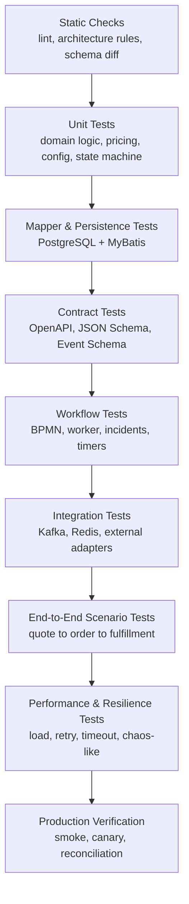
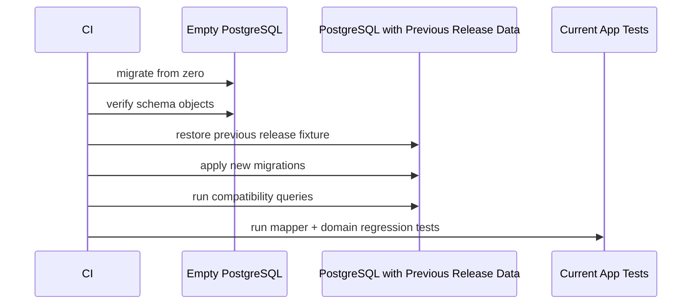

------
title: Build From Scratch: Enterprise Java Microservices CPQ & Order Management Platform - Part 057
description: Testing strategy untuk enterprise-grade CPQ/OMS: unit, domain, mapper, API contract, schema, workflow, event, integration, resilience, data migration, security, performance, dan production regression safety.
series: learn-enterprise-cpq-oms-glassfish-camunda8
seriesTitle: Build From Scratch: Enterprise Java Microservices CPQ & Order Management Platform
order: 57
partTitle: Testing Strategy for Enterprise CPQ/OMS
tags:
  - java
  - microservices
  - cpq
  - oms
  - testing
  - junit
  - testcontainers
  - contract-testing
  - openapi
  - json-schema
  - mybatis
  - postgresql
  - kafka
  - camunda-8
  - redis
  - production-readiness
date: 2026-07-02
---

# Testing Strategy for Enterprise CPQ/OMS

Testing enterprise CPQ/OMS bukan soal menambah jumlah test sebanyak mungkin. Testing yang buruk hanya memberi rasa aman palsu: build hijau, tetapi quote salah harga; order terkirim dua kali; fulfillment stuck; approval evidence hilang; migration sukses tetapi data lama tidak bisa dibaca; event replay menggandakan side effect.

Di sistem CPQ/OMS production-grade, testing harus menjawab pertanyaan yang lebih keras:

1. Apakah domain invariant selalu dijaga?
2. Apakah command aman terhadap retry dan duplicate request?
3. Apakah API contract stabil untuk consumer?
4. Apakah database schema benar-benar mendukung aggregate dan query model?
5. Apakah workflow berjalan, retry, timeout, incident, dan compensation sesuai desain?
6. Apakah event contract aman untuk replay dan consumer lama?
7. Apakah integration adapter tahan timeout, ambiguous outcome, dan partial failure?
8. Apakah release bisa dibatalkan atau diteruskan tanpa merusak long-running order?

Kita tidak sedang mengetes aplikasi CRUD. Kita sedang mengetes **business execution platform**.

---

## 1. Mental Model: Test the Contract, Not the Implementation Accident

Sistem enterprise punya banyak bentuk contract:

| Contract | Contoh | Risiko Jika Tidak Dites |
|---|---|---|
| Domain contract | quote accepted tidak boleh dimutasi | state corruption |
| API contract | response error, pagination, idempotency header | consumer break |
| Schema contract | JSON Schema product configuration | payload invalid masuk ke domain |
| Persistence contract | optimistic update harus menolak stale version | lost update |
| Event contract | `OrderAccepted.v1` harus backward compatible | consumer gagal deploy |
| Workflow contract | BPMN fulfillment harus membuat fallout ketika task timeout | order stuck tanpa visibility |
| Adapter contract | billing adapter harus idempotent | double charge |
| Migration contract | data lama tetap bisa dibaca setelah release | production outage |
| Security contract | sales agent tenant A tidak bisa baca quote tenant B | data leak |
| Operational contract | stuck Camunda incident terlihat di dashboard | MTTR buruk |

Testing strategy yang matang tidak dimulai dari “pakai library apa?”, tetapi dari **contract apa yang harus tetap benar meskipun implementasi berubah**.

---

## 2. Testing Pyramid yang Cocok untuk CPQ/OMS

Testing pyramid klasik masih berguna, tetapi harus diperluas untuk distributed workflow/event-driven system.



Yang penting: jangan membuat semua test menjadi end-to-end. E2E mahal, lambat, brittle, dan sering gagal karena environment noise. Domain invariant harus ditest dekat dengan domain object. API compatibility harus ditest di contract level. Database constraint harus ditest dengan PostgreSQL asli, bukan H2 yang perilakunya berbeda.

---

## 3. Test Taxonomy untuk Seri Ini

Kita akan memakai taxonomy berikut sebagai quality model:

| Test Type | Target | Cepat? | Butuh Infra? | Wajib di PR? |
|---|---|---:|---:|---:|
| Unit test | pure domain logic | ya | tidak | ya |
| Property/example table test | pricing/config permutations | ya | tidak | ya |
| State machine test | legal/illegal transition | ya | tidak | ya |
| Mapper test | SQL + MyBatis + PostgreSQL | sedang | PostgreSQL | ya |
| Migration test | schema migration + seed data | sedang | PostgreSQL | ya |
| API contract test | OpenAPI request/response | sedang | optional | ya |
| JSON Schema test | payload validation | cepat | tidak | ya |
| Event contract test | event envelope/payload | cepat | tidak | ya |
| Kafka integration test | producer/consumer/outbox/inbox | sedang | Kafka | ya atau nightly |
| Camunda process test | BPMN path/timer/error | sedang | Camunda test runtime | ya atau nightly |
| External adapter test | HTTP stubs/fake provider | sedang | stub server | ya |
| End-to-end happy path | quote-to-order | lambat | full stack | nightly/gate |
| Failure scenario test | timeout/retry/fallout | lambat | full stack | nightly/gate |
| Performance test | latency/capacity | lambat | perf env | scheduled/gate |
| Security test | authorization, tenant, input abuse | sedang | mixed | ya/gate |
| Runbook drill | operational repair | manual/automated | staging | release readiness |

---

## 4. What Must Never Be Untested

Untuk sistem ini, area berikut harus punya test eksplisit:

1. **Quote price determinism**: input snapshot sama harus menghasilkan price breakdown dan total sama.
2. **Configuration explainability**: rule failure harus punya reason yang bisa ditampilkan.
3. **Approval evidence**: approval harus menyimpan policy facts dan decision evidence.
4. **Quote revision invalidation**: approval untuk revision lama tidak boleh dipakai di revision baru.
5. **Quote-to-order idempotency**: retry convert quote tidak boleh membuat dua order.
6. **Order item dependency graph**: task tidak boleh start sebelum dependency selesai.
7. **Fulfillment retry safety**: retry worker tidak boleh memanggil provisioning dua kali tanpa idempotency.
8. **Outbox atomicity**: state berubah dan event tercatat dalam transaction yang sama.
9. **Inbox deduplication**: duplicate event tidak boleh menghasilkan duplicate side effect.
10. **Tenant isolation**: semua query dan command harus tenant-scoped.
11. **Migration compatibility**: data sebelum release tetap bisa dibaca dan diproses.
12. **Workflow incident visibility**: stuck process harus terlihat dan bisa direpair.

Jika salah satu area ini tidak dites, sistem mungkin terlihat “jalan” tetapi tidak defensible.

---

## 5. Domain Unit Tests

Domain unit test harus murni, cepat, dan tidak tergantung GlassFish, PostgreSQL, Kafka, Redis, atau Camunda.

Contoh target:

- product configuration rule evaluator
- pricing engine
- discount stacking
- approval policy evaluator
- quote state machine
- order state machine
- fulfillment dependency graph
- compensation planner
- idempotency decision logic
- tenant authorization policy

### 5.1 Contoh Quote State Machine Test

```java
class QuoteStateMachineTest {

    @Test
    void acceptedQuoteCannotBeMutated() {
        Quote quote = QuoteFixtures.acceptedQuote();

        DomainException ex = assertThrows(
            DomainException.class,
            () -> quote.addItem(QuoteFixtures.internetPlanItem())
        );

        assertEquals("QUOTE_NOT_MUTABLE", ex.code());
    }

    @Test
    void submittedQuoteCannotBeSubmittedAgainWithDifferentRevision() {
        Quote quote = QuoteFixtures.submittedQuote("Q-100", 3);

        DomainException ex = assertThrows(
            DomainException.class,
            () -> quote.submit(new SubmitQuoteCommand("Q-100", 2))
        );

        assertEquals("STALE_QUOTE_REVISION", ex.code());
    }
}
```

Test ini tidak peduli mapper, API, atau database. Ia hanya memaku invariant.

### 5.2 Table-Driven Test untuk Pricing

Pricing engine lebih cocok dengan table-driven tests:

```java
record PricingCase(
    String name,
    ProductConfig config,
    CustomerContext customer,
    ExpectedPrice expected
) {}

@ParameterizedTest(name = "{0}")
@MethodSource("pricingCases")
void pricingIsDeterministic(String name, ProductConfig config, CustomerContext customer, ExpectedPrice expected) {
    PricingResult result = pricingEngine.price(config, customer, PriceContext.today());

    assertEquals(expected.total(), result.total());
    assertEquals(expected.approvalSignals(), result.approvalSignals());
    assertEquals(expected.explanationCodes(), result.explanationCodes());
}
```

Pricing test harus mengecek:

- total amount
- charge lines
- discount order
- rounding
- approval signals
- explanation code
- price hash

Jangan hanya mengecek total. Total bisa benar sementara explanation salah, dan di CPQ enterprise explanation adalah bagian dari audit.

---

## 6. Configuration Engine Tests

Configuration engine harus ditest sebagai graph evaluator.

Minimal scenario:

| Scenario | Expected |
|---|---|
| required option missing | invalid + missing requirement explanation |
| mutually exclusive options selected | invalid + conflict explanation |
| dependency satisfied | valid |
| dependency missing | invalid |
| default option injected | valid + default explanation |
| incompatible installed base | invalid atau requires approval |
| cyclic rule definition | catalog publish rejected |
| cardinality below minimum | invalid |
| cardinality above maximum | invalid |

Contoh:

```java
@Test
void mutuallyExclusiveOptionsProduceExplainableConflict() {
    ConfigurationInput input = ConfigInputBuilder.forOffering("BUNDLE-INTERNET-TV")
        .select("router.basic")
        .select("router.premium")
        .build();

    ConfigurationResult result = engine.evaluate(input, CatalogSnapshotFixtures.bundleV1());

    assertFalse(result.valid());
    assertThat(result.violations())
        .extracting(ConstraintViolation::code)
        .contains("MUTUALLY_EXCLUSIVE_OPTIONS");
    assertThat(result.explanations())
        .anyMatch(e -> e.references().containsAll(List.of("router.basic", "router.premium")));
}
```

### 6.1 Golden Configuration Fixtures

Untuk CPQ, kita butuh golden fixtures:

```text
fixtures/
  catalog/
    internet-bundle-v1.json
    enterprise-vpn-v2.json
  configuration/
    valid-small-business.json
    invalid-mutual-exclusion.json
    invalid-missing-required-option.json
  expected/
    valid-small-business-result.json
    invalid-mutual-exclusion-result.json
```

Golden fixture bukan snapshot membabi buta. Ia harus stabil, readable, dan berisi business case penting.

---

## 7. Pricing Engine Tests

Pricing engine harus dites dari beberapa level.

### 7.1 Pure Calculation Test

Target: Money, rounding, tax placeholder, recurring total.

```java
@Test
void moneyAdditionRequiresSameCurrency() {
    Money usd = Money.of("10.00", "USD");
    Money idr = Money.of("10000", "IDR");

    assertThrows(CurrencyMismatchException.class, () -> usd.add(idr));
}
```

### 7.2 Price Resolution Test

Target: price list, market, segment, effective date.

```java
@Test
void resolvesPriceByMarketSegmentAndEffectiveDate() {
    PriceCatalog catalog = PriceCatalogFixtures.enterpriseIndonesia2026();

    PriceCandidate price = resolver.resolve(
        ProductOfferingId.of("OFFER-DEDICATED-INTERNET"),
        CustomerSegment.ENTERPRISE,
        Market.ID,
        LocalDate.of(2026, 7, 2),
        catalog
    );

    assertEquals(Money.of("2500000", "IDR"), price.monthlyRecurringCharge());
}
```

### 7.3 Discount Stacking Test

Target: order of discount application.

```java
@Test
void appliesNonStackableBestDiscountOnly() {
    PricingResult result = pricingEngine.price(
        PricingFixtures.enterpriseBundleWithTwoNonStackablePromotions()
    );

    assertThat(result.appliedDiscounts())
        .extracting(AppliedDiscount::code)
        .containsExactly("PROMO_ENTERPRISE_20");
}
```

### 7.4 Approval Signal Test

Target: price override dan margin policy.

```java
@Test
void manualOverrideBelowFloorRequiresApproval() {
    PricingResult result = pricingEngine.price(
        PricingFixtures.quoteWithManualOverrideBelowFloor()
    );

    assertThat(result.approvalSignals())
        .extracting(ApprovalSignal::code)
        .contains("PRICE_BELOW_FLOOR");
}
```

---

## 8. State Machine Tests

Setiap state machine harus punya matrix legal dan illegal transition.

Contoh quote:

| From | Command | To | Expected |
|---|---|---|---|
| DRAFT | submit | SUBMITTED | allowed |
| SUBMITTED | approve | APPROVED | allowed |
| APPROVED | accept | ACCEPTED | allowed |
| ACCEPTED | add item | - | rejected |
| EXPIRED | accept | - | rejected |
| CANCELLED | submit | - | rejected |

Buat test generator:

```java
@ParameterizedTest
@MethodSource("illegalQuoteTransitions")
void rejectsIllegalQuoteTransitions(QuoteState from, QuoteCommand command) {
    Quote quote = QuoteFixtures.withState(from);

    DomainException ex = assertThrows(
        DomainException.class,
        () -> quote.handle(command)
    );

    assertEquals("ILLEGAL_STATE_TRANSITION", ex.code());
}
```

State machine tidak boleh hanya dites dari happy path.

---

## 9. MyBatis Mapper and PostgreSQL Tests

Mapper test harus memakai PostgreSQL asli via test container atau test database yang behaviour-nya sama. Jangan mengganti PostgreSQL dengan database in-memory untuk query yang bergantung pada JSONB, isolation, index, constraint, locking, atau `SKIP LOCKED`.

### 9.1 Apa yang Harus Dites di Mapper Layer

- insert aggregate root
- insert child collection
- load aggregate untuk command
- optimistic update success/failure
- unique constraint untuk idempotency
- tenant filter wajib
- JSONB read/write
- cursor pagination
- outbox polling lock
- inbox duplicate detection
- migration-created constraint

### 9.2 Contoh Optimistic Update Test

```java
@Test
void updateQuoteRejectsStaleVersion() {
    QuoteRow inserted = quoteMapper.insert(QuoteRowFixtures.draftQuote(version: 5));

    int updated = quoteMapper.updateState(
        inserted.quoteId(),
        QuoteState.SUBMITTED,
        expectedVersion: 4,
        nextVersion: 5
    );

    assertEquals(0, updated);
}
```

### 9.3 Contoh Tenant Filter Test

```java
@Test
void quoteSearchDoesNotLeakAcrossTenants() {
    quoteMapper.insert(QuoteRowFixtures.forTenant("tenant-a", "Q-1"));
    quoteMapper.insert(QuoteRowFixtures.forTenant("tenant-b", "Q-2"));

    List<QuoteSummaryRow> rows = quoteMapper.search(
        QuoteSearchQuery.builder()
            .tenantId("tenant-a")
            .build()
    );

    assertThat(rows)
        .extracting(QuoteSummaryRow::quoteNumber)
        .containsExactly("Q-1");
}
```

Tenant filter harus dites negatif. Jangan hanya percaya convention.

---

## 10. Migration Tests

Migration test memastikan schema bisa bergerak maju tanpa merusak data.

Minimal migration pipeline:



Test migration harus mencakup:

- migrate from empty database
- migrate from previous release fixture
- repeat migration should not re-run versioned scripts
- reference data exists
- deprecated column masih ada selama expand phase
- backfill menghasilkan valid data
- constraints tidak memblokir data lama yang legitimate
- rollback/forward repair script tested di staging-like fixture

### 10.1 Migration Fixture Strategy

Simpan fixture per release:

```text
test-fixtures/database/
  release-1.0/
    schema.sql
    data.sql
  release-1.1/
    schema.sql
    data.sql
```

Lalu test:

```java
@Test
void currentMigrationCanUpgradePreviousReleaseData() {
    restoreFixture("release-1.1");

    flyway.migrate();

    assertThat(quoteMapper.load("tenant-a", "Q-100")).isPresent();
    assertThat(orderMapper.search(OrderSearchQuery.forTenant("tenant-a"))).isNotEmpty();
}
```

---

## 11. API Contract Tests

API contract test memastikan implementasi JAX-RS/Jersey sesuai OpenAPI.

Yang harus dites:

- required headers
- request validation
- response status
- error response structure
- pagination shape
- idempotency replay behavior
- optimistic concurrency error
- tenant authorization error
- backward-compatible response fields
- content type

### 11.1 API Test Level

Ada tiga level:

| Level | Target |
|---|---|
| Resource test | JAX-RS resource + mocked application service |
| Contract test | request/response sesuai OpenAPI |
| Integration API test | API + PostgreSQL + mapper + transaction |

Jangan semua endpoint dites full stack. Tetapi command kritikal seperti `submit quote`, `convert quote`, `cancel order`, dan `repair fallout` harus punya integration API test.

### 11.2 Error Contract Test

```java
@Test
void returnsProblemDetailForInvalidConfiguration() {
    Response response = client.target(baseUri)
        .path("/api/v1/quotes/Q-100/items")
        .request()
        .header("X-Tenant-Id", "tenant-a")
        .post(Entity.json(invalidConfigPayload()));

    assertEquals(422, response.getStatus());

    ProblemDetail problem = response.readEntity(ProblemDetail.class);
    assertEquals("CONFIGURATION_INVALID", problem.code());
    assertThat(problem.fieldViolations()).isNotEmpty();
}
```

Error shape adalah contract, bukan detail internal.

---

## 12. JSON Schema Tests

Schema test harus memastikan payload sample valid/invalid sesuai harapan.

```text
schemas/
  product-configuration.schema.json
  price-item.schema.json
  quote-item.schema.json
  order-item.schema.json
  event-envelope.schema.json
samples/
  valid/
  invalid/
```

Test:

```java
@ParameterizedTest
@ValueSource(strings = {
    "samples/valid/quote-created-v1.json",
    "samples/valid/order-accepted-v1.json"
})
void validSamplesPassSchema(String sample) {
    assertTrue(jsonSchemaValidator.validate(sample).isEmpty());
}

@ParameterizedTest
@ValueSource(strings = {
    "samples/invalid/quote-created-missing-tenant.json",
    "samples/invalid/order-accepted-invalid-state.json"
})
void invalidSamplesFailSchema(String sample) {
    assertFalse(jsonSchemaValidator.validate(sample).isEmpty());
}
```

Schema test hanya membuktikan structural correctness. Semantic correctness tetap di domain tests.

---

## 13. Event Contract Tests

Event contract test memastikan producer tidak memecahkan consumer.

Yang dites:

- envelope fields lengkap
- event type benar
- version benar
- aggregate id benar
- tenant id benar
- occurredAt valid
- correlation/causation id ada
- payload valid terhadap schema
- no forbidden PII
- backward-compatible evolution

Contoh:

```java
@Test
void orderAcceptedEventMatchesContract() {
    OrderAcceptedEvent event = OrderEventFixtures.accepted();

    JsonNode payload = eventSerializer.serialize(event);

    assertSchemaValid("schemas/events/order-accepted-v1.schema.json", payload);
    assertEquals("OrderAccepted", payload.get("eventType").asText());
    assertEquals(1, payload.get("eventVersion").asInt());
    assertTrue(payload.hasNonNull("tenantId"));
    assertTrue(payload.hasNonNull("correlationId"));
}
```

### 13.1 Event Compatibility Test

Compatibility rule:

- adding optional field: allowed
- removing field: breaking
- changing type: breaking
- changing semantic meaning: breaking even if schema passes
- changing enum values: usually breaking unless consumer policy supports unknown values

Test pipeline harus punya schema diff check.

---

## 14. Kafka Integration Tests

Kafka integration test harus fokus pada behaviour yang tidak bisa dibuktikan dengan unit test:

- event published to correct topic
- key selection creates required ordering
- consumer handles duplicate message
- consumer commits after durable processing
- DLQ receives poison message
- replay does not duplicate side effect
- outbox relay picks rows safely

### 14.1 Outbox Relay Test

```java
@Test
void relayPublishesOutboxRowAndMarksPublished() {
    OutboxRow row = outboxMapper.insert(OutboxFixtures.orderAccepted());

    outboxRelay.runOnce();

    ConsumerRecord<String, String> record = kafkaTestConsumer.pollOne("order.lifecycle.v1");
    assertEquals(row.aggregateId(), record.key());

    OutboxRow updated = outboxMapper.get(row.outboxId());
    assertEquals(OutboxStatus.PUBLISHED, updated.status());
}
```

### 14.2 Inbox Deduplication Test

```java
@Test
void duplicateEventIsIgnoredByInbox() {
    EventEnvelope event = EventFixtures.orderAccepted("event-123");

    consumer.handle(event);
    consumer.handle(event);

    assertEquals(1, billingTriggerMapper.countForOrder(event.aggregateId()));
    assertTrue(inboxMapper.exists("event-123", "billing-consumer"));
}
```

---

## 15. Camunda 8 Workflow Tests

Workflow test harus memeriksa BPMN sebagai executable behaviour.

Target:

- quote approval happy path
- approval rejection
- timer escalation
- quote revision invalidation
- order fulfillment happy path
- task failure retry
- timeout to fallout
- compensation path
- manual task path
- message correlation
- version compatibility

### 15.1 BPMN Test Principle

BPMN test tidak boleh menggantikan domain test. BPMN test menjawab:

> Apakah proses mengoordinasikan langkah yang benar dalam urutan dan kondisi yang benar?

Bukan:

> Apakah pricing engine menghitung benar?

### 15.2 Quote Approval Flow Test

```java
@Test
void quoteApprovalEscalatesWhenApproverDoesNotRespond() {
    deploy("quote-approval.bpmn");

    ProcessInstanceEvent instance = client.newCreateInstanceCommand()
        .bpmnProcessId("quote-approval")
        .latestVersion()
        .variables(Map.of("approvalCaseId", "APR-100"))
        .send()
        .join();

    completeJob("evaluate-approval-policy");
    completeJob("assign-primary-approver");

    testClock.add(Duration.ofDays(2));

    assertThat(processInstance(instance))
        .hasPassedElement("escalate-approval")
        .isWaitingAt("manager-approval-task");
}
```

### 15.3 Worker Test

Worker harus dites dengan fake application service:

```java
@Test
void workerFailsJobWithBusinessErrorWhenOrderAlreadyCancelled() {
    FulfillmentService service = mock(FulfillmentService.class);
    when(service.reserveResource(any()))
        .thenThrow(new BusinessException("ORDER_ALREADY_CANCELLED"));

    ReserveResourceWorker worker = new ReserveResourceWorker(service);

    WorkerResult result = worker.handle(JobFixtures.reserveResourceJob());

    assertEquals(WorkerResultType.BPMN_ERROR, result.type());
    assertEquals("ORDER_ALREADY_CANCELLED", result.errorCode());
}
```

Worker test harus memastikan mapping error benar:

| Exception | Worker Action |
|---|---|
| validation/domain business error | throw BPMN error atau mark fallout sesuai process design |
| timeout/transient external error | fail job with retry |
| unknown programming error | fail job + alert |
| duplicate execution | complete idempotently |
| stale order state | BPMN error atau fallout |

---

## 16. External Adapter Tests

Integration adapter test harus memakai fake provider/stub server.

Target:

- request mapping benar
- response mapping benar
- timeout behaviour
- retry behaviour
- idempotency key sent
- external correlation id stored
- ambiguous outcome recorded
- callback correlation handled
- error taxonomy mapping
- sensitive data redaction

Contoh adapter test:

```java
@Test
void provisioningAdapterSendsIdempotencyKeyAndStoresExternalRequestId() {
    stubProvisioningServer.expectPost("/provisioning/v1/orders")
        .withHeader("Idempotency-Key", "task-123")
        .respond(202, "{\"requestId\":\"EXT-999\"}");

    ProvisioningResult result = adapter.submitProvisioning(
        ProvisioningCommandFixtures.forTask("task-123")
    );

    assertEquals("EXT-999", result.externalRequestId());
    assertEquals(AdapterResultStatus.ACCEPTED, result.status());
}
```

---

## 17. End-to-End Scenario Tests

E2E test harus sedikit tapi meaningful.

Minimal E2E suite:

1. create quote → configure → price → submit → approve → accept → convert order
2. quote with manual override → approval required → approved → accepted
3. direct order capture → validation → decomposition → fulfillment complete
4. order task timeout → fallout created → repair → resume
5. cancellation before fulfillment starts → order cancelled
6. cancellation after partial fulfillment → compensation path
7. duplicate convert quote request → one order only
8. duplicate Kafka event → one projection update only

### 17.1 E2E Test Data Rule

E2E data harus kecil tetapi realistik:

- 2 tenants
- 3 customer segments
- 5 product offerings
- 2 bundles
- 1 product with dependency
- 1 product with mutually exclusive options
- 1 price override case
- 1 external provisioning adapter stub
- 1 billing trigger stub

Jangan membuat E2E fixture terlalu besar. Semakin besar fixture, semakin sulit tahu penyebab failure.

---

## 18. Security and Authorization Tests

Security test wajib punya negative test.

Target:

- missing token rejected
- invalid token rejected
- tenant mismatch rejected
- role insufficient rejected
- ABAC rule enforced
- service-to-service scope enforced
- repair API requires privileged role
- quote price override requires permission
- approval action cannot be done by requester if policy forbids self-approval
- audit log created for sensitive command

Contoh:

```java
@Test
void salesUserCannotApproveOwnDiscountOverride() {
    AuthContext requester = AuthFixtures.salesUser("user-1", "tenant-a");
    ApprovalCase approval = ApprovalFixtures.requestedBy("user-1");

    AuthorizationException ex = assertThrows(
        AuthorizationException.class,
        () -> approvalService.approve(requester, approval.id())
    );

    assertEquals("SELF_APPROVAL_NOT_ALLOWED", ex.code());
}
```

---

## 19. Performance Regression Tests

Tidak semua performance test dijalankan di setiap PR. Tetapi beberapa micro-benchmark atau regression guard bisa dijalankan cepat.

Contoh guard:

- pricing 100-line quote under defined local threshold
- configuration graph 500 nodes no exponential blowup
- quote search query uses expected index plan
- outbox relay processes N rows per batch
- mapper query does not run N+1 pattern

### 19.1 Query Plan Regression

Untuk query kritikal, simpan expected plan shape secara hati-hati:

```sql
EXPLAIN (ANALYZE, BUFFERS)
SELECT *
FROM quote_search_view
WHERE tenant_id = $1
  AND state = $2
ORDER BY created_at DESC, quote_id DESC
LIMIT 50;
```

Yang dicek bukan exact timing, karena timing noisy. Yang dicek:

- memakai index yang benar
- tidak sequential scan besar
- row estimate masuk akal
- sort tidak spill besar

---

## 20. Test Data Strategy

Test data enterprise harus punya struktur, bukan random builder yang tidak bisa dipahami.

### 20.1 Fixture Layer

```text
test-fixtures/
  catalog/
  customer/
  quote/
  order/
  asset/
  approval/
  workflow/
  event/
  database/
```

### 20.2 Fixture Rule

1. Fixture harus punya nama bisnis, bukan `testData1`.
2. Fixture harus kecil.
3. Fixture harus immutable kecuali test memang memutasi.
4. Fixture harus menyertakan tenant.
5. Fixture harus menyertakan version/revision jika aggregate butuh concurrency.
6. Fixture harus punya expected result yang explorable.
7. Fixture untuk bug regression harus menyimpan bug id atau incident id internal.

Contoh nama bagus:

```text
quote-enterprise-vpn-with-price-override-requires-manager-approval.json
order-bundle-internet-tv-with-router-dependency.json
asset-active-subscription-with-pending-disconnect.json
```

---

## 21. Mutation and Property-Based Thinking

Beberapa domain rule lebih kuat dites dengan property-style assertions.

Contoh properties:

- total price tidak boleh negatif kecuali line type adalah credit.
- discount non-stackable tidak boleh muncul lebih dari satu untuk same scope.
- accepted quote hash tidak berubah setelah accept.
- order item dependency graph harus acyclic.
- replay event tidak boleh mengubah projection dua kali.
- state transition history harus append-only.
- every fallout case must reference order or task.

Contoh property sederhana:

```java
@Test
void fulfillmentGraphMustBeAcyclicForAllCatalogMappings() {
    for (TechnicalMapping mapping : catalogFixture.allTechnicalMappings()) {
        FulfillmentPlan plan = decompositionEngine.decompose(mapping.exampleOrder());
        assertFalse(Graphs.hasCycle(plan.taskGraph()), mapping.mappingId().value());
    }
}
```

---

## 22. Architecture Tests

Architecture test menjaga dependency direction.

Rules:

- domain module tidak boleh depend on JAX-RS
- domain module tidak boleh depend on MyBatis
- domain module tidak boleh depend on Kafka
- application module boleh depend on domain ports, bukan infrastructure implementation
- API module boleh call application service
- worker module boleh call application service
- mapper module tidak boleh call external API
- Redis module tidak boleh menjadi source of truth

Contoh pseudo-rule:

```java
@Test
void domainMustNotDependOnInfrastructure() {
    assertNoClassesIn("..domain..")
        .dependOnClassesIn("..infrastructure..", "..api..", "..persistence..", "..messaging..", "..workflow..");
}
```

Architecture tests kelihatannya kecil, tetapi dampaknya besar. Ia mencegah codebase berubah menjadi big ball of mud.

---

## 23. Test Suite Organization

Struktur Maven test:

```text
cpq-oms/
  domain/
    src/test/java/...            # unit + state machine
  application/
    src/test/java/...            # command handler with mocked ports
  persistence-postgres/
    src/test/java/...            # mapper tests
  api-jaxrs/
    src/test/java/...            # resource + contract tests
  messaging-kafka/
    src/test/java/...            # event contract + kafka integration
  workflow-camunda/
    src/test/java/...            # worker + BPMN tests
  integration-adapters/
    src/test/java/...            # provider stub tests
  e2e-tests/
    src/test/java/...            # full scenario tests
```

Kategori test:

```text
@Tag("unit")
@Tag("mapper")
@Tag("contract")
@Tag("integration")
@Tag("workflow")
@Tag("e2e")
@Tag("performance")
@Tag("security")
```

PR gate biasanya menjalankan:

- unit
- architecture
- mapper critical
- contract
- schema
- selected workflow
- selected integration

Nightly menjalankan:

- all integration
- all workflow
- e2e
- failure scenario
- performance smoke
- migration from previous releases

---

## 24. Regression Testing from Production Incidents

Setiap production incident harus menghasilkan minimal satu regression test.

Incident example:

> Duplicate quote conversion created two orders because retry happened after client timeout.

Regression tests:

1. API idempotency test for duplicate convert command.
2. Database unique constraint test for `source_quote_id + revision`.
3. Command handler replay response test.
4. Outbox test ensuring only one `OrderCreated` event.

Incident tanpa regression test adalah hutang yang akan kembali.

---

## 25. Test Failure Triage

Test gagal harus cepat dipahami.

Bad failure:

```text
expected true but was false
```

Good failure:

```text
Quote Q-100 revision 3 expected state SUBMITTED after submit command,
but actual state remained DRAFT.
Violations: CONFIGURATION_INVALID[missing option router]
```

Testing framework harus memperhatikan diagnosability:

- assertion message jelas
- fixture name jelas
- generated payload bisa disimpan
- correlation id dicetak
- SQL query log bisa diaktifkan
- process instance id dicetak untuk workflow test
- event id dicetak untuk Kafka test

---

## 26. Quality Checklist for This Part

Sebelum melanjutkan, kita punya testing strategy yang mencakup:

- domain unit tests
- configuration engine tests
- pricing engine tests
- state machine tests
- MyBatis/PostgreSQL mapper tests
- migration tests
- API contract tests
- JSON Schema tests
- event contract tests
- Kafka integration tests
- Camunda workflow tests
- external adapter tests
- E2E tests
- security tests
- performance regression tests
- architecture tests
- production incident regression loop

Testing strategy ini bukan pelengkap. Ini adalah bagian dari architecture.

Tanpa testing strategy, CPQ/OMS enterprise akan berubah menjadi sistem yang hanya bisa dikembangkan oleh orang yang “ingat semua edge case”. Itu bukan engineering. Itu tribal knowledge yang mahal dan rapuh.

---

## 27. Practical Build Milestone

Milestone implementasi testing:

1. Buat `test-fixtures` module.
2. Buat domain test untuk quote/order state machine.
3. Buat configuration engine golden tests.
4. Buat pricing engine golden tests.
5. Buat PostgreSQL Testcontainer base class.
6. Buat MyBatis mapper tests untuk quote/order/outbox/inbox.
7. Buat OpenAPI request/response contract tests.
8. Buat JSON Schema sample tests.
9. Buat event contract tests.
10. Buat outbox relay + inbox dedupe integration tests.
11. Buat Camunda BPMN happy path + failure path tests.
12. Buat E2E quote-to-order test.
13. Buat migration upgrade test dari previous release fixture.
14. Masukkan semua test ke CI gates di Part 058.

Part berikutnya akan menjadikan testing strategy ini sebagai **quality gates** di CI/CD dan release safety pipeline.
