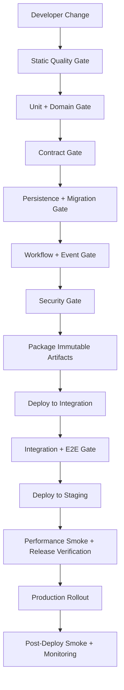
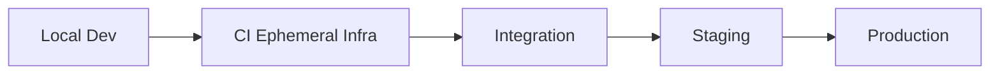
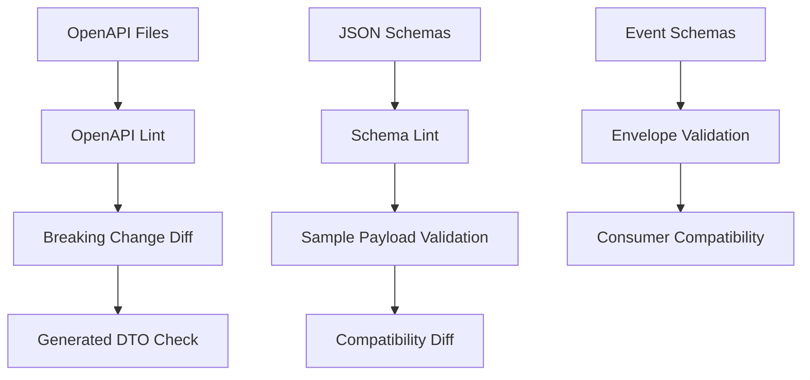
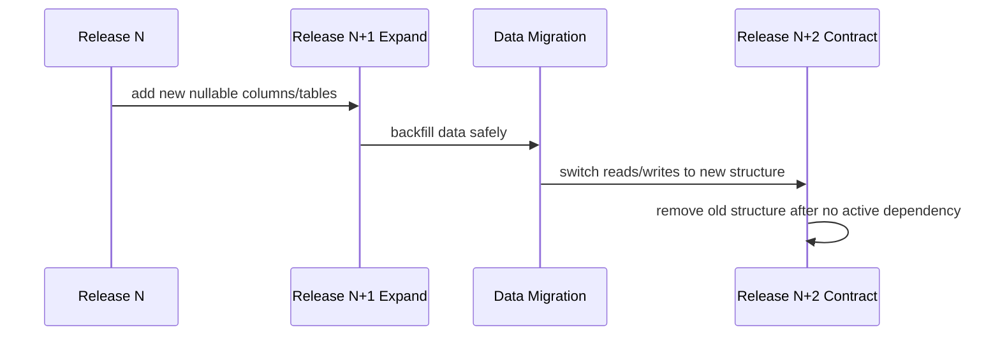
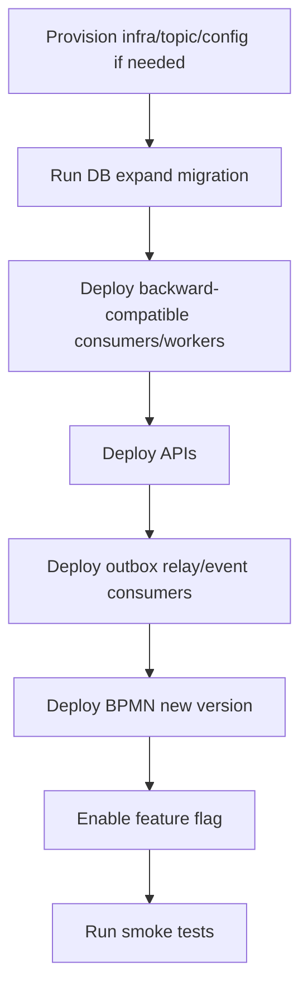
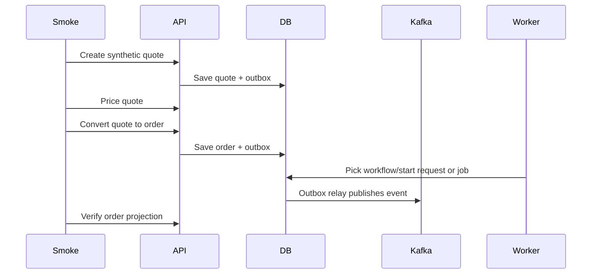
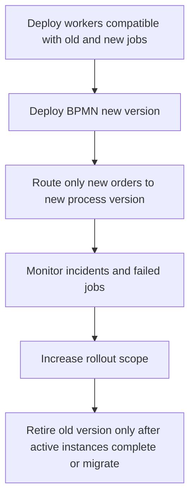
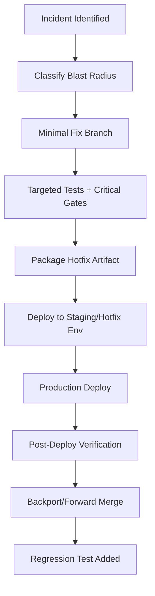

------
title: Build From Scratch: Enterprise Java Microservices CPQ & Order Management Platform - Part 058
description: CI/CD quality gates dan release safety untuk enterprise CPQ/OMS: build pipeline, contract checks, migration validation, test stages, security gates, artifact promotion, deployment safety, rollback, rollout, smoke test, dan release governance.
series: learn-enterprise-cpq-oms-glassfish-camunda8
seriesTitle: Build From Scratch: Enterprise Java Microservices CPQ & Order Management Platform
order: 58
partTitle: CI/CD Quality Gates and Release Safety
tags:
  - java
  - microservices
  - cpq
  - oms
  - ci-cd
  - release-engineering
  - quality-gates
  - openapi
  - json-schema
  - flyway
  - postgresql
  - kafka
  - camunda-8
  - glassfish
  - production-readiness
date: 2026-07-02
---

# CI/CD Quality Gates and Release Safety

CI/CD untuk enterprise CPQ/OMS bukan hanya “compile, test, build image, deploy”. Sistem ini mengelola commercial promise, pricing evidence, approval, order execution, fulfillment, billing trigger, installed base, audit, dan long-running workflow. Salah release bisa menghasilkan harga salah, order ganda, invoice salah, asset corrupt, atau proses fulfillment stuck selama berhari-hari.

Maka pipeline harus menjawab:

1. Apakah perubahan code aman?
2. Apakah API contract masih kompatibel?
3. Apakah event schema tidak memecahkan consumer?
4. Apakah database migration aman terhadap data lama?
5. Apakah BPMN process masih kompatibel dengan instance berjalan?
6. Apakah deployment bisa dipromosikan secara terkontrol?
7. Apakah rollback atau roll-forward jelas?
8. Apakah smoke test membuktikan business capability inti, bukan sekadar health endpoint?

Release safety adalah bagian dari architecture.

---

## 1. Mental Model: Pipeline as Production Risk Filter

Pipeline bukan tempat menjalankan command acak. Pipeline adalah filter risiko.



Setiap gate harus punya keputusan:

- pass
- fail
- quarantine/manual approval
- allowed with known risk

CI/CD yang baik tidak hanya cepat; ia membuat risk visible.

---

## 2. Artifact Model

Kita punya beberapa deployment artifact:

| Artifact | Packaging | Runtime | Purpose |
|---|---|---|---|
| `cpq-api.war` | WAR | GlassFish | JAX-RS API |
| `oms-api.war` | WAR | GlassFish | OMS API |
| `quote-worker.jar` | executable JAR | JVM | Camunda quote approval workers |
| `order-worker.jar` | executable JAR | JVM | Camunda fulfillment workers |
| `outbox-relay.jar` | executable JAR | JVM | PostgreSQL outbox to Kafka relay |
| `event-consumer.jar` | executable JAR | JVM | projections/integration consumers |
| `db-migrations` | SQL scripts | Flyway/liquibase-like runner | PostgreSQL schema/reference data |
| `openapi-contracts` | YAML/JSON | contract tooling | HTTP API contract |
| `json-schemas` | JSON | schema validation | payload/event/workflow schema |
| `bpmn-models` | BPMN XML | Camunda 8 | workflow definitions |
| `infra-manifests` | YAML | deployment platform | environment resources |

A release is not one binary. A release is a **versioned bundle of code, schema, workflow, contract, configuration, and operational expectations**.

---

## 3. Versioning Policy

Every build must produce immutable version metadata:

```text
app.version=1.18.0
build.commit=9f4a23c
build.time=2026-07-02T10:12:33Z
openapi.version=1.18.0
schema.bundle.version=1.18.0
bpmn.bundle.version=1.18.0
db.migration.max=V202607021012__add_fulfillment_timeout_policy.sql
```

Expose metadata through operational endpoint:

```http
GET /internal/build-info
```

Response:

```json
{
  "service": "oms-api",
  "appVersion": "1.18.0",
  "commit": "9f4a23c",
  "openApiVersion": "1.18.0",
  "schemaBundleVersion": "1.18.0",
  "bpmnBundleVersion": "1.18.0",
  "dbMigrationMax": "V202607021012__add_fulfillment_timeout_policy.sql"
}
```

This endpoint is not vanity. It helps incident response answer:

> What exactly is running?

---

## 4. Branch and Environment Strategy

Recommended baseline:

```text
main            always releasable
feature/*       short-lived branches
release/*       optional stabilization branch for regulated release train
hotfix/*        emergency production fix
```

Environment path:



Environment purpose:

| Environment | Purpose | Data |
|---|---|---|
| local | fast development | synthetic |
| CI ephemeral | reproducible automated validation | generated fixtures |
| integration | cross-service integration | synthetic but realistic |
| staging | production-like release verification | sanitized/prod-like |
| production | customer/business operation | real |

Never use production data directly in CI. Use sanitized or synthetic fixtures.

---

## 5. Pipeline Stage 1: Static Quality Gate

Static gate should fail fast.

Checks:

- compile
- formatting
- dependency convergence
- banned dependencies
- architecture tests
- generated code freshness
- OpenAPI lint
- JSON Schema lint
- BPMN lint
- SQL migration naming
- secret scan
- license policy

### 5.1 Architecture Rule Gate

Rules:

```text
domain -> no infrastructure dependency
application -> domain + ports only
api -> application
worker -> application
persistence -> domain ports + MyBatis
messaging -> domain events + Kafka client
integration -> external clients + ports
```

If architecture rule fails, do not allow merge. Dependency direction rot is slow and expensive.

---

## 6. Pipeline Stage 2: Unit and Domain Gate

This gate runs fast tests:

- domain unit tests
- state machine tests
- pricing tests
- configuration tests
- approval policy tests
- decomposition tests
- compensation planner tests
- idempotency decision tests

Target: finish quickly enough for PR feedback.

Quality rule:

> No critical business rule should only be covered by E2E tests.

E2E tests prove wiring. Domain tests prove rule correctness.

---

## 7. Pipeline Stage 3: Contract Gate

Contract gate checks HTTP API, schema, and event compatibility.



### 7.1 OpenAPI Gate

Checks:

- valid OpenAPI syntax
- standard headers present
- error response present
- operationId naming
- no undocumented 500 as normal business error
- pagination contract follows standard
- idempotency header for command endpoints
- ETag/If-Match for mutation where needed
- no database internal field leakage
- backward-compatible diff

Breaking changes:

- remove endpoint
- remove response field used by consumers
- change field type
- make optional request field required
- change error code semantics
- remove enum value without strategy
- change pagination cursor meaning

### 7.2 JSON Schema Gate

Checks:

- `$id` present
- version naming correct
- required fields intentional
- `additionalProperties` policy followed
- valid examples pass
- invalid examples fail
- compatibility diff checked

### 7.3 Event Contract Gate

Checks:

- event envelope standard
- event type registered in event catalog
- topic mapping exists
- partition key policy exists
- schema version is compatible
- PII classification checked
- sample event valid
- consumer compatibility reviewed

Event contract is public API for internal services.

---

## 8. Pipeline Stage 4: Persistence and Migration Gate

Database changes are one of the highest-risk parts of enterprise CPQ/OMS.

This gate runs:

1. migrate empty database
2. migrate previous release fixture
3. run mapper tests
4. run compatibility query tests
5. run migration verification SQL
6. check migration naming and order
7. check destructive operation policy

### 8.1 Migration Safety Rules

Allowed in normal release:

- add nullable column
- add table
- add index concurrently where applicable
- add optional reference data
- backfill in controlled batch
- add non-enforced constraint first, then validate later

Dangerous:

- drop column used by previous version
- rename column without compatibility view
- change enum semantics
- rewrite large table during release window
- add not-null column without default/backfill plan
- delete reference data used by active workflow
- mutate historical audit rows

### 8.2 Expand-Migrate-Contract Pipeline



Never combine expand, backfill, app switch, and drop in one risky release for critical tables.

---

## 9. Pipeline Stage 5: Workflow Gate

Camunda BPMN changes require their own gate.

Checks:

- BPMN XML valid
- process id naming valid
- job type naming valid
- worker implementation exists for each service task
- message correlation name stable
- timer boundary intentional
- variable schema registered
- version compatibility checked
- process test passes
- migration plan required if active instances affected

### 9.1 Workflow Compatibility Matrix

| Change | Risk | Gate Action |
|---|---|---|
| add new service task | medium | worker must exist before deploy |
| remove service task | high | active instance impact review |
| rename job type | high | dual worker or migration required |
| change variable name | high | variable schema compatibility required |
| add optional variable | low | allowed |
| change message name | high | correlation compatibility required |
| change timer duration | medium | business approval needed |
| change compensation path | high | failure scenario tests required |

### 9.2 Worker-BPMN Consistency Check

Generate a check:

```text
BPMN service task job types:
  order.validate
  order.decompose
  fulfillment.reserve-resource
  fulfillment.provision-service

Registered workers:
  order.validate
  order.decompose
  fulfillment.reserve-resource
  fulfillment.provision-service
```

If BPMN references a job type without worker, fail the pipeline.

---

## 10. Pipeline Stage 6: Integration Gate

Integration gate starts real or containerized dependencies:

- PostgreSQL
- Kafka
- Redis
- Camunda test/runtime
- stub external providers
- API container or GlassFish deployment

Tests:

- quote create/configure/price
- quote submit/approval path
- quote-to-order conversion
- order capture/decomposition
- outbox relay publish
- Kafka consumer projection
- workflow worker execution
- Redis cache invalidation
- adapter timeout handling
- duplicate command retry

This gate catches wiring issues that unit tests cannot.

---

## 11. Pipeline Stage 7: Security Gate

Security checks:

- dependency vulnerability scan
- container image scan
- secret scan
- static code security analysis
- authorization tests
- tenant isolation tests
- insecure logging tests
- OpenAPI security requirement check
- admin endpoint exposure check
- TLS/mTLS configuration policy

Security gate must be risk-based. Not every low severity CVE blocks production, but every critical exploitable issue in runtime path should block unless formally waived.

### 11.1 Security Waiver Model

A waiver must contain:

```text
finding_id
severity
component
exploitability
business_impact
mitigation
expiration_date
owner
approval
```

Permanent waivers are smell. Waivers expire.

---

## 12. Pipeline Stage 8: Package Immutable Artifacts

Once gates pass, package immutable artifacts.

Rules:

- artifacts are immutable
- artifact version includes commit hash
- build once, promote same artifact
- do not rebuild per environment
- environment config injected separately
- SBOM generated
- checksums generated
- release manifest generated

Release manifest:

```yaml
release: 1.18.0
commit: 9f4a23c
artifacts:
  cpq-api-war: cpq-api-1.18.0.war
  oms-api-war: oms-api-1.18.0.war
  quote-worker: quote-worker-1.18.0.jar
  order-worker: order-worker-1.18.0.jar
  outbox-relay: outbox-relay-1.18.0.jar
contracts:
  openapi: 1.18.0
  schemas: 1.18.0
  events: 1.18.0
workflow:
  bpmnBundle: 1.18.0
database:
  maxMigration: V202607021012__add_fulfillment_timeout_policy.sql
```

This manifest is used by deployment, audit, and incident response.

---

## 13. Deployment Order

Recommended deployment order for compatible changes:



But order depends on change type.

### 13.1 Example: New Fulfillment Task

If release adds new BPMN task `fulfillment.configure-router`:

1. deploy worker that understands `fulfillment.configure-router`
2. deploy domain/application service support
3. deploy BPMN referencing the new task
4. enable catalog mapping that can produce the new task
5. smoke test order decomposition and fulfillment

Wrong order can create incidents immediately.

---

## 14. Feature Flags and Release Toggles

Feature flags are useful but dangerous.

Good use:

- enable new product offering for one tenant
- enable new pricing rule for pilot segment
- route small percentage to new adapter version
- enable new workflow version for new orders only

Bad use:

- hide unfinished broken code indefinitely
- change database meaning dynamically
- make audit evidence depend on transient flag state without snapshot
- make pricing result non-reproducible

For CPQ/OMS, feature flag values affecting pricing/configuration/decomposition must be snapshotted into quote/order evidence.

---

## 15. Rollout Strategies

### 15.1 Rolling Deployment

Useful for stateless APIs/workers if version compatibility is maintained.

Risk:

- mixed versions running simultaneously
- old worker may pick new job type
- old API may write old schema

Mitigation:

- backward-compatible DB
- dual-read/dual-write where needed
- worker job type versioning
- feature flag gating

### 15.2 Blue-Green Deployment

Useful for API runtime if traffic can switch cleanly.

Risk:

- long-running background workers still active
- outbox relay duplicate processing if both active incorrectly
- database schema shared by both environments

Mitigation:

- singleton/leader policy for relay
- worker activation controlled
- shared schema compatibility

### 15.3 Canary Deployment

Useful for tenant/segment controlled rollout.

Risk:

- event consumers receive events from canary version
- pricing behaviour differs by tenant
- monitoring must segment canary traffic

Mitigation:

- tenant flag
- canary metrics
- event schema compatibility
- automated rollback threshold

---

## 16. Rollback vs Roll Forward

Rollback is not always safe.

| Change Type | Rollback Safe? | Preferred Strategy |
|---|---:|---|
| API code only, no schema change | often yes | rollback |
| additive DB column | yes | rollback app, keep schema |
| data backfill | depends | roll forward or repair |
| destructive DB change | often no | avoid; expand-contract |
| BPMN deployed new version | depends | stop new starts, deploy fixed version |
| event schema additive | yes | rollback producer if needed |
| event schema breaking | no | block before release |
| pricing rule change | business-sensitive | feature flag + rollback flag |

In CPQ/OMS, roll-forward is often safer than rollback after data has moved.

### 16.1 Rollback Readiness Checklist

Before production:

- previous artifact still available
- schema compatible with previous app
- config previous version available
- BPMN previous version start can be disabled/enabled
- worker old/new compatibility known
- event consumers compatibility known
- data repair script tested if needed

---

## 17. Smoke Tests

Smoke test must verify business capability, not only process health.

Bad smoke:

```http
GET /health
```

Good smoke:

1. create synthetic quote
2. add configurable product
3. price quote
4. validate quote
5. submit quote requiring no approval
6. convert quote to order
7. verify order accepted event in outbox/Kafka/projection
8. verify no error logs for correlation id

For production, smoke must use controlled synthetic tenant/product that cannot affect real billing or provisioning.

### 17.1 Post-Deploy Smoke Flow



Smoke test should leave traceable synthetic data and clean it up or mark it clearly.

---

## 18. Release Verification Dashboard

During rollout, monitor:

### API

- error rate by endpoint
- p95/p99 latency
- idempotency conflict count
- validation failure change
- optimistic lock failure rate

### Database

- connection pool usage
- slow queries
- lock waits
- migration duration
- deadlocks
- replication lag if applicable

### Kafka

- producer error rate
- outbox pending count
- consumer lag
- DLQ count
- duplicate event count

### Camunda

- active process instances
- job activation rate
- failed jobs
- incidents
- worker timeout
- process version distribution

### Redis

- cache hit rate
- eviction
- memory usage
- latency
- lock contention

### Business

- quote creation rate
- pricing failure rate
- quote-to-order conversion failure
- order fallout rate
- provisioning failure
- approval SLA breach

The business metrics are often the first indicator that release is semantically wrong even when technical metrics are green.

---

## 19. Release Notes as Engineering Artifact

Release note should include:

```text
release version
commit range
services changed
API changes
schema changes
event changes
workflow changes
database migrations
feature flags
known risks
rollback/roll-forward plan
smoke test plan
monitoring dashboard
owner/on-call
```

For regulated or audit-sensitive systems, release note is part of defensibility.

---

## 20. Change Classification

Every pull request should classify change type:

| Change Type | Required Gates |
|---|---|
| domain logic | unit, domain regression, e2e selected |
| pricing rule | pricing golden, approval policy, business review |
| configuration rule | config golden, catalog publish validation |
| API contract | OpenAPI diff, consumer test |
| DB migration | migration gate, mapper tests |
| Kafka event | schema compatibility, consumer impact |
| BPMN workflow | process test, worker consistency, version review |
| external adapter | stub test, timeout/retry test |
| security | security test, threat review |
| performance critical | performance smoke/regression |

A one-line code change in pricing may be higher risk than 500 lines of refactoring.

---

## 21. Pull Request Template

A serious CPQ/OMS PR template:

```md
## What changed

## Why

## Change classification
- [ ] Domain logic
- [ ] Pricing/configuration
- [ ] API contract
- [ ] Database migration
- [ ] Event contract
- [ ] Workflow/BPMN
- [ ] External integration
- [ ] Security
- [ ] Operational/runbook

## Compatibility
- API backward compatible: yes/no/N/A
- Event backward compatible: yes/no/N/A
- DB expand-migrate-contract followed: yes/no/N/A
- Workflow active instance impact: yes/no/N/A

## Tests
- Unit:
- Mapper:
- Contract:
- Workflow:
- Integration:
- E2E:

## Deployment notes

## Rollback/roll-forward notes

## Observability
```

This forces engineers to think in release impact, not just code diff.

---

## 22. CI Pipeline Example

Pseudo pipeline:

```yaml
stages:
  - static
  - unit
  - contract
  - persistence
  - workflow
  - integration
  - security
  - package
  - deploy-integration
  - e2e
  - promote

static:
  script:
    - mvn -q -DskipTests compile
    - mvn -q -Parchitecture-test test
    - ./tools/openapi-lint.sh
    - ./tools/schema-lint.sh
    - ./tools/bpmn-lint.sh
    - ./tools/secret-scan.sh

unit:
  script:
    - mvn -q -Dgroups=unit test

contract:
  script:
    - ./tools/openapi-diff.sh main current
    - ./tools/schema-compatibility.sh
    - ./tools/event-contract-test.sh

persistence:
  script:
    - mvn -q -Dgroups=mapper,migration verify

workflow:
  script:
    - mvn -q -Dgroups=workflow verify
    - ./tools/check-bpmn-worker-consistency.sh

integration:
  script:
    - mvn -q -Dgroups=integration verify

package:
  script:
    - mvn -q -DskipTests package
    - ./tools/create-release-manifest.sh
```

Actual syntax depends on CI provider, but structure should remain stable.

---

## 23. Quality Gate Policy

Define what blocks merge and what blocks production.

### 23.1 Blocks Merge

- compile failure
- domain unit failure
- architecture violation
- API breaking change without approved version bump
- event breaking change without migration plan
- migration fails from previous release fixture
- mapper critical test failure
- tenant isolation test failure
- secret scan critical finding

### 23.2 Blocks Production

- staging smoke failure
- high severity security issue without waiver
- DB migration duration/risk above threshold without approved plan
- Camunda worker/BPMN mismatch
- outbox relay failure
- Kafka consumer lag not recovering in staging
- performance smoke outside threshold
- missing rollback/roll-forward plan for risky release

---

## 24. Database Release Safety

Database release must have specific runbook.

### 24.1 Pre-Deploy

- backup/snapshot verified
- migration dry-run in staging
- migration duration measured
- lock impact reviewed
- disk usage checked
- index build strategy reviewed
- rollback/forward script ready

### 24.2 Deploy

- run expand migration
- monitor locks
- monitor slow queries
- verify schema version
- run verification SQL

### 24.3 Post-Deploy

- compare row counts if backfill
- compare aggregate consistency
- run application smoke
- monitor error rates
- keep old columns until contract release

---

## 25. Camunda Release Safety

Workflow release must ask:

1. Are active instances affected?
2. Is new version only for new instances?
3. Are old workers still needed?
4. Are job types renamed?
5. Are message names changed?
6. Are variable schemas compatible?
7. Are timers/SLAs changed?
8. Is migration required?

### 25.1 Safe BPMN Release Pattern



Do not delete old worker support while old process instances still require it.

---

## 26. Kafka Release Safety

Kafka release must check producer/consumer compatibility.

### 26.1 Producer Change

Before changing producer:

- event schema compatibility passes
- topic unchanged unless migration planned
- key unchanged unless ordering impact reviewed
- headers backward compatible
- consumer owners notified for meaningful semantic change
- replay behaviour tested

### 26.2 Consumer Change

Before changing consumer:

- duplicate message test passes
- poison message path tested
- offset commit after durable processing
- backfill/replay mode safe
- DLQ visibility exists

### 26.3 Topic Change

Topic change is infra + architecture change:

- partitions count change impact reviewed
- retention reviewed
- compaction reviewed
- ACLs configured
- monitoring configured
- runbook updated

---

## 27. GlassFish/JAX-RS Release Safety

For API WAR deployment:

- deployment plan clear
- connection pool config checked
- thread pool config checked
- health/readiness endpoint accurate
- OpenAPI version endpoint exposed
- request/response logging safe
- graceful shutdown supported
- in-flight command handling understood

Readiness must fail if:

- DB unavailable
- migration version incompatible
- required Kafka producer unavailable if API requires outbox relay? usually not direct
- Redis unavailable only if endpoint cannot safely degrade
- Camunda unavailable only for endpoints that start workflow synchronously, preferably decoupled through durable start request

---

## 28. Post-Deploy Verification

After production deploy:

1. verify artifact version
2. verify DB migration version
3. verify BPMN version deployed
4. verify workers registered/active
5. run synthetic smoke
6. monitor 15-30 minute error window according to release risk
7. verify outbox pending not growing
8. verify Kafka lag stable
9. verify Camunda incidents not increasing
10. verify business KPI not abnormal

Do not declare release complete when deployment command finishes. Release complete means system is behaving safely.

---

## 29. Emergency Hotfix Flow

Emergency hotfix still needs discipline.



Hotfix rule:

- minimize scope
- avoid unrelated refactoring
- add regression test
- update incident record
- merge fix back to main
- schedule proper cleanup if workaround used

---

## 30. Release Governance

For high-risk CPQ/OMS release, require release readiness review:

- engineering owner
- QA/release owner
- operations owner
- product/business owner for pricing/order behaviour
- security/compliance owner if relevant

Review checklist:

```text
[ ] all blocking gates passed
[ ] migration dry-run passed
[ ] workflow compatibility reviewed
[ ] event compatibility reviewed
[ ] smoke test prepared
[ ] monitoring dashboard ready
[ ] rollback/roll-forward plan approved
[ ] on-call coverage confirmed
[ ] feature flags default safe
[ ] release notes complete
```

Governance should be lightweight for low-risk release and strict for high-risk release. One-size-fits-all process creates either bureaucracy or danger.

---

## 31. Anti-Patterns

### 31.1 “Deploy First, Fix Later”

Terrible for CPQ/OMS. Incorrect price/order can have financial/legal impact.

### 31.2 “Only Health Check Smoke”

`/health` green does not prove quote pricing, order conversion, outbox relay, or workflow works.

### 31.3 “Rebuild per Environment”

This destroys artifact integrity. Build once, promote same artifact.

### 31.4 “Migration and Code in Same Blind Step”

If migration fails halfway, app deployment may leave environment inconsistent. Migration must be independently observable and verifiable.

### 31.5 “BPMN Without Worker Compatibility Check”

Deploying process with missing worker creates incidents immediately.

### 31.6 “Event Schema Changed Without Consumer Review”

Kafka decouples runtime, not responsibility.

### 31.7 “Rollback Assumed”

Rollback after data change may be impossible or more dangerous than roll-forward.

---

## 32. Minimal Production-Ready CI/CD Definition

For this series, a release is minimally production-ready when:

1. all artifacts are versioned and immutable
2. OpenAPI diff is checked
3. JSON Schema compatibility is checked
4. event schema compatibility is checked
5. migration from previous release is tested
6. mapper tests run against PostgreSQL
7. BPMN-worker consistency is checked
8. worker process tests run
9. Kafka outbox/inbox integration tests run
10. security/tenant tests pass
11. smoke test verifies business flow
12. deployment order is documented
13. rollback/roll-forward plan exists
14. monitoring dashboard exists
15. release manifest exists

Anything less may still be useful for internal dev, but should not be called enterprise-grade release safety.

---

## 33. Practical Build Milestone

Implement pipeline in this order:

1. Add Maven profiles for `unit`, `mapper`, `contract`, `workflow`, `integration`, `e2e`.
2. Add architecture test gate.
3. Add OpenAPI lint and diff gate.
4. Add JSON Schema sample validation gate.
5. Add event schema compatibility gate.
6. Add PostgreSQL migration test from zero.
7. Add PostgreSQL migration test from previous release fixture.
8. Add MyBatis mapper gate.
9. Add BPMN-worker consistency check.
10. Add Camunda process tests.
11. Add outbox/inbox Kafka integration tests.
12. Add security scan and tenant isolation test.
13. Add release manifest generation.
14. Add staging smoke test.
15. Add production post-deploy verification checklist.

At this point, the system has moved from “we can build it” to “we can release it repeatedly without gambling”.

Part berikutnya akan membahas runbook, operations, dan production support: bagaimana menangani stuck quote, stuck order, Camunda incident, Kafka lag, DB lock, duplicate event, failed integration, failed compensation, manual repair, dan reconciliation.
