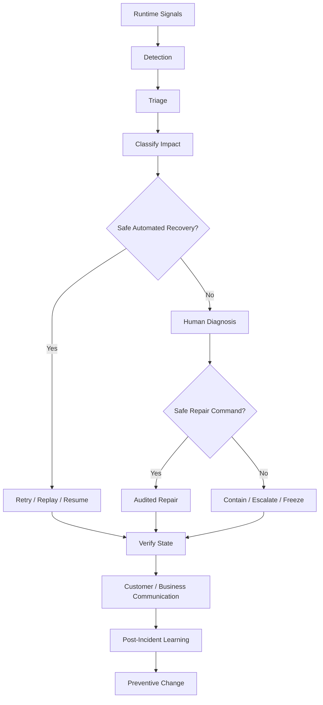
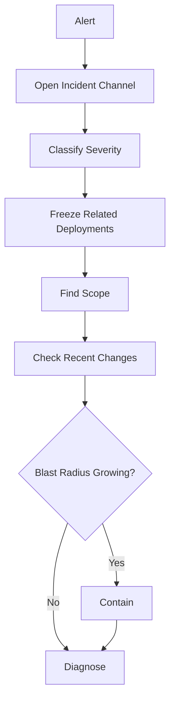
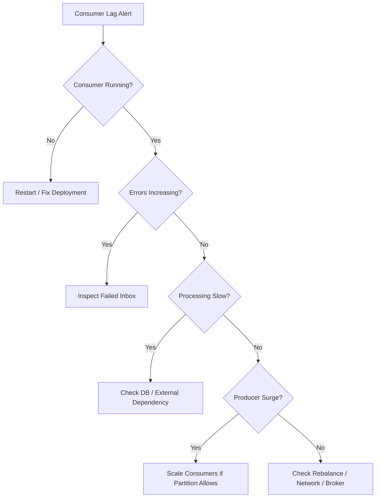
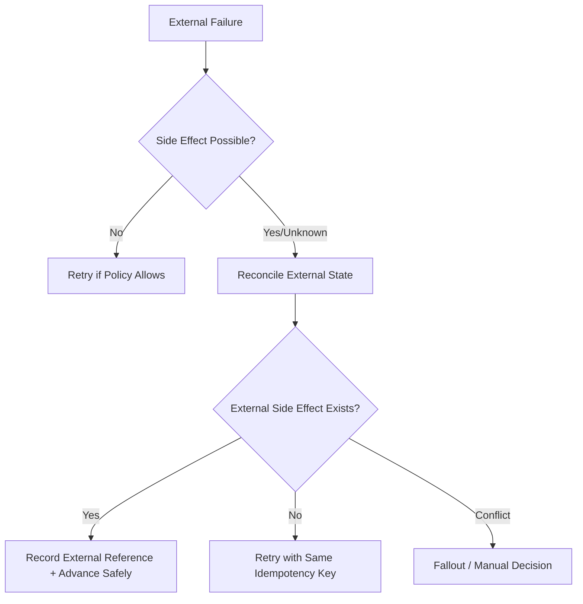
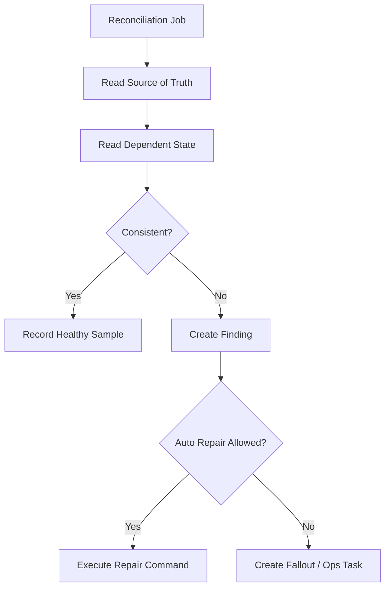

------
title: Build From Scratch: Enterprise Java Microservices CPQ & Order Management Platform - Part 059
description: Runbook operations dan production support untuk enterprise CPQ/OMS: stuck quote, stuck order, Camunda incident, Kafka lag, database lock, duplicate event, failed integration, failed compensation, manual repair, reconciliation, dan incident learning loop.
series: learn-enterprise-cpq-oms-glassfish-camunda8
seriesTitle: Build From Scratch: Enterprise Java Microservices CPQ & Order Management Platform
order: 59
partTitle: Runbook, Operations, and Production Support
tags:
  - java
  - microservices
  - cpq
  - oms
  - runbook
  - incident-response
  - production-support
  - camunda-8
  - kafka
  - postgresql
  - redis
  - glassfish
  - observability
  - operations
date: 2026-07-02
---

# Runbook, Operations, and Production Support

Sistem CPQ/OMS enterprise tidak selesai ketika semua test hijau dan deployment sukses. Sistem baru dianggap matang ketika tim bisa menjawab pertanyaan ini pada jam 02:00 saat ada order bernilai besar yang stuck:

1. Apa yang sedang terjadi?
2. Customer mana yang terdampak?
3. Apakah harga, quote, order, approval, fulfillment, billing trigger, dan asset masih konsisten?
4. Apakah aman untuk retry?
5. Apakah aman untuk repair manual?
6. Apakah repair meninggalkan evidence yang bisa diaudit?
7. Apakah penyebabnya bisa dicegah di release berikutnya?

Production support bukan pekerjaan reaktif. Production support adalah bagian dari desain sistem.

Di part ini kita membangun runbook untuk platform CPQ/OMS yang sudah kita desain sepanjang seri: JAX-RS/Jersey/GlassFish API, PostgreSQL/MyBatis source of truth, Camunda 8/Zeebe orchestration, Kafka event backbone, Redis acceleration layer, outbox/inbox, external adapter, audit, observability, CI/CD, dan release safety.

---

## 1. Mental Model: Operations Is a Control System

Jangan melihat operations sebagai kumpulan prosedur manual. Lihat sebagai control system.



Operations loop yang baik memiliki sifat:

- **detectable**: failure punya signal.
- **classifiable**: tim bisa membedakan incident teknis, business fallout, data drift, dan expected pending.
- **bounded**: blast radius bisa dihitung.
- **recoverable**: ada safe retry, replay, resume, compensation, atau repair path.
- **auditable**: setiap tindakan support punya evidence.
- **learnable**: incident menghasilkan perbaikan desain, test, alert, atau runbook.

Kalau salah satu hilang, sistem mungkin berjalan, tetapi belum production-grade.

---

## 2. The Four Kinds of Operational Problems

Di CPQ/OMS, semua masalah production hampir selalu masuk salah satu dari empat kategori.

| Category | Meaning | Example | Primary Tool |
|---|---|---|---|
| Technical failure | Komponen teknis gagal | Kafka lag, DB lock, Redis down, GlassFish unhealthy | Observability + infra runbook |
| Process failure | Workflow tidak bisa maju | Camunda incident, worker exhausted retries | Operate + workflow ref table |
| Business fallout | Process berjalan tetapi business condition gagal | Inventory unavailable, provisioning rejected, price approval expired | Fallout queue + manual repair |
| Data consistency drift | State antar-store tidak sinkron | Order completed tapi asset belum aktif | Reconciliation + repair command |

Kesalahan umum: semua dianggap “technical error”. Akibatnya tim terus retry padahal domain state memang menolak lanjut.

Contoh:

- Provisioning API `500` sementara mungkin retryable.
- Provisioning API `409 service already exists` mungkin ambiguous outcome.
- Provisioning API `422 invalid service profile` bukan retry problem; itu fallout atau decomposition bug.
- Camunda incident bukan selalu masalah Camunda; sering kali worker code gagal setelah semua retry habis.
- Kafka lag bukan selalu Kafka lambat; bisa consumer blocked oleh external dependency.

---

## 3. Operational Source of Truth

Production support harus tahu membaca data dari store yang tepat.

| Question | Source of Truth | Supporting Store |
|---|---|---|
| Apakah quote valid? | PostgreSQL quote aggregate | API read model |
| Apakah order sudah dikomit? | PostgreSQL order aggregate | Kafka events |
| Apakah workflow sedang berjalan? | Camunda/Zeebe + workflow reference table | Operate UI |
| Apakah fulfillment task selesai? | PostgreSQL fulfillment task table | Camunda job state |
| Apakah event sudah dipublish? | PostgreSQL outbox + Kafka topic | producer metric |
| Apakah consumer sudah memproses event? | PostgreSQL inbox/projection state | Kafka consumer offset |
| Apakah cache benar? | PostgreSQL + catalog/config/pricing version | Redis key |
| Apakah external call pernah dilakukan? | `external_call_attempt` table | external system log |
| Apakah support mengubah data? | audit log + repair command table | ticket/change record |

Rule penting:

> Redis bukan source of truth. Kafka bukan source of truth untuk current state. Camunda bukan source of truth untuk business aggregate. PostgreSQL bukan satu-satunya observability source. Masing-masing punya peran.

---

## 4. Standard Runbook Format

Setiap runbook harus punya format konsisten. Jangan menulis runbook seperti cerita panjang. Operator butuh prosedur yang bisa dieksekusi di bawah tekanan.

Template:

```md
# Runbook: <Scenario>

## Symptom
Apa signal yang terlihat.

## Severity Decision
Cara menentukan P0/P1/P2/P3.

## First 5 Minutes
Langkah containment awal.

## Diagnosis
Query, dashboard, log, trace, workflow, Kafka, DB, Redis checks.

## Safe Actions
Retry, replay, resume, cache invalidate, repair command.

## Unsafe Actions
Hal yang tidak boleh dilakukan.

## Verification
Cara membuktikan state sudah pulih.

## Escalation
Kapan dan ke siapa harus eskalasi.

## Evidence
Apa yang harus dicatat untuk audit/postmortem.

## Prevention
Test, alert, guardrail, schema, or design improvement.
```

Format ini penting karena incident bukan waktu yang baik untuk mendesain proses.

---

## 5. Severity Model for CPQ/OMS

Severity tidak boleh hanya berdasarkan error rate. Di CPQ/OMS, satu order enterprise bernilai besar bisa lebih penting daripada seribu quote kecil.

| Severity | Definition | Example | Response |
|---|---|---|---|
| P0 | Widespread business stop or legal/commercial risk | Semua order tidak bisa submit; pricing salah massal | Incident commander, freeze release, executive comms |
| P1 | Major customer or high-value flow blocked | Key account order stuck before activation | Immediate support + engineering |
| P2 | Degraded capability with workaround | Approval reminder delayed, projection stale | Same-day fix/recovery |
| P3 | Low impact operational issue | One dashboard metric missing | Backlog/support queue |

Tambahkan business dimensions:

- revenue impact
- number of affected tenants
- number of affected customers
- quote/order value
- regulatory/audit risk
- SLA breach risk
- irreversible external action risk
- billing/customer-notification risk

Severity harus bisa dihitung dari telemetry dan business metadata, bukan feeling.

---

## 6. First 5 Minutes Checklist

Saat alert masuk:

1. Buka incident channel.
2. Tetapkan incident commander jika P0/P1.
3. Freeze deployment untuk komponen terkait.
4. Identifikasi tenant/customer/order/quote scope.
5. Lihat dashboard health: API, DB, Kafka, Camunda, Redis, external systems.
6. Cek apakah issue baru muncul setelah deployment terakhir.
7. Tentukan apakah containment perlu dilakukan: disable feature flag, pause relay, pause worker, disable external call, atau hold order progression.
8. Jangan langsung repair data sebelum root state diketahui.



Containment examples:

- pause outbox relay for a poison topic
- disable quote-to-order conversion for one tenant
- pause provisioning worker for adapter bug
- set order intake to degraded mode
- bypass cache and force source-of-truth reads
- stop auto-retry for non-idempotent external calls

Containment is not a fix. It is a way to stop bleeding.

---

## 7. Core Dashboards

Minimum dashboard set:

### 7.1 Business Transaction Dashboard

Shows:

- quote created/submitted/approved/accepted/converted per hour
- order submitted/validated/decomposed/completed/failed per hour
- fallout count by category
- stuck quote count by state and age
- stuck order count by state and age
- order value impacted
- tenant impact

### 7.2 Runtime Dashboard

Shows:

- GlassFish request rate, latency, error rate
- PostgreSQL connection pool, locks, slow queries, deadlocks
- Kafka producer error, consumer lag, DLQ rate
- Camunda job activation/completion/failure, incident count
- Redis hit rate, latency, eviction, memory
- external adapter latency/error/retry

### 7.3 Consistency Dashboard

Shows:

- outbox backlog by age
- inbox failure by consumer
- projection drift count
- workflow reference without process instance
- process instance without valid order state
- order completed but asset not activated
- fulfillment task completed but order item not advanced
- duplicate command rejected count

Dashboard bukan hiasan. Dashboard adalah input runbook.

---

## 8. Operational Tables You Should Have

Production support sangat bergantung pada tabel operasional yang sengaja didesain.

```sql
-- Simplified operational repair command table
create table support_repair_command (
  repair_command_id uuid primary key,
  tenant_id uuid not null,
  target_type text not null,
  target_id uuid not null,
  command_type text not null,
  requested_by text not null,
  approved_by text,
  reason text not null,
  precondition_json jsonb not null,
  execution_status text not null,
  execution_result_json jsonb,
  created_at timestamptz not null,
  executed_at timestamptz
);
```

```sql
-- Simplified reconciliation finding table
create table reconciliation_finding (
  finding_id uuid primary key,
  tenant_id uuid not null,
  finding_type text not null,
  severity text not null,
  entity_type text not null,
  entity_id uuid not null,
  expected_state_json jsonb not null,
  actual_state_json jsonb not null,
  status text not null,
  detected_at timestamptz not null,
  resolved_at timestamptz
);
```

```sql
-- Simplified external call attempt table
create table external_call_attempt (
  attempt_id uuid primary key,
  tenant_id uuid not null,
  adapter_name text not null,
  business_entity_type text not null,
  business_entity_id uuid not null,
  idempotency_key text not null,
  request_hash text not null,
  status text not null,
  http_status int,
  external_reference text,
  error_code text,
  error_message text,
  created_at timestamptz not null,
  completed_at timestamptz,
  unique (tenant_id, adapter_name, idempotency_key)
);
```

These tables are not afterthoughts. They are part of the system design.

---

## 9. Runbook: Stuck Quote

### Symptom

A quote remains in one of these states longer than expected:

- `DRAFT`
- `CONFIGURED`
- `PRICED`
- `VALIDATED`
- `APPROVAL_PENDING`
- `ACCEPTED`
- `CONVERTING_TO_ORDER`

### Severity Decision

Escalate severity if:

- quote is close to expiration
- quote value exceeds threshold
- quote belongs to strategic customer
- many quotes stuck in same state
- approval or pricing rules recently changed
- quote has already been accepted by customer

### Diagnosis Query

```sql
select
  q.quote_id,
  q.quote_number,
  q.tenant_id,
  q.customer_id,
  q.state,
  q.revision,
  q.total_amount,
  q.currency,
  q.updated_at,
  now() - q.updated_at as age
from quote q
where q.state in ('APPROVAL_PENDING', 'CONVERTING_TO_ORDER')
  and q.updated_at < now() - interval '30 minutes'
order by q.updated_at asc;
```

### Check Approval Case

```sql
select
  ac.approval_case_id,
  ac.quote_id,
  ac.status,
  ac.policy_version,
  ac.current_step,
  ac.created_at,
  ac.updated_at
from approval_case ac
where ac.quote_id = :quote_id;
```

Check whether:

- approval case exists
- approval case references correct quote revision
- approver assignment exists
- Camunda process instance exists
- timer/escalation worker is healthy
- quote was revised after approval started

### Check Conversion

```sql
select
  idempotency_key,
  request_hash,
  command_type,
  status,
  response_json,
  created_at,
  completed_at
from idempotency_record
where tenant_id = :tenant_id
  and target_type = 'QUOTE'
  and target_id = :quote_id
order by created_at desc;
```

Then check order uniqueness:

```sql
select order_id, order_number, state, source_quote_id, source_quote_revision
from customer_order
where source_quote_id = :quote_id
order by created_at desc;
```

### Safe Actions

Allowed:

- resume approval reminder job if only reminder failed
- retry failed approval workflow start if no process instance exists and quote revision still matches
- replay quote accepted event if conversion command already succeeded but event projection failed
- run idempotent convert quote command again with same idempotency key
- cancel approval case only through domain command if quote revision invalidated it

Not allowed:

- manually set quote state from `APPROVAL_PENDING` to `APPROVED`
- manually insert order without conversion command
- update quote total amount after approval without creating revision
- bypass approval because “approver said yes in chat” unless evidence is attached through approved repair command

### Verification

A quote is recovered only if:

- quote state is valid
- quote revision is consistent
- approval evidence exists when required
- order exists if quote was converted
- quote-to-order conversion is idempotent
- audit log explains state transition
- customer-facing projection matches source state

---

## 10. Runbook: Stuck Order

### Symptom

An order stays too long in:

- `SUBMITTED`
- `VALIDATED`
- `DECOMPOSED`
- `IN_PROGRESS`
- `PARTIAL`
- `CANCELLING`
- `COMPENSATING`
- `FALLOUT`

### First Diagnosis

```sql
select
  o.order_id,
  o.order_number,
  o.tenant_id,
  o.customer_id,
  o.state,
  o.source_quote_id,
  o.created_at,
  o.updated_at,
  now() - o.updated_at as age
from customer_order o
where o.order_id = :order_id;
```

Check item distribution:

```sql
select state, count(*)
from order_item
where order_id = :order_id
group by state
order by state;
```

Check fulfillment task distribution:

```sql
select task_type, status, count(*)
from fulfillment_task
where order_id = :order_id
group by task_type, status
order by task_type, status;
```

### Interpret the Result

| Observation | Likely Cause |
|---|---|
| Order `VALIDATED`, no fulfillment plan | decomposition failed or not started |
| Plan exists, no Camunda instance | workflow start failed |
| Camunda active, task pending | worker unavailable or external dependency slow |
| Task failed with retry left | automated retry in progress |
| Task failed with no retry | incident/fallout likely required |
| Task completed but order item not advanced | worker transaction or projection failure |
| Order complete but asset absent | post-fulfillment asset update drift |

### Check Workflow Reference

```sql
select
  workflow_ref_id,
  business_entity_type,
  business_entity_id,
  process_definition_id,
  process_instance_key,
  process_version,
  status,
  started_at,
  completed_at
from workflow_reference
where business_entity_type = 'ORDER'
  and business_entity_id = :order_id;
```

### Safe Actions

Allowed:

- retry decomposition if no fulfillment plan exists and order version unchanged
- start workflow if durable workflow start request exists but no process instance exists
- retry a failed fulfillment task if adapter call is idempotent
- move task to manual fallout through command when business error is non-retryable
- run reconciliation for order after workflow completion
- resume order aggregation after child tasks are valid

Not allowed:

- set order state to `COMPLETED` manually
- mark fulfillment task completed without evidence
- skip failed provisioning task and activate asset anyway
- delete Camunda process instance to “unstick” order
- update asset before order item completion evidence exists

### Verification

Recovered order must have:

- valid order state
- valid order item states
- valid fulfillment task states
- no unresolved fallout for blocking tasks
- workflow reference aligned with process status
- outbox events published
- asset/subscription state aligned if order completed
- audit evidence for support action

---

## 11. Runbook: Camunda 8 Incident

### Symptom

Operate shows an incident, or metrics show growing incident count.

Camunda incident means process execution is stuck and requires intervention. In our architecture, it does not automatically mean business fallout. First classify it.

### Diagnosis

Collect:

- process instance key
- BPMN process ID
- process version
- element ID
- job type
- error message
- retries exhausted
- variables relevant to business entity
- linked `workflow_reference`

```sql
select *
from workflow_reference
where process_instance_key = :process_instance_key;
```

Then locate domain entity:

```sql
select order_id, state, version, updated_at
from customer_order
where order_id = :business_entity_id;
```

### Incident Classification

| Cause | Classification | Action |
|---|---|---|
| transient external timeout | technical retry | reset retry if idempotent |
| validation failure from domain service | business fallout | create fallout case |
| worker bug | code defect | deploy fix then resolve incident |
| missing variable | workflow contract bug | migrate/recreate/rescue carefully |
| external already executed but response lost | ambiguous outcome | reconcile external system before retry |
| task no longer valid due to cancellation | process/domain mismatch | controlled compensation/cancel path |

### Safe Resolution Pattern

1. Verify business entity state.
2. Verify whether worker side effect already happened.
3. Verify idempotency key and external call attempt.
4. Decide retry, BPMN error, fallout, compensation, or migration.
5. Record support action.
6. Resolve incident only after state is safe.

### Unsafe Actions

- resolving incident without understanding side effect
- increasing retries blindly for non-idempotent call
- editing variables to arbitrary values
- moving token forward when domain state says task failed
- resolving process while order remains inconsistent

---

## 12. Runbook: Kafka Consumer Lag

### Symptom

Consumer lag grows for one or more consumer groups.

Kafka lag diagnosis must separate:

- producer surge
- consumer slow processing
- consumer crash loop
- poison event
- downstream dependency slow
- rebalance instability
- database contention
- schema incompatibility

### First Queries

Operational table:

```sql
select consumer_name, status, count(*), max(updated_at) as last_update
from inbox_message
where created_at > now() - interval '6 hours'
group by consumer_name, status
order by consumer_name, status;
```

Failed events:

```sql
select
  consumer_name,
  topic,
  partition_no,
  offset_no,
  event_type,
  error_code,
  retry_count,
  updated_at
from inbox_message
where status in ('FAILED', 'RETRYING')
order by updated_at desc
limit 100;
```

### Decision Tree



### Safe Actions

Allowed:

- scale consumers up to partition limit
- pause consumer for poison event containment
- move poison event to DLQ after evidence and approval
- fix consumer code and replay from inbox
- replay projection from event log when consumer is idempotent
- increase DB pool only after confirming DB can handle it

Not allowed:

- skip offsets without storing skipped event evidence
- delete inbox rows to reduce error count
- reset consumer offset on production topic without replay plan
- replay non-idempotent consumer blindly
- scale consumers when partition key requires strict ordering per aggregate and consumer code is not safe

### Verification

- lag decreases
- consumer error rate normalizes
- inbox failed count stable or resolved
- projection drift does not increase
- order/quote timeline shows missing events recovered

---

## 13. Runbook: Outbox Backlog

### Symptom

Outbox rows accumulate and events are not reaching Kafka.

### Diagnosis Query

```sql
select
  status,
  event_type,
  count(*) as count,
  min(created_at) as oldest,
  max(created_at) as newest
from outbox_event
group by status, event_type
order by oldest asc;
```

Check locked/publishing rows:

```sql
select outbox_event_id, event_type, status, locked_by, locked_until, retry_count, updated_at
from outbox_event
where status in ('PUBLISHING', 'FAILED')
order by updated_at asc
limit 100;
```

### Common Causes

| Cause | Signal | Action |
|---|---|---|
| Kafka unavailable | producer failures | wait/retry, verify broker |
| schema incompatible | serialization failure | block release, fix schema |
| relay crashed | no lock updates | restart relay |
| poison event | same event fails repeatedly | quarantine event |
| DB lock | relay cannot claim rows | inspect lock/query |
| topic missing | unknown topic | provision topic-as-code |

### Safe Actions

- restart relay if stateless and idempotent
- release stale locks after confirming relay is dead
- quarantine poison event with support command
- replay outbox row after code/schema fix
- pause producers for growing backlog during P0

Not allowed:

- mark outbox `PUBLISHED` without Kafka evidence
- delete outbox rows without event loss approval
- change event payload manually without preserving evidence

---

## 14. Runbook: Database Lock or Slow Query

### Symptom

API latency spikes, command timeouts, worker timeouts, or PostgreSQL lock waits grow.

### Diagnosis

Find active sessions:

```sql
select
  pid,
  state,
  wait_event_type,
  wait_event,
  now() - query_start as age,
  left(query, 200) as query
from pg_stat_activity
where state <> 'idle'
order by age desc;
```

Find blockers:

```sql
select
  blocked_locks.pid as blocked_pid,
  blocked_activity.query as blocked_query,
  blocking_locks.pid as blocking_pid,
  blocking_activity.query as blocking_query
from pg_catalog.pg_locks blocked_locks
join pg_catalog.pg_stat_activity blocked_activity
  on blocked_activity.pid = blocked_locks.pid
join pg_catalog.pg_locks blocking_locks
  on blocking_locks.locktype = blocked_locks.locktype
 and blocking_locks.database is not distinct from blocked_locks.database
 and blocking_locks.relation is not distinct from blocked_locks.relation
 and blocking_locks.page is not distinct from blocked_locks.page
 and blocking_locks.tuple is not distinct from blocked_locks.tuple
 and blocking_locks.virtualxid is not distinct from blocked_locks.virtualxid
 and blocking_locks.transactionid is not distinct from blocked_locks.transactionid
 and blocking_locks.classid is not distinct from blocked_locks.classid
 and blocking_locks.objid is not distinct from blocked_locks.objid
 and blocking_locks.objsubid is not distinct from blocked_locks.objsubid
 and blocking_locks.pid != blocked_locks.pid
join pg_catalog.pg_stat_activity blocking_activity
  on blocking_activity.pid = blocking_locks.pid
where not blocked_locks.granted;
```

### Operational Decision

| Situation | Action |
|---|---|
| Long read query blocks migration | cancel query if safe and approved |
| Migration blocks order writes | rollback/stop migration if possible |
| Command transaction hangs on external call | code bug; external call must not be inside DB transaction |
| Hot aggregate receives concurrent writes | inspect idempotency and optimistic locking |
| Missing index causes scan | emergency index only through controlled migration |

### Unsafe Actions

- kill random DB sessions without knowing transaction effect
- add index manually outside migration process
- raise connection pool blindly
- disable constraints to let commands pass
- run repair update outside domain command

---

## 15. Runbook: Duplicate Event or Duplicate Command

### Symptom

- same order event processed twice
- duplicate order created from same quote
- external provisioning called twice
- duplicate notification sent
- idempotency conflict returned to client

### First Check

```sql
select *
from idempotency_record
where tenant_id = :tenant_id
  and idempotency_key = :idempotency_key;
```

Check duplicate business uniqueness:

```sql
select source_quote_id, source_quote_revision, count(*)
from customer_order
where source_quote_id = :quote_id
group by source_quote_id, source_quote_revision;
```

Check external call attempts:

```sql
select adapter_name, idempotency_key, request_hash, status, external_reference, count(*)
from external_call_attempt
where business_entity_id = :entity_id
group by adapter_name, idempotency_key, request_hash, status, external_reference;
```

### Diagnosis

Duplicate can come from:

- client retry without idempotency key
- same idempotency key with different request hash
- DB unique constraint missing
- outbox relay publishes twice after unknown outcome
- Kafka consumer retry after crash
- Camunda worker duplicate job execution
- external API timeout after success

### Safe Actions

- if duplicate command rejected by idempotency table, no repair needed
- if duplicate event processed but consumer idempotent, verify no side effect duplicated
- if duplicate external side effect happened, reconcile external system and create compensation/fallout
- if duplicate order created, do not delete; create cancellation/void path with audit

### Unsafe Actions

- deleting duplicate order row
- manually merging two order rows
- ignoring duplicate if external side effect exists
- changing idempotency record hash to force pass

---

## 16. Runbook: Failed External Integration

External integration failure is the most common source of OMS fallout.

### Integration Types

| Type | Example | Failure Mode |
|---|---|---|
| Sync request/response | credit check | timeout, 4xx, 5xx |
| Async callback | provisioning | callback lost, duplicate callback |
| Polling | shipment status | stale state, rate limit |
| Event-based | billing trigger | consumer lag, schema mismatch |

### Diagnosis

```sql
select
  attempt_id,
  adapter_name,
  business_entity_type,
  business_entity_id,
  idempotency_key,
  status,
  http_status,
  external_reference,
  error_code,
  retry_count,
  created_at,
  completed_at
from external_call_attempt
where business_entity_id = :entity_id
order by created_at desc;
```

### Classify Error

| Error | Meaning | Action |
|---|---|---|
| timeout no external reference | unknown outcome | reconcile before retry |
| 429 | rate limited | retry with backoff, throttle |
| 500/503 | transient maybe | retry if idempotent |
| 400/422 | request invalid | fallout/bug, do not retry blindly |
| 409 | conflict | inspect idempotency/external current state |
| duplicate callback | expected in async systems | dedupe by callback ID |

### Safe Action Pattern



### Unsafe Actions

- retry non-idempotent provisioning create call with new request ID
- assume timeout means failure
- assume HTTP 500 means no side effect
- manually advance task without external reference

---

## 17. Runbook: Failed Compensation

Compensation failure is more dangerous than forward failure because a side effect may already exist.

### Example

Order fulfillment did:

1. reserve resource: success
2. provision service: success
3. activate billing: failed
4. compensation starts
5. deprovision service: failed

Now system cannot simply mark order failed. It must preserve customer-impacting reality.

### Diagnosis

Check compensation plan:

```sql
select task_id, task_type, status, compensation_task_id, compensation_status
from fulfillment_task
where order_id = :order_id
order by sequence_no;
```

Check external references:

```sql
select adapter_name, external_reference, status, created_at, completed_at
from external_call_attempt
where business_entity_id in (
  select task_id from fulfillment_task where order_id = :order_id
)
order by created_at;
```

### Safe Actions

- retry compensation only if idempotent
- reconcile external state before retrying ambiguous compensation
- escalate to manual fallout if irreversible
- freeze billing/customer notification until reality is known
- record partial compensation evidence

### Unsafe Actions

- mark compensation success because order needs closing
- delete external reference to hide partial side effect
- retry deactivation with different idempotency key
- complete cancellation while asset remains active

---

## 18. Runbook: Redis Cache Staleness or Corruption

### Symptom

- quote prices differ between users
- configuration option availability inconsistent
- catalog update not reflected
- cache hit rate drops suddenly
- stale catalog used after publish

### Diagnosis

Check active catalog version in PostgreSQL:

```sql
select catalog_id, active_version, published_at
from catalog_publication
where tenant_id = :tenant_id;
```

Check Redis key version policy:

```txt
catalog:{tenantId}:activeVersion -> v42
catalog:{tenantId}:v42:offering:{offeringId}
pricing:{tenantId}:v42:priceList:{priceListId}
config-rule:{tenantId}:v42:offering:{offeringId}
```

### Safe Actions

- invalidate cache for tenant/version
- switch service to source-of-truth read temporarily
- rebuild cache from PostgreSQL
- block quote submission if catalog version mismatch is detected

### Unsafe Actions

- change Redis value manually to “fix” product config
- use stale cache to force quote conversion
- delete all Redis keys during peak without stampede protection

---

## 19. Runbook: Projection Drift

Projection drift means read model says one thing while source aggregate says another.

### Example

- Order aggregate state is `COMPLETED`
- Customer timeline projection still says `IN_PROGRESS`
- Operational dashboard shows stuck order

### Diagnosis

```sql
select order_id, state, updated_at
from customer_order
where order_id = :order_id;

select order_id, projected_state, last_event_id, updated_at
from order_search_projection
where order_id = :order_id;

select outbox_event_id, event_type, aggregate_id, status, published_at
from outbox_event
where aggregate_id = :order_id
order by created_at;

select consumer_name, event_id, status, processed_at
from inbox_message
where aggregate_id = :order_id
order by processed_at;
```

### Safe Actions

- replay projection consumer from event ID if idempotent
- rebuild projection from aggregate table if projection is derived-only
- mark projection stale and hide from customer-facing UI if necessary

### Unsafe Actions

- update projection manually without event/evidence
- treat projection as source of truth for repair
- create new event that lies about aggregate history

---

## 20. Safe Repair Command Design

Manual repair must go through command handlers, not direct SQL.

A repair command must define:

- target entity
- current expected state
- allowed transition
- reason
- approval if required
- evidence attachment/reference
- before snapshot
- after snapshot
- audit record
- emitted event if business-visible
- verification rule

Example repair command:

```java
public final class MarkFulfillmentTaskAsManuallyResolvedCommand {
  public UUID tenantId;
  public UUID taskId;
  public long expectedTaskVersion;
  public String resolutionCode;
  public String reason;
  public String evidenceReference;
  public String requestedBy;
  public String approvedBy;
}
```

Handler shape:

```java
public RepairResult handle(MarkFulfillmentTaskAsManuallyResolvedCommand command) {
  return unitOfWork.inTransaction(() -> {
    FulfillmentTask task = taskRepository.loadForUpdate(command.tenantId, command.taskId);

    repairPolicy.assertAllowed(command, task);
    task.markManuallyResolved(command.resolutionCode(), command.reason());

    taskRepository.save(task);
    auditRepository.append(AuditRecord.fromRepair(command, task));
    outboxRepository.append(FulfillmentTaskManuallyResolved.from(task));

    return RepairResult.success(task.id(), task.state(), task.version());
  });
}
```

Important: repair command is not a backdoor. It is a domain command with stricter evidence rules.

---

## 21. Reconciliation Jobs

Reconciliation is how the system detects silent drift.

### 21.1 Reconciliation Types

| Reconciliation | Checks |
|---|---|
| Quote approval reconciliation | quote state vs approval case vs process instance |
| Quote conversion reconciliation | accepted quote vs order existence |
| Order workflow reconciliation | order state vs workflow reference |
| Fulfillment reconciliation | task state vs external references |
| Asset reconciliation | completed order vs installed base |
| Billing reconciliation | completed billable action vs billing trigger |
| Projection reconciliation | aggregate state vs read models |
| Outbox reconciliation | domain state vs event publication |

### 21.2 Reconciliation Output

Reconciliation must not silently mutate data by default. It should produce findings.



### 21.3 Auto-Repair Rules

Auto-repair is allowed only when:

- correction is deterministic
- no external side effect is required
- no business approval is required
- before/after state is auditable
- operation is idempotent
- replay is safe

Example allowed:

- rebuild stale search projection
- mark outbox stale lock as available after relay death
- regenerate customer timeline from durable events

Example not allowed:

- mark provisioning success
- activate asset
- approve quote
- cancel order after partial fulfillment

---

## 22. Support Access Model

Support capability is dangerous. Design it like production code.

Roles:

| Role | Capabilities |
|---|---|
| Viewer | inspect quote/order/workflow/logs |
| Operator | retry safe task, invalidate cache, replay projection |
| Senior Operator | execute approved repair commands |
| Incident Commander | containment decisions, severity, comms |
| Engineer | code-level diagnosis, hotfix |
| Business Approver | approve commercial/manual exception |
| Auditor | inspect evidence, no mutation |

Every support action must include:

- actor
- role
- tenant
- target entity
- command
- reason
- ticket/reference
- before state
- after state
- timestamp
- correlation ID

No shared admin account.

---

## 23. Communication Model

Incident communication should separate technical status from business impact.

### Internal Status Format

```md
Severity: P1
Status: Contained / Investigating / Mitigating / Monitoring / Resolved
Start Time: 2026-07-02T10:15:00+07:00
Affected Tenants: tenant-a, tenant-b
Affected Capabilities: order fulfillment, provisioning adapter
Customer Impact: 48 orders delayed, no duplicate billing detected
Current Hypothesis: provisioning adapter timeout causing worker retry exhaustion
Next Update: 30 minutes
Owner: Incident Commander
```

### Customer/Business Status

Keep customer-facing communication factual:

- what capability is impacted
- whether submitted orders are safe
- whether duplicate billing/order risk exists
- current workaround
- expected next update
- final resolution summary

Do not expose internal stack details unless contractual/compliance context requires it.

---

## 24. Post-Incident Review

A post-incident review should not ask “who broke it?” It should ask:

1. What conditions allowed this failure to reach production?
2. Which signal detected it?
3. Which signal was missing?
4. Which runbook step worked?
5. Which runbook step was unclear?
6. Was recovery safe or lucky?
7. Did we need manual SQL?
8. Can this failure be converted into automated detection, test, or guardrail?
9. Should API/schema/workflow/event compatibility gates be improved?
10. Should domain invariant be moved earlier?

Output categories:

- code fix
- test addition
- alert addition
- dashboard improvement
- runbook improvement
- architecture change
- data repair tool
- release gate change
- training item

---

## 25. Production Support Anti-Patterns

Avoid these:

1. **Manual SQL as normal support tool**
   - It bypasses invariants, audit, events, and projections.

2. **Retry everything**
   - Retry can duplicate external side effects.

3. **Camunda as business state source**
   - Process state is not the same as domain state.

4. **Kafka offset reset without replay model**
   - You can lose or duplicate business effects.

5. **Cache flush as universal cure**
   - It can create stampede and hide root cause.

6. **Projection mutation as repair**
   - Projection should be regenerated, not manually invented.

7. **No evidence for commercial repair**
   - Quote/order decisions must be defensible.

8. **Postmortem without action item**
   - That is documentation theater.

9. **Support access without least privilege**
   - Production support can become insider-risk surface.

10. **No tenant blast-radius control**
   - Multi-tenant incident response must isolate impact.

---

## 26. Minimal Runbook Set Before Go-Live

Before production launch, at minimum have runbooks for:

- API high error rate
- API high latency
- PostgreSQL lock/deadlock
- PostgreSQL connection exhaustion
- failed database migration
- Kafka producer failure
- Kafka consumer lag
- outbox backlog
- inbox poison message
- Camunda incident
- worker crash loop
- stuck quote approval
- stuck quote conversion
- stuck order fulfillment
- failed provisioning
- failed compensation
- asset drift
- billing trigger drift
- Redis cache staleness
- Redis outage
- projection drift
- duplicate command/event
- data repair command
- deployment rollback/roll-forward
- tenant-specific containment

Each runbook should be tested through game day simulation.

---

## 27. Game Day Scenarios

Run game days before production.

Example scenarios:

1. Kafka unavailable for 20 minutes.
2. Outbox relay crashes after Kafka publish but before DB status update.
3. Provisioning API times out after creating service.
4. Camunda worker throws exception until retries exhausted.
5. Redis has stale catalog version.
6. Quote approval process uses old variable schema.
7. Database migration blocks order submission.
8. Duplicate quote-to-order conversion request arrives.
9. Billing trigger consumer processes event twice.
10. Order completed but asset projection failed.

For each scenario, measure:

- detection time
- triage time
- containment time
- recovery time
- data consistency after recovery
- customer impact clarity
- runbook gaps

---

## 28. Production Readiness Checklist

A CPQ/OMS platform is operationally ready when:

- every state transition has audit evidence
- every external side effect has attempt record
- every command has idempotency policy
- every event has outbox/inbox path
- every projection can be rebuilt
- every workflow instance has business reference
- every incident has runbook
- every repair command is audited
- every cache can be invalidated or bypassed
- every critical dashboard has owner
- every alert has action
- every P0/P1 has post-incident review
- every release can be correlated with incidents
- every tenant impact can be scoped

Production readiness is not a checkbox. It is the ability to recover safely.

---

## 29. What You Should Be Able to Do After This Part

You should now be able to:

1. Classify CPQ/OMS production failures by technical/process/business/data category.
2. Diagnose stuck quote and stuck order scenarios safely.
3. Understand Camunda incident without confusing it with business state.
4. Handle Kafka lag, outbox backlog, and inbox failures without losing events.
5. Diagnose database locks and slow queries without randomly killing sessions.
6. Handle external integration ambiguity without duplicate side effects.
7. Design repair commands instead of manual SQL patches.
8. Build reconciliation jobs that detect drift safely.
9. Prepare support access model with audit and least privilege.
10. Convert incidents into preventive engineering work.

---

## 30. Closing Model

The strongest production systems are not the systems that never fail. They are systems where failure is:

- visible
- bounded
- diagnosable
- recoverable
- auditable
- learnable

For enterprise CPQ/OMS, this matters more than elegance. An elegant architecture that cannot explain a stuck order is not production-grade.

Next part is the final part of the series: architecture review and extension roadmap.
