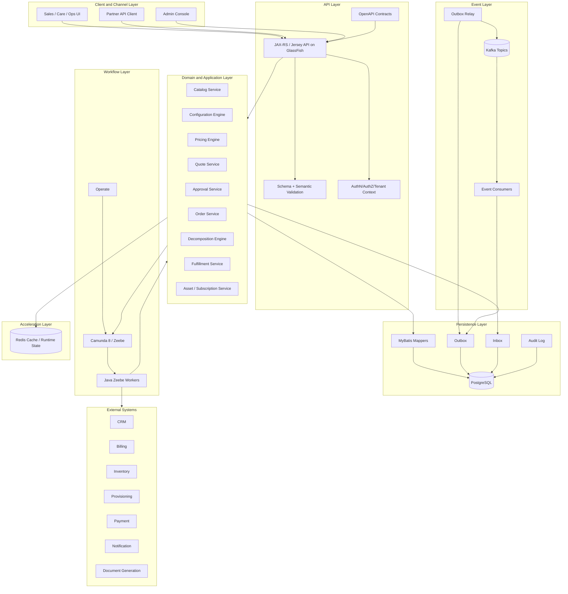
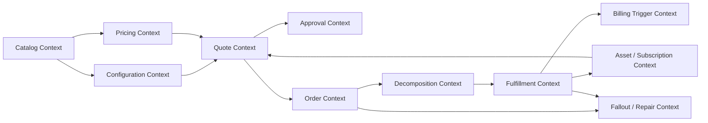
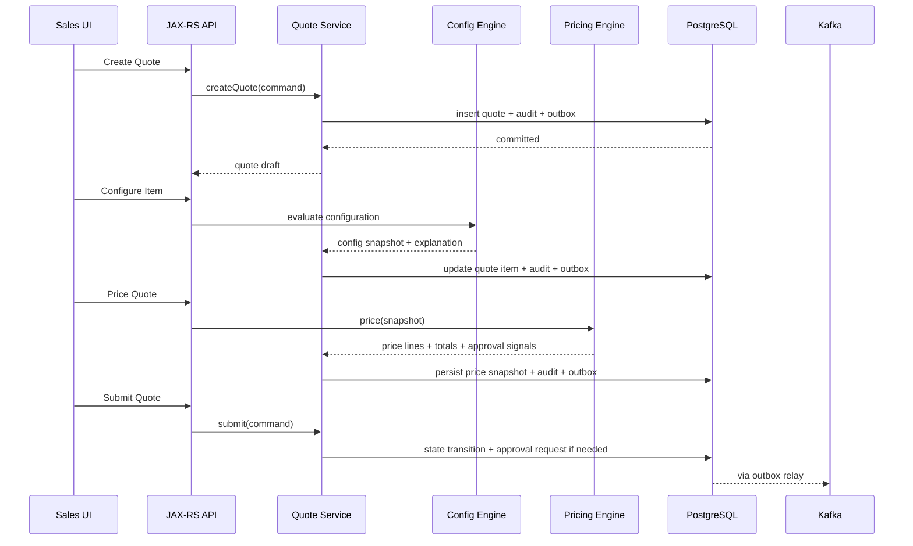
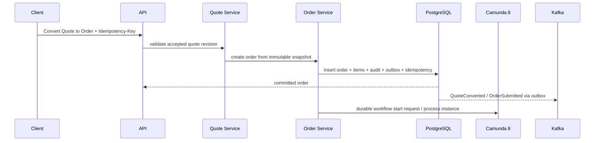
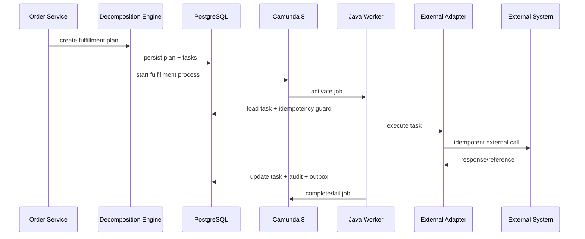
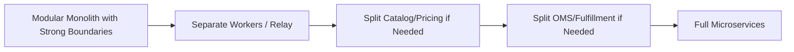

------
title: Build From Scratch: Enterprise Java Microservices CPQ & Order Management Platform - Part 060
description: Final architecture review dan extension roadmap untuk enterprise CPQ/OMS: end-to-end architecture, trade-off, weakness, scaling path, modular monolith alternative, SaaS multi-tenancy, rule engine extension, admin UI, integration roadmap, dan learning roadmap lanjutan.
series: learn-enterprise-cpq-oms-glassfish-camunda8
seriesTitle: Build From Scratch: Enterprise Java Microservices CPQ & Order Management Platform
order: 60
partTitle: Final Architecture Review and Extension Roadmap
tags:
  - java
  - microservices
  - cpq
  - oms
  - architecture-review
  - roadmap
  - enterprise-architecture
  - camunda-8
  - kafka
  - postgresql
  - redis
  - glassfish
  - mybatis
  - openapi
  - final-part
date: 2026-07-02
---

# Final Architecture Review and Extension Roadmap

Ini adalah bagian terakhir dari seri **Build From Scratch: Enterprise Java Microservices CPQ & Order Management Platform**.

Kita tidak sedang membangun CRUD platform. Kita membangun sistem yang harus bisa menangani commercial promise, product configuration, pricing, quote approval, order capture, order decomposition, fulfillment orchestration, external integration, installed base, audit, observability, resilience, release safety, dan production support.

Di part final ini kita melakukan tiga hal:

1. Mengulas architecture akhir sebagai satu sistem utuh.
2. Menilai trade-off dan kelemahan desain secara jujur.
3. Menyusun extension roadmap untuk membawa sistem ini ke level berikutnya.

---

## 1. Final System Shape

Secara konseptual, platform akhir kita terdiri dari beberapa layer.



Arah dependency sengaja dibuat seperti ini:

- API memanggil application service.
- Application service menjaga transaction boundary.
- Domain menjaga invariants.
- MyBatis melakukan explicit SQL mapping.
- PostgreSQL menjadi source of truth untuk business aggregate.
- Outbox menghubungkan local transaction ke Kafka.
- Inbox melindungi consumer dari duplicate delivery.
- Camunda mengoordinasikan long-running workflow.
- Worker tetap tipis dan memanggil application service.
- Redis mempercepat, bukan memutuskan kebenaran.
- External adapter mencegah foreign model bocor ke domain.

---

## 2. Final Bounded Context Map



Ownership ringkas:

| Context | Owns | Does Not Own |
|---|---|---|
| Catalog | offering/spec/version/rule metadata | quote/order execution |
| Configuration | configuration validity/explanation | price/approval/order |
| Pricing | price breakdown/explanation/approval signal | approval decision |
| Quote | commercial promise/revision/snapshot | fulfillment execution |
| Approval | approval case/evidence/escalation | authorization/security identity |
| Order | execution commitment/order state | technical adapter detail |
| Decomposition | fulfillment plan generation | actual external fulfillment result |
| Fulfillment | task execution/evidence/fallout | quote pricing |
| Asset | installed base/subscription | original quote negotiation |
| Fallout/Repair | exception handling/repair evidence | normal happy-path ownership |

Top 1% engineer bukan hanya tahu domain objects. Mereka tahu **siapa yang berhak mengubah apa**.

---

## 3. End-to-End Flow Review

### 3.1 Quote Creation to Acceptance



Critical invariants:

- quote total must come from persisted price snapshot
- submitted quote must not mutate without revision
- approval-required quote must not become accepted without approval evidence
- configuration and price hash must match accepted revision

### 3.2 Quote to Order



Critical invariants:

- one accepted quote revision maps to at most one active order
- conversion is idempotent
- source quote snapshot is immutable
- workflow start is recoverable
- order creation does not depend on Kafka publish succeeding in same transaction

### 3.3 Order Fulfillment



Critical invariants:

- fulfillment task state is durable in PostgreSQL
- external call attempt is recorded
- worker is idempotent
- Camunda coordinates but does not replace domain state
- fallout is explicit, not hidden in logs

---

## 4. Architecture Invariants Recap

These invariants are the real backbone of the system.

### 4.1 Source-of-Truth Invariants

1. PostgreSQL owns current business aggregate state.
2. Redis never owns business truth.
3. Kafka never owns mutable current state.
4. Camunda never owns quote/order aggregate state.
5. External systems own their own external reality; we store references and reconciliation state.

### 4.2 Command Invariants

1. Every mutating command has authorization.
2. Every mutating command has idempotency policy.
3. Every mutating command validates expected version when needed.
4. Every mutating command writes audit evidence.
5. Every mutating command emits outbox event if other components need to know.

### 4.3 Quote Invariants

1. Submitted quote cannot mutate in place.
2. Accepted quote must refer to exact revision.
3. Price override must produce approval signal.
4. Approval evidence must match quote revision.
5. Quote-to-order conversion must be idempotent.

### 4.4 Order Invariants

1. Order is execution commitment, not shopping cart.
2. Order item action must map to fulfillment plan.
3. Fulfillment task cannot complete without evidence.
4. Order cannot complete while blocking tasks are unresolved.
5. Asset mutation must be traceable to order item completion.

### 4.5 Event Invariants

1. Events describe facts that already committed.
2. Outbox event is written in same transaction as aggregate change.
3. Consumers are idempotent.
4. Replays do not create duplicate side effects.
5. Event schema evolution is checked before release.

### 4.6 Workflow Invariants

1. BPMN process coordinates, domain service decides.
2. Job worker is thin.
3. Process variables are minimal references/snapshots, not aggregate databases.
4. Workflow versioning is explicit.
5. Incidents must map back to business entity.

---

## 5. Key Trade-Offs

### 5.1 Microservices vs Modular Monolith

This series uses microservice thinking, but not blindly.

Microservices make sense when:

- teams own distinct business capabilities
- independent scaling/release is needed
- event boundaries are mature
- observability is strong
- data ownership is clear

A modular monolith may be better when:

- team is small
- domain boundaries are still unstable
- operational maturity is low
- cross-service transactions would dominate
- deployment complexity is not justified

Recommended pragmatic path:



The important thing is not the number of deployables. The important thing is boundary integrity.

### 5.2 MyBatis vs JPA

Why MyBatis is reasonable here:

- explicit SQL for complex query models
- predictable persistence for aggregate snapshots
- easier control over JSONB, locking, batch insert, reporting query
- no hidden lazy-loading in support-critical paths

Cost:

- more mapper code
- more manual mapping discipline
- less automatic change tracking
- stronger need for mapper tests

For CPQ/OMS, explicit persistence is often worth it.

### 5.3 Camunda 8 vs Code-Only Orchestration

Camunda helps when:

- process is long-running
- human approval/manual task exists
- timers/escalation matter
- business wants process visibility
- incident handling is part of operations

Code-only orchestration may be better when:

- flow is short and purely technical
- process changes rarely
- visibility requirement is low
- engine operational overhead is not acceptable

Rule:

> Use BPMN for business process visibility and long-running coordination. Do not use BPMN as a substitute for domain model.

### 5.4 Kafka vs Direct REST Integration

Kafka helps when:

- facts need to fan out
- consumers can be eventually consistent
- replay/projection matters
- services should not synchronously depend on each other

REST is better when:

- caller needs immediate decision
- command must be accepted/rejected now
- transaction boundary is local
- side effect must be tightly controlled

In this architecture:

- command in: REST
- fact out: Kafka
- long-running process: Camunda
- source of truth: PostgreSQL

### 5.5 Redis vs Database Optimization

Redis is good for:

- catalog/config/pricing cache
- short-lived wizard/session state
- rate limit counters
- idempotency acceleration
- distributed lock with strict TTL and fallback guard

Redis is bad for:

- business state authority
- approval evidence
- order state
- asset state
- irreversible workflow decision

Cache is acceleration, not correctness.

---

## 6. Known Weaknesses of This Architecture

A serious architecture review must include weaknesses.

### 6.1 Complexity Cost

This architecture has many moving parts:

- GlassFish runtime
- PostgreSQL
- MyBatis
- Kafka
- Redis
- Camunda 8
- outbox/inbox
- workers
- adapters
- observability stack

It requires operational discipline. For a small product, it may be overbuilt.

### 6.2 Eventual Consistency Burden

Event-driven architecture introduces:

- projection lag
- duplicate event handling
- replay complexity
- schema compatibility management
- customer-visible stale reads if not managed

You need strong UI and support messaging around pending state.

### 6.3 Workflow/Data Duality

Camunda and PostgreSQL both contain execution-related state. If boundary is not disciplined, teams may start fixing business state in Camunda variables. That will create drift.

Mitigation:

- workflow reference table
- domain-state-first worker design
- reconciliation jobs
- incident runbook

### 6.4 Catalog and Pricing Complexity

Real enterprise pricing can explode:

- negotiated contracts
- customer-specific price lists
- tiered usage
- multi-currency
- tax
- cost/margin
- partner/channel rules
- time-dependent promotions

The design here provides foundation, but a real pricing platform may need advanced rule governance, simulation, and explainability UI.

### 6.5 Multi-Tenancy Risk

Tenant isolation must be enforced in:

- API authorization
- PostgreSQL queries
- Redis keys
- Kafka events
- Camunda variables
- logs/traces
- support tooling

One missed tenant predicate can become serious data exposure.

### 6.6 Manual Repair Risk

Repair commands are powerful. Without access control, approval, and audit, they become a second unsafe admin API.

---

## 7. Scaling Path

Scaling should follow bottleneck evidence, not architectural fashion.

### 7.1 API Scaling

Scale when:

- CPU high on GlassFish nodes
- request queue grows
- p95/p99 latency grows under stable DB/Kafka/Redis

Actions:

- horizontal API nodes
- connection pool tuning
- endpoint-specific timeout budget
- separate read-heavy APIs if necessary
- cache safe catalog/pricing reads

### 7.2 PostgreSQL Scaling

Scale when:

- slow query plans dominate latency
- lock contention grows
- write throughput is saturated
- connection pool exhausted
- reporting queries impact commands

Actions in order:

1. fix query/index
2. reduce transaction duration
3. split read model/reporting replica
4. partition large event/audit/history tables
5. archive old operational data
6. consider service/database split only after boundary is proven

### 7.3 Kafka Scaling

Scale when:

- producer throughput exceeds topic capacity
- consumer lag grows despite healthy consumer
- partition hot spots appear

Actions:

- review partition key
- increase partitions only with ordering impact understood
- scale consumers up to partition limit
- split topic by domain if event volume or ownership differs
- tune producer batching and compression

### 7.4 Camunda Worker Scaling

Scale when:

- activated jobs wait too long
- worker CPU saturated
- external dependency latency grows
- job timeout occurs

Actions:

- tune worker concurrency
- scale worker replicas
- separate worker by task type
- isolate slow adapters
- ensure idempotency before increasing concurrency

### 7.5 Redis Scaling

Scale when:

- cache latency grows
- memory pressure/eviction occurs
- hot keys appear
- stampede occurs after invalidation

Actions:

- versioned keys
- TTL jitter
- single-flight loading
- per-tenant namespace
- cache sharding if needed
- bypass fallback to PostgreSQL for correctness

---

## 8. Extension Roadmap

### 8.1 Admin and Operations UI

Build an internal console with:

- quote timeline
- order timeline
- workflow instance link
- fulfillment task graph
- fallout queue
- repair command UI
- approval evidence viewer
- price explanation viewer
- event/outbox/inbox viewer
- reconciliation findings
- tenant impact dashboard

Do not expose raw tables. Expose operational concepts.

### 8.2 Rule Governance Platform

Extend catalog/config/pricing/approval rules with:

- rule authoring
- rule versioning
- rule simulation
- rule impact analysis
- rule approval workflow
- test case library
- canary publishing
- rollback to previous rule version
- explainability report

This is where CPQ becomes a real product platform.

### 8.3 Advanced Pricing

Add:

- customer-specific contracts
- cost/margin model
- target margin approval
- multi-currency FX snapshot
- tax integration boundary
- usage estimate model
- ramp pricing
- term-based discount
- partner/channel price books
- quote profitability view

Important: advanced pricing must remain explainable. A black-box pricing engine is dangerous in enterprise sales.

### 8.4 Product Lifecycle Governance

Add:

- catalog draft/review/publish flow
- product launch calendar
- market/channel eligibility
- phased retirement
- compatibility impact analysis
- installed base migration strategy
- quote/order impact before catalog change

Catalog publish is a production release.

### 8.5 Contract and Document Generation

Add:

- quote PDF generation
- contract template selection
- clause library
- legal approval workflow
- e-sign integration
- immutable signed artifact reference
- document versioning
- document regeneration policy

Commercial promise must have documentary evidence.

### 8.6 Billing and Revenue Integration

Add:

- billing account model
- billable event boundary
- charge activation trigger
- one-time charge trigger
- recurring charge start/end
- proration policy
- cancellation charge
- revenue recognition handoff
- billing reconciliation

Never let OMS directly mutate billing internals unless billing ownership is clearly part of the platform.

### 8.7 Inventory and Resource Reservation

Add:

- inventory availability check
- reservation lifecycle
- reservation expiry
- resource assignment
- capacity planning
- appointment slot reservation
- reservation compensation
- inventory reconciliation

Reservation is not the same as fulfillment. Keep it explicit.

### 8.8 Advanced Fulfillment

Add:

- dynamic task routing
- partner-specific fulfillment flows
- human workforce task integration
- appointment scheduling
- shipment tracking
- field-service integration
- partial activation
- rollback playbook
- SLA-driven prioritization

### 8.9 SaaS Multi-Tenancy

Add:

- tenant provisioning automation
- tenant-level feature flags
- tenant-specific catalog/rules/pricing
- tenant-specific encryption key strategy
- tenant isolation tests
- tenant data export/delete lifecycle
- per-tenant rate limit
- per-tenant operational dashboard
- noisy-neighbor controls

### 8.10 Analytics and Decision Intelligence

Add:

- quote win/loss analytics
- approval bottleneck analytics
- discount leakage analytics
- configuration popularity
- fulfillment fallout heatmap
- churn/asset modification signals
- sales cycle duration
- margin impact dashboard

Keep analytics separate from operational source of truth.

---

## 9. Alternative Architecture: Modular Monolith First

For many teams, the best implementation path is not immediate microservices.

A good modular monolith shape:

```txt
cpq-oms-platform/
  modules/
    catalog/
    configuration/
    pricing/
    quote/
    approval/
    order/
    decomposition/
    fulfillment/
    asset/
    audit/
    integration/
  runtime/
    api-war/
    worker-app/
    outbox-relay/
```

You still keep:

- OpenAPI contracts
- domain boundaries
- PostgreSQL schemas
- outbox/inbox
- Camunda workflows
- Kafka events
- Redis cache
- architecture tests

But you defer distributed deployment split until needed.

This often creates better long-term architecture because boundaries are discovered through real domain pressure, not guessed prematurely.

---

## 10. What Makes This Production-Grade

A production-grade CPQ/OMS is not defined by using Kafka, Camunda, Redis, or microservices. It is production-grade because:

1. Business state has clear ownership.
2. Every command has safe retry semantics.
3. Every external side effect is tracked.
4. Every event is durable and replay-aware.
5. Every workflow instance is traceable to business entity.
6. Every price/approval decision is explainable.
7. Every order state transition is auditable.
8. Every failure mode has runbook.
9. Every release has compatibility gates.
10. Every repair path is controlled and evidenced.

Technology helps. Discipline makes it enterprise-grade.

---

## 11. Final Engineering Rubric

Use this rubric to judge whether your implementation is serious.

### 11.1 Domain Rubric

| Level | Capability |
|---|---|
| Basic | CRUD quote/order tables |
| Intermediate | state machines and validation |
| Advanced | immutable snapshots, revisioning, approval evidence |
| Expert | full lifecycle traceability, fallout, repair, reconciliation |

### 11.2 API Rubric

| Level | Capability |
|---|---|
| Basic | JSON endpoints |
| Intermediate | OpenAPI documented endpoints |
| Advanced | schema-first contracts, error model, idempotency |
| Expert | compatibility gates, versioning, consumer-safe evolution |

### 11.3 Persistence Rubric

| Level | Capability |
|---|---|
| Basic | tables and queries |
| Intermediate | indexes, constraints, migrations |
| Advanced | aggregate persistence, outbox/inbox, locking |
| Expert | reconciliation, repair safety, performance governance |

### 11.4 Workflow Rubric

| Level | Capability |
|---|---|
| Basic | BPMN diagrams |
| Intermediate | service tasks and user tasks |
| Advanced | idempotent workers, incidents, timers, compensation |
| Expert | workflow versioning, migration, domain-state alignment |

### 11.5 Operations Rubric

| Level | Capability |
|---|---|
| Basic | logs and health checks |
| Intermediate | dashboards and alerts |
| Advanced | runbooks and incident response |
| Expert | safe repair, reconciliation, post-incident architecture learning |

---

## 12. Recommended Next Learning Tracks

After this series, useful advanced tracks are:

### Track A: Enterprise Rule Engines and Decision Management

Study:

- decision tables
- DMN
- rule versioning
- rule conflict detection
- rule explainability
- policy simulation
- governance workflow

Build:

- pricing/approval rule workbench
- rule impact simulator
- golden scenario regression suite

### Track B: Large-Scale Workflow and Process Automation

Study:

- BPMN modeling discipline
- process mining
- worker scaling
- long-running process migration
- human task UX
- incident/fallout operations

Build:

- order fulfillment process monitor
- migration lab for running workflow instances
- compensation simulator

### Track C: Event Sourcing and Temporal Modeling

Study:

- event sourcing vs event-driven architecture
- temporal tables
- audit-grade history
- snapshotting
- replay
- state reconstruction

Build:

- quote/order timeline service
- event replay sandbox
- audit evidence explorer

### Track D: Enterprise Integration Architecture

Study:

- anti-corruption layer
- canonical model
- API gateway strategy
- async callback correlation
- partner onboarding
- reconciliation architecture

Build:

- provisioning adapter framework
- external call attempt dashboard
- partner API contract test harness

### Track E: Reliability Engineering for Business Systems

Study:

- SLO and error budget
- incident command
- blameless postmortem
- resilience testing
- chaos engineering
- operational game days

Build:

- CPQ/OMS failure simulation lab
- production-readiness scorecard
- automated reconciliation suite

### Track F: Multi-Tenant SaaS Architecture

Study:

- tenant isolation
- tenant provisioning
- tenant-specific config/rules
- noisy-neighbor prevention
- per-tenant observability
- data retention/export/delete

Build:

- tenant bootstrap service
- tenant isolation test suite
- tenant-level feature flag system

### Track G: Commercial Systems Architecture

Study:

- CRM/CPQ/OMS/Billing/ERP boundaries
- subscription lifecycle
- contract lifecycle
- revenue recognition handoff
- product inventory/service inventory

Build:

- quote-to-cash reference implementation
- order-to-activate reference implementation
- asset modification engine

---

## 13. Final Build Milestones

If you turn this series into a real implementation, build in this order:

### Milestone 1: Skeleton

- Maven module structure
- GlassFish/JAX-RS baseline
- PostgreSQL migration baseline
- MyBatis mapper baseline
- health/metrics/logging baseline

### Milestone 2: Catalog + Config + Pricing

- product catalog schema
- configuration engine
- pricing engine
- explanation model
- cache strategy

### Milestone 3: Quote Lifecycle

- create/configure/price/submit
- approval signal
- approval case
- quote revision
- audit/event/outbox

### Milestone 4: Quote Approval Workflow

- Camunda approval BPMN
- user task
- escalation timer
- revision invalidation
- approval evidence

### Milestone 5: Quote to Order

- conversion command
- idempotency
- order aggregate
- order item mapping
- source quote snapshot

### Milestone 6: Order Decomposition

- technical catalog mapping
- fulfillment plan
- task dependency graph
- task persistence

### Milestone 7: Fulfillment Orchestration

- Camunda fulfillment BPMN
- Java workers
- external adapter framework
- task evidence
- fallout

### Milestone 8: Events and Integration

- Kafka topics
- outbox relay
- inbox consumers
- projections
- replay safety

### Milestone 9: Production Hardening

- observability
- resilience
- security
- performance testing
- deployment topology

### Milestone 10: Operations

- runbooks
- repair commands
- reconciliation
- support UI
- game days

Build vertically. Do not build all tables first. Take one capability from API to database to event to workflow to operations.

---

## 14. Final Design Principle

The core principle of the whole series is this:

> Enterprise architecture is not about adding more technologies. It is about making business state, technical execution, failure recovery, and audit evidence align under change.

Everything else follows:

- OpenAPI gives contract clarity.
- JSON Schema gives structural contract.
- JAX-RS/Jersey gives HTTP implementation boundary.
- GlassFish gives Jakarta EE runtime.
- PostgreSQL gives durable source of truth.
- MyBatis gives explicit persistence control.
- Camunda 8 gives long-running orchestration.
- Kafka gives event distribution.
- Redis gives acceleration.
- Observability gives runtime truth.
- Runbooks give recovery discipline.

None of them alone makes the system good. The architecture is good only when they form a coherent control system.

---

## 15. Series Completion

This is the final planned part of the series.

Completed parts:

- Part 001 to Part 004: system scope, domain map, boundaries, reference architecture
- Part 005 to Part 012: domain modelling
- Part 013 to Part 018: API-first and schema-first contracts
- Part 019 to Part 023: Java/JAX-RS/Jersey/GlassFish runtime foundation
- Part 024 to Part 029: PostgreSQL and MyBatis persistence
- Part 030 to Part 034: CPQ engine implementation
- Part 035 to Part 039: order management and fulfillment model
- Part 040 to Part 044: Camunda 8 orchestration
- Part 045 to Part 049: Kafka, outbox/inbox, integration, distributed consistency
- Part 050 to Part 051: Redis and cache coherency
- Part 052 to Part 056: production hardening and deployment
- Part 057 to Part 058: testing, CI/CD, release safety
- Part 059 to Part 060: operations and final architecture roadmap

Seri ini selesai di **Part 060**.

The next step is not reading more architecture diagrams. The next step is implementing a thin vertical slice and forcing the design to survive real constraints.
