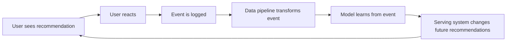
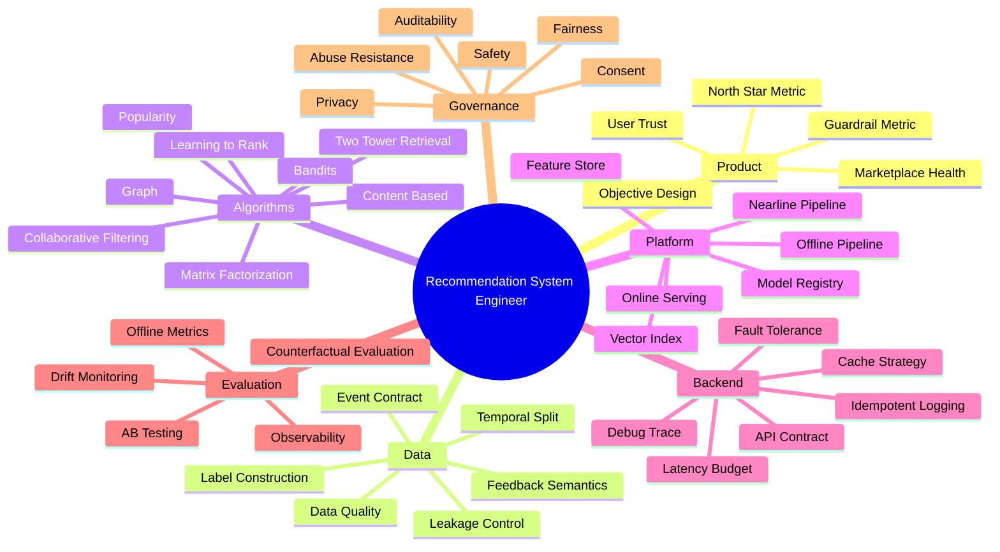
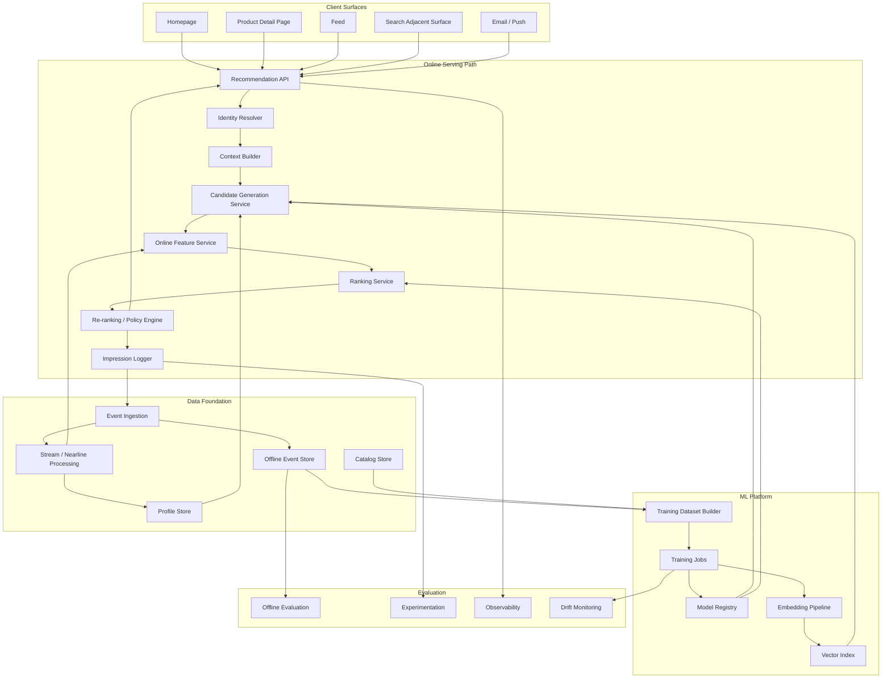
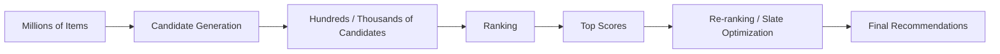

------
title: Build From Scratch Recommendations System - Part 001
description: Peta skill, batas seri, target arsitektur, dan cara berpikir engineer senior ketika membangun recommendation system production-grade dari nol.
series: learn-build-from-scratch-recommendations-system
seriesTitle: Build From Scratch: Enterprise Recommendations System
order: 1
partTitle: Skill Map & Series Boundary
tags:
  - recommendation-system
  - recsys
  - machine-learning
  - distributed-systems
  - mlops
  - java
  - series
date: 2026-07-02
---

# Part 001 — Skill Map & Series Boundary

Kita tidak sedang belajar membuat fungsi seperti ini:

```java
List<Item> recommend(User user) {
    return itemRepository.findPopularItems();
}
```

Itu bukan recommendation system. Itu hanya fallback list.

Recommendation system production-grade adalah **decision platform** yang memilih item, urutan, timing, surface, dan alasan exposure berdasarkan data, model, constraints, policy, dan feedback loop. Output-nya bukan sekadar daftar item. Output-nya adalah keputusan yang akan memengaruhi perilaku user, pendapatan, fairness marketplace, trust, cost serving, dan arah data masa depan.

Part ini adalah peta seri. Kita akan menentukan batas pembelajaran supaya seri tetap dalam, efisien, dan tidak mengulang materi dasar yang sudah dipelajari di project lain.

---

## 1. Target Seri Ini

Target akhirnya: kamu mampu merancang dan membangun recommendation system enterprise-grade dengan pemahaman berikut:

1. **Product reasoning**: tahu objective apa yang sedang dioptimalkan, mengapa metric tertentu berbahaya jika berdiri sendiri, dan bagaimana recommendation system mengubah perilaku user.
2. **Data reasoning**: tahu event mana yang valid, mana yang bias, mana yang terlambat, mana yang menyebabkan leakage, dan mana yang tidak boleh dipakai untuk training.
3. **Model reasoning**: tahu kapan memakai popularity, collaborative filtering, matrix factorization, graph, two-tower retrieval, learning-to-rank, deep ranking, contextual bandit, atau LLM augmentation.
4. **Serving reasoning**: tahu bagaimana membuat retrieval, feature fetch, ranking, re-ranking, policy filtering, logging, dan fallback tetap cepat dan reliable.
5. **Experiment reasoning**: tahu bahwa offline metric bukan kebenaran final; A/B test, guardrail metric, attribution, dan causal reasoning menentukan apakah sistem benar-benar membaik.
6. **Governance reasoning**: tahu bahwa recommendation system dapat menciptakan bias, manipulation, unsafe exposure, privacy risk, dan operational risk.
7. **Architecture reasoning**: tahu cara memecah sistem menjadi service, pipeline, storage, registry, index, contract, dan observability layer.

Seri ini tidak bertujuan membuat demo notebook. Seri ini bertujuan membentuk mental model engineer yang bisa berdiskusi dengan backend, ML engineer, data engineer, product, analytics, legal, trust & safety, dan platform team.

---

## 2. Kenapa Recommendation System Sulit?

Karena masalahnya bukan hanya prediksi.

Masalahnya adalah **closed-loop decision system**.



Kalau sistem hanya menampilkan item populer, maka item populer makin sering terlihat. Karena makin sering terlihat, item itu makin banyak diklik. Karena makin banyak diklik, model makin yakin item itu bagus. Inilah feedback loop.

Masalah production muncul ketika loop ini tidak dikendalikan:

- popularity bias makin kuat;
- item baru sulit mendapat exposure;
- user masuk filter bubble;
- seller/creator tertentu mendominasi;
- metrik jangka pendek naik, trust jangka panjang turun;
- model mengejar clickbait;
- sistem terlihat bagus offline, tetapi gagal online;
- data training mencerminkan policy lama, bukan potensi policy baru.

Engineer kelas atas tidak hanya bertanya:

> “Model apa yang akurasinya paling tinggi?”

Ia bertanya:

> “Keputusan apa yang dibuat sistem, berdasarkan sinyal apa, dalam constraint apa, dengan dampak apa, dan bagaimana kita tahu itu benar?”

---

## 3. Definisi Kerja

Dalam seri ini, recommendation system didefinisikan sebagai:

> Sistem yang memilih dan mengurutkan item untuk user dalam context tertentu, dengan objective tertentu, di bawah constraints tertentu, sambil mengumpulkan feedback untuk memperbaiki keputusan berikutnya.

Bentuk formal sederhananya:

```text
recommend(user, context, surface, constraints) -> ordered slate of items
```

Tetapi secara production, fungsi itu lebih realistis seperti ini:

```text
RecommendRequest
  user_identity
  session_context
  surface
  intent
  eligibility_constraints
  experiment_context
  policy_context
  debug_context

RecommendResponse
  slate_id
  ordered_items[]
  reasons[]
  model_versions[]
  experiment_assignments[]
  logging_tokens[]
  fallback_metadata
```

Jadi output rekomendasi harus bisa dilacak. Tanpa traceability, sistem sulit diaudit, sulit di-debug, dan sulit dipercaya.

---

## 4. Batas Seri: Apa yang Dibahas dan Tidak Dibahas

### 4.1 Dibahas Mendalam

Seri ini akan membahas:

- event tracking dan feedback semantics;
- impression/click/conversion/watch/dwell/hide/report event;
- user, item, context, action, slate, surface;
- label construction dan temporal split;
- data leakage dan exposure bias;
- baseline recommender;
- content-based recommender;
- collaborative filtering;
- matrix factorization;
- item-to-item co-occurrence;
- graph-based recommendation;
- two-tower retrieval;
- vector index dan approximate nearest neighbor;
- ranking model;
- learning-to-rank;
- sequence/session-based ranking;
- re-ranking dan slate optimization;
- diversity, novelty, fairness, frequency capping;
- contextual bandit dan exploration;
- feature store from scratch;
- model registry dan lifecycle;
- online serving architecture;
- offline/nearline pipeline;
- observability dan debugging;
- A/B testing dan counterfactual evaluation;
- privacy, consent, policy, abuse, governance;
- production-readiness checklist.

### 4.2 Tidak Diulang dari Dasar

Materi berikut tidak akan diajarkan ulang dari nol:

- Java basic;
- REST/JAX-RS basic;
- SQL basic;
- PostgreSQL basic;
- Kafka basic;
- Redis basic;
- Docker basic;
- Kubernetes basic;
- microservice generic pattern;
- general observability basic;
- general CI/CD basic.

Komponen itu tetap akan muncul, tetapi hanya ketika ada implikasi khusus untuk recommendation system.

Contoh:

- Kafka tidak dibahas sebagai “apa itu topic dan consumer group”, tetapi sebagai event backbone untuk impression integrity, delayed conversion, exactly-once-ish processing boundary, dan replayable training data.
- Redis tidak dibahas sebagai “apa itu cache”, tetapi sebagai online feature/cache layer dengan TTL, freshness, invalidation, dan graceful degradation.
- PostgreSQL tidak dibahas sebagai “cara membuat table”, tetapi sebagai metadata store, config store, audit trail, experiment assignment, dan model registry lightweight.
- Kubernetes tidak dibahas sebagai “apa itu pod”, tetapi sebagai deployment unit untuk ranking service, vector index, model server, dan feature-serving path.

---

## 5. Skill Map Recommendation System

Recommendation system production-grade membutuhkan beberapa lapisan skill.



Kunci penting: tidak semua engineer harus menjadi PhD ML researcher. Tetapi engineer recommendation system yang kuat harus paham kontrak antar-layer.

Ia harus bisa menjawab:

- Data apa yang model lihat saat training?
- Data apa yang tersedia saat serving?
- Apa beda label positif, label negatif, dan unobserved data?
- Apa yang terjadi jika feature store telat 10 menit?
- Apa fallback jika vector index tidak tersedia?
- Bagaimana memastikan impression yang ditampilkan benar-benar logged?
- Bagaimana tahu model baru tidak hanya meningkatkan clickbait?
- Bagaimana mencegah item yang tidak eligible muncul?
- Bagaimana rollback model dan index secara aman?

---

## 6. Core Architecture yang Akan Dibangun

Seri ini memakai arsitektur referensi berikut.



Ini bukan satu-satunya arsitektur yang valid. Tetapi ini cukup umum untuk sistem besar karena memisahkan:

- **online serving**: harus cepat, resilient, observable;
- **offline training**: harus reproducible, point-in-time correct, auditable;
- **nearline processing**: harus cukup fresh untuk menangkap recent intent;
- **evaluation**: harus mampu memvalidasi dampak model dan policy;
- **governance**: harus memastikan sistem aman, legal, dan defensible.

---

## 7. Multi-Stage Funnel sebagai Tulang Punggung

Recommendation system berskala besar hampir selalu memakai pipeline bertahap.



Kenapa tidak langsung ranking semua item?

Karena jumlah item bisa jutaan. Ranking model yang kaya feature biasanya mahal. Maka sistem memecah masalah:

1. **Candidate generation** mencari subset item yang mungkin relevan.
2. **Ranking** menghitung skor lebih presisi untuk kandidat tersebut.
3. **Re-ranking** menyusun hasil final dengan diversity, policy, fairness, business rules, dan user experience constraints.

Paper YouTube recommendation system yang terkenal juga memakai pemisahan candidate generation dan ranking. Candidate generation menyaring corpus besar menjadi kandidat yang lebih kecil, kemudian ranking model memberi skor lebih detail untuk final ordering. Pendekatan ini menjadi pola industri karena memisahkan recall problem dan precision problem.

---

## 8. Mindset: Dari “Model” ke “Decision System”

Engineer pemula biasanya melihat recommendation system seperti ini:

```text
Data -> Model -> Recommendation
```

Engineer production melihatnya seperti ini:

```text
Objective
  -> Event Contract
  -> Dataset Construction
  -> Candidate Generation
  -> Ranking
  -> Policy and Re-ranking
  -> Serving
  -> Logging
  -> Evaluation
  -> Feedback Loop
  -> Governance
```

Perbedaannya besar.

Model hanyalah satu bagian dari sistem. Banyak kegagalan recommendation system justru bukan karena model buruk, tetapi karena:

- event tidak konsisten;
- impression tidak di-log;
- training-serving skew;
- label salah;
- offline metric tidak sesuai dengan online objective;
- item eligibility tidak diterapkan konsisten;
- feature stale;
- model baru tidak bisa di-rollback;
- experiment attribution rusak;
- business rule override tidak terlacak;
- sistem tidak punya debug trace.

---

## 9. Production Invariants

Invariant adalah aturan yang harus tetap benar walaupun sistem berubah, traffic naik, model diganti, pipeline delay, atau dependency gagal.

Berikut invariant awal yang akan kita pegang sepanjang seri.

### 9.1 Eligibility Invariant

Sistem tidak boleh merekomendasikan item yang tidak boleh ditampilkan.

Contoh item tidak eligible:

- out of stock;
- sudah dihapus;
- geo-restricted;
- user tidak punya entitlement;
- item melanggar policy;
- item diblokir user;
- item sudah dikonsumsi dan tidak boleh diulang;
- seller/creator sedang suspended.

Ranking score tidak boleh mengalahkan eligibility.

```text
eligible(item, user, context) == false
=> item must not appear in final slate
```

### 9.2 Impression Integrity Invariant

Setiap item yang dikirim ke client harus bisa dilacak sebagai exposure.

Kalau sistem tidak tahu item apa yang ditampilkan, maka sistem tidak bisa membedakan:

- user tidak suka item;
- user tidak pernah melihat item;
- client gagal render;
- event hilang;
- item muncul di posisi yang tidak terlihat.

Tanpa impression integrity, label negatif menjadi rusak.

### 9.3 Training-Serving Consistency Invariant

Feature yang dipakai saat training harus punya definisi yang kompatibel dengan feature saat serving.

Contoh bug:

- training memakai `user_click_count_7d` yang dihitung lengkap sampai akhir hari;
- serving memakai counter real-time yang hanya sebagian update;
- hasilnya model belajar dari feature yang lebih sempurna daripada kenyataan serving.

### 9.4 Latency Budget Invariant

Recommendation API harus memenuhi deadline. Jika deadline terancam, sistem harus degrade gracefully.

Contoh policy:

```text
Total budget: 150 ms
- identity/context: 10 ms
- candidate generation: 35 ms
- feature fetch: 35 ms
- ranking: 45 ms
- re-ranking/policy: 15 ms
- logging enqueue: 10 ms
```

Kalau ranking timeout, sistem tidak boleh crash total. Sistem harus punya fallback ranking atau cached recommendations.

### 9.5 Experiment Attribution Invariant

Setiap response harus tahu experiment assignment-nya.

Tanpa ini, A/B test tidak valid. Kamu tidak bisa tahu apakah user melihat rekomendasi dari control, treatment A, treatment B, atau fallback.

### 9.6 Debuggability Invariant

Untuk setiap rekomendasi buruk, engineer harus bisa menjawab:

- candidate datang dari source mana?
- model apa yang memberi skor?
- feature apa yang dipakai?
- policy apa yang menghapus atau menahan item?
- experiment bucket apa yang aktif?
- fallback apakah terjadi?
- versi index apa yang dipakai?
- apakah data user fresh atau stale?

Jika tidak bisa dijawab, sistem belum production-grade.

---

## 10. Reference Domain Vocabulary

Kita akan memakai vocabulary berikut secara konsisten.

| Istilah | Makna |
|---|---|
| User | Entity yang menerima rekomendasi. Bisa logged-in, anonymous, household, account, employee, organization, atau tenant. |
| Item | Entity yang direkomendasikan. Bisa product, video, article, job, case, action, document, seller, creator, atau offer. |
| Context | Keadaan saat rekomendasi diminta: time, device, location, surface, session, intent, query, campaign, inventory. |
| Surface | Tempat rekomendasi muncul: homepage, PDP, feed, search adjunct, email, push, dashboard, case screen. |
| Impression | Bukti bahwa item ditampilkan atau eligible untuk dilihat oleh user. |
| Interaction | Aksi user setelah exposure: click, view, watch, add-to-cart, purchase, save, hide, skip, report. |
| Candidate | Item sementara sebelum final ranking. |
| Slate | Daftar item final yang dikirim sebagai satu unit keputusan. |
| Ranker | Komponen yang memberi score pada candidate. |
| Re-ranker | Komponen yang mengubah ordered list menjadi slate final berdasarkan constraints dan policy. |
| Feature | Sinyal yang dipakai model atau rule. |
| Label | Target training yang dibangun dari feedback. |
| Policy | Constraint eksplisit: eligibility, safety, business rule, fairness, legal, inventory. |
| Fallback | Jalur alternatif ketika sistem utama gagal atau tidak cukup data. |

---

## 11. Learning Path Seri Ini

Urutan seri sengaja dibuat dari sistem, bukan dari algoritma.

Banyak orang belajar recommendation system dengan urutan:

```text
Collaborative Filtering -> Matrix Factorization -> Deep Learning
```

Itu tidak salah, tetapi kurang cocok untuk production engineering.

Urutan kita:

```text
Problem Definition
  -> Data Contract
  -> Baseline
  -> Retrieval
  -> Ranking
  -> Re-ranking
  -> Serving Architecture
  -> Evaluation
  -> Governance
  -> Capstone
```

Alasannya:

1. Tanpa problem definition, model bagus bisa mengoptimalkan hal yang salah.
2. Tanpa event contract, dataset tidak bisa dipercaya.
3. Tanpa baseline, improvement tidak punya pembanding.
4. Tanpa retrieval, ranking tidak scalable.
5. Tanpa re-ranking, final UX sering buruk walau score model tinggi.
6. Tanpa serving architecture, model tidak bisa dipakai real-time.
7. Tanpa evaluation, improvement hanya asumsi.
8. Tanpa governance, sistem bisa menghasilkan dampak buruk.

---

## 12. Build Strategy

Kita akan membangun sistem secara bertahap.

### Stage 1 — Honest Baseline

Mulai dari sistem sederhana tetapi benar:

- event tracking jelas;
- catalog item valid;
- popularity recommender;
- impression logging;
- fallback rule;
- basic metrics.

Tujuan stage ini bukan “pintar”, tetapi **terukur dan bisa dipercaya**.

### Stage 2 — Personalized Candidate Sources

Tambahkan source kandidat:

- recently viewed similar items;
- category affinity;
- item-to-item co-occurrence;
- user-item collaborative filtering;
- session-based candidates;
- content-based candidates.

Tujuan stage ini: meningkatkan recall personalized candidates.

### Stage 3 — Ranking

Tambahkan ranker:

- feature construction;
- label construction;
- offline evaluation;
- model registry;
- online ranking service;
- score calibration;
- fallback ranking.

Tujuan stage ini: meningkatkan precision ordering.

### Stage 4 — Re-ranking dan Policy

Tambahkan final decision logic:

- diversity;
- freshness;
- frequency capping;
- eligibility;
- fairness;
- business rules;
- user controls.

Tujuan stage ini: membuat final slate layak untuk user dan bisnis.

### Stage 5 — Production Loop

Tambahkan production loop:

- A/B testing;
- online metrics;
- drift monitoring;
- debug trace;
- model rollout;
- rollback;
- governance;
- cost control.

Tujuan stage ini: sistem bisa hidup, berubah, dan tetap aman.

---

## 13. Minimal Production Skeleton

Skeleton awal yang akan kita tuju:

```text
recommendation-platform/
  services/
    recommendation-api/
    candidate-service/
    ranking-service/
    feature-service/
    event-ingestion-service/
    experiment-service/
    policy-service/
  pipelines/
    event-normalizer/
    feature-materializer/
    training-dataset-builder/
    embedding-generator/
    batch-scorer/
  stores/
    catalog-store/
    profile-store/
    feature-store/
    event-store/
    model-registry/
    vector-index/
  contracts/
    openapi/
    asyncapi/
    schemas/
  observability/
    dashboards/
    alerts/
    debug-tools/
  docs/
    architecture-decisions/
    runbooks/
    model-cards/
```

Kita tidak akan selalu membuat semua kode secara penuh dalam setiap part, tetapi setiap part akan diarahkan agar bisa diimplementasikan sebagai production component.

---

## 14. Apa yang Membedakan Engineer Biasa dan Engineer Top di Area Ini?

### Engineer biasa

- Fokus pada algoritma.
- Mengejar metric offline.
- Menganggap click sebagai suka.
- Menganggap data historis sebagai ground truth netral.
- Menganggap model score boleh langsung menjadi urutan final.
- Mengabaikan impression logging.
- Tidak memikirkan rollback.
- Tidak memikirkan item eligibility sebagai invariant.
- Tidak memikirkan user fatigue.
- Tidak memikirkan long-term effects.

### Engineer kuat

- Memisahkan prediction, decision, policy, dan evaluation.
- Mengetahui bahwa data historis dipengaruhi sistem sebelumnya.
- Membedakan unobserved, exposed-but-not-clicked, dan explicitly negative.
- Mendesain event contract sebelum model.
- Memakai baseline yang jujur.
- Memikirkan retrieval recall dan ranking precision sebagai masalah berbeda.
- Memastikan training-serving consistency.
- Membuat debug trace untuk setiap recommendation.
- Menjaga guardrail metric.
- Mengontrol feedback loop dan exposure bias.
- Mendesain fallback sejak awal.

---

## 15. Anti-Pattern yang Akan Kita Hindari

### Anti-Pattern 1 — “Start from Deep Learning”

Deep learning tidak menyelamatkan event contract yang rusak.

Kalau impression tidak lengkap, label bias, dan negative sampling salah, model lebih kompleks hanya akan mempercepat kegagalan.

### Anti-Pattern 2 — “CTR Is Everything”

CTR tinggi bisa berarti:

- recommendation relevan;
- thumbnail clickbait;
- item kontroversial;
- user penasaran tetapi kecewa;
- layout mendorong accidental click.

CTR harus dibaca bersama guardrail.

### Anti-Pattern 3 — “Unclicked Means Negative”

Tidak diklik bukan berarti tidak suka.

Mungkin item tidak terlihat, posisi terlalu bawah, user sedang terburu-buru, client tidak render, atau item kalah oleh item lain dalam slate.

### Anti-Pattern 4 — “One Model for Everything”

Homepage, product detail page, checkout, feed, search adjunct, dan email punya intent berbeda. Objective, latency budget, candidate sources, dan policy bisa berbeda.

### Anti-Pattern 5 — “Business Rule Afterthought”

Business rule yang ditempel di akhir tanpa traceability akan membuat sistem sulit di-debug. Rule harus menjadi bagian dari decision trace.

---

## 16. Series Contract

Setiap part setelah ini akan mengikuti pola:

1. **Problem** — masalah production apa yang sedang diselesaikan.
2. **Mental model** — cara berpikir yang benar.
3. **Design** — struktur data, API, service, pipeline, atau model.
4. **Trade-off** — konsekuensi pilihan desain.
5. **Failure mode** — bagaimana sistem gagal.
6. **Implementation direction** — bagaimana membangunnya secara realistis.
7. **Checklist** — tanda bahwa bagian ini siap production.

Kita akan menjaga materi tetap efektif: detail, tetapi tidak memutar-mutar.

---

## 17. Latihan Mental untuk Part Ini

Sebelum lanjut, coba jawab pertanyaan berikut untuk sistem rekomendasi apa pun yang kamu bayangkan.

1. Apa item yang direkomendasikan?
2. Siapa user-nya?
3. Surface apa yang menampilkan rekomendasi?
4. Apa objective utama?
5. Apa guardrail metric-nya?
6. Apa event positif?
7. Apa event negatif eksplisit?
8. Apa yang dianggap impression?
9. Apa item yang tidak boleh muncul?
10. Apa fallback jika personalization tidak tersedia?
11. Apa latency budget online path?
12. Apa risiko feedback loop paling berbahaya?

Kalau belum bisa menjawab ini, belum waktunya memilih model.

---

## 18. Checklist Part 001

Kamu dianggap memahami Part 001 jika bisa menjelaskan:

- kenapa recommendation system adalah decision system, bukan hanya ML model;
- kenapa event contract lebih penting daripada algoritma di fase awal;
- kenapa candidate generation dan ranking sebaiknya dipisah;
- kenapa offline metric tidak cukup;
- kenapa impression logging adalah invariant;
- kenapa eligibility harus mengalahkan model score;
- kenapa fallback adalah bagian utama, bukan fitur tambahan;
- kenapa recommendation system harus punya debug trace;
- batas seri ini dan topik yang tidak akan diulang dari dasar.

---

## 19. Referensi

- Paul Covington, Jay Adams, Emre Sargin, **Deep Neural Networks for YouTube Recommendations**, ACM RecSys 2016. https://research.google/pubs/deep-neural-networks-for-youtube-recommendations/
- Feast Documentation, **Feature Store concepts, offline store, online serving**. https://docs.feast.dev/
- MLflow Documentation, **MLflow Model Registry**. https://mlflow.org/docs/latest/ml/model-registry/
- Google Cloud, **Recommendations / Retail recommendation models**. https://cloud.google.com/use-cases/recommendations
- ACM RecSys, accepted contributions and proceedings. https://recsys.acm.org/
