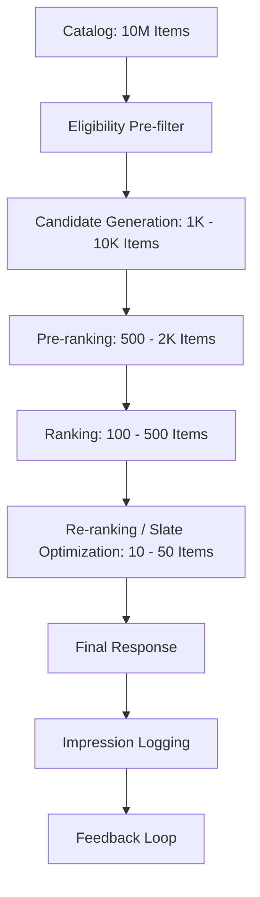
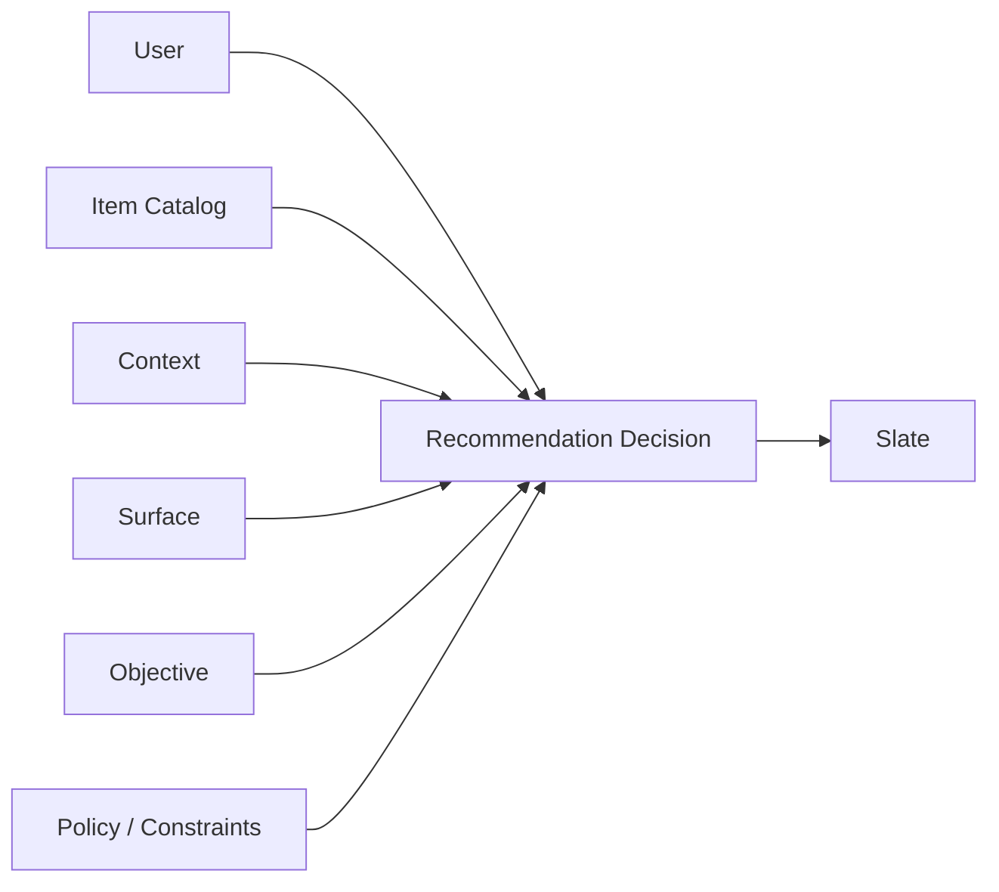
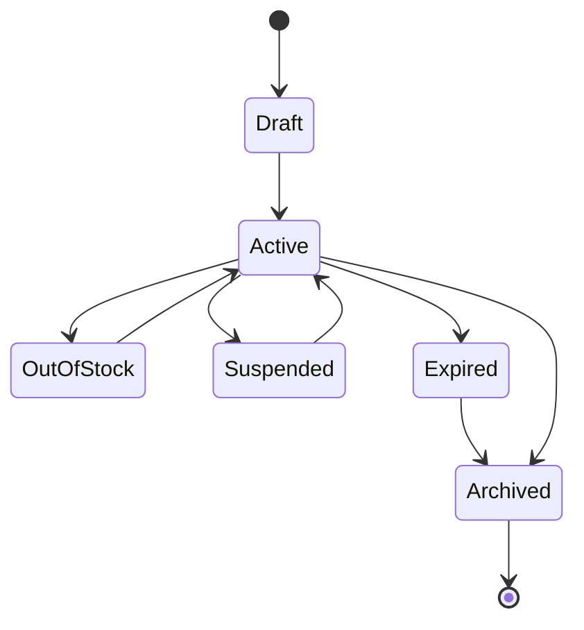
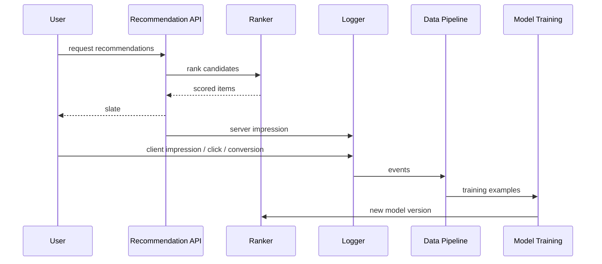
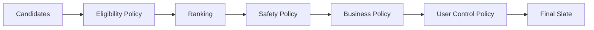
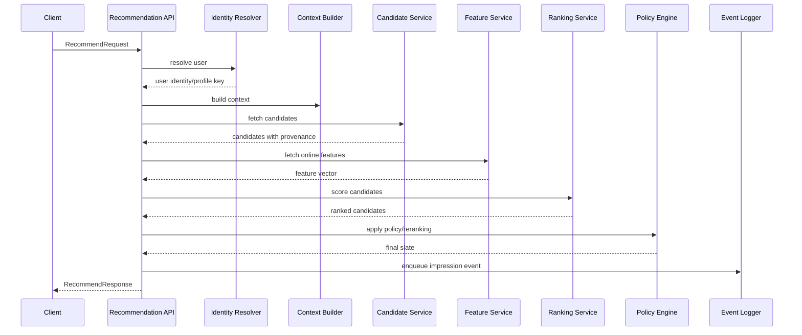
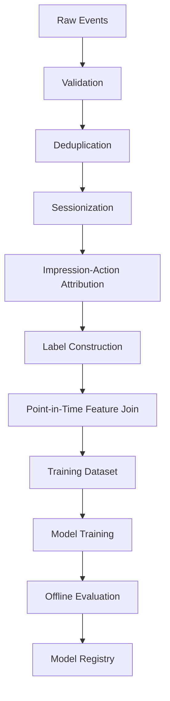

------
title: Build From Scratch Recommendations System - Part 002
description: Mental model dasar recommendation system sebagai decision engine yang memilih item, urutan, dan slate berdasarkan user, context, objective, constraints, dan feedback loop.
series: learn-build-from-scratch-recommendations-system
seriesTitle: Build From Scratch: Enterprise Recommendations System
order: 2
partTitle: What a Recommendation System Really Is
tags:
  - recommendation-system
  - recsys
  - ranking
  - retrieval
  - feedback-loop
  - distributed-systems
  - machine-learning
  - series
date: 2026-07-02
---

# Part 002 — What a Recommendation System Really Is

Recommendation system sering dijelaskan terlalu sempit.

Biasanya orang menjelaskan seperti ini:

> “Recommendation system adalah sistem yang memprediksi item yang mungkin disukai user.”

Definisi itu tidak salah, tetapi belum cukup untuk production.

Definisi yang lebih kuat:

> Recommendation system adalah decision engine yang memilih item mana yang akan diekspos, dalam urutan apa, di surface mana, pada waktu apa, untuk user dan context tertentu, dengan objective dan constraints tertentu, lalu memakai feedback dari exposure tersebut untuk memperbaiki keputusan berikutnya.

Perbedaan utama ada pada kata **decision** dan **exposure**.

Model bisa memprediksi. Tetapi sistem yang memutuskan.

---

## 1. Bentuk Paling Sederhana

Secara sederhana:

```text
recommend(user, context) -> list<Item>
```

Tetapi bentuk itu menyembunyikan banyak hal penting.

Versi production lebih dekat ke ini:

```text
recommend(
  userIdentity,
  session,
  surface,
  context,
  inventoryState,
  policyState,
  experimentAssignment,
  requestConstraints
) -> recommendationSlate
```

Dan output-nya bukan hanya item:

```text
RecommendationSlate
  slateId
  requestId
  items[]
    itemId
    position
    reason
    score
    candidateSource
    modelVersion
    policyDecisions
    loggingToken
  experimentAssignments[]
  fallbackInfo
  debugTraceId
```

Kenapa output harus sekaya ini?

Karena setelah rekomendasi dikirim, kita perlu tahu:

- item apa yang benar-benar diekspos;
- urutannya apa;
- model apa yang memilihnya;
- experiment mana yang aktif;
- apakah fallback terjadi;
- policy apa yang memfilter kandidat;
- bagaimana menghubungkan impression dengan click/conversion berikutnya.

Tanpa metadata ini, sistem tidak bisa belajar dengan benar.

---

## 2. Recommendation Bukan Ranking Saja

Ranking adalah bagian dari recommendation system, tetapi bukan keseluruhan.

Ranking menjawab:

```text
Dari kandidat yang sudah ada, mana yang lebih tinggi urutannya?
```

Recommendation system menjawab:

```text
Apa yang layak dipertimbangkan, bagaimana diberi skor, apa yang harus dibuang,
bagaimana disusun, apa yang dikirim, dan bagaimana hasilnya dievaluasi?
```

Perbedaannya:

| Layer | Pertanyaan Utama | Output |
|---|---|---|
| Candidate generation | Item apa yang mungkin relevan? | Ratusan/ribuan kandidat |
| Ranking | Kandidat mana yang paling bernilai? | Skor per kandidat |
| Re-ranking | Bagaimana daftar akhir disusun? | Slate final |
| Policy | Apa yang tidak boleh tampil? | Allow/deny/modify decision |
| Serving | Bagaimana keputusan dikirim cepat dan aman? | API response |
| Logging | Apa yang benar-benar diekspos? | Impression/click/conversion event |
| Evaluation | Apakah sistem membaik? | Offline/online metrics |

---

## 3. Recommendation sebagai Funnel

Dalam sistem besar, tidak realistis memberi skor mahal ke semua item. Maka sistem memakai funnel.



Funnel ini memecah masalah besar menjadi beberapa masalah kecil:

1. **Eligibility pre-filter** membuang item yang tidak boleh tampil.
2. **Candidate generation** mencari item yang mungkin relevan dengan biaya rendah.
3. **Pre-ranking** memangkas kandidat dengan model atau rule yang lebih murah.
4. **Ranking** memberi skor presisi dengan feature lebih kaya.
5. **Re-ranking** menyusun hasil final berdasarkan UX dan constraints.
6. **Logging** mencatat exposure agar sistem bisa belajar.

Jika kamu hanya membangun ranking model tanpa funnel, kamu belum membangun recommendation system production-grade.

---

## 4. Input Utama: User, Item, Context, Surface, Objective, Constraint

Recommendation system selalu berada di persimpangan beberapa input.



Mari bedah satu per satu.

---

## 5. User

User bukan sekadar `user_id`.

User bisa memiliki banyak representasi:

| Representasi | Contoh |
|---|---|
| Anonymous user | Cookie/session/device id |
| Logged-in user | Account id |
| Household | Smart TV, shared device |
| Organization | B2B tenant/account |
| Role-based user | Admin, analyst, reviewer, sales rep |
| Segment | New user, returning user, high-value user, churn-risk user |
| Embedding | Dense vector preferensi user |
| Profile state | Recent views, category affinity, suppression list |

Dalam production, user identity sering tidak bersih.

Contoh masalah:

- user belum login;
- user login di beberapa device;
- satu device dipakai banyak orang;
- account merger terjadi;
- user meminta penghapusan data;
- consent personalization dicabut;
- bot menyerupai user normal;
- B2B user pindah organization.

Maka recommendation system harus punya identity resolver dan privacy-aware profile logic.

---

## 6. Item

Item adalah entity yang direkomendasikan.

Jenis item bergantung domain:

| Domain | Item |
|---|---|
| E-commerce | Product, bundle, seller, voucher, brand |
| Video | Video, creator, playlist, live stream |
| News/article | Article, topic, author, newsletter |
| Music | Track, album, playlist, artist |
| Job platform | Job posting, company, recruiter |
| Ads | Ad creative, campaign, advertiser |
| Enterprise workflow | Case, task, next action, policy article, similar incident |
| Developer platform | Repository, issue, pull request, documentation page |

Item punya lifecycle.



Recommendation system harus menghormati lifecycle ini. Model score tidak boleh membuat item `Suspended` atau `Archived` muncul.

---

## 7. Context

Context adalah keadaan saat keputusan dibuat.

Contoh context:

- waktu;
- lokasi;
- device;
- app version;
- language;
- session length;
- current page;
- previous action;
- query;
- campaign;
- inventory;
- user intent;
- network quality;
- tenant/region;
- regulatory context.

Context sering lebih penting daripada long-term profile.

Contoh:

User biasa membeli laptop mahal. Tetapi saat ini ia sedang mencari mouse murah. Kalau sistem hanya memakai long-term profile, rekomendasi akan salah.

Maka sistem perlu memisahkan:

```text
long_term_preference != short_term_intent
```

---

## 8. Surface

Surface adalah tempat rekomendasi muncul.

Surface menentukan intent dan constraint.

| Surface | Intent Umum | Constraint |
|---|---|---|
| Homepage | Discover | Diversity tinggi, cold-start penting |
| Product detail page | Compare/complete | Similarity dan complementarity penting |
| Cart | Complete purchase | Stock, margin, bundle, compatibility |
| Checkout | Last-mile upsell | Jangan mengganggu conversion utama |
| Feed | Engagement/session continuation | Freshness, diversity, fatigue control |
| Email | Re-engagement | Batch scoring, send-time optimization |
| Push notification | Urgent trigger | Frequency cap dan trust sangat penting |
| Internal dashboard | Decision support | Explainability dan auditability penting |

Kesalahan umum: memakai model yang sama untuk semua surface.

Satu user yang sama bisa membutuhkan rekomendasi berbeda di homepage, product page, cart, email, dan push.

---

## 9. Objective

Objective menjawab:

> Sistem ini dioptimalkan untuk apa?

Contoh objective:

- click-through rate;
- conversion rate;
- revenue;
- gross merchandise value;
- average order value;
- watch time;
- completion rate;
- retention;
- satisfaction;
- reduced churn;
- task completion;
- case resolution speed;
- safety;
- user trust;
- marketplace fairness;
- long-term value.

Objective harus spesifik. “Recommend best item” tidak berarti apa-apa sebelum “best” didefinisikan.

---

## 10. Proxy Metric vs True Objective

Recommendation system hampir selalu memakai proxy.

True objective mungkin:

```text
User mendapatkan pengalaman yang berguna dan kembali lagi dalam jangka panjang.
```

Tetapi yang mudah diukur:

```text
click, watch, add-to-cart, purchase, dwell time
```

Masalahnya, proxy bisa disalahgunakan oleh sistem.

| Proxy | Risiko |
|---|---|
| CTR | Clickbait, accidental click, shallow curiosity |
| Watch time | Addictive content, low-quality bingeing |
| Purchase | Short-term revenue mengorbankan satisfaction |
| Dwell time | User bingung juga bisa lama di halaman |
| Rating | Rating sparsity, selection bias |
| Hide/Report | Hanya sebagian user yang memberi sinyal eksplisit |

Maka objective production biasanya berupa kombinasi:

```text
primary metric + guardrail metrics + segment metrics + long-term metrics
```

Contoh:

```text
Primary:
  conversion rate

Guardrails:
  return rate
  complaint rate
  page latency
  seller exposure concentration
  out-of-stock recommendation rate
  unsubscribe rate
```

---

## 11. Constraint

Constraint adalah batas yang tidak boleh dilanggar.

Constraint bisa lebih penting daripada score.

Jenis constraint:

| Constraint | Contoh |
|---|---|
| Legal | Age restriction, regional restriction, consent |
| Safety | Unsafe item, harmful content, scam, abuse |
| Inventory | Stock, availability, delivery region |
| Entitlement | Subscription, license, role access |
| User control | Blocked creator, hidden category, muted brand |
| Business | Campaign priority, margin, contract obligation |
| UX | Max duplicate category, max same creator, layout slot |
| System | Latency, QPS, cache availability |
| Experiment | Bucket assignment, treatment isolation |

A good ranker can still produce an invalid decision if constraints are not enforced.

---

## 12. Output: Item List vs Slate

Banyak implementasi awal menganggap output adalah `List<Item>`.

Production system harus memikirkan output sebagai **slate**.

Slate adalah satu unit keputusan yang memperhatikan hubungan antar-item.

Contoh:

```text
[Item A, Item B, Item C, Item D, Item E]
```

Bukan hanya lima keputusan terpisah. Ini satu komposisi.

Kenapa penting?

- Dua item bisa redundant.
- Item pertama memengaruhi click item kedua.
- Posisi mengubah probability click.
- Diversity hanya bisa dilihat pada level slate.
- Sponsored slot bisa mengubah persepsi user.
- Carousel title memengaruhi interpretasi item.
- Pagination menyebabkan exposure tidak sama.

Slate optimization menjawab:

> Dari kandidat yang bagus secara individual, kombinasi mana yang paling baik sebagai pengalaman final?

---

## 13. Exposure dan Impression

Recommendation system belajar dari feedback. Tetapi feedback hanya bermakna jika kita tahu exposure-nya.

Perbedaan penting:

```text
item not clicked
```

bisa berarti:

1. item ditampilkan dan user mengabaikan;
2. item dikirim API tetapi tidak dirender;
3. item ada di bawah fold dan tidak terlihat;
4. item tidak pernah dikirim;
5. event click hilang;
6. user keluar sebelum melihat;
7. posisi item terlalu rendah.

Karena itu impression harus didefinisikan jelas.

Tipe exposure:

| Tipe | Makna |
|---|---|
| Server impression | API mengirim item ke client |
| Client render impression | Client benar-benar render item |
| Viewable impression | Item terlihat di viewport |
| Engaged impression | User punya cukup waktu untuk melihat |
| Attributed impression | Impression yang bisa dihubungkan dengan action berikutnya |

Untuk training, viewable atau attributed impression biasanya lebih berguna daripada sekadar server response. Tetapi server response tetap penting untuk debugging.

---

## 14. Feedback Semantics

Feedback tidak netral.

| Event | Makna Mungkin | Risiko Interpretasi |
|---|---|---|
| Click | Tertarik, penasaran, salah klik | Clickbait |
| Add to cart | Intent beli | Bisa hanya wishlist sementara |
| Purchase | Conversion | Bisa refund/return |
| Watch long | Engaged | Bisa autoplay/pasif |
| Skip | Tidak tertarik | Bisa karena timing salah |
| Hide | Negative eksplisit | Sparse, hanya sebagian user |
| Report | Safety signal | Bisa abuse/report palsu |
| Rating tinggi | Suka | Selection bias |
| No click | Mungkin negatif | Belum tentu melihat |

Satu event jarang cukup. Sistem kuat memakai kombinasi sinyal.

Contoh e-commerce:

```text
positive signals:
  product click
  add to cart
  purchase
  repeat purchase
  wishlist

negative or weak signals:
  quick bounce
  hide item
  return/refund
  repeated ignore after viewable impression
```

Contoh video:

```text
positive signals:
  click
  watch duration
  completion
  like
  subscribe after watch
  share

negative or weak signals:
  skip quickly
  dislike
  not interested
  report
  repeated abandonment
```

---

## 15. Recommendation as a Controlled Feedback Loop

Feedback loop adalah inti sistem.



Loop ini harus dikontrol. Kalau tidak, sistem akan belajar dari bias yang ia ciptakan sendiri.

Contoh:

- item populer dapat exposure lebih banyak;
- exposure lebih banyak menghasilkan click lebih banyak;
- click lebih banyak membuat model makin memilih item populer;
- long-tail item makin tidak terlihat;
- model terlihat “akurat” karena hanya memprediksi pola exposure lama.

Karena itu exploration, counterfactual evaluation, fairness metrics, dan exposure tracking bukan fitur tambahan. Itu bagian dari kesehatan sistem.

---

## 16. Prediction vs Decision

Model ranking mungkin memprediksi:

```text
P(click | user, item, context)
```

Tetapi decision system perlu menghitung utility:

```text
utility = f(
  predicted_click,
  predicted_conversion,
  user_satisfaction,
  item_quality,
  margin,
  freshness,
  diversity,
  fairness,
  safety,
  business_constraints,
  long_term_value
)
```

Contoh:

Item A:

```text
P(click) = 0.40
quality risk = high
return probability = high
```

Item B:

```text
P(click) = 0.32
quality risk = low
return probability = low
long-term satisfaction = high
```

Jika hanya mengejar click, A menang. Jika sistem mengoptimalkan trust dan long-term value, B bisa lebih baik.

Inilah sebabnya recommendation system tidak boleh dipahami sebagai sorting by predicted click saja.

---

## 17. Candidate Generation

Candidate generation bertugas mencari item yang layak dipertimbangkan.

Tujuannya bukan presisi sempurna. Tujuannya adalah **recall cukup tinggi dengan biaya rendah**.

Contoh source kandidat:

- globally popular;
- popular by category;
- trending by region;
- recently viewed similar items;
- item-to-item co-occurrence;
- user-user collaborative filtering;
- matrix factorization top-N;
- two-tower ANN retrieval;
- graph random walk;
- editorial collection;
- sponsored candidates;
- business campaign;
- search-query related items;
- session-intent candidates.

Candidate generation harus mengembalikan metadata source.

```json
{
  "itemId": "SKU-123",
  "source": "similar_to_recent_view",
  "sourceItemId": "SKU-999",
  "rawScore": 0.82,
  "generatedAt": "2026-07-02T10:15:30+07:00"
}
```

Tanpa provenance, debugging menjadi gelap.

---

## 18. Ranking

Ranking memberi skor lebih kaya kepada kandidat.

Input ranking biasanya:

```text
user features
item features
context features
user-item cross features
candidate source features
historical interaction features
real-time session features
```

Output ranking bisa berupa:

```text
score_click
score_conversion
score_watch_time
score_satisfaction
score_quality
score_risk
score_utility
```

Ranking service harus memperhatikan latency. Model terbaik offline tidak berguna jika tidak bisa melayani request production.

Trade-off umum:

| Pilihan | Kelebihan | Kekurangan |
|---|---|---|
| Simple heuristic | Cepat, explainable | Kurang personalized |
| GBDT ranker | Kuat untuk tabular feature | Feature engineering besar |
| Deep ranker | Kapasitas tinggi | Mahal, sulit debug |
| Multi-task model | Bisa optimasi banyak objective | Complexity tinggi |
| Sequence model | Bagus untuk session intent | Serving dan feature state lebih sulit |

---

## 19. Re-ranking

Re-ranking mengubah ranked list menjadi final slate.

Contoh ranked list mentah:

```text
1. Nike running shoe black
2. Nike running shoe blue
3. Nike running shoe red
4. Nike running shoe green
5. Nike running shoe white
```

Model mungkin benar: semua item relevan. Tetapi user experience buruk karena terlalu seragam.

Re-ranking bisa menghasilkan:

```text
1. Nike running shoe black
2. Adidas running shoe
3. Running socks
4. Hydration belt
5. Shoe cleaner
```

Re-ranking mempertimbangkan:

- diversity;
- novelty;
- category spread;
- creator/seller spread;
- price range;
- stock;
- campaign;
- user fatigue;
- frequency capping;
- fairness;
- safety;
- slot constraints;
- business rules.

Ranking menjawab “mana yang tinggi skornya”.

Re-ranking menjawab “daftar akhir mana yang paling masuk akal sebagai pengalaman”.

---

## 20. Policy Layer

Policy layer tidak boleh dianggap sebagai tempelan.

Policy harus menjadi bagian eksplisit dari decision path.



Beberapa policy harus dijalankan sebelum ranking agar tidak membuang compute untuk item invalid. Beberapa policy perlu dijalankan setelah ranking karena butuh score atau slate context.

Contoh:

- item suspended: pre-ranking filter;
- out of stock: pre-ranking filter;
- max 2 items from same seller: post-ranking slate constraint;
- sponsored placement: re-ranking policy;
- age restriction: strict eligibility;
- user blocked brand: strict eligibility;
- diversity: slate-level re-ranking;
- exposure fairness: slate-level atau traffic-level control.

---

## 21. Serving Path

Online serving path harus cepat dan predictable.

Contoh path:



Di production, setiap stage butuh timeout dan fallback.

Contoh:

| Stage | Timeout | Fallback |
|---|---:|---|
| Identity | 10 ms | anonymous profile |
| Candidate service | 35 ms | cached popular/trending |
| Feature service | 30 ms | default/stale features |
| Ranking service | 45 ms | heuristic ranker |
| Policy engine | 20 ms | strict eligibility + simple diversity |
| Logger | async | durable queue / local buffer |

---

## 22. Offline Path

Offline path membangun data untuk training dan evaluation.



Offline path harus reproducible.

Kalau model production buruk, kita harus bisa menjawab:

- data snapshot mana yang dipakai;
- event schema versi berapa;
- feature definition versi berapa;
- label window berapa;
- negative sampling strategy apa;
- model code commit mana;
- hyperparameter apa;
- evaluation result apa;
- siapa yang approve model.

Tanpa reproducibility, model lifecycle menjadi spekulatif.

---

## 23. Nearline Path

Tidak semua sinyal bisa menunggu batch harian.

Contoh nearline signal:

- user baru saja melihat item;
- user baru saja menambahkan item ke cart;
- item sedang trending dalam 15 menit terakhir;
- product baru saja out of stock;
- seller baru saja suspended;
- user baru saja hide creator;
- session intent berubah.

Nearline path mengisi gap antara offline training dan online request.

```text
offline = deep history, reproducible, slower
nearline = recent aggregate, bounded freshness
online = request-time context, lowest latency
```

Sistem yang kuat tahu sinyal mana yang harus offline, nearline, atau online.

---

## 24. Example: E-commerce Homepage

Request:

```text
User membuka homepage marketplace.
```

Input:

```text
user: logged-in, category affinity electronics + running gear
context: mobile app, Jakarta, evening, payday week
surface: homepage
objective: conversion + discovery
constraints: in-stock, deliverable to region, safe seller, no blocked brand
```

Candidate sources:

- popular in Jakarta;
- personalized category affinity;
- recently viewed similar products;
- trending deals;
- new arrivals;
- collaborative filtering;
- campaign candidates.

Ranking features:

- user-category affinity;
- item popularity;
- price sensitivity;
- seller quality;
- delivery estimate;
- discount;
- freshness;
- user-item similarity;
- recent session intent.

Re-ranking:

- avoid five shoes in a row;
- cap same seller;
- include one new arrival;
- include one deal;
- suppress already purchased item;
- respect stock and delivery.

Output:

```text
Homepage slate with mixed but relevant products.
```

---

## 25. Example: Product Detail Page

Request:

```text
User melihat product detail page untuk mechanical keyboard.
```

Intent berbeda dari homepage.

Candidate sources:

- similar keyboards;
- same brand alternatives;
- cheaper alternatives;
- premium alternatives;
- compatible accessories;
- frequently bought together;
- items from same seller;
- items with better delivery.

Objective:

```text
help user compare or complete purchase
```

Re-ranking harus hati-hati. Terlalu agresif memberi alternatif bisa mengalihkan user dari product yang hampir dibeli. Maka objective PDP tidak sama dengan homepage.

---

## 26. Example: Enterprise Case Management

Recommendation system tidak hanya untuk e-commerce atau media.

Dalam enterprise regulatory/case management, item bisa berupa:

- next best action;
- similar case;
- policy article;
- escalation path;
- reviewer assignment;
- risk signal;
- remediation template;
- evidence checklist.

Input:

```text
user: enforcement analyst
context: active case, jurisdiction, case stage, risk tier
surface: case workspace
objective: improve decision quality and resolution speed
constraints: role access, jurisdiction policy, auditability, defensibility
```

Di domain ini, explainability dan auditability bisa lebih penting daripada CTR.

Output recommendation harus menjawab:

- mengapa action ini disarankan;
- case mana yang mirip;
- policy rule mana yang relevan;
- apakah user punya authority;
- apakah rekomendasi dapat diaudit.

Inilah contoh bahwa recommendation system adalah decision support system, bukan hanya engagement machine.

---

## 27. The Smallest Correct Recommendation System

Sistem rekomendasi terkecil yang benar bukan model ML.

Sistem terkecil yang benar memiliki:

1. catalog valid;
2. request contract;
3. eligibility filter;
4. candidate source sederhana;
5. ranking sederhana;
6. slate response;
7. impression logging;
8. click/action logging;
9. basic metrics;
10. fallback behavior.

Contoh pseudo-code:

```java
public RecommendationSlate recommend(RecommendRequest request) {
    UserContext userContext = identityResolver.resolve(request.userToken());
    SurfaceContext surfaceContext = contextBuilder.build(request);

    List<Candidate> candidates = candidateService.generate(
        userContext,
        surfaceContext,
        request.limit() * 20
    );

    List<Candidate> eligible = policyService.filterEligible(
        userContext,
        surfaceContext,
        candidates
    );

    List<ScoredCandidate> scored = ranker.score(
        userContext,
        surfaceContext,
        eligible
    );

    RecommendationSlate slate = slateOptimizer.build(
        userContext,
        surfaceContext,
        scored,
        request.limit()
    );

    impressionLogger.enqueue(slate.toImpressionEvent());

    return slate;
}
```

Kode ini belum canggih. Tetapi strukturnya benar karena memisahkan identity, context, candidates, policy, ranking, slate, dan logging.

---

## 28. Failure Modes Awal

Berikut failure mode yang harus kamu kenali sejak awal.

### 28.1 Empty Recommendations

Penyebab:

- terlalu banyak filter;
- catalog kosong untuk region;
- candidate source gagal;
- user cold-start;
- policy terlalu ketat;
- index stale.

Solusi:

- fallback hierarchy;
- relaxable constraints;
- per-surface fallback;
- observability empty result rate.

### 28.2 Invalid Recommendations

Penyebab:

- item lifecycle tidak sinkron;
- stock stale;
- policy tidak diterapkan di semua path;
- cached recommendation tidak divalidasi ulang;
- tenant leakage.

Solusi:

- strict final eligibility check;
- cache validation;
- item state versioning;
- policy trace.

### 28.3 Repetitive Recommendations

Penyebab:

- score terlalu didominasi popularity;
- tidak ada diversity;
- tidak ada suppression state;
- tidak ada exposure memory;
- candidate source terlalu sempit.

Solusi:

- frequency capping;
- category diversity;
- source blending;
- recent exposure suppression.

### 28.4 Good Offline, Bad Online

Penyebab:

- training-serving skew;
- leakage;
- offline metric tidak sesuai objective;
- data historis berasal dari policy lama;
- latency menyebabkan fallback sering terjadi;
- model tidak calibrated.

Solusi:

- online A/B test;
- feature consistency check;
- temporal split;
- fallback monitoring;
- guardrail metrics.

### 28.5 Metric Goes Up, Product Gets Worse

Penyebab:

- proxy metric salah;
- clickbait;
- short-term optimization;
- segment tertentu dirugikan;
- trust menurun tetapi belum terlihat di metric utama.

Solusi:

- guardrail metric;
- long-term metric;
- qualitative review;
- segment-level analysis;
- safety/fairness monitoring.

---

## 29. Design Principle: Every Recommendation Must Be Explainable Internally

Explainable di sini bukan berarti user selalu melihat penjelasan.

Minimal, sistem internal harus bisa menjelaskan:

```text
Item X muncul di posisi 3 karena:
- candidate source: similar_to_recent_view
- source item: SKU-999
- ranking model: ranker-v42
- click score: 0.23
- conversion score: 0.08
- utility score: 0.71
- policy: eligible, in-stock, deliverable
- reranking: category diversity allowed
- experiment: homepage-ranker-v42-treatment-b
```

Ini penting untuk debugging, audit, dan trust.

---

## 30. Checklist Part 002

Kamu dianggap memahami Part 002 jika bisa menjelaskan:

- kenapa recommendation system adalah decision engine;
- perbedaan candidate generation, ranking, dan re-ranking;
- kenapa output harus dianggap slate, bukan list item biasa;
- kenapa impression lebih penting daripada click untuk membangun data training yang sehat;
- kenapa feedback loop bisa memperkuat bias;
- perbedaan prediction score dan decision utility;
- kenapa surface mengubah objective;
- kenapa policy layer harus eksplisit;
- apa bentuk minimal recommendation system yang benar;
- failure mode awal yang harus dimonitor.

---

## 31. Latihan

Ambil satu domain yang kamu minati: e-commerce, video feed, job platform, atau enterprise case management.

Tulis jawaban singkat:

1. Item apa yang direkomendasikan?
2. User siapa yang menerima rekomendasi?
3. Surface apa yang dipakai?
4. Objective utamanya apa?
5. Guardrail metric-nya apa?
6. Apa definisi impression?
7. Apa event positif?
8. Apa event negatif eksplisit?
9. Apa item yang tidak eligible?
10. Apa fallback jika personalization gagal?
11. Apa candidate source awal?
12. Apa ranking heuristic pertama?
13. Apa policy final sebelum response?
14. Apa metadata debug yang harus disimpan?

Jangan mulai dari model. Mulai dari keputusan.

---

## 32. Referensi

- Paul Covington, Jay Adams, Emre Sargin, **Deep Neural Networks for YouTube Recommendations**, ACM RecSys 2016. https://research.google/pubs/deep-neural-networks-for-youtube-recommendations/
- Google Cloud, **Recommendations and retail recommendation models**. https://cloud.google.com/use-cases/recommendations
- Feast Documentation, **Feature Store concepts**. https://docs.feast.dev/
- MLflow Documentation, **Model Registry and lifecycle management**. https://mlflow.org/docs/latest/ml/model-registry/
- ACM RecSys, recommendation systems research community and proceedings. https://recsys.acm.org/
