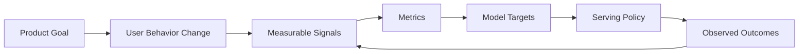
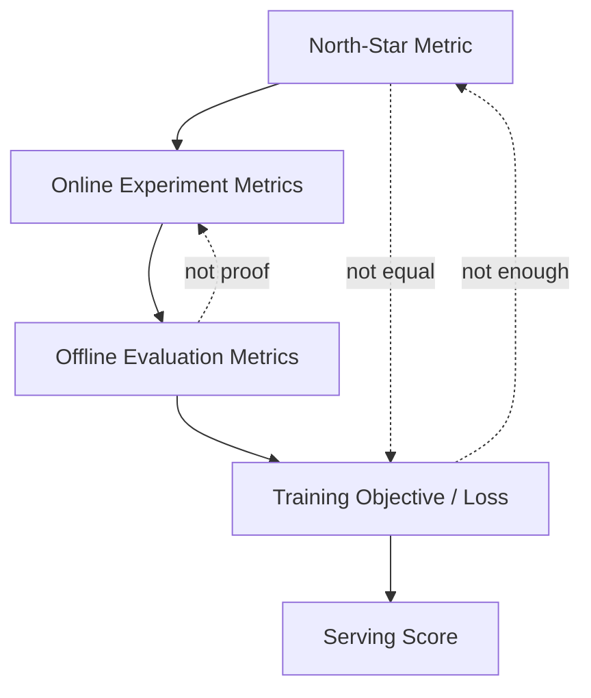
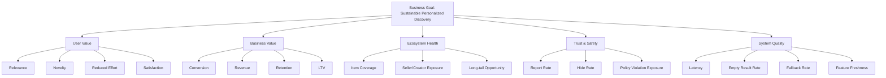
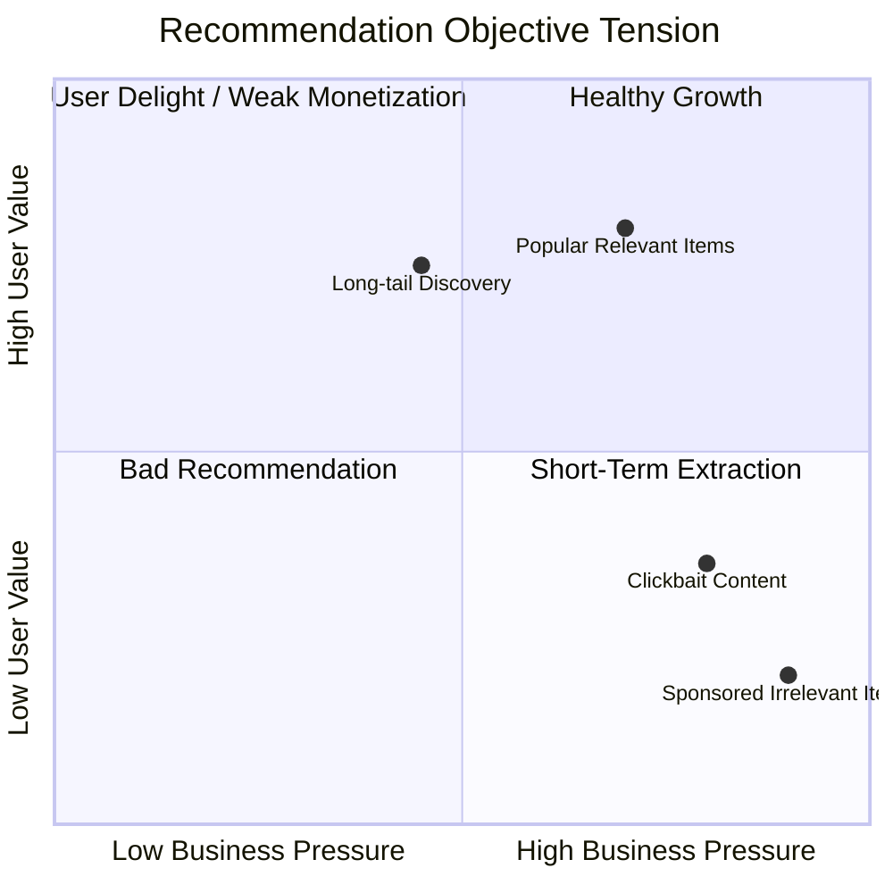
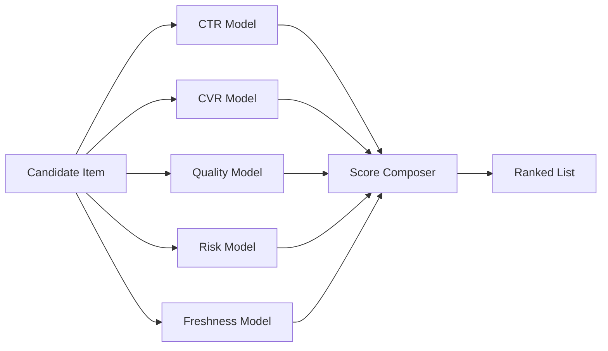
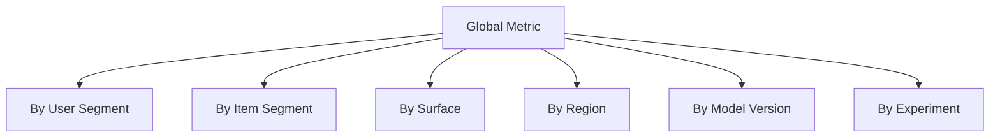

------
title: Build From Scratch Recommendations System - Part 003
description: Cara menerjemahkan tujuan produk menjadi objective, north-star metric, guardrail metric, model target, logging requirement, dan decision policy untuk recommendation system production-grade.
series: learn-build-from-scratch-recommendations-system
seriesTitle: Build From Scratch: Enterprise Recommendations System
order: 3
partTitle: Product Objectives & North-Star Metrics
tags:
  - recommendation-system
  - recsys
  - product-metrics
  - experimentation
  - mlops
  - distributed-systems
  - series
date: 2026-07-02
---

# Part 003 — Product Objectives & North-Star Metrics

Recommendation system yang buruk biasanya tidak gagal karena modelnya kurang canggih.

Ia gagal karena tim tidak jelas menjawab pertanyaan paling dasar:

> Sistem ini sebenarnya sedang mengoptimalkan apa?

Kalau jawabannya hanya “relevance”, itu belum cukup. Relevance untuk siapa? User? Platform? Seller? Creator? Advertiser? Compliance? Relevance dalam horizon berapa lama? Satu klik? Satu sesi? Satu bulan? Seumur hidup customer?

Part ini membangun fondasi agar recommendation system tidak menjadi mesin pengejar metric sempit. Kita akan menerjemahkan tujuan produk menjadi metric tree, model target, guardrail, dan decision contract.

---

## 1. Mental Model: Recommendation System Adalah Mesin Optimasi Perilaku

Recommendation system tidak hanya menampilkan item. Ia mengubah probabilitas tindakan user.

```text
before recommendation:
  P(user_action | user, context)

after recommendation:
  P(user_action | user, context, exposed_items, order, layout)
```

Ketika sistem menaruh item tertentu di posisi pertama, sistem meningkatkan peluang item itu dilihat, diklik, dibeli, ditonton, disimpan, atau dilaporkan.

Karena itu objective recommendation system harus dilihat sebagai **objective perilaku**, bukan hanya objective prediksi.



Contoh:

| Product Goal | Behavior yang Diinginkan | Sinyal Mentah | Metric | Risiko Jika Salah |
|---|---:|---|---|---|
| User menemukan produk relevan | Klik, add-to-cart, purchase | impression, click, cart, order | CTR, CVR, revenue/session | clickbait, produk murah dominan |
| User betah menonton | Mulai menonton dan menyelesaikan video | play, watch seconds, completion | watch time, completion rate | konten adiktif/low-quality naik |
| User kembali besok | Return visit | session start, active day | D1/D7 retention | short-term engagement mengorbankan trust |
| Marketplace sehat | Exposure tidak hanya ke seller besar | impression by seller/category | exposure distribution, seller coverage | popularity bias, new seller mati |
| User percaya sistem | Hide/report rendah, satisfaction tinggi | hide, report, survey, unsubscribe | negative feedback rate | sistem terasa creepy/irrelevant |

Metric bukan hanya angka. Metric adalah representasi eksplisit dari perilaku yang ingin dibentuk.

---

## 2. North-Star Metric Bukan Model Loss

Kesalahan umum: menyamakan north-star metric dengan loss function model.

North-star metric adalah indikator utama kesehatan produk. Model loss adalah fungsi optimasi teknis selama training.

```text
North-Star Metric     : apakah produk bergerak ke arah yang benar?
Online Metric         : apakah experiment memperbaiki outcome nyata?
Offline Metric        : apakah model terlihat lebih baik di data historis?
Training Loss         : apakah parameter model belajar sesuai target lokal?
Serving Score         : bagaimana item dipilih saat request terjadi?
```

Semua level itu saling terkait, tetapi tidak identik.



Contoh pada e-commerce:

```text
North-star:
  useful product discovery leading to sustainable purchase behavior

Online metrics:
  revenue per session
  conversion rate
  add-to-cart rate
  repeat purchase rate
  return/refund rate
  search abandonment rate

Offline metrics:
  Recall@K for purchased items
  NDCG@K for clicked/purchased labels
  calibration for purchase probability

Training target:
  P(click)
  P(add_to_cart)
  P(purchase | click)
  expected_margin

Serving score:
  w1 * calibrated_ctr
+ w2 * calibrated_cvr
+ w3 * expected_margin
+ w4 * item_quality
- w5 * return_risk
- w6 * fatigue_penalty
```

Model boleh memprediksi CTR, tetapi product objective mungkin bukan CTR. CTR hanya satu sinyal.

---

## 3. Metric Tree: Dari Business Goal ke Instrumentasi

Recommendation system yang matang selalu punya metric tree. Tanpa metric tree, tim akan berdebat memakai angka yang tidak berada di level yang sama.



Kita perlu membedakan lima jenis metric.

### 3.1 Input Metrics

Input metrics mengukur kualitas bahan baku sistem.

Contoh:

- event completeness;
- impression logging rate;
- catalog freshness;
- item metadata coverage;
- user identity resolution rate;
- feature materialization success rate;
- training dataset row count;
- label availability;
- delayed conversion arrival rate.

Input metric menjawab:

> Apakah sistem punya data yang layak untuk membuat keputusan?

### 3.2 Process Metrics

Process metrics mengukur kesehatan pipeline dan serving path.

Contoh:

- candidate generation latency;
- ranking latency;
- feature fetch latency;
- model inference latency;
- vector index recall proxy;
- cache hit rate;
- fallback rate;
- timeout rate;
- model version distribution;
- experiment assignment consistency.

Process metric menjawab:

> Apakah mesin rekomendasi berjalan sesuai kontrak?

### 3.3 Output Metrics

Output metrics mengukur hasil langsung dari recommendation response.

Contoh:

- candidate count;
- unique item count;
- duplicate rate;
- diversity score;
- source mix;
- exposure by category;
- exposure by seller/creator;
- predicted score distribution;
- unavailable item rate;
- policy-filtered item rate.

Output metric menjawab:

> Apa yang sebenarnya sistem tampilkan kepada user?

### 3.4 Outcome Metrics

Outcome metrics mengukur tindakan user setelah rekomendasi.

Contoh:

- CTR;
- add-to-cart rate;
- conversion rate;
- watch time;
- completion rate;
- dwell time;
- save/share rate;
- repeat session;
- retention;
- revenue;
- margin.

Outcome metric menjawab:

> Apakah user melakukan tindakan yang diharapkan?

### 3.5 Guardrail Metrics

Guardrail metrics memastikan peningkatan outcome tidak merusak hal lain.

Contoh:

- latency p95/p99;
- crash/error rate;
- hide/report rate;
- unsubscribe/churn signal;
- refund/return rate;
- seller concentration;
- unsafe item exposure;
- low-quality content exposure;
- policy violation;
- customer support complaint;
- fairness/exposure skew.

Guardrail metric menjawab:

> Apakah peningkatan metric utama dibayar dengan kerusakan yang tidak diterima?

---

## 4. Contoh Metric Tree untuk Beberapa Domain

### 4.1 E-commerce

```text
Goal:
  membantu user menemukan produk yang ingin dibeli dengan pengalaman yang sehat.

North-star candidates:
  - qualified purchase per active session
  - gross merchandise value per personalized session
  - repeat purchase rate from recommendation-exposed sessions

Primary online metrics:
  - product detail page CTR
  - add-to-cart rate
  - conversion rate
  - revenue per mille impressions
  - margin per session

Guardrails:
  - return/refund rate
  - out-of-stock exposure
  - seller concentration
  - low-rated item exposure
  - delivery SLA violation exposure
  - page latency
```

Catatan penting: revenue saja berbahaya. Sistem bisa mengangkat item mahal yang tidak cocok, meningkatkan revenue jangka pendek, tetapi juga meningkatkan return, complaint, dan trust damage.

### 4.2 Video / Content Feed

```text
Goal:
  membantu user menemukan konten bernilai yang membuat mereka kembali secara sehat.

North-star candidates:
  - satisfied watch time per active user
  - retained engaged users
  - long-term session quality

Primary online metrics:
  - watch time
  - completion rate
  - next-video continuation
  - like/save/share rate
  - return visit

Guardrails:
  - hide/report rate
  - low-quality content exposure
  - creator concentration
  - repeated-topic fatigue
  - harmful/borderline content exposure
  - session over-extension risk
```

Watch time lebih kuat daripada click untuk banyak surface video, tetapi watch time tetap bisa dimanipulasi oleh konten sensasional. Karena itu perlu satisfaction dan safety guardrails.

### 4.3 Job Recommendation

```text
Goal:
  mempertemukan kandidat dan lowongan yang saling cocok.

North-star candidates:
  - qualified application rate
  - recruiter response rate
  - successful placement rate

Primary online metrics:
  - job view CTR
  - apply start rate
  - apply completion rate
  - employer response rate

Guardrails:
  - irrelevant application rate
  - over-application spam
  - discriminatory exposure pattern
  - stale job exposure
  - already-applied exposure
```

Job recommendation tidak boleh hanya mengejar apply rate. Apply yang tidak berkualitas dapat merusak employer experience.

### 4.4 B2B / Internal Enterprise Recommendation

```text
Goal:
  membantu knowledge worker memilih next-best-action yang benar, defensible, dan efisien.

North-star candidates:
  - successful case progression with reduced manual effort
  - time-to-resolution improvement with maintained compliance quality

Primary online metrics:
  - accepted recommendation rate
  - action completion rate
  - time saved per case
  - escalation correctness
  - case resolution quality

Guardrails:
  - wrong-action override rate
  - compliance exception
  - audit finding
  - unjustified automation
  - critical-case latency
```

Untuk domain regulasi/case management, objective tidak boleh hanya “lebih cepat”. Keputusan harus dapat dijelaskan dan dipertanggungjawabkan.

---

## 5. Objective Layer: User, Business, Ecosystem, System

Recommendation objective perlu minimal empat lapisan.



### 5.1 User Objective

User objective menjawab:

> Apakah rekomendasi membantu user menyelesaikan intent-nya?

Sinyal:

- click;
- dwell;
- watch;
- purchase;
- save;
- share;
- skip;
- hide;
- report;
- survey satisfaction;
- repeat usage.

### 5.2 Business Objective

Business objective menjawab:

> Apakah rekomendasi memperbaiki hasil bisnis yang sah?

Sinyal:

- conversion;
- revenue;
- margin;
- retention;
- subscription renewal;
- creator/seller revenue;
- inventory movement;
- customer lifetime value.

### 5.3 Ecosystem Objective

Ecosystem objective menjawab:

> Apakah sistem tetap sehat untuk semua participant?

Sinyal:

- catalog coverage;
- creator/seller coverage;
- long-tail exposure;
- new item exposure;
- concentration index;
- category diversity;
- marketplace liquidity.

### 5.4 System Objective

System objective menjawab:

> Apakah sistem dapat berjalan dalam batas teknis yang diterima?

Sinyal:

- latency;
- throughput;
- cost/request;
- availability;
- fallback rate;
- feature freshness;
- model serving error;
- data pipeline freshness;
- retraining duration.

Production recommendation system hampir selalu merupakan kompromi antar lapisan ini.

---

## 6. Dari Metric ke Model Target

Setelah metric tree jelas, kita baru menentukan model target.

Kesalahan umum:

> Karena kita ingin purchase naik, maka model langsung memprediksi purchase.

Tidak selalu benar.

Purchase sering sparse, delayed, dan dipengaruhi banyak faktor di luar recommendation: harga, stok, promosi, ongkos kirim, payment, trust, urgency, dan brand.

Kadang target yang lebih stabil adalah kombinasi:

```text
score(item) =
  P(click | impression)
  * P(add_to_cart | click)
  * P(purchase | add_to_cart)
  * expected_margin
  * item_quality_adjustment
  * freshness_adjustment
  * policy_multiplier
```

Atau untuk video:

```text
score(video) =
  P(play | impression)
  * E[watch_seconds | play]
  * satisfaction_adjustment
  * creator_diversity_adjustment
  * safety_multiplier
  - fatigue_penalty
```

Atau untuk enterprise next-best-action:

```text
score(action) =
  P(action_accepted | case_context)
  * P(successful_resolution | action)
  * expected_time_saved
  * compliance_confidence
  - operational_risk
```

Kita tidak harus memilih satu model untuk semua hal. Dalam production, objective sering dipecah menjadi beberapa estimator.



Model target harus dipilih berdasarkan kualitas label, actionability, dan serving constraint.

---

## 7. Metric Time Horizon

Recommendation system bisa terlihat menang pada horizon pendek dan kalah pada horizon panjang.

```text
short-term:
  click, view, play, immediate add-to-cart

session-level:
  session length, pages viewed, watch time, cart completion

day/week-level:
  return visit, repeat purchase, retained user, creator follow

month/quarter-level:
  LTV, subscription renewal, seller health, trust, churn, complaint rate
```

Contoh konflik:

| Short-term Naik | Long-term Bisa Turun Karena |
|---|---|
| CTR | clickbait, misleading thumbnail, shallow interest |
| Watch time | addictive low-quality content, fatigue |
| Purchase | aggressive promotion, returns/refunds naik |
| Apply rate | low-quality job applications |
| Case throughput | compliance quality turun |

Maka objective sebaiknya punya horizon eksplisit.

```text
Objective yang buruk:
  maximize CTR

Objective yang lebih baik:
  improve qualified engagement per active user without increasing negative feedback, latency, unsafe exposure, or long-term churn
```

---

## 8. Metric Tidak Netral: Goodhart dan Reward Hacking

Ketika metric menjadi target, sistem akan menemukan cara untuk menaikkan metric, belum tentu menaikkan value.

Contoh reward hacking:

- CTR dikejar → headline/thumbnail clickbait naik.
- Watch time dikejar → video panjang/sensasional naik.
- Revenue dikejar → item mahal tapi tidak cocok naik.
- Apply rate dikejar → low-intent applications naik.
- Accepted recommendation dikejar → rekomendasi action yang aman tapi tidak impactful naik.
- Completion rate dikejar → sistem merekomendasikan item mudah, bukan item terbaik.

Metric yang baik harus punya pasangan guardrail.

| Primary Metric | Guardrail Wajib |
|---|---|
| CTR | hide/report rate, dwell quality, bounce rate |
| Watch time | satisfaction, harmful exposure, repeated-topic fatigue |
| Conversion | refund/return, complaint, margin, trust |
| Revenue | relevance, seller concentration, long-term retention |
| Retention | negative feedback, notification fatigue, privacy complaint |
| Action acceptance | case outcome quality, override rate, audit finding |

Rule praktis:

> Tidak ada primary metric yang boleh berdiri sendiri.

---

## 9. Recommendation Objective sebagai Utility Function

Di serving layer, sistem perlu mengubah banyak estimator menjadi satu keputusan urutan.

Bentuk sederhana:

```text
utility(user, item, context) =
    user_value
  + business_value
  + ecosystem_value
  - risk
  - cost
```

Contoh e-commerce:

```text
utility =
    0.30 * calibrated_ctr
  + 0.35 * calibrated_cvr
  + 0.15 * expected_margin
  + 0.10 * item_quality_score
  + 0.05 * novelty_score
  + 0.05 * delivery_reliability_score
  - 0.20 * return_risk
  - 0.15 * fatigue_penalty
  - 0.50 * policy_risk
```

Angka di atas bukan template final. Itu bentuk berpikir.

Yang penting:

1. score dapat dijelaskan;
2. bobot dapat dikonfigurasi;
3. setiap komponen punya owner;
4. setiap komponen bisa dimonitor;
5. perubahan score composer harus bisa dieksperimenkan;
6. policy risk tertentu harus bersifat hard filter, bukan penalty kecil.

### Hard Constraint vs Soft Constraint

Tidak semua hal boleh dimasukkan sebagai bobot.

```text
Hard constraint:
  item ilegal, item unavailable, age restriction, entitlement, blocked seller, user opted-out

Soft constraint:
  diversity, novelty, freshness, margin, predicted engagement, seller exposure balance
```

Hard constraint harus dieksekusi sebagai filter/policy gate. Soft constraint boleh masuk utility function atau re-ranking.

---

## 10. Metric Granularity: Global Metric Bisa Menipu

Global metric yang naik bisa menyembunyikan segmen yang rusak.

Contoh:

```text
CTR global naik 3%.
Tetapi:
  new users turun 8%
  premium users turun 5%
  category long-tail turun 20%
  latency p99 naik 40ms
  hide rate remaja naik 12%
```

Karena itu setiap metric penting harus dipotong minimal berdasarkan:

- user segment;
- new vs returning user;
- anonymous vs logged-in;
- geography/region;
- device;
- surface;
- category;
- seller/creator group;
- item age;
- item popularity bucket;
- experiment variant;
- model version;
- traffic source;
- language/locale.



Recommendation system tidak bisa dinilai hanya dari rata-rata global. Sistem membuat keputusan individual dalam context tertentu, maka diagnosis juga harus segmented.

---

## 11. Metric Attribution: Siapa yang Mendapat Kredit?

Dalam recommendation system, attribution sering sulit.

User mungkin:

1. melihat item di homepage;
2. klik item serupa di product detail page;
3. mencarinya manual;
4. membelinya besok setelah email reminder.

Recommendation mana yang mendapat kredit?

Beberapa model attribution:

| Attribution | Cara Kerja | Kelebihan | Kelemahan |
|---|---|---|---|
| Last touch | exposure terakhir mendapat kredit | sederhana | mengabaikan discovery awal |
| First touch | exposure pertama mendapat kredit | menghargai discovery | mengabaikan reminder/closing |
| Linear | semua exposure mendapat bagian | lebih adil | bisa over-credit exposure noise |
| Time decay | exposure lebih dekat action mendapat kredit lebih besar | realistis | perlu parameter decay |
| Experiment-level | bandingkan group treatment vs control | paling kuat untuk causal | butuh A/B infra |

Untuk sistem production, attribution minimal harus menyimpan:

```text
request_id
slate_id
surface
position
item_id
candidate_source
ranker_model_version
reranker_version
experiment_assignments
logging_token
timestamp
```

Tanpa field ini, nanti tidak jelas apakah purchase terjadi karena rekomendasi, search, promo, atau organic behavior.

---

## 12. Dari Objective ke Event Requirement

Objective menentukan event yang wajib dicatat.

Contoh jika objective adalah `qualified engagement`, maka click saja tidak cukup.

```text
Wajib dicatat:
  impression
  click
  dwell duration
  scroll depth
  add-to-cart / save / apply / watch progress
  negative feedback
  conversion
  delayed outcome
  surface
  position
  request/slate id
  model version
  experiment variant
```

Jika tidak ada impression, CTR tidak valid.

```text
CTR = clicks / impressions
```

Jika impression tidak akurat, semua metric turunannya rusak:

- CTR salah;
- position bias analysis salah;
- training negatives salah;
- exposure fairness salah;
- attribution salah;
- A/B test salah.

Karena itu objective design tidak bisa dipisahkan dari tracking contract.

---

## 13. Objective-to-Architecture Traceability

Setiap objective harus menurunkan requirement arsitektur.

| Objective | Requirement Data | Requirement Serving | Requirement Observability |
|---|---|---|---|
| Personalized discovery | user history, item metadata, session context | low-latency profile + retrieval | relevance by segment |
| Fresh recommendations | item freshness, recent events | nearline update, TTL | feature age, stale exposure |
| Diversity | category/source metadata | reranker with constraints | diversity distribution |
| Seller fairness | seller id, exposure logs | exposure-aware reranking | exposure share by seller bucket |
| Safety | policy labels, moderation state | hard filter before response | unsafe exposure rate |
| Privacy | consent, data purpose | consent-aware feature fetch | opt-out compliance |
| Reliable serving | latency/failure events | fallback hierarchy | timeout/fallback rate |

Kalau objective tidak menghasilkan requirement, objective itu belum cukup konkret.

---

## 14. Anti-Pattern Objective Design

### 14.1 “Kita Optimize Engagement”

Engagement apa?

- click?
- watch?
- scroll?
- dwell?
- comment?
- share?
- purchase?
- return?

Engagement terlalu umum. Harus dipecah menjadi action yang punya makna.

### 14.2 “CTR Naik Berarti Relevansi Naik”

Tidak selalu. CTR bisa naik karena:

- posisi lebih tinggi;
- thumbnail lebih mencolok;
- item clickbait;
- user penasaran tetapi kecewa;
- rekomendasi terlalu sempit;
- surface berubah;
- logging berubah.

CTR harus dibaca bersama post-click signal.

### 14.3 “Offline NDCG Naik, Berarti Online Menang”

Tidak selalu. Offline evaluation memakai data dari policy lama. Online system mengubah exposure dan perilaku baru.

Offline metric berguna untuk screening model, bukan bukti final.

### 14.4 “Model Terbaik adalah Model dengan AUC Tertinggi”

AUC bisa baik tetapi ranking top positions buruk. Recommendation biasanya peduli top-K, bukan semua pair item.

Model dengan AUC sedikit lebih rendah tetapi calibration lebih baik dan latency lebih stabil bisa lebih berguna.

### 14.5 “Business Rule Bisa Ditambahkan Nanti”

Tidak aman. Business rule, safety, entitlement, privacy, dan eligibility adalah bagian dari objective boundary. Kalau terlambat masuk, sistem bisa belajar dari exposure yang seharusnya tidak terjadi.

---

## 15. North-Star Design Workshop

Untuk mendesain objective, gunakan urutan berikut.

### Step 1 — Tentukan Surface

Recommendation untuk surface berbeda punya objective berbeda.

| Surface | Intent User | Objective Umum |
|---|---|---|
| Homepage | discovery luas | relevance + freshness + diversity |
| Product detail page | compare/complete intent | similarity + compatibility + conversion |
| Cart | complete purchase | complement + confidence + margin |
| Search result | satisfy explicit intent | relevance to query + refinement |
| Feed | continuous consumption | session satisfaction + novelty |
| Notification/email | reactivation | high confidence + low annoyance |
| Internal case screen | next-best-action | correctness + explainability + auditability |

Jangan membuat satu objective global untuk semua surface.

### Step 2 — Tentukan User Promise

Contoh user promise:

```text
Homepage e-commerce:
  “Kami membantu kamu menemukan produk yang mungkin kamu butuhkan, bukan hanya produk yang paling banyak dibeli orang lain.”

Video feed:
  “Kami membantu kamu menemukan konten yang layak ditonton dan membuat pengalamanmu tetap segar.”

Enterprise case management:
  “Kami membantu analyst memilih langkah berikutnya dengan alasan yang bisa diaudit.”
```

User promise menjaga metric agar tidak terputus dari value.

### Step 3 — Tentukan Primary Metric

Primary metric harus:

- dekat dengan value;
- cukup sering terjadi;
- bisa diukur konsisten;
- bisa dipengaruhi oleh recommendation;
- tidak terlalu mudah dimanipulasi;
- bisa dibaca per segment.

### Step 4 — Tentukan Guardrails

Minimal guardrail:

```text
quality guardrail
safety guardrail
fairness/ecosystem guardrail
latency guardrail
business risk guardrail
privacy/compliance guardrail
```

### Step 5 — Tentukan Model Target

Model target adalah proxy yang bisa dipelajari.

Contoh:

```text
primary metric:
  successful purchase from recommendation-exposed sessions

model targets:
  P(click | impression)
  P(add_to_cart | click)
  P(purchase | item_view)
  P(return | purchase)
  expected_margin
```

### Step 6 — Tentukan Logging Requirement

Untuk setiap metric, tentukan denominator dan attribution.

```text
Metric: CTR
Numerator: click events
Denominator: valid impressions
Required fields: user_id/session_id, item_id, surface, position, slate_id, timestamp

Metric: conversion rate
Numerator: purchase events attributed within window
Denominator: valid recommendation impressions or clicks
Required fields: order_id, item_id, timestamp, attribution token, user/session id
```

---

## 16. Example: Objective Spec Document

Setiap recommendation surface sebaiknya punya objective spec seperti ini.

```mdx
# Recommendation Objective Spec

surface: product_detail_page_related_items
owner: discovery-platform
user_intent: compare similar products or find compatible alternatives

user_promise:
  show relevant, available, trustworthy alternatives and complements.

primary_metric:
  qualified_product_engagement_rate

metric_definition:
  qualified_product_engagement_rate =
    count(product_click_with_dwell_gt_10s OR add_to_cart OR purchase)
    / count(valid_impressions)

secondary_metrics:
  - add_to_cart_rate
  - purchase_rate
  - revenue_per_mille_impressions
  - similar_item_click_rate

quality_guardrails:
  - bounce_rate must not increase > 2%
  - hide/report rate must not increase
  - return/refund rate must not increase

system_guardrails:
  - p95 recommendation latency <= 120ms
  - fallback rate <= 1%
  - unavailable item exposure <= 0.1%

fairness_guardrails:
  - seller exposure concentration must not exceed configured threshold
  - new item exposure minimum must be preserved

hard_constraints:
  - item must be active
  - item must be in stock
  - item must be eligible for user region
  - item must satisfy policy and age restrictions

model_targets:
  - P(click | impression)
  - P(add_to_cart | click)
  - P(purchase | item_click)
  - P(return | purchase)
  - item_quality_score

logging_requirements:
  - impression
  - click
  - dwell
  - add_to_cart
  - purchase
  - hide
  - report
  - recommendation_request
  - candidate_source
  - model_version
  - experiment_assignment
```

Dokumen seperti ini lebih penting daripada langsung memilih algoritma. Algoritma hanya pelaksana objective.

---

## 17. Java-Oriented Contract: Objective Config

Dalam sistem enterprise, objective sering perlu dikonfigurasi per surface dan experiment.

Contoh domain object:

```java
public record RecommendationObjective(
    String objectiveId,
    Surface surface,
    PrimaryMetric primaryMetric,
    List<GuardrailMetric> guardrails,
    List<HardConstraint> hardConstraints,
    ScoreComposition scoreComposition,
    AttributionPolicy attributionPolicy,
    ExperimentPolicy experimentPolicy
) {}

public record ScoreComposition(
    List<ScoreComponent> components,
    ScoreNormalization normalization,
    double minimumEligibleScore
) {}

public record ScoreComponent(
    String name,
    ScoreComponentType type,
    double weight,
    boolean required,
    String owner
) {}
```

Yang penting bukan syntax Java-nya. Yang penting adalah objective menjadi artifact eksplisit, bukan tersembunyi di kode ranking.

---

## 18. Database Sketch: Metric & Objective Registry

Objective dan metric perlu versioning.

```sql
CREATE TABLE recommendation_objective (
    objective_id        TEXT PRIMARY KEY,
    surface             TEXT NOT NULL,
    version             INTEGER NOT NULL,
    status              TEXT NOT NULL, -- draft, active, deprecated
    primary_metric      TEXT NOT NULL,
    description         TEXT NOT NULL,
    owner_team          TEXT NOT NULL,
    created_at          TIMESTAMPTZ NOT NULL,
    activated_at        TIMESTAMPTZ
);

CREATE TABLE recommendation_guardrail (
    guardrail_id        TEXT PRIMARY KEY,
    objective_id        TEXT NOT NULL REFERENCES recommendation_objective(objective_id),
    metric_name         TEXT NOT NULL,
    threshold_operator  TEXT NOT NULL, -- <=, >=, delta_le, delta_ge
    threshold_value     NUMERIC NOT NULL,
    severity            TEXT NOT NULL, -- warn, block, rollback
    owner_team          TEXT NOT NULL
);

CREATE TABLE score_component_config (
    config_id           TEXT PRIMARY KEY,
    objective_id        TEXT NOT NULL REFERENCES recommendation_objective(objective_id),
    component_name      TEXT NOT NULL,
    component_type      TEXT NOT NULL,
    weight              NUMERIC NOT NULL,
    required            BOOLEAN NOT NULL DEFAULT FALSE,
    version             INTEGER NOT NULL,
    created_at          TIMESTAMPTZ NOT NULL
);
```

Production implication:

- perubahan objective dapat diaudit;
- experiment bisa menunjuk objective version tertentu;
- rollback tidak hanya rollback model, tetapi juga score composition;
- metric owner jelas;
- guardrail bisa dikaitkan dengan alert.

---

## 19. Decision Review Checklist

Sebelum membangun model atau service, jawab checklist ini.

```text
[ ] Surface apa yang sedang dibangun?
[ ] Intent user di surface itu apa?
[ ] Apa user promise-nya?
[ ] Apa primary metric-nya?
[ ] Apa denominator metric-nya?
[ ] Apakah impression logging sudah valid?
[ ] Apa secondary metrics-nya?
[ ] Apa guardrails-nya?
[ ] Apa hard constraints-nya?
[ ] Apa model target yang realistis?
[ ] Apakah label tersedia dan cukup sering?
[ ] Apakah delayed outcome perlu ditangani?
[ ] Bagaimana attribution dilakukan?
[ ] Bagaimana metric dipotong per segment?
[ ] Apa risiko reward hacking?
[ ] Apa rollback condition?
[ ] Siapa owner metric dan objective?
```

Kalau checklist ini belum jelas, jangan mulai dari deep learning model. Mulai dari objective.

---

## 20. Kesimpulan

Recommendation system production-grade bukan proyek “mencari algoritma terbaik”. Ia adalah sistem optimasi yang harus selaras dengan user value, business value, ecosystem health, safety, privacy, dan reliability.

Mental model utama part ini:

```text
Product goal
  -> behavior change
  -> measurable signal
  -> metric tree
  -> model target
  -> serving policy
  -> observability
  -> experiment
  -> revised product goal
```

North-star metric memberi arah. Guardrail menjaga agar arah itu tidak merusak sistem. Model target adalah proxy yang bisa dipelajari. Serving score adalah keputusan nyata yang diterapkan pada request user.

Di part berikutnya, kita akan membangun domain model inti: user, item, context, action, surface, impression, slate, dan event. Ini adalah vocabulary yang akan dipakai seluruh seri.

---

## References

- Paul Covington, Jay Adams, Emre Sargin — *Deep Neural Networks for YouTube Recommendations*, 2016.
- Kerry Rodden, Hilary Hutchinson, Xin Fu — *Measuring the User Experience on a Large Scale: User-Centered Metrics for Web Applications*, Google HEART framework, 2010.
- Carlos A. Gomez-Uribe, Neil Hunt — *The Netflix Recommender System: Algorithms, Business Value, and Innovation*, ACM TMIS, 2015.
- Dietmar Jannach, Michael Jugovac — *Measuring the Business Value of Recommender Systems*, 2019.
- Yan-Martin Tamm, Rinchin Damdinov, Alexey Vasilev — *Quality Metrics in Recommender Systems: Do We Calculate Metrics Consistently?*, 2022.
