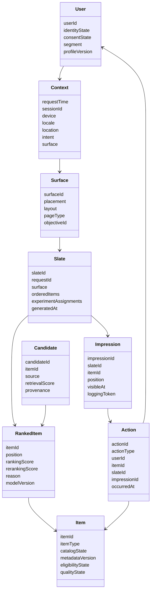
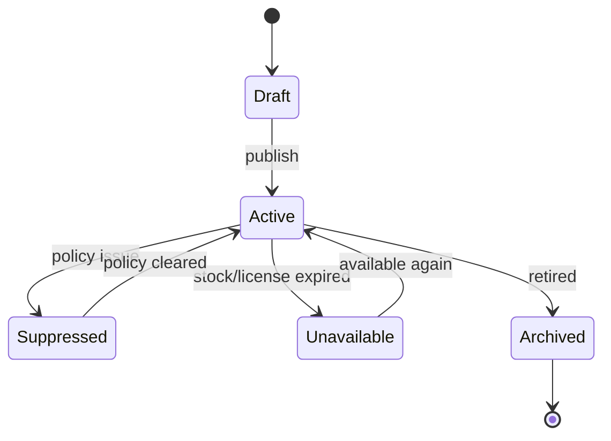
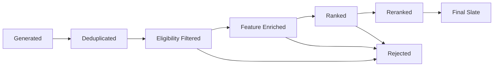
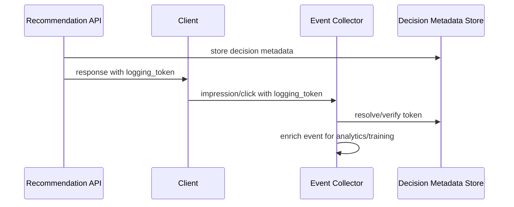
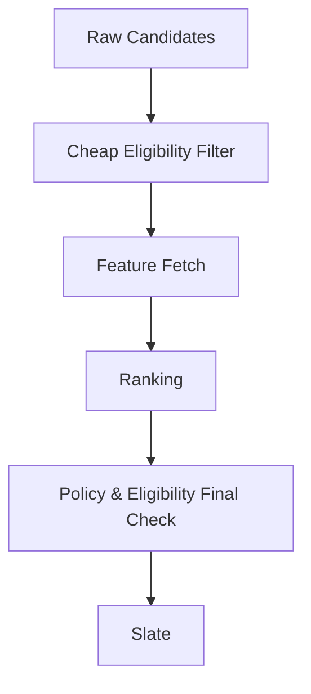
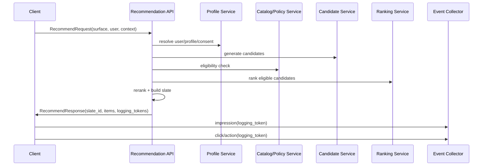

------
title: Build From Scratch Recommendations System - Part 004
description: Domain model inti untuk recommendation system production-grade: user, item, context, action, surface, impression, slate, candidate, exposure, feedback, dan attribution.
series: learn-build-from-scratch-recommendations-system
seriesTitle: Build From Scratch: Enterprise Recommendations System
order: 4
partTitle: Domain Model: User, Item, Context, Action, Slate
tags:
  - recommendation-system
  - recsys
  - domain-modeling
  - system-design
  - data-contract
  - java
  - series
date: 2026-07-02
---

# Part 004 — Domain Model: User, Item, Context, Action, Slate

Recommendation system yang sulit di-maintain biasanya punya masalah vocabulary.

Satu tim menyebut `view`, tim lain menyebut `impression`, tim lain menyebut `shown`, tim analytics menyebut `exposure`, dan model training menyebutnya `negative example`. Akhirnya sistem terlihat jalan, tetapi data, metric, experiment, dan debugging saling tidak konsisten.

Part ini membangun domain model inti. Tujuannya bukan membuat class diagram cantik. Tujuannya membuat bahasa sistem yang stabil.

> Kalau vocabulary salah, model bisa benar secara matematis tetapi salah secara produk.

---

## 1. Core Function

Secara domain, recommendation system melakukan ini:

```text
Given:
  user
  context
  surface
  objective
  constraints

Return:
  slate of items
  with position, provenance, model metadata, and logging tokens
```

Output bukan `List<Item>` polos.

Output harus menyimpan bukti keputusan.

```text
RecommendationResponse
  request_id
  slate_id
  surface
  items[]
    item_id
    position
    candidate_source
    score
    reason
    policy_decision
    model_versions
    logging_token
  fallback_metadata
  experiment_assignments
```

Kenapa?

Karena tanpa `slate_id`, `position`, `candidate_source`, `model_version`, dan `logging_token`, kita tidak bisa menjawab:

- item ini muncul dari generator mana?
- kenapa item ini ada di posisi 1?
- model versi apa yang memberi score?
- user melihat item ini atau hanya response terkirim?
- click ini berasal dari slate mana?
- experiment variant mana yang bertanggung jawab?
- apakah item ini melewati policy gate?
- apakah terjadi fallback?

Domain model recommendation system adalah fondasi observability.

---

## 2. Entity Map



Ini bukan schema final database. Ini adalah peta konsep.

---

## 3. User Bukan Selalu Orang

`User` sering dianggap sederhana: satu user_id untuk satu orang.

Production jauh lebih rumit.

```text
User identity states:
  anonymous
  pseudonymous
  logged_in
  merged
  household
  enterprise_actor
  service_account
```

### 3.1 Anonymous User

Anonymous user biasanya punya device/session identifier, bukan account id.

Masalah:

- history pendek;
- identity mudah hilang;
- consent terbatas;
- cross-device tidak stabil;
- tidak boleh diasumsikan sebagai orang yang sama selamanya.

### 3.2 Logged-In User

Logged-in user punya identifier lebih stabil.

Tetapi tetap ada masalah:

- account dipakai banyak orang;
- user punya beberapa persona;
- preferensi berubah;
- work account dan personal account berbeda;
- privacy/consent dapat berubah.

### 3.3 Household / Shared Account

Untuk streaming atau marketplace keluarga, satu account bisa berisi beberapa manusia.

Jika model menganggap satu account sebagai satu preference vector, rekomendasi bisa kacau.

Mitigasi:

- profile selector;
- session intent detection;
- device/context separation;
- recent-action weighting;
- explicit preference reset.

### 3.4 Enterprise Actor

Dalam sistem enterprise, user bisa berupa:

- analyst;
- supervisor;
- case owner;
- queue worker;
- compliance officer;
- automation bot;
- external reviewer.

Recommendation tidak hanya memprediksi “suka/tidak suka”, tetapi merekomendasikan next action sesuai role, authority, dan defensibility.

---

## 4. User Domain Object

Minimal field konseptual:

```java
public record RecommendationUser(
    String userKey,
    IdentityState identityState,
    ConsentState consentState,
    Set<String> segments,
    Optional<String> profileId,
    Optional<String> householdId,
    Optional<String> tenantId
) {}

enum IdentityState {
    ANONYMOUS,
    PSEUDONYMOUS,
    LOGGED_IN,
    MERGED,
    ENTERPRISE_ACTOR
}
```

Perhatikan: `userKey` bukan selalu primary key account. Bisa berupa resolved serving key.

### 4.1 User Invariants

```text
Invariant U1:
  Recommendation serving tidak boleh memakai feature yang consent-nya tidak valid.

Invariant U2:
  Anonymous profile tidak boleh digabung ke logged-in profile tanpa policy identity stitching.

Invariant U3:
  User deletion/privacy request harus dapat menghapus atau menonaktifkan profile-derived features.

Invariant U4:
  User segment untuk experiment harus stabil selama periode experiment yang ditentukan.

Invariant U5:
  Serving key harus cukup stabil untuk personalization, tetapi tidak melanggar privacy boundary.
```

---

## 5. Item Bukan Sekadar Produk/Konten

`Item` adalah entity yang dapat direkomendasikan.

Contoh item:

| Domain | Item |
|---|---|
| E-commerce | product, variant, bundle, seller, brand, category |
| Video | video, channel, playlist, live stream |
| Music | track, album, artist, playlist |
| News/article | article, topic, author, publication |
| Job | job posting, company, career path |
| Social | user, group, post, event |
| Enterprise | case action, knowledge article, escalation path, similar case, policy document |

Item punya lifecycle.



Recommendation system tidak boleh menganggap semua item selalu eligible.

---

## 6. Item Field yang Penting untuk Recommendation

```text
item_id
item_type
catalog_state
availability_state
policy_state
quality_state
freshness_timestamp
metadata_version
creator_id / seller_id / provider_id
category_path
price / margin / cost
language / locale
region eligibility
age restriction
content embeddings
metadata embeddings
popularity features
cold_start_state
```

### 6.1 Item State vs Item Feature

Bedakan state dan feature.

```text
State:
  menentukan apakah item boleh muncul.

Feature:
  membantu model menilai seberapa baik item jika boleh muncul.
```

Contoh:

| Field | State atau Feature? | Konsekuensi |
|---|---|---|
| out_of_stock | state | hard filter |
| item rating | feature | score adjustment |
| policy banned | state | hard filter |
| new item | feature | freshness/exploration |
| seller quality | bisa keduanya | filter jika sangat buruk, feature jika normal |
| age restricted | state | eligibility gate |

### 6.2 Item Invariants

```text
Invariant I1:
  Item yang tidak eligible tidak boleh masuk response final.

Invariant I2:
  Item yang berubah menjadi suppressed harus bisa dihapus dari index/cache dengan bounded delay.

Invariant I3:
  Item metadata version yang dipakai scoring harus tercatat untuk debugging.

Invariant I4:
  Item baru harus punya fallback representation agar tidak mati karena cold start.

Invariant I5:
  Item id harus stabil; variant-level dan parent-level id tidak boleh tercampur tanpa mapping eksplisit.
```

---

## 7. Context: Sinyal yang Sering Diremehkan

Context menjawab:

> User sedang berada dalam situasi apa ketika rekomendasi diminta?

Contoh context:

```text
request_time
session_id
device_type
app_version
locale
region
surface
page_type
current_item_id
query
referrer
traffic_source
network_quality
timezone
session_actions
intent
experiment_context
```

Context sering lebih kuat daripada long-term profile.

Contoh:

- User biasanya membeli laptop, tetapi sekarang sedang melihat stroller.
- User biasanya menonton konten backend engineering, tetapi sekarang mencari video memasak.
- User enterprise biasanya menangani case fraud, tetapi sekarang membuka case compliance escalation.

Recommendation yang mengabaikan context akan terasa “benar secara history, salah secara momen”.

---

## 8. Intent: Context yang Sudah Ditafsirkan

Intent bukan event mentah. Intent adalah interpretasi.

```text
raw context:
  current_page = product_detail
  current_item_category = running_shoes
  last_3_actions = view shoes, filter size 42, sort by discount

inferred intent:
  looking_for_discounted_running_shoes_size_42
```

Intent bisa berasal dari:

- query search;
- current item;
- session sequence;
- filters;
- referrer;
- campaign;
- previous action;
- explicit onboarding;
- enterprise case state.

Intent harus diperlakukan hati-hati. Salah intent bisa lebih merusak daripada tidak ada intent.

### 8.1 Intent Confidence

```java
public record IntentSignal(
    String intentType,
    double confidence,
    String evidence,
    Instant inferredAt
) {}
```

Jangan menyimpan intent sebagai boolean polos.

```text
Buruk:
  user.intent = "buy_laptop"

Lebih baik:
  intent_type = "buy_laptop"
  confidence = 0.72
  evidence = "search_query + product_views"
  inferred_at = 2026-07-02T10:01:00Z
  expires_at = 2026-07-02T12:01:00Z
```

---

## 9. Surface: Lokasi Keputusan

Surface adalah tempat recommendation muncul.

Surface memengaruhi:

- objective;
- layout;
- candidate source;
- ranking model;
- diversity policy;
- latency budget;
- number of items;
- logging semantics;
- experiment eligibility.

Contoh:

```text
homepage.hero
homepage.feed
product_detail.related_items
product_detail.frequently_bought_together
cart.cross_sell
checkout.last_minute_addon
search.zero_result_recovery
video.watch_next
email.digest
push_notification.reactivation
case.next_best_action
```

Surface harus menjadi first-class field, bukan string asal-asalan.

```java
public record Surface(
    String surfaceId,
    SurfaceType type,
    String placement,
    String layout,
    String objectiveId,
    int maxItems,
    Duration latencyBudget
) {}
```

### 9.1 Surface Invariants

```text
Invariant S1:
  Setiap recommendation request harus punya surface yang valid.

Invariant S2:
  Setiap surface harus punya objective id aktif.

Invariant S3:
  Latency budget harus didefinisikan per surface.

Invariant S4:
  Logging semantics harus konsisten per surface.

Invariant S5:
  Surface tidak boleh diam-diam reuse objective surface lain tanpa approval.
```

---

## 10. Action: Feedback User

Action adalah perilaku user yang terkait dengan exposure, item, atau session.

Taxonomy umum:

```text
Exposure actions:
  impression
  visible_impression
  viewable_impression

Positive actions:
  click
  play
  add_to_cart
  purchase
  save
  like
  share
  apply
  accept_recommendation

Negative actions:
  skip
  hide
  dislike
  report
  not_interested
  unsubscribe
  override_recommendation

Post-action outcomes:
  dwell_time
  watch_completion
  return_refund
  employer_response
  case_resolution_success
  audit_passed
```

Penting: impression bukan action positif. Impression adalah exposure.

Click bukan bukti final suka. Click adalah sinyal awal.

Purchase bukan selalu satisfaction. Bisa berakhir return/refund.

---

## 11. Impression: Denominator Paling Penting

Impression adalah catatan bahwa item ditampilkan kepada user.

Tetapi ada beberapa level:

| Level | Definisi | Kegunaan |
|---|---|---|
| response item | item dikirim server | debug serving |
| rendered item | item dirender client | UI correctness |
| visible impression | item masuk viewport | CTR denominator yang lebih baik |
| viewable impression | item terlihat cukup lama/area cukup besar | ads/content quality metric |
| engaged impression | user punya kesempatan interaksi nyata | advanced evaluation |

Kalau sistem hanya mencatat response item, CTR bisa salah karena item mungkin tidak pernah terlihat.

### 11.1 Impression Schema

```json
{
  "event_type": "impression",
  "event_id": "evt_123",
  "request_id": "req_456",
  "slate_id": "slt_789",
  "user_key": "usr_or_anon_key",
  "session_id": "ses_001",
  "surface": "homepage.feed",
  "item_id": "item_123",
  "position": 4,
  "viewport_state": "visible",
  "candidate_source": "two_tower_v3",
  "ranker_model_version": "ranker_2026_07_01",
  "reranker_version": "diversity_v2",
  "experiment_assignments": ["exp_home_ranker:B"],
  "logging_token": "opaque_signed_token",
  "occurred_at": "2026-07-02T09:12:00Z",
  "client_time": "2026-07-02T09:12:01Z",
  "server_received_at": "2026-07-02T09:12:02Z"
}
```

### 11.2 Impression Invariants

```text
Invariant IMP1:
  Impression harus bisa dikaitkan ke slate.

Invariant IMP2:
  Impression harus punya item position.

Invariant IMP3:
  Impression harus punya surface.

Invariant IMP4:
  Impression harus punya model/experiment metadata atau logging token yang dapat resolve metadata itu.

Invariant IMP5:
  Impression event harus idempotent atau deduplicable.
```

---

## 12. Slate: Output yang Sebenarnya

Slate adalah daftar item yang disusun dan dikirim untuk satu request/surface.

Mengapa slate penting?

Karena user tidak melihat item secara terpisah. User melihat susunan.

Item di posisi 1 memengaruhi item posisi 2. Dua item mirip bersebelahan bisa membuat feed terasa monoton. Satu item sponsored bisa mengubah persepsi seluruh slate.

```text
Slate = ordered decision unit
```

### 12.1 Slate Fields

```text
slate_id
request_id
surface
generated_at
user_key/session_id
objective_id
experiment_assignments
items[]
  position
  item_id
  source
  retrieval_score
  ranking_score
  final_score
  reason
  policy_decision
  model_versions
fallback_metadata
```

### 12.2 Slate vs Page

Untuk infinite scroll, satu page response bisa satu slate atau bagian dari slate besar.

Pilihan desain:

```text
Option A:
  setiap page request menghasilkan slate baru

Option B:
  satu session feed punya slate besar, page mengambil slice

Option C:
  hybrid: initial slate + continuation reranking
```

Trade-off:

| Desain | Kelebihan | Kelemahan |
|---|---|---|
| Slate per page | fresh, sederhana | duplicate control sulit |
| Large precomputed slate | konsisten, mudah attribution | kurang responsif ke action terbaru |
| Hybrid | seimbang | state management lebih kompleks |

### 12.3 Slate Invariants

```text
Invariant SL1:
  Dalam satu slate, item_id tidak boleh duplicate kecuali surface memang mendukung repetition eksplisit.

Invariant SL2:
  Position harus deterministic dan dimulai dari convention yang jelas, misalnya 0-based atau 1-based.

Invariant SL3:
  Slate harus immutable setelah dikirim.

Invariant SL4:
  Jika ada refresh/rerank, buat slate baru atau slate revision baru.

Invariant SL5:
  Semua action user harus bisa dikaitkan ke slate yang benar.
```

---

## 13. Candidate: Item Sebelum Ranking Final

Candidate adalah item yang dipertimbangkan.

Sumber candidate:

- global popularity;
- category popularity;
- recently trending;
- item-to-item similarity;
- user-to-item collaborative filtering;
- graph walk;
- two-tower embedding retrieval;
- search intent retrieval;
- editorial list;
- campaign list;
- sponsored source;
- fallback list.

Candidate harus membawa provenance.

```java
public record Candidate(
    String itemId,
    String source,
    double retrievalScore,
    Map<String, String> provenance,
    Instant generatedAt
) {}
```

Tanpa provenance, kita tidak bisa tahu candidate generator mana yang berkontribusi atau merusak kualitas.

### 13.1 Candidate Lifecycle



Candidate yang ditolak juga penting untuk observability.

Contoh rejection reason:

```text
already_seen
out_of_stock
policy_blocked
region_ineligible
age_restricted
duplicate
low_quality
missing_features
ranker_timeout
below_threshold
```

---

## 14. Exposure, Feedback, Outcome

Recommendation system harus membedakan tiga hal:

```text
Exposure:
  sistem memberi kesempatan user melihat item.

Feedback:
  user bereaksi terhadap exposure.

Outcome:
  hasil lanjutan yang mungkin terjadi jauh setelah feedback awal.
```

Contoh e-commerce:

```text
Exposure:
  impression product A di homepage posisi 3

Feedback:
  click product A
  add-to-cart product A

Outcome:
  purchase product A
  return/refund product A
  repeat purchase minggu depan
```

Contoh enterprise:

```text
Exposure:
  next-best-action ditampilkan ke analyst

Feedback:
  analyst accepted/rejected recommendation

Outcome:
  case resolved
  escalation avoided
  audit passed
```

Training dataset yang mencampur exposure, feedback, dan outcome tanpa window yang jelas akan menghasilkan label yang tidak stabil.

---

## 15. Request Context dan Response Contract

### 15.1 Request

```json
{
  "request_id": "req_456",
  "surface": "homepage.feed",
  "user": {
    "user_key": "usr_123",
    "identity_state": "LOGGED_IN",
    "tenant_id": "default"
  },
  "session": {
    "session_id": "ses_001",
    "recent_actions": [
      {"type": "view", "item_id": "item_10", "occurred_at": "2026-07-02T09:00:00Z"}
    ]
  },
  "context": {
    "locale": "id-ID",
    "region": "ID-JK",
    "device_type": "mobile",
    "request_time": "2026-07-02T09:12:00Z"
  },
  "constraints": {
    "max_items": 20,
    "exclude_item_ids": ["item_10"],
    "only_available": true
  },
  "debug": {
    "enabled": false
  }
}
```

### 15.2 Response

```json
{
  "request_id": "req_456",
  "slate_id": "slt_789",
  "surface": "homepage.feed",
  "items": [
    {
      "item_id": "item_123",
      "position": 1,
      "reason": "Because you viewed running shoes",
      "logging_token": "tok_signed_abc",
      "debug": null
    }
  ],
  "fallback": {
    "used": false,
    "reason": null
  }
}
```

Response publik tidak harus memuat semua detail internal. Tetapi sistem harus bisa resolve `logging_token` ke metadata internal.

---

## 16. Logging Token

Logging token adalah opaque token yang membawa atau menunjuk metadata keputusan.

Isi konseptual:

```text
request_id
slate_id
item_id
position
surface
candidate_source
ranker_model_version
reranker_version
experiment_assignment
score bucket
policy decision
created_at
signature
```

Token sebaiknya signed agar client tidak bisa memalsukan attribution.

```text
Client receives logging_token.
Client sends token back on impression/click/action event.
Server verifies token.
Event pipeline resolves token into decision metadata.
```



---

## 17. Position: Field Kecil, Dampak Besar

Position memengaruhi click probability. Item posisi atas lebih mungkin diklik karena terlihat duluan.

Maka position wajib dicatat pada:

- response item;
- impression;
- click;
- conversion attribution;
- training example;
- evaluation dataset.

Tanpa position, model bisa salah belajar bahwa item tertentu lebih relevan, padahal hanya lebih sering diletakkan di atas.

Position juga harus jelas:

```text
position_index: 0-based atau 1-based?
slot_type: organic, sponsored, pinned, editorial?
container_position: carousel keberapa?
item_position_in_container: item keberapa dalam carousel?
```

Untuk layout kompleks, satu angka `position` tidak cukup.

---

## 18. Surface Layout dan Slot

Banyak produk tidak hanya punya list linear.

Contoh homepage:

```text
hero_banner
continue_watching_carousel
recommended_for_you_grid
trending_now_carousel
new_arrivals_carousel
sponsored_slot
```

Domain model perlu slot.

```java
public record SlateSlot(
    String slotId,
    SlotType slotType,
    int containerPosition,
    int maxItems,
    String objectiveId
) {}

public record SlottedRecommendationItem(
    String itemId,
    String slotId,
    int positionInSlot,
    int globalPosition
) {}
```

Slot penting untuk:

- attribution;
- position bias;
- experiment;
- sponsored/organic separation;
- layout-aware ranking;
- diversity control.

---

## 19. Eligibility: Domain Rule Sebelum Model Score

Eligibility menjawab:

> Apakah item boleh direkomendasikan kepada user ini dalam context ini?

Eligibility bukan ranking.

Contoh eligibility:

```text
item active
in stock
region allowed
language compatible
age restriction passed
subscription entitlement valid
not blocked by user
not already purchased/consumed
not policy suppressed
seller allowed
tenant boundary satisfied
```

Eligibility sebaiknya dieksekusi sebelum ranking mahal jika memungkinkan, dan tetap diverifikasi sebelum response final.



Kenapa dua kali?

Karena state bisa berubah di tengah request atau antara cache dan final response.

---

## 20. Domain Model untuk Negative Feedback

Negative feedback sering lebih berharga daripada positive feedback.

Jenis negative feedback:

```text
skip:
  user melewati item tanpa interaksi

hide:
  user eksplisit tidak ingin melihat item

not_interested:
  user tidak tertarik pada item/topik

dislike:
  user memberi sinyal negatif eksplisit

report:
  user menganggap item melanggar/salah/berbahaya

override:
  user menolak recommendation action enterprise
```

Negative feedback perlu scope.

```text
hide item only
hide similar items
hide creator/seller
hide category/topic
hide for session only
hide permanently
```

Jangan menyimpan `negative=true` tanpa scope. Itu terlalu kasar.

---

## 21. Domain Model untuk Reasons dan Explanations

Reason bukan sekadar teks UI.

Reason adalah representasi mengapa item dipilih.

```text
reason_type:
  similar_to_recent_item
  popular_in_category
  trending_near_you
  because_you_follow_creator
  frequently_bought_together
  editorial_pick
  required_next_action
  fallback_popular
```

Reason berguna untuk:

- user trust;
- debugging;
- policy review;
- analytics;
- model interpretability;
- compliance in enterprise systems.

Tetapi reason harus jujur. Jangan menampilkan “Because you liked X” kalau X tidak benar-benar dipakai.

```java
public record RecommendationReason(
    String reasonType,
    String evidenceType,
    Optional<String> evidenceId,
    double confidence,
    boolean userVisible
) {}
```

---

## 22. Multi-Tenant Domain Boundary

Untuk enterprise, tenant boundary sangat penting.

```text
Tenant boundary affects:
  user profile
  item catalog
  policy
  model version
  experiment
  feature store
  logging
  retention
  access control
```

Invariant:

```text
Invariant T1:
  Candidate dari tenant A tidak boleh muncul untuk tenant B.

Invariant T2:
  Feature aggregate tenant A tidak boleh dipakai training/serving tenant B tanpa explicit shared model policy.

Invariant T3:
  Debug endpoint harus menghormati tenant access control.
```

Multi-tenant recsys bukan hanya menambahkan `tenant_id` di table. Tenant harus masuk ke semua key, index, metric, dan policy.

---

## 23. Minimal Relational Schema Sketch

Ini bukan schema final, tetapi baseline untuk berpikir.

```sql
CREATE TABLE rec_request (
    request_id          TEXT PRIMARY KEY,
    user_key            TEXT,
    session_id          TEXT,
    tenant_id           TEXT,
    surface             TEXT NOT NULL,
    objective_id        TEXT NOT NULL,
    occurred_at         TIMESTAMPTZ NOT NULL,
    context_json        JSONB NOT NULL
);

CREATE TABLE rec_slate (
    slate_id            TEXT PRIMARY KEY,
    request_id          TEXT NOT NULL REFERENCES rec_request(request_id),
    generated_at        TIMESTAMPTZ NOT NULL,
    fallback_used       BOOLEAN NOT NULL,
    fallback_reason     TEXT,
    experiment_json     JSONB NOT NULL
);

CREATE TABLE rec_slate_item (
    slate_id            TEXT NOT NULL REFERENCES rec_slate(slate_id),
    item_id             TEXT NOT NULL,
    position_index      INTEGER NOT NULL,
    slot_id             TEXT,
    candidate_source    TEXT NOT NULL,
    retrieval_score     NUMERIC,
    ranking_score       NUMERIC,
    final_score         NUMERIC,
    reason_type         TEXT,
    model_version       TEXT,
    policy_json         JSONB NOT NULL,
    logging_token_hash  TEXT NOT NULL,
    PRIMARY KEY (slate_id, position_index)
);

CREATE TABLE rec_event (
    event_id            TEXT PRIMARY KEY,
    event_type          TEXT NOT NULL,
    user_key            TEXT,
    session_id          TEXT,
    item_id             TEXT,
    slate_id            TEXT,
    impression_id       TEXT,
    surface             TEXT NOT NULL,
    position_index      INTEGER,
    occurred_at         TIMESTAMPTZ NOT NULL,
    received_at         TIMESTAMPTZ NOT NULL,
    payload_json        JSONB NOT NULL
);
```

Untuk high-throughput event, table relasional mungkin bukan storage utama. Tetapi schema ini menjelaskan kontrak dan lineage yang tetap perlu ada.

---

## 24. Aggregate Boundaries

Dalam domain-driven design, aggregate menjaga invariants.

Untuk recsys, aggregate yang mungkin:

```text
RecommendationRequest aggregate:
  request + context + constraints

Slate aggregate:
  ordered items + metadata + experiment + fallback

UserProfile aggregate:
  preference state + suppression state + consent boundary

ItemSnapshot aggregate:
  metadata + eligibility + policy + quality state

FeedbackEvent aggregate:
  action + attribution + deduplication key
```

Jangan membuat satu aggregate raksasa `Recommendation`. Itu akan sulit di-scale dan sulit di-debug.

---

## 25. State yang Harus Immutable

Beberapa data harus immutable setelah dibuat.

```text
Immutable:
  request record
  slate record
  slate item position
  model version used
  experiment assignment used
  logging token metadata
  original event payload

Mutable:
  user profile
  item availability
  item policy state
  feature values
  model active version
  suppression preferences
```

Mengapa slate harus immutable?

Karena historical event harus bisa direproduksi. Jika slate lama berubah, click lama menjadi tidak bisa dijelaskan.

---

## 26. Time Semantics

Recommendation domain punya banyak waktu.

```text
request_time:
  kapan server menerima request rekomendasi

generated_at:
  kapan slate dibuat

visible_at:
  kapan item terlihat di client

action_occurred_at:
  kapan user melakukan action

event_received_at:
  kapan server menerima event

feature_as_of:
  feature dihitung berdasarkan data sampai kapan

model_trained_until:
  model dilatih dengan data sampai kapan
```

Jangan mencampur semua menjadi `timestamp`.

Time semantics penting untuk:

- point-in-time correctness;
- delayed conversion;
- leakage control;
- experiment attribution;
- replay;
- debugging;
- audit.

---

## 27. IDs dan Idempotency

Recommendation system rentan duplicate event.

Penyebab:

- client retry;
- network failure;
- user refresh;
- infinite scroll rerender;
- duplicate consumer processing;
- mobile offline replay.

Minimal idempotency keys:

```text
request_id:
  satu recommendation request

slate_id:
  satu ordered response

impression_id:
  satu item exposure event

action_id:
  satu user action

logging_token:
  attribution token untuk item dalam slate
```

Deduplication rule harus eksplisit.

```text
impression dedup key:
  user_key/session_id + slate_id + item_id + position + visibility_bucket

click dedup key:
  user_key/session_id + slate_id + item_id + action_type + short_time_window
```

Dedup terlalu agresif bisa membuang action valid. Dedup terlalu longgar membuat metric inflated.

---

## 28. Debug View: Domain Model Harus Bisa Menjawab “Why?”

Untuk setiap item final, debug view idealnya bisa menunjukkan:

```text
item_id: item_123
surface: homepage.feed
position: 2
candidate_sources:
  - two_tower_v3 score=0.83
  - trending_category score=0.61
eligibility:
  active=true
  in_stock=true
  region_allowed=true
  policy_allowed=true
features:
  user_category_affinity=0.72
  item_quality=0.81
  freshness_hours=5
  price_affinity=0.64
ranking:
  model_version=ranker_2026_07_01
  calibrated_ctr=0.043
  calibrated_cvr=0.008
reranking:
  diversity_penalty=0.03
  fatigue_penalty=0.00
experiments:
  homepage_ranker=B
reason:
  similar_to_recent_item item_10
```

Kalau domain model tidak menyimpan field-field ini, debugging akan berubah menjadi menebak-nebak.

---

## 29. Anti-Pattern Domain Modeling

### 29.1 `List<Item>` sebagai Response

Terlalu miskin. Tidak ada attribution, position, model version, source, atau logging token.

### 29.2 Event Tanpa Slate

Click tanpa slate tidak bisa dipakai untuk ranking analysis yang serius.

### 29.3 Item State Dicampur dengan Score

Item policy banned tidak boleh hanya diberi score rendah. Ia harus difilter.

### 29.4 User Profile Mengabaikan Consent

Feature tanpa consent boundary adalah risiko privacy.

### 29.5 Surface Hanya String Bebas

String bebas membuat metric pecah: `home_feed`, `homepage-feed`, `homePageFeed`, `feed_home`.

### 29.6 Rewriting Historical Slate

Jika slate lama dimutasi, audit dan training lineage rusak.

### 29.7 Negative Feedback Tanpa Scope

`not_interested=true` tidak cukup. Tidak jelas tidak tertarik pada item, creator, category, atau session context.

---

## 30. Recommended Package Structure

Untuk implementasi Java production, struktur domain bisa dimulai seperti ini:

```text
com.example.recsys.domain
  user
    RecommendationUser.java
    IdentityState.java
    ConsentState.java
  item
    RecommendableItem.java
    ItemState.java
    EligibilityState.java
  context
    RecommendationContext.java
    Surface.java
    IntentSignal.java
  candidate
    Candidate.java
    CandidateSource.java
    CandidateProvenance.java
  ranking
    RankedItem.java
    ScoreBreakdown.java
    ModelVersion.java
  slate
    Slate.java
    SlateItem.java
    SlateSlot.java
  feedback
    ImpressionEvent.java
    UserActionEvent.java
    FeedbackType.java
  policy
    EligibilityDecision.java
    PolicyDecision.java
  objective
    RecommendationObjective.java
    MetricDefinition.java
```

Prinsipnya: domain object harus menjelaskan keputusan, bukan hanya memindahkan JSON.

---

## 31. End-to-End Domain Flow



Domain model mengikat flow ini dari request sampai feedback.

---

## 32. Kesimpulan

Domain model recommendation system harus menjawab lima pertanyaan:

```text
Who?
  user, identity, consent, segment

What?
  item, state, metadata, eligibility

Where?
  surface, slot, layout, position

Why?
  candidate source, model score, reason, objective, experiment

What happened after?
  impression, action, outcome, attribution
```

Kalau kelima pertanyaan ini tidak bisa dijawab, sistem akan sulit dievaluasi, sulit di-debug, sulit diaudit, dan sulit ditingkatkan.

Part berikutnya akan membahas invariants dan failure modes: aturan apa yang harus selalu benar di recommendation system production-grade, serta bagaimana sistem gagal secara diam-diam walaupun API masih return 200 OK.

---

## References

- Paul Covington, Jay Adams, Emre Sargin — *Deep Neural Networks for YouTube Recommendations*, 2016.
- Dietmar Jannach et al. — literature on implicit feedback and recommender systems.
- Yuta Saito et al. — *Unbiased Recommender Learning from Missing-Not-At-Random Implicit Feedback*, 2019.
- Jiawei Chen et al. — *Bias and Debias in Recommender System: A Survey and Future Directions*, 2020.
- Fabio B. P. Maurera et al. — *Impression-Aware Recommender Systems*, 2025.
