------
title: Build From Scratch Recommendations System - Part 005
description: Invariant, failure mode, guardrail, contract, dan runbook yang membuat recommendation system tetap benar, aman, cepat, dan bisa dipertanggungjawabkan ketika berjalan di production.
series: learn-build-from-scratch-recommendations-system
seriesTitle: Build From Scratch: Enterprise Recommendations System
order: 5
partTitle: Recommendation Invariants & Failure Modes
tags:
  - recommendation-system
  - recsys
  - reliability
  - invariants
  - failure-mode
  - distributed-systems
  - mlops
  - series
date: 2026-07-02
---

# Part 005 — Recommendation Invariants & Failure Modes

Engineer biasa bertanya:

> Model mana yang paling akurat?

Engineer yang siap membangun recommendation system production-grade bertanya:

> Keputusan apa yang **tidak boleh salah**, bahkan ketika data terlambat, model timeout, feature stale, experiment rusak, katalog berubah, dan user melakukan sesuatu yang belum pernah kita lihat?

Part ini membahas invariants dan failure modes. Ini bagian yang sering hilang dari tutorial recommendation system. Padahal di production, recommendation system tidak hanya harus “pintar”. Ia harus **benar dalam batas-batas tertentu**, **aman saat gagal**, **bisa dijelaskan**, dan **tidak menghancurkan data masa depan**.

Kalau Part 004 membangun domain model, Part 005 membangun pagar sistem.

---

## 1. Mental Model: Recommendation System Adalah Decision System yang Bisa Gagal di Banyak Layer

Satu response rekomendasi terlihat sederhana.

```json
{
  "items": ["item-101", "item-991", "item-204"]
}
```

Tetapi untuk menghasilkan daftar itu, sistem mungkin melewati banyak decision point.

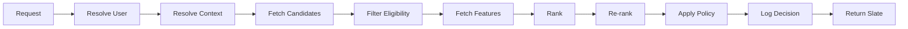

Setiap edge bisa gagal.

- User resolution bisa salah.
- Context bisa tidak lengkap.
- Candidate source bisa kosong.
- Eligibility filter bisa terlalu agresif.
- Feature bisa stale.
- Model bisa memakai versi salah.
- Re-ranker bisa menduplikasi item.
- Policy bisa telat update.
- Logger bisa gagal.
- Response bisa tidak sesuai experiment bucket.

Karena itu kita butuh invariant.

**Invariant** adalah properti yang harus tetap benar di semua kondisi operasional yang wajar.

Bukan “semoga model bagus”. Bukan “biasanya data lengkap”. Bukan “kalau tidak ada gangguan”.

Invariant adalah janji sistem.

---

## 2. Perbedaan Invariant, Metric, Alert, dan Rule

Banyak tim mencampur empat hal ini.

| Konsep | Pertanyaan | Contoh |
|---|---|---|
| Invariant | Apa yang harus selalu benar? | Response tidak boleh mengandung item yang tidak eligible. |
| Rule | Bagaimana kondisi tertentu diputuskan? | Hide item jika user pernah memilih “not interested”. |
| Metric | Apa yang diukur dari sistem? | Empty result rate, fallback rate, duplicate rate. |
| Alert | Kapan manusia harus diberi tahu? | Duplicate rate > 0.1% selama 10 menit. |

Invariant bisa diimplementasikan dengan rule, diuji dengan metric, dan dijaga dengan alert.

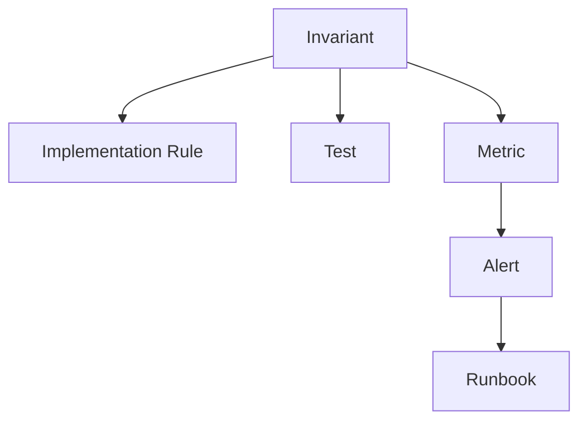

Contoh:

```text
Invariant:
  User must not receive an item they are not allowed to access.

Implementation:
  Apply entitlement_filter after candidate generation and before ranking.
  Apply final_policy_filter after re-ranking.

Metric:
  policy_violation_candidate_count
  policy_violation_response_count

Alert:
  policy_violation_response_count > 0

Runbook:
  Disable affected candidate source.
  Roll back policy config.
  Enable safe fallback list.
```

---

## 3. The Recommendation Invariant Stack

Kita akan memakai stack berikut.

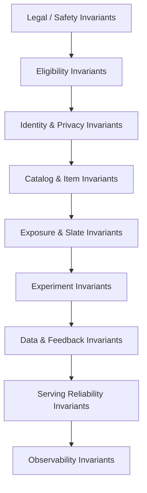

Urutannya penting. Safety dan eligibility harus menang dari model score. Privacy harus menang dari personalization. Data integrity harus menang dari kecepatan iterasi model.

Recommendation system production tidak boleh berkata:

> Model memberi score tinggi, jadi tampilkan saja.

Yang benar:

> Model score hanya boleh dipakai setelah item melewati boundary legal, policy, eligibility, privacy, dan product constraints.

---

## 4. Safety dan Legal Invariants

Ini invariant paling keras.

### 4.1 Tidak Ada Unsafe Item di Response

```text
For every response item:
  item.policy_status must be SERVABLE
  item.safety_status must not be BLOCKED
  item.region_policy must allow context.region
  item.age_gate must be compatible with user/context eligibility
```

Contoh gagal:

- konten yang sudah ditakedown masih muncul karena cache belum invalidated;
- item illegal di region tertentu tetap direkomendasikan;
- produk age-restricted muncul ke user minor;
- item seller yang sedang suspended tetap masuk melalui precomputed recommendations;
- artikel yang terkena moderation block tetap muncul lewat similar-item index lama.

Masalah ini tidak boleh hanya dicegah di candidate source. Harus ada **final policy gate** sebelum response.

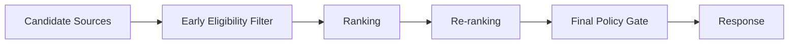

Alasannya sederhana: candidate source bisa punya data policy stale. Ranking service bisa menerima candidates dari banyak sumber. Re-ranker bisa menambahkan slot khusus. Karena itu final gate adalah lapisan pertahanan terakhir.

### 4.2 Policy Version Harus Bisa Diaudit

Setiap recommendation response harus bisa menjawab:

```text
Which policy version decided this item was allowed?
Which model version scored it?
Which candidate source produced it?
Which experiment variant selected it?
Which feature snapshot was used?
```

Tanpa itu, ketika ada incident, kita hanya menebak.

Minimal trace metadata:

```json
{
  "requestId": "req-20260702-abc",
  "userKey": "hashed-user-123",
  "surface": "homepage_feed",
  "policyVersion": "policy-2026-07-01.3",
  "modelVersion": "ranker-v42",
  "retrievalIndexVersion": "item-emb-hnsw-20260702T0100",
  "experimentAssignments": {
    "ranking_model_test": "treatment_b"
  },
  "responseItemCount": 20
}
```

Ini bukan untuk dikirim ke client publik. Ini untuk internal decision log dan debugging.

---

## 5. Eligibility Invariants

Eligibility menjawab:

> Apakah item boleh dipertimbangkan untuk user dan context ini?

Eligibility berbeda dari relevance. Item bisa sangat relevan tetapi tidak eligible.

### 5.1 Item Harus Aktif dan Tersedia

Untuk e-commerce:

```text
item.status == ACTIVE
item.stock > 0 OR item.backorder_allowed == true
item.seller_status == ACTIVE
item.price_status == VALID
item.shipping_region contains context.region
```

Untuk video/content:

```text
content.status == PUBLISHED
content.visibility == PUBLIC or user has entitlement
content.policy_status == SERVABLE
content.language compatible with context or user preferences
```

Untuk B2B/internal system:

```text
knowledge_article.status == APPROVED
case_template.jurisdiction == case.jurisdiction
recommended_action.allowed_for_role contains user.role
```

### 5.2 Eligibility Harus Diterapkan Dua Kali

Pola production yang aman:

1. **Pre-ranking filter** untuk mengurangi beban ranking.
2. **Post-ranking final gate** untuk mencegah leakage akibat stale data atau bug di source.

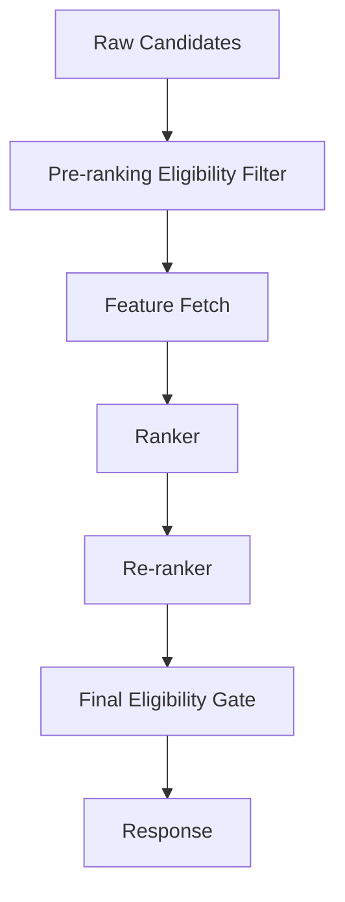

Jika hanya ada pre-ranking filter, re-ranker atau business rule bisa memasukkan item yang tidak melewati filter. Jika hanya ada final gate, ranking membuang resource untuk item yang pasti tidak boleh tampil.

### 5.3 Empty After Filter Harus Aman

Filter yang benar bisa menghasilkan kosong.

Contoh:

- user baru dengan region sangat terbatas;
- katalog sedang maintenance;
- semua item candidate sudah pernah dikonsumsi;
- policy update besar membuat banyak item tidak eligible;
- entitlement user berubah saat request diproses.

Invariant:

```text
Recommendation API must return a valid response even when all personalized candidates are filtered out.
```

Fallback hierarchy:

```text
personalized candidates
  -> context/category popular
  -> region-safe trending
  -> editorial safe list
  -> empty state with explanation
```

Empty response boleh terjadi, tetapi harus disengaja dan bisa dipahami, bukan karena exception.

---

## 6. Identity dan Privacy Invariants

Recommendation system sering gagal bukan karena model, tetapi karena identity.

### 6.1 Jangan Campur User yang Salah

Identity stitching berbahaya jika terlalu agresif.

Contoh failure:

- satu device dipakai banyak orang;
- household account dianggap satu user;
- user logout tetapi session lama masih dipakai;
- account merge menghasilkan preference campur;
- shared office device memengaruhi recommendation personal;
- anonymous id dipakai ulang setelah reset.

Invariant:

```text
Personalization must only use signals whose identity confidence is above the required threshold for the surface.
```

Surface berbeda punya risiko berbeda.

| Surface | Identity Requirement | Alasan |
|---|---|---|
| Anonymous homepage | Low confidence allowed | Bisa pakai session/popularity. |
| Logged-in homepage | Medium/high confidence | Personalization memengaruhi trust. |
| Sensitive recommendation | High confidence only | Risiko privacy/creepiness. |
| Enterprise workflow | Strong authenticated identity | Bisa berdampak ke keputusan bisnis/regulasi. |

### 6.2 Consent Harus Mengalahkan Personalization

Jika user tidak memberi consent untuk personalization, sistem tidak boleh memakai behavioral history yang dilarang.

```text
if user.personalization_consent == false:
  do not use long-term behavioral features
  do not use cross-device profile
  do not use sensitive inferred attributes
  use contextual or non-personalized fallback
```

Privacy invariant tidak boleh hanya diterapkan di API. Ia harus diterapkan di:

- event ingestion;
- feature computation;
- training dataset builder;
- online feature fetch;
- debug tooling;
- model explanation;
- retention/deletion pipeline.

Kalau tidak, data yang tidak boleh dipakai bisa masuk ke training dan terus memengaruhi model secara tidak langsung.

### 6.3 Deletion Request Harus Menghapus Pengaruh Serving

Ketika user meminta data deletion, pertanyaan production bukan hanya:

> Apakah row user dihapus?

Pertanyaannya:

> Apakah pengaruh data user terhadap online recommendation sudah berhenti dalam SLA yang dijanjikan?

Area yang harus dipikirkan:

- raw event log;
- aggregated features;
- user profile store;
- embedding store;
- precomputed recommendations;
- training dataset snapshots;
- model retraining policy;
- debug logs;
- backups sesuai retention policy.

Kita tidak masuk detail legal di sini. Yang penting sebagai engineer: deletion dan consent adalah state yang harus mengalir ke semua layer, bukan flag kosmetik di UI.

---

## 7. Catalog dan Item Invariants

Item adalah entitas yang hidup. Ia berubah.

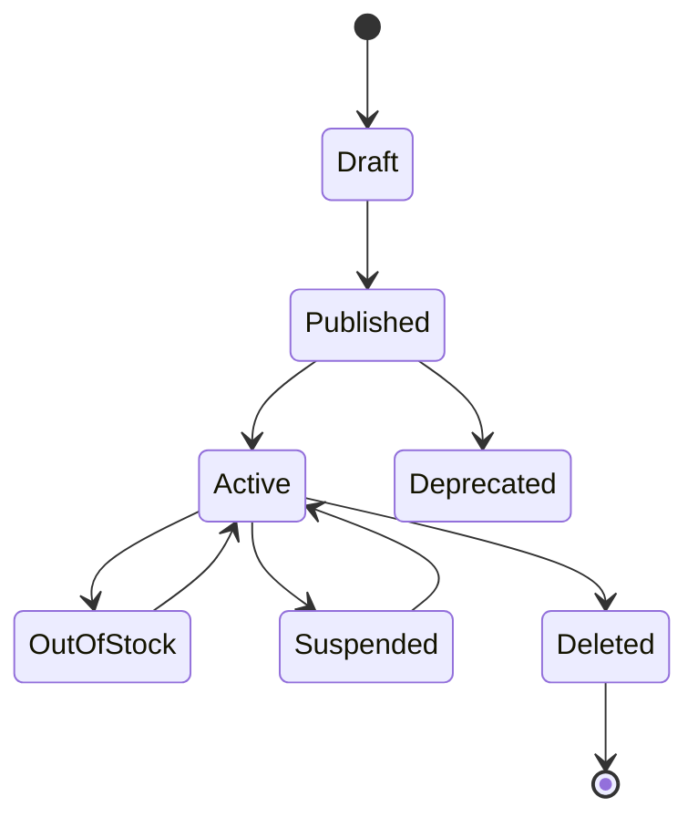

Recommendation system yang baik tidak menganggap item sebagai row statis.

### 7.1 Item Version Harus Jelas

Item bisa berubah harga, judul, kategori, safety status, stock, entitlement, region, thumbnail, atau seller.

Invariant:

```text
A recommendation decision must be based on item state that is fresh enough for the surface risk.
```

Tidak semua surface butuh freshness sama.

| Item Field | Freshness Requirement | Alasan |
|---|---:|---|
| Safety status | Sangat ketat | Salah tampil bisa incident. |
| Stock | Ketat untuk e-commerce | Out-of-stock merusak UX dan conversion. |
| Price | Ketat | Mempengaruhi keputusan pembelian. |
| Title/thumbnail | Sedang | Bisa stale sebentar. |
| Category embedding | Lebih longgar | Biasanya batch refresh acceptable. |
| Long-term quality score | Lebih longgar | Agregat historis. |

### 7.2 Recommendation Tidak Boleh Mengembalikan Ghost Item

Ghost item adalah item yang ada di index/model/cache tetapi tidak ada atau tidak valid di catalog source of truth.

Penyebab:

- vector index belum refresh;
- precomputed list tidak diinvalidasi;
- item deleted tetapi embedding masih ada;
- cache response terlalu lama;
- catalog ID reuse;
- model trained on old item universe.

Final response harus melakukan item hydration atau validation terhadap catalog snapshot yang dipercaya.

```text
candidate_item_id -> catalog lookup -> serveable item object -> response item
```

Jika catalog lookup gagal, item dibuang.

### 7.3 Jangan Reuse Item ID untuk Item Berbeda

Jika sistem mengizinkan ID reuse, recommendation history menjadi rusak.

```text
user clicked item-123 in January
item-123 deleted
new unrelated item created with item-123 in June
model thinks user likes new item because of old click
```

Invariant:

```text
Item identity must be immutable across semantic item lifetime.
```

Gunakan stable ID dan version/revision untuk perubahan, bukan reuse identity untuk entitas baru.

---

## 8. Exposure dan Slate Invariants

Rekomendasi bukan hanya item individual. Response adalah slate: daftar berurutan yang user lihat.

### 8.1 Tidak Ada Duplicate Item dalam Slate

Invariant paling dasar:

```text
For a single response slate:
  item_id must be unique unless duplicate policy explicitly allows repeated representation.
```

Failure umum:

- item muncul dari beberapa candidate source;
- product variant dianggap item berbeda padahal representasi UI sama;
- sponsored dan organic slot menampilkan item sama;
- pagination request mengulang item dari page sebelumnya;
- cache key tidak memasukkan cursor/session state.

Dedup harus mempertimbangkan level representasi.

```text
SKU-level duplicate      : item_id sama
Product-level duplicate  : product_group_id sama
Creator-level repetition : terlalu banyak item dari creator sama
Topic-level repetition   : terlalu banyak item semantik sama
```

### 8.2 Pagination Tidak Boleh Mengulang Tanpa Alasan

Feed biasanya dipanggil berulang.

```text
GET /recommendations?surface=home&cursor=abc
GET /recommendations?surface=home&cursor=def
```

Invariant:

```text
Within a recommendation session, already exposed items should not reappear before cooldown policy allows it.
```

Ini membutuhkan exposure state.

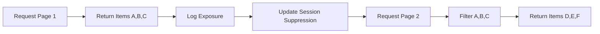

Jika exposure log asynchronous, online path bisa memakai lightweight session suppression cache agar tidak menunggu pipeline event selesai.

### 8.3 Slate Harus Memenuhi Minimum Quality Constraints

Contoh constraint:

```text
at least 8 items returned for homepage carousel
no more than 3 items from same seller
no more than 2 items from same category in top 5
must include at least 1 fresh item if available
must not include more than 1 sponsored slot in first 4 positions
```

Constraint ini bukan selalu “benar universal”. Ia adalah product decision. Tetapi setelah diputuskan, ia harus menjadi invariant yang diuji.

### 8.4 Position Bias Harus Diakui

Item di posisi atas lebih mungkin dilihat dan diklik. Karena itu click bukan hanya fungsi relevance, tetapi juga fungsi posisi.

```text
P(click) = f(relevance, position, surface, thumbnail, title, user intent, context)
```

Failure mode:

- item di posisi 1 selalu mendapat click tinggi;
- model mengira item itu sangat relevan;
- item itu makin sering dipilih;
- sistem memperkuat popularitas buatan sendiri.

Invariant data:

```text
Every impression event must include position, surface, layout, request_id, and experiment assignment.
```

Tanpa position dan impression, ranking evaluation akan bias berat.

---

## 9. Experiment Invariants

Recommendation system tanpa experiment integrity akan menipu tim.

### 9.1 Assignment Harus Stabil

Jika user masuk treatment A pada request pertama, lalu treatment B pada request kedua dalam experiment yang sama tanpa alasan, hasil experiment rusak.

Invariant:

```text
For a given experiment and unit, assignment must be stable during the experiment window.
```

Unit bisa:

- user_id;
- device_id;
- session_id;
- tenant_id;
- account_id;
- request_id untuk interleaving tertentu.

Pemilihan unit adalah keputusan penting. Jangan asal user_id jika banyak anonymous traffic. Jangan session_id jika efeknya long-term.

### 9.2 Response Harus Mencatat Experiment Assignment

Setiap decision log harus menyimpan:

```text
experiment_key
variant
assignment_unit
assignment_timestamp
config_version
```

Kalau tidak, kita tidak bisa menghubungkan outcome ke variant.

### 9.3 Guardrail Metric Harus Bisa Menghentikan Rollout

Experiment yang menaikkan CTR tetapi menaikkan report rate, refund rate, unsubscribe, latency, atau seller concentration mungkin harus dihentikan.

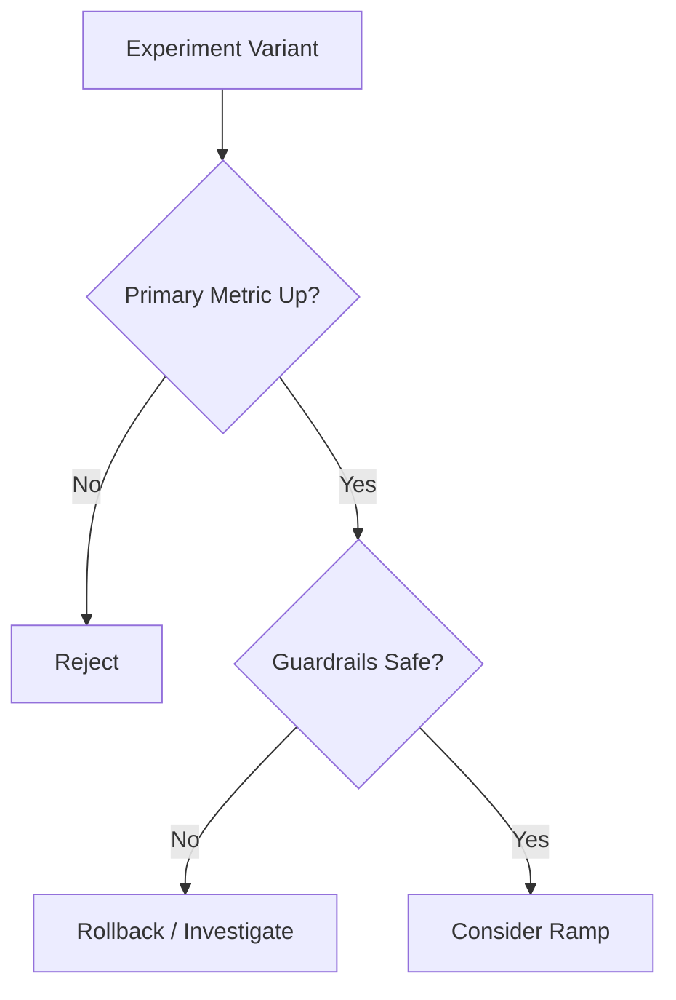

Primary metric tanpa guardrail adalah undangan reward hacking.

---

## 10. Data dan Feedback Invariants

Recommendation system adalah closed loop. Data yang salah hari ini menjadi model yang salah besok.

### 10.1 Impression Event Wajib Ada

Click tanpa impression tidak cukup.

```text
CTR = clicks / impressions
```

Jika impression tidak lengkap, CTR palsu.

Invariant:

```text
Every item returned in a recommendation response must be traceable to an impression opportunity.
```

Ada dua level:

1. **Server-side decision log**: sistem tahu item apa yang dikirim.
2. **Client-side impression log**: user benar-benar melihat item di viewport.

Keduanya berguna, tetapi tidak sama.

```text
returned_item != viewed_item
```

Untuk feed panjang, item yang dikirim belum tentu terlihat. Training label harus sadar perbedaan ini.

### 10.2 Request ID Harus Mengikat Semua Event

Minimal event correlation:

```text
request_id
response_id
slate_id
item_id
position
surface
user_key
session_id
experiment_assignments
candidate_source
model_version
```

Tanpa correlation ID, kita tidak bisa menjawab:

- item ini muncul dari source mana?
- model apa yang memberi score?
- user melihat item di posisi berapa?
- click ini berasal dari response yang mana?
- experiment apa yang aktif saat itu?

### 10.3 Delayed Feedback Harus Dimodelkan

Purchase, churn, refund, retention, dan complaint bisa terjadi jauh setelah impression.

Failure mode:

```text
T0: recommendation shown
T0 + 5 min: click
T0 + 2 days: purchase
T0 + 10 days: refund
```

Jika training hanya melihat click cepat, sistem bisa menaikkan item yang clickbait tetapi tidak menghasilkan satisfaction.

Invariant dataset:

```text
Label windows and attribution windows must be explicit and versioned.
```

Contoh:

```yaml
label_definition:
  name: purchase_within_7d_after_impression
  positive_event: purchase
  attribution_window: 7d
  negative_window: 7d
  deduplication: first_purchase_per_item_per_user
  version: v3
```

### 10.4 Training Data Harus Point-in-Time Correct

Feature yang dihitung setelah label terjadi tidak boleh dipakai untuk memprediksi label itu.

Contoh leakage:

```text
training example time: Monday 10:00
label: purchase by Monday 12:00
feature accidentally used: total_user_purchases_until_Tuesday
```

Model terlihat hebat offline, tetapi gagal online.

Invariant:

```text
For each training row, all feature values must be computed from information available at or before decision time.
```

Ini salah satu invariant paling penting dalam ML production.

---

## 11. Serving Reliability Invariants

Recommendation API berada di jalur user-facing. Ia harus cepat dan predictable.

### 11.1 Latency Budget Harus Dibagi per Stage

Bukan cukup berkata “API harus < 200 ms”. Harus ada budget.

Contoh:

| Stage | Budget |
|---|---:|
| Request parsing + auth context | 5 ms |
| User/profile lookup | 20 ms |
| Candidate generation | 40 ms |
| Feature fetch | 35 ms |
| Ranking inference | 45 ms |
| Re-ranking + policy | 20 ms |
| Logging enqueue | 10 ms |
| Serialization/network overhead | 25 ms |
| Total | 200 ms |

Invariant:

```text
Every stage must have timeout, fallback, and metric.
```

Jika feature fetch memakai 300 ms, jangan biarkan seluruh request menggantung. Gunakan partial features, cached features, atau fallback ranker.

### 11.2 Logging Tidak Boleh Menjatuhkan Response Path

Decision logging penting, tetapi user-facing response tidak boleh bergantung penuh pada sink logging lambat.

Pola aman:

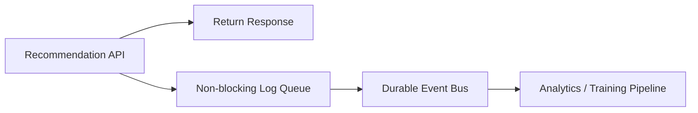

Invariant:

```text
Logging should be durable enough for analysis, but logging sink slowness must not cause recommendation outage unless compliance requires hard blocking.
```

Untuk beberapa domain regulated, mungkin decision log wajib sebelum response. Jika begitu, SLA dan fallback harus dirancang khusus. Jangan menganggap semua domain sama.

### 11.3 Fallback Harus Valid, Bukan Sembarang Populer

Fallback bukan tempat membuang kualitas.

Fallback harus tetap melewati:

- policy gate;
- eligibility gate;
- dedup;
- region restriction;
- surface contract;
- experiment attribution jika relevan.

Fallback hierarchy harus eksplisit.

```yaml
fallback_policy:
  homepage:
    - personalized_cache_last_good
    - region_trending_safe
    - category_popular_safe
    - editorial_safe_list
    - empty_state
  product_detail:
    - similar_item_precomputed
    - same_category_popular
    - brand_popular
    - empty_state
```

Invariant:

```text
Fallback response must satisfy the same safety and response schema invariants as primary response.
```

---

## 12. Observability Invariants

Jika recommendation system buruk tetapi tidak bisa dijelaskan, tim akan memperbaiki hal yang salah.

### 12.1 Setiap Response Harus Bisa Di-debug

Minimal internal debug trace:

```json
{
  "requestId": "req-abc",
  "surface": "home",
  "userSegment": "logged_in_existing",
  "candidateStats": {
    "popular": 200,
    "two_tower": 500,
    "similar_recent": 120,
    "afterDedup": 730,
    "afterEligibility": 410
  },
  "ranking": {
    "modelVersion": "ranker-v42",
    "featuresFetched": 96,
    "missingFeatureCount": 3,
    "inferenceLatencyMs": 31
  },
  "reranking": {
    "diversityApplied": true,
    "suppressedAlreadySeen": 12
  },
  "fallback": false
}
```

Debug trace tidak harus disimpan selamanya. Tetapi saat incident, sistem harus punya cara sampling atau on-demand debug.

### 12.2 Source Contribution Harus Terlihat

Jika semua final item berasal dari popularity source, personalized retrieval mungkin mati tanpa terlihat.

Metric penting:

```text
candidate_source_raw_count
candidate_source_after_filter_count
candidate_source_top_k_count
candidate_source_click_count
candidate_source_conversion_count
```

Perhatikan per-stage. Source bisa menghasilkan banyak raw candidates tetapi tidak pernah masuk top-K. Itu sinyal bahwa source kurang berguna atau ranking tidak mengerti source tersebut.

### 12.3 Score Distribution Harus Dimonitor

Model bisa rusak tanpa error.

Contoh:

- semua score menjadi 0.5 karena feature default;
- score meledak karena feature scaling berubah;
- model baru memberi score tidak terkalibrasi;
- satu segment user mendapat score rendah semua;
- candidate source tertentu selalu menang karena score range tidak comparable.

Monitor:

```text
score_p50 / p90 / p99
score_by_segment
score_by_surface
score_by_candidate_source
calibration drift
missing feature rate
```

---

## 13. Failure Mode Taxonomy

Sekarang kita susun failure mode berdasarkan layer.

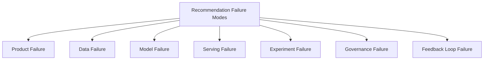

### 13.1 Product Failure

Product failure terjadi ketika sistem mengoptimalkan hal yang salah.

Contoh:

| Failure | Gejala | Akar Masalah |
|---|---|---|
| Clickbait optimization | CTR naik, satisfaction turun | Objective terlalu sempit. |
| Marketplace collapse | Seller besar makin dominan | Exposure fairness tidak dijaga. |
| Repetition fatigue | User melihat item yang sama | Suppression/cooldown lemah. |
| Irrelevant novelty | Sistem terlalu mengejar diversity | Diversity tidak dikaitkan ke intent. |
| Short-term addiction | Engagement naik, trust turun | Tidak ada long-term guardrail. |

Mitigasi:

- metric tree;
- guardrail metric;
- satisfaction signal;
- diversity/fairness constraints;
- long-term experiment readout.

### 13.2 Data Failure

Data failure terjadi ketika sistem belajar dari observasi yang salah atau tidak lengkap.

Contoh:

| Failure | Gejala | Akar Masalah |
|---|---|---|
| Missing impression | CTR tampak terlalu tinggi | Denominator hilang. |
| Duplicate events | Model overfit ke user/item tertentu | Retry tidak idempotent. |
| Bot traffic | Popularity/trending rusak | Abuse filtering lemah. |
| Late conversions ignored | CVR undervalued | Attribution window salah. |
| Future leakage | Offline metric terlalu bagus | Feature point-in-time salah. |
| Schema drift | Feature default banyak | Producer/consumer contract lemah. |

Mitigasi:

- event contract;
- idempotency key;
- schema registry;
- data quality checks;
- point-in-time join;
- bot/anomaly filtering;
- feature freshness monitoring.

### 13.3 Model Failure

Model failure terjadi ketika model bekerja sesuai training objective tetapi tidak sesuai kebutuhan sistem.

Contoh:

| Failure | Gejala | Akar Masalah |
|---|---|---|
| Popularity bias | Long-tail mati | Training data exposure-biased. |
| Cold-start poor | User/item baru buruk | Terlalu bergantung history. |
| Segment regression | Segment kecil turun drastis | Average metric menutupi minority segment. |
| Miscalibration | Score tidak comparable | Probability tidak dikalibrasi. |
| Embedding collapse | Retrieval homogen | Negative sampling/model issue. |
| Stale model | Trend berubah tapi model lambat | Retraining cadence tidak sesuai. |

Mitigasi:

- segment evaluation;
- calibration;
- exploration;
- content-based fallback;
- freshness-aware features;
- model drift monitoring;
- retraining trigger.

### 13.4 Serving Failure

Serving failure terjadi ketika model bagus tetapi online path tidak mampu mengeksekusi keputusan dengan benar.

Contoh:

| Failure | Gejala | Akar Masalah |
|---|---|---|
| Feature timeout | fallback tinggi | Online store lambat/down. |
| Vector index stale | item lama muncul | Index refresh/rollback buruk. |
| Cache poisoning | response salah meluas | Cache key tidak lengkap. |
| Partial ranking bug | urutan tidak stabil | Timeout tanpa deterministic fallback. |
| Model version mismatch | score berubah aneh | Registry/deployment tidak konsisten. |
| Serialization bloat | latency naik | Response/debug payload terlalu besar. |

Mitigasi:

- timeout per stage;
- cache contract;
- model version pinning;
- index versioning;
- last-known-good fallback;
- load testing;
- response budget.

### 13.5 Experiment Failure

Experiment failure membuat keputusan product salah.

Contoh:

| Failure | Gejala | Akar Masalah |
|---|---|---|
| Sample ratio mismatch | variant traffic tidak sesuai | Assignment bug. |
| Cross-contamination | control/treatment saling memengaruhi | Unit experiment salah. |
| Peeking | false positive | Stop experiment terlalu cepat. |
| Logging mismatch | metric tidak bisa dihitung | Assignment tidak tercatat. |
| Novelty effect | awal naik, lalu turun | Horizon evaluasi terlalu pendek. |

Mitigasi:

- stable bucketing;
- SRM checks;
- guardrail metrics;
- experiment registry;
- predeclared success criteria;
- long-term holdout jika perlu.

### 13.6 Governance Failure

Governance failure biasanya tidak terlihat dari CTR.

Contoh:

| Failure | Gejala | Akar Masalah |
|---|---|---|
| Policy violation exposure | unsafe item tampil | Final gate tidak ada/stale. |
| Privacy breach | user merasa creepy | Consent tidak mengalir ke features. |
| Unexplainable decision | incident sulit diaudit | Trace/log tidak lengkap. |
| Unauthorized debug access | PII terbuka | Tooling internal tidak dibatasi. |
| Manual override chaos | rule saling bertabrakan | Config governance lemah. |

Mitigasi:

- policy versioning;
- privacy-aware feature registry;
- access control;
- audit trail;
- rule review process;
- incident runbook.

### 13.7 Feedback Loop Failure

Feedback loop failure terjadi ketika output sistem mengubah data training dengan cara merusak masa depan.

Contoh:

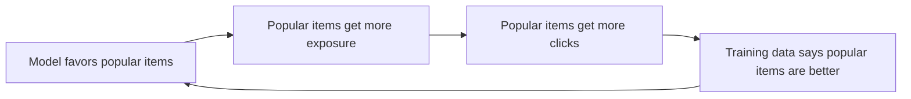

Jenis loop:

- popularity reinforcement;
- filter bubble;
- creator/seller concentration;
- content homogenization;
- clickbait amplification;
- under-exploration of new items;
- stale preference lock-in.

Mitigasi:

- exploration budget;
- exposure-aware training;
- counterfactual evaluation;
- diversity constraints;
- long-tail guardrail;
- novelty/serendipity metric;
- periodic reset/decay of stale preference.

---

## 14. Invariant Enforcement Pipeline

Secara praktis, kita ingin invariant tersebar di beberapa layer, bukan satu monolith.

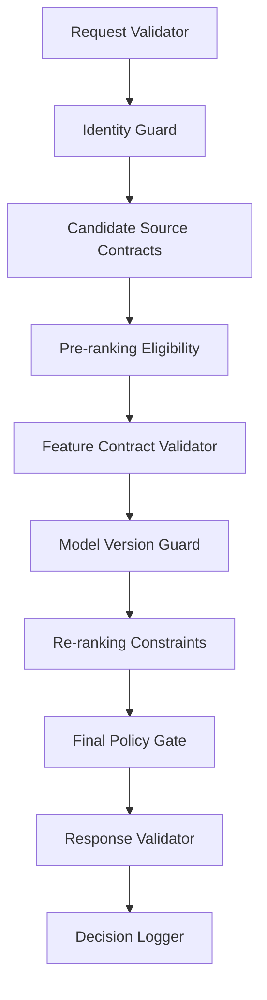

### 14.1 Request Validator

Memastikan request memiliki minimal context.

```java
public final class RecommendationRequestValidator {
    public void validate(RecommendationRequest request) {
        requireNonBlank(request.requestId(), "requestId");
        requireNonBlank(request.surface(), "surface");
        requireNonBlank(request.sessionId(), "sessionId");

        if (request.limit() <= 0 || request.limit() > 100) {
            throw new InvalidRecommendationRequest("limit out of bounds");
        }
    }
}
```

### 14.2 Candidate Contract

Candidate bukan hanya `itemId`.

```java
public record Candidate(
    String itemId,
    CandidateSource source,
    double sourceScore,
    String sourceVersion,
    Map<String, String> provenance
) {}
```

Provenance penting untuk debugging dan analytics.

### 14.3 Eligibility Result Jangan Boolean Saja

Kalau filter hanya mengembalikan boolean, kita kehilangan alasan.

```java
public record EligibilityDecision(
    String itemId,
    boolean eligible,
    List<String> reasons,
    String policyVersion
) {}
```

Alasan berguna untuk:

- debugging;
- metric per reason;
- tuning policy;
- audit;
- explaining empty result.

### 14.4 Response Validator

Sebelum response keluar:

```java
public final class RecommendationResponseValidator {
    public void validate(RecommendationResponse response) {
        assertUniqueItemIds(response.items());
        assertNoPolicyViolation(response.items());
        assertPositionsContinuous(response.items());
        assertExperimentMetadataPresent(response);
        assertRequestIdPresent(response);
    }
}
```

Validator bukan pengganti desain. Tetapi validator menangkap bug sebelum menjadi exposure.

---

## 15. Metrics untuk Menjaga Invariant

Minimal metric set:

### 15.1 Candidate Metrics

```text
candidate_count_by_source
candidate_count_after_dedup
candidate_count_after_eligibility
candidate_empty_rate_by_surface
candidate_source_timeout_rate
candidate_source_latency_ms
```

### 15.2 Policy dan Eligibility Metrics

```text
policy_filtered_count_by_reason
policy_violation_response_count
final_gate_rejection_count
unsafe_candidate_seen_count
entitlement_filter_count
out_of_stock_filter_count
```

### 15.3 Slate Metrics

```text
duplicate_item_rate
duplicate_group_rate
same_creator_top_k_rate
same_category_top_k_rate
already_seen_suppression_count
empty_response_rate
fallback_response_rate
```

### 15.4 Feature dan Model Metrics

```text
feature_missing_rate
feature_staleness_ms
online_offline_feature_skew
model_version_distribution
inference_latency_ms
score_distribution_by_model
score_distribution_by_segment
```

### 15.5 Experiment Metrics

```text
experiment_assignment_missing_rate
sample_ratio_mismatch
variant_response_count
variant_metric_delay
cross_variant_contamination_indicator
```

### 15.6 Feedback Metrics

```text
impression_logging_rate
click_without_impression_count
event_duplicate_rate
event_lateness_distribution
label_availability_rate
training_example_count_by_day
```

---

## 16. Testing Strategy untuk Invariants

Recommendation system perlu testing di beberapa level.

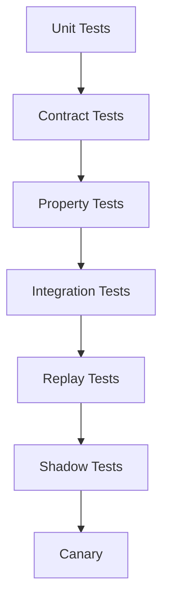

### 16.1 Unit Test

Cocok untuk pure logic:

- dedup;
- cooldown;
- score composition;
- eligibility rule;
- fallback selection;
- pagination cursor.

### 16.2 Contract Test

Memastikan producer/consumer sepakat:

- event schema;
- API schema;
- feature schema;
- model input schema;
- candidate schema.

### 16.3 Property Test

Menguji invariant terhadap banyak variasi input.

Contoh properties:

```text
dedup(items) never returns duplicate item_id
final_policy_gate(items) never returns blocked items
rank(items) preserves item identity
paginate(page1, page2) does not repeat items within session
fallback(request) always returns schema-valid response
```

### 16.4 Replay Test

Ambil traffic historis, jalankan pipeline baru, bandingkan:

- latency;
- candidate count;
- empty response rate;
- top-K overlap;
- policy rejection;
- score distribution;
- fallback rate.

Replay tidak membuktikan online impact, tetapi menangkap regression teknis.

### 16.5 Shadow Test

Model/service baru menerima request production tetapi response-nya tidak ditampilkan ke user.

Dipakai untuk:

- validasi latency;
- validasi error rate;
- validasi score distribution;
- validasi feature availability;
- validasi memory/cpu.

### 16.6 Canary

Canary menampilkan output ke traffic kecil. Ini langkah pertama yang benar-benar memengaruhi user.

Canary harus punya rollback otomatis untuk guardrail keras:

- policy violation;
- error rate;
- latency;
- empty response rate;
- report/hide spike;
- severe business metric regression.

---

## 17. Runbook: Ketika Recommendation System Bermasalah

Incident recommendation system sering ambigu. “Rekomendasinya jelek” bukan diagnosis.

Gunakan urutan investigasi berikut.

### 17.1 Apakah Masalahnya Luas atau Segment-Spesifik?

Cek:

```text
surface
region
device
app_version
logged_in vs anonymous
new user vs existing user
candidate source
model version
experiment variant
tenant / market
```

Kalau hanya satu surface, jangan rollback semua model. Kalau hanya satu region, cek policy/catalog. Kalau hanya satu app version, cek client logging/layout.

### 17.2 Apakah Candidate Cukup?

Pertanyaan:

- raw candidate count turun?
- source tertentu timeout?
- vector index kosong?
- precomputed list expired?
- catalog filter menghapus terlalu banyak?
- region/category tertentu tidak punya item eligible?

Metric:

```text
candidate_count_by_source
candidate_empty_rate
candidate_source_timeout_rate
filter_count_by_reason
```

### 17.3 Apakah Ranking Rusak?

Pertanyaan:

- model version berubah?
- feature missing naik?
- score distribution bergeser?
- feature staleness naik?
- ranker fallback aktif?
- calibration berubah?

Metric:

```text
model_version_distribution
feature_missing_rate
score_p50/p90/p99
inference_latency
fallback_ranker_rate
```

### 17.4 Apakah Re-ranking/Policy Terlalu Agresif?

Pertanyaan:

- final gate banyak menolak item?
- diversity constraint menghapus terlalu banyak?
- cooldown terlalu panjang?
- manual rule baru aktif?
- policy config berubah?

Metric:

```text
rerank_suppression_count
policy_filtered_count_by_reason
final_item_count
empty_after_policy_rate
```

### 17.5 Apakah Logging atau Experiment Attribution Rusak?

Pertanyaan:

- impression turun tetapi response normal?
- click tanpa impression naik?
- experiment assignment hilang?
- sample ratio mismatch?
- client app version berubah?

Metric:

```text
impression_logging_rate
click_without_impression_count
experiment_assignment_missing_rate
sample_ratio_mismatch
```

---

## 18. Failure Containment Pattern

Saat sistem gagal, tujuan pertama bukan membuat rekomendasi sempurna. Tujuan pertama adalah **mencegah kerusakan meluas**.

Pattern containment:

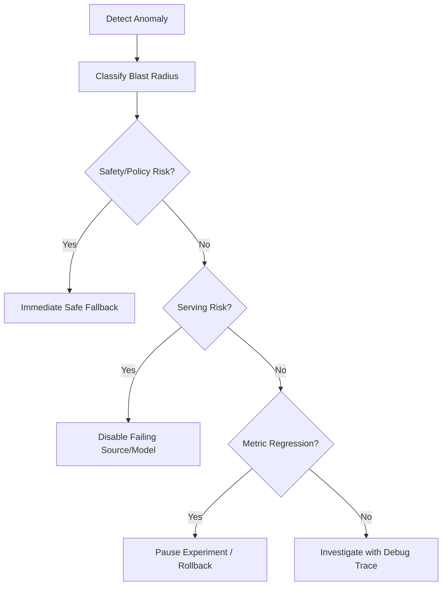

Containment tools:

- disable candidate source;
- switch model to previous version;
- disable experiment variant;
- reduce traffic ramp;
- activate editorial safe fallback;
- increase cache TTL temporarily;
- bypass non-critical feature;
- reduce ranker batch size;
- block unsafe category/source;
- freeze index swap.

---

## 19. Practical Design Artifact: Invariant Register

Setiap production recommendation system sebaiknya punya invariant register.

Contoh format:

| ID | Invariant | Layer | Severity | Owner | Metric | Fallback |
|---|---|---|---|---|---|---|
| INV-001 | No blocked item in response | Final policy gate | Critical | Trust/Safety + RecSys | policy_violation_response_count | safe editorial list |
| INV-002 | No duplicate item in slate | Response validator | High | RecSys Backend | duplicate_item_rate | dedup + refill |
| INV-003 | Impression trace exists for every response item | Logging | High | Data Platform | impression_logging_rate | queue retry + alert |
| INV-004 | Feature values point-in-time correct | Dataset builder | Critical | ML Platform | offline validation checks | block training dataset |
| INV-005 | Experiment assignment stable | Experiment service | Critical | Experiment Platform | SRM, assignment drift | pause experiment |
| INV-006 | Consent respected in feature fetch | Feature service | Critical | Privacy + RecSys | unauthorized_feature_fetch | contextual fallback |
| INV-007 | API returns valid schema under fallback | API layer | Medium | RecSys Backend | fallback_error_rate | empty state |

Invariant register bukan dokumentasi mati. Ia harus terhubung ke test, dashboard, alert, dan runbook.

---

## 20. Build-From-Scratch Checklist

Sebelum lanjut ke reference architecture, kita tetapkan checklist awal.

### 20.1 Minimal Hard Invariants

```text
[ ] No unsafe/policy-blocked item in final response.
[ ] No item outside user entitlement/region/age/context eligibility.
[ ] No duplicate item in one slate.
[ ] No already-consumed item unless resurfacing policy allows it.
[ ] Response remains schema-valid under fallback.
[ ] Every response has request_id and response_id.
[ ] Every item has candidate source provenance.
[ ] Every decision records model/config/policy version.
[ ] Impression/click/conversion events can be correlated.
[ ] Experiment assignment is stable and logged.
[ ] Feature fetch respects consent/privacy state.
[ ] Training rows are point-in-time correct.
[ ] Serving stages have timeout and fallback.
```

### 20.2 Minimal Failure Controls

```text
[ ] Kill switch per candidate source.
[ ] Kill switch per model version.
[ ] Kill switch per experiment.
[ ] Safe fallback list per surface/region.
[ ] Last-known-good index/model/config.
[ ] Dashboard for candidate, feature, model, slate, feedback metrics.
[ ] Runbook for bad recommendation incident.
[ ] Audit trail for policy/config/model changes.
```

Kalau checklist ini terasa “banyak”, itu karena production recommendation system memang bukan model tunggal. Ia adalah gabungan decision engine, data platform, ML platform, policy engine, and product experimentation system.

---

## 21. Kesalahan Berpikir yang Harus Dihindari

### 21.1 “Nanti Kita Tambahkan Guardrail Setelah Model Bagus”

Salah.

Guardrail bukan dekorasi. Guardrail menentukan ruang keputusan model. Kalau guardrail telat, model dan data training sudah belajar dari perilaku yang salah.

### 21.2 “Fallback Boleh Jelek, yang Penting Jarang Dipakai”

Salah.

Fallback biasanya aktif saat sistem sedang bermasalah. Justru saat itu kualitas fallback paling penting.

### 21.3 “Kalau Offline Metric Naik, Aman”

Salah.

Offline metric bisa naik karena leakage, bias, label salah, atau objective sempit. Online experiment dan guardrail tetap diperlukan.

### 21.4 “Policy Filter Cukup di Candidate Source”

Salah.

Candidate source bisa stale. Harus ada final gate.

### 21.5 “Observability Bisa Belakangan”

Salah.

Tanpa observability, setiap incident menjadi opini. Dengan observability, kita bisa membedakan apakah masalah ada di data, candidate, model, policy, experiment, atau client.

---

## 22. Ringkasan

Part ini membentuk pagar recommendation system.

Hal terpenting:

1. Recommendation system adalah closed-loop decision system, bukan sekadar model prediksi.
2. Invariant adalah properti yang harus tetap benar saat sistem berjalan dalam kondisi nyata.
3. Safety, eligibility, privacy, catalog validity, exposure, experiment integrity, data correctness, serving reliability, dan observability harus dijaga sebagai invariant.
4. Failure mode harus dipetakan per layer: product, data, model, serving, experiment, governance, dan feedback loop.
5. Final policy gate, response validator, decision log, fallback hierarchy, kill switch, dan invariant metrics adalah komponen production, bukan tambahan opsional.
6. Sistem yang tidak bisa dijelaskan saat gagal belum layak disebut enterprise-grade.

Di Part 006, kita akan menyusun **reference architecture overview**: bagaimana semua komponen ini diletakkan dalam arsitektur end-to-end yang realistis.

---

## Referensi Lanjutan

- Paul Covington, Jay Adams, Emre Sargin — *Deep Neural Networks for YouTube Recommendations*.
- Steffen Rendle et al. — *BPR: Bayesian Personalized Ranking from Implicit Feedback*.
- Thorsten Joachims et al. — work on unbiased learning-to-rank and position bias.
- Chip Huyen — *Designing Machine Learning Systems*.
- Eugene Yan — writings on real-world recommender systems and machine learning systems.
- Feast documentation — feature store concepts, offline/online feature serving.
- MLflow documentation — model registry and model lifecycle concepts.
