------
title: Build From Scratch Recommendations System - Part 006
description: Reference architecture end-to-end untuk recommendation system enterprise-grade: online serving, offline training, nearline feedback, feature store, model registry, vector index, experimentation, observability, dan governance.
series: learn-build-from-scratch-recommendations-system
seriesTitle: Build From Scratch: Enterprise Recommendations System
order: 6
partTitle: Reference Architecture Overview
tags:
  - recommendation-system
  - recsys
  - architecture
  - mlops
  - distributed-systems
  - feature-store
  - vector-search
  - series
date: 2026-07-02
---

# Part 006 — Reference Architecture Overview

Sekarang kita punya empat fondasi:

1. **Skill map**: kemampuan yang harus dibangun.
2. **Mental model**: recommendation system sebagai decision engine.
3. **Product objectives**: apa yang dioptimalkan dan dijaga.
4. **Domain model + invariants**: entitas, boundary, dan hal yang tidak boleh salah.

Part ini menyusun semuanya menjadi reference architecture.

Tujuannya bukan memberi satu diagram “paling benar”. Recommendation system untuk e-commerce, video feed, marketplace, ads, internal workflow, atau B2B case recommendation pasti berbeda. Tujuannya adalah memberi arsitektur referensi yang cukup lengkap untuk menjadi baseline desain production.

Prinsip utama:

> Recommendation architecture harus memisahkan **decision path**, **learning path**, **feedback path**, **governance path**, dan **observability path**.

Kalau semua dicampur menjadi satu service besar, sistem akan sulit diskalakan, sulit di-debug, sulit dieksperimenkan, dan sulit dipertanggungjawabkan.

---

## 1. Arsitektur Besar: Lima Loop

Recommendation system enterprise-grade tidak punya satu pipeline. Ia punya beberapa loop yang saling memberi makan.

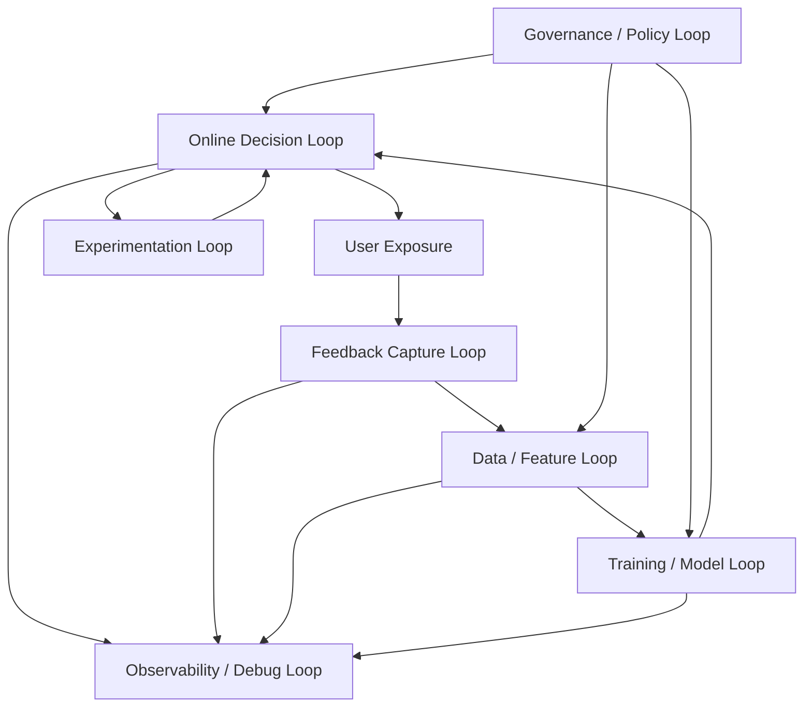

Lima loop itu:

| Loop | Fungsi | Output |
|---|---|---|
| Online Decision Loop | Memilih rekomendasi saat request user datang | slate rekomendasi |
| Feedback Capture Loop | Merekam exposure dan reaksi user | event/log |
| Data / Feature Loop | Mengubah event menjadi fitur, profil, agregat, label | feature dan dataset |
| Training / Model Loop | Melatih, mengevaluasi, dan merilis model/index | model dan artifact |
| Experimentation + Governance + Observability | Mengontrol perubahan, risiko, dan pembelajaran | keputusan rollout dan audit |

Recommendation system yang hanya punya online API dan training notebook belum production-grade.

---

## 2. Reference Architecture Level 0

Gambaran besar:

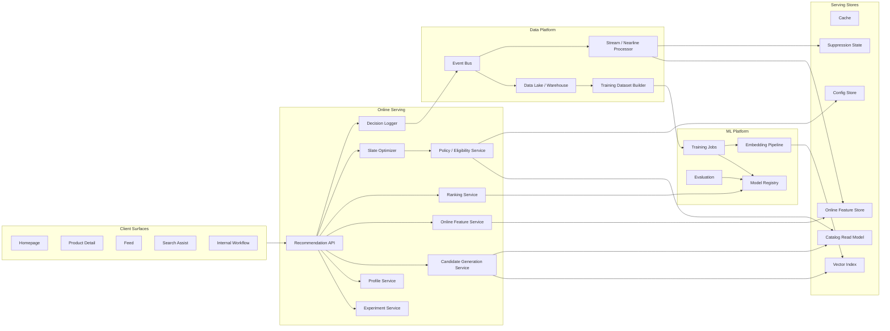

Poin penting:

- client tidak bicara langsung ke model;
- model tidak langsung menentukan response final;
- policy gate tidak boleh hilang;
- event bus menghubungkan feedback ke data platform;
- online feature store dan offline dataset builder harus konsisten secara definisi;
- model registry menjadi boundary antara training dan serving;
- vector index adalah artifact serving, bukan sekadar database tambahan;
- observability harus melintasi semua komponen.

---

## 3. Online Serving Path

Online path adalah jalur paling sensitif terhadap latency.

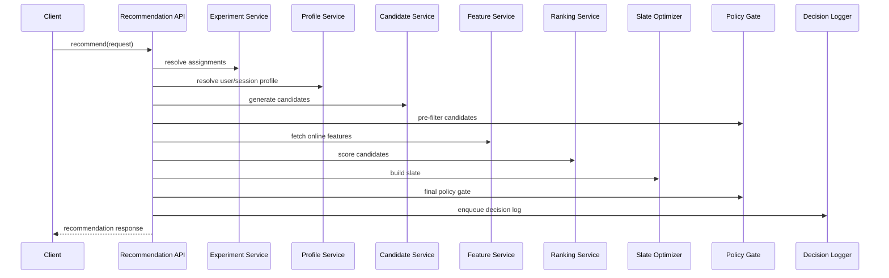

Online path harus memenuhi tiga sifat:

1. **Bounded latency**: setiap stage punya timeout.
2. **Graceful degradation**: jika stage gagal, ada fallback valid.
3. **Traceability**: setiap keputusan punya metadata cukup untuk audit/debug.

### 3.1 Recommendation API sebagai Orchestrator

Recommendation API bukan tempat model logic ditulis semua. Perannya:

- validate request;
- resolve surface contract;
- resolve experiment assignment;
- orchestrate candidate generation;
- call feature/ranking/re-ranking/policy;
- apply fallback;
- log decision;
- return schema-stable response.

Pseudo-flow:

```java
public RecommendationResponse recommend(RecommendationRequest request) {
    requestValidator.validate(request);

    DecisionContext ctx = contextResolver.resolve(request);
    ExperimentAssignments assignments = experimentService.assign(ctx);

    CandidateSet candidates = candidateService.generate(ctx, assignments)
        .withTimeout(candidateBudget)
        .orElseGet(() -> fallbackCandidates(ctx));

    CandidateSet eligible = policyService.preFilter(ctx, candidates);

    FeatureFrame features = featureService.fetch(ctx, eligible)
        .withTimeout(featureBudget)
        .orElseGet(() -> defaultOrCachedFeatures(ctx, eligible));

    ScoredCandidates scored = rankingService.score(ctx, eligible, features, assignments)
        .withTimeout(rankingBudget)
        .orElseGet(() -> baselineRanker.score(ctx, eligible));

    Slate slate = slateOptimizer.build(ctx, scored);
    Slate finalSlate = policyService.finalGate(ctx, slate);

    RecommendationResponse response = responseBuilder.build(ctx, finalSlate, assignments);
    responseValidator.validate(response);

    decisionLogger.enqueue(response.toDecisionLog());
    return response;
}
```

Ini bukan kode lengkap. Ini menunjukkan boundary tanggung jawab.

### 3.2 Latency Budget Online Path

Contoh budget untuk homepage recommendation:

| Stage | Target |
|---|---:|
| Request validation + context | 5 ms |
| Experiment assignment | 5 ms |
| Profile/session state | 15 ms |
| Candidate generation | 40 ms |
| Pre-filter eligibility | 10 ms |
| Feature fetch | 35 ms |
| Ranking inference | 45 ms |
| Slate optimization | 15 ms |
| Final policy gate | 10 ms |
| Decision logging enqueue | 5 ms |
| Serialization/network overhead | 15 ms |
| Total | 200 ms |

Budget ini bukan angka universal. Tetapi cara berpikirnya wajib: jangan desain sistem yang latency-nya hanya diketahui setelah production outage.

---

## 4. Candidate Generation Layer

Candidate generation bertugas mempersempit item universe dari jutaan item menjadi ratusan atau ribuan kandidat.

```text
item universe: 10,000,000
candidate generation: 500 - 5,000
ranking: 100 - 1,000
final slate: 10 - 50
```

### 4.1 Multi-Source Retrieval

Production system biasanya memakai banyak source.

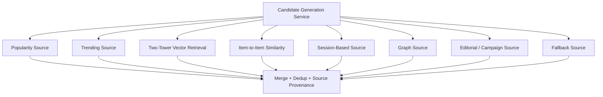

Setiap candidate harus membawa provenance.

```json
{
  "itemId": "item-8842",
  "source": "two_tower_homepage_v5",
  "sourceScore": 0.782,
  "sourceVersion": "20260702T010000",
  "reason": "similar_to_recent_click",
  "debug": {
    "seedItemId": "item-551",
    "retrievalRank": 12
  }
}
```

Provenance menjawab:

- source mana yang menghasilkan item;
- source mana yang berguna;
- source mana yang menyebabkan policy rejection;
- apakah model ranking terlalu memihak source tertentu;
- bagaimana menjelaskan bad recommendation.

### 4.2 Retrieval Tidak Sama dengan Ranking

Retrieval mengutamakan recall dan latency. Ranking mengutamakan ordering precision.

```text
Retrieval question:
  Which items might be worth considering?

Ranking question:
  Of these candidates, which should be placed higher for this user/context?

Re-ranking question:
  How should the final slate be composed under diversity, policy, fatigue, and business constraints?
```

Jangan paksa retrieval menjadi ranking final. Retrieval score sering tidak terkalibrasi antar source.

---

## 5. Feature Architecture

Recommendation system hidup dari feature. Tetapi feature yang buruk lebih berbahaya daripada model sederhana.

### 5.1 Feature Store Mental Model

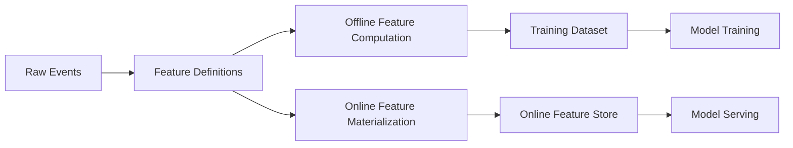

Tujuan feature store bukan sekadar menyimpan feature. Tujuannya menjaga:

- definisi feature konsisten offline/online;
- point-in-time correctness untuk training;
- low-latency fetch untuk serving;
- freshness dan TTL;
- lineage dan ownership;
- schema/version control;
- privacy/consent enforcement.

### 5.2 Jenis Feature

| Feature Type | Contoh | Serving Pattern |
|---|---|---|
| User aggregate | clicks_7d_by_category | online store |
| Item aggregate | purchase_rate_30d | online store/cache |
| Context feature | hour_of_day, device | computed in request |
| Cross feature | user_category_affinity | online store / computed |
| Sequence feature | last_20_clicked_items | profile/session store |
| Embedding feature | user_embedding, item_embedding | embedding store/vector index |
| Policy feature | seller_status, item_safety | catalog/policy store |

### 5.3 Feature Freshness Classes

Tidak semua feature harus real-time.

```text
Class A: hard real-time / request-time
  stock, entitlement, consent, session action

Class B: nearline seconds-minutes
  recent clicks, recent hides, trending windows

Class C: batch hourly/daily
  long-term affinity, item quality, seller stats

Class D: slow-changing
  category taxonomy, item metadata embedding
```

Salah desain terjadi ketika semua feature dipaksa real-time. Itu mahal, kompleks, dan sering tidak perlu.

---

## 6. Profile Store dan User State

Profile store menyimpan state user yang dibutuhkan online serving.

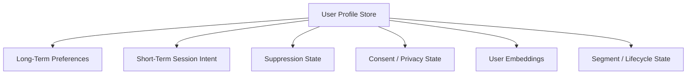

### 6.1 Long-Term vs Short-Term

Long-term preference:

```text
user likes running shoes, backend engineering articles, jazz music, budget hotels
```

Short-term intent:

```text
right now user is searching for laptop bag
right now user watches disaster recovery videos
right now user is handling a compliance escalation case
```

Recommendation system harus memadukan keduanya.

```text
score = long_term_affinity + session_intent + context + item_quality + constraints
```

Jika terlalu long-term, sistem lambat mengikuti intent. Jika terlalu short-term, sistem mudah overreact.

### 6.2 Suppression State

Suppression state mencegah repetition dan fatigue.

Contoh:

```json
{
  "userKey": "u123",
  "surface": "home_feed",
  "seenItems": [
    {"itemId": "i1", "lastSeenAt": "2026-07-02T10:00:00+07:00"},
    {"itemId": "i2", "lastSeenAt": "2026-07-02T10:02:00+07:00"}
  ],
  "hiddenItems": ["i9", "i10"],
  "cooldownUntilByCreator": {
    "creator-77": "2026-07-03T00:00:00+07:00"
  }
}
```

Suppression bukan hanya feature. Ia adalah policy state.

---

## 7. Ranking Architecture

Ranking service menerima candidates + features, lalu menghasilkan score.

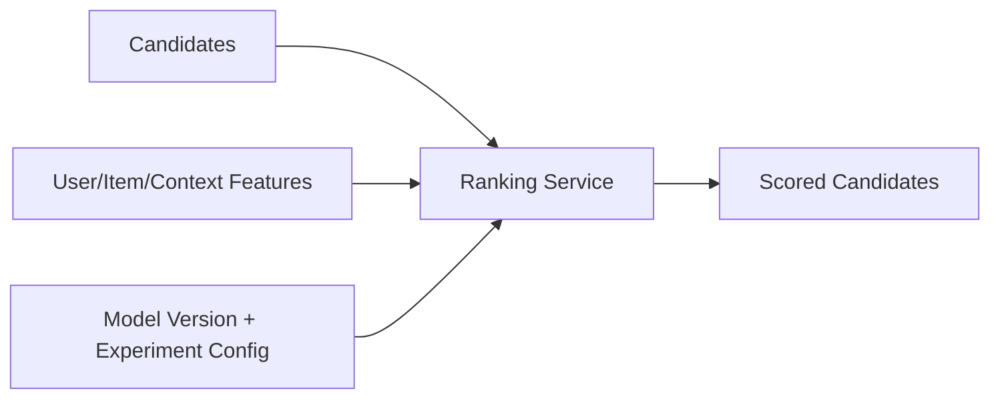

### 7.1 Ranking Service Boundary

Ranking service sebaiknya tidak melakukan semua hal.

Ia boleh:

- validate model input;
- batch inference;
- apply model version selection;
- return calibrated score components;
- expose model/debug metadata.

Ia sebaiknya tidak:

- memutuskan semua business policy;
- melakukan catalog hydration penuh;
- melakukan experiment assignment;
- menyimpan raw events;
- membangun training dataset.

Boundary ini membuat ranking service tetap fokus dan bisa diganti modelnya tanpa mengguncang seluruh sistem.

### 7.2 Score Components

Jangan hanya menyimpan final score.

```json
{
  "itemId": "item-101",
  "finalScore": 0.812,
  "components": {
    "ctr": 0.21,
    "cvr": 0.035,
    "expectedValue": 1.72,
    "itemQuality": 0.88,
    "freshnessBoost": 0.04,
    "fatiguePenalty": -0.12
  },
  "modelVersion": "ranker-v42"
}
```

Score components membantu:

- debugging;
- calibration;
- metric decomposition;
- policy review;
- explainability internal;
- safe rollout.

---

## 8. Re-ranking dan Slate Optimizer

Ranking menghasilkan urutan berdasarkan score. Slate optimizer membuat urutan itu layak tampil.

```mermaid
flowchart TD
    A[Scored Candidates] --> B[Diversity Constraint]
    B --> C[Fatigue / Cooldown]
    C --> D[Business Slot Rules]
    D --> E[Sponsored / Organic Balance]
    E --> F[Pagination State]
    F --> G[Final Slate]
```

Contoh tugas slate optimizer:

- dedup item/product group;
- limit item dari seller/creator sama;
- enforce category diversity;
- apply sponsored slot rules;
- suppress already seen items;
- keep pagination stable;
- inject exploration items;
- ensure minimum quality threshold;
- preserve layout contract.

### 8.1 Slate Is a First-Class Object

Jangan anggap response sebagai `List<Item>` saja.

```java
public record Slate(
    String slateId,
    String surface,
    List<SlateItem> items,
    SlateMetadata metadata
) {}

public record SlateItem(
    String itemId,
    int position,
    String candidateSource,
    double rankScore,
    Map<String, Object> decisionTrace
) {}
```

Slate ID penting untuk mengikat impression, click, conversion, pagination, dan experiment.

---

## 9. Policy dan Eligibility Architecture

Policy harus tersedia di dua tempat:

1. **Pre-filter**: cepat, mengurangi candidates.
2. **Final gate**: tegas, mencegah violation.

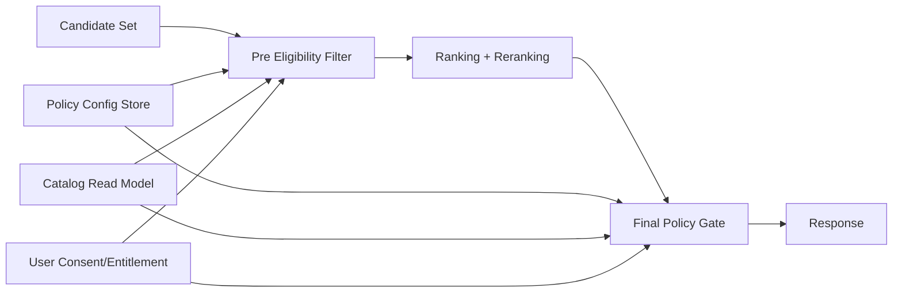

Policy config harus versioned.

```yaml
policy:
  key: homepage_policy
  version: 2026-07-02.1
  rules:
    - no_blocked_item
    - no_out_of_stock_item
    - no_item_outside_region
    - no_hidden_item
    - max_3_items_per_seller_top_20
```

Jangan hardcode semua policy di ranking model. Model sulit diaudit dan sulit diubah cepat saat ada incident.

---

## 10. Event dan Feedback Architecture

Feedback loop adalah darah sistem.

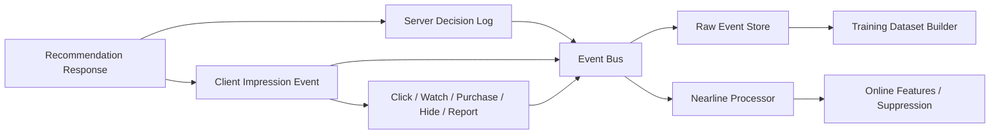

### 10.1 Server Decision Log vs Client Impression

Server decision log:

```text
what the system decided to return
```

Client impression event:

```text
what the user likely saw
```

Click/conversion event:

```text
what the user did after exposure
```

Ketiganya harus bisa dikorelasikan.

### 10.2 Event Contract Minimal

```json
{
  "eventId": "evt-123",
  "eventType": "recommendation_impression",
  "eventTime": "2026-07-02T10:15:00+07:00",
  "userKey": "hash-u123",
  "sessionId": "sess-777",
  "requestId": "req-abc",
  "responseId": "resp-def",
  "slateId": "slate-999",
  "surface": "homepage",
  "itemId": "item-101",
  "position": 3,
  "experimentAssignments": {
    "ranker_exp": "treatment_b"
  },
  "producer": {
    "app": "android",
    "version": "12.4.1"
  }
}
```

Tanpa event contract yang kuat, model terbaik pun belajar dari data yang kabur.

---

## 11. Offline Data dan Training Architecture

Offline path membangun dataset, model, embedding, dan evaluation.

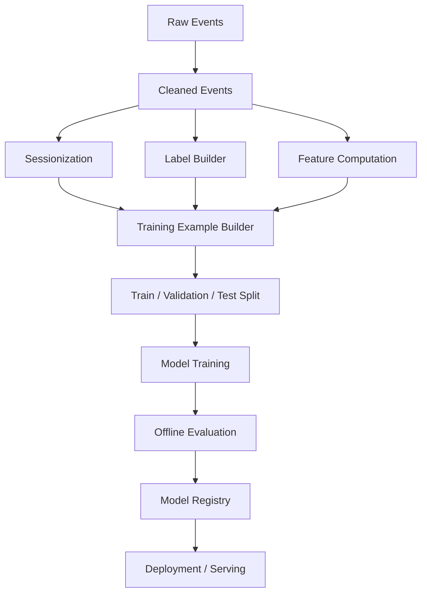

### 11.1 Training Dataset Builder sebagai Komponen Kritis

Training dataset builder harus tahu:

- decision time;
- label window;
- attribution window;
- negative sampling policy;
- feature timestamp;
- entity join key;
- experiment exposure;
- data exclusion rule;
- privacy/consent filter;
- version semua definisi.

Output training row bukan hanya feature vector.

```json
{
  "exampleId": "ex-123",
  "decisionTime": "2026-07-01T09:00:00+07:00",
  "userKey": "hash-u1",
  "itemId": "item-9",
  "surface": "homepage",
  "position": 4,
  "label": {
    "clickedWithin1h": 1,
    "purchasedWithin7d": 0
  },
  "featureSnapshotVersion": "fs-20260701",
  "labelDefinitionVersion": "label-v3",
  "samplingPolicyVersion": "neg-sampling-v2"
}
```

### 11.2 Model Registry sebagai Deployment Boundary

Training job tidak boleh langsung overwrite production model.

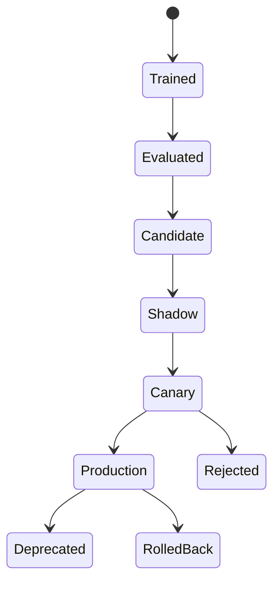

Registry menyimpan:

- model artifact;
- version;
- training data version;
- feature schema;
- evaluation report;
- owner;
- approval status;
- deployment status;
- rollback target.

---

## 12. Embedding dan Vector Index Architecture

Untuk modern recommender, embedding sering menjadi retrieval backbone.

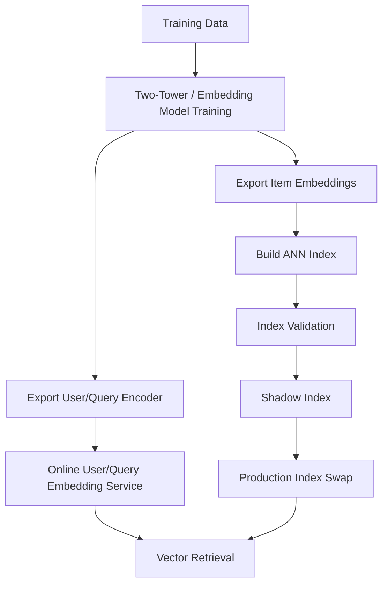

### 12.1 Index Versioning

Index adalah artifact versioned.

```text
model version: two_tower_v17
item embedding version: item_emb_20260702_0100
aNN index version: hnsw_home_20260702_0300
catalog snapshot: catalog_20260702_0000
policy snapshot: policy_20260702_0200
```

Jika item embedding, catalog, dan policy snapshot tidak sinkron, ghost item dan policy violation bisa terjadi.

### 12.2 Index Refresh Pattern

```text
train/export embeddings
build new index offline
validate index quality and catalog coverage
load index as shadow
run shadow traffic/replay
swap alias to new index
monitor candidate distribution
rollback if needed
```

Jangan build index langsung di production alias.

---

## 13. Nearline Architecture

Nearline berada di antara online dan offline.

```text
online: request-time, milliseconds
nearline: seconds to minutes
offline: hours to days
```

Nearline berguna untuk:

- recent user actions;
- session state;
- trending windows;
- suppression state;
- recent hide/report;
- cart state;
- inventory updates;
- lightweight aggregates.

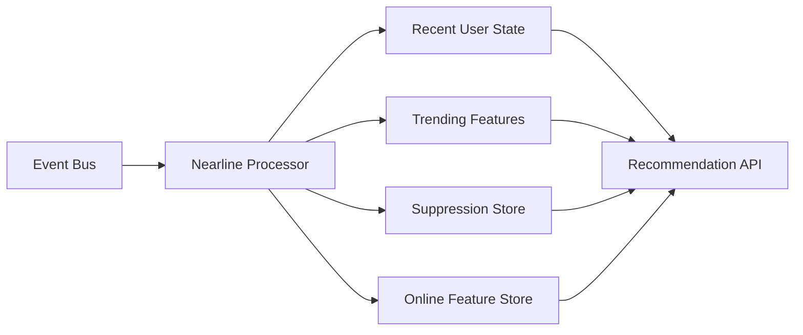

Nearline bukan berarti semua hal harus real-time. Pilih hanya signal yang benar-benar memengaruhi keputusan online.

---

## 14. Storage Map

Recommendation system memakai banyak storage karena access pattern berbeda.

| Storage | Isi | Access Pattern | Risiko |
|---|---|---|---|
| Catalog read model | item metadata, status, policy fields | online read | stale catalog |
| Online feature store | low-latency feature | online key-value read | stale/missing feature |
| Offline warehouse/lake | raw events, historical features | batch scan/join | leakage, schema drift |
| Vector index | item embeddings | ANN retrieval | stale/ghost items |
| Profile store | user state, sequence, consent | online read/write | identity/privacy error |
| Suppression store | seen/hidden/cooldown | low-latency state | repetition/fatigue |
| Model registry | model artifacts/metadata | deployment lookup | wrong version |
| Config store | policy, weights, rollout config | online cached read | bad config blast radius |
| Event bus | feedback stream | append/consume | duplicate/late events |
| Debug/decision log store | sampled traces | investigation | PII/access risk |

Tidak ada satu database yang ideal untuk semua ini.

---

## 15. Service Decomposition Reference

Kita belum masuk detail service decomposition sampai Part 051, tetapi overview-nya penting.

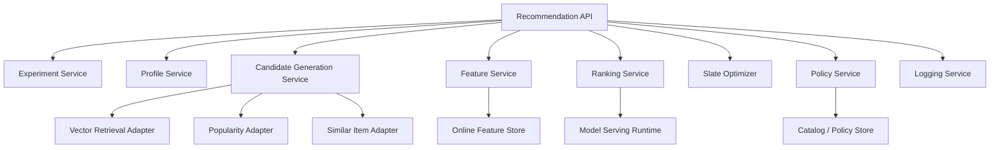

### 15.1 Jangan Terlalu Cepat Memecah Semua

Untuk build-from-scratch, kita tidak harus membuat 12 microservices dari hari pertama.

Evolusi yang masuk akal:

```text
Stage 1: modular monolith with clear boundaries
Stage 2: split candidate generation and ranking
Stage 3: split feature service and event pipeline
Stage 4: split model serving and vector retrieval
Stage 5: mature platform with registry, experiments, policy, observability
```

Yang penting bukan jumlah service. Yang penting boundary-nya benar.

---

## 16. API Contract Overview

Recommendation API harus surface-aware.

```http
POST /v1/recommendations
```

Request contoh:

```json
{
  "requestId": "req-abc",
  "user": {
    "userId": "u123",
    "anonymousId": "anon-9"
  },
  "sessionId": "sess-777",
  "surface": "homepage_feed",
  "context": {
    "locale": "id-ID",
    "region": "ID-JK",
    "device": "mobile",
    "time": "2026-07-02T10:15:00+07:00"
  },
  "limit": 20,
  "cursor": null,
  "debug": false
}
```

Response contoh:

```json
{
  "requestId": "req-abc",
  "responseId": "resp-def",
  "slateId": "slate-999",
  "surface": "homepage_feed",
  "items": [
    {
      "itemId": "item-101",
      "position": 1,
      "reasonCode": "because_you_viewed_similar",
      "trackingToken": "opaque-token-1"
    }
  ],
  "nextCursor": "cursor-2",
  "metadata": {
    "fallback": false
  }
}
```

Client tidak perlu melihat semua debug trace. Tetapi tracking token harus cukup untuk menghubungkan feedback event ke decision log.

---

## 17. Configuration Architecture

Recommendation system penuh config:

- candidate source weights;
- source enable/disable;
- ranker model version;
- fallback hierarchy;
- diversity thresholds;
- cooldown duration;
- policy rules;
- experiment variants;
- exploration budget;
- latency budget;
- feature flags.

Config tanpa governance adalah sumber incident.

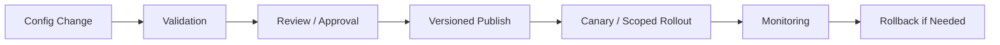

Minimal config record:

```yaml
config_key: homepage_recs_policy
version: 2026-07-02.4
owner: recsys-platform
scope:
  surfaces: [homepage_feed]
  regions: [ID]
changes:
  max_same_seller_top_20: 3
  exploration_budget: 0.05
approved_by: product-owner
created_at: 2026-07-02T09:00:00+07:00
```

---

## 18. Observability Architecture

Observability harus menjawab empat pertanyaan:

1. Apakah sistem sehat secara teknis?
2. Apakah recommendation quality sehat?
3. Mengapa item tertentu muncul?
4. Apa yang berubah sejak masalah dimulai?

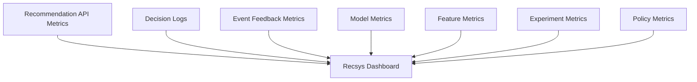

### 18.1 Dashboard Minimal

| Dashboard | Metrics |
|---|---|
| Serving | QPS, latency, error, timeout, fallback |
| Candidate | candidate count/source, empty source, source latency |
| Feature | missing, stale, fetch latency, skew |
| Ranking | model version, score distribution, inference latency |
| Slate | duplicate, diversity, suppression, final item count |
| Feedback | impression rate, CTR, CVR, hide/report, event delay |
| Experiment | assignment count, SRM, variant metrics |
| Policy | filtered count, violation count, config version |

### 18.2 Debug Endpoint

Internal debug endpoint bisa seperti:

```http
GET /internal/recommendations/debug/{requestId}
```

Return:

```json
{
  "requestId": "req-abc",
  "candidateSources": {...},
  "filters": {...},
  "features": {...},
  "ranking": {...},
  "reranking": {...},
  "policy": {...},
  "experiments": {...}
}
```

Harus ada access control dan PII redaction.

---

## 19. Governance Architecture

Recommendation system bisa berdampak pada privacy, fairness, safety, revenue, dan trust. Governance tidak boleh muncul hanya setelah incident.

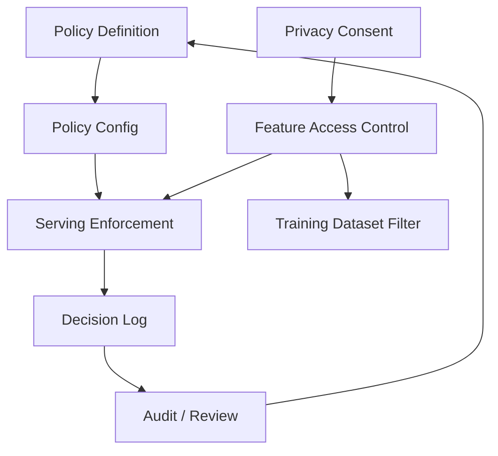

Governance surfaces:

- feature registry mencatat sensitive features;
- training dataset builder menerapkan data exclusion;
- online feature service menghormati consent;
- policy service memblokir unsafe item;
- debug tools membatasi akses PII;
- model registry menyimpan lineage;
- experiment service menyimpan rollout history;
- config store menyimpan audit trail.

---

## 20. Deployment Topology

Production topology bisa dimulai sederhana, tetapi harus punya separation of concerns.

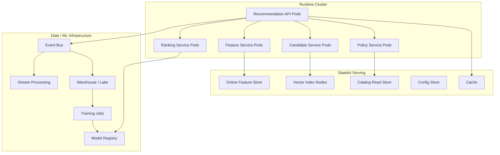

Important deployment ideas:

- stateless online services scale by QPS;
- vector index nodes scale by memory and retrieval latency;
- feature store scales by key lookup throughput;
- training jobs scale separately from serving;
- model registry is control plane, not hot path if model artifacts are cached;
- config changes need rollout control;
- event pipeline must tolerate bursts and late data.

---

## 21. Build-From-Scratch Evolution Plan

Kita tidak akan membangun semua sekaligus. Production-grade bukan berarti mulai dengan semua komponen paling kompleks.

### 21.1 Phase 1 — Correct Baseline

Bangun:

- catalog model;
- event contract;
- recommendation API;
- popularity/trending baseline;
- item-to-item baseline;
- policy gate;
- impression logging;
- basic dashboard;
- fallback hierarchy.

Goal:

```text
Sistem benar, bisa dilog, bisa difallback, dan tidak melanggar invariant dasar.
```

### 21.2 Phase 2 — Personalized Retrieval

Bangun:

- user profile store;
- session state;
- collaborative filtering / matrix factorization;
- two-tower retrieval baseline;
- vector index;
- candidate source provenance;
- source metrics.

Goal:

```text
Sistem mulai personal, tetapi tetap debuggable dan tidak bergantung pada satu source.
```

### 21.3 Phase 3 — Ranking Platform

Bangun:

- feature taxonomy;
- online/offline feature store;
- training dataset builder;
- ranker model;
- model registry;
- ranking service;
- calibration and score components.

Goal:

```text
Sistem bisa belajar dari feedback dan memilih kandidat dengan kualitas lebih baik.
```

### 21.4 Phase 4 — Experimentation and Optimization

Bangun:

- experiment service;
- A/B testing pipeline;
- guardrail metrics;
- re-ranking diversity;
- exploration budget;
- counterfactual evaluation basics;
- drift monitoring.

Goal:

```text
Perubahan sistem bisa dievaluasi online tanpa menipu diri sendiri.
```

### 21.5 Phase 5 — Enterprise Hardening

Bangun:

- privacy-aware feature access;
- audit trail;
- multi-tenant config;
- advanced observability;
- model/data governance;
- cost/capacity control;
- incident runbook;
- production readiness review.

Goal:

```text
Sistem layak dioperasikan oleh organisasi besar dengan risiko nyata.
```

---

## 22. Architecture Decision Records yang Harus Dibuat

Sebelum implementasi besar, tulis ADR untuk keputusan berikut.

| ADR | Pertanyaan |
|---|---|
| ADR-001 | Apa surface pertama yang didukung dan objective-nya? |
| ADR-002 | Apa event contract minimum untuk impression/click/conversion? |
| ADR-003 | Apa item eligibility source of truth? |
| ADR-004 | Apa fallback hierarchy per surface? |
| ADR-005 | Apa candidate sources awal? |
| ADR-006 | Apa latency budget online path? |
| ADR-007 | Apa storage untuk profile/session/suppression? |
| ADR-008 | Apa feature freshness classes? |
| ADR-009 | Bagaimana model version dipilih dan dirollback? |
| ADR-010 | Bagaimana experiment assignment dilakukan? |
| ADR-011 | Bagaimana privacy/consent mengalir ke feature dan training? |
| ADR-012 | Apa observability minimum sebelum launch? |

ADR memaksa tim membuat trade-off eksplisit.

---

## 23. Common Architecture Anti-Patterns

### 23.1 Notebook-to-Production

Model dilatih di notebook, lalu logic scoring ditempel di API.

Masalah:

- tidak reproducible;
- feature offline/online beda;
- model version tidak jelas;
- rollback sulit;
- debug lemah.

### 23.2 One Big Recommender Service

Semua logic candidate, ranking, policy, experiment, event, dan config ada di satu service.

Masalah:

- sulit scaling per concern;
- ownership kabur;
- test sulit;
- perubahan kecil berisiko besar;
- incident blast radius besar.

### 23.3 Model Owns Policy

Model score langsung menentukan final response.

Masalah:

- unsafe item bisa lolos;
- policy update butuh retrain;
- audit sulit;
- business rule tidak transparan.

### 23.4 No Decision Log

Sistem hanya log click/conversion, tetapi tidak log apa yang direkomendasikan.

Masalah:

- tidak bisa hitung exposure denominator;
- tidak bisa debug ranking;
- tidak bisa membangun dataset benar;
- experiment attribution rusak.

### 23.5 Realtime Everything

Semua feature dipaksa real-time.

Masalah:

- cost tinggi;
- architecture kompleks;
- reliability turun;
- tidak semua freshness berdampak.

### 23.6 Offline Metric Worship

Tim hanya mengejar NDCG/Recall offline.

Masalah:

- leakage tidak terlihat;
- position bias tidak dikoreksi;
- user satisfaction tidak terukur;
- online impact bisa negatif.

---

## 24. Minimal Reference Implementation Shape

Untuk seri build-from-scratch, bentuk awal yang efektif:

```text
recommendations-platform/
  services/
    recommendation-api/
    candidate-service/
    ranking-service/
    feature-service/
    policy-service/
    event-collector/
  libs/
    recsys-domain/
    recsys-contracts/
    recsys-feature-definitions/
    recsys-model-contracts/
    recsys-observability/
  pipelines/
    event-cleaning/
    feature-materialization/
    training-dataset-builder/
    embedding-export/
    batch-scoring/
  infra/
    local-dev/
    deployment/
    dashboards/
  docs/
    adr/
    invariant-register/
    runbooks/
```

Domain library harus berisi konsep stabil:

- UserKey;
- ItemId;
- Surface;
- Context;
- Candidate;
- Slate;
- DecisionLog;
- FeatureKey;
- ModelVersion;
- PolicyDecision.

Jangan biarkan semua service mendefinisikan ulang konsep ini dengan bentuk berbeda.

---

## 25. Ringkasan

Reference architecture recommendation system production-grade terdiri dari:

1. **Online serving path** untuk membuat keputusan low-latency.
2. **Candidate generation layer** untuk mengambil kandidat dari banyak source.
3. **Feature architecture** untuk konsistensi offline/online dan low-latency serving.
4. **Profile/session/suppression state** untuk personalization yang adaptif dan tidak repetitif.
5. **Ranking service** untuk scoring dengan model version yang jelas.
6. **Slate optimizer** untuk diversity, fatigue, layout, dan constraints.
7. **Policy gate** untuk safety, eligibility, privacy, dan business constraints.
8. **Feedback architecture** untuk decision log, impression, click, conversion, dan delayed labels.
9. **Offline training architecture** untuk dataset, evaluation, model registry, dan deployment lifecycle.
10. **Embedding/vector index architecture** untuk retrieval modern.
11. **Nearline architecture** untuk recent behavior dan freshness tanpa membuat semua hal real-time.
12. **Observability, experimentation, config, dan governance** sebagai control plane.

Dengan Part 006, Module 1 selesai.

Mulai Part 007, kita masuk Module 2: **Event, Feedback, dan Data Foundation**. Kita akan mulai dari event tracking contracts, karena recommendation system yang tidak punya event contract benar akan belajar dari data yang salah.

---

## Referensi Lanjutan

- Paul Covington, Jay Adams, Emre Sargin — *Deep Neural Networks for YouTube Recommendations*.
- ByteDance Monolith paper — real-time recommendation system training and serving architecture.
- Feast documentation — feature store architecture, offline/online stores, point-in-time correctness.
- MLflow Model Registry documentation — model lifecycle, stages, artifacts, registry concepts.
- Netflix, YouTube, Pinterest, Meta, and Airbnb engineering publications on recommender system serving and experimentation.
- Chip Huyen — *Designing Machine Learning Systems*.
- Martin Kleppmann — *Designing Data-Intensive Applications*.
