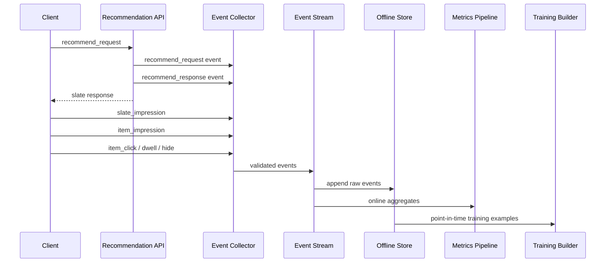

------
title: Build From Scratch Recommendations System - Part 007
description: Merancang event tracking contracts untuk recommendation system production-grade: impression, click, conversion, dwell, skip, hide, report, schema evolution, idempotency, dan auditability.
series: learn-build-from-scratch-recommendations-system
seriesTitle: Build From Scratch: Enterprise Recommendations System
order: 7
partTitle: Event Tracking Contracts
tags:
  - recommendation-system
  - recsys
  - event-driven
  - data-contract
  - analytics
  - mlops
  - series
date: 2026-07-02
---

# Part 007 — Event Tracking Contracts

Recommendation system yang buruk sering terlihat seperti masalah model.

Rekomendasi tidak relevan. Ranking kacau. CTR turun. Model drift. Segment tertentu rusak. A/B test tidak konsisten. Training data berbeda dengan online behavior.

Namun akar masalahnya sering lebih rendah: **event contract-nya tidak kuat**.

Kalau event tidak bisa dipercaya, semua layer di atasnya menjadi ilusi:

- feature salah,
- label salah,
- offline evaluation menipu,
- experiment attribution rusak,
- model belajar dari sinyal palsu,
- debugging berubah menjadi tebakan,
- dan keputusan produk menjadi sulit dipertanggungjawabkan.

Di recommendation system production-grade, event tracking bukan “analytics tambahan”. Event adalah **sistem saraf**. Semua feedback loop dimulai dari event.

Part ini membangun kontrak event dari bawah: apa yang harus dilog, kapan dilog, siapa yang bertanggung jawab, bagaimana event berevolusi, bagaimana mencegah duplikasi, dan bagaimana membuatnya cukup kuat untuk training, serving, observability, audit, dan experimentation.

---

## 1. Mental Model: Event Adalah Fakta, Bukan Interpretasi

Kesalahan umum: event langsung diberi makna bisnis terlalu dini.

Contoh buruk:

```json
{
  "event_name": "user_liked_product",
  "user_id": "u123",
  "product_id": "p789"
}
```

Masalahnya: apa arti `liked`?

Apakah user klik? Apakah user menyimpan? Apakah user menonton lama? Apakah user membeli? Apakah user memberi rating? Apakah sistem menganggap user suka karena dwell time tinggi?

Event contract production harus memisahkan:

1. **Observed fact**  
   Hal yang benar-benar terjadi.

2. **Derived interpretation**  
   Kesimpulan yang dihitung kemudian.

3. **Model label**  
   Target training yang dipakai untuk objective tertentu.

Event mentah harus mendekati fakta.

Contoh lebih sehat:

```json
{
  "event_name": "item_click",
  "event_time": "2026-07-02T10:15:30.391Z",
  "user_key": {
    "user_id": "u123",
    "anonymous_id": "anon_456"
  },
  "surface": "home_feed",
  "request_id": "req_abc",
  "impression_id": "imp_def",
  "item_id": "p789",
  "position": 3,
  "client": {
    "app": "web",
    "version": "2.18.0"
  }
}
```

Event ini tidak berkata “user suka produk”. Ia hanya berkata: **user mengklik item tertentu pada posisi tertentu dari impression tertentu**.

Makna “suka” bisa dibentuk kemudian berdasarkan kombinasi click, dwell, add-to-cart, purchase, return, hide, report, dan repeat behavior.

Prinsip utama:

> Log fact as fact. Derive meaning later.

---

## 2. Kenapa Recommendation Event Berbeda dari Event Analytics Biasa

Analytics umum cukup menjawab:

- berapa banyak klik?
- funnel drop di mana?
- halaman mana yang ramai?
- campaign mana yang efektif?

Recommendation event harus menjawab pertanyaan yang lebih ketat:

- item apa yang **ditampilkan** ke user?
- item apa yang **tidak ditampilkan**?
- item ditampilkan karena candidate source apa?
- ranker model version apa yang memilihnya?
- experiment bucket apa yang aktif?
- feature snapshot mana yang dipakai?
- user melihat item di posisi berapa?
- apakah click terjadi setelah impression valid?
- apakah conversion masih dalam attribution window?
- apakah training label bisa dibuat point-in-time correct?
- apakah rekomendasi buruk bisa dilacak sampai candidate source, feature, model, dan policy?

Analytics event sering cukup untuk dashboard.

Recommendation event harus cukup untuk:

1. model training,
2. offline evaluation,
3. online experiment,
4. debugging,
5. fairness/exposure analysis,
6. compliance audit,
7. policy enforcement,
8. fraud/bot detection,
9. replay/simulation,
10. rollback investigation.

Karena itu event contract recommendation harus lebih disiplin.

---

## 3. Event Taxonomy

Kita mulai dengan event taxonomy.

```mermaid
flowchart TD
    A[Recommendation Events] --> B[Request Events]
    A --> C[Exposure Events]
    A --> D[Engagement Events]
    A --> E[Conversion Events]
    A --> F[Negative Feedback Events]
    A --> G[System Decision Events]
    A --> H[Quality / Policy Events]

    B --> B1[recommend_request]
    B --> B2[recommend_response]

    C --> C1[slate_impression]
    C --> C2[item_impression]
    C --> C3[viewport_impression]

    D --> D1[item_click]
    D --> D2[item_open]
    D --> D3[dwell_update]
    D --> D4[save / like / share]

    E --> E1[add_to_cart]
    E --> E2[purchase]
    E --> E3[subscribe]
    E --> E4[watch_complete]

    F --> F1[skip]
    F --> F2[hide]
    F --> F3[not_interested]
    F --> F4[report]

    G --> G1[candidate_generated]
    G --> G2[item_filtered]
    G --> G3[item_ranked]
    G --> G4[slate_finalized]

    H --> H1[item_quality_updated]
    H --> H2[item_policy_status_changed]
```



Tidak semua sistem perlu melog semua event di awal. Tetapi taxonomy ini membantu agar nama, makna, dan relasi event tidak berantakan.

---

## 4. Core Entities dalam Event

Sebelum mendesain event, tentukan entity yang selalu muncul.

### 4.1 User Key

User identity tidak selalu sederhana.

Satu event bisa punya:

```json
"user_key": {
  "user_id": "u123",
  "anonymous_id": "anon_789",
  "device_id": "dev_456",
  "session_id": "sess_abc"
}
```

Aturan:

- `user_id` ada hanya jika authenticated.
- `anonymous_id` stabil sebelum login.
- `device_id` tidak boleh dianggap sebagai person identity.
- `session_id` mewakili aktivitas berdekatan dalam satu window.
- jangan memaksa semua event punya `user_id`.

Ini penting untuk cold-start, anonymous personalization, attribution, dan merge setelah login.

### 4.2 Item Key

Item harus punya identity stabil.

```json
"item_key": {
  "item_id": "item_123",
  "item_type": "product",
  "catalog_version": "2026-07-02T00:00:00Z"
}
```

Di marketplace atau content platform, `item_id` saja sering tidak cukup. Bisa perlu:

- seller_id,
- creator_id,
- brand_id,
- category_id,
- availability region,
- item version,
- content policy version.

Jangan mengandalkan metadata item dari waktu sekarang ketika menganalisis event lama. Jika item berubah, event lama harus tetap bisa dipahami berdasarkan state saat itu.

### 4.3 Surface

Surface menjawab: rekomendasi muncul di mana?

Contoh:

- `home_feed`
- `product_detail_related`
- `cart_cross_sell`
- `checkout_upsell`
- `search_zero_result`
- `article_sidebar`
- `video_next_up`
- `case_next_action`
- `agent_knowledge_recommendation`

Surface penting karena behavior user sangat tergantung konteks. CTR di homepage tidak bisa dibandingkan mentah dengan CTR di checkout upsell.

### 4.4 Request ID, Response ID, Impression ID

Ini salah satu bagian paling penting.

Minimal:

```json
{
  "request_id": "req_001",
  "response_id": "resp_001",
  "slate_id": "slate_001",
  "impression_id": "imp_001"
}
```

Perbedaan:

- `request_id`: satu permintaan rekomendasi ke backend.
- `response_id`: satu response dari recommendation service.
- `slate_id`: satu susunan final item yang dikembalikan.
- `impression_id`: exposure yang benar-benar terlihat oleh user.

Pada feed infinite scroll, satu request bisa menghasilkan banyak item. Tidak semua item langsung terlihat. Maka `response` dan `impression` harus dibedakan.

---

## 5. Request Event

`recommend_request` melog bahwa client meminta rekomendasi.

Contoh contract:

```json
{
  "event_name": "recommend_request",
  "schema_version": 1,
  "event_id": "evt_001",
  "event_time": "2026-07-02T10:00:00.000Z",
  "request_id": "req_001",
  "user_key": {
    "user_id": "u123",
    "anonymous_id": "anon_456",
    "session_id": "sess_789"
  },
  "surface": "home_feed",
  "context": {
    "locale": "id-ID",
    "country": "ID",
    "device_type": "mobile",
    "app_version": "4.12.1",
    "network_type": "wifi"
  },
  "request_params": {
    "limit": 20,
    "cursor": null,
    "scenario": "default"
  },
  "experiment": {
    "assignment_id": "assign_abc",
    "experiments": [
      {
        "experiment_key": "home_ranker_v2",
        "variant": "treatment"
      }
    ]
  }
}
```

Yang penting:

- request punya context,
- request punya surface,
- request punya experiment assignment,
- request punya unique id,
- request tidak harus berhasil.

Request event berguna untuk menghitung:

- QPS by surface,
- empty response rate,
- timeout rate,
- user traffic denominator,
- request-level conversion,
- experiment exposure eligibility.

---

## 6. Response Event

`recommend_response` melog hasil yang dikembalikan service.

Contoh ringkas:

```json
{
  "event_name": "recommend_response",
  "schema_version": 1,
  "event_id": "evt_002",
  "event_time": "2026-07-02T10:00:00.120Z",
  "request_id": "req_001",
  "response_id": "resp_001",
  "surface": "home_feed",
  "status": "success",
  "latency_ms": 120,
  "model_versions": {
    "retrieval": "retrieval-two-tower-20260701",
    "ranking": "ranker-mtl-20260701",
    "reranking": "diversity-policy-20260620"
  },
  "items": [
    {
      "item_id": "item_101",
      "position": 1,
      "score": 0.812,
      "candidate_sources": ["two_tower", "trending"],
      "rank_reason": "high_user_category_affinity"
    },
    {
      "item_id": "item_102",
      "position": 2,
      "score": 0.776,
      "candidate_sources": ["similar_to_recent_click"]
    }
  ]
}
```

Di production, response event bisa besar. Untuk feed besar, kita bisa:

- log full item list untuk traffic sampling,
- log top-K secara penuh,
- log compact payload untuk semua request,
- simpan debug payload terpisah dengan TTL pendek,
- simpan candidate provenance untuk item final saja.

Trade-off-nya: storage cost vs debug power.

Rule praktis:

> Untuk setiap item yang user lihat, sistem harus bisa menjawab: kenapa item ini muncul?

Kalau response event terlalu tipis, debugging recommendation hampir mustahil.

---

## 7. Impression Event

Ini event paling kritis dalam recommendation system.

Tanpa impression, tidak ada denominator yang benar.

CTR bukan:

```text
click / user
```

CTR yang benar biasanya:

```text
click / impression
```

Tetapi impression harus didefinisikan jelas.

Apakah item dianggap impression jika:

- backend mengirim item?
- client menerima item?
- item dirender?
- item masuk viewport?
- item terlihat minimal 1 detik?
- item 50% visible?
- user scroll melewatinya?

Definisi production harus eksplisit.

### 7.1 Slate Impression

`slate_impression` berarti satu kelompok rekomendasi muncul.

Contoh:

```json
{
  "event_name": "slate_impression",
  "schema_version": 1,
  "event_id": "evt_003",
  "event_time": "2026-07-02T10:00:01.000Z",
  "request_id": "req_001",
  "response_id": "resp_001",
  "slate_id": "slate_001",
  "surface": "home_feed",
  "user_key": {
    "user_id": "u123",
    "session_id": "sess_789"
  },
  "viewport": {
    "screen_width": 390,
    "screen_height": 844
  }
}
```

### 7.2 Item Impression

`item_impression` berarti item tertentu terlihat.

```json
{
  "event_name": "item_impression",
  "schema_version": 1,
  "event_id": "evt_004",
  "event_time": "2026-07-02T10:00:01.210Z",
  "request_id": "req_001",
  "response_id": "resp_001",
  "slate_id": "slate_001",
  "impression_id": "imp_item_101_001",
  "surface": "home_feed",
  "item_id": "item_101",
  "position": 1,
  "visible_ratio": 0.82,
  "visible_duration_ms": 1200,
  "impression_definition": "visible_ratio_gte_0_5_for_1000ms",
  "user_key": {
    "user_id": "u123",
    "session_id": "sess_789"
  }
}
```

Ini jauh lebih kuat daripada sekadar “rendered”.

### 7.3 Kenapa Impression Definition Harus Diversion-safe

Kalau aplikasi web dan mobile memakai definisi berbeda, offline evaluation bias.

Misal:

- Web melog impression saat item dirender.
- Mobile melog impression saat item 50% visible selama 1 detik.

Mobile akan tampak punya CTR lebih tinggi karena denominator lebih ketat. Padahal perilaku user mungkin sama.

Maka `impression_definition` harus distandarkan per surface dan versioned.

---

## 8. Engagement Events

Engagement event adalah reaksi user setelah exposure.

Contoh umum:

- `item_click`
- `item_open`
- `item_dwell_start`
- `item_dwell_end`
- `save`
- `like`
- `share`
- `comment`
- `follow`
- `watch_start`
- `watch_progress`
- `watch_complete`

Engagement harus terhubung ke impression bila mungkin.

```json
{
  "event_name": "item_click",
  "schema_version": 1,
  "event_id": "evt_005",
  "event_time": "2026-07-02T10:00:04.000Z",
  "request_id": "req_001",
  "response_id": "resp_001",
  "slate_id": "slate_001",
  "impression_id": "imp_item_101_001",
  "surface": "home_feed",
  "item_id": "item_101",
  "position": 1,
  "user_key": {
    "user_id": "u123",
    "session_id": "sess_789"
  },
  "interaction": {
    "input_type": "tap",
    "target": "card"
  }
}
```

Kalau click tidak punya impression link, beberapa masalah muncul:

- click tidak bisa diatribusikan ke ranking position,
- CTR denominator tidak valid,
- experiment attribution lemah,
- training example ambiguous,
- fraud detection lebih sulit.

Rule:

> Engagement dari recommendation surface harus membawa parent impression atau parent response.

---

## 9. Dwell Time Event

Dwell time sering dipakai sebagai sinyal kualitas, tetapi rawan salah.

Contoh masalah:

- user membuka item lalu meninggalkan HP,
- tab browser terbuka di background,
- video autoplay dihitung sebagai engagement,
- koneksi lambat membuat waktu tinggi,
- user membaca lama karena bingung, bukan karena suka,
- long dwell untuk artikel panjang tidak setara dengan short dwell untuk produk sederhana.

Maka dwell harus dilog secara hati-hati.

Contoh:

```json
{
  "event_name": "item_dwell",
  "schema_version": 1,
  "event_id": "evt_006",
  "event_time": "2026-07-02T10:03:00.000Z",
  "impression_id": "imp_item_101_001",
  "item_id": "item_101",
  "surface": "home_feed",
  "destination_surface": "product_detail",
  "dwell": {
    "duration_ms": 42000,
    "active_duration_ms": 28000,
    "background_duration_ms": 14000,
    "scroll_depth_ratio": 0.76
  },
  "user_key": {
    "user_id": "u123",
    "session_id": "sess_789"
  }
}
```

Bedakan:

- total duration,
- active duration,
- visible duration,
- background duration,
- media watch duration,
- scroll depth,
- completion ratio.

Untuk training, sering lebih aman memakai bucket:

```text
dwell_short
dwell_medium
dwell_long
```

daripada durasi mentah.

---

## 10. Conversion Events

Conversion adalah objective kuat, tetapi biasanya delayed.

Contoh:

- add to cart terjadi 2 menit setelah click,
- purchase terjadi 3 hari kemudian,
- subscription renewal terjadi 30 hari kemudian,
- refund terjadi 7 hari kemudian,
- churn prevention terlihat setelah berminggu-minggu.

Conversion event harus menyimpan attribution hooks.

```json
{
  "event_name": "purchase",
  "schema_version": 1,
  "event_id": "evt_007",
  "event_time": "2026-07-02T10:30:00.000Z",
  "order_id": "ord_001",
  "user_key": {
    "user_id": "u123"
  },
  "items": [
    {
      "item_id": "item_101",
      "quantity": 1,
      "price": 120000,
      "currency": "IDR"
    }
  ],
  "attribution": {
    "candidate_impression_ids": ["imp_item_101_001"],
    "last_click_impression_id": "imp_item_101_001",
    "attribution_window": "7d",
    "attribution_model": "last_click"
  }
}
```

Jangan hanya melog order. Untuk recommendation, kita butuh koneksi antara order dan exposure.

Namun hati-hati: attribution bukan fakta murni. `last_click` adalah model atribusi. Karena itu sebaiknya simpan:

- event purchase sebagai fakta,
- raw path/history sebagai data,
- attribution result sebagai derived field yang versioned.

---

## 11. Negative Feedback Events

Negative signal sangat penting karena click/purchase hanya memberitahu apa yang user lakukan, bukan apa yang user hindari.

Event penting:

- `skip`
- `hide`
- `not_interested`
- `dislike`
- `report`
- `block_creator`
- `mute_category`
- `unsubscribe`
- `return`
- `refund`
- `low_rating`

Contoh:

```json
{
  "event_name": "not_interested",
  "schema_version": 1,
  "event_id": "evt_008",
  "event_time": "2026-07-02T10:05:00.000Z",
  "impression_id": "imp_item_101_001",
  "item_id": "item_101",
  "surface": "home_feed",
  "reason": {
    "code": "seen_too_often",
    "free_text": null
  },
  "user_key": {
    "user_id": "u123"
  }
}
```

Negative feedback harus dibedakan dari non-action.

Tidak klik bukan berarti tidak suka.

```text
not clicked != negative feedback
```

Non-click bisa terjadi karena:

- user tidak melihat item,
- posisi terlalu bawah,
- user sedang sibuk,
- thumbnail tidak terlihat,
- jaringan lambat,
- item relevan tetapi timing salah,
- user sudah melihat item sebelumnya.

Explicit negative lebih kuat daripada implicit non-action.

---

## 12. System Decision Events

Untuk debugging production, kita tidak cukup melog user action. Kita juga perlu melog keputusan sistem.

Contoh event internal:

- `candidate_generated`
- `candidate_source_executed`
- `candidate_source_timeout`
- `item_filtered`
- `item_ranked`
- `slate_finalized`
- `fallback_used`
- `model_inference_failed`
- `feature_fetch_failed`

Contoh:

```json
{
  "event_name": "item_filtered",
  "schema_version": 1,
  "event_id": "evt_009",
  "event_time": "2026-07-02T10:00:00.080Z",
  "request_id": "req_001",
  "item_id": "item_999",
  "filter": {
    "filter_name": "already_consumed_filter",
    "reason_code": "watched_within_30d",
    "policy_version": "filter-policy-20260701"
  }
}
```

Kenapa ini penting?

Karena pertanyaan debugging sering seperti ini:

> Kenapa item A tidak muncul untuk user B?

Tanpa decision event, kita hanya tahu item final. Kita tidak tahu item hilang di retrieval, filtering, ranking, re-ranking, policy, atau fallback.

---

## 13. Experiment Attribution Fields

Setiap event recommendation harus bisa ditelusuri ke experiment assignment.

Minimal:

```json
"experiment": {
  "assignment_id": "assign_123",
  "unit": "user_id",
  "experiments": [
    {
      "experiment_key": "ranker_v2",
      "variant": "treatment",
      "assigned_at": "2026-07-02T00:00:00Z"
    }
  ]
}
```

Aturan penting:

1. Assignment harus stabil untuk experiment unit.
2. Event harus membawa assignment yang aktif saat decision dibuat.
3. Jangan menentukan variant di client secara ad-hoc.
4. Impression dan conversion harus bisa dihubungkan ke variant.
5. Jika user login dan identity berubah, attribution policy harus jelas.
6. Jangan mengubah assignment retroaktif.

A/B test sering gagal bukan karena statistiknya rumit, tetapi karena event attribution rusak.

---

## 14. Candidate Provenance

Candidate provenance menjawab: item berasal dari mana?

Contoh:

```json
"candidate_provenance": [
  {
    "source": "two_tower_retrieval",
    "source_version": "retrieval-20260701",
    "source_rank": 12,
    "source_score": 0.731
  },
  {
    "source": "trending_category",
    "source_version": "trend-v5",
    "source_rank": 3,
    "source_score": 0.664
  }
]
```

Satu item bisa berasal dari beberapa source. Jangan hanya menyimpan source terakhir.

Provenance berguna untuk:

- source contribution analysis,
- retrieval debugging,
- de-duplication reasoning,
- fallback evaluation,
- candidate source budget tuning,
- diversity analysis,
- model training features,
- “why recommended” explanation.

---

## 15. Position, Rank, dan Slot

Position terlihat sederhana, tetapi sering ambigu.

Perlu bedakan:

- candidate source rank,
- merged candidate rank,
- ranker output rank,
- re-ranked final position,
- visual slot,
- viewport order,
- carousel position,
- page number,
- pagination cursor.

Contoh:

```json
"placement": {
  "candidate_source_rank": 12,
  "merged_rank": 43,
  "ranker_rank": 5,
  "final_position": 3,
  "slot_id": "home_feed_main_3",
  "page_index": 0,
  "within_carousel_position": null
}
```

Kalau sistem punya carousel, position harus multi-level:

```text
home page
  row 2: "Because you watched X"
    item position 4
```

Jangan menyimpan hanya `position = 4` tanpa konteks row. Itu merusak position bias analysis.

---

## 16. Event Identity dan Idempotency

Event ingestion harus menerima retry. Client dan backend bisa mengirim event lebih dari sekali.

Maka setiap event perlu `event_id`.

Aturan:

```text
same event_id = same logical event
```

Event ingestion harus idempotent.

Contoh event id strategy:

```text
event_id = hash(event_name + user/session + item + impression_id + event_time_bucket + client_sequence)
```

Namun hati-hati. Untuk click, user bisa klik item yang sama dua kali. Jangan membuat dedup terlalu agresif.

Lebih aman:

- client menghasilkan UUID event_id,
- client menyimpan event queue lokal,
- retry memakai event_id yang sama,
- ingestion melakukan dedup berdasarkan event_id,
- event_id tidak dibuat ulang saat retry.

Untuk server-side events, service bisa menghasilkan UUID.

---

## 17. Event Time vs Ingestion Time

Selalu simpan keduanya.

```json
{
  "event_time": "2026-07-02T10:00:01.210Z",
  "ingestion_time": "2026-07-02T10:00:08.900Z"
}
```

Perbedaan:

- `event_time`: kapan event terjadi menurut producer.
- `ingestion_time`: kapan event diterima pipeline.

Kenapa penting?

- mobile offline mengirim event terlambat,
- client clock bisa salah,
- stream processor perlu watermark,
- conversion attribution butuh event-time ordering,
- monitoring pipeline latency butuh ingestion-time,
- model training harus memakai event-time.

Rule:

> Business behavior memakai event_time. Pipeline health memakai ingestion_time.

---

## 18. Client Sequence Number

Untuk client event, tambahkan sequence.

```json
"client_event": {
  "client_event_sequence": 184,
  "client_boot_id": "boot_001",
  "offline_queue": true
}
```

Ini membantu mendeteksi:

- event hilang,
- event duplicate,
- out-of-order,
- client reset,
- app restart,
- offline flush.

Untuk debugging UX dan feed scroll, sequence sangat berguna.

---

## 19. Schema Versioning

Event schema pasti berubah.

Field baru ditambah. Field lama deprecated. Enum bertambah. Surface baru muncul. Item type baru masuk. Experiment payload berubah.

Maka setiap event harus punya:

```json
"schema_version": 3
```

Aturan evolusi sehat:

1. Tambah field optional sebelum mandatory.
2. Jangan mengubah arti field lama.
3. Jangan reuse enum value lama untuk makna baru.
4. Tambahkan `unknown` untuk forward compatibility.
5. Validasi producer dan consumer.
6. Buat migration/backfill jika training pipeline butuh field baru.
7. Simpan schema registry atau contract repository.
8. Tandai owner setiap event schema.

Contoh evolusi buruk:

```json
"position": 3
```

Awalnya berarti final visual position. Setelah carousel launch, tim mengubahnya menjadi position within carousel. Semua metric lama rusak.

Lebih baik:

```json
"placement": {
  "final_position": 3,
  "container_position": 2,
  "within_container_position": 4
}
```

---

## 20. Required vs Optional Fields

Jangan membuat semua field required. Itu membuat client sulit berevolusi.

Tetapi jangan juga terlalu longgar.

Untuk `item_impression`, required minimal:

- event_name,
- schema_version,
- event_id,
- event_time,
- producer,
- surface,
- item_id,
- impression_id,
- position,
- user/session key minimal,
- response_id atau request_id,
- impression_definition.

Optional:

- visible_ratio,
- visible_duration_ms,
- experiment,
- candidate provenance,
- model versions,
- viewport,
- client details.

Namun untuk production, beberapa optional bisa menjadi “required by surface”.

Contoh:

- mobile feed wajib `visible_duration_ms`,
- email recommendation tidak punya viewport,
- push notification punya delivered/opened event,
- checkout upsell wajib order/cart context.

Jadi validasi sebaiknya multi-level:

```text
global event schema
  + event-specific schema
    + surface-specific constraints
      + experiment-specific requirements
```

---

## 21. Event Contract untuk Training Dataset

Training data butuh join antar event.

Contoh objective CTR:

```text
label = 1 if click occurs after impression within 30 minutes
label = 0 if no click occurs within 30 minutes
```

Maka impression event harus punya:

- impression_id,
- item_id,
- user_id/session_id,
- event_time,
- position,
- surface,
- experiment,
- model version,
- candidate provenance,
- features or feature snapshot reference.

Click event harus punya:

- impression_id,
- item_id,
- event_time,
- user_id/session_id,
- surface.

Kalau click tidak membawa impression_id, kita harus infer berdasarkan user-item-time. Itu rawan salah.

Training dataset builder yang sehat dimulai dari event contract yang sehat.

---

## 22. Feature Snapshot Reference

Untuk debugging dan training consistency, response/ranking event sebaiknya bisa membawa feature snapshot reference.

Contoh:

```json
"feature_snapshot": {
  "feature_view_version": "user_item_rank_features_v12",
  "snapshot_id": "fsnap_20260702_100000_req001",
  "online_feature_timestamp": "2026-07-02T09:59:58Z"
}
```

Tidak selalu perlu menyimpan semua feature value di event karena payload bisa besar dan sensitif.

Pilihan:

1. **Store all features in log**  
   Debug mudah, storage besar, privacy risk tinggi.

2. **Store feature reference only**  
   Ringan, tapi perlu feature store historical lookup.

3. **Store selected debug features**  
   Kompromi paling umum.

Untuk regulated enterprise, feature lineage dan snapshot reference jauh lebih penting.

---

## 23. PII dan Privacy Boundaries

Event contract tidak boleh menjadi tempat pembuangan data mentah.

Hindari memasukkan:

- nama user,
- email,
- nomor telepon,
- alamat lengkap,
- free text tanpa redaction,
- raw search query sensitif,
- device fingerprint invasive,
- data yang tidak diperlukan untuk purpose recommendation.

Gunakan:

- stable internal IDs,
- hashed or tokenized keys,
- coarse location,
- consent state,
- retention policy,
- data classification per field.

Contoh:

```json
"privacy": {
  "consent_personalization": true,
  "consent_analytics": true,
  "data_region": "ID",
  "retention_class": "behavioral_180d",
  "pii_classification": "low"
}
```

Event yang tidak membawa consent state bisa sulit dipakai dengan aman.

---

## 24. Bot, Fraud, dan Synthetic Traffic

Recommendation feedback loop mudah diracuni.

Sistem harus bisa menandai traffic:

```json
"traffic_quality": {
  "is_bot_suspected": false,
  "is_internal_user": false,
  "is_test_traffic": false,
  "traffic_source": "organic"
}
```

Kenapa?

- internal testing bisa menaikkan popularity item palsu,
- bot bisa membuat item terlihat trending,
- seller/creator bisa memanipulasi exposure,
- scraper bisa menghasilkan dwell/click palsu,
- synthetic monitoring bisa masuk training data.

Training pipeline harus punya filter jelas:

```text
exclude internal/test/bot/synthetic traffic by default
```

---

## 25. Event Producer Ownership

Setiap event harus punya owner.

```json
"producer": {
  "service": "recommendation-api",
  "team": "personalization-platform",
  "version": "1.21.0"
}
```

Untuk client:

```json
"producer": {
  "app": "android",
  "team": "mobile-platform",
  "version": "5.8.2"
}
```

Tanpa owner:

- schema rusak tidak ada yang memperbaiki,
- field berubah diam-diam,
- event hilang tidak ada alert yang actionable,
- consumer tidak tahu siapa yang harus dihubungi.

Event contract adalah social contract antar tim, bukan sekadar JSON.

---

## 26. Canonical Envelope

Agar konsisten, semua event bisa memakai envelope umum.

```json
{
  "event_id": "evt_001",
  "event_name": "item_impression",
  "schema_version": 1,
  "event_time": "2026-07-02T10:00:01.210Z",
  "ingestion_time": "2026-07-02T10:00:03.010Z",
  "producer": {
    "name": "web-client",
    "version": "2.18.0"
  },
  "user_key": {
    "user_id": "u123",
    "anonymous_id": "anon_456",
    "session_id": "sess_789"
  },
  "surface": "home_feed",
  "experiment": {
    "assignment_id": "assign_123"
  },
  "payload": {}
}
```

Envelope membuat ingestion, validation, dedup, routing, dan observability lebih mudah.

---

## 27. Event Flow



Event collector harus cepat dan tahan retry. Jangan membuat user-facing path lambat hanya karena event logging.

Pattern umum:

- critical server-side decision event ditulis async dengan bounded buffer,
- client-side event dikirim fire-and-forget dengan local retry queue,
- ingestion memvalidasi schema,
- invalid event masuk quarantine,
- downstream consumer hanya membaca event valid.

---

## 28. Validation Strategy

Event validation harus bertingkat.

### Level 1 — Syntax

Apakah JSON/Avro/Protobuf valid?

### Level 2 — Schema

Apakah field required ada? Apakah enum valid?

### Level 3 — Semantic

Apakah `position >= 1`? Apakah `visible_ratio` antara 0 dan 1? Apakah `event_time` masuk akal?

### Level 4 — Referential

Apakah click punya impression_id yang dikenal? Apakah item_id ada di catalog? Apakah request_id valid?

### Level 5 — Statistical

Apakah volume event mendadak turun 80%? Apakah CTR naik mustahil? Apakah satu client version mengirim position null?

Quarantine event yang invalid, tetapi jangan selalu drop diam-diam. Event invalid adalah signal bahwa contract rusak.

---

## 29. Contract Testing

Event contract perlu test.

Contoh test:

```text
Given recommendation response with 20 items
When first 5 items enter viewport for at least 1 second
Then client emits 5 item_impression events
And each event has response_id, slate_id, impression_id, item_id, final_position, surface, and experiment assignment
```

Test lain:

```text
Given user clicks item from recommendation slate
When click event is emitted
Then click event references parent impression_id
And item_id matches impression item_id
And event_time is after impression event_time
```

Contract test harus jalan di:

- client CI,
- backend CI,
- ingestion validation,
- data pipeline validation,
- canary release.

---

## 30. Anti-Patterns

### 30.1 Logging Only Clicks

Tanpa impression, CTR dan negative sampling menjadi salah.

### 30.2 Changing Event Meaning Without Versioning

Field tetap sama, makna berubah. Ini menghancurkan historical data.

### 30.3 Client-only Experiment Attribution

Client menentukan variant sendiri tanpa assignment service. Hasil experiment rawan mismatch.

### 30.4 No Impression ID

Click/conversion harus ditebak dari user-item-time. Ini tidak tahan audit.

### 30.5 Logging Render as Impression

Jika render tidak berarti terlihat, denominator membesar dan model belajar sinyal lemah.

### 30.6 Mixing Test Traffic Into Training

Internal QA bisa membuat item tertentu tampak populer.

### 30.7 No Candidate Provenance

Ketika recommendation buruk muncul, tidak ada cara tahu ia berasal dari source mana.

### 30.8 Free-text Everywhere

Free text di event menambah privacy risk dan membuat schema sulit divalidasi.

### 30.9 One Event for Everything

Event seperti `user_action` dengan payload bebas terlihat fleksibel, tetapi menghancurkan contract.

### 30.10 Dashboard-first Event Design

Event dibuat untuk chart hari ini, bukan untuk model, debugging, audit, dan evolusi sistem.

---

## 31. Minimal Viable Event Contract

Untuk sistem pertama yang tetap production-minded, mulai dari ini:

1. `recommend_request`
2. `recommend_response`
3. `slate_impression`
4. `item_impression`
5. `item_click`
6. `item_dwell`
7. `add_to_cart` atau domain-specific conversion
8. `purchase` atau final conversion
9. `hide` / `not_interested`
10. `item_filtered` atau debug decision event minimal

Setiap event minimal punya:

- event_id,
- event_name,
- schema_version,
- event_time,
- ingestion_time,
- producer,
- user/session key,
- surface,
- item_id jika item-level,
- request/response/slate/impression linkage,
- experiment assignment jika recommendation-driven,
- privacy/traffic quality metadata.

---

## 32. Checklist Event Contract

Gunakan checklist ini sebelum event dianggap siap production.

```text
[ ] Event punya owner.
[ ] Event punya schema version.
[ ] Event punya unique event_id.
[ ] Event membedakan event_time dan ingestion_time.
[ ] Event bisa dedup/idempotent.
[ ] Event punya user/session identity yang sesuai.
[ ] Event tidak memaksa authenticated user.
[ ] Event membawa surface.
[ ] Impression definition eksplisit.
[ ] Engagement terhubung ke impression.
[ ] Conversion bisa diatribusikan.
[ ] Experiment assignment tersedia.
[ ] Candidate provenance tersedia untuk recommendation response.
[ ] Position/slot tidak ambigu.
[ ] Privacy classification jelas.
[ ] Test/internal/bot traffic bisa difilter.
[ ] Schema evolution policy jelas.
[ ] Invalid event masuk quarantine.
[ ] Pipeline punya data quality alert.
[ ] Event bisa dipakai untuk training label.
[ ] Event bisa dipakai untuk debugging.
```

---

## 33. Kesimpulan

Event contract adalah fondasi recommendation system.

Model bisa diganti. Feature bisa berevolusi. Vector index bisa berubah. Ranking service bisa dioptimasi. Tetapi jika event feedback loop rusak, seluruh sistem belajar dari realitas yang salah.

Prinsip yang perlu dipegang:

1. Log fakta, bukan interpretasi prematur.
2. Impression adalah denominator utama.
3. Setiap engagement harus bisa ditelusuri ke exposure.
4. Setiap rekomendasi harus punya provenance.
5. Event harus idempotent dan versioned.
6. Event harus cukup kuat untuk training, experiment, debugging, audit, dan governance.
7. Privacy dan traffic quality bukan tambahan; keduanya bagian dari contract.

Di Part 008, kita akan membahas fondasi berikutnya: **User Identity, Session, and Device Graph**. Tanpa identity model yang benar, personalization mudah menjadi salah, bias, bocor, atau tidak bisa dipertanggungjawabkan.
