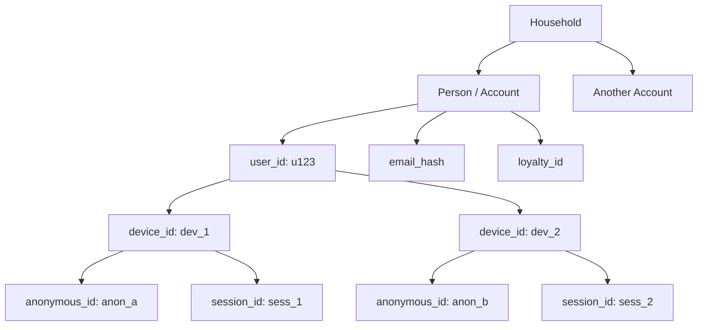
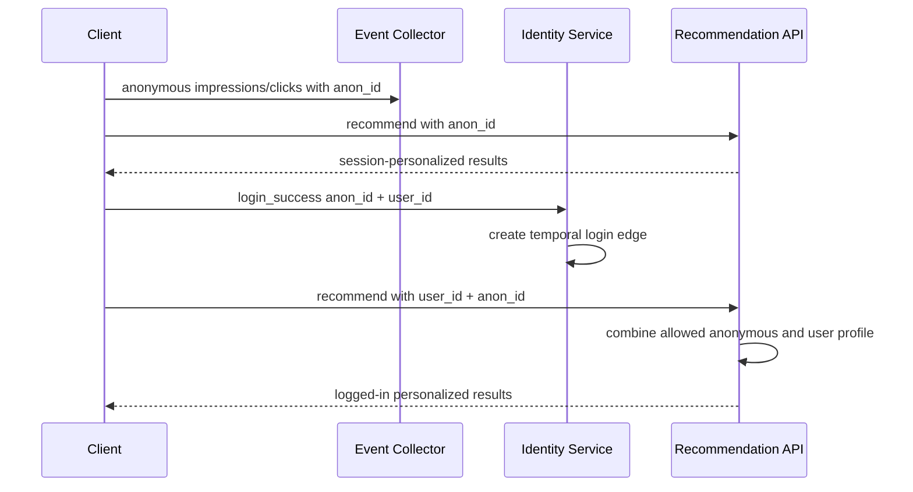
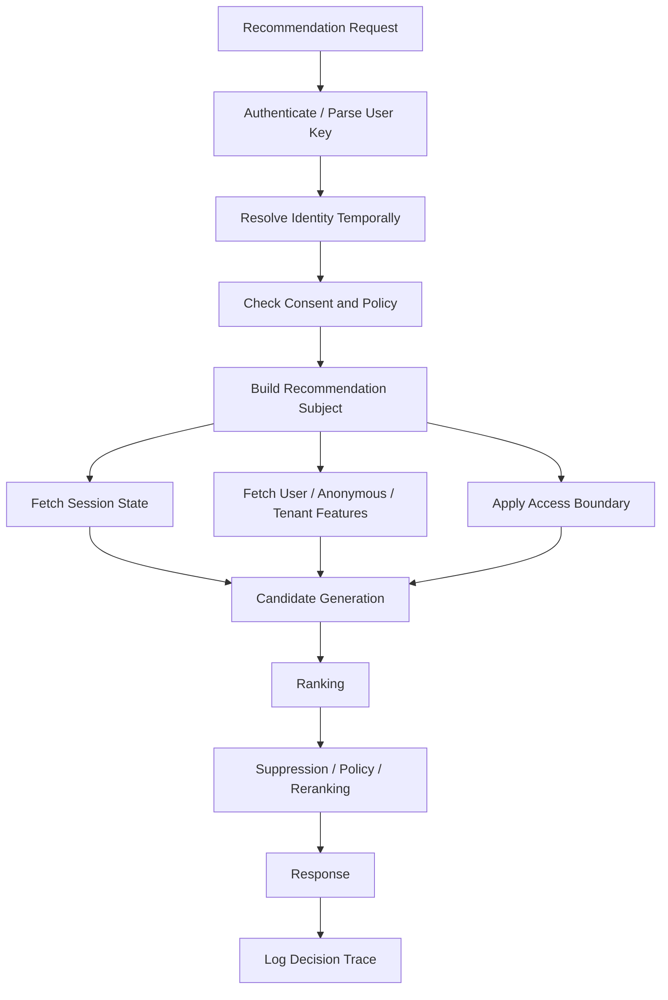

------
title: Build From Scratch Recommendations System - Part 008
description: Membangun fondasi identity, session, dan device graph untuk recommendation system production-grade: anonymous user, logged-in user, account merge, household, sessionization, leakage control, dan privacy boundary.
series: learn-build-from-scratch-recommendations-system
seriesTitle: Build From Scratch: Enterprise Recommendations System
order: 8
partTitle: User Identity, Session, and Device Graph
tags:
  - recommendation-system
  - recsys
  - identity
  - sessionization
  - personalization
  - privacy
  - mlops
  - series
date: 2026-07-02
---

# Part 008 — User Identity, Session, and Device Graph

Recommendation system membutuhkan jawaban atas pertanyaan yang terlihat sederhana:

> “User ini siapa?”

Di sistem kecil, jawabannya sering dianggap mudah: pakai `user_id`.

Di sistem production, pertanyaan itu jauh lebih sulit.

User bisa anonymous. User bisa login di beberapa device. Satu device bisa dipakai banyak orang. Satu orang bisa punya banyak akun. Akun bisa digabung. Browser cookie bisa hilang. Mobile advertising ID bisa berubah. Household bisa berbagi TV. B2B user bisa bertindak atas nama organisasi. Consent bisa berubah. User bisa meminta penghapusan data. Session bisa putus karena idle. Bot bisa meniru user. Internal tester bisa mencemari feedback loop.

Kalau identity model salah, personalization salah.

Kalau session model salah, short-term intent salah.

Kalau device graph salah, data leakage terjadi.

Kalau merge policy salah, training data bisa mengandung future knowledge.

Part ini membahas fondasi identity, session, dan device graph dari sudut pandang recommendation system production-grade.

---

## 1. Mental Model: Identity Bukan Satu Kolom

Kesalahan umum:

```sql
user_id VARCHAR NOT NULL
```

Lalu semua feature, event, training label, experiment, dan recommendation state digantungkan ke `user_id`.

Masalahnya:

- user anonymous tidak punya user_id,
- user belum login tetapi tetap perlu rekomendasi,
- user login setelah beberapa event anonymous,
- user logout tetapi cookie masih ada,
- satu device dipakai lebih dari satu user,
- satu user memakai beberapa device,
- account merge mengubah relasi historis,
- consent bisa menonaktifkan personalization,
- beberapa domain tidak memakai person-level identity sama sekali.

Identity production lebih tepat dimodelkan sebagai **graph of identifiers**.



Namun graph ini tidak boleh dipakai sembarangan. Tidak semua edge punya confidence yang sama. Tidak semua edge boleh dipakai untuk personalization. Tidak semua edge boleh dipakai untuk training.

---

## 2. Identity Types

Kita mulai dengan jenis identity yang umum.

### 2.1 Anonymous ID

Anonymous ID biasanya dibuat sebelum login.

Contoh:

```json
{
  "anonymous_id": "anon_8f2d..."
}
```

Dipakai untuk:

- cold-start recommendation,
- session personalization,
- pre-login behavior,
- experiment bucketing untuk anonymous traffic,
- conversion attribution sebelum login.

Risiko:

- cookie bisa hilang,
- browser privacy setting bisa menghapus ID,
- anonymous_id bisa berganti,
- satu anonymous_id bisa dipakai beberapa orang,
- tidak boleh dianggap sebagai person identity mutlak.

### 2.2 User ID

User ID adalah account identifier internal.

```json
{
  "user_id": "u123"
}
```

Dipakai untuk:

- logged-in personalization,
- long-term profile,
- purchase history,
- entitlement,
- saved preference,
- recommendation suppression state,
- consent state.

Risiko:

- satu orang bisa punya banyak akun,
- satu akun bisa dipakai banyak orang,
- account merge/split bisa terjadi,
- user_id bisa tidak boleh dipakai untuk sebagian purpose jika consent tidak ada.

### 2.3 Device ID

Device ID mewakili perangkat.

```json
{
  "device_id": "dev_abc"
}
```

Dipakai untuk:

- device-specific context,
- push notification,
- fraud signal,
- continuity untuk anonymous user,
- sessionization.

Risiko:

- perangkat bisa dipakai bersama,
- perangkat bisa dijual/dipindahkan,
- device reset mengubah ID,
- terlalu agresif memakai device graph bisa melanggar privacy expectation.

### 2.4 Session ID

Session ID mewakili rangkaian aktivitas berdekatan.

```json
{
  "session_id": "sess_20260702_abc"
}
```

Dipakai untuk:

- short-term intent,
- sequence recommendation,
- feed pagination,
- session-level exploration,
- conversion path,
- real-time personalization.

Risiko:

- session boundary salah,
- background app membuat session terlalu panjang,
- web tab idle mengacaukan dwell,
- multi-tab membuat session bercabang,
- user intent bisa berubah dalam satu session.

### 2.5 Household ID

Untuk TV, streaming, smart speaker, dan shared commerce, person-level identity kadang tidak cukup.

```json
{
  "household_id": "hh_123"
}
```

Risiko:

- rekomendasi anak dan dewasa bercampur,
- private preference terbuka ke anggota lain,
- item sensitif muncul di shared surface,
- fairness measurement person-level rusak.

Household personalization harus jauh lebih hati-hati.

### 2.6 Organization / Tenant ID

Untuk B2B recommendation:

```json
{
  "tenant_id": "tenant_001",
  "organization_id": "org_123",
  "user_id": "u456"
}
```

Rekomendasi bisa bergantung pada:

- role,
- permission,
- department,
- case ownership,
- regulatory scope,
- region,
- data access boundary.

Di enterprise, identity bukan hanya “siapa user”, tetapi juga “dalam kapasitas apa user bertindak”.

---

## 3. Identity Envelope dalam Event

Event tidak boleh hanya membawa satu ID.

Gunakan envelope eksplisit.

```json
"user_key": {
  "user_id": "u123",
  "anonymous_id": "anon_789",
  "device_id": "dev_456",
  "session_id": "sess_abc",
  "household_id": null,
  "tenant_id": "tenant_001"
}
```

Namun field yang ada tidak berarti semuanya boleh dipakai untuk semua tujuan. Tambahkan policy context.

```json
"identity_policy": {
  "personalization_allowed": true,
  "cross_device_allowed": false,
  "household_personalization_allowed": false,
  "consent_version": "consent-v4",
  "identity_resolution_version": "idres-20260701"
}
```

Kenapa `identity_resolution_version` penting?

Karena graph identity bisa berubah. Kalau event lama dianalisis dengan graph baru tanpa versioning, hasil historical training bisa berubah diam-diam.

---

## 4. Identity Resolution

Identity resolution adalah proses menghubungkan beberapa identifier.

Contoh edge:

```json
{
  "from": {
    "type": "anonymous_id",
    "value": "anon_789"
  },
  "to": {
    "type": "user_id",
    "value": "u123"
  },
  "edge_type": "login_link",
  "confidence": 1.0,
  "valid_from": "2026-07-02T10:00:00Z",
  "valid_to": null,
  "source_event": "login_success"
}
```

Jenis edge:

- login link,
- logout unlink,
- account merge,
- account split,
- device association,
- household association,
- organization membership,
- consent grant,
- consent revoke.

Identity graph harus temporal. Edge berlaku dari waktu tertentu, bukan sepanjang sejarah.

---

## 5. Temporal Identity: Jangan Pakai Graph Masa Depan

Ini salah satu sumber leakage yang berbahaya.

Misal:

- 1 Juli: anonymous user melihat banyak produk kamera.
- 5 Juli: user login sebagai `u123`.
- 10 Juli: model training untuk data 1 Juli memakai identity graph terbaru dan menganggap event 1 Juli sudah milik `u123`.

Apakah ini salah?

Tergantung use case. Untuk historical understanding mungkin oke. Untuk point-in-time training, ini bisa menjadi leakage jika model pada 1 Juli seharusnya belum tahu bahwa anonymous user adalah `u123`.

Training data harus memakai identity graph sesuai waktu decision.

```text
identity_at(event_time), bukan identity_now()
```

Ini mirip point-in-time correctness pada feature store.

Rule:

> Untuk training dan offline evaluation, resolve identity secara temporal.

---

## 6. Account Merge dan Split

Account merge terjadi ketika dua identity digabung.

Contoh:

- user daftar dengan email A,
- lalu login via Google,
- sistem menyadari keduanya orang yang sama,
- akun digabung.

Naifnya:

```text
move all history from old_user_id to new_user_id
```

Masalah:

- training data historis berubah,
- experiment attribution bisa rusak,
- privacy deletion bisa salah,
- suppression state bercampur,
- recommendation tiba-tiba berubah drastis,
- user bisa melihat item yang pernah dikonsumsi akun lain.

Lebih baik menyimpan event identity asli dan membuat resolution layer temporal.

```json
{
  "canonical_user_id": "u123",
  "linked_user_ids": ["u_old_1", "u_google_9"],
  "merge_time": "2026-07-02T10:00:00Z",
  "merge_reason": "verified_same_email",
  "merge_confidence": 1.0
}
```

Account split juga perlu didukung. Misal, dua user ternyata salah digabung. Kalau sistem tidak bisa split, data contamination permanen.

---

## 7. Anonymous-to-Logged-In Transition

Ini flow penting untuk recommendation.



Pertanyaan desain:

1. Apakah behavior anonymous sebelum login langsung masuk user profile?
2. Apakah hanya behavior dalam session aktif yang dipakai?
3. Apakah harus menunggu consent?
4. Apakah behavior anonymous dari shared device boleh dipakai?
5. Apakah experiment assignment berubah setelah login?
6. Apakah suppression state anonymous digabung?

Jawaban default yang aman:

- gunakan anonymous recent session untuk short-term personalization setelah login,
- jangan langsung menggabungkan semua anonymous history ke long-term profile tanpa policy,
- simpan link temporal,
- gunakan consent-aware merge,
- jangan mengubah attribution event lama secara destruktif.

---

## 8. Logout Semantics

Logout bukan sekadar menghapus token.

Untuk recommendation, logout berarti personalization boundary berubah.

Setelah logout:

- jangan pakai user-level private history di shared device,
- boleh pakai anonymous/session behavior baru jika consent mengizinkan,
- suppression state user-level tidak boleh bocor,
- cached recommendations harus invalidated,
- client cache harus dibersihkan untuk surface sensitif.

Event:

```json
{
  "event_name": "logout_success",
  "event_time": "2026-07-02T11:00:00Z",
  "user_key": {
    "user_id": "u123",
    "anonymous_id": "anon_789",
    "device_id": "dev_456"
  }
}
```

Identity graph bisa membuat edge `user_id -> device_id` menjadi inactive untuk personalization sejak logout.

---

## 9. Sessionization

Session adalah unit penting untuk short-term intent.

Contoh simple rule:

```text
new session if idle > 30 minutes
```

Tetapi production lebih rumit.

Session bisa dipengaruhi:

- app foreground/background,
- tab close/open,
- device sleep,
- video autoplay,
- long read,
- checkout flow,
- campaign landing,
- login/logout,
- tenant switch,
- marketplace context switch,
- role switch.

Sessionization rule harus versioned.

```json
{
  "session_id": "sess_abc",
  "session_rule_version": "session-v3",
  "started_at": "2026-07-02T10:00:00Z",
  "last_seen_at": "2026-07-02T10:25:00Z",
  "status": "active"
}
```

Kenapa versioning penting? Jika session rule berubah dari 30 menit idle ke 15 menit idle, sequence features dan session metrics berubah.

---

## 10. Session vs Long-Term Profile

Rekomendasi harus menyeimbangkan:

- long-term preference,
- short-term intent.

Contoh:

Long-term user suka buku arsitektur software. Tetapi session sekarang user mencari stroller bayi sebagai hadiah. Kalau sistem terlalu long-term, rekomendasi tetap software. Kalau terlalu session-based, profil jangka panjang terabaikan.

Model mental:

```text
recommendation_context =
  long_term_user_profile
  + recent_session_intent
  + current_surface_intent
  + business/policy constraints
```

Session signal biasanya lebih tinggi bobotnya untuk:

- search result,
- product detail related items,
- shopping session,
- video next-up,
- news feed during breaking event,
- support case workflow.

Long-term signal lebih tinggi bobotnya untuk:

- homepage,
- email digest,
- subscription content,
- personalized discovery,
- account-level recommendations.

---

## 11. Session State Store

Recommendation API sering butuh state terbaru.

Contoh session state:

```json
{
  "session_id": "sess_abc",
  "recent_item_views": ["item_1", "item_2", "item_3"],
  "recent_clicks": ["item_2"],
  "recent_categories": {
    "camera": 5,
    "lens": 3
  },
  "recent_search_queries": ["mirrorless camera"],
  "last_surface": "product_detail",
  "last_event_time": "2026-07-02T10:12:00Z"
}
```

Session state harus:

- low latency,
- TTL-based,
- privacy-aware,
- reset on logout if needed,
- robust terhadap duplicate/out-of-order events,
- tidak menjadi source of truth permanen.

Session state adalah serving optimization, bukan canonical history.

---

## 12. Device Graph

Device graph menghubungkan device dengan user/account/household.

Contoh:

```json
{
  "device_id": "dev_456",
  "linked_users": [
    {
      "user_id": "u123",
      "confidence": 1.0,
      "source": "login",
      "valid_from": "2026-07-01T09:00:00Z",
      "valid_to": null
    },
    {
      "user_id": "u999",
      "confidence": 0.7,
      "source": "shared_usage_pattern",
      "valid_from": "2026-06-15T00:00:00Z",
      "valid_to": null
    }
  ]
}
```

Namun jangan otomatis memakai semua linked users untuk personalization.

Use case aman:

- fraud detection,
- session continuity,
- device-specific notification,
- anonymous recommendation.

Use case riskier:

- cross-device personalization,
- household-level inference,
- sensitive category recommendation,
- merging private behavior.

Device graph harus punya policy layer.

---

## 13. Shared Device Problem

Contoh klasik: satu tablet keluarga.

Jika anak menonton kartun, lalu orang tua membuka aplikasi e-commerce, rekomendasi bisa tercampur.

Risiko:

- irrelevant recommendation,
- privacy breach,
- unsafe content,
- embarrassment,
- regulatory issue untuk anak,
- trust erosion.

Mitigasi:

1. Profile switcher.
2. Child mode.
3. Household mode.
4. Sensitive category suppression.
5. Explicit “not me” feedback.
6. Session-level reset.
7. Avoid using private user history after logout.
8. Confidence threshold sebelum cross-user transfer.

Untuk shared surface, sistem harus konservatif.

---

## 14. Household Recommendation

Household recommendation berguna untuk:

- streaming TV,
- smart speaker,
- family shopping,
- shared subscription,
- connected device.

Tetapi objective berubah. Kita tidak lagi mengoptimalkan satu user, melainkan group.

Possible strategies:

1. **Least misery**  
   Hindari item yang sangat tidak disukai salah satu anggota.

2. **Average preference**  
   Rata-rata affinity anggota household.

3. **Dominant current user**  
   Jika current viewer terdeteksi, gunakan user tersebut.

4. **Session-based household**  
   Gunakan aktivitas terbaru sebagai intent.

5. **Safe generic fallback**  
   Untuk kategori sensitif, gunakan popular/trending yang aman.

Household recommendation harus sadar privacy. Jangan memperlihatkan sinyal pribadi satu anggota kepada anggota lain.

---

## 15. Identity Confidence

Tidak semua identity edge setara.

Contoh confidence:

```text
login same account          = 1.0
verified email match        = 0.95
same payment instrument     = 0.9
same device recent login    = 0.8
same IP + behavior pattern  = 0.4
```

Untuk recommendation, gunakan threshold berbeda:

```text
security/fraud analysis      may use low-confidence signals
personalization              needs higher confidence
sensitive personalization    needs very high confidence
account merge                needs verified evidence
```

Jangan memakai probabilistic identity edge untuk irreversible account merge.

---

## 16. Consent-Aware Identity

User bisa memberi consent untuk analytics tetapi tidak untuk personalization.

Identity layer harus membawa purpose.

Contoh:

```json
{
  "subject_id": "u123",
  "consents": {
    "analytics": {
      "allowed": true,
      "version": "v3",
      "updated_at": "2026-07-01T00:00:00Z"
    },
    "personalization": {
      "allowed": false,
      "version": "v3",
      "updated_at": "2026-07-01T00:00:00Z"
    },
    "cross_device": {
      "allowed": false,
      "version": "v2",
      "updated_at": "2026-07-01T00:00:00Z"
    }
  }
}
```

Recommendation service tidak boleh hanya bertanya:

```text
getProfile(user_id)
```

Ia harus bertanya:

```text
getProfile(user_id, purpose = personalization, context = surface)
```

Kalau consent tidak mengizinkan, fallback ke non-personalized atau contextual recommendation.

---

## 17. Deletion and Right-to-be-Forgotten Semantics

Untuk production enterprise, identity harus mendukung deletion.

Pertanyaan sulit:

1. Jika user meminta deletion, apakah event historis dihapus?
2. Apakah aggregate feature harus dikurangi?
3. Apakah model yang sudah dilatih dari data user harus retrain?
4. Apakah embeddings user dihapus?
5. Apakah anonymous linked ID juga dihapus?
6. Apakah audit log tetap disimpan dengan legal basis berbeda?

Secara desain, sistem harus tahu lokasi data turunan:

```text
raw events
offline features
online features
user embeddings
training datasets
model artifacts
experiment logs
debug traces
recommendation caches
vector indexes
aggregates
```

Identity graph membantu menemukan semua linked identifiers yang perlu diproses.

Minimal, setiap derived data harus punya lineage ke identity subject atau deletion strategy yang jelas.

---

## 18. B2B Identity: Acting As Role

Dalam enterprise recommendation, user sering bertindak dalam role tertentu.

Contoh:

- compliance officer,
- case investigator,
- supervisor,
- branch manager,
- customer support agent,
- tenant admin.

User yang sama bisa punya rekomendasi berbeda tergantung role.

```json
{
  "actor": {
    "user_id": "u123",
    "tenant_id": "bank_001",
    "role": "case_investigator",
    "permissions": ["case:read", "escalation:recommend"]
  },
  "acting_context": {
    "case_id": "case_789",
    "jurisdiction": "ID",
    "business_unit": "retail_banking"
  }
}
```

Untuk B2B/regulatory system, personalization tidak boleh melanggar access control.

Rule:

> Recommendation must never reveal an entity the actor is not allowed to access.

Identity dan authorization harus masuk sebelum retrieval, bukan hanya setelah ranking.

---

## 19. Identity in Recommendation API

Request API sebaiknya eksplisit.

```json
{
  "request_id": "req_001",
  "surface": "home_feed",
  "user_key": {
    "user_id": "u123",
    "anonymous_id": "anon_789",
    "device_id": "dev_456",
    "session_id": "sess_abc",
    "tenant_id": null
  },
  "identity_context": {
    "auth_state": "authenticated",
    "profile_mode": "personal",
    "consent_personalization": true,
    "cross_device_allowed": false
  },
  "context": {
    "locale": "id-ID",
    "device_type": "mobile"
  }
}
```

Recommendation service tidak boleh diam-diam melakukan identity expansion tanpa policy. Kalau akan memakai cross-device signal, request/decision trace harus mencatatnya.

---

## 20. Identity in Feature Store

Feature key harus jelas.

Contoh feature view:

```text
user_category_affinity:user_id
anonymous_recent_category_affinity:anonymous_id
session_recent_clicks:session_id
device_recent_views:device_id
tenant_popular_items:tenant_id
household_watch_affinity:household_id
```

Jangan mencampur key.

Anti-pattern:

```text
profile_id = user_id if exists else anonymous_id else device_id
```

Ini terlihat praktis, tetapi berbahaya karena semantic key berubah. Feature `profile_id_category_affinity` bisa berisi person-level, anonymous-level, atau device-level signal tanpa distinction.

Lebih baik feature typed.

```text
entity_type + entity_id + feature_name
```

---

## 21. Identity in Training Dataset

Training example harus menyimpan identity keys yang digunakan saat decision.

Contoh:

```json
{
  "training_example_id": "ex_001",
  "event_time": "2026-07-02T10:00:01Z",
  "surface": "home_feed",
  "item_id": "item_101",
  "identity_resolution": {
    "version": "idres-20260701",
    "used_user_id": "u123",
    "used_anonymous_id": "anon_789",
    "used_session_id": "sess_abc",
    "cross_device_used": false
  },
  "label": {
    "clicked_within_30m": 1
  }
}
```

Ini membantu menjawab:

- model dilatih dengan identity policy mana?
- apakah anonymous behavior digabung ke user?
- apakah cross-device signal dipakai?
- apakah training bisa direproduksi?

---

## 22. Experiment Bucketing and Identity

Experiment assignment harus memilih unit.

Pilihan umum:

- user_id,
- anonymous_id,
- device_id,
- session_id,
- household_id,
- tenant_id.

Trade-off:

### Bucketing by user_id

Stabil untuk logged-in user, tetapi anonymous traffic tidak tercakup.

### Bucketing by anonymous_id

Cocok untuk pre-login, tetapi berubah saat cookie hilang dan bisa conflict saat login.

### Bucketing by device_id

Stabil di device, tetapi shared-device issue.

### Bucketing by session_id

Cocok untuk short-lived experiment, tetapi user bisa masuk banyak variant di session berbeda.

### Bucketing by tenant_id

Cocok untuk B2B, tetapi sample size kecil dan tenant heterogeneity tinggi.

Masalah login transition:

```text
anonymous variant A -> login -> user variant B
```

Ini bisa membuat user mengalami dua treatment dalam satu journey.

Policy harus eksplisit:

1. preserve anonymous assignment after login for active experiment,
2. reassign by user_id after login,
3. exclude transition sessions,
4. use deterministic identity stitching for assignment.

Tidak ada jawaban universal. Yang penting: event harus mencatat policy.

---

## 23. Identity and Suppression State

Recommendation perlu suppression:

- already seen,
- already bought,
- already watched,
- hidden,
- disliked,
- blocked creator,
- frequency cap,
- cooldown.

Suppression state bisa berada di level:

- user,
- anonymous,
- session,
- device,
- household,
- tenant.

Contoh:

```json
{
  "subject": {
    "type": "user_id",
    "id": "u123"
  },
  "suppression": {
    "item_id": "item_101",
    "reason": "purchased",
    "valid_from": "2026-07-02T10:30:00Z",
    "valid_until": null
  }
}
```

Jangan selalu menerapkan user suppression ke household. Jika satu anggota membeli hadiah, tidak berarti item harus disuppress untuk semua household.

Untuk B2B, suppression bisa entity-specific:

```text
agent u123 already handled case template X in case case_789
```

---

## 24. Identity and Cache Keys

Caching recommendation berbahaya jika identity key salah.

Anti-pattern:

```text
cache_key = surface + user_id
```

Ini mengabaikan:

- session intent,
- consent,
- experiment variant,
- locale,
- device,
- pagination cursor,
- profile mode,
- model version,
- tenant,
- policy version.

Lebih baik:

```text
cache_key =
  surface
  + recommendation_subject
  + session_bucket
  + experiment_assignment_hash
  + locale
  + policy_version
  + model_version
  + consent_state
```

Namun semakin detail key, cache hit rate turun. Ini trade-off normal.

Aturan minimal:

> Jangan pernah menyajikan cached personalized response ke identity context yang berbeda.

Logout harus invalidate cache sensitif.

---

## 25. Identity and Debugging

Debug trace harus menyatakan identity yang dipakai.

Contoh debug summary:

```json
{
  "identity_debug": {
    "auth_state": "authenticated",
    "resolved_subject": {
      "type": "user_id",
      "id": "u123"
    },
    "session_id": "sess_abc",
    "anonymous_id_used": true,
    "cross_device_used": false,
    "household_used": false,
    "consent_personalization": true,
    "identity_resolution_version": "idres-20260701"
  }
}
```

Tanpa ini, engineer hanya melihat “ranker memilih item buruk”, padahal masalahnya bisa identity salah:

- user dianggap anonymous,
- session reset,
- cross-device disabled,
- wrong tenant,
- stale profile,
- cache bocor,
- account merge baru terjadi,
- consent revoked.

---

## 26. Identity Failure Modes

### 26.1 User Treated as Anonymous

Efek:

- rekomendasi terlalu generic,
- long-term preference hilang,
- suppression tidak bekerja,
- user melihat item yang sudah dibeli.

Penyebab:

- token expired,
- identity service timeout,
- client tidak mengirim user_id,
- privacy consent false,
- profile store gagal.

### 26.2 Anonymous History Over-Merged

Efek:

- profil user tercemar behavior orang lain,
- shared device leak,
- rekomendasi memalukan,
- training bias.

Penyebab:

- anonymous_id dari shared browser langsung digabung ke user profile permanen.

### 26.3 Cross-Device Leakage

Efek:

- aktivitas di device A muncul di device B tanpa ekspektasi user,
- privacy concern.

Penyebab:

- device graph terlalu agresif,
- consent tidak dicek.

### 26.4 Experiment Assignment Flip

Efek:

- user pindah variant,
- metric bias,
- inconsistent UX.

Penyebab:

- anonymous-to-user transition tidak punya assignment policy.

### 26.5 Session Boundary Wrong

Efek:

- short-term intent terlalu panjang atau terlalu pendek,
- sequence model belajar pattern salah,
- dwell/conversion attribution salah.

### 26.6 Wrong Tenant or Role

Efek:

- B2B recommendation membuka data yang tidak boleh diakses,
- regulatory breach.

Penyebab:

- tenant_id tidak masuk feature/retrieval filter,
- access control dilakukan terlambat.

---

## 27. Architecture: Identity-Aware Recommendation Flow



Important invariant:

```text
access boundary and consent must be applied before sensitive feature usage and retrieval expansion
```

Jangan menunggu sampai final filter jika retrieval source sudah bisa membocorkan keberadaan item.

---

## 28. Designing Recommendation Subject

Daripada semua layer menerima raw user_id, buat abstraction:

```json
{
  "recommendation_subject": {
    "subject_type": "authenticated_user",
    "primary_key": {
      "type": "user_id",
      "id": "u123"
    },
    "secondary_keys": [
      {
        "type": "anonymous_id",
        "id": "anon_789",
        "usage": "recent_session_only"
      },
      {
        "type": "session_id",
        "id": "sess_abc",
        "usage": "short_term_intent"
      }
    ],
    "disabled_keys": [
      {
        "type": "device_id",
        "id": "dev_456",
        "reason": "cross_device_not_allowed"
      }
    ]
  }
}
```

Ini memaksa sistem eksplisit tentang identity yang dipakai.

Candidate generation, ranking, feature fetch, dan cache bisa membaca object ini.

---

## 29. Implementation Sketch: Identity Service Contract

Contoh API internal:

```http
POST /identity/resolve
```

Request:

```json
{
  "request_time": "2026-07-02T10:00:00Z",
  "user_key": {
    "user_id": "u123",
    "anonymous_id": "anon_789",
    "device_id": "dev_456",
    "session_id": "sess_abc",
    "tenant_id": null
  },
  "purpose": "recommendation_personalization",
  "surface": "home_feed"
}
```

Response:

```json
{
  "resolution_version": "idres-20260701",
  "subject": {
    "type": "authenticated_user",
    "id": "u123"
  },
  "allowed_keys": [
    {
      "type": "user_id",
      "id": "u123",
      "usage": ["long_term_profile", "suppression"]
    },
    {
      "type": "session_id",
      "id": "sess_abc",
      "usage": ["short_term_intent"]
    },
    {
      "type": "anonymous_id",
      "id": "anon_789",
      "usage": ["current_session_recent_events"]
    }
  ],
  "blocked_keys": [
    {
      "type": "device_id",
      "id": "dev_456",
      "reason": "cross_device_consent_missing"
    }
  ],
  "consent": {
    "personalization": true,
    "cross_device": false
  }
}
```

Recommendation service tidak perlu tahu semua detail identity graph. Ia perlu keputusan yang eksplisit dan auditable.

---

## 30. Minimal Production Design

Untuk versi awal yang tetap sehat, implementasikan:

1. `anonymous_id`, `user_id`, `device_id`, `session_id`.
2. Login edge dari anonymous ke user.
3. Logout event.
4. Sessionization rule versioned.
5. Consent flag untuk personalization.
6. Recommendation subject builder.
7. Typed feature keys.
8. Suppression state per identity type.
9. Experiment assignment policy untuk anonymous-to-user transition.
10. Debug trace berisi identity resolution.

Jangan langsung membangun probabilistic identity graph kompleks. Mulai dari deterministic edges:

- login,
- verified account,
- explicit profile switch,
- tenant membership.

Probabilistic device graph bisa ditambahkan setelah observability dan privacy boundary matang.

---

## 31. Checklist Identity Readiness

```text
[ ] Event membawa user_id dan anonymous_id jika tersedia.
[ ] Sistem tidak memaksa semua traffic authenticated.
[ ] Session_id punya rule version.
[ ] Identity graph menyimpan valid_from dan valid_to.
[ ] Identity resolution bisa point-in-time.
[ ] Login transition policy jelas.
[ ] Logout menghapus personalization boundary yang sensitif.
[ ] Anonymous history merge policy jelas.
[ ] Consent dicek sebelum personalization.
[ ] Cross-device personalization punya policy eksplisit.
[ ] Shared device risk dimitigasi.
[ ] Household recommendation tidak membocorkan preference pribadi.
[ ] Tenant/role masuk recommendation context untuk B2B.
[ ] Feature key typed by identity type.
[ ] Cache key memasukkan identity context penting.
[ ] Experiment bucketing unit jelas.
[ ] Suppression state scoped dengan benar.
[ ] Debug trace mencatat identity resolution.
[ ] Deletion workflow tahu linked identifiers.
```

---

## 32. Kesimpulan

Identity adalah fondasi personalisasi. Tetapi identity bukan satu kolom `user_id`. Identity adalah graph temporal yang harus dipakai dengan policy, consent, purpose, dan context.

Prinsip utama:

1. Modelkan anonymous, user, device, session, household, dan tenant sebagai identity berbeda.
2. Jangan mencampur semantic identity dalam satu generic profile key.
3. Identity graph harus temporal.
4. Training harus memakai identity sesuai waktu decision.
5. Login merge tidak boleh menghancurkan historical truth.
6. Session adalah short-term intent, bukan pengganti user profile.
7. Device graph harus policy-aware.
8. Consent harus masuk ke serving path.
9. B2B recommendation harus identity + authorization aware.
10. Debug trace harus menunjukkan identity yang benar-benar dipakai.

Di Part 009, kita akan membahas **Item Catalog & Content Entity Modeling**: bagaimana item direpresentasikan agar sistem bisa merekomendasikan produk, video, artikel, job, case, knowledge article, dan entity enterprise tanpa kehilangan semantics.
